# MSCI INTEGRATED FACTOR CROWDING MODEL

Assessing Crowding Risks in Equity Factor Strategies George Bonne, Leon Roisenberg, Roman Kouzmenko, Peter Zangari June 2018

## EXECUTIVE SUMMARY

The increasing awareness of factors and growing popularity of factor investing have heightened the potential for crowding in factor strategies. Occasional but significant drawdown events in factor performance have highlighted the need for and potential value of a robust model of factor crowding that can alert investors to growing crowdedness in factor strategies.

We introduce the MSCI Integrated Factor Crowding Model to quantitatively assess the degree of crowding in factor strategies. The model examines crowding from multiple dimensions using a range of metrics, combining these into one standardized measure of factor crowding. Institutional investors can use the model to compare crowdedness across factors at a given point in time, to assess the crowdedness of one or more factors over time and to gain insight into the most important drivers of crowding. The model is designed to help investors make timely decisions on their positioning in potentially crowded or uncrowded factors.

The metrics we use are based on an intuitive model of the implications when too much capital chases the same strategies. The metrics are based on holdings, pricing and returnbased information, and include valuation spreads, short interest spreads, pairwise correlations, relative volatility and factor momentum. Our research indicates that each metric has implications for future factor volatility and performance. We also find that factors that appear crowded on our model had a much higher frequency (over seven times higher) of significant drawdowns in factor performance over the subsequent 12 months than factors that did not appear crowded.

## INTRODUCTION

A number of extreme market events, such as the failure of Long-Term Capital Management in 1998, the tech bubble and burst of the late 1990s and early 2000s, the quant crunch of August 2007 and the extreme drawdown in momentum factor performance during the 2009 post-crisis market rebound, have heightened interest in and awareness of crowding and other drivers of extreme factor performance from both academics and practitioners. These events were driven at least in part by too much capital chasing, or liquidating, the same strategies – essentially strategy crowding.

A related issue is strategy capacity. While both capacity and crowding are concerned with the implications of how much capital is following a given strategy, we distinguish capacity from crowding in that capacity is more concerned with the impact of the level of allocated capital on the overall long-term expected risk and return of a strategy (Alighanbari and Doole, 2018) whereas crowding is more concerned with crisis dynamics and a strategy’s behavior in tail events. Because the absolute amount of capital following a given strategy is difficult to estimate, most measures of crowding are constructed on a relative basis. For example, previous measures of crowding have included:

- How expensive a particular group of securities is relative to their history or another reference group

- How correlated a group of securities or funds is relative to their past

- How heavily owned by institutions a group of securities is relative to their history or another reference group

The MSCI Integrated Factor Crowding Model builds on our earlier research in crowding (Bayraktar, 2015a). Most crowding research has focused on measures derived from two angles – holdings and pricing or returns. Holdings-based information can be obtained from regulatory filings of institutions, such as the U.S. Securities and Exchange Commission Form 13F, or other publicly available sources, such as securities-lending data for short interest.

## HOLDINGS-BASED ANALYSIS

Using a holdings-based analysis, Gustafson and Halper (2010) examined correlations in active returns and holdings of a sample of 33 funds over the 1992-2009 period and found significant variation in the rolling correlation of active returns but no secular trend. Chue (2015) examined returns of mutual funds and found that those top-performing funds whose performance was highly correlated to the average top-performing fund tended to perform more poorly henceforth than top-performing funds whose performance was more idiosyncratic or more correlated to poor-performing funds. Chue suggests that crowding could be a driver of the subsequent degradation in performance among the top-performing “conformist” funds that behaved similarly. Zhong et al. (2017) used mutual-fund holdings data to construct a security-level, mutual-fund crowding measure, defined as the shares owned by active mutual funds normalized by average trading volume. They found that the least crowded stocks produced significant positive abnormal returns while the most crowded stocks produced negative abnormal returns. Greenwood and Thesmar (2011) constructed a crowding or “fragility” measure based on mutual-fund positions and flows. Their measure is high when ownership is concentrated or when owners face correlated liquidity shocks, and they find that it is predictive of future volatility.

A number of studies have also used short-interest data to measure crowding. For example, Hanson and Sunderam (2014) used short-interest data to infer the level of “arbitrage capital” following a given factor strategy by calculating the difference in short interest among bottom decile stocks of a factor compared to top decile stocks, controlling for common risk factors. They found that the level of arbitrage capital had a negative relationship with future factor returns.

While holdings data have the intuitive appeal of providing more direct measures of investment in a security or strategy, a drawback is that these data are often updated infrequently and have a significant lag in availability. For example, 13 F filings are reported only quarterly, and the reporting deadline is 45 days after quarter-end. Other public holdings data, such as for short interest, are available at a higher frequency and with less delay.

## PRICING OR RETURN-BASED ANALYSIS

Although pricing and return-based crowding metrics are more indirect measures, they can be updated more frequently and with no lag between measurement and reporting. However, some metrics, such as return correlations, require history to calculate. Intuitively, one might expect that as a strategy becomes more crowded the stocks tied to that strategy will increase their tendency to move together (correlation), and that their movements may become more volatile. In this vein, Lou and Polk (2013) examined correlations of top- and bottom-decile stocks of the momentum factor, and found future momentum returns were lower when correlations were high. Wang and Xu (2015) found that market volatility has predictive power in the performance of momentum, largely driven by the performance of the low momentum stocks. Conceptually, it is intuitive that turning points would be defined by high volatility, as changes in views or sentiment drive increased volatility. Daniel and Moskowitz (2016) examined momentum returns from 1926 to 2013, focusing on periods of severe underperformance, and also found that high market volatility was associated with poor future momentum performance.

In addition, one would expect crowding in a strategy to drive differences in valuation between stocks that are crowded and those that are not. To capture this effect, many studies have examined differences in valuation between top- and bottom-rated stocks of a factor, finding such differences to be indicators of future factor performance. For example, Asness et al. (2000) used a composite based on Book/Price (B/P), forecasted Earnings/Price (E/P) and Sales/Enterprise Value (S/EV) along with a forecast growth spread between topand bottom-decile value stocks, and found both spreads in value and forecast growth had power in forecasting future value factor performance. Similarly, Cohen et al. (2003) found that the return of the B/P (HML) factor is predictable by the HML value spread. Recently, Yara et al. (2018) examined the relationship of the value spread to value factor returns in equities, commodities, currencies and bonds, and found that returns to value strategies could be predicted to some extent by the value spread across all the asset classes. In creating our crowding measures, we have leveraged many of these studies, along with our own research, to create an integrated model of factor crowding.

## MSCI FACTOR CROWDING METRICS

The MSCI Integrated Factor Crowding Model brings together five measures of factor crowding, incorporating both holdings-based and return- and pricing-based metrics. The five metrics are each standardized in a time-series framework and then combined in a weighted average to create the final integrated score. For each metric, we examined its relationship with future factor returns and volatilities over the subsequent 2-year period, divided into four 6-month segments. We defined each metric such that large positive values indicate crowding; based on our conceptual model, we expect to observe negative correlations with future factor returns and positive correlations with future factor volatilities. In this beta version of the model, we examine factor crowding in the U.S. market using the MSCI Barra US Total Market Model (USTMM) factors (Bayraktar et al., 2015b). The five metrics are:

| Metric | Description |
| --- | --- |
| Valuation spread | Valuation of top vs. bottom quintile stocks of a factor, combining B/P, Sales/P, and forecasted E/P |
| Short Interest spread | Difference in short interest utilization ratio of bottom vs. top quintile stocks of a factor |
| Pairwise correlation | Average return correlation of stocks in top and bottom quintiles of factor to corresponding quintile average portfolio |
| Factor volatility | MSCI Barra model forecast factor volatility relative to forecast market volatility |
| Factor reversal | Cumulative trailing factor return over last 36 months |

## VALUATION SPREAD

Because large amounts of capital chasing a group of securities will result in them becoming more expensive than others that are not as crowded, valuation spread is an intuitively appealing metric. In our model, this metric measures the degree to which the top quintile stocks of a factor are expensive relative to the bottom quintile. The valuation spread measure of crowdedness will increase as top quintile stocks become more expensive relative to bottom quintile stocks. Specifically, we calculate the median B/P, Sales/Price (S/P) and forecast E/P among both the top and bottom quintile stocks of a factor, and then calculate the ratio or difference between the two. For B/P, we calculate the natural log of the ratio of

## (median B/P in bottom quintile of factor) / (median B/P in top quintile of factor)

In this formulation, large positive values are associated with relatively high degrees of crowding in the factor, as the denominator will be small relative to the numerator. We use the ratio of bottom quintile B/P to top quintile B/P, rather than the arithmetic difference, because the difference will be sensitive to overall market valuations, but the ratio will not. We use the same formulation with the S/P valuation ratio. However, because earnings yield can theoretically become negative or near zero, we use the difference for the forecast E/P valuation ratio. Specifically, we calculate

## (median E/P in bottom quintile of factor) - (median E/P in top quintile of factor)

We standardize each valuation spread using its own cumulative time series up to the given time, and then take the equal-weighted average of the three as the valuation spread metric for a given factor. We use median values rather than the mean, to prevent outliers from significantly influencing the standardization process. This is particularly important for B/P and earnings yield. Exhibit 1 below plots the correlations between the valuation metric and future factor returns and volatility.

Exhibit 1: How the Valuation Crowding Metric Correlated with Future Factor Returns and Volatilities
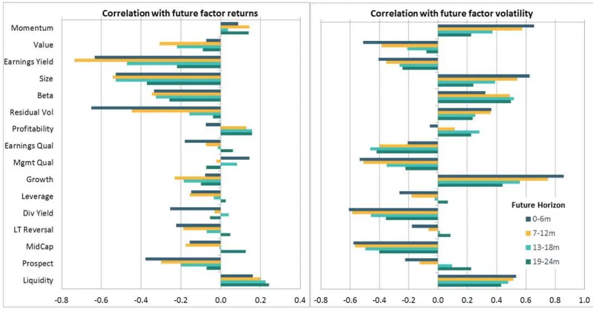
Sample period is 1996-2017, U.S. universe. We measure correlations in four 6-month horizons.
For most of the high volatility factors – momentum, value, earnings yield, size, beta and residual volatility – the valuation metric had a fairly strong negative correlation with future factor returns over the first (0-6 months) and second (7-12 months) 6-month periods, and then decayed as we looked farther out in time, as one would expect. The relationships with future factor volatility were not as consistent with this metric.

## SHORT INTEREST SPREAD

The short interest spread metric measures the difference in short interest, as measured by utilization rate (shares shorted divided by shares available to short), between the bottom and top quintile stocks of a factor, accounting for differences in shorting due to value, size and momentum factors. Heavy shorting in the bottom quintile relative to the top quintile will cause a high short interest crowding score. Because hedge funds account for a large fraction of short interest, heavy shorting in bottom quintile stocks is a potential indicator that hedge funds may be heavily invested in that factor. We implemented the same formulation as described in Bayraktar et al. (2015a), which is based on Hanson and Sunderam (2014). We performed a cross-sectional regression in which we regressed stocklevel short interest utilization rate on a set of quintile dummy indicator variables for the factor of interest and the size, value and momentum factors, as shown on the next page.

$$
\begin{array}{rl}&{SI=a_{factor}+k_{Q1,factor}I_{Q1,factor}+\cdots+k_{Q5,factor}I_{Q5,factor}+}\\&{\phantom{SIace}+k_{Q1,momentum}I_{Q1,momentum}+\cdots+k_{Q5,momentum}I_{Q5,momentum}+}\\&{\phantom{SIace}+k_{Q1,value}I_{Q1,value}+\cdots+k_{Q5,value}I_{Q5,value}+}\\&{\phantom{SIace}+k_{Q1,size}I_{Q1,size}+\cdots+k_{Q5,size}I_{Q5,size}}\\&{\phantom{SIace}ShortInterestspread=k_{Q1,factor}-k_{Q5,factor}}\end{array}
$$

where the $I_{QN}$ are indicator variables for the ${\mathsf{N}}^{\mathsf{th}}$ quintile of the given factor and SI is the short interest utilization rate. The raw value of our metric is then calculated as the difference between the regression coefficient of the bottom and top quintile dummies for the factor of interest. In the regression, we also omitted the middle quintile for the factor of interest. We used data over the trailing 63 trading days to reduce noise and increase the stability in our regression coefficients.

We standardized the raw short interest spread using the time series of the metric for each factor, employing an expanding cumulative window at each point in time. We used a factorspecific mean in the standardization but a global standard deviation (average standard deviation over all factors), to preserve a degree of absoluteness in the metric. In this way, the standardized value preserves the relative magnitude in de-meaned short interest spreads across factors. Exhibit 2 below displays the correlations between the short interest spread metric and future factor returns and volatilitiy.

Exhibit 2: How the Short Interest Crowding Metric Correlated with Future Factor Returns and Volatilities
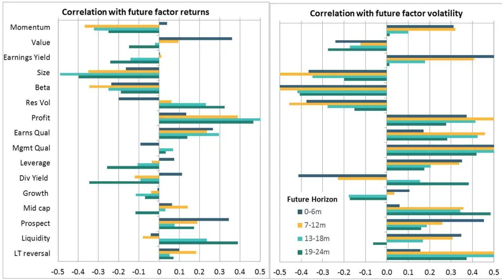
Sample period is 2007-2017, U.S. universe. Our short interest data history, and thus also our short interest spread crowding metric history, starts in 2007. We measure correlations in four 6-month horizons.

As with the valuation spread metric, we observe fairly consistent negative correlations with future factor returns among the high volatility factors, which are more prone to crowding.

## PAIRWISE CORRELATION

This metric measures the degree to which stocks of the top or bottom quintile of a factor move together, after accounting for movements due to the market, size, beta and residual volatility factors. If a factor is being heavily followed by investors, stocks with very high exposures to the factor will, in theory, tend to move together, as will stocks with very low exposure to the factor. This will cause high average pairwise correlation. For this metric, we implemented the same formulation as described in Bayraktar et al. (2015a), which is based on the framework of Lou and Polk (2013).

In this metric, we select the top quintile securities of a factor and for each security we measure its correlation with the top quintile average return, excluding the individual stock, using the past 63 trading days of daily returns. We do the same for the bottom quintile. We use specific returns, accounting for the standard risk factors of market, size, beta and residual volatility. We calculate the average pairwise correlation of the top and bottom quintiles separately, and then take the average of the two quintiles to create the raw value of the pairwise correlation metric for a given factor. We standardize the metric for each factor using a factor-specific mean and global standard deviation (average standard deviation over all factors) employing an expanding cumulative window at each point in time. Exhibit 3 below displays the relationships of the pairwise correlation metric with future factor returns and volatility.

Exhibit 3: How the Pairwise Correlation Crowding Metric Correlated with Future Factor Returns and Volatilities
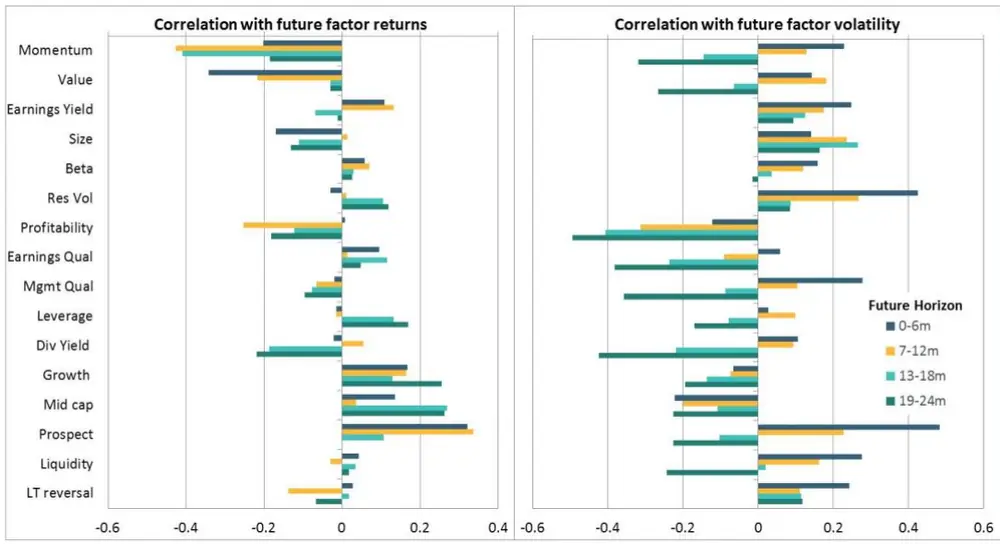
Sample period is 1996-2017, U.S. universe. We measure correlations in four 6-month horizons.

## FACTOR VOLATILITY

The relative volatility metric measures the degree to which a factor’s expected volatility is unusually high or low for the given market environment. If large amounts of capital are following a factor, the swings in factor returns are likely to increase, particularly if the factor reaches a turning point or sentiment starts to shift. Specifically, our relative volatility metric is defined by the Barra USTMM forecast factor volatility divided by the forecast volatility for the market factor. We normalized by the current market volatility so that the metric measures expected factor volatility after accounting for general market volatility. We standardized the metric for each factor using a time-series framework with an expanding cumulative window at each point in time.

As we know that volatility tends to cluster or exhibit serial correlation, we might expect the relative volatility metric to be positively correlated with future factor volatility. That is indeed what we observe, as Exhibit 4 shows.

Exhibit 4: How the Factor Volatility Metric Correlated with Future Factor Returns and Volatilities
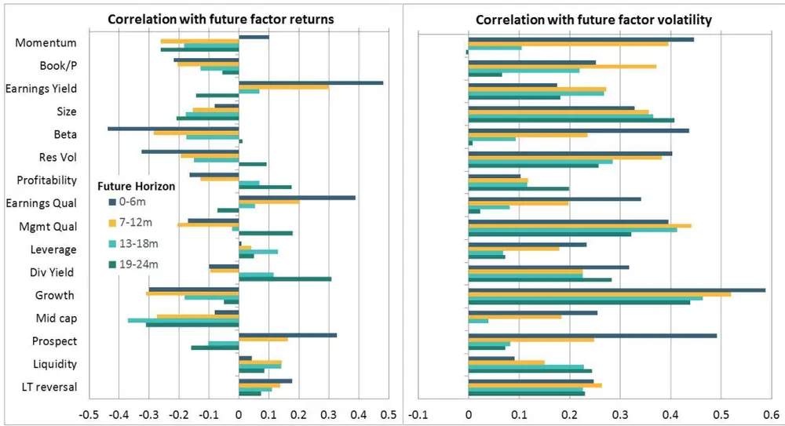
Sample period is 1996-2017, U.S. universe. We measure correlations in four 6-month horizons.

Nearly all the correlations with future factor volatilities were positive for each of the 6- month horizons. The correlation decayed as we moved beyond the first 12 months. We would expect decay in the correlation at some point, and it is notable that it takes about 12 months before it declines significantly. Again, as with valuation spread and short interest spread, largely negative correlations with future factor returns occurred, particularly for the most volatile factors.

## FACTOR REVERSAL

Because investors have a tendency to chase past performance, a factor that has done very well for some time is likely to have accumulated large amounts of capital. This performance chasing may initially provide a tailwind for factor performance, but eventually may set the stage for a drawdown or mean reversion when views or positioning change. Exceptionally strong performance does not typically last forever. For our factor reversal metric, we used a 3-year trailing window, which is consistent with the timeframe on which performance is evaluated for many funds. The phenomenon of long-term (3-5 year) reversal has been well known at the security level for some time (De Bondt and Thaler, 1985). Thus, our factor reversal metric is essentially the long-term reversal analog for factors. As with the other metrics, we standardized the factor reversal metric using a time-series framework. We standardized the raw trailing 3-year return for each factor using a factor-specific mean and global standard deviation (average standard deviation over all factors), employing an expanding cumulative window at each point in time.

In Exhibit 5, we show the correlations of the reversal factor crowding metric with future factor returns and volatilities. Once again, we see that among the high volatility factors, most of the correlations with future factor returns were negative, while those with future factor volatility were mostly positive.

Exhibit 5: How the Factor Reversal Crowding Metric Correlated with Future Factor Returns and Volatilities
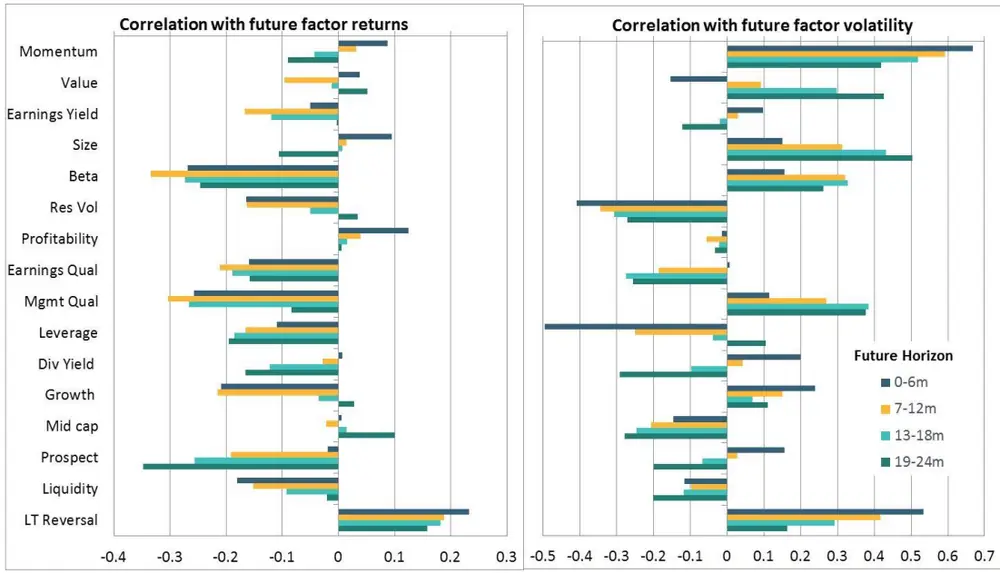
Sample period is 1996-2017, U.S. universe. We measure correlations in four 6-month horizons.

## THE INTEGRATED SCORE

We combined the standardized values of the five metrics to produce the final integrated factor crowding score, which is not re-standardized. To summarize the relationships of the crowding metrics with future factor returns and volatility, we averaged the correlations of the high volatility factors and consolidated all the metrics, along with the integrated score, in Exhibit 6. The peak correlation with future factor returns and volatility generally occurred at the 7-12 month horizon, indicating that crowding continued to build for some time before a reversal occurred.

Exhibit 6: Average Correlations of the Integrated Crowding Score and Individual Metrics with Future Factor Returns and Volatilities
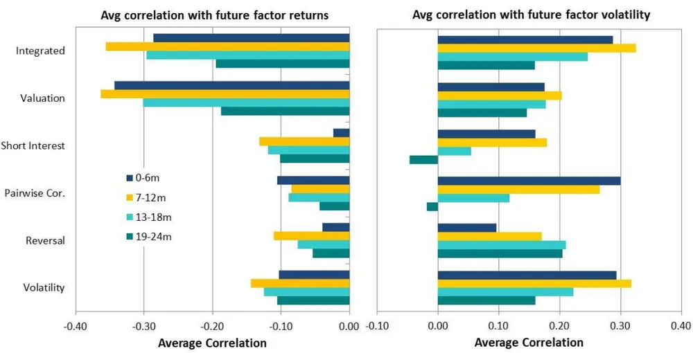
Sample period is 2007-2017 for the short interest metric and 1996-2017for all others, U.S. universe. Correlations are averaged over the six highest volatility factors — momentum, value, earnings yield, size, beta and residual volatility.

## BEYOND CORRELATION

Because concerns about crowding are focused on the potential for extreme events, we have examined the frequency of large drawdowns in factor returns as a function of our integrated crowding score. We calculated the frequency of a factor experiencing a 5% or larger drawdown over the next year when the integrated score was in six different ranges:

less than -1 
-1 to -0.5 
-0.5 to 0 
0 to 0.5 
0.5 to 1 
greater than 1

Integrated crowding scores of -1, -0.5, 0, 0.5 and 1 correspond approximately to the $7^{\mathrm{th}}$ , 20th, 50th, 80th and 93rd percentiles, respectively. We see in Exhibit 7 that the frequency of a 5% or larger drawdown in factor return in the next year is approximately 23% when the crowding score is above 1 — 7.5 times the frequency of 3% when the score is less than 0.5. We found very similar results when we conducted the same analysis in a z-score framework by normalizing the factor drawdown by trailing factor volatility. This showed that the high frequency of drawdown at high crowding scores was not driven by high volatility factors dominating the high crowding scores. In fact, high volatility factors were over-represented in both the very low (negative) and very high crowding score buckets. We have also examined other drawdown thresholds (e.g., 2%, 10%) and time horizons (e.g., 6, 18, 24 months) and found qualitatively similar results.

Exhibit 7: Frequency of 5% or Larger Drawdown in Factor Return over next Year vs. Integrated Crowding Score
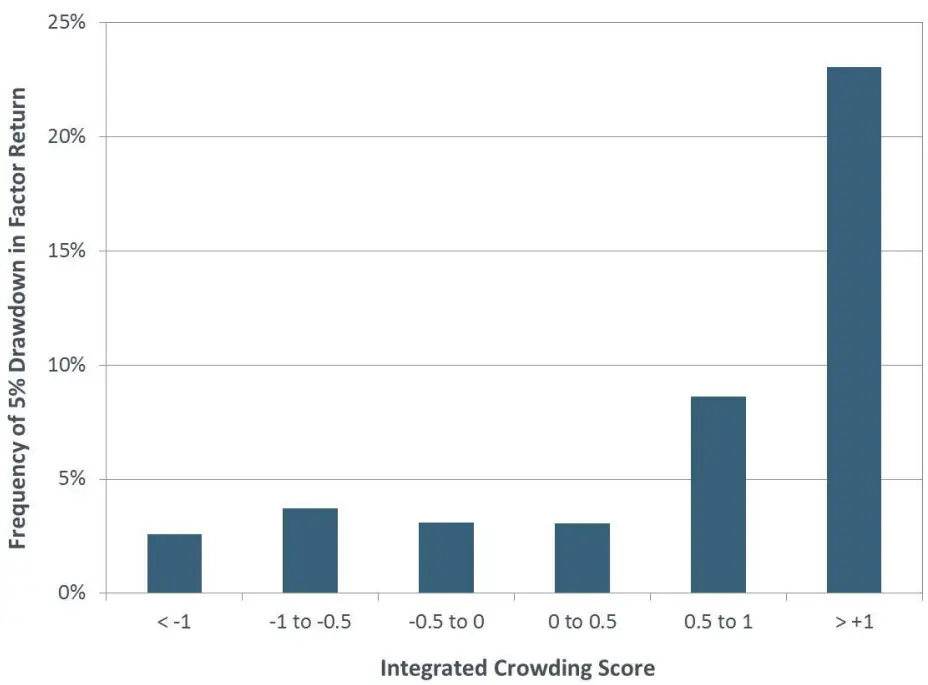
Sample period is 2007-2017 and includes all long-term factors from the Barra USTMM . Drawdown is defined as lowest value of cumulative factor return in next 12 months relative to the value on the evaluation date.

We have also compared how the behaviors of crowded and uncrowded factors tended to evolve over time, using a more continuous framework. At each date, we grouped the factors into three categories – crowded, uncrowded and neutral – based on their integrated crowding scores. Factors with an integrated score above 0.5 were included in the crowded category, those with scores below -0.5 were classed as uncrowded and those between -0.5 and 0.5 as neutral.

Exhibits 8 and 9 show that, on average, returns from the crowded and uncrowded factors initially diverged, a trend that peaked after about six months. As we moved farther out in time, the factor returns tended to converge, as expected. We observed similar behavior for volatility. Exhibit 9 indicates that the crowded factors tended to have the highest volatility, which peaked about six months after the formation date. Interestingly, the uncrowded factors had the next highest volatility, while the neutral factors had the lowest. This phenomenon was driven in part by higher volatility factors tending to have more extreme crowding scores and therefore dominating both the “crowded” and “uncrowded” categories. Nevertheless, we still observed gradual convergence in volatility for all three groups over time, consistent with the pattern for factor returns.

Exhibit 8: Returns for Crowded, Uncrowded and Neutral Factors over Next 24 Months
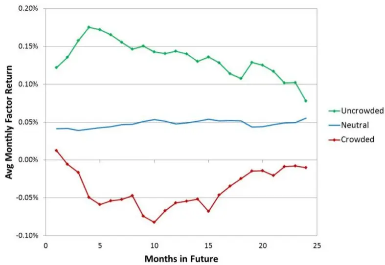
Sample period is 1996-2017. Data includes all long-term factors from the Barra USTMM.

Exhibit 9: Volatility for Crowded, Uncrowded and Neutral Factors over Next 48 Months
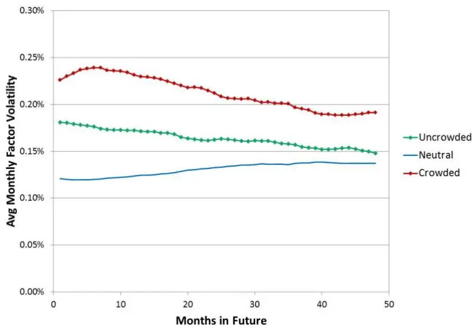
Sample period is 1996-2017. Data includes all long-term factors from the Barra USTMM. Factor volatility is defined as standard deviation of factor returns in given month.

## A CLOSER LOOK AT MOMENTUM

From a crowding perspective, momentum is arguably the most interesting factor, given that it has been subject to some of the most severe drawdowns and extreme levels of crowding, as measured by our metrics. Exhibit 10 plots the time series of standardized crowding scores along with the integrated score and cumulative factor return of this factor since 1998.

Exhibit 10: MSCI Factor Crowding History for the Momentum Factor
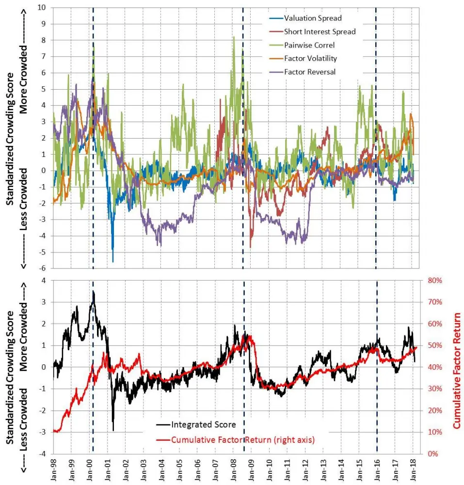
History of the individual MSCI factor crowding metrics (top panel) and Integrated score with cumulative factor return (bottom panel) for the momentum factor. Notable points in market history – Feb. 1, 2000 (tech bubble); Aug. 1, 2008 (pre-financial crisis); Dec. 31, 2015 (pre-2016 momentum drawdown) – are marked by thick dashed lines.

The behavior of the metrics during significant market events provides insights into investor positioning during those periods. For example, in the tech bubble period nearly all the crowding metrics, particularly those for valuation spread, factor momentum and relative volatility, reached very high values, driving the integrated score to extreme levels as well. After the bubble burst, the values of all the metrics declined and the overall score became significantly negative, indicating the momentum factor was very uncrowded.

Over the following few years, the integrated score remained mainly negative, until crowding in the momentum factor began to build up again in 2007. In 2008, prior to the financial crisis, the integrated score reached a value close to two, indicating significant crowding. When the market rebounded in 2009, the momentum factor crashed. However, the fact that the integrated crowding score dropped several months before the momentum factor crashed suggests that the momentum crash of 2009 was not driven by crowding. The integrated score for momentum generally remained negative or neutral until 2015, when the integrated score again rose above one, indicating crowding had built up.

As of February 2018, the integrated score for the momentum factor was back in the neutral zone, close to 0.5. Taking integrated scores of +/-1 to indicate significant levels of crowdedness and uncrowdedness, on this date no factor exhibited significant crowding. Only the size factor had an integrated score below -1, indicating that large caps were significantly uncrowded as measured by our model, with the valuation and short interest components the primary drivers of the low score.

Exhibit 11 displays the integrated crowding score along with the contributions from each of the individual metrics for all the long-term factors of the Barra USTMM at a number of interesting points in history – during the tech bubble, just prior to the financial crisis, prior to the momentum drawdown of Q1 2016, and recently in February 2018. The factors are ordered based on the integrated score during the tech bubble.

Exhibit 11: MSCI Integrated Factor Crowding Scores and Contributions
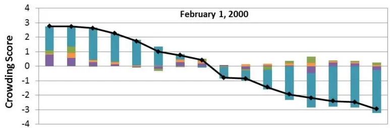

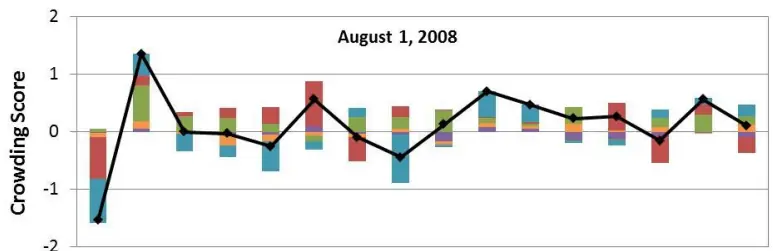

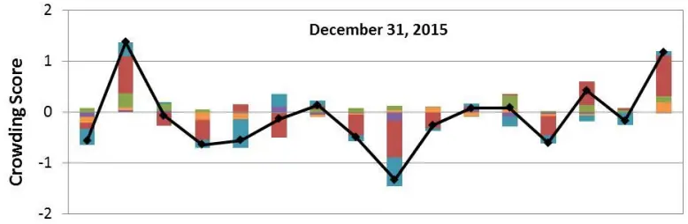

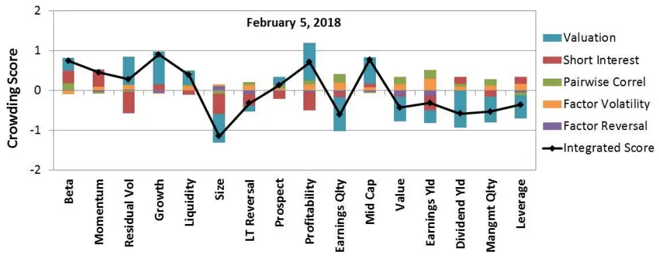

## CONCLUSION

With the rise of factor investing, institutional investors increasingly have sought to understand whether their factor exposures are crowded. Current MSCI Barra equity factor risk models are designed to provide insight and detail to help institutional investors understand how a portfolio is positioned and what has driven its risk and return. The MSCI Integrated Factor Crowding Model is designed to complement the Barra model by providing investors with insight into how the rest of the market is positioned with respect to factors. The model infers the relative degree of crowdedness in factor strategies by examining a robust set of metrics incorporating holdings, pricing and return-based information, which are sensitive to large amounts of capital following the same strategies. The model can be used to quickly identify where crowding risks may be building and to help investors assess whether adjustments to their own exposures are warranted.

We have examined the relationships of each of the metrics and the integrated score with subsequent factor performance, volatility and drawdowns. While not indicative of future events, we found that high levels of crowding in a factor have historically implied greater risk of poor performance and higher volatility for that factor thereafter, particularly over the subsequent six to 12 months. For the momentum factor, nearly all of the metrics indicated high levels of crowding at a number of interesting points in financial history – during the technology bubble of the late 1990s, leading up to and during the financial crisis in 2008 and at the end of 2015 prior to the momentum drawdown of the first quarter of 2016.

While it is not possible to be certain about how or when the next crisis or extreme event will occur, it is likely that another one eventually will. Some observers have argued that crowding has contributed to a number of extreme market events. Investors may want to be aware of those occasions when crowdedness (or uncrowdedness) in a factor has become extreme. Our crowding model can provide indications of these events.

## REFERENCES

Alighanbari, M. and S. Doole. (2018). “What’s Your Factor Footprint? Assessing the Investment Capacity of Factor Index Strategies.” MSCI Research Insight.

Asness, C., J. Friedman, R. Krail and J. Liew. (2000). “Style Timing: Value vs. Growth.” The Journal of Portfolio Management, Vol. 26, pp. 50–60.

Bayraktar, M., S. Doole, A. Kassam and S. Radchenko. (2015a). “Lost in the Crowd? Identifying and Measuring Crowded Strategies and Trades.” MSCI Research Insight.

Bayraktar, M., I. Mashtaler, N. Meng and S. Radchenko. (2015b). “Barra US Total Market Equity Model for Medium-Term Investors, Empirical Notes.” MSCI Model Insight.

Chue, T. (2015). “Omitted Risks or Crowded Strategies: Why Mutual Fund Comovement Predicts Future Performance.” Available at http://www.fmaconferences.org/Vegas/Papers/MFComvtv34b.pdf

Cohen, R. B., C. Polk and T. Vuolteenaho. (2003). “The Value Spread.” Journal of Finance, Vol. 78, pp. 609–642.

Daniel, K. and T. Moskowitz. (2016). “Momentum Crashes.” Journal of Financial Economics, Vol. 122, pp. 221-247.

De Bondt, W. and R. Thaler. (1985). “Does the Stock Market Overreact?” Journal of Finance, Vol. 40, pp. 793–805.

Greenwood, R. and D. Thesmar. (2011). “Stock Price Fragility.” Journal of Financial Economics, Vol. 102, pp. 471-490.

Gustafson, K. and P. Halper. (2010). “Are Quants All Fishing in the Same Small Pond with the Same Tackle Box?” Journal of Investing, Vol. 19, pp. 104-115.

Hanson, S. and A. Sunderam. (2014). “The Growth and Limits of Arbitrage: Evidence from Short Interest.” The Review of Financial Studies, Vol. 27, pp. 1238-1286.

Lou, D. and C. Polk. (2013). “Comomentum: Inferring Arbitrage Activity from Return Correlations.” Available at http://personal.lse.ac.uk/loud/comomentum.pdf

Wang, K. and J. Xu. (2015). “Market Volatility and Momentum.” Journal of Empirical Finance, Vol. 30, pp. 79-91.

Yara, F., M. Boons and A. Tamoni. (2018). “Value Timing: Risk and Return Across Asset Classes.” Available at https://papers.ssrn.com/sol3/papers.cfm?abstract_id=3054017

Zhong, L., X. Ding and N. Tay. (2017). “The Impact on Stock Returns of Crowding by Mutual Funds.” The Journal of Portfolio Management, Vol. 43, pp. 87-99.

## CONTACT US

clientservice@msci.com

## AMERICAS

| Americas | 1 888 588 4567 * |
| --- | --- |
| Atlanta | + 1 404 551 3212 |
| Boston | + 1 617 532 0920 |
| Chicago | + 1 312 675 0545 |
| Monterrey | + 52 81 1253 4020 |
| New York | + 1 212 804 3901 |
| San Francisco | + 1 415 836 8800 |
| Sao Paulo | + 55 11 3706 1360 |
| Toronto | + 1 416 628 1007 |

## ABOUT MSCI

For more than 40 years, MSCI’s researchbased indexes and analytics have helped the world’s leading investors build and manage better portfolios. Clients rely on our offerings for deeper insights into the drivers of performance and risk in their portfolios, broad asset class coverage and innovative research.

Our line of products and services includes indexes, analytical models, data, real estate benchmarks and ESG research.

MSCI serves 97 of the top 100 largest money managers, according to the most recent P&I ranking.

For more information, visit us at www.msci.com.

## ASIA PACIFIC

China North 10800 852 1032 * China South 10800 152 1032 * Hong Kong + 852 2844 9333 Mumbai + 91 22 6784 9160 Seoul 00798 8521 3392 * Singapore 800 852 3749 * Sydney + 61 2 9033 9333 Taipei 008 0112 7513 * Thailand 0018 0015 6207 7181 * Tokyo + 81 3 5290 1555

* = toll free

This document and all of the information contained in it, including without limitation all text, data, graphs, charts (collectively, the “Information”) is the property of MSCI Inc. or its subsidiaries (collectively, “MSCI”), or MSCI’s licensors, direct or indirect suppliers or any third party involved in making or compiling any Information (collectively, with MSCI, the “Information Providers”) and is provided for informational purposes only. The Information may not be modified, reverse-engineered, reproduced or redisseminated in whole or in part without prior written permission from MSCI.

The Information may not be used to create derivative works or to verify or correct other data or information. For example (but without limitation), the Information may not be used to create indexes, databases, risk models, analytics, software, or in connection with the issuing, offering, sponsoring, managing or marketing of any securities, portfolios, financial products or other investment vehicles utilizing or based on, linked to, tracking or otherwise derived from the Information or any other MSCI data, information, products or services.

The user of the Information assumes the entire risk of any use it may make or permit to be made of the Information. NONE OF THE INFORMATION PROVIDERS MAKES ANY EXPRESS OR IMPLIED WARRANTIES OR REPRESENTATIONS WITH RESPECT TO THE INFORMATION (OR THE RESULTS TO BE OBTAINED BY THE USE THEREOF), AND TO THE MAXIMUM EXTENT PERMITTED BY APPLICABLE LAW, EACH INFORMATION PROVIDER EXPRESSLY DISCLAIMS ALL IMPLIED WARRANTIES (INCLUDING, WITHOUT LIMITATION, ANY IMPLIED WARRANTIES OF ORIGINALITY, ACCURACY, TIMELINESS, NON-INFRINGEMENT, COMPLETENESS, MERCHANTABILITY AND FITNESS FOR A PARTICULAR PURPOSE) WITH RESPECT TO ANY OF THE INFORMATION.

Without limiting any of the foregoing and to the maximum extent permitted by applicable law, in no event shall any Information Provider have any liability regarding any of the Information for any direct, indirect, special, punitive, consequential (including lost profits) or any other damages even if notified of the possibility of such damages. The foregoing shall not exclude or limit any liability that may not by applicable law be excluded or limited including without limitation (as applicable), any liability for death or personal injury to the extent that such injury results from the negligence or willful default of itself, its servants, agents or sub-contractors.

Information containing any historical information, data or analysis should not be taken as an indication or guarantee of any future performance, analysis, forecast or prediction. Past performance does not guarantee future results.

The Information should not be relied on and is not a substitute for the skill, judgment and experience of the user, its management, employees, advisors and/or clients when making investment and other business decisions. All Information is impersonal and not tailored to the needs of any person, entity or group of persons.

None of the Information constitutes an offer to sell (or a solicitation of an offer to buy), any security, financial product or other investment vehicle or any trading strategy.

It is not possible to invest directly in an index. Exposure to an asset class or trading strategy or other category represented by an index is only available through third party investable instruments (if any) based on that index. MSCI does not issue, sponsor, endorse, market, offer, review or otherwise express any opinion regarding any fund, ETF, derivative or other security, investment, financial product or trading strategy that is based on, linked to or seeks to provide an investment return related to the performance of any MSCI index (collectively, “Index Linked Investments”). MSC makes no assurance that any Index Linked Investments will accurately track index performance or provide positive investment returns. MSCI Inc. is not an investment adviser or fiduciary and MSCI makes no representation regarding the advisability of investing in any Index Linked Investments.

Index returns do not represent the results of actual trading of investible assets/securities. MSCI maintains and calculates indexes, but does not manage actual assets. Index returns do not reflect payment of any sales charges or fees an investor may pay to purchase the securities underlying the index or Index Linked Investments. The imposition of these fees and charges would cause the performance of an Index Linked Investment to be different than the MSCI index performance.

The Information may contain back tested data. Back-tested performance is not actual performance, but is hypothetical. There are frequently material differences between back tested performance results and actual results subsequently achieved by any investment strategy.

Constituents of MSCI equity indexes are listed companies, which are included in or excluded from the indexes according to the application of the relevant index methodologies. Accordingly, constituents in MSCI equity indexes may include MSCI Inc., clients of MSCI or suppliers to MSCI. Inclusion of a security within an MSCI index is not a recommendation by MSCI to buy, sell, or hold such security, nor is it considered to be investment advice.

Data and information produced by various affiliates of MSCI Inc., including MSCI ESG Research Inc. and Barra LLC, may be used in calculating certain MSCI indexes. More information can be found in the relevant index methodologies on www.msci.com.

MSCI receives compensation in connection with licensing its indexes to third parties. MSCI Inc.’s revenue includes fees based on assets in Index Linked Investments. Information can be found in MSCI Inc.’s company filings on the Investor Relations section of www.msci.com.

MSCI ESG Research Inc. is a Registered Investment Adviser under the Investment Advisers Act of 1940 and a subsidiary of MSCI Inc. Except with respect to any applicable products or services from MSCI ESG Research, neither MSCI nor any of its products or services recommends, endorses, approves or otherwise expresses any opinion regarding any issuer, securities, financial products or instruments or trading strategies and MSCI’s products or services are not intended to constitute investment advice or a recommendation to make (or refrain from making) any kind of investment decision and may not be relied on as such. Issuers mentioned or included in any MSCI ESG Research materials may include MSCI Inc., clients of MSCI or suppliers to MSCI, and may also purchase research or other products or services from MSCI ESG Research. MSCI ESG Research materials, including materials utilized in any MSCI ESG Indexes or other products, have not been submitted to, nor received approval from, the United States Securities and Exchange Commission or any other regulatory body.

Any use of or access to products, services or information of MSCI requires a license from MSCI. MSCI, Barra, RiskMetrics, IPD, InvestorForce, and other MSCI brands and product names are the trademarks, service marks, or registered trademarks of MSCI or its subsidiaries in the United States and other jurisdictions. The Global Industry Classification Standard (GICS) was developed by and is the exclusive property of MSCI and Standard & Poor’s. “Global Industry Classification Standard (GICS)” is a service mark of MSCI and Standard & Poor’s.