## 金工研究/深度研究

2020年02月09日

林晓明 执业证书编号：S0570516010001

研究员 0755-82080134

李聪 执业证书编号：S0570519080001

研究员 01056793938

licong@htsc.com

刘志成 执业证书编号：S0570518080005

研究员 010-56793940

liuzhicheng@htsc.com

王佳星 010-56793942

联系人 wangjiaxing@htsc.com

3《金工: 从微观同步到宏观周期》2019.12

# 拥挤度指标在行业配置中的应用

# ——华泰行业轮动系列报告之十二

## 本文基于量价数据构建了行业拥挤度指标，提示市场的交易过热风险

本文主要从控制交易风险的角度出发，构建拥挤度指标以定量分析各行业的交易过热风险，为交易过程提出警示，主要研究内容包括：1.从动量、流动性和量价相关性等多个角度进行了拥挤度指标的构建；2.采用显著性检验、信号胜率检验、回归收益检验和过拟合检验等多种方法对拥挤度指标进行筛选；3.通过打分法将可靠性高的单项拥挤度指标进行复合，构建表现更稳定的复合拥挤度指标。实证结果表明，拥挤度指标可以作为有效的风险预警指标和其他策略进行搭配，在交易过程中规避行业指数可能出现的下跌风险，提高其他行业轮动策略的表现。

## 构建拥挤度指标的目的在于捕捉市场的交易过热状态

构建拥挤度指标的关键目的是捕捉市场的交易过热状态，规避行业指数“拥挤”交易的风险。本研究以量价数据为基础，从市场的异常成交信息和收益分布特征等多个角度，构建了动量指标、流动性指标、乖离率指标、量价相关性、波动率指标和分布特征指标六类拥挤度指标。我们通过量价指标的历史分位数是否达到规定阈值来判断某个行业指数当前是否处于拥挤状态。在考虑每项拥挤度指标的参数设定下，最终构建了 20 项总计 272个拥挤度指标。

将多项检验方式结合可以筛选效果相对可靠且过拟合风险小的拥挤度指标本研究通过检验行业指数触发拥挤信号后是否出现下跌来衡量其有效性。具体而言，我们通过显著性检验、信号胜率检验和回测收益检验判断拥挤度指标能否识别出未来可能出现下跌的行业，再通过过拟合检验计算每项拥挤度指标的过拟合概率，减少参数设定过程的过拟合风险。经过层层筛选，我们最终选定了收盘价乖离率、换手率与收盘价相关系数、成交量与收盘价的相关系数、峰度、换手率乖离率以及换手率拥挤度这六项拥挤度指标，并通过蒙特卡洛模拟确定了每项拥挤度指标的最优参数。

## 基于打分法构建的复合拥挤度指标，可以有效规避下跌风险

基于打分法可以将筛选的六个单项拥挤度指标进行复合，当六个单项指标有任意一个显示当前处于拥挤状态时，就可以触发复合拥挤度指标的信号。基于复合拥挤度指标构建的非拥挤行业组合，能够取得优于单项指标的回测效果，可以达到 9.28%的年化收益率以及 58.82%的月频调仓胜率。复合拥挤度指标在市场大幅波动时有较好的表现，可以规避急速上涨之后市场拥挤交易的风险。在2015、2016和2019年市场急速上涨之时，市场处于交易过热状态，拥挤度信号触发次数显著增加，在这三个年份处于非拥挤状态的行业组合能够分别取得 18.11%、9.90%和 8.22%的超额年化收益。

## 拥挤度指标可以与景气度策略复合，构建表现更好的复合策略

基于拥挤度指标可以对目前已有的行业轮动策略进行改进，通过规避拥挤交易的风险来提高策略收益，减少最大回撤。将拥挤度指标和前期报告《景气度指标在行业配置中的应用》（2019-9-12）中的景气度指标相结合，可以构建表现稳健的行业轮动策略。拥挤度和景气度复合策略的年化收益率可以达到20.83%，优于纯景气度策略13.33%的年化收益率。复合策略最大回撤为-36.50%，与纯景气度策略的最大回撤-56.05%相比也有着大幅提升。

风险提示：模型根据历史规律总结，历史规律可能失效。市场出现超预期波动，导致拥挤交易。报告中涉及到的具体行业不代表任何投资意见，请投资者谨慎、理性地看待。

## 本文导读

在微观层面的行业轮动研究中，我们致力于通过行业截面比较的思路寻找短期机动型配置机会，从自下而上的角度挖掘行业基本信息，寻找行业层面的超额收益。具体而言，我们将从行业的内在价值和交易风险两个角度构建有行业选择能力的指标，并且关注多个指标复合后的效果，减少单项指标回测结果的偶然性。在行业轮动策略研究中，我们主要从景气度和拥挤度两个角度进行行业指标的构建：

1. 行业景气度指标：主要是从行业内在价值驱动的角度出发，分析行业自身的盈利状况以及市场对行业的盈利预期，寻找可以获得超额收益的行业指标。

2. 行业拥挤度指标：主要是从行业市场交易风险控制的角度出发，分析行业在短时间内是否存在交易过热的现象，规避处于拥挤状态的行业。

图表1： 行业轮动策略构建思路
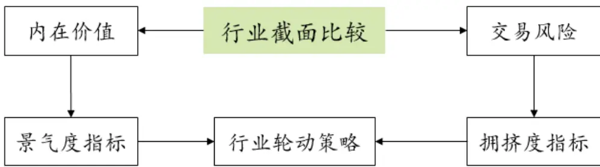
资料来源:华泰证券研究所

在前期报告《景气度指标在行业配置中的应用》（2019-9-12）中，我们从财务报表和一致预期等多个角度进行行业景气度指标的研究，并构建了基于景气度指标的行业轮动策略。本文将继续开展基于拥挤度指标的行业轮动研究，从控制交易风险的角度出发，构建可以衡量行业指数交易拥挤程度的指标，规避各行业可能存在的交易过热风险，本文包含的主要研究内容如下：

1. 从动量指标、流动性指标、波动率指标和量价相关性指标等多个角度进行行业拥挤度指标的构建。

2. 结合显著性检验、信号胜率检验、回归收益检验和过拟合检验等多种方法对行业拥挤度指标进行检验，筛选有效指标。

3. 采用打分法对单项行业拥挤度指标进行合成，构建更稳健的复合拥挤度指标，并采用拥挤度指标提高现有的行业景气度策略的表现。

图表2： 本文主要研究内容
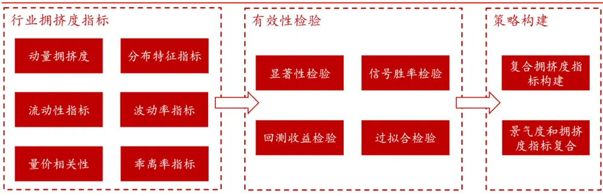
资料来源:华泰证券研究所

## 拥挤度指标构建思路

## 构建拥挤度指标的目的在于对市场交易过热的风险进行提示

通常情况下，股票的市场价格围绕其内在价值波动。随着基本面提升、宏观政策不断加码，优质股票的价值中枢不断上行，可以为投资者带来长期回报。但是市场总是伴随着非理性的交易行为，当基本面超预期或是突然出现政策利好，股票的价格和成交量都可能会出现激增。过热交易行为可能在第一时间把股票价格提升至过高位置，达到拥挤状态。拥挤交易容易引发市场踩踏，存在较大下跌风险。

构建拥挤度指标的初衷是捕捉市场可能出现的交易过热状态。直观上股市最显而易见的拥挤特征就是成交量和价格的大幅提升。除此之外，市场波动率增大、量价变化趋势不匹配等异常现象，也表明当前市场风险正在累积，可能存在交易拥挤。本研究主要从以下几个方面进行拥挤度指标的构建，对市场的交易风险给出示警：

3. 判断当前市场是否存在较大波动，相应指标：波动率指标

4. 判断近期行业指数的收益率分布是否偏离统计规律，相应指标：分布特征指标

图表3： 食品饮料行业（中信）2016-2017 年 K线图
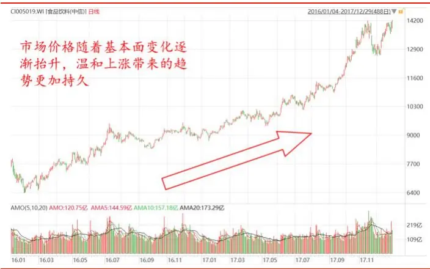
资料来源：Wind，华泰证券研究所

图表4： 计算机行业（中信）2018-2019年 K线图
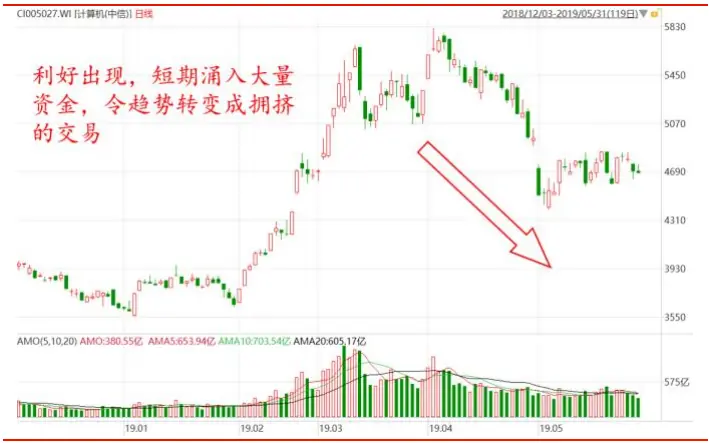
资料来源：Wind，华泰证券研究所

图表5： 本研究用于刻画行业拥挤度的量价指标
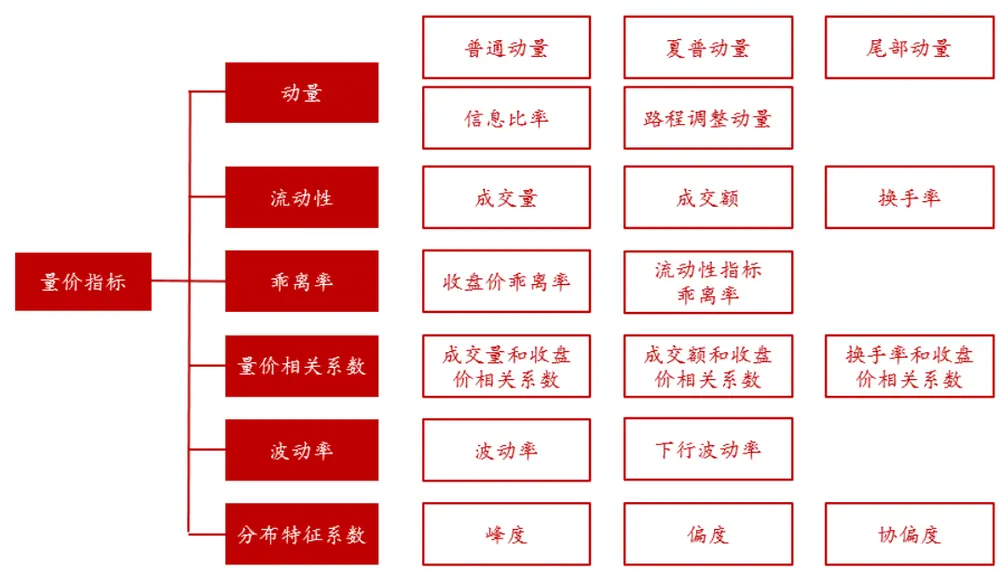
资料来源:华泰证券研究所

## 动量指标

动量是常用于衡量价格趋势的指标。股票的价格走势既存在动量效应，也存在与之相对的反转效应。动量效应表示股票的价格存在一定的趋势性，股价会沿着过去的动量继续变化，即过去表现较好的股票在未来一段时间内将持续表现良好，而过去表现较差的股票也将持续表现低迷。反转效应则指的是股票价格的运动方向与原有的动量方向相反，即过去正向动量越大的股票在未来更可能出现下跌。

当市场对于股票利好反应不足时，资金不断涌入，股价的动量效应更明显；但是当市场反应过度时，股价更可能呈反转效应。在股价上行过程中，如果短期价格增幅过大，股价更容易出现反转。所以当行业指数的动量分位数处于历史高位时，可认为当前处于交易拥挤的状态，在交易过程中需要规避。本研究采用了五类动量指标进行动量拥挤度的计算，这些指标从不同角度衡量了过去一段时间价格的趋势效应，各有侧重：

1. 普通动量：即过去一段时间内行业指数的涨跌幅，涨跌幅绝对值越大意味着行业动量越强。

2. 夏普比率：采用波动率对普通动量进行标准化，在行业指数涨跌幅的基础上还考虑了波动率的影响。夏普比率可以筛选出收益高，波动率低的行业指数。

3. 信息比率：夏普比率的衍生指标，实质是采用超额收益计算的夏普比率。利用超额收益计算可以减少市场系统性涨跌的影响。

4. 路程调整动量：利用“路程”作为风险因子来对动量进行调整，这里的路程指的是观察期日收益率绝对值求和。如果将行业指数走势比作走路，那由出发点到达最新时刻位置的位移就是动量。路程是日收益率的绝对值求和，所以路程调整动量本质上衡量的是行业指数的上涨效率。

5. 尾部动量：又称尾部风险动量，尾部风险定义为过去一段时间内最大 1%损失幅度，用于衡量过去一段时间极端情况下的下跌风险。研究表明，尾部风险越低的股票风险溢价更高，高尾部风险的股票有着更低的未来收益。

图表6： 本研究采用的动量指标

| 类型 | 计算公式 |
| --- | --- |
| 普通动量 | $\begin{array}{r}{Mom_{t,K}=\frac{Close_{t,K}}{Close_{t-N+1,K}}-1}\end{array}$ |
| 夏普比率 | $\begin{array}{r}{Sharpe_{t,K}=\frac{\sum_{i=0}^{N-1}r_{t-i,K}/N}{std_{t,K}}}\end{array}$ |
|  | $\begin{array}{r}{std_{t,K}^{2}=\sum_{i=0}^{N-1}\frac{(r_{t-i,K}-\bar{r}_{t,K})^{2}}{N-1},\bar{r}_{t,K}=\frac{\sum_{i=0}^{N-1}r_{t-i,K}}{N}}\end{array}$ |
| 信息比率 | $\begin{array}{r}{IR_{t,K}=\frac{\sum_{i=0}^{N-1}(r_{t-i,K}-r_{t-i,m})/N}{TE_{t,K}}}\end{array}$ |
|  | $\begin{array}{r}{TE_{t,K}^{2}=\sum_{i=0}^{N-1}\frac{(r_{t-i,K}-r_{t-i,m}-\bar{r}^{\prime}{t}_{K})^{2}}{N-1},r_{t,m}=\frac{\sum_{K=1}^{M}r_{t,K}}{M},\bar{r}^{\prime}{_t,K}=\frac{\sum_{i=0}^{N}(r_{t-i,K}-r_{t-i,m})}{N}}\end{array}$ |
| 路程调整动量 |  |
|  | $\begin{array}{r}{Distance_{t,K}=\frac{Mom_{t,K}}{\sum_{i=0}^{N-1}\|r_{t-i,K}\|}}\end{array}$ |
| 尾部动量 | $Tail_{t,K}=VaR_{t,K}$ |

说明：K 表示行业，t 为交易日，N 为窗口期，r表示收益率，M为全行业数，VaR取下 1%分位数
资料来源：华泰证券研究所

## 流动性指标

股票流动性通常用成交量、成交额和换手率来衡量，成交越活跃的股票流动性越好。股票的流动性和价格关系非常密切，两者往往相辅相成。一方面，股价上升会吸引更多的增量资金流入股市，不断推高成交量；另一方面，当成交量增大时，入市资金也可以进一步推动股价上涨。通常情况下，股票市场量增价升、量减价跌，两者经常同步变化。

但是在股价上涨过程中，需要警惕“天量”的出现。当市场出现巨额成交时，意味着有大额资金进场，股价将被大幅推高，呈井喷行情。此时股票市场处于拥挤状态，透支了大量的未来涨幅，应该获利了结离场，避免下跌。我们将行业指数在过去一段窗口期内的成交量、成交额和换手率平均值与历史数据进行对比，当有处于历史高位的流动性数据出现时，判定此时市场处于拥挤状态。

图表7： 非银行金融行业（中信）2018年 7月至 2019年 7月 K线图
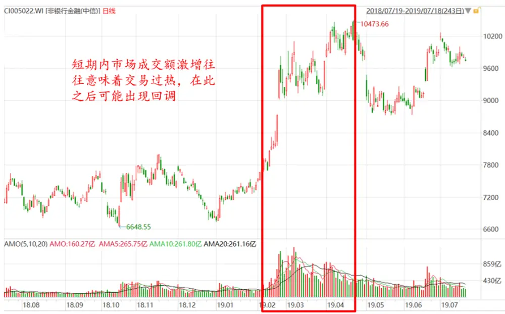
资料来源：Wind，华泰证券研究所

## 乖离率指标

乖离率是较为常见的一种技术指标，通常是指最新市场价格与近期平均值之间的偏离度，以t时刻K行业的收盘价乖离率（窗口期 N）为例：

$$
close\_bias_{t,K}=\frac{close_{t,K}-\sum_{i=0}^{N-1}close_{t-i,K}/N}{\sum_{i=0}^{N-1}close_{t-i,K}/N}
$$

乖离率越大，说明当前市场价格超出过去 N天的平均价越高，当前市场出现了剧烈的价格抬升，呈超买状态。在乖离率较大时，价格出现回弹的可能性更大。本研究对乖离率的用法做出延伸，计算了成交量、成交额和换手率的乖离率，分析市场最新的流动性指标是否与平均值出现了明显的偏离。收盘价或流动性指标的乖离率较大时，说明市场成交活跃度非常高，量和价都超出了均衡水平，此时可以考虑降低仓位，规避风险。

$$
\begin{array}{c}{{volume\_bias_{t,K}=\displaystyle\frac{volume_{t,K}-\sum_{i=0}^{N-1}volume_{t-i,K}/N}{\sum_{i=0}^{N-1}volume_{t-i,K}/N}}}\\{{amt\_bias_{t,K}=\displaystyle\frac{amt_{t,K}-\sum_{i=0}^{N-1}amt_{t-i,K}/N}{\sum_{i=0}^{N-1}amt_{t-i,K}/N}}}\\{{turn\_bias_{t,K}=\displaystyle\frac{turn_{t,K}-\sum_{i=0}^{N-1}turn_{t-i,K}/N}{\sum_{i=0}^{N-1}turn_{t-i,K}/N}}}\end{array}
$$

## 量价相关系数

通常情况下，股票的流动性和价格走势呈相同的变化趋势，一旦出现量价走势背离的情况，可能意味着价格走势将发生转变。比如在价格上涨的过程中，如果成交量出现萎缩，股价的上涨缺乏量的推动，后续价格走势将难以为继；如果市场成交量增加，但是股票价格难以继续上涨，说明此时多空分歧逐渐增大，风险逐渐累积。

图表8： 家电行业指数（中信）2018 年 11 月至 2019 年 6 月 K 线图
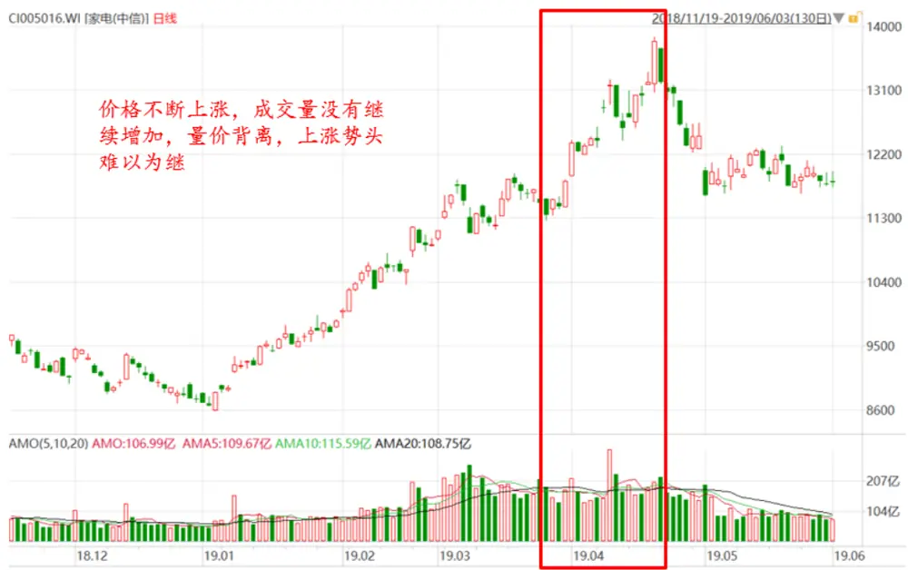
资料来源：Wind，华泰证券研究所

本研究采用行业指数收盘价和流动性指标的相关系数来定量分析量价背离现象。量价相关系数越大，说明量价指标的走势越接近，反之则表示两者出现背离。举例来说，行业 K 在时刻 t的成交量与收盘价相关系数可以表示为：

$$
\begin{array}{rcl}{{corr_{-}volume_{-}close_{t,K}=\displaystyle\frac{\sum_{i=0}^{N-1}(close_{t-i,K}-\overline{{{close}}}_{t,K})(volume_{t-i,K}-\overline{{{volume}}}_{t,K})}{\sum_{i=0}^{N-1}(close_{t-i,K}-\overline{{{close}}}_{t,K})^{2}\sum_{i=0}^{N-1}(volume_{t-i,K}-\overline{{{volume}}}_{t,K})^{2}}}}\\{{}}&{{}}&{{}}\\{{\overline{{{close}}}_{t,K}=\displaystyle\sum_{i=0}^{N-1}close_{t-i,K}/N}}\end{array}
$$

$$
\overline{{{volume}}}_{t,K}=\sum_{i=0}^{N-1}{volume_{t-i,K}}/N
$$

当股价上涨时，如果某个行业指数的量价相关系数下降，意味着出现了量价背离的现象。当量价相关系数处于历史低位时，需要警惕可能出现的下跌风险。我们还计算了收盘价和成交额以及换手率的相关系数对量价背离现象进行分析：

$$
\begin{array}{r}{corr\_amt\_close_{t,K}=\frac{\sum_{i=0}^{N-1}(close_{t-i,K}-\overline{{close}}_{t,K})(amt_{t-i,K}-\overline{{amt}}_{t,K})}{\sum_{i=0}^{N-1}(close_{t-i,K}-\overline{{close}}_{t,K})^{2}\sum_{i=0}^{N-1}(amt_{t-i,K}-\overline{{amt}}_{t,K})^{2}}}\\{corr\_turn\_close_{t,K}=\frac{\sum_{i=0}^{N-1}(close_{t-i,K}-\overline{{close}}_{t,K})(turn_{t-i,K}-\overline{{turn}}_{t,K})}{\sum_{i=0}^{N-1}(close_{t-i,K}-\overline{{close}}_{t,K})^{2}\sum_{i=0}^{N-1}(turn_{t-i,K}-\overline{{turne}}_{t,K})^{2}}}\end{array}
$$

## 波动率指标

波动率就是股票价格的风险，一般用股票收益率的标准差进行表征。股票市场普遍存在低波动异象，长期来看低波动率的股票相对高波动率的股票具有更高收益。从拥挤度角度来看，如果行业指数短期的波动率急剧上升，说明股票风险加大，在投资过程中应该规避。行业 K在 t时刻的波动率可以表示为：

$$
\begin{array}{rl}{vol_{t,K}=}&{\sqrt{\displaystyle\sum_{i=0}^{N-1}\frac{\left(r_{t-i,K}-\bar{r}_{t,K}\right)^{2}}{N-1}}}\\&{\bar{r}_{t,K}=\frac{\displaystyle\sum_{i=0}^{N-1}r_{t-i,K}}{\displaystyle N}}\end{array}
$$

波动率还可以进一步分为上行波动率和下行波动率，两者的区别在于统计正收益率还是负收益率的标准差。从定义来看，下行波动率指标关注过去一段时间市场下行风险，更贴近我们对于拥挤度指标的定义。因此本研究还基于下行波动率进行拥挤度指标构建：

$$
\begin{array}{rlr}{down\_vol_{t,K}=}&{{}\sqrt{\displaystyle\sum_{i=0}^{n_{d}-1}\frac{\left(r_{t-i,K}-\bar{r}_{t,K}\right)^{2}}{n_{d}-1}}}&{}\\{\bar{r}_{t,K}=\frac{\sum_{i=0}^{N-1}r_{t-i,K}}{N}}&{{}}&{}\end{array}
$$

其中d代表日收益率小于 0 的日期集合， $n_{d}$ 为日收益率小于 0 总天数。

## 分布特征指标

分布特征指标一般用于描述行业指数历史收益率的概率分布情况。通过峰度和偏度两种指标可以分析近期行业指数日收益率是否出现异常分布，进而判断当前是否处于拥挤状态。

峰度用来描述数据概率分布顶端尖峭或 $\dot{\mathcal{R}}$ 平的程度。峰度越大，代表分布越集中；峰度越小，分布越平滑。如果过去一段时间日收益率峰度越低，说明收益率取值较为分散，短期市场波动率更高，风险更大，拥挤度更高。行业 K在 t时刻的峰度（kurtosis）为：

$$
kurt_{t,K}={\frac{{\frac{1}{N}}\sum_{i=0}^{N-1}(r_{t-i,K}-{\bar{r}}_{t,K})^{4}}{({\frac{1}{N}}\sum_{i=0}^{N-1}(r_{t-i,K}-{\bar{r}}_{t,K})^{2})^{2}}}
$$

偏度用来度量数据概率分布的偏斜方向和程度。当偏度大于零时，数据处于正偏态，概率密度呈右侧长尾分布；当偏度小于零时，数据处于负偏态，概率密度呈左侧长尾分布。如果过去一段时间行业指数收益率序列处于负偏态时，意味着近期行业指数出现了非常态的低收益率，有可能存在较大风险。行业 K在 t时刻的偏度（skewness）为：

$$
\begin{array}{r}{skew_{t,K}=\frac{\frac{1}{N}\sum_{i=0}^{N-1}(r_{t-i,K}-\bar{r}_{t,K})^{3}}{(\frac{1}{N}\sum_{i=0}^{N-1}(r_{t-i,K}-\bar{r}_{t,K})^{2})^{3/2}}}\end{array}
$$

进一步地，我们还引入协偏度（coskewness）考察行业收益率相比于全市场整体收益率概率分布的偏离程度，行业 K 在 t 时刻相对于市场基准的协偏度为：

$$
\begin{array}{r}{\mathbb{C}\mathbb{S}_{t,K}=\frac{\sum_{i=0}^{N-1}[(r_{t-i,k}-\bar{r}_{t,K})(r_{t-i,m}-\bar{r}_{t,m})^{2}]}{\sum_{i=0}^{N-1}[(r_{t-i,m}-\bar{r}_{t,m})^{3}]}}\end{array}
$$

公式中 $r_{t,K}$ 表示t时刻K行业的日收益率， ${\boldsymbol{r}}_{t,0}$ 为基准在 t 时刻的收益率，其中行业 K 平均收益率 $\cdot\bar{r}_{t,K}$ 以及市场收益率 ${\boldsymbol{r}}_{t,m}$ 可以表示为：

$$
r_{t,m}=\frac{\sum_{K=1}^{M}r_{t,K}}{M}
$$

$$
\bar{r}_{t,m}=\frac{\sum_{i=0}^{N-1}{{r}_{t-i,m}}}{N}
$$

## 本研究构建了总计六类 20项拥挤度指标

前文中给出的六类拥挤度指标都遵循相同的原则进行构建：即计算一个原始的量价指标（比如动量或量价相关系数），判断该指标在历史上是否处于临界位置。我们统一采用历史分位数方法判断每项量价指标在历史上所处位置。六类拥挤度指标的计算过程可以总结如下：

1. 确定各指标的窗口期长度 N，计算各个量价指标的原始数值。各指标窗口期取值范围设定如下：

a) 动量、流动性、量价相关系数、波动率和分布特征系数等指标关注近期市场表现，窗口期取值相对较短。这五个指标窗口取值设定为 20、40 或 60 个交易日，分别对应一个月、两个月和三个月。

b) 乖离率指标的思路是判定最新市场价格或成交量与近期平均值之间的偏离度，计算平均值的窗口期可以取更长一些的数值。乖离率指标的窗口期设定为 20、40、60、120 或 250 个交易日，分别对应一个月、两个月、三个月、半年和一年。

2. 计算所有原始量价指标的历史分位数，确定达到拥挤状态的历史分位数临界阈值。根据不同指标的方向性，历史分位数的阈值设定如下：

a) 量价相关指标和分布特征指标属于正向指标，当其量价指标历史分位数低于规定阈值时，判定当前属于拥挤状态。我们设定为 1%、5%、10%和 20%。

b) 其他四个指标是负向指标，指标历史分位数需高出规定阈值时才能判定处于拥挤状态，我们设定这几个指标分位数阈值为 80%、90%、95%和 99%。

3. 对某个行业指数是否处于拥挤状态的判定有两个条件：首先，在过去一段行业指数是否处于上涨状态，也就在过去为 N天的窗口期中行业指数涨跌幅是否为正；其次是量价指标是否处于历史临界位置，也就是量价指标的历史分位数是否达到规定阈值。拥挤度指标为日频信号，我们将处于拥挤状态的行业标为 1，非拥挤行业标为 0。

后文中，拥挤度指标的命名方式为：指标代码+窗口期长度+历史分位数阈值。比如说normal_momentum_crowd_20_80%表示当过去 20 日普通动量历史分位数大于 80%，且行业指数涨跌幅为正时，判定当前行业处于拥挤状态。

图表9： 本研究构建的六类总计 20项行业拥挤度指标

| 类别 | 指标名称 | 指标代码 | 判断是否拥挤的标准 | 窗口期长度（交易日） | 历史分位数阈值 |
| --- | --- | --- | --- | --- | --- |
| 动量指标 | 普通动量拥挤度 | normal_momentum_crowd | 分位数是否处于历史高位 |  | 20/40/60 80%/90%/95%/99% |
|  | 夏普动量拥挤度 | sharpe_momentum_crowd | 分位数是否处于历史高位 |  | 20/40/60 80%/90%/95%/99% |
|  | 信息比率拥挤度 | information_momentum_crowd | 分位数是否处于历史高位 |  | 20/40/6080%/90%/95%/99% |
|  | 路径调整动量拥挤度 | distance_momentum_crowd | 分位数是否处于历史高位 |  | 20/40/6080%/90%/95%/99% |
|  | 尾部动量拥挤度 | tail_momentum_crowd | 分位数是否处于历史高位 |  | 20/40/60 80%/90%/95%/99% |
| 流动性指标 | 成交量拥挤度 | volume_crowd | 分位数是否处于历史高位 |  | 20/40/60 80%/90%/95%/99% |
|  | 成交额拥挤度 | amt_crowd | 分位数是否处于历史高位 |  | 20/40/60 80%/90%/95%/99% |
|  | 换手率拥挤度 | turn_crowd | 分位数是否处于历史高位 |  | 20/40/60 80%/90%/95%/99% |
| 乖离率指标 | 收盘价乖离率 | close_bias | 分位数是否处于历史高位 |  | 20/40/60/120/25080%/90%/95%/99% |
|  | 成交量乖离率 | volume_bias | 分位数是否处于历史高位 |  | 20/40/60/120/25080%/90%/95%/99% |
|  | 成交额乖离率 | amt_bias | 分位数是否处于历史高位 |  | 20/40/60/120/25080%/90%/95%/99% |
|  | 换手率乖离率 | turn_bias | 分位数是否处于历史高位 |  | 20/40/60/120/25080%/90%/95%/99% |
| 量价相关性 | 成交量与收盘价的相关系数 corr_volume_close |  | 分位数是否处于历史低位 | 20/40/60 | 1%/5%/10%/20% |
|  | 换手率与收盘价相关系数 | corr_turn_close | 分位数是否处于历史低位 | 20/40/60 | 1%/5%/10%/20% |
|  | 成交额与收盘价相关系数 | corr_amt_close | 分位数是否处于历史低位 | 20/40/60 | 1%/5%/10%/20% |
| 波动率指标 | 波动率拥挤度 | vol | 分位数是否处于历史高位 |  | 20/40/60 80%/90%/95%/99% |
|  | 下行波动率拥挤度 | downvol | 分位数是否处于历史高位 |  | 20/40/60 80%/90%/95%/99% |
| 分布特征指标峰度 |  | kurtosis | 分位数是否处于历史低位 | 20/40/60 | 1%/5%/10%/20% |
|  | 偏度 | skewness | 分位数是否处于历史低位 | 20/40/60 | 1%/5%/10%/20% |
| 协偏度 |  | coskewness | 分位数是否处于历史低位 | 20/40/60 | 1%/5%/10%/20% |

资料来源：华泰证券研究所

## 拥挤度指标有效性检验

## 有效的拥挤度指标能够及时提示市场未来的下跌风险

前文给出了六类总计 20 项行业拥挤度指标的构建方式。在考虑每项指标的参数设定之后，可以得到总计 272 个拥挤度指标。接下来本文将对拥挤度指标的有效性进行验证，并对每个拥挤度指标的参数进行合理设定。一个有效的拥挤度指标需要及时对市场交易过热的风险做出提示，避免投资组合出现大幅亏损。为此我们将从以下四个角度对拥挤度指标进行筛选：

1. 显著性检验：取拥挤度信号对于未来一个月行业指数收益率进行回归分析，对回归系数进行显著性检验。显著性检验通过意味着拥挤度指标对行业指数收益率有一定的解释力度。

2. 信号胜率检验：汇总出现拥挤度信号之后一个月行业指数收益率，统计其中收益率为负的次数占比。胜率越高则意味着拥挤度指标捕捉下跌风险的准确度越高。

3.回测收益检验：在所有行业组合中剔除处于拥挤状态的行业，构建处于非拥挤状态的行业组合。如果非拥挤行业组合在回测过程中可以取得超越行业等权基准的收益，说明通过拥挤度指标剔除了收益会出现下降的行业。

4.过拟合检验：基于过拟合检验算法判断在确定拥挤度信号参数过程中，每个拥挤度指标的过拟合概率。通过过拟合检验可以筛选出可靠性更强的行业指标，并且确定每项拥挤度指标的参数。

后文中给出的回测区间统一设定为 2010 年 2 月 1日至 2019 年 12 月 31 日。

图表10： 计算机行业（中信）行业价格走势和 turn_crowd_20_95%拥挤度指标
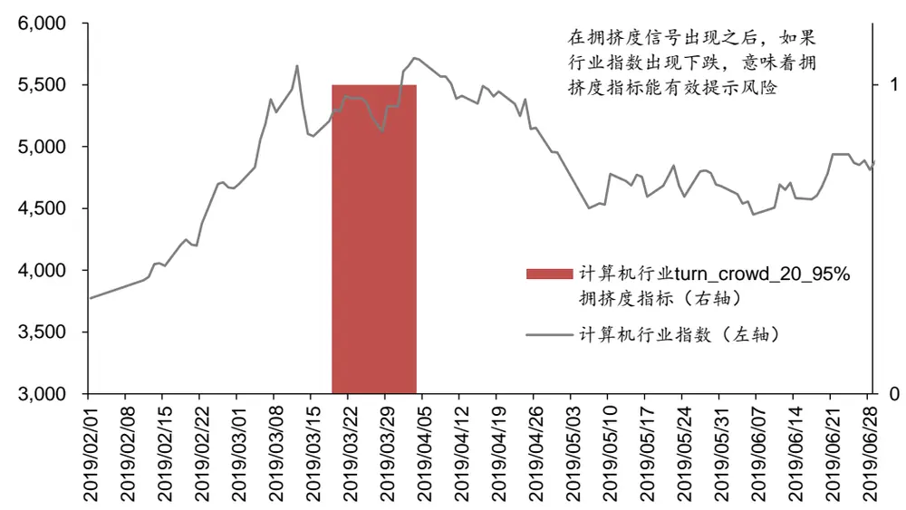
资料来源：Wind，华泰证券研究所

## 显著性检验

借助于显著性检验可以判断拥挤度指标对于行业指数收益率是否具有解释力度。以拥挤度信号为自变量，以未来一个月行业指数收益率（20 个交易日）作为因变量，可以构建如下的回归方程：

$$
r_{t}^{K}=\beta_{0}+\beta_{1}S_{t}^{K}+\varepsilon
$$

其中 $S_{t}^{K}$ 是行业 K在 t时刻的拥挤度指标， $S_{t}^{K}$ 取值为 1 时表示当前行业处于拥挤状态，取值为 0 时表示当前处于非拥挤状态； $r_{t}^{K}$ 表示行业 K在 t 时刻未来一个月收益率， $r_{t}^{K}$ 的取值与$S_{t}^{K}$ 一一对应； $\beta_{0}\hbar\pmb{\mathscr{p}}_{1}$ 是回归系数；ε为残差项。

通过线性回归求出的 $\beta_{0}$ 为处于非拥挤状态下各行业指数未来一个月的平均收益率， $\beta_{0}+\beta_{1}$ 为处于拥挤状态下各行业指数未来一个月的平均收益率。当 $\beta_{1}$ 显著不为 0 时，说明 $S_{t}^{K}\mathcal{\sharp}\mathfrak{er}_{t}^{K}$ 存在线性关系。对此我们通过假设检验判断 $\boldsymbol{\beta}_{1}$ 是否显著异于 0，即给出原假设 $H_{0}\colon\beta_{1}=0$ 计算假设检验 t统计量的 P值。本研究选取显著性水平为 1%的假设检验，即当 $\mathrm{P}<0.01$ 时拒绝原假设 $H_{0}$ ，认为此时 $\cdot\beta_{1}$ 显著不为 0，此时拥挤度指标通过显著性检验。

为了减少回归残差的异方差性对假设检验的影响，我们利用 Newey-West 自相关相容协方差方法（Heteroskedasticity and Autocorrelation Consistent Covariance）对残差自相关性进行处理。在这种方法下，回归系数的估计值不会发生变化，只是显著性检验 P值会发生改变，检验结果更加可靠。

计算结果显示，大部分拥挤度指标的显著性检验 P值在 0.01 以下，有 63%以上的指标通过了显著性检验。每项拥挤度指标通过显著性检验的比例有一定差别，夏普动量拥挤度、成交量拥挤度、偏度、协偏度四项指标受到参数影响较小，通过显著性检验指标占比在 80%以上，高于其他指标。

图表11： 拥挤度指标显著性检验结果

| 类别 | 指标名称 | 指标总数 | 通过显著性检验指标个数 | 通过显著性检验指标占比 |
| --- | --- | --- | --- | --- |
| 动量指标 | 普通动量拥挤度 | 12 | 6 | 50.00% |
|  | 夏普动量拥挤度 | 12 | 10 | 83.33% |
|  | 信息比率拥挤度 | 12 | 4 | 33.33% |
|  | 路径调整动量拥挤度 | 12 | 9 | 75.00% |
|  | 尾部动量拥挤度 | 12 | 9 | 75.00% |
| 流动性指标 | 成交量拥挤度 | 12 | 10 | 83.33% |
|  | 成交额拥挤度 | 12 | 7 | 58.33% |
|  | 换手率拥挤度 | 12 | 6 | 50.00% |
| 乖离率指标 | 收盘价乖离率 | 20 | 11 | 55.00% |
|  | 成交量乖离率 | 20 | 13 | 65.00% |
|  | 成交额乖离率 | 20 | 13 | 65.00% |
|  | 换手率乖离率 | 20 | 14 | 70.00% |
| 量价相关性 | 成交量与收盘价的相关系数 | 12 | 5 | 41.67% |
|  | 换手率与收盘价相关系数 | 12 | 7 | 58.33% |
|  | 成交额与收盘价相关系数 | 12 | 8 | 66.67% |
| 波动率指标 | 波动率拥挤度 | 12 | 7 | 58.33% |
|  | 下行波动率拥挤度 | 12 | 7 | 58.33% |
| 分布特征指标峰度 |  | 12 | 6 | 50.00% |
|  | 偏度 | 12 | 10 | 83.33% |
|  | 协偏度 | 12 | 10 | 83.33% |
| 总数 |  | 272 | 172 | 63.24% |

资料来源：Wind，华泰证券研究所

## 信号胜率检验

本小节将进一步借助信号胜率检验筛选能够预测未来出现下跌的拥挤度指标。拥挤度信号胜率定义为触发拥挤度信号之后一个月行业指数收益率为负的天数占比。拥挤度胜率越高，证明通过拥挤度指标识别出来可能出现下跌的信号越多。我们统计了每类拥挤度指标中拥挤度信号胜率大于 50%个数占比。计算结果显示，包含所有参数设定的 272 个指标中，只有 18%的指标同时通过显著性检验和信号胜率检验。量价相关性、波动率指标和分布特征指标信号更容易通过胜率检验，比其他三类指标更容易识别出可能出现下跌的行业指数。

图表12： 拥挤度指标的信号胜率统计

| 类别 | 指标名称 | 指标总数 | 通过显著性检验且胜 率大于 50%指标个数 | 通过显著性检验和信 号胜率检验指标比例 |
| --- | --- | --- | --- | --- |
| 动量指标 | 普通动量拥挤度 | 12 | 2 | 16.67% |
|  | 夏普动量拥挤度 | 12 | 0 | 0.00% |
|  | 信息比率拥挤度 | 12 | 2 | 16.67% |
|  | 路径调整动量拥挤度 | 12 | 0 | 0.00% |
|  | 尾部动量拥挤度 | 12 | 0 | 0.00% |
| 流动性指标 | 成交量拥挤度 | 12 | 0 | 0.00% |
|  | 成交额拥挤度 | 12 | 0 | 0.00% |
|  | 换手率拥挤度 | 12 | 5 | 41.67% |
| 乖离率指标 | 收盘价乖离率 | 20 | 2 | 10.00% |
|  | 成交量乖离率 | 20 | 0 | 0.00% |
|  | 成交额乖离率 | 20 | 0 | 0.00% |
|  | 换手率乖离率 | 20 | 1 | 5.00% |
|  | 成交量与收盘价的相关系数 | 12 | 5 | 41.67% |
| 量价相关性 波动率指标 | 换手率与收盘价相关系数 | 12 | 7 | 58.33% |
|  | 成交额与收盘价相关系数 | 12 | 4 | 33.33% |
|  | 波动率拥挤度 | 12 | 6 | 50.00% |
|  | 下行波动率拥挤度 | 12 | 6 | 50.00% |
| 分布特征指标 | 峰度 | 12 | 3 | 25.00% |
|  | 偏度 | 12 | 4 | 33.33% |
|  | 协偏度 | 12 | 2 | 16.67% |
| 总数 |  | 272 | 49 | 18.01% |

资料来源：Wind，华泰证券研究所

对单项景气度指标来说，参数的选取对于信号胜率的影响存在一定的规律。以成交量和收盘价相关系数指标为例，历史分位数阈值越低，对应的信号胜率越高，更容易识别出未来会出现下跌的情形。一般情况下，如果拥挤度指标分位数阈值设定越接近极端情况（比如正向指标趋向于 1%，负向指标趋向于 99%），信号胜率越高。不过分位数阈值取值过于极端会导致发出的拥挤度信号变的很少，致使指标失去应用价值。具体的参数取值还要结合回测检验以及过拟合检验进行对比分析。

图表13： corr_volume_close 指标信号胜率

|  | 分位数阈值 1% | 分位数阈值 5% | 分位数阈值 10% | 分位数阈值 20% |
| --- | --- | --- | --- | --- |
| 窗口期20日 | 54.76% | 51.82% | 49.96% | 49.28% |
| 窗口期 40日 | 69.17% | 55.85% | 54.02% | 51.23% |
| 窗口期60日 | 54.07% | 43.23% | 43.09% | 44.25% |

资料来源：Wind，华泰证券研究所

图表14： corr_volume_close 指标各行业平均拥挤信号数量

|  | 分位数阈值 1% | 分位数阈值 5% | 分位数阈值 10% | 分位数阈值 20% |
| --- | --- | --- | --- | --- |
| 窗口期20日 | 8.69 | 43.59 | 94.41 | 202.72 |
| 窗口期40日 | 12.41 | 52.79 | 105.00 | 212.31 |
| 窗口期60日 | 14.41 | 48.66 | 97.79 | 204.03 |

资料来源：Wind，华泰证券研究所

## 回测收益检验

本小节将在显著性检验和信号胜率检验基础上，采用回测收益检验的方法判断能否基于拥挤度信号构建有效的行业组合。拥挤度指标是一个避险指标，在资产组合构建过程中，应该把处于拥挤状态的行业从投资组合中剔除。如果基于拥挤度指标构建的非拥挤行业组合可以跑赢行业等权基准，表明这个指标能够筛选未来将出现下跌的行业。

为了更贴合行业轮动策略的投资逻辑，本研究构建了“月度调仓，每日监测”的回测过程，核心思路是每月底选出非拥挤行业组合作为底仓，在每个交易日监测各行业是否处于拥挤状态，及时对处于拥挤状态的行业进行清仓，详细过程如下：

1. 建仓过程：在第一个拥挤度信号发出之后，于次日将所有处于非拥挤状态的行业进行等权配置，构建初始组合。

2. 持仓过程：在每个交易日根据资产价格计算持有各行业的资金变动情况。如果拥挤度信号提示某个行业处于拥挤状态，在下一个交易日进行清仓。汇总每日持有资金总额，计算资产组合净值。

3. 调仓过程：在每月底汇总当前持有资金，于月初的第一个交易日对处于非拥挤状态的行业进行等权配置，直至回测结束。

上述回测过程具有较强的拓展性，可以将拥挤度策略和其他行业轮动策略相结合。比如每月调仓时可以通过其他策略（比如景气度策略）构建底仓，于每个交易日进行拥挤度监测，通过拥挤度指标提高其他轮动策略回测表现。

图表15： 基于拥挤度指标构建的回测流程示意
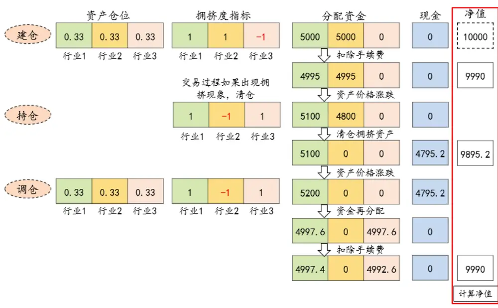
资料来源：华泰证券研究所

回测结果显示，通过了显著性检验和信号胜率检验的拥挤度指标，回测年化收益率普遍能够超越行业等权基准。前两个过程筛选出的总计 49 个拥挤度指标中，有 45 个可以取得正超额收益。通过检验的指标中量价相关性指标和波动率类指标居多。回测表现最好的是downvol_60_80%指标，能够取得接近 4%的年化超额收益。

图表16： 通过显著性检验和信号胜率检验的拥挤度指标回测结果

| 指标代码 | 年化收益率 | 年化波动率 |  | 夏普比率最大回撤 | 月频调仓胜率 |
| --- | --- | --- | --- | --- | --- |
| close_bias_120_95% | 6.08% | 26.00% | 0.23 | -54.52% | 20.00% |
| close_bias_250_90% | 6.15% | 26.00% | 0.24 | -54.53% | 33.33% |
| corr_amt_close_40_1% | 6.26% | 26.15% | 0.24 | -56.27% | 57.89% |
| corr_amt_close_40_10% | 7.00% | 25.22% | 0.28 | -54.12% | 43.96% |
| corr_amt_close_40_20% | 6.20% | 24.46% | 0.25 | -51.38% | 46.73% |
| corr_amt_close_40_5% | 6.89% | 25.64% | 0.27 | -54.30% | 45.59% |
| corr_turn_close_20_1% | 6.66% | 25.78% | 0.26 | -52.86% | 44.74% |
| corr_turn_close_20_5% | 7.29% | 24.90% | 0.29 | -47.12% | 46.91% |
| corr_turn_close_40_1% | 6.34% | 25.98% | 0.24 | -55.64% | 56.25% |
| corr_turn_close_40_10% | 5.84% | 24.84% | 0.24 | -51.61% | 41.11% |
| corr_turn_close_40_20% | 5.39% | 23.81% | 0.23 | -50.46% | 43.75% |
| corr_turn_close_40_5% | 5.79% | 25.43% | 0.23 | -54.18% | 44.62% |
| corr_turn_close_60_1% | 6.39% | 26.01% | 0.25 | -54.83% | 42.31% |
| corr_volume_close_40_1% | 6.22% | 26.10% | 0.24 | -56.48% | 57.58% |
| corr_volume_close_40_10% | 5.80% | 24.92% | 0.23 | -52.87% | 43.48% |
| corr_volume_close_40_20% | 5.03% | 24.13% | 0.21 | -50.70% | 44.64% |
| corr_volume_close_40_5% | 6.04% | 25.58% | 0.24 | -55.13% | 48.48% |
| corr_volume_close_60_1% | 6.22% | 26.09% | 0.24 | -56.12% | 53.13% |
| coskewness_40_1% | 5.34% | 25.78% | 0.21 | -57.49% | 32.61% |
| coskewness_40_5% | 5.67% | 25.01% | 0.23 | -55.84% | 50.00% |
| downvol_20_90% | 8.25% | 24.27% | 0.34 | -45.90% | 54.55% |
| downvol_20_95% | 7.53% | 25.06% | 0.30 | -50.67% | 50.00% |
| downvol_40_80% | 7.71% | 24.24% | 0.32 | -48.36% | 52.38% |
| downvol_40_90% | 6.50% | 24.99% | 0.26 | -55.19% | 60.00% |
| downvol_60_80% | 9.36% | 24.05% | 0.39 | -43.44% | 57.89% |
| information_momentum_crowd_20_95% | 5.36% | 24.54% | 0.22 | -52.73% | 55.17% |
| information_momentum_crowd_20_99% | 5.60% | 26.16% | 0.21 | -56.90% | 40.00% |
| kurtosis_60_1% | 6.21% | 25.78% | 0.24 | -55.48% | 43.24% |
| kurtosis_60_10% | 4.76% | 24.56% | 0.19 | -57.51% | 45.83% |
| kurtosis_60_5% | 5.56% | 25.18% | 0.22 | -57.45% | 52.11% |
| normal_momentum_crowd_20_99% | 7.19% | 25.33% | 0.28 | -47.28% | 33.33% |
| normal_momentum_crowd_60_95% | 6.47% | 25.42% | 0.25 | -46.26% | 45.45% |
| skewness_20_1% | 6.40% | 26.05% | 0.25 | -55.10% | 50.00% |
| skewness_20_10% | 8.39% | 24.19% | 0.35 | -44.53% | 51.65% |
| skewness_20_5% | 8.19% | 25.01% | 0.33 | -44.45% | 46.67% |
| skewness_60_20% | 8.70% | 23.69% | 0.37 | -44.91% | 53.33% |
| turn_bias_250_90% | 6.34% | 26.22% | 0.24 | -58.58% | 50.00% |
| turn_crowd_20_95% | 6.91% | 25.77% | 0.27 | -51.71% | 57.14% |
| turn_crowd_40_90% | 5.92% | 25.68% | 0.23 | -54.56% | 40.00% |
| turn_crowd_60_80% | 6.97% | 24.29% | 0.29 | -47.74% | 61.76% |
| turn_crowd_60_90% | 6.84% | 25.55% | 0.27 | -51.95% | 36.84% |
| turn_crowd_60_95% | 5.73% | 26.40% | 0.22 | -58.58% | 50.00% |
| vol_20_90% | 8.22% | 24.16% | 0.34 | -44.84% | 53.85% |
| vol_20_95% | 6.99% | 24.93% | 0.28 | -52.35% | 50.00% |
| vol_40_80% | 6.68% | 24.33% | 0.27 | -49.14% | 48.15% |
| vol_40_90% | 7.07% | 24.64% | 0.29 | -52.60% | 54.55% |
| vol_60_80% | 8.91% | 23.98% | 0.37 | -43.44% | 50.00% |
| 行业等权基准 | 5.36% | 26.45% | 0.20 | -58.69% |  |

资料来源：Wind，华泰证券研究所

## 过拟合检验

前面三轮检验可以初步筛选出能够起到风险提示作用的指标。但是每项拥挤度指标都有几个备选参数供选择。我们最后将借助过拟合检验筛选过拟合风险较小的指标，并对最终选定的单项拥挤度指标进行可靠的参数设定。

在华泰金工人工智能系列报告（《基于 CSCV 框架的回测过拟合概率》，2019-6-17）中，我们引入了组合对称交叉验证（CSCV）框架计算策略的过拟合概率（PBO），对策略过拟合程度进行定量分析。PBO 概率定义为：样本内最优参数在样本外的夏普比率排名位于后 50%的概率。一般情况下 PBO 概率小于 50%可以认为过拟合概率不高。PBO 越小，回测过拟合概率越低。

图表17： CSCV框架示意图

红色对应“训练集”表现最好的策略，如果该策略在“测试集”排名处于后50%，说明可能出现回测过拟合
资料来源:华泰证券研究所

举例来说，在计算普通动量拥挤度时，需要引入窗口期长度和历史分位数阈值两个参数，取值范围分别是[20/40/60]日以及 [80%/90%/95%/99%]，我们在回测过程中发现窗口期长度为 20日、历史分位数阈值设定为 99%时，普通动量拥挤度策略的回测年化收益率最高。对于普通动量拥挤度指标来说，20 日和 99%这组参数作为最优参数的过拟合概率具体有多大，可以通过 CSCV方法进行定量验证，具体计算流程如下：

1. 汇总基于不同参数计算的策略收益率序列。若总共有N组参数，收益率序列长度为T，可以得到收益率矩阵 ${\mathbf{\nabla}}M_{T\times N}$ 。将 $M_{T\times N}$ 矩阵从时间维度上划分为 S个子矩阵。

2. 从 S个子矩阵中任意选出半数作为测试集，余下作为训练集。遍历所有可能组合，依据组合原理，可以得到 $C_{s}^{s_{/2}}$ 组测试集和对应训练集。

3. 分析每组训练集中夏普比最高的参数组合，计算其在相应测试集的相对排名 $\omega_{i}$ ，汇总依据所有测试集和训练集计算的排名情况 $\boldsymbol{\omega}=(\omega_{1},\omega_{2},\ldots,\omega_{n})\quad(n={C}_{s}^{S}/_{2})$

4. 统计 $\omega$ 中位于测试集后一半排名的个数占比，作为回测过拟合概率 PBO。

通常来说划分子集数 S 取值越大，收益率矩阵 ${\mathbf{\nabla}}M_{T\times N}$ 将被切割的越来越细，测试集和训练集数目越多，PBO 计算结果越准确。本研究进行的过拟合测试中，划分子集数 S 分别设定为 4、6、8、10、12、14 和 16，并统计在不同划分子集数下回测过拟合概率的均值。

如果某个拥挤度指标的 PBO 高，说明训练集中表现好的参数在测试集中往往表现较差，意味着这个指标的参数设定过程存在较大的过拟合风险。指标的 PBO 越高，过拟合风险越大。我们会对需要设置参数的 20 项拥挤度指标进行过拟合概率计算，在保证有效性的同时寻找过拟合概率较低的拥挤度指标。

我们将过拟合概率小于 50%作为过拟合检验的通过标准，计算结果显示：总计 20项拥挤度指标中，有 9项指标的回测过拟合概率在 50%以下。最终通过显著性检验、信号胜率检验、回测收益检验以及过拟合检验的指标总共有 6项：换手率拥挤度、收盘价乖离率、换手率乖离率、成交量与收盘价的相关系数、换手率与收盘价相关系数、峰度。在考虑参数设定之后，总共有 21个拥挤度指标通过检验。

图表18： 各项拥挤度指标 PBO概率

| 指标名称 | 指标代码 | S=4 | S=6 | S=8 | S=10 | S=12 | S=14 | S=16 | PBO 平均值 |
| --- | --- | --- | --- | --- | --- | --- | --- | --- | --- |
| 成交量乖离率 | volume_bias | 0.00% | 5.00% | 7.14% | 3.57% | 7.36% | 6.93% | 3.61% | 4.80% |
| 成交额乖离率 | amt_bias | 16.67% | 5.00% | 7.14% | 5.95% | 6.60% | 9.29% | 7.75% | 8.34% |
| 收盘价乖离率 | close_bias | 16.67% | 15.00% | 7.14% | 9.13% | 14.07% | 11.92% | 14.79% | 12.67% |
| 换手率乖离率 | turn_bias | 16.67% | 10.00% | 12.86% | 20.63% | 12.66% | 14.22% | 7.96% | 13.57% |
| 峰度 | kurtosis | 16.67% | 20.00% | 30.00% | 23.81% | 29.44% | 32.20% | 38.21% | 27.19% |
| 换手率拥挤度 | turn_crowd | 50.00% | 45.00% | 48.57% | 43.65% | 41.02% | 35.96% | 31.25% | 42.21% |
| 成交量与收盘价的相关系数 | corr_volume_close | 66.67% | 35.00% | 37.14% | 28.97% | 45.02% | 44.17% | 47.07% | 43.43% |
| 换手率与收盘价相关系数 | corr_turn_close | 50.00% | 50.00% | 54.29% | 36.51% | 53.03% | 54.28% | 50.51% | 49.80% |
| 夏普动量拥挤度 | sharpe_momentum_crowd | 50.00% | 40.00% | 47.14% | 50.40% | 49.46% | 55.86% | 56.37% | 49.89% |
| 普通动量拥挤度 | normal_momentum_crowd | 50.00% | 45.00% | 45.71% | 45.24% | 54.98% | 57.34% | 59.27% | 51.08% |
| 成交额与收盘价相关系数 | corr_amt_close | 83.33% | 35.00% | 48.57% | 48.41% | 63.85% | 61.31% | 64.62% | 57.87% |
| 成交额拥挤度 | amt_crowd | 66.67% | 60.00% | 48.57% | 51.19% | 71.32% | 64.89% | 58.73% | 60.20% |
| 偏度 | skewness | 83.33% | 65.00% | 47.14% | 65.08% | 59.42% | 57.98% | 56.82% | 62.11% |
| 路径调整动量拥挤度 | distance_momentum_crowd | 66.67% | 60.00% | 58.57% | 53.97% | 63.42% | 67.57% | 66.13% | 62.33% |
| 下行波动率拥挤度 | downvol | 66.67% | 70.00% | 80.00% | 75.00% | 66.67% | 62.79% | 65.01% | 69.45% |
| 波动率拥挤度 | vol | 100.00% | 90.00% | 75.71% | 67.06% | 54.76% | 41.29% | 60.63% | 69.92% |
| 协偏度 | coskewness | 50.00% | 80.00% | 68.57% | 78.97% | 82.03% | 82.78% | 80.89% | 74.75% |
| 信息比率拥挤度 | information_momentum_crowd | 83.33% | 65.00% | 81.43% | 71.43% | 72.94% | 76.66% | 78.20% | 75.57% |
| 成交量拥挤度 | volume_crowd | 66.67% | 70.00% | 72.86% | 78.97% | 83.77% | 84.70% | 82.28% | 77.04% |
| 尾部动量拥挤度 | tail_momentum_crowd | 100.00% | 85.00% |  | 75.71%84.13% | 79.98% |  | 83.89% 79.97% | 84.10% |

资料来源：Wind，华泰证券研究所

图表19： 通过四项检验的指标个数统计

| 类别 | 指标名称 | 指标总数 | 通过显著性检验 | 通过信号胜率检验 | 通过回测收益检验 | 通过过拟合检验 |
| --- | --- | --- | --- | --- | --- | --- |
| 动量指标 | 普通动量拥挤度 | 12 | 6 | 2 | 2 | 0 |
|  | 夏普动量拥挤度 | 12 | 10 | 0 | 0 | 0 |
|  | 信息比率拥挤度 | 12 | 4 | 2 | 1 | 0 |
|  | 路径调整动量拥挤度 | 12 | 9 | 0 | 0 | 0 |
|  | 尾部动量拥挤度 | 12 | 9 | 0 | 0 | 0 |
|  | 成交量拥挤度 | 12 | 10 | 0 | 0 | 0 |
| 乖离率指标 | 成交额拥挤度 | 12 | 7 | 0 | 0 | 0 |
|  | 换手率拥挤度 | 12 | 6 | 5 | 5 | 5 |
|  | 收盘价乖离率 | 20 | 11 | 2 | 2 | 2 |
|  | 成交量乖离率 | 20 | 13 | 0 | 0 | 0 |
|  | 成交额乖离率 | 20 | 13 | 0 | 0 | 0 |
|  | 换手率乖离率 | 20 | 14 | 1 | 1 | 1 |
|  | 成交量与收盘价的相关系数 | 12 | 5 | 5 | 4 | 4 |
|  | 换手率与收盘价相关系数 | 12 | 7 | 7 | 7 | 7 |
|  | 成交额与收盘价相关系数 | 12 | 8 | 4 | 4 | 0 |
| 波动率指标 | 波动率拥挤度 | 12 | 7 | 6 | 6 | 0 |
|  | 下行波动率拥挤度 | 12 | 7 | 6 | 6 | 0 |
| 分布特征指标 | 峰度 | 12 | 6 | 3 | 2 | 2 |
|  | 偏度 | 12 | 10 | 4 | 4 |  |
|  | 协偏度 | 12 | 10 | 2 | 1 | 0 0 |
| 总数 |  | 272 | 172 | 49 | 45 | 21 |

注：表中统计逐个通过各项检验的指标个数，比如通过信号胜率检验一栏，统计的是同时通过显著性检验和信号胜率检验的指标个数
资料来源：Wind，华泰证券研究所

为了避免重复，我们规定选出的每项拥挤度指标只保留一个最优的参数设定。在 CSCV 框架下，训练集中的每组收益率序列都是通过原始策略收益率序列排列组合得到的，那么在每组训练集上都可以筛选出一个最优参数，一共有 $C_{s}^{s_{/2}}$ 组训练集就对应可得 $c_{s}^{s}/{}_{2}$ 组最优参数。对这 $C_{s}^{s_{/2}}$ 组最优参数进行统计，我们可以得到每个参数作为最优参数出现的次数。上述过程相当于对回测时间进行排列组合，再由蒙特卡洛模拟计算最优参数出现的比率。如果某个参数作为最优参数出现的频率越高，说明这组参数对应的收益率序列在大多数情况下都有着优异的表现，不易受到回测区间选取的限制。

通过上述过程，可以针对每项拥挤度指标，计算其最优参数在训练集上出现的次数，并据此确定每项拥挤度指标的最优参数。经过筛选，我们最终选出的六个拥挤度指标如下：corr_volume_close_40_1% 、 corr_turn_close_60_1% 、 close_bias_250_90% 、kurtosis_60_1%、turn_bias_250_90%以及 turn_crowd_20_95%。

图表20： 各指标作为最优参数出现概率以及最终选定指标（S=16）

| 指标类型 | 指标代码 | 显著性检验 P值信号胜率 |  | 回测年化收益率过拟合概率 |  | 作为最优参数出现概率 |
| --- | --- | --- | --- | --- | --- | --- |
| 收盘价乖离率 | close_bias_120_95% | 0.0000 | 35.57% | 6.08% | 12.67% | 0.01% |
|  | close_bias_250_90% | 0.0000 | 26.43% | 6.15% | 12.67% | 86.09% |
| 换手率与收盘价相关系数 | corr_turn_close_20_1% | 0.0066 | 44.85% | 6.66% | 49.80% | 21.50% |
|  | corr_turn_close_20_5% | 0.0062 | 48.39% | 7.29% | 49.80% | 1.00% |
|  | corr_turn_close_40_1% | 0.0000 | 31.94% | 6.34% | 49.80% | 23.40% |
|  | corr_turn_close_40_10% | 0.0000 | 46.61% | 5.84% | 49.80% | 1.08% |
|  | corr_turn_close_40_20% corr_turn_close_40_5% | 0.0006 | 49.35% | 5.39% | 49.80% | 1.68% |
|  | corr_turn_close_60_1% | 0.0000 0.0000 | 43.67% 42.40% | 5.79% | 49.80% | 0.60% |
| 成交量与收盘价的相关系数 |  |  |  | 6.39% | 49.80% | 45.18% |
|  | corr_volume_close_40_1% | 0.0000 | 30.83% | 6.22% | 43.43% | 39.04% |
|  | corr_volume_close_40_10% | 0.0000 | 45.98% | 5.80% | 43.43% | 1.35% |
|  | corr_volume_close_40_20% | 0.0000 | 48.77% | 5.03% | 43.43% | 0.34% |
|  | corr_volume_close_40_5% corr_volume_close_60_1% | 0.0000 | 44.15% 45.93% | 6.04% | 43.43% | 1.10% |
| 峰度 | kurtosis_60_1% | 0.0000 |  | 6.22% | 43.43% | 33.23% |
|  |  | 0.0000 | 41.00% | 6.21% | 27.19% | 51.13% |
|  | kurtosis_60_10% | 0.0057 | 48.74% 47.53% | 4.76% | 27.19% | 0.14% |
| 换手率乖离率 | kurtosis_60_5% | 0.0000 | 44.65% | 5.56% | 27.19% | 6.46% |
| 换手率拥挤度 | turn_bias_250_90% turn_crowd_20_95% | 0.0004 0.0000 | 36.34% | 6.34% 6.91% | 13.57% 42.21% | 71.17% 33.10% |
|  | turn_crowd_40_90% | 0.0001 | 44.67% | 5.92% | 42.21% | 7.41% |
|  | turn_crowd_60_80% | 0.0005 | 49.04% | 6.97% | 42.21% | 1.32% |
|  | turn_crowd_60_90% | 0.0000 | 33.70% | 6.84% | 42.21% | 7.85% |
|  | turn_crowd_60_95% | 0.0000 | 33.33% | 5.73% | 42.21% | 29.87% |

资料来源：Wind，华泰证券研究所

## 基于拥挤度指标的行业轮动策略

## 复合拥挤度指标的构建

经过层层筛选，我们最终选定了六个单项拥挤度指标进行复合指标构建。每个拥挤度指标相当于从特定的角度对当前市场是否处于拥挤状态做出定量判定，当六个单项指标有任意一个显示当前处于拥挤状态时，就可以触发复合拥挤度指标的信号。即六个拥挤度指标中有任意一个数值为 1时，复合拥挤度指标数值就标为 1，反之标为 0。

我们基于复合拥挤度指标构建非拥挤行业组合进行回测收益检验，结果显示：复合拥挤度指标能够取得显著优于单项指标的回测效果，复合指标的回测年化收益率、夏普比率和胜率优于各个单项指标，波动率和最大回撤也低于单项指标。

图表21： 复合拥挤度指标和各单项指标回测结果对比（回测区间 2010年 2月-2019年 12月）

|  | 年化收益率 | 年化波动率 | 夏普比率 | 最大回撤 | 月频调仓胜率 |
| --- | --- | --- | --- | --- | --- |
| close_bias_250_90% | 6.15% | 26.00% | 0.24 | -54.53% | 33.33% |
| corr_turn_close_60_1% | 6.39% | 26.01% | 0.25 | -54.83% | 42.31% |
| corr_volume_close_40_1% | 6.22% | 26.10% | 0.24 | -56.48% | 57.58% |
| kurtosis_60_1% | 6.21% | 25.78% | 0.24 | -55.48% | 43.24% |
| turn_bias_250_90% | 6.34% | 26.22% | 0.24 | -58.58% | 50.00% |
| turn_crowd_20_95% | 6.91% | 25.77% | 0.27 | -51.71% | 57.14% |
| 复合拥挤度指标 | 9.28% | 24.28% | 0.38 | -42.95% | 58.82% |
| 行业等权基准 | 5.36% | 26.45% | 0.20 | -58.69% |  |

资料来源：Wind，华泰证券研究所

复合拥挤度指标可以稳定地筛选出当前处于交易过热状态的行业指数，有效规避风险，提高策略收益。基于复合拥挤度指标构建的非拥挤行业组合在除了 2013、2014 年之外都能跑赢行业等权基准，有着相对稳定的收益。拥挤度指标在 2015、2016 和 2019 年有较好的表现，这些年份中市场都出现了大幅度的波动，更容易触发拥挤度信号，在这三个年份非拥挤行业组合能够分别取得 18.11%、9.90%和 8.22%的超额年化收益。从回测相对净值来看，在 2015 和 2016 年时，拥挤度指标在市场出现急速下跌之前就发出了拥挤信号，避免出现较大的损失。

图表22： 拥挤度复合指标回测绝对净值
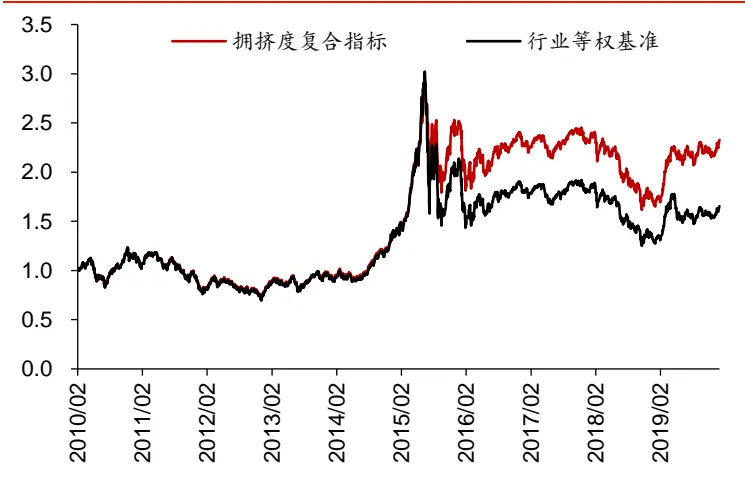
资料来源：Wind，华泰证券研究所

图表23： 拥挤度复合指标回测相对净值
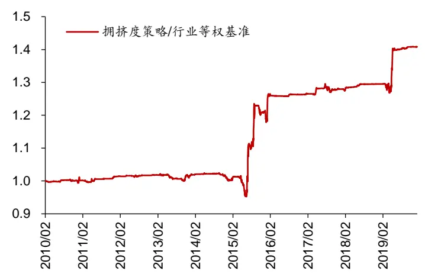
资料来源：Wind，华泰证券研究所

图表24： 复合拥挤度指标超额收益月度统计

|  | 1月 | 2月 | 3月 | 4月 | 5月 | 6月 | 7月 | 8月 | 9月 | 10月 | 11月 | 12月 | 全年 |
| --- | --- | --- | --- | --- | --- | --- | --- | --- | --- | --- | --- | --- | --- |
| 2010 |  | -0.25% | 0.03% | 0.03% | -0.03% | 0.38% | 0.07% | 0.07% | 0.05% | -0.31% | 0.12% | 0.02% | 0.18% |
| 2011 | -0.33% | -0.23% | -0.23% | 0.47% | 0.32% | -0.09% | 0.01% | 0.11% | 0.02% | 0.02% | 0.70% | -0.05% | 0.71% |
| 2012 | 0.07% | -0.03% | 0.29% | -0.14% | -0.01% | 0.04% | 0.00% | 0.15% | -0.10% | 0.01% | 0.05% | 0.05% | 0.37% |
| 2013 | 0.03% | 0.06% | 0.28% | -0.20% | -0.95% | -0.29% | -0.01% | -0.19% | -0.47% | 1.46% | -0.68% | 0.90% | -0.10% |
| 2014 | 0.18% | 0.04% | 0.06% | 0.05% | -0.06% | 0.01% | -0.04% | 0.10% | -0.27% | -0.51% | -0.64% | -0.81% | -1.89% |
| 2015 | 0.92% | 0.10% | -0.52% | -1.95% | -3.28% | 11.83% | 3.05% | 8.56% | 2.10% | -2.05% | 0.79% | -1.73% | 18.11% |
| 2016 | 9.90% | -0.14% | -0.03% | -0.04% | -0.02% | -0.01% | 0.21% | 0.16% | 0.00% | -0.13% | 0.00% | 0.00% | 9.90% |
| 2017 | 0.18% | -0.01% | 0.02% | 1.22% | 0.05% | -0.45% | 0.07% | -0.56% | 0.22% | 0.12% | 0.10% | -0.01% | 0.94% |
| 2018 | 0.08% | 0.35% | 0.04% | 0.10% | 0.34% | 0.26% | 0.04% | -0.01% | 0.01% | 0.00% | -0.10% | -0.04% | 1.07% |
| 2019 | 0.05% | -0.27% | -0.73% | 3.99% | 4.28% | 0.19% | -0.05% | 0.03% | 0.33% | 0.09% | 0.14% | 0.02% | 8.22% |

资料来源：Wind，华泰证券研究所

拥挤度指标在市场出现急涨和急跌之时有较好的表现，这也符合我们对于拥挤度的预期，即回避处于“拥挤”状态的市场。拥挤度指标会着重关注市场是否处于异常交易过热状态，规避急速上涨之后的风险。比如在 2015、2016 和 2019 年市场急速上涨之时，拥挤度信号触发次数显著增加，此时如果进行清仓的话，就能减小随之而来的下跌风险。

相较之下，在市场阴跌（2010-2014 年）或是温和上涨（2017 年）之时，市场成交量和收盘价的变化幅度较小，达不到“拥挤”的程度。因此在这些时间段，拥挤度策略没有用武之地，难以取得显著的超额收益。

图表25： 处于拥挤状态的行业个数和上证综指对比
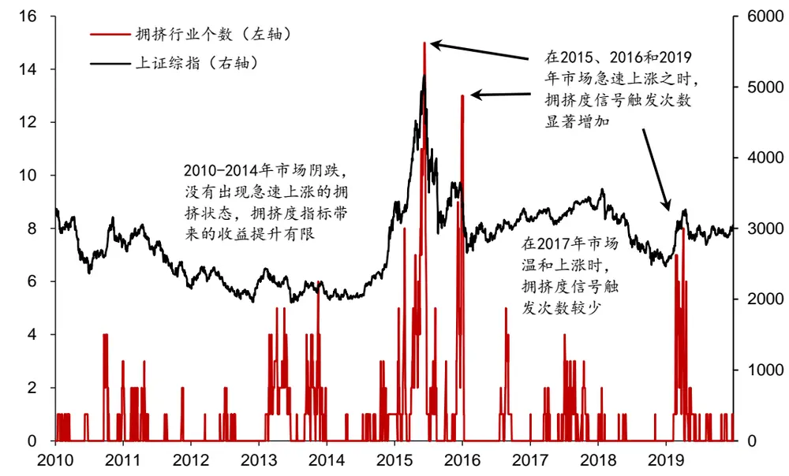
资料来源：Wind，华泰证券研究所

## 拥挤度和景气度复合策略

基于拥挤度指标可以对目前已有的行业轮动策略进行改进，通过规避下跌风险来提高策略的收益，减少最大回撤。在前期报告《景气度指标在行业配置中的应用》（2019-9-12）中，我们构建了基于景气度指标的月频行业轮动策略。本小节将把景气度策略和拥挤度指标结合起来，采用拥挤度指标对景气度策略进行改进。景气度和拥挤度复合策略构建过程如下：

1. 建仓过程：通过筛选景气度最高的五个行业，剔除其中处于拥挤状态的行业进行等权等权配置，构建初始组合。

2. 持仓过程：在每个交易日判断各行业是否处于拥挤状态，对处于拥挤状态的行业在下一个交易日进行清仓处理。

3. 调仓过程：在每月底筛选最景气的五个行业，对其中处于非拥挤状态的行业进行等权配置，直至回测结束。

图表26： 景气度和拥挤度复合策略
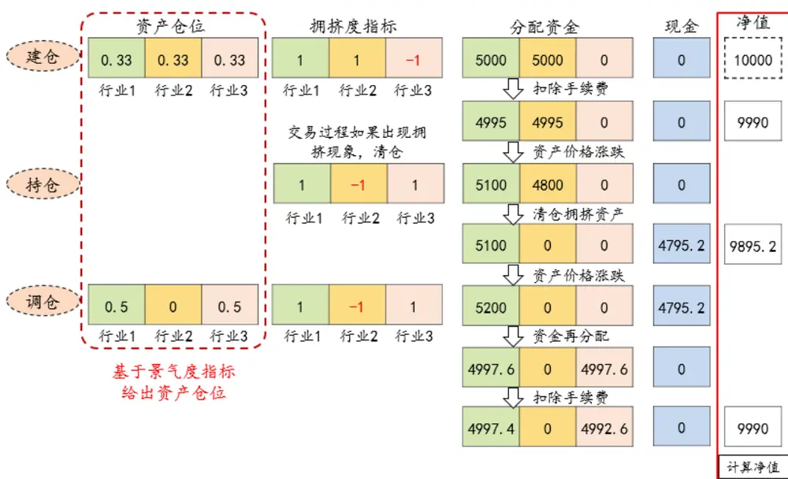
资料来源:华泰证券研究所

加入拥挤度指标后，景气度策略的回测收益有着显著提升。拥挤度和景气度复合策略的年化收益率可以达到 20.83%，优于景气度策略 13.33%的年化收益率。复合策略最大回撤为-36.50%，相比于原策略的-56.05%也有大幅提升。此外，景气度和拥挤度复合策略调仓胜率为 67.23%，高于纯景气度策略。

图表27： 拥挤度和景气度指标复合后策略表现

|  | 年化收益率 | 年化波动率 | 夏普比率 |  | 最大回撤 月频调仓胜率 |
| --- | --- | --- | --- | --- | --- |
| 景气度+拥挤度策略 | 20.83% | 24.44% | 0.85 | -36.50% | 67.23% |
| 拥挤度策略 | 9.28% | 24.28% | 0.38 | -42.95% | 58.82% |
| 景气度策略 | 13.33% | 27.72% | 0.48 | -56.05% | 65.55% |
| 行业等权基准 | 5.36% | 26.45% | 0.20 | -58.69% |  |

资料来源：Wind，华泰证券研究所

景气度和拥挤度复合策略相比于纯景气度策略有着稳定的超额收益。拥挤度指标为景气度策略带来的超额收益主要在 2015、2016 年以及 2019 年初，在这三个时段可以借助拥挤度指标有效规避下跌风险。

图表28： 景气度和拥挤度复合策略回测相对净值
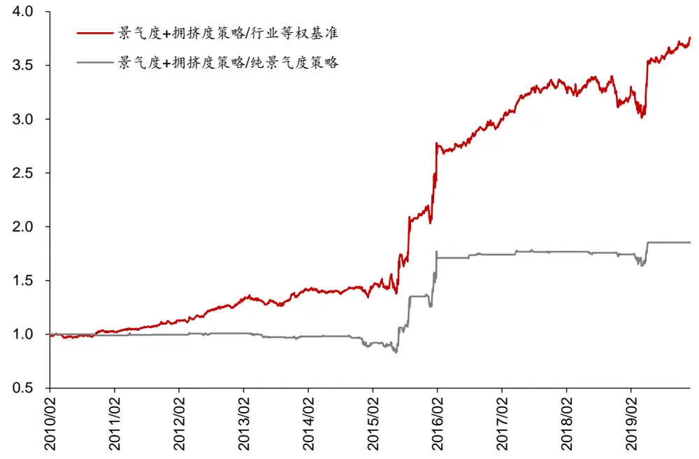
资料来源：Wind，华泰证券研究所

图表29： 景气度和拥挤度策略回测净值
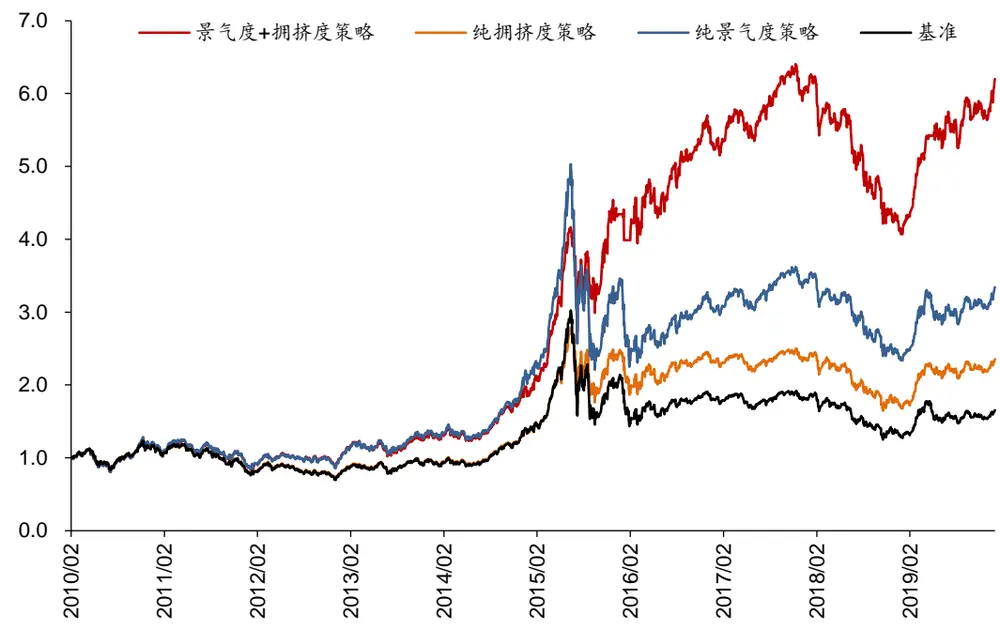
资料来源：Wind，华泰证券研究所

我们举例说明拥挤度指标在和景气度指标复合时所起到的规避风险作用：2019 年初房地产行业景气度相对较高，被景气度策略选中，行业指数量价齐升。到了 2019 年 4 月中下旬房地产指数仍然盘桓高位，但是成交量不断萎缩，量价走势出现背离。量价相关系数在4 月 22 日处于历史低位，触发拥挤信号，提示市场当前风险较大。在 4 月末房地产行业指数出现回调，如果依照拥挤度指标进行提前清仓，就可以减小下跌损失。

图表30： 房地产行业（中信）收盘价和相关系数
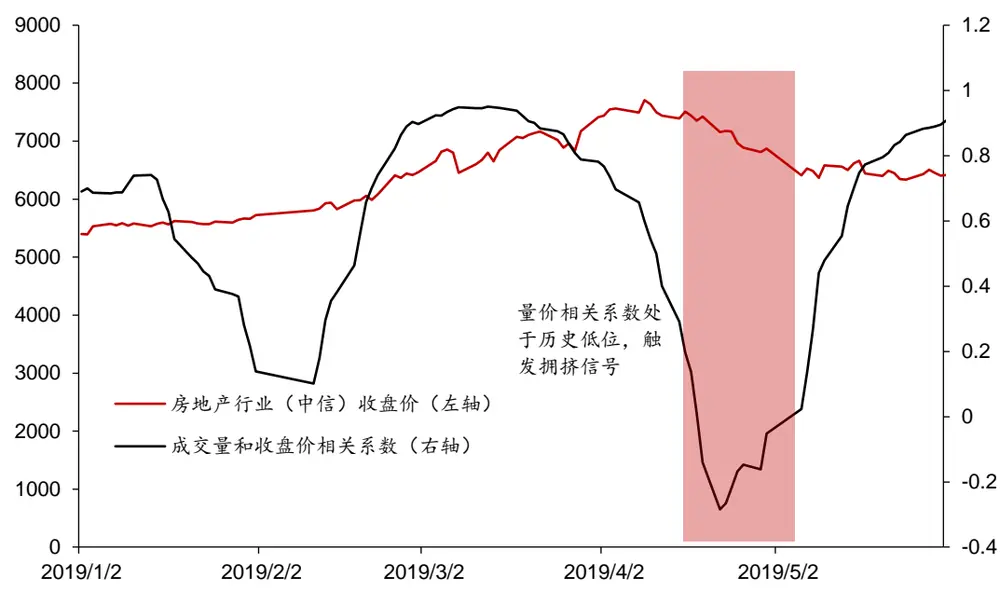
资料来源：Wind，华泰证券研究所

图表31： 房地产行业（中信）成交量和收盘价
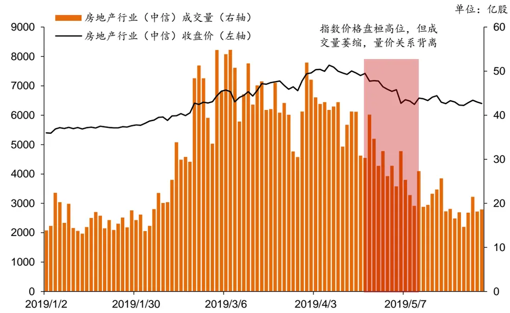
资料来源：Wind，华泰证券研究所

## 风险提示

1. 模型根据历史规律总结，历史规律可能失效。

2. 市场出现超预期波动，导致拥挤交易。

3. 报告中涉及到的具体行业不代表任何投资意见，请投资者谨慎、理性地看待。

## 免责申明

本报告仅供华泰证券股份有限公司（以下简称“本公司”）客户使用。本公司不因接收人收到本报告而视其为客户。

本报告基于本公司认为可靠的、已公开的信息编制，但本公司对该等信息的准确性及完整性不作任何保证。本报告所载的意见、评估及预测仅反映报告发布当日的观点和判断。在不同时期，本公司可能会发出与本报告所载意见、评估及预测不一致的研究报告。同时，本报告所指的证券或投资标的的价格、价值及投资收入可能会波动。本公司不保证本报告所含信息保持在最新状态。本公司对本报告所含信息可在不发出通知的情形下做出修改，投资者应当自行关注相应的更新或修改。

本公司力求报告内容客观、公正，但本报告所载的观点、结论和建议仅供参考，不构成所述证券的买卖出价或征价。该等观点、建议并未考虑到个别投资者的具体投资目的、财务状况以及特定需求，在任何时候均不构成对客户私人投资建议。投资者应当充分考虑自身特定状况，并完整理解和使用本报告内容，不应视本报告为做出投资决策的唯一因素。对依据或者使用本报告所造成的一切后果，本公司及作者均不承担任何法律责任。任何形式的分享证券投资收益或者分担证券投资损失的书面或口头承诺均为无效。

本公司及作者在自身所知情的范围内，与本报告所指的证券或投资标的不存在法律禁止的利害关系。在法律许可的情况下，本公司及其所属关联机构可能会持有报告中提到的公司所发行的证券头寸并进行交易，也可能为之提供或者争取提供投资银行、财务顾问或者金融产品等相关服务。本公司的资产管理部门、自营部门以及其他投资业务部门可能独立做出与本报告中的意见或建议不一致的投资决策。

本报告版权仅为本公司所有。未经本公司书面许可，任何机构或个人不得以翻版、复制、发表、引用或再次分发他人等任何形式侵犯本公司版权。如征得本公司同意进行引用、刊发的，需在允许的范围内使用，并注明出处为“华泰证券研究所”，且不得对本报告进行任何有悖原意的引用、删节和修改。本公司保留追究相关责任的权力。所有本报告中使用的商标、服务标记及标记均为本公司的商标、服务标记及标记。

本公司具有中国证监会核准的“证券投资咨询”业务资格，经营许可证编号为：91320000704041011J。

全资子公司华泰金融控股（香港）有限公司具有香港证监会核准的“就证券提供意见”业务资格，经营许可证编号为：AOK809

©版权所有 2020年华泰证券股份有限公司

## 评级说明

## 行业评级体系

－报告发布日后的6个月内的行业涨跌幅相对同期的沪深300指数的涨跌幅为基准；

－投资建议的评级标准增持行业股票指数超越基准中性行业股票指数基本与基准持平减持行业股票指数明显弱于基准

## 公司评级体系

－报告发布日后的6个月内的公司涨跌幅相对同期的沪深300指数的涨跌幅为基准；
－投资建议的评级标准
买入股价超越基准 20%以上
增持股价超越基准 5%-20%
中性股价相对基准波动在-5%~5%之间
减持股价弱于基准 5%-20%
卖出股价弱于基准 20%以上

## 华泰证券研究

## 南京

南京市建邺区江东中路228号华泰证券广场1号楼/邮政编码：210019

电话：86 25 83389999 /传真：86 25 83387521

电子邮件：ht-rd@htsc.com

## 深圳

深圳市福田区益田路5999号基金大厦10楼/邮政编码：518017

电话：86 755 82493932 /传真：86 755 82492062

电子邮件：ht-rd@htsc.com

“慧博资讯”专业的投资研究大数据分享平台

## 北京

北京市西城区太平桥大街丰盛胡同28号太平洋保险大厦A座18层

邮政编码：100032

电话：86 10 63211166/传真：86 10 63211275

电子邮件：ht-rd@htsc.com

## 上海

上海市浦东新区东方路18号保利广场E栋23楼/邮政编码：200120

电话：86 21 28972098 /传真：86 21 28972068

电子邮件：ht-rd@htsc.com