# 考虑拥挤度的细分行业动量策略

## 重构量化行业轮动框架：技术篇

## 报告摘要：

重构量化行业轮动框架，关注市场的拥挤度效应：完整的行业轮动框架，通常涵盖了对风险因子的挖掘，即本文的拥挤度因子。本文基于动量策略，即认为行业的上涨趋势是具有惯性的，短期内可以通过行业截面比较寻找涨幅靠前的行业进行配置。其次，采用拥挤度因子作为风险效应的指标，我们认为当行业触发拥挤度信号后，提示行业短期交易过热，风险上升，此时应立即清仓离场。

拥挤度效应对于市场情绪的精确把握：本文从流动性、乖离率等角度筛选拥挤度因子，不仅把握了市场“速度”，还抓住了市场“加速度”，更好地反映了市场的拥挤度效应。此外，不仅仅利用拥挤度单因子来判断交易热度，而是通过判断行业对多个拥挤度因子的反馈，全面把握行情。在动量策略行业组合的基础上，通过拥挤度策略筛选未处于拥挤状态的行业白名单，来进一步剔除“高危”行业。观察发现，复合策略大概率完美避开即将大幅回撤的行业，保留的行业在下月涨幅仍排名靠前。

策略实证结果：报告中围绕动量因子和拥挤度因子，构建了基于102个申万二级行业的轮动策略，自2010年1月至2021年6月的样本测算区间内，轮动策略相对行业等权基准指数获得约29%的年化超额收益。

最新推荐行业：截至2021年6月，根据模型最新一期测算结果，由于6月所有行业均处于拥挤状态，7月应维持空仓。

核心风险提示：本模型采用量化方法通过历史数据统计、建模和测算完成，所得出的规律及推介行业未必具有严格的投资逻辑，也未必符合当前宏观环境特点，在极端的市场环境变化中有失效的风险。

图：动量+拥挤度复合策略原理
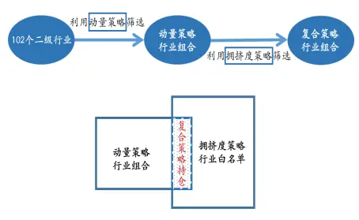
数据来源：Wind，广发证券发展研究中心

图：行业轮动策略表现
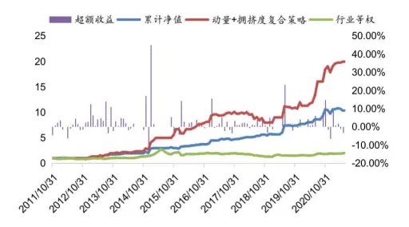
数据来源：Wind，广发证券发展研究中心

分析师：史庆盛

同SAC 执证号：S0260513070004

公020-66335133

shiqingsheng@gf.com.cn分析师：罗军

SAC 执证号：S0260511010004

020-66335128

luojun@gf.com.cn

分析师：安宁宁

SAC 执证号：S0260512020003

SFC CE No. BNW179

0755-23948352

anningning@gf.com.cn

请注意，史庆盛，罗军并非香港证券及期货事务监察委员会的注册持牌人，不可在香港从事受监管活动。

## 相关研究：

宏观视角下的行业轮动策 2019-03-06略—宏观篇

## 一、行业轮动框架简介

## （一）量化行业配置框架介绍

一个完整的行业轮动框架，通常涵盖了对市场交易惯性因子、风险因子的挖掘，本文主要采用动量因子作为市场交易惯性的指标，即我们认为行业的上涨趋势是具有惯性的，短期内可以通过行业截面比较寻找涨幅靠前的行业进行配置。其次，采用拥挤度因子作为风险效应的指标，我们认为当行业触发拥挤度信号后，提示行业即将走弱，此时应立即清仓离场，从而构建行业轮动策略。

本文将标的设置为申万二级行业，以行业等权为基准，首先针对动量和拥挤度两个子策略，寻找合适的动量因子和拥挤度因子，并分别进行单因子与多因子回测。完成对两个子策略的测试后，我们进一步尝试将两个策略结合得到新的复合策略，复合策略在样本回测中取得稳定表现。

图1：重构量化行业轮动框架
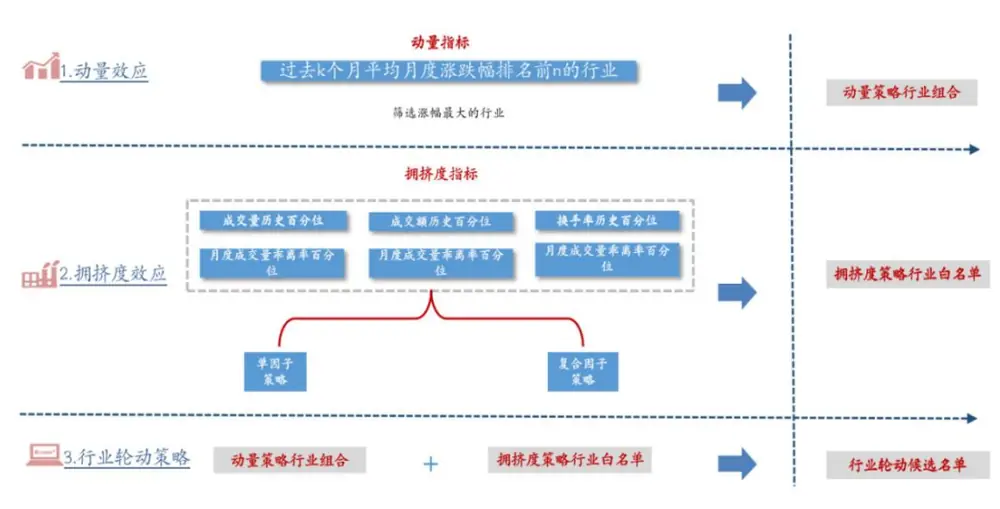
数据来源：Wind，广发证券发展研究中心

## (二）A 股行业动量与拥挤度效应前瞻

从动量角度出发寻找标的是一种十分直观的思路，一般情况下投资者更倾向于配置一些涨幅较佳的行业。我们来考虑最简单的动量策略，在每月底买入涨的最好的40个行业，也可以买入过去半年甚至一年涨幅最大的行业，每次买入的行业个数也都是可以灵活变动的，下面列举了最常用的9种策略，以行业等权为基准，发现9种策略均存在超额收益，长期动量表现要好于短期动量，说明在A股市场，动量效应目前仍然是存在的，但是也不难发现，这部分超额收益已经不那么显著，其中可能的原因在于，对于二级细分行业，资金切换的速度和风险累积的速度很快，动量效应持续性和稳定性不强。

表1：动量策略表现（2010.01-2021.06）

|  | 年化超额收益 | 年化波动率 | 信息比率 |
| --- | --- | --- | --- |
| 过去1 个月涨跌幅前10 | 1.07% | 30.78% | 0.03 |
| 过去 1 个月涨跌幅前 20 | 0.92% | 27.82% | 0.03 |
| 过去1个月涨跌幅前40 | 3.84% | 8.39% | 0.45 |
| 过去6 个月平均涨跌幅前10 | 1.97% | 31.54% | 0.06 |
| 过去6个月平均涨跌幅前20 | 1.13% | 28.19% | 0.04 |
| 过去6 个月平均涨跌幅前 40 | 1.10% | 26.15% | 0.04 |
| 过去12 个月平均涨跌幅前10 | 4.10% | 29.88% | 0.14 |
| 过去 12 个月平均涨跌幅前 20 | 2.84% | 27.39% | 0.10 |
| 过去12 个月平均涨跌幅前40 | 5.16% | 9.50% | 0.54 |

数据来源：Wind，广发证券发展研究中心

自然容易想到，如果一个细分行业出现了资金过度拥挤的情况，涨势是不持久的，那么是否可以定义风险指标，从而尽可能规避风险，此时便需要用到本文的拥挤度因子。拥挤度因子通常分为：流动性因子，如成交量、换手率等，乖离率因子：成交量两月乖离率等等。例如，成交量因子中有一个细分因子是“成交量60百分位”，如果某月某个行业的月成交量超过了历史上60%的时间，我们认为该行业触发了该因子，且我们可以合理地认为这个行业交易十分火热且风险已经暴露，如果不立刻离场，大概率会遭遇回撤。以行业等权为基准，下面表2展示的是关于6种常用拥挤度因子，如果我们每个月反向买入触发了拥挤度因子的行业，会有怎样的超额收益。以“成交量60百分位”反向策略为例，如果月底某行业的成交量超过了历史上60%的时间，那么我们将其加入下月持仓。可以发现超额均为负，说明在A股市场，拥挤度效应是存在的，持仓行业如果资金过度拥挤确实会导致策略收益不佳。

表2：拥挤度策略表现（2010.01-2021.06）

|  | 年化超额收益 | 年化波动率 | 信息比率 |
| --- | --- | --- | --- |
| 成交量60百分位（反向） | -1.59% | 25.26% | -0.06 |
| 成交额60百分位（反向） | -1.01% | 25.45% | -0.04 |
| 换手率60百分位（反向） | -0.67% | 25.04% | -0.03 |
| 月度成交量乖离率60百分位（反向） | -1.54% | 26.78% | -0.06 |
| 月度成交额乖离率60百分位（反向） | -3.12% | 26.41% | -0.12 |
| 月度换手率乖离率60百分位（反向） | -0.49% | 26.77% | -0.02 |

数据来源：Wind，广发证券发展研究中心

## 二、策略构建

## （一）动量策略的构建

我们选取动量策略是相信股票的收益率有延续原来的运动方向的趋势，即过去一段时间收益率较高的股票在未来获得的收益率仍会高于过去收益率较低的股票。按照这个思路我们只需在调仓时选出当月动量排名前n的行业作为下月的持仓即可。把n设置为10/20/30/40分别讨论。根据每个行业在样本区间内的月度涨跌幅数据，常见的动量因子便是过去k月的平均月度涨跌幅，窗口期k一般设置为1/2/3/6/12。总计有5*4=20个因子：

表 3：动量因子汇总

| 动量因子 | 窗口期k | 行业个数 n | 频率 |
| --- | --- | --- | --- |
| 过去k个月平均月度涨跌幅排名前n | 1/2/3/6/12 | 10/20/30/40 | 月 |

数据来源：Wind，广发证券发展研究中心

以因子过去1月涨跌幅排名前40为例，取出某月所有行业的涨跌幅截面数据进行排序，排名前40的行业标为1，其余标为0。

得到以上20个因子后，需要对因子进行显著性检验，如果通过了检验，则说明当月因子对于下月涨跌幅具有较好的解释性。我们采用皮尔森系数进行检验。此外，我们仍需进行信号胜率检验，胜率是指某月若一个行业触发了某个动量因子，下月能够延续涨势的概率。因子胜率越高，则下月产生超额收益的概率越大。

相对应的，我们可以根据因子构建动量策略，例如，过去1月涨跌幅排名前40这个因子对应的策略是，如果某月某行业该因子对应值为1，则我们保留该行业，否则剔除该行业，对所有的行业进行相同的筛选后，保留的行业便作为下月的持仓。

下面对动量策略进行优化：先前的策略中我们是按照过去k个月的平均月度涨幅前n筛选行业，但是我们没有对筛选出来的行业设置涨跌幅阈值，以过去1个月涨跌幅前40这个因子为例，可能在某些月份，行情特别差的情况下，部分行业虽然入围了前40的名单，但是其收益为负且大幅低于基准，我们自然应该剔除这类行业。但是如果只是简单剔除，我们发现2013/06/28，2015/07/31，2016/01/29，2018/06/29四期会出现空仓的情况，动量策略作为基础策略，我们仍希望每月均有持仓，因此我们对排名前10的行业不做处理，只对排名10至40的行业进行筛选，具体筛选方法如下，设置阈值T，若某行业当月涨幅小于T，则在下月的持仓中剔除。这样我们便能保证每月至少有10个行业的配置。本文T取值在(-0.1,0.1)之间，步长为0.01，分别回测。改进后回测结果最优的两个组合如下，最优阈值T为-0.05，即每月我们需要把跌幅超过5%的行业也全部剔除掉。：

通过显著性检验和信号胜率检验前提下，回测表现最好的策略如下：

表4：动量策略表现（2010.01-2021.06）

|  | 年化超额收益 | 年化波动率 | 信息比率 |
| --- | --- | --- | --- |
| 过去12个月平均涨跌幅前40 | 5.16% | 9.50% | 0.54 |
| 过去1个月涨跌幅前40 | 3.84% | 8.39% | 0.45 |

数据来源：Wind，广发证券发展研究中心

进一步验证筛选40个行业的合理性，以过去1个月涨跌幅策略来说，我们来观察分别选出前10/20/30/40个行业策略收益会有什么变化，如下。可以发现，无论是从总体年化超额来看还是从分年度表现来看，随着行业个数的增加，策略收益也同样增加，40个行业的最优性得到了进一步证明。

图 2： 筛选前20/30/40/50个行业策略累计净值
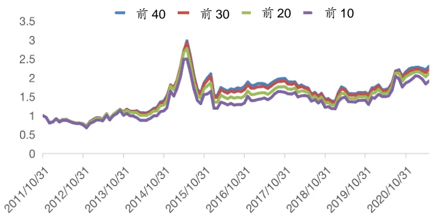
数据来源：Wind，广发证券发展研究中心

表5：筛选前20/30/40/50个行业收益表现（2010.01-2021.06）

| 前 10(%) | 前 20(%) | 前 30(%) | 前 40(%) |
| --- | --- | --- | --- |
| 年化超额收益 | 1.06 1.47 | 1.79 | 3.84 |
| 年化波动率 | 15.24 | 11.52 9.57 | 8.39 |
| 信息比率 | 0.07 | 0.12 0.18 | 0.45 |

数据来源：Wind，广发证券发展研究中心

## （二）拥挤度策略的构建

有效的拥挤度指标也是风险指标，需要及时对市场交易过热的风险做出提示，避免投资组合出现大幅亏损。比较常用的拥挤度指标如下表：

表6：拥挤度因子汇总

| 指标 |  | 频率 | 阈值 |
| --- | --- | --- | --- |
| 流动性指标 | 成交量历史百分位 | 月 | 60%/70%/80%/90% |
|  | 成交额历史百分位 | 月 | 60%/70%/80%/90% |
|  | 换手率历史百分位 | 月 | 60%/70%/80%/90% |
| 乖离率指标 | 成交量乖离率历史百分位 | 月 | 60%/70%/80%/90% |
|  | 成交额乖离率历史百分位 | 月 | 60%/70%/80%/90% |
|  | 换手率乖离率历史百分位 | 月 | 60%/70%/80%/90% |

数据来源：Wind，广发证券发展研究中心

以成交量历史百分位阈值60%为例作说明，若某月某行业的成交量超过历史60%时间的成交量，则记为1，否则记为0。

我们的目标是从每类因子中选出一个阈值加入因子库，比如：成交量百分位60%/70%/80%/90%中我们只能选择60%/70%/80%/90%中的一个。选择的标准如下，首先，我们需要从中筛选与下月涨跌幅总体成负相关的因子，因为我们在利用拥挤度策略剔除行业的时候，就已经默认了当某行业拥挤度因子值为1时，行业处于短期过热的状态，下月的收益会受到负面的影响。其次，我们还需进行显著性检验和信号胜率检验，筛选显著性最强和胜率最高的因子。最终筛选结果如下：

表7：拥挤度因子胜率汇总（2010.01-2021.06）

| 因子描述 胜率 |
| --- |
| 成交量 60 百分位 49.15% |
| 成交额 60 百分位 49.01% |
| 换手率 60 百分位 46.91% |
| 成交量乖离率 60 百分位 50.34% |
| 成交额乖离率60 百分位 51.01% |
| 换手率乖离率 60 百分位 48.20% |

数据来源：Wind，广发证券发展研究中心

自此，已经可以建立单因子拥挤度策略，例如成交量60百分位为例，初始我们的标的总共是102个二级行业，如果某月某行业在成交量60百分位对应位置的值为1，则我们将该行业剔除，最终剩余行业作为我们下月的持仓。

以行业等权为基准进行回测，结果如下，可见拥挤度效应确实存在，排除拥挤度高的行业确实为我们带来了超额收益。

表8：单因子表现（2010.01-2021.06）

| 年化超额收益 | 年化波动率 | 信息比率 |
| --- | --- | --- |
| 成交量 60 百分位 2.29% | 27.61% | 0.08 |
| 成交额 60 百分位 8.67% | 24.96% | 0.34 |
| 换手率 60 百分位 5.22% | 25.04% | 0.20 |
| 月度成交量乖离率 60 百分位 2.43% | 25.50% | 0.09 |
| 月度成交额乖离率60百分位 1.92% | 24.69% | 0.07 |
| 月度换手率乖离率 60 百分位 3.62% | 26.93% | 0.13 |

数据来源：Wind，广发证券发展研究中心

下面任取两个因子展示60/70/80/90百分位的策略净值表现。从结果来看，成交量60百分位策略表现最好，进一步验证了之前的结果。且随着百分位的提高，收益呈现递减的状态，说明市场的敏感性是很高的，当成交量百分位等指标超过历史上60%的时间就足以提示风险了，如果将百分位设置得过高，则对于市场拥挤度信号的捕捉太不敏感了，会导致策略收益不佳。

图 3： 成交量60/70/80/90百分位策略累计净值比较
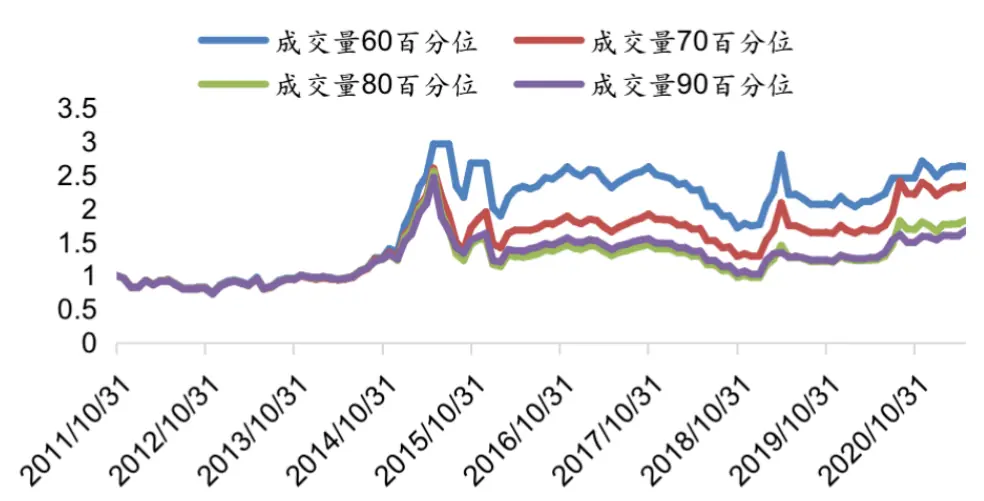
数据来源：Wind，广发证券发展研究中心

图 4: 成交额60/70/80/90百分位策略累计净值比较
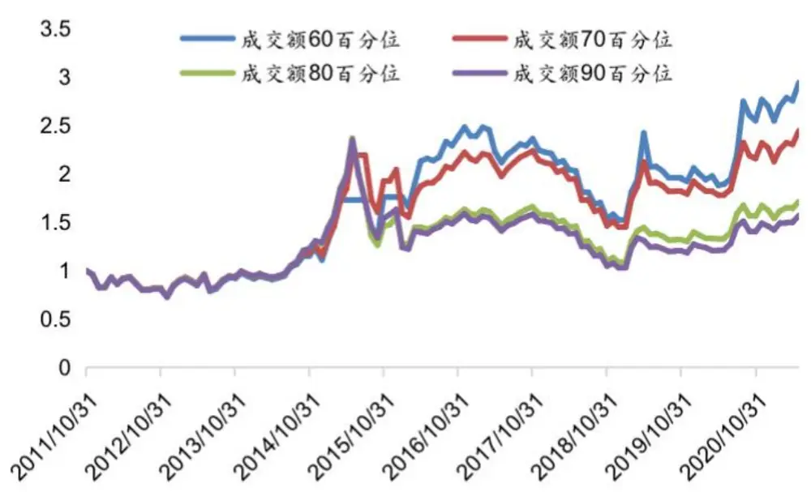
数据来源：Wind，广发证券发展研究中心

以上均是针对单个拥挤度因子来说，如果我们把拥挤度因子进行复合，会有怎样的结果。接下来我们引入复合因子，分别为1信号因子、2信号因子、3信号因子、4信号因子、5信号因子和6信号因子。以2信号因子为例，某月某行业在上述6个因子中的任意2个或者2个以上值为1，比如成交量60百分位和成交额60百分位，那么该月该行业2信号因子的值便为1，否则2信号因子的值记为0。

同样，对应的有复合因子策略，比如2信号册策略，如果某月某行业2信号因子的值为1，则把该行业剔除，剩余行业作为下个月持仓，回测结果如下：

表9：复合因子表现（2010.01-2021.06）

| 年化超额收益 | 年化波动率 | 信息比率 |
| --- | --- | --- |
| 1信号 2.58% | 17.03% | 0.15 |
| 2信号 4.08% | 18.02% | 0.22 |
| 3信号 2.86% | 11.50% | 0.25 |
| 4信号 2.69% | 25.14% | 0.10 |
| 5信号 3.32% | 26.43% | 0.12 |
| 6信号 3.28% | 26.04% | 0.12 |

数据来源：Wind，广发证券发展研究中心

可以看出，复合因子的表现与单因子相差无几，我们暂时保留复合因子，为后续研究作准备。

下表展示的是不同信号个数策略的持仓行业个数（2019-2021），可以发现，随着信号个数的增加，持仓行业个数越来越多，说明随着要触发信号的门槛越来越高，拥挤度策略删除的行业越来越少。但是从上面的超额收益表中看出，删除的行业过多或者过少都会导致表现不佳，折衷的策略(3信号)有着最好的表现。

表 10：不同信号个数下持仓行业个数

|  | 1信号 | 2信号 | 3信号 | 4信号 | 5信号 | 6信号 |
| --- | --- | --- | --- | --- | --- | --- |
| 2019/1/31 | 24 | 42 | 60 | 71 | 85 | 94 |
| 2019/2/28 | 0 | 0 | 1 | 12 | 25 | 51 |
| 2019/3/29 | 0 | 0 | 1 | 1 | 2 | 2 |
| 2019/4/30 | 0 | 1 | 1 | 28 | 46 | 66 |
| 2019/5/31 | 13 | 27 | 57 | 97 | 100 | 101 |
| 2019/6/28 | 25 | 50 | 68 | 96 | 98 | 98 |
| 2019/7/31 | 29 | 43 | 66 | 85 | 94 | 97 |
| 2019/8/30 | 25 | 41 | 59 | 77 | 84 | 90 |
| 2019/9/30 | 7 | 17 | 24 | 50 | 63 | 75 |
| 2019/10/31 | 46 | 65 | 78 | 89 | 98 | 99 |
| 2019/11/29 | 37 | 57 | 75 | 92 | 96 | 100 |
| 2019/12/31 | 2 | 5 | 19 | 42 | 59 | 77 |
| 2020/1/23 | 1 | 6 | 12 | 31 | 51 | 74 |
| 2020/2/28 | 0 | 0 | 2 | 3 | 13 | 21 |
| 2020/3/31 | 0 | 2 | 8 | 28 | 39 | 54 |
| 2020/4/30 | 9 | 23 | 39 | 90 | 92 | 96 |
| 2020/5/29 | 26 | 39 | 57 | 94 | 99 | 100 |
| 2020/6/30 | 11 | 14 | 26 | 49 | 63 | 72 |
| 2020/7/31 | 0 | 0 | 0 | 0 | 0 | 3 |
| 2020/8/31 | 0 | 1 | 7 | 47 | 57 | 71 |
| 2020/9/30 | 7 | 19 | 37 | 94 | 95 | 97 |
| 2020/10/30 | 31 | 47 | 69 | 93 | 99 | 100 |
| 2020/11/30 | 4 | 9 | 33 | 47 | 58 | 69 |
| 2020/12/31 2021/1/29 | 5 | 10 | 28 | 42 | 62 58 | 75 71 |
| 2021/2/26 | 8 | 12 28 | 21 47 | 45 76 | 92 | 93 |
| 2021/3/31 | 17 | 6 | 25 | 49 | 64 | 79 |
| 2021/4/30 | 3 6 | 18 | 41 | 65 | 75 | 88 |
| 2021/5/31 | 12 | 18 | 38 | 59 | 81 | 91 |

数据来源：Wind，广发证券发展研究中心

总结：经过以上讨论，我们已经证明了动量效应和拥挤度效应的存在，但是我们也注意到动量效应在申万二级行业的轮动中偏弱，主要原因就是在于细分行业中，更容易出现资金情绪的快速切换和风险效应的累积。如果能够剔除一部分资金已经过度拥挤且风险系数高的行业，策略表现是否会有大幅提升呢？

## (三）动量+拥挤度复合策略的构建

现在讨论将动量策略和拥挤度策略进行复合得到一个新的策略。之前提到，动量效应确实存在，但是在本文讨论的行业轮动中似乎效应不是很明显，我们自然就考虑从中剔除一部分行业，而拥挤度策略作为一个能够产生超额收益的策略，常用来筛选剔除短期交易过热的行业，我们尝试从动量策略选中的行业之中剔除部分短期交易过热的行业，作为新的复合策略。例如，首先我们利用动量策略筛选除了一个行业组合，其次我们进一步利用单因子或者复合因子的拥挤度策略进行筛选，这样便构成了一个复合策略。具体原理如下图：

图 5: 复合策略原理
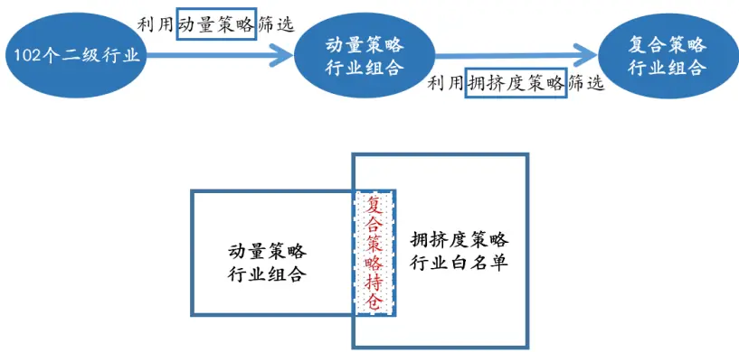
数据来源：Wind，广发证券发展研究中心

结合之前的动量因子和拥挤度因子，总计有2*6=12种复合策略。以动量策略（过去1个月涨跌幅前40）+拥挤度策略（2信号）为例作说明：月底需要调仓时，我们筛选出当月涨幅前40的行业，并从排名10-40的行业种剔除跌超5%的行业，剩余行业若当月触发2个以上的拥挤度信号，也予以剔除，余下行业作为下月持仓。

以行业等权为基准，回测，下面只列出年化超额收益率大于20%的策略：

表11：复合策略表现（2010.01-2021.06）

| 复合策略 | 年化超额收益 | 年化波动率 | 信息比率 |
| --- | --- | --- | --- |
| 过去1个月涨跌幅前40+复合因子(3信号) | 28.94% | 21.32% | 1.36 |
| 过去12个月涨跌幅前40+复合因子(3信号) | 20.86% | 20.75% | 1.01 |

数据来源：Wind，广发证券发展研究中心

结论1:复合策略的超额收益远远超过动量策略和拥挤度策略两个子策略。说明虽然动量策略和拥挤度策略分别作为两个子策略并没有特别明显的超额收益，但是当两者复合以后，却产生了十分明显的效应，这正是动量+拥挤度策略的巧妙之处，由于资金在细分行业中的快速切换和拥挤度叠加的风险效应导致动量策略效果不佳，但是如果利用拥挤度指标将风险效应高且资金短期涌入过多的行业剔除，剩余的行业组合往往在接下来有十分优异的表现，因此先拥挤度策略筛选出每月的未处于拥挤状态的行业白名单，接着从动量策略筛选出来的行业组合中剔除不在白名单里的行业即可。

结论2：根据之前的回测结果，虽然拥挤度策略中复合因子表现与单因子相差无几，但是在动量+拥挤度复合策略中，复合因子的表现要明显优于单因子。

可知复合策略“过去1个月涨跌幅前40+复合因子(3信号)”有着最高的超额收益，下面对策略合理性的进一步说明，首先动量因子保持不变，改变拥挤度因子，可见3信号确实是有着最好的表现，其次拥挤度因子保持不变，改变动量因子，1月因子也超过了12月因子。

图6：复合策略（不同个数的信号）累计净值比较
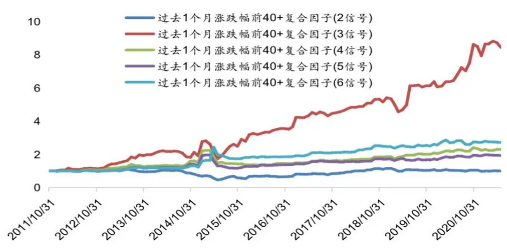
数据来源：Wind，广发证券发展研究中心

图7：复合策略（不同的动量因子）累计净值比较
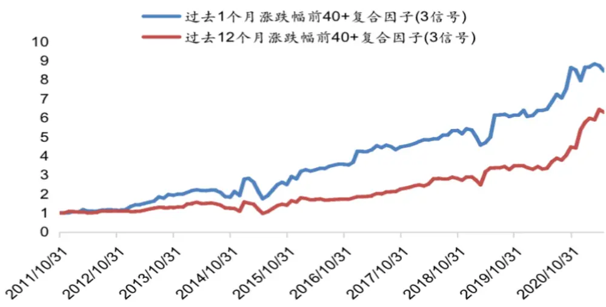
数据来源：Wind，广发证券发展研究中心
识别风险，发现价值

## （四）案例展示

以“过去1个月涨跌幅前40+阈值-0.05+复合因子(3信号)”这种复合策略为例，从策略表现、持仓数量等角度与其子策略进行比较。

从策略表现来看，复合策略表现大幅优于两个子策略，且基本上从2012-2020每年度均大幅跑赢两个子策略。

图 8： 子策略与复合策略累计净值比较
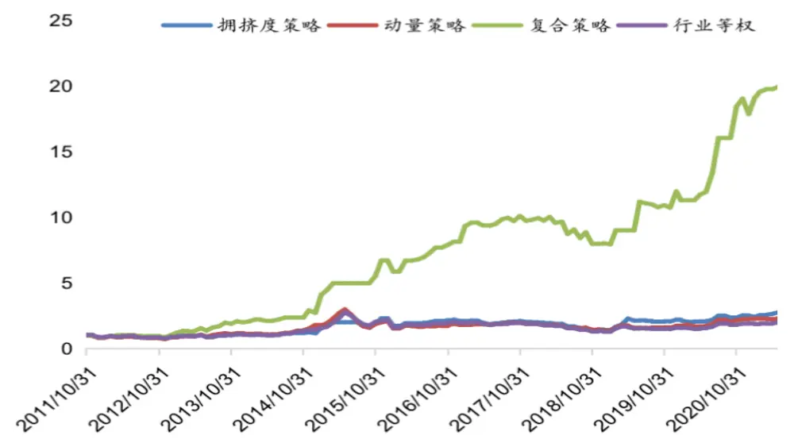
数据来源：Wind，广发证券发展研究中心

表12：子策略与复合策略表现比较（2010.01-2021.06）

| 策略描述 | 年化超额收益 | 年化波动率 | 信息比率 |
| --- | --- | --- | --- |
| 动量策略（过去1个月涨跌幅前40） | 3.84% | 8.39% | 0.45 |
| 拥挤度策略（3信号） | 2.86% | 11.50% | 0.25 |
| 复合策略 | 28.94% | 21.32% | 1.36 |

数据来源：Wind，广发证券发展研究中心

表 13：子策略与复合策略分年度超额收益比较

| 动量策略（%） | 拥挤度策略（%） | 复合策略（%） |
| --- | --- | --- |
| 2012 -1.77 | 1.07 | -0.18 |
| 2013 11.78 | -3.14 | 48.27 |
| 2014 18.12 | -11.38 | 9.51 |
| 2015 4.83 | -1.73 | -2.42 |
| 2016 -2.42 | 2.77 | 18.67 |
| 2017 7.13 | 0.24 | 7.64 |
| 2018 5.66 | 1.58 | 16.52 |
| 2019 4.27 | -1.12 | 36.14 |
| 2020 1.96 | 2.95 | 26.16 |
| 2021（截止六月底） -5.62 | 6.61 | -2.35 |

数据来源：Wind，广发证券发展研究中心

近两年持仓个数来看，复合策略的持仓个是动量策略行业组合与拥挤度策略筛选出来的行业白名单的交集，但是很大程度上由后者决定，比如2012/3/30，动量策略持仓为40个，拥挤度策略持仓为9个，两个策略都持有的只有1个行业，说明当月拥挤度策略把动量策略筛选出来的绝大部分行业全部剔除掉了，这也是我们复合两个策略的初衷。如果拥挤度策略反映出来的是大部分行业都处于过热的情况，我们不应再参与其中，果然，2012/3/30两个子策略均是负收益，而复合策略为正收益。而且这样的情况不是个例，经统计，通过拥挤度指标的筛选后复合策略能跑赢动量策略的概率达到60%以上，说明拥挤度作为一个控制风险的策略是真实有效的。

表 14：近两年持仓数量与每月收益

|  | 动量策略持仓数量 | 动量策略月收益(%) | 拥挤度策略持仓数量 | 拥挤度策略月收益(%) | 复合策略持仓数量 | 复合策略每月收益(%) |
| --- | --- | --- | --- | --- | --- | --- |
| 2019/1/31 | 10 | -0.87 | 83 | 0.52 | 6 | -1.06 |
| 2019/2/28 | 40 | 17.17 | 60 | 18.85 | 18 | 13.32 |
| 2019/3/29 | 40 | 9.51 | 1 | 9.96 | 0 | 0.00 |
| 2019/4/30 | 40 | -2.92 | 1 | 24.88 | 0 | 0.00 |
| 2019/5/31 | 21 | -7.41 | 1 | -6.54 | 0 | 0.00 |
| 2019/6/28 | 10 | -0.28 | 57 | 0.94 | 1 | 24.22 |
| 2019/7/31 | 40 | -0.68 | 68 | -2.01 | 24 | -1.15 |
| 2019/8/30 | 29 | 2.75 | 66 | -2.84 | 11 | -0.72 |
| 2019/9/30 | 29 | -0.58 | 59 | -0.09 | 6 | -1.90 |
| 2019/10/31 | 40 | 0.97 | 24 | 1.63 | 5 | 1.45 |
| 2019/11/29 | 40 | -3.64 | 78 | -1.07 | 27 | -1.82 |
| 2019/12/31 | 26 | 11.41 | 75 | 7.01 | 18 | 11.54 |
| 2020/1/23 | 40 | 0.48 | 19 | -2.73 | 2 | -5.56 |
| 2020/2/28 | 40 | 4.06 | 12 | -5.33 | 0 | 0.00 |
| 2020/3/31 | 40 | -7.24 | 2 | 1.68 | 0 | 0.00 |
| 2020/4/30 | 25 | 0.45 | 8 | 0.33 | 1 | 3.88 |
| 2020/5/29 | 40 | 1.72 | 39 | 1.02 | 9 | 1.73 |
| 2020/6/30 | 40 | 8.87 | 57 | 4.58 | 15 | 12.05 |
| 2020/7/31 | 40 | 16.47 | 26 | 14.80 | 4 | 19.93 |
| 2020/8/31 | 40 | 1.39 | 0 | 0.00 | 0 | 0.00 |
| 2020/9/30 | 40 | -7.99 | 7 | -5.63 | 0 | 0.00 |
| 2020/10/30 | 10 | 5.88 | 37 | -0.19 | 1 | 14.89 |
| 2020/11/30 | 40 | 3.76 | 69 | 6.80 | 19 | 3.26 |
| 2020/12/31 | 40 | 1.51 | 33 | -0.72 | 7 | -6.15 |
| 2021/1/29 | 40 | 0.55 | 28 | -3.17 | 2 | 6.70 |
| 2021/2/26 | 36 | -0.37 | 21 | 4.86 | 3 | 2.65 |
| 2021/3/31 | 40 | -1.09 | 47 | 1.15 | 18 | 1.02 |
| 2021/4/30 | 40 | -1.65 | 25 | 2.81 | 2 | -0.03 |
| 2021/5/31 | 40 | 4.31 | 41 | 4.56 | 9 | 0.96 |
| 2021/6/30 | 40 | 1.59 | 38 | 1.09 | 7 | -0.38 |

数据来源：Wind，广发证券发展研究中心

下表是两个具体的案例展示：2019/6/28，动量策略给出的行业组合如表中所示，总共10个行业，但是经过拥挤度策略筛选后，只剩下一个行业'801053.SI'，除该行业以外，其他的行业都是触发了三个及以上的拥挤度信号，且我们可以很明显地发现，处于拥挤度状态分行业下月收益基本上都为负。2015/1/30，动量策略组合中几乎所有的行业均触发了6个信号，唯独'801076.SI'只触发了2个信号，从而得以保留。

识别风险，发现价值

触发6信号的行业下月几乎全部为负收益，被保留下来的'801076.SI'单月涨幅超50%。

表 15： 案例展示

| 日期 | 动量策略组合下月收益(%) | 动量策略组合上月触发信号个数 | 复合策略下月收益(%) |
| --- | --- | --- | --- |
|  | '房屋建设Ⅱ(申万)': -15.15， | '房屋建设Ⅱ(申万)': 6.0， | '运输设备Ⅱ(申万)': 50.92 |
|  | '券商Ⅱ(申万)': -14.01， | '券商ⅡI(申万)': 6.0, |  |
|  | '基础建设(申万)': -7.86, | '基础建设(申万)': 6.0, |  |
|  | '保险Ⅱ(申万)': -3.38， | '保险Ⅱ(申万)': 6.0, |  |
|  | '银行Ⅱ(申万)': -10.3, | '银行Ⅱ(申万)': 6.0, |  |
|  | '石油开采Ⅱ(申万)': 7.68, | '石油开采Ⅱ(申万)': 6.0, |  |
|  | '航运Ⅱ(申万): -9.11， | '航运Ⅱ(申万)': 6.0， |  |
|  | '钢铁ⅡI(申万)': -0.37， | '钢铁Ⅱ(申万)': 6.0， |  |
|  | '电力(申万): -3.11， | '电力(申万)': 6.0, |  |
|  | '船舶制造Ⅱ(申万)': -1.66， | '船舶制造Ⅱ(申万)': 6.0, |  |
|  | '通信运营Ⅱ(申万)': -6.65, | '通信运营Ⅱ(申万)': 6.0, |  |
|  | '多元金融Ⅱ(申万)': 4.02， | 多元金融Ⅱ(申万)': 6.0， |  |
|  | '专业工程(申万)': -5.31， | '专业工程(申万)'： 6.0， |  |
|  | '航空运输Ⅱ(申万)': -1.14， | '航空运输Ⅱ(申万)': 6.0， |  |
|  | '水泥制造Ⅱ(申万)': -7.3， | '水泥制造Ⅱ(申万)': 6.0, |  |
|  | '房地产开发Ⅱ(申万)'： 0.19， | '房地产开发Ⅱ(申万)': 6.0， |  |
|  | '水务Ⅱ(申万)': -0.21， | '水务Ⅱ(申万)': 6.0， |  |
|  | '铁路运输Ⅱ(申万)': -0.05， | '铁路运输Ⅱ(申万)'： 6.0， |  |
|  | '饮料制造(申万)': -2.2， | '饮料制造(申万)': 6.0， |  |
| 2019/06/28 | '高速公路Ⅱ(申万)': -1.46， | '高速公路Ⅱ(申万)': 6.0, |  |
|  | '园区开发Ⅱ(申万)': 2.09， | '园区开发Ⅱ(申万)': 6.0， |  |
|  | '煤炭开采Ⅱ(申万)': -3.83, | '煤炭开采Ⅱ(申万)': 6.0， |  |
|  | '机场Ⅱ(申万)'：2.82， | '机场Ⅱ(申万)'： 6.0， |  |
|  | '白色家电(申万)'： 9.45， | '白色家电(申万)': 6.0， |  |
|  | '港口Ⅱ(申万)': 3.0, | '港口Ⅱ(申万)': 6.0, |  |
|  | '航天装备Ⅱ(申万)': 4.55， | '航天装备Ⅱ(申万)': 6.0， |  |
|  | '采掘服务Ⅱ(申万)': -3.24， | '采掘服务Ⅱ(申万)': 6.0， |  |
|  | '黄金Ⅱ(申万)': 11.82， | '黄金Ⅱ(申万)': 6.0， |  |
|  | '专用设备(申万): -1.71， | '专用设备(申万)'： 6.0， |  |
|  | '商业物业经营(申万)'： 2.66， | '商业物业经营(申万)': 6.0, |  |
|  | '食品加工(申万)': 1.34， | '食品加工(申万)'： 6.0， |  |
|  | '工业金属(申万)': -1.24， | '工业金属(申万)': 6.0， |  |
|  | '石油化工(申万)'： -0.1， | '石油化工(申万)': 6.0， |  |
|  | '汽车整车(申万)'： 8.11， | '汽车整车(申万)': 6.0， |  |
|  | '一般零售(申万)': 2.75， | '一般零售(申万)': 6.0, |  |
|  | '稀有金属(申万)': 6.29， | '稀有金属(申万)': 6.0， |  |
|  | '运输设备Ⅱ(申万)': 50.92， | '运输设备Ⅱ(申万)': 2.0, |  |
|  | '化学纤维(申万)'： 2.84， | '化学纤维(申万)'： 6.0, |  |
|  | '贸易Ⅱ(申万)': 6.62， | '贸易Ⅱ(申万)': 6.0, |  |
| '景点(申万)': 4.02 |  | '景点(申万)': 5.0 |  |

识别风险，发现价值

| 2015/01/30 | '种植业(申万)': -1.76, | 种植业(申万)': 6.0, | '黄金Ⅱ(申万)': 24.22 |
| --- | --- | --- | --- |
|  | '半导体(申万)': -0.41, | '半导体(申万)': 3.0, |  |
|  | '稀有金属(申万)': -3.02, | '稀有金属(申万)': 3.0, |  |
|  | '金属非金属新材料(申万)': -1.46, | '金属非金属新材料(申万)': 3.0, |  |
|  | '航天装备Ⅱ(申万)': -3.97, | '航天装备Ⅱ(申万)': 3.0, |  |
|  | '黄金Ⅱ(申万)': 24.22, | '黄金Ⅱ(申万)': 2.0, |  |
|  | '饲料Ⅱ(申万)': -15.7, '地面兵装Ⅱ(申万)': -2.6, | '饲料Ⅱ(申万)': 4.0, |  |
|  |  | '地面兵装Ⅱ(申万)': 3.0, |  |
| '食品加工(申万): 7.95, |  | '食品加工(申万)': 4.0, |  |
| '航空装备Ⅱ(申万)': -2.34 |  | '航空装备Ⅱ(申万)': 3.0 |  |

数据来源：Wind，广发证券发展研究中心

从以下给出的部分月K线图更进一步阐释了拥挤度与涨跌幅的直观联系。
图9：801053.SI前后两月涨跌幅及拥挤程度对比（2019/06/28）
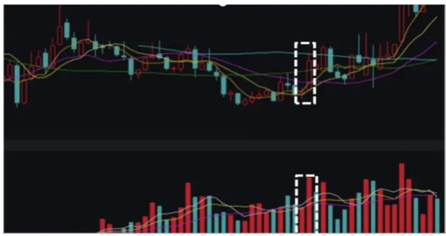
数据来源：Wind，广发证券发展研究中心

图10：801014.SI前后两月涨跌幅及拥挤程度对比（2019/06/28）
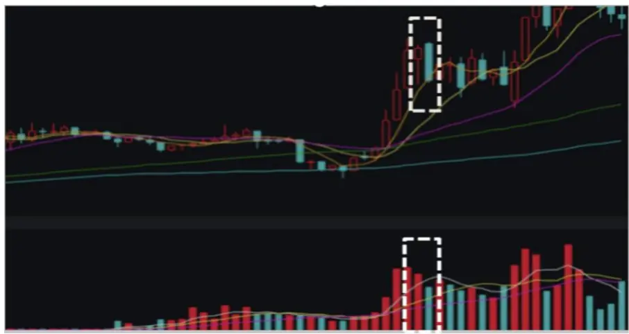
数据来源：Wind，广发证券发展研究中心
识别风险，发现价值

图11：801076.SI前后两月涨跌幅及拥挤程度对比（2015/01/30）
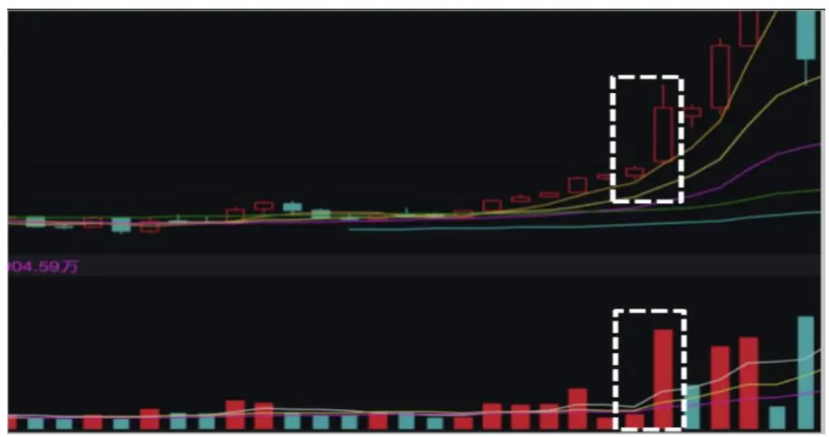
数据来源：Wind，广发证券发展研究中心

图12：801721.SI前后两月涨跌幅及拥挤程度对比（2015/01/30）
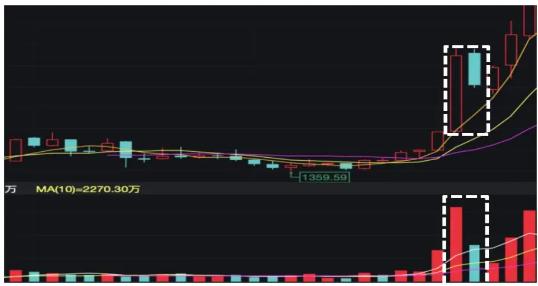
数据来源：Wind，广发证券发展研究中心

## 三、策略实证

## （一）策略设置

行业选择：行业分类采用申万二级行业分类，由于首月涨幅过大且成分股数量过少，不具有代表性，剔除其他休闲服务II(801215.SI)和其他轻工制造II(801144.SI)两个行业，剩余共102个行业；

调仓周期：1个月；

日期区间：2010年1月至2021年6月；

策略基准：行业等权基准；

交易成本：双边千分之三；

策略设置：每月底筛选当月涨幅排名前40的行业，并从排名10-40的行业中剔除月收益率小于-5%的行业，剩余行业利用拥挤度复合因子进行筛选，如果某行业当月触发3个及以上的单因子，则剔除该行业，等权配置余下的行业。

## （二）实证结果

从以下回测结果可以看到，在考虑了利用动量+拥挤度复合策略之后，年化超额收益达到了28.94%。

图 13： 动量+拥挤度复合策略表现
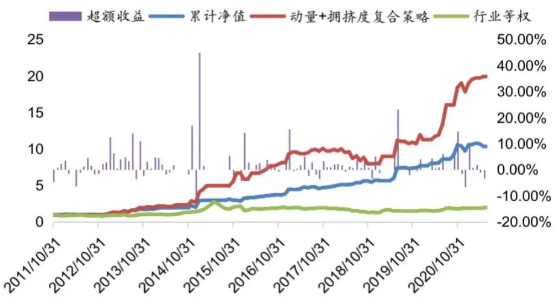
数据来源：Wind，广发证券发展研究中心

表16：动量+拥挤度复合策略表现（2010.01-2021.06）

|  | 动量+拥挤度复合策略 | 行业等权 | 超额收益 |
| --- | --- | --- | --- |
| 年化收益率 | 41.46% | 10.82% | 28.94% |
| 年化波动率 | 29.37% | 25.08% | 21.31% |
| 信息比率 | 1.41 | 0.43 | 1.35 |

数据来源：Wind，广发证券发展研究中心
识别风险，发现价值

分年度来看，从2010年1月到2021年2月，各年超额收益都为较高。

表17：动量+拥挤度复合策略分年度收益表现

| 动量+拥挤度复合策略 | 行业等权 | 超额收益 |
| --- | --- | --- |
| 2012 16.14% | 1.48% | -0.18% |
| 2013 62.96% | 11.03% | 48.27% |
| 2014 31.21% | 41.06% | 9.51% |
| 2015 63.37% | 42.44% | -2.42% |
| 2016 38.90% | 19.90% | 18.67% |
| 2017 5.13% | -2.86% | 7.64% |
| 2018 -19.15% | -30.94% | 16.52% |
| 2019 50.58% | 23.80% | 36.14% |
| 2020 58.12% | 21.01% | 26.16% |
| 2021(截止6月底) 4.27% | 7.25% | -2.35% |

数据来源：Wind，广发证券发展研究中心

图14： 动量+拥挤度复合策略分年度超额收益
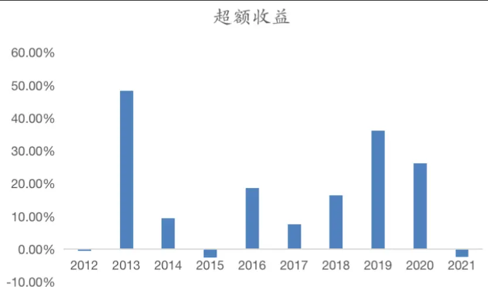
数据来源：Wind，广发证券发展研究中心

各期超配行业组合明细及最新行业配置结果如下表所示，每个月超配的行业组合权重为等权。

表 18：近两年动量+拥挤度复合策略下的持仓

| 持仓 |  | 月度收益(%) |
| --- | --- | --- |
| 2019/1/30 | ['铁路运输Ⅱ(申万)', '旅游综合Ⅱ(申万)', '电力(申万)','黄金Ⅱ(申万),'机场Ⅱ(申万)', '饮料制造(申 万) | -1.06 |
| 2019/2/28 | ['银行Ⅱ(申万)', '水泥制造Ⅱ(申万)', '石油化工(申万)', '房屋建设Ⅱ(申万)', '铁路运输Ⅱ(申万)', '房地产 开发Ⅱ(申万)', '其他采掘Ⅱ(申万)','专业零售(申万)','食品加工(申万)', '钢铁Ⅱ(申万)', '航运Ⅱ(申万)', '航空运输Ⅱ(申万)','汽车服务Ⅱ(申万)', '农业综合Ⅱ(申万)','其他建材Ⅱ(申万)', '化学纤维(申万)','专 用设备(申万)','高速公路Ⅱ(申万)] | 13.32 |
| 2019/3/30 | 0] | 0.00 |
| 2019/4/30 | [] | 0.00 |
| 2019/5/30 | 0 | 0.00 |
| 2019/6/30 | ['黄金Ⅱ(申万)] | 24.22 |
| 2019/7/30 | ['机场Ⅱ(申万)','饮料制造(申万)', '旅游综合Ⅱ(申万)', '景点(申万)', '航空运输Ⅱ(申万)', '水泥制造Ⅱ (申万)','白色家电(申万)', '生物制品Ⅱ(申万)', '水务Ⅱ(申万)','专业零售(申万)', '酒店Ⅱ(申万)', '运输 设备Ⅱ(申万)', '基础建设(申万)', '贸易Ⅱ(申万)', '化学制药(申万)','医疗器械Ⅱ(申万)', '造纸Ⅱ(申万)'， '汽车整车(申万)', '化学纤维(申万)'，'医疗服务Ⅱ(申万)', '房屋建设Ⅱ(申万)'， '其他建材Ⅱ(申万)', '一般 零售(申万)','其他采掘ⅡI(申万)'] | -1.15 |
| 2019/8/30 | ['橡胶(申万)','物流Ⅱ(申万)','电源设备(申万),'塑料Ⅱ(申万)','白色家电(申万)','旅游综合Ⅱ(申万)',' 生物制品Ⅱ(申万)','房屋建设Ⅱ(申万)', '汽车整车(申万)','电力(申万)','造纸Ⅱ(申万)] | -0.72 |
| 2019/9/30 | ['饮料制造(申万)', '其他电子Ⅱ(申万)', '航运Ⅱ(申万)'，'畜禽养殖IⅡ(申万)', '家用轻工(申万)', '酒店Ⅱ (申万)] | -1.90 |
| 2019/10/30 | ['化学纤维(申万)','水泥制造Ⅱ(申万)','金属制品Ⅱ(申万)','其他建材Ⅱ(申万)','房地产开发Ⅱ(申万)] ['医疗服务Ⅱ(申万)', '生物制品Ⅱ(申万)', '化学制药(申万)', '白色家电(申万)','其他电子Ⅱ(申万)','医疗 | 1.45 |
| 2019/11/30 | 器械Ⅱ(申万)','景点(申万)','中药Ⅱ(申万)', '化学纤维(申万)', '玻璃制造Ⅱ(申万)','采掘服务Ⅱ(申万)'， '农产品加工(申万)', '造纸Ⅱ(申万)', '其他建材Ⅱ(申万)', '房地产开发Ⅱ(申万)', '园区开发Ⅱ(申万)', '环 保工程及服务Ⅱ(申万)', '保险Ⅱ(申万)', '通信运营Ⅱ(申万)', '橡胶(申万)', '家用轻工(申万)', '饮料制造 (申万)', '农业综合Ⅱ(申万)', '公交Ⅱ(申万)', '综合Ⅱ(申万), '物流Ⅱ(申万)','视听器材(申万)] | -1.82 |
| 2019/12/30 2020/1/30 | ['稀有金属(申万)', '光学光电子(申万)', '酒店Ⅱ(申万)','玻璃制造Ⅱ(申万)','采掘服务Ⅱ(申万)','其他建 材Ⅱ(申万)', '汽车零部件Ⅱ(申万)', '电源设备(申万)','航运Ⅱ(申万)', '汽车整车(申万)', '铁路运输Ⅱ(申 万)','其他电子Ⅱ(申万)','电气自动化设备(申万)', '化学原料(申万)','石油化工(申万)','视听器材(申 万)', '化学制品(申万)','高低压设备(申万)] | 11.54 |
| 2020/2/29 | ['景点(申万)','其他交运设备Ⅱ(申万)] [] | -5.56 |
| 2020/3/30 | [] | 0.00 0.00 |
| 2020/4/30 | ['专业零售(申万)] | 3.88 |
|  | ['机场Ⅱ(申万)', '景点(申万)', '玻璃制造Ⅱ(申万)', '其他电子Ⅱ(申万)', '园区开发Ⅱ(申万)', '橡胶(申 |  |
| 2020/5/30 | 万)','高速公路Ⅱ(申万)', '水务Ⅱ(申万)','航空运输Ⅱ(申万)] ['旅游综合Ⅱ(申万)', '医疗服务Ⅱ(申万)', '白色家电(申万)','景点(申万)', '物流Ⅱ(申万)','其他采掘Ⅱ | 1.73 |
| 2020/6/30 | (申万)','文化传媒(申万)', '玻璃制造Ⅱ(申万)', '化学制药(申万)','医药商业Ⅱ(申万), '燃气Ⅱ(申万)',' 化学制品(申万)','金属制品Ⅱ(申万)','装修装饰Ⅱ(申万)','工业金属(申万)] | 12.05 |
| 2020/7/30 | ['化学原料(申万)', '化学制品(申万)', '综合Ⅱ(申万)','农产品加工(申万)] | 19.93 |

识别风险，发现价值

| 2020/8/30 | [] | 0.00 |
| --- | --- | --- |
| 2020/9/30 | [] | 0.00 |
| 2020/10/30 | ['玻璃制造Ⅱ(申万)] | 14.89 |
| 2020/11/30 | ['其他交运设备Ⅱ(申万)','医疗服务Ⅱ(申万)','农业综合Ⅱ(申万)', '家用轻工(申万)', '其他电子Ⅱ(申 万)', '饮料制造(申万)', '专业零售(申万), '稀有金属(申万)', '半导体(申万)','黄金Ⅱ(申万)', '燃气Ⅱ(申 万)'，'综合Ⅱ(申万)', '钢铁Ⅱ(申万)', '汽车服务Ⅱ(申万)', '化学纤维(申万)', '医药商业Ⅱ(申万)', '酒店Ⅱ (申万)', '金属非金属新材料(申万)', '物流Ⅱ(申万)] | 3.26 |
| 2020/12/30 | ['景点(申万)','航空运输Ⅱ(申万)','餐饮Ⅱ(申万)', '房地产开发Ⅱ(申万)','畜禽养殖Ⅱ(申万)', '林业Ⅱ (申万)','高速公路Ⅱ(申万)] | -6.15 |
| 2021/1/30 | ['化学制品(申万)', '橡胶(申万)] | 6.70 |
| 2021/2/28 | ['物流Ⅱ(申万)', '医药商业Ⅱ(申万)', '酒店Ⅱ(申万)] | 2.65 |
| 2021/3/30 | ['畜禽养殖Ⅱ(申万)','房地产开发Ⅱ(申万)','环保工程及服务Ⅱ(申万)', '公交Ⅱ(申万)'，'装修装饰Ⅱ(申 万)'， '水泥制造Ⅱ(申万)， '园林工程Ⅱ(申万)'， '农业综合Ⅱ(申万)', '贸易Ⅱ(申万)'，'高速公路Ⅱ(申万)'， 房屋建设Ⅱ(申万)'，'渔业(申万)'，,'计算机设备Ⅱ(申万)', '物流Ⅱ(申万)', '铁路运输Ⅱ(申万)'， '基础建设 | 1.02 |
| 2021/4/30 | (申万)','多元金融Ⅱ(申万)', '服装家纺(申万)] ['贸易Ⅱ(申万)','综合Ⅱ(申万)] | -0.03 |
| 2021/5/30 | ['其他交运设备Ⅱ(申万)', '橡胶(申万)', '电子制造Ⅱ(申万)', '综合Ⅱ(申万)','园区开发Ⅱ(申万)', '化学制 品(申万)','视听器材(申万)','畜禽养殖Ⅱ(申万)', '农产品加工(申万)] | 0.96 |
| 2021/6/30 | ['贸易Ⅱ(申万)','通信设备(申万)','航空运输Ⅱ(申万)','互联网传媒(申万)','旅游综合Ⅱ(申万)','采掘服 务Ⅱ(申万)','餐饮Ⅱ(申万)'] | -0.38 |

数据来源：Wind，广发证券发展研究中心

## 四、总结

## （一）策略总结

基于动量和拥挤度维度的行业轮动研究，本文从传统的动量策略出发，在发现动量效应在申万二级行业中较弱之后，总结问题在于细分行业的资金切换速度及风险效应累积过快，进而从风险控制的角度探究A股中是否存在拥挤度效应，证明拥挤度效应确实存在后，将动量策略和拥挤度策略结合起来，超额收益大幅提升。

分别研究两种子策略。对于动量策略，选择最常见的【过去k月平均涨跌幅排名前n】作为动量因子，并通过设定涨跌幅阈值对动量策略进行改进，通过显著性检验和信号胜率检验的有5个因子：【过去1月涨跌幅排名前40，过去1月涨跌幅排名前50，过去6月涨跌幅排名前50，过去12月涨跌幅排名前40，过去12月涨跌幅排名前50】。

其次，对于拥挤度策略，等同于寻找合适的风控指标，本文根据过往经验选择最常用的拥挤度因子，并一一进行显著性检验和信号胜率检验，最终通过的有6个因子：【成交量60百分位，成交额60百分位，换手率60百分位，成交量乖离率60百分位，成交额乖离率60百分位，换手率乖离率60百分位】，先单独测试6个因子的超额收益，接着尝试将6个因子进行复合，得到6个新的因子【2信号，3信号，4信号，5信号，6信号】。因此拥挤度策略中总计有6+5=11个因子。

将动量策略和拥挤度策略复合构建新的策略，总计有5*11=55种组合，回测结果最优组合为动量策略【过去1月涨跌幅排名前40】+拥挤度策略【3信号】。

在行业配置的具体运作上，我们以申万二级行业为标的，采取月度调仓的方式，每月底选出当月涨幅排名前40的行业，并从排名10-30的行业中剔除跌幅超5%的行业，接着利用拥挤度策略筛选所有二级行业中未处于拥挤状态的行业白名单，最后将动量策略行业组合与拥挤度策略行业白名单取交集，作为下月持仓，等权配置。

## （二）策略展望

在因子最优参数的选择与策略回测过程中，使用的均是全样本数据，存在一定程度的过拟合。实际使用中，仍需要观察策略样本外表现，并考虑采用滚动样本进行建模。

## （三）最新结果

根据模型最新一期识别结果，由于6月所有行业均处于拥挤状态，7月应维持空仓。

## 五、风险提示

本模型采用量化方法通过历史数据统计、建模和测算完成，所得出的规律及推介行业未必具有严格的投资逻辑，也未必符合当前宏观环境特点，在极端的市场环境变化中有失效的风险。

## 广发金融工程研究小组

罗军：首席分析师，华南理工大学硕士，从业14年，2010年进入广发证券发展研究中心。

安宁宁：联席首席分析师，暨南大学硕士，从业12年，2011年进入广发证券发展研究中心。

史庆盛：资深分析师，华南理工大学硕士，从业8年，2011年进入广发证券发展研究中心。

张超：资深分析师，中山大学硕士，从业7年，2012年进入广发证券发展研究中心。

文巧钧：资深分析师，浙江大学博士，从业4年，2015年进入广发证券发展研究中心。

陈原文：资深分析师，中山大学硕士，从业4年，2015年进入广发证券发展研究中心。

樊瑞铎：资深分析师，南开大学硕士，从业4年，2015年进入广发证券发展研究中心。

李豪：资深分析师，上海交通大学硕士，从业3年，2016年进入广发证券发展研究中心。

郭圳滨：高级分析师，中山大学硕士，2018年进入广发证券发展研究中心。

季燕妮：研究助理，厦门大学硕士，2020年进入广发证券发展研究中心。

张钰东：研究助理，中山大学硕士，2020年进入广发证券发展研究中心。

季俊男：南京大学硕士，2020年进入广发证券发展研究中心。

## 广发证券—行业投资评级说明

买入：预期未来12个月内，股价表现强于大盘10%以上。

持有：预期未来12个月内，股价相对大盘的变动幅度介于-10%~+10%。

卖出：预期未来12个月内，股价表现弱于大盘10%以上。

## 广发证券—公司投资评级说明

买入：预期未来12个月内，股价表现强于大盘15%以上。

增持：预期未来12个月内，股价表现强于大盘5%-15%。

持有：预期未来12个月内，股价相对大盘的变动幅度介于-5%~+5%。

卖出：预期未来12个月内，股价表现弱于大盘5%以上。

## 联系我们

| 地址 | 广州市 | 深圳市 | 北京市 | 上海市 | 香港 |
| --- | --- | --- | --- | --- | --- |
|  | 广州市天河区马场路 | 深圳市福田区益田路 | 北京市西城区月坛北 | 上海市浦东新区南泉 | 香港德辅道中189号 |
|  | 26号广发证券大厦 | 6001号太平金融大 | 街2号月坛大厦18 | 北路 429号泰康保险 | 李宝椿大厦29及30 |
|  | 35楼 | 厦31层 | 层 | 大厦37楼 | 楼 |
| 邮政编码 客服邮箱 | 510627 | 518026 | 100045 | 200120 |  |

## 法律主体声明

本报告由广发证券股份有限公司或其关联机构制作，广发证券股份有限公司及其关联机构以下统称为“广发证券”。本报告的分销依据不同国家、地区的法律、法规和监管要求由广发证券于该国家或地区的具有相关合法合规经营资质的子公司/经营机构完成。

广发证券股份有限公司具备中国证监会批复的证券投资咨询业务资格，接受中国证监会监管，负责本报告于中国（港澳台地区除外）的分销。

广发证券（香港）经纪有限公司具备香港证监会批复的就证券提供意见（4号牌照）的牌照，接受香港证监会监管，负责本报告于中国香港地区的分销。

本报告署名研究人员所持中国证券业协会注册分析师资质信息和香港证监会批复的牌照信息已于署名研究人员姓名处披露。

## 重要声明

广发证券股份有限公司及其关联机构可能与本报告中提及的公司寻求或正在建立业务关系，因此，投资者应当考虑广发证券股份有限公司及其关联机构因可能存在的潜在利益冲突而对本报告的独立性产生影响。投资者不应仅依据本报告内容作出任何投资决策。投资者应自主作出投资决策并自行承担投资风险，任何形式的分享证券投资收益或者分担证券投资损失的书面或者口头承诺均为无效。

本报告署名研究人员、联系人（以下均简称“研究人员”）针对本报告中相关公司或证券的研究分析内容，在此声明：（1）本报告的全部分析结论、研究观点均精确反映研究人员于本报告发出当日的关于相关公司或证券的所有个人观点，并不代表广发证券的立场；（2）研究人员的部分或全部的报酬无论在过去、现在还是将来均不会与本报告所述特定分析结论、研究观点具有直接或间接的联系。

研究人员制作本报告的报酬标准依据研究质量、客户评价、工作量等多种因素确定，其影响因素亦包括广发证券的整体经营收入，该等经营收入部分来源于广发证券的投资银行类业务。

本报告仅面向经广发证券授权使用的客户/特定合作机构发送，不对外公开发布，只有接收人才可以使用，且对于接收人而言具有保密义务。广发证券并不因相关人员通过其他途径收到或阅读本报告而视其为广发证券的客户。在特定国家或地区传播或者发布本报告可能违反当地法律，广发证券并未采取任何行动以允许于该等国家或地区传播或者分销本报告。

本报告所提及证券可能不被允许在某些国家或地区内出售。请注意，投资涉及风险，证券价格可能会波动，因此投资回报可能会有所变化，过去的业绩并不保证未来的表现。本报告的内容、观点或建议并未考虑任何个别客户的具体投资目标、财务状况和特殊需求，不应被视为对特定客户关于特定证券或金融工具的投资建议。本报告发送给某客户是基于该客户被认为有能力独立评估投资风险、独立行使投资决策并独立承担相应风险。

本报告所载资料的来源及观点的出处皆被广发证券认为可靠，但广发证券不对其准确性、完整性做出任何保证。报告内容仅供参考，报告中的信息或所表达观点不构成所涉证券买卖的出价或询价。广发证券不对因使用本报告的内容而引致的损失承担任何责任，除非法律法规有明确规定。客户不应以本报告取代其独立判断或仅根据本报告做出决策，如有需要，应先咨询专业意见。

广发证券可发出其它与本报告所载信息不一致及有不同结论的报告。本报告反映研究人员的不同观点、见解及分析方法，并不代表广发证券的立场。广发证券的销售人员、交易员或其他专业人士可能以书面或口头形式，向其客户或自营交易部门提供与本报告观点相反的市场评论或交易策略，广发证券的自营交易部门亦可能会有与本报告观点不一致，甚至相反的投资策略。报告所载资料、意见及推测仅反映研究人员于发出本报告当日的判断，可随时更改且无需另行通告。广发证券或其证券研究报告业务的相关董事、高级职员、分析师和员工可能拥有本报告所提及证券的权益。在阅读本报告时，收件人应了解相关的权益披露（若有）。

本研究报告可能包括和/或描述/呈列期货合约价格的事实历史信息（“信息”）。请注意此信息仅供用作组成我们的研究方法/分析中的部分论点/依据/证据，以支持我们对所述相关行业/公司的观点的结论。在任何情况下，它并不（明示或暗示）与香港证监会第5类受规管活动（就期货合约提供意见）有关联或构成此活动。

## 权益披露

(1)广发证券（香港）跟本研究报告所述公司在过去12个月内并没有任何投资银行业务的关系。

## 版权声明

未经广发证券事先书面许可，任何机构或个人不得以任何形式翻版、复制、刊登、转载和引用，否则由此造成的一切不良后果及法律责任由私自翻版、复制、刊登、转载和引用者承担。