股票研究报告·量化深度

# 多因子拥挤度模型

# 智能量化

# ——基于 CNE7 经典版

## 主要内容

## 指标构建

本研究报告介绍中信建投因子拥挤度模型来定量评估因子策略的拥挤程度，该模型使用一系列指标从多个维度衡量因子的拥挤情况。指标是 6 个角度进行构建的，分别为: （1）估值指标;（2）成长指标; （3）累计收益率指标; （4）换手率指标; （5）截面波动率指标;（6）两两相关性指标。

## 研究方法

本报告使用月度数据，以 6 个月为间隔，将未来两年划分为 0~6个月、7~12 个月、13~18 个月以及 19~24 个月四个区间，对综合拥挤度指标及底层 6 个拥挤指标与 CNE7 经典版中的市场因子、37 个行业因子和 10 个风格因子的未来收益率与波动率进行Spearman 相关性统计分析。

## 市场因子

模型结果表明，在短期 0-6 个月，综合拥挤度指标与市场因子收益负相关而与其波动率间正相关，这说明短期来看，拥挤程度越高会导致该因子未来收益的下降和风险的上升。但这相关性在长期并不显著。

## 行业因子

模型结果表明，综合拥挤得分与各行业因子未来给定时间段内的收益和风险并不具有显著的相关性。其细分指标估值水平指标与因子间的相关性最为显著。细分行业中，电力设备行业和汽车行业均于 2021 年进入高拥挤度区域，计算机等行业尚位于相对安全区。

## 风格因子

模型结果表明，综合拥挤度指标与各风格因子未来表现和风险之间相关性不一致。拥挤度细分指标中，估值指标和成长指标对风格因子未来收益与风险的前瞻性相对较好，即与未来收益负相关，和风险正相关。

风险提示：研究均基于历史数据，存在数据统计偏误和模型风险，对未来投资不构成任何建议。

## 陈果

chenguodcq@csc.com.cn

SAC 执证编号：S1440521120006

研究助理：徐建华

xujianhua@csc.com.cn

发布日期： 2022 年 02 月 22 日

## 市场表现

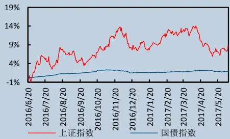

## 相关研究报告

## 一、摘要

股票收益率中很大一部分来源于共同因子所贡献的收益，有效的因子会受到资金的追捧，一般来说，资金的青睐会提高因子的收益，但是过多的资金涌入就会加剧因子的波动，进一步削弱因子的收益甚至引发因子的大幅回撤（例如 2008 年席卷全球的金融危机），也就造成所谓的“拥挤”效应。因此，衡量因子拥挤度就显得至关重要。

随着资管机构对因子认识的不断深入和因子投资的日益盛行，因子策略的拥挤可能性也在不断增加。因子业绩表现中偶然发生但影响恶劣的回撤现象，更是强调了拥挤的投资策略潜藏着的不可小觑的金融风险，突出了建立稳健的因子拥挤模型的必要性和潜在价值。通过对因子拥挤度的监测，投资者可有效规避或控制过度拥挤的因子策略给投资组合带来的巨大风险。

本研究报告构建因子层面的拥挤度模型来定量评估因子策略的拥挤程度，该模型使用一系列指标从多个维度衡量因子的拥挤情况，并构建一个标准化的因子拥挤指标，用于提醒投资者关注市场，行业，和风格策略因子中潜藏的“拥挤风险”。通过该模型，机构投资者可以比较特定时点下各个因子的拥挤程度，或者评估一个或多个因子随时间变化的拥挤情况，并深入观察影响拥挤程度的核心驱动要素，针对潜在拥挤因子或宽松因子做出及时投资决策。

本报告研究当大量资金投资于相同因子策略时策略模型会受到怎样的影响，并据此搭建了衡量拥挤度的指标框架。该框架从因子的估值水平、因子收益率的技术指标等多个角度出发，共包括六个指标：1.估值水平 2.成长率 3.因子累计收益率 4.换手率 5.截面波动率 6.两两互相关。

本研究报告对于拥挤度指标的研究结论可归纳为以下两点：

（1） 因子拥挤度指标对不同的因子具有不一致的前瞻性影响，即与因子未来收益率和波动率的相关程度因因子而异。但过度拥挤的因子值得投资者警惕，比如拥挤度大于 3 个标准差时。

（2） 因子拥挤度指标可以进一步拓展研究更多的指标，比如机构对上市公司调研次数，也是拥挤度的一个表现。

## 二、导言

大量市场的极端事件，如1998 年美国长期资本管理公司的失败、20世纪末与21世纪初的科技泡沫及破灭、2007 年 8 月的量化危机以及 2009 年危机后市场反弹期间动量因子表现的极端下降，提高了学术界和从业者对拥挤度和其他影响收益率的特殊因素的研究兴趣。在一定程度上，这些极端事件是由过多资本追逐或清算相同的被动投资策略所造成的，本质上是策略因子的拥挤。

与拥挤度相关的另一个问题是战略配置能力，虽然两者都受限于策略的资金量，但在衡量战略配置能力时，投资者更关注资本配置水平对战略的未来长期整体风险和收益的影响，而拥挤则更关注危机动态和策略在极端事件中的表现。由于策略的绝对资金量很难估计，因此大多数拥挤程度的测量都是在相对基础上构建的。较为常用的测量方法有

- 一组特定的股票相对于其历史价格或其他参照股票组合价格有多高

- 一组证券或基金与其过去表现的相关性如何

- 机构投资者对一组股票的持仓与其历史表现或其他参照组合的相关性

大多数因子拥挤的研究角度都集中于两点：机构持仓和估值水平。基于公募基金的持仓可以从基金公司的披露中获得。

## 2.1 基于基金持仓的分析

Gustafson和 Halper（2010）通过基于基金持仓的分析，研究了 1992-2009 年间 33只基金样本的主动回报和基金持仓之间的相关性，发现主动回报和基金持仓间的滚动相关性存在显著差异，但没有长期趋势。Chue（2015）研究了共同基金的回报，发现那些与平均表现最好的基金高度相关的基金在此后的表现，往往比那些与业绩表现更独特或较差的基金更相关的基金此后的表现更差，Chue 认为，在表现类似的表现最好的“传统”基金中，拥挤可能是导致其日后业绩下降的一个重要驱动因素。Zhong 等人（2017）基于按平均交易量标准化的活跃共同基金持有的股票，并利用共同基金持股数据构建了一个股票级别的共同基金拥挤度指标，他们发现，最不拥挤的股票产生显著的正异常回报，而最拥挤的股票产生负异常回报。Greenwood 和 Thesmar（2011）构建了一种基于共同基金头寸和流量的拥挤度或“脆弱性”测量指标。他发现当所有权集中或所有者面临相关流动性冲击时，指标数值会变得很高，说明该指标对未来波动性具有预测能力。

基于基金持仓的指标非常直观、逻辑性强、符合投资者直觉。该指标能够直接反映追捧相关因子的资金数量，可以对证券或战略投资起到辅助决策的作用，但该指标缺点在于，基于持仓的数据更新频率低、严重滞后。例如，前十的持仓只按季度披露，全部持仓只有半年报才披露，披露的时间也会滞后几周，这极大削弱了持仓数据的时效性。投资者需要更新频率高、延迟更少的数据来跟踪拥挤度。本研究报告未使用基于基金的持仓数据来做拥挤度的分析。

## 2.2 基于估值水平的分析

相较而言，基于估值水平构建的拥挤度指标相对而言时效性强、数据质量好，但仅能间接反应相关因子的拥挤程度。

学术界认为，从直觉上看，随着一项策略的拥挤度增加，与该策略相关的股票共同运动的趋势将增强（即相关性提高），并且它们的运动可能变得更加不稳定。在这种情况下，Lou和 Polk（2013）研究了动量因子的顶部和底部十分位股票的相关性，发现当相关性较高时，未来的动量回报较低。Wang 和 Xu（2015）发现，市场波动对动量因子的表现有预测能力，主要是由低动量股票的表现驱动的。从概念上讲，转折点直观上看将由高波动性来定义，因为观点或情绪的变化会增加波动性。Daniel 和 Moskowitz（2016）研究了 1926 年至 2013 年的动量回报，重点关注了因子表现十分糟糕的时期。他们发现市场的高波动性与未来动量因子较差的表现有关。

此外，机构投资者们还预计，拥挤策略将导致拥挤股票和宽松股票之间出现估值差异。为了捕捉这一效应，许多学者已经研究了一个因子的最高和最低评级股票之间的估值差异，发现这种差异是未来因子表现的指标。例如，Asness 等人（2000）采用了一种基于账面/价格（B/P）、预测收益/价格（E/P）和销售/企业价值（S/EV）以及顶部和底部十分位价值股票之间的预测增长利差的组合，发现价值利差和预测增长都有能力预测未来价值因子的业绩表现。同样，Cohen 等人（2003）发现，B/P 因子的收益率可以通过 HML 值差来预测。Yara 等人（2018）研究了股票、商品、货币和债券的价值价差与价值要素回报之间的关系，发现价值策略的回报在某种程度上可以通过所有资产类别的价值价差来预测。

综合考虑两种角度的优缺点，本报告在制定拥挤衡量标准时，主要基于第二种角度建立因子拥挤度模型。

## 三、因子拥挤度指标

本研究报告综合因子拥挤模型汇集了因子拥挤的 6 个衡量指标，包括估值水平，换手率等测量指标。这 6项指标分别是：

图表1： 拥挤度模型衡量指标

| 指标 | 描述 |
| --- | --- |
| 估值 | 账面价格比（Book to Price）和分析师预测收益/价格（Earning toPrice) |
| 成长 | 分析师预测的盈利成长率和营业收入成长率 |
| 累计收益率 | 过去一段时间的累积收益率 |
| 换手率 | 反映股票交易的活跃度 |
| 截面波动率 | 横截面上股票组合的波动率 |
| 两两相关性 | 因子顶部和底部五分位数股票与相应五分位数投资组合的平均回报相关性[注] |

本节对因子拥挤度的指标进行了构建，并将 6 个指标在递增全历史（expanding rolling）中标准化，然后通过加权进行组合，以创建最终的综合评分。得分越大的表示出现“拥挤”，且正值越大表示拥挤程度越高。比如高于 3 个标准差。本报告检验了各个拥挤指标在 CNE7 经典版因子上相关性表现。

## 3.1 估值指标

大量资本对因子的追逐会进一步抬高因子多头端的估值或压低空头端的估值水平，导致拥挤因子比较为宽松的因子更昂贵，由此加大因子多空组合的估值价差。因此，可通过计算估值价差来衡量因子的拥挤程度。

在本报告的模型中，估值价差这一指标衡量的是一个因子的顶部五分位数（前 20%）股票相对于底部五分位数（后 20%）股票的昂贵程度。随着顶部相对于底部股票变得更加昂贵，拥挤度的估值价差将增加。具体来说，本报告会首先计算一个因子的顶部和底部五分位数股票的账面价值/价格（B/P）和预测收益/价格（E/P）的中位数，然后计算两者之间的比率或差值。

在 B/P 公式中，分母小于分子。计算得出较大的正值则意味着因子具有相对较高的拥挤程度。此处使用的是底部五分位数 B/P 与顶部五分位数 B/P 的比率，而不是直接相减，因为直接相减得出的值对整体估值水平会很敏感，但比率不会。对于 E/P 的处理，本报告考虑到 E/P 理论上可能取值为负或接近零，因此相减求得指标值。最后，对每个估值价差进行标准化处理，注意指标计算中使用中位数而不是平均值，是为了防止异常值显著影响标准化过程，这对于 B/P 和 E/P 尤为重要。

量化深度报告

## 3.2 成长指标

以往研究表明，公司的成长性会修复由资本追逐而造成的因子拥挤，因为公司用高成长来兑现相对较高股价，所以成长指标理论上对拥挤度得分具有负向影响。因此，本报告在计算因子拥挤度指标时考虑公司成长性对总拥挤度的影响。具体而言，本报告使用朝阳永续数据库中分析师预测的盈利成长率和营业收入成长率构建该指标。具体构建方式是，按中信建投内部测算的权重对上述两个指标求和。和其他拥挤度指标一样，进行标准化。

## 3.3 累计收益率指标

因子自身累计收益率指标是一个重要的指标，大部分的投资决策都是基于因子历史过去一段时间的表现，如果某个策略因子表现较好，则资本大量涌入，则该因子的收益率又会进一步升高，从而造成拥挤。特别是当市场出现极端情况时。因此，累计收益率与因子拥挤度有着较大的关联性，本报告选取该指标作为拥挤度指标之一。

## 3.4 换手率指标

在技术分析的诸多指标中，换手率指标是反映市场交投活跃程度最重要的技术指标之一。换手率的高低不仅能够表示在特定时间内股票的活跃状况，更重要的是它还是判断和衡量多空分歧大小的一个重要参考指标。换手率是一个可以衡量市场情绪的指标。当资本大量追逐某一因子暴露股票池，可能会推高因子的换手率。如果因子换手率高，该类因子策略涉及的交易成本就会增加，相关股票的波动幅度就可能会加大，这可能进一步加重因子的拥挤或者削弱因子策略的收益，所以本报告将换手率纳入因子拥挤度模型。

## 3.5 截面波动率指标

因子截面波动率指标衡量了某一个因子暴露股票池在横截面上的波动率情况。如果大量资本追逐一个因子，那么截面波动率就可以加大。和其他拥挤度指标类似，我们也对指标进行标准化处理。

## 3.6 两两相关性指标

两两相关性指标衡量因子股票池中特定收益率（Specific Return）同步变动的程度，即这一群体的股票是否出现两两互相关的现象。如果一个因子受到投资者的密切关注，那么在理论上，对该因子的暴露度非常高的股票将会倾向于一起变动，对该因子的暴露度非常低的股票也会如此。这将导致平均来说股票出现很高的两两相关性性。本研究报告采用了 Bayraktar 等人（2015）描述的公式，该公式是基于 Lou 和 Polk（2013）的框架来构建的。

两两相关性指标选择股票池（如某行业股票，或风格因子暴露度排序的前 20%），并使用过去 63 个交易日的日度特定收益率，测量这些股票之间的两两之间相关性，再中位数。这里使用了特定收益率，是股票收益率去除被市场，行业以及风格因子解释后的残余部分。

## 3.7 综合拥挤指标

将六个指标的标准化后的值加权起来，本文得出了最终的综合因子拥挤评分。为了总结拥挤度指标与接下来一段时间因子收益和波动性的关系，整体的统计期间为 2007 年1 月 1 日至 2022年 1 月 14 日，对综合拥挤度得分，以及底层六个拥挤指标进行 Spearman 相关性的统计。

本研报的计算规则如下：

(1) 计算每一个因子滚动 6 个月的累计收益率。

(2) 计算因子滚动 6 个月的波动率风险。

(3) 统计月度拥挤度指标于接下每 6 个月收益率和波动率的相关性。

本报告涉及了三类因子，市场因子行业因子和风格因子。这三类因子的上述六个指标的计算方式各不相同。具体如下：

- 市场因子的每个指标值为全市场股票该指标得分的中位数；

$$
Market_{i}=Market_{i,median}
$$

- 行业因子的每个指标值为各行业板块股票的该指标得分的中位数减去全市场股票该指标得分的中位数；

$$
Industry_{i}=Industry_{i,median}-Market_{i,median}
$$

- 风格因子的每个指标值为各风格分类下该指标暴露度排序前20%的股票的中位数与暴露度排序后20%的股票中位数之差。

$$
Style_{i}=Style_{i,pre20\%,median}-\ Style_{i,pos20\%,median}
$$

其中，i 表示计算的指标， $i=\{1,2,...,6\}$ ，分别为估值指标、成长指标、累计收益率指标、换手率指标、截面波动率指标和两两相关性指标。Median 表示中位数，例如 $Market_{i,median}$ 表示市场全股票该指标得分的中位数。指标的计算中使用中位数而不是平均值，是为了防止异常值显著而影响标准化过程。

## 四、相关性分析

为了能够更加清晰地观察拥挤度指标的有效区间，本文以 6 个月为间隔，将两年划分为 1~6 个月、7~12 个月、13~18 个月以及 19~24 个月四个区间，并计算了因子拥挤度与未来因子收益率和波动率在未来的关系。本节对综合拥挤指标及其细分指标与市场因子、行业因子和风格因子及其细分因子未来收益与风险间的相关性进行详细分析。

## 4.1 市场因子

图表2： 综合拥挤得分与市场因子的相关性
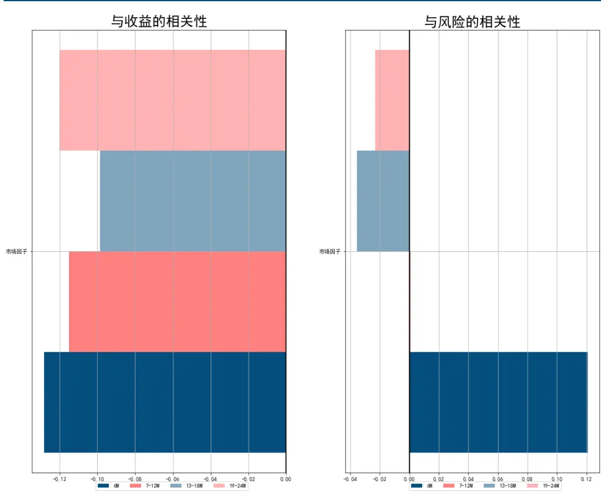
资料来源：Wind，朝阳永续，中信建投

图表 2 主要体现了拥挤度综合指标得分和市场收益与风险的相关关系。综合而言，拥挤发生对市场收益的影响不论长短期始终较为明显负相关，而对波动率的影响在短期（6 个月）为显著正相关，长期来无明显相关性。

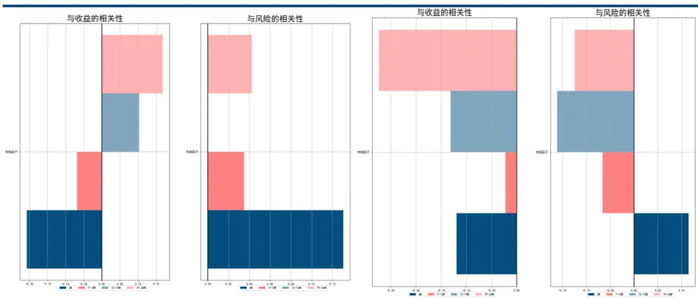
资料来源：Wind，朝阳永续，中信建投
图表6： 换手率与市场因子的相关性

图表 3 主要体现了估值指标和市场收益与风险的关系。和综合指标类似，在未来短期内，估值与收益的负相关性非常明显，相关系数大约在-0.35 左右，而与风险呈现出相对较弱正相关性。而在中长期，该指标于收益和风险均呈正相关，相关程度弱于短期。

图表3： 估值与市场因子的相关性
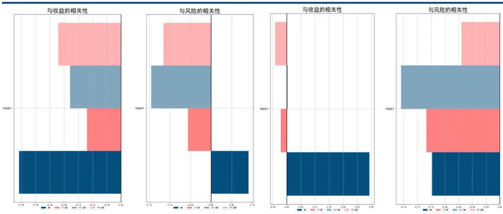
资料来源：Wind，朝阳永续，中信建投
图表4： 成长与市场因子的相关性

图表 4 主要体现了成长性指标和市场因子收益与风险的关系。市场因子的成长性指标与风险始终呈负相关，波动范围在[-0.15,-0.05]内。从收益率上来看，在短期与收益率呈正相关，且相关度较高，接近 0.3。在中长期迅速回落，在 13-18 个月几乎趋近于 0。

图表5： 动量与市场因子的相关性

图表 5 主要体现了动量指标和市场收益与风险的关系。该指标与市场因子未来短期（6 个月内）的表现相关程度最高，表现为与收益负相关，与风险正相关。

图表 6 主要体现了换手率指标和市场收益与风险的关系。从短期六个月来看，市场换手率与未来的收益率成负相关同时与风险成正相关。说明短期换手率高带来的拥挤度可能导致因子未来收益减少，而风险增大。在7-12 个月，其与收益和风险的相关程度较小，与收益的相关性几乎为 0，而风险的相关性也从正数转变为负数。12 个月以上，其与收益和风险都呈负相关。在 19-24 个月，与收益呈非常显著的负相关，数值接近-0.3，于此同时与风险相关性也在-0.15 左右。总体而言，换手率高带来的拥挤度在短期六个月内影响较为明显，在中长期能够使得风险减小，而在长期的影响主要体现在对收益的负相关上。

图表7： 波动率与市场因子的相关性
图表8： 两两相关性与市场因子的相关性
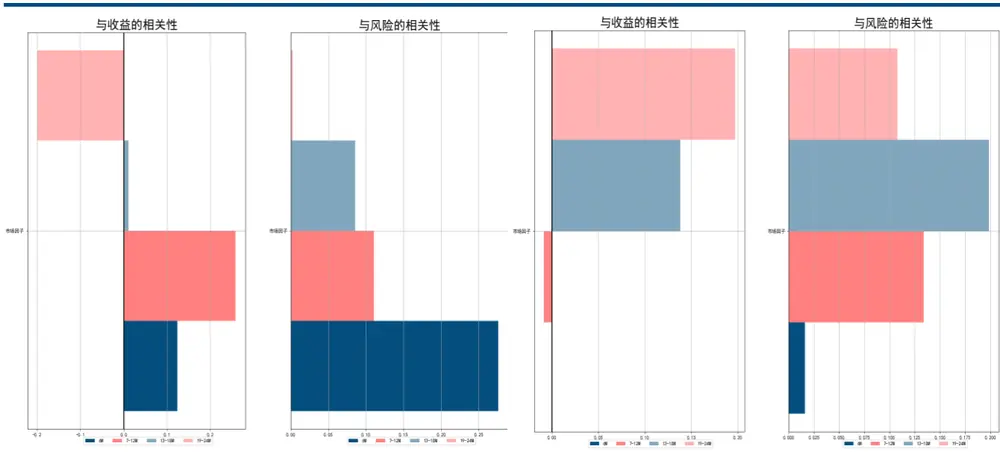
资料来源：Wind，朝阳永续，中信建投

图表 7 主要展示了市场因子收益和风险与截面波动率指标之间的相关性。除 19-24 个月的数据外，该指标均与收益负相关，与风险负相关。其中，截面波动率与市场因子未来 7-12 个月的收益相关性最显著，与未来 1-6 个月的风险的相关性超过 0.25。这说明，波动率层面上的拥挤主要对市场因子中短期表现产生影响。

图表 8 主要体现了两两相关性指标和市场收益与风险的关系。其与未来收益和风险大多都呈现正相关性，影响主要发生在长期。短期（12 个月内）来看，两两相关性指标与收益几乎没有相关性，与风险的相关性也较低。在长期，该指标与收益相关性显著增加，接近 0.2，风险也同样如此。这说明两两相关性所造成的拥挤度影响在短期未发生，在长期能够使收益增加，风险波动是上升的。

## 4.2 行业因子

图表9： 综合拥挤得分与行业因子的相关性
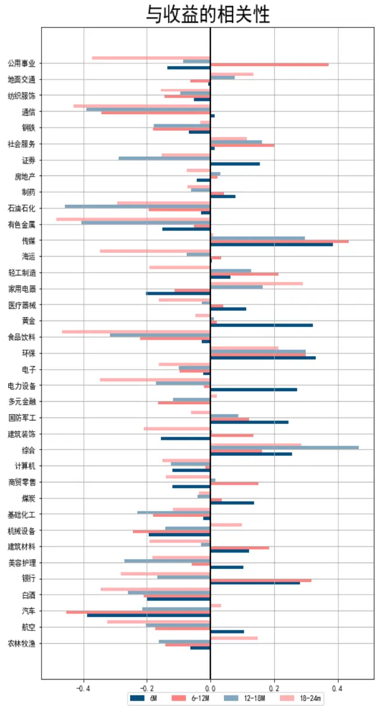

与风险的相关性
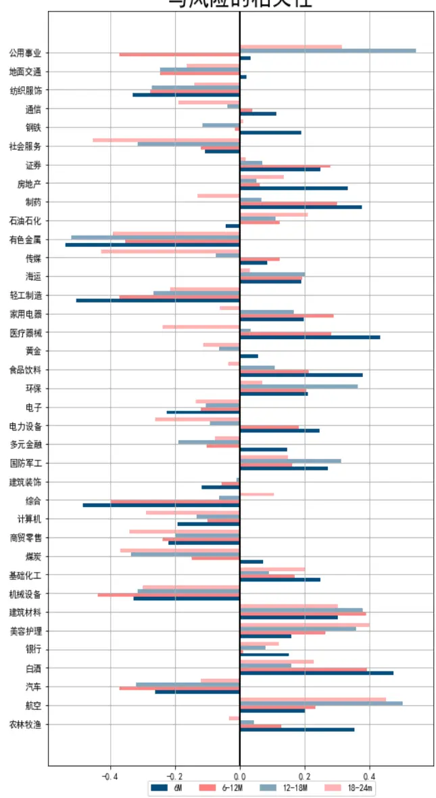
资料来源：Wind，朝阳永续，中信建投

图表 9 展示了 6 个拥挤度指标加权后的综合拥挤得分与未来收益、风险相关性。中短期（1-12 个月）未明显体现出未来收益的相关性，而就中长期（13-24 个月）而言，多数行业的收益率呈现负相关的长期趋势。具体而言，在长期（19-24 个月）中，37 个行业中有 27 个行业出现负相关，仅 10 个行业出现正相关，其中以传媒、轻工制造、银行等正相关性较强。就拥挤度与未来风险的相关性而言，整体相关性趋势未呈现显著趋势，在 18-24 个月的长期，15 个行业出现正相关，22 个行业出现负相关。部分行业如纺织服饰、轻工制造、机械设备等行业呈现较强负相关性，而股票、制药、农林牧渔等行业呈现较显著的正相关性。

图表10： 估值与行业因子的相关性
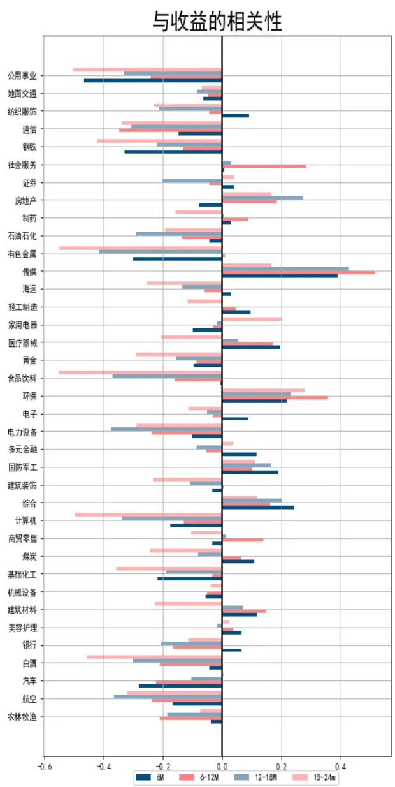

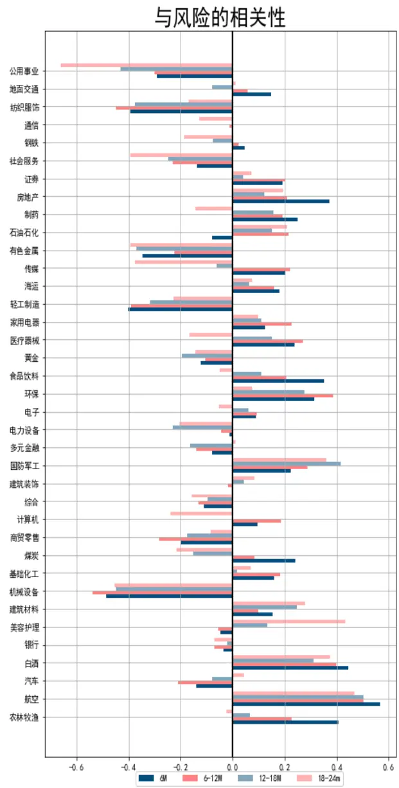
资料来源：Wind，朝阳永续，中信建投

图表 10 展示了估值水平与行业因子收益和波动性间的相关关系。该得分与大多数行业的收益存在负相关关系，而部分行业如传媒、环保等行业则呈现出较强正相关性。从与未来收益相关性看，对于 19-24 个月的长期收益，37 个行业中有 27 个行业呈现出负相关性，占所有行业数量的 73%。仅 10 个行业出现正的相关性，且呈现的正相关性相较于大部分行业的负相关性相对较弱；从与未来风险相关性看，部分行业如纺织服饰、有色金属、轻工制造、机械设备等出现了较强负相关性，其余多数行业出现显著正相关性。例如，在 19-24 个月的长期出现正相关性较强的行业有传媒、白酒、航空等行业。

图表11： 成长与行业因子的相关性
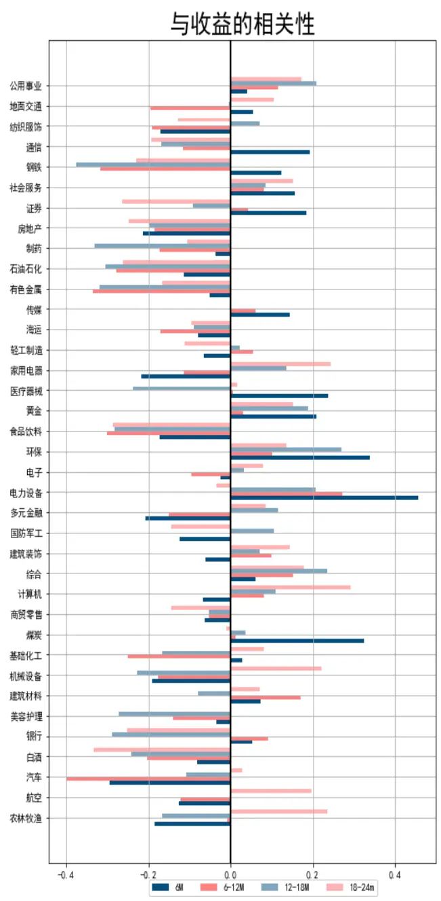

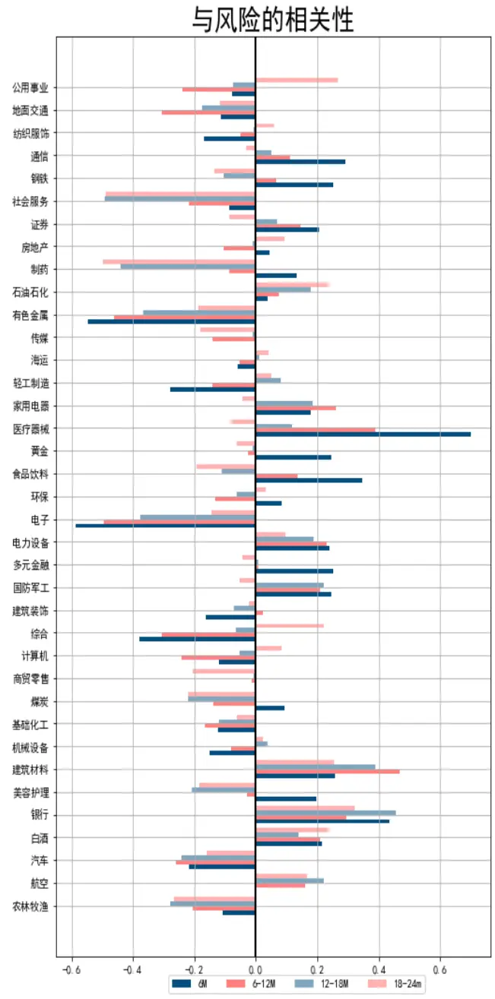
资料来源：Wind，朝阳永续，中信建投

图表 11 给出了成长率指标与行业因子收益和波动性间的相关性。总体上看，成长率指标与未来收益、风险相关性并未表现出显著的相关关系。部分显著的相关性为：房地产、汽车等行业未来的短期和长期收益都与该指标正相关；而医疗器械、环保、电力设备等行业未来短期收益则表现出较强的负相关性，其中电力设备的短期收益负相关性最强。就拥挤度与未来风险的相关性而言，相关性亦未呈现显著规律。

图表12： 因子累计收益率与行业因子的相关性
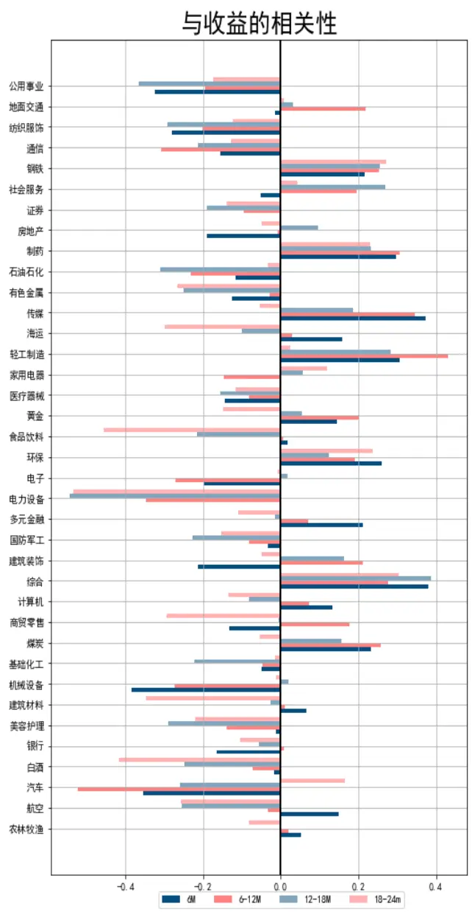

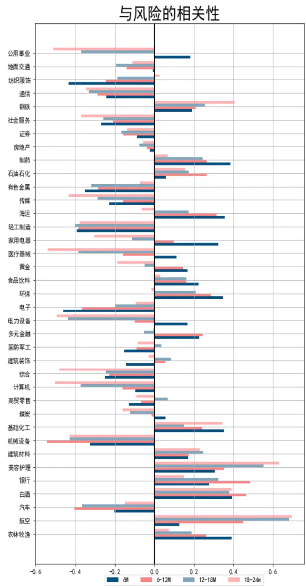
资料来源：Wind，朝阳永续，中信建投

就因子累计收益率指标而言，其与因子未来收益多呈现负相关关系，而与风险的相关性趋势不显著。具体来讲，未来收益与该指标呈现显著负相关的行业主要有食品饮料、电力设备、白酒、汽车等，呈现收益正相关的行业主要有钢铁、轻工制造等。风险相关性层面，呈现负相关的行业略多于呈现正相关的行业，反应了因子拥挤度与未来风险相关性的不显著性。

图表13： 换手率与行业因子的相关性
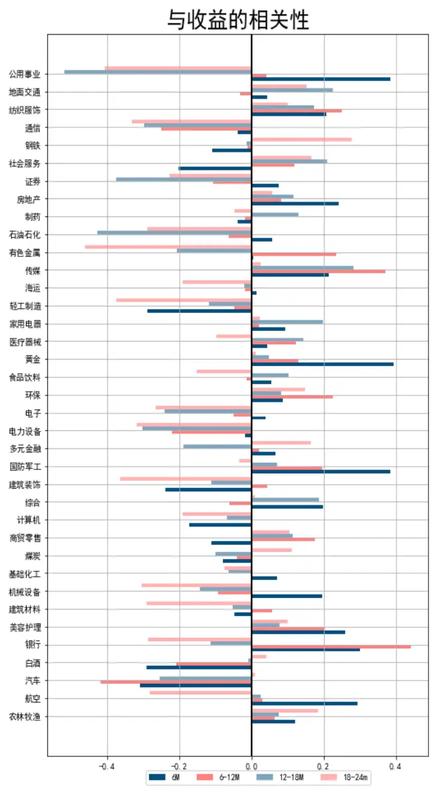

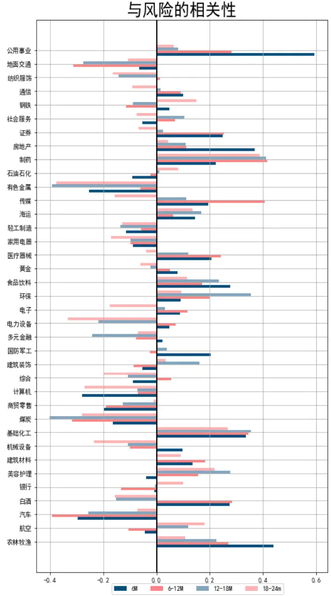
资料来源：Wind，朝阳永续，中信建投

换手率得分指标与两两相关性指标类似，就与收益的相关性而言，长期（19-24 个月）来看，相关性以负相关为主（共 20 个行业呈现长期收益负相关性），出现显著的长期收益负相关行业有公用事业、通信、汽车等；而出现较显著正相关性的行业有传媒、银行，相对较少。就风险相关性而言，整体上呈现显著风险正相关的行业较多，且平均正相关性较强，其中以制药、传媒、农林牧渔为主。

图表14： 波动率与行业因子的相关性
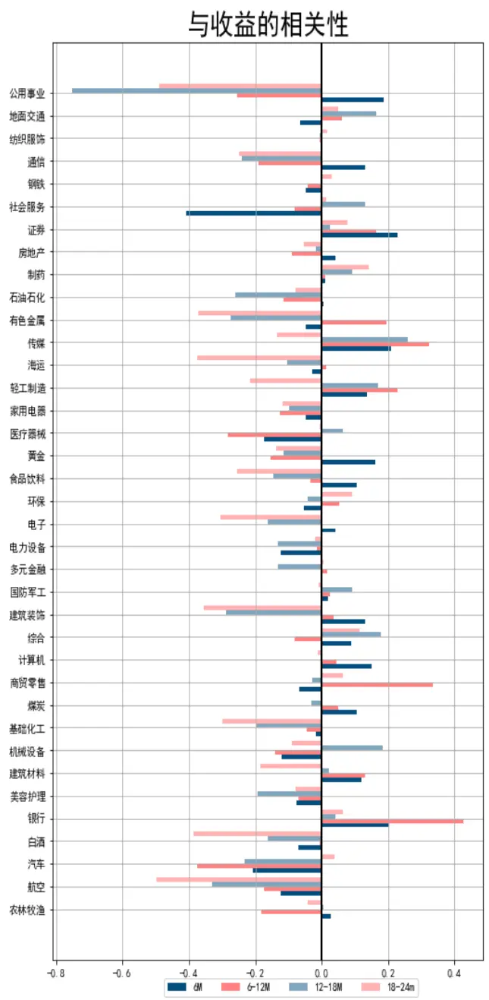

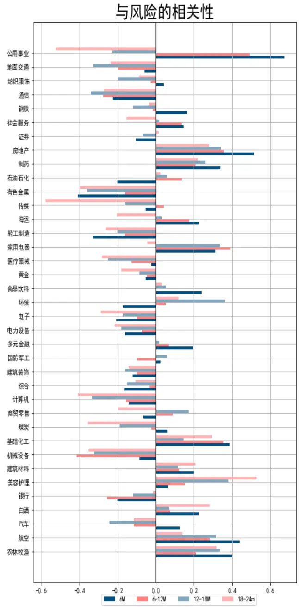
资料来源：Wind，朝阳永续，中信建投

对大多数行业而言，截面波动率指标与未来因子收益率呈现负相关性，尤其是因子未来 19-24个月的收益率；而与未来风险的相关性则不太明晰。具体而言，收益角度，股票、传媒、银行等行业的未来收益与因子拥挤度呈现出较显著的正相关性；风险角度，通信、传媒、计算机等行业的因子拥挤度与未来风险出现了较强的负相关性，而房地产、美容护理、航空等行业出现较显著正相关关系。

图表15： 两两相关性与行业因子的相关性
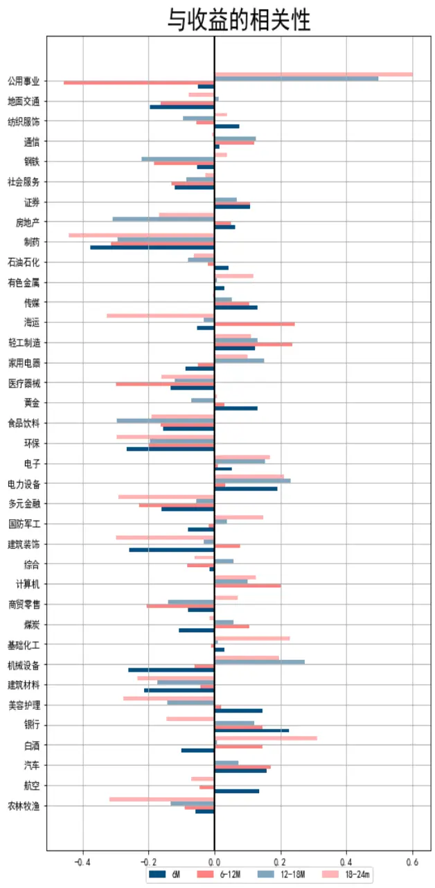

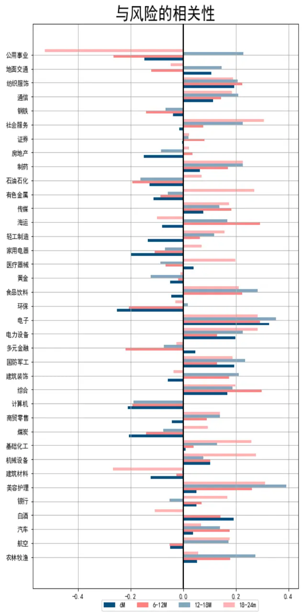
资料来源：Wind，朝阳永续，中信建投

就两两相关性指标而言，其与未来收益的相关性以负相关为主，但相关性不显著。其中呈现未来收益负相关性的行业居多。其中，制药、多元金融、农林牧渔行业呈现较显著负相关性；传媒、电子等行业呈现较显著收益正相关性。整体而言，收益正相关性相对较弱。从风险相关性角度分析，短期（6 个月）出现负相关性的行业较多，而从长期看（19-24个月），多数行业呈现与未来风险的较强正相关性，呈现负相关性的行业数量较少，长期负相关性较弱。

## 4.3 风格因子

图表16： 综合拥挤得分与风格因子的相关性
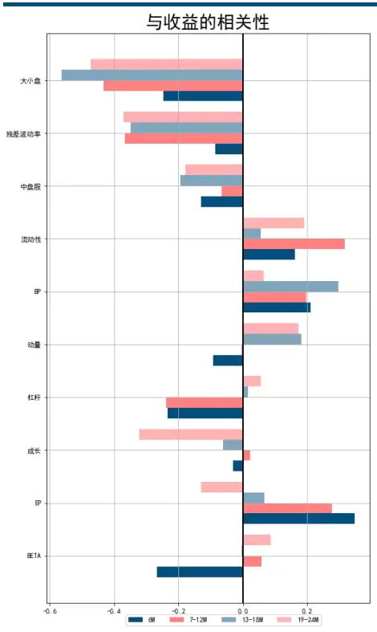

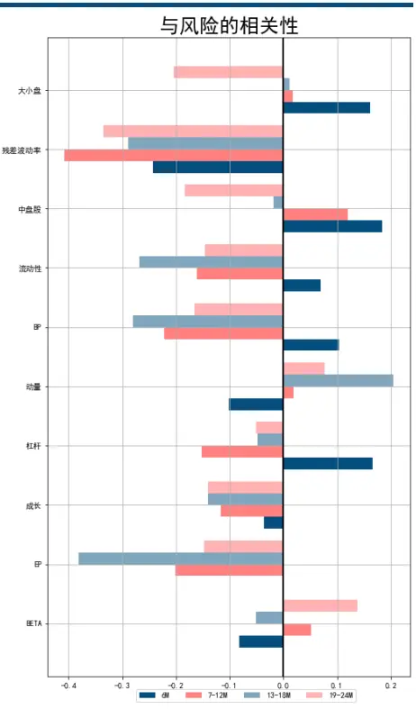
资料来源：Wind，朝阳永续，中信建投

图表 16 展示了 CNE7 经典版模型 10 个风格因子的收益和波动率与综合拥挤得分间的相关性。综合来看，拥挤度得分与各风格因子未来波动率间的相关关系较为一致，除成长因子（长期）和 Beta 因子（短期），因子拥挤程度的增加会降低未来风格因子的风险，而其和因子收益间的相关性不是很明确。从细分因子看，波动性因子未来收益与综合得分负相关，风险与其正相关。但更多的因子收益和风险均与综合得分负相关，其中大小盘因子和中盘股因子的情况最为显著。

图表 17 展示了 A股市场主要风格因子的收益和波动率与估值得分间的相关性。该指标和因子收益与风险的长期相关性要大于短期，例如大盘股因子收益、中盘股因子风险和账面市值比因子风险与估值指标的相关程度。从短期（未来 6 个月）来看，估值指标与绝大多数风格因子收益负相关，风险正相关。而从长期看，估值得分高的风格因子的未来长期波动率倾向于下降。

图表 18 展示了 A股市场主要风格因子的收益和波动率与成长得分间的相关程度。观察图 18 可发现两个特征。一是该拥挤指标与因子收益在长期相关性上更明显，而与风险在短期更为相关。二是成长指标对未来风格因子收益和波动率的影响方向较为一致，同正相关或同负相关。大小盘因子上于未来的因子收益负相关且风险正相关。

图表17： 估值与风格因子的相关性
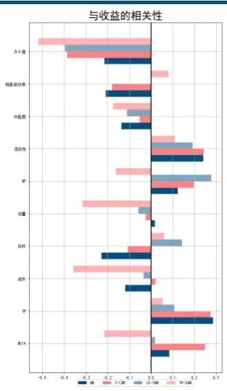

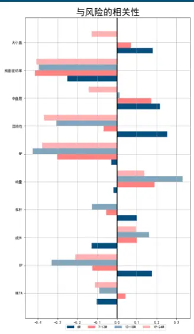

图表18： 成长与风格因子的相关性
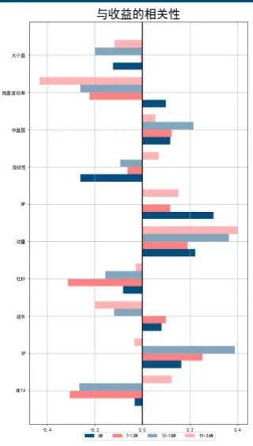

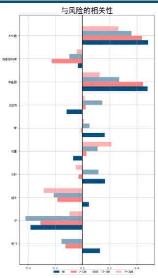
资料来源：Wind，朝阳永续，中信建投

图表19： 因子累计收益率与风格因子的相关性
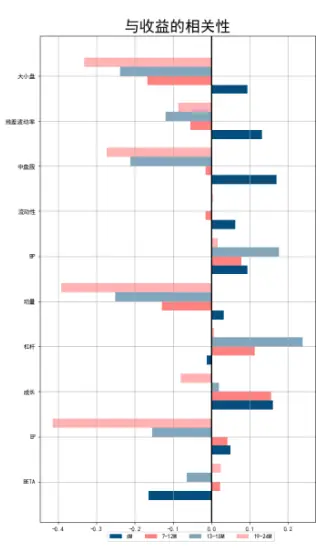

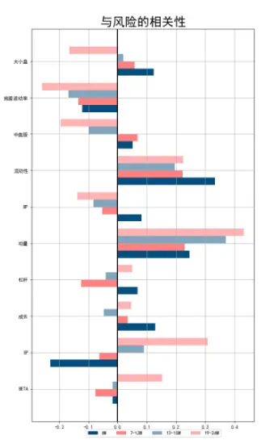
资料来源：Wind，朝阳永续，中信建投

图表20： 换手率与风格因子的相关性
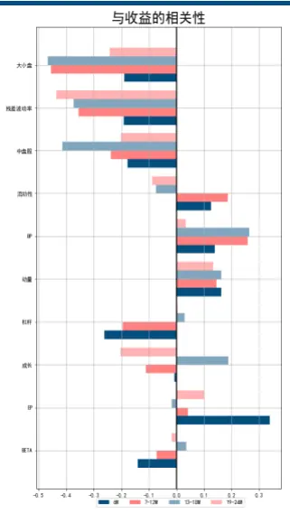

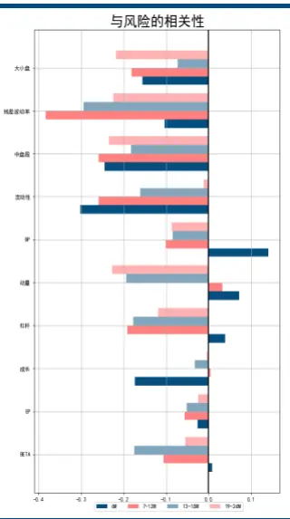

图表 19 展示了 A 股市场主要风格因子的收益和波动率与因子累计收益率间的相关关系。总体上看，该指标和风格因子表现的相关系数值域为（-0.4,0.4），相关性一般。结合动量效应与收益和风险的相关系数，对于与该指标相关性相对较强的大小盘因子、动量因子和经营收益率因子，相关性上长期呈现出收益负相关和风险正相关特征，但短期相关性比较复杂。此外，流动性因子也值得关注，动量得分与其收益间相关性极小，但是对其波动率的影响在所有时间段内都相对较大。

图表 20 展示了 A股市场主要风格因子的收益和波动率与换手率指标间的相关程度。从图中可以看出两个比较明显的特征。该指标与大小盘因子、残差波动率因子和中盘股因子收益间的负相关性相对而言较为明显，在各个时间区间均是如此。

图表21： 波动率与风格因子的相关性
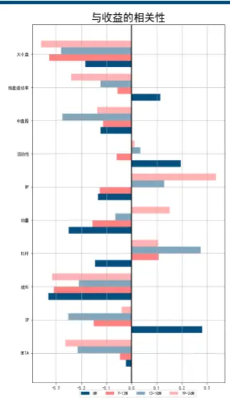
资料来源：Wind，朝阳永续，中信建投

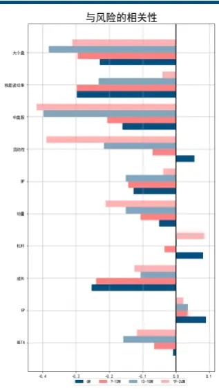

图表22： 两两相关性与风格因子的相关性
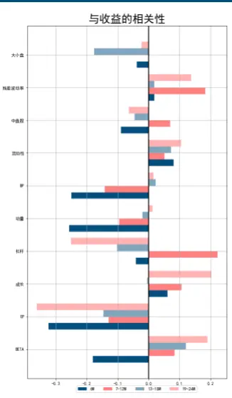

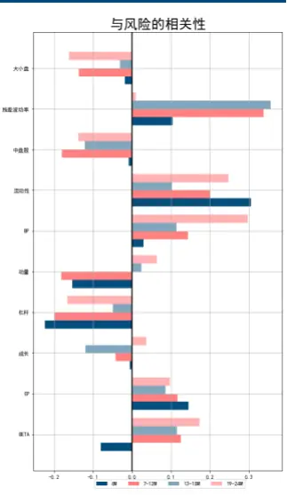

图表 21 展示了 A股市场主要风格因子的收益和波动率与波动率指标间的相关性。该指标与风格因子收益和风险之间的相关性表现和换手率的类似，均主要呈现为负相关的关系，但波动率指标的负相关关系会更为明显。这一关系说明当因子拥挤度提高主要是由波动率上升驱动时，大部分风格因子都有可能经历收益回落。

图表 22 展示了 A 股市场主要风格因子的收益和波动率与两两相关性指标间的相关性。总体而言，该指标与风格因子间的相关性较弱。关注系数相对较大的因子，可发现同动指标与未来风格因子的短期（6 个月内）收益大多是负相关，与未来因子的长期（大于 6 个月）波动率大多呈现正相关关系。值得关注的是，E/P 因子在所有时间区间都与该指标收益负相关，风险正相关。

## 五、因子拥挤度指标历史走势（部分）

本节选取市场因子、风格因子中的大小盘因子、动量因子以及行业因子的电力设备、汽车和计算机总共 5 个细分因子作时间序列的深入分析。CNE7经典版所有的48个因子的拥挤指标及细分指标的历史走势详情见附录。

## 5.1 市场因子

拥挤贡献走势
图表23： 市场因子拥挤度
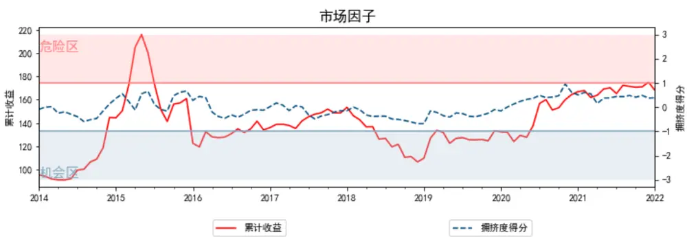

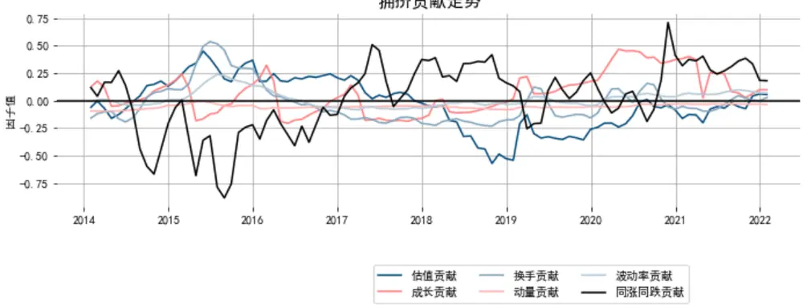
资料来源：Wind，朝阳永续，中信建投

从图表 25 的上图来看，市场因子的综合拥挤度指标在 2015 年最高接近+3 个标准差。对拥挤程度最大的贡献来自于估值，换手，和波动率细分指标。自 2016 年至 2019 年逐步去拥挤，2019 年后该指标有所上升。2002年 1 月 14 日综合指标接近于 1 个标准差。

从图表 25 的下图来看，拥挤程度细分指标贡献变化较大，常常处于上涨或是下跌的趋势。在 2015 年至 2016年期间，估值水平和换手率联合先升后降呈倒“V”趋势，两两相关性贡献择时大波动下跌，从而导致这短时间的拥挤度变化速度快且幅度大。

## 5.2 大小盘因子

图表24： 大小盘风格因子拥挤度
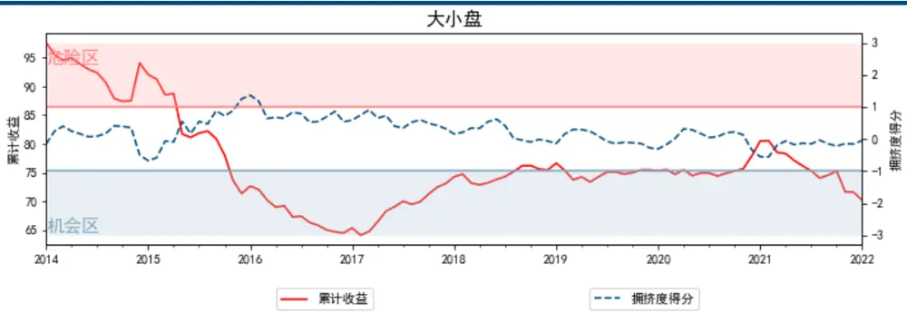

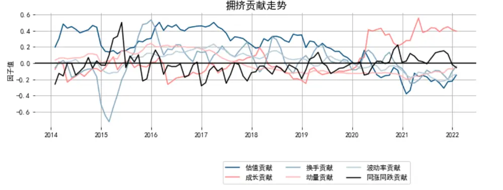
资料来源：Wind，朝阳永续，中信建投

就大小盘因子而言，拥挤度指标进行了负向处理，因为通常认为小盘股具有风险溢价，图表 24 中的上图显示，2016 年底，综合拥挤度接近+1 标准差，但小盘股还是在跑赢大盘股（因子收益率下行）。该因子逆转发生在 2017 年初，拥挤度贡献主要来自于估值贡献。

## 5.3 动量因子

从拥挤度的角度来看，动量因子是大多数投资者最关心的因子，动量因子效应存在于很多市场和不同的大类资产中，过去一段时间收益率高的股票，则动量因子的暴露度高，反之，则暴露度低。如果过去表现好的股票在接下来一段时间，表现也好，呈现强者恒强的效应，那动量因子的收益率为正收益。海外市场特别是美国股票市场动量因子曾表现出最严重的回撤幅度和极端拥挤程度。

图表 27 显示了综合拥挤评分，以及历史上每个指标对该得分的贡献。从走势图中可以看出，该因子的拥挤度在 2014 年初上升超过 1 突破了高拥挤度区域，然后回落至历史平均值 0 附近。接着在 2015 年初再次上升并在 2015 年 8 月上升至最高点接近 3 后开始下降。随后，除了在 2017 年 3 月、2018 年 6 月和 2019 年 9 月略微突破过 1 之外，其余时间均在 0 轴附近震荡。而累计收益总体呈现“V”字形，从 2014 年初开始下跌至 2017 年 1月跌至最低点然后开始反弹，在持续上涨至 2021 年 7 月达到最高点后开始出现了下降的趋势。从图 27 的下图来看， 两两相关性贡献和换手率贡献变化较大。2015 年， 两两相关性贡献出现大幅度增长，导致综合拥挤度同步上升并突破高拥挤度区域，说明促使因子收益在之后的一段时间呈下降趋势。在 2017 年3 月、2018 年 6月和 2019 年9 月拥挤度进入高拥挤度区域的主要原因分别是成长贡献、估值贡献导致。

图表25： 动量因子拥挤度
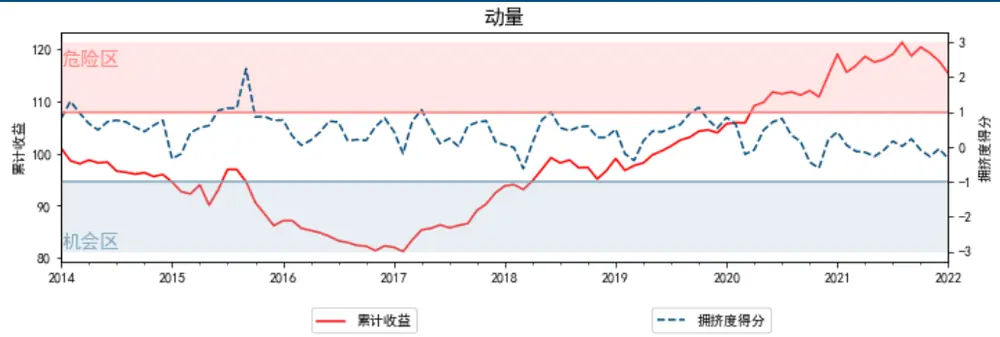

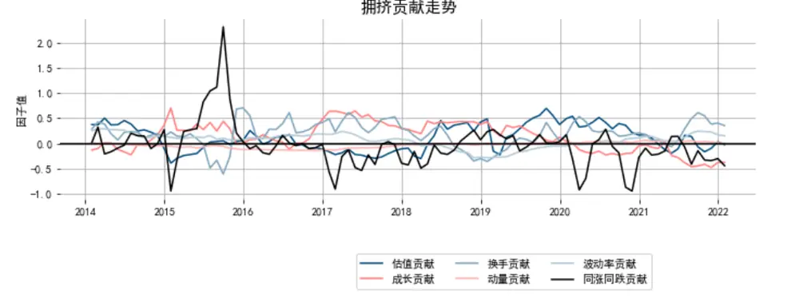
资料来源：Wind，朝阳永续，中信建投

## 5.4 电力设备行业因子

就电力设备行业因子的累计收益在 2020 年以前长期处于低拥挤度区域，而综合拥挤度得分自 2021 年之前以来均在 0 均值附近小幅波动。2021 年之后，因子收益率上涨，而综合拥挤度也在上升，达到了高度拥挤度状态，拥挤度得分达到了最高接近 2 的水平，但两者都在 2021 年底小幅回落。观察拥挤贡献走势图可发现，在2018 年之前，拥挤度贡献围绕历史平均水平 0 值小幅波动，波动的幅度基本不超过正负 0.2。到 2017 年之后。成长贡献开始出现较大增长，最高达到了将近 0.4 的水平。而估值拥挤度贡献发生较大幅度下降，在 2018 年下半年下降到了低于负 0.4 的水平。在 2021 年之后，估值和换手率拥挤度贡献发生较大幅度增长，达到超过 0.6的水平。

图表26： 电力设备行业拥挤度
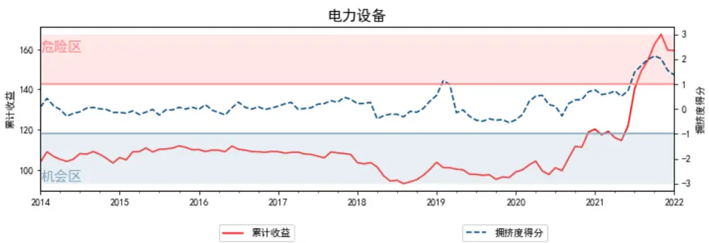

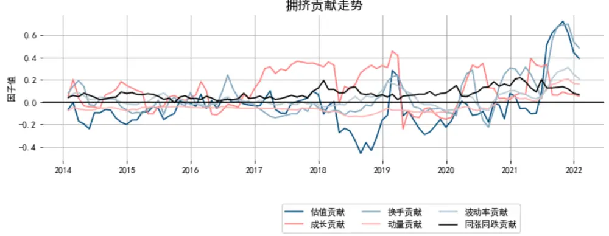
资料来源：Wind，朝阳永续，中信建投

## 5.5 汽车行业因子

就汽车行业而言，它的拥挤度始终维持在一个较为稳定的区间，仅在 2020 年末达到最高点 1 个标准差，有一定的拥挤，导致了较大的回撤。历史上 2015 年自最高点下降，在 2017 至 2018 年有所回升，之后持续下降，至 2020 年达到最低点。在 2021 年初突然拉升，之后震荡上升。从图表 27 的下图看各拥挤贡献的走势。其中换手率、估值水平、成长率对拥挤度的贡献波动最大。

图表27： 汽车行业拥挤度
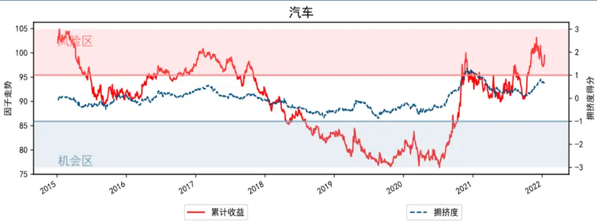

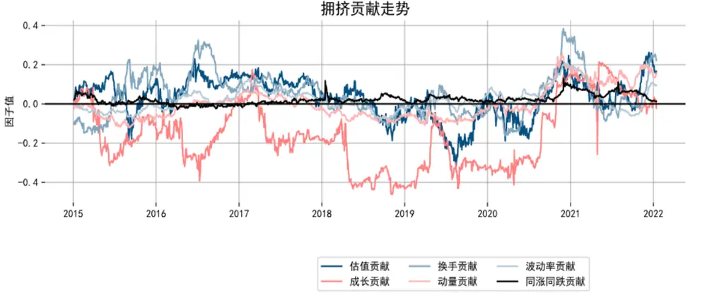
资料来源：Wind，朝阳永续，中信建投

## 5.6 计算机行业因子

就计算机行业而言，在 2020 年以前计算机行业因子的累计收益处于持续增长阶段，从 2014 年处于低拥挤度区域的底部，到 2020 年处在高拥挤度区域的顶端，2020 年之后发生回落，回落到低拥挤度区域的边界。而拥挤度得分则围绕 0 进行小幅波动，就拥挤度指标贡献而言，与电力设备不同，计算机行业的各因子的拥挤贡献波动较大。其中成长贡献波动幅度最大。其最低点达到了将近-0.6 的水平，而最高点则达到了将近 0.8 的水平。其次，换手率贡献和估值贡献的波动性也较大。在 2017 年以前，成长贡献出现了比较大的低于 0 的状态。而到2020 年第二季度以后。成长贡献又出现了比较大幅度的增长。估值贡献则长期处于大于 0 的状态。从 2014 年到 2018 年，估值贡献处于持续下降阶段，从 2018 年开始大幅增长。到 2020 年之后则发生回落。

图表28： 计算机行业拥挤度
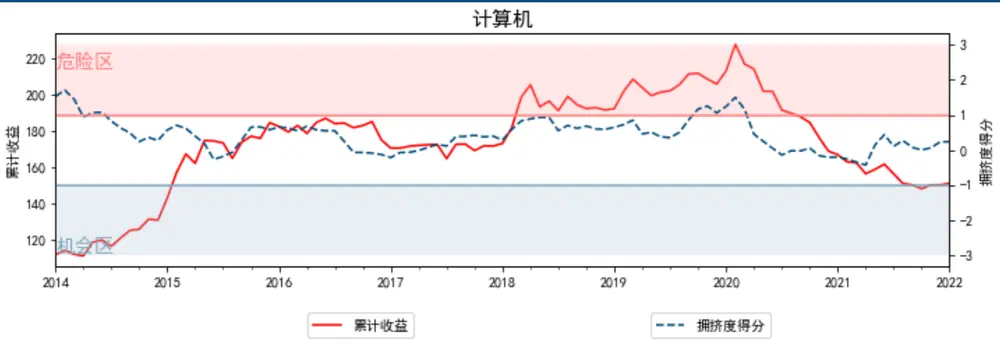

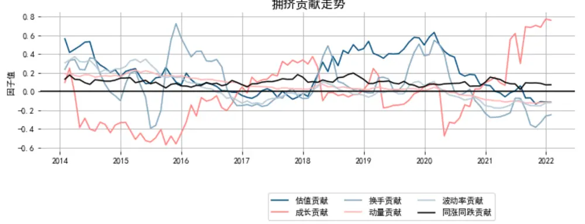
资料来源：Wind，朝阳永续，中信建投

## 六、结论

随着因子投资的兴起，机构投资者越来越关注自己的因子风险敞口是否拥挤。因子拥挤度模型旨在为投资者提供测量拥挤度的方法，帮助机构投资者了解其投资组合是如何定位的，以及组合收益和风险的驱动因素。该模型通过估值水平，换手率等一系列指标来推断因子策略中的相对拥挤程度，这些信息对追逐相同策略的大量资本流动是敏感的。该模型可用于快速确定拥挤风险出现的可能性，并帮助投资者评估是否有必要调整自己的风险敞口。

本研究报告重点探讨了综合拥挤度指标及其细分指标与市场因子、37 个行业因子和 10 个风格因子未来收益与波动率之间的相关关系。虽然每个因子的相关性都不一样，但高度拥挤往往意味着该因子在此后，特别是在随后的 6 至 12 个月中表现不佳和产生较大波动的风险更大。这一点在市场因子身上得到了很好的印证。模型结果表明，在短期 1-6 个月，综合拥挤度指标及与市场因子收益负相关而与其波动率间正相关，这说明短期来看，拥挤程度越高会导致该因子未来收益的下降和风险的上升。该现象也发生在部分风格因子身上，如大小盘因子。但该结论并不是对所有因子成立。事实上，本报告结果显示，不同的因子拥挤度指标对因子的前瞻性影响是不一致的，会受到因子本身特质、预测窗口期和其他不可观测因素的影响。在所有的指标和因子中，市场因子与综合拥挤指标、估值指标和成长指标间，风格因子与估值指标间的相关关系最符合预期。为进一步探究因子拥挤指标的有效性，本报告重点选取了风格因子中的大小盘因子和动量因子，行业因子中的电力设备行业、汽车行业及计算机行业进行详细探究。 年以来，大小盘因子和计算机行业因子尚位于安全区，动量因子、电力设备行业因子和汽车行业因子分别于 2020 年，2021 年和 2021 年进入高拥挤度区域。值得注意的是，大小盘因子和动量因子的累计收益与综合拥挤度有负相关性。过往经验表明拥挤会导致了一些极端市场事件的出现，而本文构建的拥挤模型正可以挖掘这些事件的潜在迹象，以供投资者借鉴。

## 附录：因子拥挤度历史走势（全）

图表29： 风格因子拥挤度走势 1/2
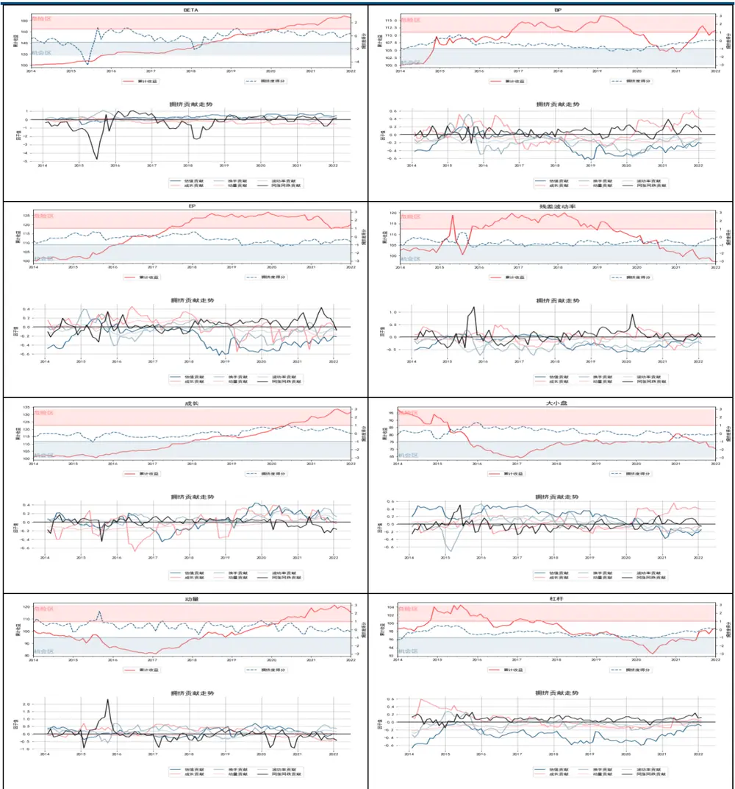
资料来源：Wind，朝阳永续，中信建投

图表30： 风格因子拥挤度走势 2/2
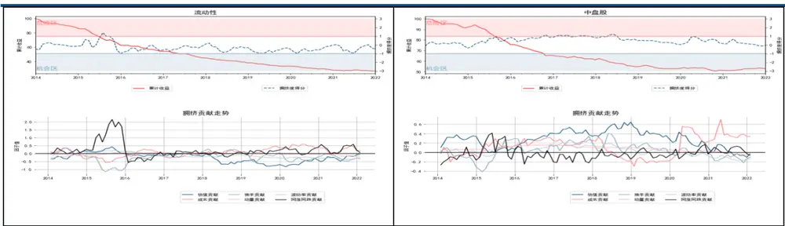
资料来源：Wind，朝阳永续，中信建投

图表31： 行业因子拥挤度走势 1/5
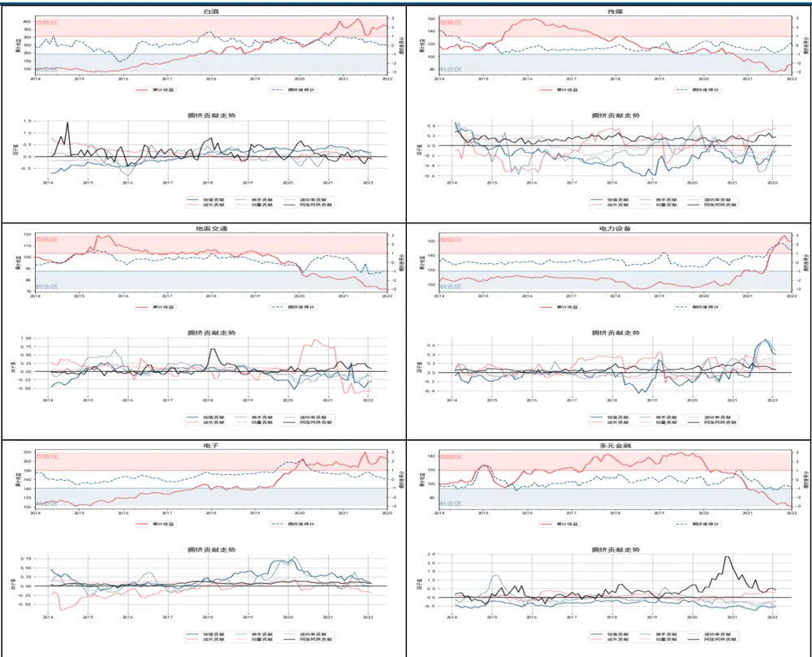
资料来源：Wind.朝阳永续，中信建投

图表32： 行业因子拥挤度走势 2/5
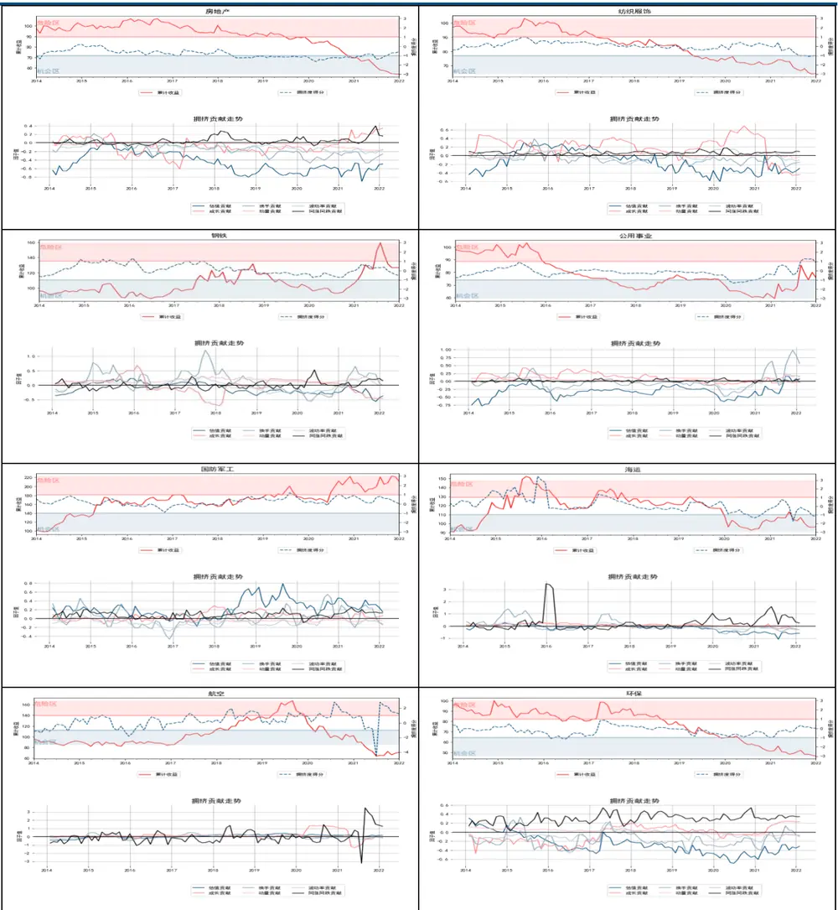
资料来源：Wind.朝阳永续，中信建投

图表33： 行业因子拥挤度走势 3/5
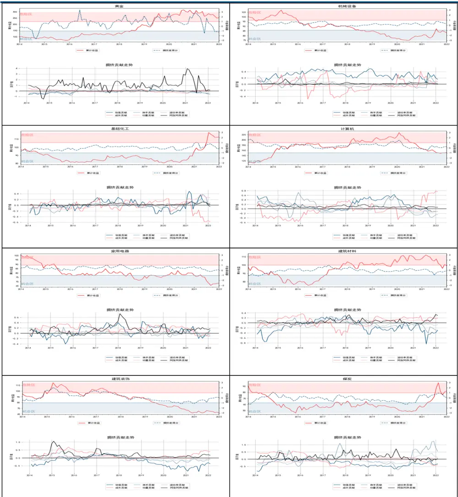
资料来源：Wind.朝阳永续，中信建投

图表34： 行业因子拥挤度走势 4/5
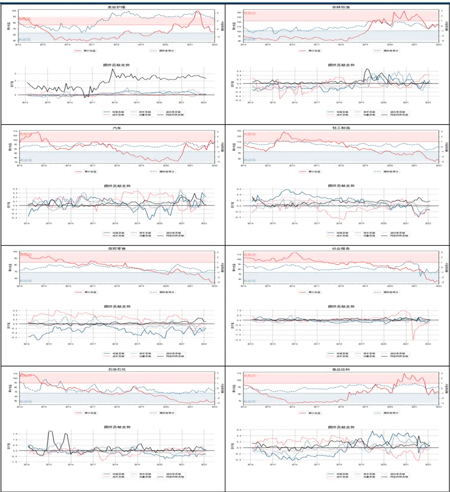
资料来源：Wind.朝阳永续，中信建投

图表35： 行业因子拥挤度走势 5/5
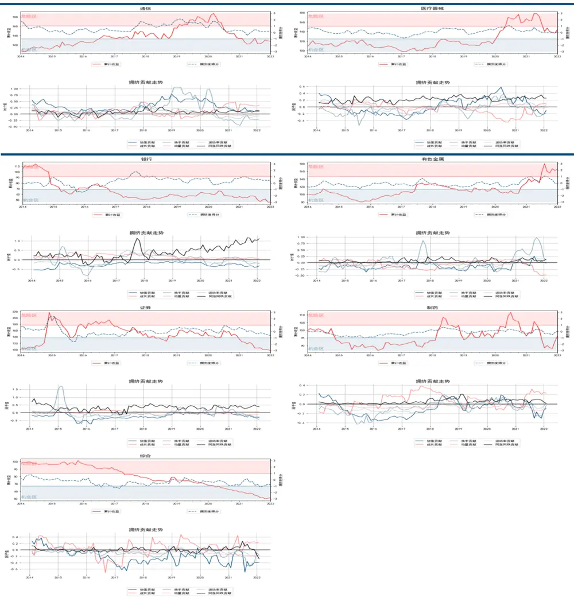
资料来源：Wind，朝阳永续，中信建投

## 参考文献

Alighanbari, M. and S. Doole. （2018）. “What’s Your Factor Footprint? Assessing the Investment Capacity of Factor Index Strategies.” MSCI Research Insight.

Asness, C., J. Friedman, R. Krail and J. Liew. （2000）. “Style Timing: Value vs. Growth.” The Journal of Portfolio Management, Vol. 26, pp. 50–60.

Bayraktar, M., S. Doole, A. Kassam and S. Radchenko. （2015a）. “Lost in the Crowd? Identifying and Measuring Crowded Strategies and Trades.” MSCI Research Insight.

Bayraktar, M., I. Mashtaler, N. Meng and S. Radchenko. （2015b）. “MSCIX US Total Market Equity Model for Medium-Term Investors, Empirical Notes.” MSCI Model Insight.

Chue, T. （2015）. “Omitted Risks or Crowded Strategies: Why Mutual Fund Comovement Predicts Future Performance.” Available at http://www.fmaconferences.org/Vegas/Papers/MFComvtv34b.pdf

Cohen, R. B., C. Polk and T. Vuolteenaho. （2003）. “The Value Spread.” Journal of Finance, Vol. 78, pp. 609–642.

Daniel, K. and T. Moskowitz. （2016）. “Momentum Crashes.” Journal of Financial Economics, Vol. 122, pp. 221- 247.

De Bondt, W. and R. Thaler. （1985）. “Does the Stock Market Overreact?” Journal of Finance, Vol. 40, pp. 793– 805.

Gustafson, K. and P. Halper. （2010）. “Are Quants All Fishing in the Same Small Pond with the Same Tackle Box?” Journal of Investing, Vol. 19, pp. 104-115.

Hanson, S. and A. Sunderam. （2014）. “The Growth and Limits of Arbitrage: Evidence from Short Interest.” The Review of Financial Studies, Vol. 27, pp. 1238-1286.

Lou, D. and C. Polk. （2013）. “Comomentum: Inferring Arbitrage Activity from Return Correlations.” Available at http://personal.lse.ac.uk/loud/comomentum.pdf

Wang, K. and J. Xu. （2015）. “Market Volatility and Momentum.” Journal of Empirical Finance, Vol. 30, pp. 79- 91.

Yara, F., M. Boons and A. Tamoni. （2018）. “Value Timing: Risk and Return Across Asset Classes.” Available at https://papers.ssrn.com/sol3/papers.cfm?abstract_id=3054017

Zhong, L., X. Ding and N. Tay. （2017）. “The Impact on Stock Returns of Crowding by Mutual Funds.” The Journal of Portfolio Management, Vol. 43, pp. 87-99.

量化深度报告

George Bonne, Leon Roisenberg, Roman Kouzmenko and Peter Zangari. （2018）. “MSCI Integrated Factor Crowding Model”

## 分析师介绍

陈果：中信建投证券董事总经理（MD）、研委会副主任、首席策略官。复旦大学理学学士，上海交通大学金融硕士，曾任安信证券首席策略师，研究中心副总经理。因市场把握准确闻名，2020年疫情冲击下的市场底部提出“黄金坑”与“复苏牛”。2021年提出从茅指数到宁组合，是“宁组合”的首创者。曾多次荣获新财富、水晶球和金牛奖中国最具价值分析师等奖项，也是 A 股市场最具影响力的策略分析师之一。

## 研究助理

徐建华：总监，智能量化投研组组长，先后就职于MSCI Barra公司和标普公司等专业研究机构，具有十多年金融市场研究、统计建模等专业经验。为多家银行、基金和保险等资管客户提供因子模型、投资组合优化管理、基金评价、指数研究以及风险管理等咨询。

## 评级说明

| 投资评级标准 |  | 评级 | 说明 |
| --- | --- | --- | --- |
| 报告中投资建议涉及的评级标准为报告发布日后6个月内的相对市场表现，也即报告发布日后的6 个月内公司股价（或行业指数）相对同期相关股票市场代表性指数的涨跌幅作为基准。A股市场以沪深300指数作为基准；新三板市场以三板成指为基准；香港市场以恒生指数作为基准；美国市场以标普500指数为基准。 | 股票评级 | 买入 | 相对涨幅15%以上 |
|  |  | 增持 | 相对涨幅 5%—15% |
|  |  | 中性 | 相对涨幅-5%—5%之间 |
|  |  | 减持 | 相对跌幅 5%—15% |
|  |  | 卖出 | 相对跌幅15%以上 |
|  | 行业评级 | 强于大市 | 相对涨幅10%以上 |
|  |  | 中性 | 相对涨幅-10-10%之间 |
|  |  | 弱于大市 | 相对跌幅 10%以上 |

## 分析师声明

本报告署名分析师在此声明：（i）以勤勉的职业态度、专业审慎的研究方法，使用合法合规的信息，独立、客观地出具本报告, 结论不受任何第三方的授意或影响。（ii）本人不曾因，不因，也将不会因本报告中的具体推荐意见或观点而直接或间接收到任何形式的补偿。

## 法律主体说明

本报告由中信建投股票股份有限公司及/或其附属机构（以下合称“中信建投”）制作，由中信建投股票股份有限公司在中华人民共和国（仅为本报告目的，不包括香港、澳门、台湾）提供。中信建投股票股份有限公司具有中国证监会许可的投资咨询业务资格，本报告署名分析师所持中国股票业协会授予的股票投资咨询执业资格证书编号已披露在报告首页。

本报告由中信建投（国际）股票有限公司在香港提供。本报告作者所持香港证监会牌照的中央编号已披露在报告首页。

## 一般性声明

本报告由中信建投制作。发送本报告不构成任何合同或承诺的基础，不因接收者收到本报告而视其为中信建投客户。

本报告的信息均来源于中信建投认为可靠的公开资料，但中信建投对这些信息的准确性及完整性不作任何保证。本报告所载观点、评估和预测仅反映本报告出具日该分析师的判断，该等观点、评估和预测可能在不发出通知的情况下有所变更，亦有可能因使用不同假设和标准或者采用不同分析方法而与中信建投其他部门、人员口头或书面表达的意见不同或相反。本报告所引股票或其他金融工具的过往业绩不代表其未来表现。报告中所含任何具有预测性质的内容皆基于相应的假设条件，而任何假设条件都可能随时发生变化并影响实际投资收益。中信建投不承诺、不保证本报告所含具有预测性质的内容必然得以实现。

本报告内容的全部或部分均不构成投资建议。本报告所包含的观点、建议并未考虑报告接收人在财务状况、投资目的、风险偏好等方面的具体情况，报告接收者应当独立评估本报告所含信息，基于自身投资目标、需求、市场机会、风险及其他因子自主做出决策并自行承担投资风险。中信建投建议所有投资者应就任何潜在投资向其税务、会计或法律顾问咨询。不论报告接收者是否根据本报告做出投资决策，中信建投都不对该等投资决策提供任何形式的担保，亦不以任何形式分享投资收益或者分担投资损失。中信建投不对使用本报告所产生的任何直接或间接损失承担责任。

在法律法规及监管规定允许的范围内，中信建投可能持有并交易本报告中所提公司的股份或其他财产权益，也可能在过去 12个月、目前或者将来为本报告中所提公司提供或者争取为其提供投资银行、做市交易、财务顾问或其他金融服务。本报告内容真实、准确、完整地反映了署名分析师的观点，分析师的薪酬无论过去、现在或未来都不会直接或间接与其所撰写报告中的具体观点相联系，分析师亦不会因撰写本报告而获取不当利益。

本报告为中信建投所有。未经中信建投事先书面许可，任何机构和/或个人不得以任何形式转发、翻版、复制、发布或引用本报告全部或部分内容，亦不得从未经中信建投书面授权的任何机构、个人或其运营的媒体平台接收、翻版、复制或引用本报告全部或部分内容。版权所有，违者必究。

## 中信建投股票研究发展部

中信建投（国际）

北京

东城区朝内大街2号凯恒中心B

上海

深圳

上海浦东新区浦东南路 528 号南塔 2106 室

香港

座 12 层

福田区益田路 6003 号荣超商务中心 B 座 22 层

中环交易广场2期18 楼

电话：（8610） 8513-0588

电话：（8621） 6882-1600

电话：（86755）8252-1369

电话：（852）3465-5600

联系人：李祉瑶

联系人：翁起帆

联系人：曹莹

联系人：刘泓麟

邮箱：lizhiyao@csc.com.cn

邮箱：wengqifan@csc.com.cn

邮箱：caoying@csc.com.cn

邮箱：charleneliu@csci.hk