# 基于拥挤度判断的行业轮动策略资产配置研究系列之四

_ReportTime] 2022 年 6 月 9 日

[于明明Table_ First 金融工程与金融产品首席Author] 分析师

执业编号：S1500521070001

联系电话：+86 18616021459

邮 箱：yumingming@cindasc.com

# 证券研究报告

# 金工研究

金工专题报告

Table_Author] 于明明 金融工程与金融产品

首席分析师

执业编号：S1500521070001

联系电话：+86 18616021459

邮 箱： yumingming@cindasc.com

## 基于拥挤度判断的行业轮动策略

2022 年 6 月 9 日

单行业拥挤度与全市场拥挤度。规避相对拥挤的市场环境和行业是动量策略回撤控制的重要方向和手段。趋势的形成取决于投资者对影响资产价格信息的认知程度。若信息传导充分，则资产价格走势持续时长较短；若市场上多数投资者对未来走势的预期过分一致，则可能先助推价格走势，随后可能出现反转。（1）单行业拥挤度。诸如全市场换手率、成交量等指标常被用来判断市场整体的拥挤情况，但并不容易刻画单个行业的拥挤程度。实际上，强势行业的切换有时并非来自于整个市场的拥挤，而是来自于局部行业的拥挤（比如2015年的计算机、2020年的食品饮料）。对于这种情况，全市场拥挤指标很难做出有效反应。对此，本文使用主成分分析（PCA）方法，构建行业层面的资产集中度因子，并在多头组合中剔除最拥挤行业（如有），成功降低了多头组合的持仓风险。（2）全市场拥挤度。本文使用行业拥挤度分散度因子SDC和换手率TurnOver形成复合择时信号，成功优化了组合在2015年6月、2021年9月等关键风格转变时点动量策略的表现。

- 本文是资产配置系列报告第四篇。在《资产配置研究系列之二：基于行业动量的固收加产品设计》中我们提出了行业动量轮动的思路，本文进一步验证了中期动量（过去 250日收益率）在解决A 股行业轮动问题上的有效性，并从市场微观结构出发，从单行业拥挤度和全市场拥挤度两个维度着手，致力于降低动量崩溃对因子长期收益的负面影响。

- 考虑双拥挤的行业动量轮动策略。考虑市场+行业双拥挤后的行业动量多空组合年化收益率高达16.3%，收益波动比为1.10，多头超额年化收益率达10.0%，收益波动比为 1.20。分阶段来看，考虑市场+行业双拥挤的动量策略在2015年以及 2021年表现均有较大幅度的提升。其中，2015年普通行业动量策略的多空组合收益和回撤分别为-11.2%和-29.9%；叠加市场拥挤+行业拥挤信号后，当年多空收益转正为15.3%，最大回撤幅度降至-2.6%。2021年普通行业动量策略的多空组合和多头超额收益分别为13.2%和 7.9%；叠加市场拥挤+行业拥挤信号后，当年多空收益和多头超额收益分别提升至24.0%和 15.5%，整体策略年度胜率为83%，表现优异。

- 风险因素：结论基于历史数据，在市场环境转变时模型存在失效的风险。

## 基于拥挤度判断的行业轮动策略

本文是资产配置系列报告第四篇。在此前发布的报告《资产配置研究系列之二：基于行业动量的固收加产品设计》中，我们详细阐述了用截面动量解决行业轮动问题的有效性和普适性。结合文献和测算结果，我们发现：动量组合的表现与市场状态的持续时长相关，市场状态持续越久，动量组合在市场风险上的暴露就越大，即动量策略最容易在市场状态转变时产生损失。据此，我们发现判断市场拥挤度是规避动量失效的一个有效思路，于是使用万得全A（881001）换手率在历史上的分位数表示市场拥挤度，当万得全A过去5 年（按1250 个交易日计）的换手率分位值上穿特定阈值时，动量失效预警信号生成，此时模型判断动量策略可能失效，为稳健性考虑将使用其他替代策略规避可能发生的回撤风险，比如等权投资所有行业。这种方法的优势在于能够预判关键市场状态切换场景，在较长的时间维度上起到降低回撤、提升收益的效果。

诸如全市场换手率、成交量等指标常被用来判断市场整体的拥挤情况，但并不容易刻画单个行业的拥挤程度。实际上，强势行业的切换有时并非来自于整个市场的拥挤，而是来自于局部行业的拥挤（比如 2015 年的计算机、2020年的食品饮料）。对于这种情况，全市场拥挤指标很难做出有效反应。本文试图构建单个行业的拥挤度指标，同时在此基础上拓宽全市场拥挤指标的刻画维度，使用市场+行业双拥挤信号提升行业动量策略的有效性。

本文借鉴 William Kinlaw、Mark Kritzman、David Turkington 于 2019 年发表的文章《Crowded Trades: Implicationsfor Sector Rotation and Factor Timing》，结合主成分分析（PCA）方法计算出各行业的资产集中度指标，并进一步得到行业拥挤度分散度因子。其中，资产集中度指标用来描述单行业拥挤状况，行业拥挤度分散度因子将与换手率指标结合共同刻画全市场拥挤度。从结果来看，市场+行业双拥挤信号能够帮助动量组合规避整体以及单个行业的拥挤阶段，优化动量因子长期表现。

1. 中期动量行业轮动组合表现优异，2017年以来“反转行业”占比降低

## 1.1 动量因子的定义和有效性初探

动量效应（Momentum Effect）也称“惯性效应”，指资产收益率有延续原本运动方向的趋势，过去一段时间表现“好”的资产未来获得的收益率将持续高于过去表现“差”的资产。基于动量效应，投资者可以通过买入过去表现好的资产、卖出过去表现差的资产获利，这种利用动量效应构造的投资策略被称为动量投资策略。

年度动量效应在行业层面可能有效，捕捉动量效应和规避动量崩溃是决定动量策略表现的关键因素。为了说明动量效应在行业轮动上的有效性，本文首先展示了 28 个中信一级行业（不含综合、综合金融）分年收益率在截面上的排名情况。我们发现，有些行业可以在 1 年甚至更久的窗口取得超越截面均值的表现，比如 2021 年 2 月回调前的食品饮料、2020年以来的电新、电子；也有些行业蛰伏良久后才迎来爆发行情。拉长时间来看，没有任何一个行业能取得长期优于大盘的表现，上一年度的冠军行业本年有可能出现大幅回调，上一年度表现不尽人意的行业本年也可能迎来“野百合的春天”。捕捉动量效应和规避动量崩溃是动量策略表现的决定因素。

表 1：2009-2022M5中信一级行业分年收益率
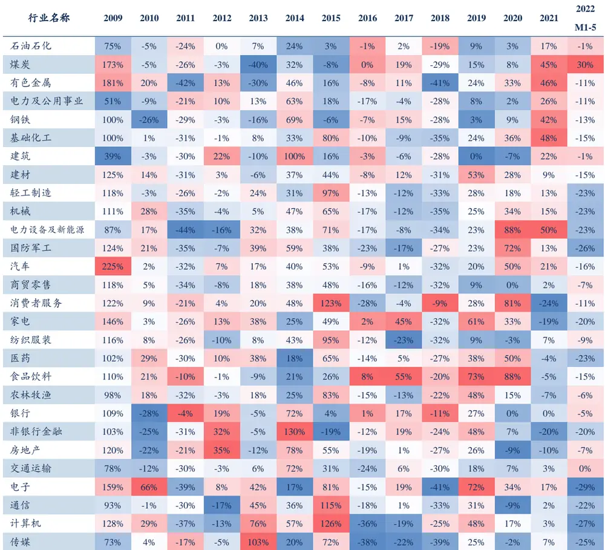
资料来源：Wind、信达证券研发中心

2017年以来“反转行业”占比降低，行业动量策略适用性增强。定义28个中信一级行业（不含综合、综合金融）中，上一年度收益截面排名前 10 但本年收益截面排名后 10，或上一年度收益截面排名后 10 但本年收益截面排名前 10的行业为“反转行业”，并每年统计该类行业占比。2007 年以来，“反转行业”占比在40%左右；2017年以来，反转行业占比下降至 20%附近，行业动量策略适用性有所上升。

图 1：自然年“反转行业”占比（2007-2022M5）
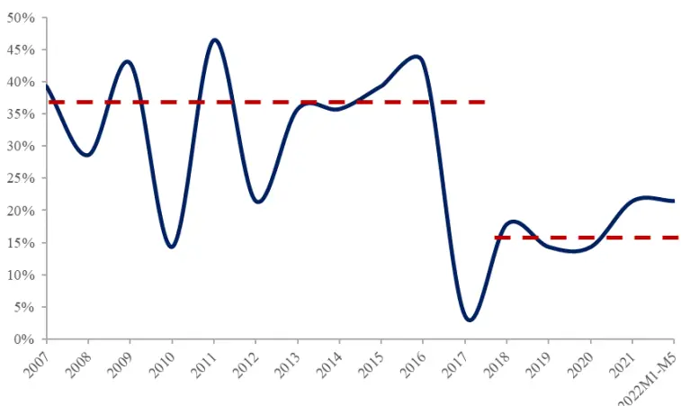
资料来源: Wind、 信达证券研发中心

当然，如何判断行业表现的“好坏”见仁见智，常见手段包括收益率、双均线交叉、夏普比率等。收益率是其中最直观的市场度量方法，基于收益率法的行业动量策略认为前期收益率高的行业未来收益将持续，收益率低的行业未来表现将低于市场平均水平，从而允许投资者“买好卖坏”获取相对收益。

本文定义各行业的动量因子为过去一段时间的行业累计收益率，有

$$
F_{i,t}=\frac{ClosePrice_{i,t}}{ClosePrice_{i,t-win\_len+1}}-1
$$

其中， $F_{i,t}$ 为第i个行业在t时刻的动量因子，满足 $i=1,2,\cdots,N,\ t=win_{-}len,\cdots,T$ ；N为截面行业个数；T为回测时段总天数； $ClosePrice_{i,t}$ 为第i个行业在t时刻的收盘价；win_len为计算累计收益率时使用的回看窗口的天数。

## 1.2 短期动量、中期动量和长期动量的界定

回看窗口（win_len）是动量策略的关键参数。无论是本篇报告所采取的收益率法，还是双均线交叉、指数移动加权平均等变种，实际使用到的信息均为资产过去一段时间价格序列，经某种方式加权处理后得到结果。回看窗口是影响加权方式的关键参数，决定了相对久远的历史价格序列的取舍。

我们延续此前报告《资产配置研究系列之二：基于行业动量的固收加产品设计》中的设定，称时间窗口不超过60个交易日的动量为短期动量，时间窗口在 250个交易日以上的动量为长期动量，其余则称中期动量。

表 2：短期、中期、长期动量与回看窗口

| 分类 | 举例 |
| --- | --- |
| 短期动量 | 过去10、20、40、60个交易日的动量 |
| 中期动量 | 过去120、250个交易日的动量 |
| 长期动量 | 过去500、750个交易日的动量 |

资料来源：信达证券研发中心

经该篇报告测算，我们发现：（1）A 股市场在行业层面上整体由动量而非反转效应主导，且在不同的统计区间和持有期下动量策略均整体有效。

（2）在短期动量、中期动量和长期动量的横向比较中，中期动量（过去 250 个交易日）整体最优，是平衡换手和收益后的一种实践性较高的结果。本文后续仍以250日动量作为策略改进的基准。

## 1.3. 中期动量行业轮动组合表现优异，但会出现动量崩溃

本节以中期动量（过去 250个交易日）为基础测试行业动量策略的效果。理想状态下，假设在每个交易日收盘时计算动量指标，且所有交易均能以当日收盘价瞬时完成，暂不考虑交易成本。回测区间为2010/1/1-2022/5/27。

定义多头组合、空头组合、多空组合、等权组合、多头超额含义如下：

（1）多头组合：每次调仓时等权买入 28个中信一级行业（不含综合、综合金融）中，过去250 个交易日累计涨幅最高的 6个行业。

（2）空头组合：每次调仓时等权买入 28个中信一级行业（不含综合、综合金融）中，过去250 个交易日累计涨幅最低的 6个行业。

（3）多空组合：每次调仓时等权买入 28个中信一级行业（不含综合、综合金融）中，过去250 个交易日累计涨幅最高的 6个行业，等权卖出累计涨幅最低的6个行业。

（4）等权组合：每次调仓时等权买入 28个中信一级行业（不含综合、综合金融）。

（5）多头超额：多头组合相对等权组合的累计超额。

从结果来看：（1）基于过去 250 日收益率的行业动量策略表现优秀，全区间日度 RankIC 的 t 值达到 4.3；且除2018 年以外 RankIC 均值均为正值。

（2）全区间 2010/1/1-2022/5/27 内，多空组合和多头超额年化收益率分别为 11.9%和 7.2%，且 2017 年后表现尤其优异，对应1.1节中所描述的“反转行业”在时间序列上的占比变化。

（3）2015、2016、2021年动量多头组合、多空组合回撤较大，这些时段往往出现了行业走势的大幅分化和强势行业的反复切换，即发生了动量崩溃。

表 3：回看期 250日行业动量因子分年 RankIC及 IR

| 统计区间 | RankIC 均值 | IR | t-stats | 样本个数 |
| --- | --- | --- | --- | --- |
| 2010 | 6.0% | 14.7% | 2.3 | 242 |
| 2011 | 0.1% | 0.5% | 0.1 | 244 |
| 2012 | 2.5% | 8.0% | 1.3 | 243 |
| 2013 | 6.0% | 17.0% | 2.6 | 238 |
| 2014 | 6.1% | 15.4% | 2.4 | 245 |
| 2015 | 0.1% | 0.4% | 0.1 | 244 |
| 2016 | 1.1% | 3.5% | 0.5 | 244 |
| 2017 | 3.7% | 11.5% | 1.8 | 244 |
| 2018 | -0.8% | -2.3% | -0.4 | 243 |
| 2019 | 0.9% | 3.3% | 0.5 | 244 |
| 2020 | 6.5% | 17.7% | 2.8 | 243 |
| 2021 | 3.2% | 7.9% | 1.2 | 243 |
| 2022/1/1-2022/5/27 | 3.5% | 11.0% | 1.1 | 93 |
| 汇总 | 2.5% | 7.5% | 4.3 | 3254 |

资料来源：Wind、信达证券研发中心

图 2：动量策略多空组合净值（2010/1/1-2022/5/27）
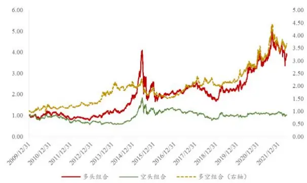
资料来源：Wind，信达证券研发中心

图 3：动量策略多头超额净值（2010/1/1-2022/5/27）
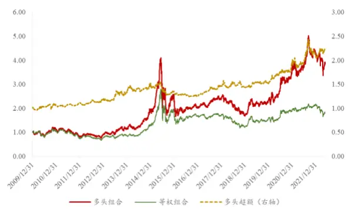
资料来源：Wind，信达证券研发中心

表 4：各行业动量组合表现（2010/1/1-2022/5/27）

| 组合类别 | 年化收益率 | 年化波动率 | 收益波动比 | 最大回撤 |
| --- | --- | --- | --- | --- |
| 多头组合 | 12.6% | 28.8% | 0.44 | -59.9% |
| 空头组合 | 0.2% | 25.4% | 0.01 | -59.2% |
| 等权组合 | 5.4% | 25.8% | 0.21 | -58.1% |
| 多空组合 | 11.9% | 16.7% | 0.71 | -34.6% |
| 多头超额 | 7.2% | 9.8% | 0.73 | -20.0% |

资料来源：Wind、信达证券研发中心

表 5：动量多空组合分年收益-风险特征（2010/1/1-2022/5/27）

| 统计区间 | 年化收益率 | 年化波动率 | 收益波动比 | 最大回撤 |
| --- | --- | --- | --- | --- |
| 2010 | 19.1% | 20.4% | 0.94 | -20.1% |
| 2011 | 2.4% | 9.8% | 0.25 | -9.5% |
| 2012 | 8.6% | 10.2% | 0.84 | -9.8% |
| 2013 | 34.1% | 18.8% | 1.81 | -9.5% |
| 2014 | 20.6% | 16.7% | 1.23 | -15.5% |
| 2015 | -11.2% | 20.3% | -0.55 | -29.9% |
| 2016 | -17.2% | 12.2% | -1.41 | -19.9% |
| 2017 | 33.8% | 12.3% | 2.75 | -6.6% |
| 2018 | -3.7% | 15.2% | -0.24 | -17.8% |
| 2019 | 7.6% | 11.1% | 0.69 | -6.3% |
| 2020 | 44.4% | 18.3% | 2.43 | -10.4% |
| 2021 | 13.2% | 25.7% | 0.51 | -20.4% |
| 2022/1/1-2022/5/27 | 3.1% | 20.2% | 0.15 | -11.4% |
| 汇总 | 11.9% | 16.7% | 0.71 | -34.6% |

资料来源：Wind、信达证券研发中心

表 6：动量多头超额分年收益-风险特征（2010/1/1-2022/5/27）

| 统计区间 | 年化收益率 | 年化波动率 | 收益波动比 | 最大回撤 |
| --- | --- | --- | --- | --- |
| 2010 | 6.9% | 9.4% | 0.73 | -9.4% |
| 2011 | 3.2% | 4.9% | 0.64 | -3.9% |
| 2012 | 7.7% | 6.4% | 1.20 | -5.0% |
| 2013 | 11.6% | 12.1% | 0.97 | -7.6% |
| 2014 | 14.6% | 9.9% | 1.48 | -8.1% |
| 2015 | -11.2% | 11.3% | -0.99 | -17.8% |
| 2016 | -7.5% | 5.9% | -1.28 | -7.7% |
| 2017 | 16.6% | 7.4% | 2.26 | -3.8% |
| 2018 | -0.8% | 9.5% | -0.08 | -10.4% |
| 2019 | 5.3% | 7.1% | 0.75 | -3.8% |
| 2020 | 27.8% | 10.2% | 2.73 | -5.0% |
| 2021 | 7.9% | 16.9% | 0.47 | -14.1% |
| 2022/1/1-2022/5/27 | 6.6% | 11.4% | 0.58 | -4.2% |
| 汇总 | 7.2% | 9.8% | 0.73 | -20.0% |

资料来源：Wind、信达证券研发中心

## 2. 单行业拥挤度与全市场拥挤度

如何规避行业动量策略的回撤？从行业动量效应存在的微观原因说起。1.3 节的测算再次证实了截面动量策略在A 股行业层面的优异表现，尤其在某些行业持续表现领先时（比如2017年后市场抱团的食品饮料、电子等行业），行业动量多空组合净值迅速上升。同时我们也意识到，截面动量策略并不会一直有效，在原先表现优秀的强势行业遭受重创变成弱势行业时（比如 2015 年股灾、2021 年 2 月抱团股集体回撤），行业动量策略也将随之面临较大净值回撤。因此如何规避动量崩溃是截面动量策略的优化重点。

事实上，动量异象（无论截面还是时序）普遍存在于各类资产，包括但不限于股票、商品、行业等。学术和业界从未停止对动量异象的解释工作，比如“行为偏差论”和“知情交易者扩散论”。（1）行为偏差论：投资者可能表现出过度自信和自我归因偏差。当新行业产生，或行业变化来临时，投资者更倾向于保守地相信先前信息，而对新信息反应不足。（2）知情交易者扩散论：知情交易者能够优先获取影响风险资产价值的信息，当利好消息出现时，知情交易者迅速进入市场并买入资产，当利空消息出现时迅速卖出资产。随着信息的不断传导，原来的非知情交易者变为知情交易者，进一步买入卖出相关资产，从而导致趋势延续。

两种观点的解释角度虽有一定差异，但在趋势的形成原因上不谋而合：趋势的形成取决于投资者对影响资产价格信息的认知程度。若信息传导充分，则资产价格走势持续时长较短；若市场上多数投资者对未来走势的预期过分一致，则可能先助推价格走势，随后可能出现反转。据此，规避相对拥挤的市场环境和行业是动量策略回撤控制的重要方向和手段。

## 2.1 考虑行业拥挤度的行业动量策略

William Kinlaw、Mark Kritzman、David Turkington 在 2019 年发表的文章《Crowded Trades: Implications for SectorRotation andFactor Timing》中指出可以从价格行为中提取资产的交易拥挤情况，截面所有相似资产走势背后共同驱动因素的强弱可以用来度量整个市场的预期一致性，而单个资产对于该驱动因素的贡献可以用来衡量该资产自身的拥挤程度。

该篇文章构建了资产集中度（Asset Centrality）指标用来捕捉一组相似资产的拥挤程度。在行业轮动的语境下，资产集中度指标具体计算方法如下：

STEP1：主成分分析。将N个行业的收益率时间序列去中心化（去平均值），进行主成分分析，得到N个特征值和N个特征向量。

STEP2：计算方差贡献率。将特征值按照从大到小的顺序排序，将其对应的前n个特征向量分别作为列向量组成特征向量矩阵，计算前n个特征向量的方差贡献率AR（Absorption Ratio）。

$$
AR=\frac{\sum_{j=1}^{n}\sigma_{Ej}^{2}}{\sum_{i=1}^{N}\sigma_{Ai}^{2}}
$$

其中N为截面行业个数，n为选取的特征向量数， $\sigma_{Ai}^{2}$ 为第i个行业的方差， $\sigma_{Ej}^{2}$ 为第j个特征向量的方差。在n一定的情况下，方差贡献率AR越高，说明各行业走势的共同驱动因素就越强。

STEP3：计算单个行业i的资产集中度。以前n个AR为加权比例，计算第i个行业分别在n个特征向量暴露的绝对值在所有行业中的占比。行业i的资产集中度指标即作为行业i的拥挤度度量指标，有

$$
C_{i}=\frac{\sum_{j=1}^{n}\bigg(AR^{j}\cdot\frac{\lvert EV_{i}^{j}\rvert}{\sum_{k=1}^{N}\lvert EV_{k}^{j}\rvert}\bigg)}{\sum_{j=1}^{n}AR^{j}}
$$

其中 $C_{i}$ 为行业i的资产集中度得分， $AR^{j}$ 为第j个特征向量的方差贡献率， $EV_{i}^{j}$ 为第i个行业在第j个特征向量暴露的绝对值，N为截面行业个数，n为方差贡献率分子中的特征向量数。本文计算中n 取2。

下表展示了 28 个中信一级行业（不含综合、综合金融）历年行业集中度因子的演变，每年因子值展示为全年所有交易日的均值。可见：各行业相对拥挤状况随着时间的推移不断变化，2010-2012 年期间行业拥挤度以煤炭、有色金属、电子、计算机等行业居前；2013-2015年期间非银、TMT（电子、传媒、计算机、通信）、军工等行业开始发力；2016-2020 年期间随着公募基金的崛起，景气度高的食品饮料、医药、TMT 等行业拥挤度逐渐提升，2021年至今年新能源、煤炭、有色、医药、食品饮料等行业拥挤度达到了空前水平。此外，每个阶段对应的拥挤行业通常波动较大，容易出现急涨急跌的现象。

表 7：2009-2022M5中信一级行业集中度因子均值
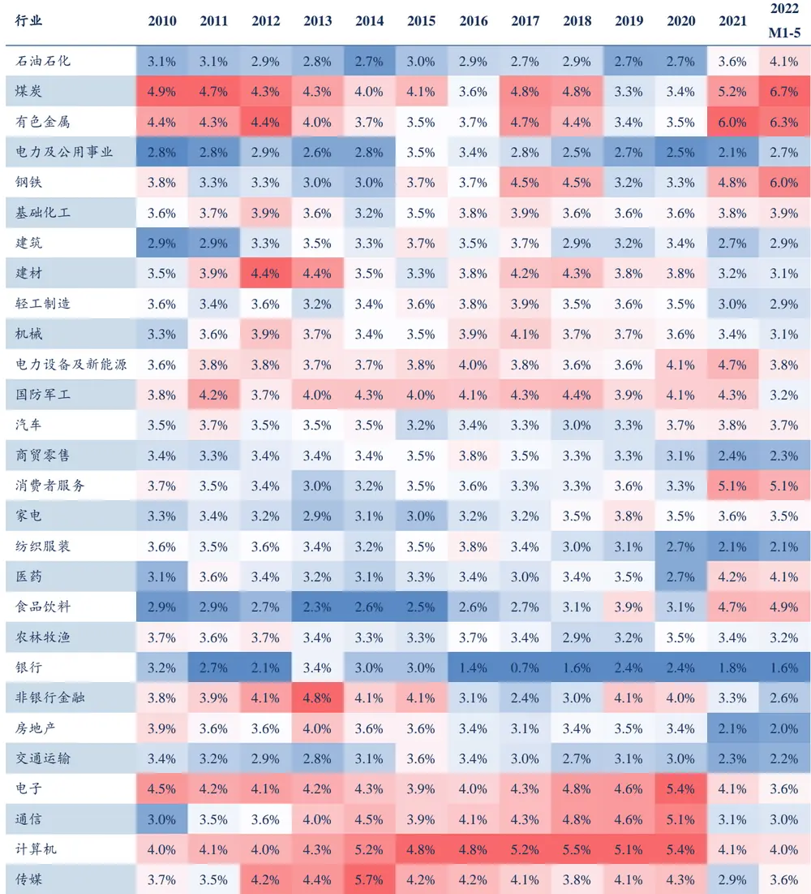
资料来源：Wind、信达证券研发中心

图 4：今年各行业集中度均值占比分布（2022/1/1-2022/5/27）
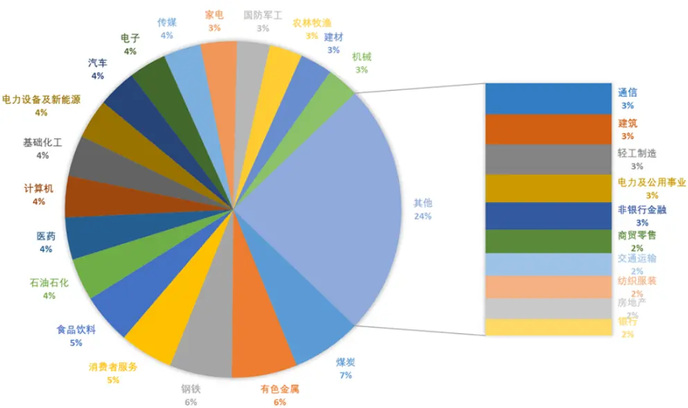
资料来源：Wind、信达证券研发中心

从单个行业时间序列的角度分析，随着行情的启动，拥挤度和风险通常也开始积聚，风险累计到一定程度后行业将发生回撤，引发投资者集中抛售，又进一步推高行业的拥挤程度。

图 5：食品饮料价格走势与其行业拥挤度
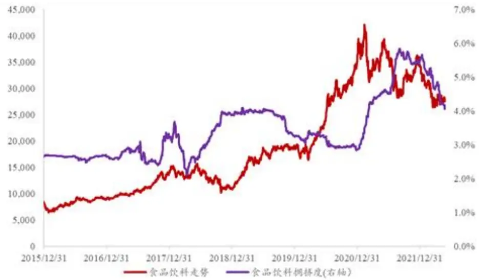
资料来源：Wind、信达证券研发中心

图 6：煤炭价格走势与其行业拥挤度
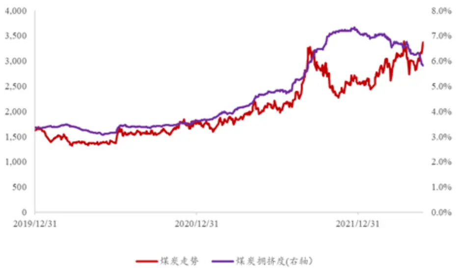
资料来源：Wind、信达证券研发中心

行业泡沫本身会经历膨胀期到破灭期，资产拥挤度指标本身并不能准确判断当前泡沫所处的阶段，但可以考虑借用拥挤度指标优化行业动量策略，帮助规避截面上的拥挤行业，进而降低持仓风险。

在1.3节测算的基础上，定义多头组合、空头组合、多空组合、等权组合、多头超额如下：

（1）多头组合：取出 28 个中信一级行业（不含综合、综合金融）中过去 250 个交易日累计涨幅最高的 6 个行业。若 6个行业中不包含当前截面最拥挤行业，则等权买入该6 个行业；否则剔除最拥挤行业后递补涨幅靠前的第7 个行业。

（2）空头组合：每次调仓时等权买入 28个中信一级行业（不含综合、综合金融）中，过去250 个交易日累计涨幅最低的 6个行业。

（3）多空组合：每次调仓时等权买入多头组合覆盖的6 个行业，等权卖出累计涨幅最低的6个行业。

（4）等权组合：每次调仓时等权买入 28个中信一级行业（不含综合、综合金融）。

（5）多头超额：多头组合相对等权组合的累计超额。

从结果来看：（1）剔除最拥挤行业后，行业动量多头组合、多空组合的表现均得到了显著提升，多头组合全区间年化收益率从 12.6%上升为 14.2%，多空组合全区间年化收益率从 11.9%上升为 13.4%，最大回撤也得到了明显优化。

（2）从分年表现来看，2010-2021年期间，12年中有10年剔除最拥挤行业后多头组合收益更高，最拥挤行业相对于其他前期表现好的强势行业，的确面临更大的回撤风险。

表 8：剔除最拥挤行业后，各行业动量组合表现（2010/1/1-2022/5/27）

| 组合类别 | 年化收益率 | 年化波动率 | 收益波动比 | 最大回撤 |
| --- | --- | --- | --- | --- |
| 多头组合 | 14.2% | 28.2% | 0.50 | -57.0% |
| 空头组合 | 0.2% | 25.4% | 0.01 | -59.2% |
| 等权组合 | 5.4% | 25.8% | 0.21 | -58.1% |
| 多空组合 | 13.4% | 15.9% | 0.84 | -29.5% |
| 多头超额 | 8.6% | 9.2% | 0.94 | -15.9% |

资料来源：Wind、信达证券研发中心

图 7：剔除最拥挤行业丢动量策略多空组合、多头超额净值的影响（2010/1/1-2022/5/27）
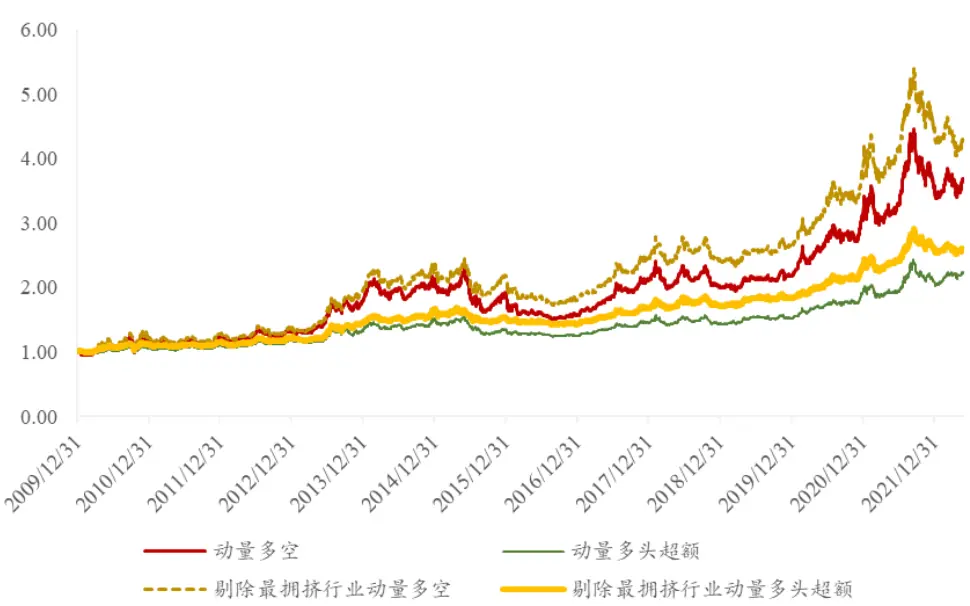
资料来源：Wind、信达证券研发中心

## 2.2 考虑市场拥挤度的行业动量策略改进

上节我们考虑了单个行业的拥挤程度，通过剔除最拥挤行业降低了多头组合的持仓风险，规避了个别行业行情拐头的情况，提升了截面动量策略的长期有效性。从最终净值结果来看，截面动量组合的表现与市场状态的持续时长相关，市场状态持续越久，动量组合在市场风险上的暴露越大，越容易在市场状态转变时产生损失。

本文使用两个因子度量整个市场的价量拥挤程度：行业拥挤度分散度因子SDC和换手率TurnOver。

（1）行业拥挤度分散度因子SDC：定义 $\mathcal{C}_{i,t}$ 为第i个行业在时刻t的资产集中度， $mean(C_{i,t})$ 为t时刻截面所有行业资产集中度的均值，N为截面行业个数。当期行业拥挤度分散度因子 $SDC_{t}$ 定义为资产集中度 $C_{i,t}$ 截面标准差的相反数，截面所有行业的拥挤度分化越小，说明当前市场越拥挤。

$$
SDC_{t}=-\sqrt{\frac{1}{N-1}\sum_{i=1}^{N}(C_{i,t}-mean(C_{i,t}))^{2}}
$$

（2）换手率因子TurnOver：万得全 A（881001）每日换手率过去 60日的移动平均值。

为尽量回避因子在个别时段不平稳的影响，分别对两个因子取过去 5 年（1250个交易日）的分位值。可见，因子分位值较高时通常伴随着市场的方向切换和动量策略的失效，最典型比如 2015年6 月和2021 年9 月。

图 8：因子 SDC、TurnOver滚动 5 年均值 vs动量多空组合净值
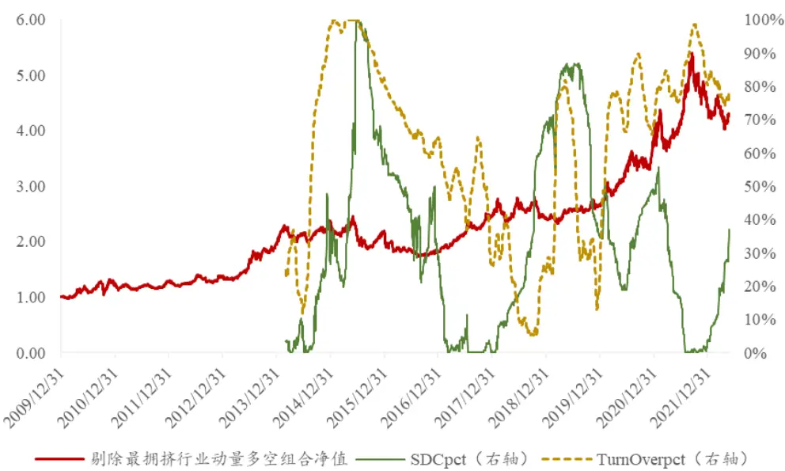
资料来源：Wind、信达证券研发中心

为兼容SDC和TurnOver两个因子的有效性，若两个因子中至少有一个因子分位数上穿 95%，模型发出动量失效预警信号，此时多头组合按等权组合的方式配置，多空组合、多头超额收益率均为0。

结果显示：（1）从信号位置来看，拥挤信号大致聚集两个区间，分别是2014年12 月中旬至2015 年中，以及2021年 9 月初至 12 月底。在这两个区间，普通动量组合和剔除最拥挤行业的动量组合均发生了较大回撤，而加入全市场拥挤信号后的动量组合表现更佳。

（2）考虑市场+行业双拥挤后的行业动量多空组合年化收益率高达 16.3%，收益波动比为1.10，多头超额年化收益率达 10.0%，收益波动比为1.20。

图 9：市场拥挤、行业拥挤对动量多空组合净值的影响
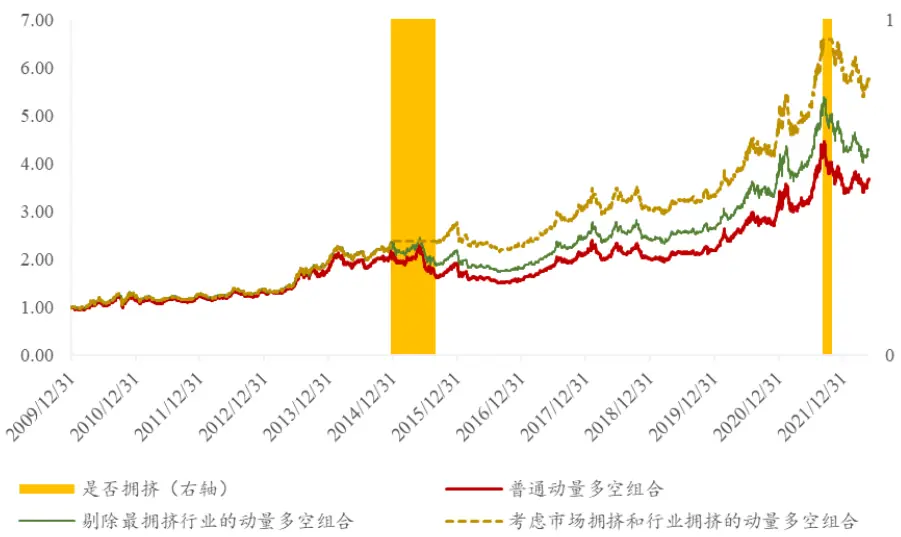
资料来源：Wind、信达证券研发中心

表 9：考虑市场拥挤和行业拥挤的各动量组合表现（2010/1/1-2022/5/27）

| 组合类别 | 年化收益率 | 年化波动率 | 收益波动比 | 最大回撤 |
| --- | --- | --- | --- | --- |
| 多头组合 | 15.8% | 27.6% | 0.57 | 53.3% |
| 空头组合 | -1.1% | 26.0% | -0.04 | 64.8% |
| 等权组合 | 5.4% | 25.8% | 0.21 | 58.1% |
| 多空组合 | 16.3% | 14.8% | 1.10 | 21.4% |
| 多头超额 | 10.0% | 8.3% | 1.20 | 9.9% |

资料来源：Wind、信达证券研发中心

图 10：考虑市场拥挤、行业拥挤的行业动量策略多空净值
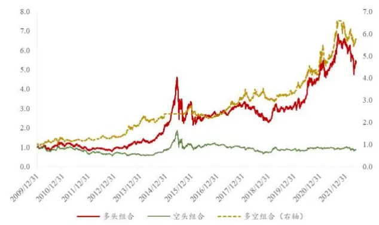
资料来源：Wind，信达证券研发中心

图 11：考虑市场拥挤、行业拥挤的行业动量策略多头超额
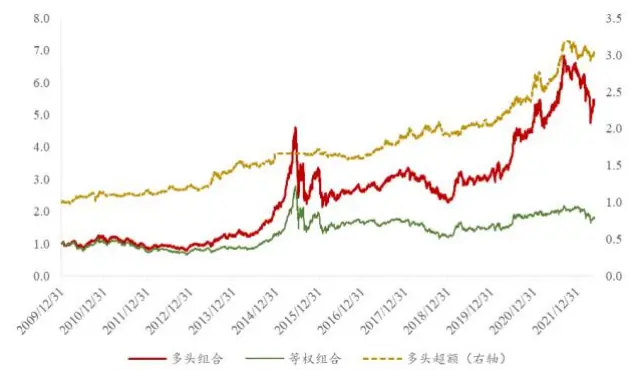
资料来源：Wind，信达证券研发中心

分阶段来看，考虑市场+行业双拥挤的动量策略在 2015年以及 2021年表现均有较大幅度的提升。其中，2015年普通行业动量策略的多空组合收益和回撤分别为-11.2%和-29.9%；叠加市场拥挤+行业拥挤信号后，当年多空收益转正为 15.3%，最大回撤幅度降至-2.6%。2021 年普通行业动量策略的多空组合和多头超额收益分别为 13.2%和 7.9%；叠加市场拥挤+行业拥挤信号后，当年多空收益和多头超额收益分别提升至 24.0%和 15.5%，整体策略年度胜率为 83%，表现优异。

表 10：考虑双拥挤的动量多空组合分年收益-风险特征（2010/1/1-2022/5/27）

| 统计区间 | 年化收益率 | 年化波动率 | 收益波动比 | 最大回撤 |
| --- | --- | --- | --- | --- |
| 2010 | 25.1% | 20.4% | 1.23 | -19.9% |
| 2011 | 1.9% | 9.9% | 0.19 | -9.5% |
| 2012 | 7.8% | 10.3% | 0.76 | -9.8% |
| 2013 | 41.3% | 17.8% | 2.32 | -9.5% |
| 2014 | 22.2% | 14.0% | 1.58 | -13.3% |
| 2015 | 15.3% | 7.2% | 2.11 | -2.6% |
| 2016 | -16.6% | 11.7% | -1.42 | -19.4% |
| 2017 | 34.8% | 12.1% | 2.88 | -6.6% |
| 2018 | -0.2% | 14.9% | -0.02 | -15.4% |
| 2019 | 9.2% | 11.1% | 0.83 | -6.6% |
| 2020 | 44.4% | 17.7% | 2.51 | -9.3% |
| 2021 | 24.0% | 21.4% | 1.12 | -16.8% |
| 2022/1/1-2022/5/27 | -3.9% | 18.7% | -0.21 | -13.2% |
| 汇总 | 16.3% | 14.8% | 1.10 | -21.4% |

资料来源：Wind、信达证券研发中心

表 11：考虑双拥挤的动量多头超额分年收益-风险特征（2010/1/1-2022/5/27）

| 统计区间 | 年化收益率 | 年化波动率 | 收益波动比 | 最大回撤 |
| --- | --- | --- | --- | --- |
| 2010 | 12.2% | 9.4% | 1.31 | -9.2% |
| 2011 | 2.6% | 4.8% | 0.54 | -3.6% |
| 2012 | 6.9% | 6.5% | 1.06 | -5.5% |
| 2013 | 17.6% | 11.1% | 1.59 | -6.9% |
| 2014 | 14.5% | 7.7% | 1.89 | -6.1% |
| 2015 | 3.4% | 3.4% | 1.01 | -2.0% |
| 2016 | -6.9% | 5.5% | -1.25 | -7.2% |
| 2017 | 17.5% | 7.1% | 2.47 | -3.6% |
| 2018 | 2.8% | 9.3% | 0.30 | -8.5% |
| 2019 | 6.9% | 7.0% | 0.99 | -4.0% |
| 2020 | 27.7% | 10.0% | 2.76 | -4.8% |
| 2021 | 15.5% | 12.7% | 1.22 | -9.9% |
| 2022/1/1-2022/5/27 | -0.7% | 9.8% | -0.07 | -6.2% |
| 汇总 | 10.0% | 8.3% | 1.20 | -9.9% |

资料来源：Wind、信达证券研发中心

## 3. 基于拥挤度考虑的月度行业轮动表现

上一章节的测算为逐日调仓的结果。为降低换手以及方便后续与其他因子的结合，本章给出逐月调仓（每月月底调仓）的结果。

表 12：考虑市场拥挤和行业拥挤的各动量组合表现（逐月，2010/1/1-2022/5/20）

| 组合类别 | 年化收益率 | 年化波动率 | 收益波动比 | 最大回撤 | 换手率 (单边) |
| --- | --- | --- | --- | --- | --- |
| 多头组合 | 12.2% | 27.6% | 0.44 | -54.1% | 259% |
| 空头组合 | -0.5% | 25.9% | -0.02 | -65.3% | 268% |
| 等权组合 | 5.5% | 25.8% | 0.21 | -58.2% | - |
| 多空组合 | 12.1% | 14.9% | 0.81 | -27.4% | – |
| 多头超额 | 6.5% | 8.4% | 0.77 | 17.0% | - |

资料来源：Wind、信达证券研发中心

表 13：考虑双拥挤的动量多空组合分年收益-风险特征（逐月，2010/1/1-2022/5/20）

| 统计区间 | 年化收益率 | 年化波动率 | 收益波动比 | 最大回撤 |
| --- | --- | --- | --- | --- |
| 2010 | 19.2% | 19.4% | 0.99 | -19.1% |
| 2011 | -4.8% | 9.9% | -0.49 | -10.7% |
| 2012 | 10.0% | 10.3% | 0.97 | -9.0% |
| 2013 | 36.2% | 17.3% | 2.09 | -11.3% |
| 2014 | 7.7% | 15.0% | 0.51 | -15.4% |
| 2015 | 10.5% | 6.3% | 1.67 | -2.4% |
| 2016 | -13.6% | 11.8% | -1.16 | -15.3% |
| 2017 | 36.6% | 12.0% | 3.05 | -5.1% |
| 2018 | -4.2% | 15.1% | -0.28 | -18.4% |
| 2019 | 10.9% | 11.6% | 0.93 | -7.9% |
| 2020 | 49.3% | 17.5% | 2.82 | -10.8% |
| 2021 | 1.9% | 22.5% | 0.08 | -18.9% |
| 2022/1/1-2022/5/20 | -3.1% | 19.4% | -0.16 | -14.1% |
| 汇总 | 12.1% | 14.9% | 0.81 | -27.4% |

资料来源：Wind、信达证券研发中心

表 14：考虑双拥挤的动量多头超额分年收益-风险特征（逐月，2010/1/1-2022/5/20）

| 统计区间 | 年化收益率 | 年化波动率 | 收益波动比 | 最大回撤 |
| --- | --- | --- | --- | --- |
| 2010 | 9.6% | 8.8% | 1.09 | -7.9% |
| 2011 | -2.2% | 4.9% | -0.44 | -6.1% |
| 2012 | 4.0% | 6.2% | 0.65 | -5.6% |
| 2013 | 16.1% | 10.6% | 1.52 | -7.2% |
| 2014 | 6.7% | 8.1% | 0.83 | -7.2% |
| 2015 | 1.9% | 2.8% | 0.68 | -1.1% |
| 2016 | -5.2% | 5.0% | -1.03 | -5.5% |
| 2017 | 20.6% | 7.2% | 2.86 | -3.7% |
| 2018 | -5.6% | 9.6% | -0.58 | -12.9% |
| 2019 | 8.3% | 7.2% | 1.16 | -4.7% |
| 2020 | 27.1% | 9.7% | 2.79 | -4.8% |
| 2021 | 0.0% | 14.1% | 0.00 | -12.1% |
| 2022/1/1-2022/5/20 | -1.4% | 10.6% | -0.14 | -8.2% |
| 汇总 | 6.5% | 8.4% | 0.77 | -17.0% |

资料来源：Wind、信达证券研发中心

图 12：考虑双拥挤的行业动量策略多空净值（逐月）
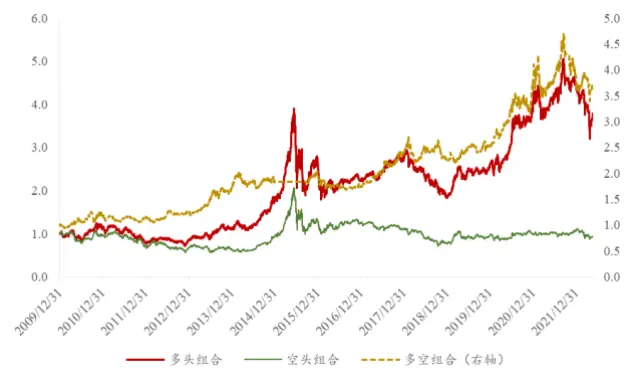
资料来源：Wind，信达证券研发中心

图 13：考虑双拥挤的行业动量策略多头超额（逐月）
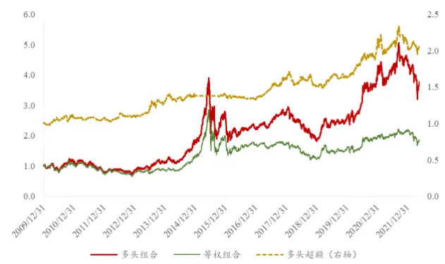
资料来源：Wind，信达证券研发中心

## 4. 总结与展望

在《资产配置研究系列之二：基于行业动量的固收加产品设计》中我们提出了行业动量轮动的思路，本文进一步验证了中期动量（过去 250 日收益率）在解决 A 股行业轮动问题上的有效性，并从市场微观结构出发，从单行业拥挤度和全市场拥挤度两个维度着手，致力于降低动量崩溃对因子长期收益的负面影响。

本文的关键贡献在于使用行业拥挤和市场拥挤共同对动量因子进行择时，从不同维度降低动量崩溃的潜在风险。（1）单行业拥挤度。本文使用主成分分析（PCA）方法，构建行业层面的资产集中度因子，并在多头组合中剔除最拥挤行业（如有），成功降低了多头组合的持仓风险。（2）全市场拥挤度。本文使用行业拥挤度分散度因子SDC和换手率TurnOver形成复合择时信号，成功优化了动量策略在 2015 年 6 月、2021 年 9 月等关键风格转变时点的表现。

同时，我们也意识到，动量和拥挤层面的信息并不能完整刻画行业轮动的复杂驱动因素。我们的后续工作将继续评估基本面因子、机构持仓因子中可能带来的增量信息，形成层次丰富、逻辑严谨、可解释、可外推的行业轮动框架。

## 参考文献

Kinlaw, W., Kritzman, M., & Turkington, D. (2019). Crowded trades: Implications for sector rotation and factor timing. The Journal of Portfolio Management, 45(5), 46-57

## 风险因素

结论基于历史数据，在市场环境转变时模型存在失效的风险。

Table_Introductio机构销售联系人

| 区域 | 姓名 | 手机 | 邮箱 |
| --- | --- | --- | --- |
| 全国销售总监 | 韩秋月 | 13911026534 | hanqiuyue@cindasc.com |
| 华北区销售总监 | 陈明真 | 15601850398 | chenmingzhen@cindasc.com |
| 华北区销售副总监 | 阙嘉程 | 18506960410 | quejiacheng@cindasc.com |
| 华北区销售 | 祁丽媛 | 13051504933 | qiliyuan@cindasc.com |
| 华北区销售 | 陆禹舟 | 17687659919 | luyuzhou@cindasc.com |
| 华北区销售 | 魏冲 | 18340820155 | weichong@cindasc.com |
| 华北区销售 | 樊荣 | 15501091225 | fanrong@cindasc.com |
| 华东区销售总监 | 杨兴 | 13718803208 | yangxing@cindasc.com |
| 华东区销售副总监 | 吴国 | 15800476582 | wuguo@cindasc.com |
| 华东区销售 | 国鹏程 | 15618358383 | guopengcheng@cindasc.com |
| 华东区销售 | 李若琳 | 13122616887 | liruolin@cindasc.com |
| 华东区销售 | 朱尧 | 18702173656 | zhuyao@cindasc.com |
| 华东区销售 | 戴剑箫 | 13524484975 | daijianxiao@cindasc.com |
| 华东区销售 | 方威 | 18721118359 | fangwei@cindasc.com |
| 华东区销售 | 俞晓 | 18717938223 | yuxiao@cindasc.com |
| 华东区销售 | 李贤哲 | 15026867872 | lixianzhe@cindasc.com |
| 华东区销售 | 孙僮 | 18610826885 | suntong@cindasc.com |
| 华东区销售 | 贾力 | 15957705777 | jiali@cindasc.com |
| 华南区销售总监 | 王留阳 | 13530830620 | wangliuyang@cindasc.com |
| 华南区销售副总监 | 陈晨 | 15986679987 | chenchen3@cindasc.com |
| 华南区销售副总监 | 王雨霏 | 17727821880 | wangyufei@cindasc.com |
| 华南区销售 | 刘韵 | 13620005606 | liuyun@cindasc.com |
| 华南区销售 | 许锦川 | 13699765009 | xujinchuan@cindasc.com |

## 分析师声明

负责本报告全部或部分内容的每一位分析师在此申明，本人具有证券投资咨询执业资格，并在中国证券业协会注册登记为证券分析师,以勤勉的职业态度,独立、客观地出具本报告；本报告所表述的所有观点准确反映了分析师本人的研究观点；本人薪酬的任何组成部分不曾与，不与，也将不会与本报告中的具体分析意见或观点直接或间接相关。

## 免责声明

信达证券股份有限公司(以下简称“信达证券”)具有中国证监会批复的证券投资咨询业务资格。本报告由信达证券制作并发布。

本报告是针对与信达证券签署服务协议的签约客户的专属研究产品，为该类客户进行投资决策时提供辅助和参考，双方对权利与义务均有严格约定。本报告仅提供给上述特定客户，并不面向公众发布。信达证券不会因接收人收到本报告而视其为本公司的当然客户。客户应当认识到有关本报告的电话、短信、邮件提示仅为研究观点的简要沟通，对本报告的参考使用须以本报告的完整版本为准。

本报告是基于信达证券认为可靠的已公开信息编制，但信达证券不保证所载信息的准确性和完整性。本报告所载的意见、评估及预测仅为本报告最初出具日的观点和判断，本报告所指的证券或投资标的的价格、价值及投资收入可能会出现不同程度的波动，涉及证券或投资标的的历史表现不应作为日后表现的保证。在不同时期，或因使用不同假设和标准，采用不同观点和分析方法，致使信达证券发出与本报告所载意见、评估及预测不一致的研究报告，对此信达证券可不发出特别通知。

在任何情况下，本报告中的信息或所表述的意见并不构成对任何人的投资建议，也没有考虑到客户特殊的投资目标、财务状况或需求。客户应考虑本报告中的任何意见或建议是否符合其特定状况，若有必要应寻求专家意见。本报告所载的资料、工具、意见及推测仅供参考，并非作为或被视为出售或购买证券或其他投资标的的邀请或向人做出邀请。

在法律允许的情况下，信达证券或其关联机构可能会持有报告中涉及的公司所发行的证券并进行交易，并可能会为这些公司正在提供或争取提供投资银行业务服务。

本报告版权仅为信达证券所有。未经信达证券书面同意，任何机构和个人不得以任何形式翻版、复制、发布、转发或引用本报告的任何部分。若信达证券以外的机构向其客户发放本报告，则由该机构独自为此发送行为负责，信达证券对此等行为不承担任何责任。本报告同时不构成信达证券向发送本报告的机构之客户提供的投资建议。

如未经信达证券授权，私自转载或者转发本报告，所引起的一切后果及法律责任由私自转载或转发者承担。信达证券将保留随时追究其法律责任的权利。

## 评级说明

| 投资建议的比较标准 | 股票投资评级 | 行业投资评级 |
| --- | --- | --- |
| 本报告采用的基准指数：沪深300指数（以下简称基准）；时间段：报告发布之日起6个月内。 | 买入：股价相对强于基准20%以上； | 看好：行业指数超越基准； |
|  | 增持：股价相对强于基准5%～20%; | 中性：行业指数与基准基本持平; |
|  | 持有：股价相对基准波动在±5%之间； | 看淡：行业指数弱于基准。 |
|  | 卖出：股价相对弱于基准5%以下。 |  |

## 风险提示

证券市场是一个风险无时不在的市场。投资者在进行证券交易时存在赢利的可能，也存在亏损的风险。建议投资者应当充分深入地了解证券市场蕴含的各项风险并谨慎行事。

本报告中所述证券不一定能在所有的国家和地区向所有类型的投资者销售，投资者应当对本报告中的信息和意见进行独立评估，并应同时考量各自的投资目的、财务状况和特定需求，必要时就法律、商业、财务、税收等方面咨询专业顾问的意见。在任何情况下，信达证券不对任何人因使用本报告中的任何内容所引致的任何损失负任何责任，投资者需自行承担风险。