证券研究报告·金融工程深度报告

# 筹码分布因子系统构建

## 核心观点

筹码分布属于技术分析类指标，主要用于反映股票在不同价格区间内的持仓成本分布情况。它通过统计市场参与者的持股成本和持仓数量，帮助投资者判断支撑位、压力位以及主力资金的动向，属于量价分析的延伸工具。本文对筹码分布理论进行了深入研究，基于分钟级量价数据构建了股票的筹码分布，发掘出筹码分布、筹码集中度、筹码换手、筹码盈利四大类因子。基于筹码集中度逻辑构建的chip_distri_2 因子 IC 均值接近 4%，年化多空收益超 20%，多头超额收益超 12%；基于筹码换手逻辑构建的 PTR_2 因子 IC 均值超 5%，年化多空收益超 17%，多头超额收益接近 13%；基于筹码盈利逻辑构建的TGRatio因子IC均值绝对值超6%，年化多空收益接近22%，多头超额收益接近17%，均具有不错的表现。

## 筹码分布因子

本文使用统计学指标构建了筹码分布统计因子。其中kurtosis 因子选股能力相对较好，年化多空收益13.53%，夏普比率2.29，IC均值-3.74%，年化 IC_IR 达到-2.59。

## 筹码集中度因子

本文使用筹码分布、量价等数据构建了chip_distri 系列与ASR系列因子。筹码集中度因子整体表现不错，选股能力相对最好的为chip_distri_2 因子，年化多空收益 20.10%，夏普比率 2.26，IC 均值3.96%，年化 IC_IR 达到 1.86。

## 筹码换手因子

本文使用筹码分布、换手率等数据构建了筹码换手因子。其中选股能力相对最好的为PTR_2，年化多空收益17.76%，夏普比率1.97，IC 均值 5.10%，年化 IC_IR 达到 2.14。

## 筹码盈利因子

本文从筹码整体盈利状态与当日新增筹码结构两个层面构建了盈利筹码因子。其中选股能力相对最好的为 TG 因子，年化多空收益30.34%，夏普比率 3.03，IC 均值-7.21%，年化 IC_IR 达到-3.31。

## 筹码因子样本外跟踪表现

从2024 年7 月开始样本外跟踪，截至2025 年7 月，有 4 个因子多空收益超20%，其中表现最好的因子是 TGRatio，多空收益31.59%，夏普比率 2.72，IC 均值-10.75%，年化 IC_IR 达到-4.41，表现非 常不错 。

## 筹码因子在主要宽基指数样本池内的绩效表现

将上述四类筹码因子限制在中证 1000、中证 800、中证 500、沪深 300 成分股中，发现筹码因子在中证 1000 与中证 500 等中小市值股票中表现优于含大市值股票的中证 800 及沪深 300，可见因子在小市值股票中表现较好。

# 金融工程研究

陈升锐

chenshengrui@csc.com.cn

021-68821600

SAC 编号：s1440519040002

姚紫薇

yaoziwei@csc.com.cn

SAC 编号：S1440524040001

发布日期： 2025 年 08 月 25 日

## 市场表现

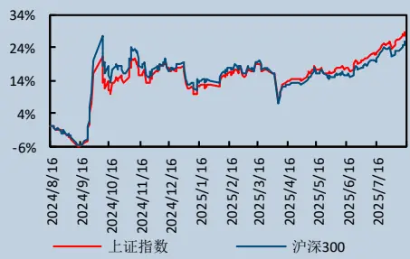

## 相关研究报告

25.03.10处置效应与 型处置效应在量化选股中的应用

24.09.15 股票关联与溢出效应因子构建

中信建投金融产品：投资者有限关注及24.03.03注意力捕捉与溢出

中信建投金融产品：流动性高频因子再24.01.14构建与投资者注意力因子

23.08.27中信建投金融产品：行为金融学在量化选股中的应用

## 一、筹码分布介绍

## 1.1 筹码分布引言

近年来，行为金融学在解释金融市场非理性波动方面取得了广泛关注，其中投资者的持仓成本与盈亏状态对行为决策的影响被认为是影响资产价格的重要机制之一。例如，处置效应理论指出，投资者倾向于过早卖出盈利头寸、而过度持有亏损头寸，这一非理性行为往往使价格偏离其基本面价值。

在此背景下，筹码分布作为反映市场整体持仓成本结构的重要工具，逐渐被引入到量化选股体系之中。所谓筹码分布，是基于历史成交量与成交价格推算出的 流通股票持仓成本分布 ，描述了在不同时点、不同价位上市场投资者的持仓情况。通过筹码分布图，投资者可以直观地观察股票在各个价格区间被持有的数量分布情况，从而辅助判断市场压力位与支撑位。

主流行情分析软件普遍提供筹码分布可视化工具，方便投资者识别市场持仓结构。如下图所示，其中蓝色筹码为亏损筹码，红色筹码为盈利筹码：

图 1：筹码分布简化示意图
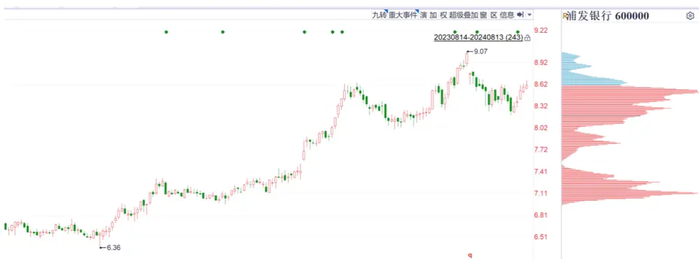
iFind,

尽管筹码分布本质上是基于量价数据对投资者实际持仓成本情况的近似估计（而非真实持仓记录），但其在市场中具有广泛的应用基础，被视为反映 交易摩擦 的重要信号。特别是在中国 股市场中，受 交易机制和散户主导交易结构的影响，筹码分布所体现的行为偏差更为显著，也为因子研究提供了新的研究视角。

本报告基于《处置效应与 V 型处置效应在量化选股中的应用》中构建的筹码分布数据，从统计特征、集中程度、换手情况与账面盈利四个维度系统构建了一系列筹码因子，进一步深入研究筹码理论在 股市场的应用。研究发现，大部分筹码因子具有不错的选股能力，这一结果为进一步将行为金融视角引入量化投资策略提供了支持。

## 1.2 筹码分布构建

筹码分布构建的核心思想是通过历史成交量与价格推算投资者可能的买入成本，并每日进行动态更新。本文筹码分布的构建方法如下：

1、提取股票分钟级前复权收盘价、成交量，以及日频流通换手率数据。

2、计算股票每日分钟级量价分布情况。

3、在t日，股票i 在每个价位p的筹码峰 $\cdot Chip_{i_{\cdot},\:t,p}$ 计算公式为：

$$
Chip_{i,t,p}=Vol_{i,t,p}*T_{i,t}+Chip_{i,t-1,p}*\left(1-T_{i,t}\right)
$$

其中， $Vol_{i,t,p}$ 为股票i 在t日价格为p的总成交量， $T_{i,t}$ 为股票i 在t日的流通换手率， $Chip_{i,\;t-1,p}$ 为股票i 在t-1 日价格为p的筹码峰。每日的筹码分布更新满足图 2 所示计算逻辑，以此迭代计算每日的筹码分布。

图 2：筹码分布简化示意图
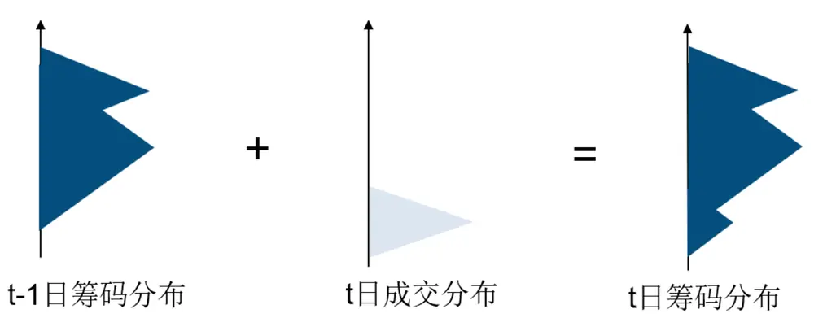
资料来源：中信建投

接下来具体举例计算筹码分布，假设某股票流通股1000 股，t-1 日的筹码分布见图3 左图，t 日共交易 100股，换手率10%，见图3 右图：

表 1：筹码分布计算示例

| 价格 | t-1日筹码峰 t日成交量 |
| --- | --- |
| 10.01 10 | 10 |
| 10.02 | 30 20 |
| 10.03 | 30 20 |
| 10.04 | 30 30 |
| 10.05 | 0 20 |

数据来源：中信建投

图 3：筹码分布计算简化图
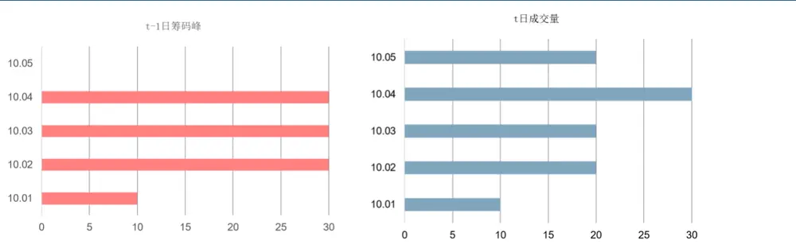
资料来源：中信建投

T 日筹码峰满足： $Chip_{i,t,p}=Chip_{i,t-1,p}*\left(1-T_{i,t}\right)+Vol_{i,t,p}*T_{i,t}$ 。在表 2 与图 4 中，我们展示了如何将前一日筹码根据换手率进行衰减，并叠加当日新增成交量，得出t 日的新筹码分布。

表 2：筹码峰计算示例

| 价格 | t-1日筹码峰*(1-t日换手率) | t日成交量*t日换手率 | t旧筹码峰 |
| --- | --- | --- | --- |
| 10.01 | 9 | 1 | 10 |
| 10.02 | 27 | 2 | 29 |
| 10.03 | 27 | 2 | 29 |
| 10.04 | 27 | 3 | 30 |
| 10.05 | 0 | 2 | 2 |

数据来源：中信建投

图 4：筹码交换示意图
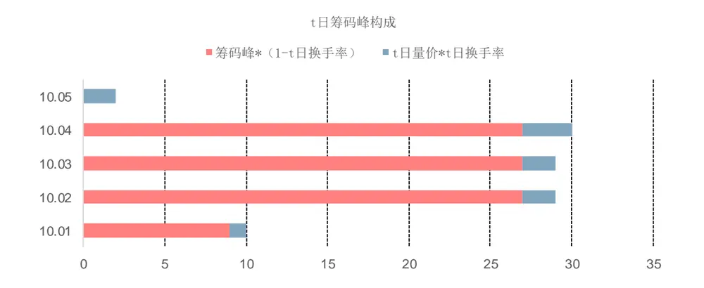
资料来源：中信建投

## 1.3 因子测试框架

本报告当中的所有因子测试都使用以下框架进行测试：

回测时间： 2009 年 12 月-2024 年 7 月

样本池：全市场

股票筛选：剔除在调仓日的停牌、涨跌停、上市未满半年和ST股票

调仓时间：月频调仓（每个月的最后一个交易日）

因子处理：极值处理（剔除3 倍标准差之外的样本）、缺失值处理（直接剔除）、中性化处理

多空收益分析分位数：10 分位

## 二、筹码分布统计因子

## 2.1 筹码分布统计因子定义与构建

## 2.1.1 筹码分布统计因子构建框架

本节使用统计学指标构建筹码分布统计因子，描述筹码分布的位置、离散程度与形态特征。

对于某只股票在t日的筹码分布，假设共有 n个价位 $(i=1,2,\cdots,n)$ ，定义第 t天i 价位的筹码峰高度为 $vol_{i,t}$ 对应价格为 $lprice_{i,t}$ ，并定义 $\begin{array}{r}{.p_{i,t}=\frac{vol_{i,t}}{\sum vol_{i,t}}}\end{array}$

筹码加权平均成本：使用筹码分布加权价格衡量筹码加权平均成本。

$$
mean_{t}=\sum\bigl(price_{i,t}*p_{i,t}\bigr)
$$

筹码成本加权标准差：反映筹码分布的离散程度。

$$
std_{t}=\sqrt{\sum\bigl(price_{i,t}-mean_{t}\bigr)^{2}*p_{i,t}}
$$

筹码分布偏度：衡量筹码分布偏斜程度和偏斜方向。

$$
skewness_{t}\;=\;\sum\Big(\frac{price_{i,t}-mean_{t}}{std_{t}}\Big)^{3}*p_{i,t},
$$

筹码分布峰度：衡量筹码分布在平均值处峰值的高低程度。

$$
kurtosis_{t}=\sum\Big(\frac{price_{i,t}-mean_{t}}{std_{t}}\Big)^{4}*p_{i,t},
$$

筹码分布变异系数：衡量筹码分布的离散程度。

$$
coeff\_of\_var_{t}=\frac{std_{t}}{mean_{t}}
$$

相对价位：衡量收盘价与平均成本之间的距离占比。

$$
CKD_{t}=\frac{close_{t}-mean_{t}}{Chip\_Higgs_{t}-Chip\_Loss_{t}}
$$

成本带宽：反应筹码最高价Cℎip $\_Highest_{t}$ 和筹码最低价Cℎip $\_Lowest_{t}$ 之间的宽度。

$$
CBW_{t}=\frac{Chip\_Highest_{t}-Chip\_Lowest_{t}}{Chip\_Lowest_{t}}
$$

成本重心：平均成本在筹码分布中的相对位置。

$$
CKDW_{t}=\frac{mean_{t}-Chip\_Loss_{t}}{Chip\_Higgs_{t}-Chip\_Loss_{t}}
$$

## 2.1.2 筹码分布因子计算举例

假设某股票 t 日收盘价为 10.03 元，t 日的筹码分布如下：

表 3：筹码分布因子计算示例

| 价位i | 价格price | t日筹码峰 | 筹码占比pi,t | 价格*筹码占比pi,t |
| --- | --- | --- | --- | --- |
| 1 | 10.01 | 10 | 0.1 | 1.001 |
| 2 | 10.02 | 29 | 0.29 | 2.9058 |
| 3 | 10.03 | 29 | 0.29 | 2.9087 |
| 4 | 10.04 | 30 | 0.3 | 3.012 |
| 5 | 10.05 | 2 | 0.02 | 0.201 |

数据来源：中信建投

筹码平均价为：meant =1.001+2.9058+2.9087+3.012+0.201= 10.0285

筹码最高价为：10.05

最低价为：10.01

相对价位为：CKDP =(10.03- 10.0285)/(10.05-10.01)= 0.0375

成本带宽为： CBW = (10.05-10.01)/10.01= 0.003996

成本重心为： CKDW =(10.0285- 10.01)/(10.05-10.01)=0.4625

## 2.2 筹码分布统计因子绩效表现

## 2.2.1 筹码分布统计因子绩效表现汇总

七个因子中选股能力相对较好的为kurtosis 因子，年化多空收益 13.53%，夏普比率 2.29，IC 均值-3.74%，年化 IC_IR 达到-2.59。

表4：筹码分布因子绩效表现

|  | stdt | skewnesst | kurtosist | coeff_of_vart | CKDP | CBW | CKDW |
| --- | --- | --- | --- | --- | --- | --- | --- |
| IC均值 | -1.00% | -0.68% | -3.74% | 2.75% | -4.38% | -4.40% | -1.72% |
| IC标准差 | 8.16% | 6.23% | 5.00% | 8.44% | 10.77% | 12.08% | 10.14% |
| IR | -12.26% | -10.90% | -74.66% | 32.61% | -40.65% | -36.39% | -16.93% |
| 年化IR | -0.42 | -0.38 | -2.59 | 1.13 | -1.41 | -1.26 | -0.59 |
| 胜率% | 0.56 | 0.54 | 0.80 | 0.62 | 0.62 | 0.68 | 0.55 |
| 总收益 |  | 49.33% | 542.80% |  |  |  |  |
| 年化收益 | 26.57% 1.62% | 2.77% | 13.53% | 555.47% 13.68% | 91.56% | 187.82% | -14.93% |
| 年化波动 | 11.08% | 8.16% | 5.90% | 9.80% | 4.53% 13.17% | 7.47% | -1.10% |
| 夏普比率 | 0.15 | 0.34 | 2.29 | 1.40 | 0.34 | 13.89% | 11.93% |
| 最大回撤 | 42.17% | 21.15% | 7.75% | 12.94% | 28.19% | 0.54 | -0.09 |
| 收益回撤比 | 3.84% | 13.11% | 174.49% | 105.74% | 16.08% | 20.87% 35.82% | 37.28% -2.94% |
|  |  |  | 0.77 | 0.65 | 0.5 |  |  |
| 胜率 | 0.53 | 0.58 |  |  |  | 0.59 | 0.47 |

资料来源：天软科技，中信建投

## 2.2.2 筹码分布统计因子绩效表现

## 2.2.2.1 kurtosis 因子：

kurtosis 因子表现出优异的选股能力。因子年化多空收益13.53%，夏普比率2.29，IC均值-3.74%，年化IC_IR达到-2.59。kurtosis 因子的分层效果区分度比较高。不同分组间具有单调的年化超额收益（相对中证全指），并且，Q1 组相对Q10 组具有将近13.56%的超额收益（其中Q1 达11.16%的多头超额收益，Q10 为-2.31%）。

图 5：kurtosis 因子绩效表现

| IC均值 | -3.74% |
| --- | --- |
| IC标准差 | 5.00% |
| IR | -74.66% |
| 年化IR | -2.59 |
| 胜率% | 0.80 |
| 总收益 | 542.80% |
| 年化收益 | 13.53% |
| 年化波动 | 5.90% |
| 夏普比率 | 2.29 |
| 最大回撤 | 7.75% |
| 收益回撤比 | 174.49% |
| 胜率 | 0.77 |

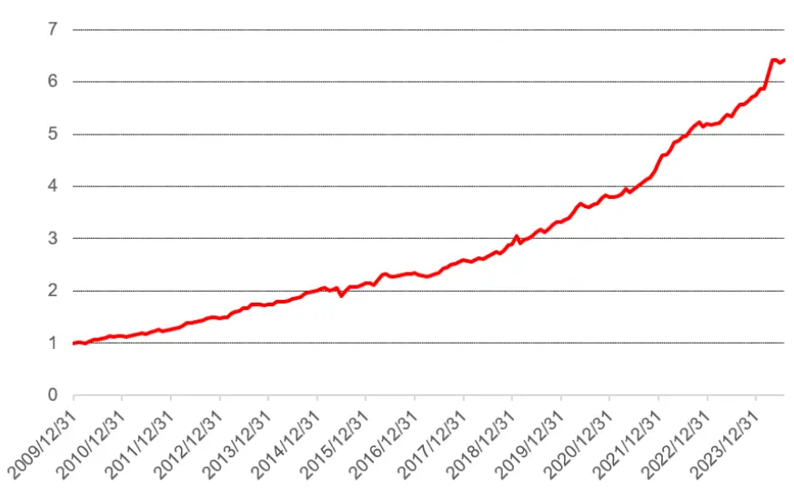
资料来源：天软科技，中信建投

图 6：kurtosis 因子分层超额收益
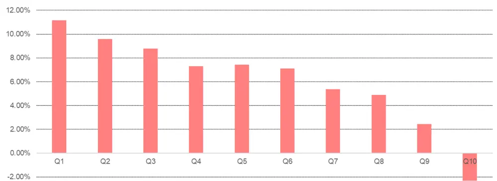
资料来源：天软科技，中信建投

## 2.2.2.2 coeff_of_var 因子：

coeff_of_var 因子表现出优异的选股能力。因子年化多空收益13.53%，夏普比率2.29，IC均值-3.74%，年化IC_IR达到-2.59。coeff_of_var 因子的分层效果区分度比较高。不同分组间具有单调的年化超额收益（相对中证全指），并且，Q1 组相对Q10 组具有将近13.59%的超额收益（其中Q1 达10.38%的多头超额收益，Q10 为-3.21%）。

图 7：coeff_of_var 因子绩效表现

| IC均值 | -3.74% |
| --- | --- |
| IC标准差 | 5.00% |
| IR | -74.66% |
| 年化IR | -2.59 |
| 胜率% | 0.80 |
| 总收益 | 542.80% |
| 年化收益 | 13.53% |
| 年化波动 | 5.90% |
| 夏普比率 | 2.29 |
| 最大回撤 | 7.75% |
| 收益回撤比 | 174.49% |
| 胜率 | 0.77 |

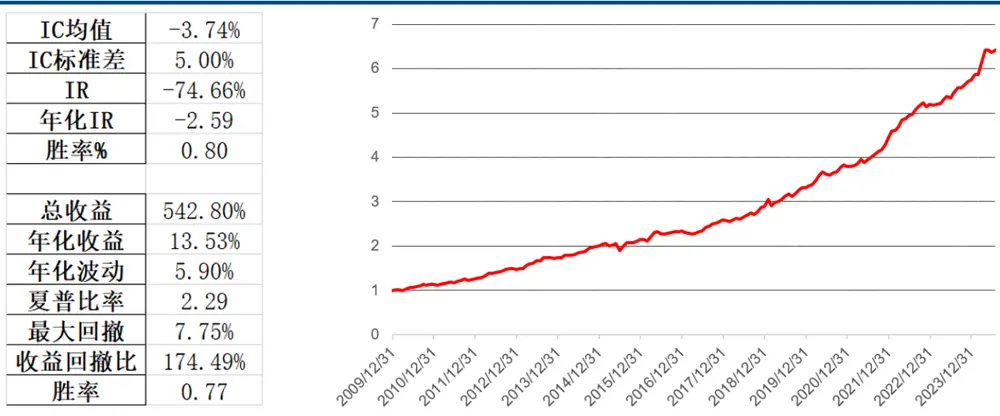
资料来源：天软科技，中信建投

图 8：coeff_of_var 因子分层超额收益
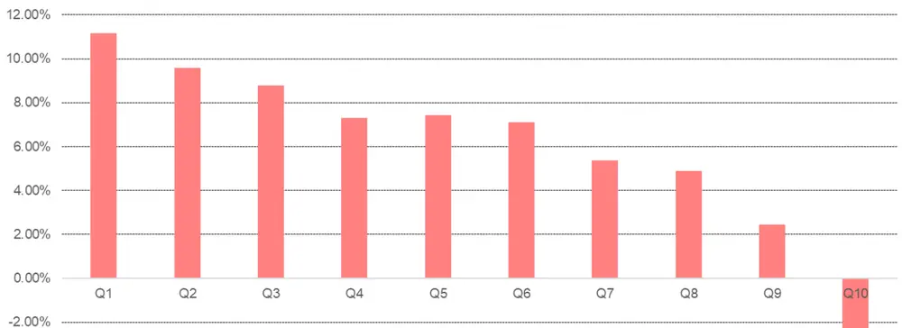
资料来源：天软科技，中信建投

## 三、筹码集中度因子

## 3.1 筹码集中度因子定义与构建

## 3.1.1 筹码集中度因子构建框架

根据筹码理论，股票行情主要经历四个阶段：吸筹、拉升、出货和下跌，而这四个阶段的筹码集中度具有不同的表现：

吸筹阶段表现为低位建立底仓，集中筹码，这一阶段通常比较隐蔽，换手率不会显著放大，筹码分布的集中度变化不大。拉升/下跌阶段表现为股价脱离筹码集中区域，向上/向下打开筹码价格区间，使集中的筹码向上/向下转移发散，表现为筹码集中度降低。出货阶段对应的是筹码高位充分换手，充分换手是指某一价格区间的成交量放大，使分散的筹码更加集中。出货往往比较迅速，换手率显著放大，市场参与活跃，筹码集中度显著提升。

筹码集中度越高，往往对应出货阶段，市场炒作明显，未来表现可能不佳。据此，本文构建chip_distri系列因子反映筹码集中度，因子值越小筹码越集中。以下定义 $Chip\_Highest_{t}$ 为筹码分布最高价。

90%筹码集中度因子： $Price95_{t}$ $Price05_{t}$ 分别为筹码分布95%、5%分位数价格。。

$$
\frac{chip\_distri_{1}=\frac{2*(Price95_{t}-Price05_{t})}{Price95_{t}+Price05_{t}},\quad chip\_distri_{2}=\frac{Price95_{t}-Price05_{t}}{Chip\_Hightest_{t}}}{\frac{2*(Price95_{t}-Price05_{t})}{Chip\_Hightet_{t}}}
$$

70%筹码集中度因子： $Price85_{t}$ $Price15_{t}$ 分别为筹码分布85%、15%分位数价格。

$$
\frac{chip\_distri_{3}=\frac{2*(Price85_{t}-Price15_{t})}{Price85_{t}+Price15_{t}}}{\frac{chip\_distri_{4}=\frac{Price85_{t}-Price15_{t}}{Chip\_Hightest_{t}}}{Chip\_Hightet_{t}}}
$$

50%筹码集中度因子： $Price75_{t}$ $Price25_{t}$ 分别为筹码分布75%、25%分位数价格。

$$
\begin{array}{r}{chip\_distri_{5}=\frac{2*(Price75_{t}-Price25_{t})}{Price75_{t}+Price25_{t}},\quad chip\_distri_{6}=\frac{Price75_{t}-Price25_{t}}{Chip\_Highest_{t}}}\end{array}
$$

根据活动筹码理论，当天涨跌停价格范围内的筹码更可能被主动交易，称为 活动筹码 ；而处于该区间之外的筹码则为“锁定筹 $码"$ ，通常更稳定，不易交易。本文基于 A 股不同交易板块的涨跌停制度设定当日的最大波动幅度，并构造 ASR 系列因子以衡量活动筹码占比情况：

对于主板股票，最大波动幅度为10%；对于科创板及注册制创业板股票，最大波动幅度为±20%。

高位价格=收盘价*(1+波动幅度)，低位价格=收盘价*(1-波动幅度)

活动筹码： $ASR_{t}=$ 高位价格与低位价格之间的筹码占比

上方活动筹码： ASR_upper = 收盘价与高位价格之间的筹码占比

下方活动筹码：ASR_lower = 收盘价与低位价格之间的筹码占比

上方锁定筹码：ASR_above = 高位价格以上的筹码占比

下方锁定筹码：ASR_below = 低位价格以下的筹码占比

## 3.1.2 筹码集中度因子计算举例

假设股票 i 在 t 日的筹码分布示意图如下：

图 9：筹码集中度因子计算示例
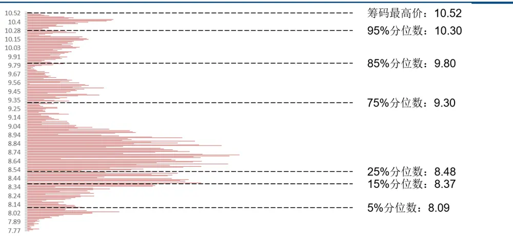
资料来源：天软科技，中信建投

$$
chip\_distri_{1}=\frac{2*(Price95_{t}-Price05_{t})}{Price95_{t}+Price05_{t}}\approx0.24,\quad chip\_distri_{2}=\frac{Price95_{t}-Price05_{t}}{Chip\_Hightest_{t}}\approx0.21
$$

图 10：筹码集中度因子计算示例
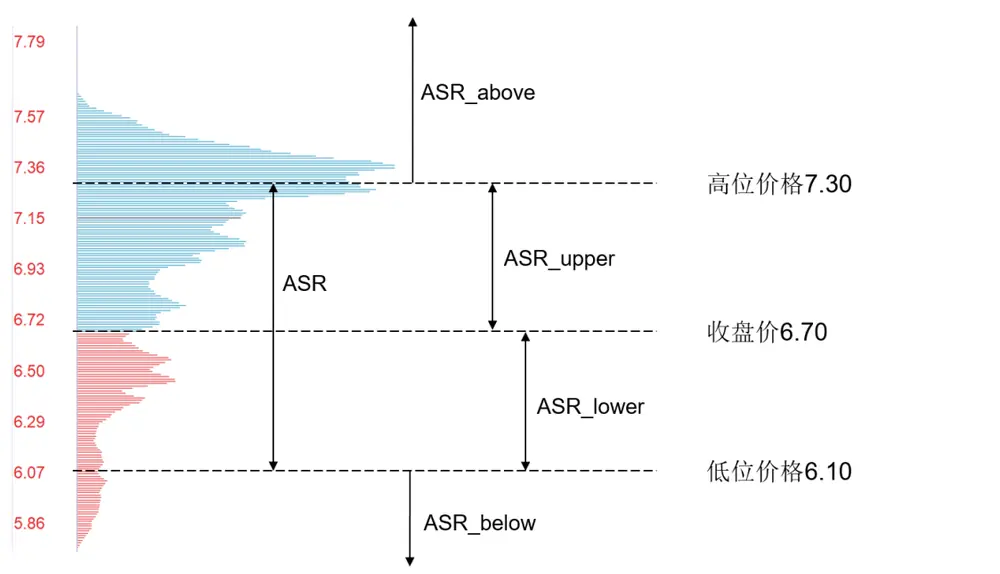
资料来源：iFind，中信建投

## 3.2 筹码集中度因子绩效表现

## 3.2.1 筹码集中度因子绩效表现汇总

## 3.2.1.1 chip_distri系列因子

六个因子的表现都不错。其中选股能力相对最好的为chip_distri 因子，年化多空收益 20.10%，夏普比率2.26，IC 均值 3.96%，年化 IC_IR 达到 1.86。

表 5：chip_distri 系列因子绩效表现

|  | chip_distri | chip_distriz | chip_distri3 | chip_distri4 | chip_distris | chip_distri6 |
| --- | --- | --- | --- | --- | --- | --- |
| IC均值 | 3.25% | 3.96% | 3.46% | 4.05% | 3.36% | 3.90% |
| IC标准差 | 8.18% | 7.38% | 7.26% | 6.71% | 6.32% | 5.97% |
| IR | 39.75% | 53.65% | 47.64% | 60.38% | 53.18% | 65.32% |
| 年化IR | 1.38 | 1.86 | 1.65 | 2.09 | 1.84 | 2.26 |
| 胜率 | 0.66 | 0.69 | 0.66 | 0.71 | 0.71 | 0.75 |
| 总收益 | 843.64% | 1368.05% | 821.60% | 1204.51% | 723.91% | 1010.33% |
| 年化收益 | 16.54% | 20.10% | 16.35% | 19.14% | 15.46% | 17.84% |
| 年化波动 | 9.54% | 8.90% | 8.47% | 7.82% | 7.49% | 6.89% |
| 夏普比率 | 1.73 | 2.26 | 1.93 | 2.45 | 2.07 | 2.59 |
| 最大回撤 | 11.95% | 12.61% | 12.51% | 13.04% | 8.47% | 8.53% |
| 收益回撤比 | 138.34% | 159.41% | 130.71% | 146.76% | 182.62% | 209.12% |
| 胜率 | 0.7 | 0.72 | 0.73 | 0.78 | 0.73 | 0.77 |

资料来源：天软科技，中信建投

## 3.2.1.2 ASR 系列因子

其中选股能力相对最好的为ASR因子，年化多空收益12.50%，夏普比率1.37，IC均值-4.13%，年化IC_IR 达到-1.72。

表6：ASR系列因子绩效表现

|  | ASR | ASR_upper | ASR_lower | ASR_above | ASR_below |
| --- | --- | --- | --- | --- | --- |
| IC均值 | -4.13% | -3.25% | -2.10% | 3.67% | -0.18% |
| IC标准差 | 8.32% | 6.77% | 8.46% | 9.82% | 7.61% |
| IR | -49.58% | -47.96% | -24.81% | 37.35% | -2.32% |
| 年化IR | -1.72 | -1.66 | -0.86 | 1.29 | -0.08 |
| 胜率 | 0.70 | 0.67 | 0.56 | 0.63 | 0.48 |
| 总收益 | 462.78% | 432.31% | 84.86% | 237.93% | -42.53% |
| 年化收益 | 12.50% | 12.08% | 4.28% | 8.66% | -3.71% |
| 年化波动 | 9.13% | 7.74% | 8.88% | 9.57% | 9.25% |
| 夏普比率 | 1.37 | 1.56 | 0.48 | 0.90 | -0.40 |
| 最大回撤 | 12.45% | 10.01% | 25.74% | 21.05% | 44.91% |
| 收益回撤比 | 100.43% | 120.62% | 16.62% | 41.12% | -8.25% |
| 胜率 | 0.66 | 0.68 | 0.54 | 0.6 | 0.46 |

资料来源：天软科技，中信建投

## 3.2.2 筹码集中度因子绩效表现

## 3.2.2.1 chip_distri

chip_distri 因子表现出优异的选股能力。因子年化多空收益16.54%，夏普比率1.73，IC均值3.25%，年化IC_IR达到1.38。chip_distri 因子的分层效果区分度比较高。不同分组间具有单调的年化超额收益（相对中证全指），并且，Q1 组相对Q10 组具有将近16.15%的超额收益（其中Q1 达11.41%的多头超额收益，Q10 为-4.74%）。

图 11：chip_distri_1 因子绩效表现

| IC均值 | 3.25% |
| --- | --- |
| IC标准差 | 8.18% |
| IR | 39.75% |
| 年化IR | 1.38 |
| 胜率% | 0.66 |
| 总收益 | 843.64% |
| 年化收益 | 16.54% |
| 年化波动 | 9.54% |
| 夏普比率 | 1.73 |
| 最大回撤 | 11.95% |
| 收益回撤比 | 138.34% |
| 胜率 | 0.7 |

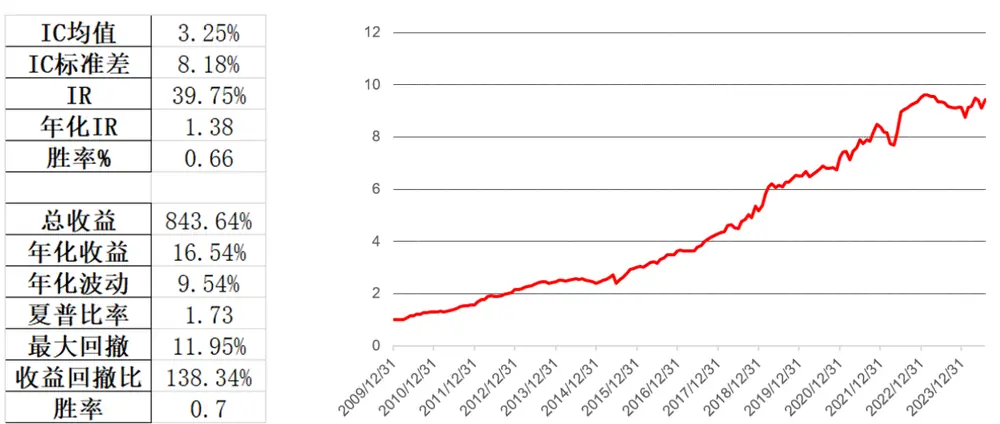
资料来源：天软科技，中信建投

图 12：chip_distri_1 因子分层超额收益
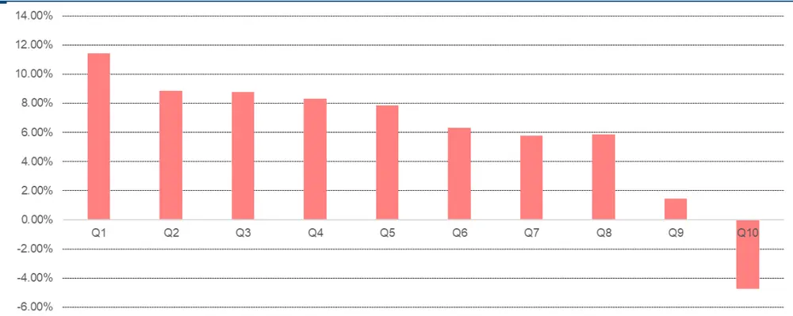
资料来源：天软科技，中信建投

## 3.2.2.2 chip_distri

cℎip_ $.distri_{2}$ 因子表现出优异的选股能力。因子年化多空收益20.10%，夏普比率2.23，IC均值3.96%，年化IC_IR达到1.86。cℎip_distri 因子的分层效果区分度比较高。不同分组间具有单调的年化超额收益（相对中证全指），并且，Q1 组相对Q10 组具有将近19.29%的超额收益（其中Q1 达12.39%的多头超额收益，Q10 为-6.90%）。

图 13：chip_distri_2 因子绩效表现

| IC均值 | 3.96% |
| --- | --- |
| IC标准差 | 7.38% |
| IR | 53.65% |
| 年化IR | 1.86 |
| 胜率% | 0.69 |
| 总收益 | 1368.05% |
| 年化收益 | 20.10% |
| 年化波动 | 8.90% |
| 夏普比率 | 2.26 |
| 最大回撤 | 12.61% |
| 收益回撤比 | 159.41% |
| 胜率 | 0.72 |

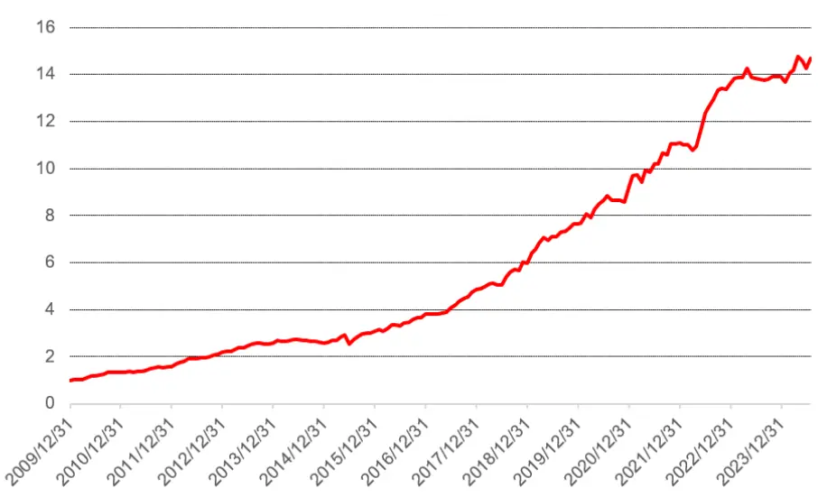
资料来源：天软科技，中信建投

图 14：chip_distri_2 因子分层超额收益
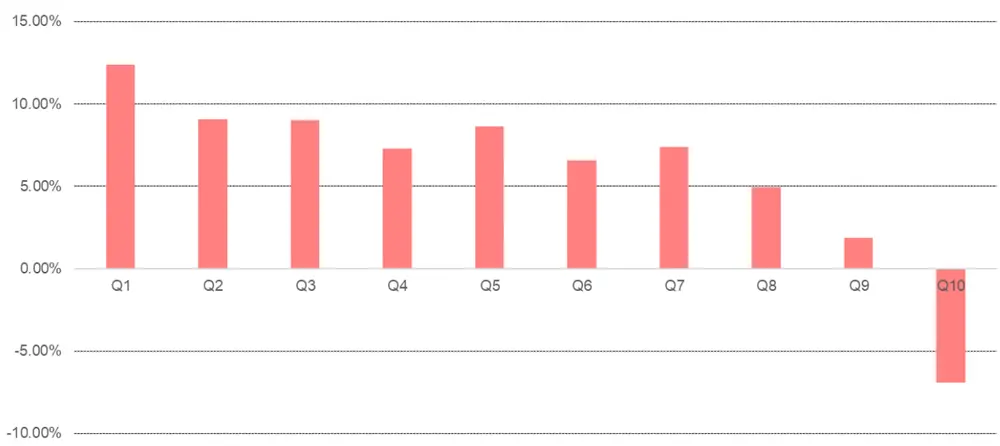
资料来源：天软科技，中信建投

## 3.2.2.3 ASR 因子

ASR因子表现出优异的选股能力。因子年化多空收益12.50%，夏普比率1.37，IC均值-4.13%，年化IC_IR 达到-1.72。ASR因子的分层效果区分度比较高。不同分组间具有单调的年化超额收益（相对中证全指），并且，Q1组相对Q10 组具有将近12.66%的超额收益（其中Q1 达9.51%的多头超额收益，Q10 为-3.15%）。

图 15：ASR 因子绩效表现

| IC均值 | -4.13% |
| --- | --- |
| IC标准差 | 8.32% |
| IR | -49.58% |
| 年化IR | -1.72 |
| 胜率% | 0.70 |
| 总收益 | 462.78% |
| 年化收益 | 12.50% |
| 年化波动 | 9.13% |
| 夏普比率 | 1.37 |
| 最大回撤 | 12.45% |
| 收益回撤比 | 100.43% |
| 胜率 | 0.66 |

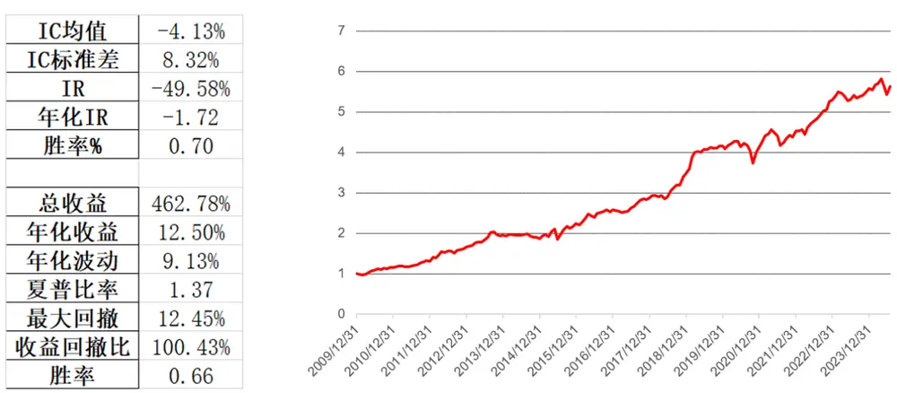
资料来源：天软科技，中信建投

图 16：ASR 因子分层超额收益
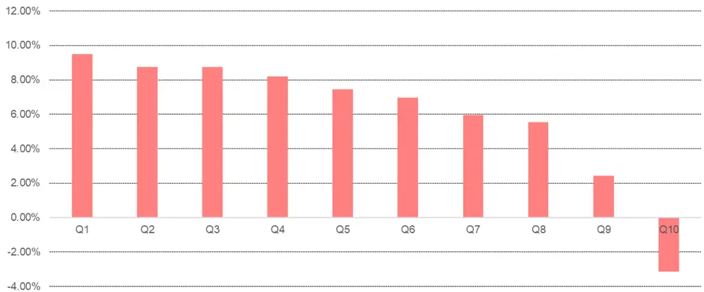
资料来源：天软科技，中信建投

## 四、筹码换手因子

## 4.1 筹码换手因子定义与构建

## 4.1.1 筹码换手因子构建框架

在行为金融学框架下，投资者对持仓盈亏状态的敏感性会显著影响其交易行为。当股价突破部分投资者的持仓成本时，这部分“被解套”的筹码更容易卖出，市场因此发生结构性调整。为进一步衡量换手行为对筹码分布的穿透效应与变动幅度，本文构建一系列筹码换手因子：

筹码穿透率 ：当天新增解套筹码比例除以当天换手率，反映穿透筹码的能力。该值越大，说明相同换手率使套牢筹码解套的效率越高，股票筹码的通透性就越好。

$$
\begin{aligned}&winner_{t}=t且盈利套司总盈司且司司司\\&且且且\\&且且且且且且且且\\\end{aligned}
$$

当日筹码穿透率 PTR_2：当天最高价和最低价范围内的筹码占比除以当天换手率，反映穿透筹码区域的能力。该值越大，说明相同换手率穿透筹码占总筹码的比例越高。

$$
PTR_{-}2_{t}=\frac{当月股票最高价与最低价之间都型占比}{turnover_{t}}
$$

筹码乖离率BIAS：采用动态加权平均，体现当日换手对盈利筹码结构的影响。

$$
BIAS_{t}=winner_{t}*turnover_{t}+BIAS_{t-1}(1-trnvcr_{t})
$$

## 4.2 筹码换手因子绩效表现

## 4.2.1 筹码换手因子绩效表现汇总

选股能力相对最好的为 PTR_2 ，年化多空收益 17.76%，夏普比率 1.97，IC 均值 5.10%，年化 IC_IR 达到 2.14。

表7：筹码换手因子绩效表现

|  | PTR | PTR_2 | BIAS |
| --- | --- | --- | --- |
| IC均值 | -0.95% | 5.10% | -1.81% |
| IC标准差 | 7.06% | 8.24% | 9.54% |
| IR | -13.48% | 61.90% | -18.92% |
| 年化IR | -0.47 | 2.14 | -0.66 |
| 胜率 | 0.56 | 0.77 | 0.56 |
| 总收益 | 10.77% | 999.66% | 28.99% |
| 年化收益 | 0.70% | 17.76% | 1.75% |
| 年化波动 | 7.39% | 9.00% | 10.34% |
| 夏普比率 | 0.09 | 1.97 | 0.17 |
| 最大回撤 | 15.52% | 9.30% | 30.52% |
| 收益回撤比 | 4.51% | 191.03% | 5.74% |
| 胜率 | 0.51 | 0.77 | 0.49 |

资料来源：天软科技，中信建投

## 4.2.2 筹码换手因子绩效表现

## 4.2.2.1 PTR_2

PTR_2 因子表现出优异的选股能力。因子年化多空收益17.76%，夏普比率1.97，IC均值5.10%，年化IC_IR达到2.14。PTR_2 因子的分层效果区分度比较高。不同分组间具有单调的年化超额收益（相对中证全指），并且，Q1 组相对 Q10 组具有将近 17.46%的超额收益（其中 Q1 达 12.48%的多头超额收益，Q10 为-4.98%）。

图 17：PTR_2 因子绩效表现

| IC均值 | 5.10% |
| --- | --- |
| IC标准差 | 8.24% |
| IR | 61.90% |
| 年化IR | 2.14 |
| 胜率% | 0.77 |
| 总收益 | 999.66% |
| 年化收益 | 17.76% |
| 年化波动 | 9.00% |
| 夏普比率 | 1.97 |
| 最大回撤 | 9.30% |
| 收益回撤比 | 191.03% |
| 胜率 | 0.77 |

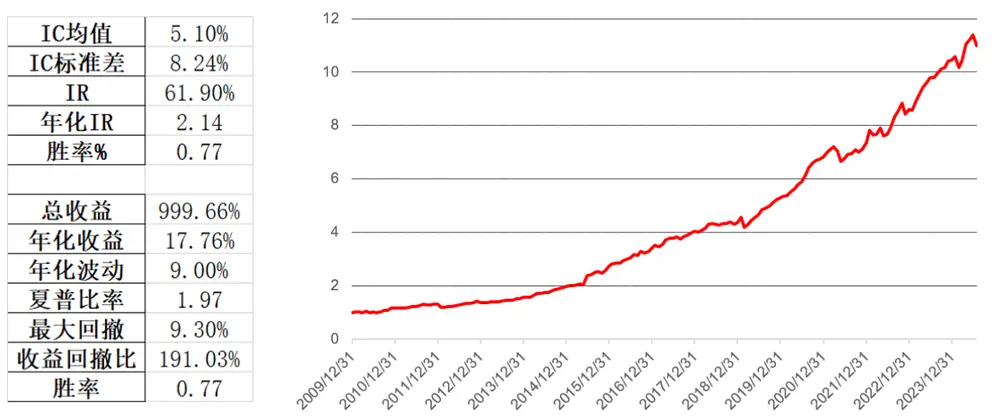
资料来源：天软科技，中信建投

图 18：PTR_2 因子分层超额收益
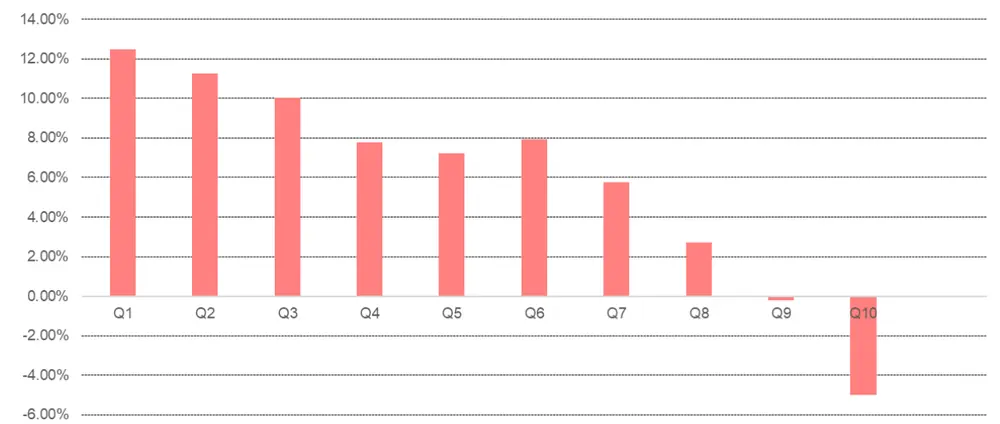
资料来源：天软科技，中信建投

## 五、筹码盈利因子

## 5.1 筹码盈利因子定义与构建

## 5.1.1 筹码盈利因子构建框架

在行为金融学理论中，投资者通常对账面盈亏具有显著敏感性，特别是短期浮盈筹码更可能快速获利了结，导致抛压上升。若某只股票当日新增筹码的盈利 亏损比例较高，意味着该股票短期不稳定筹码比例越大，筹码抛压也会变大，可能对股价走势产生不利影响。为量化这一行为特征，本文从筹码整体盈利状态与当日新增筹码结构两个层面构建了 个筹码盈利因子：

获利比率：衡量获利筹码所占比例（筹码分布图中红色部分面积占比）

$$
winner_{t}=t且盈利雾司占总雾司的比分
$$

博弈K线：反应当天开盘与收盘的获利比例变化情况

$$
CandleSticRambling_t=\#应时获利比例-收益时获利比例
$$

价格相对位置：衡量平均筹码成本的盈利情况。

$$
PRP_{t}=\frac{close_{t}-mean_{t}}{mean_{t}}
$$

账面总盈利/亏损：

$$
\begin{aligned}&PG_{i,t}=SUM(IF(p\leq close_{i,t},\;Chip_{i,\;t,p}*(close_{i,t}-p)),0)\\&PL_{i,t}=SUM(IF(p>close_{i,t},\;Chip_{i,\;t,p}*(p-close_{i,t}),0))\\\end{aligned}
$$

当天新增筹码总盈利/亏损：当日成交的新增筹码总盈利/亏损

$$
\begin{aligned}TG_{i,t}&=SUM(IF(p\leq close_{i,t},Vol_{i,t,p}*\left(close_{i,t}-p\right)*T_{i,t},0))\\TL_{i,t}&=SUM(IF(p>close_{i,t},Vol_{i,t,p}*(p-close_{i,t})*T_{i,t},0))\end{aligned}
$$

当天新增筹码盈利占比：

$$
TGRatio_{i,t}=\frac{TG_{i,t}}{PG_{i,t}}
$$

当天新增筹码亏损占比：

$$
TLRatio_{i,t}=\frac{TL_{i,t}}{PL_{i,t}}
$$

## 5.1.2 筹码盈利因子计算举例

假设t日收盘价10.03：

表 8：账面总盈利/亏损计算示例

| 价格 | t旧筹码峰 | 价差 盈利或亏损 |
| --- | --- | --- |
| 10.01 | 10 0.02 | 0.2 |
| 10.02 | 29 | 0.01 0.29 |
| 10.03 | 29 | 0 0 |
| 10.04 | 30 | -0.01 -0.3 |
| 10.05 | 2 | -0.02 -0.04 |

数据来源：中信建投

账面总盈利/亏损：

$$
PG_{i,t}=SUM(IF(p\leq close_{i,t},Chip_{i,t,p}*(close_{i,t}-p){,}0)
$$

$$
PL_{i,t}=SUM(IF(p>close_{i,t},\;Chip_{i\;,\;t,p}*(p-close_{i\;,t}){,}0)
$$

当天账面总盈利为：0.2+0.29=0.49，当天账面总亏损为： $0.3+0.04=0.34$ 0

表 9：当天新增筹码总盈利/亏损计算示例

| 价格 | t旧成交量 | t旧成交量*t日换手率 | 价差 | 盈利或亏损 |
| --- | --- | --- | --- | --- |
| 10.01 | 10 | 1 | 0.02 | 0.02 |
| 10.02 | 20 | 2 | 0.01 | 0.02 |
| 10.03 | 20 | 2 | 0 | 0 |
| 10.04 | 30 | 3 | -0.01 | -0.03 |
| 10.05 | 20 | 2 | -0.02 | -0.04 |

数据来源：中信建投

当天新增筹码总盈利/亏损：

$$
TG_{i,t}=SUM(IF(p\leq close_{i,t},Vol_{i,t,p}*\left(close_{i,t}-p\right)*T_{i,t},0)
$$

$$
TL_{i,t}=SUM(IF(p>close_{i,t},Vol_{i,t,p}*(p-close_{i,t})*T_{i,t},0)
$$

当天新增筹码总盈利为：0.02+0.02=0.04，当天新增筹码总亏损为：0.03+0.04=0.07。当天新增筹码盈利占比：

$$
TGRatio_{i,t}=\frac{TG_{i,t}}{PG_{i,t}}
$$

当天新增筹码亏损占比：

$$
TLRatio_{i,t}=\frac{TL_{i,t}}{PL_{i,t}}
$$

当天新增筹码盈利占比：0.04/0.49=0.0816，当天新增筹码亏损占比：0.07/0.34=0.2059。

## 5.2 筹码盈利因子绩效表现

## 5.2.1 筹码盈利因子绩效表现汇总

选股能力相对最好的为T ${}^{\cdot}G_{i,t},$ ，年化多空收益 30.34%，夏普比率 3.03，IC 均值-7.21%，年化 IC_IR 达到-3.31。

表10：筹码盈利因子绩效表现_1

|  | winnert | CandleStickGamblingt | PRPt |
| --- | --- | --- | --- |
| IC均值 | -2.42% | -3.76% | -3.30% |
| IC标准差 | 10.38% | 5.99% | 11.27% |
| IR | -23.37% | -62.78% | -29.25% |
| 年化IR | -0.81 | -2.17 | -1.01 |
| 胜率 | 0.55 | 0.77 | 0.55 |
| 总收益 | 23.35% | 441.00% | 106.12% |
| 年化收益 | 1.44% | 12.20% | 5.06% |
| 年化波动 | 10.82% | 7.77% | 13.38% |
| 夏普比率 | 0.13 | 1.57 | 0.38 |
| 最大回撤 收益回撤比 | 34.03% | 9.72% | 33.28% |
|  | 4.23% | 125.54% | 15.19% |
| 胜率 | 0.49 | 0.69 | 0.5 |

资料来源：天软科技，中信建投

表11: 筹码盈利因子绩效表现_2

|  | PGi,t | PLi,t | TGi,t | TLi,t | TGRati0i,t | TLRati0i,t |
| --- | --- | --- | --- | --- | --- | --- |
| IC均值 | -2.07% | -0.32% | -7.21% | -6.09% | -6.21% | -5.28% |
| IC标准差 | 8.68% | 11.21% | 7.55% | 7.58% | 8.65% | 7.39% |
| IR | -23.90% | -2.85% | -95.55% | -80.29% | -71.82% | -71.47% |
| 年化IR | -0.83 | -0.10 | -3.31 | -2.78 | -2.49 | -2.48 |
| 胜率 | 0.61 | 0.55 | 0.86 | 0.77 | 0.82 | 0.79 |
| 总收益 | 194.40% | 54.66% | 4774.97% | 1879.94% | 1714.35% | 920.35% |
| 年化收益 | 7.64% | 3.02% | 30.34% | 22.58% | 21.85% | 17.16% |
| 年化波动 | 10.88% | 11.28% | 10.01% | 10.22% | 8.98% | 9.92% |
| 夏普比率 | 0.70 | 0.27 | 3.03 | 2.21 | 2.43 | 1.73 |
| 最大回撤 | 25.20% | 29.86% | 11.63% | 15.71% | 11.81% | 14.87% |
| 收益回撤比 | 30.32% | 10.11% | 260.80% | 143.71% | 185.03% | 115.39% |
| 胜率 | 0.59 | 0.56 | 0.77 | 0.75 | 0.77 | 0.71 |

资料来源：天软科技，中信建投

## 5.2.2 筹码盈利因子绩效表现

## 5.2.2.1 TG 因子：

TG 因子表现出优异的选股能力。因子年化多空收益 30.34%，夏普比率 3.03，IC 均值-7.21%，年化 IC_IR 达到-3.31。但是TG因子的分层效果区分度不高。Q1 组相对Q10 组具有将近27.12%的超额收益（其中Q1 达11.69%的多头超额收益，Q10 为-15.43%）。

图 19：TG 因子绩效表现

| IC均值 | -7.21% |
| --- | --- |
| IC标准差 | 7.55% |
| IR | -95.55% |
| 年化IR | -3.31 |
| 胜率% | 0.86 |
| 总收益 | 4774.97% |
| 年化收益 | 30.34% |
| 年化波动 | 10.01% |
| 夏普比率 | 3.03 |
| 最大回撤 | 11.63% |
| 收益回撤比 | 260.80% |
| 胜率 | 0.77 |

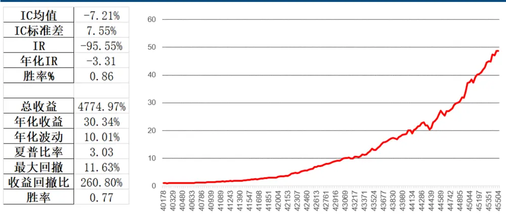
资料来源：天软科技，中信建投

图 20：TG 因子分层超额收益
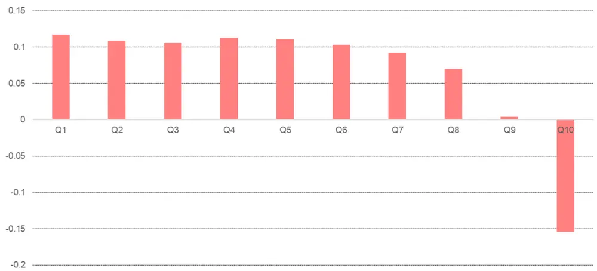
资料来源：天软科技，中信建投

## 5.2.2.2 TL 因子：

TL 因子表现出优异的选股能力。因子年化多空收益 22.58%，夏普比率 2.21，IC 均值-6.09%，年化 IC_IR 达到-2.78。但是TL因子的分层效果区分度不高。Q1 组相对Q10 组具有将近21.21%的超额收益（其中Q1 达9.12%的多头超额收益，Q10 为-12.09%）。

图 21：TL因子绩效表现

| IC均值 | -6.09% |
| --- | --- |
| IC标准差 | 7.58% |
| IR | -80.29% |
| 年化IR | -2.78 |
| 胜率% | 0.77 |
| 总收益 | 1879.94% |
| 年化收益 | 22.58% |
| 年化波动 | 10.22% |
| 夏普比率 | 2.21 |
| 最大回撤 | 15.71% |
| 收益回撤比 | 143.71% |
| 胜率 | 0.75 |

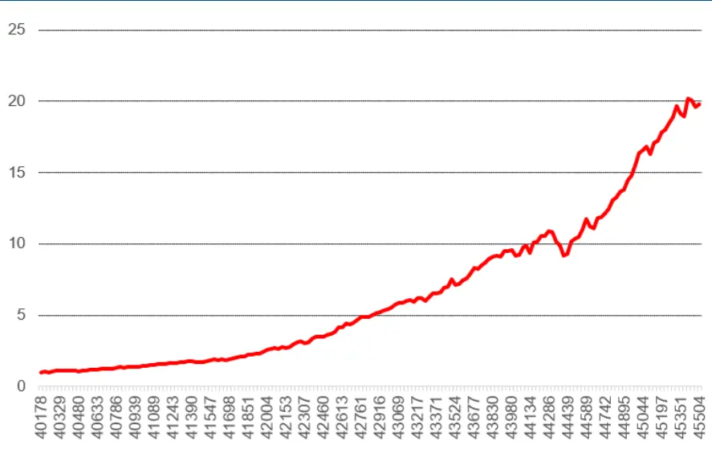
资料来源：天软科技，中信建投

图 22：TL因子分层超额收益
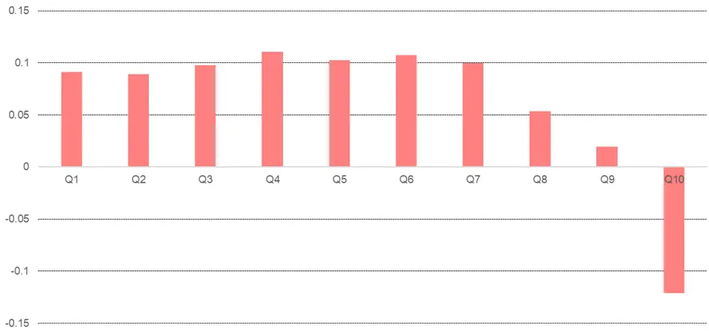
资料来源：天软科技，中信建投

## 5.2.2.3 TGRatio 因子：

$TGRatio_{i,t}$ 因子表现出优异的选股能力。因子年化多空收益 ，夏普比率 ， 均值 ，年化IC_IR 达到-2.49。 $TGRatio_{i,t}$ 因子的分层效果区分度非常高。不同分组间具有单调的年化超额收益（相对中证全指），并且，Q1 组相对Q10 组具有将近21.55%的超额收益（其中Q1 达16.89%的多头超额收益， Q10 为-4.66%）。

图 23：TGRatio 因子绩效表现

| IC均值 | -6.21% |
| --- | --- |
| IC标准差 | 8.65% |
| IR | -71.82% |
| 年化IR | -2.49 |
| 胜率 | 0.82 |
| 总收益 | 1714.35% |
| 年化收益 | 21.85% |
| 年化波动 | 8.98% |
| 夏普比率 | 2.43 |
| 最大回撤 | 11.81% |
| 收益回撤比 | 185.03% |
| 胜率 | 0.77 |

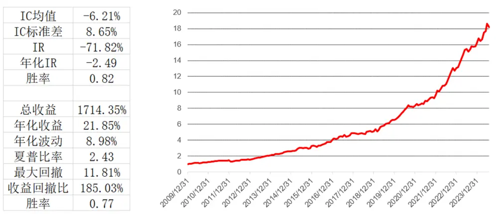
资料来源：天软科技，中信建投

图 24：TGRatio 因子分层超额收益
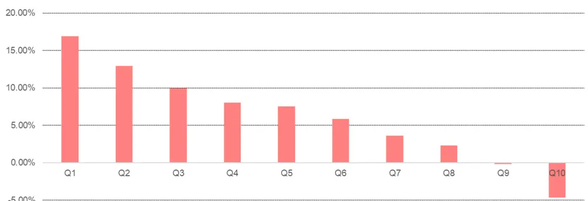
资料来源：天软科技，中信建投

| IC均值 | -5.28% |
| --- | --- |
| IC标准差 | 7.39% |
| IR | -71.47% |
| 年化IR | -2.48 |
| 胜率 | 0.79 |
| 总收益 | 920.35% |
| 年化收益 | 17.16% |
| 年化波动 | 9.92% |
| 夏普比率 | 1.73 |
| 最大回撤 | 14.87% |
| 收益回撤比 | 115.39% |
| 胜率 | 0.71 |

金融工程深度报告

## 5.2.2.4 TLRatio 因子：

$TLRatio_{i,t}$ 因子表现出优异的选股能力。因子年化多空收益 ，夏普比率 ， 均值 ，年化IC_IR 达到-2.48。 $TLRatio_{i,t}$ 因子的分层效果区分度非常高。不同分组间具有单调的年化超额收益（相对中证全指），并且，Q1 组相对Q10 组具有将近17.16%的超额收益（其中Q1 达11.72%的多头超额收益， Q10 为-5.44%）。

图 25：TLRatio 因子绩效表现
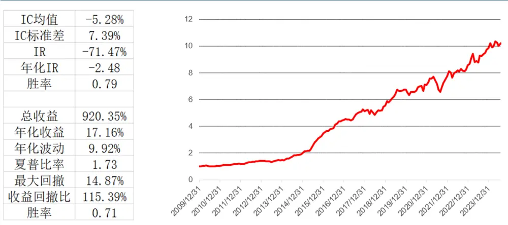
资料来源：天软科技，中信建投

图 26：TLRatio因子分层超额收益
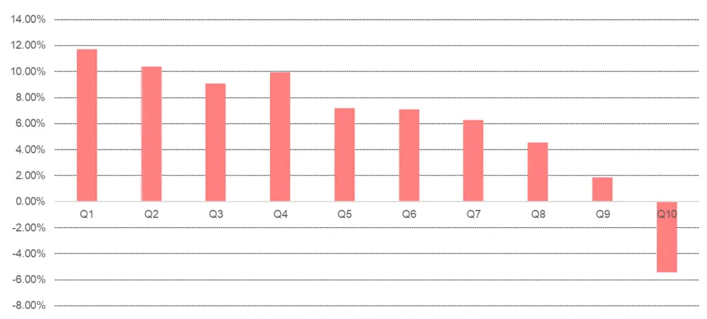
资料来源：天软科技，中信建投

## 六、筹码因子样本外跟踪表现

从 2024 年 7 月开始样本外跟踪，截至 2025 年 7 月，有 4 个因子多空收益超 20%，其中表现最好的因子是TGRatio，多空收益 31.59%，夏普比率 2.72，IC 均值-10.75%，年化 IC_IR 达到-4.41，表现非常不错。

表12：筹码因子样本外多空表现

|  | kurtosis | chip_distri_1 | chip_distri_2 | PTR | TG_ratio | TL_ratio |
| --- | --- | --- | --- | --- | --- | --- |
| IC均值 | 7.22% | 5.63% | 3.68% | 5.99% | -10.75% | -9.26% |
| IC标准差 | 9.36% | 8.34% | 7.02% | 8.65% | 8.45% | 8.63% |
| IR | 77.15% | 67.43% | 52.45% | 69.18% | -127.21% | -107.29% |
| 年化IR | 2.67 | 2.34 | 1.82 | 2.40 | -4.41 | -3.72 |
| 胜率 | 0.83 | 0.58 | 0.58 | 0.75 | 0.75 | 0.75 |
| 总收益 | 26.93% | 20.87% | 13.26% | 11.22% | 31.59% | 22.67% |
| 年化收益 | 26.93% | 20.87% | 13.26% | 11.22% | 31.59% | 22.67% |
| 年化波动 | 7.75% | 6.35% | 5.91% | 9.94% | 11.58% | 9.11% |
| 夏普比率 | 347.64% | 328.61% | 224.42% | 112.86% | 272.78% | 248.78% |
| 最大回撤 | 0.56% | 0.48% | 3.40% | 6.08% | 3.38% | 2.66% |
| 收益回撤比 4832.38% |  | 4373.80% | 390.30% | 184.34% | 933.68% | 853.42% |
| 胜率 | 0.77 | 0.69 | 0.62 | 0.62 | 0.62 | 0.62 |

资料来源：天软科技，中信建投

## 七、筹码因子在主要宽基指数样本池内的绩效表现

我们将本文筹码因子分别限制在中证 1000、中证 800、中证 500、沪深 300 成分股上，考察因子在不同指数样本池里的绩效表现。

筹码因子在中证 指数成分股上表现较好，四大类因子的 以及多空与全市场表现相近，甚至优于全市场表现。TG_Ratio 因子多头超额年化超10%。

表 13：筹码因子在中证 1000指数成分股上的绩效表现

| 因子名称 | IC均值 | 多空收益 | 多头超额 |
| --- | --- | --- | --- |
| kurtosis | -3.96% | 15.59% | 5.99% |
| coeff_of_var | 2.63% | 14.40% | 7.11% |
| chip_distri_1 | 3.12% | 16.27% | 7.84% |
| chip_distri_2 | 4.31% | 23.96% | 9.67% |
| ASR | -3.95% | 10.72% | 3.43% |
| PTR_2 | 5.91% | 19.64% | 8.96% |
| TG | -8.12% | 35.02% | 9.90% |
| TL | -6.99% | 29.50% | 9.09% |
| TG_Ratio | -6.44% | 23.65% | 10.62% |
| TL_Ratio | -5.99% | 22.50% | 7.25% |

数据来源：WIND，天软科技，中信建投

筹码因子在中证800 上表现不及中证1000，可见因子更适合小市值股票。

表 14：筹码因子在中证 800指数成分股上的绩效表现

| 因子名称 | IC均值 | 多空收益 | 多头超额 |
| --- | --- | --- | --- |
| kurtosis | -3.22% | 11.08% | 4.84% |
| coeff_of_var | 0.49% | 5.67% | 4.39% |
| chip_distri_1 | 1.09% | 7.57% | 4.89% |
| chip_distri_2 | 2.18% | 11.93% | 6.10% |
| ASR | -1.53% | 3.50% | 3.61% |
| PTR_2 | 4.24% | 13.40% | 8.13% |
| TG | -5.11% | 16.78% | 7.01% |
| TL | -3.77% | 9.72% | 3.25% |
| TG_Ratio | -4.50% | 14.99% | 7.78% |
| TL_Ratio | -2.04% | 5.60% | 6.14% |

数据来源：WIND，天软科技，中信建投

筹码因子在中证 500 上表现好于中证 800，可见在剔除市值靠前的沪深 300 成分股后因子表现有一定的提升。PTR_2 因子的多头超额年化超11%。

表 15：筹码因子在中证 500指数成分股上的绩效表现

| 因子名称 | IC均值 | 多空收益 | 多头超额 |
| --- | --- | --- | --- |
| kurtosis | -3.32% | 10.35% | 5.50% |
| coeff_of_var | 0.57% | 5.05% | 3.66% |
| chip_distri_1 | 1.30% | 7.55% | 4.45% |
| chip_distri_2 | 2.39% | 12.14% | 5.54% |
| ASR | -2.12% | 5.30% | 4.97% |
| PTR_2 | 4.64% | 16.36% | 11.37% |
| TG | -6.12% | 17.89% | 8.78% |
| TL | -4.59% | 12.60% | 6.31% |
| TG_Ratio | -5.07% | 15.82% | 8.37% |
| TL_Ratio | -2.73% | 5.63% | 6.11% |

数据来源：WIND，天软科技，中信建投

筹码因子在沪深 300 成分股上表现不佳，原因在于大盘股票的流动性更好，定价相较小盘股票更为充分，因而因子表现不佳。但TG因子、TG_Ratio 因子多头超额收益仍有6%以上。

表 16：筹码因子在沪深 300指数成分股上的绩效表现

| 因子名称 | IC均值 | 多空收益 | 多头超额 |
| --- | --- | --- | --- |
| kurtosis | -3.10% | 10.61% | 2.35% |
| coeff_of_var | 0.25% | 4.36% | 4.35% |
| chip_distri_1 | 0.72% | 6.61% | 4.36% |
| chip_distri_2 | 1.86% | 9.79% | 5.53% |
| ASR | -0.52% | 0.88% | 1.09% |
| PTR_2 | 3.74% | 9.28% | 4.31% |
| TG | -4.29% | 13.25% | 6.31% |
| TL | -3.05% | 7.52% | 1.47% |
| TG_Ratio | -3.94% | 15.07% | 6.07% |
| TL_Ratio | -1.01% | 1.44% | 4.71% |

数据来源：WIND，天软科技，中信建投

## 八、筹码因子与其他大类因子相关性

从相关性角度来看， 筹码分布统计因子中的CKDP、CKDW 因子和Momentum类因子相关性较强，CKDP 因子与CKDW 因子之间的相关性较强。

表 17：筹码分布因子与其他大类因子的相关系数

| F | std | skewness | kurtosis | coeff_of_var | CKDP | CBW | CKDW |
| --- | --- | --- | --- | --- | --- | --- | --- |
| EP_TTM | 0.01 | -0.07 | -0.09 | -0.13 | -0.01 | -0.18 | -0.06 |
| BP_LR | -0.25 | 0.04 | -0.04 | -0.06 | -0.37 | -0.25 | -0.27 |
| SP_TTM | -0.07 | 0.00 | -0.02 | -0.01 | -0.09 | -0.07 | -0.07 |
| Earnings_SQ_YoY | 0.00 | -0.01 | 0.00 | -0.01 | 0.02 | 0.00 | 0.01 |
| Sales_SQ_YoY | 0.01 | 0.00 | 0.00 | 0.01 | 0.03 | 0.02 | 0.02 |
| ROE_SQ_YoY | 0.00 | -0.01 | 0.01 | -0.01 | 0.01 | 0.00 | 0.01 |
| ROE_TTM | 0.04 | -0.02 | -0.03 | -0.03 | 0.01 | -0.04 | -0.01 |
| ROA_TTM | 0.17 | -0.06 | -0.07 | -0.06 | 0.06 | -0.09 | -0.02 |
| ROIC_TTM | 0.12 | -0.04 | -0.05 | -0.04 | 0.04 | -0.07 | -0.02 |
| Momentum_1m | 0.01 | -0.07 | 0.01 | -0.01 | 0.41 | 0.03 | 0.11 |
| Momentum_3m | 0.03 | -0.20 | 0.00 | -0.06 | 0.60 | 0.12 | 0.29 |
| Momentum_6m | 0.07 | -0.29 | -0.03 | -0.04 | 0.74 | 0.24 | 0.48 |
| Momentum_12m | 0.15 | -0.30 | -0.04 | 0.01 | 0.83 | 0.42 | 0.64 |
| Momentum_24m | 0.25 | -0.17 | -0.01 | 0.07 | 0.60 | 0.37 | 0.45 |
| LnFloatCap | 0.26 | -0.05 | -0.07 | 0.10 | 0.15 | 0.01 | 0.04 |
| AmountAvg_1M | 0.26 | -0.07 | 0.05 | 0.03 | 0.32 | 0.22 | 0.25 |
| TurnoverAvg1M | -0.06 | -0.04 | 0.21 | -0.19 | 0.35 | 0.30 | 0.32 |
| TurnoverAvg3M | -0.07 | -0.02 | 0.20 | -0.20 | 0.33 | 0.35 | 0.35 |
| TurnoverAvg6M | -0.07 | 0.01 | 0.19 | -0.19 | 0.30 | 0.38 | 0.34 |
| Volatility1M | 0.10 | -0.05 | 0.11 | 0.12 | 0.45 | 0.40 | 0.40 |
| Volatility3M | 0.11 | -0.05 | 0.13 | 0.13 | 0.46 | 0.48 | 0.47 |
| Volatility6M | 0.11 | -0.01 | 0.13 | 0.13 | 0.41 | 1 0.50 1 | 0.46 |
| Beta_100W | -0.02 | 0.05 | 0.04 | 0.05 | -0.04 | 0.10 | 0.07 |
| std | 1.00 | 0.05 | -0.08 | 0.40 | 0.17 | 0.26 | 0.15 |
| skewness | 0.05 | 1.00 | 0.34 | 0.24 | -0.33 | 0.12 | -0.44 |
| kurtosis | -0.08 | 0.34 | 1.00 | -0.15 | 0.00 | 0.24 | -0.05 |
| coeff_of_var | 0.40 | 0.24 | -0.15 | 1.00 | 0.08 | 0.47 | 0.18 |
| CKDP | 0.17 | -0.33 | 0.00 | 0.08 | 1.00 | 0.48 | 0.76 |
| CBW | 0.26 | 0.12 | 0.24 | 0.47 | 0.48 | 1.00 | 0.59 |
| CKDW | 0.15 | -0.44 | -0.05 | 0.18 | 0.76 | 0.59 | 1.00 |

数据来源：WIND，天软科技，中信建投

从相关性角度来看，筹码集中度因子中同一类别的因子间的相关性较强，筹码集中度因子与其他大类因子相关性较弱。

表 18：筹码集中度因子与其他大类因子的相关系数_1

|  | chip_distri_1 | chip_distri_2 |  | chip_distri_3 |  | chip_distri_4 |  | chip_distri_5 |  |  | chip_distri_6 |  |
| --- | --- | --- | --- | --- | --- | --- | --- | --- | --- | --- | --- | --- |
| EP_TTM | -0.11 | -0.05 |  | -0.09 |  | -0.03 |  | -0.08 |  |  | -0.02 |  |
| BP_LR | -0.08 | -0.05 |  | -0.05 |  | -0.03 |  | -0.03 |  |  | -0.02 |  |
| SP_TTM | -0.01 | 0.00 |  | 0.00 |  | 0.01 |  | 0.00 |  |  | 0.01 |  |
| Earnings_SQ_YoY | 0.00 | 0.00 |  | 0.00 |  | 0.00 |  | 0.00 |  |  | 0.00 |  |
| Sales_SQ_YoY | 0.01 | 0.01 |  | 0.01 |  | 0.00 |  | 0.00 |  |  | 0.00 |  |
| ROE_SQ_YoY | -0.01 | 0.00 |  | -0.01 |  | 0.00 |  | -0.01 |  |  | 0.00 |  |
| ROE_TTM | -0.03 | -0.01 |  | -0.02 |  | 0.00 |  | -0.02 |  |  | 0.00 |  |
| ROA_TTM | -0.04 | 0.00 |  | -0.03 |  | 0.01 |  | -0.02 |  |  | 0.01 |  |
| ROIC_TTM | -0.03 | 0.00 |  | -0.02 |  | 0.00 |  | -0.02 |  |  | 0.01 |  |
| Momentum_1m | 0.00 | 0.02 |  | -0.01 |  | 0.02 |  | -0.01 |  |  | 0.01 |  |
| Momentum_3m | -0.02 | 0.02 |  | -0.04 |  | 0.01 |  | -0.04 |  |  | 0.01 |  |
| Momentum_6m | 0.00 | 0.07 |  | -0.01 |  | 0.06 |  | -0.01 |  |  | 0.05 |  |
| Momentum_12m | 0.06 | 0.12 |  | 0.04 |  | 0.11 |  | 0.03 |  |  | 0.10 |  |
| Momentum_24m | 0.11 | 0.12 |  | 0.08 0.10 |  |  |  | 0.07 |  |  | 0.09 |  |
| LnFloatCap | 0.12 | 0.15 |  | 0.12 |  | 0.14 |  | 0.10 |  |  | 0.12 |  |
| AmountAvg_1M | 0.04 | 0.03 |  | 0.02 |  | 0.01 |  | 0.01 |  |  | 0.01 |  |
| TurnoverAvg1M | -0.21 | -0.26 |  | -0.22 |  | -0.25 |  | -0.20 |  |  | -0.23 |  |
| TurnoverAvg3M | -0.22 | -0.28 |  | -0.22 |  |  | -0.27 | -0.20 |  |  | -0.24 |  |
| TurnoverAvg6M | -0.22 | -0.29 |  | -0.21 |  |  | -0.27 | -0.19 |  |  | -0.23 |  |
| Volatility1M | 0.13 | 0.08 |  | 0.08 |  |  | 0.04 | 0.06 |  |  | 0.03 |  |
| Volatility3M | 0.13 | 0.07 |  | 0.08 |  |  | 0.03 | 0.05 |  |  |  | 0.01 |
| Volatility6M | 0.13 | 0.06 |  | 0.08 |  |  | 0.02 | 0.06 |  |  |  | 0.00 |
| Beta_100W | 0.05 | 0.01 |  | 0.03 |  |  | 0.00 | 0.02 |  |  |  | -0.01 |
| chip_distri_1 | 1.00 | 0.95 |  |  | 0.88 |  | 0.80 | 0.76 |  | 0.68 |  |  |
| chip_distri_2 | 0.95 |  | 1.00 |  | 0.85 |  | 0.87 | 0.74 |  | 0.74 |  |  |
| chip_distri_3 | 0.88 |  | 0.85 |  | 1.00 |  | 0.95 |  | 0.91 |  | 0.86 |  |
| chip_distri_4 | 0.80 |  | 0.87 |  | 0.95 |  | 1.00 |  | 0.88 |  | 0.91 |  |
| chip_distri_5 | 0.76 |  | 0.74 | 0.91 |  |  | 0.88 | 1.00 |  |  | 0.96 |  |
| chip_distri_6 | 0.68 | 0.74 |  | 0.86 |  |  | 0.91 | 0.96 |  |  | 1.00 |  |

数据来源：WIND，天软科技，中信建投

表 19：筹码集中度因子与其他大类因子的相关系数_2

|  | ASR |  | ASR_upper |  | ASR_lower |  | ASR_above | ASR_below |  |
| --- | --- | --- | --- | --- | --- | --- | --- | --- | --- |
| EP_TTM | 0.03 |  | 0.02 |  | 0.02 |  | -0.04 | 0.02 |  |
| BP_LR | -0.11 |  | -0.04 |  | -0.13 |  | 0.21 | -0.21 |  |
| SP_TTM | -0.04 |  | -0.02 |  | -0.03 |  | 0.05 | -0.03 |  |
| Earnings_SQ_YoY | 0.01 |  | 0.01 |  | 0.01 |  | -0.02 | 0.01 |  |
| Sales_SQ_YoY | 0.00 |  | 0.00 |  | 0.00 |  | -0.01 | 0.01 |  |
| ROE_SQ_YoY | 0.00 |  | 0.00 |  | 0.00 |  | 0.00 | 0.00 |  |
| ROE_TTM | 0.01 |  | 0.00 |  | 0.02 |  | -0.02 | 0.02 |  |
| ROA_TTM | 0.03 |  | 0.00 |  | 0.05 |  | -0.08 | 0.09 |  |
| ROIC_TTM | 0.02 |  | 0.00 |  | 0.03 |  | -0.05 | 0.06 |  |
| Momentum_1m | 0.26 |  | 0.04 |  | 0.38 |  | -0.46 | 0.40 |  |
| Momentum_3m | 0.25 |  | 0.07 |  | 0.34 |  | -0.49 | 0.47 |  |
| Momentum_6m | 0.20 |  | 0.05 |  | 0.28 |  | -0.44 | 0.47 |  |
| Momentum_12m | 0.14 |  | 0.03 |  | 0.22 |  | -0.37 | 0.44 |  |
| Momentum_24m | 0.08 |  | 0.00 |  |  | 0.16 | -0.27 | 0.36 |  |
| LnFloatCap | -0.02 |  | -0.06 |  |  | 0.06 | -0.10 | 0.22 |  |
| AmountAvg_1M | 0.11 |  | 0.06 |  |  | 0.12 | -0.17 | 0.15 |  |
| TurnoverAvg1M | 0.32 |  | 0.25 |  | 0.21 |  | -0.24 | -0.04 |  |
| TurnoverAvg3M | 0.25 |  | 0.23 |  |  | 0.12 | -0.15 | -0.09 |  |
| TurnoverAvg6M |  | 0.21 |  | 0.21 |  | 0.08 | -0.10 |  | -0.13 |
| Volatility1M |  | 0.14 |  | 0.07 |  | 0.15 | -0.23 |  | 0.18 |
| Volatility3M |  | 0.09 |  | 0.06 |  | 0.08 | -0.15 |  | 0.12 |
| Volatility6M | 0.05 |  |  | 0.04 |  | 0.03 | -0.07 | 0.06 |  |
| Beta_100W | -0.05 |  | -0.02 |  | -0.07 |  | 0.11 | -0.12 |  |
| ASR | 1.00 |  | 0.75 |  | 0.70 |  | -0.77 | -0.06 |  |
| ASR_upper | 0.75 |  | 1.00 |  | 0.07 |  | -0.43 | -0.28 |  |
| ASR_lower | 0.70 |  |  | 0.07 | 1.00 |  | -0.73 | 0.27 |  |
| ASR_above | -0.77 |  |  | -0.43 | -0.73 |  | 1.00 | -0.53 |  |
| ASR_below | -0.06 |  | -0.28 |  | 0.27 |  | -0.53 | 1.00 |  |

数据来源：WIND，天软科技，中信建投

筹码换手因子与其他大类因子相关性较弱。

表 20：筹码换手因子与其他大类因子的相关系数

|  | PTR | PTR_2 | BIAS |  |
| --- | --- | --- | --- | --- |
| EP_TTM | -0.01 -0.02 | 0.10 | 0.07 |  |
| BP_LR | -0.01 0.00 0.00 0.00 -0.01 -0.01 0.21 | 0.08 | -0.26 |  |
| SP_TTM |  | 0.03 | -0.05 |  |
| Earnings_SQ_YoY |  | 0.00 | 0.02 |  |
| Sales_SQ_YoY |  | 0.00 | 0.01 |  |
| ROE_SQ_YoY ROE_TTM |  | 0.00 | 0.01 |  |
|  |  | -0.01 0.03 | 0.04 |  |
| ROA_TTM |  | 0.09 | 0.15 |  |
| ROIC_TTM |  | 0.06 | 0.10 |  |
| Momentum_1m |  | 0.02 | 0.15 |  |
| Momentum_3m Momentum_6m |  | 0.03 | 0.39 |  |
|  | 0.02 | 0.47 |  |  |
| Momentum_12m | 0.05 0.03 0.01 | 0.47 |  |  |
| Momentum_24m | 0.00 | 0.39 |  |  |
| LnFloatCap | 0.17 | 0.19 |  |  |
| AmountAvg_1M | -0.03 | 0.21 |  |  |
|  |  |  | 0.13 |  |
|  |  |  |  | TurnoverAvg1M |
| TurnoverAvg3M | 0.04 0.04 | -0.28 -0.31 |  |  |
| TurnoverAvg6M | 0.04 | -0.33 | 0.08 |  |
| Volatility1M | 0.04 | -0.21 | 0.02 |  |
| Volatility3M | 0.02 | -0.23 | 0.24 |  |
| Volatility6M |  |  | 0.23 |  |
| Beta_100W | 0.02 | -0.23 | 0.15 |  |
|  | 0.02 | -0.14 | -0.12 |  |
| PTR | 1.00 | -0.17 | -0.08 |  |
| PTR_2 | -0.17 | 1.00 | 0.14 |  |
| BIAS | -0.08 | 0.14 | 1.00 |  |

数据来源：WIND，天软科技，中信建投

筹码盈利因子中，winner 和 PRP 之间的相关性较强，TG 和 TL 之间的相关性较强；winner、PRP 与Momentum 类因子相关性较强，PG 与 AmountAvg_1M 相关性较强，TG、TL 与 TurnoverAvg1M 相关性较强。

表 21：筹码盈利因子与其他大类因子的相关系数_1

|  | winner |  | Candle_Stick_Gambling |  | PRP |  |
| --- | --- | --- | --- | --- | --- | --- |
| EP_TTM | 0.03 |  | -0.04 |  | 0.07 |  |
| BP_LR | -0.23 |  | -0.05 |  | -0.25 |  |
| SP_TTM | -0.05 |  | -0.01 |  | -0.05 |  |
| Earnings_SQ_YoY | 0.02 |  | 0.00 |  | 0.02 |  |
| Sales_SQ_YoY | 0.01 |  | 0.00 |  | 0.01 |  |
| ROE_SQ_YoY | 0.00 |  | 0.00 |  | 0.01 |  |
| ROE_TTM | 0.02 |  | -0.01 |  | 0.03 |  |
| ROA_TTM | 0.10 |  | -0.03 |  | 0.12 |  |
| ROIC_TTM | 0.06 |  | -0.03 |  | 0.08 |  |
| Momentum_1m | 0.45 |  | 0.35 |  | 0.41 |  |
| Momentum_3m | 0.54 |  | 0.16 |  | 0.59 |  |
| Momentum_6m | 0.50 |  | 0.11 |  | 0.59 |  |
| Momentum_12m | 0.43 |  | 0.07 |  | 0.52 |  |
| Momentum_24m | 0.33 |  | 0.04 |  |  | 0.39 |
| LnFloatCap | 0.17 |  | -0.04 |  |  | 0.18 |
| AmountAvg_1M | 0.20 |  | 0.02 |  |  | 0.20 |
| TurnoverAvg1M | 0.16 |  |  | 0.18 |  | 0.16 |
| TurnoverAvg3M |  | 0.04 |  | 0.13 |  | 0.08 |
| TurnoverAvg6M |  | -0.01 |  | 0.11 |  | 0.02 |
| Volatility1M |  | 0.27 |  | 0.12 |  | 0.25 |
| Volatility3M |  | 0.17 |  | 0.08 |  | 0.17 |
| Volatility6M |  | 0.09 |  | 0.06 |  | 0.09 |
| Beta_100W | -0.11 |  |  | 0.00 |  | -0.14 |
| winner | 1.00 |  |  | 0.13 | 0.85 |  |
| Candle_Stick_Gambling | 0.13 |  |  | 1.00 | 0.05 |  |
| PRP | 0.85 |  | 0.05 |  | 1.00 |  |

数据来源：WIND，天软科技，中信建投

表 22：筹码盈利因子与其他大类因子的相关系数_2

|  | PG | PL |  | TG |  | TL |  | TG_Ratio |  |  | TL_Ratio |  |
| --- | --- | --- | --- | --- | --- | --- | --- | --- | --- | --- | --- | --- |
| EP_TTM | 0.05 | 0.05 |  | -0.02 |  | -0.02 |  | -0.05 |  |  | 0.00 |  |
| BP_LR | -0.15 | 0.04 |  | -0.10 |  | -0.13 |  | 0.01 |  |  | -0.11 |  |
| SP_TTM | -0.02 | 0.03 |  | -0.02 |  | -0.04 |  | -0.02 |  |  | -0.03 |  |
| Earnings_SQ_YoY | 0.01 | 0.00 |  | 0.01 |  | 0.00 |  | -0.01 |  |  | 0.01 |  |
| Sales_SQ_YoY | 0.00 | -0.01 |  | 0.00 |  | 0.00 |  | -0.01 |  |  | 0.00 |  |
| ROE_SQ_YoY | 0.00 | 0.00 |  | 0.00 |  | 0.00 |  | 0.00 |  |  | 0.00 |  |
| ROE_TTM | 0.04 | 0.02 |  | 0.00 |  | 0.00 |  | -0.01 |  |  | 0.01 |  |
| ROA_TTM | 0.11 | 0.04 |  | -0.02 |  | 0.00 |  | -0.04 |  |  | 0.02 |  |
| ROIC_TTM | 0.08 | 0.03 |  | -0.02 |  | 0.00 |  | -0.03 |  |  | 0.01 |  |
| Momentum_1m | 0.24 | -0.17 |  | 0.31 |  | 0.23 |  | -0.11 |  |  | 0.28 |  |
| Momentum_3m | 0.36 | -0.16 |  | 0.33 |  | 0.30 |  | -0.15 |  |  | 0.30 |  |
| Momentum_6m | 0.38 | -0.11 |  | 0.29 |  | 0.28 |  | -0.14 |  |  | 0.27 |  |
| Momentum_12m | 0.38 | -0.04 |  | 0.23 |  | 0.25 |  | -0.11 |  |  | 0.23 |  |
| Momentum_24m | 0.34 | 0.03 |  | 0.16 |  | 0.18 |  | -0.07 |  |  | 0.17 |  |
| LnFloatCap | 0.43 | 0.44 |  | 0.08 |  | 0.07 |  | -0.09 |  |  | 0.04 |  |
| AmountAvg_1M | 0.67 | 0.47 |  | 0.44 |  | 0.44 |  | 0.01 |  |  | 0.15 |  |
| TurnoverAvg1M | 0.11 | 0.02 |  | 0.54 |  | 0.51 |  | 0.24 |  |  | 0.26 |  |
| TurnoverAvg3M | 0.06 | 0.06 |  | 0.40 |  | 0.40 |  | 0.25 |  |  | 0.18 |  |
| TurnoverAvg6M | 0.02 | 0.07 |  | 0.31 |  | 0.32 |  | 0.26 |  |  |  | 0.14 |
| Volatility1M | 0.21 |  | 0.03 |  | 0.38 | 0.36 |  | 0.10 |  |  |  | 0.23 |
| Volatility3M | 0.19 |  | 0.10 |  | 0.30 | 0.30 |  | 0.08 |  |  |  | 0.15 |
| Volatility6M | 0.14 |  | 0.12 |  | 0.22 |  | 0.24 |  | 0.09 |  |  | 0.10 |
| Beta_100W | 0.00 |  | 0.16 |  | 0.06 |  | 0.04 |  | 0.03 |  |  | -0.02 |
| PG | 1.00 |  | 0.08 |  | 0.28 |  | 0.29 |  | -0.09 |  |  | 0.21 |
| PL | 0.08 |  | 1.00 |  | 0.11 |  | 0.09 |  | 0.13 |  |  | -0.08 |
| TG | 0.28 |  | 0.11 | 1.00 |  | 0.65 |  |  | 0.14 |  |  | 0.21 |
| TL | 0.29 |  | 0.09 | 10.65 |  | 1.00 |  |  | 0.09 |  |  | 0.23 |
| TG_Ratio | -0.09 |  | 0.13 | 0.14 |  | 0.09 |  | 1.00 |  |  |  | -0.01 |
| TL_Ratio | 0.21 | -0.08 |  | 0.21 |  | 0.23 |  | -0.01 |  | 1.00 |  |  |

数据来源：WIND，天软科技，中信建投

## 九、总结和思考

本篇报告作为行为金融学在量化选股中应用的第六篇，基于《处置效应与 型处置效应在量化选股中的应用》中的筹码分布数据对筹码理论进一步深入研究，发掘出筹码分布因子、筹码集中度因子、筹码换手因子、筹码盈利因子四大类因子，旨在从行为视角刻画市场交易结构与价格行为之间的关系。其中表现较好的是筹码集中度因子和筹码盈利因子。筹码集中度chip_distri系列因子年化多空收益在 15%-21%之间，其中cℎip_distri因子年化多空收益达20.10%；筹码盈利因子多个因子IC均值绝对值超过5%，其中TG 因子IC均值-7.21%，年化多空收益超过30%，具有不错的表现。进一步分析显示，这些筹码因子在中证1000 等小市值股票中表现更为突出，说明其对非充分定价股票具有更强的刻画能力；同时，筹码因子整体上与传统大类因子的相关性较低，具备良好的互补性。

## 风险提示

研究均基于历史数据，对未来投资不构成任何建议。文中的因子分析均是以历史数据进行计算和分析的，未来存在失效的可能性。市场的系统性风险、政策变动风险等市场不确定性均会对策略产生较大的影响。另外，本报告聚焦于因子的构建和效果，因此对市场及相关交易做了一些合理假设，但这样可能会导致基于模型所得出的结论并不能完全准确地刻画现实环境，在此可能会与未来真实的情况出现偏差。而且数据源通常存在极少量的缺失值，会略微增加模型的统计偏误。

## 参考文献

Li An, Asset Pricing When Traders Sell Extreme Winners and Losers [J], The Review of Financial Studies, Volume 29, Issue 3, March 2016, Pages 823–861

Hur, Jungshik, Mahesh Pritamani, and Vivek Sharma, Momentum and the Disposition Effect: The Role of Individual Investors[J], Financial Management 39, no. 3 , 2010, 1155–76.

Sadhwani, Ranjeeta, and M. U. R. Bhayo, Momentum and Disposition Effect in the US Stock Market[J], Cogent Economics & Finance 9 (1), 2021,

## 分析师介绍

陈升锐：中信建投金融工程及基金研究组联席首席分析师，芝加哥大学金融数学硕士，8 年证券基金从业经验（3 年公募基金量化投资和 5 年证券研究工作经验），2018 年加入中信建投研究所，曾任中信建投金融工程分析师和金融产品组负责人，2018、2019、2020 年Wind 金牌分析师金融工程第2 名、第2 名、第5 名团队核心成员。

## 姚紫薇

中信建投金融工程及基金研究首席分析师。上海财经大学管理学硕士，厦门大学统计学学士，在基金研究、资产配置、产品设计、财富管理等领域均有长期深入研究。曾担任招商证券基金评价业务负责人，多次获得“新财富”金融工程方向前三（团队核心成员）。

## 研究助理

祝健: 中山大学金融硕士，2024 年加入中信建投研究所，研究方向为量化选股、衍生品策略等。

## 评级说明

| 投资评级标准 |  | 评级 | 说明 |
| --- | --- | --- | --- |
| 报告中投资建议涉及的评级标准为报告发布日后6个月内的相对市场表现，也即报告发布日后的6个月内公司股价（或行业指数）相对同期相关证券市场代表性指数的涨跌幅作为基准。A股市场以沪深300指数作为基准；新三板市场以三板成指为基准；香港市场以恒生指数作为基准；美国市场以标普500指数为基准。 | 股票评级 | 买入 | 相对涨幅15%以上 |
|  |  | 增持 | 相对涨幅 5%—15% |
|  |  | 中性 | 相对涨幅-5%—5%之间 |
|  |  | 减持 | 相对跌幅 5%—15% |
|  |  | 卖出 | 相对跌幅15%以上 |
|  | 行业评级 | 强于大市 | 相对涨幅10%以上 |
|  |  | 中性 | 相对涨幅-10-10%之间 |
|  |  | 弱于大市 | 相对跌幅10%以上 |

## 分析师声明

本报告署名分析师在此声明：（i）以勤勉的职业态度、专业审慎的研究方法，使用合法合规的信息，独立、客观地出具本报告, 结论不受任何第三方的授意或影响。（ii）本人不曾因，不因，也将不会因本报告中的具体推荐意见或观点而直接或间接收到任何形式的补偿。

## 法律主体说明

本报告由中信建投证券股份有限公司及/或其附属机构（以下合称“中信建投”）制作，由中信建投证券股份有限公司在中华人民共和国（仅为本报告目的，不包括香港、澳门、台湾）提供。中信建投证券股份有限公司具有中国证监会许可的投资咨询业务资格，本报告署名分析师所持中国证券业协会授予的证券投资咨询执业资格证书编号已披露在报告首页。

在遵守适用的法律法规情况下，本报告亦可能由中信建投（国际）证券有限公司在香港提供。本报告作者所持香港证监会牌照的中央编号已披露在报告首页。

## 一般性声明

本报告由中信建投制作。发送本报告不构成任何合同或承诺的基础，不因接收者收到本报告而视其为中信建投客户。

本报告的信息均来源于中信建投认为可靠的公开资料，但中信建投对这些信息的准确性及完整性不作任何保证。本报告所载观点、评估和预测仅反映本报告出具日该分析师的判断，该等观点、评估和预测可能在不发出通知的情况下有所变更，亦有可能因使用不同假设和标准或者采用不同分析方法而与中信建投其他部门、人员口头或书面表达的意见不同或相反。本报告所引证券或其他金融工具的过往业绩不代表其未来表现。报告中所含任何具有预测性质的内容皆基于相应的假设条件，而任何假设条件都可能随时发生变化并影响实际投资收益。中信建投不承诺、不保证本报告所含具有预测性质的内容必然得以实现。

本报告内容的全部或部分均不构成投资建议。本报告所包含的观点、建议并未考虑报告接收人在财务状况、投资目的、风险偏好等方面的具体情况，报告接收者应当独立评估本报告所含信息，基于自身投资目标、需求、市场机会、风险及其他因素自主做出决策并自行承担投资风险。中信建投建议所有投资者应就任何潜在投资向其税务、会计或法律顾问咨询。不论报告接收者是否根据本报告做出投资决策，中信建投都不对该等投资决策提供任何形式的担保，亦不以任何形式分享投资收益或者分担投资损失。中信建投不对使用本报告所产生的任何直接或间接损失承担责任。

在法律法规及监管规定允许的范围内，中信建投可能持有并交易本报告中所提公司的股份或其他财产权益，也可能在过去12个月、目前或者将来为本报告中所提公司提供或者争取为其提供投资银行、做市交易、财务顾问或其他金融服务。本报告内容真实、准确、完整地反映了署名分析师的观点，分析师的薪酬无论过去、现在或未来都不会直接或间接与其所撰写报告中的具体观点相联系，分析师亦不会因撰写本报告而获取不当利益。

本报告为中信建投所有。未经中信建投事先书面许可，任何机构和/或个人不得以任何形式转发、翻版、复制、发布或引用本报告全部或部分内容，亦不得从未经中信建投书面授权的任何机构、个人或其运营的媒体平台接收、翻版、复制或引用本报告全部或部分内容。版权所有，违者必究。

中信建投证券研究发展部

中信建投（国际）

北京

朝阳区景辉街 16号院1号楼18层

上海

深圳

香港

上海浦东新区浦东南路 528 号南塔 2103 室

福田区福中三路与鹏程一路交

中环交易广场 2 期18楼

汇处广电金融中心 35 楼

电话：（8610） 56135088

电话：（8621） 6882-1600

电话：（86755）8252-1369

电话：（852）3465-5600

联系人：李祉瑶

联系人：翁起帆

邮箱：lizhiyao@csc.com.cn

联系人：曹莹

联系人：刘泓麟

邮箱：wengqifan@csc.com.cn

邮箱：caoying@csc.com.cn

邮箱：charleneliu@csci.hk