## 从筹码成本到分布：基于资金流的筹码结构因子再升级

投资者分层视角下的信息增量

证券分析师：方思齐 A0230525090002邓虎 A0230520070003

2026.4.11

- 筹码结构反映了投资者在不同价格水平上的资金持仓分布。

- 通过对筹码结构的分析，可以推算市场中筹码的价格分布情况，并进一步识别股价未来可能对应的支撑位与压力位，以及市场整体的平均持仓成本，从而更好地刻画多空力量的博弈状态。

- 相较于传统的量价类因子，筹码结构能够提供更加丰富且具有差异化的信息，为市场行为的分析提供有益补充。

图1： 筹码分布示意
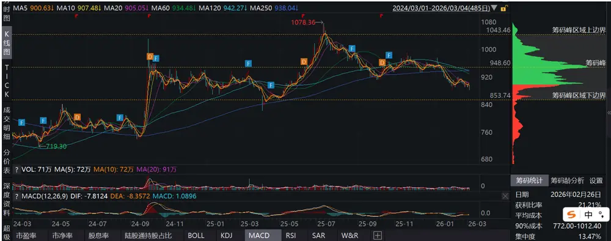

在之前的《基于资金流数据的筹码结构因子构建——投资者分层视角下的信息增量》报告中，我们已经探讨了筹码成本在资金流分类下，拆分成机构筹码成本和散户筹码成本

其中，筹码成本差值表现出了与传统因子相关性较低，且同时在多头具有良好选股效果的增量信息贡献

在此基础上，我们尝试围绕筹码分布，以筹码集中度为切入点，进一步讨论在资金流分类情况下，筹码分布可以在因子选股上的进一步贡献

图2：筹码结构因子框架
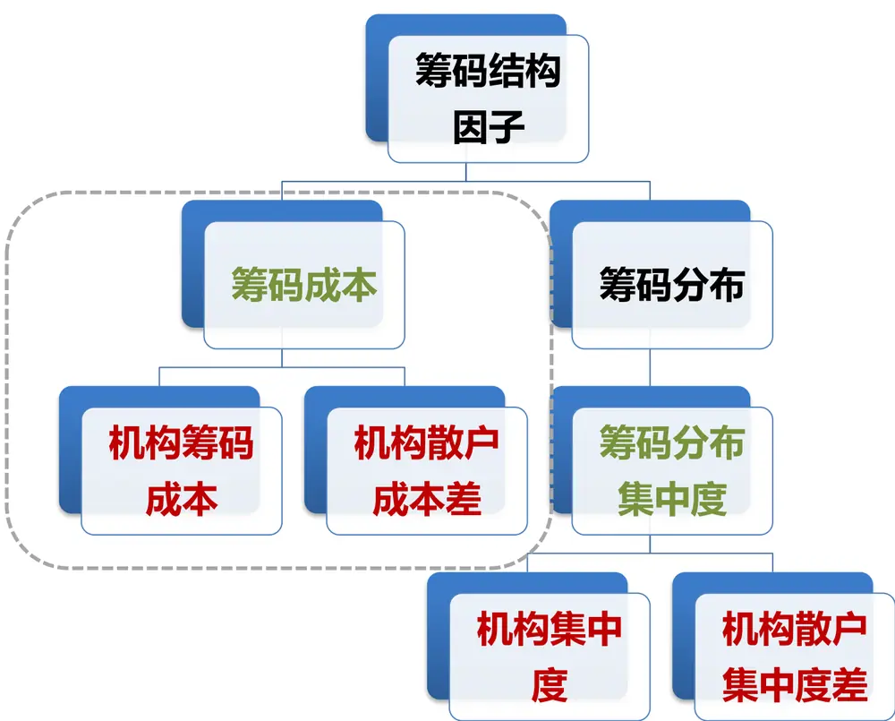
资料来源：Wind，申万宏源金工

- 我们通过三角分布的成交量分布假设，来模拟刻画筹码分布在每日间的变化更新。具体而言，在每日交易过程中：

- 对于新增进入市场的筹码，我们以当日的最高价、最低价、成交均价构建成交量的三角形分布，面积为当日的总成交量，视为新进入该股票的筹码规模以及对应的持仓成本，从而形成新的成本分布。

- 对于卖出的筹码，则采用另一种简化假设：假定全部历史筹码按照当日换手率进行均匀交易，即各价格区间的历史筹码按相同比例被动减少。

图3： 筹码分布更新示意图
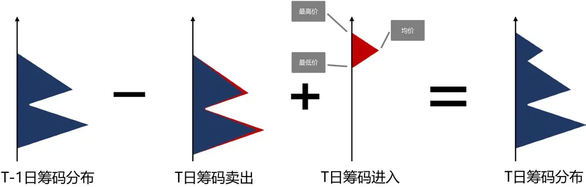

- 传统筹码构建方法主要基于整体成交量数据刻画市场筹码结构，但未区分不同类型投资者的交易行为。然而，机构与散户在交易规模、持仓周期及信息优势等方面均存在显著差异，仅基于总体成交数据可能会掩盖其中的重要行为信息。

- 在传统筹码框架基础上，我们进一步引入机构与散户资金流数据，对不同投资者类型分别构建对应的筹码分布指标，从而刻画不同投资者群体的历史持仓成本结构。从投资者结构角度补充传统筹码因子的刻画维度，有望挖掘其中潜在的增量资金信息，并为横截面选股提供更具区分度的参考指标。

图4： 示意图：散户机构筹码分布拆分
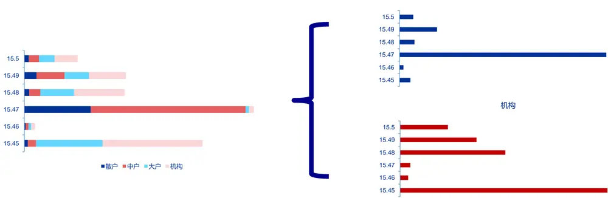

对机构和散户资金的定义：使用成交资金量间接区分投资者类别，以订单金额大小判断。算法中根据挂单金额来划分散户、中户、大户、机构。具体标准如下：

- 1）挂单额小于4万元，散户资金；

- 2）挂单额4万元到20万元之间，中户资金；

- 3）挂单额20万元至100万元之间，大户资金；

- 4）挂单额大于100万元，机构资金。

- 基于此分类，我们可以分别统计机构资金和散户资金的买入总量，进而构建各自的筹码分布。

- 在此前报告中，我们重点围绕筹码平均成本指标进行探讨。而相比于每天每只股票只有一个数据点的筹码成本，筹码分布图有更高维的数据量分布，也同样具有更多的增量信息。

- 与筹码成本的拆分类似，在成交量刻画的筹码分布基础上，亦可进一步拆解为：

- 机构筹码分布

- 散户筹码分布

图5： 筹码分布示意
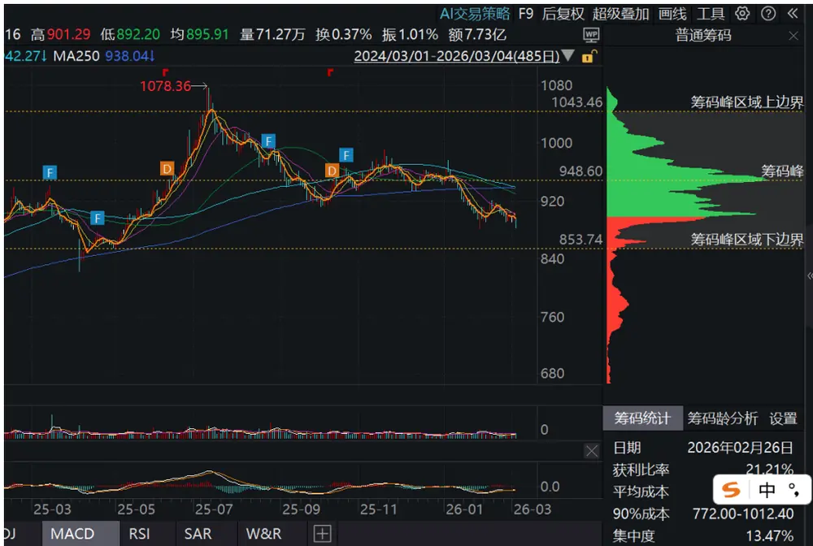

- 以机构筹码成本为例，其计算逻辑与传统筹码成本基本一致，区别在于以机构投资者买入总量替代总体成交量，用于刻画机构新增筹码的进入情况；而在卖出端，仍假设历史各价格区间筹码按照当日换手率进行均匀交易。

图6： 机构筹码分布构建的假设逻辑
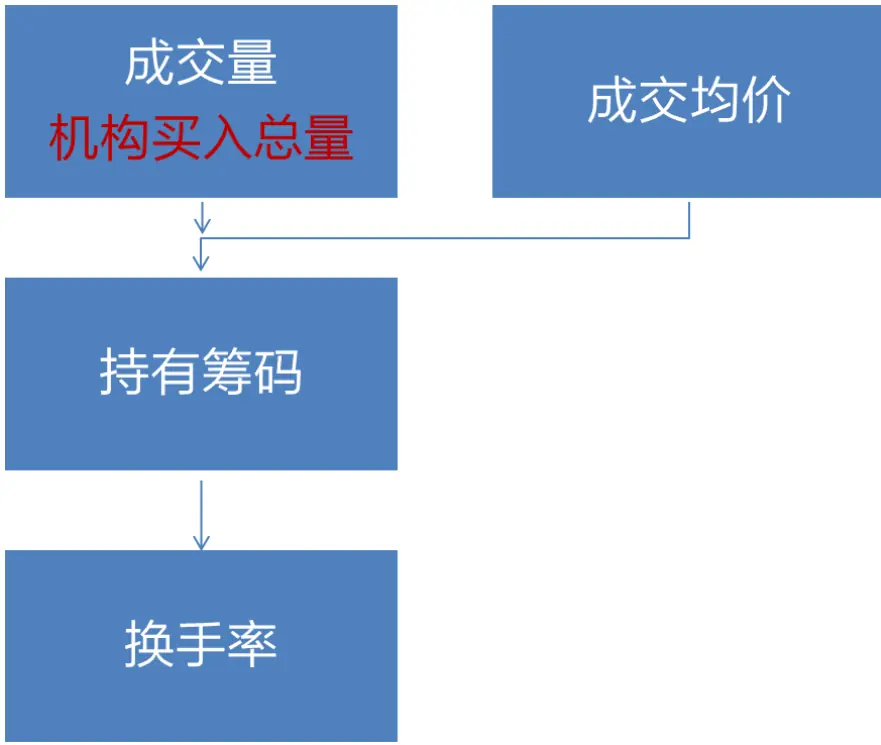

- 在对筹码分布进行刻画后，如何利用筹码分布构建有效的量化指标成为关键问题。我们初步采用最为直观的筹码分布指标——筹码分布集中度。

在集中度的刻画方式上，我们采用如下定义：

以筹码峰值的50%筹码所覆盖的价格区间，计算其占整个价格区间的比重。

- 一方面，这一方式比较符合投资者对筹码集中的直观感受，即筹码越集中则覆盖的价格区间越窄；

- 另一方面也不会受到多个峰的干扰，我们只讨论峰本身的集中情况。对于存在多个峰的筹码分布，各峰的集中度亦可统计后合并考量。

图7：筹码分布集中度刻画示意
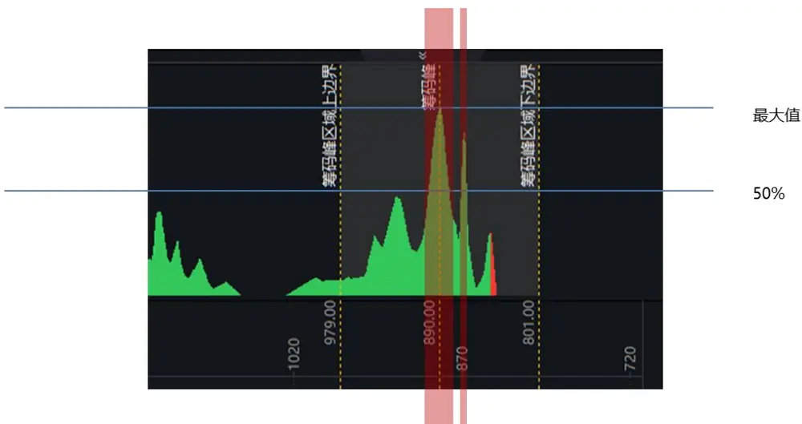

- 我们首先统计了全价格区间下的机构筹码集中度，结果出乎意料——集中度居然呈现正向特征。

- 集中度是一个占比概念，占比越低意味着筹码越集中。

- 按照这一逻辑，机构筹码越分散，未来股价表现反而越好，这与投资者的普遍认知相悖。

图8 ： Rank_IC
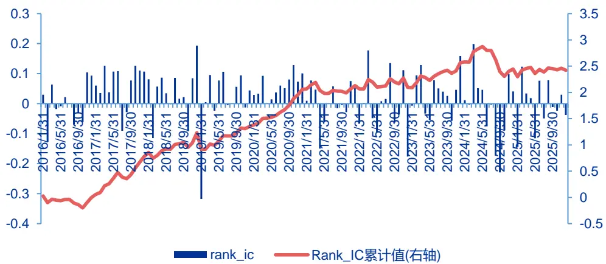

|  | factor |
| --- | --- |
| Rank_IC均值 | 2.02% |
| Rank_ICIR | 23.92% |
| IC>0占比 | 64.17% |
| Q1 | -3.53% |
| Q2 | -1.24% |
| Q3 | 0.23% |
| Q4 | 2.10% |
| Q5 | 2.45% |

表1：因子指标表现
资料来源：Wind，申万宏源研究

图9： 五分组累计收益
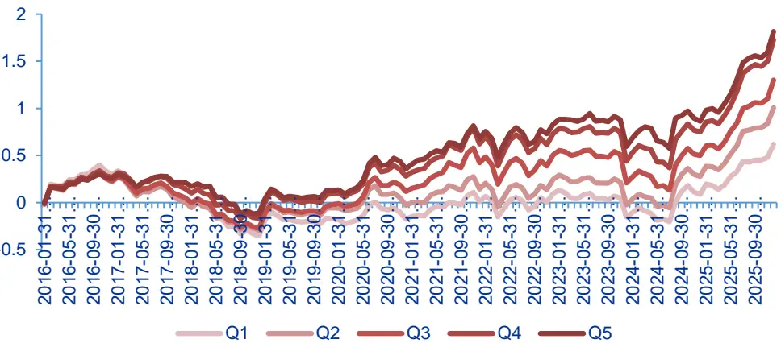

- 出现这一反常现象的根源在于，我们统计的是全价格区间的筹码分布集中度。当距离当前价格较远的位置存在筹码峰时，若当前价格附近又出现新的筹码峰，反而会拉低整体的集中度指标，导致结论与直觉背离。

- 举例而言，假设一只股票在历史高位形成了明显的筹码峰，但近期股价回调后在低位又形成了新的筹码峰，此时全价格区间内的筹码分布呈现双峰结构，整体集中度指标会因为覆盖区间变宽而降低，但当前价格附近的低位筹码峰实际上可能预示着较好的上涨潜力。

- 这种远峰对新峰的“稀释”效应，使得集中度指标无法真实反映当前价格附近的筹码聚集状态，从而产生了看似矛盾的统计结果。

- 实际上，距离当前价格较远的筹码峰对近期股价走势基本没有指导意义。更为合理的做法应当是只关注当前价格附近的筹码形态，剔除远端筹码的干扰，以更准确地刻画机构筹码分布对股价的真实影响。

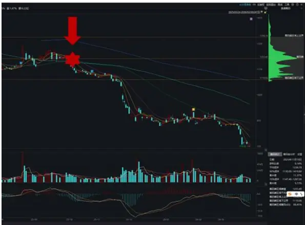

图10： 示意图：新筹码的形成会稀释筹码的集中度
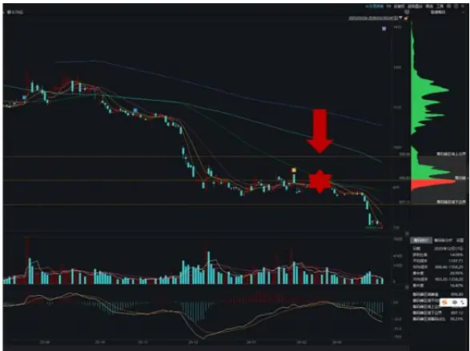

## 基于上述分析，我们将统计范围重新限定于最新价±10%的价格区间内的机构筹码集中度。

- 调整后的指标呈现出明显的负向IC特征，即机构筹码越集中（占比越低），未来股价表现越好，这与投资者的直观认知和实际投资逻辑高度吻合，验证了我们改进思路的有效性。

图11 ： Rank_IC
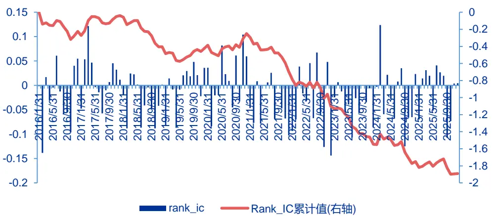

表2：因子指标表现

|  | factor |
| --- | --- |
| Rank_IC均值 | -1.58% |
| Rank_ICIR | -29.11% |
| IC>0占比 | 43.33% |
| Q1 | 0.22% |
| Q2 | 1.08% |
| Q3 | 0.38% |
| Q4 | -0.10% |
| Q5 | -1.59% |

资料来源：Wind，申万宏源研究

图12： 五分组累计收益
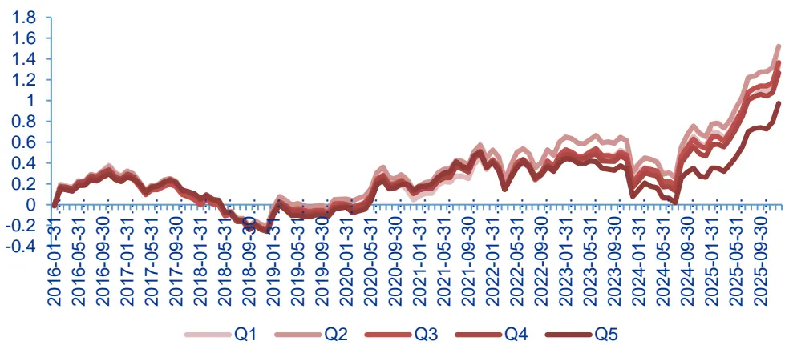

那么，是否可以综合考虑上述两种机构筹码集中度的刻画方式呢？我们尝试按因子方向进行正交化后的等权合成：• 最新价±10%范围内的机构筹码集中度

- 全价格区间下的机构筹码集中度

- 这一指标的构建逻辑在于，我们希望机构筹码在当前价格附近尽可能集中，体现其对近期股价的支撑或推动作用；而在全价格区间范围内则相对分散。

- 该合成因子表现出更优的IC和分组表现，尤其在IC积累的稳定性上相比单一指标有了明显改进。

图13 ： Rank_IC
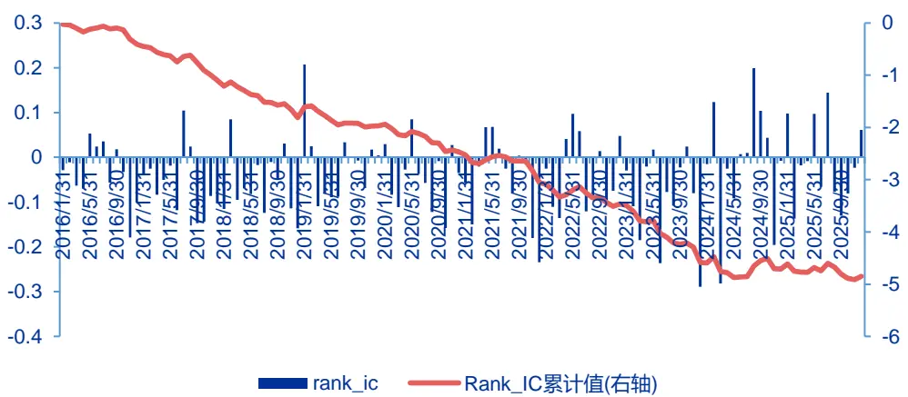

表3：因子指标表现

|  | factor |
| --- | --- |
| Rank_IC均值 | -4.04% |
| Rank_ICIR | -45.49% |
| IC>0占比 | 31.67% |
| Q1 | 3.65% |
| Q2 | 1.80% |
| Q3 | 0.35% |
| Q4 | -0.87% |
| Q5 | -4.93% |

资料来源：Wind，申万宏源研究

图14： 五分组累计收益
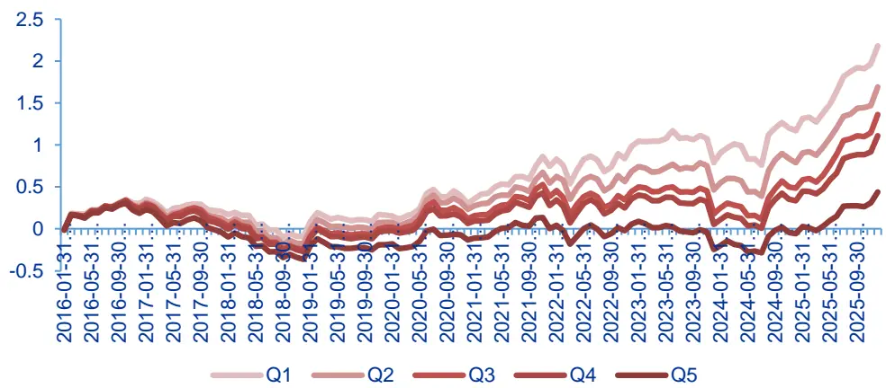

- 除此以外，我们仿照此前机构与散户筹码成本差值的因子构建方式，对机构与散户的筹码集中度进行了差值合成的比较。即：

- 在最新价±10%的价格范围内，用机构筹码集中度减去散户筹码集中度，构建相应的合成指标。

- 指标的单调性表现尚可，呈现负向IC特征，即机构筹码越集中、散户筹码越分散时，未来股价表现越好，这一方向与投资逻辑基本吻合。不过，该因子的IC表现相对较弱，在预测能力上仍有提升空间。

图15 ： Rank_IC
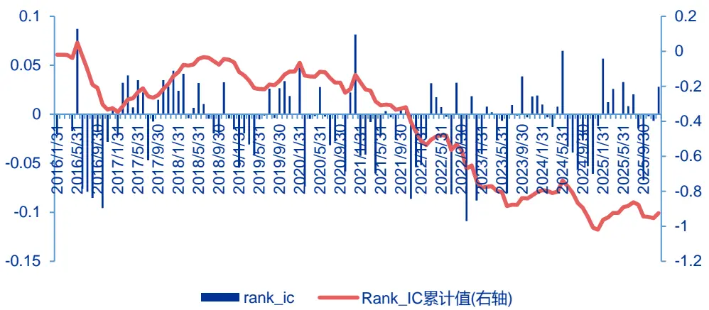

表4：因子指标表现

|  | factor |
| --- | --- |
| Rank_IC均值 | -0.77% |
| Rank_ICIR | -20.40% |
| IC>0占比 | 42.50% |
| Q1 | 1.73% |
| Q2 | 0.48% |
| Q3 | -1.63% |
| Q4 | -0.07% |
| Q5 | -0.51% |

资料来源：Wind，申万宏源研究

图16： 五分组累计收益
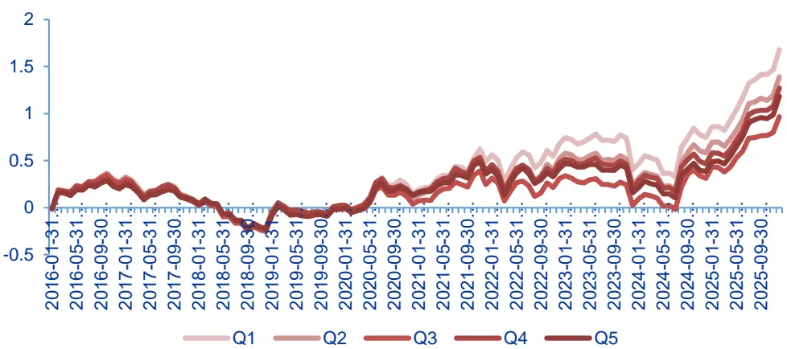

## 此前在上一篇报告中刻画的筹码成本类指标，整体与反转因子的相关性更高。

- 筹码成本指标的因子逻辑本身与反转因子较为类似，通过统计投资者浮盈浮亏的深度，认为浮盈较多的情况下更有可能获利了结，从而形成下行压力，而浮亏较多的情况下，也更有可能会出现未来行情的反转。

表5：因子相关性

| 机构成本-散户成本 买入总量-机构 传统筹码成本 Analyst |  |  |  |  | Dividend | Growth Liquidity Momentum |  |  | Profitable | Reverse | Size Value |  | Volatility |
| --- | --- | --- | --- | --- | --- | --- | --- | --- | --- | --- | --- | --- | --- |
| 机构成本-散户成本 | 1.00 | 0.46 0.33 |  | -0.02 | -0.01 | -0.04 | -0.04 | -0.10 | -0.05 | -0.11 | -0.08 -0.06 |  | -0.03 |
| 买入总量-机构 | 0.46 | 1.00 0.98 |  | -0.10 | -0.03 | -0.16 | 0.00 | -0.26 | -0.10 | -0.60 | -0.16 | -0.01 | -0.26 |
| 传统筹码成本 | 0.33 | 0.98 1.00 |  | -0.10 | -0.04 | -0.17 | 0.01 | -0.26 | -0.10 | -0.62 | -0.15 | 0.00 | -0.26 |
| Analyst | -0.02 | -0.10 -0.10 |  | 1.00 | -0.04 | 0.00 | 0.05 | 0.00 | 0.00 | 0.07 | 0.00 | 0.05 | 0.07 |
| Dividend | -0.01 | -0.03 -0.04 |  | -0.04 | 1.00 | -0.11 | -0.02 | 0.06 | 0.20 | 0.03 | 0.01 | -0.01 | 0.00 |
| Growth | -0.04 | -0.16 -0.17 |  | 0.00 | -0.11 | 1.00 | 0.04 | 0.00 | -0.01 | 0.11 | 0.00 | 0.00 | 0.07 |
| Liquidity | -0.04 | 0.00 0.01 |  | 0.05 | -0.02 | 0.04 | 1.00 | -0.25 | -0.02 | 0.03 | -0.05 | -0.03 | 0.00 |
| Momentum | -0.10 | -0.26 -0.26 |  | 0.00 | 0.06 | 0.00 | -0.25 | 1.00 | 0.02 | 0.15 | 0.00 | 0.10 | -0.04 |
| Profitable | -0.05 | -0.10 -0.10 |  | 0.00 | 0.20 | -0.01 | -0.02 | 0.02 | 1.00 | 0.07 | 0.00 | 0.10 | -0.03 |
| Reverse | -0.11 | -0.60 | -0.62 | 0.07 | 0.03 | 0.11 | 0.03 | 0.15 | 0.07 | 1.00 | -0.01 | 0.02 | 0.01 |
| Size | -0.08 | -0.16 -0.15 |  | 0.00 | 0.01 | 0.00 | -0.05 | 0.00 | 0.00 | -0.01 | 1.00 | 0.00 | 0.04 |
| Value | -0.06 | -0.01 0.00 |  | 0.05 | -0.01 | 0.00 | -0.03 | 0.10 | 0.10 | 0.02 | 0.00 | 1.00 | 0.00 |
| Volatility | -0.03 | -0.26 -0.26 |  | 0.07 | 0.00 | 0.07 | 0.00 | -0.04 | -0.03 | 0.01 | 0.04 | 0.00 | 1.00 |

资料来源：Wind，申万宏源研究

- 而在本篇报告中，我们将分析视角从筹码的“成本重心”拓展至筹码的“分布形态”，重点刻画基于投资者分层的筹码集中度指标，总体体现出更明显的低相关风格，因子信息增量相对较高

- 与成本类指标不同，集中度指标的核心并不在于投资者盈亏状态，而在于筹码在不同价格区间的聚集程度。从因子相关性的角度来看，筹码集中度指标与传统风格因子（如价值、动量、波动率等）之间的相关性整体较低，表现出较强的“低相关”特征。

- 这意味着，集中度指标所捕捉到的定价信息，在很大程度上独立于现有主流因子体系，具有较高的信息增量，能够为多因子模型提供新的、非冗余的 alpha 来源。

表6：因子相关性
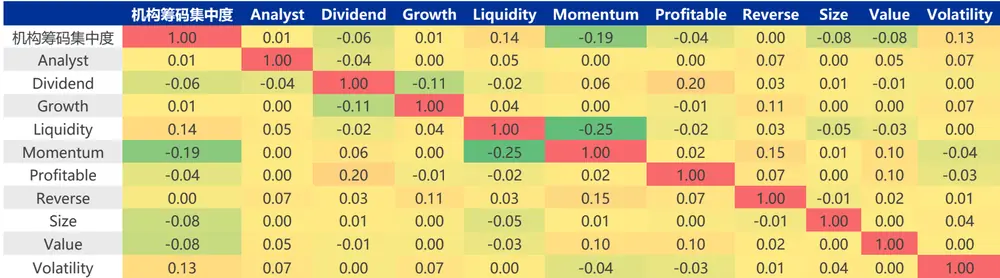
资料来源：申万宏源研究

- 此外，我们也进一步对机构筹码集中度因子进行了市值分域测试。从结果来看，因子在各市值分域下均有相对不错的股票筛选效果，虽然略微偏向中小盘一些，但在大市值情况下也有不错的表现。

表7：因子比较

| 全市场 沪深300 |  |  | 中证500 | 中证1000 | Ex中证800 |
| --- | --- | --- | --- | --- | --- |
| Rank_IC均值 -4.04% |  | -3.61% | -4.21% | -3.94% -4.04% |  |
| Rank_ICIR | -45.49% | -23.12% | -36.08% | -41.34% | -49.87% |
| IC>0占比 | 31.67% | 40.83% | 30.83% | 31.67% | 25.83% |
| Q1 | 12.29% | 9.20% | 9.71% | 8.39% | 12.90% |
| Q2 | 10.43% | 5.44% | 8.47% | 6.94% | 10.64% |
| Q3 | 8.99% | 6.60% | 6.48% | 4.89% | 9.31% |
| Q4 | 7.77% | 3.86% | 6.48% | 3.71% | 8.16% |
| Q5 | 3.71% | 4.20% | 1.88% | 0.76% | 3.57% |

资料来源：Wind，申万宏源研究

图17： Rank_IC-自上而下分别为：
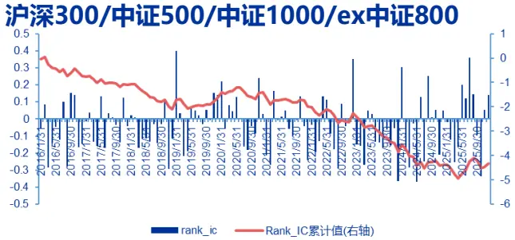

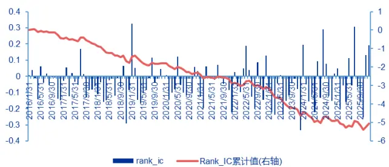

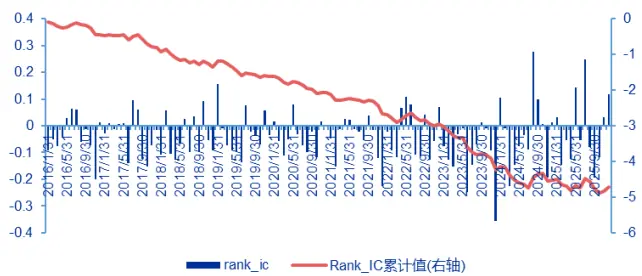

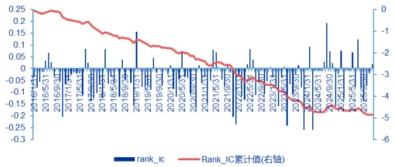

- 全市场范围内，基于合成因子构建的多头组合（即选取因子值最高的前20%股票）整体展现出持续稳定的超额收益表现。

- 除了筹码分布以外，我们对上一篇报告的筹码成本指标也做了额外的补充测算，希望在改进和更换筹码构建假设的基础上，可以带来进一步的增量信息

图18：多头超额比较-合成因子
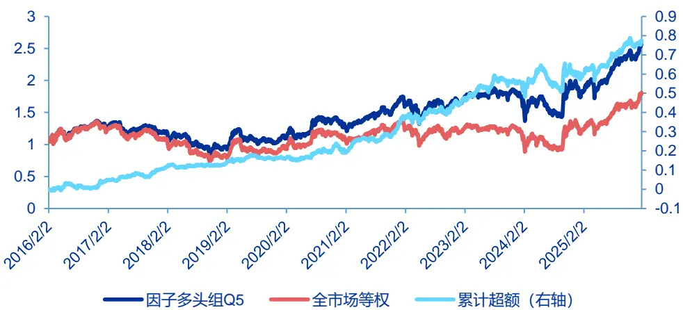

- 基于筹码分布，可以计算历史筹码的加权平均成本，以刻画当前市场存量筹码的平均持仓成本水平。

$$
Holding_{-}Price=\frac{\sum{Average\_Price_{t}*Chip_{t}^{T}}}{\sum{Chip_{t}^{T}}}
$$

- 在此基础上，将该成本与最新收盘价进行对比，可衡量当前市场整体持仓的浮盈或浮亏状态。

- 当指标数值较高时，说明历史筹码平均成本高于当前股价，市场整体处于浮亏状态；

- 反之，当指标数值较低时，则表明当前股价高于历史平均成本，投资者整体处于浮盈状态。

$$
Holding_{-}Cost_{t}=\frac{Holding_{-}Price_{t}-Close_{-}Price_{t}}{Close_{-}Price_{t}}
$$

- 除了对机构/散户买入总量的使用，通过同时考虑买入和卖出量，计算量差以衡量机构/散户的净买入量，可以在此前筹码成本的刻画方式上更进一步。

图19： 机构筹码成本刻画的假设的替换
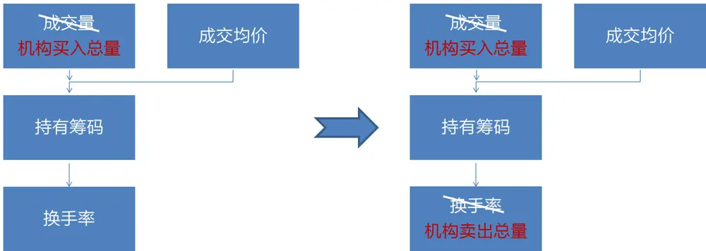

- 除了对机构/散户买入总量的使用，通过同时考虑买入和卖出量，计算量差以衡量机构/散户的净买入量，可以在此前筹码成本的刻画方式上更进一步。

- 现在我们只关心每天净进入市场的筹码，同样以当日成交均价作为对应的持仓成本。

- 由于通过卖出量考虑了筹码退出的情况，因此现在不需要换手率的假设来模拟历史筹码的退出。

- 由于净进入的筹码可能是负数、导致持仓成本计算为负，这里统一将量差增加一个较大值来将量差统一调整为非负数。我们只需要刻画筹码加权的平均成本情况，统一增减量差产生的筹码整体增减不会影响筹码平均成本的刻画。

- 以调整量差后的机构筹码成本为例，采用量差替代买入总量后，指标的IC从原本机构筹码成本的4.36%进一步上升到5.14%，选股效果总体进一步提升。低相关性+高IC的筹码成本刻画方式也会选股因子的综合使用带来额外的增量信息。

表8：因子相关性
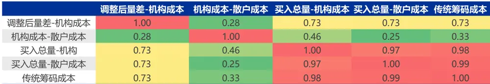
资料来源：Wind，申万宏源研究

图20： Rank_IC-量差机构筹码成本
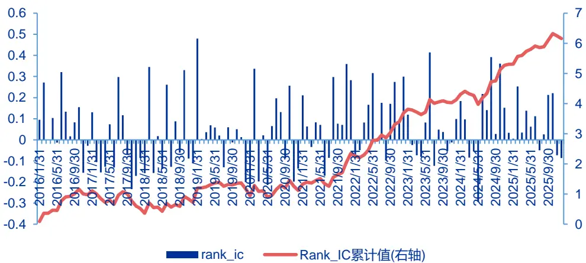

- 以量差替代买入总量来刻画筹码成本的另一个优势在于与传统筹码成本的低相关性。

- 以买入总量+换手率衰减的方式衡量筹码成本，本质与传统筹码成本的成交量+换手率衰减没有大的差异，相关性总体较高。

- 量差在划分机构/散户投资者画像的同时，综合考虑了筹码的进入和退出，刻画的筹码成本与传统方式刻画的筹码成本相关性相对更低。

- 低相关性+高IC的筹码成本刻画方式也会选股因子的综合使用带来额外的增量信息。

图21： 五分组超额分布
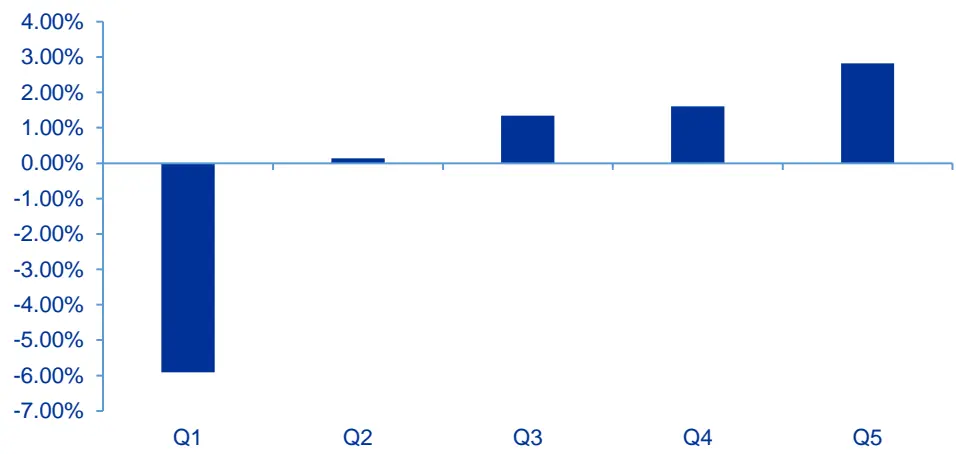

表9：因子比较

|  |  | 成交量筹码成本 机构买入总量筹码成本 机构散户筹码成本差 |  |  | 合成筹码因子 三因子合成筹码因子 |
| --- | --- | --- | --- | --- | --- |
| Rank_IC均值 | 4.31% | 4.36% | 1.58% | 4.35% | 4.41% |
| Rank_ICIR | 28.22% | 28.78% | 16.70% | 29.12% | 31.20% |
| IC>0占比 | 59.17% | 60.83% | 55.00% | 60.83% | 61.67% |
| Q1 | -5.43% | -5.48% | -3.64% | -5.45% | -5.91% |
| Q2 | 0.62% | 0.46% | -1.67% | 0.48% | 0.14% |
| Q3 | 2.06% | 1.63% | 0.72% | 1.30% | 1.34% |
| Q4 | 1.44% | 1.65% | 1.25% | 1.57% | 1.61% |
| Q5 | 1.33% | 1.73% | 3.36% | 2.08% | 2.83% |

资料来源：Wind，申万宏源研究

- 围绕筹码成本构建的三因子合成因子，在IC表现及多头选股效果上均已取得较为理想的实证结果。

- 为进一步提升筹码结构因子的整体选股效果，我们尝试将本篇报告重点讨论的筹码集中度指标也纳入该合成体系。通过引入筹码分布的集中度信息，旨在从“成本”与“形态”两个维度共同刻画筹码结构，从而丰富合成因子的信息维度，提供更为稳健的Alpha来源。

图22：筹码结构因子合成
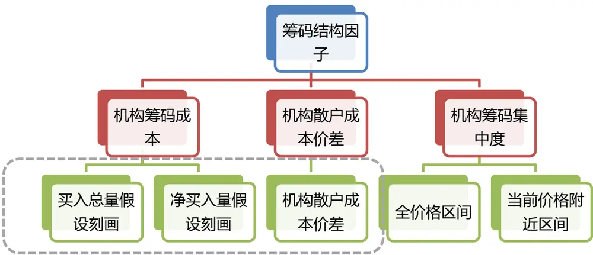

- 在将机构筹码集中度指标纳入合成框架并进行正交化处理之后，筹码结构合成因子的整体表现有了进一步提升。

- 具体而言，因子的IC水平与分组收益表现均显著改善，IC积累曲线的稳定性也出现小幅提升。

- 然而，由于筹码成本类指标本身与反转因子存在较高的相关性，合成因子整体仍然呈现出较为明显的5分组超额收益反转特征。

- 从分组表现来看，空头端与多头端的收益分离效果较为理想，但多头组的单调性表现一般，即因子在识别强势股票方面的区分能力仍有提升空间。

图23： 五分组超额分布
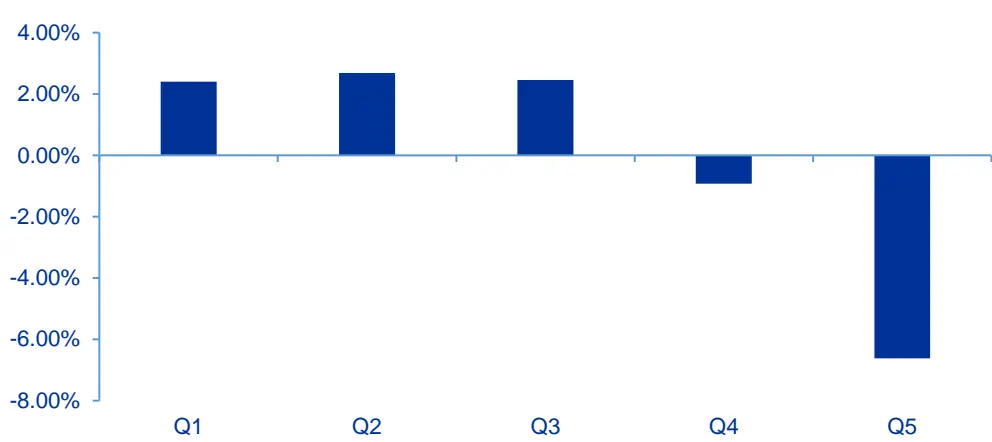

表10：因子指标表现

|  | factor |
| --- | --- |
| Rank_IC均值 | -5.73% |
| Rank_ICIR | -53.32% |
| IC>0占比 | 25.00% |
| Q1 | 2.40% |
| Q2 | 2.68% |
| Q3 | 2.46% |
| Q4 | -0.92% |
| Q5 | -6.63% |

资料来源：Wind，申万宏源研究

图24： Rank_IC
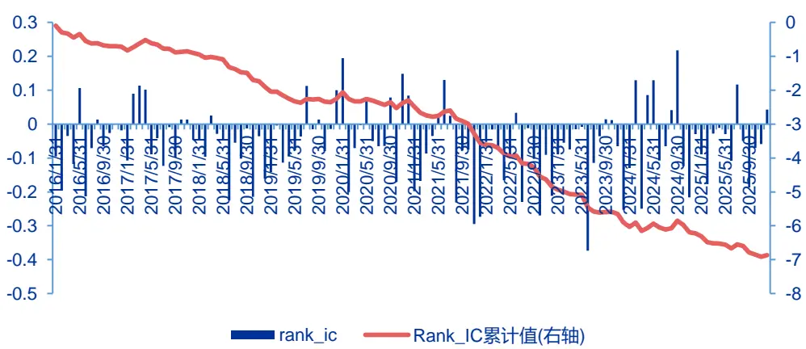

## 3.8 将筹码成本与反转因子进行正交剥离之后，进一步观测效果

## 为进一步剥离反转风格对因子表现的影响，我们尝试剥离其中的反转风格

- 我们将合成因子对反转因子进行回归，取残差作为剔除反转信息后的"纯净"因子。

- 经过反转正交处理后，合成因子的IC水平小幅下降，但依然保持在较为理想的水平。

- 此外，因子的长期IC积累稳定性依然良好，且分组收益的单调性以及多头端的选股表现均获得了进一步的改善与提升。反转因子在一定程度上干扰了原始合成因子的选股结构，而正交化处理能够有效剥离这部分干扰，使因子更纯粹地反映筹码结构本身所蕴含的定价信息。

图25： 五分组超额分布
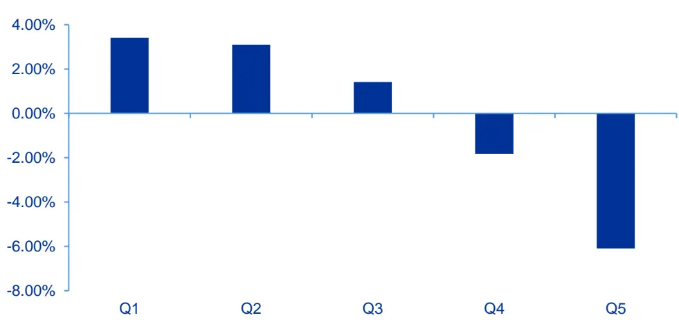

表11：因子指标表现

|  | factor |
| --- | --- |
| Rank_IC均值 | -5.12% |
| Rank_ICIR | -53.08% |
| IC>0占比 | 23.33% |
| Q1 | 3.41% |
| Q2 | 3.10% |
| Q3 | 1.42% |
| Q4 | -1.83% |
| Q5 | -6.10% |

资料来源：Wind，申万宏源研究

图26： Rank_IC
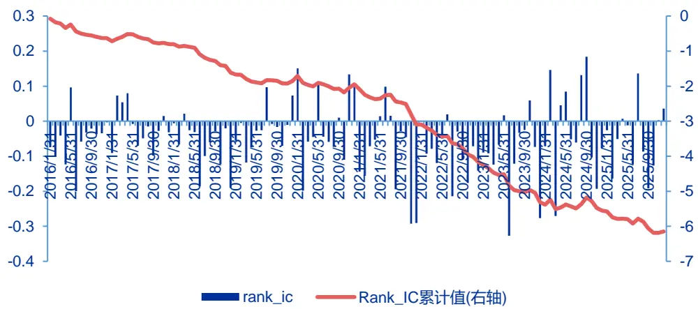

- 本报告结果基于历史数据测算，未来市场结构可能发生变化，带来策略的不稳定；报告中筛选预期分红增长股票利用到分析师预期数据，当预期数据出现系统偏误的时候，可能带来组合阶段性表现较弱。

## 证券分析师承诺

本报告署名分析师具有中国证券业协会授予的证券投资咨询执业资格并注册为证券分析师，以勤勉的职业态度、专业审慎的研究方法，使用合法合规的信息，独立、客观地出具本报告,并对本报告的内容和观点负责。本人不曾因，不因，也将不会因本报告中的具体推荐意见或观点而直接或间接收到任何形式的补偿。

## 与公司有关的信息披露

本公司隶属于申万宏源证券有限公司。本公司经中国证券监督管理委员会核准，取得证券投资咨询业务许可。本公司关联机构在法律许可情况下可能持有或交易本报告提到的投资标的，还可能为或争取为这些标的提供投资银行服务。本公司在知晓范围内依法合规地履行披露义务。客户可通过compliance@swsresearch.com索取有关披露资料或登录www.swsresearch.com信息披露栏目查询从业人员资质情况、静默期安排及其他有关的信息披露。

## 机构销售团队联系人

华东团队

华北团队

茅炯

021-33388488

肖霞

华南团队

maojiong@swhysc.com

15724767486

王维宇

华北创新团队

xiaoxia@swhysc.com

0755-82990590

潘烨明

15201910123

wangweiyu@swhysc.com

华东创新团队

朱晓艺

panyeming@swhysc.com

18702179817

zhuxiaoyi@swhysc.com

## A股投资评级说明

证券的投资评级：

以报告日后的6个月内，证券相对于市场基准指数的涨跌幅为标准，定义如下：

买入（Buy）：相对强于市场表现20％以上；

增持（Outperform）：相对强于市场表现5％～20％；

中性(Neutral)：相对市场表现在－5％～＋5％之间波动；

减持(Underperform)

：相对弱于市场表现5％以下。

行业的投资评级：

以报告日后的6个月内，行业相对于市场基准指数的涨跌幅为标准，定义如下：

看好（Overweight）：行业超越整体市场表现；

中性(Neutral)：行业与整体市场表现基本持平；

看淡(Underweight)：行业弱于整体市场表现。

本报告采用的基准指数：沪深300指数

## 港股投资评级说明

证券的投资评级：

以报告日后的6个月内，证券相对于市场基准指数的涨跌幅为标准，定义如下：

买入（BUY）：：股价预计将上涨20%以上；

增持（Outperform）：股价预计将上涨10-20%；

持有（Hold）：股价变动幅度预计在-10%和+10%之间；

减持（Underperform）：股价预计将下跌10-20%；

卖出（SELL）：股价预计将下跌20%以上。

行业的投资评级：

以报告日后的6个月内，行业相对于市场基准指数的涨跌幅为标准，定义如下：

看好（Overweight）：行业超越整体市场表现；

中性(Neutral)：行业与整体市场表现基本持平；

看淡（Underweight）：行业弱于整体市场表现。

本报告采用的基准指数：恒生中国企业指数（HSCEI）

我们在此提醒您，不同证券研究机构采用不同的评级术语及评级标准。我们采用的是相对评级体系，表示投资的相对比重建议；投资者买入或者卖出证券的决定取决于个人的实际情况，比如当前的持仓结构以及其他需要考虑的因素。投资者应阅读整篇报告，以获取比较完整的观点与信息，不应仅仅依靠投资评级来推断结论。申银万国使用自己的行业分类体系，如果您对我们的行业分类有兴趣，可以向我们的销售员索取。

## 法律声明

本报告由上海申银万国证券研究所有限公司（隶属于申万宏源证券有限公司，以下简称“本公司”）在中华人民共和国内地（香港、澳门、台湾除外）发布，仅供本公司的客户（包括合格的境外机构投资者等合法合规的客户）使用。本公司不会因接收人收到本报告而视其为客户。有关本报告的短信提示、电话推荐等只是研究观点的简要沟通，需以本公司http://www.swsresearch.com网站刊载的完整报告为准，本公司并接受客户的后续问询。本报告首页列示的联系人，除非另有说明，仅作为本公司就本报告与客户的联络人，承担联络工作，不从事任何证券投资咨询服务业务。

本报告是基于已公开信息撰写，但本公司不保证该等信息的准确性或完整性。本报告所载的资料、工具、意见及推测只提供给客户作参考之用，并非作为或被视为出售或购买证券或其他投资标的的邀请或向人作出邀请。本报告所载的资料、意见及推测仅反映本公司于发布本报告当日的判断，本报告所指的证券或投资标的的价格、价值及投资收入可能会波动。在不同时期，本公司可发出与本报告所载资料、意见及推测不一致的报告。

客户应当考虑到本公司可能存在可能影响本报告客观性的利益冲突，不应视本报告为作出投资决策的惟一因素。客户应自主作出投资决策并自行承担投资风险。本公司特别提示,本公司不会与任何客户以任何形式分享证券投资收益或分担证券投资损失，任何形式的分享证券投资收益或者分担证券投资损失的书面或口头承诺均为无效。本报告中所指的投资及服务可能不适合个别客户，不构成客户私人咨询建议。本公司未确保本报告充分考虑到个别客户特殊的投资目标、财务状况或需要。本公司建议客户应考虑本报告的任何意见或建议是否符合其特定状况，以及（若有必要）咨询独立投资顾问。在任何情况下，本报告中的信息或所表述的意见并不构成对任何人的投资建议。在任何情况下，本公司不对任何人因使用本报告中的任何内容所引致的任何损失负任何责任。市场有风险，投资需谨慎。若本报告的接收人非本公司的客户，应在基于本报告作出任何投资决定或就本报告要求任何解释前咨询独立投资顾问。

本报告的版权归本公司所有，属于非公开资料。本公司对本报告保留一切权利。除非另有书面显示，否则本报告中的所有材料的版权均属本公司。未经本公司事先书面授权，本报告的任何部分均不得以任何方式制作任何形式的拷贝、复印件或复制品，或再次分发给任何其他人，或以任何侵犯本公司版权的其他方式使用。所有本报告中使用的商标、服务标记及标记均为本公司的商标、服务标记及标记，未获本公司同意，任何人均无权在任何情况下使用他们。

申万宏源研究微信订阅号

简单金融·成就梦想

AVirtueofSimpleFinance

上海申银万国证券研究所有限公司(隶属于申万宏源证券有限公司）

方思齐 fangsq@swsresearch.com