# 基于筹码分层结构的端到端 AI因子

华泰研究

2026 年 6 月 02 日│中国内地

深度研究

## 人工智能 105：基于筹码分层结构的端到端 AI 因子

筹码分布反映市场参与者在不同成本区间上的存量持仓结构，是刻画投资者盈亏状态、交易摩擦和行为博弈的重要量价特征。本文从筹码龄和投资者类型两个维度构建筹码分层结构，并使用 AI 模型对其进行端到端建模。实验结果显示，筹码分层结构中蕴含较强的非线性 Alpha 信息，其中筹码龄分层因子表现最优，2016-12-30 至 2026-05-29 的回测区间内，单因子 RankIC达 12.3%，多头组年化超额 32.5%。进一步将筹码结构因子与基准 AI 因子合成构建中证 1000 指数增强组合，相同回测区间内年化超额收益 21.2%，信息比率 3.53，两项指标相比基准因子分别提升 2.2 pct、0.24。

## 实验方法：基于 CNN+GRU对筹码分层结构进行端到端建模

本文尝试利用 AI 模型对筹码分布的精细结构进行端到端建模，其中：（1）特征端：基于 VWAP 中心三角分布换手递推法估算筹码整体分布，并进一步根据筹码留存时间、筹码交易订单大小拆解筹码分布中的筹码龄分层和投资者类型分层结构特征。（2）模型端：将筹码分布映射至相对当前股价的价格轴，利用 CNN+GRU 模型进行端到端建模，其中 CNN 用于提取单日筹码分布的价格形态特征，GRU 用于刻画筹码结构在时间维度上的动态变化。

## 实验结果：端到端因子多头表现较优，相比人工构造特征有增量

实验结果显示：（1）筹码龄分层端到端因子表现优于投资者类型分层因子，前者多头组收益高于日 K线、周 K线等传统 AI 量价模型，且相关性较低。（2）对比筹码龄分层端到端因子与人工构造筹码特征因子，前者 IC 指标及多头超额均更优。（3）消融实验结果显示，剥离筹码龄分层信息或弱化价格分布形态后，因子表现均明显下降，表明筹码分层结构特征与价格形态特征均是端到端建模的有效信息来源。

## 指增组合测试：筹码结构合成因子整体优于基准 AI 因子

将筹码结构因子加入基准 AI 合成因子，并构建指数增强组合进行测试，结果表明，在 2016-12-30 至 2026-05-29 的回测区间内，加入筹码结构的合成因子 RankIC 约 14.0%，相比基准因子多头超额提升约 2.1 pct。同回测区间内，沪深 300、中证 500 和中证 1000 指数增强组合的年化超额收益均有所改善，其中中证 1000 组合年化超额由 19.0%提升至 21.2%，信息比由3.29 提升至 3.53，超额最大回撤由 8.5%下降至 7.7%。

风险提示：人工智能挖掘市场规律是对历史的总结，市场规律在未来可能失效。深度学习模型受随机数影响较大。本文回测假定以 VWAP 价格成交，未考虑其他影响交易因素。

何康，PhD

SAC No. S0570520080004

研究员

SFC No. BRB318

hekang@htsc.com

+(86) 21 2897 2202

浦彦恒*

SAC No. S0570124070069

联系人

puyanheng@htsc.com

+(86) 21 2897 2228

## 筹码分布与分层结构

筹码分布是对股票历史成交成本结构的刻画，通常基于成交价格、成交量与换手率等信息，估计当前流通筹码在不同价格区间上的分布状态。与传统量价指标更多关注价格和成交的边际变化不同，筹码分布侧重描述存量持仓的成本位置与结构特征，能够反映市场参与者整体处于浮盈还是浮亏状态，以及不同价格区间潜在的支撑、压力和交易阻力。从投资者行为角度看，盈利筹码可能带来止盈抛压，亏损筹码可能形成惜售或解套压力，筹码结构因此成为理解短期供需变化、交易摩擦和市场博弈状态的重要特征之一。

为细致地刻画筹码结构中蕴含的异质性信息，本研究进一步从两种视角拆解筹码分布的分层结构：其一为按照筹码龄进行分层，将不同历史时期形成并留存至今的筹码加以区分，以刻画新近筹码与长期沉淀筹码在成本结构和交易稳定性上的差异；其二为按照投资者类型分层，通过成交订单金额大小识别散户、中户、大户和机构投资者对应的筹码分布，从资金属性角度描述不同类型投资者的持仓成本和交易行为差异。

图表1： 筹码分层结构示意
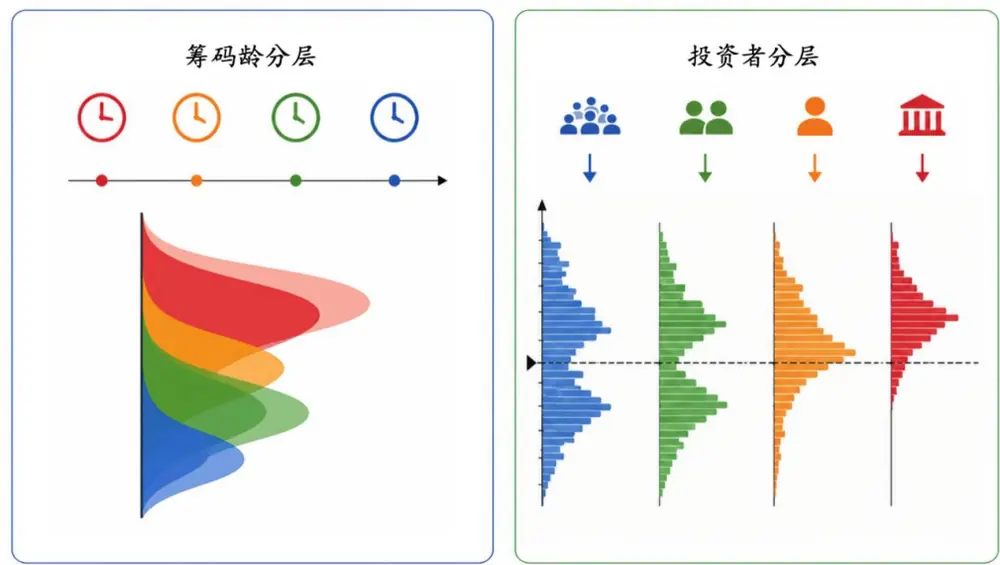
资料来源：OpenAI，华泰研究

本研究尝试从筹码分层结构出发，利用 AI 模型对其中的高维结构和非线性关系进行端到端建模，使模型能够从高维、非线性的筹码特征中挖掘潜在的 Alpha 信号。回测结果显示，筹码分层结构因子与传统 AI 量价端到端因子组合后可较为显著提升业绩。

图表2： 中证 1000指数增强组合业绩对比

| 因子 | 年化收益率 | 年化波动率 | 夏普比率 | 最大回撤 | 年化超额 | 年化跟踪 | 信息比率 | 超额收益 | 超额收益 | 超额收益 | 年化双边 |  |
| --- | --- | --- | --- | --- | --- | --- | --- | --- | --- | --- | --- | --- |
|  |  |  |  |  |  |  |  |  |  |  |  | 误差 |
| 基准 AI 因子 | 18.9% | 24.0% | 0.79 | 35.1% | 收益率 19.0% | 5.8% | 3.29 | 最大回撤 8.5% | 卡玛比率 2.24 | 月度胜率 79.6% | 换手率 20.50 |  |
| 基准 AI 因子+ |  |  |  |  |  |  |  |  |  |  |  |  |
| 筹码结构因子 | 21.2% | 23.8% | 0.89 | 33.7% | 21.2% | 6.0% | 3.53 | 7.7% | 2.75 | 79.6% | 20.40 |  |

注：回测区间 2016-12-30 至 2026-05-29，交易费率双边千三，5 日调仓，考虑停牌等不可交易情况，换手率单位为倍。资料来源：Wind，华泰研究

图表3： 中证 1000指数增强组合超额收益净值及回撤对比
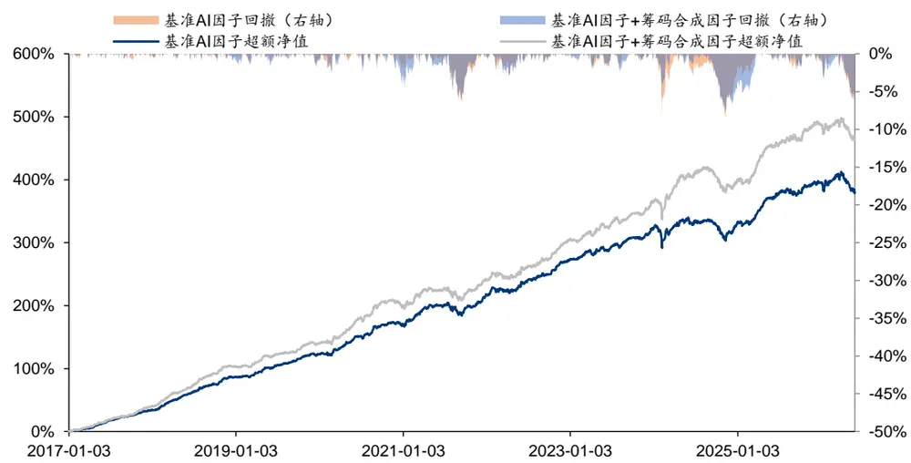
注：回测区间 2016-12-30 至 2026-05-29，交易费率双边千三，5 日调仓，考虑停牌等不可交易情况。资料来源：Wind，华泰研究

## 实验方法

## 筹码分层结构估计

本文基于 VWAP中心三角分布的换手递推方法估计个股每日的筹码分布。具体计算方式为：设 $C_{t-1}(p)$ 为上一交易日价格 p 处的存量筹码分布， $D_{t}(p)$ 为当日新增筹码在价格区间上的分布， $\tau_{t}$ 为当日换手率，则总筹码分布递推为：

$$
C_{t}(p)=(1-\tau_{t})\times C_{t-1}(p)+\tau_{t}\times D_{t}(p)
$$

其中， $D_{t}(p)$ 使用当日价格区间和 VWAP 价格构造，近似刻画当日新增成交在不同成本位置上的分布。递推完成后对筹码质量进行归一化，使各价格区间筹码占比之和为 1。在总筹码分布基础上，本文进一步构建两类筹码分层结构。

## 筹码龄分层结构估计

其一为按照筹码龄分层，即按照筹码形成并留存至今的时间长短进行划分。具体的估计方法为：设 $A_{t}(a,p)$ 为交易日 t、年龄为 a、成本位于价格 p 的筹码质量，则新增筹码进入年龄为 1 的分布，历史筹码在留存后向更高年龄滚动：

$$
\begin{array}{c}{{A_{t}(1,p)=\tau_{t}\times D_{t}(p)}}\\{{A_{t}(a+1,p)=(1-\tau_{t})\times A_{t-1}(a,p)}}\end{array}
$$

本文将筹码龄天数划分为 [1, 2]、[3, 10]、[11, 100]、[101, ∞) 四组，分别对应超短期、短期、中期和长期筹码。对于年龄层 g，其筹码分布定义为：

$$
C_{t}^{g}(p)=\sum_{a\in g}A_{t}(a,p)
$$

该分层方式能够刻画不同持有周期筹码在成本区间上的分布差异，其中短龄筹码更反映近期交易资金，长龄筹码则更反映历史沉淀和持仓稳定性。

图表4： 筹码龄分层结构示意图
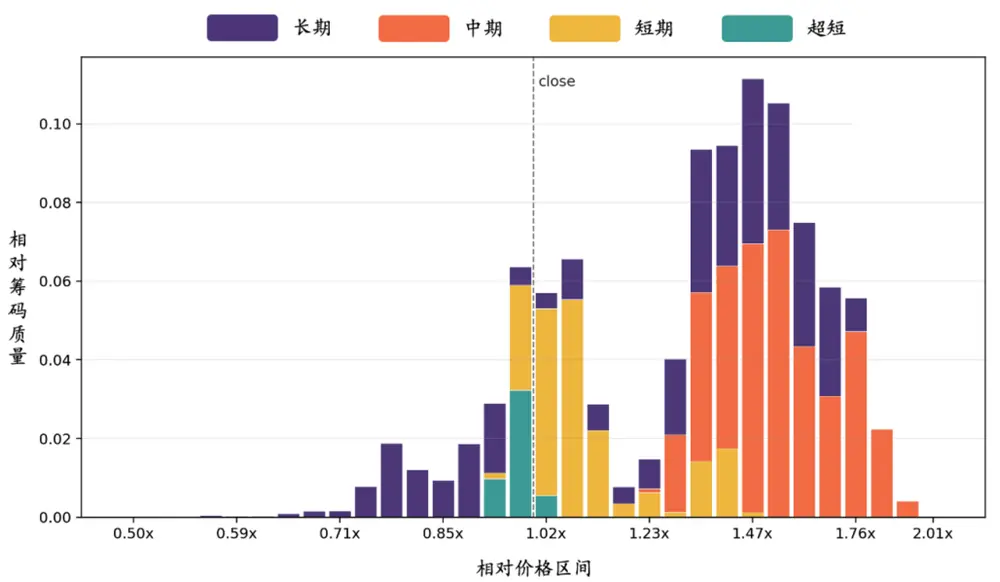
资料来源：Wind，华泰研究

## 投资者类型分层结构估计

其二为投资者类型分层，即根据个股交易资金流数据中的订单规模，将成交划分为小单、中单、大单和超大单四个通道，以刻画散户、中户、大户和机构类资金的筹码结构差异。具体的估计方式为：设 $C_{t}^{b}(p)$ 为投资者类型 b 对应的筹码分布，BuyTurnb 和 SellTurnb分别表示该类投资者的买入换手和卖出换手， $D_{t}^{b}(p)$ 为该类型投资者当日新增买入筹码分布，则递推过程可表示为：

$$
C_{t}^{b}(p)=(1-SellTurn_{t}^{b})\times C_{t-1}^{b}(p)+BuyTurn_{t}^{b}\times D_{t}^{b}(p)
$$

其中，某类投资者的买入换手和卖出换手分别用当日该类型投资者对应订单规模成交量与当日总成交量估计：

$$
BuyTurn_{t}^{b}=\tau_{t}\times\frac{BuyVolume_{t}^{b}}{TotalVolume_{t}},~SellTurn_{t}^{b}=\tau_{t}\times\frac{SellVolume_{t}^{b}}{TotalVolume_{t}}
$$

某类投资者的新增筹码分布用当日该类型订单成交金额与成交量估计均价计算：

$$
VWAP_{t}^{b}=\frac{BuyValue_{t}^{b}}{BuyVolume_{t}^{b}}\times AdjFactor
$$

最终对四个订单通道整体归一化，使其共同构成完整的投资者类型分层筹码分布。

图表5： 投资者类型分层结构示意图
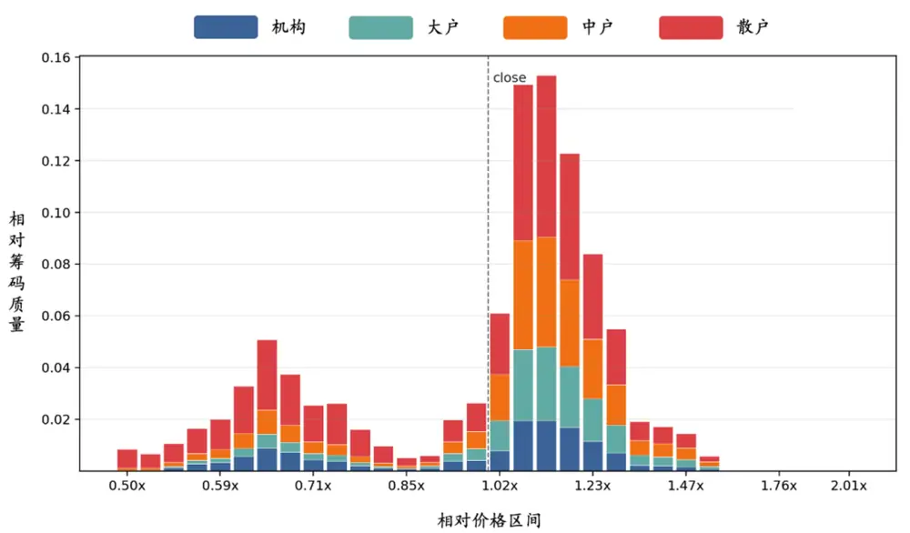
资料来源：Wind，华泰研究

## 模型与训练细节

## 输入特征预处理

完成筹码分层分布的递推估计后，进一步对其进行统一预处理，以保留原始筹码分布中的有效特征。预处理分为以下步骤：

1、 价格区间映射：为消除个股绝对价格水平差异，以及保留每日筹码的相对成本结构，将各价格区间取对数后映射到相对当前收盘价 [−0.7,0.7] 的 32 个网格内。

2、 分层归一化：对于筹码龄分层和订单大小分层结构，保留不同通道之间的相对筹码质量，而不对各通道分别归一化，从而同时保留“不同通道的筹码占比”和“各通道内部的成本分布形态”。

3、 压缩分布形状：考虑到筹码分布具有非负、稀疏和局部峰值较高的特点，本文对归一化后的筹码质量取平方根，从而压缩局部极端筹码峰的影响，使模型更加关注筹码分布的整体形态、不同价格区间之间的相对关系以及跨通道结构差异。

## 模型结构

为同时捕捉每日筹码各分层分布的形状特征，以及筹码结构在时序上的变化，本文将 CNN与 GRU 结合对筹码分层结构进行建模。

模型整体包含两个部分：第一部分使用一维卷积网络提取单日筹码分布在价格维度上的形态特征，例如筹码峰位置、筹码集中区域以及盈利/亏损区间分布；第二部分使用 GRU 对过去时序窗口内的筹码结构序列进行时序建模，刻画筹码结构随时间的演化特征。模型结构示意图如下。

图表6： 模型结构示意图
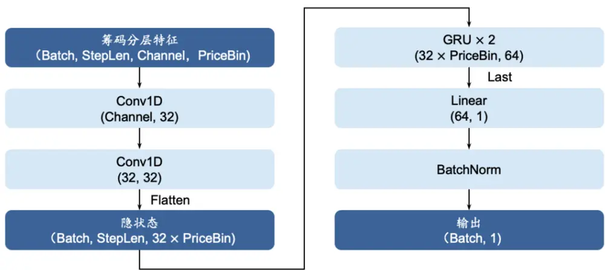
资料来源：华泰研究

## 训练细节

图表7： 模型训练细节

| 超参数 | 设置方式 | 超参数 | 设置方式 |
| --- | --- | --- | --- |
| 价格 bin 数 | 32 | 学习率 | 1.00E-03 |
| 时间窗口 | 30 | 优化器 | AdamW |
| 时间间隔 | 1 | 权重衰减 | 1.00E-04 |
| CNN 输出通道 | 32 | 损失函数 | IC |
| CNN 第 1 层卷积核 | kernel_size=5, padding=2 | 标签 | T+1 至 T+11 收益率 |
| CNN 第 2 层卷积核 | kernel_size=3, padding=1 | 滚动训练 | 10年、1年、1年划分训练、验证、测试集 |
| GRU 隐层维度 | 64 | 随机种子 | 5个种子点取平均 |
| GRU 层数 | 2 | 股票池 | 中证全指 |
| Dropout | 0.1 | 样本外区间 | 2016-12-30 至 2026-05-29 |

资料来源：华泰研究

## 实验结果

## 因子回测结果

两种筹码分层结构的端到端AI因子回测结果及与日/周/月K线GRU端到端因子表现对比汇总如下。可以发现，两种分层方式中，按筹码龄分层的因子表现较优，RankIC 与日/周 K线因子相当，多头组年化超额 32.5%，信息比 4.21，均优于其余因子。

相较而言，投资者类型分层因子表现相对逊色，可能原因如下：

图表8： 因子回测指标汇总

| 因子 | IC 均值 | RankIC 均值 | ICIR | RankICIR 多头组收益空头组收益 对冲组收益 多头组超额空头组超额 |  |  |  |  | 多头组信息比 |  | 空头组信息比 |
| --- | --- | --- | --- | --- | --- | --- | --- | --- | --- | --- | --- |
| 筹码龄分层端到端 | 10.5% | 12.3% | 0.93 | 1.08 | 40.2% | -41.1% | 52.5% | 32.5% | -43.8% | 4.21 | -3.61 |
| 投资者类型分层端到端 | 9.0% | 10.7% | 0.85 | 0.99 | 30.5% | -35.7% | 41.1% | 23.1% | -38.8% | 3.52 | -3.55 |
| GRU-日 K线 | 10.7% | 12.4% | 1.00 | 1.13 | 38.9% | -45.2% | 57.5% | 31.4% | -47.7% | 4.08 | -4.00 |
| GRU-周 K 线 | 10.1% | 12.3% | 0.86 | 1.07 | 36.7% | -40.6% | 50.1% | 29.6% | -43.3% | 3.85 | -3.48 |
| GRU-月 K线 | 8.1% | 10.2% | 0.66 | 0.83 | 24.1% | -31.3% | 32.8% | 17.4% | -34.3% | 2.23 | -2.71 |

注：回测区间 2016-12-30 至 2026-05-29。
资料来源：Wind，华泰研究

图表9： 累计 RankIC净值对比
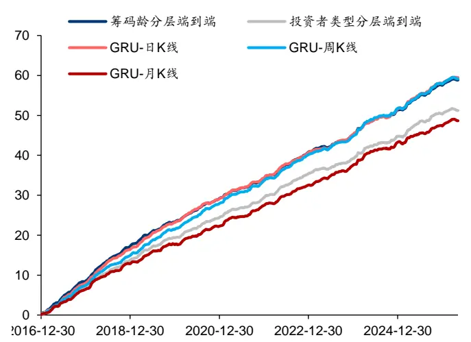
注：回测区间 2016-12-30 至 2026-05-29。资料来源：Wind，华泰研究

图表10： 多头组超额净值对比
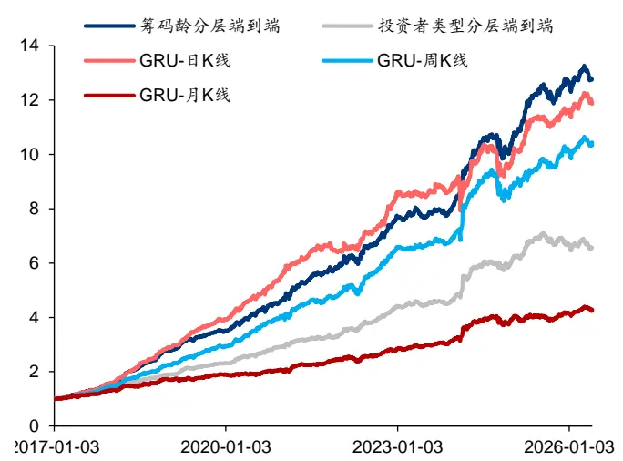
注：回测区间 2016-12-30 至 2026-05-29。资料来源：Wind，华泰研究

图表11： 分层回测年化超额对比
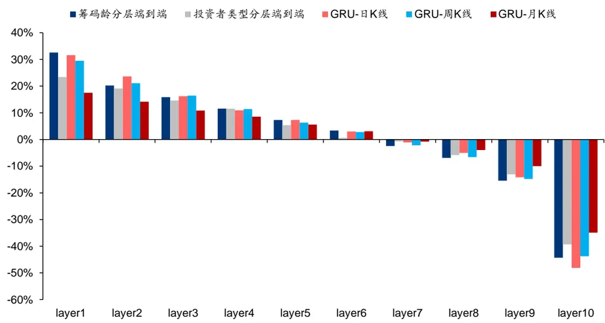
注：回测区间 2016-12-30 至 2026-05-29。
资料来源：华泰研究

## 补充实验：与筹码结构特征因子对比

为评估模型对筹码分布结构的端到端建模能力，本节人工构建两组筹码结构相关特征，分别描述每日筹码分布的静态特征和每日筹码流动的动态特征，额外训练两组模型进行对比。两组特征详细构造方式如下。

图表12： 静态筹码分布特征

| 特征名 | 构造方式 | 含义 |
| --- | --- | --- |
| profit_ratio | 统计成本价格低于或等于当日收盘价的筹码占比 | 当前处于盈利状态的筹码比例 |
| avg_cost_close_ratio | 计算当前全部筹码的平均成本，并除以当日收盘价 | 全市场平均持仓成本相对收盘价的位置 |
| peak_price_close_ratio | 找到筹码分布中占比最高的价格位置，并除以当日收盘价 | 筹码峰最高点价格相对收盘价的位置 |
| peak_upper_close_ratio | 以筹码峰为中心确定主峰区域，取该区域上边界价格并除以收盘价 | 主筹码峰上沿相对收盘价的位置 |
| peak_lower_close_ratio | 以筹码峰为中心确定主峰区域，取该区域下边界价格并除以收盘价 | 主筹码峰下沿相对收盘价的位置 |
| peak_avg_cost_close_ratio | 计算主筹码峰区域内的平均成本，并除以收盘价 | 主筹码峰内部的平均成本位置 |
| peak_area_chip_ratio | 汇总主筹码峰区域内的筹码占比 | 筹码在主峰区域的集中程度 |
| avg_chip_age | 按筹码占比加权计算当前筹码的平均持有天数 | 当前筹码整体持有时间长短 |
| chip_age_ultrashort_ratio | 统计持有时间不超过 2 个交易日的筹码占比 | 超短线筹码占比 |
| chip_age_short_ratio | 统计持有时间为3到10个交易日的筹码占比 | 短线筹码占比 |
| chip_age_mid_ratio | 统计持有时间为 11 到 100 个交易日的筹码占比 | 中线筹码占比 |
| chip_age_long_ratio | 统计持有时间超过100个交易日的筹码占比 | 长线筹码占比 |

资料来源：Wind，华泰研究

图表13： 动态筹码流动特征

| 特征名 | 构造方式 | 含义 |
| --- | --- | --- |
| flow_turnover | 使用当日换手率，并限制在合理范围内 | 当天新筹码替换旧筹码的强度 |
| survival_ratio | 由当日换手率反推旧筹码留存比例 | 原有筹码继续留存的程度 |
| inflow_profit_ratio | 统计当日新成交筹码中，成本低于或等于收盘价的部分 | 新流入筹码中处于盈利区间的比例 |
| inflow_avg_cost_close_ratio | 计算当日新成交筹码的平均成本，并除以收盘价 | 新流入筹码的整体成本位置 |
| inflow_peak_price_close_ratio | 找到当日新成交筹码最集中的价格位置，并除以收盘价 | 新流入筹码的主要成交成本位置 |
| outflow_profit_ratio | 按旧筹码分布估计被换手卖出的筹码中盈利部分的占比 | 流出筹码中获利筹码的比例 |
| outflow_avg_cost_close_ratio | 按旧筹码分布估计被换手卖出的筹码平均成本，并除以收盘价 | 流出筹码的整体成本位置 |
| outflow_peak_price_close_ratio | 按旧筹码分布估计被换手卖出的筹码峰值位置，并除以收盘价 | 流出筹码的主要成本位置 |
| profit_ratio_change | 比较换手更新前后盈利筹码占比的变化 | 当日换手导致盈利筹码结构如何变化 |
| avg_cost_close_ratio_change | 比较换手更新前后平均成本位置的变化 | 当日换手对整体成本中枢的影响 |
| peak_price_close_ratio_change | 比较换手更新前后筹码峰位置的变化 | 当日换手是否推动主筹码峰上移或下移 |
| chip_concentration | 衡量更新后筹码在价格区间上的集中程度 | 当前筹码分布是否集中 |
| chip_concentration_change | 比较换手更新前后筹码集中度的变化 | 当日换手使筹码更集中还是更分散 |
| chip_entropy | 衡量更新后筹码在价格区间上的分散程度 | 当前筹码分布的离散程度 |
| chip_entropy_change | 比较换手更新前后筹码分散程度的变化 | 当日换手使筹码分布更分散还是更聚集 |
| low_cost_net_flow_ratio | 统计低于收盘价较多的低成本区间中的筹码净流入情况 | 低成本筹码区域是否被新增筹码补充 |
| near_cost_net_flow_ratio | 统计收盘价附近成本区间中的筹码净流入情况 | 价格中枢附近筹码是否出现堆积 |
| high_cost_net_flow_ratio | 统计高于收盘价较多的高成本区间中的筹码净流入情况 | 高成本套牢区是否有新增筹码沉淀 |
| winner_outflow_ratio | 按换手率估计旧筹码中获利部分被卖出的比例 | 获利盘流出強度 |
| loser_outflow_ratio | 按换手率估计旧筹码中亏损部分被卖出的比例 | 亏损盘流出强度 |

资料来源：Wind，华泰研究

对照实验选用 GRU 模型，输入两组特征过去 30 日的时序数据，其余训练细节与筹码分层结构端到端模型保持一致。因子评估指标对比如下。可以发现，筹码龄分层端到端因子在IC、RankIC 和多头超额收益上均优于人工构造的静态筹码分布特征与动态筹码流动特征，说明端到端模型能够从完整筹码分布结构中提取人工指标难以完全刻画的增量信息。

图表14： 补充实验因子回测指标汇总
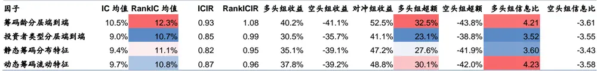
注：回测区间 2016-12-30 至 2026-05-29。
资料来源：Wind，华泰研究

图表15： 补充实验累计 RankIC净值对比
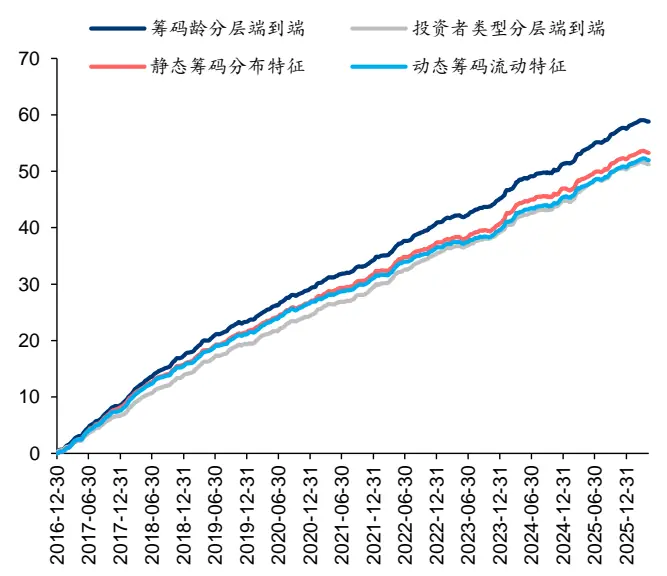
注：回测区间 2016-12-30 至 2026-05-29。
资料来源：Wind，华泰研究

图表16： 补充实验多头组超额净值对比
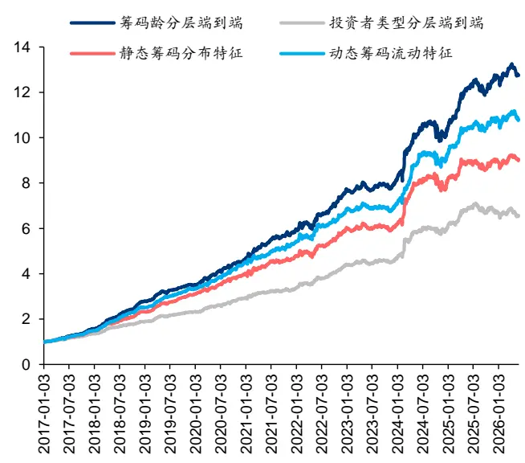
注：回测区间 2016-12-30 至 2026-05-29。
资料来源：Wind，华泰研究

进一步对各因子相关性进行测试。结果表明，筹码龄分层结构端到端因子与人工构造筹码特征因子平均相关性在 80%左右，端到端建模相比人工构造特征提取仍有一定增量信息。同时，筹码结构系列因子与其他类型因子相关性平均在 50%左右，相关性较低，或可起到有效的互补作用。

图表17： 因子相关性矩阵
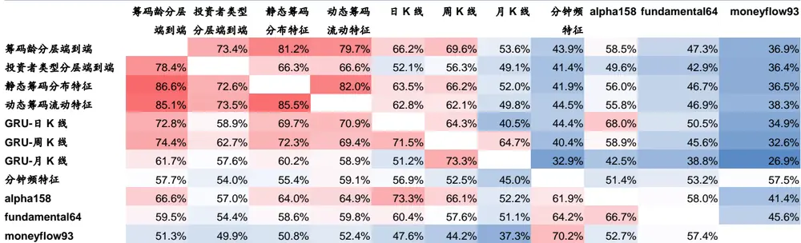
注：回测区间 2016-12-30 至 2026-05-29，矩阵左下为 Pearson 相关系数，右上为 Spearman 相关系数。
资料来源：Wind，华泰研究

## 消融实验：CNN、分层结构有效性评估

为进一步分析模型设计合理性，设计如下两组消融实验进行对比：

1、 筹码分层结构：保持模型结构不变，输入筹码结构不作筹码龄或投资者类型分层；

2、 分布形态建模：在输入筹码结构不分层的基础上，在 CNN 模型输出隐藏层后再对价格区间维度进行平均池化，以破坏 CNN沿价格轴提取的形态特征，不对筹码分布在价格维度上的形态特征建模，后续再 GRU 模型提取时序变化。

筹码龄分层端到端因子及两组消融实验因子回测结果如下。结果表明，从 CNN+GRU 端到端模型中依次剥离筹码龄分层信息和价格分布形态信息均对因子表现有显著负面影响，可一定程度证明当前筹码分层结构特征处理方式和模型设计的合理性。

图表18： 消融实验因子回测指标汇总

| 因子 | IC 均值 | RankIC 均值 | ICIR | RankICIR多头组收益空头组收益对冲组收益多头组超额空头组超额 |  |  |  |  |  | 多头组信息比 | 空头组信息比 |
| --- | --- | --- | --- | --- | --- | --- | --- | --- | --- | --- | --- |
| 筹码龄分层端到端 | 10.5% | 12.3% | 0.93 | 1.08 | 40.2% | -41.1% | 52.5% | 32.5% | -43.8% | 4.21 | -3.61 |
| 消融实验：筹码分层结构 | 8.9% | 11.0% | 0.79 | 0.93 | 30.9% | -35.0% | 40.3% | 23.4% | -38.0% | 3.19 | -3.29 |
| 消融实验：分布形态建模 | 7.6% | 9.5% | 0.64 | 0.77 | 23.8% | -31.2% | 32.5% | 17.2% | -34.1% | 2.31 | -2.76 |

注：回测区间 2016-12-30 至 2026-05-29。
资料来源：Wind，华泰研究

图表19： 消融实验累计 RankIC净值对比
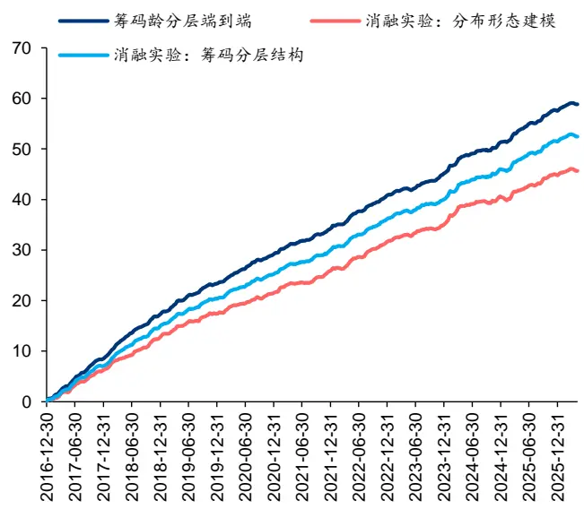
注：回测区间 2016-12-30 至 2026-05-29。资料来源：Wind，华泰研究

图表20： 消融实验多头组超额净值对比
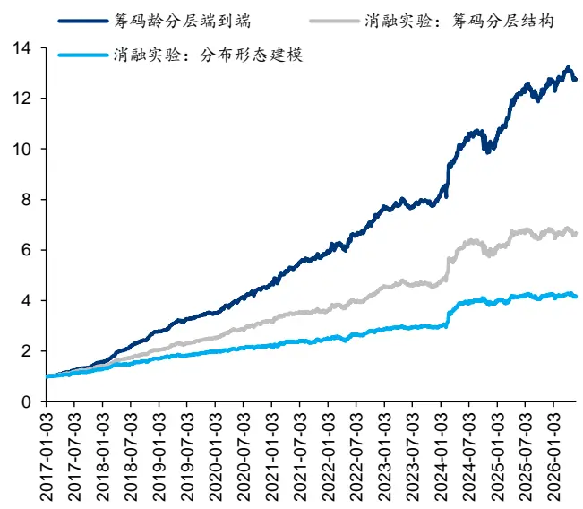
注：回测区间 2016-12-30 至 2026-05-29。资料来源：Wind，华泰研究

## 因子合成及指增组合测试

综合以上实验结果，本节选取以下两种因子组合方式进行因子合成，并构建指数增强组合进行对比：

1、 基准 AI 合成因子：日 K+周 K+Alpha158+分钟频特征；

2、 基准 AI 合成因子+筹码合成因子：日 K+周 K+Alpha158+分钟频特征+筹码龄分层端到端+筹码流动特征；

两组因子的回测结果如下。结果表明，将筹码因子加入因子合成后，IC 和 RankIC 指标无显著变化，而多头组收益有较大提升。

图表21： 合成因子回测指标汇总

| 因子 | IC 均值 | RankIC 均值 | ICIR | RankICIR 多头组收益空头组收益 对冲组收益多头组超额空头组超额 |  |  |  |  |  | 多头组信息比 | 空头组信息比 |
| --- | --- | --- | --- | --- | --- | --- | --- | --- | --- | --- | --- |
| 基准 | 10.0% | 14.0% | 0.98 | 1.36 | 42.2% | -46.6% | 61.7% | 34.7% | -49.1% | 5.17 | -4.29 |
| +筹码结构合成因子 | 10.1% | 14.0% | 0.93 | 1.25 | 44.6% | -46.1% | 62.0% | 36.8% | -48.5% | 5.12 | -4.07 |

注：回测区间 2016-12-30 至 2026-05-29。
资料来源：Wind，华泰研究

图表22： 合成因子累计 RankIC净值对比
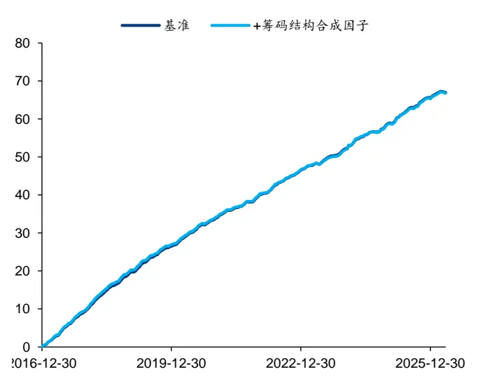
注：回测区间 2016-12-30 至 2026-05-29。
资料来源：Wind，华泰研究

图表23： 合成因子多头组超额净值对比
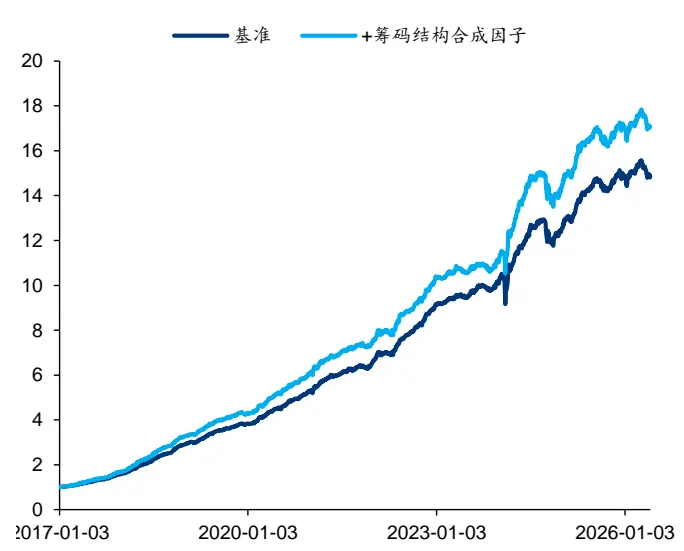
注：回测区间 2016-12-30 至 2026-05-29。
资料来源：Wind，华泰研究

图表24： 合成因子分层回测年化超额对比
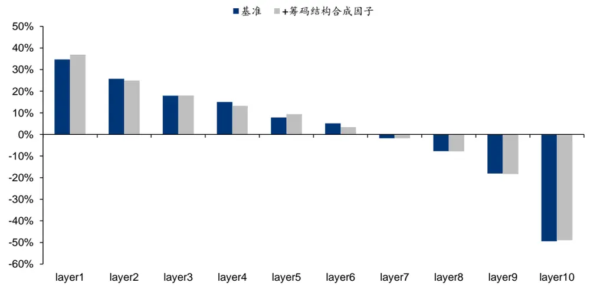
资料来源：华泰研究
注：回测区间 2016-12-30 至 2026-05-29。

进一步基于两组因子构建指数增强组合。其中组合优化及回测细节如下。

图表25： 组合优化及回测细节

| 组合优化 | 基准指数 | 沪深300、中证500、中证1000 |
| --- | --- | --- |
|  | 测试区间 | 2016-12-30 至 2026-05-29 |
|  | 选股域 | 中证全指成分股 |
|  | 成分股权重约束 | 不低于 80% |
|  | 控制风格 | Barra-CNE5 全部风格因子 |
|  | 风格暴露约束 | 0.3 |
|  | 行业暴露约束 | 0.02 |
|  | 个股绝对权重上限 | 0.15 |
|  | 个股权重偏离上限 | 0.8% |
|  | 单边换手率上限 | 20% |
| 组合回测 | 调仓频率 | 5日 |
|  | 成交价格 | VWAP |
|  | 调仓费率 | 双边千分之三 |
|  | 可交易性 | 停牌不可交易、涨停不可买入、跌停不可卖出 |

资料来源：华泰研究

三组指增组合业绩指标对比如下。可以发现，加入筹码因子后的合成因子在三组指增组合上均可提升超额收益表现，其中沪深 300、中证 1000 指增组合超额提升较为明显。

图表26： 指数增强组合业绩对比

| 基准指数股票池 |  | 年化收益率年化波动率 |  | 夏普比率 | 最大回撤 | 年化超额 | 年化跟踪 | 信息比率 | 超额收益 最大回撤 | 超额收益 超额收益 |  | 年化双边 换手率 |
| --- | --- | --- | --- | --- | --- | --- | --- | --- | --- | --- | --- | --- |
|  |  |  | 收益率 |  |  |  |  |  |  | 误差 | 卡玛比率 | 月度胜率 |
| 300 500 | 基准 | 12.2% | 18.3% | 0.67 | 27.2% | 7.4% | 4.7% | 1.57 | 8.8% | 0.84 | 64.6% | 20.37 |
|  | +筹码结构合成因子 | 13.6% | 18.4% | 0.74 | 26.3% | 8.7% | 4.8% | 1.81 | 9.2% | 0.95 | 69.9% | 20.38 |
|  | 基准 | 16.0% | 21.3% | 0.75 | 32.4% | 12.2% | 5.3% | 2.29 | 7.7% | 1.58 | 74.3% | 20.45 |
|  | +筹码结构合成因子 | 16.2% | 21.4% | 0.76 | 32.1% | 12.4% | 5.4% | 2.30 | 7.9% | 1.57 | 74.3% | 20.39 |
| 1000 基准 |  | 18.9% | 24.0% | 0.79 | 35.1% | 19.0% | 5.8% | 3.29 | 8.5% | 2.24 | 79.6% | 20.50 |
|  | +筹码结构合成因子 | 21.2% | 23.8% | 0.89 | 33.7% | 21.2% | 6.0% | 3.53 | 7.7% | 2.75 | 79.6% | 20.40 |

注：回测区间 2016-12-30 至 2026-05-29，交易费率双边千三，5 日调仓，考虑停牌等不可交易情况，换手率单位为倍。资料来源：Wind，华泰研究

图表27： 沪深 300指数增强组合超额收益净值及回撤对比
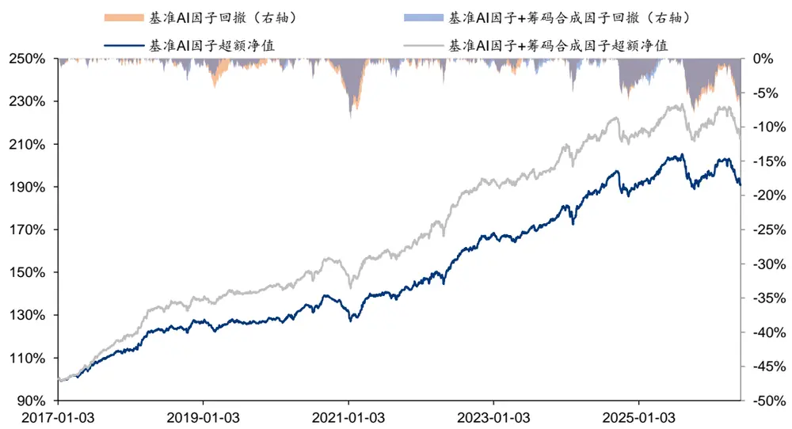
注：回测区间 2016-12-30 至 2026-05-29，交易费率双边千三，5 日调仓，考虑停牌等不可交易情况。资料来源：Wind，华泰研究

图表28： 中证 500指数增强组合超额收益净值及回撤对比
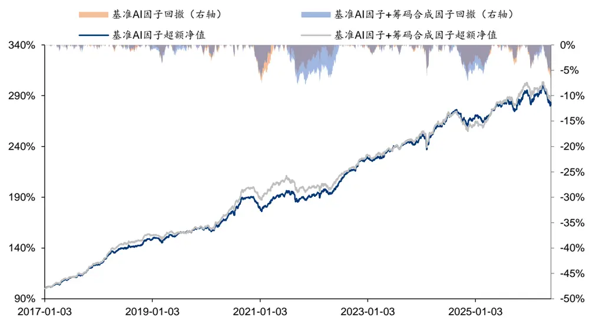
注：回测区间 2016-12-30 至 2026-05-29，交易费率双边千三，5 日调仓，考虑停牌等不可交易情况。
资料来源：Wind，华泰研究

图表29： 中证 1000指数增强组合超额收益净值及回撤对比
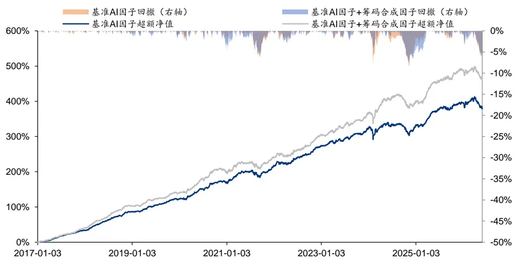
注：回测区间 2016-12-30 至 2026-05-29，交易费率双边千三，5 日调仓，考虑停牌等不可交易情况。资料来源：Wind，华泰研究

进一步对比中证 1000 指增组合中两组因子的分区间超额收益，可以发现加入筹码合成因子在过去 9个完整年度内，7个年度超额收益均高于基准 AI 合成因子，提升较为稳定。

图表30： 基准 AI因子中证 1000指数增强组合各区间超额收益

| 年度 | 1 | 2 3 4 |  |  | 5 6 |  | 7 8 |  | 9 10 11 |  |  | 12 Q1 |  | Q2 | Q3 | Q4 | 全年 |
| --- | --- | --- | --- | --- | --- | --- | --- | --- | --- | --- | --- | --- | --- | --- | --- | --- | --- |
| 2017 | 2.1% | 1.4% 1.3% |  | 4.2% | 3.1% | 4.5% | 2.0% | 2.6% | 2.2% | 2.9% | 2.4% | 1.7% | 4.9% | 12.1% | 6.6% | 7.3% | 34.5% |
| 2018 | 1.9 | % 4.5% | 3.4% | 1.8% | 3.2% | 3.1% | 3.5% | 1.6% | 2.1% | 2.9% | 3.5% | 0.1% | 11.7% | 8.9% | 7.6% | 6.8% | 39.5% |
| 2019 | 0.7 | % -0.1% | 3.4% | 2.8% | 0.4% | 2.4% | 1.8% | 0.6% | 2.5% | 2.3% 1.4% |  | -0.4% | 3.9% | 6.1% | 5.0% | 3.4% | 19.8% |
| 2020 | 0.4 | % 1.0% | 2.2% | 4.2% | 2.7% | 1.7% | 1.6% | 4.6% | 1.0% | 1.1% | -0.8% | -0.2% | 4.1% | 8.6% | 7.1% | 0.6% | 21.9% |
| 2021 | 2.6 | % 3.5% | 3.4% | 1.9% | 0.0% | -0.3% | -2.9% | -3.3% | 2.2% | -0.3% 2.4% |  | 3.4% | 9.2% | 1.5% | -2.2% | 6.3% | 17.3% |
| 2022 | 3.6 | % -0.6% | -0.6% | -0.3% | 2.1% | 1.6% | 0.5% | 2.0% | -0.1% | 2.2% | 2.2% | 1.3% | 2.5% | 4.5% | 2.6% | 6.8% | 17.8% |
| 2023 | 0.4% | 2.2% | 1.7% | 0.6% | 0.2% | 1.7% | 0.4% | 1.6% | 1.4% | -0.4% | 1.2% | 1.9% | 3.9% | 2.3% | 3.6% | 2.9% | 12.8% |
| 2024 | -1.6 | % 0.4% | 1.9% | 2.1% | 1.0% | -1.4% | 0.3% | 0.4% | -1.4% | -4.2% | 1.7% | 4.0% | 0.5% | 1.2% | -1.0% | 1.5% | 1.9% |
| 2025 | -0.8 | % 0.2% | 3.3% | 3.8% | 0.8% | 1.5% | 0.5% | -0.9% | 0.6% | 2.3% | 0.9% | 0.2% | 3.7% | 5.8% | 0.3% | 3.6% | 14.8% |
| 2026 | -0.4 | % 1.4% | 2.4% | -3.1% | -1.9% |  |  |  |  |  |  |  | 3.7% | -5.8% |  |  | -2.6% |

注：回测区间 2016-12-30 至 2026-05-29，交易费率双边千三，5 日调仓，考虑停牌等不可交易情况。资料来源：Wind，华泰研究

图表31： 基准 AI因子+筹码合成因子中证 1000指数增强组合各区间超额收益

| 年度 | 1 | 2 3 4 |  |  | 5 6 7 8 |  |  |  | 9 | 10 11 12 Q1 |  |  |  | Q2 | Q3 | Q4 | 全年 |
| --- | --- | --- | --- | --- | --- | --- | --- | --- | --- | --- | --- | --- | --- | --- | --- | --- | --- |
| 2017 | 2.6% | 1.7% | 2.6% | 4.0% | 2.5% | 4.8% | 2.2% | 1.6% | 2.6% | 4.1% | 3.3% 2.6% |  | 7.4% | 11.1% | 6.2% | 10.8% | 40.6% |
| 2018 | 2.9% | 4.2% | 4.9% | 0.4% | 2.9% | 3.9% | 5.1% | 2.2% | 2.5% | 3.2% | 3.1% -0.5% |  | 14.4% | 8.1% | 10.4% | 6.2% | 45.2% |
| 2019 | 0.6% | -0.5% | 3.4% | 4.2% | -0.4% | 2.0% | 1.2% | 0.0% | 2.0% | 3.0% | 1.6% | -0.7% | 3.5% | 5.9% | 3.6% | 4.1% | 18.3% |
| 2020 | 0.9% | 1.0% | 1.6% | 4.2% | 3.5% | 4.0% | 0.9% | 5.3% | 2.6% | 0.8% | -1.3% | -1.6% | 4.1% | 12.2% | 8.8% | -1.5% | 25.5% |
| 2021 | 1.6% | 4.7% | 2.2% | 0.7% | -1.2% | 0.6% | -3.2% | -3.2% | 2.0% | 0.7% | 2.4% 2.3% |  | 8.4% | 0.3% | -3.1% | 6.3% | 13.9% |
| 2022 | 3.3% | -0.3% | -1.6% | 0.0% | 1.9% | 1.6% | 0.1% | 3.1% | -0.3% | 2.3% | 3.1% | 2.0% | 1.5% | 4.5% | 3.1% | 8.2% | 19.0% |
| 2023 | -0.3% | 2.8% | 1.8% | 1.5% | 1.1% | 1.5% | 0.9% | 0.2% | 2.2% | -0.4% | 1.7% | 2.3% | 3.4% | 4.1% | 3.6% | 3.6% | 14.5% |
| 2024 | -0.6% | 2.2% | 2.6% | 3.9% | 1.0% | 0.1% | 1.5% | -0.4% | -1.8% | -4.1% | 0.6% | 2.3% | 4.2% | 4.2% | -0.9% | -0.6% | 7.1% |
| 2025 | -1.1% | 1.0% | 4.5% | 3.7% | 1.1% | 0.4% | 0.9% | 0.7% | -0.3% | 3.1% | 1.1% | 0.3% | 5.5% | 4.7% | 1.4% | 4.6% | 17.7% |
| 2026 | -1.0% | 1.2% | 2.0% | -2.7% | -1.4% |  |  |  |  |  |  |  | 2.1% | -4.9 | % |  | -3.1% |

注：回测区间 2016-12-30 至 2026-05-29，交易费率双边千三，5 日调仓，考虑停牌等不可交易情况。资料来源：Wind，华泰研究

## 总结

本文是人工智能系列第 105 篇：基于筹码分层结构的 AI 端到端模型。筹码分布反映市场参与者在不同成本区间上的存量持仓结构，是刻画投资者盈亏状态、交易摩擦和行为博弈的重要量价特征。本文从筹码龄和投资者类型两个维度构建筹码分层结构，并使用 AI 模型对其进行端到端建模。实验结果显示，筹码分层结构中蕴含较强的非线性 Alpha 信息，其中筹码龄分层因子表现最优，2016-12-30 至 2026-05-29 的回测区间内，单因子 RankIC 达12.3%，多头组年化超额 32.5%。进一步将筹码结构因子与基准 AI 因子合成构建中证 1000指数增强组合，相同回测区间内年化超额收益 21.2%，信息比率 3.53，相比基准因子分别提升 2.2 pct、0.24。

本文基于 CNN+GRU 对筹码分层结构进行端到端建模。本研究中尝试利用 AI 模型对筹码分布的精细结构进行端到端建模，其中：（1）特征端：基于 VWAP中心三角分布换手递推法估算筹码整体分布，并进一步根据筹码留存时间、筹码交易订单大小拆解筹码分布中的筹码龄分层和投资者类型分层结构特征。（2）模型端：将筹码分布映射至相对当前股价的价格轴，利用 CNN+GRU 模型进行端到端建模，其中 CNN 用于提取单日筹码分布的价格形态特征，GRU用于刻画筹码结构在时间维度上的动态变化。

实验结果显示，端到端因子多头表现较优，相比人工构造特征有增量：（1）筹码龄分层端到端因子表现优于投资者类型分层因子，前者多头组收益高于日 K 线、周 K 线等传统 AI量价模型，且相关性较低。（2）对比筹码龄分层端到端因子与人工构造筹码特征因子，前者 IC 指标及多头超额均更优。（3）消融实验结果显示，剥离筹码龄分层信息或弱化价格分布形态后，因子表现均明显下降，表明筹码分层结构特征与价格形态特征均是端到端建模的有效信息来源。

指增组合测试结果表明，筹码结构合成因子整体优于基准 AI 因子：将筹码结构因子加入基准 AI 合成因子，并构建指数增强组合进行测试，结果表明，在 2016-12-30 至 2026-05-29的回测区间内，加入筹码结构因子后 RankIC约 14.0%，相比基准因子多头超额提升约 2.1pct。同回测区间内，沪深 300、中证 500 和中证 1000 组合的年化超额收益均有所改善，其中中证 1000 组合年化超额由 19.0%提升至 21.2%，信息比由 3.29 提升至 3.53，超额最大回撤由 8.5%下降至 7.7%。

## 本研究还有以下未尽之处：

1、 本研究中基于日度订单大小推测投资者筹码结构，颗粒度较粗，后续可通过日内 Level2数据进行精细化建模；

2、 未来可尝试基于 Transformer等模型结构对筹码分布的原始特征进行端到端建模。

## 参考文献

Grinblatt, M., and Han, B. (2005). Prospect theory, mental accounting, and momentum. 
Journal of Financial Economics.

## 风险提示

人工智能挖掘市场规律是对历史的总结，市场规律在未来可能失效。深度学习模型受随机数影响较大。本文回测假定以 VWAP 价格成交，未考虑其他影响交易因素。

## 免责声明

## 分析师声明

本人，何康，兹证明本报告所表达的观点准确地反映了分析师对标的证券或发行人的个人意见；彼以往、现在或未来并无就其研究报告所提供的具体建议或所表达的意见直接或间接收取任何报酬。请注意，标*的人员并非香港证券及期货事务监察委员会的注册持牌人，不可在香港从事受监管活动。

## 一般声明及披露

本报告由华泰证券股份有限公司或其关联机构制作，华泰证券股份有限公司和其关联机构统称为“华泰证券”(华泰证券股份有限公司已具备中国证监会批准的证券投资咨询业务资格) 。本报告所载资料是仅供接收人的严格保密资料。本报告仅供华泰证券及其客户和其关联机构使用。华泰证券不因接收人收到本报告而视其为客户。

本报告基于华泰证券认为可靠的、已公开的信息编制，但华泰证券对该等信息的准确性及完整性不作任何保证。

本报告所载的意见、评估及预测仅反映报告发布当日的观点和判断。在不同时期，华泰证券可能会发出与本报告所载意见、评估及预测不一致的研究报告。同时，本报告所指的证券或投资标的的价格、价值及投资收入可能会波动。以往表现并不能指引未来，未来回报并不能得到保证，并存在损失本金的可能。华泰证券不保证本报告所含信息保持在最新状态。华泰证券对本报告所含信息可在不发出通知的情形下做出修改，投资者应当自行关注相应的更新或修改。

华泰证券（华泰证券（美国）有限公司除外）不是 FINRA 的注册会员，其研究分析师亦没有注册为 FINRA 的研究分析师/不具有 FINRA 分析师的注册资格。

华泰证券力求报告内容客观、公正，但本报告所载的观点、结论和建议仅供参考，不构成购买或出售所述证券的要约或招揽。该等观点、建议并未考虑到个别投资者的具体投资目的、财务状况以及特定需求，在任何时候均不构成对客户私人投资建议。投资者应当充分考虑自身特定状况，并完整理解和使用本报告内容，不应视本报告为做出投资决策的唯一因素。对依据或者使用本报告所造成的一切后果，华泰证券及作者均不承担任何法律责任。任何形式的分享证券投资收益或者分担证券投资损失的书面或口头承诺均为无效。

除非另行说明，本报告中所引用的关于业绩的数据代表过往表现，过往的业绩表现不应作为日后回报的预示。华泰证券不承诺也不保证任何预示的回报会得以实现，分析中所做的预测可能是基于相应的假设，任何假设的变化可能会显著影响所预测的回报。

华泰证券及作者在自身所知情的范围内，与本报告所指的证券或投资标的不存在法律禁止的利害关系。在法律许可的情况下，华泰证券可能会持有报告中提到的公司所发行的证券头寸并进行交易，为该公司提供投资银行、财务顾问或者金融产品等相关服务或向该公司招揽业务。

华泰证券的销售人员、交易人员或其他专业人士可能会依据不同假设和标准、采用不同的分析方法而口头或书面发表与本报告意见及建议不一致的市场评论和/或交易观点。华泰证券没有将此意见及建议向报告所有接收者进行更新的义务。华泰证券的资产管理部门、自营部门以及其他投资业务部门可能独立做出与本报告中的意见或建议不一致的投资决策。投资者应当考虑到华泰证券及/或其相关人员可能存在影响本报告观点客观性的潜在利益冲突。投资者请勿将本报告视为投资或其他决定的唯一信赖依据。有关该方面的具体披露请参照本报告尾部。

本报告并非意图发送、发布给在当地法律或监管规则下不允许向其发送、发布的机构或人员，也并非意图发送、发布给因可得到、使用本报告的行为而使华泰证券违反或受制于当地法律或监管规则的机构或人员。

本报告版权仅为华泰证券所有。未经华泰证券书面许可，任何机构或个人不得以翻版、复制、发表、引用或再次分发他人(无论整份或部分)等任何形式侵犯华泰证券版权。如征得华泰证券同意进行引用、刊发的，需在允许的范围内使用，并需在使用前获取独立的法律意见，以确定该引用、刊发符合当地适用法规的要求，同时注明出处为“华泰证券研究所”，且不得对本报告进行任何有悖原意的引用、删节和修改。华泰证券保留追究相关责任的权利。所有本报告中使用的商标、服务标记及标记均为华泰证券的商标、服务标记及标记。

## 中国香港

本报告由华泰证券股份有限公司或其关联机构制作,在香港由华泰金融控股（香港）有限公司向符合《证券及期货条例》及其附属法律规定的机构投资者和专业投资者的客户进行分发。华泰金融控股（香港）有限公司受香港证券及期货事务监察委员会监管，是华泰国际金融控股有限公司的全资子公司，后者为华泰证券股份有限公司的全资子公司。在香港获得本报告的人员若有任何有关本报告的问题,请与华泰金融控股（香港）有限公司联系。

## 香港-重要监管披露

- 华泰金融控股（香港）有限公司的雇员或其关联人士没有担任本报告中提及的公司或发行人的高级人员。

- 有关重要的披露信息，请参华泰金融控股（香港）有限公司的网页 https://www.htsc.com.hk/stock_disclosure其他信息请参见下方 “美国-重要监管披露”。

## 美国

在美国本报告由华泰证券（美国）有限公司向符合美国监管规定的机构投资者进行发表与分发。华泰证券（美国）有限公司是美国注册经纪商和美国金融业监管局（FINRA）的注册会员。对于其在美国分发的研究报告，华泰证券（美国）有限公司根据《1934 年证券交易法》（修订版）第 15a-6 条规定以及美国证券交易委员会人员解释，对本研究报告内容负责。华泰证券（美国）有限公司联营公司的分析师不具有美国金融监管（FINRA）分析师的注册资格，可能不属于华泰证券（美国）有限公司的关联人员，因此可能不受 FINRA 关于分析师与标的公司沟通、公开露面和所持交易证券的限制。华泰证券（美国）有限公司是华泰国际金融控股有限公司的全资子公司，后者为华泰证券股份有限公司的全资子公司。任何直接从华泰证券（美国）有限公司收到此报告并希望就本报告所述任何证券进行交易的人士，应通过华泰证券（美国）有限公司进行交易。

## 美国-重要监管披露

- 分析师何康本人及相关人士并不担任本报告所提及的标的证券或发行人的高级人员、董事或顾问。分析师及相关人士与本报告所提及的标的证券或发行人并无任何相关财务利益。本披露中所提及的“相关人士”包括 FINRA 定义下分析师的家庭成员。分析师根据华泰证券的整体收入和盈利能力获得薪酬，包括源自公司投资银行业务的收入。

- 华泰证券股份有限公司、其子公司和/或其联营公司, 及/或不时会以自身或代理形式向客户出售及购买华泰证券研究所覆盖公司的证券/衍生工具，包括股票及债券（包括衍生品）华泰证券研究所覆盖公司的证券/衍生工具，包括股票及债券（包括衍生品）。

- 华泰证券股份有限公司、其子公司和/或其联营公司, 及/或其高级管理层、董事和雇员可能会持有本报告中所提到的任何证券（或任何相关投资）头寸，并可能不时进行增持或减持该证券（或投资）。因此，投资者应该意识到可能存在利益冲突。

## 新加坡

华泰证券（新加坡）有限公司持有新加坡金融管理局颁发的资本市场服务许可证，可从事资本市场产品交易，包括证券、集体投资计划中的单位、交易所交易的衍生品合约和场外衍生品合约，并且是《财务顾问法》规定的豁免财务顾问，就投资产品向他人提供建议，包括发布或公布研究分析或研究报告。华泰证券（新加坡）有限公司可能会根据《财务顾问条例》第 32C 条的规定分发其在华泰证券内的外国附属公司各自制作的信息/研究。本报告仅供认可投资者、专家投资者或机构投资者使用，华泰证券（新加坡）有限公司不对本报告内容承担法律责任。如果您是非预期接收者，请您立即通知并直接将本报告返回给华泰证券（新加坡）有限公司。本报告的新加坡接收者应联系您的华泰证券（新加坡）有限公司关系经理或客户主管，了解来自或与所分发的信息相关的事宜。

## 评级说明

投资评级基于分析师对报告发布日后 至 个月内行业或公司回报潜力（含此期间的股息回报）相对基准表现的预期（A 股市场基准为沪深 300 指数，香港市场基准为恒生指数，美国市场基准为标普 500 指数，台湾市场基准为台湾加权指数，日本市场基准为日经 225 指数，新加坡市场基准为海峡时报指数，韩国市场基准为韩国有价证券指数，英国市场基准为富时 100 指数，德国市场基准为 DAX 指数），具体如下：

## 行业评级

增持：预计行业股票指数超越基准

中性：预计行业股票指数基本与基准持平

减持：预计行业股票指数明显弱于基准

## 公司评级

买入：预计股价超越基准 15%以上

增持：预计股价超越基准 5%~15%

持有：预计股价相对基准波动在-15%~5%之间

卖出：预计股价弱于基准 15%以上

暂停评级：已暂停评级、目标价及预测，以遵守适用法规及/或公司政策

无评级：股票不在常规研究覆盖范围内。投资者不应期待华泰提供该等证券及/或公司相关的持续或补充信息

## 法律实体披露

中国：华泰证券股份有限公司具有中国证监会核准的“证券投资咨询”业务资格，经营许可证编号为：91320000704041011J

香港：华泰金融控股（香港）有限公司具有香港证监会核准的“就证券提供意见”业务资格，经营许可证编号为：AOK809

美国：华泰证券（美国）有限公司为美国金融业监管局（FINRA）成员，具有在美国开展经纪交易商业务的资格，经营业务许可编号为：CRD#:298809/SEC#:8-70231

新加坡：华泰证券（新加坡）有限公司具有新加坡金融管理局颁发的资本市场服务许可证，并且是豁免财务顾问，经营许可证编号为：202233398E

## 华泰证券股份有限公司

## 南京

南京市建邺区江东中路228号华泰证券广场1号楼/邮政编码：210019

电话：86 25 83389999/传真：86 25 83387521

电子邮件：ht-rd@htsc.com

## 深圳

深圳市福田区益田路5999号基金大厦10楼/邮政编码：518017

电话：86 755 82493932/传真：86 755 82492062

电子邮件：ht-rd@htsc.com

## 华泰金融控股（香港）有限公司

香港中环皇后大道中 99号中环中心 53楼

电话：+852-3658-6000/传真：+852-2567-6123

电子邮件：research@htsc.com

http://www.htsc.com.hk

## 华泰证券（美国）有限公司

美国纽约公园大道 280号 21楼东（纽约 10017）

电话：+212-763-8160/传真：+917-725-9702

电子邮件: Huatai@htsc-us.com

http://www.htsc-us.com

## 华泰证券（新加坡）有限公司

滨海湾金融中心 1 号大厦, #08-02, 新加坡 018981

电话：+65 68603600

传真：+65 65091183

https://www.htsc.com.sg

## 北京

北京市西城区太平桥大街丰盛胡同28号太平洋保险大厦A座18层/邮政编码：100032

## ©版权所有2026年华泰证券股份有限公司

电话：86 10 63211166/传真：86 10 63211275

电子邮件：ht-rd@htsc.com

## 上海

上海市浦东新区东方路18号保利广场E栋23楼/邮政编码：200120
电话：86 21 28972098/传真：86 21 28972068
电子邮件：ht-rd@htsc.com