# 基于新闻舆情数据的选股因子

# ——寻找另类 Alpha 因子系列之一

公折师·唐界

执业证书编号·S0740517030003

电话·021-20315202

邮箱·tanaiun@r alza com cn

分析师·李债云

执业证书编号·S0740520050001

电话·021-20315132

邮箱·liav@r alza com cn

## 1、寻找关注度拐点，获益冷门股效

是ル视色下的行为本副学

## 机次西上

## 新闻舆情的刻画方法

股价主要受业绩和估值两方面因素驱动。新闻中体现的市场情绪一方面影响中短期的估值水平，一方面也反应了市场对公司未来业绩的预判，因而把握舆情对预测股价收益有重要影响。

新闻舆情对股价的影响可以从两个方面刻画：舆情的热度（新闻数量）和舆

情的评价度（新闻情感值)。对个股每月新闻情感值求和作为新闻情绪因子，

既体现了新闻对个股的正负向评价度，又体现了新闻热度

## 新闻情绪因子的改进方式

对月度新闻情感求平均数计算新闻情感因子→增加新闻热度的刻画，用月度新闻情感之和作为新闻情绪因子→补充对新闻类型的筛选条件:新闻标签为“包含基本面信息”→补充新闻相关度的筛选条件：新闻相关度为强相关。

对新闻标签和相关度进行改进后，新闻情绪因子的多空年化收益率由3.65%提升至8.10%；因子最大组的多头年化收益率由5.63%提升至14.53%，最大回撤由-32%缩小至-27.5%，相对基准月胜率由63%提升至69%；因子不同时期的分层单调性也有所提升。

## 新闻情绪因子在不同市值下表现

1)新闻情绪在月频上，对大市值股票的影响较为持续；市值越小，反转效应越明显（即本月情绪最高的股票组合，次月收益最低)；

2）月频的新闻情绪对较小流通市值的股票影响不大；

3)对较小市值的股票做新闻情绪分析时，更应当注重结合基本面信息，尤其

是规避基本面信息下的低情绪股票，其负收益可能性更大。

## 新闻情绪因子的其他刻画方法

1)新闻情绪差值因子的分层单调性并不明显，但情绪变化最大组收益远远跑输其余四组，即月度情绪提升最大的股票组合次月表现可能不及预期。

2)标准差下的分歧度因子没有明显的单调性分层。但结合新闻情绪的绝对值水平后，当月新闻情感的总值较高、且标准差较小的组合表现最好，即高一致性的高舆情组合有最高的月度收益表现。

3)用正向情感得分占比计算分歧度因子，采用包含基本面信息的强相关新闻数据。正向情感得分占比越大，说明个股当月的正向情感一致性越强，从回测结果看，其次月收益也相应较高。

## 新闻舆情多头策略

从多头组合策略角度，有三种多头策略收益表现较好。在强相关且去重的新闻数据中，分别筛选1）高情绪组合；2）高情绪、低标准差组合；3）高正向情绪占比组合。

叠加三种选股条件，选择高情绪、低标准差、高正向情感占比的股票组合，收益可以进一步提升。组合的多头持仓年化收益率提升至31.22%，最大回撤减小至-17.2%，相对基准月胜率为70%。

风险提示：1)单因子测试结果是历史经验的总结，回测结果依赖于2016年以来的历史数据，存在失效的可能；2）监管政策超预期变动，外部环境超预期变化可能对市场风格产生影响。

## 内容目录

## 一、新闻舆情对股价的影响

## 1.1 舆情对股价的影响

舆情对股价的影响是近年来行为金融学热点研究领域之一，在大数据的支

持下，我们可以通过文本挖掘技术发现新闻信息的背后情绪，并作为分析股

价涨跌的新视角。

通常认为，股价主要受业绩和估值两方面因素驱动。而新闻中体现的市场情

绪一方面影响中短期的估值水平，一方面也反应了市场对公司未来业绩的预

判，因而把握舆情对预测股价收益有重要影响。

在因子模型中，新闻舆情因子属于另类 Alpha因子的一种。相比于传统的业

绩因子，新闻舆情因子能够以更加高频的动态来捕捉影响因素的变化情况，

在选股周期上更加灵活；相对于同样高频的量价因子，新闻舆情因子的逻辑

意义则更加直观。

新闻舆情对股价的影响可以从两个方面刻画：舆情的热度（新闻数量）和舆

情的评价度（新闻情感）。两者相对来说，新闻数量对股价的影响可能更偏

短期；而新闻情感由于包含了对公司业绩、经济环境的中长期展望，对股价

可能产生持续的影响。

通过爬取新闻数据并对新闻中体现的情感进行标准化打分，我们不仅可以定

量刻画新闻的热度，也可以定量把握新闻的情感。

## 1.2 通联数据情感因子库介绍

## 1）数据覆盖率

当前A股上市公司共有3876家，其中在通联数据库中有新闻数据的个股共3848只，覆盖率为99.86%。根据历史数据统计，通联新闻数据对A 股的月频覆盖率保持在98.8%以上，覆盖情况较为充足稳定。

图表1：通联新闻数据对A股覆盖率
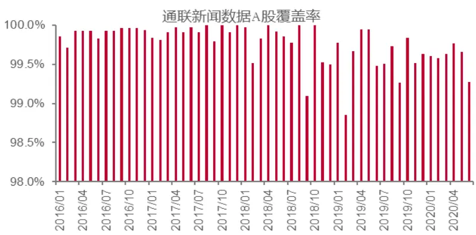
来源：通联数据，中泰证券研究所

## 2）新闻情感生成规则

通联新闻数据来源于1500+个新闻源，包括常见的财经网站、官方网站、以及有影响力的公众号等自媒体，交易日平均新闻数量在2万条左右，单条新闻发布后平均在3分钟内完成数据库收录以及相关参数计算。

通联新闻数据从2014年开始实时更新，数据内容包括：新闻标题、新闻来源、发布时间、关联公司、关联度、情感得分以及新闻标签等。其中，新闻情感得分是通联数据库中的特色数据，以取值在[-1,1]之间的标准化得分形式来定量刻画每条新闻的情感倾向。

新闻情感的标准化得分主要基于NLP语义分析和机器学习算法生成。单条

新闻收录后，首先识别新闻中关联的上市公司，并通过新闻类型与上下文内

容给出新闻与个股的相关程度，分为 0/1/2三个等级，其中 2 表示强相关，

1表示弱相关，0表示不相关。其次，使用NLP模型进行语义分析，并将分

析结果输入机器学习模型，输出正向情感(1)/负向情感(-1)/中性情感

(0)三个分类的概率，最终加权得到该条新闻对关联个股的情感得分。情

感得分为[-1,1]之间取值的标准化分数，分数越大表示新闻情感越正面。

新闻情感的机器学习训练数据的时间覆盖区间为2014年7月至2019年1

月，其中2018年之后比重较大，既保证模型对最新的新闻有较强的拟合能

力，又保证模型对长尾新闻有一定的泛化能力。同时历史新闻数据为千万量

级，训练数据为万级，避免了机器学习算法中对数据过拟合的问题。

图表2：通联数据库新闻情感数据生成流程
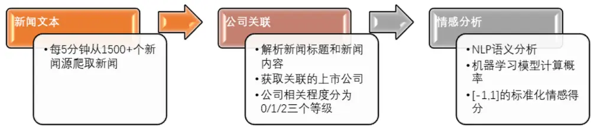
来源：通联数据，中泰证券研究所

例如，在2020年6月 28日发布的新闻《贵州国威酒业携手中国食品发酵工业研究院共建绵柔酱香型白酒技术标准体系》中提到“通过与中国食品发酵工业研究院的合作，将大大加快国威酒业酱香型白酒生产标准跨入标准化体系的进程，意味着绵柔酱香型白酒的研究进入了新的里程。同时，也为酱酒大家庭中增加了一个更具典型特点和健康属性的明珠”。通联新闻数据库对该新闻提取的相关上市公司为贵州茅台，相关度为2(强相关)，情感得分较高为0.65 分。

2020年6月29日发布的新闻《端午节白酒小高峰未到动销两极分化，难倒8成中小酒商》主要对白酒行业进行整体分析，提到贵州茅台、五粮液等多个上市公司，新闻中既表示高端白酒销量更好，又对疫情影响下后续消费力度表示担忧。通联新闻数据库对该新闻与贵州茅台的相关度评为1(弱相关)，情感得分为相对中性的0.03 分。

## 3）新闻标签类型

另外，通联数据对新闻的类型也进行了标记，主要包括：新闻是否包含基本面信息、新闻是否包含数据、是否长新闻、是否来源于专业网站、是否短新闻、是否为月度数据、是否国家发布的政策、是否图片式新闻、以及是否定期报告等。

新闻类型标签以及分类规则见图表3所示。这里需要注意，由于新闻中经常引用和转发证券公司的研究报告，因此新闻数据中也包含研究报告数据。研报数据多被归至包含基本面信息的新闻、月度数据新闻、以及定期报告新闻中。

图表3：通联数据库新闻标签类型

| 新闻标签 |  | 标签解释 |  |
| --- | --- | --- | --- |
| 是否包含基本面信 |  | 息 | 新闻是否包括宏观/行业/公司基本经济与财务信息。 |
| 是否包含数据 | 例 | 息 | 新闻中是否包含大量数字。 |
| 是否长新闻 |  |  | 新闻字数超过 2000 字。 |
| 是否来源于专业 | ( | 站 | 其中共分为3类：标记1代表专业新闻，来源一般为证券公司官网/公司官网/报纸（如证券时报）/财经新闻（如和讯/搜狐）/财经论坛（如证券之星/金融界）；标记0代表非专业新闻，来源一般为财经论坛（如东方财富网/新浪财经）；标记2代表来源于微信。 |
|  | 网新 |  |  |
| 是否短新闻 | 闻 |  | 新闻字数不超过200个字。 |
| 是否月度数据 | 类 |  | 新闻主要对某个月进行总结（一般新闻标题中会点名月份，如某地9月份房价变化）。 |
| 是否国家发布的政策 |  |  | 是否与国家政策相关。 |
| 是否图片式新配 |  |  | 是否包含图片式信息。 |
| 是否定期报告 |  |  | 一般包括证券公司研究报告/国家统计局报告。 |

来源：通联数据，中泰证券研究所

通联数据对

例如，2020年6月29日发布的《智飞生物：融资余额19.71亿元，创历史新高(06-24》被划归为不包含基本面信息新闻、包含大量数据信息新闻、以及来源于非专业网站新闻（新闻发布于东方财富网）。
和讯研报网2018年10月8日发布的《智飞生物:看好公司业绩持续高增长买入评级》被划归为包含基本面信息新闻、来源于专业网站新闻（新闻为转载研报）。但由于新闻并非以数字为主，故被划归为非大量数据信息新闻。

## 二、新闻情绪因子构建

## 2.1 新闻情感平均值因子

国内外学术研究都表明，新闻情绪可以影响上市公司的股票价格，正面情绪

会导致股票价格上涨，负面情绪会引发股价下跌。从经济意义上来说，新闻

中体现的情感越正向，代表市场对上市公司或股价走势的前景更有信心，因

此可能对应股价未来更好的表现。

考虑到日频数据的换手成本过高，我们计算月度数据作为新闻情感因子。在

每月末计算每只股票当月所有新闻的情感分数的平均值，来刻画个股当月的

新闻情感度，并以此作为次月持仓个股的筛选条件。

按每月新闻情感因子值大小分5档进行回测，并计算多空收益率，回测区间

为2016年1月至2020年6月。由于新股上市时一般情绪较高，但破板后

需要1年时间才能消化涨停带来的高估值，同时至少需要半年时间才能将波

动率逐渐降至正常水平(见报告《掘金次新股》)，本文回测时均剔除上市不

满一年的个股。

图表4：新闻情感平均值因子分档回测

图表5：新闻情感平均值因子多空回测

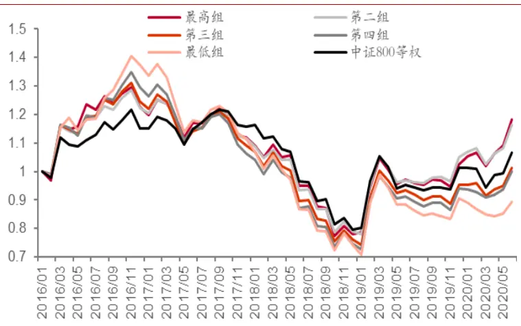
来源：通联数据，wind，中泰证券研究所

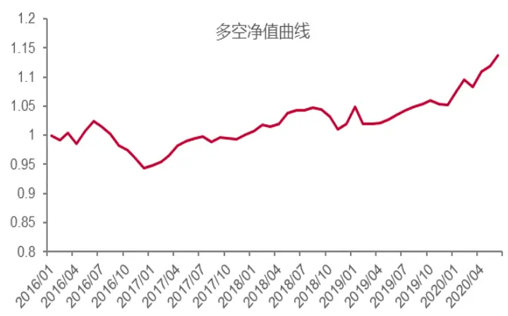
来源：通联数据，wind，中泰证券研究所

图表6：新闻情感平均值因子收益表现

| 年化收益率 年化波动率 夏普率 |  |  |  | 最大回撤 相对基准月胜率 |  |
| --- | --- | --- | --- | --- | --- |
| 多空组合 | 2.91% | 4.2% | 0.70 | -7.8% | 57% |
| 最高组 | 3.76% | 20.0% | 0.28 | -40.1% | 54% |
| 最低组 | -2.49% | 21.6% | -0.02 | -49.6% | 37% |
| 基准指数 | 1.43% | 18.0% | 0.16 | -34.7% | - |

来源：通联数据，wind，中泰证券研究所

2017年后新闻情感平均值因子开始呈现分层单调性，新闻情感最低组收益逐渐走低，多空净值曲线开始呈现稳定向上形态。总体来说，虽然新闻情感平均值因子的因子最大组和次大组能够跑赢基准指数(中证800等权指数)，但存在因子分层排序单调性不明显、相对基准月胜率不高等问题。

## 2.2 新闻热度因子

新闻舆情除了表现在舆情的评价度(新闻情感)之外，还表现为舆情的热度(新闻数量)。相关的新闻数量越多，说明市场对该股票的关注度越高，可能预示个股存在上涨机会。

每月末用个股当月的新闻总数作为新闻热度因子进行回测。同时，考虑到同

一条新闻内容可能因为被不同媒体转发而出现重复计算，其本质上仍然只反

映同一个作者或同一个视角下的个股情感，因此首先进行去重处理，对于重

复新闻仅保留最先发布的新闻数据（下文均采用去重处理）。

图表7：新闻数量因子分档回测
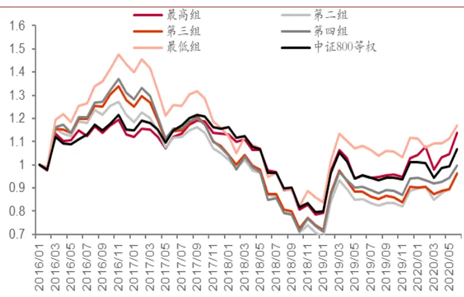
来源：通联数据，wind，中泰证券研究所

图表8：新闻数量因子多空回测
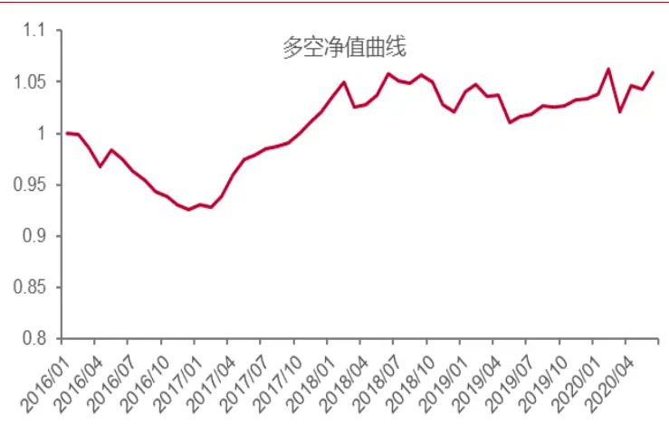
来源：通联数据，wind，中泰证券研究所

图表9：新闻数量因子收益表现

| 年化收益率 年化波动率 |  |  | 夏普率 最大回撤 |  |  |
| --- | --- | --- | --- | --- | --- |
| 多空组合 | 1.29% | 4.5% | 0.31 | -7.4% | 57% |
| 最高组 | 2.92% | 19.7% | 0.24 | -34.3% | 56% |
| 次低组 | -0.04% | 20.6% | 0.09 | -48.0% | 46% |
| 基准指数 | 1.43% | 18.0% | 0.16 | -34.7% | - |

来源：通联数据，wind，中泰证券研究所

对新闻数量因子的分层回测中，因子最低组跑赢了其余四组，说明新闻热度可能存在一定的反转效应(此处多空组合为多头持有因子最高组，空头持有因子次低组）。另外，不同股票间存在新闻数量差异较大的问题。比如平安银行的月均相关新闻数为1000~2000条，而所有A股的月均相关新闻数仅在150条左右。因此单独使用新闻数量作为因子时，一些弹性较大的小盘股容易被分在新闻热度较低组，从而影响分层表现。

## 2.3 新闻情绪因子

进一步考虑将新闻情感和新闻热度结合起来，对个股每月新闻情感值求和作为新闻情绪因子,既体现了新闻对个股的正负向评价度，又体现了新闻热度。这样新闻个数虽然比较少、但月度情感评分较大的个股可以被选入，而新闻个数过少的微型股又可被排出在外。

图表10：新闻情绪因子分档回测
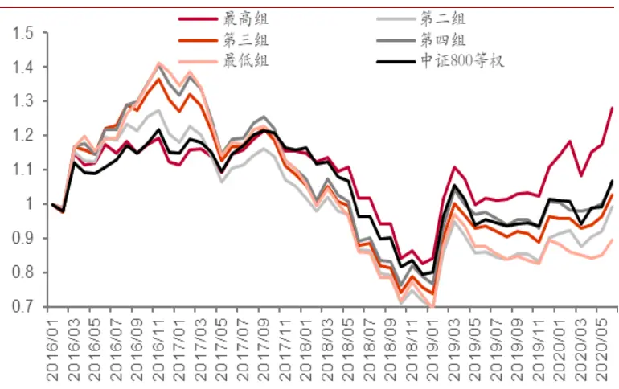
来源：通联数据，wind，中泰证券研究所

图表11：新闻情绪因子多空回测
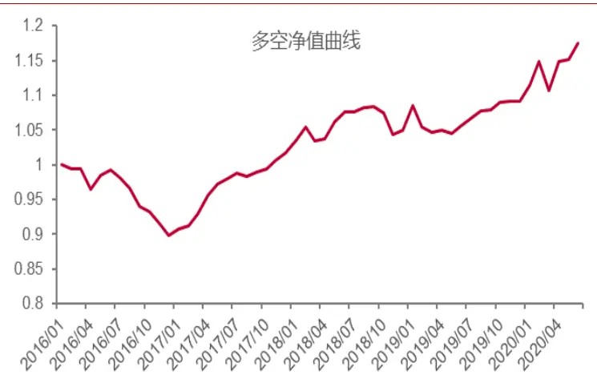
来源：通联数据，wind，中泰证券研究所

图表12：新闻情绪因子收益表现

| 年化收益率 年化波动率 |  |  | 夏普率 |  |  |
| --- | --- | --- | --- | --- | --- |
| 多空组合 | 3.65% | 5.7% | 0.66 | 最大回撤 -10.2% | 54% |
| 最高组 | 5.63% | 19.1% | 0.38 | -31.8% | 63% |
| 最低组 | -2.46% | 21.7% | -0.01 | -50.7% | 37% |
| 基准指数 | 1.43% | 18.0% | 0.16 | -34.7% | - |

来源：通联数据，wind，中泰证券研究所

可以看到，相比于仅采用新闻情感评价或新闻热度，综合的新闻情绪因子在

多头年化收益率、年化波动率、最大回撤、相对基准月胜率、以及多空收益

指标上均有较明显提升。但仍存在因子分层单调性不佳的问题：新闻情绪因

子在2017年之后呈现明显的正向单调性，即情绪因子值越大，收益表现越

好；然而在2016年则完全相反，情绪因子值越大，股价反而下跌的越多。

新闻情绪因子在2016年表现相反，可能是由于经过2014年、2015年的小

盘股牛市，2016年市场风格突然向大盘股切换，但以新闻数据为代表的市

场情绪仍然存在惯性思维，情绪风格并没有及时切换。也有可能是因为全市

场的新闻内容和质量存在差异，因此如果不对新闻进行筛选过滤，原始数据

可能存在较大噪声。

## 2.4 新闻类型改进的新闻情绪因子

进一步，首先按新闻类型对原始新闻数据进行筛选，在筛选后的新闻数据的

基础上，再计算新闻情绪因子。

新闻类型的分类标准包括:新闻是否包含基本面信息、新闻是否包含数据、

是否长新闻、是否来源于专业网站、是否短新闻、是否为月度数据、是否国

家发布的政策、是否图片式新闻、以及是否定期报告等。

图表13：不同新闻类型下的强相关新闻情绪因子多空回测对新闻分类后分别回测，在包含基本面信息、长新闻、图片式新闻、定期报告类新闻数据中，情绪因子表现较好；而在短新闻、政策相关新闻中则表现最差。这里需要注意，部分新闻类别下，新闻情绪因子表现较差，可能不仅由于该新闻类型对股价影响较小，还有可能是该类型的新闻样本数量较少。如来源于微信的新闻，其多空净值曲线连续多月呈横线状，就是由于样本数量过少。

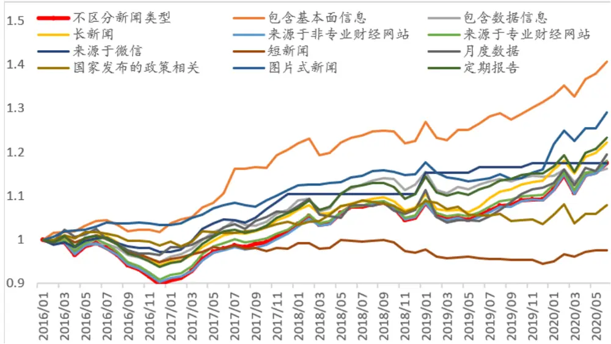
来源：通联数据，wind，中泰证券研究所

在所有类别中，包含基本面信息的新闻情绪因子表现明显优于其他类别。包含基本面信息的新闻一般包括宏观经济信息/产业战略发展方向/区域性经济信息/行业基本面信息、或公司基本信息，如公司主营业务收入/销售量/增发/减持等情况。从逻辑上讲，由基本面支撑的舆情对股价的影响相对确定性更强。

## 2.5 包含基本面信息的强相关新闻情绪因子

通联新闻数据库中，对每条新闻中涉及的个股分为0/1/2三个等级，其中2表示强相关，1表示弱相关，0表示不相关。对个股来说，不相关和弱相关的新闻所体现的情绪，不能确切反应市场对个股的评价及预期，因此在计算因子值时，可能成为干扰噪声。

在包含基本面信息的新闻中，分别对强相关（相关度=2）和弱相关（相关度=1）的新闻数据计算情绪因子并回测。无论是因子最高组的多头净值表现，还是多空净值曲线，强相关组均优于弱相关组。

图表14:包含基本面信息新闻下不同相关度情绪因子最高组表
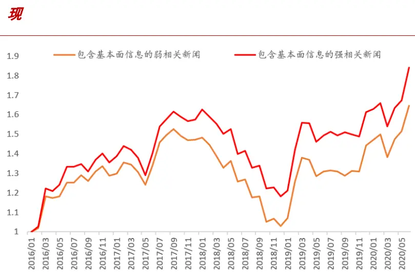
来源：通联数据，wind，中泰证券研究所

图表15：包含基本面信息新闻下不同相关度的情绪因子多空回测
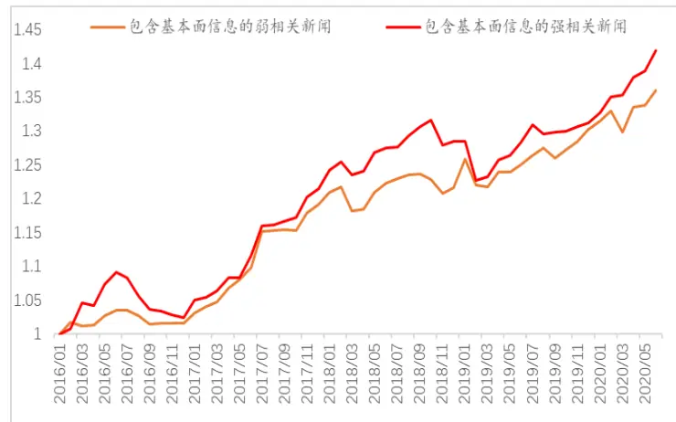
来源：通联数据，wind，中泰证券研究所

因此进一步用相关度对新闻情绪因子进行改进，采用包含基本面信息的强相关新闻计算情绪因子

图表16：包含基本面信息的强相关新闻情绪因子分档回测图表17：包含基本面信息的强相关新闻情绪因子多空回测对新闻标签和相关度进行改进后新闻情绪因子的多空年化收益率由3.65%提升至8.10%；因子最大组的多头年化收益率由 5.63%提升至14.53%，最大回撤由-32%缩小至-27.5%，相对基准月胜率由 63%提升至 69%；因子不同时期的分层单调性也有所提升。

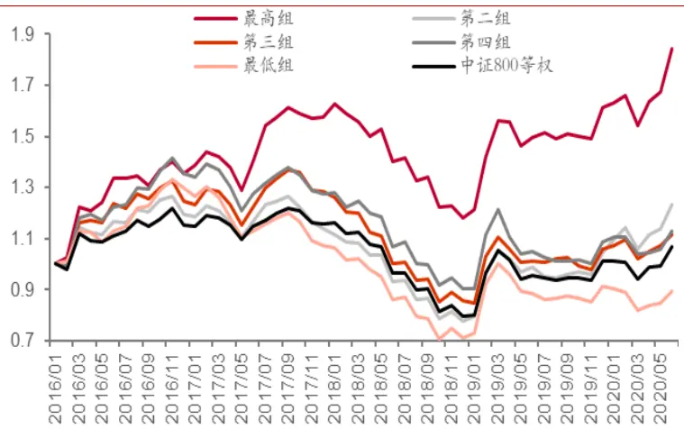
来源：通联数据，wind，中泰证券研究所

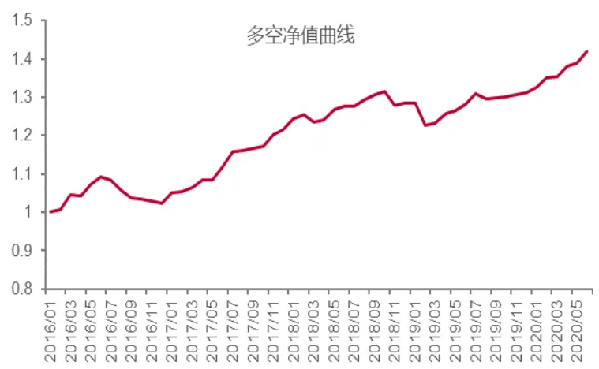
来源：通联数据，wind，中泰证券研究所

图表18：包含基本面信息的强相关新闻情绪因子收益表现

| 年化收益率 年化波动率 |  |  | 夏普率 最大回撤 |  |  |
| --- | --- | --- | --- | --- | --- |
| 多空组合 | 8.10% | 5.4% | 1.47 | -6.8% | 63% |
| 最高组 | 14.53% | 19.1% | 0.81 | -27.5% | 69% |
| 最低组 | -2.44% | 20.3% | -0.03 | -47.1% | 37% |
| 基准指数 | 1.43% | 18.0% | 0.16 | -34.7% | - |

来源：通联数据，wind，中泰证券研究所

## 三、新闻情绪因子在不同市值下表现

不同市值下，股票的新闻情绪可能存在天然差异。随着经济步入存量时代，白马股的关注度和新闻情感可能较高.而微型股的关注度和新闻情感可能有下降趋势。因此将A股按流通市值分为最低的30%、30%~60%、60%~80%、流通市值最高的20%四组，分别测试新闻情绪因子的选股效果当仅对原始新闻数据进行去重处理时，新闻情绪因子仅在超大市值组(流通

市值最高的20%）中呈明显的正单调性分层。其余三个市值组中，新闻情

绪因子都存在一定的反转效应，即情绪因子最大组跑输情绪因子较小组，且

市值越小，反转效应越明显(流通市值最低的30%组和流通市值30%~60%

组）。

流通市值较小的两组(流通市值最低的 30%组和流通市值 30%~60%组)不

仅新闻情绪因子单调性不明显，因子多空收益效果也不佳(这里计算因子多

空收益时，由于较小市值组中因子单调性不佳，采用净值曲线表现最好的因

子档作为多头，表现最差的因子档作为空头）。

进一步筛选包含基本面的强相关新闻数据计算情绪因子时，每个市值组的因

子单调性和因子收益均有提升。提升最多的是流通市值最小组(流通市值最

低的30%组）。

图表19：新闻情绪因子分市值多空净值

图表20：包含基本面的强相关新闻情绪因子分市值多空净值

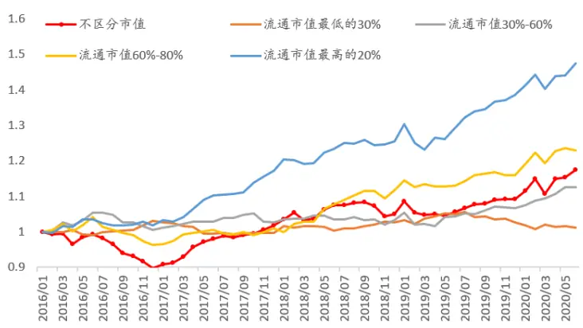
来源：通联数据，wind，中泰证券研究所

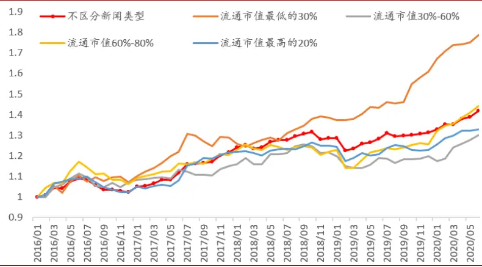
来源：通联数据，wind，中泰证券研究所

图表21：超大市值组新闻情绪因子分档回测
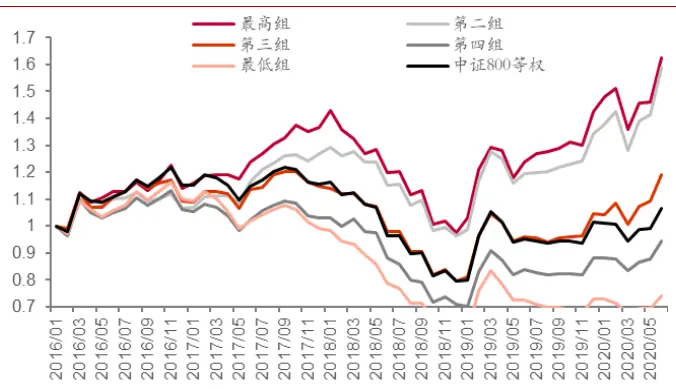
来源：通联数据，wind，中泰证券研究所

图表22:超小市值组包含基本面的强相关新闻情绪因子分档回测
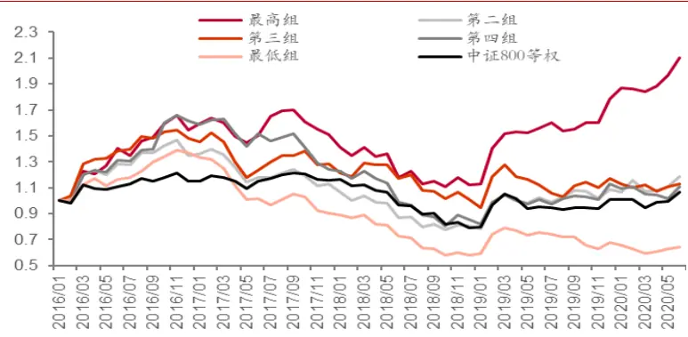
来源：通联数据，wind，中泰证券研究所

图表23：基本面信息下强相关新闻情绪因子分市值收益表现

| 流通市值最小 20% | 年化收益率 | 年化波动率 | 夏普率 | 最大回撤 | 相对基准月胜率 |
| --- | --- | --- | --- | --- | --- |
| 多空组合 | 13.78% | 7.6% | 1.74 | -4.8% | 59% |
| 最高组 | 17.90% | 23.0% | 0.83 | -34.8% | 61% |
| 最低组 | -9.28% | 21.6% | -0.35 | -58.4% | 43% |
| 基准指数 | 1.43% | 18.0% | 0.16 | -34.7% |  |
| 流通市值 30%~60% | 年化收益率 | 年化波动率 | 夏普率 | 最大回撤 | 相对基准月胜率 |
| 多空组合 | 6.00% | 6.7% | 0.90 | -9.3% | 59% |
| 最高组 | 6.79% | 22.0% | 0.40 | -37.3% | 54% |
| 最低组 | -5.69% | 23.5% | -0.14 | -55.1% | 39% |
| 基准指数 | 1.43% | 18.0% | 0.16 | -34.7% |  |
| 流通市值 60%~80% | 年化收益率 | 年化波动率 | 夏普率 | 最大回撤 | 相对基准月胜率 |
| 多空组合 | 8.47% | 7.4% | 1.13 | -9.2% | 59% |
| 最高组 | 12.36% | 19.8% | 0.69 | -32.3% | 56% |
| 最低组 | -5.59% | 23.1% | -0.14 | -41.9% | 31% |
| 基准指数 | 1.43% | 18.0% | 0.16 | -34.7% |  |

| 流通市值最大 20% | 年化收益率 | 年化波动率 | 夏普率 | 最大回撤 | 相对基准月胜率 |
| --- | --- | --- | --- | --- | --- |
| 多空组合 | 6.50% | 6.2% | 1.05 | -7.2% | 56% |
| 最高组 | 17.32% | 19.0% | 0.94 | -29.5% | 70% |
| 最低组 | 3.18% | 18.9% | 0.25 | -34.5% | 52% |
| 基准指数 | 1.43% | 18.0% | 0.16 | -34.7% | - |

来源：通联数据，wind，中泰证券研究所

不同市值下，新闻情绪因子的选股效果有以下规律：

1）新闻情绪在月频上，对大市值股票的影响较为持续；市值越小，反转效应越明显(即本月情绪最高的股票组合，次月收益最低)：当仅对新闻数据进行去重处理时，新闻情绪因子仅在较大市值的股票中有筛选效果，其中选股效果最好的是超大市值组(流通市值最大的20%)，因子收益高且因子分层单调稳定，多空年化收益达8.99%。

2）月频的新闻情绪对较小流通市值的股票影响不大。

3)对较小市值的股票做新闻情绪分析时，更应当注重结合基本面信息，尤其是规避基本面信息下的低情绪股票，其负收益可能性更大：采用包含基本面信息的强相关新闻数据后，较小市值中的新闻情绪因子表现提升明显，特别是流通市值最小组(流通市值最低的30%)，新闻情绪因子值最大档的年化收益率达17.90%，多空年化收益率达13.78%。

## 四、新闻舆情因子的其他刻画方法

## 4.1 新闻情绪差值因子

情绪的边际变化也可能对股价产生影响。每月末对个股该月的强相关新闻情

绪值（去重）求和，并与上个月作差，按情绪差值从大到小分为5档回测。

新闻情绪差值因子的分层单调性并不明显，但情绪变化最大组收益远远跑输

其余四组，即月度情绪提升最大的股票组合次月表现可能不及预期。

图表24：强相关新闻情绪差值因子分档回测
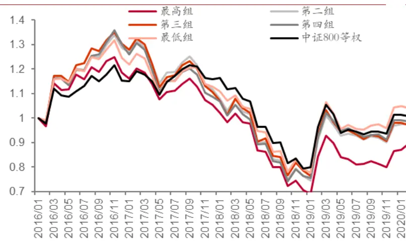
来源：通联数据，wind，中泰证券研究所

图表25：强相关新闻情绪差值因子多空回测
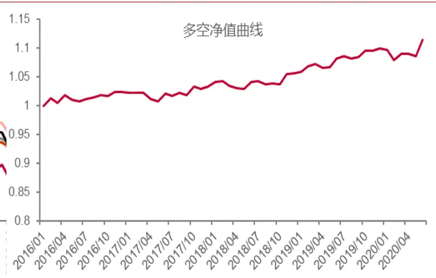
来源：通联数据，wind，中泰证券研究所

图表26：强相关新闻情绪差值因子收益表现

| 年化收益率 年化波动率 |  |  | 夏普率 最大回撤 |  |  |
| --- | --- | --- | --- | --- | --- |
| 多空组合 | 2.44% | 2.6% | 0.93 | -1.8% | 50% |
| 最高组 | -1.70% | 19.8% | 0.01 | -44.8% | 46% |
| 最低组 | 3.11% | 20.5% | 0.24 | -41.0% | 56% |
| 基准指数 | 1.43% | 18.0% | 0.16 | -34.7% | - |

来源：通联数据，wind，中泰证券研究所

结合新闻情绪的绝对值水平后新闻情绪变化因子也没有明显的单调性规

律，但注意到上月新闻情绪最低、本月新闻情绪提升最多的股票组合收益表现较差。因此单月的情绪底部反转可能并不适宜追多

图表27：低情绪下新闻情绪变化因子分档回测
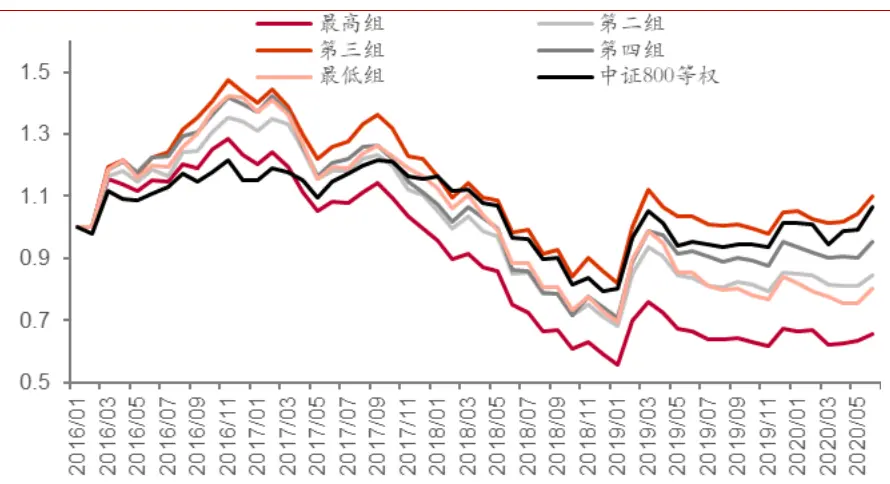
来源：通联数据，wind，中泰证券研究所

## 4.2 新闻情绪分歧度因子

新闻情感分歧度是衡量情感得分一致性程度的变量，如果月内新闻情感一致性很强，都是积极或消极情绪，则情感分歧度不大；如果月内新闻情感褒贬不一，则新闻情感分歧度较大。

用当月个股新闻情感数据的标准差作为情绪分歧度因子标准差下的分歧度因子没有明显的单调性分层。但结合新闻情绪的绝对值水平后，当月新闻情感的总值较高、且标准差较小的组合表现最好，即高一致性的高舆情组合有最高的月度收益表现。当月新闻情绪最高且标准差最低组年化收益约为23.17%，最大回撤为-19.5%，相对基准月胜率为70%。

此处新闻情绪的总值采用含基本面信息的强相关新闻数据计算;计算新闻情绪的标准差时不区分新闻类型，使用去重后的全部强相关新闻数据计算。

图表28：高情绪下新闻情绪标准差因子分档回测
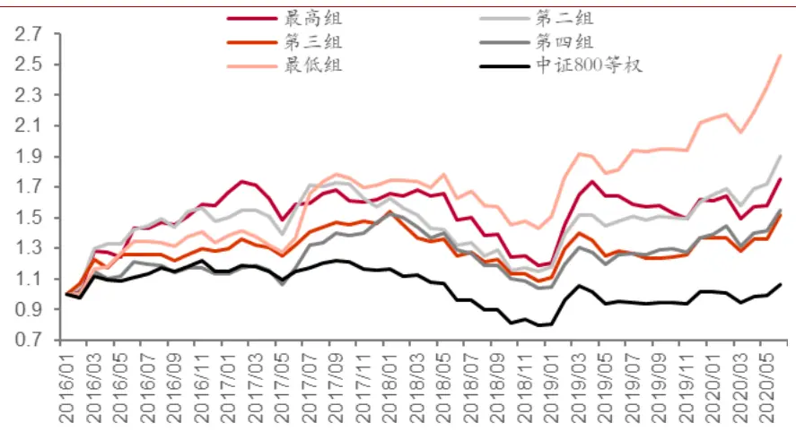
来源：通联数据，wind，中泰证券研究所

新闻情绪分歧度也可以用正向情感得分占比的方式表示，即：abs(个股当月正向新闻情感值之和)/(abs(当月正向新闻情感值之和)+abs(当月负向新闻情感值之和))。

用包含基本面信息的强相关新闻数据计算正向情感得分占比，正向情感得分占比越大，说明个股当月的正向情感一致性越强，从回测结果看，其次月收益也相应较高。正向情感占比最高的多头组合年化收益率为15.91%，正向情感占比最低的多头组合年化收益率仅为-4.52%，多空年化收益率为9.81%。

图表29:包含基本面的强相关新闻情绪分歧度因子分档回测

图表30:包含基本面的强相关新闻情绪分歧度因子多空回测

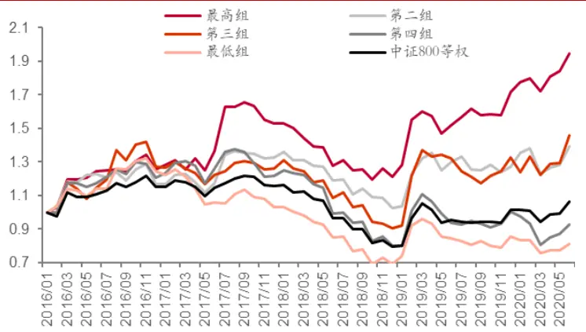
来源：通联数据，wind，中泰证券研究所

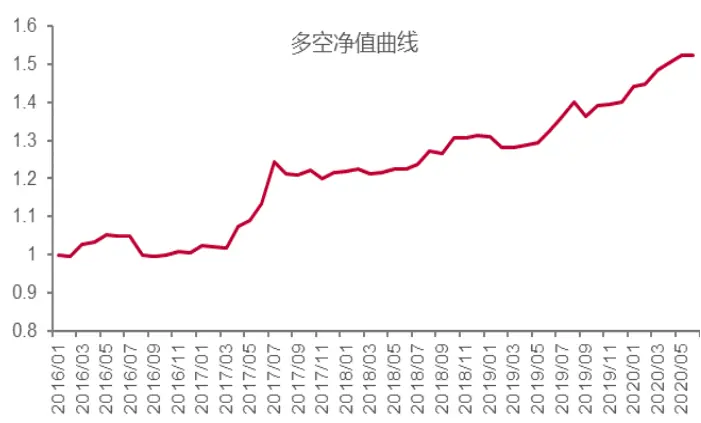
来源：通联数据，wind，中泰证券研究所

图表31：包含基本面的强相关新闻情绪分歧度因子收益表现

| 年化收益率 年化波动率 夏普率 最大回撤 相对基准月胜率 |  |  |  |  |  |
| --- | --- | --- | --- | --- | --- |
| 多空组合 | 9.81% | 7.4% | 1.31 | -5.4% | 59% |
| 最高组 | 15.91% | 19.9% | 0.84 | -28.0% | 67% |
| 最低组 | -4.52% | 20.5% | -0.13 | -47.8% | 37% |
| 基准指数 | 1.43% | 18.0% | 0.16 | -34.7% | - |

来源：通联数据，wind，中泰证券研究所

## 五、新闻舆情多头策略

根据上文数据分析，从多头组合策略角度，有三种多头策略收益表现较好。

在强相关且去重的新闻数据中，分别筛选：

1）高情绪组合：当月包含基本面信息的新闻情感值之和最高的股票组合；

2)高情绪、低标准差组合：当月包含基本面信息的新闻情感值之和最高、且总体新闻情感的标准差最低的股票组合；

3）高正向情绪占比组合：当月包含基本面的新闻中，正向情感得分占比最高的股票组合。

图表32：三种新闻情绪多头策略净值曲线其中高情绪、低标准差组合表现最好，年化收益率达23.17%，最大回撤为-19.5%，相对基准月胜率为70%。包含基本面信息新闻的高情绪组合和高正向情绪占比组合表现接近，年化收益率约为15%，最大回撤约为-28%。将三种多头选股条件叠加后，组合收益可以进一步提升。在强相关且去重的新闻数据基础上，首先对新闻情感的绝对水平进行筛选，选择当月包含基本面信息的新闻情感之和位于前 20%的股票；再在其中选择总体新闻情感标准差位于后20%、且总体新闻正向情感占比位于前 20%的股票，形成高情绪、低标准差、高正向情感占比的多头组合。组合多头持仓年化收益率提升至31.22%，最大回撤减小至-17.2%，相对基准月胜率为70%。

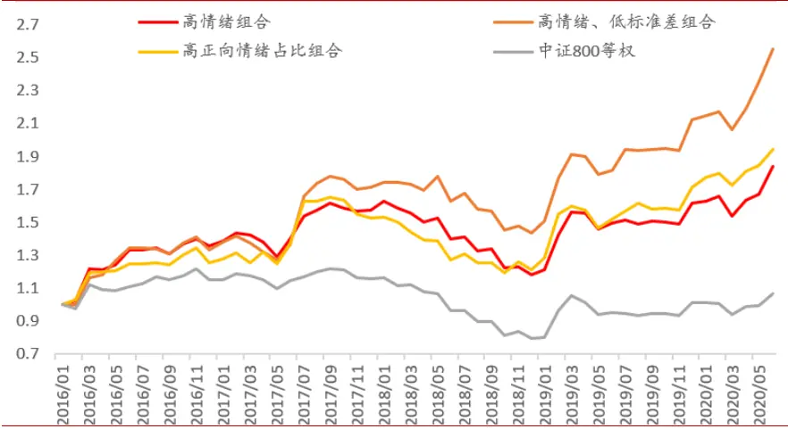
来源：通联数据，wind，中泰证券研究所

图表33：三种新闻情绪多头策略表现

|  | 年化收益率 | 年化波动率 | 夏普率 | 最大回撤 | 相对基准月胜率 |
| --- | --- | --- | --- | --- | --- |
| 高情绪组合 | 14.53% | 19.1% | 0.81 | -27.5% | 69% |
| 高情绪、低标准差组合 | 23.17% | 20.3% | 1.13 | -19.5% | 70% |
| 高正向情绪占比组合 | 15.91% | 19.9% | 0.84 | -28.0% | 67% |
| 基准指数 | 1.43% | 18.0% | 0.16 | -34.7% |  |

来源：通联数据，wind，中泰证券研究所

图表34：高情绪、低标准差、高正向情感占比多头组合
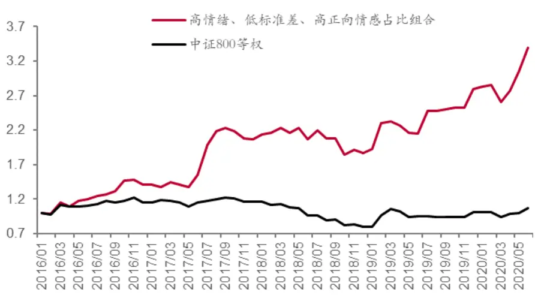
来源：通联数据，wind，中泰证券研究所

图表35：高情绪、低标准差、高正向情感占比多头组合表现

|  | 年化收益率 | 年化波动率 | 夏普率 | 最大回撤 | 相对基准月胜率 |
| --- | --- | --- | --- | --- | --- |
| 高情绪、低标准差、高正向情 | 31.22% | 25.0% | 1.21 | -17.2% | 70% |
| 感占比多头组合 基准指数 | 1.43% | 18.0% | 0.16 | -34.7% |  |

来源：通联数据，wind，中泰证券研究所

风险提示：1）单因子测试结果是历史经验的总结，回测结果依赖于2016年以来的历史数据，存在失效的可能；2）监管政策超预期变动，外部环境超预期变化等因素可能对市场风格产生影响。

## 投资评级说明：

|  | 评级 | 说明 |
| --- | --- | --- |
| 股票评级 | 买入 | 预期未来6~12个月内相对同期基准指数涨幅在15%以上 |
|  | 增持 | 预期未来 6~12 个月内相对同期基准指数涨幅在 5%~15%之间 |
|  | 持有 | 预期未来6~12个月内相对同期基准指数涨幅在-10%~+5%之间 |
|  | 减持 | 预期未来6~12个月内相对同期基准指数跌幅在10%以上 |
| 行业评级 | 增持 | 预期未来6~12个月内对同期基准指数涨幅在10%以上 |
|  | 中性 | 预期未来6~12个月内对同期基准指数涨幅在-10%~+10%之间 |
|  | 减持 | 预期未来6~12个月内对同期基准指数跌幅在10%以上 |
| 备注：评级标准为报告发布日后的6~12个月内公司股价（或行业指数）相对同期基准指数的相对市场表现。其中A股市场以沪深 300指数为基准；新三板市场以三板成指（针对协议转让标的）或三板做市指数（针对做市转让标的）为基准；香港市场以摩根士丹利中国指数为基准，美股市场以标普500指数或纳斯达克综合指数为基准（另有说明的除外）。 |  |  |

## 重要声明：

中泰证券股份有限公司（以下简称“本公司”）具有中国证券监督管理委员会许可的证券投资咨询业务资格。本报告仅供本公司的客户使用。本公司不会因接收人收到本报告而视其为客户。

本报告基于本公司及其研究人员认为可信的公开资料或实地调研资料，反映了作者的研究观点，力求独立、客观和公正，结论不受任何第三方的授意或影响。但本公司及其研究人员对这些信息的准确性和完整性不作任何保证，且本报告中的资料、意见、预测均反映报告初次公开发布时的判断，可能会随时调整。本公司对