“蓝海启航”系列研究之二

## 新闻情绪数据在中低频Alpha中的应用

招商证券研究发展中心周靖明

zhoujingming@cmschina.com.cn

S1090519080007

2022年09月

## 前言

- 新闻情绪数据介绍• 数据相关统计分析

## 因子构建

- 新闻情绪因子构建

- 新闻情绪因子测试结果

- 新闻情绪因子改进提升

## 应用探讨

- 新闻情绪在事件驱动策略中的应用

- 融合了新闻情绪因子的选股策略

- 新闻情绪因子对传统因子的改进和提升

## 总结展望

- 总结与后续研究展望

## 第一节 前言：新闻情绪数据概览

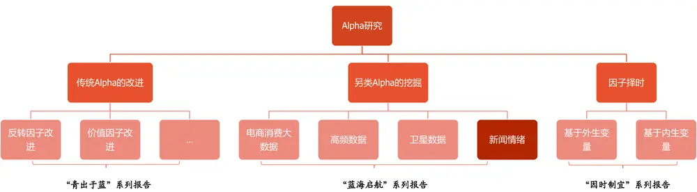
资料来源：招商证券研究与发展中心

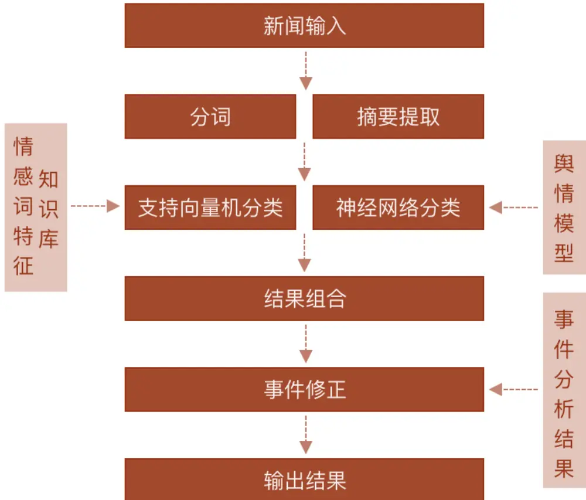

新闻与个股的相关程度，取值为0-1之间

新闻分类结果，0为中性，1为负面，2为正面

新闻结果所对应的概率

三种分类的概率明细

| stockCode | companyId | chineseName | englishName | newsId | newsTs | relevance | emotionIndicator | emotionWeight | emotionDetail |  |  |
| --- | --- | --- | --- | --- | --- | --- | --- | --- | --- | --- | --- |
| TSLA-NQ-EQ | CSF0000201106 | 特斯拉 | Tesla | 24097266 | 2020/9/1 0:00 | 0.75 | 1 | 0.85 | {0=0.0821, | 1=0.8536, | 2=0.0642} |
| 00700_HK_EQ | CSF0000000275 | 腾讯控股 | TENCENT HLD | 24097278 | 2020/9/1 0:01 | 0.04 | 1 | 0.86 | {0=0.1362, | 1=0.8631, | 2=7.0E-4} |
| 601577-SH-EQ | CSF0000002244 | 长沙银行 | Bank of Changsha | 24097278 | 2020/9/1 0:01 | 0.83 | 1 | 0.88 | {0=0.1129, | 1=0.8759, | 2=0.0111} |
| 002230_SZ_EQ | CSF0000002456 | 科大讯飞 | Iflytek | 24097278 | 2020/9/1 0:01 | 0.04 | 1 | 0.87 | {0=0.1336, | 1=0.8657, | 2=7.0E-4} |
| 06198-HK-EQ | CSF0000003258 | 青岛港 | Qingdao Port | 24097281 | 2020/9/1 0:01 | 0.07 | 0 | 0.43 | {0=0.4268, | 1=0.384, | 2=0.1892} |
| 601298_SH_EQ | CSF0000003258 | 青岛港 | Qingdao Port | 24097281 | 2020/9/1 0:01 | 0.07 | 0 | 0.43 | {0=0.4268, | 1=0.384, | 2=0.1892} |
| 06818-HK_EQ | CSF0000000443 | 光大银行 | CEB | 24097285 | 2020/9/1 0:01 | 0.06 | 0 | 0.54 | {0=0.5381, | 1=0.2561, | 2=0.2058} |
| 002468_SZ_EQ | CSF0000000505 | 申通快递 | STO Express | 24097304 | 2020/9/1 0:02 | 1.00 | 2 | 0.75 | {0=0.0761, | 1=0.1784, | 2=0.7455} |

资料来源：ChinaScope,招商证券研究与发展中心

不同月份所覆盖的A股相关新闻总数
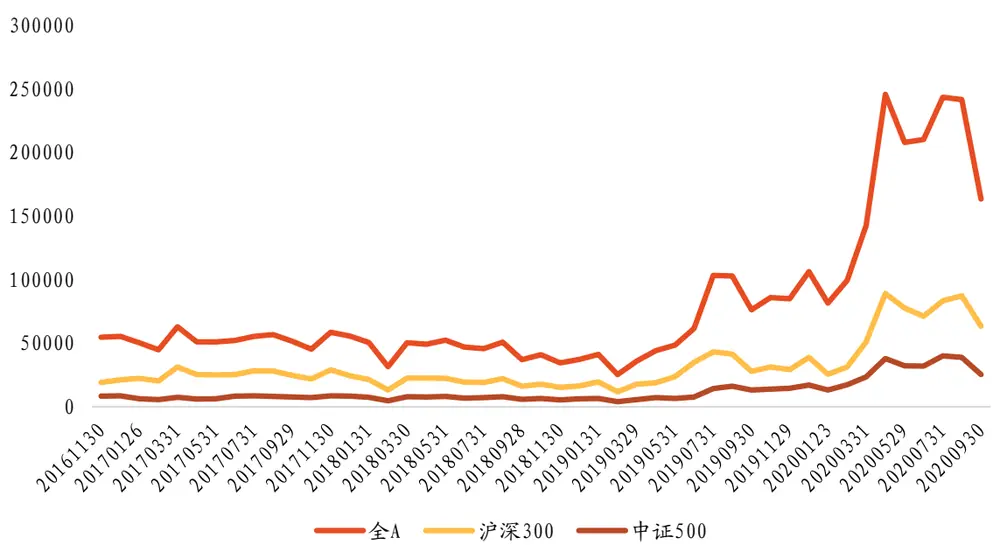

三类新闻数量及占比
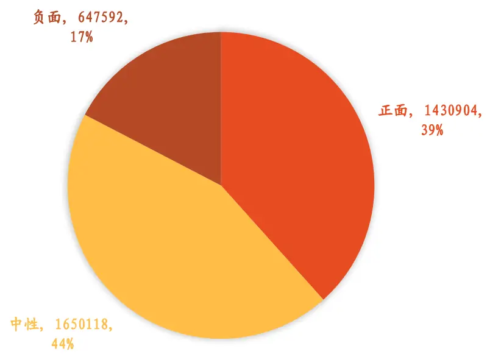
资料来源：ChinaScope，招商证券研究与发展中心，统计区间：20161130-20200930

## 新闻情绪数据的覆盖度

- 截至20200930，新闻数据在全A、沪深300和中证500指数中的覆盖股票数目分别为3957、299和500；个股覆盖比例分别为97.92%、99.67%和100%。

不同指数成份股中覆盖股票数目
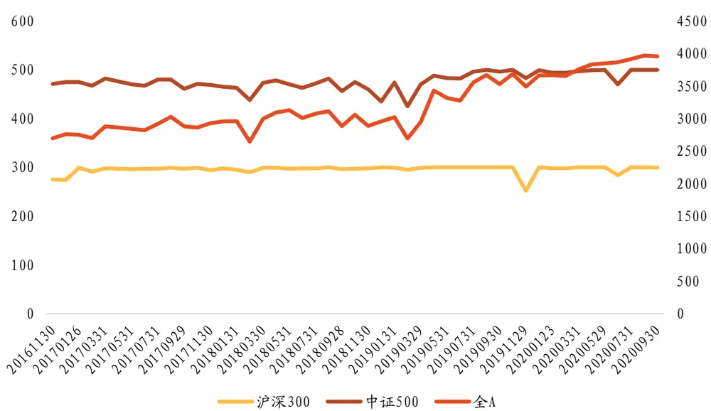

不同指数成份股中覆盖股票占比
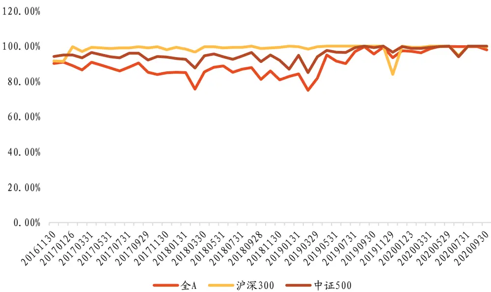
资料来源：ChinaScope，招商证券研究与发展中心，统计区间：20161130-20200930

- 我们将个股月平均流通市值的对数与该月相关新闻总数的对数进行回归。回归结果表明个股相关的新闻数与其市值大小存在显著正向相关性。

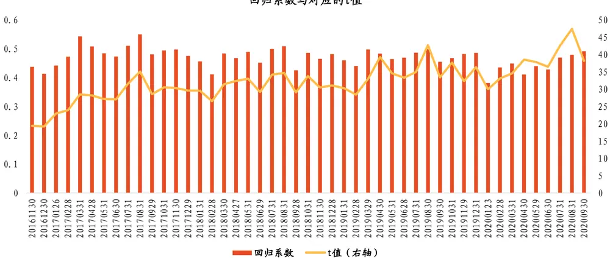
资料来源：ChinaScope，招商证券研究与发展中心，统计区间：20161130-20200930

## 第二节 新闻情绪因子的构建及延伸

## 单个新闻情绪得分如何计算？

- 单个新闻得分= 单个新闻的正面概率–负面概率

## 过去一段时间内个股新闻情绪如何刻画？

- 对过去一段时间内所有新闻的情绪分求和。

- 是否应该根据相关性对新闻进行过滤？

- 考虑用相关性对单个新闻的得分进行修正，并剔除相关性小于0.7的新闻。

## 是否应该考虑新闻的时效性？

- 越新的新闻影响越大，我们采取时间衰减法对不同事件得分进行加权求和。

## 是否剔除中性新闻？

- 中性新闻同样带来过多噪音，我们对中性新闻进行剔除。

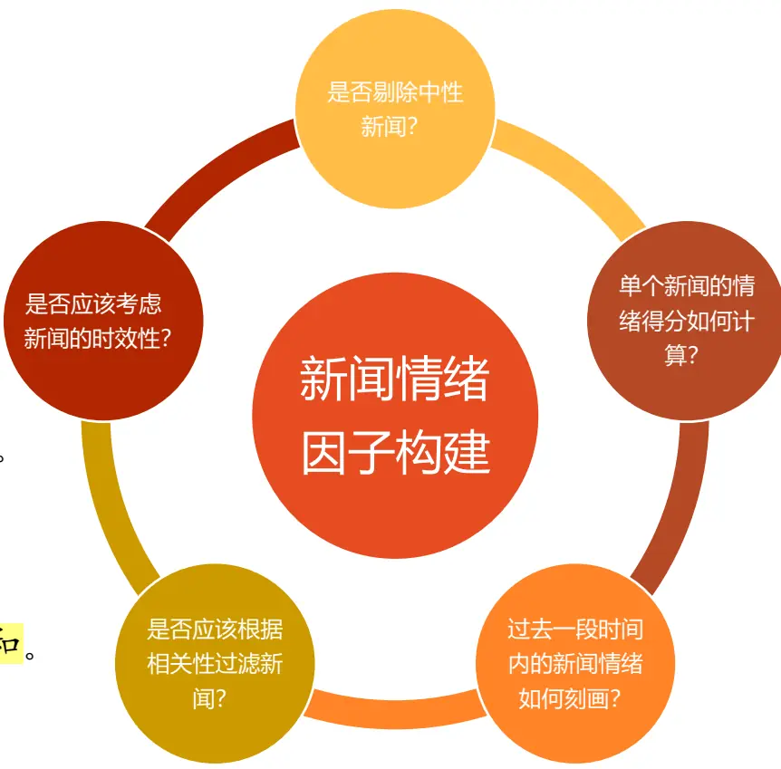
资料来源：招商证券研究与发展中心

| 因子 | 定义方式 |
| --- | --- |
| Avg-Score | 对过去一段时间所有相关新闻的情绪得分求和 |
| Avg-Score_REL | 对过去一段时间所有相关新闻的相关性修正情绪得分求和 |
| Avg-Score_T | 按照时间衰减的加权方式，对过去一段时间所有相关新闻的情绪得分求和 |
| Avg_Score_REL_T | 按照时间衰减的加权方式，对过去一段时间所有相关新闻的相关性修正情绪得分求和 |
| Avg-Score_REL_Ex | 剔除相关性低于0.7的新闻后，对过去一段时间所有相关新闻的相关性修正情绪得分求和 |
| Avg_Score_REL_T_Ex | 剔除相关性低于0.7的新闻后，按照时间衰减的加权方式，对过去一段时间所有相关新闻的相关性修正情绪得分求和 |
| Avg-Score_Num | 正负面新闻数目之差占二者总数的比重 |
| Avg_Score_Num_Ex | 剔除相关性低于0.7的新闻后，正负面新闻数目之差占二者总数的比重 |

资料来源：招商证券研究与发展中心

| 因子 | 平均值 | 标准差 | 最小值 | 最大值 | IC_IR | t统计量 | 平均股票数 IC×Sqrt(N) |  | 有效期数 |
| --- | --- | --- | --- | --- | --- | --- | --- | --- | --- |
| Avg-Score | 2.09% | 8.65% | -18.21% | 18.48% | 0.24 | 1.64 | 2836 | 1.11 | 46 |
| Avg-Score_Num | 1.16% | 5.64% | -13.37% | 12.30% | 0.20 | 1.39 | 2836 | 0.62 | 46 |
| Avg-Score_Num_Ex | 1.08% | 6.08% | -20.42% | 11.26% | 0.18 | 1.21 | 2472 | 0.54 | 46 |
| Avg_Score_REL | 1.75% | 7.78% | -20.88% | 17.31% | 0.22 | 1.52 | 2836 | 0.93 | 46 |
| Avg-Score_REL_Ex | 1.78% | 8.08% | -24.47% | 19.03% | 0.22 | 1.49 | 2472 | 0.88 | 46 |
| Avg-Score_REL_T | 1.59% | 7.59% | -20.13% | 17.68% | 0.21 | 1.42 | 2836 | 0.85 | 46 |
| Avg-Score_REL_T_Ex | 1.65% | 7.85% | -23.97% | 18.81% | 0.21 | 1.43 | 2472 | 0.82 | 46 |
| Avg_Score_T | 1.93% | 8.43% | -18.39% | 19.04% | 0.23 | 1.55 | 2836 | 1.03 | 46 |
| 因子 | 平均值 | 标准差 | 最小值 | 最大值 | IC_IR | t统计量 | 平均股票数 IC×Sqrt (N) |  | 有效期数 |
| Avg-Score | 3.75% | 11.41% | -21.35% | 25.88% | 0.33 | 2.23 | 292 | 0.64 | 46 |
| Avg-Score_Num | 0.81% | 10.10% | -22.39% | 19.44% | 0.08 | 0.54 | 292 | 0.14 | 46 |
| Avg-Score_Num_Ex | -0.46% | 9.73% | -26.12% | 15.69% | -0.05 | -0.32 | 276 | -0.08 | 46 |
| Avg-Score_REL | 3.01% | 11.98% | -26.61% | 27.05% | 0.25 | 1.71 | 292 | 0.51 | 46 |
| Avg-Score_REL_Ex | 3.19% | 12.01% | -26.25% | 26.24% | 0.27 | 1.80 | 276 | 0.53 | 46 |
| Avg-Score_REL_T | 3.39% | 11.36% | -23.68% | 27.32% | 0.30 | 2.03 | 292 | 0.58 | 46 |
| Avg-Score_REL_T_Ex | 3.72% | 11.47% | -25.14% | 30.09% | 0.32 | 2.20 | 276 | 0.62 | 46 |
| Avg-Score_T | 3.88% | 11.03% | -20.39% | 26.53% | 0.35 | 2.39 | 292 | 0.66 | 46 |
| 因子 | 平均值 | 标准差 | 最小值 | 最大值 | IC_IR | t统计量 |  |  |  |
| Avg-Score | 1.07% | 8.95% | -16.89% | 26.06% | 0.12 | 0.81 | 451 | 平均股票数 IC×Sqrt (N) 0.23 | 有效期数 |
| Avg_Score_Num | 0.84% | 8.12% | -18.85% | 17.98% | 0.10 | 0.70 | 451 | 0.18 | 46 46 |
| Avg-Score_Num_Ex | 1.47% | 8.29% | -23.76% | 19.73% | 0.18 | 1.20 | 391 | 0.29 | 46 |
| Avg-Score_REL | 0.11% | 8.43% | -18.93% | 19.89% | 0.01 | 0.09 | 451 | 0.02 | 46 |
| Avg-Score_REL_Ex | -0.60% | 8.62% | -23.94% | 17.80% | -0.07 | -0.47 | 391 | -0.12 | 46 |
| Avg-Score_REL_T | 0.21% | 8.22% | -21.97% | 16.55% | 0.03 | 0.17 | 451 | 0.04 | 46 |
| Avg-Score_REL_T_Ex | -0.38% | 8.63% | -27.34% | 16.36% | -0.04 | -0.30 | 391 | -0.08 | 46 |
| Avg-Score_T | 0.94% | 8.65% | -17.40% | 21.94% | 0.11 | 0.73 | 451 | 0.20 | 46 |

资料来源：Wind，招商证券研究与发展中心

- 沪深300

| 因子 | 总收益率 | 年化收益率 | 波动率 | Sharpe比率 | 最大回撤率 |
| --- | --- | --- | --- | --- | --- |
| Avg-Score | 86.80% | 17.69% | 10.31% | 1.72 | 13.65% |
| Avg-Score_Num | 24.34% | 5.84% | 6.67% | 0.88 | 12.04% |
| Avg_Score_Num_Ex | 23.61% | 5.68% | 6.34% | 0.90 | 7.32% |
| Avg-Score_REL | 75.62% | 15.81% | 9.42% | 1.68 | 13.85% |
| Avg-Score_REL_Ex | 78.88% | 16.37% | 9.65% | 1.70 | 14.41% |
| Avg_Score_REL_T | 65.63% | 14.06% | 9.23% | 1.52 | 14.02% |
| Avg-Score_REL_T_Ex | 73.30% | 15.41% | 9.47% | 1.63 | 15.13% |
| Avg-Score_T | 82.13% | 16.92% | 10.25% | 1.65 | 13.14% |
| 因子 | 总收益率 | 年化收益率 | 波动率 | Sharpe比率 | 最大回撤率 |
| Avg-Score | 70.70% | 14.96% | 11.36% | 1.32 | 15.62% |
| Avg-Score_Num | 0.91% | 0.24% | 9.31% | 0.03 | 14.85% |
| Avg_Score_Num_Ex | 25.23% | 6.04% | 10.46% | 0.58 | 26.67% |
| Avg-Score_REL | 46.23% | 10.42% | 12.36% | 0.84 | 21.15% |
| Avg-Score_REL_Ex | 45.40% | 10.25% | 12.31% | 0.83 | 24.11% |
| Avg-Score_REL_T | 33.88% | 7.90% | 11.70% | 0.68 | 23.23% |
| Avg-Score_REL_T_Ex | 25.08% | 6.01% | 11.74% | 0.51 | 24.62% |
| Avg-Score_T | 88.46% | 17.96% | 11.00% | 1.63 | 16.13% |
| 因子 | 总收益率 | 年化收益率 | 波动率 | Sharpe比率 | 最大回撤率 |
| Avg-Score | 10.66% | 2.68% | 11.29% | 0.24 | 19.66% |
| Avg_Score_Num | 14.41% | 3.57% | 9.42% | 0.38 | 18.23% |
| Avg_Score_Num_Ex | 42.73% | 9.72% | 9.71% | 1.00 | 12.43% |
| Avg-Score_REL | -8.46% | -2.28% | 10.67% | -0.21 | 28.79% |
| Avg-Score_REL_Ex | -14.61% | -4.03% | 11.13% | -0.36 | 28.43% |
| Avg_Score_REL_T | 0.48% | 0.12% | 10.41% | 0.01 | 17.44% |
| Avg-Score_REL_T_Ex | 4.88% | 1.25% | 10.80% | 0.12 | 17.19% |
| Avg-Score_T | 28.11% | 6.67% | 11.05% | 0.60 | 14.30% |

资料来源：Wind，招商证券研究与发展中心

- 从相关性分析来看，我们所构建的新闻情绪因子大多偏大市值。而2017年以来，大市值风格能够贡献明显的Alpha。因此，必须对市值的影响予以剔除。

因子与流通市值的对数的相关性
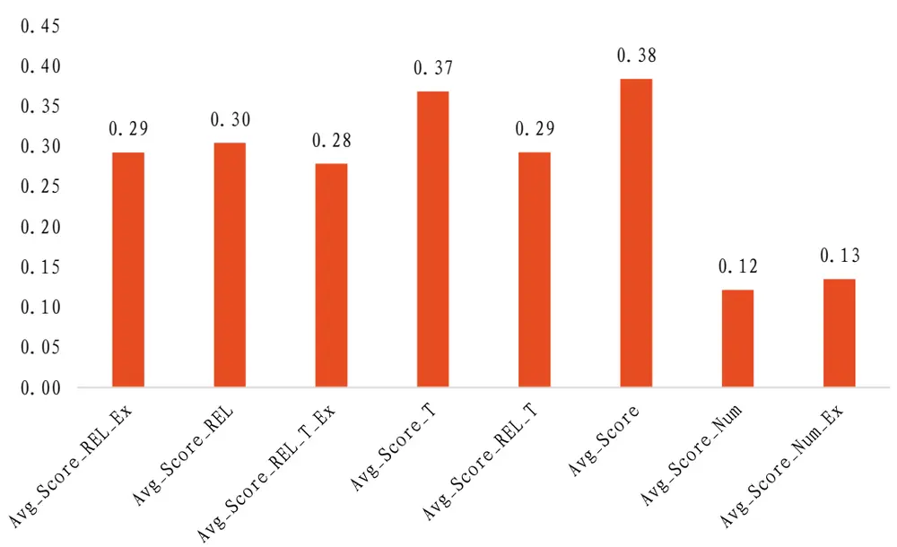

因子与总市值对数的相关性
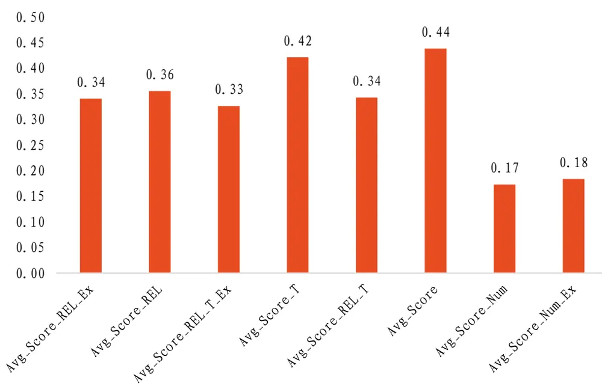
资料来源：Wind，招商证券研究与发展中心

| 因子 | 平均值 | 标准差 | 最小值 | 最大值 | IC_IR | t统计量 | 平均股票数 IC×Sqrt (N) |  | 有效期数 |
| --- | --- | --- | --- | --- | --- | --- | --- | --- | --- |
| Avg-Score | 1.24% | 5.36% | -12.54% | 12.24% | 0.23 | 1.57 | 2836 | 0.66 | 46 |
| Avg-Score_Num | 1.08% | 4.71% | -11.35% | 9.27% | 0.23 | 1.55 | 2836 | 0.57 | 46 |
| Avg-Score_Num_Ex | 0.78% | 4.86% | -12.60% | 9.62% | 0.16 | 1.09 | 2472 | 0.39 | 46 |
| Avg_Score_REL | 1.10% | 5.12% | -11.89% | 11.56% | 0.22 | 1.46 | 2836 | 0.59 | 46 |
| Avg-Score_REL_Ex | 1.25% | 5.33% | -14.45% | 11.56% | 0.24 | 1.60 | 2472 | 0.62 | 46 |
| Avg-Score_REL_T | 0.97% | 5.10% | -11.79% | 10.99% | 0.19 | 1.28 | 2836 | 0.51 | 46 |
| Avg-Score_REL_T_Ex | 1.09% | 5.32% | -14.80% | 10.47% | 0.20 | 1.39 | 2472 | 0.54 | 46 |
| Avg_Score_T | 1.08% | 5.33% | -12.28% | 10.83% | 0.20 | 1.38 | 2836 | 0.58 | 46 |
| 因子 | 平均值 | 标准差 | 最小值 | 最大值 | IC_IR | t统计量 | 平均股票数 IC×Sqrt (N) |  | 有效期数 |
| Avg-Score | 2.33% | 8.63% | -16.23% | 18.93% | 0.27 | 1.83 | 292 | 0.40 | 46 |
| Avg-Score_Num | 0.91% | 7.38% | -18.18% | 15.09% | 0.12 | 0.83 | 292 | 0.16 | 46 |
| Avg-Score_Num_Ex | -0.42% | 6.79% | -13.60% | 17.72% | -0.06 | -0.42 | 276 | -0.07 | 46 |
| Avg-Score_REL | 1.72% | 9.10% | -16.34% | 22.51% | 0.19 | 1.28 | 292 | 0.29 | 46 |
| Avg-Score_REL_Ex | 1.87% | 8.99% | -17.45% | 21.90% | 0.21 | 1.41 | 276 | 0.31 | 46 |
| Avg-Score_REL_T | 2.17% | 8.60% | -14.69% | 21.50% | 0.25 | 1.71 | 292 | 0.37 | 46 |
| Avg-Score_REL_T_Ex | 2.53% | 8.50% | -15.32% | 22.70% | 0.30 | 2.02 | 276 | 0.42 | 46 |
| Avg-Score_T | 2.42% | 8.15% | -14.33% | 19.38% | 0.30 | 2.01 | 292 | 0.41 | 46 |
| 因子 | 平均值 | 标准差 | 最小值 | 最大值 | IC_IR |  |  |  |  |
| Avg-Score | 0.56% | 7.30% | -15.90% | 21.32% | 0.08 | t统计量 0.52 | 451 | 平均股票数 IC×Sqrt (N) 0.12 | 有效期数 |
| Avg_Score_Num | 0.91% | 7.59% | -14.42% | 19.79% | 0.12 | 0.81 | 451 | 0.19 | 46 |
| Avg-Score_Num_Ex | 0.89% | 6.97% | -15.81% | 19.55% | 0.13 | 0.86 | 391 | 0.18 | 46 46 |
| Avg-Score_REL | -0.16% | 7.02% | -16.11% | 17.13% | -0.02 | -0.15 | 451 | -0.03 | 46 |
| Avg-Score_REL_Ex | -0.63% | 7.37% | -14.42% | 18.03% | -0.09 | -0.58 | 391 | -0.12 | 46 |
| Avg-Score_REL_T | -0.10% | 6.85% | -13.87% | 15.77% | -0.01 | -0.10 | 451 | -0.02 | 46 |
| Avg-Score_REL_T_Ex | -0.49% | 7.25% | -16.52% | 17.14% | -0.07 | -0.46 | 391 | -0.10 | 46 |
| Avg-Score_T | 0.39% | 7.10% | -13.13% | 18.47% | 0.06 | 0.38 | 451 | 0.08 | 46 |

资料来源：Wind，招商证券研究与发展中心

## 中性化后测试结果—回溯20D-月度调仓-多空组合

| 因子 | 总收益率 | 年化收益率 | 波动率 | Sharpe比率 | 最大回撤率 |
| --- | --- | --- | --- | --- | --- |
| Avg-Score | 68.56% | 14.58% | 6.98% | 2.09 | 9.46% |
| Avg-Score_Num | 39.73% | 9.11% | 5.57% | 1.64 | 8.50% |
| Avg-Score_Num_Ex | 36.00% | 8.35% | 5.46% | 1.53 | 8.48% |
| Avg-Score_REL | 60.69% | 13.16% | 6.45% | 2.04 | 9.98% |
| Avg-Score_REL_Ex | 69.43% | 14.74% | 6.76% | 2.18 | 9.67% |
| Avg_Score_REL_T | 62.03% | 13.41% | 6.41% | 2.09 | 10.20% |
| Avg-Score_REL_T_Ex | 68.90% | 14.64% | 6.73% | 2.17 | 11.04% |
| Avg_Score_T | 72.62% | 15.30% | 6.88% | 2.22 | 9.56% |
| 因子 | 总收益率 | 年化收益率 | 波动率 | Sharpe比率 | 最大回撤率 |
| Avg-Score | 59.43% | 12.93% | 9.97% | 1.30 | 11.80% |
| Avg-Score_Num | 21.58% | 5.23% | 9.05% | 0.58 | 13.28% |
| Avg-Score_Num_Ex | 3.05% | 0.79% | 8.80% | 0.09 | 18.09% |
| Avg-Score_REL | 33.51% | 7.83% | 10.00% | 0.78 | 18.90% |
| Avg-Score_REL_Ex | 20.85% | 5.06% | 10.18% | 0.50 | 21.59% |
| Avg-Score_REL_T | 41.30% | 9.43% | 9.79% | 0.96 | 11.98% |
| Avg-Score_REL_T_Ex | 19.80% | 4.82% | 10.02% | 0.48 | 16.56% |
| Avg-Score_T | 64.17% | 13.80% | 9.47% | 1.46 | 11.69% |
| 因子 | 总收益率 | 年化收益率 | 波动率 | Sharpe比率 | 最大回撤率 |
| Avg-Score | -2.56% | -0.67% | 9.78% | -0.07 | 18.22% |
| Avg-Score_Num | 38.92% | 8.95% | 8.60% | 1.04 | 12.01% |
| Avg-Score_Num_Ex | 12.57% | 3.13% | 8.63% | 0.36 | 19.01% |
| Avg-Score_REL | -2.18% | -0.57% | 9.47% | -0.06 | 19.57% |
| Avg-Score_REL_Ex | -4.30% | -1.14% | 9.92% | -0.11 | 21.19% |
| Avg_Score_REL_T | 1.66% | 0.43% | 9.31% | 0.05 | 15.75% |
| Avg-Score_REL_T_Ex | 3.14% | 0.81% | 9.70% | 0.08 | 16.54% |
| Avg-Score_T | 9.58% | 2.41% | 9.68% | 0.25 | 15.68% |

资料来源：Wind，招商证券研究与发展中心

- 行业市值中性化以后，因子IC整体略有下降。但由于整体的波动性和最大回撤明显降低，所以因子多空组合的风险调整后表现多数反而有所提升。

- 进行了相关性加权和剔除的因子，整体表现受中性化的影响较小。

- 无论是否进行中性化，新闻情绪因子在全A和沪深300中的选股效果均更为突出，而在中证500中则表现一般。

表：十分位组合测试结果

| 组合 | 总收益率 | 年化收益率 | 波动率 | Sharpe比率 | 平均换手率最 | 大回撤率超 | 额收益率 | 年化超额收益率 | 跟踪误差 | 信息比率 |
| --- | --- | --- | --- | --- | --- | --- | --- | --- | --- | --- |
| 0 | -5.08% | -1.35% | 22.53% | -0.06 | 6.63% | 42.85% | 13.32% | 3.31% | 3.88% | 0.85 |
| 1 | -10.86% | -2.95% | 22.88% | -0.13 | 8.54% | 46.54% | 6.85% | 1.74% | 3.20% | 0.55 |
| 2 | -12.10% | -3.31% | 22.99% | -0.14 | 8.80% | 46.01% | 5.52% | 1.41% | 2.71% | 0.52 |
| 3 | -9.97% | -2.70% | 22.72% | -0.12 | 8.92% | 44.90% | 7.87% | 2.00% | 2.33% | 0.86 |
| 4 | -8.13% | -2.19% | 22.76% | -0.10 | 9.00% | 47.81% | 10.12% | 2.54% | 2.36% | 1.08 |
| 5 | -10.86% | -2.95% | 22.37% | -0.13 | 9.00% | 47.60% | 6.49% | 1.65% | 2.31% | 0.72 |
| 6 | -15.40% | -4.27% | 22.52% | -0.19 | 8.99% | 46.80% | 1.19% | 0.31% | 2.38% | 0.13 |
| 7 | -17.71% | -4.95% | 22.45% | -0.22 | 8.93% | 48.44% | -1.64% | -0.43% | 2.49% | -0.17 |
| 8 | -21.71% | -6.18% | 22.41% | -0.28 | 8.64% | 49.72% | -6.50% | -1.74% | 3.00% | -0.58 |
| 9 | -45.29% | -14.55% | 22.01% | -0.66 | 7.15% | 55.65% | -35.03% | -10.63% | 4.53% | -2.35 |
| L-S | 72.62% | 15.30% | 6.88% | 2.22 |  | 9.56% |  |  |  |  |

十分位组合年化超额收益
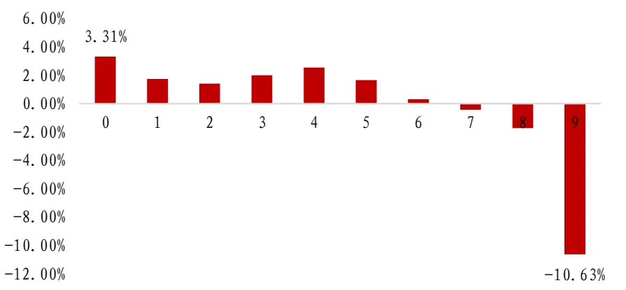

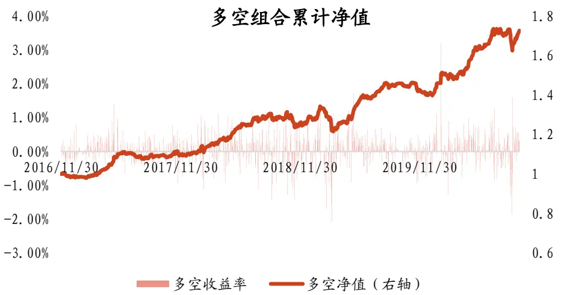
资料来源：Wind，招商证券研究与发展中心，测试区间：20161130-20200930

表：十分位组合测试结果

| 组合 | 总收益率 | 年化收益率 | 波动率 | Sharpe比率 | 平均换手率最 | 大回撤率超 | 额收益率 | 年化超额收益率 | 跟踪误差 | 信息比率 |
| --- | --- | --- | --- | --- | --- | --- | --- | --- | --- | --- |
| 0 | -0.37% | -0.10% | 21.88% | 0.00 | 7.61% | 40.18% | 17.55% | 4.31% | 4.01% | 1.07 |
| 1 | -13.16% | -3.61% | 22.61% | -0.16 | 8.93% | 48.03% | 3.28% | 0.84% | 2.77% | 0.30 |
| 2 | -12.08% | -3.30% | 22.74% | -0.15 | 9.04% | 46.12% | 4.70% | 1.20% | 2.50% | 0.48 |
| 3 | -7.55% | -2.02% | 22.58% | -0.09 | 9.09% | 48.38% | 9.97% | 2.51% | 2.37% | 1.06 |
| 4 | -12.43% | -3.40% | 22.62% | -0.15 | 9.17% | 46.69% | 4.20% | 1.08% | 2.38% | 0.45 |
| 5 | -15.38% | -4.26% | 22.35% | -0.19 | 9.22% | 47.69% | 0.46% | 0.12% | 2.31% | 0.05 |
| 6 | -10.76% | -2.93% | 22.55% | -0.13 | 9.18% | 45.51% | 6.12% | 1.56% | 2.41% | 0.65 |
| 7 | -17.93% | -5.02% | 22.59% | -0.22 | 9.06% | 47.25% | -2.38% | -0.63% | 2.58% | -0.24 |
| 8 | -21.10% | -5.99% | 22.33% | -0.27 | 8.98% | 48.70% | -6.39% | -1.71% | 2.87% | -0.59 |
| 9 | -41.75% | -13.14% | 22.28% | -0.59 | 7.78% | 55.08% | -31.06% | -9.24% | 4.35% | -2.13 |
| L-S | 68.90% | 14.64% | 6.73% | 2.17 |  | 11.04% |  |  |  |  |

十分位组合年化超额收益
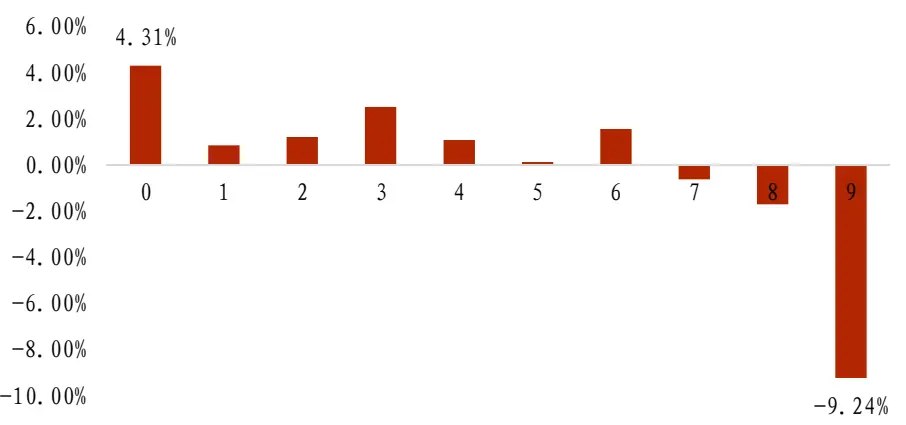

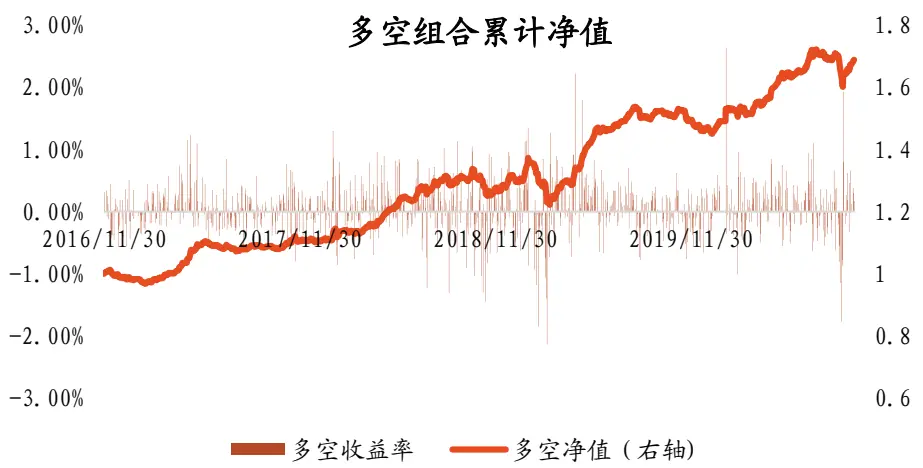

表：十分位组合测试结果

| 组合 | 总收益率 | 年化收益率 | 波动率 | Sharpe比率平 | 均换手率最 | 大回撤率超 | 额收益率 | 年化超额收益率 | 跟踪误差 | 信息比率 |
| --- | --- | --- | --- | --- | --- | --- | --- | --- | --- | --- |
| 0 | 33.43% | 7.81% | 22.13% | 0.35 | 4.52% | 34.44% | 20.81% | 5.05% | 6.20% | 0.82 |
| 1 | 25.50% | 6.10% | 21.74% | 0.28 | 7.72% | 37.94% | 13.25% | 3.30% | 6.13% | 0.54 |
| 2 | 16.11% | 3.97% | 21.24% | 0.19 | 8.27% | 38.74% | 4.44% | 1.14% | 5.82% | 0.20 |
| 3 | 23.31% | 5.61% | 20.58% | 0.27 | 8.54% | 31.59% | 10.48% | 2.63% | 5.17% | 0.51 |
| 4 | 21.02% | 5.10% | 20.09% | 0.25 | 8.60% | 36.45% | 7.92% | 2.01% | 5.58% | 0.36 |
| 5 | 12.00% | 3.00% | 19.29% | 0.16 | 8.64% | 25.47% | -0.68% | -0.18% | 5.29% | -0.03 |
| 6 | -11.20% | -3.05% | 19.50% | -0.16 | 8.65% | 37.80% | -21.14% | -6.00% | 5.44% | -1.10 |
| 7 | 13.65% | 3.39% | 19.41% | 0.17 | 8.56% | 28.83% | 0.84% | 0.22% | 5.53% | 0.04 |
| 8 | 8.03% | 2.03% | 19.77% | 0.10 | 8.20% | 36.99% | -3.99% | -1.05% | 5.94% | -0.18 |
| 9 | -18.74% | -5.27% | 20.04% | -0.26 | 7.04% | 37.88% | -27.76% | -8.13% | 6.68% | -1.22 |
| L-S | 64.17% | 13.80% | 9.47% | 1.46 |  | 11.69% |  |  |  |  |

十分位组合年化超额收益
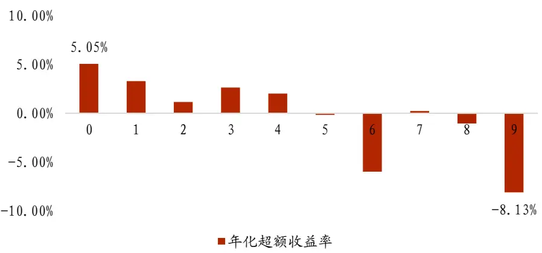

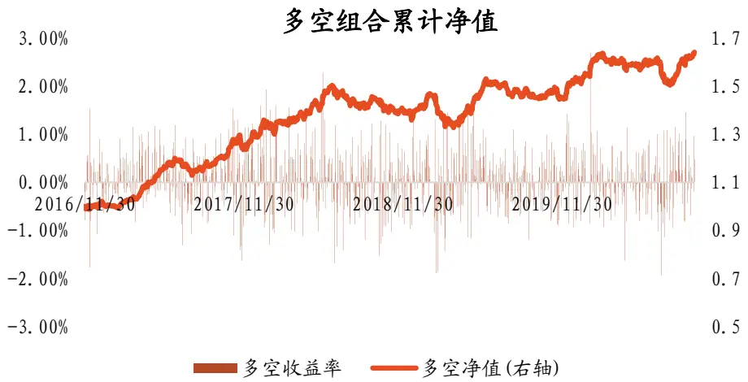
资料来源：Wind，招商证券研究与发展中心，测试区间：20161130-20200930

表：十分位组合测试结果

| 组合 | 总收益率 | 年化收益率 | 波动率 | Sharpe比率 | 平均换手率最 | 大回撤率超 | 额收益率 | 年化超额收益率 | 跟踪误差 | 信息比率 |
| --- | --- | --- | --- | --- | --- | --- | --- | --- | --- | --- |
| 0 | 2.09% | 0.54% | 21.69% | 0.02 | 7.85% | 42.73% | 8.18% | 2.07% | 4.99% | 0.42 |
| 1 | -8.03% | -2.16% | 22.55% | -0.10 | 8.39% | 39.55% | -1.86% | -0.49% | 5.20% | -0.09 |
| 2 | -4.25% | -1.13% | 22.85% | -0.05 | 8.49% | 41.27% | 2.44% | 0.63% | 5.17% | 0.12 |
| 3 | -11.92% | -3.26% | 22.46% | -0.14 | 8.45% | 37.94% | -6.01% | -1.60% | 4.80% | -0.33 |
| 4 | 7.41% | 1.88% | 22.26% | 0.08 | 8.65% | 42.04% | 14.34% | 3.56% | 5.11% | 0.70 |
| 5 | -11.99% | -3.27% | 22.74% | -0.14 | 8.65% | 43.01% | -5.87% | -1.56% | 4.86% | -0.32 |
| 6 | 14.92% | 3.69% | 23.25% | 0.16 | 8.60% | 41.30% | 23.42% | 5.64% | 5.07% | 1.11 |
| 7 | -11.24% | -3.06% | 22.55% | -0.14 | 8.52% | 44.13% | -5.19% | -1.38% | 4.69% | -0.29 |
| 8 | -10.71% | -2.91% | 22.84% | -0.13 | 8.37% | 46.28% | -4.59% | -1.22% | 5.73% | -0.21 |
| 9 | -28.35% | -8.33% | 22.97% | -0.36 | 7.65% | 46.66% | -23.48% | -6.74% | 6.46% | -1.04 |
| L-S | 38.92% | 8.95% | 8.60% | 1.04 |  | 12.01% |  |  |  |  |

十分位组合年化超额收益
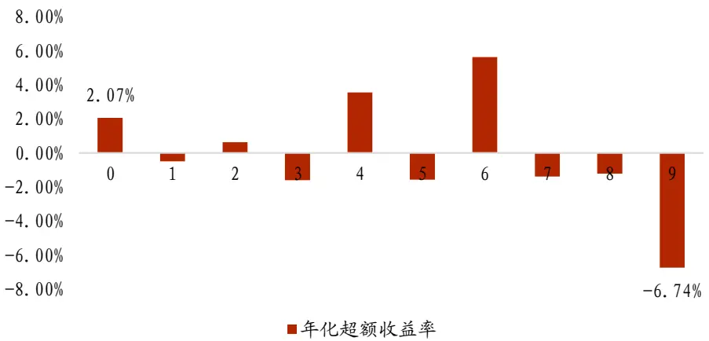

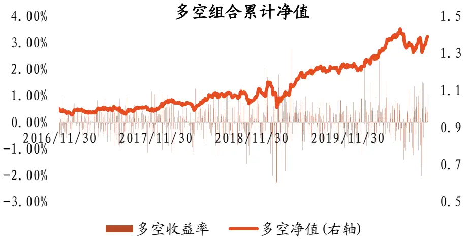
资料来源：Wind，招商证券研究与发展中心，测试区间：20161130-20200930

- 由于新闻信息的有效性通常衰减较快，一方面我们可以适当提升组合的调仓频率；另外一方面，在因子构建层面，我们可以缩短回溯期，考虑通过近期的新闻来构建因子。

## 提升组合调仓频率

- 半月调仓

- 周度调仓

## 缩短因子构建的回溯期限

- 回溯10D

- 回溯5D

| 因子 | 平均值 | 标准差 | 最小值 | 最大值 | IC_IR | t统计量 | 平均股票数 IC×Sqrt (N) |  | 有效期数 |
| --- | --- | --- | --- | --- | --- | --- | --- | --- | --- |
| Avg-Score | 0.84% | 6.64% | -17.36% | 18.10% | 0.13 | 1.21 | 2736 | 0.44 | 92 |
| Avg-Score_Num | 0.79% | 5.39% | -15.01% | 17.07% | 0.15 | 1.40 | 2736 | 0.41 | 92 |
| Avg-Score_Num_Ex | 0.81% | 5.79% | -14.11% | 16.02% | 0.14 | 1.34 | 2352 | 0.39 | 92 |
| Avg_Score_REL | 0.94% | 6.31% | -14.98% | 17.66% | 0.15 | 1.42 | 2736 | 0.49 | 92 |
| Avg-Score_REL_Ex | 1.20% | 6.52% | -14.35% | 19.05% | 0.18 | 1.77 | 2352 | 0.58 | 92 |
| Avg-Score_REL_T | 0.85% | 6.22% | -15.29% | 18.15% | 0.14 | 1.31 | 2736 | 0.44 | 92 |
| Avg-Score_REL_T_Ex | 1.11% | 6.39% | -14.68% | 19.26% | 0.17 | 1.67 | 2352 | 0.54 | 92 |
| Avg-Score_T | 0.72% | 6.50% | -17.56% | 18.42% | 0.11 | 1.06 | 2736 | 0.37 | 92 |
| 因子 | 平均值 | 标准差 | 最小值 | 最大值 | IC_IR | t统计量 | 平均股票数 IC×Sqrt (N) |  | 有效期数 |
| Avg-Score | 1.87% | 8.42% | -17.15% | 24.89% | 0.22 | 2.13 | 288 | 0.32 | 92 |
| Avg-Score_Num | 0.58% | 7.40% | -20.70% | 21.38% | 0.08 | 0.75 | 288 | 0.10 | 92 |
| Avg-Score_Num_Ex | 0.42% | 7.20% | -15.27% | 19.68% | 0.06 | 0.56 | 269 | 0.07 | 92 |
| Avg-Score_REL | 2.01% | 8.59% | -18.83% | 22.36% | 0.23 | 2.24 | 288 | 0.34 | 92 |
| Avg-Score_REL_Ex | 2.24% | 8.27% | -16.14% | 22.03% | 0.27 | 2.59 | 269 | 0.37 | 92 |
| Avg-Score_REL_T | 2.30% | 8.45% | -19.04% | 21.49% | 0.27 | 2.61 | 288 | 0.39 | 92 |
| Avg-Score_REL_T_Ex | 2.59% | 8.03% | -16.64% | 21.34% | 0.32 | 3.09 | 269 | 0.42 | 92 |
| Avg-Score_T | 2.09% | 8.20% | -17.22% | 23.08% | 0.26 | 2.45 | 288 | 0.36 | 92 |
| 因子 | 平均值 | 标准差 | 最小值 | 最大值 | IC_IR |  |  |  |  |
| Avg-Score | -0.26% | 8.16% | -21.14% | 18.89% | -0.03 | t统计量 -0.31 | 437 | 平均股票数 IC×Sqrt(N) | 有效期数 |
| Avg-Score_Num | 1.06% | 7.99% | -19.59% | 21.03% | 0.13 | 1.27 | 437 | -0.06 0.22 | 92 |
| Avg-Score_Num_Ex | 0.46% | 7.84% | -15.23% | 22.27% | 0.06 | 0.57 | 372 | 0.09 | 92 |
| Avg_Score_REL | -0.64% | 7.75% | -20.96% | 16.33% | -0.08 | -0.79 | 437 | -0.13 | 92 92 |
| Avg-Score_REL_Ex | -0.46% | 8.24% | -15.49% | 21.14% | -0.06 | -0.53 | 372 | -0.09 | 92 |
| Avg-Score_REL_T | -0.60% | 7.51% | -19.18% | 17.15% | -0.08 | -0.77 | 437 | -0.13 | 92 |
| Avg-Score_REL_T_Ex | -0.54% | 7.86% | -16.30% | 20.11% | -0.07 | -0.66 | 372 | -0.10 | 92 |
| Avg-Score_T | -0.25% | 7.89% | -20.98% | 18.83% | -0.03 | -0.31 | 437 | -0.05 | 92 |

资料来源：Wind，招商证券研究与发展中心，测试区间：20161130-20200930

| 因子 | 总收益率 | 年化收益率 | 波动率 | Sharpe比率 | 最大回撤率 |
| --- | --- | --- | --- | --- | --- |
| Avg-Score | 75.10% | 15.73% | 7.11% | 2.21 | 10.23% |
| Avg-Score_Num | 26.86% | 6.40% | 5.92% | 1.08 | 10.38% |
| Avg-Score_Num_Ex | 23.92% | 5.75% | 5.92% | 0.97 | 7.86% |
| Avg-Score_REL | 85.01% | 17.40% | 6.54% | 2.66 | 11.03% |
| Avg-Score_REL_Ex | 96.58% | 19.27% | 6.87% | 2.81 | 10.67% |
| Avg_Score_REL_T | 72.83% | 15.33% | 6.46% | 2.37 | 10.88% |
| Avg-Score_REL_T_Ex | 86.17% | 17.59% | 6.88% | 2.56 | 11.42% |
| Avg-Score_T | 69.84% | 14.81% | 7.03% | 2.11 | 10.57% |
| 因子 | 总收益率 | 年化收益率 | 波动率 | Sharpe比率 | 最大回撤率 |
| Avg-Score | 64.39% | 13.84% | 9.95% | 1.39 | 8.90% |
| Avg-Score_Num | 29.50% | 6.97% | 8.65% | 0.81 | 11.97% |
| Avg-Score_Num_Ex | -4.36% | -1.16% | 8.97% | -0.13 | 17.02% |
| Avg-Score_REL | 53.34% | 11.79% | 10.22% | 1.15 | 12.44% |
| Avg-Score_REL_Ex | 40.97% | 9.36% | 10.26% | 0.91 | 12.67% |
| Avg-Score_REL_T | 58.35% | 12.73% | 9.70% | 1.31 | 14.91% |
| Avg-Score_REL_T_Ex | 56.07% | 12.31% | 9.86% | 1.25 | 11.16% |
| Avg-Score_T | 91.11% | 18.40% | 9.76% | 1.89 | 7.77% |
| 因子 | 总收益率 | 年化收益率 | 波动率 | Sharpe比率 | 最大回撤率 |
| Avg-Score | 7.43% | 1.89% | 10.20% | 0.18 | 12.68% |
| Avg-Score_Num | 52.04% | 11.54% | 9.05% | 1.27 | 12.85% |
| Avg-Score_Num_Ex | 6.79% | 1.73% | 9.17% | 0.19 | 18.54% |
| Avg-Score_REL | 14.47% | 3.59% | 9.60% | 0.37 | 15.55% |
| Avg-Score_REL_Ex | 9.75% | 2.46% | 10.43% | 0.24 | 16.45% |
| Avg_Score_REL_T | 19.88% | 4.84% | 9.60% | 0.50 | 12.33% |
| Avg-Score_REL_T_Ex | 14.20% 11.03% | 3.52% | 10.31% | 0.34 | 15.75% |
| Avg-Score_T |  | 2.77% | 10.12% | 0.27 | 11.88% |

资料来源：Wind，招商证券研究与发展中心，测试区间：20161130-20200930

| 因子 | 平均值 | 标准差 | 最小值 | 最大值 | IC_IR | t统计量 | 平均股票数 IC×Sqrt (N) |  | 有效期数 |
| --- | --- | --- | --- | --- | --- | --- | --- | --- | --- |
| Avg-Score | 0.73% | 6.11% | -20.02% | 15.14% | 0.12 | 1.68 | 2652 | 0.38 | 196 |
| Avg-Score_Num | 0.76% | 5.31% | -14.23% | 14.22% | 0.14 | 2.00 | 2652 | 0.39 | 196 |
| Avg-Score_Num_Ex | 0.70% | 5.54% | -13.82% | 14.78% | 0.13 | 1.77 | 2262 | 0.33 | 196 |
| Avg_Score_REL | 0.82% | 5.74% | -16.96% | 16.16% | 0.14 | 2.00 | 2652 | 0.42 | 196 |
| Avg-Score_REL_Ex | 1.08% | 5.88% | -16.51% | 18.52% | 0.18 | 2.57 | 2262 | 0.51 | 196 |
| Avg_Score_REL_T | 0.63% | 5.57% | -17.46% | 15.70% | 0.11 | 1.58 | 2652 | 0.32 | 196 |
| Avg-Score_REL_T_Ex | 0.89% | 5.71% | -17.05% | 18.29% | 0.16 | 2.17 | 2262 | 0.42 | 196 |
| Avg-Score_T | 0.51% | 5.91% | -20.61% | 14.80% | 0.09 | 1.20 | 2652 | 0.26 | 196 |
| 因子 | 平均值 | 标准差 | 最小值 | 最大值 | IC_IR | t统计量 | 平均股票数 IC×Sqrt(N) |  | 有效期数 |
| Avg-Score | 1.24% | 9.05% | -25.16% | 25.50% | 0.14 | 1.92 | 286 | 0.21 | 196 |
| Avg-Score_Num | 0.65% | 6.80% | -15.72% | 19.57% | 0.10 | 1.34 | 286 | 0.11 | 196 |
| Avg-Score_Num_Ex | 0.59% | 6.76% | -19.53% | 15.84% | 0.09 | 1.21 | 264 | 0.10 | 196 |
| Avg-Score_REL | 1.30% | 9.00% | -19.07% | 24.29% | 0.14 | 2.02 | 286 | 0.22 | 196 |
| Avg-Score_REL_Ex | 1.29% | 8.85% | -20.83% | 24.61% | 0.15 | 2.04 | 264 | 0.21 | 196 |
| Avg-Score_REL_T | 1.19% | 8.83% | -19.41% | 22.34% | 0.13 | 1.89 | 286 | 0.20 | 196 |
| Avg-Score_REL_T_Ex | 1.16% | 8.74% | -22.19% | 23.93% | 0.13 | 1.85 | 264 | 0.19 | 196 |
| Avg-Score_T | 1.16% | 8.73% | -23.66% | 21.68% | 0.13 | 1.87 | 286 | 0.20 | 196 |
| 因子 | 平均值 | 标准差 | 最小值 | 最大值 | IC_IR | t统计量 | 平均股票数 IC×Sqrt(N) |  |  |
| Avg-Score | 0.36% | 7.63% | -21.10% | 19.10% | 0.05 | 0.65 | 426 | 0.07 | 有效期数 196 |
| Avg-Score_Num | 1.76% | 7.23% | -21.07% | 20.72% | 0.24 | 3.40 | 426 | 0.36 | 196 |
| Avg-Score_Num_Ex | 1.21% | 7.26% | -22.83% | 24.35% | 0.17 | 2.34 | 360 | 0.23 | 196 |
| Avg_Score_REL | 0.15% | 7.34% | -19.77% | 17.02% | 0.02 | 0.28 | 426 | 0.03 | 196 |
| Avg-Score_REL_Ex | 0.45% | 7.86% | -18.68% | 20.24% | 0.06 | 0.79 | 360 | 0.08 | 196 |
| Avg-Score_REL_T | 0.15% | 7.12% | -22.66% | 16.72% | 0.02 | 0.29 | 426 | 0.03 | 196 |
| Avg-Score_REL_T_Ex | 0.53% | 7.51% | -21.53% | 20.09% | 0.07 | 1.00 | 360 | 0.10 | 196 |
| Avg-Score_T | 0.32% | 7.37% | -24.55% | 17.07% | 0.04 | 0.60 | 426 | 0.07 | 196 |

资料来源：Wind，招商证券研究与发展中心，测试区间：20161130-20200930

| 因子 | 总收益率 | 年化收益率 | 波动率 | Sharpe比率 | 最大回撤率 |
| --- | --- | --- | --- | --- | --- |
| Avg-Score | 87.84% | 17.89% | 7.11% | 2.52 | 9.29% |
| Avg-Score_Num | 25.29% | 6.06% | 5.67% | 1.07 | 10.22% |
| Avg-Score_Num_Ex | 39.57% | 9.09% | 5.93% | 1.53 | 6.16% |
| Avg-Score_REL | 94.68% | 19.00% | 6.52% | 2.91 | 10.47% |
| Avg-Score_REL_Ex | 113.90% | 21.96% | 6.97% | 3.15 | 11.54% |
| Avg_Score_REL_T | 70.60% | 14.97% | 6.43% | 2.33 | 10.74% |
| Avg-Score_REL_T_Ex | 88.54% | 18.01% | 6.84% | 2.63 | 11.74% |
| Avg-Score_T | 77.21% | 16.11% | 7.08% | 2.28 | 9.37% |
| 因子 | 总收益率 | 年化收益率 | 波动率 | Sharpe比率 | 最大回撤率 |
| Avg-Score | 60.19% | 13.09% | 10.11% | 1.29 | 14.30% |
| Avg-Score_Num | 40.63% | 9.31% | 8.66% | 1.08 | 8.94% |
| Avg-Score_Num_Ex | -0.82% | -0.22% | 8.99% | -0.02 | 13.44% |
| Avg-Score_REL | 32.10% | 7.54% | 10.18% | 0.74 | 15.04% |
| Avg-Score_REL_Ex | 27.79% | 6.61% | 10.39% | 0.64 | 15.41% |
| Avg-Score_REL_T | 27.18% | 6.48% | 9.69% | 0.67 | 15.07% |
| Avg-Score_REL_T_Ex | 30.07% | 7.11% | 10.11% | 0.70 | 16.96% |
| Avg-Score_T | 54.19% | 11.97% | 10.16% | 1.18 | 13.59% |
| 因子 | 总收益率 | 年化收益率 | 波动率 | Sharpe比率 | 最大回撤率 |
| Avg-Score | 26.59% | 6.35% | 10.26% | 0.62 | 12.25% |
| Avg-Score_Num | 62.55% | 13.52% | 9.32% | 1.45 | 14.07% |
| Avg-Score_Num_Ex | 41.71% | 9.53% | 9.49% | 1.00 | 9.75% |
| Avg-Score_REL | 33.44% | 7.82% | 9.44% | 0.83 | 9.39% |
| Avg-Score_REL_Ex | 25.30% | 6.07% | 10.57% | 0.57 | 17.07% |
| Avg_Score_REL_T | 54.40% | 12.01% | 9.39% | 1.28 | 11.84% |
| Avg-Score_REL_T_Ex | 43.69% 37.30% | 9.93% | 10.35% | 0.96 | 15.55% |
| Avg-Score_T |  | 8.63% | 9.95% | 0.87 | 12.12% |

资料来源：Wind，招商证券研究与发展中心，测试区间：20161130-20200930

- 整体来看，在考虑成本以后，提升调仓频率是有助于提升因子解释能力和多空组合表现的。

- 并非调仓频率越高越好。当提升至周频调仓时，因子在沪深300中的表现反而有所减弱。

- 随着调仓频率的提升，进行了相关性加权和剔除的因子整体表现提升更为明显。

| 因子 | 平均值 | 标准差 | 最小值 | 最大值 | IC_IR | t统计量 | 平均股票数 IC×Sqrt(N) |  | 有效期数 |
| --- | --- | --- | --- | --- | --- | --- | --- | --- | --- |
| Avg-Score | 0.96% | 5.12% | -12.63% | 11.44% | 0.19 | 1.27 | 2388 | 0.47 | 46 |
| Avg-Score_Num | 0.38% | 4.83% | -11.23% | 8.54% | 0.08 | 0.54 | 2388 | 0.19 | 46 |
| Avg-Score_Num_Ex | 0.37% | 4.83% | -14.30% | 9.89% | 0.08 | 0.52 | 1945 | 0.16 | 46 |
| Avg_Score_REL | 0.84% | 5.04% | -13.66% | 9.85% | 0.17 | 1.14 | 2388 | 0.41 | 46 |
| Avg-Score_REL_Ex | 0.86% | 5.42% | -17.19% | 9.41% | 0.16 | 1.07 | 1945 | 0.38 | 46 |
| Avg-Score_REL_T | 1.05% | 4.84% | -12.28% | 10.03% | 0.22 | 1.48 | 2388 | 0.51 | 46 |
| Avg-Score_REL_T_Ex | 1.14% | 5.13% | -14.86% | 9.63% | 0.22 | 1.50 | 1945 | 0.50 | 46 |
| Avg_Score_T | 1.10% | 4.80% | -11.95% | 10.59% | 0.23 | 1.55 | 2388 | 0.54 | 46 |
| 因子 | 平均值 | 标准差 | 最小值 | 最大值 | IC_IR | t统计量 | 平均股票数 IC×Sqrt(N) |  | 有效期数 |
| Avg-Score | 2.61% | 7.83% | -11.62% | 21.79% | 0.33 | 2.26 | 279 | 0.44 | 46 |
| Avg-Score_Num | -0.67% | 6.74% | -15.54% | 13.09% | -0.10 | -0.68 | 279 | -0.11 | 46 |
| Avg-Score_Num_Ex | -0.66% | 7.03% | -17.26% | 14.19% | -0.09 | -0.64 | 248 | -0.10 | 46 |
| Avg-Score_REL | 2.09% | 8.44% | -12.83% | 21.95% | 0.25 | 1.68 | 279 | 0.35 | 46 |
| Avg-Score_REL_Ex | 1.50% | 8.53% | -15.97% | 25.21% | 0.18 | 1.20 | 248 | 0.24 | 46 |
| Avg-Score_REL_T | 2.24% | 7.88% | -12.23% | 18.92% | 0.28 | 1.92 | 279 | 0.37 | 46 |
| Avg-Score_REL_T_Ex | 1.71% | 7.64% | -11.74% | 17.83% | 0.22 | 1.52 | 248 | 0.27 | 46 |
| Avg-Score_T | 2.31% | 7.46% | -13.10% | 17.73% | 0.31 | 2.10 | 279 | 0.39 | 46 |
| 因子 | 平均值 | 标准差 | 最小值 | 最大值 | IC_IR |  |  |  |  |
| Avg-Score | 0.12% | 7.79% | -16.22% | 16.97% | 0.02 | t统计量 0.10 | 395 | 平均股票数 IC×Sqrt(N) | 有效期数 |
| Avg_Score_Num | 0.19% | 7.77% | -18.08% | 19.49% | 0.02 | 0.17 | 395 | 0.02 0.04 | 46 |
| Avg-Score_Num_Ex | 0.31% | 7.64% | -16.66% | 19.55% | 0.04 | 0.27 | 312 | 0.05 | 46 |
| Avg-Score_REL | -0.32% | 7.53% | -18.32% | 14.43% | -0.04 | -0.29 | 395 | -0.06 | 46 |
| Avg-Score_REL_Ex | -0.66% | 8.36% | -19.25% | 23.58% | -0.08 | -0.54 | 312 | -0.12 | 46 46 |
| Avg-Score_REL_T | 0.13% | 7.22% | -15.08% | 13.44% | 0.02 | 0.12 | 395 | 0.03 | 46 |
| Avg-Score_REL_T_Ex | -0.18% | 8.02% | -16.67% | 22.79% | -0.02 | -0.15 | 312 | -0.03 | 46 |
| Avg-Score_T | 0.28% | 7.23% | -12.32% | 15.89% | 0.04 | 0.27 | 395 | 0.06 | 46 |

资料来源：Wind，招商证券研究与发展中心，测试区间：20161130-20200930

| 因子 | 总收益率 | 年化收益率 | 波动率 | Sharpe比率 | 最大回撤率 |
| --- | --- | --- | --- | --- | --- |
| Avg-Score | 68.66% | 14.60% | 6.79% | 2.15 | 8.86% |
| Avg-Score_Num | 22.72% | 5.48% | 5.79% | 0.95 | 9.89% |
| Avg-Score_Num_Ex | 20.16% | 4.91% | 6.20% | 0.79 | 7.27% |
| Avg-Score_REL | 61.50% | 13.31% | 6.47% | 2.06 | 9.92% |
| Avg-Score_REL_Ex | 62.82% | 13.55% | 6.94% | 1.95 | 10.54% |
| Avg_Score_REL_T | 60.00% | 13.04% | 6.30% | 2.07 | 10.08% |
| Avg-Score_REL_T_Ex | 71.31% | 15.07% | 6.72% | 2.24 | 10.23% |
| Avg-Score_T | 75.04% | 15.72% | 6.83% | 2.30 | 11.07% |
| 因子 | 总收益率 | 年化收益率 | 波动率 | Sharpe比率 | 最大回撤率 |
| Avg-Score | 52.72% | 11.67% | 9.54% | 1.22 | 9.77% |
| Avg-Score_Num | 20.84% | 5.06% | 9.23% | 0.55 | 16.35% |
| Avg-Score_Num_Ex | 30.85% | 7.26% | 9.88% | 0.73 | 13.77% |
| Avg-Score_REL | 31.32% | 7.36% | 9.94% | 0.74 | 11.70% |
| Avg-Score_REL_Ex | 8.89% | 2.25% | 10.26% | 0.22 | 23.63% |
| Avg-Score_REL_T | 22.68% | 5.47% | 9.54% | 0.57 | 14.47% |
| Avg-Score_REL_T_Ex | 26.29% | 6.27% | 10.13% | 0.62 | 15.17% |
| Avg-Score_T | 56.99% | 12.48% | 9.38% | 1.33 | 10.57% |
| 因子 | 总收益率 | 年化收益率 | 波动率 | Sharpe比率 | 最大回撤率 |
| Avg-Score | 5.38% | 1.38% | 9.78% | 0.14 | 15.12% |
| Avg-Score_Num | 9.37% | 2.36% | 9.25% | 0.26 | 13.04% |
| Avg-Score_Num_Ex | 1.61% | 0.42% | 10.31% | 0.04 | 21.21% |
| Avg-Score_REL | -0.04% | -0.01% | 9.30% | 0.00 | 16.37% |
| Avg-Score_REL_Ex | 3.29% | 0.85% | 10.29% | 0.08 | 17.29% |
| Avg_Score_REL_T | 11.16% | 2.80% | 9.31% | 0.30 | 15.20% |
| Avg-Score_REL_T_Ex | 7.52% | 1.91% | 10.55% | 0.18 | 16.75% |
| Avg-Score_T | 10.95% | 2.75% | 9.96% | 0.28 | 14.86% |

资料来源：Wind，招商证券研究与发展中心，测试区间：20161130-20200930

| 因子 | 平均值 | 标准差 | 最小值 | 最大值 | IC_IR | t统计量 | 平均股票数 IC×Sqrt (N) |  | 有效期数 |
| --- | --- | --- | --- | --- | --- | --- | --- | --- | --- |
| Avg-Score | 1.27% | 5.22% | -14.87% | 11.37% | 0.24 | 1.66 | 1872 | 0.55 | 46 |
| Avg-Score_Num | 0.98% | 4.80% | -12.26% | 8.30% | 0.20 | 1.39 | 1872 | 0.43 | 46 |
| Avg-Score_Num_Ex | 1.45% | 4.90% | -13.36% | 9.83% | 0.30 | 2.00 | 1439 | 0.55 | 46 |
| Avg_Score_REL | 1.44% | 5.08% | -13.70% | 11.26% | 0.28 | 1.92 | 1872 | 0.62 | 46 |
| Avg-Score_REL_Ex | 1.41% | 5.41% | -15.20% | 11.19% | 0.26 | 1.76 | 1439 | 0.53 | 46 |
| Avg-Score_REL_T | 1.42% | 5.08% | -14.46% | 11.06% | 0.28 | 1.89 | 1872 | 0.61 | 46 |
| Avg-Score_REL_T_Ex | 1.51% | 5.27% | -16.60% | 10.94% | 0.29 | 1.95 | 1439 | 0.57 | 46 |
| Avg_Score_T | 1.33% | 5.13% | -15.44% | 11.83% | 0.26 | 1.76 | 1872 | 0.58 | 46 |
| 因子 | 平均值 | 标准差 | 最小值 | 最大值 | IC_IR | t统计量 | 平均股票数 IC×Sqrt(N) |  | 有效期数 |
| Avg-Score | 2.44% | 7.36% | -10.58% | 20.47% | 0.33 | 2.25 | 257 | 0.39 | 46 |
| Avg-Score_Num | -1.02% | 7.17% | -16.79% | 17.81% | -0.14 | -0.97 | 257 | -0.16 | 46 |
| Avg-Score_Num_Ex | -0.73% | 7.08% | -14.36% | 14.80% | -0.10 | -0.70 | 210 | -0.11 | 46 |
| Avg-Score_REL | 2.34% | 7.70% | -9.25% | 17.94% | 0.30 | 2.06 | 257 | 0.37 | 46 |
| Avg-Score_REL_Ex | 1.74% | 7.36% | -14.95% | 15.76% | 0.24 | 1.61 | 210 | 0.25 | 46 |
| Avg-Score_REL_T | 2.03% | 7.15% | -9.91% | 17.35% | 0.28 | 1.92 | 257 | 0.33 | 46 |
| Avg-Score_REL_T_Ex | 1.61% | 6.92% | -15.09% | 16.07% | 0.23 | 1.57 | 210 | 0.23 | 46 |
| Avg-Score_T | 1.99% | 6.99% | -10.85% | 16.63% | 0.28 | 1.93 | 257 | 0.32 | 46 |
| 因子 | 平均值 | 标准差 | 最小值 | 最大值 | IC_IR | t统计量 | 平均股票数 IC×Sqrt(N) |  |  |
| Avg-Score | -0.10% | 7.86% | -17.33% | 16.38% | -0.01 | -0.09 | 320 | -0.02 | 有效期数 |
| Avg_Score_Num | 1.05% | 8.39% | -20.63% | 19.09% | 0.12 | 0.84 | 320 | 0.19 | 46 46 |
| Avg-Score_Num_Ex | 1.53% | 8.88% | -17.79% | 19.19% | 0.17 | 1.17 | 234 | 0.23 | 46 |
| Avg-Score_REL | 0.29% | 7.87% | -17.75% | 17.09% | 0.04 | 0.25 | 320 | 0.05 | 46 |
| Avg-Score_REL_Ex | -0.41% | 9.12% | -19.36% | 25.06% | -0.04 | -0.30 | 234 | -0.06 | 46 |
| Avg-Score_REL_T | 0.03% | 7.34% | -18.33% | 15.98% | 0.00 | 0.03 | 320 | 0.01 | 46 |
| Avg-Score_REL_T_Ex | -0.63% | 8.40% | -20.92% | 24.23% | -0.07 | -0.51 | 234 | -0.10 | 46 |
| Avg-Score_T | 0.01% | 7.32% | -15.33% | 18.23% | 0.00 | 0.01 | 320 | 0.00 | 46 |

资料来源：Wind，招商证券研究与发展中心，测试区间：20161130-20200930

| 因子 | 总收益率 | 年化收益率 | 波动率 | Sharpe比率 | 最大回撤率 |
| --- | --- | --- | --- | --- | --- |
| Avg-Score | 80.64% | 16.67% | 6.99% | 2.39 | 9.86% |
| Avg-Score_Num | 46.49% | 10.47% | 6.54% | 1.60 | 8.13% |
| Avg-Score_Num_Ex | 43.05% | 9.78% | 6.62% | 1.48 | 8.41% |
| Avg-Score_REL | 61.61% | 13.33% | 6.76% | 1.97 | 11.19% |
| Avg-Score_REL_Ex | 70.28% | 14.89% | 7.34% | 2.03 | 11.51% |
| Avg_Score_REL_T | 77.34% | 16.11% | 6.56% | 2.45 | 10.38% |
| Avg-Score_REL_T_Ex | 74.72% | 15.66% | 7.35% | 2.13 | 11.91% |
| Avg-Score_T | 94.97% | 19.01% | 7.08% | 2.69 | 10.43% |
| 因子 | 总收益率 | 年化收益率 | 波动率 | Sharpe比率 | 最大回撤率 |
| Avg-Score | 52.54% | 11.64% | 9.39% | 1.24 | 11.51% |
| Avg-Score_Num | 34.64% | 8.06% | 9.27% | 0.87 | 15.82% |
| Avg-Score_Num_Ex | 7.28% | 1.85% | 10.07% | 0.18 | 10.08% |
| Avg-Score_REL | 38.69% | 8.90% | 9.71% | 0.92 | 12.71% |
| Avg-Score_REL_Ex | 28.07% | 6.66% | 10.66% | 0.63 | 15.41% |
| Avg_Score_REL_T | 54.24% | 11.96% | 9.51% | 1.26 | 11.51% |
| Avg-Score_REL_T_Ex | 37.13% | 8.58% | 10.72% | 0.80 | 11.90% |
| Avg-Score_T | 63.72% | 13.72% | 9.44% | 1.45 | 9.01% |
| 因子 | 总收益率 | 年化收益率 | 波动率 | Sharpe比率 | 最大回撤率 |
| Avg-Score | 14.98% | 3.71% | 10.51% | 0.35 | 15.79% |
| Avg_Score_Num | 65.63% | 14.06% | 10.51% | 1.34 | 16.35% |
| Avg-Score_Num_Ex | 64.74% | 13.90% | 11.30% | 1.23 | 14.87% |
| Avg-Score_REL | 1.70% | 0.44% | 10.12% | 0.04 | 17.70% |
| Avg-Score_REL_Ex | 11.58% | 2.90% | 11.60% | 0.25 | 20.46% |
| Avg_Score_REL_T | 0.31% | 0.08% | 10.21% | 0.01 | 17.13% |
| Avg-Score_REL_T_Ex | -5.39% 13.40% | -1.43% | 11.46% | -0.13 | 18.57% |
| Avg_Score_T |  | 3.33% | 10.42% | 0.32 | 13.89% |

资料来源：Wind，招商证券研究与发展中心，测试区间：20161130-20200930

- 整体来看，缩短回溯期以后，无论是IC还是多空组合表现提升均不明显。

- 事实上，缩短回溯期类似于按照时间衰减加权的特殊情况。从因子测试结果来看，进行时间衰减加权的因子相对于不进行时间衰减加权的因子表现并无明显优势。

Average_Score_T与大类风格因子相关性
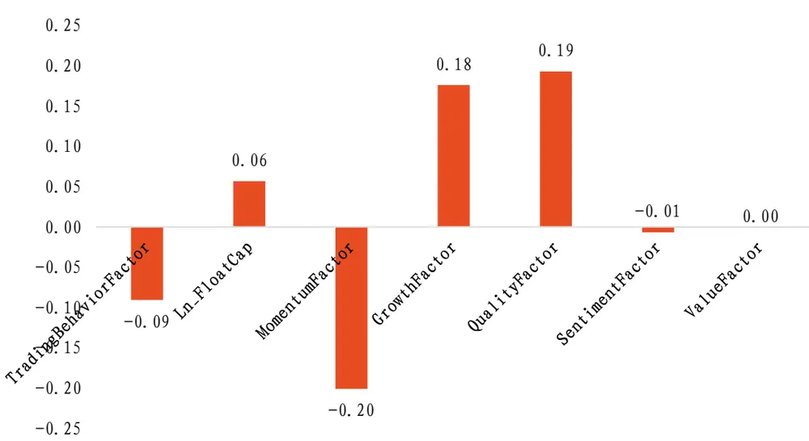

Avg_Score_REL_T_Ex与大类风格因子相关性
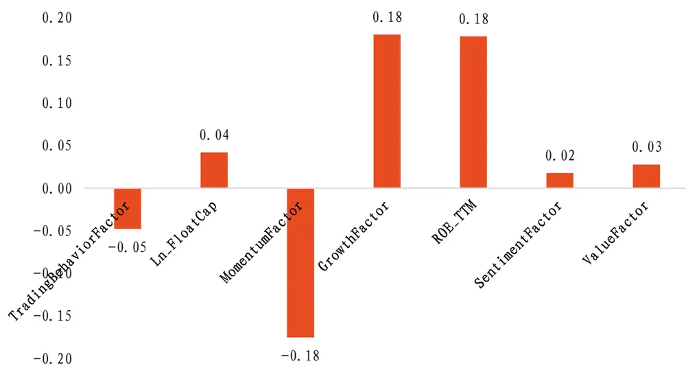

## 第三节 新闻情绪因子的应用

- 我们对正面新闻（相关性=1，正面概率>0.8）和负面新闻（相关性=1，负面概率>0.8）的事件效应进行了研究。

单个正面新闻的事件效应
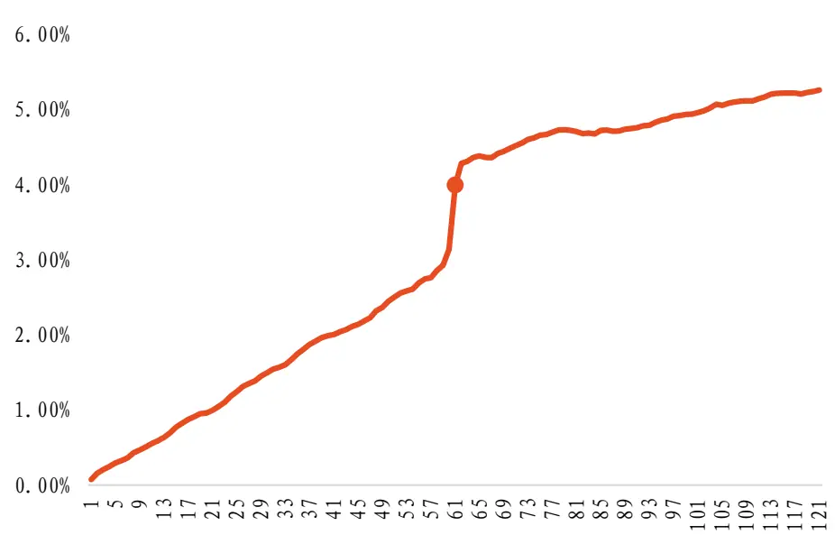

单个负面新闻的事件效应
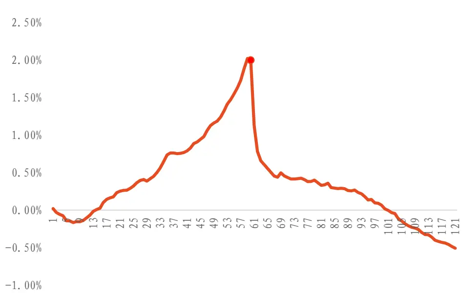

- 基于我们所构建的Avg_Score_T因子，构建正面事件（偏离过去20D均值+3SD及以上）和负面事件（偏离过去20D均值-3D及以上），并研究其事件效应。

基于新闻情绪因子的正面事件的事件效应

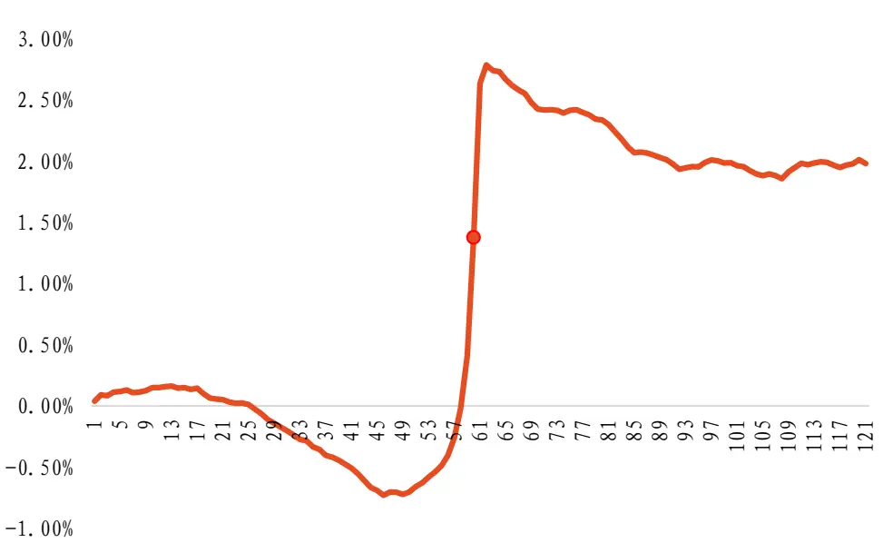

基于新闻情绪因子的负面事件的事件效应
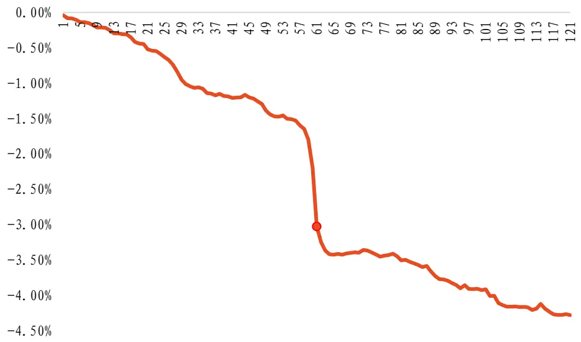

## 融合新闻情绪因子后的选股策略——全A

- 对比加入新闻情绪因子前后，我们日常跟踪的基于Adaboost的选股策略的表现。

## IC测试结果

| 因子 | 平均值 | 标准差 | 最小值 | 最大值 | IC_IR | t统计量 | 平均股票数 | 有效期数 |
| --- | --- | --- | --- | --- | --- | --- | --- | --- |
| 传统A1pha策略 | 11.64% | 9.19% | -25.08% | 29.57% | 1.27 | 8.59 | 3397 | 46 |
| 结合新闻情绪因子 | 11.82% | 9.10% | -25.28% | 30.08% | 1.30 | 8.81 | 3395 | 46 |

传统Alpha策略的十分位组合年化超额收益

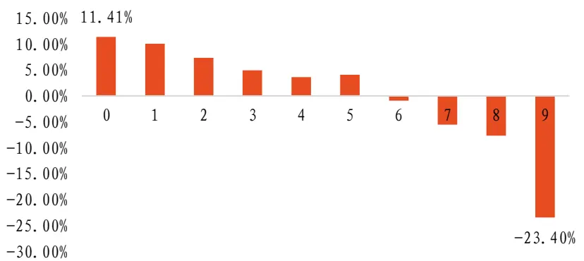

## 多空组合测试结果

| 统计指标 | 传统A1pha策略 | 结合新闻情绪因子 |
| --- | --- | --- |
| 总收益率 | 295.63% | 312.34% |
| 年化收益率 | 43.13% | 44.68% |
| 波动率 | 11.29% | 11.16% |
| Sharpe比率 | 3.82 | 4.00 |
| 最大回撤 | 8.74% | 9.27% |

结合新闻情绪后的十分位组合年化超额收益
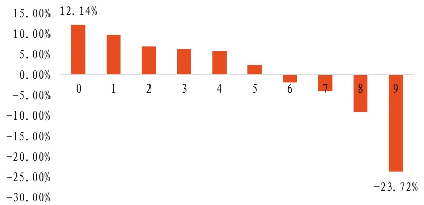
资料来源：Wind，招商证券研究与发展中心，测试区间：20161130-20200930

## 融合新闻情绪因子后的选股策略 沪深300

## CMS招商证券

## IC测试结果

| 因子 | 平均值 | 标准差 | 最小值 | 最大值 | IC_IR | t统计量 | 平均股票数 | 有效期数 |
| --- | --- | --- | --- | --- | --- | --- | --- | --- |
| 传统A1pha策略 | 5.41% | 9.57% | -18.78% | 24.93% | 0.57 | 3.84 | 300 | 46 |
| 结合新闻情绪因子 | 6.77% | 9.41% | -16.68% | 22.34% | 0.72 | 4.88 | 300 | 46 |

## 多空组合测试结果

| 统计指标 | 传统A1pha策略 | 结合新闻情绪因子 |
| --- | --- | --- |
| 总收益率 | 34.42% | 125.55% |
| 年化收益率 | 8.02% | 23.62% |
| 波动率 | 12.05% | 8.81% |
| Sharpe比率 | 0.67 | 2.68 |
| 最大回撤 | 20.76% | 5.74% |

传统Alpha策略的十分位组合年化超额收益

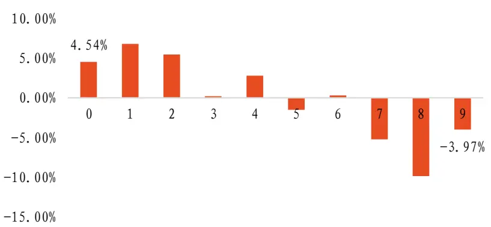
结合新闻情绪后的十分位组合年化超额收益

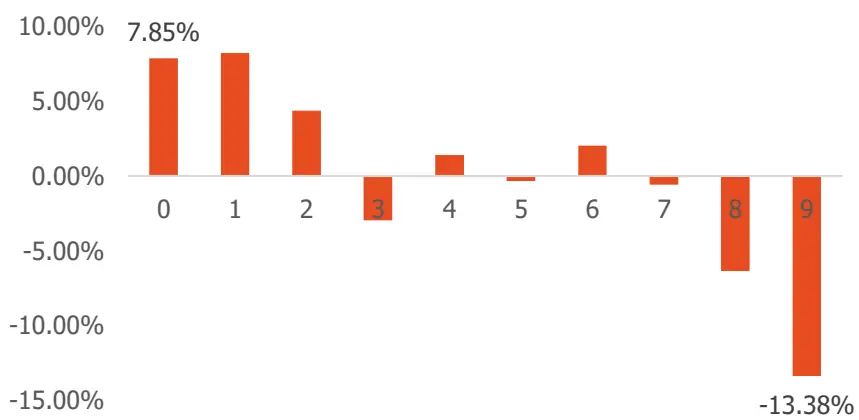
资料来源：Wind，招商证券研究与发展中心，测试区间：20161130-20200930

## 对传统Alpha因子的增强——以动量为例

- 在动量因子进行选股的时候利用新闻情绪进行过滤。

全体A股中选股策略结果
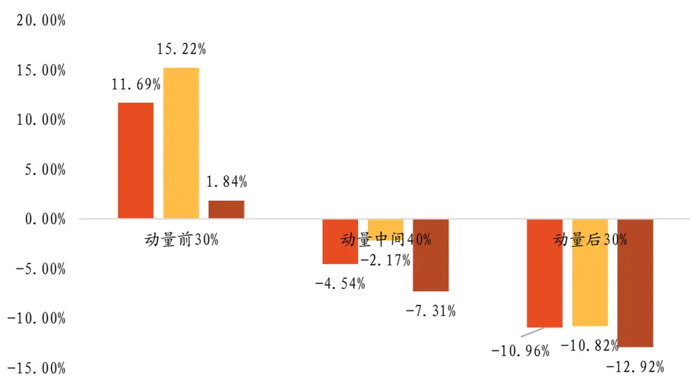
不区分 正面新闻情绪 负面新闻情绪

沪深300中选股策略结果
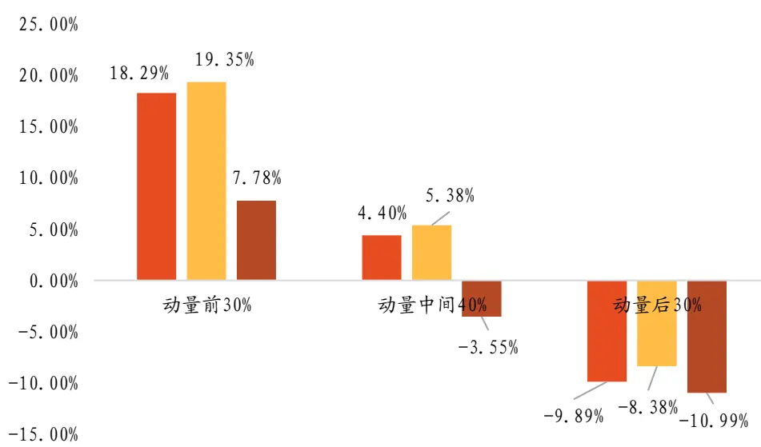
不区分 正面新闻情绪 负面新闻情绪
资料来源：Wind，招商证券研究与发展中心，测试区间：20161130-20200930

## 第四节总结与展望

## 总结

- 我们引入了ChinaScope新闻情绪数据，并对数据整体进行了统计分析。整体来看，数据在全A、沪深300和中证500中均具有较高的覆盖度。

- 我们综合考虑各种因素，基于新闻情绪数据构建了新闻情绪因子。整体来看，新闻情绪因子在全A和沪深300中选股效果更为显著。进一步，我们从提高调仓频率和缩短因子构建的回溯期两个角度来探索了因子表现提升的空间。

- 从应用层面，新闻情绪因子在事件驱动策略、与传统Alpha策略融合以及对传统Alpha进行增强三个维度均具有较好的效果。

## 展望

- 一方面我们将继续探索新闻情绪数据在市场择时和行业轮动方面的应用；

- 另一方面，我们的“蓝海启航”系列报告将继续致力于对更多另类数据的研究和探索。力争发现更多有效的另类Alpha因子。请大家继续关注我们后续的研究！

# 谢谢大家！欢迎讨论交流！

周靖明

# zhoujingming@cmschina.com.cn

S1090519080007

本资料所载的证券市场研究信息是由招商证券股份有限公司（以下简称“招商证券”）的研究发展中心编写。招商证券研究发展中心定位为面向专业机构投资者的卖方研究团队。通过书面形式制作的本资料仅面向招商证券客户中的金融机构专业投资者，请勿对本资料进行任何形式的转发行为。若您非招商证券客户中的金融机构专业投资者，为保证服务质量、控制投资风险，应首先联系招商证券机构销售服务部门的客户经理，完成投资者适当性匹配，并充分了解该项服务的性质、特点、使用的注意事项以及若不当使用可能会带来的风险或损失，在此之前，请勿订阅、接收或使用本资料。本资料难以设置访问权限，若给您造成不便，还请见谅！感谢您给予的理解和配合。

