证券研究报告/金融工程研究报告

## Barra模型(CNE6)介绍与应用

## 报告摘要：

在本报告中，我们对MSCI新一代A股风险模型（CNE6）进行了介绍和结果展示。

CNE6中，包括48个描述变量、20个基础因子和9个风格因子。为得到风格因子，需进行两次加权。就种类来说，CNE6增加了质量、情绪和分红风格，将非线性市值与市值进行了合并。对于基础因子，增加了盈余波动、投资质量、长期反转、行业动量等；对于描述变量，例如流动性，增加了ATR指标。相较而言，CNE6中增加了市场关注度日益提高的一些因子，同时根据实际对一些因子进行了合并处理。

基于因子定义，我们计算了Barra_Descriptor(描述变量)、Barra_Basic（基础因子）和Barra_Style（风格因子）三张表，时间区间为2006年至今；每日进行数据更新。

因子覆盖度：20个基础因子中，18个因子的平均覆盖度在95%以上；分红和情绪因子，平均覆盖度分别为67.54%、65.21%，处于较低水平。因此，在进行截面回归时，我们计算了两个版本：一，使用全部9个因子；二，剔除分红和情绪因子进行计算。

单因子表现：anasent、beta 和 btop 收益最高，分别为8.19%、5.86%和 5.42%；liquidity、strev 和 midcap 最低，分别为-11.22%、-11.10%和-6.76%。

结果说明：9因子R²均值为42.33%，7因子为 37.43%，整体解释度处于较高的水平；从时间来看，二者走势基本一致；后者与CNE5的结果较为一致。

与 CNE5 对比来看，value表现有所提升；momentum 因为包含了短期动量，整体表现得到加强；size表现基本一致；volatility是将 beta与 residual volatility 合并得到，方向与 beta 更为一致；尽管新添加了一个描述变量，liquidity整体表现变动较小。

## 模型 R2

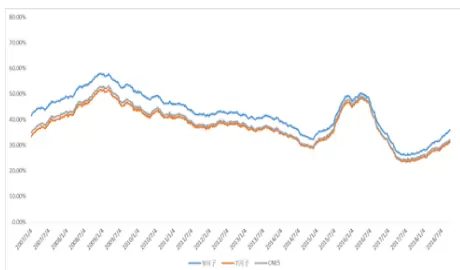

## 纯因子累计收益

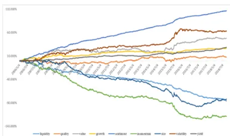

## 相关报告

《<Replicating Anomalies>A股检验》

2018-03-07

《港股研究系列：Barra模型及应用》2018-07-17

证券分析师：肖承志

执业证书编号：S0550518090001

研究助理：徐忠亚

执业证书编号：S0550118080015

021 2036 3216 xu_zy @nesc.cn

在本报告中，我们将对MSCI新一代A股风险模型（CNE6）进行介绍和结果展示：主要对因子定义、模型表现及纯因子收益表现进行说明。

## 1. 研究思路

Barra模型的理论基础是多因子模型，即：

$$
[\begin{array}{c}r_{1}-r_{f}\\r_{2}-r_{f}\\\vdots\\r_{N}-r_{f}\end{array}]_{1}=[\begin{array}{c}\uparrow1\\\downarrow\\\vdots\\\vdots\\1\end{array}]_{f_{c}}+[\begin{array}{cccc}I_{11}&I_{12}&\cdots&I_{1m}\\I_{21}&I_{22}&\cdots&I_{1m}\\\vdots&\vdots&\ddots&\vdots\\I_{N1}&I_{N2}&\cdots&I_{Nm}\end{array}]_{1}[\begin{array}{c}\uparrow[\begin{array}{c}f_{11}\\f_{22}\end{array}]\\\vdots\\\vdots\\\vdots\\\vdots\\\vdots\\\vdots\\\end{array}]_{1}+[\begin{array}{cccc}S_{11}&S_{12}&\cdots&S_{1p}\\S_{21}&S_{22}&\cdots&S_{2p}\\\vdots&\vdots&\ddots&\vdots\\S_{N1}&S_{N2}&\cdots&S_{Np}\end{array}]_{1}[\begin{array}{c}f_{11}\\f_{22}\end{array}]_{1}[\begin{array}{c}f_{11}\\f_{22}\end{array}]_{1}[\begin{array}{c}f_{11}\\f_{22}\end{array}]_{1}[\begin{array}{c}f_{11}\\f_{22}\end{array}]_{1}[\begin{array}{c}f_{11}\\f_{22}\end{array}]_{1}[\begin{array}{c}f_{11}\\f_{22}\end{array}]_{1}[\begin{array}{c}f_{11}\\f_{22}\end{array}]_{1}[\begin{array}{c}f_{11}\\f_{22}\end{array}]_{1}[\begin{array}{c}f_{11}\\f_{22}\end{array}]_{1}[\begin{array}{c}f_{11}\\f_{22}\end{array}]_{1}[\begin{array}{c}f_{11}\\f_{22}\end{array}]_{1}[\begin{array}{c}f_{11}\\f_{22}\end{array}]_{1}[\begin{array}{c}f_{11}\\f_{22}\end{array}]_{1}[\begin{array}{c}f_{11}\\f_{22}\end{array}]_{1}[\begin{array}{c}f_{11}\\f_{22}\end{array}]_{1}[\begin{array}{c}f_{11}\\f_{22\end{array}
$$

其中 $r_{i}$ 为股票收益率； $r_{f}$ 为无风险收益率； $f_{c}$ 、 $f_{I}$ 和 $f_{s}$ 分别表示国家因子、行业因子和风格因子，【是由虚拟变量构成的行业风险载荷矩阵，S为风格因子的风险载荷。

利用多因子模型而非收益率的时间序列估计方差协方差矩阵的优势已为人所熟知。其一，此种方法降低了估计协方差矩阵的所需要的时间跨度；其二，减小了矩阵的不稳定性；其三，增强了方差矩阵的可预测性。而多因子模型通过选择解释能力强且数量有限的各类因子对股票收益进行截面回归，并通过估计因子的方差-协方差矩阵求得估计样本的协方差矩阵，并以此确定投资组合的绩效分解和边际风险归因，即如以下公式所示。

$$
R_{p}=\sum_{n}w_{n}r_{n}=\sum_{k}\psi_{k}f_{k}+\sum_{n}w_{n}u_{n}
$$

$$
Var\left(R_{_{p}}\right)=\sum_{_{kl}}\psi_{_{k}}\psi_{_{l}}F_{_{kl}}+\sum_{_{n}}{w_{_{n}}}^{2}Var\left(u_{_{n}}\right)
$$

其中， $\psi_{\textit{ k }}$ 为第k个因子对应的风险载荷与权重的线性组合。

在此基础上，通过计算预测方差协方差矩阵，即可对组合风险进行预测和管理。

在本报告中，我们会对CNE6涉及的数据及因子计算方法进行说明，并给出模型数据结果；同时，我们也会将结果与CNE5进行对比。

## 2. 数据和方法

在这一部分，我们首先对涉及的数据进行说明，然后对因子计算方法进行分析。主要参考的报告为：Barra China International、 Barra US Total和 Barra Emerging Markets。

## 2.1. 基础数据

我们在本地搭建了A股基础信息、行情序列、交易数据、中信行业分类、股票估值、资产负债、利润和现金流量等历史数据，以及相关一致预期数据表；数据来源为

WIND；因子构建及回归中涉及的数据均来源于这些数据表。

## 2.2. 因子和数据处理方法

与CNE5相比，CNE6包含的因子种类、数量以及处理方式均发生了较大的变化。
基于相关资料，因子定义见表1。

CNE6中，包含48个描述变量、20个基础因子和9个风格因子；为得到风格因子，需进行两次加权。就种类来说，CNE6增加了质量、情绪和分红风格，将非线性市值与市值进行了合并；对于基础因子，增加了盈余波动、投资质量、长期反转、行业动量等；对于描述变量，例如流动性，增加了ATR指标。相较而言，CNE6中增加了市场关注度日益提高的一些因子，同时根据实际对一些因子进行了合并处理。我们在进行因子合并时，采用等权的方法。

表 1：因子框架说明

| 一级 | 二级 | 三级 | 说明 |
| --- | --- | --- | --- |
| Liquidity | Liquidity | STOM | Monthly share turnover |
|  |  | STOQ | Quarterly share turnover |
|  |  | STOA | Annual share turnover |
|  |  | ATR | Annualized traded value ratio |
|  |  | MLEV | Market Leverage |
| Quality | Leverage | BLEV | Book Leverage |
|  |  | DTOA | Debt to asset ratio |
|  |  | VSAL | Variation in Sales |
|  |  | VERN | Variation in Earnin gs |
|  |  | VFLO | Variation in Cash-Flows |
|  |  | SPIBS | Variation in Fw EPS |
|  |  | CETOE | Cash earnin gs to earnin gs |
|  | Earnings Quality | ACBS | Accruals Balancesheet version |
|  |  | ACCF | Accruals Cahsflow version |
|  |  | ATO | Asset turnover |
|  | Profitablity | GP Gross profitability |  |
|  | GM | Gross margin |  |
|  | ROA | Return on assets |  |
|  | AGRO | Asset growth |  |
| Investment Quality | IGRO | Issuance growth |  |
|  | CXGRO | Capital expenditure growth |  |
| Value | BTOP | BTOP | Book to price |
|  |  | ETOP | Trailing Earnin gs-to-price Ratio |
|  |  | EPIBS | Analy st predicted earnin gs to price |
|  |  | CETOP | Cash earnings earnings to price |
|  |  | ENMU | Enterprise multiple (Ebitda to Ev) |

1实际测试结果表明，一方面最优权重波动较大，另一方面模型解释度对权重变动并不敏感。

|  | Long Term reversal | LTRSTR | Long term relative stren gth |
| --- | --- | --- | --- |
|  |  | LTHALPHA | Long term historical alpha |
| Growth | Growth | EGRLF | Predicted growth 3 year |
|  |  | EGRSF | Predicted growth 1 year |
|  |  | EGRO | Historical earnin gs per share growth rate |
|  |  | SGRO | Historical sales per share growth rate |
| Sentiment | Sentiment | RRIBS | Revision ratio |
|  |  | EPIBSC | Change in analy st predicted earnin gs to price |
|  |  | EARNC | Change in analyst predicted earnings per share |
| Momentum | Short Term reversal | STREV | Short Term reversal |
|  | Seasonality | SEASON | Seasonality |
|  | Industry Momentum Momentum | INDMOM | Industry Momentum |
|  |  | RSTR | Relative strength |
|  |  | HALPHA | Historical alpha |
| Mid cap |  | MIDCAP | Mid cap |
| Size Volatility | Size | LSIZE | size |
|  | Beta | BETA | Beta |
|  | Resival Volatility | HSIGMA | Hist sigma |
|  |  | DASTD | Daily std dec |
|  |  | CMRA | Cumulative ran ge |
| Dividend Yield | Dividend Yield | DTOP | Dividend-to-price ratio |
|  |  | DPIBS | Analy st predicted dividend to price ratio |

数据来源：东北证券，Barra China International、US Total 和Emerging Markets

## 2.3. 数据清洗

数据清洗包括奇异数据的处理（去极值)、数据规范化和部分风格因子的因子载荷正交化以及缺失风险载荷的补足。下面分别对其进行说明。

## 2.3.1. 极值与规范化处理

首先，对数据进行如下标准化：

$$
X_{_{nk}}^{^{(std)}}=\frac{X_{_{nk}}^{^{(raw)}}-\mu_{_k}}{\sigma_{_k}}
$$

其中 $\mu_{_k}$ 为市值加权平均， $\sigma_{{k}}$ 为简单平均标准差。

与传统的极值限制在3个标准差的做法不同，我们采取以下极值处理方式，将风险暴露限制在[-3.5,3.5]。

$$
\tilde{X}_{_{nk}}^{^{(std)}}=\left\{\begin{aligned}&3\cdot(1-s_{_{(+)}})+X_{_{nk}}^{^{(std)}}\cdot s_{_{(+)}}^{^{(}};\quad X_{_{nk}}^{^{(std)}}>3\\&\quad X_{_{nk}}^{^{(std)}};-3\leq X_{_{nk}}^{^{(std)}}\leq3\\&-3\cdot(1-s_{_{(-)}})+X_{_{nk}}^{^{(std)}}\cdot s_{_{(-)}}^{^{(}};\quad X_{_{nk}}^{^{(std)}}<-3\end{aligned}\right.
$$

其中，

$$
s_{_{(+)}}=Max\left(0,Min\left(1,\frac{0.5}{Max\left(X_{_{nk}}^{^{(std)}}-3\right)}\right)\right)
$$

可以检验，此种极值处理方式不仅限制了数据的取值，同时保留了原始数据的排序。

极值处理后，需要重新对数据进行标准化；此外，若是描述变量，还需对组合为风险暴露后的数据进行标准化处理。

## 2.3.2. 缺失值处理

当构成风格因子的描述变量数据只有部分缺失时，我们利用其余未缺失的因子指标来构成风格因子（权重进行归一化处理）；当某只股票因子指标全部缺失时，我们运用数据替换算法来补足缺失值。具体做法为：使用风格因子未缺失股票数据进行回归，得到回归系数，进而拟合得到缺失股票的风格因子值。

## 2.3.3. 截面回归

在得到风格因子数据后，通过截面回归的方法，即可得到风格因子收益值和其他统计量结果。

通常，大盘股收益相较于小盘股收益具有更多的共性，此外在进行分析时理应对市值占比较高的股票给予较多的关注。参考Barra报告，我们在回归模型中，考虑市值的影响，以降低异方差的影响。我们以流通市值平方根为权重进行加权最小二乘回归，得到风格因子收益值。

## 3. 因子数据结果

在这一部分，我们对构建所得数据表进行说明；同时对因子覆盖度结果进行分析；
最后，对单个因子的表现进行测试。

## 3.1. 数据表说明

基于因子定义，我们计算了Barra_Descriptor（描述变量）、Barra_Basic（基础因子）和Barra_Style（风格因子）三张表，时间区间为2006年至今；每日进行数据更新。数据表结构见图1、图2和图3。

图 1: Barra_Descriptor 表

| Column |  | Type | Comments |  |
| --- | --- | --- | --- | --- |
| 0 | id | varchar(20) |  |  |
| 0 | stcode | varchar(10) | 股票代码 |  |
| D | trade_dt | int(8) |  | 交易日期 |
| 0 | stom | double(20,14) |  | Liquidity-月度换手率 |
| D | stoq | double(20,14) |  | Liquidity-月度换手率 |
| 0 | stoa | double(20,14) |  | Liquidity-月度换手率 |
| 0 | atr | double(20,14) |  | Liquidity-ATR因子 |
|  | mlev | double(20,14) |  | Quality-Leverage-MarketLeverage |
| 0 | blev | double(20,14) |  | Quality-Leverage-BookLeverage |
| 0 | dtoa | double(20,14) |  | Quality-Leverage-Debtto assetratio |
| D | vsal | double(20,14) |  | Quality-Earnings Variablity-Variation. |
| 0 | vern | double(20,14) |  | Quality-Earnings Variablity-Variation. |
| 0 | vflo | double(20,14) |  | Quality-Earnings Variablity-Variation. |
| 0 | spibs | double(20,14) |  | Quality-Earnings Variablity-Variation.. |
| 0 | cetoe | double(20,14) |  | Quality-Earnings Quality-Cash earnin. Quality-Earnings Quality-Accruals Ba. |
| 0 0 | acbs | double(20,14) |  | Quality-Earnings Quality-Accruals Ca... |
| D | accf | double(20,14) |  | Quality-Profitablity-Assetturnover |
| 0 | ato | double(20,14) double(20,14) |  | Quality-Profitablity-Gross profitability |
| 0 | ap | double(20,14) |  | Quality-Profitablity-Gross margin |
| 0 | gm roa | double(20,14) |  | Quality-Profitablity-Return on assets |
| e | agro | double(20,14) |  | Quality-Investment Quality-Assetgr... |
| 0 | igro | double(20,14) |  | Quality-InvestmentQuality-issuance... |
| 0 | αxgro | double(20,14) |  | Quality-InvestmentQuality-capital e. |
| 0 O | btop | double(20,14) |  | Value-Bookto price |
| D | etop | double(20,14) |  | Value-Earnings Yield-Trailing Earnin... Value-Earnings Yield-Analyst predict... |
| 0 | epibs | double(20,14) |  | Value-Earnings Yield-Cashearnings.. |
| 0 | cetop | double(20,14) double(20,14) |  | Value-Earnings Yield-enterprisemult. |
| 0 | enmu Itrstr | double(20,14) |  | Value-Long Term reversal-long term. |
| 0 | Ithalpha | double(20,14) |  | Value-Long Term reversal-long term. |
| 0 | egrlf | double(20,14) |  | Growth-long term analyst-predicted. |
| 0 | egrsf | double(20,14) |  | Growth-shortterm analyst-predicted |
| O | egro | double(20,14) |  | Growth-historicalearnings pershare. |
| 0 0 | saro | double(20,14) |  | Growth-historical sales persharegro. |
| D | rribs | double(20,14) |  | Sentiment-revision ratio |
| 0 | epibsc | double(20,14) double(20,14) |  | Sentiment-Change in analyst predict. Sentiment-Change in analyst predict.. |
| 0 | earnc | double(20,14) |  | Momentum-Short Term reversal |
| D | strev season | double(20,14) |  | Momentum-Seasonality |
| 0 | indmom | double(20,14) |  | Momentum-Industry Momentum |
| 0 D | rstr | double(20,14) |  | Momentum-Momentum-Relativestre. |
| 0 | halpha | double(20,14) |  | Momentum-Momentum-historical alp.. Size-Mid cap |
| D | midcap Isize | double(20,14) double(20,14) |  | Size-size |
| 0 | beta | double(20,14) |  | Volatility-Beta |
| D | hsigma | double(20,14) |  | Volatility-Resival Volatility-Hist sigma |
| 0 | dastd | double(20,14) |  | Volatility-Resival Volatility-daily std d... |
| 0 | cmra | double(20,14) |  | Volatility-Resival Volatility-cumulativ.. |
| D |  | double(20,14) |  | Dividend Yield-Dividend-to-price ratio |
| 0 | dtop |  |  |  |
|  | dpibs update dt | double(20,14) int(8) |  | 预测每股股利计算股息率还需.. 数据更新日期 |

数据来源：东北证券，Wind

图 2: Barra_Basic 表

| Column |  | Type | Comments |
| --- | --- | --- | --- |
| id |  | varchar(20) |  |
|  | ◇ stcode | varchar(10) | 股票代码 |
|  | trade_dt | int(8) | 交易日期 |
|  | ◇liquidity | double(20,14) | Liquidity |
|  | leverage | double(20,14) | Quality-Leverage |
|  | ◇ earnvar | double(20,14) | Quality-Earnings variablity |
|  | earnqua | double(20,14) | Quality -Earnings Quality |
|  | ◇ profit | double(20,14) | Quality-Porfitability |
|  | invqua | double(20,14) | Quality-Investment quality |
|  | Itrev | double(20,14) | Value-long term reversal |
|  | earnyd | double(20,14) | Value-Earnings Yield |
| btop |  | double(20,14) | Value-Book to price |
|  | ◇ growth | double(20,14) | Growth |
|  | anasent | double(20,14) | Analyst sentiment |
|  | strev | double(20,14) | short term reversal |
|  | season | double(20,14) | seasonality |
|  | ◇ indmom | double(20,14) | industry momentum |
|  | ◇ mome | double(20,14) | momentum |
|  | midcap | double(20,14) | Size-mid cap |
|  | Isize | double(20,14) | Size-size |
|  | resivol | double(20,14) | residual volatility |
|  | beta | double(20,14) | beta |
|  | yields | double(20,14) | Dividendyield |
|  | ◇ update_dt | varchar(8) | 数据更新日期 |

数据来源：东北证券，Wind

图 3: Barra_Style 表

| Column | Type | Extra | Comments |
| --- | --- | --- | --- |
| id | varchar(20) |  |  |
| ◇stcode | varchar(10) |  | 股票代码 |
| trade_dt | int(8) |  | 交易日期 |
| liquidity | double(20,14) |  | Liquidty |
| quality | double(20,14) |  | Quality |
| valuec | double(20,14) |  | Value |
| growth | double(20,14) |  | Growth |
| sentiment | double(20,14) |  | Sentiment |
| ◇momentum | double(20,14) Momentum |  |  |
| ◇Incap | double(20,14) Size |  |  |
| volatility | double(20,14) Volatility |  |  |
| yields | double(20,14) Dividendyield |  |  |
| update_dt varchar(8) 数据更新日期 |  |  |  |

数据来源：东北证券，Wind

## 3.2. 因子覆盖度

在这一部分，我们对基础因子和风格因子覆盖度（非缺失因子占当日交易股票的比例）进行简要分析。

基础因子平均覆盖度见图4，风格因子平均覆盖度见图5。

对于基础因子，20个因子中，18个因子的平均覆盖度在95%以上；分红和情绪因子，平均覆盖度分别为67.54%、65.21%，处于较低水平。

对于风格因子，分红和情绪因子平均覆盖度分别为67.54%、65.21%。在进行截面回归时，如果包含全部9个风格因子，则可用股票池相对较小。因此，我们计算了两个版本：一，使用全部9个因子；二，剔除分红和情绪因子进行计算。在计算个股残差方差时，我们使用的是第二种方法所得结果。

图 4: 基础因子平均覆盖度
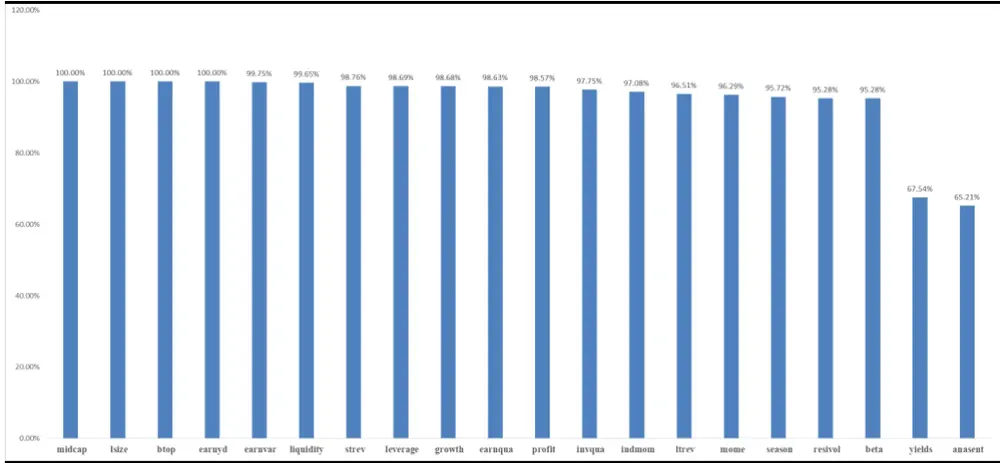
数据来源：东北证券，Wind

图 5: 风格因子平均覆盖度
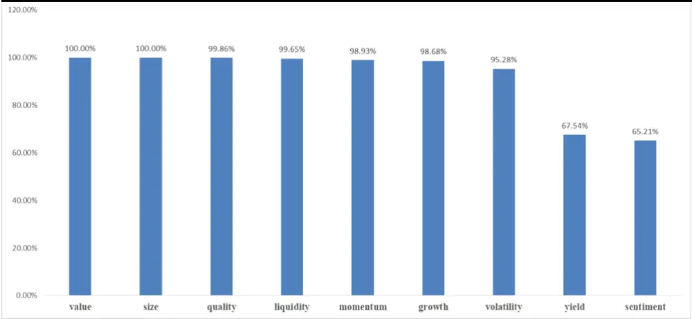
数据来源：东北证券，Wind

## 3.3. 单因子表现

在这一部分，我们对基础因子和风格因子表现进行回测。在这里我们使用回归的方法计算得到单因子纯因子收益，如下：

$$
r_{_{n}}-r_{_{f}}=f_{_{c}}+\sum_{_{i}}X_{_{ni}}f_{_{i}}+X_{_{ns}}f_{_{s}}+u_{_{n}}
$$

即，对于每一因子，将其与行业变量一起作为解释变量，进行加权截面回归，得到纯因子收益。下面我们对基础因子和风格因子结果进行分别说明（时间区间，2006年-2018年9月）。

## 3.3.1 基础因子

我们统计了纯因子收益均值和标准差，见表2;因子IR绝对值和回归T绝对值均值，见图6；同时给出了累计收益走势，见图7和图8。

对于收益均值，anasent、beta 和 btop表现最高，分别为8.19%、5.86%和 5.42%；liquidity、strev 和midcap最低，分别为-11.22%、-11.10%和-6.76%。对于回归 T值，earnqua、earnvar、anasent、season和growth 绝对值均值小于2，即显著性较差。

表 2: 基础因子收益统计

| 因子 | liquidity | leverage | earnvar | earnqua | profit | invqua | ltrev | earnyd | btop | growth |
| --- | --- | --- | --- | --- | --- | --- | --- | --- | --- | --- |
| 均值 | -11.22% | 1.27% | 1.18% | 1.36% | 0.74% | -1.41% | -2.95% | 3.61% | 5.42% | 1.12% |
| 标准差 | 3.94% | 3.13% | 1.93% | 2.16% | 3.54% | 2.76% | 3.38% | 4.58% | 4.37% | 1.36% |
| 因子 | anasent | strev | season | indmom | mome | midcap | lsize | resivol | beta | yields |
| 均值 | 8.19% | -11.10% | 1.37% | -1.20% | -4.31% | -6.76% | -4.97% | -2.68% | 5.86% | 3.50% |
| 标准差 | 1.83% | 4.74% | 1.52% | 15.91% | 4.55% | 2.33% | 5.14% | 3.08% | 6.22% | 3.32% |

数据来源：东北证券，Wind

图 6: 基础因子收益风险对比
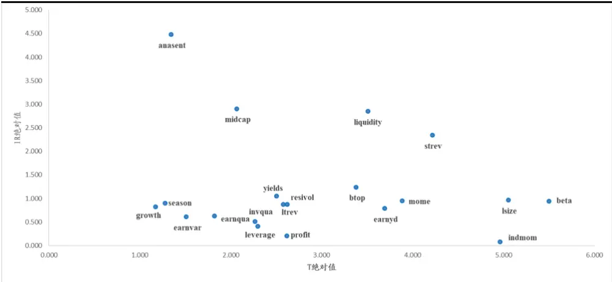
数据来源：东北证券，Wind

图 7: 基础因子累计收益(一)
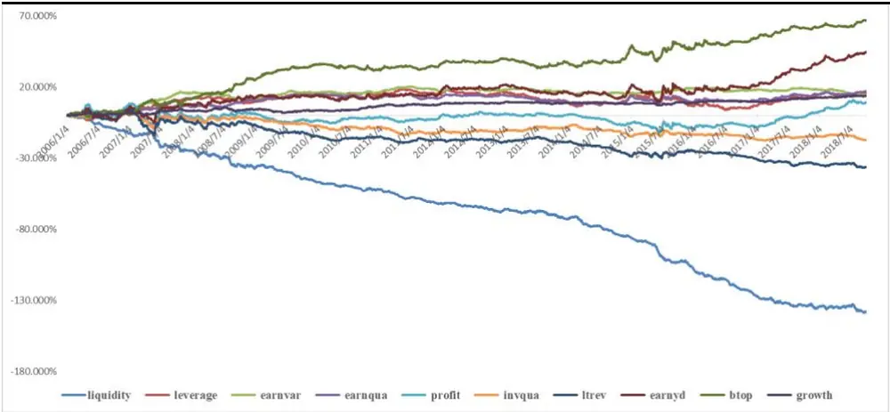
数据来源：东北证券，Wind

图 8: 基础因子累计收益(二)
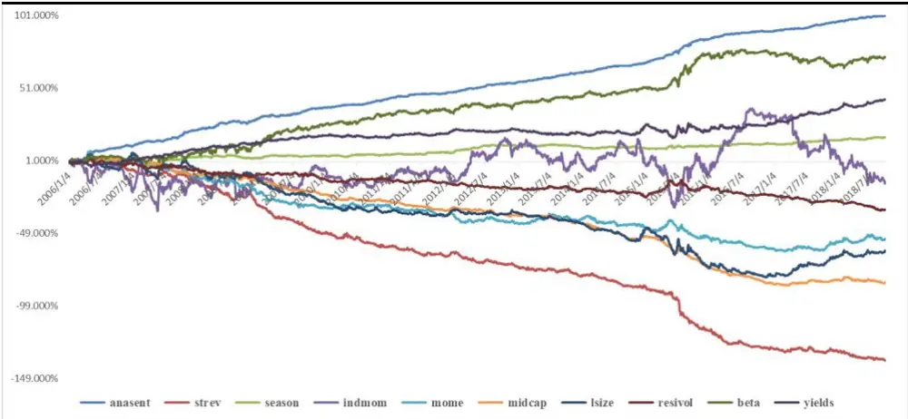
数据来源：东北证券，Wind

## 3.3.2 风格因子

我们统计了纯因子收益均值和标准差，见表3;因子IR绝对值和回归T绝对值均值，见图9；同时给出了累计收益走势，见图10。

对于收益均值，sentiment最高，为8.36%；liquidity最低，为-11.21%。对于回归 T值，sentiment 和 growth 绝对值均值小于 2，即显著性较差。

表 3: 风格因子收益统计

| 因子 | liquidity | quality | value | growth | sentiment | momentum | size | volatility | yield |
| --- | --- | --- | --- | --- | --- | --- | --- | --- | --- |
| 均值 | -11.21% | -0.66% | 3.07% | 1.11% | 8.36% | -8.58% | -7.75% | 2.29% | 3.51% |
| 标准差 | 3.94% | 3.35% | 4.56% | 1.37% | 1.85% | 4.89% | 4.96% | 5.35% | 3.33% |

数据来源：东北证券，Wind

图 9: 风格因子收益风险对比
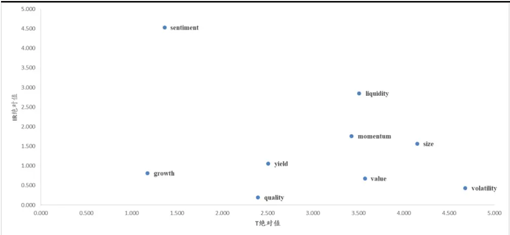
数据来源：东北证券，Wind

图 10: 风格因子累计收益
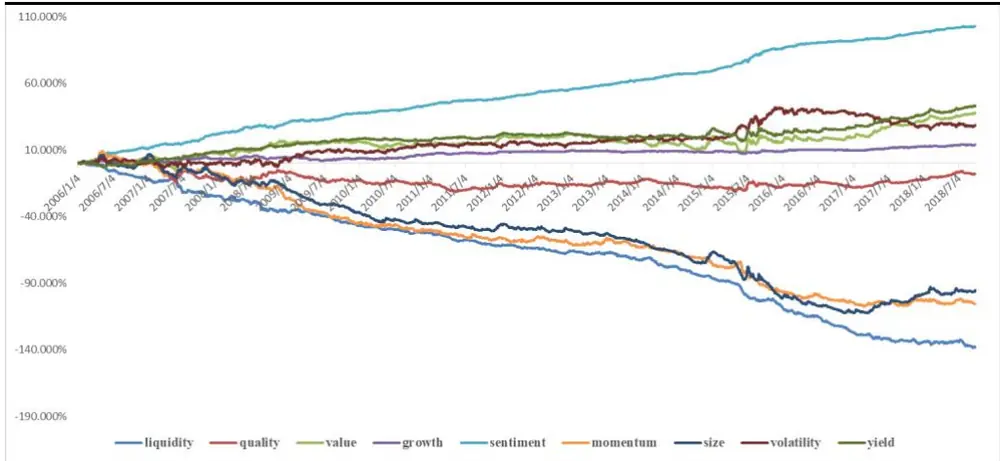
数据来源：东北证券，Wind

## 4. 结果展示

在这一部分我们将分别对模型解释度（回归R²）、风格因子收益进行说明，同时将其与CNE5进行对比（时间区间为2006年-2018年9月）。

## 4.1. 模型解释度

我们进行了两种类型的截面回归：一，包括全部9个风格因子；二，剔除情绪和分红因子。结果见图11。

9 因子 R²均值为 42.33%，7 因子为 37.43%，整体解释度处于较高的水平；后者与CNE5的结果基本一致；从时间来看，二者走势基本一致。前者解释度更高，我们认为是由两个原因导致的：一，情绪和分红因子的增量贡献；二，情绪和分红覆盖度相对较低，导致9因子回归股票池更少。分析师预期数据在大市值股票中整体覆盖度更高，而这一类股票受共性因素影响更大，进而导致解释度提升。

图 11: 模型 R2(滚动 1 年均值)
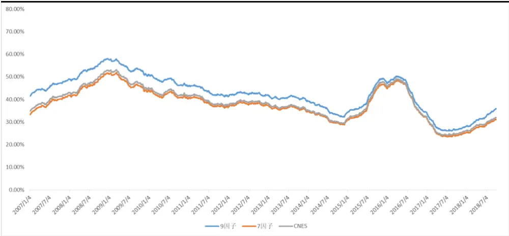
数据来源：东北证券，Wind

## 4.2. 风格因子收益

这一部分，我们给出了风格因子的累计收益走势(2006年-2018年9月)，见表4、表5、图 12 和图 13。

对比表4 和表 5 可以发现，liquidity、quality、value、growth、momentum、size和volatility等7个因子在两种回归中，收益方向完全一致，大小也较为接近；由此可以认为，情绪和分红因子与其余因子相关性较小。情绪类指标表现最好，收益均值为8.67%，分红因子收益为2.31%。从累计收益走势来看，情绪和分红因子较为平稳，回撤较小。

与CNE5 对比来看，value表现有所提升；momentum 因为包含了短期动量，整体表现得到的加强； size 表现基本一致； volatility 是将 beta 与 residual volatility 合并得到，方向与beta更为一致；尽管新添加了一个描述变量，liquidity整体表现变动较小。

表4:9因子收益统计

| 因子 | liquidity | quality | value | growth | sentiment | momentum | size | volatility | yield |
| --- | --- | --- | --- | --- | --- | --- | --- | --- | --- |
| 均值 | -6.95% | 0.62% | 3.88% | 2.14% | 8.67% | -9.66% | -6.62% | 5.16% | 2.31% |
| 标准差 | 3.57% | 3.54% | 3.96% | 2.34% | 1.78% | 4.99% | 4.81% | 4.82% | 1.78% |

数据来源：东北证券，Wind

表 5:7因子收益统计

| 因子 | liquidity | quality | value | growth | momentum | size | volatility |
| --- | --- | --- | --- | --- | --- | --- | --- |
| 均值 | -9.81% | 0.68% | 4.81% | 1.91% | -10.60% | -6.59% | 5.62% |
| 标准差 | 3.59% | 3.12% | 3.74% | 1.18% | 4.94% | 4.25% | 4.68% |

数据来源：东北证券，Wind

图 12: 纯因子收益(9 因子)
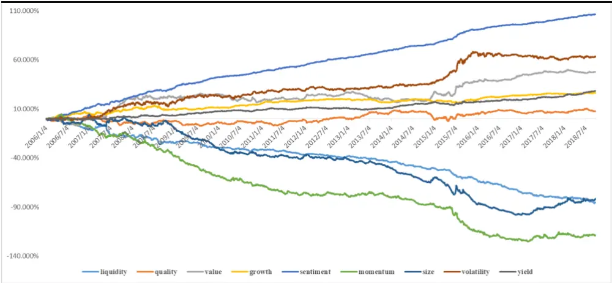
数据来源：东北证券，Wind

图 13: 纯因子收益(7 因子)
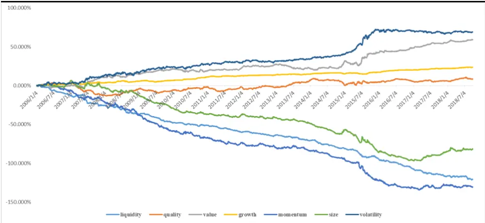
数据来源：东北证券，Wind

## 5. 总结

在本报告中，我们对MSCI新一代A股风险模型（CNE6）进行了介绍和结果展示。

CNE6中，包括48个描述变量、20个基础因子和9个风格因子。为得到风格因子，需进行两次加权。就种类来说，CNE6增加了质量、情绪和分红风格，将非线性市值与市值进行了合并。对于基础因子，增加了盈余波动、投资质量、长期反转、行业动量等；对于描述变量，例如流动性，增加了ATR指标。相较而言，CNE6中增加了市场关注度日益提高的一些因子，同时根据实际对一些因子进行了合并处理。

基于因子定义，我们计算了Barra_Descriptor（描述变量）、Barra_Basic（基础因子）和Barra_Style（风格因子）三张表，时间区间为2006年至今；每日进行数据更新。

因子覆盖度：20个基础因子中，18个因子的平均覆盖度在95%以上；分红和情绪因子，平均覆盖度分别为67.54%、65.21%，处于较低水平。因此，在进行截面回归时，我们计算了两个版本：一，使用全部9个因子；二，剔除分红和情绪因子进行计算。

单因子表现：anasent、beta和btop收益最高，分别为8.19%、5.86%和5.42%；liquidity、strev 和midcap最低，分别为-11.22%、-11.10%和-6.76%。

结果说明：9 因子R²均值为 42.33%，7 因子为 37.43%，整体解释度处于较高的水平；从时间来看，二者走势基本一致；后者与CNE5的结果较为一致。

与CNE5 对比来看，value表现有所提升；momentum因为包含了短期动量，整体表现得到加强；size 表现基本一致；volatility 是将 beta 与 residual volatility 合并得到，方向与beta更为一致；尽管新添加了一个描述变量，liquidity整体表现变动较小。

## 分析师简介：

徐忠亚：金融工程研究助理，南京大学金融学硕士，2017年加入东北证券研究所。

## 重要声明

本报告由东北证券股份有限公司（以下称“本公司”）制作并仅向本公司客户发布，本公司不会因任何机构或个人接收到本报告而视其为本公司的当然客户。

本公司具有中国证监会核准的证券投资咨询业务资格。

本报告中的信息均来源于公开资料，本公司对这些信息的准确性和完整性不作任何保证。报告中的内容和意见仅反映本公司于发布本报告当日的判断，不保证所包含的内容和意见不发生变化。

本报告仅供参考，并不构成对所述证券买卖的出价或征价。在任何情况下，本报告中的信息或所表述的意见均不构成对任何人的证券买卖建议。本公司及其雇员不承诺投资者一定获利，不与投资者分享投资收益，在任何情况下，我公司及其雇员对任何人使用本报告及其内容所引发的任何直接或间接损失概不负责。

本公司或其关联机构可能会持有本报告中涉及到的公司所发行的证券头寸并进行交易，并在法律许可的情况下不进行披露;
可能为这些公司提供或争取提供投资银行业务、财务顾问等相关服务。

本报告版权归本公司所有。未经本公司书面许可，任何机构和个人不得以任何形式翻版、复制、发表或引用。如征得本公司同意进行引用、刊发的，须在本公司允许的范围内使用，并注明本报告的发布人和发布日期，提示使用本报告的风险。

本报告及相关服务属于中风险（R3）等级金融产品及服务，包括但不限于A股股票、B股股票、股票型或混合型公募基金、AA级别信用债或ABS、创新层挂牌公司股票、股票期权备兑开仓业务、股票期权保护性认沽开仓业务、银行非保本型理财产品及相关服务。

若本公司客户（以下称“该客户”）向第三方发送本报告，则由该客户独自为此发送行为负责。提醒通过此途径获得本报告的投资者注意，本公司不对通过此种途径获得本报告所引起的任何损失承担任何责任。

## 分析师声明

作者具有中国证券业协会授予的证券投资咨询执业资格，并在中国证券业协会注册登记为证券分析师。本报告遵循合规、客观、专业、审慎的制作原则，所采用数据、资料的来源合法合规，文字阐述反映了作者的真实观点，报告结论未受任何第三方的授意或影响，特此声明。

## 投资评级说明

| 股票投资评级说明 | 买入 | 未来6个月内，股价涨幅超越市场基准15%以上。 |
| --- | --- | --- |
|  | 增持 | 未来6个月内，股价涨幅超越市场基准5%至15%之间。 |
|  | 中性 | 未来6个月内，股价涨幅介于市场基准-5%至5%之间。 |
|  | 减持 | 在未来6个月内，股价涨幅落后市场基准5%至15%之间。 |
|  | 卖出 | 未来6个月内，股价涨幅落后市场基准15%以上。 |
| 行业投资评级说明 | 优于大势 | 未来6个月内，行业指数的收益超越市场平均收益。 |
|  | 同步大势 | 未来6个月内，行业指数的收益与市场平均收益持平。 |
|  | 落后大势 | 未来6个月内，行业指数的收益落后于市场平均收益。 |

东北证券股份有限公司
网址：http://www.nesc.cn电话：400-600-0686

| 地址 | 邮编 |
| --- | --- |
| 中国吉林省长春市生态大街6666号 | 130119 |
| 中国北京市西城区锦什坊街28号恒奥中心D座 | 100033 |
| 中国上海市浦东新区杨高南路729号 | 200127 |
| 中国深圳市南山区大冲商务中心1栋2号楼24D | 518000 |

机构销售联系方式

| 姓名 | 办公电话 | 手机 | 邮箱 |
| --- | --- | --- | --- |
| 华东地区机构销售 |  |  |  |
| 袁颖（总监） | 021-20361100 | 13621693507 | yuanying@nesc.cn |
| 王博 | 021-20361111 | 13761500624 | wangbo@nesc.cn |
| 李寅 | 021-20361229 | 15221688595 | liyin@nesc.cn |
| 杨涛 | 021-20361106 | 18601722659 | yangtao@nesc.cn |
| 阮敏 | 021-20361121 | 13564972909 | ruanmin@nesc.cn |
| 李喆莹 | 021-20361101 | 13641900351 | lizy @nesc.cn |
| 齐健 | 021-20361258 | 18221628116 | qijian@nesc.cn |
| 陈希豪 | 021-20361267 | 13956071185 | chen_xh@nesc.cn |
| 华北地区机构销售 |  |  |  |
| 李航（总监） | 010-58034553 | 18515018255 | lihang@nesc.cn |
| 殷璐璐 | 010-58034557 | 18501954588 | yinlulu@nesc.cn |
| 温中朝 | 010-58034555 | 13701194494 | wenzc@nesc.cn |
| 曾彦戈 | 010-58034563 | 18501944669 | zengyg@nesc.cn |
| 颜玮 | 010-58034565 | 18601018177 | yanwei@nesc.cn |
| 华南地区机构销售 |  |  |  |
| 邱晓星（总监） | 0755-33975865 | 18664579712 | qiuxx@nesc.cn |
| 刘璇 | 0755-33975865 | 18938029743 | liu_xuan@nesc.cn |
| 刘曼 | 0755-33975865 | 15989508876 | liuman@nesc.cn |
| 林钰乔 | 0755-33975865 | 13662669201 | linyq@nesc.cn |
| 周逸群 | 0755-33975865 | 18682251183 | zhouyq@nesc.cn |