# 7年BARRA 中国市场模型（CNE6）解读

## 摘要

2018 年 8月，MSCI 发布了中国股权市场的最新模型 CNE6，本文首先总结6和介绍了 CNE6 的因子体系，然后分别从单因子检验、纯因子收益率、模型解释度和残差选股能力的角度对 CNE6 进行了解读。

CNE6 在 CNE5 的基础上做了一些修改、整合和完善，建立了三层风格因子体系，其中，一级因子有 9个，二级因子有 20个，三级因子有 46个。CNE6 在一级因子中新增了反映公司质量的 Quality因子，反映市场情绪的 Sentiment 因子以及度量公司分红状况的 Dividend Yield 因子。

在因子值的计算过程中，由于因子的具体权重未知，本文采用了等权的方式。从单因子检验的结果来看，大多数因子有不错的选股能力，但是部分因子与股票收益率的相关性较低，选股效果不佳，例如：一级因子 Quality和 Growth 以及它们相应的二级因子。

从累计纯因子收益率的绝对值来看，Size、Liquidity、Volatility累积纯因子收益率最高。Volatility 因子纯因子收益率在 2015 年表现较好，随后纯因子收益率明显下降；Size 因子在 2017 年之前，表现优异，但 2017 年之后纯因子收益率几乎为 0，其余 7 个风格因子在整个样本期的表现都相对平稳。

CNE6 的因子体系大概能够解释股票收益率 33.63%的变动，它对股票收益率的解释能力是否足够完备呢？本文检验了 CNE6模型回归残差的选股能力，结果发现，回归残差 20日均值和 20 日标准差仍然具有非常显著的选股能力，IC 值分别为-7.11%和-8.36%，IC 序列超过80%的值小于 0，体现了良好的稳定性，这就说明 CNE6的因子体系对股票收益率的解释并不完备。如果将残差的均值和残差的波动率作为一级因子同时纳入CNE6的因子体系中，模型的解释能力由33.63%上升至 34.22%。

最后，在使用 CNE6的过程中，我们可能还需要解决 3个问题：第一，因子体系的加权方式问题，合理的加权方式会显著提高模型的解释能力；第二，数据质量以及因子覆盖度的问题，新增的 Sentiment 因子覆盖度相对较低，很难用于选股或者风险管理实践；第三，CNE6 解释能力的完备性问题。

风险提示：本文关于 CNE6因子体系的计算方式可能与 MSCI 存在差异；本文的研究是基于对历史数据的统计和分析，因子的历史收益率不代表未来收益率。若市场环境发生变化，因子的最终表现可能发生改变。

## 西南证券研究发展中心

分析师：邓璎函[Table_Aut

执业证号：S1250517080005

电话：023-67507084

邮箱：dyh@swsc.com.cn

分析师：王挺

执业证号：S1250518100001

电话：023-67791263

邮箱：wting@swsc.com.cn

## 相关研究

1. 中美股市的联动性研究 (2018-11-02)

2. 波动率因子的改进：异质波动率——因子选股系列 (2018-08-29)

3. 大类资产配置模型的解析与探讨(2018-04-16)

2018 年 8 月，MSCI 发布了中国股权市场的最新模型，即 CNE6，CNE6不仅能用于预测风险，而且还能在选股因子构建方面给予我们一定的启发。本文主要从两个角度对 CNE6进行解读：第一，从选股因子角度分析 CNE6因子体系的选股能力；第二，从风险管理的角度测度 CNE6的解释能力。

## 1 CNE6 简介

根据 BARRA的理论模型，股票收益率可以被三类因素解释，分别是国家因子、行业因子以及风格因子，即：

$$
r_{n}=f_{c}+\sum_{i}X_{ni}f_{i}+\sum_{s}X_{ns}f_{s}+u_{n},
$$

其中， $r_{n}$ 是股票的超额收益率； $f_{c}.$ 是国家因子， $f_{i}.$ 是行业因子， $f_{s}$ 是风格因子； $X_{ni}$ 为行业虚拟变量， $X_{ns}$ 为风格因子载荷。

CNE6 主要是从风格因子层面对 CNE5 做了一些修改、整合和完善。具体来说，CNE6建立了三层风格因子体系，为了方便描述，我们分别称之为一级因子、二级因子、三级因子，一级因子有 9个，二级因子有 20 个，三级因子有 46 个，上层因子是由下层因子加权计算得到的。在 CNE5中，因子体系则仅有两层，一级因子有 10 个，CNE6 将 CNE5 的一级因子进行了分类整合，将其变为新体系中二级因子的一部分。CNE6主要有 5 个方面的变化：

(1) 将 Residual Volatility 和 Beta 整合成 Volatility；

(2) 将 Size 和 Mid Cap（曾经的 Non-linear Size）整合成新的 Size；

(3) 新增 Sentiment 和 Dividend Yield；

(4) 在 Momentum 中新增 Industry Momentum、Short-Term Reversal、Seasonality；

(5) 在 Quality 中新增 Earnings Variability、Earnings Quality、Profitability、InvestmentQuality。

表 1：MSCI CNE6 因子体系推测

| 一级因子 | 二级因子 | 三级因子 | 因子描述 |
| --- | --- | --- | --- |
| Volatility | Beta | HBETA | 历史 Beta |
|  | Residual Volatility | HSIGMA | 历史残差波动率 |
|  |  | DASTD | 日超额收益波动率 |
|  |  | CMRA | 累计超额收益离差 |
| Momentum | Momentum | RSTR | 与市场的相对强弱 |
|  |  | HALPHA | 短期历史 Alpha |
|  | Industry Momentum | INDMOM | 行业动量 |
|  | Short-Term Reversal | STREV | 短期反转 |
|  | Seasonality | SEASON | 季节因素 |
| Size | Size | LNSIZE | 市值的自然对数 |
|  | Mid Cap | NLSIZE | LNSIZE 的立方 |
| Quality | Leverage | MLEV | 市场杠杆 |
|  |  | BLEV | 账面杠杆 |
|  |  | DTOA | 资产负债比 |
|  | Earnings Variability | VSAL | 营业收入波动率 |
|  |  | VERN | 盈利波动率 |
|  |  | VFLO | 现金流波动率 |
|  |  | ETOPF_STD | 预期 EPS 波动率 |
|  | Earnings Quality | ABS | 资产负债表应计项目 |
|  |  | ACF | 现金流量表应计项目 |
|  | Profitability | ATO | 资产周转率 |
|  |  | GP | 总盈利能力 |
|  |  | GPM | 毛利率 |
|  |  | ROA | 资产收益率 |
|  | Investment Quality | AGRO | 总资产增长率 |
|  |  | IGRO | 股票发行数量增长率 |
|  |  | CXGRO | 资本支出增长率 |
| Liquidity | Liquidity | STOM | 一月换手情况 |
|  |  | STOQ | 一季换手情况 |
|  |  | STOA | 一年换手情况 |
|  |  | ATVR | 一年换手加权和 |
| Growth | Growth | EGRLF | 预测长期盈利增长率 |
|  |  | SGRO | 营业收入增长率 |
|  |  | EGRO | 盈利增长率 |
| Value | Btop | BTOP | 账面市值比 |
|  | Earning Yield | ETOP | 报告的盈利价格比 |
|  |  | ETOPF | 预测的盈利价格比 |
|  |  | CETOP | 现金盈利价格比 |
|  |  | EM | 企业价值倍数的倒数 |
|  | Long-Term Reversal | LTRSTR | 长期相对强弱 |
|  |  | LTHALPHA | 长期历史 alpha |
| Sentiment | Sentiment | RRIBS | 评级调整比率 |
|  |  | EPIBSC | 分析师预测盈利价格比的变化 |
|  |  | EARNC | 预测每股盈利变化 |
| Dividend Yield | Dividend Yield | DTOP | 分红价格比 |
|  |  | DTOPF | 预测分红价格比 |

注：根据MSCI发布资料推测整理，可能与MSCI实际使用的因子体系存在差异。

## 2 单因子检验

CNE6 的因子体系虽然主要用于风险管理，但其构造方式可能会在选股上给予我们一定的启发，因此本文检验了其因子体系的选股能力。在计算一级因子和二级因子的因子值时，由于 CNE6 因子体系的权重未知，本文直接采取了等权的方法。事实上，我们也尝试过其它的方法，例如：前n期平均 IC 值加权、带符号调整的等权方法等，但选股效果并没有明显的提升，因此选取了最简单的等权方法。

下文对因子体系的检验样本期是 2010 年 1月 1 日到 2018 年 12 月 1 日，样本股票是全部 A股，排除了上市未满 3个月的股票。检验之前首先将因子与市值和行业正交，取残差代替因子值，然后将股票按照因子值从小到大分为 5组，分别考察多头组合、空头组合以及多空组合在未来 20 个交易日的收益率，交易费用为买入千分之一，卖出千分之二。

## 2.1 Volatility

CNE6 中的波动率因子整合了 CNE5 中的 Beta 和 Residual Volatility 这两个风格因子。从三级因子的表现来看，日超额收益波动率 DASTD 的选股能力最强，经过加权之后的一级因子选股能力下降，但同时也降低了换手率。

表 2：Volatility 因子检验

| 因子 | 因子等级 | 平均IC | IC_IR | IC<0 的比例 | 年化收益率 | 最大回撤率 | 平均换手率 |
| --- | --- | --- | --- | --- | --- | --- | --- |
| Volatility | 一级因子 | -5.27% | -0.38 | 66.67% | 多头：6.77% | 多头：58.20% | 31.98% |
|  |  |  |  |  | 空头：-2.90% | 空头：73.51% |  |
|  |  |  |  |  | 多空：5.78% | 多空：33.23% |  |
| Residual Volatility | 二级因子 | -5.94% | -0.41 | 66.67% | 多头：7.67% | 多头：57.50% | 37.19% |
|  |  |  |  |  | 空头：-3.65% | 空头：75.24% |  |
|  |  |  |  |  | 多空：8.19% | 多空：27.90% |  |
| HBETA | 二级因子 | -2.39% | -0.23 | 66.67% |  | 多头：63.32% | 27.39% |
|  |  |  |  |  | 多头：4.30% 空头：0.13% | 空头：71.24% |  |
|  |  |  |  |  | 多空：1.08% | 多空：27.16% |  |
| HSIGMA | 三级因子 | -4.73% | -0.36 | 62.96% |  | 多头：58.93% | 24.35% |
|  |  |  |  |  | 多头：6.99% 空头：-0.83% | 空头：71.12% |  |
|  |  |  |  |  |  | 多空：28.10% |  |
| DASTD | 三级因子 | -7.28% | -0.53 | 75.93% | 多空：5.58% |  | 41.77% |
|  |  |  |  |  | 多头：7.44% 空头：-5.95% | 多头：59.83% 空头：77.46% |  |
| CMRA | 三级因子 | -3.71% | -0.31 | 64.81% | 多空：10.11% | 多空：29.22% | 44.87% |
|  |  |  |  |  | 多头：6.44% 空头：-1.80% | 多头：60.12% 空头：73.43% |  |
|  |  |  |  |  | 多空：6.17% | 多空：20.55% |  |

注：平均换手率是分组检验时每组平均月换手的均值，下同，不再赘述。数据来源：Wind，西南证券

图 1：一级因子 Volatility 多空表现
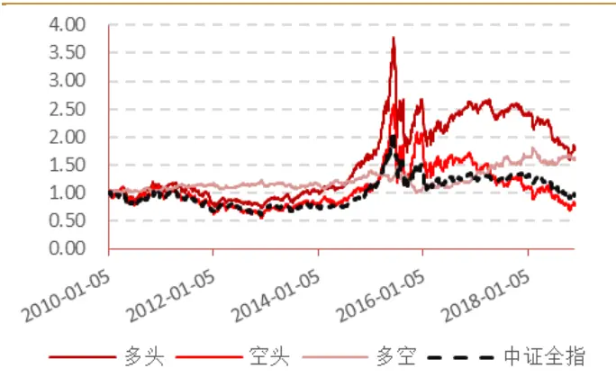
数据来源：西南证券

图 2：二级因子 Residual Volatility 多空表现

数据来源：西南证券

图 3：二级因子 HBETA多空表现
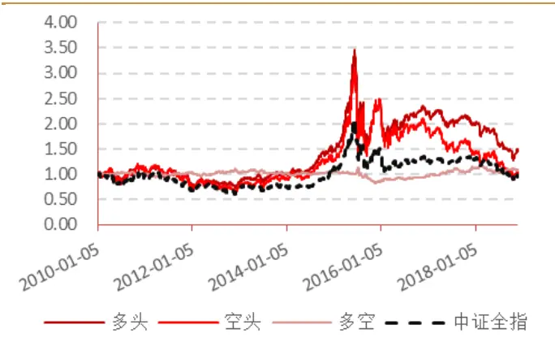
数据来源：西南证券

图 4：三级因子 HSIGMA多空表现
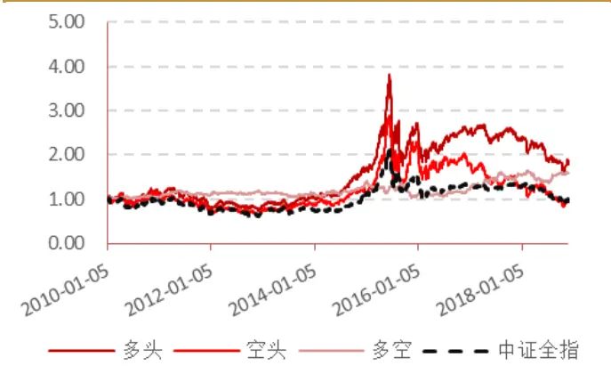
数据来源：西南证券

图 5：三级因子 DASTD 多空表现
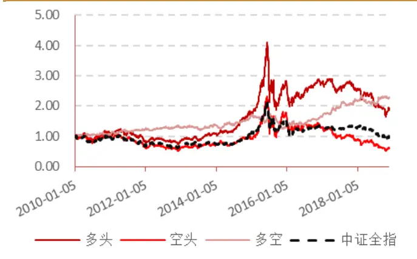
数据来源：西南证券

图 6：三级因子 CMRA多空表现
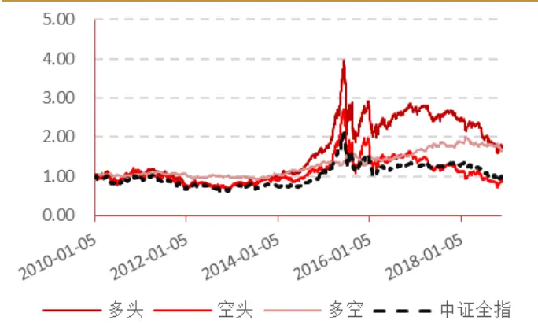
数据来源：西南证券

## 2.2 Momentum

一级风格因子 Momentum 是在 CNE5 的 Momentum 基础上新增 Industry Momentum、Short-Term Reversal、Seasonality。新增的 3 个二级因子总体表现不错，明显提高了动量的选股效果。另外，动量类因子的换手率相对较高，平均月度换手约在 45%到 80%之间。

表 3：Momentum 因子检验

| 因子 | 因子等级 | 平均IC | IC_IR | IC<0 的比例 | 年化收益率 | 最大回撤率 | 平均换手率 |
| --- | --- | --- | --- | --- | --- | --- | --- |
| Momentum | 一级因子 | -4.40% | -0.48 | 64.81% | 多头：3.95% | 多头：66.77% | 72.91% |
|  |  |  |  |  | 空头：-4.55% 多空：8.26% | 空头：75.00% 多空：15.23% |  |
| Momentum | 二级因子 | -2.95% | -0.27 | 60.19% | 多头：3.66% | 多头：67.84% | 46.52% |
|  |  |  |  |  | 空头：-1.21% | 空头：69.17% |  |
|  | 二级因子 | 6.09% | 0.66 | 27.78% |  | 多空：21.45% |  |
|  |  |  |  |  | 多空：3.69% |  |  |
|  |  |  |  |  | 多头：5.87% 空头：-8.39% | 多头：59.78% |  |
| Short-Term Reversal | 二级因子 | -4.90% | -0.50 | 69.44% | 多空：14.95% | 空头：77.12% 多空：12.89% | 80.92% |
|  |  |  |  |  | 多头：3.81% | 多头：65.47% |  |
|  |  |  |  |  | 空头：-8.73% | 空头：79.17% |  |
| Seasonality | 二级因子 | 1.32% | 0.24 | 42.59% | 多空：13.42% | 多空：9.95% | 81.43% |
|  |  |  |  |  | 多头：2.89% | 多头：67.91% |  |
|  |  |  |  |  | 空头：-1.60% | 空头：71.11% |  |
| RSTR | 三级因子 | -2.65% | -0.25 | 58.33% | 多空：4.39% | 多空：6.11% | 47.67% |
|  |  |  |  |  | 多头：3.16% | 多头：68.09% |  |
|  |  |  |  |  | 空头：-1.38% | 空头：70.52% |  |
| HALPHA | 三级因子 | -3.15% | -0.29 | 61.11% | 多空：3.54% | 多空：18.64% | 45.98% |
|  |  |  |  |  | 多头：3.85% | 多头：67.30% |  |
|  |  |  |  |  | 空头：-1.08% | 空头：69.06% |  |
|  |  |  |  |  |  | 多空：21.46% |  |
|  |  |  |  |  | 多空：3.81% |  |  |

数据来源：Wind，西南证券

图 7：一级因子 Momentum多空表现
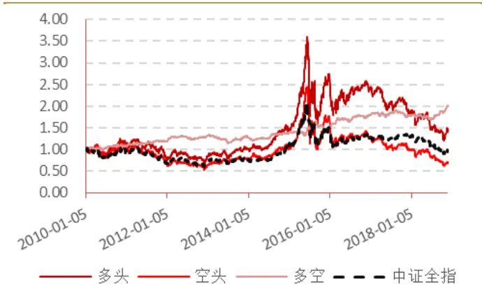
数据来源：西南证券

图 8：二级因子 Momentum多空表现
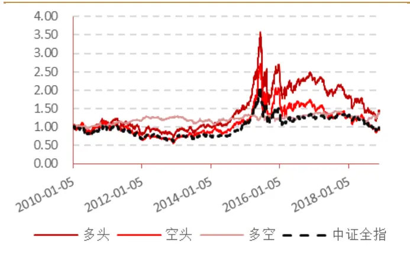
数据来源：西南证券

图 9：二级因子 Industry Momentum 多空表现
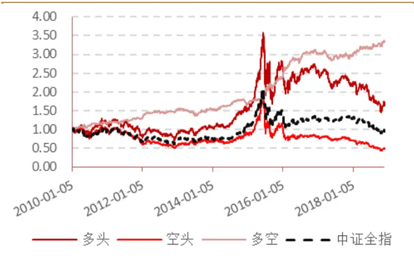
数据来源：西南证券

图 10：二级因子 Short-Term Reversal 多空表现
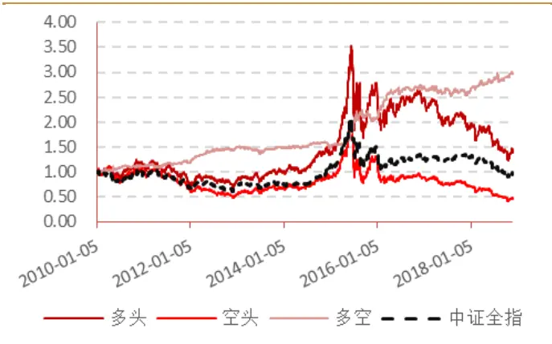
数据来源：西南证券

图 11：二级因子 Seasonality 多空表现

数据来源：西南证券

图 12：三级因子 RSTR多空表现

数据来源：西南证券

图 13：三级因子 HALPHA多空表现
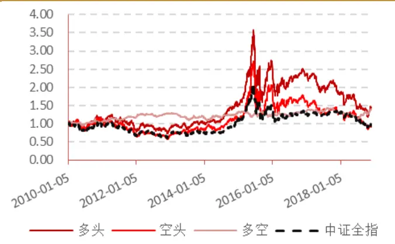
数据来源：西南证券

## 2.3 Size

LNSIZE 与 Mid Cap 共同构成了 Size 因子，规模类因子换手较低，多头收益明显，但2017 年以来出现较大的回撤。从回测结果来看，非线性市值比市值对数表现更稳健。

表 4：Size 因子检验

| 因子 | 因子等级 | 平均IC | IC_IR | IC<0 的比例 | 年化收益率 | 最大回撤率 | 平均换手率 |
| --- | --- | --- | --- | --- | --- | --- | --- |
| Size | 一级因子 | -5.65% | -0.33 | 66.67% | 多头：17.45%空头：-1.21%多空：19.97% | 多头：56.48%空头：63.52%多空：35.84% | 23.31% |
| LNSIZE | 二级因子 | -5.29% | -0.30 | 63.89% | 多头：15.24%空头：-2.33%多空：19.25% | 多头：57.09%空头：62.03%多空：39.60% | 22.50% |
| Mid cap | 二级因子 | -5.66% | -0.60 | 75.93% | 多头：17.09%空头：-2.14%多空：19.43% | 多头：53.17%空头：70.60%多空：15.59% | 26.63% |

数据来源：Wind，西南证券

图 14：一级因子 Size多空表现
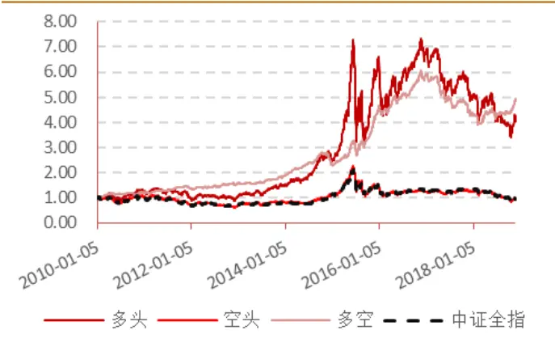
数据来源：西南证券

图 15：二级因子 LNSIZE多空表现
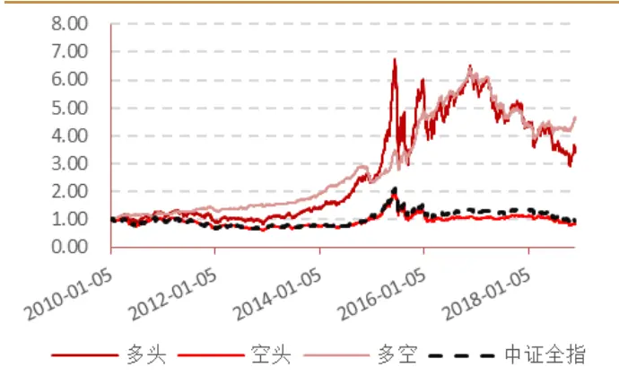
数据来源：西南证券

图 16：二级因子 Mid cap 多空表现
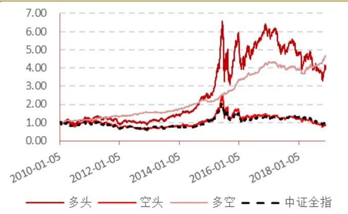
数据来源：西南证券

## 2.4 Quality

在质量因子由 5 部分构成，分别是：CNE5 中的 Leverage、新增的 Earnings Variability、Earnings Quality、Profitability、Investment Quality。质量类因子的计算大量使用了股票的基本面数据，大多数因子的换手率并不高，但选股效果都不太好。

表 5：Quality 因子检验

| 因子 | 因子等级 | 平均IC | IC_IR | IC<0 的比例 | 年化收益率 | 最大回撤率 | 平均换手率 |
| --- | --- | --- | --- | --- | --- | --- | --- |
| Quality | 一级因子 | 1.04% | 0.10 | 49.07% | 多头：3.70% | 多头：62.95% | 35.29% |
|  |  |  |  |  | 空头：2.58% | 空头：70.18% |  |
|  |  |  |  |  | 多空：0.06% | 多空：35.66% |  |
| Leverage | 二级因子 | 0.14% | 0.01 | 50.93% | 多头：2.21% | 多头：65.90% | 21.02% |
|  |  |  |  |  | 空头：2.39% | 空头：66.67% |  |
|  |  |  |  |  | 多空：-1.08% | 多空：32.98% |  |
| Earnings Variability | 二级因子 | -0.68% | -0.10 | 54.63% | 多头：3.77% | 多头：66.45% | 28.83% |
|  |  |  |  |  | 空头：1.40% | 空头：67.57% |  |
| Earnings Quality | 二级因子 | 1.03% | 0.20 | 37.96% | 多空：2.51% | 多空：15.95% | 42.13% |
|  |  |  |  |  | 多头：3.30% 空头：1.09% | 多头：67.19% 空头：68.63% |  |
| Profitability | 二级因子 | 0.52% | 0.07 | 46.30% | 多空：1.74% | 多空：23.65% | 22.33% |
|  |  |  |  |  | 多头：3.19% 空头：2.09% | 多头：61.99% 空头：70.40% |  |
| Investment Quality | 二级因子 |  |  |  | 多空：0.85% | 多空：22.57% |  |
|  |  |  |  |  | 多头：3.29% | 多头：67.29% |  |
|  |  |  |  |  | 空头：0.94% | 空头：68.86% |  |
| MLEV | 三级因子 | 1.09% | 0.16 | 42.59% | 多空：1.98% | 多空：13.17% | 22.13% |
|  |  |  |  |  | 多头：2.63% | 多头：64.33% 空头：67.73% |  |
|  |  |  |  |  | 空头：0.84% |  |  |
| BLEV | 三级因子 | -0.17% | -0.03 |  | 多空：1.21% | 多空：17.82% |  |
|  |  |  |  |  | 多头：1.64% 空头：0.75% | 多头：66.66% 空头：67.15% |  |
| DTOA | 三级因子 | -0.02% | 0.00 |  | 多空：1.02% | 多空：16.48% |  |
|  |  |  |  |  | 多头：2.81% | 多头：66.46% 空头：67.59% |  |
|  |  |  |  |  | 空头：2.43% |  |  |
| VSAL | 三级因子 | -1.37% | -0.32 |  | 多空：0.74% | 多空：21.26% |  |
|  |  |  |  |  | 多头：4.08% | 多头：66.13% |  |
|  |  |  |  |  | 空头：0.45% | 空头：69.45% |  |
| VERN | 三级因子 |  | -0.11 |  | 多空：3.88% | 多空：7.72% |  |
|  |  |  |  |  | 多头：7.42% | 多头：65.26% |  |
|  |  |  |  |  | 空头：4.64% | 空头：66.54% |  |
| VFLO | 三级因子 | -0.37% | -0.08 | 56.48% | 多空：2.29% 多头：2.08% | 多空：6.84% 多头：68.78% | 31.88% |
|  |  |  |  |  | 空头：2.48% | 空头：63.96% |  |
| ETOPF_STD | 三级因子 | 0.37% | 0.04 |  | 多空：-0.33% | 多空：13.77% |  |
|  |  |  |  | 多头：2.12% | 多头：59.54% |  |  |
|  |  |  |  | 空头：1.48% | 空头：65.55% |  |  |
| ABS | 三级因子 | 0.28% | 0.05 | 48.15% | 多空：0.03% | 多空：23.78% | 36.95% |
|  |  |  |  |  | 多头：2.69% | 多头：67.57% |  |
|  |  |  |  |  | 空头：2.93% | 空头：68.10% |  |
| ACF | 三级因子 | 1.28% | 0.29 | 33.33% | 多空：-0.84% | 多空：26.07% | 44.45% |
|  |  |  |  |  | 多头：2.80% | 多头：66.28% 空头：68.26% |  |
|  |  |  |  |  | 空头：-0.89% |  |  |
| ATO | 三级因子 | 0.72% | 0.16 | 47.22% | 多空：3.61% | 多空：17.00% | 19.96% |
|  |  |  |  |  | 多头：3.67% | 多头：65.04% 空头：69.17% |  |
|  |  |  |  |  | 空头：2.16% |  |  |
| GP | 三级因子 | 0.34% | 0.04 | 41.67% | 多空：1.21% | 多空：8.63% |  |
|  |  |  |  |  | 多头：2.96% 空头：2.77% | 多头：60.92% 空头：69.33% |  |
| GPM | 三级因子 | 0.62% | 0.09 | 44.44% | 多空：0.11% | 多空：25.59% |  |
|  |  |  |  |  | 多头：3.11% 空头：2.00% | 多头：64.91% 空头：69.17% |  |
| ROA | 三级因子 | 0.35% | 0.04 | 44.44% | 多空：1.21% | 多空：20.78% | 25.71% |
|  |  |  |  |  | 多头：3.41% 空头：2.03% | 多头：60.73% 空头：70.24% |  |
| AGRO | 三级因子 | 1.61% | 0.22 | 40.74% | 多空：1.20% | 多空：24.88% |  |
|  |  |  |  |  | 多头：4.23% 空头：-0.61% | 多头：67.37% 空头：69.40% |  |
| IGRO | 三级因子 | 1.16% | 0.21 | 37.96% | 多空：4.52% | 多空：12.22% |  |
|  |  |  |  |  | 多头：4.13% | 多头：65.72% |  |
|  |  |  |  |  | 空头：1.20% 多空：2.71% | 空头：68.53% 多空：9.61% |  |
| CXGRO | 三级因子 | 0.33% | 0.07 | 46.30% | 多头：3.80% | 多头：68.01% |  |
|  |  |  |  |  | 空头：3.07% | 空头：68.00% |  |
|  |  |  |  |  | 多空：0.58% | 多空：10.31% |  |

数据来源：Wind，西南证券

图 17：一级因子 Quality多空表现
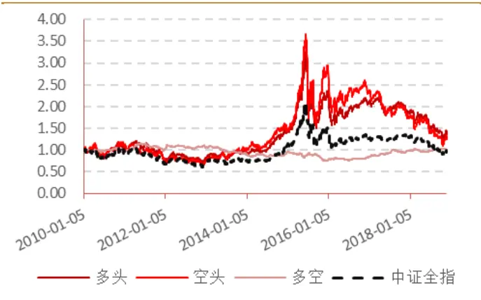
数据来源：西南证券

图 18：二级因子 Leverage 多空表现
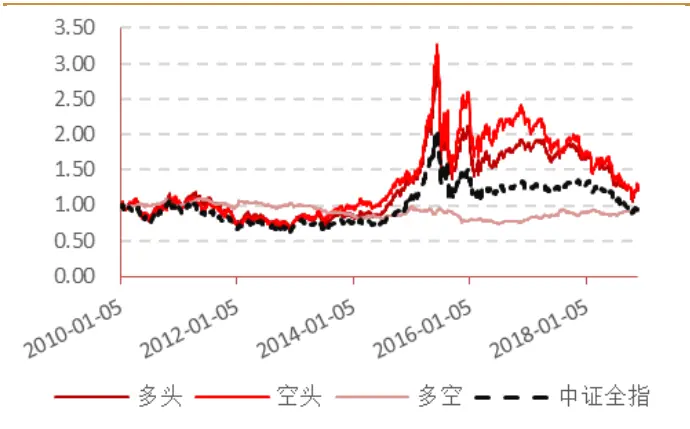
数据来源：西南证券

图 19：二级因子 Earnings Variability 多空表现
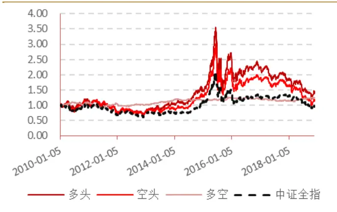
数据来源：西南证券

图 20：二级因子 Earnings Quality 多空表现
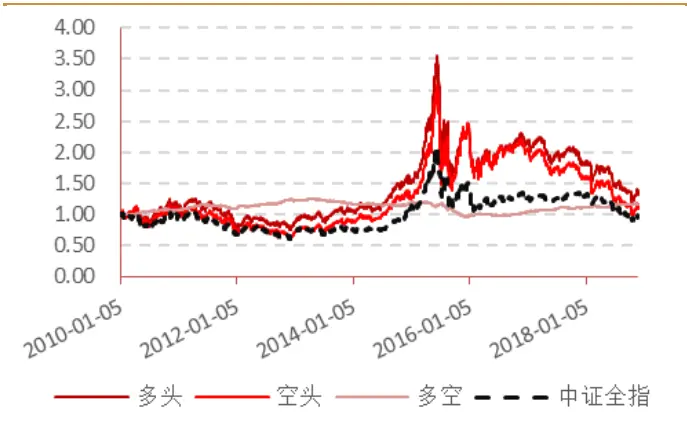
数据来源：西南证券

图 21：二级因子 Profitability 多空表现
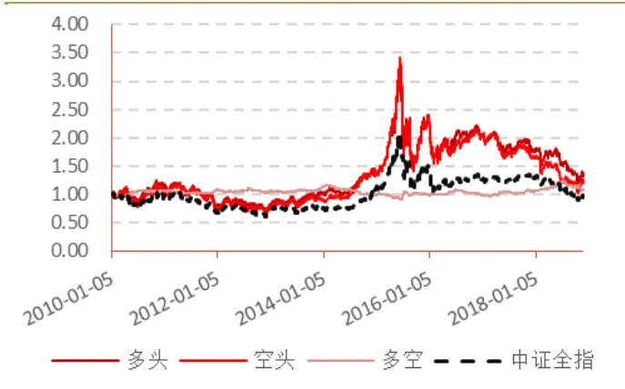
数据来源：西南证券

图 22：二级因子 Investment Quality 多空表现
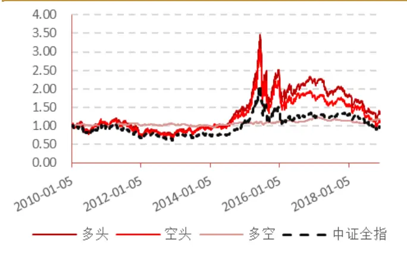
数据来源：西南证券

图 23：三级因子 MLEV多空表现
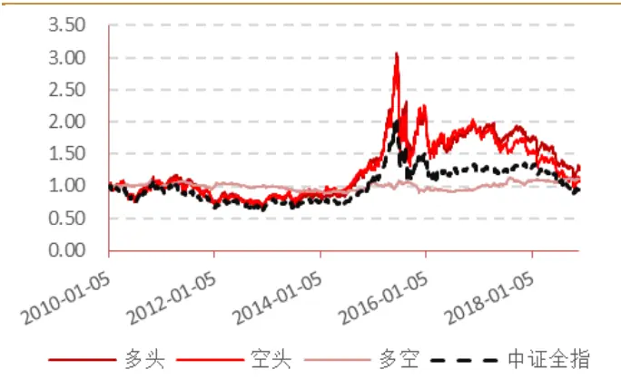
数据来源：西南证券

图 24：三级因子 BLEV多空表现
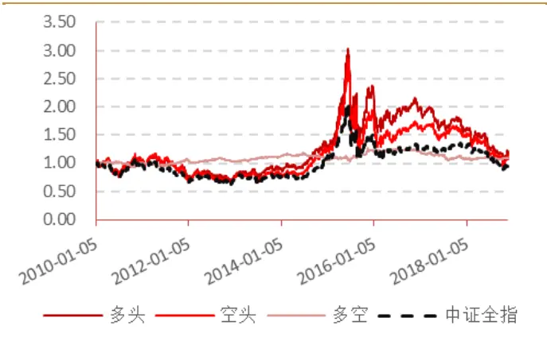
数据来源：西南证券

图 25：三级因子 DTOA多空表现

数据来源：西南证券

图 26：三级因子 VSAL多空表现

数据来源：西南证券

图 27：三级因子 VERN多空表现
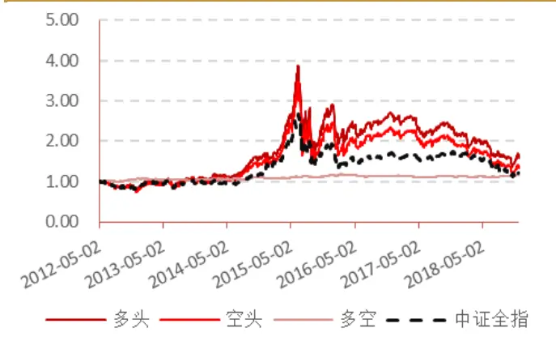
数据来源：西南证券

图 28：三级因子 VFLO多空表现
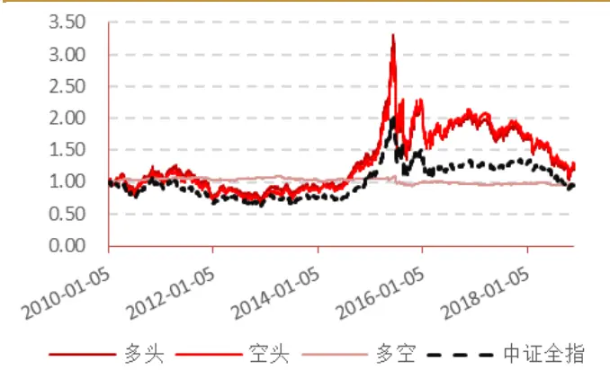
数据来源：西南证券

图 29：三级因子 ETOPF_STD 多空表现
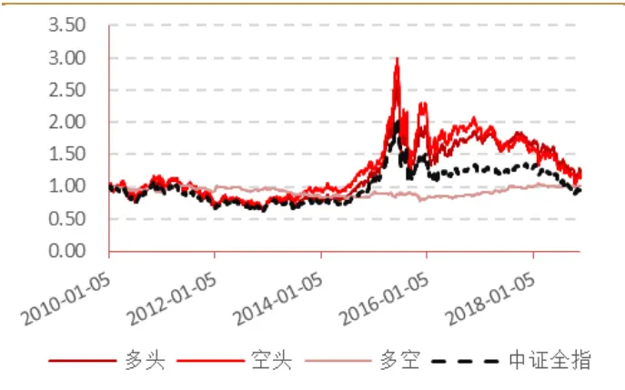
数据来源：西南证券

图 30：三级因子 ABS多空表现

数据来源：西南证券

图 31：三级因子 ACF多空表现
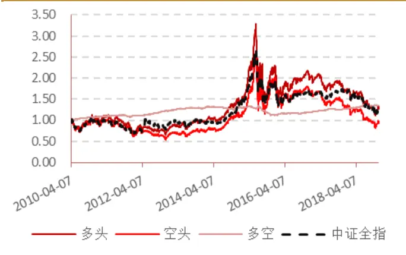
数据来源：西南证券

图 32：三级因子 ATO多空表现
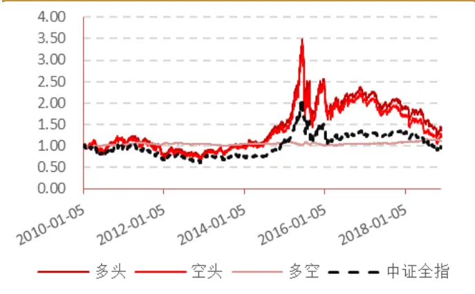
数据来源：西南证券

图 33：三级因子 GP多空表现
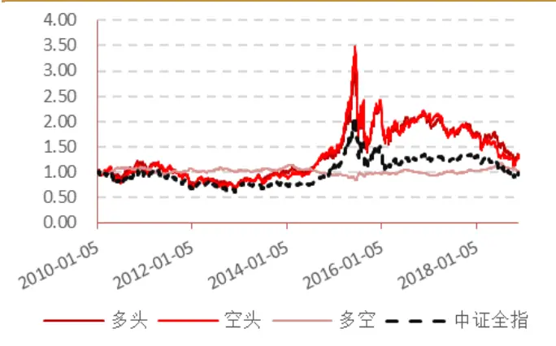
数据来源：西南证券

图 34：三级因子 GPM多空表现
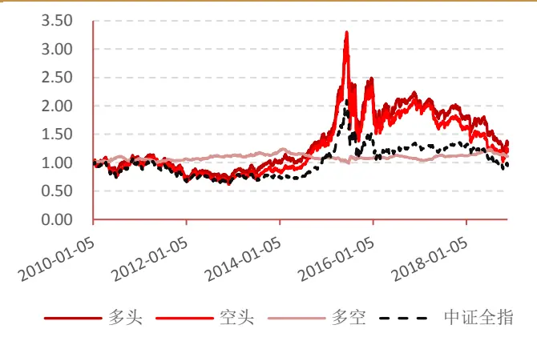
数据来源：西南证券

图 35：三级因子 ROA多空表现
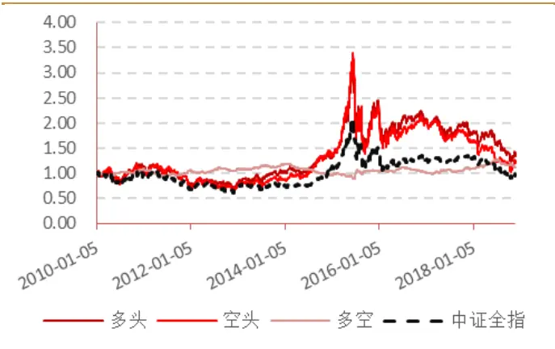
数据来源：西南证券

图 36：三级因子 AGRO多空表现

数据来源：西南证券

图 37：三级因子 IGRO多空表现
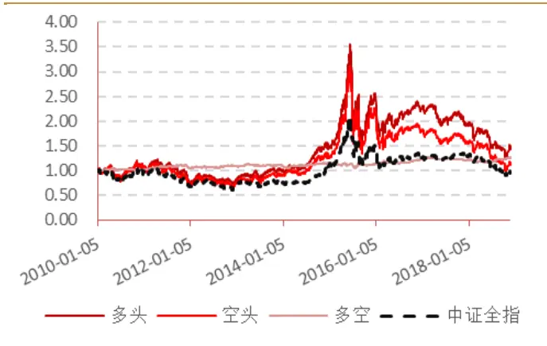
数据来源：西南证券

图 38：三级因子 CXGRO多空表现
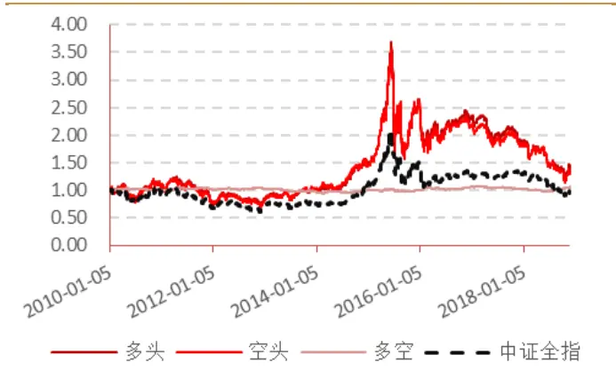
数据来源：西南证券

## 2.5 Liquidity

与 CNE5 相比，Liquidity 因子变化不大，只是新增了 ATVR 这个三级因子，从检验结果来看，流动性类因子选股效果相对较强。

表 6：Liquidity 因子检验

| 因子 | 因子等级 | 平均IC | IC_IR | IC<0 的比例 | 年化收益率 | 最大回撤率 | 平均换手率 |
| --- | --- | --- | --- | --- | --- | --- | --- |
| Liquidity | 一级因子 | -6.42% | -0.51 | 72.22% | 多头：9.16%空头：-5.08%多空：11.61% | 多头：54.07%空头：76.86%多空：21.04% | 33.57% |
| STOM | 三级因子 | -7.75% | -0.65 | 75.93% | 多头：9.49%空头：-8.28%多空：15.82% | 多头：54.33%空头：79.05%多空：21.43% | 52.47% |
| STOQ | 三级因子 | -6.57% | -0.58 | 74.07% | 多头：9.13%空头：-6.64%多空：13.64% | 多头：53.90%空头：78.67%多空：13.85% | 36.16% |
| STOA | 三级因子 | -4.87% | -0.43 | 68.52% | 多头：8.04%空头：-2.91%多空：8.60% | 多头：54.47%空头：75.93%多空：21.80% | 22.28% |
| ATVR | 三级因子 | -5.78% | -0.55 | 73.15% | 多头：8.52%空头：-4.87%多空：11.36% | 多头：57.52%空头：77.96%多空：14.31% | 27.06% |

数据来源：Wind，西南证券

图 39：一级因子 Liquidity 多空表现
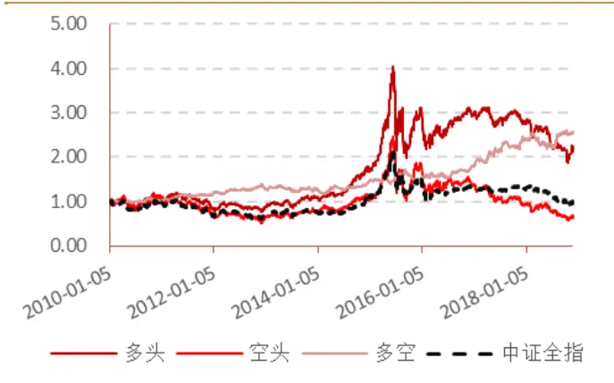
数据来源：西南证券

图 40：三级因子 STOM多空表现
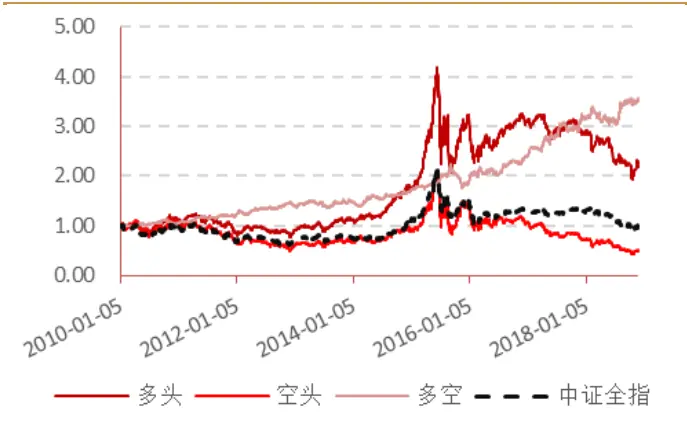
数据来源：西南证券

图 41：三级因子 STOQ多空表现

数据来源：西南证券

图 42：三级因子 STOA多空表现
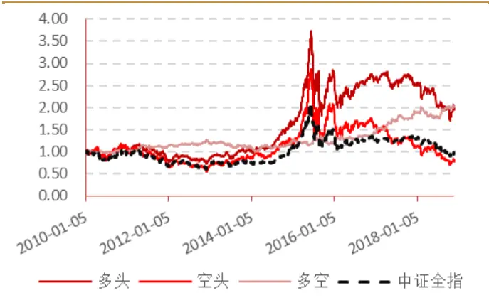
数据来源：西南证券

图 43：三级因子 ATVR多空表现
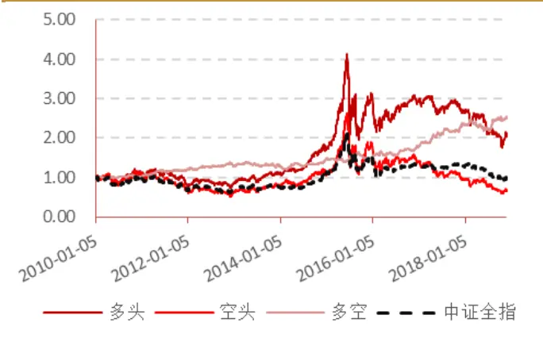
数据来源：西南证券

## 2.6 Growth

与 Quality 类似，Growth 因子体系的选股效果同样比较差，多头组合难以取得明显的超额收益。

表 7：Growth 因子检验

| 因子 | 因子等级 | 平均IC | IC_IR | IC<0 的比例 | 年化收益率 | 最大回撤率 | 平均换手率 |
| --- | --- | --- | --- | --- | --- | --- | --- |
| Growth | 一级因子 | -0.22% | -0.03 | 50.00% | 多头：3.16% | 多头：69.24% | 24.43% |
|  |  |  |  |  | 空头：3.16% | 空头：67.08% |  |
| EGRLF | 三级因子 | 0.39% | 0.06 | 50.93% | 多空：-0.40% | 多空：16.65% 多头：64.46% |  |
|  |  |  |  |  | 多头：4.19% 空头：-0.37% | 空头：65.96% |  |
|  |  |  |  |  |  | 多空：6.79% | 30.74% |
|  |  |  |  |  | 多空：4.64% 多头：3.28% | 多头：69.15% |  |
| SGRO | 三级因子 | -0.71% | -0.10 | 56.48% |  | 空头：68.75% | 19.91% |
|  |  |  |  |  | 空头：1.82% 多空：1.19% | 多空：12.58% |  |
| EGRO | 三级因子 | -0.80% | -0.18 | 60.00% | 多头：7.19% | 多头：66.82% |  |
|  |  |  |  |  | 空头：4.09% | 空头：68.89% | 30.50% |
|  |  |  |  |  | 多空：3.23% | 多空：7.57% |  |

数据来源：Wind，西南证券

图 44：一级因子 Growth多空表现

数据来源：西南证券

图 45：三级因子 EGRLF多空表现

数据来源：西南证券

图 46：三级因子 SGRO多空表现

数据来源：西南证券

图 47：三级因子 EGRO多空表现
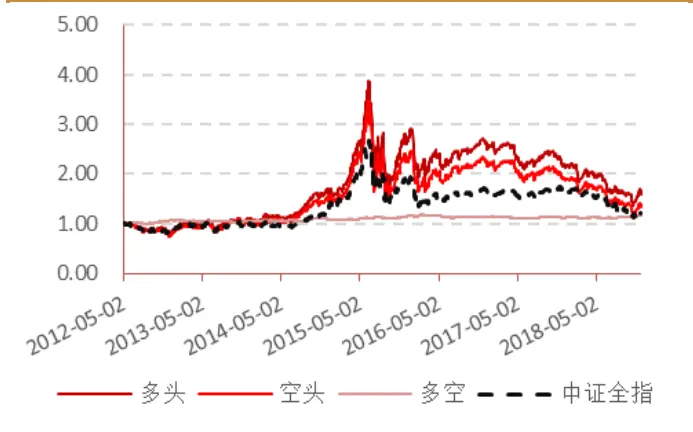
数据来源：西南证券

## 2.7 Value

Value 整合了 CNE5 中的账面市值比 Btop 和盈利收益率 Earning Yield 两个风格因子，并且新增了长期反转因素 Long-Term Reversal，新增部分对一级因子 Value选股能力的提升效果较小。

表 8：Value 因子检验

| 因子 | 因子等级 | 平均IC | IC_IR | IC<0 的比例 | 年化收益率 | 最大回撤率 | 平均换手率 |
| --- | --- | --- | --- | --- | --- | --- | --- |
| Value | 一级因子 | 4.46% | 0.33 | 38.89% | 多头：8.31%空头：-1.13%多空：7.97% | 多头：54.13%空头：73.13%多空：24.97% | 30.88% |
| Btop | 二级因子 | 4.39% | 0.37 | 38.89% | 多头：7.56%空头：-2.11%多空：8.82% | 多头：56.65%空头：73.94%多空：20.55% | 26.92% |
| Earning Yield | 二级因子 | 3.85% | 0.37 | 35.19% | 多头：7.33%空头：-0.93% | 多头：51.87%空头：73.77% | 30.64% |
|  |  |  |  |  | 多空：7.28% | 多空：20.40% |  |
| Long-Term Reversal | 二级因子 | 1.73% | 0.20 | 40.74% | 多头：5.28% | 多头：64.99% | 36.94% |
|  |  |  |  |  | 空头：1.51% | 空头：68.37% |  |
| ETOP | 三级因子 | 4.40% | 0.43 | 36.11% | 多空：3.23% 多头：8.42% | 多空：20.39% 多头：51.17% | 27.22% |
|  |  |  |  |  | 空头：-1.95% | 空头：74.64% |  |
|  |  |  |  |  | 多空：9.80% | 多空：17.96% |  |
|  |  |  |  |  | 多头：6.27% | 多头：51.44% |  |
| ETOPF | 三级因子 | 4.28% | 0.34 | 38.89% | 空头：-2.88% | 空头：72.63% | 35.97% |
|  |  |  |  |  | 多空：7.78% | 多空：24.68% |  |
| CETOP | 三级因子 | 2.38% | 0.33 | 35.19% | 多头：5.53% | 多头：57.59% | 27.96% |
|  |  |  |  |  | 空头：1.20% | 空头：70.09% |  |
| EM | 三级因子 | 2.31% | 0.27 | 44.44% | 多空：3.58% 多头：5.26% | 多空：16.92% 多头：55.37% | 26.32% |
|  |  |  |  |  |  | 空头：71.73% |  |
| LTRSTR | 三级因子 | 1.92% | 0.24 | 39.81% | 空头：0.88% |  |  |
|  |  |  |  |  | 多空：3.77% 多头：3.51% | 多空：16.77% 多头：65.24% |  |
|  |  |  |  |  | 空头：-0.63% | 空头：69.90% 多空：20.20% | 39.28% |
|  |  |  |  |  | 多空：3.73% | 多头：66.12% |  |
| LTHALPHA | 三级因子 | 1.46% | 0.18 | 39.81% | 多头：4.51% |  | 36.01% |
|  |  |  |  |  | 空头：1.75% 多空：2.36% | 空头：67.61% 多空：20.43% |  |

数据来源：Wind，西南证券

图 48：一级因子 Value多空表现

数据来源：西南证券

图 49：二级因子 Btop 多空表现
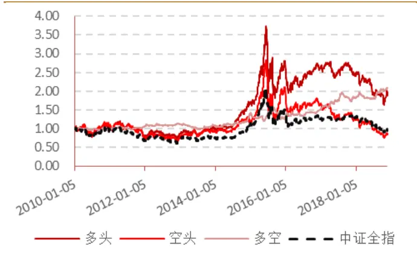
数据来源：西南证券

图 50：二级因子 Earning Yield 多空表现

数据来源：西南证券

图 51：二级因子 Long-Term Reversal 多空表现
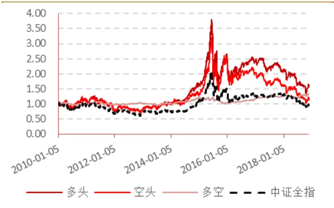
数据来源：西南证券

图 52：三级因子 ETOP多空表现

数据来源：西南证券

图 53：三级因子 ETOPF多空表现
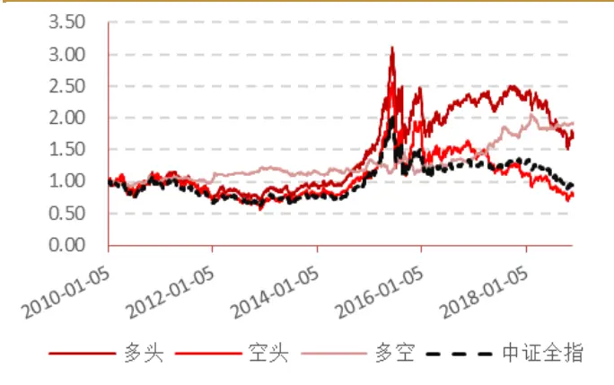
数据来源：西南证券

图 54：三级因子 CETOP多空表现
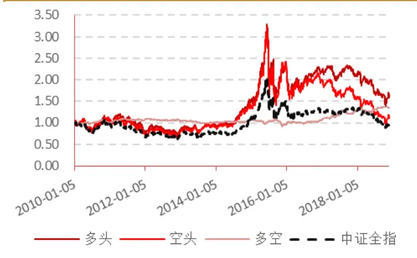
数据来源：西南证券

图 55：三级因子 EM多空表现
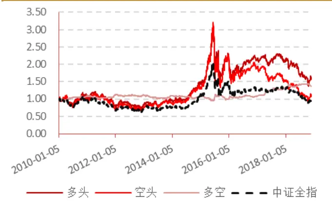
数据来源：西南证券

图 56：三级因子 LTRSTR多空表现
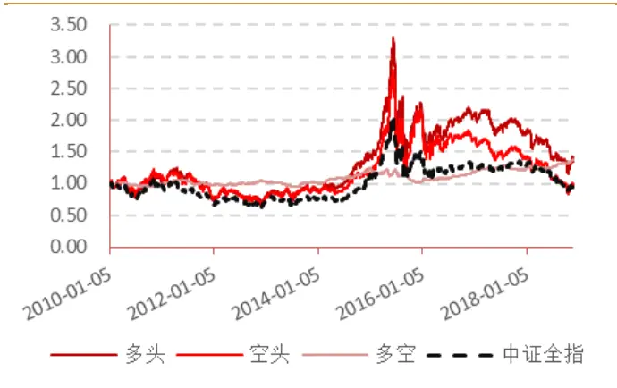
数据来源：西南证券

图 57：三级因子 LTHALPHA 多空表现
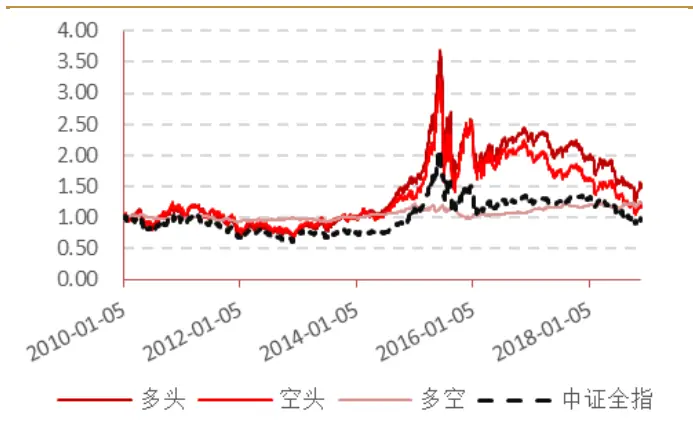
数据来源：西南证券

## 2.8 Sentiment

情绪类因子 Sentiment 是 CNE6 新增的一个风格因子，主要使用了分析师的预测数据，例如预期评级调整比率、预测未来的盈利价格比，预测每股盈利的变化。

表 9：Sentiment 因子检验

| 因子 | 因子等级 | 平均IC | IC_IR | IC<0 的比例 | 年化收益率 | 最大回撤率 | 平均换手率 |
| --- | --- | --- | --- | --- | --- | --- | --- |
| Sentiment | 一级因子 | 2.67% | 0.48 | 28.70% | 多头：5.75% | 多头：57.05% 空头：71.52% | 45.83% |
|  |  |  |  |  | 空头：-2.55% 多空：7.99% | 多空：9.74% |  |
| RRIBS | 三级因子 | 0.32% | 0.06 | 50.93% | 多头：3.19% | 多头：63.72% | 44.37% |
|  |  |  |  |  | 空头：-0.38% | 空头：63.55% |  |
|  |  |  | 0.24 | 37.04% | 多空：3.48% | 多空：9.77% |  |
|  |  |  |  |  | 多头：4.02% | 多头：54.33% |  |
| EPIBSC | 三级因子 | 2.59% |  |  | 空头：-0.93% | 空头：68.22% | 32.18% |
|  |  |  |  |  | 多空：3.51% | 多空：23.43% |  |
| EARNC | 三级因子 | 1.94% | 0.39 | 33.33% | 多头：6.79% | 多头：57.82% | 54.03% |
|  |  |  |  |  | 空头：-0.04% 多空：6.75% | 空头：70.87% 多空：9.52% |  |

数据来源：Wind，西南证券

图 58：一级因子 Sentiment 多空表现
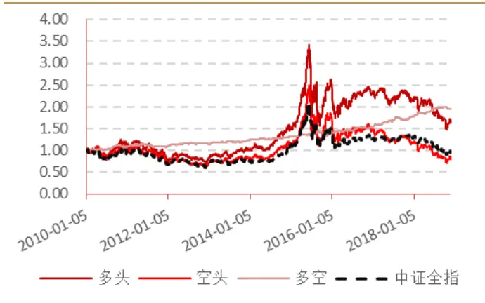
数据来源：西南证券

图 59：三级因子 RRIBS多空表现
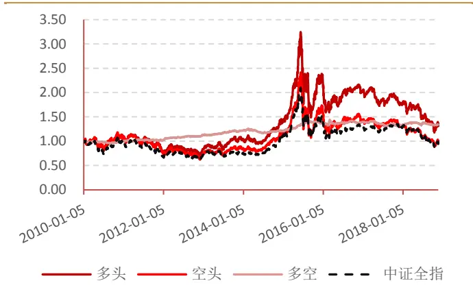
数据来源：西南证券

图 60：三级因子 EPIBSC多空表现
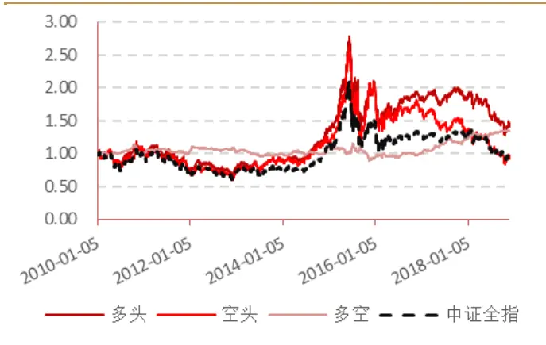
数据来源：西南证券

图 61：三级因子 EARNC 多空表现
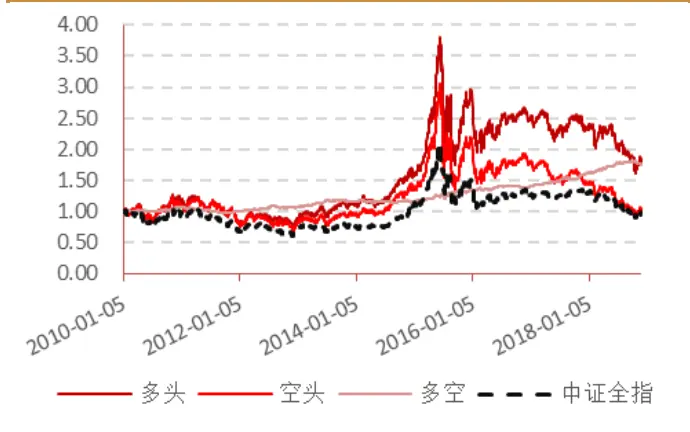
数据来源：西南证券

## 2.9 Dividend Yield

分红收益率因子 Dividend Yield 也是 CNE6新增的风格因子，由历史的分红价格比和分析师预测的分红价格比构成。

表 10：Dividend Yield 因子检验

| 因子 | 因子等级 | 平均IC | IC_IR | IC<0 的比例 | 年化收益率 | 最大回撤率 | 平均换手率 |
| --- | --- | --- | --- | --- | --- | --- | --- |
| Dividend Yield | 一级因子 | 3.21% | 0.38 | 35.19% | 多头：7.46%空头：-0.59%多空：7.15% | 多头：54.09%空头：72.66%多空：21.52% | 26.05% |
| DTOP | 三级因子 | 3.13% | 0.39 | 33.33% | 多头：7.82%空头：-1.21%多空：8.21% | 多头：53.51%空头：72.06%多空：19.82% | 22.70% |
| DTOPF | 三级因子 | 3.14% | 0.29 | 37.04% | 多头：5.31%空头：-0.86%多空：4.79% | 多头：51.24%空头：66.33%多空：23.89% | 34.63% |

数据来源：Wind，西南证券

图 62：一级因子 Dividend Yield 多空表现

数据来源：西南证券

图 63：三级因子 DTOP多空表现

数据来源：西南证券

图 64：三级因子 DTOPF多空表现

数据来源：西南证券

## 3 纯因子收益率

上文我们考察了 CNE6每一个因子的独立选股能力，那么在排除了其它因子的影响之后，它们的会有怎样的表现呢？这就需要计算纯因子收益率，纯因子收益率是投资组合在某一因子的暴露为 1，在其它因子的暴露为 0 的组合收益率，它能够较准确地衡量因子的历史表现，可以通过多元回归的方法计算纯因子收益率，回归方程如下：

$$
\begin{aligned}&r_{n+1}=f_{c}+\sum_{i}X_{ni}f_{i}+\sum_{s}X_{ns}f_{s}+u_{ns}\\&s.t.\ \sum_{i}w_{i}f_{i}=0\\\end{aligned}
$$

其中， $w_{i}$ 是行业i的市值权重，约束条件表示市值加权的行业因子收益率为 0。

图65给出了样本期内的累积纯因子收益率，回归的平均R2大约是33.63%，即使用CNE6的因子体系大约能够解释 33.63%股票收益率的变动。从累计纯因子收益率的绝对值来看，Size、Liquidity、Volatility 累积纯因子收益率最高。另外，值得注意的是，除 Volatility 和 Size因子之外，其余 7个风格因子在整个样本期的表现都相对平稳，累积纯因子曲线变化相对平缓。Volatility 因子在 2015 年表现较好，随后纯因子收益率明显下降；Size 因子在 2017 年之前，表现优异，但 2017 年之后纯因子收益率几乎为 0。

图 65：9个一级因子累积纯因子收益率
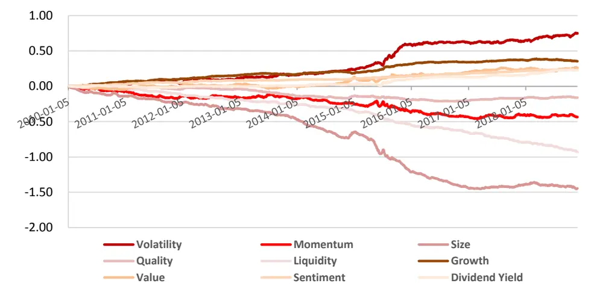
数据来源：西南证券

## 4 残差选股能力分析

CNE6 因子体系对股票收益率具有较强的解释力，当使用它进行风险管理或者构建组合时，我们可能会产生这样的疑问：CNE6 对股票收益率的解释能力是否足够完备。针对这一问题，本文尝试检验其残差的选股能力，如果其回归残差具有显著的选股能力，则可以认为CNE6 因子体系对股票收益率的解释能力并不完备。

在计算回归残差时，仍然使用计算纯因子收益率的回归方程，为了提高因子覆盖度，排除了因子覆盖度较低的 Sentiment，用剩余的 8个因子拟合回归方程。在得到残差序列之后，分别计算残差 20 日均值和残差 20日标准差，然后检验这两个因子的单因子选股能力，检验之前先将因子与市值和行业正交，表 11 给出相应的检验结果。

表 11：残差选股能力

| 因子 | 平均IC | IC_IR | IC<0 的比例 | 年化收益率 | 最大回撤率 | 平均换手率 |
| --- | --- | --- | --- | --- | --- | --- |
| 残差 20 日均值 | -7.11% | -0.83 | 84.11% | 多头：7.46%空头：-9.58%多空：18.75% | 多头：63.91%空头：80.89%多空：10.32% | 80.98% |
| 残差 20 日标准差 | -8.36% | -0.90 | 81.31% | 多头：9.00%空头：-9.83%多空：18.78% | 多头：58.68%空头：81.58%多空：9.85% | 72.66% |

数据来源：Wind，西南证券

图 66：差均值与标准差多空组合净值曲线
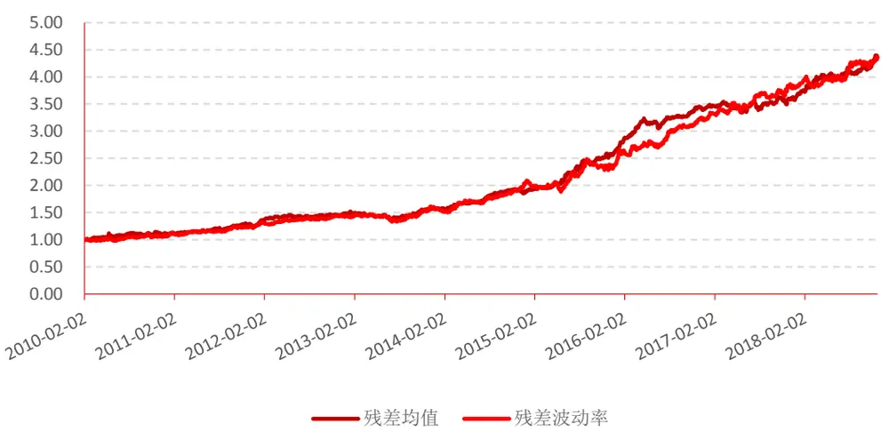
数据来源：西南证券

通过检验，可以发现残差的均值和标准差都具有非常显著的选股能力，多空组合净值曲线稳定上升，较少出现大幅回撤，残差的选股能力异常稳定，这就说明 CNE6的因子体系对股票收益率的解释并不完备。

如果将残差的均值和残差的波动率作为一级因子同时纳入 CNE6 的因子体系中，可能会明显提高模型的解释能力。经计算，加入两因子后，模型的解释能力由 33.63%上升至 34.22%。

## 5 总结和展望

CNE6 因子体系在 CNE5 的基础上进行了一些完善和整合，并且新增了 Sentiment 和Dividend 这两个一级因子，提高了模型的解释能力。在单因子检验的过程中，可以发现 CNE6因子体系中部分因子并不具有显著的选股能力，与股票下期收益率相关性较弱。从纯因子收益率的情况来看，除 Volatility 和 Size 因子之外，其余 7 个一级风格因子在整个样本期表现都相对平稳，CNE6的因子体系大概能够解释股票收益率 33.63%的变动。

在使用 CNE6的过程中，我们可能还需要解决 3个问题：

第一，因子体系的加权方式。CNE6 的一级因子是通过两层加权构成的，加权方式会对因子的实证效果产生显著的影响，如何求到一个合理的加权方式值得进一步研究。

第二，数据质量以及因子覆盖度的问题。新增的 Sentiment因子覆盖度相对较低，大约在 50%左右，其余 8 个一级因子的覆盖度都在 90%以上，存在大量缺失值的因子很难用于选股或者风险管理实践。

第三，CNE6解释能力的完备性问题。通过本文对残差的选股能力分析，可以发现残差的均值和波动率仍然具有显著而稳定的选股能力，说明 CNE6对股票价格变化的解释度还可以提高。

2. MSCI, Barra China A Total Market Equity Model for Long-Term Investors, 2018-08.

## 6 风险提示

本文关于 CNE6因子体系的计算方式可能与 MSCI 存在差异；本文的研究是基于对历史数据的统计和分析，因子的历史收益率不代表未来收益率。若市场环境发生变化，因子的最终表现可能发生改变。

## 参考文献

1. MSCI, New China Equity Model Launch Series, 2018-08-23.

## 分析师承诺

本报告署名分析师具有中国证券业协会授予的证券投资咨询执业资格并注册为证券分析师，报告所采用的数据均来自合法合规渠道，分析逻辑基于分析师的职业理解，通过合理判断得出结论，独立、客观地出具本报告。分析师承诺不曾因，不因，也将不会因本报告中的具体推荐意见或观点而直接或间接获取任何形式的补偿。

## 投资评级说明

| 公司评级 | 买入：未来6个月内，个股相对沪深300指数涨幅在20%以上 增持：未来6个月内，个股相对沪深300指数涨幅介于10%与20%之间 中性：未来6个月内，个股相对沪深300指数涨幅介于-10%与10%之间 回避：未来6个月内，个股相对沪深300指数涨幅在-10%以下 |
| --- | --- |

## 重要声明

西南证券股份有限公司（以下简称“本公司”）具有中国证券监督管理委员会核准的证券投资咨询业务资格。

本公司与作者在自身所知情范围内，与本报告中所评价或推荐的证券不存在法律法规要求披露或采取限制、静默措施的利益冲突。

《证券期货投资者适当性管理办法》于 2017 年 7 月 1 日起正式实施，本报告仅供本公司客户中的专业投资者使用，若您并非本公司客户中的专业投资者，为控制投资风险，请取消接收、订阅或使用本报告中的任何信息。本公司也不会因接收人收到、阅读或关注自媒体推送本报告中的内容而视其为客户。本公司或关联机构可能会持有报告中提到的公司所发行的证券并进行交易，还可能为这些公司提供或争取提供投资银行或财务顾问服务。

本报告中的信息均来源于公开资料，本公司对这些信息的准确性、完整性或可靠性不作任何保证。本报告所载的资料、意见及推测仅反映本公司于发布本报告当日的判断，本报告所指的证券或投资标的的价格、价值及投资收入可升可跌，过往表现不应作为日后的表现依据。在不同时期，本公司可发出与本报告所载资料、意见及推测不一致的报告，本公司不保证本报告所含信息保持在最新状态。同时，本公司对本报告所含信息可在不发出通知的情形下做出修改，投资者应当自行关注相应的更新或修改。

本报告仅供参考之用，不构成出售或购买证券或其他投资标的要约或邀请。在任何情况下，本报告中的信息和意见均不构成对任何个人的投资建议。投资者应结合自己的投资目标和财务状况自行判断是否采用本报告所载内容和信息并自行承担风险，本公司及雇员对投资者使用本报告及其内容而造成的一切后果不承担任何法律责任。

本报告版权为西南证券所有，未经书面许可，任何机构和个人不得以任何形式翻版、复制和发布。如引用须注明出处为“西南证券”，且不得对本报告进行有悖原意的引用、删节和修改。未经授权刊载或者转发本报告的，本公司将保留向其追究法律责任的权利。

## 西南证券研究发展中心

上海

地址：上海市浦东新区陆家嘴东路 166 号中国保险大厦 20 楼

邮编：200120

北京

地址：北京市西城区金融大街 35 号国际企业大厦 B座 16 楼

邮编：100033

重庆

地址：重庆市江北区桥北苑 8 号西南证券大厦 3 楼

邮编：400023

深圳

地址：深圳市福田区深南大道 6023 号创建大厦 4楼

邮编：518040

西南证券机构销售团队

| 区域 | 姓名 | 职务 | 座机 | 手机 | 邮箱 |
| --- | --- | --- | --- | --- | --- |
| 上海 | 蒋诗烽 | 地区销售总监 | 021-68415309 | 18621310081 | jsf@swsc.com.cn |
|  | 黃丽娟 | 地区销售副总监 | 021-68411030 | 15900516330 | hlj@swsc.com.cn |
|  | 张方毅 | 高级销售经理 | 021-68413959 | 15821376156 | zfyi@swsc.com.cn |
|  | 汪文沁 | 高级销售经理 | 021-68415380 | 15201796002 | wwq@swsc.com.cn |
|  | 王慧芳 | 高级销售经理 | 021-68415861 | 17321300873 | whf@swsc.com.cn |
|  | 涂诗佳 | 销售经理 | 021-68415296 | 18221919508 | tsj@swsc.com.cn |
|  | 杨博睿 | 销售经理 | 15558686883 | 15558686883 | ybz@swsc.com.cn |
| 北京 | 丁可莎 | 销售经理 | 021-68416017 | 13122661803 | dks@swsc.com.cn |
|  | 蒋诗烽 | 地区销售总监 | 021-68415309 | 18621310081 | jsf@swsc.com.cn |
|  | 路剑 | 高级销售经理 | 010-57758566 | 18500869149 | lujian@swsc.com.cn |
|  | 张岚 | 高级销售经理 | 18601241803 | 18601241803 | zhanglan@swsc.com.cn |
|  | 刘致莹 | 销售经理 | 010-57758619 | 17710335169 | liuzy@swsc.com.cn |
|  | 王湘杰 | 销售经理 | 0755-26671517 | 13480920685 | wxj@swsc.com.cn |
| 广深 | 余燕伶 | 销售经理 | 0755-26820395 | 13510223581 | yyl@swsc.com.cn |
|  | 花洁 | 销售经理 | 0755-26673231 | 18620838809 | huaj@swsc.com.cn |
|  | 孙瑶瑶 | 销售经理 | 0755-26833581 | 13480870918 | sunyaoyao@swsc.com.cn |
|  | 陈霄（广州） | 销售经理 | 15521010968 | 15521010968 | chenxiao@swsc.com.cn |