# Barra 风险模型（CNE6）之纯因子构建与因子合成

# ——多因子模型研究系列之九

分析师：宋旸

2019 年 06 月 20 日

证券分析师

宋旸

022-28451131

18222076300

songyang@bhzq.com

助理分析师

张世良

022-23839061

zhangsl@bhzq.com

## 相关研究报告

《使用多因子框架的沪深300 指数增强模型——多因子研究系列之七》
20190329

《Barra 风险模型（CNE6）之单因子检验——多因子研究系列之八》

20190620

SAC NO：S1150517100002

## 核心观点：

分层回测是比较直观反映单因子收益情况的方法，但其也有一定的缺陷。当我们对于单一因子做分层回测时，无法保证其对其他因子的暴露中性，所以在进行单因子检测时，无法排除其他因子对于组合的影响。于是我们需要构造纯因子模型，即对于单一因子暴露为 1，对于其他因子暴露为0 的模型。纯因子模型可以更客观的反应因子的收益能力。

本篇报告中，我们针对全体 A 股，以月度调仓的频率构建针对 BarraCNE6 模型中一级、二级因子的纯因子组合。回测数据为 2009 年 1 月-2019年4月。通过回测可以看出，流动性和动量的纯因子组合表现较为稳定。规模因子和波动率因子收益波动较大。质量因子近期收益有一定回撤。

根据上文对于二级因子收益的分析，我们重新调整了规模因子中MIDCAP 因子和质量因子中 Earnings Quality 因子，将因子合成中原本正向的权重调整为负向权重，并重新进行回测。新模型的 Adjusted由 34%上升至 36%，且质量因子和规模因子的夏普比率也有了较大幅度的提高。

- 未来，我们将利用已有的风险因子，构建风险模型，并将其应用于指数增强、机器学习等多种选股模型中。

- 风险提示：随着市场环境变化，模型存在失效风险。

## 1. 概述

在上一篇报告中，我们对Barra CNE6模型中的一级、二级、三级因子进行了单因子检测，得到了各因子的 t 检验结果与分层回测结果。分层回测是比较直观反映单因子收益情况的方法，但其也有一定的缺陷。当我们对于单一因子做分层回测时，得到的组合对于其他因子的并没有办法保持中性。所以检测结果无法排除其他因子的影响。于是我们需要构造纯因子模型，即对于单一因子暴露为 1，对于其他因子暴露为0 的模型。纯因子模型可以更客观的反应因子的收益能力。

## 2. 纯因子模型的求解

纯因子模型的求解可以用以下回归方程表示：

$$
\begin{array}{l}{\mathbf{r}=\mathbf{X}\mathbf{f}+{\pmb u}}\\{s.t.\quad w_{I_{1}}f_{I_{1}}+w_{I_{2}}\pmb{f}_{I_{2}}+\dots+w_{I_{s}}\pmb{f}_{I_{s}}=\mathbf{0}}\end{array}
$$

其中， 为因子暴露矩阵，由1个国家因子、S个行业因子和 M个风格因子构成。假设横截面标的数为 N，则 是一个 ${\sf N}\times{\sf\Omega}\left(1+{\sf S}+{\sf M}\right)$ 阶的矩阵。 $w_{I_{j}}$ 为行业整体流动市值，加入该限制条件是因为在回归方程中引入了国家因子，而行业因子之和为 1，这会导致解的不唯一性。所以需要加入行业市值权重的限制，保证解的唯一。

为解决异方差性，我们在回归时使用根号流动市值为标的加权，构建 阶对角矩阵 ， $\mathbf{V}=\mathbf{diag}({\pmb v}_{1},\cdots{\pmb v}_{N})$ ，其中：

$$
v_{n}=\frac{\sqrt{w_{n}}}{\sum_{i=1}^{N}\sqrt{w_{i}}}
$$

$w_{i}$ 代表个股的流通市值。

另外，根据行业权重的约束条件，再构建一个 $(\mathsf{\Omega}_{1}+\mathsf{S}+\mathsf{M})\ \times\ \mathrm{~(~\mathsf{S}+\mathsf{M})~}$ 阶矩阵，其表达式为：

$$
\mathbf{R}=\left(\begin{array}{llllllll}{1}&{0}&{0}&{\cdots}&{0}&{0}&{\cdots}&{0}\\{0}&{1}&{0}&{\cdots}&{0}&{0}&{\cdots}&{0}\\{\vdots}&{\vdots}&{\vdots}&{\ddots}&{\vdots}&{\vdots}&{\ddots}&{\vdots}\\{0}&{-\displaystyle{\frac{W_{I_{1}}}{W_{I_{S}}}}}&{-\displaystyle{\frac{W_{I_{2}}}{W_{I_{S}}}}}&{\cdots}&{-\displaystyle{\frac{W_{I_{1}}}{W_{I_{S-1}}}}}&{0}&{\cdots}&{0}\\{0}&{0}&{0}&{\cdots}&{0}&{1}&{\cdots}&{0}\\{\vdots}&{\vdots}&{\vdots}&{\ddots}&{\vdots}&{\vdots}&{\ddots}&{\vdots}\\{0}&{0}&{0}&{\cdots}&{0}&{0}&{\cdots}&{1}\end{array}\right)
$$

根据带约束条件的最小二乘法，可求得纯因子投资组合的权重矩阵 ：

$$
\Omega=R(R^{T}X^{T}VXR)^{-1}R^{T}X^{T}V
$$

该矩阵的每一行对应一个纯因子组合，使用该组合乘以标的当期超额收益率即可得到当期的纯因子收益率。

## 3. 纯因子测试结果

根据上述理论，我们针对全体A 股，以月度调仓的频率构建纯因子组合。回测数据为 2009 年 1 月-2019 年 4 月。

通过回测可以看出，流动性和动量的纯因子组合表现较为稳定。规模因子和波动率因子收益波动较大。质量因子近期收益有一定回撤。

表 1：一级因子纯因子统计结果

|  | 累计收益 | 年化收益 | 波动率 | 夏普比率 | 胜率 |
| --- | --- | --- | --- | --- | --- |
| liq | -62.77% | -9.12% | 3.84% | -2.3768 | 22.58% |
| mom | -52.26% | -6.91% | 5.30% | -1.3017 | 41.94% |
| quality | 32.46% | 2.76% | 4.06% | 0.6788 | 59.68% |
| growth | -3.91% | -0.39% | 1.08% | -0.3562 | 54.03% |
| size | -9.38% | -0.95% | 4.13% | -0.2298 | 44.35% |
| vol | 29.32% | 2.52% | 5.46% | 0.4616 | 51.61% |
| value | 24.98% | 2.18% | 4.79% | 0.4554 | 58.87% |
| DTOP | 8.21% | 0.77% | 1.01% | 0.7624 | 58.87% |

资料来源：渤海证券研究所，Wind资讯

图 1：一级因子纯因子回测结果
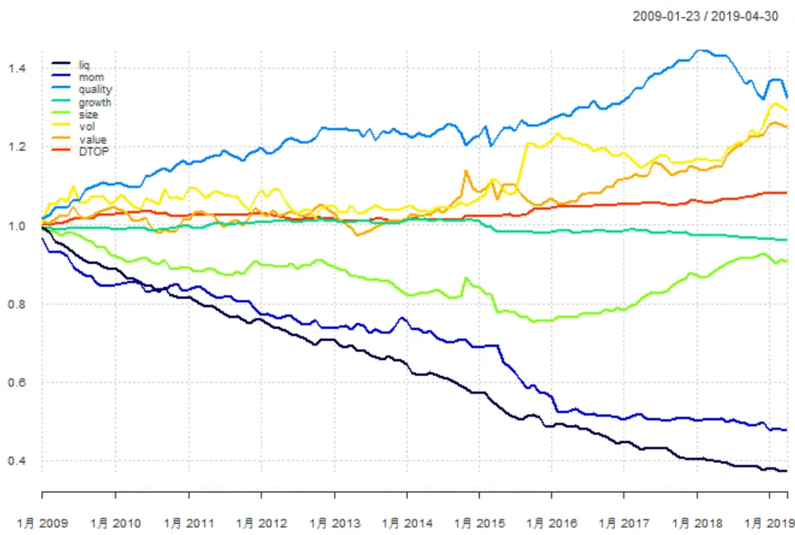
资料来源：渤海证券研究所，Wind资讯

CNE6 的说明文档中并未明确各大类因子的合成方法，我们暂时采用等权合成的方式。接下来，我们将会对于CNE6 各大类因子的一级因子和二级因子进行详细比对，并对合成方式进行初步的调整。

我们还计算了所有二级因子和一级因子的相关性矩阵。通过相关性矩阵可以看出，一二级因子的相关性普遍在较为合理的范围内，其中二级因子仅有市值因子与中等市值因子、市值因子与换手率因子、换手率与残余波动率因子等少数几组相关性在 0.5 附近。一级因子中，仅有换手率因子与波动率因子相关性为 0.45，参考Barra CNE5中对于类似情况的做法，我们将其做了两两正交处理。

图 2：二级因子相关性矩阵
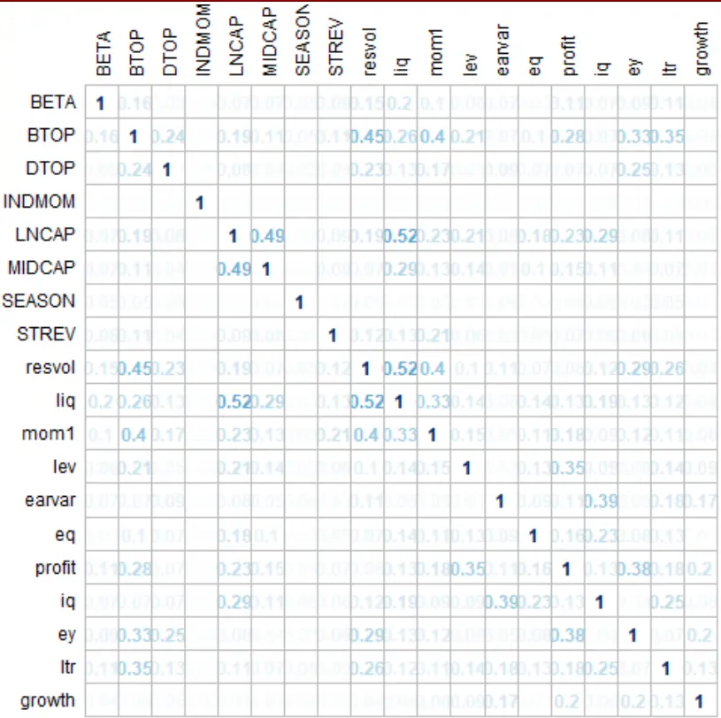
资料来源：渤海证券研究所，Wind资讯

图 3：一级因子相关性矩阵

| DTOPliqgrowthsizevolmomvaluequality | DTTOP groth se mom vaue AqiiiyiaIOA |  |  |  |  |  |  |  |
| --- | --- | --- | --- | --- | --- | --- | --- | --- |
|  | 1 | 0.13 | 0.05 | 0.06 | 0.12 | 0.07 | 0.28 |  |
|  | 0.13 | 1 | 0.04 | 0.22 | 0.45 | 0.14 | 0.24 | 0.04 |
|  | 0.05 | 0.04 | 1 | 0.03 | 0.04 | 0.04 |  | 0.16 |
|  | 0.06 | 0.22 | 0.03 | 1 | 0.07 | 0.06 | 0.12 | 0.08 |
|  | 0.12 | 0.45 | 0.04 | 0.07 | 1 | 0.09 | 0.16 | 0.04 |
|  | 0.07 | 0.14 | 0.04 | 0.06 | 0.09 | 1 | 0.17 | 0.03 |
|  | 0.28 | 0.24 |  | 0.12 | 0.16 | 0.17 | 1 | 0.05 |
|  |  | 0.04 | 0.16 | 0.08 | 0.04 | 0.03 | 0.05 | 1 |

资料来源：渤海证券研究所，Wind资讯

## 3.1 规模因子（Size）

CNE6 的规模因子由 LNCAP 因子和 MIDCAP 因子构成，其中 LNCAP 因子代表股票市值对数，MIDCAP代表股票的非线性市值，也即中等市值。在CNE5版本中，LNCAP 与 MIDCAP 是单独的一级因子，但在新版中，这两个因子被合并成了 size因子。然而通过纯因子的回测，我们发现，两个因子的收益方向并不十分一致，特别是 2015 年以后，出现了明显分化。考虑到两个因子的相关性问题，我们在调整后纯因子模型中将MIDCAP 的权重由正向调整为负向，使规模因子的收益有一定提升。

表 2：规模因子纯因子统计结果

|  | 累计收益 | 年化收益 | 波动率 | 最大回撤 | 夏普比率 | 胜率 |
| --- | --- | --- | --- | --- | --- | --- |
| LNCAP | -18.16% | -1.92% | 2.36% | 19.64% | -0.8148 | 37.90% |
| MIDCAP | 8.46% | 0.79% | 2.79% | 7.31% | 0.2825 | 53.23% |
| size | -9.38% | -0.95% | 4.13% | 24.66% | -0.2298 | 44.35% |

资料来源：渤海证券研究所，Wind资讯

图 4：规模因子纯因子回测结果
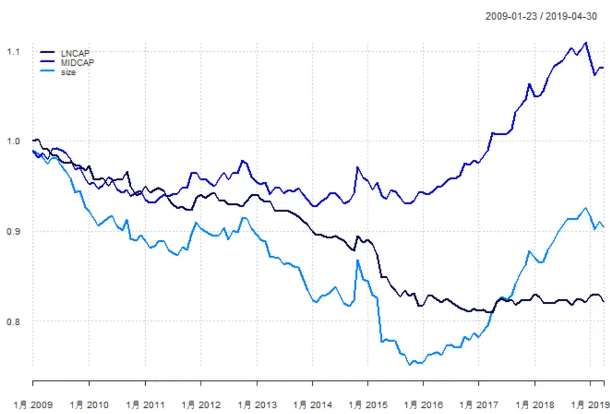
资料来源：渤海证券研究所，Wind资讯

## 3.2 波动率因子（Volatility）

CNE6 的波动率因子（Volatility）由 BETA 因子和残余波动率因子（ResidualVolatility）因子构成，其中残余波动率因子（Residual Volatility）又由 HSIGMA、DASTD、CMRA 三个因子构成。在 CNE5 中，BETA 因子和 Residual Volatility因子也是作为一级因子单独出现的，而 Residual Volatility 的计算方法与 CNE6类似。通过回测图可看出，两个二级因子的走势基本一致，但 Residual Volatility在 2016-2018年间经历了较大的收益反转。合并这两个因子可以在一定程度上提高纯因子组合的收益率，但波动率也相应加大。

表 3：波动率因子纯因子统计结果

|  | 累计收益 | 年化收益 | 波动率 | 最大回撤 | 夏普比率 | 胜率 |
| --- | --- | --- | --- | --- | --- | --- |
| BETA | 16.39% | 1.48% | 2.39% | 3.28% | 0.6196 | 59.68% |
| resvol | 16.27% | 1.47% | 4.46% | 9.69% | 0.3295 | 49.19% |
| vol | 29.32% | 2.52% | 5.46% | 7.33% | 0.4616 | 51.61% |

资料来源：渤海证券研究所，Wind资讯

图 5：波动率因子纯因子回测结果
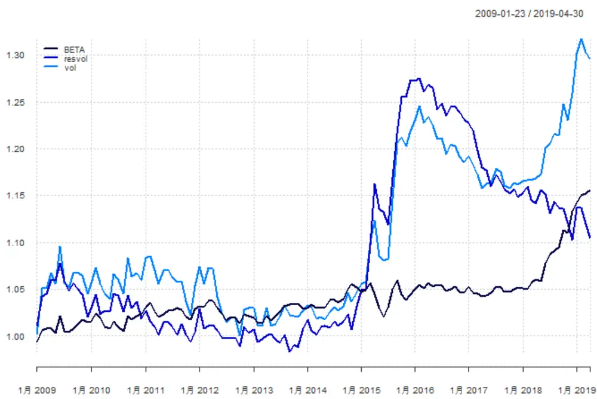
资料来源：渤海证券研究所，Wind资讯

## 3.3 流动性因子（Liquidity）

CNE6 的流动性因子（Liquidity）由 STOM、STOQ、STOA 和 ATVR 四个三级因子构成，其中ATVR为新增的因子，其余三个因子与CNE5 一致。通过相关性检测可以发现，这四个因子相关性均较高。通过纯因子回测也可看出，增加了ATVR因子后，新的流动性因子相比于旧的流动性因子各项指标均有小幅改善。

图 6：流动性因子相关性矩阵

| ATVR |  | STOA | WOOM | SToS |
| --- | --- | --- | --- | --- |
| ATVR | 1 | 0.76 | 0.69 | 0.79 |
| STOA | 0.76 | 1 | 0.61 | 0.74 |
| STOM | 0.69 | 0.61 | 1 | 0.88 |
| STOQ | 0.79 | 0.74 | 0.88 | 1 |

资料来源：渤海证券研究所，Wind资讯

表 4：流动性因子纯因子统计结果

|  | 累计收益 | 年化收益 | 波动率 | 最大回撤 | 夏普比率 | 胜率 |
| --- | --- | --- | --- | --- | --- | --- |
| liq_new | -62.77% | -9.12% | 3.84% | 62.77% | -2.3768 | 22.58% |
| liq_old | -60.09% | -8.51% | 3.80% | 60.09% | -2.2402 | 20.97% |

资料来源：渤海证券研究所，Wind资讯

图 7：流动性因子纯因子回测结果
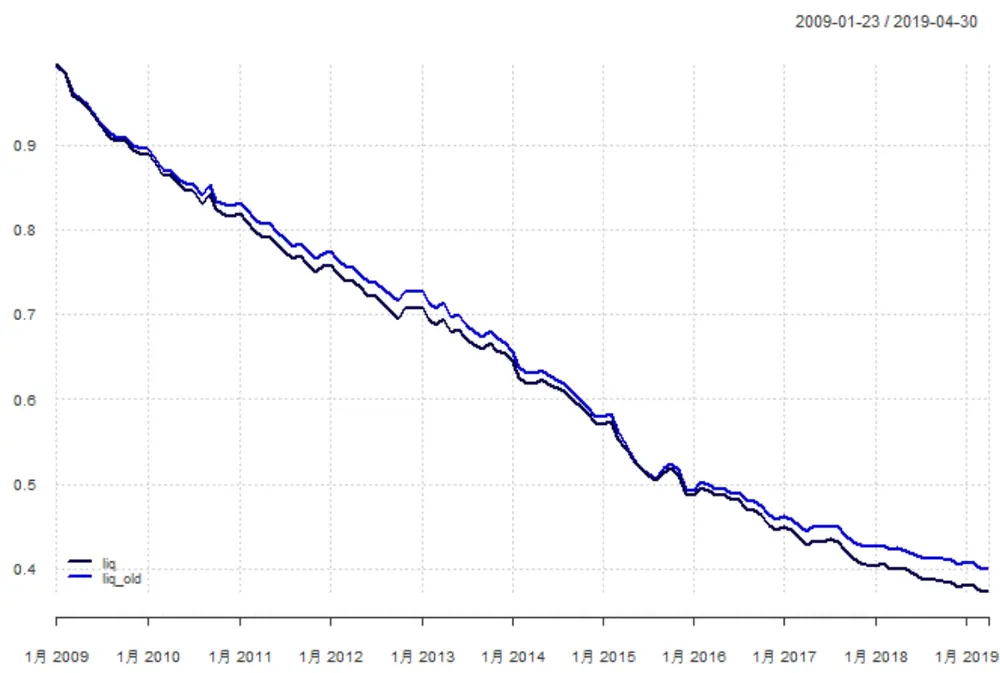
资料来源：渤海证券研究所，Wind资讯

## 3.4 估值因子（Value）

CNE6 的估值因子（Value）相比于 CNE5 改动较大，CNE5 中，BTOP 因子与Earnings Yield因子做为一级因子单独存在，Earnings Yield因子又由ETOP因子、EPFWD 因子、CETOP 因子构成。而在新版模型中，Earnings Yield 因子的构成中增加了EM因子，即企业倍数因子，而整体模型的合成中又增加了 Long TermReversal，即长期反转因子，该因子由长期相对动量和长期历史Alpha因子构成，反映了股票在过去较长一段时间内的涨跌水平。通过合成这三个因子得到的Value 因子，纯因子收益大幅提高，但波动率也有所上升。

表 5：估值因子纯因子统计结果

|  | 累计收益 | 年化收益 | 波动率 | 最大回撤 | 夏普比率 | 胜率 |
| --- | --- | --- | --- | --- | --- | --- |
| BTOP | 13.66% | 1.25% | 2.46% | 4.69% | 0.5069 | 53.23% |
| ey | 13.36% | 1.22% | 2.17% | 2.68% | 0.5625 | 51.61% |
| Itr | 9.36% | 0.87% | 1.47% | 2.22% | 0.5905 | 56.45% |
| value | 24.98% | 2.18% | 4.79% | 7.97% | 0.4554 | 58.87% |

资料来源：渤海证券研究所，Wind资讯

图 8：估值因子纯因子回测结果
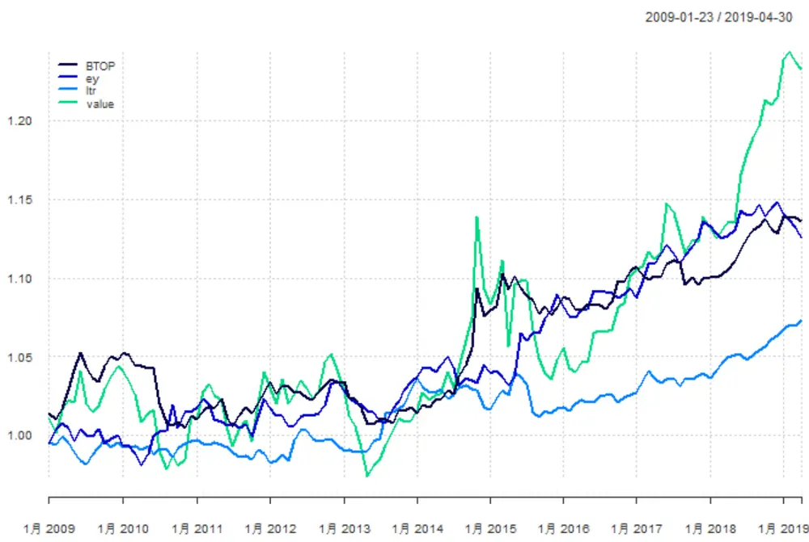
资料来源：渤海证券研究所，Wind资讯

## 3.5 质量因子（Quality）

质量因子（Quality）是 CNE6 中改动最大，也是构成最复杂的因子。在 CNE5中，仅有 Leverage 因子单独存在。而新版的 Quality 因子，由 Leverage、EarningsVariablity、Earnings Quality、Profitablity、Investment Quality 五个二级因子构成。

Leverage，即杠杆率因子，定义延续了CNE5的内容，由 MLEV（市场杠杆率）、BLEV（账面杠杆率）和DTOA（资产负债率）三个因子构成。

Earnings Variablity，即盈利变动率因子，由 VSAL（收入变动率）、VERN（盈利变动率）、VFLO（现金流变动率）、ETOPF_STD（分析师预测每股收益变动率）四个因子构成。

Earnings Quality，即盈利质量因子，由 ABS（资产负债表盈余）和 ACF（现金流盈余）两个因子构成。

Profitablity，即盈利能力因子，由 ATO（资产周转率）、GP（毛利）、GPM（毛利率）、ROA（资产收益率）四个因子构成。

Investment Quality，即投资能力因子，由 AGRO（总资产增长率）、IGRO（发行股份增长率）、CXGRO（资本支出增长率）三个因子构成。

通过回测发现，Quality因子中的几个二级因子涨跌不太一致，其中收益较为稳定的因子为 Earnings Quality 因子和 Profitablity 因子，但是这两个因子的收益方向是相反的，所以合成时会一定程度的相互抵消，Investment Quality 因子前期表现较好，近期收益率有所下降。我们在调整后纯因子模型中将 Earnings Quality的权重由正向调整为负向，使质量因子的收益有一定提升。

表 6：质量因子纯因子统计结果

|  | 累计收益 | 年化收益 | 波动率 | 最大回撤 | 夏普比率 | 胜率 |
| --- | --- | --- | --- | --- | --- | --- |
| lev | -1.08% | -0.11% | 1.54% | 7.51% | -0.0684 | 47.58% |
| earvar | 5.06% | 0.48% | 1.67% | 3.75% | 0.2873 | 52.42% |
| eq | -10.62% | -1.08% | 1.26% | 12.38% | -0.8563 | 42.74% |
| profit | 37.58% | 3.14% | 2.75% | 3.22% | 1.1385 | 64.52% |
| iq | 18.08% | 1.62% | 2.22% | 3.11% | 0.7302 | 62.10% |
| quality | 32.46% | 2.76% | 4.06% | 8.69% | 0.6788 | 59.68% |

资料来源：渤海证券研究所，Wind资讯

图 9：质量因子纯因子回测结果
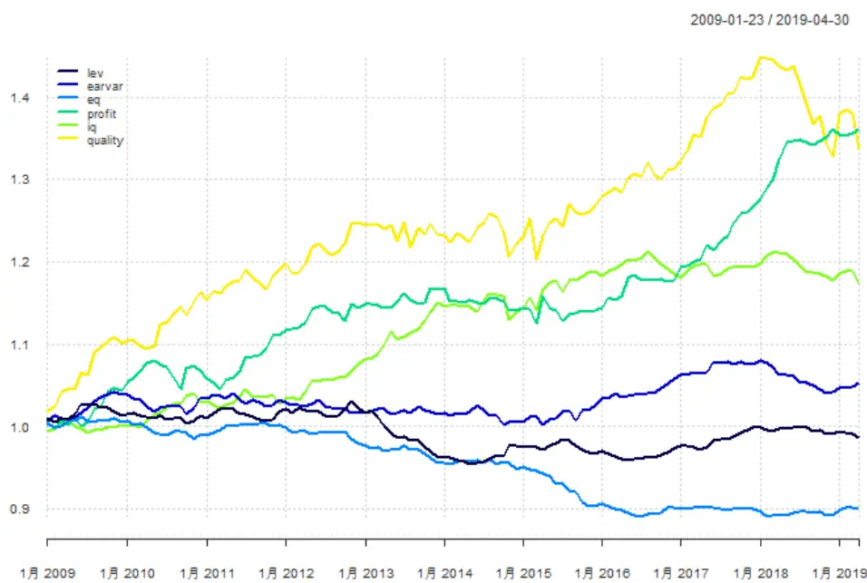
资料来源：渤海证券研究所，Wind资讯

## 3.6 动量因子（Momentum）

CNE5 的动量因子仅由 RSTR（相对动量）一个因子构成，CNE6 的动量因子大大丰富，由 Short Term Reversal（短期反转）、Seasonality（季节）、IndustryMomentum（行业动量）和Momentum（传统动量）四个因子构成，而传统动量因子又由RSTR 和HAlpha 两个三级因子构成。通过回测可以发现，收益最为明显的因子为短期反转因子，也几乎占据了动量因子绝大部分的收益来源，剩下因子中，季节因子和行业动量因子虽然收益不明显，但收益的单调性较为一致，且与其他已有因子的相关性非常低。传统的动量因子相比之下反而较为不稳定。

表 7：动量因子纯因子统计结果

|  | 累计收益 | 年化收益 | 波动率 | 最大回撤 | 夏普比率 | 胜率 |
| --- | --- | --- | --- | --- | --- | --- |
| STREV | -48.24% | -6.17% | 3.17% | 48.24% | -1.9495 | 28.23% |
| SEASON | -2.93% | -0.29% | 0.90% | 3.80% | -0.3198 | 41.94% |
| INDMOM | 0.91% | 0.09% | 0.61% | 1.52% | 0.1435 | 56.45% |
| mom1 | -9.48% | -0.96% | 3.16% | 16.73% | -0.3037 | 48.39% |
| mom | -52.26% | -6.91% | 5.30% | 52.26% | -1.3017 | 41.94% |

资料来源：渤海证券研究所，Wind资讯

图 10：动量因子纯因子回测结果
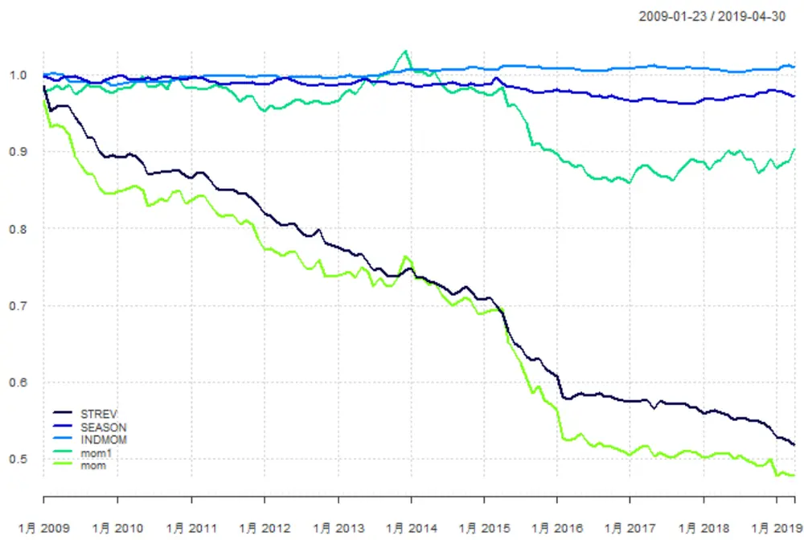
资料来源：渤海证券研究所，Wind资讯

## 3.7 成长因子（Growth）

CNE6的成长因子和CNE5相比没有变化，都由EGRLF（预测3年利润增长率）、EGRO（每股净利润增长率）、SGRO(每股收入增长率)组成。成长因子在历史上的收益一向不太显著。

表 8：成长因子纯因子统计结果

|  | 累计收益 | 年化收益 | 波动率 | 最大回撤 | 夏普比率 | 胜率 |
| --- | --- | --- | --- | --- | --- | --- |
| growth | -3.91% | -0.39% | 1.08% | 5.47% | -0.3562 | 54.03% |

资料来源：渤海证券研究所，Wind资讯

图 11：成长因子纯因子回测结果
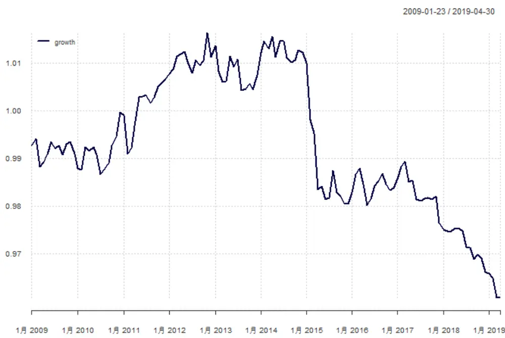
资料来源：渤海证券研究所，Wind资讯

## 3.8 分红因子（Dividend Yield）

分红因子（Dividend Yield）为 CNE6 新增加的因子，由 DTOP（股息率）和 DPIBS（分析师预测股息率）构成。由于 Wind 数据库中关于分析师预测的数据缺失较为严重，故本次仅使用可DTOP 因子代表分红因子。从回测结果可以看出，2014年之后，分红因子收益较为明显，是值得关注的新因子。

表 9：分红因子纯因子统计结果

|  | 累计收益 | 年化收益 | 波动率 | 最大回撤 | 夏普比率 | 胜率 |
| --- | --- | --- | --- | --- | --- | --- |
| DTOP | 8.21% | 0.77% | 1.01% | 2.46% | 0.7624 | 58.87% |

资料来源：渤海证券研究所，Wind资讯

图 12：分红因子纯因子回测结果
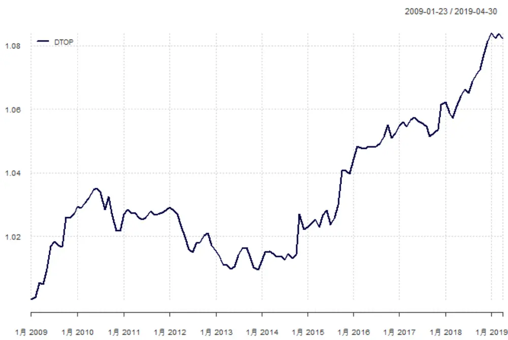
资料来源：渤海证券研究所，Wind资讯

## 3.9 调整合成权重后一级因子

根据上文对于二级因子收益的分析，我们重新调整了规模因子中 MIDCAP因子和质量因子中 Earnings Quality因子，将因子合成中原本正向的权重调整为负向权重，并重新进行回测。新模型的 Adjusted  由 34%上升至 36%，且质量因子和规模因子的夏普比率也有了较大幅度的提高。

表 10：调整后的纯因子统计结果

|  | 累计收益 | 年化收益 | 波动率 | 最大回撤 | 夏普比率 | 胜率 |
| --- | --- | --- | --- | --- | --- | --- |
| liq | -62.77% | -9.12% | 3.84% | 62.77% | -2.3768 | 22.58% |
| mom | -52.26% | -6.91% | 5.30% | 52.26% | -1.3017 | 41.94% |

请务必阅读正文之后的免责声明

| quality | 32.46% | 2.76% | 4.06% | 8.69% | 0.6788 | 59.68% |
| --- | --- | --- | --- | --- | --- | --- |
| growth | -3.91% | -0.39% | 1.08% | 5.47% | -0.3562 | 54.03% |
| size | -9.38% | -0.95% | 4.13% | 24.66% | -0.2298 | 44.35% |
| vol | 29.32% | 2.52% | 5.46% | 7.33% | 0.4616 | 51.61% |
| value | 24.98% | 2.18% | 4.79% | 7.97% | 0.4554 | 58.87% |
| DTOP | 8.21% | 0.77% | 1.01% | 2.46% | 0.7624 | 58.87% |

资料来源：渤海证券研究所，Wind资讯

图 13：调整后的纯因子回测结果
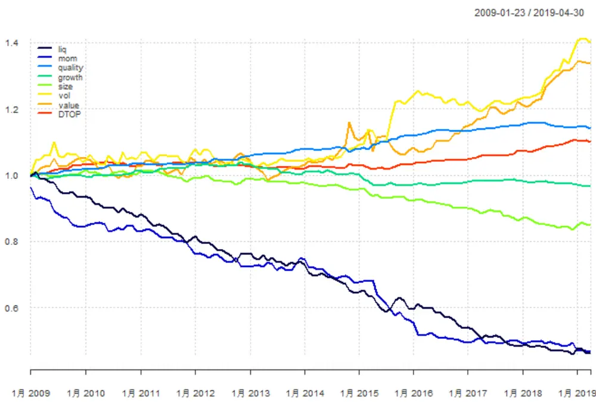
资料来源：渤海证券研究所，Wind资讯

## 4．总结与未来研究方向展望

本篇报告中，我们针对Barra CNE6 Notes 中定义的第一、二级风险因子，首先采用等权合成的方法，构建了纯因子模型。通过回测发现，流动性和动量的纯因子组合表现较为稳定。规模因子和波动率因子收益波动较大。质量因子近期收益有一定回撤。然后我们调整了规模因子和质量因子的赋权方式，重新进行回测，纯因子模型的收益表现有所提升。

未来，我们将利用已有的风险因子，构建风险模型，并将其应用于指数增强、机器学习等多种选股模型中。

风险提示：随着市场环境变化，模型存在失效风险。

附录：Barra CNE6 因子定义

| 一级因子 | 二级因子 | 三级因子 | 说明 | 因子定义 |
| --- | --- | --- | --- | --- |
| Size | Size | LNCAP | 规模 | 流通市值的自然对数 |
|  | Mid cap | MIDCAP | 中市值 | 首先取 Size因子暴露的立方，然后以加权回归的方式对 Size因子正交，最后进行去极值和标准化处理 |
| Volatility | Beta | BETA | 贝塔 | 股票收益率 $\cdot r_{t}$ 对沪深300收益率 $\cdot R_{t}$ 进行时间序列回归，取回归系数，回归时间窗口为252个交易日，半衰期63个交易日 $r_{t}=\alpha+\beta R_{t}+e_{t}$ |
|  | ResidualVolatility | Hist sigma | 历史sigma | 在计算BETA所进行的时间序列回归中，取回归残差收益率的波动率 |
|  |  | Daily std | 日标准差 | 日收益率在过去252个交易日的波动率，半衰期42个交易日 |
|  |  | Cumulative range | 累积收益范围 | Z(T)为过去T个月累积对数收益率（每个月包含21个交易日)，即 $Z(T)={\sum}_{\tau=1}^{T}[\ln(1+r_{\tau})]$ 其中 $r_{\tau}$ 为股票在τ月的收益，从而定义累积收益范围如下： $\mathrm{CMRA}=Z_{max}-Z_{min}$ 其中 $Z_{max}=\operatorname*{max}{\{Z(T)\}}$ $Z_{min}=\operatorname*{min}{\{Z(T)\}}$ $T=1,\dots,12$ |
| Liquidity | Liquidity | Monthly shareturnover | 月换手率 | 对最近21个交易日的股票换手率求和，然后取对数，即： $STOM=ln(\sum^{21}{\frac{V_{t}}{S_{t}}})$ 其中 $V_{t}$ 为股票在t日的成交额， $S_{t}$ 为股票在t日的流通市值 |
|  |  | Quarterly shareturnover | 季换手率 | $STOM_{\tau}$ 为τ月的换手率（每月包含21个交易日）季换手率定义为： $STOQ=ln\ :(\frac{1}{T}{\sum}^{T}{exp\ :(STOM_{\tau})})$ T=3个月 |
|  |  | Annual shareturnover | 年换手率 | $STOM_{\tau}$ 为τ月的换手率（每月包含21个交易日），年换手率定义为： $STOA=\ln{(\frac{1}{T})}\overline{{{2}}}_{\tau=1}^{T}\exp{(STOM_{\tau})})$ T=12 个月 |
|  |  | Annualized tradedvalue ratio | 年化交易量比率 | 对日交易份额比率（换手率）进行加权求和，时间窗口252个交易日，半衰期63个交易日 |
| Momentum | Short Termreversal | Short Termreversal | 短期反转 | 最近一个月的加权累积对数日收益率 $STREV(t)=\sum_{\tau\in T}w_{\tau-t-1}\left[\ln\bigl(1+r(\tau)\bigr)\right]$ r为算数平均股票收益率，w为半衰指数权重，时间窗口21个交易日，半衰期5个交易日，T={t-1，.....，t-n} |

请务必阅读正文之后的免责声明

|  | Seasonality | Seasonality | 季节因子 | 过去五年的已实现次月收益率的平均值 $SEASON(t)=\frac{1}{Y}\sum_{y=1}^{Y}r_{y}$ $\Gamma_{\boldsymbol{\mathbf{y}}}$ 为滞后 $\mathsf{y}$ 年的月收益率 |
| --- | --- | --- | --- | --- |
|  | IndustryMomentum | Industry Momentum | 行业动量 | 该指标描述个股相对中信一级行业的强度：(1)个股相对强度定义为： $RS_{S}(t)=\sum_{\tau\epsilon T(t)}w_{\tau-t}[ln(1+r_{s}(\tau)]$ 式中， $r_{s}$ 为日股票收益率，w为半衰指数权重，时间窗口6个月，半衰期1个月，T(t)={t，...，t-n}(2) 行业 $\cdot I_{t}$ 的相对强度定义为： $RS_{I}(t)=\sum_{i\in I(t)}c_{i}(t)RS_{i}(t)$ 式中， $c_{i}(t)$ 为行业i内个股流通市值的平方根(3)最终该指标定义为： $\mathrm{INDMOM}_{s}(t)=-\big(c_{s}(t)RS_{s}(t)-RS_{I}(t)\big)$ |
|  | Momentum | Relative strength | 相对强度 | (1)计算非滞后的相对强度：对股票的对数收益率进行半衰指数加权求和，时间窗口252个交易日，半衰期126个交易日(2)以11个交易日为时间窗口，滞后11个交易日，取非滞后相对强度的等权平均值 |
|  |  | Historical alpha | 历史 Alpha | 在计算BETA所进行的时间序列回归中，取回归截距项 |
| Quality | Leverage | Market Leverage | 市场杠杆 | $MLEV=\frac{ME+PE+LD}{ME}$ 其中ME为上一交易日的市值，PE和LD分别是上一财政年度的优先股和长期负债 |
|  |  | Book Leverage | 账面杠杆 | $BLEV=\frac{BE+PE+LD}{ME}$ 其中 BE，PE和LD 分别是上一财政年度的普通股账面价值，优先股和长期负债 |
|  |  | Debt to asset ratio | 资产负债比 | $DTOA={\frac{TL}{TA}}$ TL、TA分别为上一财政年度总负债和总资 $\dot{\mathcal{F}}$ |
|  | EarningsVariability | Variation in Sales | 营业收入波动率 | 过去五个财年的年营业收入标准差除以平均年营业收入 |
|  |  | Variation inEarnings | 盈利波动率 | 过去五个财年的年净利润标准差除以平均年净利润 |
|  |  | Variation inCash-Flows | 现金流波动率 | 过去五个财年的年现金及现金等价物净增加额标准差除以平均年现金及现金等价物净增加额 |
|  |  | Standard deviationof AnalystForecast | 分析师预测EP 比标准差 | 预测 12 月 eps 的标准差除以当前股价 |

|  | Earnings-to-Price |  |  |
| --- | --- | --- | --- |
| EarningsQuality | AccrualsBalancesheetversion | 资产负债表应计项目 | (1)资产负债表应计项目总额计算公式为： $ACCR\_BS=NOA_{t}-NOA_{t-1}-DA_{t}$ $NOA_{}=(TA_{}-Cash)_{-}(TL_{}-TD)$ 其中，NOA 为净经营资产，Cash为现金及现金等价物，TA为总资产，TL为总负债，TD为总带息债务（负债合计-无息流动负债-无息非流动负债），DA为折旧与摊销之和(2) 将负的 ACCR BS 除以总资产 TA: $ABS={\frac{-ACCR_{-}BS}{TA}}$ |
|  | Accruals Cashflowversion | 现金流量表应计项目 | (1)现金流量表应计项目总额计算公式为： $ACCR_{CF}=Ni_{t}-\left(CFO_{t}+CFI_{t}\right)+DA_{t}$ Ni为净利润，CFO 为经营现金流量净额，CFI为投资活动现金流量净额，DA为折旧与摊销之和(2) 将负的 ACCR CF除以总资产 TA: $ACF={\frac{-ACCR_{-}CF}{TA}}$ |
| Profitability | Asset turnover | 资产周转率 | $ATO={\frac{Sales}{TA}}$ Sales为过去12 个月的营业收入，TA 为最近报告期的总资产 |
|  | Grossprofitability | 资产毛利率 | $GP={\frac{Sales-COGS}{TA}}$ 其中 Sales、COGS和TA 分别是上一个财务年度的营业收入、营业成本和总资产 |
|  | Gross ProfitMargin | 销售毛利率 | $GPM=\frac{Sales-COGS}{Sales}$ 其中 Sales和COGS 分别为上一会计年度的营业收入和销货成本 |
|  | Return on assets | 总资产收益率 | $ROA=\frac{Earnings}{TA}$ Earnings为过去12 个月的净利润，TA 为最近报告期的总资产 |
| InvestmentQuality | Total AssetsGrowth Rate | 总资产增长率 | 最近5个财政年度的总资产对时间的回归的斜率值，除以平均总资产，最后取相反数 |
|  | Issuance growth | 股票发行量增长率 | 最近5个财政年度的流通股本对时间的回归的斜率值，除以平均流通股本，最后取相反数 |
|  | Capitalexpenditure growth | 资本支出增长率 | 将过去5个财政年度的资本支出对时间的回归的斜率值，除以平均资本支出，最后取相反数 |

| Value | BTOP | Book to price | 账面市值比 | 将最近报告期的普通股账面价值除以当前市值 |
| --- | --- | --- | --- | --- |
|  | EarningsYield | TrailingEarnings-to-priceRatio | EP比 | 过去12个月的盈利除以当前市值 |
|  |  | Analyst-PredictedEarnings-to-Price | 分析师预测EP比 | 预测12个月的盈利除以当前市值 |
|  |  | Cash earnings toprice | 现金盈利价格比 | 过去12个月的现金盈利除以当前市值 |
|  |  | Enterprisemultiple (Ebit toEv) | 企业价值倍数的倒数 | 上一财政年度的息税前利润（EBIT）除以当前企业价值（EV） |
|  | Long Termreversal | Long term relativestrength | 长期相对强度 | (1)计算非滞后的长期相对强度：对股票对数收益率进行加权求和，时间窗口1040个交易日，半衰期260个交易日(2)滞后 273 个交易日，在11 个交易日的时间窗口内取非滞后值等权平均值，最后取相反数 |
|  |  | Long termhistorical alpha | 长期历史Alpha | (1)计算非滞后的长期历史 AIpha：取 CAPM 回归（见 BETA)的截距项，时间窗口1040个交易日，半衰期260个交易日(2)滞后273 个交易日，在11个交易日的时间窗口内取非滞后值等权平均值，最后取相反数 |
| Growth | Growth | Predicted growth 3year | 分析师预测长期盈利增长率 | 分析师预测的长期（3-5）年利润增长率 |
|  |  | Historicalearnings per sharegrowth rate | 每股收益增长率 | 过去5个财政年度的每股收益对时间回归的斜率除以平均每股年收益 |
|  |  | Historical salesper share growthrate | 每股营业收入增长率 | 过去5个财政年度的每股年营业收入对时间回归斜率除以平均每股年营业收入 |
| Sentiment | Sentiment | Revision ratio | 调整比率 | 分析师调整比率的每月变动，定义为向上调整次数减去向下调整次数，除以总的调整次数 $RRIBS(t)=\sum_{l\in L}W_{l}\frac{UP(t-l*21)-DOWN(t-l*21)}{TOTAL(t-l*21)}$ L= {0, 1, 2} |
|  |  | Change inanalyst-predictedearnings-to-price | 分析师预测EP 比变化 | 分析师预测 EP 比的加权变动EPIBSc(t) $=\sum_{l\in L}w_{l}\frac{EPIBS(t-l*63)-EPIBS(t-(l+1)*63)}{EPIBS(t-(l+1)*63)}$ L= {0, 1, 2, 3} |
|  |  | Change inanalyst-predictedearnings per share | 分析师预测的每股收益的变化 | 分析师预测每股收益的加权变化：EARNc(t) |

|  |  |  |  | =∑ EARN(t − l * 63) − EARN(t − (l + 1) * 63)WllELEARN(t − (l + 1) * 63)L= {0, 1, 2, 3} |
| --- | --- | --- | --- | --- |
| DividendYield | DividendYield | Dividend-to-priceratio | 股息率 | 最近12个月的每股股息除以上个月月末的股价 |
|  |  | Analyst predicteddividend to priceratio | 分析师预测分红价格比 | 预测12个月的每股股息（DPS）除以当前价格 |

资料来源：渤海证券研究所、The Barra China Equity Model (CNE6)

投资评级说明

| 项目名称 | 投资评级 | 评级说明 |
| --- | --- | --- |
| 公司评级标准 | 买入 | 未来 6 个月内相对沪深 300 指数涨幅超过 20% |
|  | 增持 | 未来6 个月内相对沪深 300 指数涨幅介于10%~20%之间 |
|  | 中性 | 未来6个月内相对沪深 300 指数涨幅介于-10%~10%之间 |
|  | 减持 | 未来6 个月内相对沪深 300 指数跌幅超过 10% |
| 行业评级标准 | 看好 | 未来12个月内相对于沪深300指数涨幅超过10% |
|  | 中性 | 未来12个月内相对于沪深300指数涨幅介于-10%-10%之间 |
|  | 看淡 | 未来 12 个月内相对于沪深 300 指数跌幅超过 10% |

免责声明：本报告中的信息均来源于已公开的资料，我公司对这些信息的准确性和完整性不作任何保证，不保证该信息未经任何更新，也不保证本公司做出的任何建议不会发生任何变更。在任何情况下，报告中的信息或所表达的意见并不构成所述证券买卖的出价或询价。在任何情况下，我公司不就本报告中的任何内容对任何投资做出任何形式的担保，投资者自主作出投资决策并自行承担投资风险，任何形式的分享证券投资收益或者分担证券投资损失书面或口头承诺均为无效。我公司及其关联机构可能会持有报告中提到的公司所发行的证券并进行交易，还可能为这些公司提供或争取提供投资银行或财务顾问服务。我公司的关联机构或个人可能在本报告公开发表之前已经使用或了解其中的信息。本报告的版权归渤海证券股份有限公司所有，未获得渤海证券股份有限公司事先书面授权，任何人不得对本报告进行任何形式的发布、复制。如引用、刊发，需注明出处为“渤海证券股份有限公司”，也不得对本报告进行有悖原意的删节和修改。

## 渤海证券股份有限公司研究所

所长&金融行业研究

## 副所长&产品研发部经理

张继袖

+86 22 2845 1845

## 计算机行业研究小组

王洪磊（部门经理）

+86 22 2845 1975

+86 22 2383 9067

王磊

+86 22 2845 1802

## 医药行业研究小组

徐勇

+86 10 6810 4602 甘英健

+86 22 2383 9063

崔健

+86 22 2383 9062

## 非银金融行业研究

洪程程+86 10 6810 4609

## 固定收益研究

崔健
+86 22 2845 1618夏捷
+86 22 2386 1355朱林宁
+86 22 2387 3123

## 流动性、战略研究＆部门经理

周喜+86 22 2845 1972

## 综合管理＆部门经理

齐艳莉 +86 22 2845 1625

## 合规管理&部门经理

任宪功+86 10 6810 4615

+86 22 2845 1618

## 汽车行业研究小组

郑连声

+86 22 2845 1904 陈兰芳

+86 22 2383 9069

## 通信行业研究小组

徐勇+86 10 6810 4602

## 中小盘行业研究

徐中华+86 10 6810 4898

## 金融工程研究

+86 22 2845 1131 张世良 +86 22 2383 9061

## 策略研究

宋亦威
+86 22 2386 1608严佩佩
+86 22 2383 9070

## 机构销售•投资顾问

朱艳君
+86 22 2845 1995
刘璐

## 风控专员

张敬华+86 10 6810 4651

## 食品饮料行业研究

+86 22 2386 1670

## 公用事业行业研究

刘蕾+86 10 6810 4662

## 机械行业研究

张冬明+86 22 2845 1857

## 金融工程研究

祝涛 
+86 22 2845 1653 郝倞 
+86 22 2386 1600 宋亦威 
+86 22 2386 1608 孟凡迪 
+86 22 2383 9071

## 电力设备与新能源行业研究

张冬明
+86 22 2845 1857刘秀峰
+86 10 6810 4658滕飞
+86 10 6810 4686

## 餐饮旅游行业研究

刘瑀
+86 22 2386 1670杨旭
+86 22 2845 1879

## 传媒行业研究

姚磊+86 22 2383 9065

## 博士后工作站

张佳佳 资产配置
+86 22 2383 9072
张一帆 公用事业、信用评级
+86 22 2383 9073

## 渤海证券研究所

天津

天津市南开区水上公园东路宁汇大厦 A座写字楼

邮政编码：300381

电话：（022）28451888

传真：（022）28451615

北京

北京市西城区西直门外大街甲 143 号 凯旋大厦 A 座 2 层

邮政编码：100086

电话： （010）68104192

传真： （010）68104192

渤海证券研究所网址：www.ewww.com.cn