# 如何利用负面因子做指数增强？风格因子篇

## 报告要点

## 风格因子的空头组具有显著的负向超额

从 2007-02-01 至 2019-12-31 的测算结果看，流动性、反转、波动率、成长、价值、规模和质量因子具有显著的负向超额收益，年化依次分别为 11.20%、10.08%、9.15%、6.87%、6.82%、5.82%和 5.75%。

## 风格因子负面组合具有显著的负面Alpha

从 2007-02-01 至 2019-12-31 的测算结果看，流动性、反转、波动率、价值、成长、质量和规模因子的负面组合相对于中证 500 指数增强组合具有显著的负面 Alpha，年化依次分别为 17.19%、16.60%、15.38%、10.63%、9.86%、8.78%和 8.70%。

## 指数增强策略

从中证 500 的回测结果来看，复杂增强策略每年都跑赢了指数，且超额收益更显著。策略平均年化收益为 13.72%，超额中证 500 指数 7.39%，相对基准的最大回撤为 2.49%，收益回撤比为 2.97，信息比率为2.31，跟踪误差为 2.84%，月度跑赢概率为 76.62%，合成因子的负面 Alpha 高达 24.28%。

风险提示： 策略回测建立在历史数据之上，不能保证未来也有同样收益。

金融工程┃专题报告

## [Table分析师Autho覃川桃

（8621）61118766

qinct@cjsc.com.cn

执业证书编号：S0490513030001

## 分析师 刘懿

（8621）61118705

liuyi4@cjsc.com.cn

执业证书编号：S0490518120004

## [Ta相关研究 ble_

《从四季报持仓结构看公募抱团效应》2020-2-12

《业绩超预期中的投资机会》2020-2-11

《长江金工基本面量化五维度模型应用之医药篇（上）》2020-2-5

请阅读最后评级说明和重要声明

## 如何利用负面因子做指数增强？

一般来说，我们评价一个因子是否有效都会关注以下几点：1.因子是否具有单调性；2.多空收益是否稳定；3.多头组的超额收益是否显著。我们往往会忽视空头组，其实即使多头组没有超额收益或者因子没有单调性，只要空头组有稳定的负面超额收益，我们仍然可以利用这个因子获得 Alpha。本文旨在提出一种利用因子的负面 Alpha 来做指数增强的方法，具体方法如下：

1． 测算单个因子在指数成分股中的分组表现，观察空头组的负向超额收益是否显著；

2． 测算单个因子的负面组合（空头组）和剔除空头组后的指数成分股的表现，观察因子的负面增强效果是否稳定；

3． 选取负向超额收益较显著且稳定的因子合成新因子，利用合成因子的空头组对指数进行增强。

## 指数增强方法

在上一篇负面 Alpha 的研究专题《负面事件指数增强策略》中我们讨论了指数增强的主要方法，主要如图 1 所示，这里就不再赘述。

图 1：指数增强方法
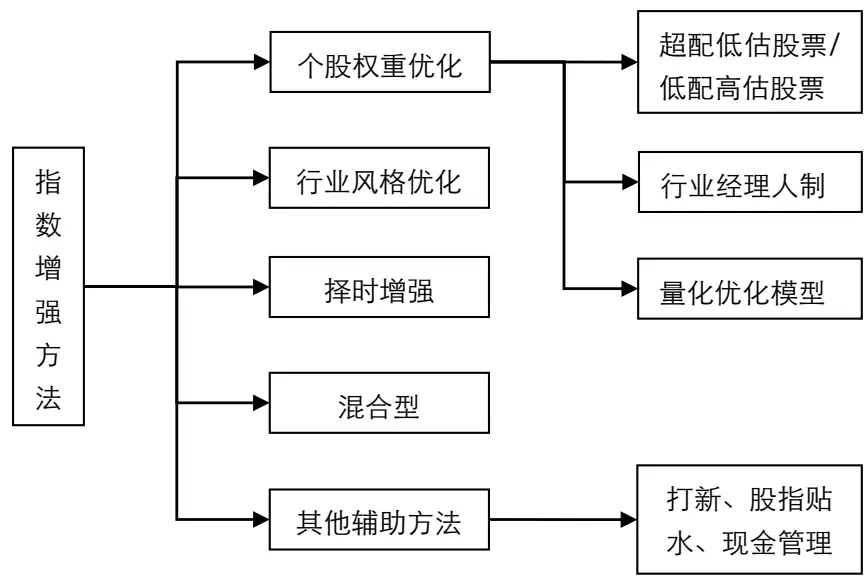
资料来源：长江证券研究所

本篇报告使用的指数增强方法和上一篇类似，从指数成分股中剔除负面因子的空头组股票，从而提高指数的整体收益。这种方法的好处是我们可以不必关注因子其他各组的单调性，只需要关注空头组是否具有显著负向超额收益。

## 因子定义

本篇报告讨论的因子主要为风格因子，因子类型定义和合成方法如下表所示：

表 1：风格因子类型定义

| 大类 | 指标 | 权重 | 方向 |
| --- | --- | --- | --- |
| 成长 质量 | 净利润增速 | 1/3 | 1 |
|  | 营业利润增速 | 1/3 |  |
|  | ROE同比 | 1/3 |  |
|  | ROE_TTM | 1 |  |
| 价值 | EP | 1/4 | 1 |
|  | BP | 1/4 |  |
|  | CFP |  |  |
|  | SP | 1/4 |  |
| Beta | 过去一个月与沪深300回归得到的Beta | 1/4 | 1 |
|  | 过去一年与沪深300回归得到的Beta | 1/2 1/2 |  |
| 波动率 | 近一个月收益率标准差 | 1/2 | -1 |
|  | 近一年收益率标准差 | 1/2 |  |
| 财务杠杆 | 资产负债率 | 1/3 | -1 |
|  | 非流动负债占总资产比率 | 1/3 |  |
|  | 非流动负债占市值比例 | 1/3 |  |
| 流动性 | 近21日日均换手率的对数 | 1/3 | -1 |
|  | 近63日日均换手率的对数 | 1/3 |  |
|  | 近252日日均换手率的对数 | 1/3 |  |
| 规模 | 流通市值的对数 | 1 | -1 |
| 反转 | 近一个月收益率 | 1 | -1 |
| 动量 | 过去一年扣除近一个月收益率 | 1 | 1 |

资料来源：长江证券研究所

## 负面因子测算

下面我们以中证 500 为例，分别对每个因子在中证 500 成分股中的表现进行测算，因为中证 500 成分股是从 2007 年 1 月底开始公布，所以我们选取数据的时间范围为2007-02-01 至 2019-12-31。对单因子的测算包括以下两部分：

1. 分组年化超额收益和 IC 均值；

2. 负面组合（空头组）和剔除空头组后的指数成分股的表现。

## 单因子分组表现

我们按因子排序把所有成分股分为 5 组，并计算出每组相对于中证 500 的年化超额和每期的 IC 均值。

## 成长因子

成长因子的各组超额收益有明显的单调性，其中第 5 组平均每年跑输指数 6.87%，且 IC均值为各组最高，可见空头组具有稳定的负向超额收益。

图 2：成长因子分组表现
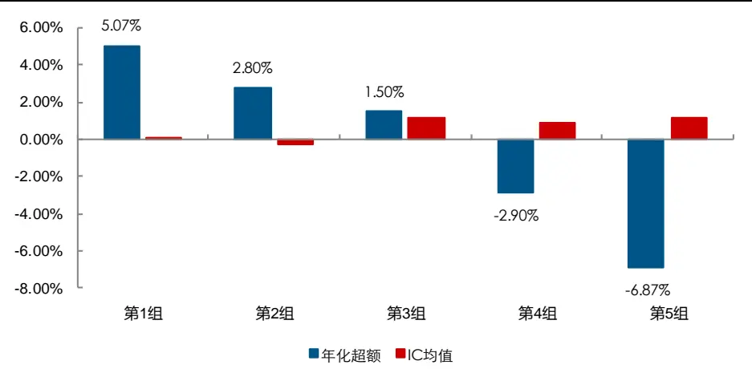
资料来源：Wind, 长江证券研究所

## 质量因子

质量因子的各组超额收益有明显的单调性，其中第 5 组平均每年跑输指数 5.75%，且 IC均值为各组最高，具有较高的负向超额收益。

图 3：质量因子分组表现
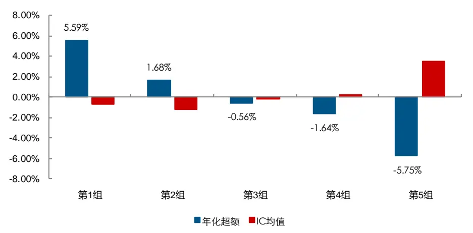
资料来源：Wind, 长江证券研究所

## 价值因子

价值因子的各组超额收益有明显的单调性，其中第 5 组平均每年跑输指数 6.82%，且 IC均值为各组最高，可见空头组具有稳定的负向超额收益。

图 4：价值因子分组表现
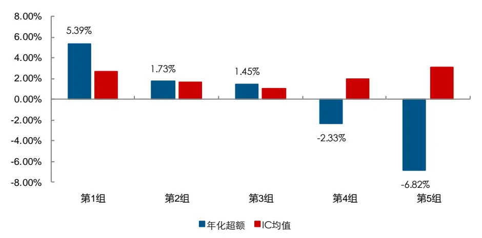
资料来源：Wind, 长江证券研究所

## Beta 因子

Beta 因子的各组超额收益没有单调性，第 5 组的超额收益为-4.51%，具有较高的负向超额收益。

图 5：Beta因子分组表现
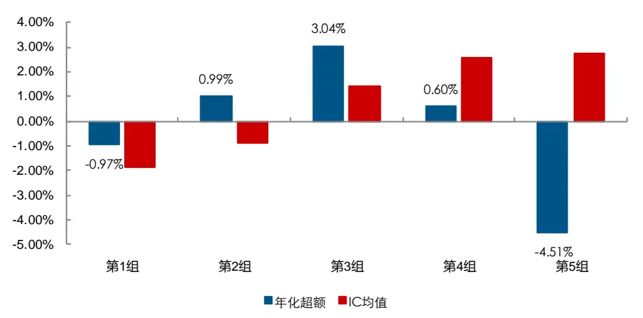
资料来源：Wind, 长江证券研究所

## 波动率因子

波动率因子的各组超额收益有明显的单调性，其中第 5 组平均每年跑输指数 9.15%，且因子与未来收益的相关性为各组最高，可见空头组具有稳定的负向超额收益。

图 6：波动率因子分组表现
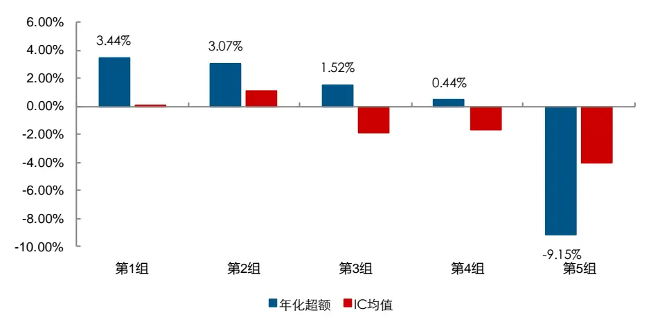
资料来源：Wind, 长江证券研究所

## 财务杠杆因子

财务杠杆因子的各组超额收益没有单调性，其中表现最差的为第 3 组，平均每年跑输指数 1.97%，空头组的负向超额收益仅为 1.51%。

图 7：财务杠杆因子分组表现
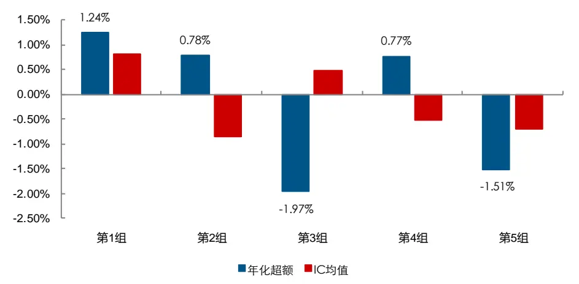
资料来源：Wind, 长江证券研究所

## 流动性因子

流动性因子的各组超额收益有明显的单调性，其中第 5 组平均每年跑输指数 11.20%，且因子与未来收益的相关性为各组最高，可见空头组具有稳定的负向超额收益。

图 8：流动性因子分组表现
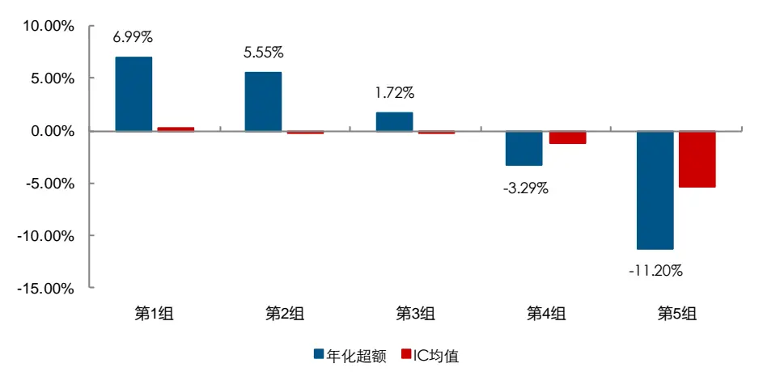
资料来源：Wind, 长江证券研究所

## 规模因子

规模因子的各组超额收益有一定的单调性，其中第 5 组的负向超额收益为 5.82%。

图 9：规模因子分组表现
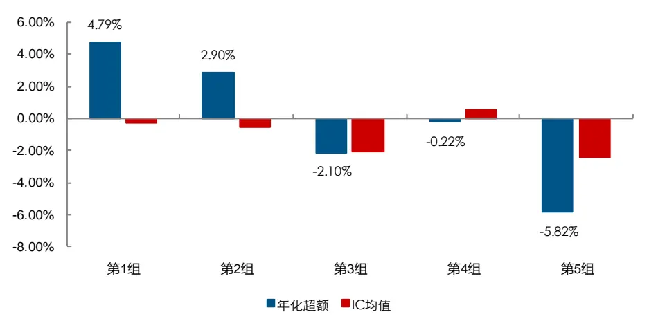
资料来源：Wind, 长江证券研究所

## 反转因子

反转因子的各组超额收益有较强的单调性，其中第 5 组平均每年跑输指数 10.08%，且因子与未来收益的相关性为各组最高，可见空头组具有稳定的负向超额收益。

图 10：反转因子分组表现
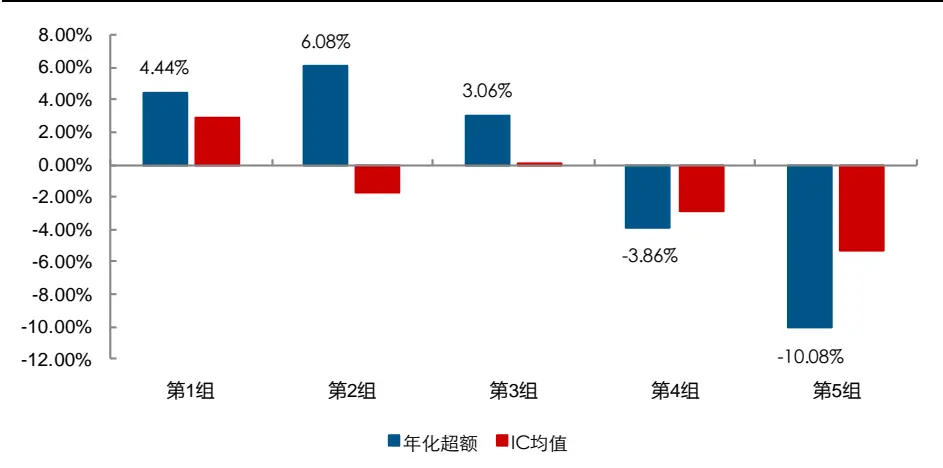
资料来源：Wind, 长江证券研究所

## 动量因子

动量因子的各组超额收益没有单调性，空头组的负向超额收益仅为 2.28%。

图 11：动量因子分组表现
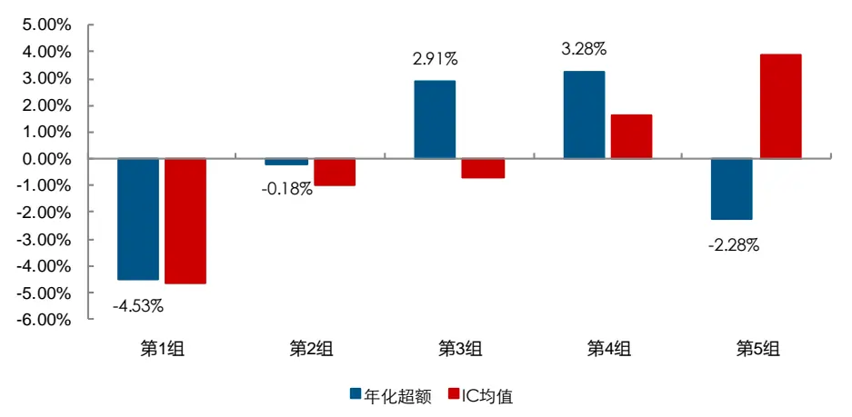
资料来源：Wind, 长江证券研究所

## 单因子负面组合表现

通过上一部分对单因子分组收益的测算，我们发现下列因子具有较强的负向超额收益：成长，质量，价值，波动率，流动性，反转和规模因子。为了进一步观察这些因子的长期有效性，我们利用每个因子的空头组建立负面组合，并从中证 500 成分股中剔除空头组建立指数增强组合，对比两个组合的表现，具体测算方法如下：

- 回测区间：2007 年 2 月 1 日至 2019 年 12 月 31 日；

选股范围：中证 500 成分股；

- 组合构建：按因子排序把空头组（排名最后 1/5 股票）作为负面组合，并从中证500 成分股中剔除空头组建立指数增强组合；

## 成长因子

成长因子负面组合从长期看能获得较稳定的负面 Alpha，净值比（负面组合/指数增强组合，下同）自 2010 年以后持续向下，基本每年都跑输剔除空头组之后的指数成分股，平均每年跑输 9.86%。

图 12：成长因子负面组合净值表现
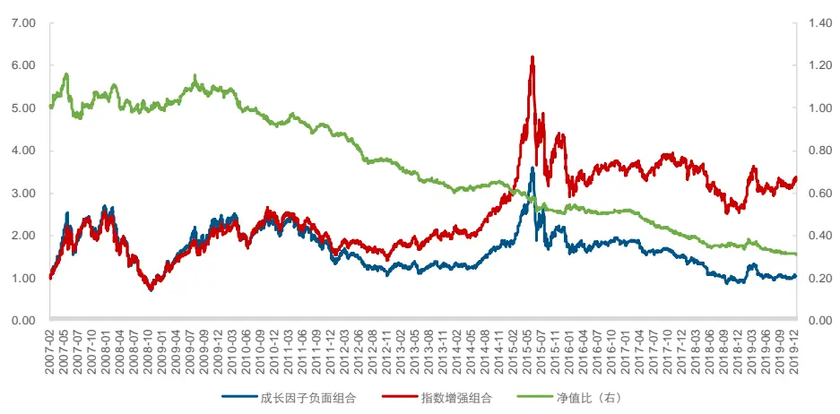
资料来源：Wind, 长江证券研究所

表 2：成长因子负面组合年化收益

| 年份 | 成长因子负面组合 | 指数增强组合 | 负面Alpha |
| --- | --- | --- | --- |
| 2007 | 142.87% | 130.54% | 12.33% |
| 2008 | -62.36% | -60.13% | -2.24% |
| 2009 | 151.74% | 130.15% | 21.60% |
| 2010 | -4.37% | 13.64% | -18.01% |
| 2011 | -35.79% | -32.13% | -3.66% |
| 2012 | -12.42% | 2.55% | -14.96% |
| 2013 | 2.93% | 20.84% | -17.91% |
| 2014 | 41.17% | 39.73% | 1.44% |
| 2015 | 18.88% | 49.61% | -30.73% |
| 2016 | -15.11% | -16.28% | 1.16% |
| 2017 | -17.10% | 4.77% | -21.86% |
| 2018 | -40.57% | -30.11% | -10.45% |
| 2019 | 17.17% | 30.13% | -12.96% |
| 合计 | 0.37% | 10.24% | -9.86% |

资料来源：Wind, 长江证券研究所

## 质量因子

质量因子负面组合从长期看能获得较稳定的负面 Alpha，净值比持续向下，平均每年跑输指数增强组合 8.78%。

图 13：质量因子负面组合净值表现
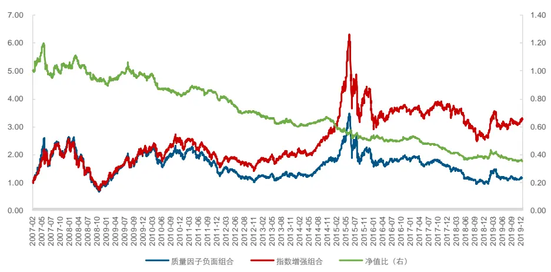
资料来源：Wind, 长江证券研究所

表 3：质量因子负面组合年化收益

| 年份 | 质量因子负面组合 | 指数增强组合 | 负面Alpha |
| --- | --- | --- | --- |
| 2007 | 138.83% | 130.93% | 7.90% |
| 2008 | -64.55% | -59.61% | -4.94% |
| 2009 | 147.43% | 131.03% | 16.39% |
| 2010 | -4.24% | 13.72% | -17.96% |
| 2011 | -34.89% | -32.29% | -2.60% |
| 2012 | -10.70% | 2.15% | -12.86% |
| 2013 | 7.79% | 19.81% | -12.03% |
| 2014 | 44.34% | 39.10% | 5.24% |
| 2015 | 18.12% | 50.33% | -32.20% |
| 2016 | -15.43% | -16.14% | 0.71% |
| 2017 | -11.66% | 3.61% | -15.27% |
| 2018 | -39.89% | -30.22% | -9.67% |
| 2019 | 22.60% | 29.22% | -6.61% |
| 合计 | 1.34% | 10.12% | -8.78% |

资料来源：Wind, 长江证券研究所

## 价值因子

价值因子的长期负面 Alpha 较稳定，负面组合除 2013 和 2019 年都跑输了指数增强组合，净值比持续向下，平均每年跑输增强组合 10.63%。

图 14：价值因子负面组合净值表现
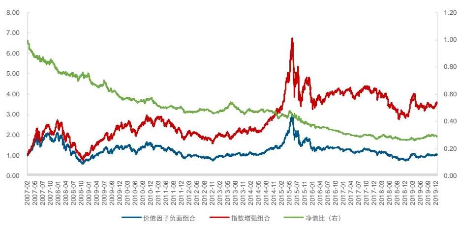
资料来源：Wind, 长江证券研究所

表 4：价值因子负面组合年化收益

| 年份 | 价值因子负面组合 | 指数增强组合 | 负面Alpha |
| --- | --- | --- | --- |
| 2007 | 94.40% | 144.12% | -49.72% |
| 2008 | -62.11% | -60.10% | -2.01% |
| 2009 | 89.02% | 147.05% | -58.03% |
| 2010 | 9.57% | 10.59% | -1.02% |
| 2011 | -40.74% | -30.30% | -10.45% |
| 2012 | -4.30% | 1.07% | -5.38% |
| 2013 | 18.65% | 17.51% | 1.14% |
| 2014 | 30.58% | 42.75% | -12.17% |
| 2015 | 29.99% | 48.12% | -18.14% |
| 2016 | -26.15% | -13.40% | -12.75% |
| 2017 | -6.88% | 2.56% | -9.44% |
| 2018 | -36.67% | -30.52% | -6.15% |
| 2019 | 35.86% | 26.12% | 9.73% |
| 合计 | 0.24% | 10.88% | -10.63% |

资料来源：Wind, 长江证券研究所

## 波动率因子

波动率因子的平均年化负面 Alpha 高达 15.38%，远远跑输指数增强组合，而且每年都能获得负面 Alpha，净值比也稳定向下。

图 15：波动率因子负面组合净值表现
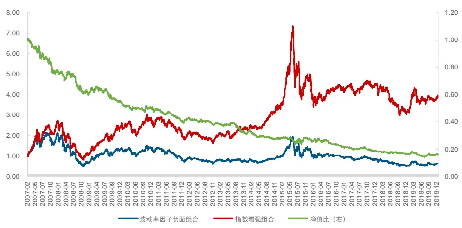
资料来源：Wind, 长江证券研究所

表 5：波动率因子负面组合年化收益

| 年份 | 波动率因子负面组合 | 指数增强组合 | 负面Alpha |
| --- | --- | --- | --- |
| 2007 | 88.74% | 145.16% | -56.42% |
| 2008 | -67.96% | -58.60% | -9.36% |
| 2009 | 118.83% | 137.00% | -18.17% |
| 2010 | 2.93% | 11.82% | -8.89% |
| 2011 | -44.84% | -29.33% | -15.51% |
| 2012 | -2.20% | -0.08% | -2.12% |
| 2013 | -0.26% | 23.27% | -23.53% |
| 2014 | 28.00% | 43.04% | -15.03% |
| 2015 | 39.62% | 45.15% | -5.53% |
| 2016 | -28.75% | -12.73% | -16.03% |
| 2017 | -11.16% | 4.12% | -15.28% |
| 2018 | -39.37% | -29.96% | -9.40% |
| 2019 | 24.45% | 28.32% | -3.87% |
| 合计 | -3.69% | 11.69% | -15.38% |

资料来源：Wind, 长江证券研究所

## 流动性因子

流动性因子的平均年化负面 Alpha 高达 17.19%，远远跑输指数增强组合，除了 2019年其他年度都能获得负面 Alpha，净值比也稳定向下。

图 16：流动性因子负面组合净值表现
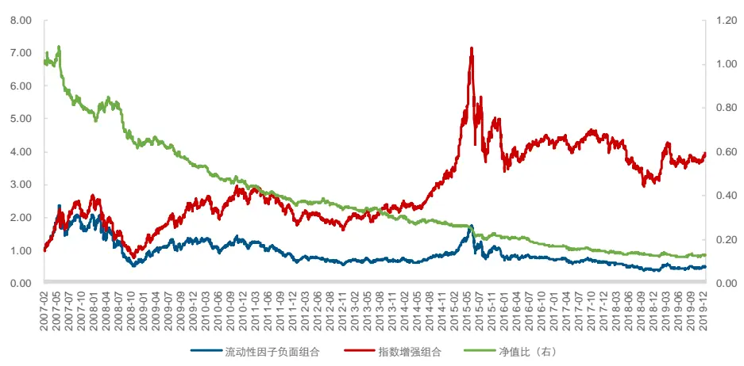
资料来源：Wind, 长江证券研究所

表 6：流动性因子负面组合年化收益

| 年份 | 流动性因子负面组合 | 指数增强组合 | 负面Alpha |
| --- | --- | --- | --- |
| 2007 | 89.67% | 141.85% | -52.19% |
| 2008 | -66.95% | -58.59% | -8.37% |
| 2009 | 105.66% | 138.35% | -32.69% |
| 2010 | -2.63% | 12.93% | -15.56% |
| 2011 | -45.90% | -29.93% | -15.97% |
| 2012 | -3.36% | 0.48% | -3.85% |
| 2013 | 2.24% | 21.10% | -18.87% |
| 2014 | 30.75% | 42.06% | -11.31% |
| 2015 | 19.01% | 48.89% | -29.88% |
| 2016 | -31.25% | -12.55% | -18.70% |
| 2017 | -10.28% | 3.48% | -13.77% |
| 2018 | -40.77% | -29.68% | -11.08% |
| 2019 | 29.11% | 28.05% | 1.07% |
| 合计 | -5.52% | 11.67% | -17.19% |

资料来源：Wind, 长江证券研究所

## 反转因子

反转因子的平均年化负面 Alpha 高达 16.60%，远远跑输指数增强组合，除了 2017 年其他年度都能获得负面 Alpha，净值比也稳定向下。

图 17：反转因子负面组合净值表现
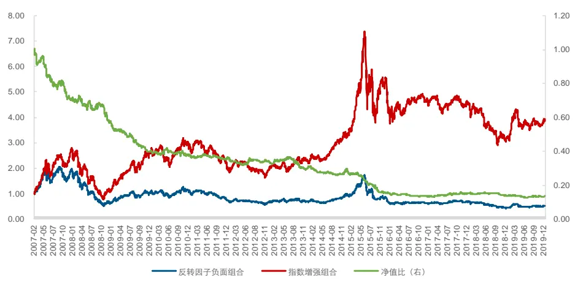
资料来源：Wind, 长江证券研究所

表 7：反转因子负面组合年化收益

| 年份 | 反转因子负面组合 | 指数增强组合 | 负面Alpha |
| --- | --- | --- | --- |
| 2007 | 78.51% | 151.19% | -72.69% |
| 2008 | -66.56% | -58.67% | -7.89% |
| 2009 | 74.42% | 151.33% | -76.91% |
| 2010 | 5.33% | 10.40% | -5.06% |
| 2011 | -36.50% | -32.55% | -3.95% |
| 2012 | -4.35% | -0.17% | -4.17% |
| 2013 | 4.02% | 20.28% | -16.26% |
| 2014 | 37.45% | 38.59% | -1.14% |
| 2015 | -12.97% | 67.11% | -80.08% |
| 2016 | -24.65% | -14.57% | -10.08% |
| 2017 | 6.68% | -2.49% | 9.17% |
| 2018 | -35.58% | -31.57% | -4.01% |
| 2019 | 23.27% | 27.98% | -4.72% |
| 合计 | -4.98% | 11.63% | -16.60% |

资料来源：Wind, 长江证券研究所

## 规模因子

规模因子在 2017 年之前负面 Alpha 较稳定，净值比持续向下，平均每年跑输指数增强组合 8.70%，但近三年没有负面 Alpha。

图 18：规模因子负面组合净值表现
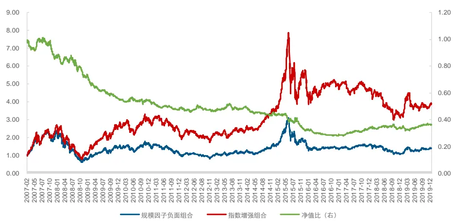
资料来源：Wind, 长江证券研究所

表 8：规模因子负面组合年化收益

| 年份 | 规模因子负面组合 | 指数增强组合 | 负面Alpha |
| --- | --- | --- | --- |
| 2007 | 113.24% | 144.18% | -30.94% |
| 2008 | -64.49% | -57.92% | -6.57% |
| 2009 | 94.88% | 157.48% | -62.60% |
| 2010 | 9.15% | 10.95% | -1.80% |
| 2011 | -37.16% | -30.31% | -6.84% |
| 2012 | -3.49% | 1.58% | -5.08% |
| 2013 | 19.52% | 16.32% | 3.20% |
| 2014 | 32.57% | 43.83% | -11.26% |
| 2015 | 15.87% | 61.80% | -45.94% |
| 2016 | -22.94% | -12.51% | -10.43% |
| 2017 | 12.42% | -5.26% | 17.68% |
| 2018 | -30.71% | -32.57% | 1.87% |
| 2019 | 33.03% | 25.32% | 7.71% |
| 合计 | 2.92% | 11.62% | -8.70% |

资料来源：Wind, 长江证券研究所

## 指数增强策略

下面我们利用上一部分测算下来负面 Alpha 比较稳定的几个因子合成一个新的负面因子来对指数收益进行增强，主要思路和单因子的做法类似，也是将负面因子的空头组从指数成分股中剔除，通过减少负向超额收益来提高指数整体收益。我们分别给出了两种策略，一种是简单将所有因子等权配置，另一种是加入了因子动量的思路。

## 简单增强策略

我们首先来看一下简单的等权配置增强策略，回测方法如下：

- 回测区间：2007 年 3 月 1 日至 2019 年 12 月 31 日；

- 选股范围：中证 500 成分股；

- 比较基准：中证 500 指数；

- 因子合成：成长、质量、价值、波动率、流动性、反转和规模因子等权；

- 组合构建：按合成因子排序，从中证 500 成分股中剔除空头组（排名最后 1/5 股票）建立指数增强组合；

简单增强策略与中证 500 的净值比曲线持续向上，说明策略获得的增强收益比较稳定。

图 19：简单增强策略净值表现
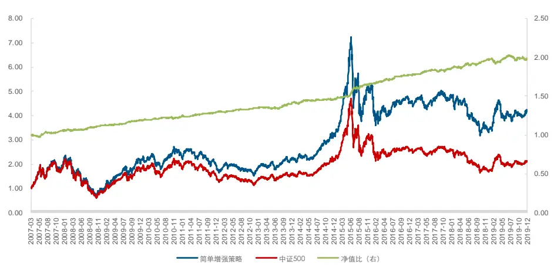
资料来源：Wind, 长江证券研究所

从历史表现看，简单增强策略平均年化收益为 12.38%，跑赢指数 6.05%，相对基准的最大回撤为 2.06%，收益回撤比为 2.94，信息比率为 1.91，跟踪误差为 2.77%。从分年表现看，策略在所有年份均跑赢了中证 500，月度跑赢概率为 72.73%。

表 9：简单增强策略分年表现

| 年份 | 绝对收益 | 超额收益 | 相对最大回撤 | 收益回撤比 | 信息比率 | 跟踪误差 | 月度超额胜率 |
| --- | --- | --- | --- | --- | --- | --- | --- |
| 2007 | 112.75% | 11.59% | 1.29% | 8.95 | 2.03 | 3.16% | 70.00% |
| 2008 | -58.19% | 2.61% | 0.87% | 3.00 | 2.31 | 2.74% | 83.33% |
| 2009 | 144.12% | 12.85% | 0.58% | 22.14 | 2.49 | 2.11% | 75.00% |
| 2010 | 13.21% | 3.15% | 1.17% | 2.68 | 1.04 | 2.59% | 66.67% |
| 2011 | -29.34% | 4.49% | 0.94% | 4.79 | 3.63 | 1.81% | 91.67% |
| 2012 | 3.42% | 3.15% | 0.61% | 5.17 | 1.78 | 1.70% | 58.33% |
| 2013 | 22.98% | 6.10% | 0.97% | 6.31 | 1.61 | 3.17% | 58.33% |
| 2014 | 42.62% | 3.62% | 1.18% | 3.07 | 0.94 | 2.60% | 50.00% |
| 2015 | 63.11% | 19.99% | 0.99% | 20.15 | 3.63 | 3.67% | 91.67% |
| 2016 | -12.11% | 5.67% | 0.72% | 7.87 | 2.97 | 2.25% | 91.67% |
| 2017 | 4.25% | 4.45% | 0.96% | 4.66 | 1.81 | 2.39% | 83.33% |
| 2018 | -28.96% | 4.36% | 1.19% | 3.67 | 2.03 | 3.08% | 66.67% |
| 2019 | 27.24% | 0.86% | 2.06% | 0.42 | 0.07 | 3.74% | 58.33% |
| 全部 | 12.38% | 6.05% | 2.06% | 2.94 | 1.91 | 2.77% | 72.73% |

资料来源：Wind, 长江证券研究所

简单增强策略的负面组合与指数增强组合的净值比稳定向下，除 2019 年其他各年均跑输了增强组合，平均每年跑输 22.02%。

图 20：简单增强策略负面组合净值表现
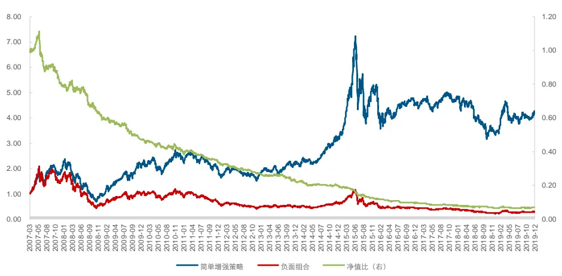
资料来源：Wind, 长江证券研究所

表 10：简单增强策略负面组合年化收益

| 年份 | 负面组合 | 指数增强组合 | 负面Alpha |
| --- | --- | --- | --- |
| 2007 | 68.27% | 112.75% | -44.47% |
| 2008 | -68.74% | -58.19% | -10.55% |
| 2009 | 94.69% | 144.12% | -49.43% |
| 2010 | -0.52% | 13.21% | -13.73% |
| 2011 | -44.53% | -29.34% | -15.19% |
| 2012 | -14.59% | 3.42% | -18.01% |
| 2013 | 0.35% | 22.98% | -22.63% |
| 2014 | 29.91% | 42.62% | -12.71% |
| 2015 | -2.36% | 63.11% | -65.47% |
| 2016 | -29.99% | -12.11% | -17.88% |
| 2017 | -11.87% | 4.25% | -16.12% |
| 2018 | -42.15% | -28.96% | -13.19% |
| 2019 | 29.49% | 27.24% | 2.25% |
| 合计 | -9.64% | 12.38% | -22.02% |

资料来源：Wind, 长江证券研究所

## 复杂增强策略

简单策略每一期合成因子都用到了七个，没有考虑到因子的动量和轮动。下面我们介绍一种复杂增强策略，在每一次合成因子时都会选取过去表现比较差的因子。回测方法如下：

- 回测区间：2007 年 3 月 1 日至 2019 年 12 月 31 日；

- 选股范围：中证 500 成分股；

比较基准：中证 500 指数；

- 因子合成：每个月选取过去一年空头组表现最差的 5 个因子等权合成新因子；

- 组合构建：按合成因子排序，从中证 500 成分股中剔除空头组（排名最后 1/5 股票）建立指数增强组合；

复杂增强策略与中证 500 的净值比曲线也比较稳定且持续向上，超额收益比较稳定。

图 21：复杂增强策略净值表现
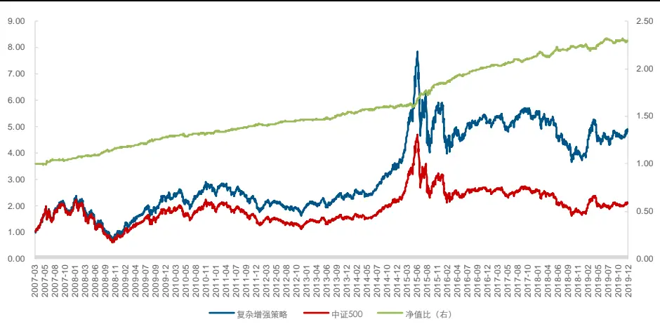
资料来源：Wind, 长江证券研究所

从历史表现看，复杂增强策略各项指标都有所提升，平均年化收益为 13.72%，超额中证 500 指数 7.39%，相对基准的最大回撤为 2.49%，收益回撤比为 2.97，信息比率为2.31，跟踪误差为2.84%。从分年表现看，策略同样在所有年份均跑赢了中证 500，且超额收益更显著，月度跑赢概率提高到 76.62%。

表 11：复杂增强策略分年表现

| 年份 | 绝对收益 | 超额收益 | 相对最大回撤 | 收益回撤比 | 信息比率 | 跟踪误差 | 月度超额胜率 |
| --- | --- | --- | --- | --- | --- | --- | --- |
| 2007 | 112.46% | 11.30% | 1.35% | 8.37 | 2.00 | 3.22% | 80.00% |
| 2008 | -56.48% | 4.32% | 1.08% | 4.00 | 3.24 | 3.20% | 91.67% |
| 2009 | 152.67% | 21.40% | 0.92% | 23.14 | 3.72 | 2.38% | 91.67% |
| 2010 | 13.68% | 3.61% | 1.68% | 2.15 | 1.15 | 2.74% | 66.67% |
| 2011 | -29.15% | 4.68% | 0.54% | 8.72 | 3.68 | 1.85% | 83.33% |
| 2012 | 3.61% | 3.33% | 0.55% | 6.05 | 2.01 | 1.60% | 58.33% |
| 2013 | 23.19% | 6.30% | 0.70% | 9.06 | 2.01 | 2.63% | 58.33% |
| 2014 | 43.70% | 4.69% | 1.21% | 3.89 | 1.22 | 2.62% | 58.33% |
| 2015 | 65.87% | 22.75% | 2.49% | 9.14 | 3.16 | 5.09% | 91.67% |
| 2016 | -10.10% | 7.67% | 0.71% | 10.86 | 4.50 | 2.06% | 100.00% |
| 2017 | 5.30% | 5.50% | 0.96% | 5.71 | 2.79 | 1.94% | 75.00% |
| 2018 | -29.80% | 3.52% | 1.84% | 1.91 | 1.78 | 2.84% | 75.00% |
| 2019 | 29.64% | 3.26% | 1.67% | 1.96 | 0.74 | 3.03% | 66.67% |
| 全部 | 13.72% | 7.39% | 2.49% | 2.97 | 2.31 | 2.84% | 76.62% |

资料来源：Wind, 长江证券研究所

复杂增强策略的负面组合与指数增强组合的净值比稳定向下，在所有年份均跑输了增强组合，平均每年跑输 24.28%。

图 22：复杂增强策略负面组合净值表现
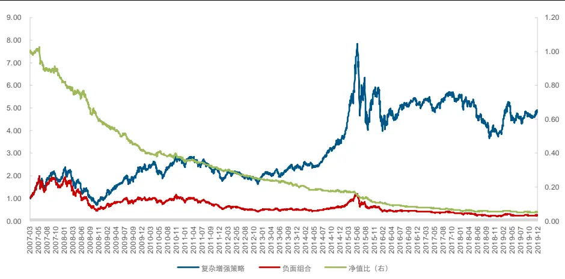
资料来源：Wind, 长江证券研究所

表 12：复杂增强策略负面组合年化收益

| 年份 | 负面组合 | 指数增强组合 | 负面Alpha |
| --- | --- | --- | --- |
| 2007 | 74.88% | 112.46% | -37.58% |
| 2008 | -69.66% | -56.48% | -13.18% |
| 2009 | 83.38% | 152.67% | -69.29% |
| 2010 | 1.30% | 13.68% | -12.38% |
| 2011 | -42.87% | -29.15% | -13.72% |
| 2012 | -14.70% | 3.61% | -18.31% |
| 2013 | 0.89% | 23.19% | -22.30% |
| 2014 | 27.14% | 43.70% | -16.56% |
| 2015 | -1.49% | 65.87% | -67.36% |
| 2016 | -31.75% | -10.10% | -21.65% |
| 2017 | -17.08% | 5.30% | -22.37% |
| 2018 | -40.14% | -29.80% | -10.34% |
| 2019 | 21.70% | 29.64% | -7.94% |
| 合计 | -10.56% | 13.72% | -24.28% |

资料来源：Wind, 长江证券研究所

表 13 为策略中各因子的入选总次数，流动性和波动率的入选频率最高，分别为 153 和134。

表 13：复杂增强策略因子入选频率

| 流动性 | 波动率 | 反转 | 价值 | 规模 | 成长 | 质量 |
| --- | --- | --- | --- | --- | --- | --- |
| 153 | 134 | 120 | 106 | 92 | 84 | 81 |

资料来源：Wind, 长江证券研究所

请阅读最后评级说明和重要声明

## 总结

## 1. 风格因子的空头组具有显著的负向超额

从 2007-02-01 至 2019-12-31的测算结果看，流动性、反转、波动率、成长、价值、规模和质量因子具有显著的负向超额收益，年化依次分别为 11.20%、10.08%、9.15%、6.87%、6.82%、5.82%和 5.75%。

## 2. 风格因子负面组合具有显著的负面Alpha

从 2007-02-01 至 2019-12-31的测算结果看，流动性、反转、波动率、价值、成长、质量和规模因子的负面组合相对于中证 500 指数增强组合具有显著的负面 Alpha，年化依次分别为 17.19%、16.60%、15.38%、10.63%、9.86%、8.78%和 8.70%。

## 3. 指数增强策略

从中证 500 的回测结果来看，复杂增强策略每年都跑赢了指数，且超额收益更显著。策略平均年化收益为 13.72%，超额中证 500 指数 7.39%，相对基准的最大回撤为 2.49%，收益回撤比为 2.97，信息比率为 2.31，跟踪误差为2.84%，月度跑赢概率为 76.62%，合成因子的负面 Alpha 高达 24.28%。

## 投资评级说明

| 行业评级 | 报告发布日后的12个月内行业股票指数的涨跌幅相对同期相关证券市场代表性指数的涨跌幅为基准，投资建议的评级 |  |
| --- | --- | --- |
|  | 标准为： |  |
|  | 看 好： | 相对表现优于同期相关证券市场代表性指数 |
|  | 中 性： | 相对表现与同期相关证券市场代表性指数持平 |
|  | 看 淡： | 相对表现弱于同期相关证券市场代表性指数 |
| 公司评级 |  | 报告发布日后的12个月内公司的涨跌幅相对同期相关证券市场代表性指数的涨跌幅为基准，投资建议的评级标准为： |
|  | 买 入： | 相对同期相关证券市场代表性指数涨幅大于10% |
|  | 增 持： | 相对同期相关证券市场代表性指数涨幅在5%～10%之间 |
|  | 中 性： | 相对同期相关证券市场代表性指数涨幅在-5%～5%之间 |
|  | 减 持： | 相对同期相关证券市场代表性指数涨幅小于-5% |
| 我们无法给出明确的投资评级。 |  | 无投资评级：由于我们无法获取必要的资料，或者公司面临无法预见结果的重大不确定性事件，或者其他原因，致使 |
| 相关证券市场代表性指数说明：A股市场以沪深300指数为基准；新三板市场以三板成指（针对协议转让标的）或三板做市指数（针 |  |  |
| 对做市转让标的）为基准；香港市场以恒生指数为基准。 |  |  |

## 联系我们

浦东新区世纪大道 1198 号世纪汇广场一座 29 层（200122）

## 分析师声明

作者具有中国证券业协会授予的证券投资咨询执业资格并注册为证券分析师，以勤勉的职业态度，独立、客观地出具本报告。分析逻辑基于作者的职业理解，本报告清晰准确地反映了作者的研究观点。作者所得报酬的任何部分不曾与，不与，也不将与本报告中的具体推荐意见或观点而有直接或间接联系，特此声明。

## 重要声明

长江证券股份有限公司具有证券投资咨询业务资格，经营证券业务许可证编号：10060000。

本报告仅限中国大陆地区发行，仅供长江证券股份有限公司（以下简称：本公司）的客户使用。本公司不会因接收人收到本报告而视其为客户。本报告的信息均来源于公开资料，本公司对这些信息的准确性和完整性不作任何保证，也不保证所包含信息和建议不发生任何变更。本公司已力求报告内容的客观、公正，但文中的观点、结论和建议仅供参考，不包含作者对证券价格涨跌或市场走势的确定性判断。报告中的信息或意见并不构成所述证券的买卖出价或征价，投资者据此做出的任何投资决策与本公司和作者无关。

本报告所载的资料、意见及推测仅反映本公司于发布本报告当日的判断，本报告所指的证券或投资标的的价格、价值及投资收入可升可跌，过往表现不应作为日后的表现依据；在不同时期，本公司可以发出其他与本报告所载信息不一致及有不同结论的报告；本报告所反映研究人员的不同观点、见解及分析方法，并不代表本公司或其他附属机构的立场；本公司不保证本报告所含信息保持在最新状态。同时，本公司对本报告所含信息可在不发出通知的情形下做出修改，投资者应当自行关注相应的更新或修改。

本公司及作者在自身所知情范围内，与本报告中所评价或推荐的证券不存在法律法规要求披露或采取限制、静默措施的利益冲突。

本报告版权仅为本公司所有，未经书面许可，任何机构和个人不得以任何形式翻版、复制和发布。如引用须注明出处为长江证券研究所，且不得对本报告进行有悖原意的引用、删节和修改。刊载或者转发本证券研究报告或者摘要的，应当注明本报告的发布人和发布日期，提示使用证券研究报告的风险。未经授权刊载或者转发本报告的，本公司将保留向其追究法律责任的权利。

“慧博资讯”专业的投资研究大数据分享平台