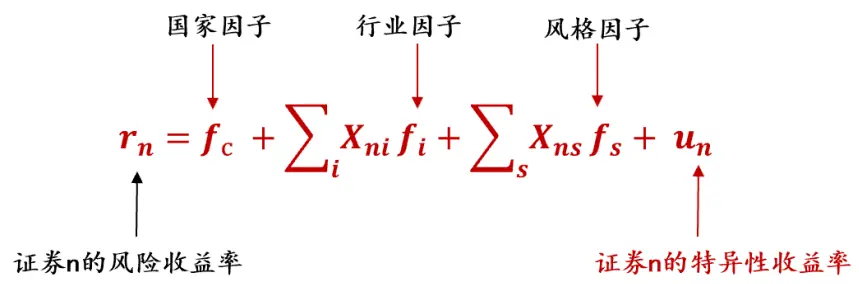
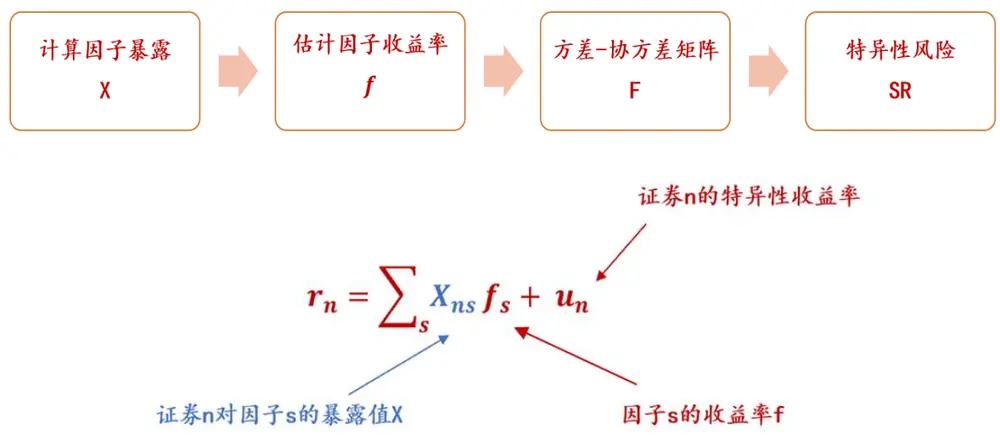
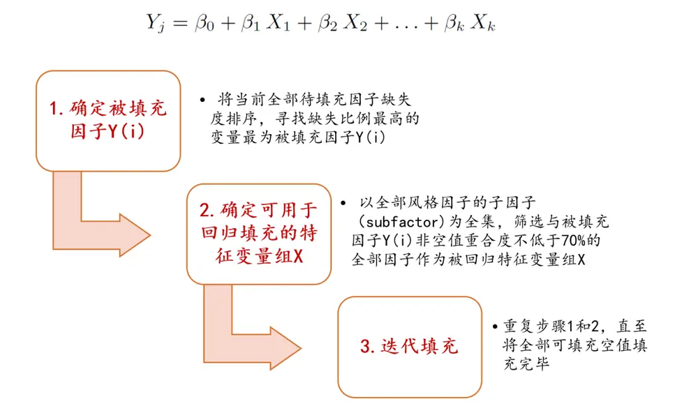
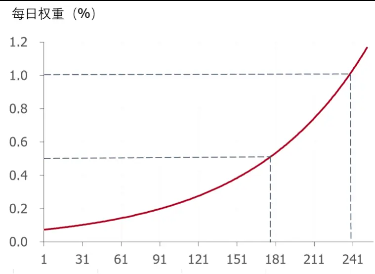

金融工程研究 | 证券研究报告 — 点评报告

2020 年 11 月 3 日

# 有 关 Barra 中 国 权 益CNE5 模型的思考（上）

## 相关研究报告

《基于沪深 300“规模效应”的指数增强策略》

中银国际证券股份有限公司

具备证券投资咨询业务资格

金融工程研究

[证 券分 析师 ：Table_Analyser] 郭军

(8610)66229055

gao.xu@bocichina.com

证券投资咨询业务证书编号：S1300519050002

联系人：郭策

(8610)66229239

ce.guo@bocichina.com

一般证券业务证书编号：S1300120080023

量化权益投资系列报告（二）

- Barra的核心应用领域可以归纳为两部分：第一部分是对投资组合波动率的预测。第二部分是基于 Barra构建的各类因子对组合收益来源和投资风格进行判定。该功能目前广泛应用于国内资产管理公司的资产配置部门和风险管理部门。另外，Barra构建的各类风格因子也为量化投资者开发与测试新因子策略提供了参考基准。

- Barra 的理论基础为多因子模型。Barra 认为证券的收益率可以部分被一些共同因子解释，而不能解释的部分被定义为特异性收益率。Barra 和Fama因子模型的内在联系为 Fama模型的因子收益率是多空组合的“真实收益率”，而 Barra的收益率为因子多空组合的“预期收益率”。

- Barra模型的重难点可以概括为两大类：一是因子数据清洗，如异常值的识别与处理及空值的填补方法，二是风格因子计算方法中一些细节的处理，如半衰期，中性化等方法。关于风格因子的详细计算明细请参考本报告附录。

- 下篇预告: 在下篇《关于 Barra CNE5中国股市模型的思考（下）》中，我们将重点针对 CNE5 在 A 股市场应用的局限性和改良方案进行提示，并尝试回答 CNE5在中国市场的运行情况如何？ MSCI在 2018年将 CNE5升级为 CNE6的核心逻辑是什么？

风险提示：疫情超预期、政策收紧、贸易摩擦升级等带来的市场大幅度波动风险以及策略失效风险。

## 一、BARRA历史回顾与思考

1974年，美国学者 BarrRosenberg提出了采用多因子风险模型对投资组合的风险和收益进行分析的方法。1975起，Barra成立了自己的公司，针对不同的国家（典型如美国、欧洲、日本、德国、中国等）、不同类型的市场（如发达市场、发展中市场、新兴市场等）在接下来近 50年间陆续发布与更新了多个 Barra模型版本。期间 Barra公司被 MSCI收购， Barra模型也进一步被推广并广泛应用于各类投资者的实际业务中。

Barra 的核心应用领域可以归纳为两部分：第一部分是对投资组合波动率的预测。该部分是 Barra 在发达国家机构投资者中最为常用的部分；Barra模型预测的波动率常作为大类资产配置模型，交易拆单等模型的基准输入参数，为投资经理和交易员的实际操作提供指导与参考。第二部分是基于 Barra构建的各类因子，用于对组合收益来源和投资风格进行判定。该功能目前被广泛应用于国内资产管理公司的资产配置部门和风险管理部门。另外，Barra构建的各类风格因子也为量化投资者在多因子选股领域提供了广泛的参考，将新开发的量化策略进行 Barra 归因已成为检测是否能够产生新 alpha的业界常用标准。

2012年 6月，Barra发布了 CNE5版本，此版本目前被中国的机构投资者广泛使用。在 2018年 8月，MSCI公布了最新的中国权益市场风险模型 CNE6。与 CNE5相比，CNE6模型无论在因子数量还是因子构成上都进行了一定程度的调整。

目前市场上有关 Barra 的理论框架、美国 USE4 和中国 CNE5 等模型版本已经有了比较全面的解读，因此本文将重点讨论如下两个部分：

第一部分是针对 CNE5 的核心框架的介绍，以及 Barra 与 Fama 因子模型内在联系的思考；

第二部分是针对官方文档中未做出详细描述的技术细节进行深度解读；

在本文的附录中，中银量化团队对复制 CNE5十个风格因子进行了详细梳理。

在这里我们做一个预告，在《关于 Barra CNE5中国股市模型的思考（下）》中我们将重点针对 CNE5在 A股市场应用的局限性和潜在改良方案进行提示；并尝试回答一个问题：“MSCI官方在 2018年将CNE5版本升级为 CNE6的核心原因是什么？”

## 二、BARRA模型体系详解

## （一） Barra 多因子模型介绍

Barra的理论基础为多因子模型。Barra认为证券的收益率可以部分被一些共同因子解释，不能解释的部分被定义为特异性收益率，该部分收益率与共同因子为正交关系，即无相关性。 Barra CNE5 定义的共同因子主要分为三大类：国家因子、行业因子和风格因子。

其中国家因子可理解为是一个近似全市场规模加权的组合，它是一个纯多头组合；

行业因子的纯因子投资组合是一个多空组合。针对特定的行业因子，它的本质是 100%最多该行业，并 100%做空国家因子（即市场组合）。因此从逻辑上解释，如果某行业因子的收益率为正，则说明该行业可以跑赢市场组合，即可以获得超额收益；

风格纯因子组合本质也是一个多空组合。针对特定的投资组合，我们做多该风格因子暴露度较大的前 50%的股票，做空该风格因子暴露度较小的后 50%股票。对于一个纯风格因子投资组合，该组合对该风格因子的暴露度为 100%，但对其他风格因子、国家因子以及其他行业因子的暴露度均为 0。因此，如果我们看多某个风格因子，只需要持有这些因子的纯因子组合，而获得暴露于该因子的超额收益。

## 图表 1. Barra CNE5 多因子模型框架

Barra多因子模型

Barra针对行业因子的约束条件

$$
\sum_{i}X_{ni}=1\quad\sum_{i}w_{i}{\pmb f}_{i}={\pmb0}.
$$

, MSCI Barra CNE5

理解 Barra因子，首先要清晰地区分两个概念：因子暴露度和因子收益率。因子的暴露度可近似理解为所关注的特定股票的指标，比如针对贵州茅台，由于它属于食品饮料行业，因此贵州茅台股票对“食品饮料”行业的行业因子暴露度为 1，对其他行业的行业因子暴露度为 $0_{\circ}$ 进一步，如果市净率是一个我们关注的因子，如果我们知道贵州茅台某时点的市净率为 p，以及该时间点全市场股票的市净率的平均值 u和标准差 sigma，那么我们就可以使用类似 ZScore标准化数据的方式计算得到贵州茅台对于“市净率风格”的因子暴露度X：

$$
X={\frac{\mathtt{p}-u}{\sigma}}
$$

因子收益率 f 则是通过截面回归得到的，它代表的是因子的“预期收益率”。之所以说 Barra 因子收益率是预期收益率，是因为作为回归的系数，其本质就是计量估计的参数期望值。其中，回归方程的被解释变量为全市场各个股票的当期（如当日，当周，当月）收益率，而解释变量为在期初可获取的因子暴露度 X。通过截面回归得到的 beta系数即为所估计的因子收益率 f，而回归的残差即为股票的“特异性收益率”。

图表 2. Barra CNE5 多因子收益率估计框架

, MSCI Barra CNE5

## （二） 有关 Barra 模型与 Fama 多因子模型比较与探讨

在多因子模型理论中， FAMA 三因子模型也是一个学术界和行业内都非常知名的多因子模型， 那么一个非常直接的问题是：Fama 三因子模型与 Barra 多因子模型的本质异同是什么？

Fama三因子模型是基于 CAMP单市场因子模型的拓展模型。Fama模型认为一个投资组合（包括单个股票）的超额回报率可由它对三个因子的暴露来解释，这三个因子是：市场资产组合（Rm− Rf）、市值因子（SMB）、账面市值比因子（HML）。

Fama 的因子收益率为真实多空组合收益率，其中市值因子（SMB）和账面市值比因子（HML）的计算需要先根据流通市值将股票分为 1：1的大市值（B）和小市值（S）股票；根据 BM数据将股票分为 1：1：1 的高中低（H/M/L）三组；这样我们就有了 2×3 共计 6 种投资组合（SL/SM/SH/BL/BM/BH）;最后通过市值加权的方式计算 SMB 和 HML 组合的多空收益率以作为因子收益率，具体公式如下。

图表 3. Fama 三因子模型框架

$$
E(R_{it})-R_{ft}=b_i[E(R_{mt})-R_{ft}]+s_iE(SMB_t)+h_iE(HML_t)
$$

FAMA因子构建方法

$$
\begin{aligned}{\mathit{SMB}_{t}}&{{}=\frac{1}{3}(\mathit{SL}_{t}+\mathit{SM}_{t}+\mathit{SH}_{t})-\frac{1}{3}(\mathit{BL}_{t}+\mathit{BM}_{t}+\mathit{BH}_{t})}\\{}&{{}\mathit{HML}_{t}=\frac{1}{2}(\mathit{SH}_{t}+\mathit{BH}_{t})-\frac{1}{2}(\mathit{SL}_{t}+\mathit{BL}_{t})}\\\end{aligned}
$$

, MSCI Barra CNE5

回顾 Fama三因子模型的构建方法论，可知 Barra和 Fama因子模型内在联系为：Fama模型的因子收益率是多空组合的“真实收益率”，而 Barra的收益率为因子多空组合的“预期收益率”。换句话说：如果假设Fama选取了同Barra一样的因子种类，那么两个模型对应的因子收益率也是不同的，但Fama对应的真实因子收益率的预期值应该与 Barra回归估计的因子收益率值相等。

这里我们再次对 Barra模型中关于因子暴露度 X的计算公式进行思考： 类似 ZScore变换的暴露度计算公式其目的并不仅仅是对因子进行标准化与归一化处理，该方法更重要的作用是通过剔除均值的方式构建一个“预期多空暴露度”为 0 的中性组合，进而能保证估计出的因子预期回报率代表的是一个因子多空中性组合。而将因子暴露的的波动率统一调整为 1 是为了保证各个因子的预期收益率在估计量级上处于同一维度，进而方便对各因子的收益率进行横向观察与比较。

## 三、BARRA重难点技术解读

Barra模型的重难点可以概括为两大类：一是因子数据清洗，如异常值的识别与处理以及空值填补的方法，二是风格因子计算方法中的一些细节处理，如半衰期，中性化等方法。这里我们提示读者，关于 CNE5 的十类风格因子计算方法明细，请参考《附录：BARRA 风格因子计算方法》。

## （一） Barra异常值排查与调整

Barra对异常值的排查与处理主要是针对因子暴露度的计算。在较早期的模型版本中，Barra采用的是“截断缩尾”的方法：即针对截面数据，若某因子暴露度处在“样本内个股暴露度均值加（减）3倍标准差”之外，则该因子暴露度即被判定为异常值，具体处理方法为将该极大（极小）异常值替换为“暴露度均值加（减）3倍标准差”。

CNE5版本基本延用了美国USE4版本的方法论。在USE4文档中有关异常值排查与处理的方法说明为：“我们应用了多步骤算法去识别和处理极值。该算法将观测值分为 3 大类，第一类观测值被判定为潜在错值，被剔除样本；第二类观测值为“超过均值 3 倍标准差”之外的极大或极小值，处理方法为将原值替换为“样本均值加（减）3倍标准差”；第三类数值为处于“样本均值加减 3倍标准差”之内的观测值，它们被判定为正常值，不需要做处理。

上述方法主要有两个局限性：1）如何判断该值是否为“潜在错值”，USE4官方文档并未明确说明，因此在实践复制中存在一定模糊性；2）传统的“截断缩尾”方法可能存在一个问题，比如将 5倍标准差之外的数值与 3.5倍标准差之外的数值统一替换为“均值加减 3倍标准差”，该处理方式会打破原始观测值的相对排名，在一定程度上破坏了部分原始数据信息。

基于上述两点局限性，我们推荐 2009年发布的欧洲 EUE3版本中有关异常值的处理方法：该方法在处理异常值时同时保留了原始数据的相对排名不变，更好地保存了原始数据的信息。具体计算方法如下图。

图表 4. Barra EUE3 异常值处理方法

$$
\tilde{X}_{nk}^{(std)}=\left\{\begin{aligned}3\cdot\left(1-s_{(+)}\right)+X_{nk}^{(std)}\cdot s_{(+)}\quad&;&X_{nk}^{(std)}>3\\X_{nk}^{(std)}\quad&;&\cdot3\leq X_{nk}^{(std)}\leq3\\-3\cdot\left(1-s_{(-)}\right)+X_{nk}^{(std)}\cdot s_{(-)}\quad&;&X_{nk}^{(std)}<-3\end{aligned}\right.
$$

$$
s_{(+)}=\max\left[0,\min\left[1,\frac{0.5}{\max\left(X_{nk}^{(std)}\right)-3}\right]\right]
$$

注： $X_{nk}^{(std)}$ 为根据 ZScore方法计算的标准化因子暴露度。

, MSCI Barra EUE3

通过上述方法调整，所有超过 3倍标准差的异常值在保留原值相对大小排名的前提下被调整至 3倍到 3.5倍标准差之间。

中银量化团队自主构建与优化的 CNE5版本时采用的为上述 EUE3异常值处理方法。

## （二） Barra 空值处理方法

Barra 在 USE4 文档中关于空值处理方法的介绍相对模糊，例如“如果因子暴露度出现缺失，那么因子暴露度将通过数据填充算法（data-replacement algorithm）补全。我们利用非空因子暴露度对一组因子的回归所获得的参数来估计因子缺失值。这样做的逻辑是因为具有一定相似度的股票（如同行业或相近市值）具有相似的因子暴露度的可能性较大”。

我们认为，Barra 这里面的数据填充算法（data-replacement algorithm）应该是多重填补法（MultipleImputation）。这里我们先提示一下数据缺失的两种常见的模式：随机数据缺失和非随机数据缺失模式。针对随机数据缺失模式，我们可以简单使用样本的均值或中位数进行填充；但针对非随机数据缺失模式，均值或中位数填充的模式则会导致估计有偏。

举几个简单的例子：比如男性偏好对个人收入持保密态度，女性对个人年龄数据持保密态度，因此当这些数据缺失时，往往是具有一定特征偏好。如果简单用群体的平均值或中位数进行填补，很可能人为扭曲了数据的分布，导致估计结果出现一定的高估或低估。Barra所建议的方法本质是通过股票其他特征的交叉验证来估计一个最可能的值。

中银量化团队采用的多重填补法具体算法如下：

图表 5. 多重填补法填补因子空值框架图

资料来源：万得，中银证券

## （三） Barra 风格因子半衰期的计算

Barra CNE5文档公布的十个风格因子收益率的计算方法显示，很多因子在估算时需要考虑因子的半衰期（half -life）这一参数。以 Beta因子为例：股票超额收益日序列和市值加权指数超额收益日序列的回归系数，表示股票相对于指数涨跌的弹性大小，计算如下:

$$
r_{t}-r_{ft}=\alpha+\beta R_{t}+e_{t}
$$

其中 rf是无风险收益日序列， rt 是股票收益日序列， Rt是市值加权指数（如中证全指、万德全 A指数）超额收益日序列，回归系数采取过去滚动 252 交易日的收益数据，半衰期为 63 个交易日。

那么这个半衰期具体含义是什么呢？半衰期的作用是赋予近期观测值更高的权重，随着时间的远离，观测值权重随时间呈指数递减趋势，且当某交易日距离当前日期的时间间隔为“半衰期”个交易日时，该日观测值的权重为当前日期 T权重的一半，具体表示为数学公式形式为：

$$
w({\pmb t})={\pmb\delta}^{{\pmb T}-{\pmb t}}
$$

其中 t反映的是过去某交易日距最新交易日 T的日期间隔为 t，因此 w(0)代表最新时间 T的权重，w(T)代表最初时间（t= 0）的权重。根据半衰期的定义可知：

$$
\mathrm{w}(T-halflife)=0.5w(T)
$$

$$
\delta=\;0.5^{\frac{1}{half\;life}}
$$

即可求得：

在实践过程中，通过给定的观察期窗口（如 252个交易日）和半衰期时长（如 63个交易日）即可推算 w（t），最后再对其进行归一化处理，即统一除以观察窗口期的权重之和以保证各日权重之和为 1。

图表 6即为基于上述参数计算得到的每日权重。

图表 6. 权重设定按列（观察窗口为 252个交易日，半衰期为 63日）

资料来源：万得，中银证券

## （四） 关于因子中性化处理方法

Barra在构建风格因子时会要求对一些因子进行市值或 Beta中性化处理。因子中性化处理的核心目的是减少该因子与市值因子和 Beta因子的共线性，使得通过回归方式估计的因子回报率更加稳健。具体来看，中性化的处理方法是 OLS回归法，其中被回归变量为经过标准化后的因子暴露度 f(i) ，回归变量为标准化后市值暴露度 f(size)和 beta因子暴露度 f(beta)。回归后的残差 e(i) 即为市值或 Beta中性化的结果，再将该残差进行 ZScore 标准化即可。

$$
\boldsymbol{f}_{i}=\boldsymbol{x}_{1}\cdot\boldsymbol{f}_{size}+\boldsymbol{x}_{2}\cdot\boldsymbol{f}_{beta}+\boldsymbol{e}_{i}
$$

## 四、风险提示

投资者需关注疫情超预期、政策收紧、贸易摩擦升级等带来的市场风险以及策略失效风险。

## 五、附录：BARRA风格因子计算方法

图表 7. BARRA风格因子计算方法

| 序号 | 一级因子 | 二级因子 | 权重 | 说明 | 因子定义 |
| --- | --- | --- | --- | --- | --- |
| 1 | Size | LNCAP | 1 | 规模 | 市值的自然对数 |
| 2 | Beta | BETA | 1 | 贝塔 | 为股票超额收益日序列和市值加权指数超额收益日序列进行WLS的回归系数，beta表示股票相对于指数涨跌的弹性大小，计算如下： $r_{t}-r_{ft}=\alpha+\beta R_{t}+e_{t}$ 其中rf是无风险收益日序列，rt是股票收益日序列，Rt是市值加权指数（如中证全指、万德全A指数）超额收益日序列，回归系数采取过去252交易日的收益数据，回归权重采用指数加权移动平均，半衰期为63个交易日 |
| 3 | Momentum | RSTR | 1 | 动量 | 此动量为长期动量减去短期动量，采用指数加权移动平均方法，其中长期动量周期T = 504，短期动量周期L = 21，rf是无风险收益，w(i)是指数加权权重，半衰期为126个交易日 $rstr=\sum_{t=L}^{T+L}w_{t}ln(1+r_{t})-\sum_{t=L}^{T+L}w_{t}ln(1+r_{ft})$ |
| 4 | ResidualVolatility | DASTD | 0.74 | 超额收益年化波动 | 是过去252个交易日日超额收益率波动率，按照指数加权权重，半衰期为42个交易日 $dastd=\frac{1}{n}\sum_{t=1}^{n}w_{t}(r_{et}-\bar{r_{e}})^{2}$ |
|  |  | CMRA | 0.16 | 年度超额收益率离差 | CMRA是过去12个月超额收益的离差，也是表征股票收益率的波动大小，Z(T)是过去T个月超额收益对数值得累计值，Z(T)是一个时间序列，T =1,2,3， …，12 $Z(T)=\sum_{t=1}^{T}\left[ln(1+r_{t})-ln(1+r_{ft})\right]$ $crma=ln(1+Zmax)-ln(1+Zmin)$ 注：由于实际计算时可能出现 Zmax < -1或 Zmin < -1导致无法进行Iog计算，因此实际测算采用CMRA = Zmax - Zmin进行调整 |
|  |  | HSIGMA | 0.1 | Beta回归残差年化波动率 | hsigma是计算beta收益之时的残差收益率的波动率，表示股票不能被beta所解释部分收益的波动率，数据为过去252个交易日，按照指数加权权重，半衰期为63个交易日 $\mathit{hsigma}=\mathit{std}(e_{t})$ HSIGMA因子要和BETA因子和SIZE因子做回归，去除其共线性关系 |
| N5 | on-linearSize | NLSIZE | 1 | 非线性因子 | NLSIZE为SIZE因子的立方，之后将结果和SIZE因子回归取残差去除其和SIZE因子的共线性，残差值再进行缩尾处理(winsorized)和标准化(standardized) |
| 6 | Book-to-Price | BTOP | 1 | 账面市值比 | 就是上个季报公司普通股权账面价值（就是净资产）除以公司当前的市值 |
| 7 | LIQUIDITY | STOMSTOQSTOA | 0.350.350.3 | 月度换手率季度换手率年度换手率 | STOM是最近一个月的换收率和的对数值，Vt是t日的交易量，St是t日的流通股本 $stom=ln(\sum_{t=1}^{21}\frac{V_{t}}{S_{t}})$ STOM是季度换收率STOA是年度换收率 |
| 8 | EarningsYield | EPFWD | 0.68 | 盈利预期 | EPFWD是预期盈利市值比，预期盈利采用的是分析师对未来12个月预期盈利加权平均值 |
|  |  | CETOP | 0.21 | 现金流量比 | CETOP是现金流量市值比，现金流量是过去12月的历史数据值 |
|  |  | ETOP | 0.11 | 历史盈利市值比 | ETOP是盈利市值比，盈利是过去12月的历史数据(就是pe_ttm的倒数值) |
| 9 | Growth | EGRLF | 0.18 | 长期利润率预期 | EGRLF是未来3-5年分析师预期盈利增长率 |
|  |  | EGRSF | 0.11 | 短期净利润预期 | EGRSF是未来1年分析师预期盈利增长率 |
|  |  | EGRO | 0.24 | 长期历史净利率 | EGR0是过去5年盈利增长率（采用回归方法），即使用最近5个财政年度的净利润额对时间的回归的斜率值，除以年平均净利润 |
|  |  | SGRO | 0.47 | 长期历史销售率 | SGR0是过去5年营业收入增长率(采用回归法)，即使用最近5个财政年度的营业收入对时间的回归的斜率值，除以年平均营业收入 |
| 10 | Leverage | MLEV | 0.38 | 市场杠杆 | me是普通股市值，pe是优先股账面价值，Id是长期负债账面价值 $mlev=\frac{me+pe+ld}{me}$ |
|  |  | DTOA | 0.35 | 资产负债比 | td是总负债账面价值，ta是总资产账面价值 $dtoa=\frac{td}{ta}$ |
|  |  | BLEV | 0.27 | 账面杠杆 | be是普通股账面价值，pe是优先股账面价值，Id是长期负债账面价值 $blev=\frac{be+pe+ld}{be}$ |

Barra CNE5

## 披露声明

本报告准确表述了证券分析师的个人观点。该证券分析师声明，本人未在公司内、外部机构兼任有损本人独立性与客观性的其他职务，没有担任本报告评论的上市公司的董事、监事或高级管理人员；也不拥有与该上市公司有关的任何财务权益；本报告评论的上市公司或其它第三方都没有或没有承诺向本人提供与本报告有关的任何补偿或其它利益。

中银国际证券股份有限公司同时声明，将通过公司网站披露本公司授权公众媒体及其他机构刊载或者转发证券研究报告有关情况。如有投资者于未经授权的公众媒体看到或从其他机构获得本研究报告的，请慎重使用所获得的研究报告，以防止被误导，中银国际证券股份有限公司不对其报告理解和使用承担任何责任。

## 评级体系说明

以报告发布日后公司股价/行业指数涨跌幅相对同期相关市场指数的涨跌幅的表现为基准：

## 公司投资评级：

买 入：预计该公司股价在未来 6 个月内超越基准指数 20%以上；

持：预计该公司股价在未来 6个月内超越基准指数 10%-20%；

中 性：预计该公司股价在未来 6 个月内相对基准指数变动幅度在-10%-10%之间；

减 持：预计该公司股价在未来 6个月内相对基准指数跌幅在 10%以上；

未有评级：因无法获取必要的资料或者其他原因，未能给出明确的投资评级。

## 行业投资评级：

强于大市：预计该行业指数在未来 6个月内表现强于基准指数；

中 性：预计该行业指数在未来 6 个月内表现基本与基准指数持平；

弱于大市：预计该行业指数在未来 6个月内表现弱于基准指数。

未有评级：因无法获取必要的资料或者其他原因，未能给出明确的投资评级。

沪深市场基准指数为沪深 300指数；新三板市场基准指数为三板成指或三板做市指数；香港市场基准指数为恒生指数或恒生中国企业指数；美股市场基准指数为纳斯达克综合指数或标普 500指数。

## 风险提示及免责声明

本报告由中银国际证券股份有限公司证券分析师撰写并向特定客户发布。

本报告发布的特定客户包括：1) 基金、保险、QFII、QDII 等能够充分理解证券研究报告，具备专业信息处理能力的中银国际证券股份有限公司的机构客户；2) 中银国际证券股份有限公司的证券投资顾问服务团队，其可参考使用本报告。中银国际证券股份有限公司的证券投资顾问服务团队可能以本报告为基础，整合形成证券投资顾问服务建议或产品，提供给接受其证券投资顾问服务的客户。

中银国际证券股份有限公司不以任何方式或渠道向除上述特定客户外的公司个人客户提供本报告。中银国际证券股份有限公司的个人客户从任何外部渠道获得本报告的，亦不应直接依据所获得的研究报告作出投资决策；需充分咨询证券投资顾问意见，独立作出投资决策。中银国际证券股份有限公司不承担由此产生的任何责任及损失等。

本报告内含保密信息，仅供收件人使用。阁下作为收件人，不得出于任何目的直接或间接复制、派发或转发此报告全部或部分内容予任何其他人，或将此报告全部或部分内容发表。如发现本研究报告被私自刊载或转发的，中银国际证券股份有限公司将及时采取维权措施，追究有关媒体或者机构的责任。所有本报告内使用的商标、服务标记及标记均为中银国际证券股份有限公司或其附属及关联公司（统称“中银国际集团”）的商标、服务标记、注册商标或注册服务标记。

本报告及其所载的任何信息、材料或内容只提供给阁下作参考之用，并未考虑到任何特别的投资目的、财务状况或特殊需要，不能成为或被视为出售或购买或认购证券或其它金融票据的要约或邀请，亦不构成任何合约或承诺的基础。中银国际证券股份有限公司不能确保本报告中提及的投资产品适合任何特定投资者。本报告的内容不构成对任何人的投资建议，阁下不会因为收到本报告而成为中银国际集团的客户。阁下收到或阅读本报告须在承诺购买任何报告中所指之投资产品之前，就该投资产品的适合性，包括阁下的特殊投资目的、财务状况及其特别需要寻求阁下相关投资顾问的意见。

尽管本报告所载资料的来源及观点都是中银国际证券股份有限公司及其证券分析师从相信可靠的来源取得或达到，但撰写本报告的证券分析师或中银国际集团的任何成员及其董事、高管、员工或其他任何个人（包括其关联方）都不能保证它们的准确性或完整性。除非法律或规则规定必须承担的责任外，中银国际集团任何成员不对使用本报告的材料而引致的损失负任何责任。本报告对其中所包含的或讨论的信息或意见的准确性、完整性或公平性不作任何明示或暗示的声明或保证。阁下不应单纯依靠本报告而取代个人的独立判断。本报告仅反映证券分析师在撰写本报告时的设想、见解及分析方法。中银国际集团成员可发布其它与本报告所载资料不一致及有不同结论的报告，亦有可能采取与本报告观点不同的投资策略。为免生疑问，本报告所载的观点并不代表中银国际集团成员的立场。

本报告可能附载其它网站的地址或超级链接。对于本报告可能涉及到中银国际集团本身网站以外的资料，中银国际集团未有参阅有关网站，也不对它们的内容负责。提供这些地址或超级链接（包括连接到中银国际集团网站的地址及超级链接）的目的，纯粹为了阁下的方便及参考，连结网站的内容不构成本报告的任何部份。阁下须承担浏览这些网站的风险。

本报告所载的资料、意见及推测仅基于现状，不构成任何保证，可随时更改，毋须提前通知。本报告不构成投资、法律、会计或税务建议或保证任何投资或策略适用于阁下个别情况。本报告不能作为阁下私人投资的建议。

过往的表现不能被视作将来表现的指示或保证，也不能代表或对将来表现做出任何明示或暗示的保障。本报告所载的资料、意见及预测只是反映证券分析师在本报告所载日期的判断，可随时更改。本报告中涉及证券或金融工具的价格、价值及收入可能出现上升或下跌。

部分投资可能不会轻易变现，可能在出售或变现投资时存在难度。同样，阁下获得有关投资的价值或风险的可靠信息也存在困难。本报告中包含或涉及的投资及服务可能未必适合阁下。如上所述，阁下须在做出任何投资决策之前，包括买卖本报告涉及的任何证券，寻求阁下相关投资顾问的意见。

中银国际证券股份有限公司及其附属及关联公司版权所有。保留一切权利。

## 中银国际证券股份有限公司

中国上海浦东

银城中路 200 号

中银大厦 39 楼

邮编 200121

电话: (8621) 6860 4866

传真: (8621) 5888 3554

## 相关关联机构：

## 中银国际研究有限公司

香港花园道一号

中银大厦二十楼

电话:(852) 3988 6333

致电香港免费电话:

中国网通 10 省市客户请拨打：10800 8521065

中国电信 21 省市客户请拨打：10800 1521065

新加坡客户请拨打：800 852 3392

传真:(852) 2147 9513

## 中银国际证券有限公司

香港花园道一号

中银大厦二十楼

电话:(852) 3988 6333

传真:(852) 2147 9513

## 中银国际控股有限公司北京代表处

中国北京市西城区

西单北大街 110 号 8 层

邮编:100032

电话: (8610) 8326 2000

传真: (8610) 8326 2291

## 中银国际(英国)有限公司

2/F, 1 Lothbury

London EC2R 7DB

United Kingdom

电话: (4420) 3651 8888

传真: (4420) 3651 8877

## 中银国际(美国)有限公司

美国纽约市美国大道 1045 号

7 Bryant Park 15 楼

NY 10018

电话: (1) 212 259 0888

传真: (1) 212 259 0889

## 中银国际(新加坡)有限公司

注册编号 199303046Z

新加坡百得利路四号

中国银行大厦四楼(049908)

电话: (65) 6692 6829 / 6534 5587

传真: (65) 6534 3996 / 6532 3371