金融工程研究 | 证券研究报告 — 点评报告

2020 年 11 月 10 日

## 相关研究报告

《基于沪深 300“规模效应”的指数增强策略》《有关 Barra 中国权益 CNE5 模型的思考（上）》

中银国际证券股份有限公司

具备证券投资咨询业务资格

# 有关 Barra 中国权益 CNE5模型的思考（下）

金融工程研究

[证 券分 析师 ： Table_Analyser] 郭军

(8610)66229055

gao.xu@bocichina.com

证券投资咨询业务证书编号：S1300519050002

联系人：郭策

(8610)66229239

ce.guo@bocichina.com

一般证券业务证书编号：S1300120080023

量化权益投资系列报告（三）

Table_Sum•Barra CNE5局限性主要有两点：局限一是行业因子并不完全适用于 A股市场的分析习惯。即 CNE5模型采用的是 GICS国际行业划分标准，而 A股市场从长周期角度考量，中信行业分类更为合理；局限二是 Barra计算因子收益率的股票池应该根据分析特定的分析对象群而进行调整。因为各机构投资风格、各类型产品的投资限制不同，各家机构的股票可选池差异很大，分析不同类型组合采用同样的因子库可能会导致结论出现一定偏差。

- 中银 CNE5 因子表现与 MSCI Barra CNE5 表现结果相似。基于 Barra 官方文档针对行业与风格因子解释度显著性、解释度稳健性、因子共线性以及整体解释能力等维度，我们对中银研发的 CNE5 模型表现与原官方文档表现进行了对比，虽然俩者在时间维度上并不完全一致，但对比结果显示，中银 CNE5模型在各维度均达到预期，表现不输官方模型。

- CNE5模型自 2013年起对 A股的解释力持续下降，其解释力在熊市中大概率优于牛市：2013 年个股表现分化加剧是导致 CNE5 因子解释力中枢下行的重要原因， CNE5 的模型解释力的周期性上升与下降趋势与个股离散度的增减呈现显著的正相关性。在市场趋势性上涨区间，并不是所有股票都会整体上涨，因此个股相关性反而会趋势性减弱，但在熊市中，由于投资者避险与恐慌情绪快速升温，常出现各股齐跌的现象，在熊市中个股相关性快速增长，离散度 Rho 中枢上行。这也解释了 CNE5 模型在熊市的表现会有较大概率优于牛市。

风险提示：疫情超预期、政策收紧、贸易摩擦升级等带来的市场大幅度波动风险以及策略失效风险。

## 一、综述

在《有关 Barra 中国权益 CNE5 模型的思考（上）》中，我们介绍了 Barra 模型的发展历史，对 CNE5的核心框架、Barra 因子模型与 Fama 因子模型内在联系等问题进行了探讨。文章针对官方文档中比较模糊的技术细节进行了详细解读，并在附录中梳理了中银量化团队对 CNE5风格因子进行实践复制的技术明细。本篇报告，我们将重点提示讨论如下问题：

第一部分：对 CNE5在 A股市场应用的局限性和潜在改良方案进行提示；

第二部分：详细展示 CNE5 在 A 股市场运作至今的表现，并尝试回答一个问题：“MSCI 官方在 2018年将 CNE5版本升级为 CNE6的核心原因是什么？”

## 二、CNE5 在 A 股市场应用的局限性与改良方案

Barra模型核心框架为多因子理论。Barra认为证券的收益率可以部分被一些共同因子解释，不能解释的部分被定义为特异性收益率，该部分收益率与共同因子无相关性。 Barra CNE5 定义的共同因子主要分为三大类：国家因子、行业因子和风格因子。

图表 1. Barra CNE5 多因子模型框架
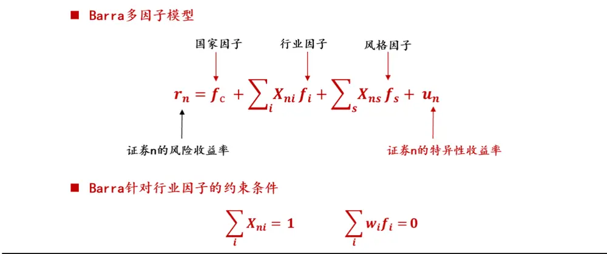
, MSCI Barra CNE5

BarraCNE5局限性一：行业因子并不完全适用于 A股市场的分析习惯。CNE5模型针对 A股市场的行业划分采用的是 GICS国际行业划分标准，但是，在 A股市场大家常用的行业划分主要有两类：一是申万行业划分标准，二是中信行业划分标准。如果自主复制 Barra模型，申万和中信行业的划分标准哪一个更合理呢？我们认为中信行业更为合理，其主要原因是申万行业在 2014年前后行业的划分标准发生了比较大的变动，而中信行业的划分标准相对稳定，因此，从行业分类在时间序列维度的连续性，中信行业更为稳健。

Barra CNE5局限性二：Barra计算因子收益率的股票池需要根据分析特定的分析对象群而进行调整。由于各机构投资风格、各类型产品的投资限制不同，各家机构的股票可选池差异很大，甚至同一个机构不同属性的产品，其可选标的差异也十分显著。比如有些股票会被私募基金关注，但并不会纳入公募基金的股票池。因此，针对不同类型产品，比如公募、私募、养老金，模型对应的股票样本池应该是不同的。

目前 CNE5 是统一根据 A 股股票池来估算各因子收益率，因此针对特定的产品，模型分析结果可能会出现一定偏差。举一个例子来直观地展现这种偏差：比如在 A股中加入了美股后整体计算各类因子值，再用该因子结果去分析 A股市场的组合产品的行业暴露、风格偏好，显然这种测算是有失偏颇的。

## 三、BARRA CNE5 实践分析

## （一） Barra 各类因子实证表现

图表 2至图表 5为部分行业因子累计收益表现，其中国家因子（Country Factor）可理解为是一个近似全市场规模加权的纯多组合，行业因子组合是一个多空组合，它的本质是做多该行业，并做空国家因子。由于中信一级行业有 30个，受篇幅限制仅展示部分结果。

图表 2. 国家因子与金融地产行业因子表现（2005-2020）
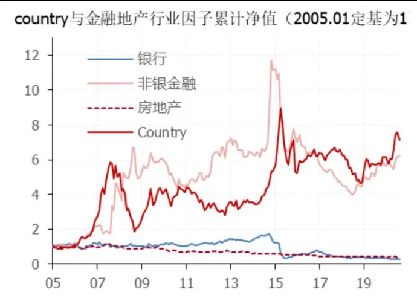
资料来源：万得，中银证券

图表 3. 消费医药板块行业因子表现（2005-2020）
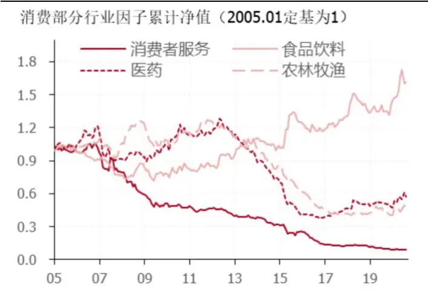
资料来源：万得，中银证券

图表 4. TMT 板块行业因子表现（2005 - 2020）
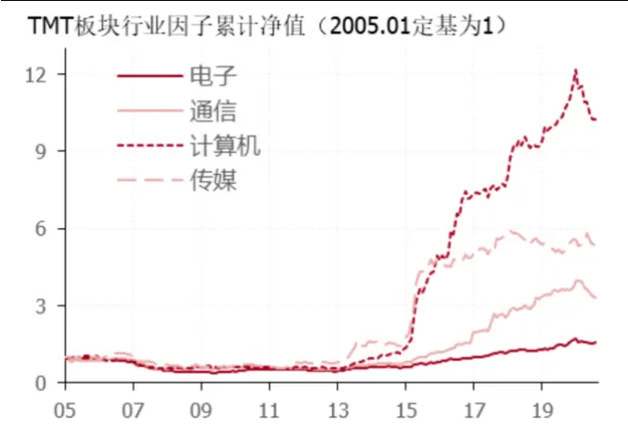
资料来源：万得，中银证券

图表 5. 部分周期行业因子表现（2005-2020）
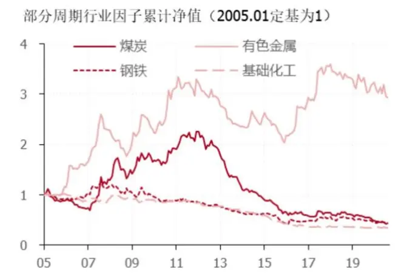
资料来源：万得，中银证券

图表 6展示的是 CNE5 十个风格因子自 2005年以来的收益累计表现。 对于一个纯风格因子组合，该组合是一个多空组合，即 100%做多该风格因子，但对其他风格因子、国家因子以及其他行业因子的暴露度均为 0。

接下来，我们将重点针对中银 CNE5模型表现进行评估，并与 MSCI CNE5官方文档的原始模型测试结果进行比较。

图表 6. Barra CNE5 风格因子实证表现（2005-2020）
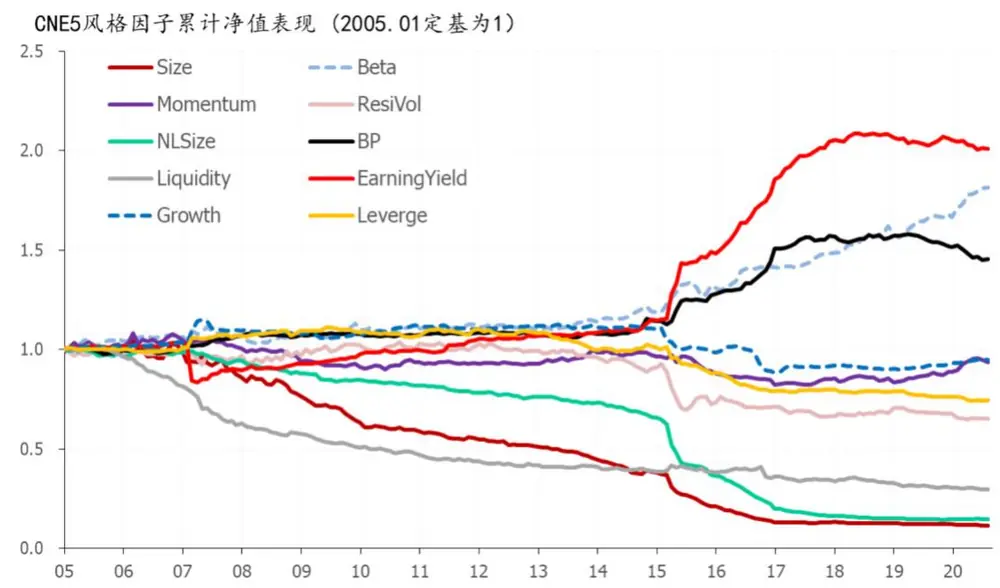
, MSCI Barra CNE5

## （二） 中银 CNE5 因子表现评估指标体系简介

Barra对模型的表现主要通过如下四个核心指标来评估：

1. 因子解释力显著性：通过计算因子对股票月度收益 t值绝对值的平均值来反映因子对收益率的解释力。基于收益率呈正态分布的假设，t值绝对值超过 2被认为在 95%的置信度下该因子是显著的。因此通过测算 2005-2020期间|t|的平均值可评估因子解释力在整体区间的显著性。

2. 因子解释力稳健性：我们希望因子在较长时间区间对股票收益率的解释力是稳健且显著的，通过计算长周期内因子|t|不低于 2的概率来衡量因子解释力的稳健度；

3. 因子是否存在共线性：因子方差膨胀系数（VIF），通过对每个因子，用其他N个因子进行回归解释来计算各个因子的 VIF，公式如下，其中 R2（i）为第 i个因子被其他所有因子解释的拟合优度。通常认为 VIF（i）小于 5 的模型的解释变量不存在验证的共线性。

$$
\mathsf{V}\mathsf{IF\mathrm{~\left(~\mathsf{i}~\right)~\mathsf{\Omega}=1~/~\left(~1-R^{2}\mathrm{~\left(~\mathsf{i}~\right)~\mathsf{\Omega}}\right)~}}
$$

4. 因子对 A股收益率的整体解释度：调整后拟合优度（AdjTotal R-Square）。这里需要特别强调的是 Barra对调整R-Square是用“非中心化”拟合优度（TotalR-Square）来定义的，而常规计量学中的定义为“中心化”拟合优度（Relative R-Square）。

计量常用定义： 中心化拟合优度 = 1 - 残差平方和 / 离差平方和

Barra模型定义：非中心化拟合优度=1 -残差平方和/y的平方和

从经验上，中心化拟合优度要比非中心化拟合优度数值大一些。

## （三） 行业因子表现实证

从因子解释力显著性维度，中银 CNE5行业因子的解释力显著性高于 MSCI官方披露结果。具体来看，30个中信一级行业因子中除了综合金融（2019年出现的新行业），所有行业因子在 2005-2020年的月度收益率|t值|的均值都大于 2，且 30个行业的平均值为 3.8，超过 MSCI Barra2012年发布的平均值 1.64。

图表 7. Barra CNE5 风格因子实证表现（2005-2020）
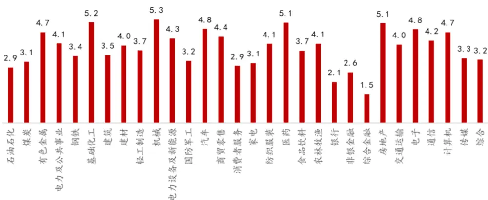
, MSCI Barra CNE5

从行业因子解释力稳定性维度，中银 CNE5行业因子的稳定性优于 MSCI官方披露结果。具体来看，除了综合金融（2019年才出现的新行业）外，所有行业因子在 2005-2020年|t值|大于 2的概率超过 50%（30个中信一级行业的平均值为 63%），较大幅度超过 MSCI披露的该指标平均值 29.3%。

图表 8. 中银 CNE5 行业因子|t| > 2 占比统计（2005-2020）
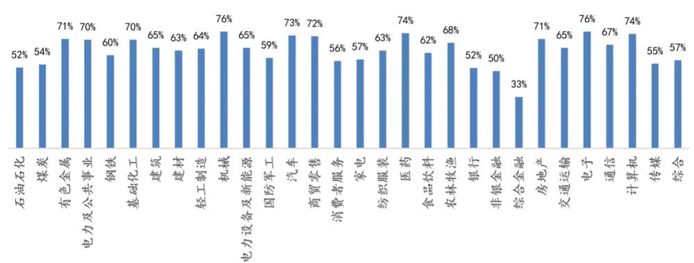
, MSCI Barra CNE5

这里我们想要强调的是，虽然我们与 2012年 MSCICNE5官方文档的测算区间不完全相同，但在一定程度上证明中信一级行业因子具有合意的解释显著性和解释稳健度，且效果并不弱于基于 GICS标准划分的因子。

## （四） 风格因子表现实证

类似于上部分对于行业因子的测试，由于风格因子我们基本还原了 BarraCNE5的测算过程，在图表 9至图表 11 中，我们针对中银 CNE5 和 Barra CNE5 的结果进行了综合比对，虽然两者的测算区间不完全相同，但对比后的结论还是具有一定意义的：中银 CNE5风格因子在因子解释力显著性、稳定度以及共线性角度均不逊于 BarraCNE5官方测试结果。具体来看：

从因子解释力显著度角度：中银 CNE5 版本十个风格因子的|t|值的均值为 2.6，略高于官方文档的 2.4；

图表 9. CNE5 风格因子|t|均值统计 – 中银 vs Barra（2005-2020）
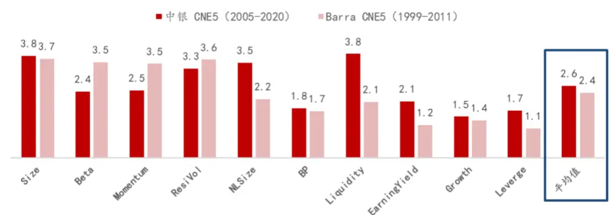
, MSCI Barra CNE5

从因子解释力的稳健度角度：中银 CNE5 版本各风格因子“|t|值大于 2 占比”均值为 49%，略高于官方文档的 45%；

图表 10. CNE5 风格因子|t|大于 2 占比统计 – 中银 vs Barra（2005-2020）
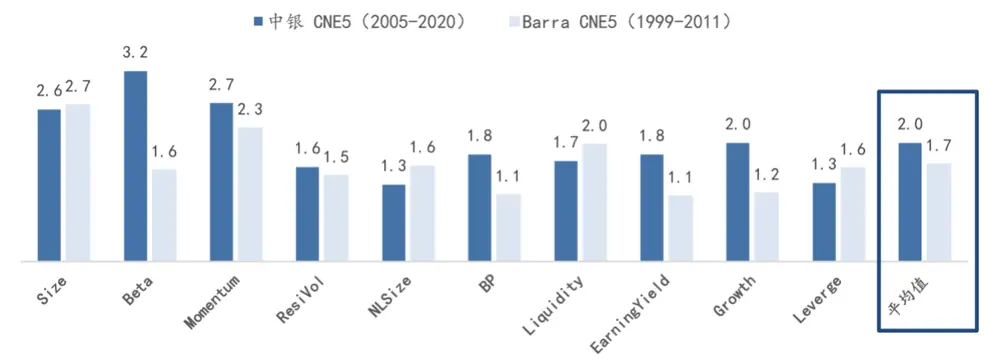
, MSCI Barra CNE5

从因子共线性角度：通过测算，中银 CNE5版本中风格因子的 VIF均值为 2，略高于官方文档的 1.7。因为“VIF = 2”与“VIF <5 说明共线性问题不严重”这一标准距离较远，因此共线性测试结果是比较合意的。

图表 11. CNE5 风格因子 VIF 均值统计 – 中银 vs Barra（2005-2020）
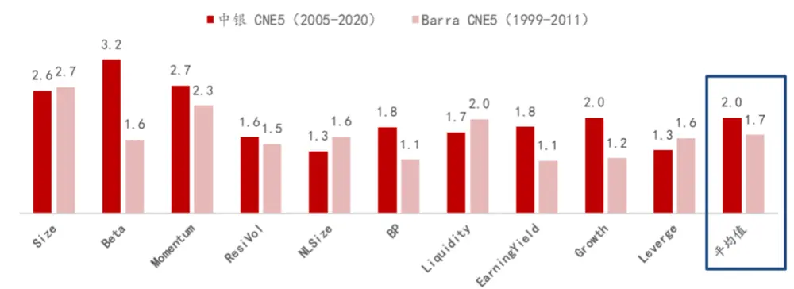
, MSCI Barra CNE5

## （五） 针对 CNE5 因子整体解释度的评估

Barra在评估全体因子对 A股收益率的整体解释度时使用的是调整后拟合优度（Adj Total R-Square）。在展示中银 CNE5版本的测算结果之前，我们先展示官方文档 2001年披露的原始模型调整后拟合优度，该“非中心化调整后拟合优度”的口径为月度测算的调整后 R-Square 的 12 个月移动均值，测试区间为 1997 年至 2011 年。

图表 12. MSCI Barra CNE5 调整拟合优度（12 月滚动均值）
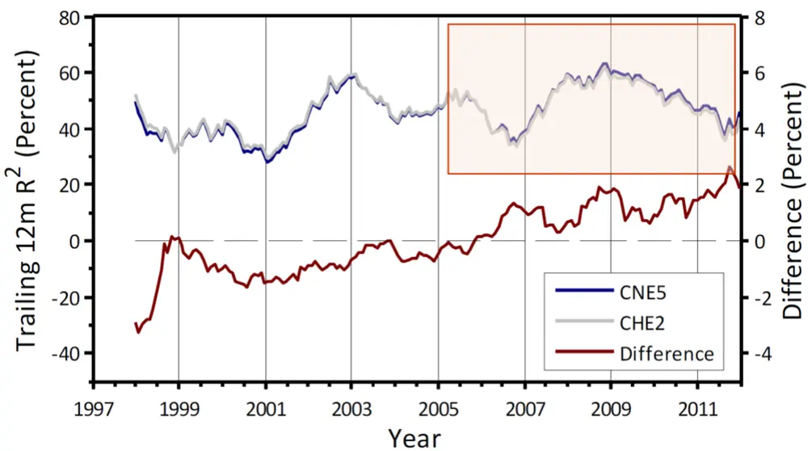
, MSCI Barra CNE5

图表 13为中银量化团队复制的 CNE5模型 12月均滚动拟合优度测试图。对比图表 12和图表 13可知：中银 CNE5 版本在 2005 年至 2011 年的表现几乎与 MSCI Barra CNE5 相似，调整拟合优度处于 30%-60%之间，平均值约为 50%。综合上文对行业与风格因子的显著性、解释度稳健性以及因子共线性测试结论可知，中银 CNE5版本较好地复原了原始模型。

图表 13. 中银 CNE5 调整拟合优度（12月滚动均值）
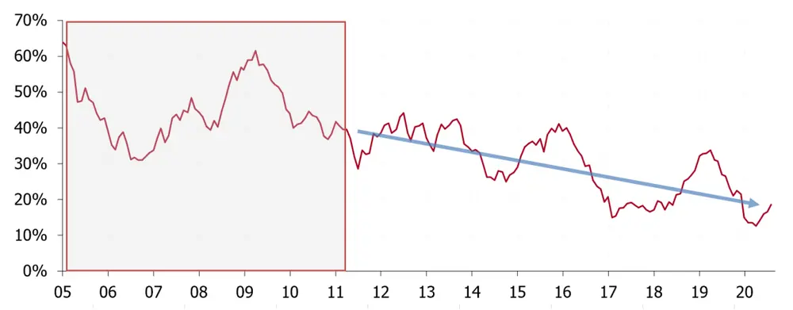
, MSCI Barra CNE5

再次观察图表 13，我们会发现：在 2013之后的近 7年时间里，CNE5模型的解释力具有显著的周期性变化，并且模型的解释力出现了较显著的中枢持续下移趋势。所以我们需要回答一个很重要的问题：为什么 CNE5模型的解释性会出现周期性波动，并且其解释力似乎自 2013起开始持续衰减？

## 四、对 CNE5 解释力衰减的原因探究

首先我们想了解：CNE5 模型自 2013 年整体解释力下降主要是源于“行业因子”还是“风格因子”呢？为了回答这一问题，我们分别仅使用行业和仅使用风格因子对 A 股收益率进行回归，以观察两者的解释力在时间维度上的变化。

图表 14.中银 CNE5 调整拟合优度（12月滚动均值）行业因子vs风格因子vs整体
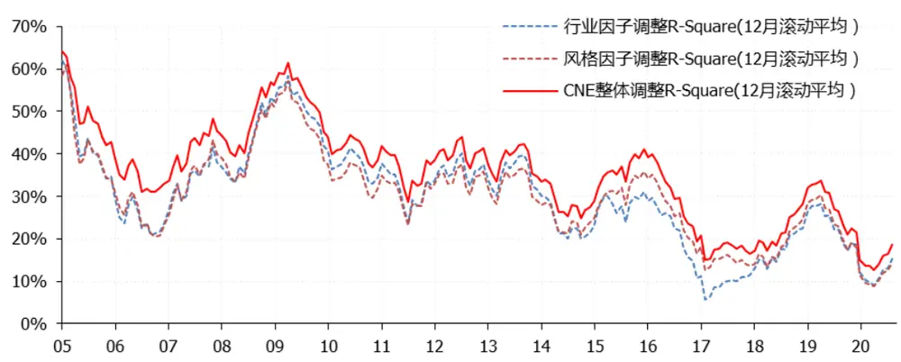
, MSCI Barra CNE5

观察图表 14，如下两个核心结论需要投资者重点关注：

1） Barra的行业因子和风格因子在单独解释 A股收益率的层面上，其解释度是相似的，两者之间存在较强的相关性。该结论也是比较容易理解的，即不同行业本身就自带一定的风格特征；

2） Barra模型整体解释力的衰减程度与风格因子和行业因子的衰减程度高度相关，两者很难区分谁的解释力衰减程度更高。

为了进一步探究 CNE5 因子整体解释力下降的原因，我们进行了如下猜想：在 2013 年后，A 股市场个股的分化程度增加，因此单一行业指数或风格因子对股票的收益波动解释难度加大。该猜想的本质是认为 2013 年后个股之间的相关系数存在中枢下行的趋势。

因此，我们定义了一个定量测量个股表现分化程度的指标 rho，该指标可近似度量个股之间的平均相关系数，具体公式如下：

Rho = 全市场规模加权指数 1年滚动波动率/个股 1年滚动波动率规模加权平均值

图表 15和图表 16为 Rho与 CNE5模型滚动 1年调整 R-Square的时间序列比较图以及回归结果。

图表 15. 中银 CNE5 调整拟合优度（12 月滚动均值）vs 个股离散度 Rho
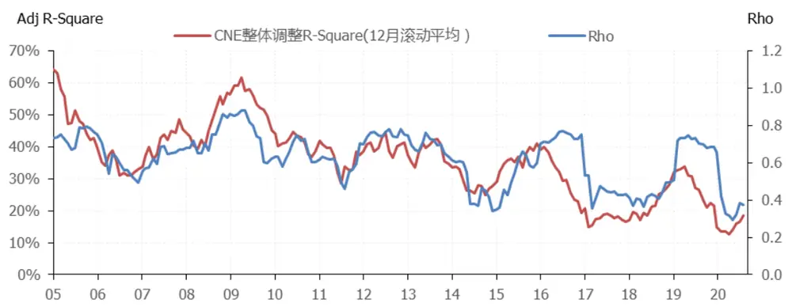
, MSCI Barra CNE5

图表 16. Rho与 CNE5 一年滚动调整 R2回归结果
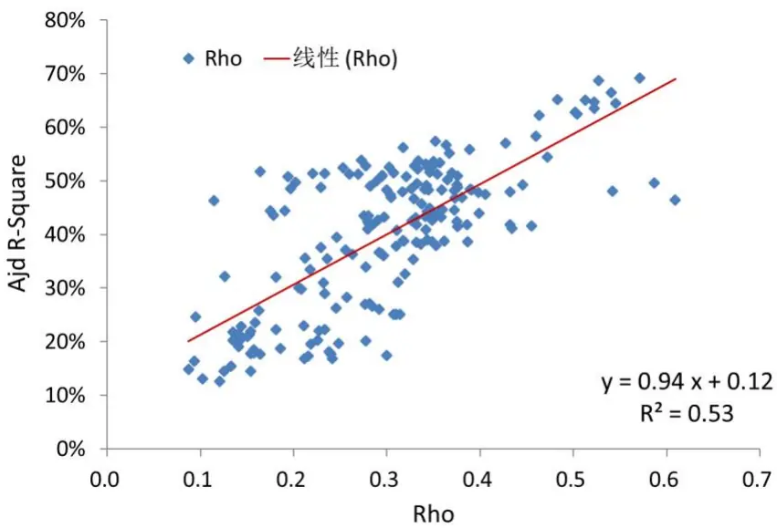
, MSCI Barra CNE5

图表 17. Rho与国家（市场）因子的时间序列对比
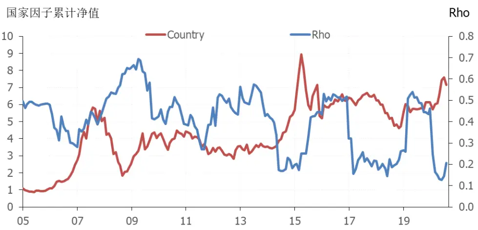
, MSCI Barra CNE5

通过观察上图时间序列以及 Rho 和滚动调整 R 方的回归可知，Rho 和滚动调整的拟合优度相关性约为75%（对应 R2为 53%），因此我们可以比较明确的得出结论：

1） 2013 年个股表现分化严重是导致 CNE5 因子解释力中枢下行的重要原因，且 CNE5 的模型解释力的周期性上升与下降与个股离散度的增减显著正相关；

2） 观察图表 17，可以发现在市场趋势性上涨区间，个股的离散度会中枢下移，即并不是所有股票都会大涨，但在市场趋势性下跌时，避险情绪会快速升温，经常出现各股齐跌的情况。因此在大牛市中，各股相关性会趋势性下降，在熊市中各股相关性会快速增长，导致离散度 Rho 中枢上行。因此可以推测，CNE5 在熊市表现会有较大概率优于牛市，这一猜想也是可以通过观察图表 13 - 15 予以验证的。

## 四、风险提示

投资者需关注疫情超预期、政策收紧、贸易摩擦升级等带来的市场风险以及策略失效风险。

## 五、附录：BARRA 风格因子计算方法

| 序号 | 一级因子 | 二级因子 | 权重 | 说明 | 因子定义 |
| --- | --- | --- | --- | --- | --- |
| 1 | Size | LNCAP | 1 | 规模 | 市值的自然对数 |
| 2 | Beta | BETA | 1 | 贝塔 | 为股票超额收益日序列和市值加权指数超额收益日序列进行WLS的回归系数，beta表示股票相对于指数涨跌的弹性大小，计算如下： $r_{t}-r_{ft}=\alpha+\beta R_{t}+e_{t}$ 其中rf是无风险收益日序列，rt是股票收益日序列，Rt是市值加权指数（如中证全指、万德全A指数）超额收益日序列，回归系数采取过去252交易日的收益数据，回归权重采用指数加权移动平均，半衰期为63个交易日 |
| 3 | Momentum | RSTR | 1 | 动量 | 此动量为长期动量减去短期动量，采用指数加权移动平均方法，其中长期动量周期T = 504，短期动量周期L = 21，rf是无风险收益，w(i)是指数加权权重，半衰期为126个交易日 $rstr=\sum_{t=L}^{T+L}w_{t}ln(1+r_{t})-\sum_{t=L}^{T+L}w_{t}ln(1+r_{ft})$ |
| 4 | ResidualVolatility | DASTD | 0.74 | 超额收益年化波动 | 是过去252个交易日日超额收益率波动率，按照指数加权权重，半衰期为42个交易日 $dastd=\frac{1}{n}\sum_{t=1}^{n}w_{t}(r_{et}-\bar{r_{e}})^{2}$ |
|  |  | CMRA | 0.16 | 年度超额收益率离差 | CMRA是过去12个月超额收益的离差，也是表征股票收益率的波动大小，Z(T)是过去T个月超额收益对数值得累计值，Z(T)是一个时间序列， ${\textsf{T}}=\ 1,2,3,\cdots,12$ $Z(T)=\sum_{t=1}^{T}[ln(1+r_{t})-ln(1+r_{ft})$ $crma=ln(1+Zmax)-ln(1+Zmin)$ 注：由于实际计算时可能出现 $Zmax<-1或Zmin<-1$ 导致无法进行Iog计算，因此实际测算采用CMRA = Zmax - Zmin进行调整 |
|  |  | HSIGMA | 0.1 | Beta回归残差年化波动率 | hsigma是计算beta收益之时的残差收益率的波动率，表示股票不能被beta所解释部分收益的波动率，数据为过去252个交易日，按照指数加权权重，半衰期为63个交易日 $hsigma=std(e_{t})$ HSIGMA因子要和BETA因子和SIZE因子做回归，去除其共线性关系 |
| 5 | Non-linearSize | NLSIZE | 1 | 非线性因子 | NLSIZE为SIZE因子的立方，之后将结果和SIZE因子回归取残差去除其和SIZE因子的共线性，残差值再进行缩尾处理(winsorized)和标准化(standardized) |
| 6 | Book-to-Price | BTOP | 1 | 账面市值比 | 就是上个季报公司普通股权账面价值（就是净资产）除以公司当前的市值 |
| 7 | LIQUIDITY | STOMSTOQSTOA | 0.350.350.3 | 月度换手率季度换手率年度换手率 | STOM是最近一个月的换收率和的对数值，Vt是t日的交易量，St是t日的流通股本 $stom=ln(\sum_{t=1}^{21}\frac{V_{t}}{S_{t}})$ STOM是季度换收率STOA是年度换收率 |
| 8 | EarningsYield | EPFWD | 0.68 | 盈利预期 | EPFWD是预期盈利市值比，预期盈利采用的是分析师对未来12个月预期盈利加权平均值 |
|  |  | CETOP | 0.21 | 现金流量比 | CETOP是现金流量市值比，现金流量是过去12月的历史数据值 |
|  |  | ETOP | 0.11 | 历史盈利市值比 | ETOP是盈利市值比，盈利是过去12月的历史数据（就是pe_ttm的倒数值） |
| 9 | Growth | EGRLF | 0.18 | 长期利润率预期 | EGRLF是未来3-5年分析师预期盈利增长率 |
|  |  | EGRSF | 0.11 | 短期净利润预期 | EGRSF是未来1年分析师预期盈利增长率 |
|  |  | EGRO | 0.24 | 长期历史净利率 | EGR0是过去5年盈利增长率（采用回归方法），即使用最近5个财政年度的净利润额对时间的回归的斜率值，除以年平均净利润 |
|  |  | SGRO | 0.47 | 长期历史销售率 | SGR0是过去5年营业收入增长率(采用回归法)，即使用最近5个财政年度的营业收入对时间的回归的斜率值，除以年平均营业收入 |
| 10 | Leverage | MLEV | 0.38 | 市场杠杆 | me是普通股市值，pe是优先股账面价值，Id是长期负债账面价值 $mlev={\frac{me+pe+ld}{me}}$ |
|  |  | DTOA | 0.35 | 资产负债比 | td是总负债账面价值，ta是总资产账面价值 $dtoa=\frac{td}{ta}$ |
|  |  | BLEV | 0.27 | 账面杠杆 | be是普通股账面价值，pe是优先股账面价值，Id是长期负债账面价值 $blev={\frac{be+pe+ld}{be}}$ |

## 披露声明

本报告准确表述了证券分析师的个人观点。该证券分析师声明，本人未在公司内、外部机构兼任有损本人独立性与客观性的其他职务，没有担任本报告评论的上市公司的董事、监事或高级管理人员；也不拥有与该上市公司有关的任何财务权益；本报告评论的上市公司或其它第三方都没有或没有承诺向本人提供与本报告有关的任何补偿或其它利益。

中银国际证券股份有限公司同时声明，将通过公司网站披露本公司授权公众媒体及其他机构刊载或者转发证券研究报告有关情况。如有投资者于未经授权的公众媒体看到或从其他机构获得本研究报告的，请慎重使用所获得的研究报告，以防止被误导，中银国际证券股份有限公司不对其报告理解和使用承担任何责任。

## 评级体系说明

以报告发布日后公司股价/行业指数涨跌幅相对同期相关市场指数的涨跌幅的表现为基准：

## 公司投资评级：

入：预计该公司股价在未来 6个月内超越基准指数 20%以上；

增持：预计该公司股价在未来 6个月内超越基准指数 10%-20%；

中 性：预计该公司股价在未来 6 个月内相对基准指数变动幅度在-10%-10%之间；

减 持：预计该公司股价在未来 6 个月内相对基准指数跌幅在 10%以上；

未有评级：因无法获取必要的资料或者其他原因，未能给出明确的投资评级。

## 行业投资评级：

强于大市：预计该行业指数在未来 6个月内表现强于基准指数；

中 性：预计该行业指数在未来 6 个月内表现基本与基准指数持平；

弱于大市：预计该行业指数在未来 6个月内表现弱于基准指数。

未有评级：因无法获取必要的资料或者其他原因，未能给出明确的投资评级。

沪深市场基准指数为沪深 300指数；新三板市场基准指数为三板成指或三板做市指数；香港市场基准指数为恒生指数或恒生中国企业指数；美股市场基准指数为纳斯达克综合指数或标普 500指数。

## 风险提示及免责声明

本报告由中银国际证券股份有限公司证券分析师撰写并向特定客户发布。

本报告发布的特定客户包括：1) 基金、保险、QFII、QDII 等能够充分理解证券研究报告，具备专业信息处理能力的中银国际证券股份有限公司的机构客户；2) 中银国际证券股份有限公司的证券投资顾问服务团队，其可参考使用本报告。中银国际证券股份有限公司的证券投资顾问服务团队可能以本报告为基础，整合形成证券投资顾问服务建议或产品，提供给接受其证券投资顾问服务的客户。

中银国际证券股份有限公司不以任何方式或渠道向除上述特定客户外的公司个人客户提供本报告。中银国际证券股份有限公司的个人客户从任何外部渠道获得本报告的，亦不应直接依据所获得的研究报告作出投资决策；需充分咨询证券投资顾问意见，独立作出投资决策。中银国际证券股份有限公司不承担由此产生的任何责任及损失等。

本报告内含保密信息，仅供收件人使用。阁下作为收件人，不得出于任何目的直接或间接复制、派发或转发此报告全部或部分内容予任何其他人，或将此报告全部或部分内容发表。如发现本研究报告被私自刊载或转发的，中银国际证券股份有限公司将及时采取维权措施，追究有关媒体或者机构的责任。所有本报告内使用的商标、服务标记及标记均为中银国际证券股份有限公司或其附属及关联公司（统称“中银国际集团”）的商标、服务标记、注册商标或注册服务标记。

本报告及其所载的任何信息、材料或内容只提供给阁下作参考之用，并未考虑到任何特别的投资目的、财务状况或特殊需要，不能成为或被视为出售或购买或认购证券或其它金融票据的要约或邀请，亦不构成任何合约或承诺的基础。中银国际证券股份有限公司不能确保本报告中提及的投资产品适合任何特定投资者。本报告的内容不构成对任何人的投资建议，阁下不会因为收到本报告而成为中银国际集团的客户。阁下收到或阅读本报告须在承诺购买任何报告中所指之投资产品之前，就该投资产品的适合性，包括阁下的特殊投资目的、财务状况及其特别需要寻求阁下相关投资顾问的意见。

尽管本报告所载资料的来源及观点都是中银国际证券股份有限公司及其证券分析师从相信可靠的来源取得或达到，但撰写本报告的证券分析师或中银国际集团的任何成员及其董事、高管、员工或其他任何个人（包括其关联方）都不能保证它们的准确性或完整性。除非法律或规则规定必须承担的责任外，中银国际集团任何成员不对使用本报告的材料而引致的损失负任何责任。本报告对其中所包含的或讨论的信息或意见的准确性、完整性或公平性不作任何明示或暗示的声明或保证。阁下不应单纯依靠本报告而取代个人的独立判断。本报告仅反映证券分析师在撰写本报告时的设想、见解及分析方法。中银国际集团成员可发布其它与本报告所载资料不一致及有不同结论的报告，亦有可能采取与本报告观点不同的投资策略。为免生疑问，本报告所载的观点并不代表中银国际集团成员的立场。

本报告可能附载其它网站的地址或超级链接。对于本报告可能涉及到中银国际集团本身网站以外的资料，中银国际集团未有参阅有关网站，也不对它们的内容负责。提供这些地址或超级链接（包括连接到中银国际集团网站的地址及超级链接）的目的，纯粹为了阁下的方便及参考，连结网站的内容不构成本报告的任何部份。阁下须承担浏览这些网站的风险。

本报告所载的资料、意见及推测仅基于现状，不构成任何保证，可随时更改，毋须提前通知。本报告不构成投资、法律、会计或税务建议或保证任何投资或策略适用于阁下个别情况。本报告不能作为阁下私人投资的建议。

过往的表现不能被视作将来表现的指示或保证，也不能代表或对将来表现做出任何明示或暗示的保障。本报告所载的资料、意见及预测只是反映证券分析师在本报告所载日期的判断，可随时更改。本报告中涉及证券或金融工具的价格、价值及收入可能出现上升或下跌。

部分投资可能不会轻易变现，可能在出售或变现投资时存在难度。同样，阁下获得有关投资的价值或风险的可靠信息也存在困难。本报告中包含或涉及的投资及服务可能未必适合阁下。如上所述，阁下须在做出任何投资决策之前，包括买卖本报告涉及的任何证券，寻求阁下相关投资顾问的意见。

中银国际证券股份有限公司及其附属及关联公司版权所有。保留一切权利。

## 中银国际证券股份有限公司

中国上海浦东

银城中路 200 号

中银大厦 39 楼

邮编 200121

电话: (8621) 6860 4866

传真: (8621) 5888 3554

## 相关关联机构：

## 中银国际研究有限公司

香港花园道一号

中银大厦二十楼

电话:(852) 3988 6333

致电香港免费电话:

中国网通 10 省市客户请拨打：10800 8521065

中国电信 21 省市客户请拨打：10800 1521065

新加坡客户请拨打：800 852 3392

传真:(852) 2147 9513

## 中银国际证券有限公司

香港花园道一号

中银大厦二十楼

电话:(852) 3988 6333

传真:(852) 2147 9513

## 中银国际控股有限公司北京代表处

中国北京市西城区

西单北大街 110 号 8 层

邮编:100032

电话: (8610) 8326 2000

传真: (8610) 8326 2291

## 中银国际(英国)有限公司

2/F, 1 Lothbury

London EC2R 7DB

United Kingdom

电话: (4420) 3651 8888

传真: (4420) 3651 8877

## 中银国际(美国)有限公司

美国纽约市美国大道 1045 号

7 Bryant Park 15 楼

NY 10018

电话: (1) 212 259 0888

传真: (1) 212 259 0889

## 中银国际(新加坡)有限公司

注册编号 199303046Z

新加坡百得利路四号

中国银行大厦四楼(049908)

电话: (65) 6692 6829 / 6534 5587

传真: (65) 6534 3996 / 6532 3371