# 周期内 barra-CNE6 的 A 股适用探析

## ——规模和成长因子迎来春天

## 投资要点：

## 经济、金融双周期主导下利率、消费、创新驱动型行业接力领跑A股

次贷危机后我国经济增速换档，金融变量影响凸显。10年代前半段金融强周期主导下利率驱动型行业领跑A股；后半段供给侧改革致经济弱周期的主效应彰显，消费驱动型行业接力领跑；近2年来经济新周期初见曙光，创新驱动型行业崭露头角。

## 理论结合现实，定价核随机折现因子解释行业轮动和资产定价

本文以内嵌风险偏好的资产定价核函数——随机折现因子解释周期视角下的行业轮动和股票定价：时序上看，经济繁荣时人们的风险偏好高故折现因子高，高风险资产如小盘股、成长股受到追捧；经济不好时人们的风险偏好低故折现因子低，现金流稳定的白马股、消费股及成长确定性强的行业龙头备受青睐。截面上看，当面临不同资产的选择时，人们愿意以高价购买能在未来经济差时“雪中送炭”的资产，反之亦然。因此人们对系统性风险越小的资产期望收益率越低。多因子模型是随机折现因子的“影子”，其表现理应受周期影响。

## 周期视角下探析barra-CNE6模型，规模和成长因子迎来春天

综合采用多种统计检验方法，发现规模、成长、EP价值和流动性因子在A股市场具有显著、稳定的风险溢酬。规模因子代表中小盘股相较于大盘股的超额溢酬， Fama和French（1996）[1]认为其反映经济的周期性风险，Liu等（2019）[2]指出其在A股市场最为显著，但却在2016年供给侧改革后失效了。今年以来规模因子又重回高光时刻，本文认为是经济、金融双周期的共振主导了A股规模因子的波动，未来一年在金融周期的顺风助力下规模因子仍将延续牛市行情。成长因子则更多受到经济周期的影响，经济新周期将持续带动成长因子的业绩。

## 风险提示

模型失效风险：模型均基于量化方法构建且有适用的假设条件，故存在失效风险。

## 相对市场表现

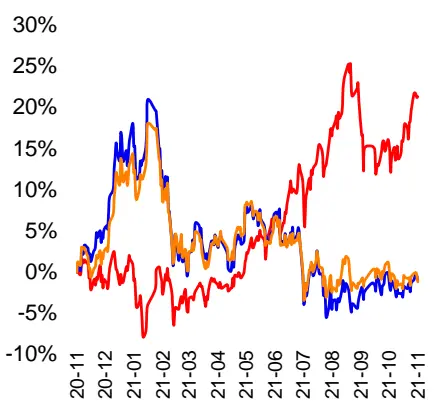
小盘指数(申万) 全指成长 沪深300

分析师张晓春

执业证书编号：S0590513090003

电话：0510-83832053

邮箱：zhangxc@glsc.com.cn

Tabl e_First|Tabl e_Contacter 联系人孙子文

电话：13950079432

邮箱：sunzw@glsc.com.cn

## 相关报告

1、《景气向上，定量模型维持看多》一2021.11.12

2、《权益资产配置战术篇》一2021.10.19

3、《8月组合收益率 10.90%，顶层配置逻辑融入定量选股》一 2021.09.28

## 1. 周期主导下的股市波动与资产定价

## 1.1.经济动能趋弱，金融周期主导股市行情

## 次贷危机以来经济周期对我国股市的直接主导作用减弱

08年以来工业增加值的同比增速中枢显著下降，对股市牛熊演绎的影响力减弱。人们常说股市是经济的晴雨表，股价的波动反映经济的周期性变化，这在 2008 年金融危机以前举世皆然。就中国而言， 2004 年 1 月至 2007 年 12 月期间中国经济高歌猛进，规模以上企业的工业增加值以超出 16%的同比速度迅猛增长；上证综指也从期初的 1517 点连续上涨至期末的 5261 点，走出了高景气长牛的行情，期间更是在 2007 年 10 月 16 日创出了 6124 点的历史最高纪录。然而，在 2008 年金融危机爆发以后，我国的经济增长出现了明显放缓的趋势。特别是在”四万亿”刺激政策的效果消退后，2012 年1 月至2021年9 月间我国工业增加值的增速均值为 7.4%。经济动能的减弱直接削弱了经济周期对股市的主导作用，股票市场也愈加频繁的走出独立行情。2009 年 2 月-2009 年 12 月、2014 年 7 月-2015 年 6 月上证综指的区间收益率分别高达 64%和 125%。

图表1：2008年以来经济周期对上证综指牛熊转换的主导作用减弱
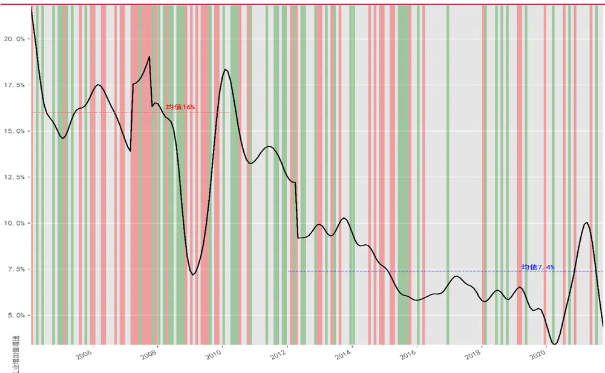
来源：wind，国联证券研究所. 注：红色区域为上证综指牛市月份；绿色区域为上证综指熊市月份

## 08 年后信用和货币为表征的金融周期主导了A 股的牛熊转换

使用私人部门信贷/GDP、M2与 GDP的同比增速差作为金融周期货币流动性和信用的代理变量。2008 年次贷危机爆发以后，国际社会认识到金融周期相对于经济周期的独立性和重要性。金融周期是指金融变量扩张和收缩导致的周期性波动，反映金融市场参与者对价值和风险的态度，以及融资约束之间的自我强化、交互反馈作用。

股票作为金融市场中的一种投资产品，其价格自然深受金融周期的影响。本文参照Levine et al.（2000）[3]和陈雨露等（2016）[4]的做法，使用私人部门信贷/GDP 作为一国金融周期的表征变量。在货币中性的市场化条件下，私人部门信贷所代表的信用盈缩状况可以较好的反映金融的周期性波动。而在现实世界中，货币政策常常因经济、社会发展的需要而不再中性。因此，本文又以 M2、GDP的同比增速差值来衡量货币条件的变化。

信用的扩张与收缩很好的解释了上证综指的牛熊转换，2012-2016 年的货币宽松周期助推了2014-2015年的牛市。由于GDP是按季公布的，因此本文以2004 年以来的季度时间序列进行检验。首先，分别选取上证综指区间收益率最大、最小的各25 个季度定义为牛市（红色）、熊市（绿色）。其中在牛市季度中收益率最低为4.9%；在熊市季度中收益率最高为-3.6%。总体来看，私人部门信贷/GDP 指标对上证综指的牛熊转换有很强的表征能力：除2014年 7 月-2015 年6 月外，每次牛市均在信用的高值点或上升期开始；除 2020年 1季度外，每次熊市均在信用的低值点或下降期启动。另外，广义货币供应量 M2 与 GDP 的增速差作为衡量货币宽紧度的指标，也较好的补充解释了 2014-2015期间的大牛市。通常认为 M2增速超过GDP 两个百分点即为宽货币状态，纵观来看样本期内共有 3 个宽货币时段，分别为 2009 年“四万亿”经济刺激期间、2012-2016年和2020 年新冠疫情期间。而正是在2012 年开启的宽松货币长周期内，A股市场出现了大牛市行情。

图表2：2008年以来金融周期逐渐主导上证综指的牛熊转换
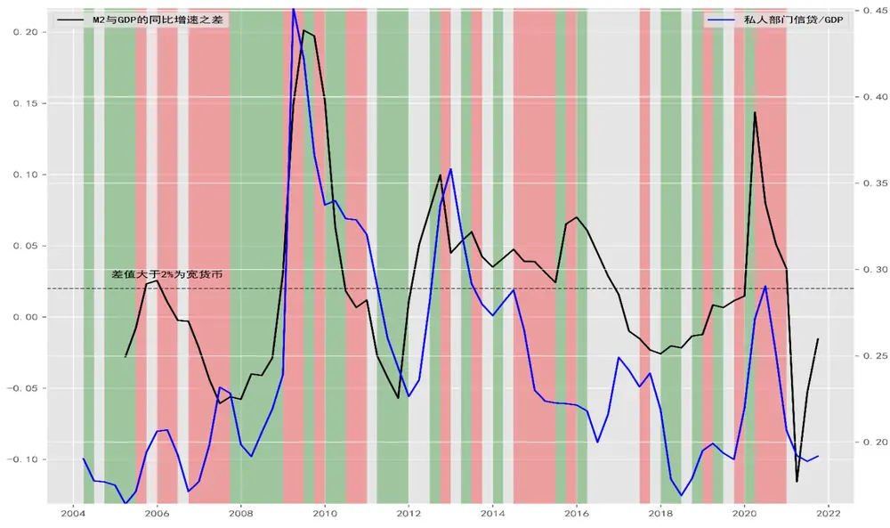
来源：wind，国联证券研究所. 红色区域为上证综指牛市季度；绿色区域为上证综指熊市季度

## 1.2.周期中利率、消费和创新驱动行业领跑

## 根据增长逻辑将所有行业划分为五大类

根据增长逻辑将申万一级行业划分为消费驱动型、制造驱动型、利率驱动型、创新驱动型和周期性行业。根据主要产业的增长驱动因素和产业链关系，可以将所有行业划分为5 类。第一类为消费驱动型行业，该类产业的产品面向最终消费者且对经济周期不敏感，主要包括食品饮料、休闲服务、传媒教育、农林牧渔、轻工制造、纺织服装等行业；第二类为制造驱动型行业，该类产业主要生产中间产品且有较高的资产负债率，主要为机械设备等传统制造业；第三类为利率驱动型行业，该类行业以杠杆驱动业绩增长，包括银行、非银金融、房地产及相关的建筑材料和建筑装饰行业；第四类为周期性行业，该类行业的发展与经济周期密切相关，包括有色钢铁、石油石化、大宗商品等行业；第五类则为创新驱动型行业，以研发支出占比高和成果转化率高而著称，包括计算机、电力设备和电子等行业，近年来汽车行业也随电动车的潮流而转变为创新驱动型行业。

图表3：近10年利率、消费、创新驱动型行业先后领跑市场

| 2011年 | 4.行%% | 品修料OPt次和 | 房地产-22.0% | -2.336% |  | 休2闲服务S | 家用电器-24.76% | 纺织服装-25.52% | 11% | -27.86%86% |
| --- | --- | --- | --- | --- | --- | --- | --- | --- | --- | --- |
| 2012年 | 房地产31.73% | 非银金融28.1% | 建筑装饰18.54% | 家用电器15.84% | 银行14.48% | 有色金属13.64% | 医药生物8.47% | 公用事业5.69% | 休闲服务5.24% | 5.01% |
| 2013年 | 传媒107.02% | 计算机66.95% | 42.7%%电子 | 家用电器39.33% | 医药生物36.56% | 通信34.71% | 国防军工33.35% | 电气设备32.23% | 轻工制造21.48% | 休闲服务19.47% |
| 2014年 | 非银金融121.16% | 建筑装饰83.31% | 7834%34% | 房地产65.28% | 交通运输 | 631 %1%银行 | 公用事业55.68% | 周防军工 | 综合 | 建筑材料42.95% |
| 2015年 | 计算机100.29% | 轻工制造89.86% | 纺织服装89.17% | 休闲服务 | 传媒76.74% | 7信%%通信 | 7197% |  | 农林牧渔66.77% | 电气设备电气设备 |
| 2016年 | 食品饮料7.43% | 建筑材料0.03% | 建筑装饰-0.44% | 家用电器-1.87% | 银行%% | 采掘5.76% | 有色金属-6.17% | _1. 13%% | 钢铁-8.13% | 农林牧渔-8.58% |
| 2017年 | 食品饮料53.85% | 家用电器43.03% | 钢铁19.74% | 非银金融17.3% | 有色金属15.39% | 13.47%电子 | 13%% | 交通运输6.53% | 建筑材料6.05% | 医药生物56% |
| 2018年 | 休闲服1务 休闲服务 | -1. 7% | 饮料 | 衣梦牧 | 计算机-24.53% | 非體 | 医药生物 | 房地产-28.79% | 建筑装饰建筑装饰 | 钢铁-29.62% |
| 2019年 | 73.7%电子 | 食品饮料72.87% | 家用电器56.99% | 建筑材料51.03% | 计算机48.04% | 非银金融45.51% | 农林牧渔45.45% | 医药生物36.85% | 休闲服务27.92% | 国防军工27.19% |
| 2020年 | 休闲服务 | 电气设备61气设备 | 食品饮料84.97% | 周防军工 | 医药生物51.1% | 45. 5%%汽车 | 36. 5%5% | 化工34.98% | 有色属 | 家用电器31.08% |
| 今年前10月 | 电气设备56.5% | 38. 1%1% | 有色金属37.62% | 3工 | 钢铁30.7% |  | 10.% | 46% | 建筑装饰6.79% | 机械设备6.34% |

来源：wind，国联证券研究所

## 金融强周期和经济弱周期下利率、消费、创新驱动型行业的领跑接力

后金融危机时代的经济弱周期背景下，金融周期决定行业指数收益的上限。以私人信贷/GDP 指标表征的金融周期在 2011 年 4 季度、2016 年 2 季度、2018 年 3 季度三次触底，而这3 年的申万行业指数收益率也在近10年的时段里垫底：仅就各年度行业的收益率纵向比较，2018年的休闲服务、2011 年的银行业和2016 年的食品饮料业分别以-10.6%、-4.8%和 7.4%的收益率位列倒数 1、2、3 名。另外，结合货币/信用指标来看，金融周期在2012-2015、2020年处于阶段性高点的位置，而2014、2013、2015、2020 各年表现最好的行业指数也分别以 121.1%、107%、100%、99%的收益率排名样本期前 4。

21世纪 10年代前半段，“四万亿”计划的刺激惯性引致金融强周期，利率驱动型行业率先起飞。次贷危机后，中国政府采取了包括宽货币在内的一揽子经济刺激政策，至 2011 年已形成了较高水平的货币存量。该年3季度，欧债危机的爆发干扰了中国经济的复苏，也使央行逐渐收紧的货币政策出现了逆转。新一轮的货币宽松自此启动，金融周期渐入高潮。故在2011、2012、2014年和 2016年，利率驱动型行4、5、3个子行业位居申万行业指数收益的年榜前 10名，其中前3 年银行、房地产和非银金融行业更是分别以-4.9%、31.7%和121.1%的收益率雄居榜首。

21世纪 10年代后半段供给侧改革助推去杠杆，经济弱周期的主效应凸显，消费驱动型行业后来居上。自 2015 年股市的大涨大跌后，中央在 2016 年初提出供给侧改革并将“三去一降一补”作为工作重点。“降杠杆”削弱了金融周期的影响，经济周期的主效应凸显出来。虽然规模以上企业的工业增加值增速在 2016 年触底回升，但经济的反弹却又被随后的中美贸易摩擦和新冠疫情打断。在经济动能持续不振的背景下，消费驱动型行业以其稳定的业绩表现越来越受到资本的青睐。2015-2020年，消费驱动型行业分别有 5、3、1、3、3、2 个子行业位居申万一级行业指数年化收益率的前十，其中食品饮料和休闲服务更是在2016-2017年、2018和 2020年领跑市场。

## 经济新周期曙光初现——创新驱动型产业的崛起

新一代科技革命与产业变革进行时，创新驱动型产业的崛起蔚然成风。在市场经济中，技术是参与塑造经济周期的重要力量。近些年来，随着数字经济和碳减排技术的深入发展，创新驱动型产业领域内越来越多的子行业迈上了发展的快车道。2018-2020 年，创新驱动型产业内分别有 1、2、3 个行业收益率位列年度前 10。自 2019年以来，电气设备行业更以 254%的累计涨幅冠绝全市场，电子和汽车行业也分别以148%、93%的涨幅排名全行业第 3 和第 8。计算机行业虽然在 2020 年跌出了年榜前 10，却也录得累计51%的涨幅。今年以来，在碳中和的时代主题下，电气设备及汽车行业继续维持高景状态，区间收益率分别达 46%和 16%。

## 1.3.资产定价核解释行业轮动和投资收益

## 作为定价核的随机折现因子反映消费的跨期抉择

基于消费的随机折现因子（SDF）是金融资产的定价核，定义为消费效用的边际替代率。一般而言，人们在即期消费和投资之间进行抉择。当期投资占款导致的消费效用减少量，至少应等于其未来投资回报带来的消费效用增量。基于这一经济学常识，作为金融资产定价核的随机折现因子（Stochastic Discount Factor，简称 SDF）即被定义为消费效用的边际替代率。如下式所述，在 t时刻，u′(c)为边际效用函数， $\beta$ 为对时间偏好的常量调整系数。 $m_{t+1}$ 即为下一期的贴现率，由于其在 t时刻仍是随机变量，故称随机贴现因子。

$$
m_{t+1}=\beta\frac{u^{\prime}(c_{t+1})}{u^{\prime}(c_{t})}
$$

## SDF解释行业轮动和资产定价

仅从即期（分母）来看，经济差时边际效用高而折现因子低，风险偏好下降；经济繁荣时边际效用低而折现因子高，风险偏好上升。根据随机折现因子模型，资产价格p等于未来回报x与随机折现因子m的乘积，这与现金流折现模型颇为相似。当 t时刻处于经济周期的低点时，人们的收入水平低且消费得到满足的程度低。故此时的边际效用高，以其作为分母的随机折现因子就低，这意味着在经济不景气时人们的风险偏好下降。反之亦然，即在经济繁荣时人们的边际效用低而随机折现因子高，风险偏好上升。

$$
p=E(mx)
$$

近些年 A 股市场上的行业轮动和风格变换也切实的反映了人们风险偏好的这种规律性变化，近几年经济不景气使得人们的风险偏好下降，不愿做时间的朋友，故业绩增长确定性强、现金流稳定的行业龙头和消费白马股越来越受到追捧，而传统意义上的价值股和中小票则遭受市场的冷遇。今年以来，由碳减排主线引领、政策加持的经济新周期曙光初现，市场的风险偏好边际改善，故众多创新驱动型的中小票也都表现不俗。

仅从预期（分子）来看，相较于在经济繁荣时“锦上添花”的资产，人们更偏好在经济萧条时“雪中送炭”的资产，故对系统性风险越高的资产要求的必要报酬率也越高。人们在投资决策时往往更关注横截面上不同资产的价格差异，此时未来的边际效用（SDF 的分子项）和资产回报尤为重要。如上所述，在经济较差时人们的边际效用更高，那么以其作为分子项的随机折现因子也会更高。换句话说，如果一种资产能在经济不景气时给投资者更高的相对回报，其对彼时囊中羞涩的投资者而言无疑是雪中送炭，故此时投资者愿意以更高的价格即更低的期望收益率去购买它。同样，如果一种资产在经济繁荣时给投资者支付的相对回报更高，则投资者只愿以更低的价格也即更高的必要报酬率购买。因此，相较于逆周期的低 beta 资产，人们对顺周期的高 beta资产也会有更高的期望收益率。

## 1.4.从定价核到 barra 多因子模型

## 随机折现因子在现实世界的“分身”——多因子模型

多因子从多个维度刻画资本市场上资产价格的共同运动，分析因子收益率与风险暴露的关系。如前所述，在不同时段的A 股市场上，某些相似的股票往往呈现出一致的收益特征。被用来刻画股票相似度的属性就被称为因子，比如行业因子描述主业相似的个股，规模因子则将市值相近的个股归并在一起。有效市场学派认为天下没有免费的午餐，追逐特定风格因子的收益就要承担相应的系统风险。因子暴露即为证券在这些因子上的风险敞口，它可以是证券收益率与因子收益率的协方差 beta，也可以是公司特征等可测变量。因子收益率即是证券收益中对应于因子暴露的溢酬，在实证中常常以因子模拟投资组合的收益率指代。

多因子是随机折现因子在现实世界中的影子，当以协方差beta表示因子暴露时，随机折现因子可表示为多因子的线性组合，故多因子的效度也应受到经济周期的影响。Fama 和 French（1993）[5]在首创多因子模型即 FF3 因子模型时，就使用协方差 beta作为因子暴露，该类beta pricing models至今仍是学界和业界均很盛行的资产定价模型。根据 Cochrane（2005）[6]所述，当我们把资产的期望超额溢酬表示为beta 多因子模型的形式时，随机折现因子即等于这些因子的线性组合。因而，FF3 因子也即为随机折现因子在现实世界中的影子。既然多因子是随机折现因子的分身，则其应该像后者一样受到经济周期的影响。

## 多因子模型的发展——从FF3 因子模型到barra 模型

按因子来源分类，多因子模型可划分为宏观经济因子模型、基本面因子模型和统计因子模型三大类，FF3和 barra等基本面因子模型更常见。资本市场上的信息丰富多样，由此提取的因子也各有不同。大致归类来看，宏观经济因子模型是依据可观测的经济指标来度量宏观经济因素对证券收益的影响，如利率的变化对不同股票的收益会有何不同影响；基本面因子模型则考察公司的基本面特征对股票收益的影响，如股息率、账面市值比和行业类别均为此类因子；统计因子模型则着眼于股票收益的统计分布特征，从协方差矩阵或高阶矩中挖掘因子，波动率因子就属于此类。从投资角度来看，宏观经济因子多为不可交易因子，即无法直接构建基于宏观经济因子的模拟投资组合；基本面因子和统计因子则大多是可交易因子，其对市场信息的反映往往更及时、广泛。FF3因子模型和barra多因子模型均属于基本面因子模型。

按回归方法分类，多因子模型使用的回归方法有时序回归、截面回归、Fama-Macbeth 回归三大类，barra 使用以时变公司特征作为因子暴露的 Fama-Macbeth回归在实证中表现最好。Fama 和 French 的 FF3 因子模型采用的是时序回归的方法，该类模型直接以资产的超额溢酬序列对因子模拟投资组合的收益率进行回归，进而得到资产期望收益与因子 beta 的关系，此时的因子收益率即为因子组合收益率的时序均值。时序回归的不足在于其无法适用于不可交易的宏观经济因子，且并未约束对所有资产的联合定价误差。在此基础上即诞生了截面回归方法。截面回归分为两步，第一步同样以时序回归估计出资产的因子 beta，第二步则在横截面上以资产超额溢酬的时序均值作为因变量对因子 beta 进行回归，从而估计出因子收益率。截面回归在第二步时先平均再回归，以一次回归得出样本估计值，其无法解决时变 beta 和截距项的截面相关性带来的估计误差。

有鉴于此，Fama 和Macbeth（1973）[7]便对两步回归做了改进：第一步以滚动窗口的时序回归估计出资产的时变因子 beta，第二步则是先回归再取均值：先在各时点上以资产的超额溢酬对因子 beta 做回归，然后再对估计出的因子收益率和定价误差序列取均值以作为期望值。FM 回归仍以估计的 beta 作为第二步回归中的解释变量会存在变量误差（EIV）问题，当其应用在噪声大的日频收益率回归中问题会更严重。真实的因子暴露是未知的潜变量，相较于同为潜变量的协方差 beta，以可测的时变公司特征作为因子暴露的代理是实证中更好的选择。barra 的截面多因子模型便在 FM的基础上省去第一步时序回归，直接以时变的公司特征作为因子暴露进行截面回归。Jegadeesh et al.（2019）[8]、Fama 和 French（2020）[9]也都证实在解释股票的横截面差异时，以时变公司特征作为因子暴露、截面回归获得因子收益率的截面多因子模型（如 barra模型）优于时序多因子模型。

## Barra-CNE6 是适用中国市场的著名风险模型

2018 年 8 月，国际著名投行摩根斯坦利旗下的 MSCI 公司发布了最新一代面向中国股票市场的多因子模型 The Barra China Equity Model（简称 Barra-CNE6）。Barra-CNE6 模型包括一个国家因子、32 个行业因子和 9 大类风格因子的三级因子结构。大类风格因子分别为规模因子、波动率因子、流动性因子、动量因子、质量因子、价值因子、成长因子、情绪因子、红利因子，其又可进一步细分为包括20 个二级因子和 46 个三级因子的三层风格因子体系。在任意给定时点，CNE6 模型使用因子暴露和下期的个股收益率构建截面回归如下：

$$
\binom{r_{1}-r_{f}}{r_{N}}=\left[\begin{array}{c}{1}\\{\vdots}\\{r_{N}-r_{f}}\end{array}\right]=\left[\begin{array}{c}{1}\\{\vdots}\\{1}\end{array}\right]f_{C}+\left[\begin{array}{c}{X_{1}^{I_{1}}}\\{\vdots}\\{X_{N}^{I_{1}}}\end{array}\right]f_{I_{1}}+\dots+\left[\begin{array}{c}{X_{1}^{I_{P}}}\\{\vdots}\\{X_{N}^{I_{P}}}\end{array}\right]f_{I_{P}}+\left[\begin{array}{c}{X_{1}^{S_{1}}}\\{\vdots}\\{X_{N}^{S_{1}}}\end{array}\right]f_{S_{1}}+\left[\begin{array}{c}{X_{1}^{S_{Q}}}\\{\vdots}\\{X_{N}^{S_{Q}}}\end{array}\right]f_{S_{Q}}+\left[\begin{array}{c}{u_{1}}\\{\vdots}\\{u_{N}}\end{array}\right]
$$

其中r 是第N只股票的收益率， $r_{f}$ 是无风险收益率。 $X_{N}^{I_{\mathsf{P}}}$ 是股票N在行业P上的暴露，其取值为0 或1。 $X_{N}^{S_{Q}}$ 是股票N在风格因子Q上的暴露，其一般为标准化后的无量纲取值。 $u_{N}$ 则为股票 N 的超额收益中无法被因子解释的部分，即残差收益或异质性收益。f 、f、f 则分别是国家因子、行业因子和风格因子的因子收益率。

barra模型的目的在于得到风险因子(beta)而非收益因子（alpha）。它适用于投资组合的风险管理和业绩归因，若要用来获得alpha收益还需考察因子的时序表现。为避免遗漏变量的问题，barra 模型把多个因子放在一起回归以保证构建出纯因子组合。对任一个风格因子，不同于按因子暴露分组构建的多空组合，纯因子组合仅在该因子上有1 单位的风险暴露，而对其他因子均无风险敞口。投资者可以据此构建因子投资组合，以追求 beta 因子的风险收益，但并不一定能获得无风险的 alpha 收益。在不同金融周期对应的市场环境中，barra 模型中的因子收益是有波动的。故考察barra 模型中的因子在不同周期状态下的表现也就是顺理成章的事情了。换句话说，因子兴衰自有时，因子投资要摸清因子适用的周期时段。

## 2. barra-CNE6 多因子的 A 股实证

## 2.1. A 股实证 CNE6 模型所用的因子定义

基于 barra-CNE6 构建 A 股市场的风格因子，并探究其在经济、金融周期不同阶段中的表现。本文以申万一级行业分类作为行业因子，风格因子则采用 barra 中的规模、波动率、流动性、动量、质量、价值、成长、红利因子共8 大类，具体指标在表 4中列示。

图表 4:CNE6 多因子的定义

| 一级因子 | 二级因子 | 三级因子 | 因子定义 |
| --- | --- | --- | --- |
| 规模 | Incap | Incap | 流通市值对数 |
|  | mid cap | midcap | size 的 3 次方值再经 size 正交化 |
| 波动率 | beta | beta | 个股收益率对 HS300 的滚动回归斜率，窗口 252天，收益率序列均进行半衰期63天的指数加权。若窗口期内有效数据不足42个则取值为空 |
|  | resid vol | hsigma | BETA回归中的残差波动率 |
|  |  | dastd | 日收益率的252天指数加权波动率，半衰期42天。若窗口期内有效数据不足42个则取值为空 |
|  |  | cmra | Z(T)为过去T月累积对数收益率，定义累积收益范围： $\mathtt{CMRA}=Z\mathsf{max}-Z\mathsf{min}$ 其中 $Zmax=max\{Z(T)\}$ 5 $Z_{\min}=\min\{Z(\top)\}$ ${\sf T}{=}1,\ldots,\ 12$ |
| 流动性 | liquidity | stom | 月度换手率对数 |
|  |  | stoq | STOM 的3 月均值 |
|  |  | stoa | STOM 的 12 月均值 |

“慧博资讯”专业的投资研究大数据分享平台

| 动量质量 | short termreversal | strev | 最近一个月的加权累计对数日收益率 |
| --- | --- | --- | --- |
|  | seasonality | season | 过去五年的已实现次月收益率均值 |
|  | industrymomentum | indmom | (1)个股相对强度为： $RS_{s}(t)=\sum_{\tau\epsilon T(t)}w_{\tau-t}[\ln{(1+r_{s}(\tau)}]$ rs为日收益率，w为半衰指数权重，时间窗口6个月，半衰期1个月， ${\sf T}({\sf t})=\{{\sf t},...,{\sf t}-{\sf n}\}$ .(2)行业相对强度为： $RS_{I}(t)=\sum_{i\epsilon T(t)}c_{i}(t)RS_{i}(t)$ 其中 Ci(t)为行业i内个股流通市值的平方根(3)INDMOM 即为： $INDMOM_{S}(t)=-(C_{S}(t)RS_{S}(t)-RS_{t}(t))$ |
|  | momentum2 | rstr | (1)计算非滞后的相对强度：股票对数收益率的252日指数加权和，半衰期126日。窗口期内样本数据小于42个时取值为空。(2）滞后11个交易日，取（1）式值的等权均值。 |
|  |  | halpha | 在计算beta所进行的时间序列回归中，取回归截距项 |
|  | leverage | mlev | 最近财年：（市值+优先股+长期负债）/市值 |
|  |  | blev | 最近财年：（普通股账面价值+优先股+长期负债） /市值 |
|  |  | dtoa | 最近财年的资产负债率 |
|  | earningsvariability | vsal | 过去5个财年的年营收标准差除以平均年营收 |
|  |  | vern | 过去5个财年的年净利润标准差除以平均年净利润 |
|  |  | vflo | 过去5个财年的年现金及现金等价物净增加额的标准差除以年均值 |
|  | earningsquality | abs | 资产负债表应计项目 $ACCR_{BS}$ 占比。 $ACCR_{BS}=NOA_{t}-NOA_{t-1}-DA_{t}$ $NOA=(TA-Cash)-(TL-TD)$ $ABS={\frac{-ACCR_{BS}}{TA}}$ NOA 是净经营资产，DA 为折旧与摊销；TA 为总资产，Cash为现金及现金等价物，TL为总负债，TD为总带息债务 |
|  |  | acf | 现金流量表应计项目 ACCR_CF占比。 $ACCR_{CF}=Ni_{t}-(CFO_{t}+CFI_{t})+DA_{t}$ $ACF={\frac{-ACCR_{CF}}{TA}}$ Ni为净利润，CFO为经营净现金流量净额，CFI为投资活动现金流量净额，DA为折旧与摊销之和 |
|  | profitability | ato | 营业收入TTM/最近报告期总资产 |
|  |  | gp | 最近财年的资产毛利率 |
|  |  | gpm | 最近财年的销售毛利率 |
|  |  | roa | 资产收益率TTM |
|  | investmentquality | agro | 最近5个财年的决资产年均增长率 |
|  |  | igro | 最近5个财年的流通股本年均增长率 |
|  |  | cxgro | 最近5个财年的资本支出增长率 |
| 价值 | btop | btop | 最近报告期的普通股账面价值除以当前市值 |
|  | earnings yield | etop | 过去12个月的盈利除以当前市值 |
|  |  | petop | 预测12个月的盈利除以当前市值 |
|  |  | cetop | 过去12个月的现金盈利除以当前市值 |
|  | long termreversal | Itrstr | (1)计算非滞后的长期相对强度：股票收益率的指数加权和，时间窗口1040个交易日，半衰期为260个交易日。若窗口期内有效数据小于168个，则取值为空；(2) 滞后273个交易日，取11天的均值，最后取相反数 |
|  |  | Ithalpha | (1) 计算非滞后的长期历史 Alpha:取 CAPM 回归（见 BETA)的截距项，时间窗口1040个交易日，半衰期260个交易日。若窗口期内有效数据小于168个，则取值为空(2)滞后273个交易日，取11天的平均值，再取相反数 |
| 成长 | growth | egro | 过去 5 个财年的 eps 增长率 |
|  |  | sgro | 过去5个财年的营收增长率 |
|  |  | egrsf | 未来 12 个月的预测 eps 增长率 |
|  |  | egrlf | 未来 36 个月的预测 eps 增长率 |
| 红利 | dividend yield | dtop | 最近12个月的股息除以前期总市值 |

来源：wind，国联证券研究所

## 2.2.CNE6 的风险因子检验

因子的测试流程分为数据清洗、因子处理和因子检验三个环节。为从风险因子中选出潜在的收益因子，本文先后采用 barra单因子检验、信息系数及 Fama-Mecbeth检验、分组检验和纯因子组合检验。在数据清洗环节，数据的质量、实时可得性对于避免回测中的异常值影响和前视偏差十分重要；在因子处理环节，因子的合成与处理方法则直接关系到因子效度检验的精度。在关键的因子检验环节，barra 的单因子检验体系重点考察因子的截面效度，ICIR 和 Fama-Mecbeth 方法则可辅助筛选时序表现稳定的风险因子，纯因子组合则在提纯因子收益后更精准的检验风险因子。基于可投资性和收益性的考虑，本文综合采用上述方法以筛选出潜在的收益因子。

图表 5：CNE6 多因子的测试框架
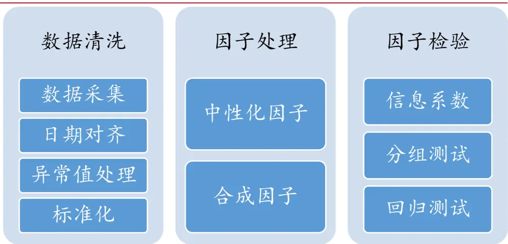
来源：国联证券研究所

## 数据清洗的基本步骤

本文以A股市场上的所有在市股票为样本池，并在各期剔除不可交易股票（ST、PT、一字涨跌停、风险警示股）和上市不满 1 年的股票。然后，对采集的数据尤其是财报数据进行日期对齐并计算原始因子，以确保因子数据为各时点的最新可得数据。接下来分二步处理样本中的异常值。第一步是采用MAD 方法去极值。将超出各因子均值5 倍MAD 的数据都拉回至边界；第二步则是缺失值处理。对财务类因子的缺失值以行业均值填充；对技术类因子则以前值填充缺失值。处理完异常数据，为使各因子具有可比性，对样本数据进行 Zscroe 标准化处理。为确保基准在特定因子上的暴露为 0，参照barra 以流通市值加权计算样本均值，样本标准差则仍不变。

## 因子处理和测试环节

因子处理环节的第一步是中性化处理，除红利因子外，本文对各原始因子均采用线性回归取残差的中性化处理方法：其中对规模因子仅执行行业中性化处理；对其他因子则同步执行行业+市值中性化处理。中性化处理后的因子再经标准化处理即为中性化因子。另外，按照等权合成的方式构建基于三级因子的二级因子和一级因子，即为合成因子。

图表6：各种因子测试方法的优劣比较

| 检验方法 |  | 优势 | 劣势 |
| --- | --- | --- | --- |
| 信息系数 | IC、ICIR | 简明直接 | 只反映因子与股票的线性相关性；无法反映因子组合的超额收益 |
| 回归法 | 单因子FM 检验 | 检验因子在时间序列上的收益和风险表现 | 无法反映因子组合的表现；仍未做到对其他风险完全中性 |
|  | 纯因子组合 | 控制其他风险因子，提纯因子收益；是风险模型、组合优化的基础 | 对其他因子的风险暴露为0;现实投资性不佳 |
| 分组法 | 分组投资组合 | 直接考察因子分组投资组合的收益、波动单调性； | 投资组合易受其他因子的影响；无法厘清特定的因子收益与风险 |

来源：国联证券研究所

综合应用多重检验方法，筛选具有稳定超额溢酬的优秀风险因子。在单因子截面回归后，barra 给出了因子对资产收益率影响的显著程度、稳定性等一套完整的检验标准。其主要以回归系数T 检验值的绝对值来衡量因子的预测能力，有效的风险因子须得在截面回归中显著的解释个股收益。信息系数法则重点关注因子与个股收益的相关性，其核心指标 IC 即为因子暴露与下期个股收益的相关系数，而定义为 IC 均值/标准差的 IR 和 IC 均值的 T 检验值则分别衡量因子预测能力的稳定性和显著性，优秀的风险因子即可显著、稳定的预测个股收益。FM检验则是 barra 单因子检验和IC检验的结合，其于各时点做完单因子截面回归后，再对回归系数的均值执行T 检验，优秀的风险因子其必有卓异于0 的平均溢酬。另外，分组法根据因子的暴露值排序构建 5个投资组合，其可直观考察各组收益、波动的变化及单调情况，但却无法排除市场风险和其他因子的干扰。

图表 7:barra 的单因子检验标准

| t值的绝对值均值 | t值绝对值大于2的比例 | 年化因子收益率 | 年化因子收益波动率 |
| --- | --- | --- | --- |
| 衡量因子对股票超额溢酬的影响程度，大于2即显著 | 解释因子显著性程度的时序分布 | 因子对股票超额溢酬的贡献程度 | 因子对股票超额溢酬的波动贡献 |
| 收益波动比 | 因子收益率与HS300 相关性 | 因子自稳定系数 | 因子方差系数 VIF |
| 考察因子的稳定性 | 相关性越低越好 | 因子暴露的加权自相关系数，以检验其稳定性 | 衡量因子间的共线程度，以因子对其他因子回归的 R²计算：1/（1+R²) |

来源：The Barra US Equity Model (USE4)，国联证券研究所

最后，为进一步排除其他风险因子的干扰以精确测度目标因子的风险回报，本文参照 barra-CNE6多因子模型构造了纯因子组合。如前所述，Barra-CNE6是由1个国家因子、P 个行业因子和Q个风格因子组成的多因子模型，X 矩阵即为 $\mathsf{N}^{\star}(1+\mathsf{P}+\mathsf{Q})$ 阶的期初因子暴露矩阵。由于国家因子与所有行业因子间存在共线性，因此需要对行业因子施加约束条件为：

$$
S_{I_{1}}f_{I_{1}}+S_{I_{2}}f_{I_{2}}\cdots+S_{I_{P}}f_{I_{P}}=0
$$

其中 $S_{I_{1}}$ 为行业 $.I_{1}$ 的整体市值之和，该条件确保了行业因子收益率的加权和为 0。根据Ruud（2000），K个因子收益率间的约束条件可表达为：

$$
\left[\begin{array}{c}{f_{C}}\\{f_{I_{1}}}\\{\vdots}\\{f_{I_{P}}}\\{f_{S_{1}}}\\{\vdots}\\{f_{S_{Q}}}\end{array}\right]=\left[\begin{array}{cccccccc}{1}&{0}&{0}&{\cdots}&{0}&{0}&{\cdots}&{0}\\{0}&{1}&{0}&{\cdots}&{0}&{0}&{\cdots}&{0}\\{\vdots}&{\vdots}&{\vdots}&{\ddots}&{\vdots}&{\vdots}&{\ddots}&{\vdots}\\{0}&{-\frac{S_{I_{1}}}{S_{I_{P}}}}&{-\frac{S_{I_{2}}}{S_{I_{P}}}}&{\cdots}&{-\frac{S_{I_{P-1}}}{S_{I_{P}}}}&{0}&{\cdots}&{0}\\{0}&{0}&{0}&{\cdots}&{0}&{1}&{\cdots}&{0}\\{\vdots}&{\vdots}&{\vdots}&{\ddots}&{\vdots}&{\vdots}&{\ddots}&{\vdots}\\{0}&{0}&{0}&{\cdots}&{0}&{0}&{\cdots}&{1}\end{array}\right]\left[\begin{array}{c}{f_{C}}\\{f_{I_{1}}}\\{\vdots}\\{f_{I_{P-1}}}\\{f_{S_{1}}}\\{\vdots}\\{f_{S_{Q}}}\end{array}\right]+\left[\begin{array}{c}{0}\\{0}\\{\vdots}\\{0}\\{0}\\{\vdots}\\{0}\end{array}\right]
$$

右式的第一个矩阵即为K * （K-1）阶的约束矩阵R，可见行业P 的因子收益率$f_{I_{P}}$ 已由其他行业收益率的线性组合来表达，此即为施加约束后的结果。另外，为解决股票异质性风险导致的异方差问题，barra 还以市值的平方根作为权重实施了 WLS回归。因此，其回归权重矩阵即可记为 V:

$$
\begin{array}{r}{\mathbf{v}=\left[\begin{array}{cccc}{v_{1}}&{0}&{\cdot\cdot\cdot}&{0}\\{0}&{v_{2}}&{\cdot\cdot\cdot}&{0}\\{\vdots}&{\vdots}&{\ddots}&{\vdots}\\{0}&{0}&{\cdot\cdot\cdot}&{v_{N}}\end{array}\right]}\end{array}
$$

其中对角线元素 $v_{N}$ 即为股票N 的市值平方根权重。

综上，根据 Menchero 和 Lee（2015），纯因子投资组合的股票权重矩阵Ω即可由带约束条件的 WLS求解得到：

$$
\Omega=\mathrm{R}(R^{T}X^{T}VXR)^{-1}R^{T}X^{T}V
$$

Ω是为K*N 阶矩阵，其中第i 行即代表所有N 只股票在第 i个因子的纯因子投资组合中的权重。由此，纯因子组合 k 的当期收益率即为 $\Omega_{k}$ 与所有股票当期收益率的乘积：

$$
f_{k}=\Omega_{k}r_{N}
$$

## 2.3.CNE6 因子测试结果

## 行业因子的barra单因子检验

- 申万一级行业因子是有效的风险因子，但因其波动大故不是收益因子。需要深入挖掘行业背后的股价动因。本文接下来根据前述的barra 单因子检验方法对申万一级行业因子进行检验。首先，从收益率来看，2010 年以来，电子、计算机、食品饮料、电气设备、国防军工和医药生物分别以 25.12%、24.51%、22.84%、21.93%、21.71%和 20%的年化收益率在 28 个申万一级行业中排名前 6。就行业因子的显著性水平来看，所有行业系数的 t值绝对值均大于2，故可认为行业因子都是有效的风险因子。但由于行业因子的收益波动很大，除非银金融外各行业因子的年化波动率均大于 25%，即无法通过行业因子投资获得持续、稳定的超额收益，因此其不能被当做收益因子。仍需进一步挖掘高收益行业因子背后的驱动因素。

图表8：申万一级行业因子是有效的风险因子

| Factor Name | Average\|t-Stats\| | Percent\|t\|>2 | AnnualReturn(%) | AnnualVolatility(%) | Factor returnSharp |
| --- | --- | --- | --- | --- | --- |
| 交通运输 | 5.04 | 70.42 | 11.71 | 25.66 | 0.46 |
| 休闲服务 | 2.70 | 52.82 | 15.90 | 28.58 | 0.56 |
| 传媒 | 6.02 | 76.06 | 17.92 | 31.42 | 0.57 |
| 公用事业 | 5.58 | 76.76 | 12.60 | 25.49 | 0.49 |
| 农林牧渔 | 4.50 | 71.13 | 17.25 | 29.07 | 0.59 |
| 化工 | 7.38 | 82.39 | 18.69 | 27.35 | 0.68 |
| 医药生物 | 7.93 | 87.32 | 20.01 | 26.68 | 0.75 |
| 商业贸易 | 4.32 | 66.20 | 10.57 | 26.48 | 0.40 |
| 国防军工 | 5.33 | 77.46 | 21.71 | 34.40 | 0.63 |
| 家用电器 | 3.47 | 66.20 | 18.98 | 25.63 | 0.74 |
| 建筑材料 | 4.19 | 71.13 | 16.53 | 28.37 | 0.58 |
| 建筑装饰 | 4.67 | 69.01 | 14.04 | 27.92 | 0.50 |
| 房地产 | 6.49 | 78.87 | 10.94 | 28.21 | 0.39 |
| 有色金属 | 7.20 | 81.69 | 17.93 | 32.87 | 0.55 |
| 机械设备 | 7.12 | 83.80 | 18.52 | 30.46 | 0.61 |
| 汽车 | 5.55 | 68.31 | 17.66 | 27.35 | 0.65 |
| 电子 | 7.53 | 85.92 | 25.12 | 30.97 | 0.81 |
| 电气设备 | 6.15 | 80.28 | 21.93 | 29.61 | 0.74 |
| 纺织服装 | 3.44 | 62.68 | 11.72 | 27.26 | 0.43 |
| 综合 | 3.12 | 59.86 | 12.83 | 29.69 | 0.43 |
| 计算机 | 7.49 | 87.32 | 24.51 | 35.57 | 0.69 |
| 轻工制造 | 4.14 | 68.31 | 15.96 | 29.59 | 0.54 |
| 通信 | 4.66 | 78.87 | 18.48 | 31.68 | 0.58 |
| 采掘 | 4.82 | 66.90 | 7.32 | 26.55 | 0.28 |
| 钢铁 | 3.81 | 70.42 | 9.26 | 27.92 | 0.33 |
| 银行 | 4.25 | 72.54 | 7.44 | 20.82 | 0.36 |
| 非银金融 | 6.44 | 77.46 | 13.41 | 32.81 | 0.41 |
| 食品饮料 | 5.35 | 73.24 | 22.84 | 26.11 | 0.87 |

来源：聚源数据库，国联证券研究所

## 风格因子的barra单因子检验

接下来即是对风格因子的barra 单因子检验。在单因子的截面回归中，本文仍采用以个股流通市值作为权重的WLS 估计方法，同时选用申万一级行业分类指标作为控制变量。

在 A 股市场上 barra 二级风格因子多是有效的风险因子，小市值、低波动、非流动性、价值股溢酬明显，动量呈现反转效应，成长因子的时序稳定性强。从单因子回归的系数 t 检验值来看，除成长因子外，所有因子的 t 绝对值均值都大于 2，表明这些因子在截面上显著的解释了个股收益率，是为有效的风险因子。从年化因子收益率来看，规模、残差波动率、流动性、动量的溢酬均在-3%以下，说明A 股市场呈现出明显的小市值效应、低波动溢酬、非流动性溢酬和反转效应。成长因子的t绝对值均值虽只有 1.63，但其因子贝塔却高达 1.09，显见其在时间序列上具有十分稳定的表现。从因子的自稳定系数来看，所有因子中仅有动量因子的自稳定系数均值小于0.8，按照 barra 的经验法则其是不可靠的因子。最后，就因子间的共线性测度 VIF 来看，异质波动率的 VIF 值 2.29 是最大值，却也未超过警戒阈值 3，因此多因子间不存在严重的共性线问题。

图表9：小市值、低波动、非流动性、价值、反转效应和成长因子的溢酬显著

| FactorClass | Factor Name | Average\|t-Stats\| | Percent\|t\|>2 | AnnualReturn(%) | AnnualVolatility(%) | FactorreturnSharp | FactorStabilityCoeff. | Corr.WithHS300 | VIF |
| --- | --- | --- | --- | --- | --- | --- | --- | --- | --- |
| 规模 | Incap | 7.11 | 0.81 | -3.92 | 9.01 | -0.44 | 0.97 | 0.06 | 1.30 |
|  | midcap | 2.46 | 0.52 | -6.00 | 5.63 | -1.07 | 0.95 | -0.02 | 1.15 |
| 波动率 | beta | 4.96 | 0.72 | 0.29 | 4.51 | 0.06 | 0.93 | 0.61 | 1.26 |
|  | residual vol | 6.56 | 0.78 | -4.33 | 6.37 | -0.68 | 0.95 | 0.29 | 2.29 |
| 流动性 | liquidity | 4.78 | 0.70 | -3.91 | 4.24 | -0.92 | 0.95 | 0.26 | 1.82 |
| 动量 | momentum | 5.39 | 0.76 | -3.25 | 7.29 | -0.45 | 0.76 | -0.11 | 1.31 |

|  | 红利 | dtop | 3.14 | 0.63 | 1.47 | 3.00 | 0.49 | 0.95 | 0.03 | 1.41 |
| --- | --- | --- | --- | --- | --- | --- | --- | --- | --- | --- |
|  | 价值 | reversal | 3.47 | 0.65 | 1.67 | 3.28 | 0.51 | 0.94 | 0.03 | 1.36 |
|  |  | btop | 4.34 | 0.69 | 2.13 | 4.11 | 0.52 | 0.98 | 0.18 | 2.02 |
|  |  | earnings yield | 4.31 | 0.68 | 4.01 | 4.57 | 0.88 | 0.96 | 0.09 | 1.65 |
|  | 成长 | growth | 1.63 | 0.33 | 2.66 | 2.43 | 1.09 | 0.94 | -0.18 | 1.04 |
| 质量 |  | earnings quality | 2.38 | 0.56 | -0.03 | 2.73 | -0.01 | 0.82 | 0.11 | 1.09 |
|  |  | leverage | 3.27 | 0.63 | -1.18 | 3.84 | -0.31 | 0.99 | 0.29 | 1.27 |
|  |  | investment quality | 2.86 | 0.60 | -0.57 | 3.55 | -0.16 | 0.98 | -0.09 | 1.15 |
|  |  | earnings variability | 2.17 | 0.51 | -0.99 | 3.33 | -0.30 | 0.96 | 0.26 | 1.05 |
|  |  | profitability | 3.24 | 0.68 | 2.08 | 4.07 | 0.51 | 0.99 | -0.20 | 1.32 |

来源：聚源数据库，国联证券研究所

## 风格因子的分组检验

根据 2010年 1月-2021年 10月底的分组检验结果，规模、EP和BP价值、成长、流动性、异质波动率、红利因子的不同分组间收益差异大且单调性良好，是为优秀的风险因子。

就规模因子来看，对数市值和非线性市值的分组检验均表现出了显著的小市值效应，但小市值却均在2018-2020年间经历巨大的负收益。在对数市值因子分组中，本文按照个股的对数因子暴露值将全样本划分为数量相等的5 个组合，各组的因子暴露均值从分组 1到分组5 递增。其他因子分组也均采用相同方法。对数市值分组1 和分组5 在样本期内的累计收益率分别为3.53 倍和 0.52倍，差值大且各组净值严格单调递增。另外，非线性市值分组 1、分组5的累计收益率分别为5.60 倍和 0.97倍，且分组1的表现远远超出其他分组。然而，对数市值和非线性市值的小市值组即分组1 均在 2018-2020年间经历了较大的回撤。对数市值因子的分组1在2018年10 月底出现了51.7%的最大回撤，非线性市值因子也在同期经历了41.8%的最大回撤。对此，Fama 和French（1996）[1]认为是经济的周期风险决定了规模因子的溢酬变化。

图表10：对数市值因子的小市值效应十分明显
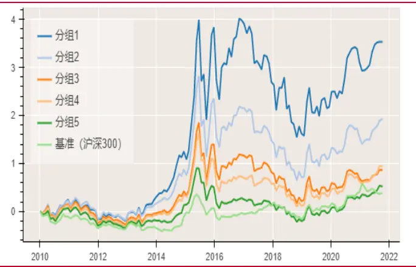
来源：wind，恒生聚源，国联证券研究所

图表11：非线性市值因子的分层效果优异
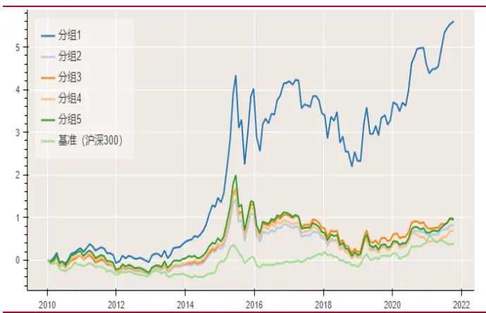
来源：wind，恒生聚源，国联证券研究所

异质波动率和流动性因子的单调性也较好，二者因子暴露最低、最高组合的净值差分别为 2.89、2.75 倍。异质波动率分组 1、分组 5 的累计收益率分别为 2.74 倍、-0.15 倍，差值达 2.89 倍且各组净值区分度高。流动性因子分组 1 和分组 5 的累计收益率则分别为 2.68倍、-0.07 倍，差值达2.75倍且组间收益的单调性较好。

图表12：异质波动率因子分层的收益严格单调
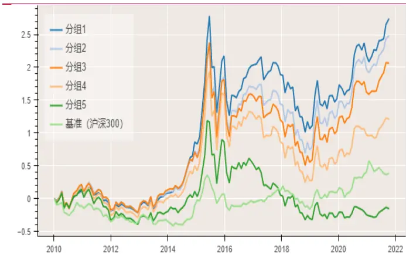
来源：wind，恒生聚源，国联证券研究所

图表13：流动性因子的分层收益单调性良好
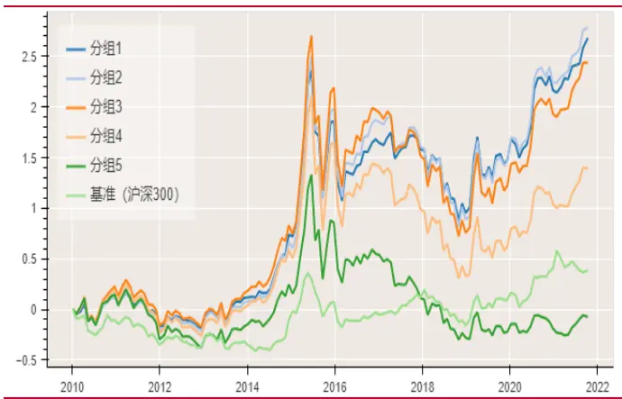
来源：wind，恒生聚源，国联证券研究所

就红利因子和成长因子一起来看，分组检验显示红利因子的单调性和稳定性更好。红利因子的分组1、分组5 累计收益率分别为0.79 倍、2.35 倍，两组差值为1.56 倍。成长因子的累计收益率在分组1 和分组5内则为0.89倍、2.21倍，组间差值仅为 1.32 倍。当就买入持有高溢酬的分组5策略来看，红利因子的收益也更为稳定。红利因子分组 5的月度收益波动率为 7.7%，而异质波动率因子分组5的波动率则为 9.1%。

图表14：红利因子的单调性和稳定性均较好
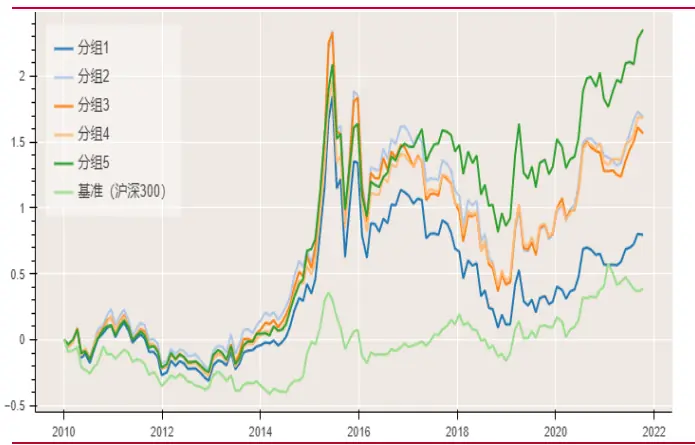
来源：wind，恒生聚源，国联证券研究所

图表15：成长因子也有较好的单调性
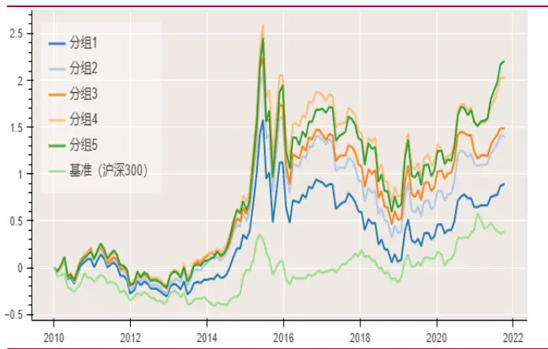
来源：wind，恒生聚源，国联证券研究所

价值类因子中，EP 的分层检验效果优于 BP。EP 因子（earnings yield）分组1、分组 5的累计收益率为0.5倍、3.1 倍，差值高达2.6倍。BP因子（btop）的累计收益率在分组 1、分组5 中分别是 0.75倍、2.18倍，差值为 1.43倍。就因子高溢酬组的收益波动来看，EP 因子分组 5的月度收益波动率为 7.7%，也低于BP 因子分组 5 的 8.3%。

图表 16：bp 价值因子单调性状良好
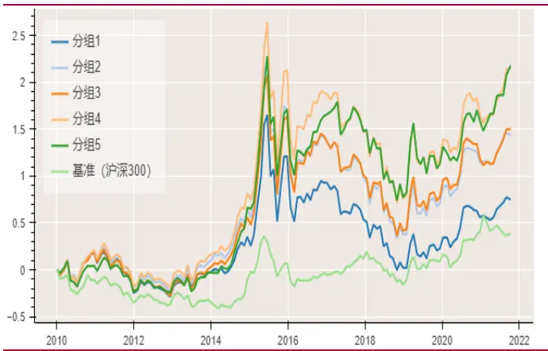
来源：wind，恒生聚源，国联证券研究所

图表17：EP价值因子的单调性和稳定性更优
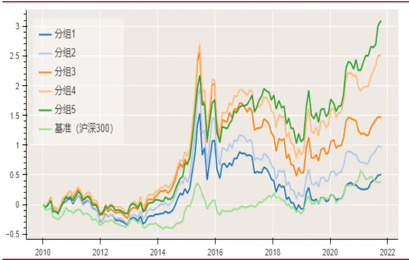
来源：wind，恒生聚源，国联证券研究所

## 风格因子的 ICIR 检验和 Fama-Macbeth 检验

根据 ICIR及FM检验，规模、异质波动率、流动性、成长、价值因子具有显著、稳定的溢酬，质量类因子表现一般。在ICIR 检验中，若按月度收益率序列来评价，一般认为 IC 绝对值大于2.5%且 t绝对值大于2就是优秀的预测变量。根据这一标准，对数市值lncap、非线性市值 midcap、异质波动率 residual vol、流动性因子 liquidity 均为优秀的预测变量。至于价值因子，Liu et al.（2018）[2]指出在中国市场上，基于 EP 构建的价值因子要比传统的BP类价值因子更优。本文的检验结果也与其一致：在 3 个价值类因子 reversal、btop、earnings yield 中，earnings yield是唯一完全通过ICIR 检验的优秀预测变量，而reversal和 btop 的IC 均值则仅分别为 0.017 和 0.015 且在 5%、10%的水平上显著。

在 FM检验中，前述通过ICIR检验的5个因子仍具有显著的年化溢酬。对数市值、非线性市值、异质波动率、流动性因子和 EP价值因子分别有-11.3%、-7.3%、-5.7%、-5.4%和 4.4%的年化溢酬，且 t 统计量均满足 Harvey et al.（2016）[11]大于等于 3的要求。此外，成长因子的年化溢酬为2.7%且t值同样高达3.84。考虑到其 IC值虽仅为0.013却也呈现出统计意义上的显著性，本文即把成长因子也暂归类为收益因子。另外，价值类因子 reversal和btop 也具有显著的年化溢酬。质量类因子则都表现一般，其 IC统计量和 FM统计量都不够显著。

图表18：ICIR及FM检验显示规模、流动、成长、价值和异质波动率为收益因子

| Factor Name | IC-mean | (t-value) | AnnualStd. | IR | sig_positive(%) | sig_negative(%) | annualreturnFM (%) | FM-test(t-value) |
| --- | --- | --- | --- | --- | --- | --- | --- | --- |
| Incap | -0.029 | -2.57 | 0.130 | -0.22 | 26.3 | 42.3 | -11.3 | -3.43 |
| midcap | -0.038 | -6.95 | 0.065 | -0.59 | 8.0 | 36.5 | -7.3 | -4.67 |
| beta | -0.008 | -1.07 | 0.083 | -0.09 | 25.5 | 28.5 | -1.1 | -0.82 |
| residual vol | -0.038 | -3.57 | 0.126 | -0.31 | 22.6 | 48.9 | -5.7 | -2.99 |
| liquidity | -0.036 | -3.98 | 0.106 | -0.34 | 20.4 | 45.3 | -5.4 | -3.95 |
| momentum | -0.014 | -1.41 | 0.112 | -0.12 | 30.7 | 39.4 | -5.2 | -2.46 |
| dtop | 0.012 | 1.84 | 0.079 | 0.16 | 25.5 | 18.2 | 1.8 | 2.16 |
| reversal | 0.017 | 2.65 | 0.074 | 0.23 | 32.1 | 17.5 | 2.2 | 2.44 |
| btop | 0.015 | 1.71 | 0.100 | 0.15 | 37.2 | 29.9 | 2.8 | 2.52 |
| Earningsyield | 0.025 | 3.06 | 0.095 | 0.26 | 32.1 | 19.0 | 4.4 | 3.38 |
| growth | 0.013 | 4.18 | 0.036 | 0.36 | 13.1 | 3.6 | 2.7 | 3.84 |
| earningsquality | 0.001 | 0.29 | 0.058 | 0.02 | 20.4 | 18.2 | -0.2 | -0.21 |
| Leverage | -0.007 | -1.00 | 0.085 | -0.09 | 25.5 | 27.0 | -1.4 | -1.2 |
| investmentquality | -0.002 | -0.29 | 0.070 | -0.02 | 22.6 | 25.5 | -1.3 | -1.25 |
| Equalityvariable | -0.004 | -0.80 | 0.052 | -0.07 | 16.1 | 18.2 | -2.1 | -2.06 |
| Profitability | 0.007 | 0.98 | 0.079 | 0.08 | 30.7 | 22.6 | 3.3 | 2.18 |

来源：聚源数据库，国联证券研究所

## 风格因子的纯因子组合检验

规模、流动性、成长、价值（EP、反转）的纯因子组合具有显著、稳定的因子溢酬，异质波动率因子不再显著。从结果来看，成长、EP价值、流动性、反转、对数市值和非线性市值的年化纯因子收益率分别为4.11%、5.18%、-4.5%和2.71 % ，-5.38%、-5.77%，其在经济意义上和统计意义上都是显著的。因此，这些因子可以被称为具有显著、稳定溢酬的收益因子。而异质波动率因子的溢酬在统计意义上则不再显著，Feijoo 等（2015）[12]的研究就认为异质波动率因子的风险溢酬更多源于价值、规模、动量和整体经济环境的变化。

图表19：纯因子组合检验显示异质波动率因子不再显著

| Factor Name | Annual Return(%) | Annual Std.(%) | (t-value) | SharpRatio | maxDD(%) | maxDD_date |
| --- | --- | --- | --- | --- | --- | --- |
| Incap | -5.38 | 7.89 | -2.34 | -0.68 | -12.92 | 2021-01-29 |
| midcap | -5.77 | 6.28 | -3.16 | -0.92 | -1.79 | 2021-08-31 |
| beta | -1.08 | 3.89 | -0.96 | -0.28 | -9.85 | 2021-08-31 |
| residual vol | 2.39 | 6.93 | 1.19 | 0.35 | -7.58 | 2014-12-31 |
| liquidity | -4.50 | 2.74 | -5.64 | -1.64 | -3.38 | 2021-08-31 |
| momentum | -1.80 | 6.82 | -0.91 | -0.27 | -13.97 | 2021-08-31 |
| dtop | -0.73 | 1.27 | -1.97 | -0.58 | -2.04 | 2019-02-28 |
| reversal | 2.71 | 2.17 | 4.30 | 1.25 | -1.13 | 2015-11-30 |
| btop | -0.15 | 2.45 | -0.21 | -0.06 | -7.58 | 2019-02-28 |
| Earnings yield | 5.18 | 2.90 | 6.16 | 1.80 | -1.89 | 2020-12-31 |
| growth | 4.11 | 2.24 | 6.32 | 1.84 | -1.28 | 2016-07-29 |
| earningsquality | -0.80 | 2.07 | -1.32 | -0.39 | -3.44 | 2021-08-31 |
| Leverage | -1.27 | 1.89 | -2.31 | -0.67 | -3.21 | 2015-08-31 |
| investmentquality | -0.77 | 2.69 | -0.99 | -0.29 | -4.71 | 2021-10-29 |
| Equalityvariable | -1.32 | 1.61 | -2.83 | -0.82 | -1.47 | 2011-04-29 |
| Profitability | 1.23 | 2.88 | 1.47 | 0.43 | -3.31 | 2021-10-29 |

来源：聚源数据库，国联证券研究所

从时序来看，对数市值因子在今年以来止跌恢复到2017年以前的高涨态势；非线性市值因子则在 2020 年出现跳跃式增长；EP 价值、流动性和成长的纯因子组合净值稳步增长。Liu 等（2019）[2]指出在中国市场上规模因子是最显著的风险因子，且其表现也优于海外市场；但在 2017年以后A 股的规模因子却失效了。从风格因子的纯因子组合对比来看情况确实如此：2017 年以前，对数市值的纯因子组合净值持续高增并在 2013 年8 月超越EP价值因子后领跑市场，直至 2016 年底其达到2.12倍的最高点，区间CAGER 高达 11.3%。自2017 年起，对数市值因子组合就进入了下行通道，其净值分别在 2018 年 9 月和 2021 年 1 月创下 1.77 和 1.71 倍的新低。而自今年2 月份以来，对数因子一改颓势，其组合净值稳健增长至 10月底的1.82 倍,区间 CAGER 为 4.5%。

图表20：规模、EP价值、流动性和成长纯因子组合的净值高于1.6倍
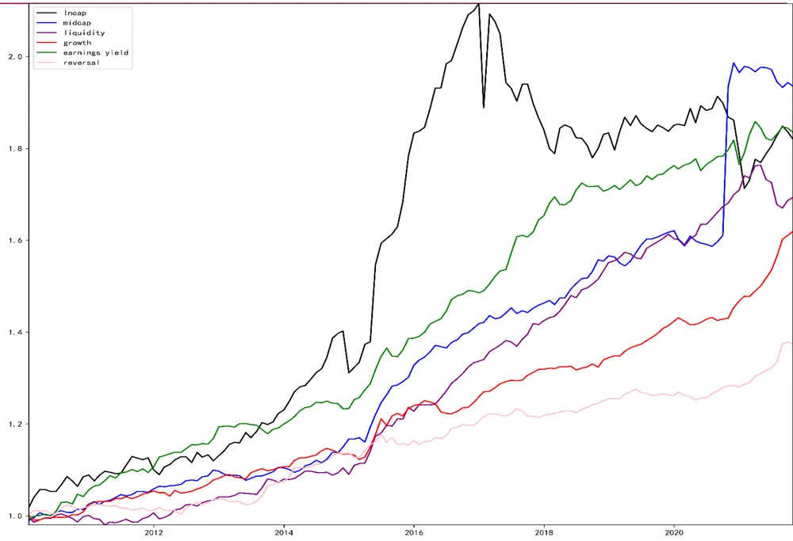
来源：聚源数据库，国联证券研究所

非线性市值因子捕获了被对数市值因子忽视的中等市值公司的超额溢酬，其又被称为中市值因子。中市值因子组合的净值自 2010 年起不断增长至 2020 年 9 月的1.61 倍，然后在 10月 20%的跳涨后进入震荡区间。EP价值、流动性、成长和反转因子的纯因子收益表现则更为稳健，四者的组合净值自 2010 年起稳步增长至 2021年 10 月的 1.83、1.69、1.62 和 1.37 倍，CAGER 分别为 5.3%、4.6%、4.2%和 2.7%。

## 3. 规模和成长因子迎来周期的春天

## 3.1.金融周期状态的细化测度

## 将金融周期划分为高涨期、衰退期和正常期三类

通过HP滤波法得到私人部门信贷/GDP指标的周期波动项，并按其与趋势均值的偏离程度将金融周期划分为高涨期、衰退期和正常周期。在前文计算出私人部门信贷/GDP 变量的基础上，本文仍参考陈雨露等（2015）[4]利用 HP 滤波法计算出该变量的周期值c̃，然后在此基础上认定金融周期状态：

(1) 高涨期。当私人部门信贷/GDP 的周期值c̃大于一个标准差时，定义其为高涨期的“顶峰”。然后再向前推 2期，如果观察点不是“低谷”点且其到“顶峰”点单调递增，则将其纳入高涨期；接着再向后推两期，如果观察点不是“低谷“点且从”顶峰点“到该点单调递减，也将其纳入高涨期。以二元变量 Boom 标记高涨期：当观察值处于该区间时，周期状态取值为1，其余时点则取值为0。

(2) 衰退期。当周期值c̃小于一个标准差时，即定义其为“低谷”点。然后向前、后各推 2 期。如果前期观察点不在高涨期内且到“低谷”点单调递减、后期观察点不在高涨期内且从“低谷”点至该点单调递增，则将满足条件的观察点纳入衰退期。当观察点位于衰退期内时，周期状态取值为-1，其余时点保持不变。

(3) 正常期。除去上述高涨期和衰退期以外的时点即被定义为正常期，其周期状态的取值为0。

除此外，当在某一点 M2 与 GDP 的同比增速差持续 3 个季度大于 2%时，本文将其重置为高涨期；当M2 与 GDP 的同比增速差连续3个季度小于 0时，则将其重置为衰退期。

图表21：今年以来金融周期变量触底回升，金融周期状态进入正常期
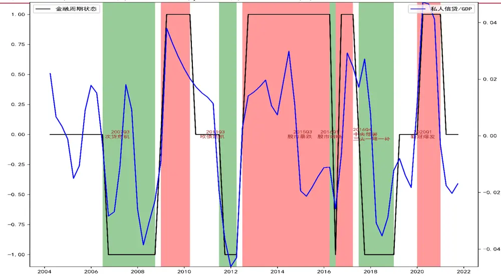
来源：聚源数据库，国联证券研究所

根据上述构建方法，在样本期内共有4个时段被识别为金融高涨期，分别对应于2009 年 1 季度—2010 年 1 季度、2012 年 3 季度—2016 年 1 季度、2016 年 3—

2017年1 季度、2020年1 季度—2020年4季度；有4个时段则被定义为金融衰退期，分别是 2016 年 3 季度—2018 年 3 季度、2011 年 3 季度—2012 年 1 季度、2016年 2 季度和 2017 年 3 季度—2018 年 4 季度。其中最近的一次金融衰退期发生于2017 年的供给侧改革开启后，此后直至 2020 年新冠疫情爆发才又进入了金融高涨期。今年以来，随着疫情救助政策的逐步退出，金融周期变量在3 季度触底回升，金融周期恢复正常状态。

## 3.2.金融顺周期助力中小票，经济新周期利好成长股

## 供给侧改革推动去杠杆，规模因子在周期中蝶变

供给侧改革去杠杆，小市值组合的杠杆风险敞口显著下降。将非线性市值和对数市值因子等权合成为规模因子，其即反映了中小市值公司的超额溢酬。以规模因子 5分组中最具代表性的小市值组合（分组1）为例，自2017年供给侧改革推动去杠杆以后，金融周期随之进入衰退期，小市值组合的杠杆风险敞口也出现了明显的下降：相较于前 4年平均-9.6%的风险暴露，2017年以后小市值组合的杠杆风险暴露均值即降到了-12.9%。

图表22：供给侧改革后规模因子小市值组的杠杆风险暴露显著下降
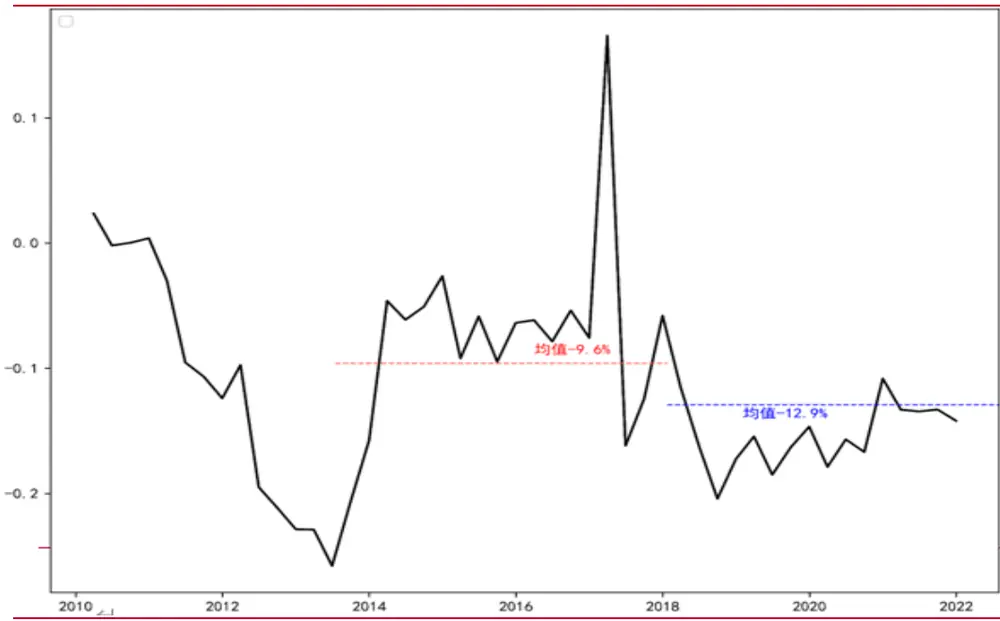
来源：聚源数据库，国联证券研究所

金融顺周期叠加经济新周期，规模因子迎来周期的春天。金融周期长期主导着规模因子的表现。从纯因子组合来看，规模因子的纯因子组合净值在金融高涨期内高速增长并在 2017 年年初达到 2.14倍的最高点，然后在金融衰退期内快速下降并于 2018年6月达到1.81倍的最低点。以规模因子5 分组构建的多空组合净值也有相同的趋势：其于 2016年底达到 4.52 倍的最高点，并在2018年底取得2.48 倍的最低值。而从 2020 年以来，疫情救助政策的施行和退出也使金融周期经历了从高涨到正常的状态轮换，规模因子也随之出现“过山车”行情。今年以来，随着金融周期变量的企稳回升和经济新周期的影响，规模因子终于迎来周期的春天：至 3季度末，规模因子的多空组合收益率较年初大涨32%、纯因子组合收益率也较年初增长 6%。

图表23：规模因子在经济新周期和金融顺周期的推动下迎来翻身
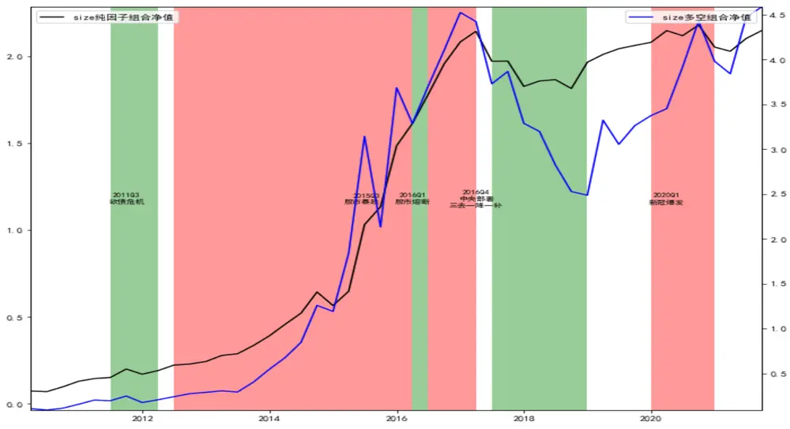
来源：聚源数据库，国联证券研究所，注：绿色区域为金融衰退期，红色区域为金融高涨期

## 供给侧改革淘汰“伪成长”，经济新周期来临带动“真成长”

供给侧改革去杠杆淘汰“伪成长”，拥抱新周期的成长因子组合净值持续高涨。在此同样按 5分组的方法构建成长因子多空组合。该组合的净值从 2015年起震荡走低，且在 2018年的金融衰退期内遭遇 28%的巨大回撤。而控制了杠杆、行业等风险因子后的成长纯因子组合净值在同期却仅有3%的回撤，由此可见供给侧改革对成长因子的纯化作用。自2020年以来，创新驱动型产业的发展蔚然成风，经济新周期的碳中和主线率先启动。同期成长因子多空组合和纯因子组合收益率也分别取得了50%、68%的显著增长。

图表24：成长因子投资组合的净值跨越金融周期、持续增长
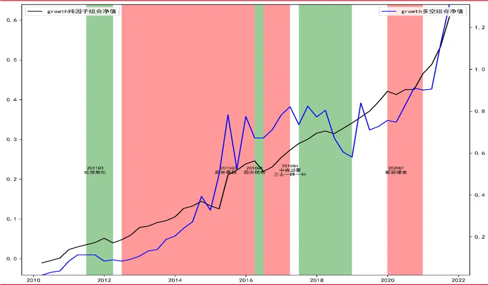
来源：聚源数据库，国联证券研究所，注：绿色区域为金融衰退期，红色区域为金融高涨期

## 3.3.周期下的资产定价总结

## 随机折现因子开辟资产定价新思路

实证模型更关注截面资产定价，无法避免因子的周期性失效；随机折现因子基于经济逻辑建模，更易解释风险偏好和资产价格的周期性波动。资产定价实证中常用的信息系数、回归方法大都从截面着手分析因子与资产收益的相关性，对因子的时序表现则多以均值T 检验考察，忽视了因子的周期性波动。随机折现因子则从风险偏好入手建模，其认为经济繁荣时人们的风险偏好高、折现率高，故高风险资产如小盘股、成长股受到追捧；经济不好时人们的风险偏好低、折现率低，故现金流稳定、成长确定性强的低风险资产备受青睐。而在横截面的资产投资抉择上，人们更愿意高价购买能在未来经济差时“雪中送炭”的资产，即对系统性风险越小的资产期望收益率越小。反之亦然。

## 规模因子和成长因子正在迎来周期的春天

本文以随机折现因子结合 barra 多因子模型，从资产定价的理论到实证引入周期考量。由此发现 A 股市场上的规模因子和成长因子正在迎来周期的春天。随机折现因子是资产定价领域的核函数，实证常用的多因子模型均是其在现实世界中的投影，故也都会受到周期的影响。近年来，学界越来越关注经济、金融双周期对资产定价的影响，本文即在双周期的视角下检验 barra-CNE6多因子模型。

金融顺周期助力中小票，经济新周期利好成长股。实证发现在 A 股市场上规模因子即小市值效应更易受到金融周期状态变化的影响，规模因子组合在 2012-2016年的金融高涨期内领跑所有风格因子、却又在 2017-2018 年的金融衰退期内遭遇巨大回撤。今年以来，随着金融周期变量的触底回升，规模因子表现优异。预计明年在金融顺周期叠加经济新周期的助力下，规模因子将正式迎来周期的春天。成长因子则更多受经济新周期的影响。近2 年来创新驱动型产业迅猛发展，经济增长的动能推陈出新。在新周期的主导趋势下，预计 2022年成长因子仍将延续高景行情。

## 4. 风险提示

模型均基于量化方法构建且有适用的假设条件，故存在失效风险；

## 参考文献

[1] Fama, E. F. and K. R. French (1996). Multifactor explanations of asset pricing anomalies. Journal of Finance 51(1), 55-84.

[2] Liu, J., R.F. Stambaugh and Y. Yuan (2018). Size and Value in China. Journal of Finance Economics 134(1), 48069.

[3] Levine, R (2000). Bank-Based or Market-Based Financial Systems: Which Is Better. World Bank Working Papers

[4] 陈雨露, 马勇,阮卓阳(2015).金融周期和金融波动如何影响经济增长与金融稳定？金融研究,428 (2),1-22.

[5] Fama, E. F. and K. R. French (1993). Common risk factors in the returns on stocks and bonds. Journal of Financial Economics 33(1), 3-56.

[6] John H. Cochrane (2005). Asset Pricing. Princeton University Press.

[7] Fama, E. F. and J. D. MacBeth (1973). Risk, return, and equilibrium: Empirical tests. Journal of Political Economy 81(3), 607-636.

[8] Jegadeesh, N., J. Noh, K. Pukthuanthong, R. Roll, and J. Wang (2019). Empirical tests of asset pricing models with individual assets: Resolving the errors-in-variables bias in risk premium estimation. Journal of Financial Economics 133(2), 273-298.

[9] Fama, E. F. and K. R. French(2020). Comparing cross-section and time-series factor models. Review of Financial Studies 33(5), 1891-1926.

[10] Menchero, J. and J-H. Lee(2015). Efficiently combining multiple sources of alpha. Journal of Investment Management, Vol. 13(4), 71-86.

[11] Harvey, C. R., Y. Liu, and H. Zhu (2016). … and the Cross-section of expected returns. Review of Financial Studies 29(1), 5-68.

[12] Luis, G. Feijoo, Lawrence Kochard, Rodney N. Sullivan, Peng Wang (2015). Low Volatility cycles: the influence of valuation and momentum on low-volatility portfolios. Financial Analysis Journal 71(3) 47- 60.

## 分析师声明

本报告署名分析师在此声明：我们具有中国证券业协会授予的证券投资咨询执业资格或相当的专业胜任能力，本报告所表述的所有观点均准确地反映了我们对标的证券和发行人的个人看法。我们所得报酬的任何部分不曾与，不与，也将不会与本报告中的具体投资建议或观点有直接或间接联系。

## 评级说明

| 投资建议的评级标准 |  | 评级 | 说明 |
| --- | --- | --- | --- |
| 报告中投资建议所涉及的评级分为股票评级和行业评级（另有说明的除外）。评级标准为报告发布日后6到12个月内的相对市场表现，也即：以报告发布日后的6到12个月内的公司股价（或行业指数）相对同期相关证券市场代表性指数的涨跌幅作为基准。其中：A股市场以沪深300指数为基准，新三板市场以三板成指（针对协议转让标的）或三板做市指数（针对做市转让标的）为基准；香港市场以摩根士丹利中国指数为基准；美国市场以纳斯达克综合指数或标普500指数为基准；韩国市场以柯斯达克指数或韩国综合股价指数为基准。 | 股票评级 | 买入 | 相对同期相关证券市场代表指数涨幅20%以上 |
|  |  | 增持 | 相对同期相关证券市场代表指数涨幅介于5%~20%之间 |
|  |  | 持有 | 相对同期相关证券市场代表指数涨幅介于-10%~5%之间 |
|  |  | 卖出 | 相对同期相关证券市场代表指数跌幅10%以上 |
|  | 行业评级 | 强于大市 | 相对同期相关证券市场代表指数涨幅10%以上 |
|  |  | 中性 | 相对同期相关证券市场代表指数涨幅介于-10%~10%之间 |
|  |  | 弱于大市 | 相对同期相关证券市场代表指数跌幅10%以上 |

## 一般声明

除非另有规定，本报告中的所有材料版权均属国联证券股份有限公司（已获中国证监会许可的证券投资咨询业务资格）及其附属机构（以下统称“国联证券”）。未经国联证券事先书面授权，不得以任何方式修改、发送或者复制本报告及其所包含的材料、内容。所有本报告中使用的商标、服务标识及标记均为国联证券的商标、服务标识及标记。

本报告是机密的，仅供我们的客户使用，国联证券不因收件人收到本报告而视其为国联证券的客户。本报告中的信息均来源于我们认为可靠的已公开资料，但国联证券对这些信息的准确性及完整性不作任何保证。本报告中的信息、意见等均仅供客户参考，不构成所述证券买卖的出价或征价邀请或要约。该等信息、意见并未考虑到获取本报告人员的具体投资目的、财务状况以及特定需求，在任何时候均不构成对任何人的个人推荐。客户应当对本报告中的信息和意见进行独立评估，并应同时考量各自的投资目的、财务状况和特定需求，必要时就法律、商业、财务、税收等方面咨询专家的意见。对依据或者使用本报告所造成的一切后果，国联证券及/或其关联人员均不承担任何法律责任。

本报告所载的意见、评估及预测仅为本报告出具日的观点和判断。该等意见、评估及预测无需通知即可随时更改。过往的表现亦不应作为日后表现的预示和担保。在不同时期，国联证券可能会发出与本报告所载意见、评估及预测不一致的研究报告。

国联证券的销售人员、交易人员以及其他专业人士可能会依据不同假设和标准、采用不同的分析方法而口头或书面发表与本报告意见及建议不一致的市场评论和/或交易观点。国联证券没有将此意见及建议向报告所有接收者进行更新的义务。国联证券的资产管理部门、自营部门以及其他投资业务部门可能独立做出与本报告中的意见或建议不一致的投资决策。

## 特别声明

在法律许可的情况下，国联证券可能会持有本报告中提及公司所发行的证券并进行交易，也可能为这些公司提供或争取提供投资银行、财务顾问和金融产品等各种金融服务。因此，投资者应当考虑到国联证券及/或其相关人员可能存在影响本报告观点客观性的潜在利益冲突，投资者请勿将本报告视为投资或其他决定的唯一参考依据。

## 版权声明

未经国联证券事先书面许可，任何机构或个人不得以任何形式翻版、复制、转载、刊登和引用。否则由此造成的一切不良后果及法律责任有私自翻版、复制、转载、刊登和引用者承担。

联系我们

无锡：江苏省无锡市太湖新城金融一街8 号国联金融大厦9 层

上海：上海市浦东新区世纪大道1198号世纪汇广场1座 37层

电话：0510-82833337

电话：021-38991500

传真：0510-82833217

传真：021-38571373

北京：北京市东城区安定门外大街208号中粮置地广场4层

深圳：广东省深圳市福田区益田路6009 号新世界中心29 层

电话：010-64285217

电话：0755-82775695

传真：010-64285805