撰写日期：2022 年 11 月 29 日

# 主动暴露的得与失—从 Barra 框架到私募指增因子分析方法

金融工程专题报告

分析师：李亭函

执业证书编号：S0890519080001

电话：021-20321017

邮箱：litinghan@cnhbstock.com

研究助理：张帅
邮箱：
zhangshuai564576@cnhbstock.com

## 销售服务电话：

021-20515355

## 相关研究报告

[table_product] 1 《金融工程：如何将 PB_ROE 模型用于行业轮动？-量化视点 2022 年第 14 期》2022-11-21

2 《金融工程：寻找具备“反脆弱”能力的主动权益基金-FOF 策略专题》2022-10-243 《金融工程：如何将价值成长风格轮动用于指数化投资？-量化视点2022年第13期》2022-09-26

## ◎ 投资要点：

- 对于私募指数增强产品来说，指数本身的风险是一种被动的且必需的暴露，因此风险因子对指数的主动暴露成为了一种调节工具，一方面对应着选股模型的能力特点，一方面也掺杂着私募机构的主观判断。本文针对私募指数增强产品的策略流程，设计了一套相应的风险因子暴露分析方法，在数据匮乏的情况下取得了良好的效果，打开了从风险暴露的角度构造因子对私募指数增强产品进行分析的道路。

- 在敞口暴露因子的分析过程中，本文发现总体上大的风格敞口暴露和小的行业敞口暴露会导致指数增强产品较差的收益表现。这说明在带有主观色彩的风格因子控制中，过度放大敞口会侵蚀产品的净值；在相对统一的行业因子控制中，过严的敞口约束会削弱收益的贝塔来源。

- 在敞口反转因子的分析过程中，本文发现沪深 300 指数增强产品的业绩延续性最强，业绩较差的产品无法通过风格和行业的敞口大幅调整来实现净值的追赶，反而会导致更差的结果，但是对中证500 和中证1000 来说没有明显差别。这与沪深 300 指数增强策略中基本面因子的比例更高有关。相比量价因子，不同私募基金在基本面因子上的挖掘效果差异较大，并且基本面因子需要依靠人工挖掘，更新迭代周期较慢，而量价因子的失效和迭代周期更快，敞口上的变化一定程度反映了策略的更新迭代。

- 在对风险轮动因子的分析中，本文得到了敞口反转因子中一致的结果。沪深300指数增强产品的业绩延续性更强，一部分原因表现在优秀的沪深300指数增强产品具有风格和行业的轮动能力，但是在中证 500 和中证 1000的竞争格局中，这种优势不太明显。经过测试发现，在业绩统计筛选方法中加入风险轮动因子可以显著提升沪深 300 指数增强产品筛选组合的收益表现，其中加入风格轮动因子后组合年化超额收益从 15.6%提升到了23.5%，超额最大回撤从 6.2%下降到了 5.5%。

- 风险提示：本报告主要采用数量化研究方法，可能存在模型设定偏差。

如何从股票市场中获取收益是人们一直探索的方向，经典的CAPM模型将股票收益拆解为Alpha和Beta 两部分，由此衍生出了两类策略，一是消除市场影响、彰显主动管理能力的纯 Alpha 策略，如股票市场中性策略和 T0 策略，策略呈现出与市场较低的相关性，但收益稳定性较好，收益风险比较高；二是站在市场的肩膀上顺势而为的 Beta+策略，如指数增强策略和SmartBeta 策略，这类策略与指数表现出高度相关性，但同时也能获得相对于指数额外的收益。

在私募市场中，股票市场中性策略和指数增强策略依托于股票市场，策略容量相对充足，方法论比较成熟，收益特征也能满足不同投资者的风险偏好，因此成为各机构广泛布局的策略基石。具体来看，二者主要区别在于股票市场中性策略需要对冲市场的Beta 影响，常见的方法包括做空股指期货、ETF 融券、期权合成期货等，这就带来了两个问题：一是对冲需要占用一定的资金，会影响组合资金的使用效率，二是对冲需要付出额外的成本，会降低策略的收益表现，而指数增强策略规避了这些困扰，同时还具备Beta属性，在市场上涨时收益弹性更大，成为了量化私募市场发展最快的策略之一。

图 1：股票策略分类
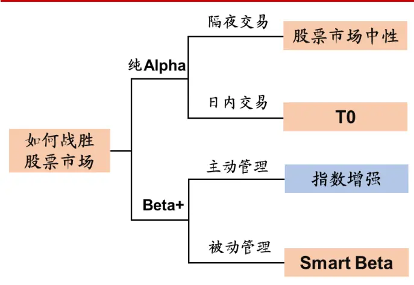
资料来源：华宝证券研究创新部

图 2：私募指增、中性产品每季度发行数量
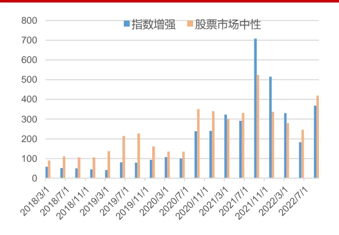
资料来源：华宝证券研究创新部，私募排排网

在私募基金研究中，可获得的数据较为稀缺，相比公募基金会对持仓数据进行定期公布，私募基金能够拿到的数据就少之又少，甚至净值数据都是残缺不全的，需要靠调研来进行定性的补足，不过对指数增强策略进行定量研究仍然有迹可循。指数增强策略作为量化多头的代表，大多公司采用了相似的流程和框架，虽然在数据披露上不规范，但数量上浩如烟海，因此只要处理得当就可以发挥量化研究在广度上的优势，通过定性与定量相结合，提高我们对私募市场指数增强策略的认识。

风格与行业分析是对股票类金融产品研究的基本方法，也是私募指数增强策略量化研究首当其冲的问题，公募基金对此可以从持仓股票进行底层合成，私募基金则需要对净值曲线进行加工。本文从私募市场指数增强策略的框架开始，介绍了对私募指数增强产品风格以及行业暴露的分析方法，希望打开对私募标准量化研究的通道。随着投资理念发展，因子已经不再局限于对底层资产的描绘，对大类资产和金融产品的因子化投资大行其道，本文基于风格以及行业暴露分析方法，对私募指数增强产品构造了三个简单的因子，希望从因子角度提供对私募指数增强产品更多的观察维度。

## 1. 私募指数增强策略流程简介

私募市场中的指数增强策略虽然在细节上各有不同，但基本都以多因子选股为整体框架，依照因子挖掘-寻找股票代理信息、模型加权-形成股票预期收益、组合优化-确定股票最终权重的流程运作。

图 3：私募指数增强策略开发流程图
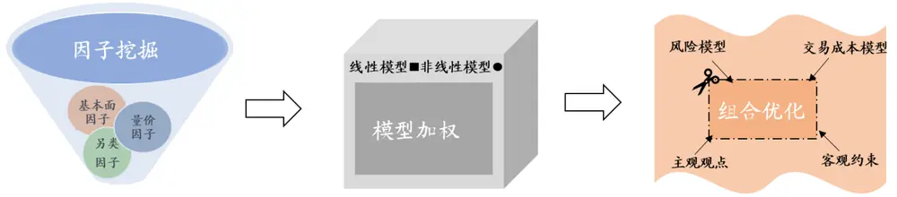
资料来源：华宝证券研究创新部

## 1.1. 因子挖掘

因子是用于预测股票收益的变量，可以分为基本面因子、量价因子和另类因子三大类，具体含义和特征如下：

基本面因子主要采用财务指标构建，还包括分析师一致预期数据，由于财务指标在季度财报中才会披露，因此基本面因子平时变化不大，在财报季会驱动形成大量交易。基本面因子追求的是股票的价值回归，总体偏向左侧交易。

量价因子利用股票的交易信息生成，可以分为人工量价因子和机器量价因子两类，前者从实际逻辑出发，数量较少；后者利用遗传算法、深度学习等自动挖掘，可以批量生成。由于高频数据相比低频数据包含了更多信息，目前量价因子已经发展到利用 Level2 逐笔成交数据进行构建。量价因子捕捉的是股票的定价错误，总体偏向右侧交易，衰减和失效也更快。

另类因子对新闻舆情、网站搜索结果等进行加工，往往需要利用爬虫抓取数据,大规模采用自然语言处理，目前整体数量有限，是基本面和量价因子日渐拥挤之后扩充信息来源的有效途径。

## 1.2. 模型加权

将不同因子加权的方式可以分为线性模型和非线性模型两大类。其中线性模型结构简单，拟合能力差但是可解释性高，不容易过拟合；非线性模型拟合能力好，但是作为一个黑箱可解释性差，容易产生过拟合。

等权模型是最简单的线性模型，此外 IC 加权、 IC_IR 加权，最大化复合 IC_IR 加权也是常见的线性加权方式。IC 加权取每个因子过去一段时间的 IC 均值作为权重，IC_IR 加权取每个因子过去一段时间 IC均值除以标准差作为当期因子的权重，最大化复合IC_IR 加权计算合成因子的IC和标准差，以最大化复合IC_IR 为目标。

非线性模型以各类机器学习模型为代表，常见非线性模型可以分为树类模型和神经网络类模型两大类。随机森林和 Xgboost 是最常见的树类模型，对应了决策树在 Bagging 和Boosting 两个维度的集成提升。神经网络类模型包括卷积神经网络、循环神经网络等，对单个因子质量要求不高，十分适合对同质弱信号的特征提取，如原始量价数据、机器批量挖掘的因子等。

在实际应用过程中不会依赖某个因子，一般也不会单独使用某个模型，最终的预测信号是不同种类、不同参数模型的组合。

图 4：私募指数增强策略模型加权过程
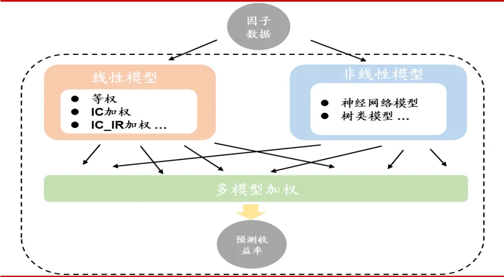
资料来源：华宝证券研究创新部

## 1.3. 组合优化

如果把因子挖掘类比于食材的寻找，模型加权则是对食材的加工，那么组合优化就像是最后的塑形和摆盘。组合优化一般会对成本交易进行约束，狭义的交易成本模型指要求交易收益高于交易成本，一般适用于高频交易中对交易信号的筛选，而广义的交易成本模型对换手率进行限制；风险模型以 Barra 风险因子为基础，是私募指数增强策略广泛使用的风险约束框架。风险模型与交易成本模型以及其他主观约束、客观约束共同构成了一个凸优化问题，可以写作：

$$
\begin{array}{rl}{\operatorname*{max}}&{{}w^{\prime}r-\lambda w^{\prime}{\sum}w}\end{array}\tag{1.1}
$$

$$
\begin{aligned}s.t.\left\{\begin{matrix}\left|w-w^{0}\right|<\delta\\w_{min}<w<w_{max}\\f_{min}<Xw<f_{max}\\\cdots\end{matrix}\right.\end{aligned}\tag{1.2}
$$

(1.3)

(1.4)

优化目标(1.1)以最大化均值-方差效用函数为例，公式中 w代表股票权重向量，r代表预测收益率，∑为股票收益的协方差矩阵。(1.2)代表换手率的约束， (1.3)代表单一股票的权重约束，(1.4)代表对组合风险暴露的约束，X为股票Barra 风险因子暴露度矩阵，Barra风险因子包括30个中信一级行业因子和10个风格因子。

本文主要研究组合优化中的风险模型，风险模型对于指数增强策略的作用体现在：首先可以控制组合的行业和风格与指数接近，收益表现也与指数本身保持类似节奏，以符合策略本身的目的；其次避免持仓过于集中，分散风险；此外还可以根据对未来的预期实现对指数的主动偏离。

## 2. 私募指数增强策略风险暴露分析方法

风险因子可以一定程度解释 A 股的市场风险，因子本身也呈现一定的波动性，行业和风格是最常见的风险因子，因此需要对股票类产品的行业和风格进行分析，即风险暴露分析。在公募基金研究中常用价值/成长和大盘/小盘进行风格分析，对私募指数增强产品来说，由于在风险模型中使用了 Barra 风格因子进行约束，直接分析 Barra 风格因子暴露一方面可以追本溯源，另一方面可以提供更精细的观察视角。

图 5：传统风格因子与 Barra 风格因子
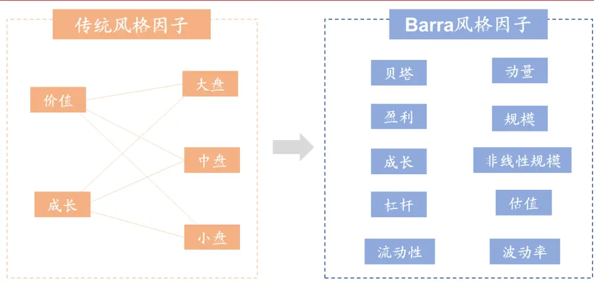
资料来源：华宝证券研究创新部

## 2.1. 方法介绍

对于私募指数增强产品虽然没有股票持仓数据，但是可以根据因子收益率计算得到因子暴露。根据因子收益率的算法，已知所有个股的因子暴露值，通过横截面上有约束的加权回归可以得到相应的因子收益率，我们反其道而行之，把私募指数增强产品的收益率对因子收益率做回归就可以得到相关因子暴露。直接这样做会遇到两个问题:

Barra风格因子在构建时考虑了多重共线性问题，行业因子与截距项之间的共线性可以通过约束条件消除，因此可以通过截面回归的方式得到相应的因子收益率，但是不同因子收益率的时间序列无法满足不存在多重共线性的假定。

Barra风险因子共有40个，对时间序列回归的样本数量提出了一定要求。通过时间序列回归的前提是私募指数增强产品的风险暴露固定不变，但是私募指数增强产品的调仓是比较频繁的，意味着越久远的样本参考意义越小，这就形成了大样本需求与低样本质量之间的矛盾。

对第一个问题，可以使用PCA主成分分析法来解决，

$$
B=\begin{array}{l}AP\end{array}\tag{2.1}
$$

$$
Y=[\overline{{{1}}}\mathrm{~}B]\left[\begin{matrix}{\alpha}\\{\beta}\end{matrix}\right]\tag{2.2}
$$

关于PCA本身的原理本文不再赘述，(2.1)中A是原始的风险因子收益率矩阵，P是A相关系数矩阵的特征向量矩阵，B是降维之后的主成分，将 B添加截距项后与收益率序列做回归就可以得到针对主成分的因子暴露，把公式(2.1)代入公式(2.2)可知原始的风险因子暴露为$P\beta$ 。为了获得更加准确的结果，可以根据实际情况对回归增加一些限制。在 Barra 框架中，对于单只股票来说，某个行业的暴露值是 0 或 1，某个风格的暴露值是相关指标在横截面上标准化处理后的结果，因此可以在回归求解时把行业因子的暴露限制在 0到1 之内。

对于第二个问题，最容易想到的解决办法就是根据半衰期对样本赋权，除此之外本文还根据实际需求对风险因子进行了拆分，把收益率分别对行业和风格收益率做回归。在 Barra框架中经常能提到的一个概念是纯因子收益率，以最简单的最小二乘回归为例，

$$
\theta=(X^{\prime}X)^{-1}X^{\prime}Y\tag{2.3}
$$

可以发现 $\ _{!}(X^{\prime}X)^{-1}X^{\prime}$ 与 X相乘可以得到一个单位矩阵，这并不是一个偶然现象，可以理解为 $(X^{\prime}X)^{-1}X^{\prime}$ 每一行都构造了一个资产组合，使得对某个因子的暴露为 1，对其他因子的暴露为0，即一个纯因子组合，对于Barra中带约束的加权回归也是同样的道理。纯因子是一个相对的概念，Barra的纯因子收益率剥离了其他所有风险因子的影响，我们这里由于要对行业和风格分别进行回归，需要重新构造行业和风格各自的纯因子收益率，其中行业收益率可以直接利用行业指数进行构建，风格收益率仍需要对个股风格暴露进行截面回归。

## 2.2. 结果展示

本文回测数据时间范围从 2019 年 1 月至 2022 年 9 月 31 日，利用过去一年的样本按月滚动回归，实际展示区间从 2020年1月开始。我们知道私募指数增强产品会保持与指数相似的行业和风格暴露，因此将产品的因子暴露值减去指数的因子暴露值更有分析价值，为了保持一致性，对基准指数也利用同样的回归方法得到因子暴露。对沪深 300、中证 500 和中证1000的私募指数增强产品和基准指数分别进行回归，利用判定系数评估回归效果，可以发现本文回归方法的整体解释力度较高，对行业的拟合效果远优于风格。

表 1：风险因子暴露回归判定系数

| 风险因子类别 | 沪深300 | 中证500 | 中证1000 |
| --- | --- | --- | --- |
| 产品风格 | 0.37 | 0.42 | 0.46 |
| 产品行业 | 0.73 | 0.81 | 0.77 |
| 指数风格 | 0.59 | 0.54 | 0.56 |
| 指数行业 | 0.94 | 0.98 | 0.95 |

资料来源：华宝证券研究创新部，iFinD，私募排排网

将私募指数增强产品的风险暴露值减去基准指数的对应因子暴露就可以得到超额暴露，展示 40 个因子的超额暴露情况过于冗杂，本文挑选了规模、盈利、成长和电力设备及新能源、医药、食品饮料作为有代表性的风险因子进行展示。

图 6：沪深 300 指数增强产品风格超额暴露
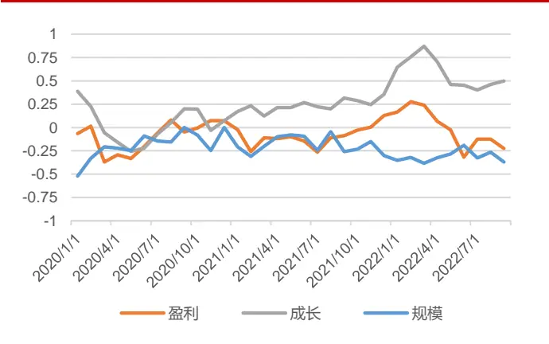
资料来源：华宝证券研究创新部，iFinD，私募排排网

图 7：沪深 300 指数增强产品行业超额暴露
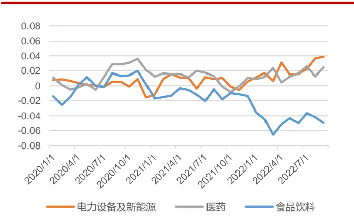
资料来源：华宝证券研究创新部，iFinD，私募排排网

图 8：中证 500 指数增强产品风格超额暴露
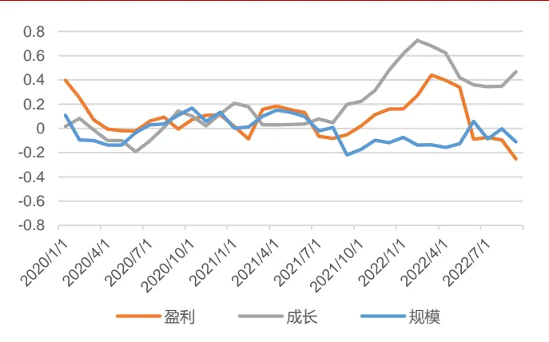
资料来源：华宝证券研究创新部，iFinD，私募排排网

图 9：中证 500 指数增强产品行业超额暴露
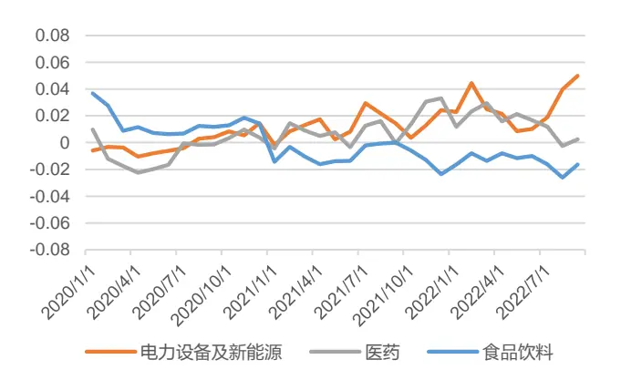
资料来源：华宝证券研究创新部，iFinD，私募排排网

图 10：中证 1000 指数增强产品风格超额暴露
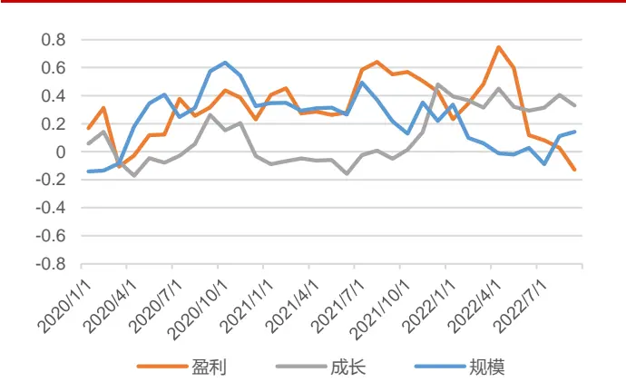
资料来源：华宝证券研究创新部，iFinD，私募排排网

图 11：中证 1000 指数增强产品行业超额暴露
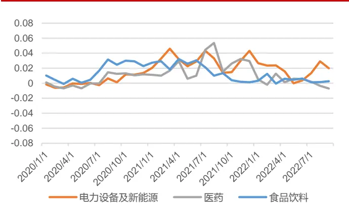
资料来源：华宝证券研究创新部，iFinD，私募排排网

指数增强产品在不同指数上超额暴露特征有所不同。整体来看，中证 1000 指数增强风格超额暴露明显高于沪深 300 以及中证 500，并且呈现明显的切换，整体风格上更加偏向成长风格。对于沪深 300 和中证 500 指数增强，2021 年 9 月之前，整体风格控制较为严格，基本控制在 0.3 个标准差之内，但之后风格敞口明显增加，逐渐向成长盈利倾斜，但是规模因子依然控制较为严格。总的来看，中证 1000指数增强刚刚起步，主要以量价因子为主，对于风格控制较为宽松，从而获得更高的超额收益，而沪深 300、中证 500 指数增强市场拥挤度逐渐提升，因子架构较为完善，涵盖基本面、量价等因子，风控也较为完善，但是随着同类产品增多，超额收益逐年回落，私募机构逐步放松敞口限制，以获取更高的收益。

行业方面不同指数的增强产品均控制较为严格，尤其是中证 500、中证 1000为代表的指数增强产品，基本控制在5%以内，甚至大部分时间控制在2%以内，而沪深 300 指数增强会在某些行业有明显的偏离。具体来看，沪深 300 指数增强在 2021 年逐步低配了食品饮料板块，也对应着 2021年以来食品饮料板块表现不佳，市场上的管理人主动降低了该板块的暴露。

总的来看，沪深 300 指数增强产品呈现出明显的风格轮动和行业轮动特征，中证 500指数增强行业敞口暴露不明显，但是风格上有明显的暴露，中证1000指数增强产品风格上控制较少，但是行业敞口控制较为严格。

## 3. 私募指数增强策略风险暴露实战应用

风险与收益是同一个硬币的两面，风险约束在限制风险的同时也限制了收益的来源。对于私募指数增强策略来说，在获取指数收益的基础上，不同风险因子超额暴露呈现出来的收益特征也是不同的，因此主动的风险暴露能否提升策略收益，我们对此进行分析。

## 3.1. 主动暴露因子

敞口的主动暴露可以从两个角度来衡量，首先是暴露的绝对值，其次是暴露跨期的变化值。本文首先尝试利用产品的主动暴露绝对值计算敞口暴露因子，具体方法如下：

$$
F_{t}^{i}=\sum_{u=t-2}^{t}\sum_{k=1}^{n^{i}}\bigl|f_{u,k}^{i}\bigr|.\tag{3.1}
$$

代表因子计算时间， =1代表风格， =2代表行业， 代表风格或者行业的风险因子数量，敞口暴露 F是子因子主动暴露 f的绝对值在过去三个月上的累加。首先利用IC 打分和分层回测等方法测试因子效果，发现敞口暴露因子并不具备单调性，但调整分层比例，计算前25%暴露的小敞口暴露因子和后 25%暴露的大敞口暴露因子，出现了具有一致性的结果。

图 12：沪深 300 指数增强产品风格敞口暴露因子
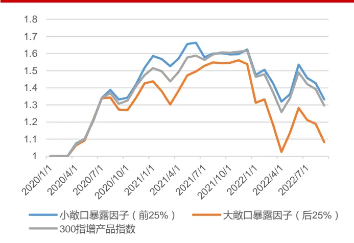
资料来源：华宝证券研究创新部，iFinD，私募排排网

图 13：沪深 300 指数增强产品行业敞口暴露因子
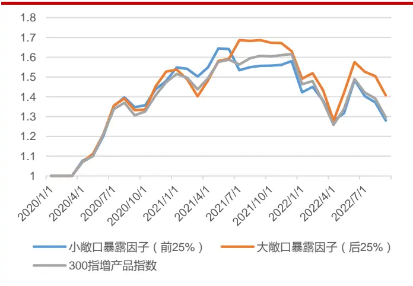
资料来源：华宝证券研究创新部，iFinD，私募排排网

图 14：中证 500 指数增强产品风格敞口暴露因子
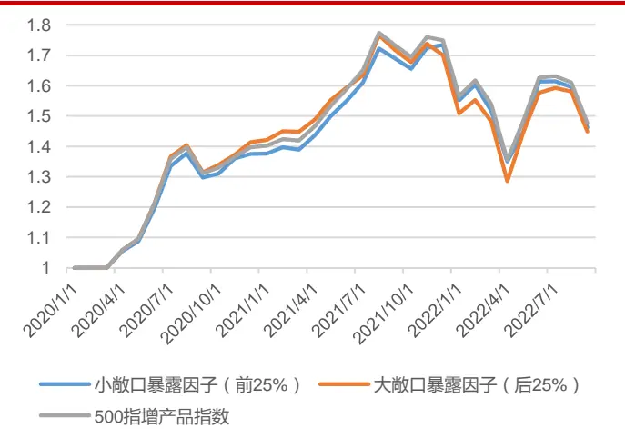
资料来源：华宝证券研究创新部，iFinD，私募排排网

图 15：中证 500 指数增强产品行业敞口暴露因子
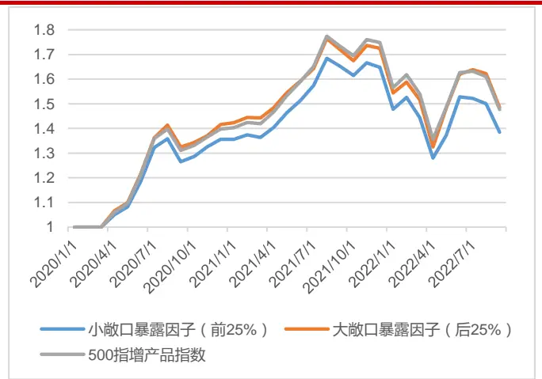
资料来源：华宝证券研究创新部，iFinD，私募排排网

图 16：中证 1000 指数增强产品风格敞口暴露因子
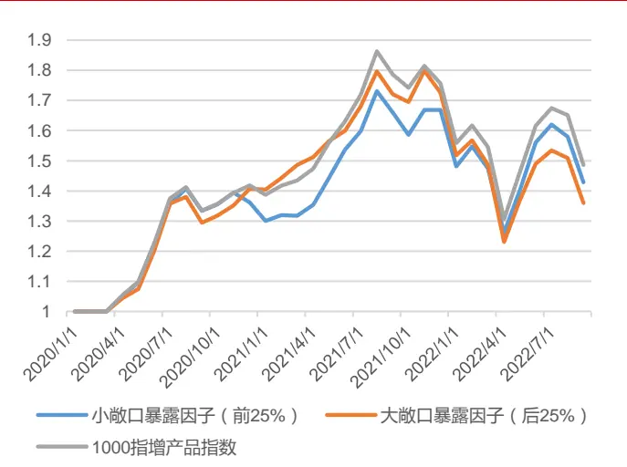
资料来源：华宝证券研究创新部，iFinD，私募排排网

图 17：中证 1000 指数增强产品行业敞口暴露因子
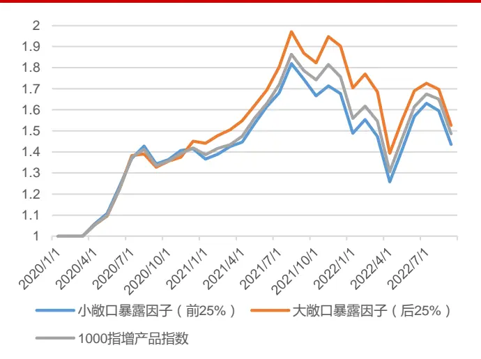
资料来源：华宝证券研究创新部，iFinD，私募排排网

具体业绩统计结果如下，可以发现无论是沪深 300、中证 500 还是中证 1000 的指数增强产品，总体上大的风格敞口暴露和小的行业敞口暴露会导致较差的收益表现。私募机构对于风格因子的控制方法各不相同，会选择性放大对一些风格因子的约束；但是对行业因子的控制方式比较一致，对所有行业因子一视同仁，用相同的阈值进行限制。这说明在带有主观色彩的风格因子控制中，过度放大敞口可能会侵蚀产品的净值；在相对统一的行业因子控制中，过严的敞口约束会削弱收益的贝塔来源。

至于中部的敞口暴露因子缺乏单调性，本文认为这是本身选股模型导致的结果，从而获取了指数之外的风格和行业特征。例如沪深 300 以大盘价值股为主，在私募指数增强的多因子选股体系下，选股的结果可能是相对于指数偏向小盘成长风格，在一定范围内敞口暴露绝对值的大小对应了不同的偏离程度，因此产品区别更多体现在细分风格、行业暴露的贝塔而不是产品的选股能力阿尔法。

表 2：风格敞口暴露因子回测结果

| 风格因子 | 300 指数增强 |  |  | 500 指数增强 |  |  | 1000 指数增强 |  |  |
| --- | --- | --- | --- | --- | --- | --- | --- | --- | --- |
|  | 小敞口暴露 | 大敞口暴露 | 产品指数 | 小敞口暴露 | 大敞口暴露 | 产品指数 | 小敞口暴露 | 大敞口暴露 | 产品指数 |
| 超额年化收益率 | 0.133 | 0.049 | 0.121 | 0.130 | 0.126 | 0.134 | 0.116 | 0.095 | 0.133 |
| 超额最大回撤 | -0.028 | -0.199 | -0.058 | -0.018 | -0.069 | -0.035 | -0.079 | -0.115 | -0.104 |
| 超额年化波动率 | 0.000 | 0.051 | 0.000 | -0.002 | 0.015 | 0.003 | -0.016 | -0.013 | -0.016 |
| 超额夏普比率 | 1.770 | 0.228 | 1.281 | 1.875 | 1.528 | 1.885 | 1.315 | 0.951 | 1.519 |
| 超额卡玛比率 | 4.646 | 0.236 | 2.023 | 7.680 | 1.927 | 4.027 | 1.534 | 0.874 | 1.338 |
| 超额收益胜率 | 0.750 | 0.563 | 0.656 | 0.719 | 0.656 | 0.656 | 0.750 | 0.625 | 0.719 |
| 跟踪误差 | 0.061 | 0.172 | 0.079 | 0.058 | 0.095 | 0.062 | 0.075 | 0.086 | 0.096 |

资料来源：华宝证券研究创新部，iFinD，私募排排网

表 3：行业敞口暴露因子回测结果

| 行业因子 | 300 指数增强 |  |  | 500 指数增强 |  |  | 1000 指数增强 |  |  |
| --- | --- | --- | --- | --- | --- | --- | --- | --- | --- |
|  | 小敞口 暴露 | 大敞口 暴露 | 产品指数 | 小敞口 暴露 | 大敞口 暴露 | 产品指数 | 小敞口 暴露 | 大敞口 暴露 | 产品指数 |
| 超额年化收益率 | 0.116 | 0.156 | 0.121 | 0.107 | 0.137 | 0.134 | 0.118 | 0.145 | 0.133 |
| 超额最大回撤 | -0.034 | -0.091 | -0.058 | -0.044 | -0.048 | -0.035 | -0.120 | -0.070 | -0.104 |
| 超额年化波动率 | 0.004 | 0.019 | 0.000 | -0.003 | 0.009 | 0.003 | -0.015 | -0.011 | -0.016 |
| 超额夏普比率 | 1.489 | 1.030 | 1.281 | 1.397 | 1.753 | 1.885 | 1.246 | 1.540 | 1.519 |
| 超额卡玛比率 | 3.311 | 1.667 | 2.023 | 2.520 | 3.000 | 4.027 | 1.029 | 2.154 | 1.338 |
| 超额收益胜率 | 0.688 | 0.656 | 0.656 | 0.625 | 0.688 | 0.656 | 0.750 | 0.625 | 0.719 |
| 跟踪误差 | 0.068 | 0.138 | 0.079 | 0.063 | 0.081 | 0.062 | 0.096 | 0.080 | 0.096 |

资料来源：华宝证券研究创新部，iFinD，私募排排网

相比敞口暴露的绝对值，暴露的变化意味着动态选择，意味着主动管理的体现。本文将敞口反转 R定义如下：

$$
R_{t}^{i}=\sum_{k=1}^{n^{i}}|\left(f_{t,k}^{i}-\quad f_{t-3,k}^{i}\right)|\tag{3.2}
$$

是子因子主动暴露 三个月差分绝对值的累加，由于 IC 打分、分层回测以及调整分层比例之后都没有得到有意义的结果。在私募指数增强市场中常常会发现，当私募基金产品净值掉队的时候，一些管理人会选择主动放大敞口来赌市场走势，因此本文尝试在前期表现较差的产品中，分析敞口反转是否能带来增量收益。为此本文先选取了过去三个月业绩后 50%的产品，然后再利用敞口反转因子，选取其中敞口变化最大的 50%产品构建收益指数，即综合选取了全样本 25%的产品构造敞口反转因子，同时采用过去三个月业绩后50%的产品构造简单反转因子用于对比，从而论证收益掉队的私募管理人通过改变收益敞口是否会取得较好的收益。

图 18：沪深 300 指数增强产品风格敞口反转因子
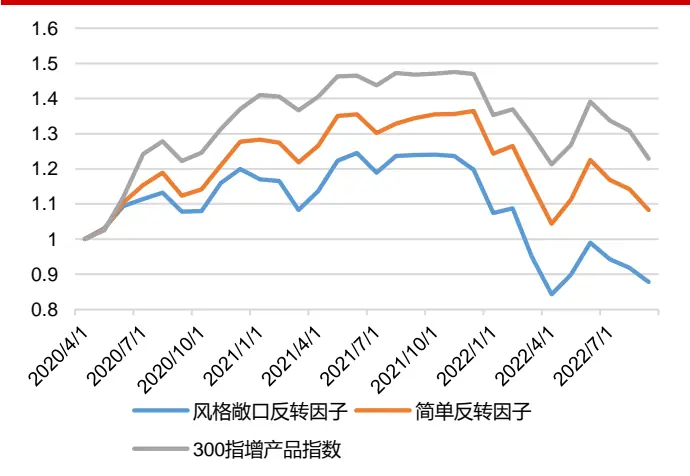
资料来源：华宝证券研究创新部，iFinD，私募排排网

图 19：沪深 300 指数增强产品行业敞口反转因子
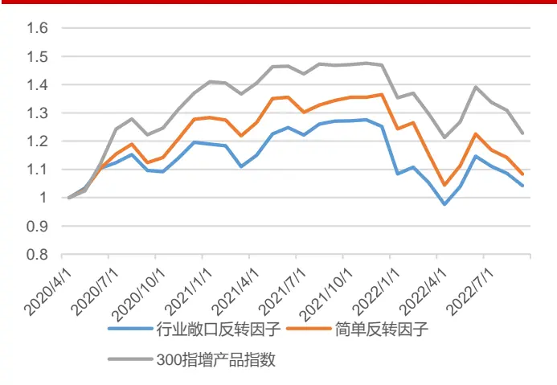
资料来源：华宝证券研究创新部，iFinD，私募排排网

图 20：中证 500 指数增强产品风格敞口反转因子
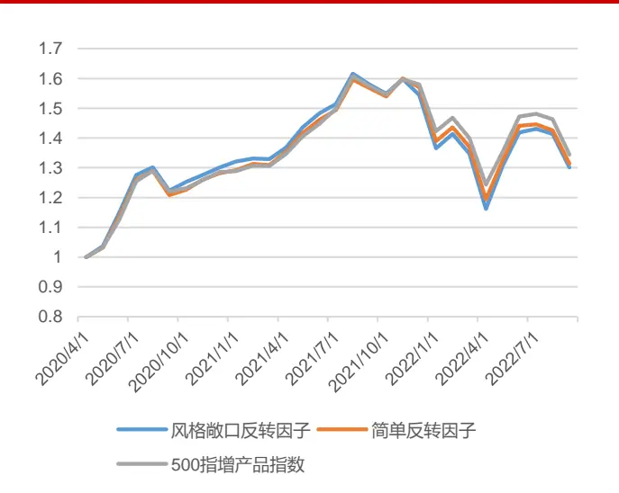
资料来源：华宝证券研究创新部，iFinD，私募排排网

图 21：中证 500 指数增强产品行业敞口反转因子
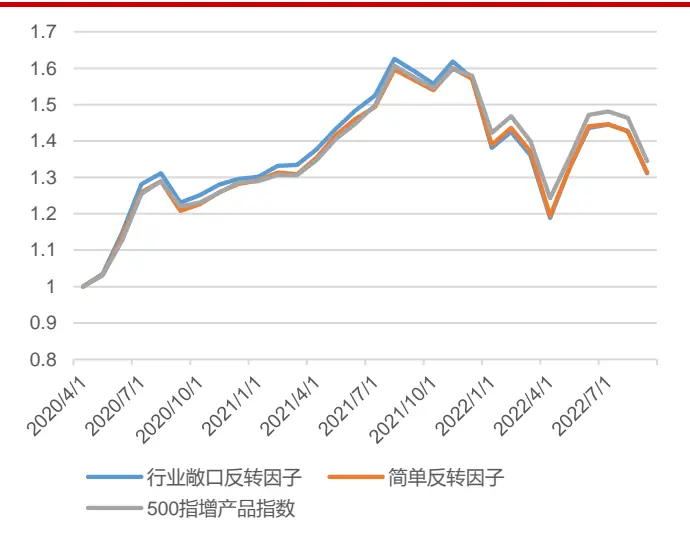
资料来源：华宝证券研究创新部，iFinD，私募排排网

图 22：中证 1000 指数增强产品风格敞口反转因子
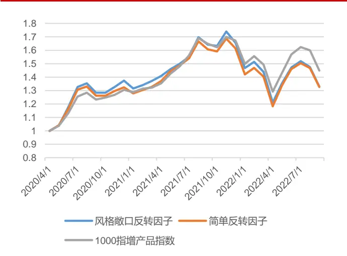
资料来源：华宝证券研究创新部，iFinD，私募排排网

图 23：中证 1000 指数增强产品行业敞口反转因子
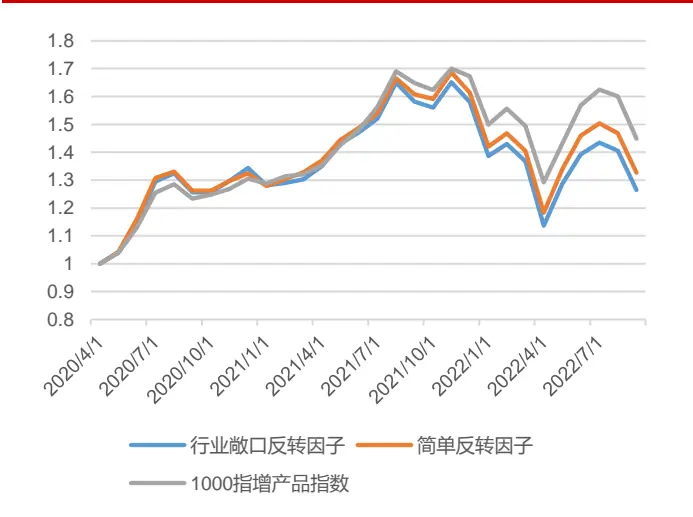
资料来源：华宝证券研究创新部，iFinD，私募排排网

具体业绩统计结果如下，可以发现对于三类指数增强产品，简单反转因子其实是一种动量的表达，选取过去业绩表现较差的产品没有出现收益的反转，延续了前期较差的表现，最终获得了低于产品指数的收益，在沪深 300 的市场上最为明显，中证 500 和中证 1000 的指数增强收益也呈现了微弱的动量效应。当叠加敞口反转因子之后，沪深 300 的指数增强产品显著更差了，不管是风格还是行业，而中证 500 的指数增强在叠加风格敞口反转因子后收益略有降低，但是行业的影响较小，中证 1000 的指数增强和中证 500 相反，在叠加行业敞口反转因子后收益略有降低，但是风格的影响较小，甚至能略微提升收益。

表 4：风格敞口反转因子回测结果

| 风格因子 | 300 指数增强 |  |  | 500 指数增强 |  |  | 1000 指数增强 |  |  |
| --- | --- | --- | --- | --- | --- | --- | --- | --- | --- |
|  | 敞口反转 | 简单反转 | 产品指数 | 敞口反转 | 简单反转 | 产品指数 | 敞口反转 | 简单反转 | 产品指数 |
| 超额年化收益率 | -0.041 | 0.045 | 0.100 | 0.087 | 0.092 | 0.103 | 0.093 | 0.092 | 0.134 |
| 超额最大回撤 | -0.220 | -0.111 | -0.033 | -0.078 | -0.051 | -0.035 | -0.086 | -0.094 | -0.066 |
| 超额年化波动率 | 0.015 | -0.006 | -0.019 | 0.020 | 0.011 | -0.003 | -0.006 | -0.009 | -0.038 |
| 超额夏普比率 | -0.635 | 0.111 | 1.075 | 0.862 | 1.204 | 1.507 | 0.879 | 0.957 | 1.340 |
| 超额卡玛比率 | -0.293 | 0.222 | 2.486 | 0.992 | 1.660 | 2.627 | 0.948 | 0.854 | 1.746 |
| 超额收益胜率 | 0.448 | 0.552 | 0.655 | 0.586 | 0.655 | 0.724 | 0.690 | 0.655 | 0.655 |
| 跟踪误差 | 0.124 | 0.084 | 0.062 | 0.099 | 0.077 | 0.060 | 0.086 | 0.090 | 0.093 |

资料来源：华宝证券研究创新部，iFinD，私募排排网

表 5：行业敞口反转因子回测结果

| 行业因子 | 300 指数增强 |  |  | 500 指数增强 |  |  | 1000 指数增强 |  |  |
| --- | --- | --- | --- | --- | --- | --- | --- | --- | --- |
|  | 敞口反转 | 简单反转 | 产品指数 | 敞口反转 | 简单反转 | 产品指数 | 敞口反转 | 简单反转 | 产品指数 |
| 超额年化收益率 | 0.029 | 0.045 | 0.100 | 0.091 | 0.092 | 0.103 | 0.070 | 0.092 | 0.134 |
| 超额最大回撤 | -0.191 | -0.111 | -0.033 | -0.077 | -0.051 | -0.035 | -0.103 | -0.094 | -0.066 |
| 超额年化波动率 | -0.011 | -0.006 | -0.019 | 0.017 | 0.011 | -0.003 | -0.004 | -0.009 | -0.038 |
| 超额夏普比率 | -0.115 | 0.111 | 1.075 | 1.023 | 1.204 | 1.507 | 0.626 | 0.957 | 1.340 |
| 超额卡玛比率 | 0.007 | 0.222 | 2.486 | 1.077 | 1.660 | 2.627 | 0.580 | 0.854 | 1.746 |
| 超额收益胜率 | 0.448 | 0.552 | 0.655 | 0.655 | 0.655 | 0.724 | 0.655 | 0.655 | 0.655 |
| 跟踪误差 | 0.114 | 0.084 | 0.062 | 0.088 | 0.077 | 0.060 | 0.096 | 0.090 | 0.093 |

资料来源：华宝证券研究创新部，iFinD，私募排排网

总体来说，在沪深 300 市场指数增强产品的“动量效应”最强，体现在收益的延续性，但是当产品收益不佳时，通过敞口大幅调整往往会带来负面效果。在中证 500 和中证 1000市场中，敞口变化带来的负面影响相对较小，甚至可以改善产品收益表现。本文认为这与每个市场的因子结构有关，沪深 300 指数增强策略中的基本面因子的比例更高，而中证 500、中证 1000 的指数增强策略以量价因子为主。相比量价因子，不同私募基金在基本面因子上的挖掘效果差异较大，传统的基本面因子已经难以获取超额收益，并且更新迭代周期较慢，需要依靠人工挖掘，而量价因子的失效和迭代周期更快，敞口上的变化一定程度是反映了策略的更新迭代，对于策略的影响较小。

## 3.2. 风险轮动因子

在敞口暴露因子构建中，我们使用了主动暴露的绝对值，在敞口反转因子的构建中，我们使用了主动暴露的跨期变动值，现在尝试综合使用二者来探究指数增强产品的风险轮动能力。首先将过去三个月敞口暴露较大的后 50%产品定义为带敞口产品，在此基础上风险轮动能力 V定义如下：

$$
V_{t}^{i}=\sum_{k=1}^{n^{i}}\bigl(f_{t,k}^{i}-\quad f_{t-3,k}^{i}\bigr)\quad\frac{\bigl(m_{t,k}^{i}-\quad m_{t-3,k}^{i}\bigr)}{m_{t-3,k}^{i}}\quad.\tag{3.3}
$$

其中 m代表风险因子的净值，即行业指数的净值或风格因子收益的累乘结果，其余符号与前文含义一致，所以风险轮动能力 V是过去三个月指数增强产品主动敞口变化所带来的收益。以行业为例，中信 30个一级行业过去三个月的收益率乘以超额行业配置的变化比例，当增加配置的行业录正收益、减少配置的行业录得负收益，这时体现出该产品较高的行业轮动能力较高。在带敞口产品的基础上选取 V较大的 50%产品构造风险轮动因子，以敞口后50%的大敞口暴露因子作为对比。

图 24：沪深 300 指数增强产品风格轮动因子
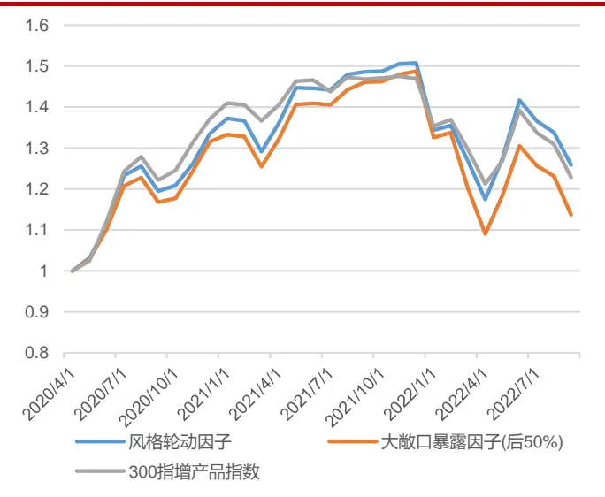
资料来源：华宝证券研究创新部，iFinD，私募排排网

图 25：沪深 300 指数增强产品行业轮动因子
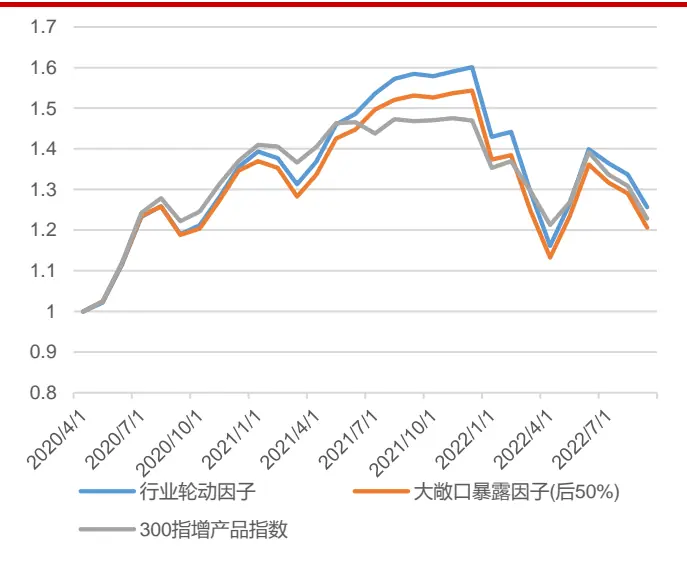
资料来源：华宝证券研究创新部，iFinD，私募排排网

图 26：中证 500 指数增强产品风格轮动因子
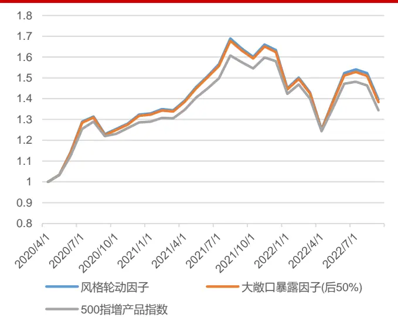
资料来源：华宝证券研究创新部，iFinD，私募排排网

图 27：中证 500 指数增强产品行业轮动因子
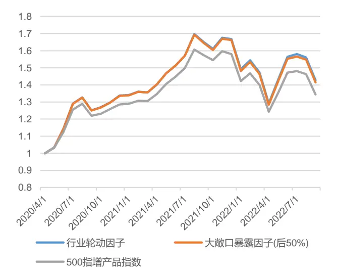
资料来源：华宝证券研究创新部，iFinD，私募排排网

图 28：中证 1000 指数增强产品风格轮动因子
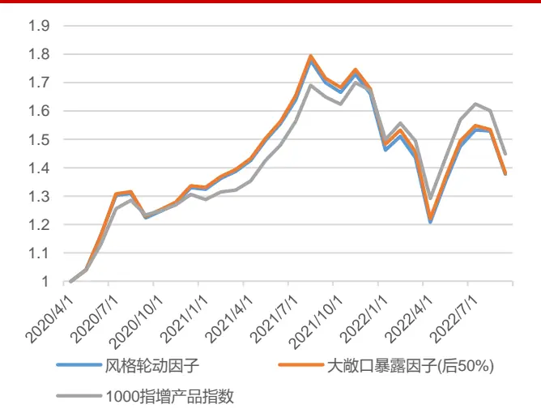
资料来源：华宝证券研究创新部，iFinD，私募排排网

图 29：中证 1000 指数增强产品行业轮动因子
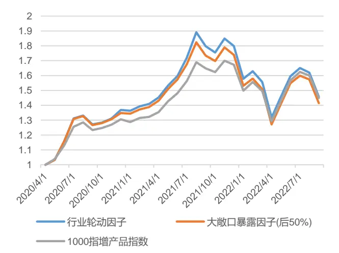
资料来源：华宝证券研究创新部，iFinD，私募排排网

具体业绩统计结果如下，在沪深 300 的指数增强产品中风险轮动能力差异比较明显，无论是风格还是行业方面，每期选取历史轮动能力前 50%的产品，最终回测收益都可以明显跑赢大敞口暴露因子。但是在中证 500 和中证 1000 中这种效应相对较弱，中证 500 指数增强产品的风险轮动因子稍强于大敞口暴露因子，中证 1000指数增强产品的行业轮动因子强于大敞口暴露因子，风格轮动因子和大敞口暴露因子持平。这与对敞口反转因子的分析所得到的结论是一致的，沪深300指数增强产品的业绩延续性更强，一部分原因表现在优秀的沪深 300指数增强产品具有风格和行业的轮动能力，但是在中证 500 和中证 1000 的竞争格局中，这种优势不太明显。

表 6：风格轮动因子回测结果

| 风格因子 | 300 指数增强 |  |  | 500 指数增强 |  |  | 1000 指数增强 |  |  |
| --- | --- | --- | --- | --- | --- | --- | --- | --- | --- |
|  | 轮动能力 | 大敞口暴露 | 产品指数 | 轮动能力 | 大敞口暴露 | 产品指数 | 轮动能力 | 大敞口暴露 | 产品指数 |
| 超额年化收益率 | 0.111 | 0.066 | 0.100 | 0.121 | 0.116 | 0.103 | 0.110 | 0.111 | 0.134 |
| 超额最大回撤 | -0.059 | -0.107 | -0.033 | -0.059 | -0.057 | -0.035 | -0.122 | -0.118 | -0.066 |
| 超额年化波动率 | 0.005 | 0.014 | -0.019 | 0.021 | 0.018 | -0.003 | -0.010 | -0.008 | -0.038 |
| 超额夏普比率 | 0.907 | 0.369 | 1.075 | 1.536 | 1.485 | 1.507 | 0.931 | 0.969 | 1.340 |
| 超额卡玛比率 | 1.577 | 0.466 | 2.486 | 1.921 | 1.909 | 2.627 | 0.789 | 0.836 | 1.746 |
| 超额收益胜率 | 0.552 | 0.483 | 0.655 | 0.690 | 0.690 | 0.724 | 0.621 | 0.621 | 0.655 |
| 跟踪误差 | 0.099 | 0.110 | 0.062 | 0.079 | 0.078 | 0.060 | 0.106 | 0.102 | 0.093 |

资料来源：华宝证券研究创新部，iFinD，私募排排网

表 7：行业轮动因子回测结果

| 行业因子 | 300 指数增强 |  |  | 500 指数增强 |  |  | 1000 指数增强 |  |  |
| --- | --- | --- | --- | --- | --- | --- | --- | --- | --- |
|  | 轮动能力 | 大敞口暴露 | 产品指数 | 轮动能力 | 大敞口暴露 | 产品指数 | 轮动能力 | 大敞口暴露 | 产品指数 |
| 超额年化收益率 | 0.110 | 0.092 | 0.100 | 0.131 | 0.127 | 0.103 | 0.137 | 0.122 | 0.134 |
| 超额最大回撤 | -0.115 | -0.107 | -0.033 | -0.038 | -0.041 | -0.035 | -0.108 | -0.104 | -0.066 |
| 超额年化波动率 | 0.019 | 0.017 | -0.019 | 0.017 | 0.017 | -0.003 | -0.007 | -0.009 | -0.038 |
| 超额夏普比率 | 0.754 | 0.584 | 1.075 | 1.857 | 1.797 | 1.507 | 1.343 | 1.249 | 1.340 |
| 超额卡玛比率 | 0.852 | 0.724 | 2.486 | 3.266 | 2.904 | 2.627 | 1.183 | 1.095 | 1.746 |
| 超额收益胜率 | 0.621 | 0.586 | 0.655 | 0.724 | 0.690 | 0.724 | 0.690 | 0.655 | 0.655 |
| 跟踪误差 | 0.120 | 0.111 | 0.062 | 0.071 | 0.070 | 0.060 | 0.087 | 0.087 | 0.093 |

资料来源：华宝证券研究创新部，iFinD，私募排排网

在《如何构建私募指数增强基金分析框架？》一文中，我们对私募指数增强产品构建了一套行之有效的业绩筛选方法，已知风险轮动因子对沪深 300指数增强产品有一定筛选能力，且经过测试风险轮动因子在沪深 300 指数增强产品中的单调性尚可，现测试风险轮动因子能否在业绩指标的基础上提升对沪深 300 指数增强产品的筛选效果。在带敞口产品中，首先使用业绩筛选方法选取前 50%的产品作为对照，然后在此基础上选取历史轮动能力前50%的产品测试风险轮动因子的提升效果。

图 30：沪深 300 指数增强产品业绩筛选+风格轮动因子
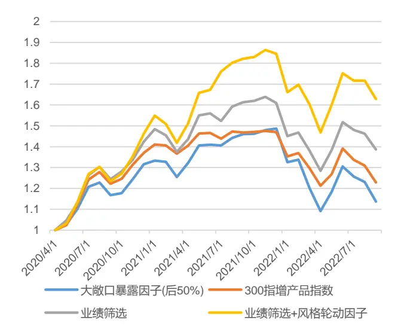
资料来源：华宝证券研究创新部，iFinD，私募排排网

图 31：沪深 300 指数增强产品业绩筛选+行业轮动因子
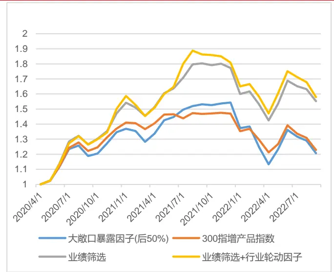
资料来源：华宝证券研究创新部，iFinD，私募排排网

具体统计指标如下，可以发现对于沪深 300 指数增强产品来说，在原始业绩筛选方法基础上加入风险轮动因子可以提升筛选组合的收益表现，对风格轮动因子尤为明显。

表 8：沪深 300 指数增强产品业绩筛选+风险轮动因子回测

| 沪深300 | 风格 |  |  | 行业 |  |  | 产品指数 |
| --- | --- | --- | --- | --- | --- | --- | --- |
|  | 业绩筛选+轮动因子 | 业绩筛选 | 大敞口暴露 | 业绩筛选+轮动因子 | 业绩筛选 | 大敞口暴露 |  |
| 超额年化收益率 | 0.235 | 0.156 | 0.066 | 0.219 | 0.211 | 0.092 | 0.100 |
| 超额最大回撤 | -0.055 | -0.062 | -0.107 | -0.080 | -0.062 | -0.107 | -0.033 |
| 超额年化波动率 | 0.020 | 0.004 | 0.014 | 0.021 | 0.008 | 0.017 | -0.019 |
| 超额夏普比率 | 1.724 | 1.408 | 0.369 | 1.317 | 1.666 | 0.584 | 1.075 |
| 超额卡玛比率 | 4.002 | 2.136 | 0.466 | 2.560 | 3.184 | 0.724 | 2.486 |
| 超额收益胜率 | 0.655 | 0.724 | 0.483 | 0.690 | 0.759 | 0.586 | 0.655 |
| 跟踪误差 | 0.116 | 0.101 | 0.110 | 0.109 | 0.101 | 0.111 | 0.062 |

资料来源：华宝证券研究创新部，iFinD，私募排排网

## 4. 结论

对于私募指数增强产品来说，指数本身的风险是一种被动的且必需的暴露，因此风险因子对指数的主动暴露成为了一种调节工具，一方面对应着选股模型的能力特点，一方面也掺杂着私募机构的主观判断。本文针对私募指数增强产品的策略流程，设计了一套相应的风险因子暴露分析方法，在数据匮乏的情况下取得了良好的效果，打开了从风险暴露的角度构造因子对私募指数增强产品进行分析的道路。

在敞口暴露因子的分析过程中，本文发现总体上大的风格敞口暴露和小的行业敞口暴露会导致指数增强产品较差的收益表现。这说明在带有主观色彩的风格因子控制中，过度放大敞口会侵蚀产品的净值；在相对统一的行业因子控制中，过严的敞口约束会削弱收益的贝塔来源。

在敞口反转因子的分析过程中，本文发现沪深 300 指数增强产品的业绩延续性最强，业绩较差的产品无法通过风格和行业的敞口大幅调整来实现净值的追赶，反而会导致更差的结果，但是对中证 500 和中证 1000 来说没有明显差别。这与沪深 300 指数增强策略中基本面因子的比例更高有关。相比量价因子，不同私募基金在基本面因子上的挖掘效果差异较大，并且基本面因子需要依靠人工挖掘，更新迭代周期较慢，而量价因子的失效和迭代周期更快，敞口上的变化一定程度是反映了策略的更新迭代。

在对风险轮动因子的分析中，本文得到了敞口反转因子中一致的结果。沪深 300 指数增强产品的业绩延续性更强，一部分原因表现在优秀的沪深 300 指数增强产品具有风格和行业的轮动能力，但是在中证 500 和中证 1000 的竞争格局中，这种优势不太明显。而且经过测试发现，在业绩统计筛选方法中加入风险轮动因子可以显著提升筛选组合的收益表现。

★ 根据证券投资者适当性管理有关法规，该研究报告仅适合专业机构投资者及与我司签订咨询服务协议的普通投资者，若您为非专业投资者及未与我司签订咨询服务协议的投资者，请勿阅读、转载本报告。

## 风险提示及免责声明

★ 华宝证券股份有限公司具有证券投资咨询业务资格。

★ 市场有风险，投资须谨慎。

★ 本报告所载的信息均来源于已公开信息，但本公司对这些信息的准确性及完整性不作任何保证。

★ 本报告所载的任何建议、意见及推测仅反映本公司于本报告发布当日的独立判断。本公司不保证本报告所载的信息于本报告发布后不会发生任何更新，也不保证本公司做出的任何建议、意见及推测不会发生变化。

★ 在任何情况下，本报告所载的信息或所做出的任何建议、意见及推测并不构成所述证券买卖的出价或询价，也不构成对所述金融产品、产品发行或管理人作出任何形式的保证。在任何情况下，本公司不就本报告中的任何内容对任何投资做出任何形式的承诺或担保。投资者应自行决策，自担投资风险。

★ 本公司秉承公平原则对待投资者，但不排除本报告被他人非法转载、不当宣传、片面解读的可能，请投资者审慎识别、谨防上当受骗。

★ 本报告版权归本公司所有。未经本公司事先书面授权，任何组织或个人不得对本报告进行任何形式的发布、转载、复制。如合法引用、刊发，须注明本公司出处，且不得对本报告进行有悖原意的删节和修改。

★ 本报告对基金产品的研究分析不应被视为对所述基金产品的评价结果，本报告对所述基金产品的客观数据展示不应被视为对其排名打分的依据。任何个人或机构不得将我方基金产品研究成果作为基金产品评价结果予以公开宣传或不当引用。

## 适当性申明

★ 根据证券投资者适当性管理有关法规，该研究报告仅适合专业机构投资者及与我司签订咨询服务协议的普通投资者，若您为非专业投资者及未与我司签订咨询服务协议的投资者，请勿阅读、转载本报告。