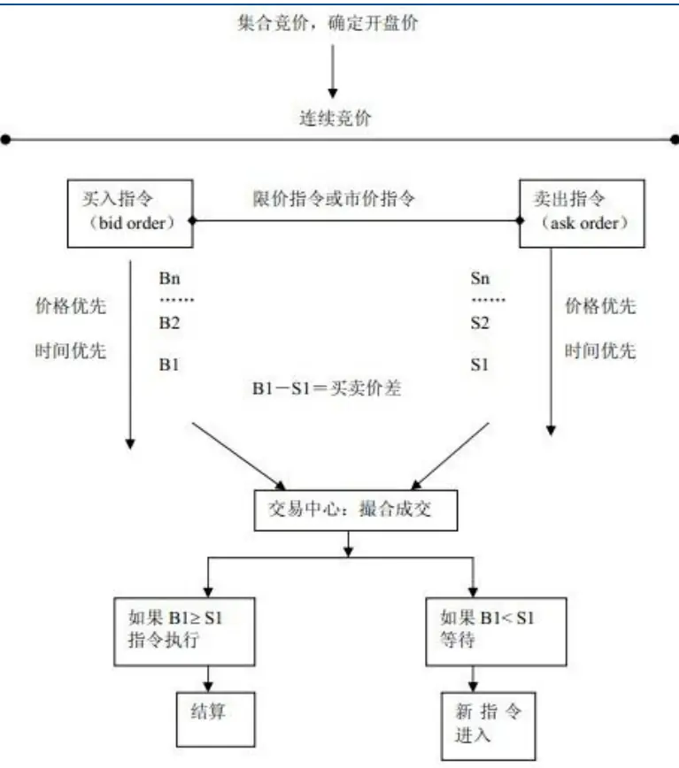
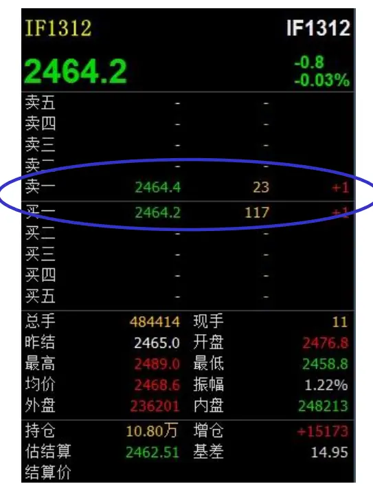
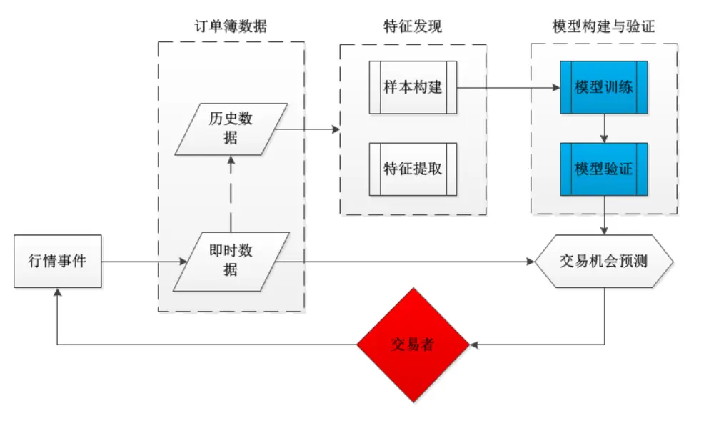
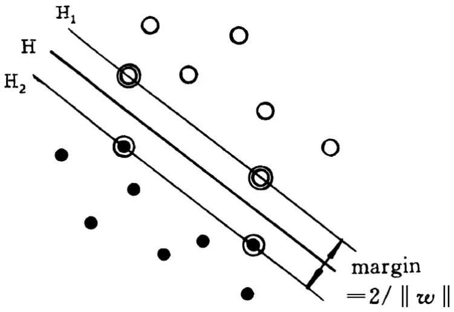
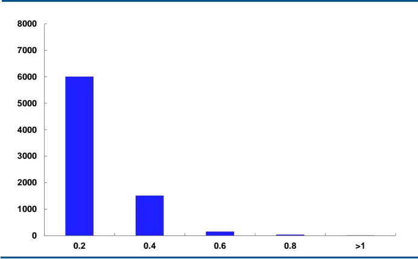
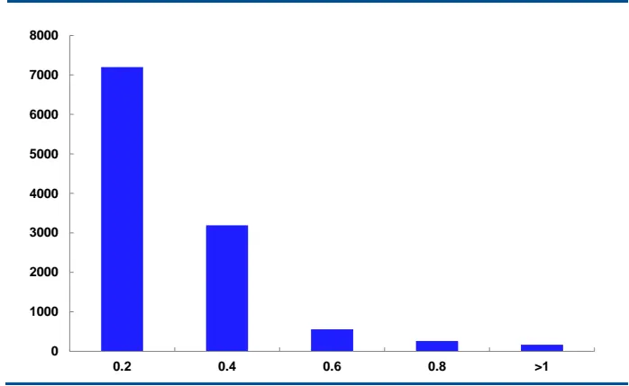
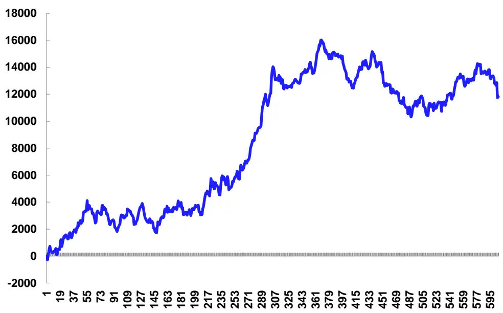

# 基于机器学习的订单簿高频交易策略

# CTA程序化交易实务研究之六

## 金融工程研究报告

## 报告摘要：

## 机器学习是订单簿动态建模的前沿方法

订单簿的动态建模，主要有两种方法，一种是经典的计量经济学方法，另一种是前沿的机器学习方法。

机器学习通过对己知数据的学习，找到数据内在的相互依赖关系，从而对未知数据进行预测和判断，最终使得机器具有良好的推广能力。支持向量机(SVM,Support Vector Machine)是目前较为先进的机器学习方法。

## 可以从订单簿提炼指标库来刻画其特征

订单簿主要包括买一价、卖一价、买一量、卖一量等基础指标，并可以衍生出深度、斜率、相对价差等指标，其他指标包括持仓量、成交量、基差等，共计17个指标。还可以引入常见的技术分析指标如RSI、KDJ、MA、EMA等。

## IF主力合约订单簿每天存在4000次交易机会

以IF1311合约在10月29日的行情数据为例，Δt=2tick的情况下，ΔP绝对值大于等于0.4的次数大约有4000次，这是潜在的交易机会。

## 模型检验准确率最高达70%

预测未来1tick的价格变化准确率较高，在ΔP≥0.4情况下，总体准确率大概70%；在总体准确率大于60%的情况下，可以转化为交易策略。

## 策略模拟收益

以IF1311合约在10月31日的行情为例，在考虑手续费0.26/10000、单边滑点0.2点、每次交易1手情况下，全天交易次数605次，盈利次数339次，胜率56%，净利润11814.99元。

2013年12月11日

## 民生证券金融工程团队

分析师：温尚清

执业证号：S0100513070012

电话：(86755)22662054

邮箱：wenshangqing@mszq.com

分析师：王红兵

执业证号：S0100512090002

电话：(86755)22662129

邮箱：wanghongbing@mszq.com

地址：深圳市福田区深南大道7888号东海国际中心 A 座 28 层 518040

## 相关研究

2012.11《业务篇：CTA程序化交易迎来发展新契机——CTA 程序化交易实务研究之一》

2012.11《平台篇：CTA程序化交易必先利其器——CTA程序化交易实务研究之二》2012.11《策略篇：Alligator交易系统实证分析——CTA程序化交易实务研究之三》2013.9《Kelly公式在最优f问题的应用——CTA程序化交易实务研究之四》2013.9《交易执行细节，从模拟走向实战——CTA程序化交易实务研究之五》2013.9《初探市场微观结构：指令单薄与指令单流——资金交易策略之四》交易要像壁虎一样，平时趴在墙上一动不动，蚊子一旦出现就迅速将其吃掉，然后恢复平静，等待下一个机会。

——詹姆斯 西蒙斯(James Simons)

复兴技术通过某种统计算法来快速综合限价买卖指令表里的各种信息，能够很快判断出在不同价位不同数量的限价买卖指令目前的估计究竟是推还是拉，还能判断出如果股价真的是达到了某个或者多个限价买卖指令，这些交易被执行之后，股价又有可能会有什么样的连锁反应。

——《解读量化投资》

所谓“壁虎式投资法”，是指在投资时进行短线方向性预测、捕捉短期套利机会，依靠交易很多品种、在短期做出大量的交易来获利。我们可以理解为超高频交易，从交易策略的周期角度，这是我们团队正在攻关的最后一个难关。

我们团队最近两年做了大量关于衍生品程序化交易的研究，包括《CTA程序化交易实务研究》系列五篇报告，从业务、平台、策略、资金管理、实战等方面总结了衍生品交易中的各个。团队已经积累包括日间趋势、日内趋势、日内震荡等策略库。2013年9月，我们在《初探市场微观结构：指令单簿与指令单流》报告中，大致介绍了订单簿的研究进展和策略开发思路，开始涉及到订单簿高频交易。

本文将探索把机器学习领域的最新研究成果应用到订单簿的高频交易，文中的方法论，可以用于所有T+0衍生品的单边动量交易，也可以用在套利交易中。

## 一、绪论

证券市场的交易机制可以分为报价驱动市场(Quote-driven Market 和订单驱动市场(Order-driven Market)两类，前者依赖做市商提供流动性，后者通过限价单订单提供流动性，交易通过投资者的买进委托和卖出委托竞价所形成。中国的证券市场属于订单驱动市场，包括股票市场和期货市场。

图 1:订单驱动市场(Order-driven Market)示意图

资料来源：民生证券研究院

## (一)限价单订单簿简介

订单簿的研究属于市场微观结构研究范畴，市场微观结构理论以微观经济学中的价格理论和厂商理论作为其思想渊源，而在对其核心问题一一金融资产交易及其价格形成过程和原因的分析中，则用到了一般均衡、局部均衡、边际收益、边际成本、市场连续性、存货理论、博弈论、信息经济学等多种理论与方法。

从国外的研究进展看，市场微观结构领域以O'Hara为代表，大部分的理论都是基于做市商市场（也就是报价驱动市场)，例如存货模型和信息模型等。近年来，实际的交易市场中，订单驱动已经逐步占据上方，但专门针对订单驱动市场的研究还没有比较少。

国内证券市场和期货市场都属于订单驱动型市场，下图是股指期货主力合约IF1312的Level-1行情订单簿截图。从上面直接获得的信息并不多，基础信息就包括买一价、卖一价、买一量和卖一量。在国外的某些学术论文中，和订单簿对应的还有信息簿(MessageBook),包括最明细的订单撮合数据，包括每个订单的下单量、成交价、订单类型等信息，由于国内市场不公开信息簿的信息，因此超高频交易我们只能依赖订单簿。

图 2: 股指期货主力合约 Level-1 订单簿

资料来源：民生证券研究院，Wind

## (二)订单簿高频交易研究进展

订单簿的动态建模，主要有两种方法，一种是经典计量经济学方法，另一种是机器学习方法。

计量经济学方法是一种经典的主流研究方法，例如研究价差分析的MRR分解、Huang和 Stoll 分解等，研究订单持续期的 ACD 模型，研究价格预测的 Logistic 模型，如 2013《Price Jump Prediction in Limit Order Book》.

机器学习在金融领域的学术研究也非常活跃，比如2012 年的《Forecasting trends ofhigh-frequency KOSPI200 index data using learning classifiers》是一种常见研究思路，利用技术分析常见的指标（MA、EMA、RSI等)，引入机器学习的分类方法进行市场预测。但这种做法对订单簿动态信息挖掘不足，也就是说，利用订单簿动态信息进行高抛交易的研究在国内外都还比较少，这是很值得深入研究的领域。

## 二、机器学习简介

## (一)机器学习概念

一般地，统计是我们面对大量数据而又缺乏理论模型时最基本的分析手段，人们会研究如何从一些观察数据出发得出目前尚不能通过理论证明的规律，利用这些规律去分析客观对象，对未来数据或无法观测的数据进行预测。但传统统计学中的诸多结论，是在样本数目足够多的前提下进行研究的，所提出的各种方法和结论只有在样本数趋向无穷大时其性能才有理论上的保证。而在多数实际应用中，样本数目通常是有限的，这是很多传统统计方法都难以取得理想效果的原因之一。

机器学习(MachineLearning)的任务就是设计某种方法和模型，通过对己知数据的学习，找到数据内在的相互依赖关系，从而对未知数据进行预测和判断，最终使得机器具有良好的推广能力。统计学在机器学习中起着重要的基础作用，但是传统的统计学研究的主要是渐进理论，在一些基于统计学的算法在学习过程中，当样本数有限时，表现出很差的推广能力，这种现象被称为过学习现象。机器学习是一门多领域交叉学科，涉及概率论、统计学、逼近论、凸分析、算法复杂度理论等多门学科。

机器学习已经有了十分广泛的应用，例如：计算机视觉、生物特征识别、搜索引擎、医学诊断、证券市场分析、语音和手写字识别等。

机器学习可以分成下面几种类别：

监督学习从给定的训练数据集中学习出一个函数，当新的数据到来时，可以根据这个函数预测结果。监督学习的训练集要求是包括输入和输出，也可以说是特征和目标。训练集中的目标是由人标注的。

无监督学习与监督学习相比，训练集没有人为标注的结果。

半监督学习介于监督学习与无监督学习之间。

常见机器学习算法有：

神经网络，早起的有监督学习算法，研究和应用都已经非常成熟，但算法本身存在维数灾难、历史过拟、容错能力差等问题；

聚类分析，属于无监督学习算法，典型的算法如K-means;

决策树，一种较为简单的有监督学习算法；

遗传算法，主要用来做参数优化;

支持向量机，下文将详细介绍。

## (二)机器学习的数学原理

机器学习问题可以一般的表示为：假设变量x与y遵循某一未知的联合分布$F(x,y)$ ，那么根据l个独立同分布的观测样本 $(x_{1},y_{1}),(x_{2},y_{2}),\cdots,(x_{l},y_{l})$ $(x_{i}\in R^{d},y_{i}\in\{+1,-1\}$ ，d是样本的维数)，在一组函数 $\{f(x,w)\}$ 中求一个最优的函数$f(x,w_{0})$ 作为对y的估计，使得期望风险最小，即

$$
\min R(w)=\int L(y,f(x,w))dF(x,y)
$$

其中，预测函数集 $\{f(x,w)$ 可以为任何函数集合，w为函数的广义参数，$L(y,f(x,w)$ 为用 $f(x,w)$ 对y进行预测所造成的损失。

不同类型的学习问题有不同形式的损失函数。在模式识别问题中，由于预测出的模式

要么对，要么错，所以损失函数可以定义为

$$
L(y,f(x,w))=\left\{\begin{aligned}&1\quad&y\neq f(x,w)\\&0\quad&y=f(x,w)\end{aligned}\right.
$$

传统的统计模式识别方法如几何分类法、概率分类法等都是在一个假设前提下研究的样本数目足够多，想要多少样本就有多少样本。所以提出的各种方法只有在样本数目趋于无穷大时其性能才有理论上的保证。但是，实际应用中的样本数目都是极为有限的，于是期望风险 $R(w)$ 就要用由样本定义的经验风险 $R_{emp}(w)$ 来代替。

$$
R_{emp}(w)=\frac{1}{l}\sum_{i=1}^{l}L(y_{i},f(x_{i},w))
$$

## 三、机器学习在订单簿高频交易中的应用

## (一)系统架构图

下图是典型的机器学习交易策略的系统架构图，包括订单簿数据、特征发现、模型构建与验证和交易机会几个主要模块，值得注意的是，交易过程是由行情事件触发的，tick行情的到达是其中一个事件。

图3：基于机器学习的订单簿建模的系统架构图

资料来源：民生证券研究院

## (二)支持向量机简介

20世纪70年代，Vapnik等人开始建立起一套比较完善的理论体系一—统计学习理论(SLT，Statistical Learning Theory)，它用于研究有限样本情形下统计规律和学习方法性质，为有限样本的机器学习问题建立了一个良好的理论框架，较好地解决了小样本、非线性、高维数和局部极小点等实际问题。1995年，Vapnik等人明确提出一种新的通用学习方法——支持向量机(SVM, Support Vector Machine)后，该理论受到广泛的重视并应用到不同的领域，它已初步表现出很多优于己有方法的性能。

SVM是从线性可分情况下的最优分类超平面发展而来的。对两类分类问题,设训练样本集为 $(x_{i},y_{i}),i=1,2,\cdots L$ ，l为训练样本的个数， $\mathbf{x}_{i}\in\boldsymbol{R}^{d}$ 为训练样本， $y_{i}\in\{-1,+1\}$ 是输入样本 $\mathbf{X}_{i}$ 的类标记(期望输出)。SVM算法的出发点是寻找最优分类超平面。最优分类超平面不但能将所有样本正确分开(训练错分率为0)，而且能够使两类间的边际(margin)最大，边际定义为训练数据集到该分类超平面的最小距离之和。最优分类超平面意味着对测试数据平均分类误差最小。

如果存在d维矢量空间中的一个超平面

$$
F(\mathbf{x})=w\cdot\mathbf{x}+b=0
$$

能够将上述两类数据分开，则称该超平面为分界面。这里 $\mathcal{W}\cdot\mathbf{X}=\sum_{i=1}^{d}\mathcal{W}_{i}\mathbf{X}_{i}$ 为d维矢量空间中两个矢量w和X的内积。

如果分界面

$$
w\cdot x+b=0
$$

能使到该分界面最近的两类样本之间的距离(Margin)最大，就称该分界面为最优分界面。

图4: SVM二分类最优分界面示意图

资料来源：民生证券研究院

对最优分界面方程进行归一化，可以使得两类样本之间的距离 $M\arg\mathrm{in}=\frac{2}{\left\|w\right\|}$ 。于是对于任意一个样本，都有

$$
\begin{cases}w\cdot\mathbf{x}_i+b\geq1&y_i=1\\w\cdot\mathbf{x}_i+b\leq-1&y_i=-1\end{cases}\Leftrightarrow y_i[w\cdot\mathbf{x}_i+b]\geq1,i=1,2,\cdots,l
$$

由最优分界面的定义可知，它使得 $M\arg\mathrm{in}=\frac{2}{\left\|w\right\|}$ 最大，就是使得 $\|w\|$ 最小。所以要得到最优分界面，除了满足上面的式外，还要最小化。

从而SVM问题的数学模型为

$$
\begin{aligned}&\min\frac{1}{2}(w\cdot w)\\&s.t.\\&y_{i}[w\cdot\mathbf{x}_{i}+b]\geq1,i=1,2,\cdots,l\\\end{aligned}
$$

上面的方法是在保证训练样本全部被正确分类，即经验风险 $R_{emp}(\alpha)=0$ 的前提下，通过最大化分类间隔来获得最好的推广能力。如果希望在经验风险和推广能力之间求得某种平衡，即允许存在错分样本，可以引入正的松弛变量 $\xi_{i}$ 。通过引入松弛变量$\xi_{i}\geq0,i=1,2,\cdot l,$ 可得到软化的约束条件 $y_{i}(w\cdot\mathbf{x}_{i}+b)\geq1-\xi_{i},i=1,2,\cdots,n$ 。当 $\xi_{i}$ 充分大时，样本点总可以满足约束条件 $y_{i}(w\cdot\mathbf{x}_{i}+b)\geq1-\xi_{i}$ 。为了避免 $\xi_{i}$ 过大，在目标函数里对它们进行惩罚。这时SVM的数学模型就成为

$$
\begin{aligned}&\min\frac{1}{2}w\cdot w+C\sum_{i=1}^{l}\xi_{i}\\&s.t.\\&y_{i}[w\cdot\mathbf{x}_{i}+b]\geq1-\xi_{i},i=1,2,\cdots,l,\\&\xi_{i}\geq0,i=1,2,\cdots,l\\\end{aligned}
$$

SVM最终变成一个最优化的规划问题，学术界的研究热点主要集中快速求解、推广到多分类、实际问题应用等。

SVM最初是针对二分类问题提出的，根据目前的实际应用要求，将其推广到多分类问题。已有的多分类算法包括一对多、一对一、纠错编码、DAG-SVM和Multi-class SVM分类器等。

## (三)订单簿指标提取

以股指期货Level-1行情为例，订单簿主要包括买一价、卖一价、买一量、卖一量等基础指标，并可以衍生出深度、斜率、相对价差等指标，其他指标包括持仓量、成交量、基差等，共计17个指标，如下表所示。还可以引入常见的技术分析指标如RSI、KDJ、MA、EMA等。

表 1： 基于 Level-1 行情订单簿的指标库

| 指标名称 |  | 描述 |
| --- | --- | --- |
| 1 | 买一价 |  |
| 2 | 卖一价 |  |
| 3 | 买一量 |  |
| 4 | 卖一量 |  |
| 5 | 买一对数收益率 | 相邻两个买一价格的对数差 |
| 6 | 卖一对数收益率 | 相邻两个卖一价格的对数差 |
| 7 | 相对价差 | 价差/(买一价+卖一价)/2 |
| 8 | 买一量对数差 | 和上一个买一量的对数差 |
| 9 | 卖一量对数差 | 和上一个卖一量的对数差 |
| 10 | 斜率 | 价差/深度 |
| 11 | 深度 | (买一量+卖一量)/2 |
| 12 | 持仓量 |  |
| 13 | 持仓量对数差 |  |
| 14 | 最新价 | 最新的撮合成交价 |
| 15 | 成交量 | 当天累计的成交量 |
| 16 | 成交量对数差 |  |
| 17 | 基差 |  |

资料来源：民生证券研究院

## (四)订单簿的动量特征刻画和交易机会

在市场微观结构角度，有两种衡量短时间内价格动量的方法，一种是中间价动量(mid-price movement)，另一种是价差交叉(bid-ask spread crossing)。本文选择更加简单直观的中间价动量。中间价的定义：

$$
P_{mid}=\frac{P_{ask}+P_{bid}}{2}
$$

根据订单簿在△t内的中间价△P变化大小分为“涨”“跌”“平”三个类别。

下图是主力合约IF1311在10月29日的中间价动量分布，每天有32400个tick行情数据，在Δt=1tick的情况下，中间价变化绝对值 0.2 大约有6000 次，变化绝对值为0.4大于有1500次，变化绝对值为 0.6 大约有150 次，变化绝对值为0.8大于有50 次，变化绝对值大于等于1大约有10次。

在△t=2tick的情况下，中间价变化绝对值 0.2 大约有 7000次，变化绝对值为 0.4 大于有3000次，变化绝对值为 0.6 大约有550 次，变化绝对值为 0.8大于有250次，变化绝对值大于等于1大约有10次。

我们认为，变化绝对值大于等于0.4的情况，是潜在交易机会。在Δt=1tick情况下，每天大约有1700 次机会；Δt=2tick情况下，每天大约有4000 次机会。

图5：IF1311在10月29日中间价变化分布图(Δt=1tick)

资料来源：民生证券研究院

图 6:IF1311在 10月 29日中间价变化分布图(Δt=2tick)

## 四、策略实证

由于SVM模型在大样本情况下的训练复杂度比较高，训练时间较长，我们选择的历史行情数据跨期相对比较短，以IF1311 合约在10 月的 Level-1 行情数据为例，验证模型的有效性。

## (一)模型效果检验

数据周期：IF1311合约在10月份的行情数据；

Δt取值：Δt越小，对交易细节要求越高，当Δt=1tick时，实际交易中很难获得收益，为了对比模型的效果，这里分别取值1tick、2tick、3tick;

模型评价指标：样本准确率、检验准确率、预测时间。

表 2: 以 1tick 数据预测 1tick 的效果

| 阈 值 | “涨”训练准确 率(%) | “跌”训练准确 率(%) | “涨”检验准确 率(%) | “跌”检验准确 率(%) | 平均单次预测时 间(ms) |
| --- | --- | --- | --- | --- | --- |
| 0.4 | 63.55 | 67.41 | 66.4 | 74.05 | 8.17 |
| 0.6 | 64.28 | 75 | 55 | 72.88 | 7.5 |
| 0.8 | 70.32 | 80.23 | 59.45 | 78.76 | 1.5 |
| 1 |  |  |  |  |  |

资料来源：民生证券研究院

表 3: 以 1tick 数据预测 2tick 的效果

| 阈 值 | “涨”训练准确 率 | “跌”训练准确 率 | “涨”检验准确 率 | “跌”检验准确 率 | 平均单次预测时间 (ms) |
| --- | --- | --- | --- | --- | --- |
| 0.4 | 64.43 | 62.95 | 63.41 | 64.60 | 9.2 |
| 0.6 | 57.75 | 65.64 | 56.36 | 58.96 | 7.8 |
| 0.8 | 55.43 | 79.8 | 51.32 | 67.39 | 2.3 |
| 1 | 54.87 | 68.29 | 54.16 | 60 | 1.3 |

资料来源：民生证券研究院

表 4: 以 2tick 数据预测 2tick 的效果

| 阈 值 | “涨”训练准确 率 | “跌”训练准确 率 | “涨”检验准确 率 | “跌”检验准确 率 | 平均单次预测时间 (ms) |
| --- | --- | --- | --- | --- | --- |
| 0.4 | 58.39 | 64.69 | 53.08 | 61.78 | 12 |
| 0.6 | 63.57 | 72.87 | 47.88 | 61.19 | 7 |
| 0.8 | 59.78 | 83.67 | 50 | 58.69 | 1.5 |
| 1 | 62.86 | 72.5 | 51.36 | 60.65 | 1 |

资料来源：民生证券研究院

从上面三个表格的数据，我们可以得到以下的一些结论：

最高准确率大概达到70%，在准确率达到60%，可以转化为交易策略。

## (二)策略模拟收益

以10月31日为例，我们进行模拟交易，机构的股指期货交易手续费一般是0.26/10000，我们假设交易次数不收交易所限制，假设每次交易单边滑价为0.2点，每次下单手数为1手。

表5：模拟策略在10月31日的交易情况

| 交易次数 | 盈利次数 | 手续费(元) | 净利润(元) |
| --- | --- | --- | --- |
| 605 | 339 | 11225.01 | 11814.98 |

资料来源：民生证券研究院

全天交易次数605次，包含手续情况下，盈利次数339次，胜率56%，净利润11814.99元。

理论上的滑价是14520元，这部分是策略实战的关键，如果下单细节控制得更加精细，那么可以减少滑价，提高净利润，如果下单细节控制不当，或者市场波动异常，滑价会更大，而净利润会减少，因此高频交易的成败往往取决于细节的执行。可以参考我们团队2013.9的报告《交易执行细节，从模拟走向实战——CTA程序化交易实务研究之五》

图7：模拟策略在10月31日的收益

资料来源：民生证券研究院

## 五、结论与展望

本文构建了机器学习在股指期货Level-1订单簿的动态模型，利用目前机器学习领域最流行的算法——支持向量机(SVM)，建立订单簿指标库，通过历史行情数据的验证，取得了较好的效果，初步证明了机器学习方法可以应用在订单簿的高频交易策略中。

下一步将以下几个方向进一步研究：

1）利用CTP模拟账号进行实战交易检验；

2）从股指期货扩展到流动性高的商品期货；

3）从单边交易模型扩展到套利交易模型。

## 六、风险提示

本报告中的所有模型和结论均按历史数据测算，只供投资者参考，不必然保证未来有同样好的的收益，亦不能完全排除未来的风险，特别提醒投资者注意。

## 分析师简介

分析师温尚清，华南理工大学应用数学硕士，擅长数学建模与计算机编程，具备深厚的量化研究功底。目前研究领域包括CTA程序化交易策略、量化选股策略、分析师预期数据应用等，曾开发欧奈尔投资哲学量化模型、财务数据时效性模型、业绩事件类投资模型、股指期货高频交易模型以及多种量化投资产品等。曾就职于中国移动、新财富金融工程最佳分析师团队。

分析师王红兵，西安交通大学管理科学与工程硕士，2004年进入证券行业从事金融工程研究，研究领域包括衍生品、量化选股、量化行业配置、事件投资等，坚持简单、实用的研究风格，曾开发了考虑分析师预期的权证定价模型、期现套利现货优化模型、行业选股量化框架、基于宏观、行业基本面以及市场情绪的行业配置模型、基于分析师的系列事件选股模型等。

## 分析师承诺

作者具有中国证券业协会授予的证券投资咨询执业资格和相当的专业胜任能力，保证报告所采用的数据均来自合规渠道，分析逻辑基于作者的职业理解，通过合理判断并得出结论，力求客观、公正，结论不受任何第三方的授意、影响，特此声明。

## 民生证券研究院：

北京：北京市东城区建国门内大街28号民生金融中心A座17层；100005

上海：浦东新区银城中路488号太平金融大厦3903室；200120

深圳：深圳市福田区深南大道7888号东海国际中心A座；518040

## 评级说明

| 公司评级标准 | 投资评级 | 说明 |
| --- | --- | --- |
| 以报告发布日后的12个月内公司股价 的涨跌幅相对同期的沪深300指数涨跌 幅为基准。 | 强烈推荐 | 相对沪深 300指数涨幅 20%以上 |
|  | 谨慎推荐 | 相对沪深300指数涨幅介于10%~20%之间 |
|  | 中性 | 相对沪深 300指数涨幅介于-10%~10%之间 |
|  | 回避 | 相对沪深 300指数下跌 10%以上 |
| 行业评级标准 以报告发布日后的12个月内行业指数 |  |  |
| 的涨跌幅相对同期的沪深300指数涨跌 幅为基准。 | 推荐 | 相对沪深 300 指数涨幅 5%以上 |
|  | 中性 | 相对沪深 300指数涨幅介于-5%~5%之间 |
|  | 回避 | 相对沪深 300指数下跌5%以上 |

## 免责声明

本报告仅供民生证券股份有限公司（以下简称“本公司”）的客户使用。本公司不会因接收人收到本报告而视其为客户。

本报告是基于本公司认为可靠的已公开信息，但本公司不保证该等信息的准确性或完整性。本报告所载的资料、意见及推测仅反映本公司于发布本报告当日的判断，在不同时期，本公司可发出与本报告所刊载的意见、推测不一致的报告，但本公司没有义务和责任及时更新本报告所涉及的内容并通知客户。

本报告所载的全部内容只提供给客户做参考之用，并不构成对客户的投资建议，并非作为买卖、认购证券或其它金融工具的邀请或保证。客户不应单纯依靠本报告所载的内容而取代个人的独立判断。本公司也不对因客户使用本报告而导致的任何可能的损失负任何责任。

本公司未确保本报告充分考虑到个别客户特殊的投资目标、财务状况或需要。本公司建议客户应考虑本报告的任何意见或建议是否符合其特定状况，以及（若有必要）咨询独立投资顾问。

本公司在法律允许的情况下可参与、投资或持有本报告涉及的证券或参与本报告所提及的公司的金融交易，亦可向有关公司提供或获取服务。本公司的一位或多位董事、高级职员或/和员工可能担任本报告所提及的公司的董事。

本公司及公司员工在当地法律允许的条件下可以向本报告涉及的公司提供或争取提供包括投资银行业务以及顾问、咨询业务在内的服务或业务支持。本公司可能与本报告涉及的公司之间存在业务关系，并无需事先或在获得业务关系后通知客户。

若本公司以外的金融机构发送本报告，则由该金融机构独自为此发送行为负责。该机构的客户应联系该机构以交易本报告提及的证券或要求获悉更详细的信息。

未经本公司事先书面授权许可，任何机构或个人不得更改或以任何方式发送、传播或复印本报告。本公司版权所有并保留一切权利。

所有在本报告中使用的商标、服务标识及标记，除非另有说明，均为本公司的商标、服务标识及标记。