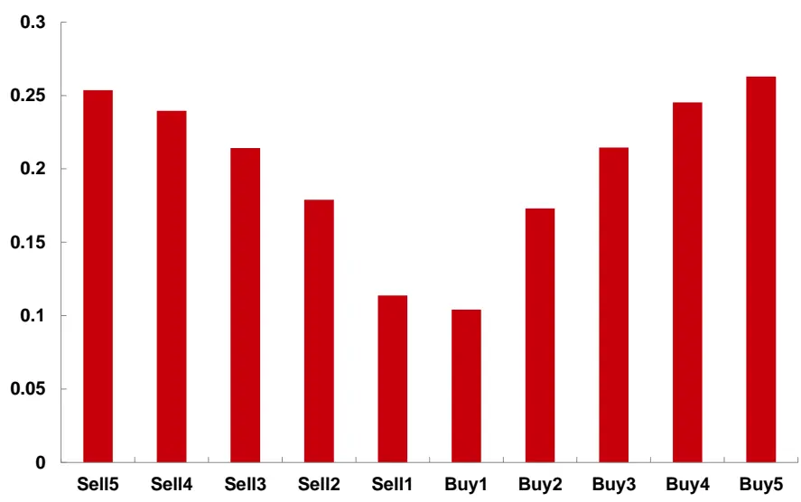
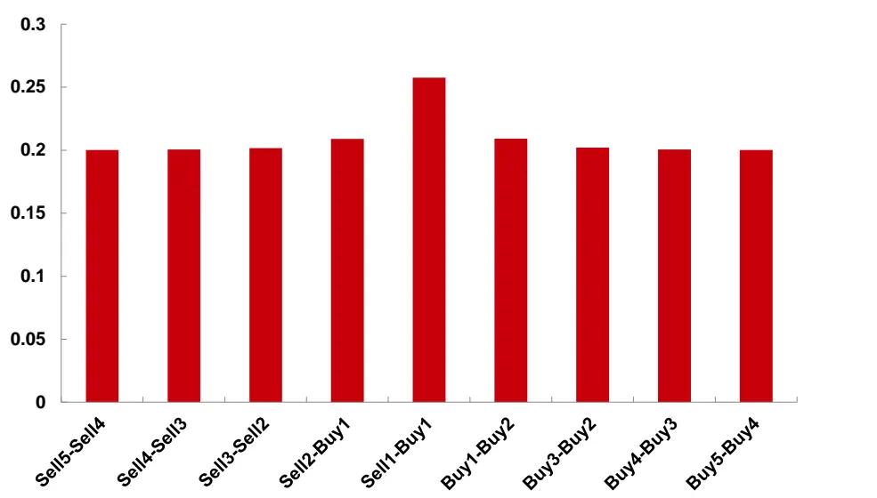
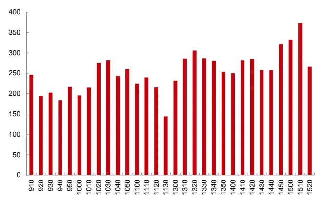
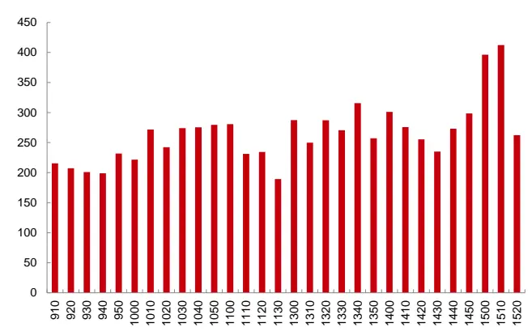
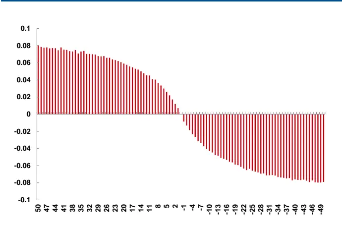
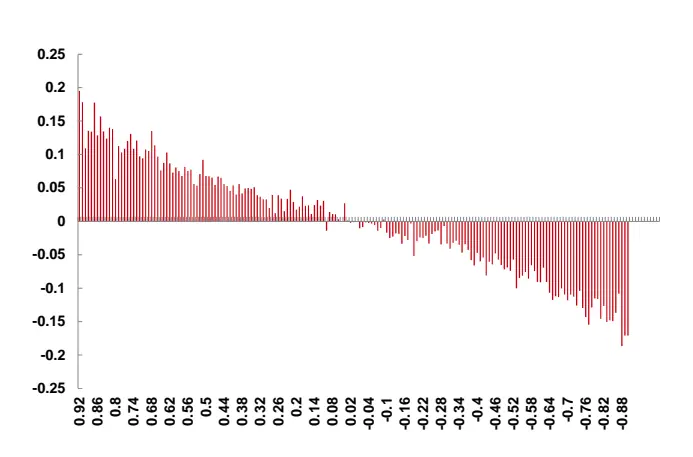
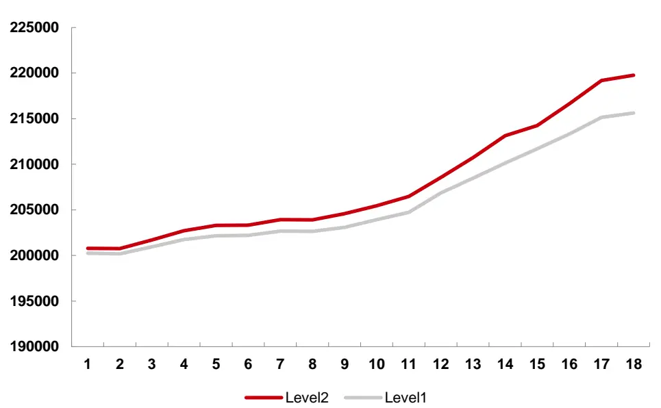
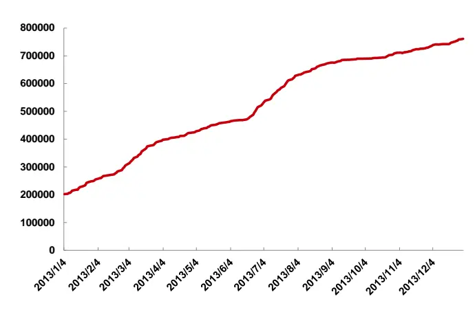
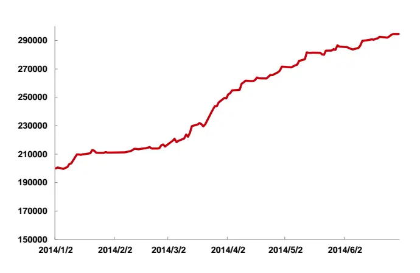

金融工程报告●衍生品研究

## 期指Level2 行情的价格发现研究及高频实战体会—CTA程序化交易实务研究之八

## 核心观点：

## 期指 Level2 行情的分布特征

挂单深度方面，买卖各档的挂单深度基本对称，一档的挂单量大约占总挂单量的10%。

价差方面，AskPrice1-BidPrice1 大约为 0.26,其他相邻档的价差为 0.2。

日内效应方面，五档挂单总量没有呈现明显的趋势，总体上，中午前后时段挂单量减少，尾盘15:00后挂单量达到全天的高点。

## Hasbrouck信息份额模型表明，Level2 行情有利于价格发现

Hasbrouck信息份额模型实证表明，MID（中间价）、LP（最新价）、WP2-5（2-5档加权价格）的信息份额均值分别为62.19%、20.67%、19.98%，可见 WP2-5 包含了不可忽视的信息。

进一步研究发现，Level2订单簿不平衡和价格变化有更明显相关性，在同样的时间周期内(1tick)，推动价格变化的空间要比Level1数据有了明显的提升，平均价格变化从0.08提高到接近0.2。

## Level2 行情可以用于改进策略

抽样一个月，相同的策略，增加Level2数据信息，业绩由7.81%提升到9.45%，虽然提升幅度不大，但是表现非常稳定、持续。

## 高频实战分享

通过和实战非常接近的程序化仿真交易，我们有了更深刻的体会，除了模型信号，实战中高频收益受很多因素的影响，包括多事件并发控制、下单最优价格与成交量、主动出场与被动出场、每笔预期收益等。

## 分析师

温尚清

：0755-83021715

：wenshangqing@chinastock.com.cn

执业证书编号：S0130514050007

## 相关研究

《业务篇：CTA程序化交易迎来发展新契机》《平台篇：CTA程序化交易必先利其器》《策略篇：Alligator交易系统实证分析》《Kellv公式在最优f问题上的应用》《基于机器学习的订单簿高频交易策略》《交易执行细节，从模拟走向实战》《多因素混沌时间序列周择时模型》《基于“价量时空”模式共振的周择时模型》《IF市场微观结构特征分析之“庖丁解牛”》

## 一、期指Level2 行情的市场微观结构分析

在我们《CTA程序化交易实务研究系列》的上一篇报告《金融工程：IF市场微观结构特征分析之”庖丁解牛“——CTA程序化交易实务研究之七》201405中，我们从实证的角度，深入研究了期指Leve11行情数据的市场微观结构特征，包括价格变化、买卖价差、订单簿、成交量和久期等角度。

一般的行情软件能够免费看到 Level1行情数据，实际上，中金所还提供了期指Level2 行情数据，可以向数据商提供商购买权限，但费用较高。两者的传输频率是一样的，都是0.5s一笔快照数据，两者的区别是订单簿的完整性，Level1行情数据只有一档订单簿，也就是“买一价(量)、卖一价(量)”，Level2行情数据有五档订单簿信息。如图1所示

图 1: Level2 行情数据示例

| 买一价 | 买一量卖 | 一价 | 卖一量买二价 |  | 买二量卖 | 二价 | 卖二量买 | 三价 | 买三量卖 | 三价 | 卖三量买 | 四价 | 买四量卖 | 四价 | 卖四量买 | 五价 | 买五量卖 | 五价卖 | 五量 |
| --- | --- | --- | --- | --- | --- | --- | --- | --- | --- | --- | --- | --- | --- | --- | --- | --- | --- | --- | --- |
| 2243.6 | 1 | 2243.8 | 102243.4 |  | 65 | 2244 | 16 | 2243 | 582 | 244.2 | 2 | 2243 | 602 | 244.4 | 33 | 2242.8 | 2 | 2245 | 2 |
| 2243.2 | 68 | 2243.6 | 54 | 2243 | 62 | 2244 | 48 | 2243 | 7 | 2244 | 5 | 2243 | 22 | 244.4 | 32 | 2242.4 | 4 | 2245 | 11 |
| 2243 | 103 | 2243.2 | 42 | 242.8 | 9 | 2244 | 37 | 2243 | 72 | 243.8 | 24 | 2242 | 6 | 2244 | 35 | 2242.2 | 60 | 2244 | 4 |
| 2242.6 | 3 | 2243 | 112 | 242.4 | 8 | 2243 | 5 | 2242 | 60 | 2243.6 | 79 | 2242 | 552 | 243.8 | 57 | 2241.8 | 6 | 2244 | 37 |
| 2242 | 58 | 2242.4 | 31 | 2241.8 | 8 | 2243 | 173 | 2242 | 11 | 2242.8 | 25 | 2241 | 11 | 2243 | 89 | 2241.2 | 53 | 2243 | 27 |
| 2241.6 | 4 | 2242 | 17 | 2241.4 | 12 | 2242 | 3 | 2241 | 552 | 242.4 | 1 | 2241 | 1742 | 242.6 | 187 | 2240.8 | 21 | 2243 | 30 |
| 2241.2 | 37 | 2241.6 | 24 | 2241 | 174 | 2242 | 36 | 2241 | 212 | 242.2 | 16 | 2241 | 352 | 242.4 | 15 | 2240.4 | 10 | 2243 | 177 |
| 2241.4 | 11 | 2241.6 | 242 | 241.2 | 37 | 2242 | 8 | 2241 | 171 | 2242 | 56 | 2241 | 222 | 242.2 | 8 | 2240.6 | 35 | 2242 | 14 |
| 2241.6 | 18 | 2242 | 492 | 241.4 | 10 | 2242 | 11 | 2241 | 372 | 242.4 | 16 | 2241 | 173 | 2242.6 | 102 | 2240.8 | 22 | 2243 | 26 |
| 2241.8 | 2 | 2242 | 22241.6 |  | 13 | 2242 | 7 | 2241 | 10 | 2242.6 | 102 | 2241 | 392 | 242.8 | 21 | 2241 | 173 | 2243 | 221 |
| 2242 | 3 | 2242.2 | 42 | 241.8 | 2 | 2242 | 2 | 2242 | 42 | 242.6 | 100 | 2241 | 282 | 242.8 | 19 | 2241.2 | 40 | 2243 | 223 |
| 2242.2 | 57 | 2242.4 | 4 | 2242 | 16 | 2243 | 102 | 2242 | 72 | 242.8 | 70 | 2241 | 17 | 2243 | 221 | 2241.2 | 89 | 2243 | 27 |
| 2242.4 | 5 | 2242.6 | 46 2242.2 |  | 92 | 2243 | 68 | 2242 | 22 | 2243 | 223 | 2242 | 32 | 243.2 | 29 | 2241.6 | 8 | 2243 | 7 |

资料来源：银河证券研究部整理

相比 Level1 行情，Level2 行情使得投资者可以观察到更加详细的订单簿信息，同时也为研究市场微观结构理论提供更加翔实的数据。

首先，我们回顾一下Level1市场微观结构特征分析的主要结论：

1）由于1个tick时间内，价格变化空间太窄，超高频策略持仓时间不应该小于5tick；

2) Bid-Ask 价差绝对值超过 0.2 的占比高达 27%，极端行情下超过 30%，这是造成实战交易滑价的一个主要原因；

3）订单不平衡对和价格变化高度相关；

4)股指期货存在明显的日内效应，总体上，上午的交易比下午更加活跃。

参加Level1行情的研究角度，我们补充一下Level2 行情订单簿的特征分析。

图2: 五档挂单深度占比分布图

资料来源：银河证券研究部整理

从图2可以看出，买卖各档的挂单深度基本对称，一档的挂单量大约占总挂单量的10%。

图3: 五档价格价差分布图(抽样)

资料来源：银河证券研究部整理

从图3可以看出，除了卖一价和买一价之间的价差较大，图中的抽样结果是0.2576,其他相邻档的价差为0.2。

图4：卖单总量的日内效应（抽样）

资料来源：银河证券研究部整理

图5：买单总量的日内效应（抽样）

资料来源：银河证券研究部整理

图4、图5以10分钟为时间区间进行平滑处理，观察买卖双方挂单总量的日内效应，相比成交量，并没有呈现明显的趋势，总体上，中午前后时段挂单量减少，尾盘15:00后挂单量达到全天的高点。

## 二、期指Level2 行情的价格发现功能

价格发现功能是期货的重要功能，本文研究的重点是期指Level2 行情是否比 Level1 行情更具价格发现功能，以及如何在高频交易使用Level2行情提供的信息。

## (一)Level2 行情价格发现功能实证

在研究之前，我们回顾一下三个不同的价格：

$$
MID=\frac{P_{1}^{b}+P_{1}^{a}}{2}
$$

$$
\begin{array}{r}{WP^{n_{1}-n_{2}}=\frac{\sum_{j=n_{1}}^{n_{2}}Q_{j}^{b}P_{j}^{b}+Q_{j}^{a}P_{j}^{a}}{\sum_{j=n_{1}}^{n_{2}}(Q_{j}^{b}+Q_{j}^{a})},\quad n_{1}<n_{2}}\end{array}
$$

还有一个是LP(LastPrice)，行情数据已经提供。

价格发现是金融市场的主要功能之一。在传统的做市商市场，关于价格发现与确定问题的理论解释分为存货模型和信息模型。国内股指期货市场是纯粹的订单驱动市场，时需要考虑大量匿名交易者的相互影响如何导致价格的形成，与此同时，这些交易者的到达时间不同，可以选择提交市价订单与限价订单，并且能够在订单成交之前的任意时间内撤销或更改其提交的订单，因此，订单驱动市场本身的复杂性导致关于订单驱动市场下的价格发现与确定的理论与实证研究相对较少，而且学术界并无定论，分歧点主要是知情交易者采取何种方式将私有信息传递到价格。

主流的观点分为两种：

观点1：知情交易者倾向于提交市价单，Glosten(1994)为代表，担心限价单不一定成交；订单簿未包含有效信息。

观点2：知情交易者倾向于提交限价单，以Cao（2009)，O’hara为代表，担心市价单传递出太多私有信息。订单簿包含了与价格走势相关的信息。

我们比较认同Cao的研究结论，他认为订单簿需求和供给的不平衡与未来短期收益有显著的相关性，他的论文中提出了Hasbrouck信息份额方法（简称ISA），用于验证，其理论简单介绍如下：

ISA来源于向量误差修正模型(VECM),改模型认为，如果两个或两个以上满足协整关系的价格序列，那么存在一个影响走势的公共因子。

价格发现：当新信息冲击对公共因子产生的方差，某一个价格序列对此方差的相对贡献大小。

为了便于理解，我们以常见的两个时间序列模型为例，阐述一下该模型的原理。

向量误差修正（VECM）模型：

$$
\mathrm{二}_{Y_{t}}=\alpha\beta^{'}Y_{_{t-1}}+\sum^{^{k}}{_{j-1}\Phi}_{j}^{\mathrm{~口}}Y_{_{t-j}}+\varepsilon_{_{t}}
$$

其中 $Z\;=\;\beta\stackrel{\cdot}{Y}_{_{t-1}}$ 为误差修正量，α是误差修正量， $\alpha\beta\stackrel{\cdot}{Y}_{{}_{t-1}}$ 表示价格的长期均衡关系，$\sum_{\mathbf{\Lambda}_{j-1}}^{\mathbf{\Lambda}_{k}}\Phi_{\mathbf{\Lambda}_{j}}^{\mathbf{\Lambda}_{\mathbf{\Lambda}_{\mathbf{\Lambda}_{j}}}}Y_{\mathbf{\Lambda}_{t-\mathbf{\Lambda}_{j}}}$ 表示价格的短期动态关系， $\varepsilon_{_t}$ 为随机扰动项，均值为0，序列不相关，协方差矩阵：

$$
\Omega=\left(\begin{array}{cc}\sigma_{1}^{2}&\rho\sigma_{1}\sigma_{2}\\\rho\sigma_{1}\sigma_{2}&\sigma_{2}^{2}\\\end{array}\right)
$$

${\sigma}_{\mathrm{~l~}}^{\mathrm{~2~}}$ $\sigma_{\mathrm{~2~}}^{\mathrm{~2~}}$ 为新信息 $\mathcal{E}_{1t}$ $\mathcal{E}_{2t}$ 的方程， $\rho$ 为相关系数。

VECM可以检验两个价格时间序列的相互引导关系，在VECM模型的基础上，Hasbrouck(1995)发明了Hasbrouck信息份额方法，能够衡量每个时间序列对价格发现的贡献度。

如果两个价格时间序列 $Y_{_{1t}}$ ， $Y_{_{2t}}$ 满足协整关系，两者存在一个共同的变化趋势，即存在一个公共因子驱动，设为 $C_{\textit{ t }}$ ，时间序列 $Y_{_{1t}}$ ， $Y_{_{2t}}$ 都可以分解为公共因子部分和噪声部分：

$Y_{_{1t}}=C_{_{t}}+\varepsilon_{_{1t}}\quad Y_{_{2t}}=C_{_{t}}+\varepsilon_{_{2t}}$ ，将 $C_{\textit{ t }}$ 定义为 $Y_{_{1t}}$ ， $Y_{_{2t}}$ 的线性组合 $C_{_t}=\gamma_{_1}Y_{_{1t}}+\gamma_{_2}Y_{_{2t}}$ ，其中$\gamma_{\mathrm{~l~}}$ $\gamma_{\mathrm{~2~}}$ 经过标准化处理，满足 $\gamma_{1}+\gamma_{2}=1$

信息份额模型将公共因子的方差进行分解，根据每个市场的信息对公共因子方差的贡献比例来定义每个价格时间序列的价格发现功能。

当两个价格时间序列的信息不存在明显相关时，第j个市场的信息份额为

$$
S_{滘}=\frac{\gamma_{1}^{2}\sigma_{j}^{2}}{\gamma_{1}^{2}\sigma_{j}^{2}+\gamma_{2}^{2}\sigma_{j}^{2}}
$$

当两个两个价格时间序列的信息存在明显相关时，Hasbrouck方差矩阵 $\Omega$ 进行 Cholesky分解， $\Omega=MM^{\mathrm{~\scriptsize~\cdot~}}$ ，则 $Y_{_{1t}}$ ， $Y_{_{2t}}$ 的信息份额占比分别为

$$
S_{_{\mathrm{~\tiny{~1}}}}=\frac{(\gamma_{_{1}}m_{_{11}}+\gamma_{_{2}}m_{_{12}})^{^{2}}}{(\gamma_{_{1}}m_{_{11}}+\gamma_{_{2}}m_{_{12}})^{^{2}}+(\gamma_{_{2}}m_{_{22}})^{^{2}}}
$$

$$
S_{_{\gamma_{_2}}}=\frac{(\gamma_{_2}m_{_{12}})^{^2}}{(\gamma_{_1}m_{_{11}}+\gamma_{_2}m_{_{12}})^{^2}+(\gamma_{_2}m_{_{22}})^{^2}}
$$

其中 $M=\begin{pmatrix}m_{_{11}}&0\\m_{_{12}}&m_{_{22}}\end{pmatrix}=\begin{pmatrix}\sigma_{_1}&0\\\rho\sigma_{_2}&\sigma_{_2}(1-\rho^{^2})^{^{1/2}}\end{pmatrix}$ 。可以看出，这种情况下， $Y_{_{1t}}$ $Y_{_{2t}}$ 的信息份额占比是不对称的，这是由于Cholesky分解对第一个价格序列赋予了较大的信息份额，通过改变模型变量的排序，可以得到 $Y_{_{1t}}$ ， $Y_{_{2t}}$ 各自信息份额占比的上下限。一般将上下限的中点作为信息份额的有效估计。

由于Level2行情的数据量有限，以及考虑到计算复杂度问题，我们采用抽样一个月数据进行实证，结果如表1所示。MID、LP、WP2-5的信息份额均值分别为62.19%、20.67%、19.98%。

表1：价格发现功能实证数据

| 指标 | 类型 | 数值 |
| --- | --- | --- |
| MID | 上限 | 72.63 |
|  | 下限 | 51.75 |
|  | 均值 | 62.19 |
|  | 上限 | 24.56 |
|  | 下限 | 16.83 |
|  | 均值 | 20.695 |
| WP2-5 | 上限 | 26.52 |
|  | 下限 | 13.43 |
|  | 均值 | 19.975 |

数据来源：银河证券研究部整理

## (二)Level2 行情订单簿不平衡与价格的相关性

在我们上一篇报告《金融工程：IF市场微观结构特征分析之”庖丁解牛“——CTA程序化交易实务研究之七》201405中，简单用“买一量和卖一量之差”来衡量订单簿不平衡，当BidVol1-AskVol1=50 时，价格变化的期望值正 0.08，反之，当 BidVol1-AskVol1=-50 时，价格变化的期望值为-0.08，呈现严格的单调性。

参考Cao（2009）的方法，我们可以定义Level2行情的订单簿不平衡。

首先考虑挂单量的不平衡，用 $\boldsymbol{Q}_{j}^{b}$ 表示第j档买单的挂单量，用 $\boldsymbol{Q}_{j}^{a}$ 表示j档卖单的挂单量， $QR_{\perp}$ 表示第j档的不平衡强度，公式表达如下：

$$
QR_{j}=\frac{Q_{j}^{b}-Q_{j}^{a}}{Q_{j}^{b}+Q_{j}^{a}},j=1,2,\ldots,5
$$

然后考虑价格的不平衡，用 $\boldsymbol{P}_{j}^{b}$ 表示第j档买单的价格，用 $\boldsymbol{P}_{j}^{a}$ 表示j档卖单的价格， $HR_{\phantom{\dagger}_{j}}$ 表示第j档的价格不平衡强度，定义如下：

$$
HR_{_{j}}=\frac{(P_{_{j}}^{^{a}}-P_{_{j-1}}^{^{a}})-(P_{_{j}}^{^{b}}-P_{_{j-1}}^{^{d}})}{(P_{_{j}}^{^{a}}-P_{_{j-1}}^{^{a}})+(P_{_{j}}^{^{b}}-P_{_{j-1}}^{^{b}})},j=1,2,...,5
$$

前文统计了期指Level2行情的各档价格的分布，除了一档价买卖价差Spread=AskPricie1-BidPrice1 的均值大于0.2，其他档的价格之间基本都是0.2，因此 $HR_{\mathrm{~}_{j}}$ 在国内股指期货行情中的意义不大。下文重点考察挂单量的不平衡。

通过五档行情，我们可以综合计算整体的订单簿不平衡强度，第j权重记为 $\omega_{\mathrm{~}_{j}}$ ，公式如下：

$$
\sum_{j=1}^{5}\omega_{j}\mathrm{{\cal{U}}}QR_{j}
$$

参照Level1行情的研发方法，我们进行实证检验，由于数据量有限，抽取一个月的数据作为样本。实证结果如图6、图7所示，Level2订单簿不平衡和价格变化也成明显的单调性，在同样的时间内(1tick)，推动价格变化的空间要比Level1有了明显的提升，平均价格变化从0.08提高到接近0.2。由于图7的实证结果是抽样数据，数据量较少，因此相比图6没那么平滑。

图 6: Level1 订单簿不平衡与价格变化关系(Δt=1tick)

资料来源：银河证券研究部整理

图 7: Level2 订单簿不平衡与价格变化关系(Δt=1tick)

资料来源：银河证券研究部整理

## (三)利用 Level2 订单簿信息改进高频策略

我们对《金融工程：IF市场微观结构特征分析之”庖丁解牛“——CTA程序化交易实务研究之七》201405中的高频策略进行改进，增加2-5档订单簿的不平衡信息，实证结果如图8所示，以20w投资一手期指主力合约测算，一个月的业绩由7.81%提升到9.45%，虽然提升的幅度不大，但是表现非常稳定、持续。

图8:Level2 行情对策略的改进效果（一个月抽样结果）

资料来源：银河证券研究部整理

## 三、实战体会分享

## (一)超高频策略样本外模拟

2013年样本内业绩：按照对手价的撮合机制，以20万投资1手计算，2013年业绩280%，最大回撤0.17%，盈利天数225，亏损天数13。

2014年上半年样本外业绩：按照对手价的撮合机制，以20万投资1手计算，2014年上半年业绩接近50%，最大回撤1.09%，盈利天数80，亏损天数39。样本外的收益比样本内下降了不少，除了模型的问题，也和2014年行情的波动性下降有关。

图 9:2013 年样本内收益 280%

资料来源：银河证券研究部整理

图 10：2014 年上半年样本外收益接近 50%

资料来源：银河证券研究部整理

## (二)走进高频实战

我们通过仿真交易实战了一段时间，获得了许多深刻的体会，这是模拟研究环境无法领悟的。高频交易要获得收益，不仅依赖信号，IT设备、程序运算效率和下单技巧等因素也非常重要，简要总结5点。

## 1、业绩回溯精确度和实战关键指标

高频策略研究的一个难点是难以通过历史回溯模拟撮合情景；

由于持仓时间过短，日内趋势比较关注胜率、盈亏比等指标，高频交易更加关注收益回撤比、夏普率和每手盈利。

## 2、高频程序化交易实现要点

表2：多事件并发控制

| 序号 | 名称 | 描述 |
| --- | --- | --- |
| 1 | 行情到达 | 每个 tick 行到达的时候触发 |
| 2 | 委托成功 | 交易收到下单后产生的回报 |
| 3 | 委托拒绝 | 交易所拒绝委托单时产生的回报，可能是保证金不足或者价格不符合规范 |
| 4 | 成交回报 | 下单成交后交易所产生的回报，一个下单可能产生多个回报 |
| 5 | 撤单拒绝 | 交易所拒绝撤单产生的回报 |
| 6 | 撤单成功 | 撤单成功产生的回报 |

数据来源：银河证券研究部整理

程序需要实现六个事件的并发控制，同时要满足事件之间的逻辑闭环关系，包括：

1) 成交回报：一次下单可能产生多次成交回报；

2) 成交确认：只有产生了成交回报，才是真正的成交手数；

3) 撤单前提：先产生了委托成功，才可能撤单；

4) 追单前提：只有撤单成功，才能重新下单。

此外，状态机是程序实现的难点，要精确记录下单、部分成交、完全成交、空闲等多状态切换。

## 3、下单的最优价格与成交率

根据订单簿的价格确定最优下单价格，打单成交率和下单速度、下单激进程度和价格波动有关。

## 4、主动出场与被动出场问题

主动出场是最理想的，根据市场的最新信息，通过信号判断出场，但这还足够，因为

信号对市场的判断不可能百分比准确，因此需要被动出场方式辅助，包括止盈、止损等方式。在被动止损的时候，下单和撤单的算法很有讲究。

## 5、高频交易每笔预期收益

高频交易每笔预期收益和信号的有效时间相关，一般而言，持仓时间越短，价格变化空间越窄，单笔收益越少。

## (三)仿真交易记录案例

案例1是严格按照主动出场信号情况下，此时，策略的止盈止损范围较大，交易结果与信号结果有一定差距。

图11：案例1，预期收益过高情况下的仿真交易记录

| 买/卖 | 投机/套保 | 成交价 | 手数 | 成交额 | 开/平 | 手续费 | 平仓盈亏 | 实际成交日期 |
| --- | --- | --- | --- | --- | --- | --- | --- | --- |
| 卖 | 投机 | 2,171.80 | 1 | 651,540.00 | 开 | 16.94 | - | 2014/7/4 |
| 买 | 投机 | 2,171.60 | 1 | 651,480.00 | 平 | 16.94 | 60 | 2014/7/4 |
| 卖 | 投机 | 2,168.80 | 1 | 650,640.00 | 开 | 16.92 |  | 2014/7/4 |
| 买 | 投机 | 2,168.40 | 1 | 650,520.00 | 平 | 16.91 | 120 | 2014/7/4 |
| 买 | 投机 | 2,167.00 | 1 | 650,100.00 | 开 | 16.9 |  | 2014/7/4 |
| 卖 | 投机 | 2,166.80 | 1 | 650,040.00 | 平 | 16.9 | -60 | 2014/7/4 |
| 卖 | 投机 | 2,163.80 | 1 | 649,140.00 | 开 | 16.88 | 1 | 2014/7/4 |
| 买 | 投机 | 2,163.40 | 1 | 649,020.00 | 平 | 16.87 | 120 | 2014/7/4 |
| 买 | 投机 | 2,165.80 | 1 | 649,740.00 | 开 | 16.89 | -- | 2014/7/4 |
| 卖 | 投机 | 2,165.80 | 1 | 649,740.00 | 平 | 16.89 | 0 | 2014/7/4 |
| 卖 | 投机 | 2,167.20 | 1 | 650,160.00 | 开 | 16.9 | - | 2014/7/4 |
| 买 | 投机 | 2,167.40 | 1 | 650,220.00 | 平 | 16.91 | -60 | 2014/7/4 |
| 卖 | 投机 | 2,167.20 | 1 | 650,160.00 | 开 | 16.9 | - | 2014/7/4 |
| 买 | 投机 | 2,167.00 | 1 | 650,100.00 | 平 | 16.9 | 60 | 2014/7/4 |
| 卖 | 投机 | 2,164.60 | 1 | 649,380.00 | 开 | 16.88 | - | 2014/7/4 |
| 买 | 投机 | 2,164.80 | 1 | 649,440.00 | 平 | 16.89 | -60 | 2014/7/4 |
| 买 | 投机 | 2,165.20 | 1 | 649,560.00 | 开 | 16.89 |  | 2014/7/4 |
| 卖 | 投机 | 2,165.40 | 1 | 649,620.00 | 平 | 16.89 | 60 | 2014/7/4 |
|  |  |  | 18 | 11,700,600.00 |  | 304.2 | 240 |  |

资料来源：银河证券研究部整理

案例2是把每笔预期收益调至最低的交易结果，此时胜率达到100%。

图 12: 案例2，预期收益 0.2 情况下的仿真交易记录

| 买/卖 | 投机/套保 | 成交价 | 手数 | 成交额 | 开/平 | 手续费 | 平仓盈亏 | 实际成交日期 |
| --- | --- | --- | --- | --- | --- | --- | --- | --- |
| 买 | 投机 | 2,197.60 | 1 | 659,280.00 | 开 | 17.14 |  | 2014/7/24 |
| 卖 | 投机 | 2,197.80 | 1 | 659,340.00 | 平 | 17.14 | 60 | 2014/7/24 |
| 买 | 投机 | 2,213.80 | 1 | 664,140.00 | 开 | 17.27 | -- | 2014/7/24 |
| 卖 | 投机 | 2,214.00 | 1 | 664,200.00 | 平 | 17.27 | 60 | 2014/7/24 |
| 卖 | 投机 | 2,216.60 | 1 | 664,980.00 | 开 | 17.29 |  | 2014/7/24 |
| 买 | 投机 | 2,216.40 | 1 | 664,920.00 | 平 | 17.29 | 602 | 014/7/24 |
| 买 | 投机 | 2,219.80 | 1 | 665,940.00 | 开 | 17.31 |  | 2014/7/24 |
| 卖 | 投机 | 2,220.00 | 1 | 666,000.00 | 平 | 17.32 | 60 | 2014/7/24 |
| 卖 | 投机 | 2,211.00 | 1 | 663,300.00 | 开 | 17.25 | -- | 2014/7/24 |
| 买 | 投机 | 2,210.80 | 1 | 663,240.00 | 平 | 17.24 | 60 | 2014/7/24 |
| 卖 | 投机 | 2,216.80 | 1 | 665,040.00 | 开 | 17.29 | -- | 2014/7/24 |
| 买 | 投机 | 2,216.60 | 1 | 664,980.00 | 平 | 17.29 | 60 | 2014/7/24 |
| 买 | 投机 | 2,218.00 | 1 | 665,400.00 | 开 | 17.3 | -- | 2014/7/24 |
| 卖 | 投机 | 2,218.20 | 1 | 665,460.00 | 平 | 17.3 | 60 | 2014/7/24 |
| 买 | 投机 | 2,230.20 | 1 | 669,060.00 | 开 | 17.4 |  | 2014/7/24 |
| 卖 | 投机 | 2,230.40 | 1 | 669,120.00 | 平 | 17.4 | 602 | 014/7/24 |
| 卖 | 投机 | 2,236.80 | 1 | 671,040.00 | 开 | 17.45 |  | 2014/7/24 |
| 买 | 投机 | 2,236.60 | 1 | 670,980.00 | 平 | 17.45 | 602 | 014/7/24 |
|  |  |  | 18 | 11,976,420.00 |  | 311.4 | 540 |  |

资料来源：银河证券研究部整理

案例3是把预期收益略为调高，但依然可以保持胜率的理想情况。

图13: 案例 3，预期收益 0.4 情况下的仿真交易记录

| 买/卖 | 投机/套保 | 成交价 | 手数 | 成交额 | 开/平 | 手续费 | 平仓盈亏 | 实际成交日期 |
| --- | --- | --- | --- | --- | --- | --- | --- | --- |
| 卖 | 投机 | 2,167.80 | 1 | 650,340.00 | 开 | 16.91 |  | 2014/7/16 |
| 买 | 投机 | 2,167.60 | 1 | 650,280.00 | 平 | 16.91 | 60 | 2014/7/16 |
| 卖 | 投机 | 2,171.00 | 1 | 651,300.00 | 开 | 16.93 | - | 2014/7/16 |
| 买 | 投机 | 2,170.60 | 1 | 651,180.00 | 平 | 16.93 | 120 | 2014/7/16 |
| 买 | 投机 | 2,174.20 | 1 | 652,260.00 | 开 | 16.96 | -- | 2014/7/16 |
| 卖 | 投机 | 2,174.60 | 1 | 652,380.00 | 平 | 16.96 | 120 | 2014/7/16 |
| 卖 | 投机 | 2,167.80 | 1 | 650,340.00 | 开 | 16.91 | - | 2014/7/16 |
| 买 | 投机 | 2,167.40 | 1 | 650,220.00 | 平 | 16.91 | 120 | 2014/7/16 |
| 买 | 投机 | 2,168.80 | 1 | 650,640.00 | 开 | 16.92 | -- | 2014/7/16 |
| 卖 | 投机 | 2,169.20 | 1 | 650,760.00 | 平 | 16.92 | 120\| | 2014/7/16 |
| 买 | 投机 | 2,165.60 | 1 | 649,680.00 | 开 | 16.89 |  | 2014/7/16 |
| 卖 | 投机 | 2,165.60 | 1 | 649,680.00 | 平 | 16.89 | 0 | 2014/7/16 |
|  |  |  | 12 | 7,809,060.00 |  | 203.04 | 540 |  |

资料来源：银河证券研究部整理

由于订单簿产生的信号有效时间很短，开仓后持仓时间很短，因此每笔收益不高，但这也是超高频策略的特点，只能通过多次交易，把稀薄的利润逐步累积成丰厚的收益。

## 四、风险提示

本报告中的所有模型都是根据历史数据建立和测算的，图表中展示的效果亦是基于历史数据，并不必然保证未来有同样好的收益。本报告中的所有模型和结论只供投资者参考，并不能完全排除未来的风险。

## 评级标准

## 银河证券行业评级体系：推荐、谨慎推荐、中性、回避

推荐：是指未来6-12个月，行业指数（或分析师团队所覆盖公司组成的行业指数）超越交易所指数（或市场中主要的指数）平均回报20%及以上。该评级由分析师给出。

谨慎推荐：行业指数（或分析师团队所覆盖公司组成的行业指数）超越交易所指数（或市场中主要的指数）平均回报。该评级由分析师给出。

中性：行业指数（或分析师团队所覆盖公司组成的行业指数）与交易所指数（或市场中主要的指数）平均回报相当。该评级由分析师给出。

回避：行业指数（或分析师团队所覆盖公司组成的行业指数）低于交易所指数（或市场中主要的指数）平均回报10%及以上。该评级由分析师给出。

## 银河证券公司评级体系：推荐、谨慎推荐、中性、回避

推荐：是指未来6-12个月，公司股价超越分析师（或分析师团队）所覆盖股票平均回报20%及以上。该评级由分析师给出。

谨慎推荐：是指未来6-12个月，公司股价超越分析师（或分析师团队）所覆盖股票平均回报10%-20%。该评级由分析师给出。

中性：是指未来6-12个月，公司股价与分析师（或分析师团队）所覆盖股票平均回报相当。该评级由分析师给出。

回避：是指未来6-12个月，公司股价低于分析师（或分析师团队）所覆盖股票平均回报10%及以上。该评级由分析师给出。

温尚清，证券分析师。本人具有中国证券业协会授予的证券投资咨询执业资格并注册为证券分析师，本人承诺，以勤勉的职业态度，独立、客观地出具本报告。本报告清晰准确地反映本人的研究观点。本人不曾因，不因，也将不会因本报告中的具体推荐意见或观点而直接或间接受到任何形式的补偿。（本人承诺不利用自己的身份、地位和执业过程中所掌握的信息为自己或他人谋取私利)。

## 免责声明

本报告由中国银河证券股份有限公司（以下简称银河证券，银河证券已具备中国证监会批复的证券投资咨询业务资格）向其机构或个人客户（以下简称客户）提供，无意针对或打算违反任何地区、国家、城市或其它法律管辖区域内的法律法规。除非另有说明，所有本报告的版权属于银河证券。未经银河证券事先书面授权许可，任何机构或个人不得更改或以任何方式发送、传播或复印本报告。

本报告所载的全部内容只提供给客户做参考之用，并不构成对客户的投资建议，并非作为买卖、认购证券或其它金融工具的邀请或保证。银河证券认为本报告所载内容及观点客观公正，但不担保其内容的准确性或完整性。客户不应单纯依靠本报告而取代个人的独立判断。本报告所载内容反映的是银河证券在最初发表本报告日期当日的判断，银河证券可发出其它与本报告所载内容不一致或有不同结论的报告，但银河证券没有义务和责任去及时更新本报告涉及的内容并通知客户。银河证券不对因客户使用本报告而导致的损失负任何责任。

银河证券不需要采取任何行动以确保本报告涉及的内容适合于客户。银河证券建议客户如有任何疑问应当咨询证券投资顾问并独自进行投资判断。本报告并不构成投资、法律、会计或税务建议或担保任何内容适合客户，本报告不构成给予客户个人咨询建议。

本报告可能附带其它网站的地址或超级链接，对于可能涉及的银河证券网站以外的地址或超级链接，银河证券不对其内容负责。本报告提供这些地址或超级链接的目的纯粹是为了客户使用方便，链接网站的内容不构成本报告的任何部份，客户需自行承担浏览这些网站的费用或风险。

银河证券在法律允许的情况下可参与、投资或持有本报告涉及的证券或进行证券交易，或向本报告涉及的公司提供或争取提供包括投资银行业务在内的服务或业务支持。银河证券可能与本报告涉及的公司之间存在业务关系，并无需事先或在获得业务关系后通知客户。

银河证券无需因接收人收到本报告而视其为客户。本报告是发送给银河证券客户的，属于机密材料，只有银河证券客户才能参考或使用，如接收人并非银河证券客户，请及时退回并删除。

所有在本报告中使用的商标、服务标识及标记，除非另有说明，均为银河证券的商标、服务标识及标记。

银河证券版权所有并保留一切权利。

## 联系

## 中国银河证券股份有限公司研究部

北京市西城区金融街35号国际企业大厦C座上海浦东新区富城路99号震旦大厦26楼深圳市福田区福华一路中心商务大厦26层北京市西城区金融街35号国际企业大厦C座公司网址：www.chinastock.com.cn

## 机构请致电：

北京地区：傅楚雄 010-83574171 fuchuxiong@chinastock.com.cn 上海地区：何婷婷 021-20252612 hetingting@chinastock.com.cn 深广地区：詹 璐 0755-83453719 zhanlu@chinastock.com.cn 海外机构：刘思瑶010-83571359 liusiyao@chinastock.com.cn