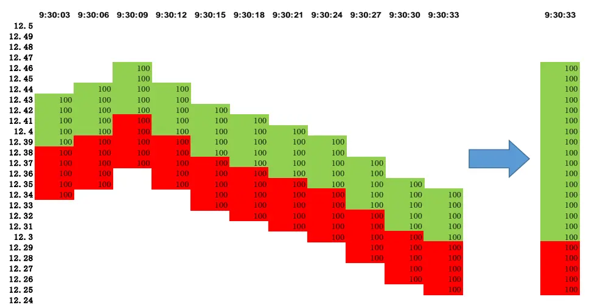
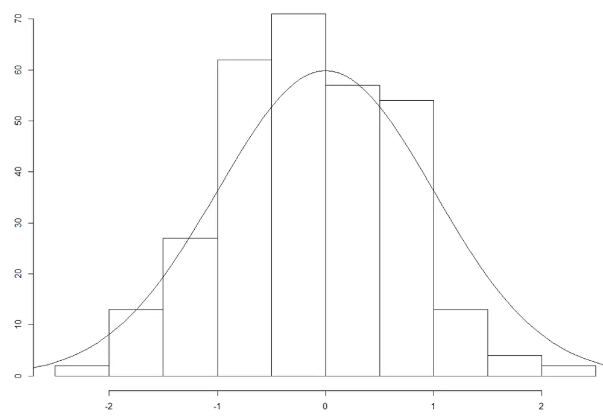
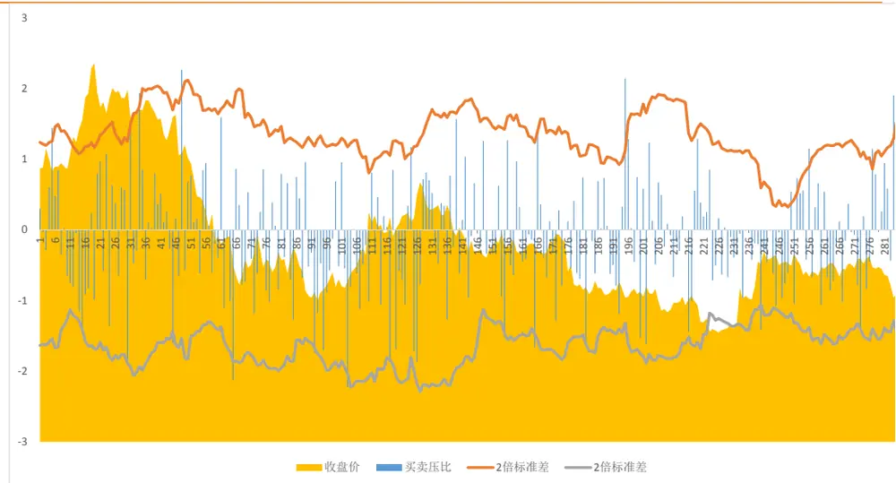
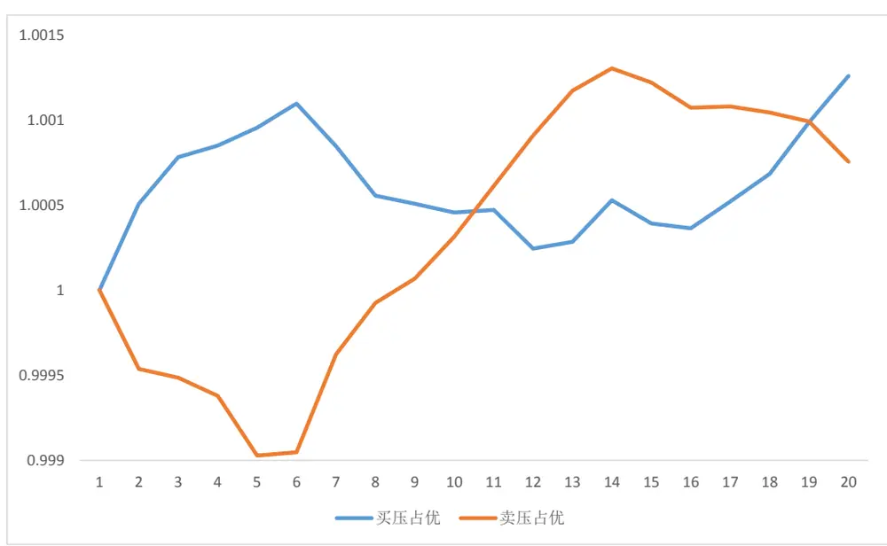
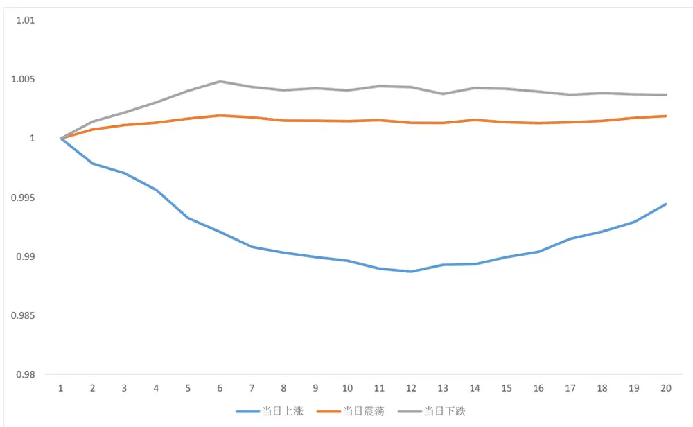
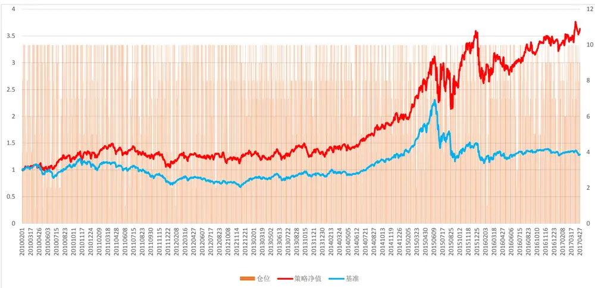
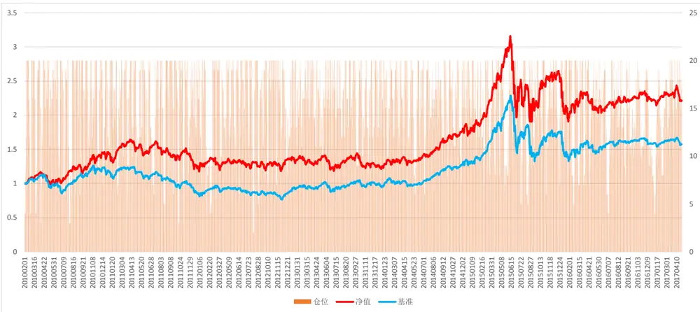
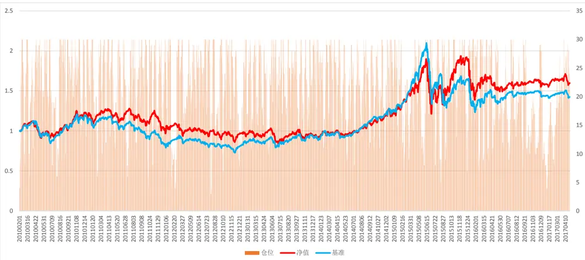

## 金融工程

## 买卖压力失衡——利用高频数据拓展盘口数据

2017 年 08 月 01 日

证券研究报告

## 高频数据应用于股票市场的关键点在于高频数据到低频信号的降频逻辑

分析师

SAC 执业证书编号：S1110516120001

一是利用高频数据的独特性对数据进行定性，进而加工高频数据，得到低频信号；

二是收集高频数据路径上的信息汇总到低频，得到信息含量更大的低频数据。

吴先兴

## 运用日内成交价作为探针，探测个股挂单数据

我们利用 tick 数据成交价的上下波动时，记录成交价上下挂单情况，在收盘时汇总，并剔除已成交的订单，得到扩展的盘口数据。

依据扩展盘口数据的买盘与卖盘挂单，计算买卖盘压力，发现买卖盘压力失衡对个股超额收益影响显著

1、在买压占优情况下短期内个股会呈现明显的正向超额收益；

3、买卖压力失衡情况消失后，股票的超额收益呈现反向逆转，这意味着买卖压力失衡带来的超额收益仅仅为短期冲击影响，后期股价会逐步修正恢复到原状态。

基于买压占优构建事件驱动策略，10 通道策略取得年化年化 19.66%的收益，并且 16、17 年该策略的表现较为出色，分别取得 9.07%和 6.68%（截止 2017 年 4 月 28 日）。

## 作者

2、在卖压占优情况下短期内个股会呈现明显的负向超额收益；

风险提示：历史回测不代表对未来业绩承诺

wuxianxing@tfzq.com

18616029821

## 相关报告

1《金融工程： FOF 专题研究（三）：华泰柏瑞量化 A 偏股混合型基金》2017-07-24

2《金融工程：专题报告-半衰 IC 加权在多因子选股中的应用》 2017-07-22

3《金融工程：FOF 专题研究（二）：国泰 估 值 优 势 偏 股 混 合 型 基 金 》2017-07-18

4《金融工程：专题报告-私募 EB 正股的投资机会》 2017-07-11

5《金融工程：FOF 专题研究（一）：银华中小盘精选偏股混合型基金》2017-07-06

6《金融工程：专题报告-国债期货组合 趋势策略：以损定量,顺势加仓》 2017-06-19

7《金融工程：专题报告-量化选股模型：戴维斯双击！》 2017-06-18

8《金融工程：专题报告-国债期货展期价差交易》 2017-05-25

9《金融工程：专题报告-基于高管增持事件的投资策略》 2017-05-14

10《金融工程：定期报告-2017 年 6 月沪深重点指数样本股调整预测》2017-05-06

10《金融工程：定期报告-2017 年 6 月沪深重点指数样本股调整预测》2017-05-06

12《金融工程：专题报告-策略的趋势过滤》 2017-03-22

13《金融工程：专题报告-日间趋势策略初探》 2017-03-10

14《金融工程：专题报告-基于自适应 破发回复的定增选股策略》2017-03-09

15《金融工程：专题报告-定增节点收益全解析》 2017-03-06

## 从高频数据到低频策略

提及高频数据，直观的反应都是应该应用于高频交易，的确，纯粹的高频数据对于指导低频的投资策略是没有很大的意义的。因此，为了利用高频数据中的额外信息，需要对高频数据中的交易信号降频。

其中一种方式是利用高频数据的独特性对数据进行定性，进而加工量化数据，得到低频信号。比如积极买入与保守买入的计算，就是通过高频数据确定买卖方向，进而加总成低频的积极保守交易量，衡量两者之间的强弱关系就能得到投资者的买入情绪变化，进而辅助选股。

另外一种方法，通过捡拾高频数据路径上遗落信息从而增厚低频数据的信息含量。比如在本篇中提到的利用高频率的股价变化作为探知日内盘口信息的媒介，汇总得到比日频盘口信息更加丰富的盘口全景图。进而利用该盘口信息来进行策略构建。

诚然，这样的方法的挖掘难度和适用性限制了高频数据在股票市场上的应用，我们也将努力探索行之有效的方法，以期最大程度地利用高频数据的信息。

## 挂单与筹码

盘口的挂单情况反映了当前该股票上的参与者预期的交易行为，在大样本基础上，排除个别盘口挂单操作行为，通过分析盘口行为，能够得到市场较为真实的买卖筹码分布状态。

1、 当买盘上存在大量挂单时，表明大量筹码等待买入，股价下方存在较高的支撑；而买盘上挂单较少时，说明股价下方买入意愿较为薄弱。

2、 当卖盘上存在大量挂单时，表明大量筹码等待卖出，股价上方承受较大的抛压；而卖盘上挂单较少时，说明股价上方卖出意愿较为薄弱。

图 1：盘口示例

| 15.11 +7.09% (+1.00) |
| --- |
| 卖五 15.16 262 卖卖卖卖买买买 四 15.15 1315 三二一 15.14 762 15.13 151 15.12 283 |
| 1二三 15.11 107 15.10 2981 15.09 218 六买四 15.08 529 买五 15.07 285 |

资料来源：Wind，天风证券研究所

图 1 中为收盘后某个股盘口数据，我们可以看到，在收盘时，我们能观察到买卖五档的挂单数据，观察当前时间点上这五档价位上的筹码分布形态。

这就启发我们，分析买盘与卖盘上的挂单量与挂单的变化对我们预测一个公司未来股

价变化可能会起到作用。

## 更高频的盘口

但是我们在每一个时刻上只能够看到一瞬间的买卖挂单数据，举例，如果以日频的盘口数据来做分析，我们能够得到的只有如图 1 中的盘口情况，我们能够得到的最大的盘口宽度即买卖五档，这样的情形下我们能够分析的数据其实相当有限。

然而，事实上个股日内股价是会存在波动性的，而由于 level1 数据只提供买卖五档的数据，因此如果我们在每一个时间节点上观测到的盘口数据均只有五档，但是如果我们将我们每个时间点上的观测数据串联起来，我们就有可能得到超越五档的行情数据。

这就启发我们从高频数据去获取日内瞬时的盘口数据，因为每一条高频数据的成交价格有可能不同，这就意味着我们在不同的高频数据上获得的盘口数据的挂单价格可能是不同的，那么我们是否可以把不同时间点上的盘口数据组合到一起，从而获得盘口长度更长的盘口数据，从而保留之前高频数据的信息，使得我们在期末的时候能够获得从期初以来的所有盘口数据。

而从全市场而言，我们能够获得的最高高频率的盘口数据就是 tick 数据。

我们 tick 数据来源于天软，level1 数据只提供 5 档买卖价，图 1 为该 tick 数据示例，由于天软的 tick 数据是由交易所多台服务器推送，因此数据时间间隔并不固定。各家数据提供商提供的数据也会有一定的差别，也是因为接收推送的服务器不同的结果。

表 1：tick 数据示例

| 时间 | 最新 | 笔数 | 成交额 | 成交量 | 买五 | 买四 | 买三 | 买二 | 买一 | 卖一 | 卖二 | 卖三 | 卖四 | 卖五 |
| --- | --- | --- | --- | --- | --- | --- | --- | --- | --- | --- | --- | --- | --- | --- |
| 09:30:03 | 34.12 | 3 | 27396 | 800 | 33.8 | 33.82 | 34 | 34.05 | 34.1 | 34.12 | 34.37 | 34.38 | 34.5 | 34.54 |
| 09:30:06 | 34.12 | 0 | 0 | 0 | 33.82 | 33.96 | 34 | 34.05 | 34.1 | 34.12 | 34.37 | 34.38 | 34.5 | 34.54 |
| 09:30:30 | 34.11 | 1 | 10233 | 300 | 33.82 | 33.96 | 34 | 34.05 | 34.1 | 34.11 | 34.12 | 34.37 | 34.38 | 34.5 |
| 09:30:36 | 34.11 | 1 | 6822 | 200 | 33.96 | 34 | 34.05 | 34.1 | 34.11 | 34.12 | 34.35 | 34.37 | 34.38 | 34.5 |
| 09:30:39 | 34.11 | 0 | 0 | 0 | 33.96 | 34 | 34.05 | 34.1 | 34.11 | 34.12 | 34.35 | 34.37 | 34.38 | 34.5 |
| 09:30:42 | 34.11 | 0 | 0 | 0 | 33.96 | 34 | 34.05 | 34.1 | 34.11 | 34.12 | 34.35 | 34.37 | 34.38 | 34.5 |
| 09:31:00 | 34.11 | 1 | 17055 | 500 | 33.82 | 33.96 | 34 | 34.05 | 34.1 | 34.11 | 34.12 | 34.35 | 34.38 | 34.5 |
| 09:31:09 | 34.11 | 0 | 0 | 0 | 33.96 | 34 | 34.05 | 34.08 | 34.1 | 34.11 | 34.12 | 34.35 | 34.38 | 34.5 |
| 09:31:12 | 34.11 | 0 | 0 | 0 | 33.96 | 34 | 34.05 | 34.08 | 34.1 | 34.11 | 34.12 | 34.35 | 34.38 | 34.5 |
| 09:31:15 | 34.1 | 2 | 10230 | 300 | 33.96 | 34 | 34.05 | 34.08 | 34.1 | 34.11 | 34.12 | 34.35 | 34.38 | 34.5 |
| 09:31:27 | 34.1 | 1 | 10230 | 300 | 33.96 | 34 | 34.05 | 34.08 | 34.1 | 34.11 | 34.12 | 34.35 | 34.38 | 34.5 |
| 09:31:30 | 34.1 | 2 | 10230 | 300 | 33.96 | 34 | 34.05 | 34.08 | 34.1 | 34.11 | 34.12 | 34.35 | 34.38 | 34.5 |

资料来源：天软，天风证券研究所

## 以高频数据为“探针”

我们看到 tick 数据上有很多我们在低频数据中获取不到的挂单数据，我们就需要想办法汇集这些高频数据中的信息。

在日内的高频数据中，股票价格就像一根探针，随着成交价格的上下波动，帮助我们探知到市场上投资者在不同的价格上的挂单数据，从而获得当日完全的挂单数据。

我们将表 1 中的逐条 tick 数据转化为如图 2 中挂单序列，挂单序列展示的本质就是股价运行的轨迹，而从序列中我们能得到更多的是在当前成交价上下买卖五档的挂单，而我们根据当日历史的挂单，在每一个时间点上均可以汇总得到一个当日未成交的挂单表。

图 2：挂单序列示例

资料来源：天软，天风证券研究所

通过图 2 中对当日挂单的汇总，得到在 9:30:33 时刻的挂单数据，这样的方式我们就得到了一个买卖共计 22 档的盘口数据，这就使得我们在每一个时间点上可获知的信息含量更高了。不过这样的方式与真实挂单的区别在与，之前挂单的投资者有可能会撤单，因此汇总到最终的挂单数据可能并不是当时真实挂单，但是至少能够反映在各挂单价格曾经出现过的预期，一定程度上能够反映出筹码的分布形态。

## 买卖压力

在我们能够得到足够长的挂单数据之后，我们就可以分析个股在买盘和卖盘上筹码分布的状态，我们称之为买卖压力。

但是不同挂单价格对当前价格的买卖压力应该是不同的，例如在买一卖一上的巨额挂单相比于买五卖五上的巨额挂单，对于当前的价格影响显然会更大，因此如果需要计算买盘与卖盘上的买卖压力，我们就应该对当前价格距离不同的挂单赋予不同的权重，离当前价格更近的挂单赋予更高的权重，而离当前价格远的挂单赋予较低的权重。

我们定义挂单 i 的权重为：

$$
W_{i}=[Class/(P_{i}-Closs)]/\sum Closs/(P_{i}-Closs)
$$

其中 Close 为当日收盘价， $P_{i}$ 为挂单价格。

据此我们计算得到个股买卖压力：

$$
\begin{aligned}&Pbuy=\sum Vol_{i}\left[Class/(P_{i}-Close)\right]/\sum Close/(P_{i}-Close)\\&PSell=\sum Vol_{i}\left[Class/(P_{i}-Close)\right]/\sum Close/(P_{i}-Close)\\\end{aligned}
$$

其中 $Vol_{i}$ 为 i 挂单上的挂单量。

我们用以衡量买卖压力的指标买卖压力比 P：

$$
P=\log(Pbuy)-\log(Psell)
$$

## 买卖压力失衡

计算得到了买盘与卖盘的压力，我们就想思考，当买卖盘压力出现失衡的时候，股价的表现会是怎么样，于是我们用 A 股股票数据进行了探索。

## 1.1. 数据来源

我们使用中证 500 成分股，2010 年以来 tick 数据来计算每个个股上的挂单数据。

全天数据过于繁杂，且全日数据对未来预测性相对有限，同时也为了降低计算量，我们采用个股收盘前一个小时的 tick 数据来汇总盘口数据。

如表 2 中所示，我们对某个股单日收盘前 1 小时盘口挂单数据进行了汇总，得到如下的挂单数据，我们可以看到该个股收盘价为 6.09，通过这样的方式我们获得了更多档位的挂单数据。

表 2：汇总挂单示例

| 时间 | 成交价 | 成交笔数 | 成交额 | 成交量 | 方向 | 档位 | 挂单价 | 挂单量 |
| --- | --- | --- | --- | --- | --- | --- | --- | --- |
| 14:30 | 5.5 | 93 | 758145 | 137872 | 1 | 卖五价 | 5.55 | 131150 |
| 14:31 | 5.49 | 4 | 7137 | 1300 | 1 | 卖五价 | 5.54 | 56500 |
| 14:32 | 5.48 | 4 | 20279 | 3700 | 1 | 卖五价 | 5.53 | 50519 |
| 14:40 | 5.46 | 10 | 92314 | 16900 | 2 | 卖五价 | 5.51 | 67800 |
| 14:41 | 5.45 | 7 | 52302 | 9600 | 1 | 卖五价 | 5.5 | 280572 |
| 14:52 | 5.44 | 13 | 52252 | 9600 | 2 | 卖五价 | 5.49 | 158000 |
| 14:56 | 5.44 | 11 | 86978 | 16000 | 1 | 卖五价 | 5.48 | 84419 |
| 14:56 | 5.43 | 5 | 16290 | 3000 | 1 | 卖五价 | 5.47 | 83700 |
| 14:56 | 5.43 | 5 | 16290 | 3000 | 1 | 卖四价 | 5.46 | 94999 |
| 14:56 | 5.43 | 5 | 16290 | 3000 | 1 | 卖三价 | 5.45 | 140200 |
| 14:56 | 5.43 | 5 | 16290 | 3000 | 1 | 卖二价 | 5.44 | 249230 |
| 14:56 | 5.43 | 5 | 16290 | 3000 | 1 | 买一价 | 5.42 | 90652 |
| 14:56 | 5.43 | 5 | 16290 | 3000 | 1 | 买二价 | 5.41 | 18500 |
| 14:56 | 5.43 | 5 | 16290 | 3000 | 1 | 买三价 | 5.4 | 59500 |
| 14:56 | 5.43 | 5 | 16290 | 3000 | 1 | 买四价 | 5.39 | 111200 |
| 14:56 | 5.43 | 5 | 16290 | 3000 | 1 | 买五价 | 5.38 | 34100 |
| 14:43 | 5.43 | 16 | 103501 | 19100 | 1 | 买五价 | 5.37 | 13700 |
| 14:41 | 5.46 | 0 | 0 | 0 | 0 | 买五价 | 5.36 | 24600 |
| 14:26 | 5.4 | 4 | 20520 | 3800 | 2 | 买五价 | 5.35 | 100100 |
| 14:26 | 5.38 | 0 | 0 | 0 | 0 | 买五价 | 5.34 | 3500 |
| 14:18 | 5.38 | 4 | 22058 | 4100 | 1 | 买五价 | 5.33 | 52139 |
| 14:17 | 5.37 | 2 | 74643 | 13900 | 1 | 买五价 | 5.32 | 17400 |
| 14:16 | 5.36 | 1 | 27872 | 5200 | 1 | 买五价 | 5.31 | 74600 |
| 14:14 | 5.34 | 5 | 51805 | 9700 | 2 | 买五价 | 5.3 | 201900 |
| 14:14 | 5.33 | 2 | 21320 | 4000 | 2 | 买五价 | 5.29 | 17500 |

资料来源：天软，天风证券研究所

## 1.2. 买卖压力失衡

根据之前对于买卖压力的定义，我们对中证 500 成分股所有个股用我们的方法来计算了买卖压力比值。

我们以某个股为例，来观察个股买卖压力分布情况。

图 3：买卖压力分布图

资料来源：天风证券研究所

根据个股的分布状态，我们以过去20个交易日均值±1.96倍过去20个交易日标准差，作为买卖压力失衡的界限，以向上突破为买压占优，向下突破为卖压占优。

以个股为例展示其买卖压力波动情况如图 4。

图 4：买卖压力图

资料来源：天风证券研究所

## 1.3. 超额收益

## 1.3.1. 事件驱动评估系统

在对事件影响的评估过程中，我们发现市场行情对于股价的影响、小盘股效应对股价的影响、涨停没有买入机会等，给评估事件冲击的收益带来了很大的困难。

为了解决这三个问题，我们设定了对应的解决方法，即制定计算真实超额收益的方法：

1、事件发生后，从下一交易日始，选择首次开盘涨幅低于 9%的首个交易日作为评估起始日 T+1；

2、计算自 T+1 日至 T+N 日，发生事件公司（A）超额对应中信一级行业收益率 Ra；

3、筛选 A 公司所在中信一级行业内，与 A 公司在 T+1 日市值最为接近的 5 家公司（以市值±30%为限），计算这些公司超额该中信一级行业的平均收益 Rm；

4、计算该公司相对同行业近市值公司收益率 Ra-Rm，并计算累计收益率；

5、所有测算剔除 ST、*ST。

## 1.3.2. 超额收益测算

通过我们的事件驱动评估系统，我们对样本池内股票出现买卖压力失衡的个股的超额收益进行了测算。

图 5：买压卖压占优超额收益

资料来源：天风证券研究所

我们可以看到：

1、 在买压占优情况下短期内个股会呈现明显的正向超额收益；

2、 在卖压占优情况下短期内个股会呈现明显的负向超额收益；

3、 买卖压力失衡情况消失后，股票的超额收益呈现反向逆转，这意味着买卖压力失衡带来的超额收益仅仅为短期冲击影响，后期股价会逐步修正恢复到原状态。

## 1.3.3. 买压占优分析

在买卖压力失衡的形成过程中，当日价格的波动对挂单是会有很大的影响的，因此我们观察当日股价涨跌幅是否会对我们的买压占优产生影响。

我们根据日涨跌幅将个股区分为三种状态：

1、 当日上涨：当日涨跌幅高于 2%；

2、 当日震荡：当日涨跌幅介于-2%到 2%之间；

3、 当日下跌：当日涨跌幅低于-2%。

图 6：当日涨跌对买压占优超额收益影响

资料来源：天风证券研究所

我们可以看到区分了当日的涨跌状态，对于我们买压占优下的超额收益影响非常明显：

1、 对于买压占优的个股当日下跌然后出现买压占优时，接下来 6、7 个交易日呈现明显的超额收益；

2、 而当日上涨出现买压占优时，往往呈现的是一种追涨的姿态，而不能为我们后续带来超额收益；

3、 当日震荡情形下，买压占优能够对超额收益产生的影响较为有限。

## 1.4. 策略构建

根据测算的样本池内个股的买卖压力失衡状况，我们构建选股策略，选择当日下跌过程中出现买压占优的个股，并持有 10 个交易日，观察历史以来策略表现，我们考察在持仓上限分别为 10、20、30 情况下策略表现。

图 7：策略净值与仓位（10通道）

资料来源：天风证券研究所

图 8：策略净值与仓位（20通道）

资料来源：天风证券研究所

图 9：策略净值与仓位（30通道）

资料来源：天风证券研究所

图 10：收益率分年统计

|  | 绝对收益 |  |  |  |  |
| --- | --- | --- | --- | --- | --- |
| 10通道 | 年份 | 年化收益率 | 夏普比率 | 最大回撤 | 月度胜率 |
|  | 2010 | 37.14% | 1.2118 | -12.81% | 72.73% |
|  | 2011 | -18.25% | -0.8643 | -29.51% | 33.33% |
|  | 2012 | 26.36% | 0.8574 | -15.76% | 50.00% |
|  | 2013 | 2.97% | -0.0011 | -17.18% | 58.33% |
|  | 2014 | 51.18% | 2.0615 | -8.39% | 75.00% |
|  | 2015 | 56.50% | 0.9633 | -31.55% | 58.33% |
|  | 2016 | 9.07% | 0.2071 | -20.17% | 58.33% |
|  | 2017 | 21.70% | 0.9336 | -6.58% | 75.00% |
| 20通道 | 年份 | 年化收益率 | 夏普比率 | 最大回撤 | 月度胜率 |
|  | 2010 | 52.86% | 1.9793 | -17.31% | 72.73% |
|  | 2011 | -16.50% | -0.8565 | -26.41% | 33.33% |
|  | 2012 | 16.65% | 0.5857 | -14.42% | 50.00% |
|  | 2013 | -7.12% | -0.4642 | -16.37% | 50.00% |
|  | 2014 | 41.85% | 2.0376 | -9.37% | 83.33% |
|  | 2015 | 24.56% | 0.4529 | -39.75% | 58.33% |
|  | 2016 | -1.22% | -0.1591 | -18.70% | 50.00% |
|  | 2017 | -2.31% | -0.3615 | -9.48% | 25.00% |
| 30通道 | 年份 | 年化收益率 | 夏普比率 | 最大回撤 | 月度胜率 |
|  | 2010 | 25.77% | 0.9678 | -19.14% | 63.64% |
|  | 2011 | -18.01% | -0.9817 | -21.61% | 33.33% |
|  | 2012 | 0.48% | -0.1189 | -21.61% | 50.00% |
|  | 2013 | -2.12% | -0.2614 | -19.17% | 58.33% |
|  | 2014 | 30.29% | 1.6130 | -7.82% | 66.67% |
|  | 2015 | 37.80% | 0.8179 | -36.14% | 58.33% |
|  | 2016 | -6.01% | -0.3590 | -20.93% | 50.00% |
|  | 2017 | 2.44% | -0.0481 | -8.22% | 50.00% |

| 超额收益 |  |  |  |  |
| --- | --- | --- | --- | --- |
| 年份 | 年化收益率 | 信息比率 | 相对回撤 | 月度胜率 |
| 2010 | 17.58% | 0.4033 | -19.92% | 54.55% |
| 2011 | 14.06% | 0.3457 | -10.30% | 58.33% |
| 2012 | 14.98% | 0.3504 | -13.07% | 50.00% |
| 2013 | -15.82% | -0.6168 | -20.37% | 50.00% |
| 2014 | 7.03% | 0.1420 | -12.45% | 50.00% |
| 2015 | 20.02% | 0.2629 | -24.43% | 50.00% |
| 2016 | 4.24% | 0.0308 | -14.99% | 66.67% |
| 2017 | 33.15% | 1.3884 | -5.61% | 75.00% |
| 年份 | 年化收益率 | 信息比率 | 相对回撤 | 月度胜率 |
| 2010 | 21.51% | 0.5609 | -15.84% | 54.55% |
| 2011 | 12.51% | 0.3245 | -8.85% | 50.00% |
| 2012 | 7.13% | 0.1391 | -16.49% | 41.67% |
| 2013 | -21.76% | -0.8596 | -24.21% | 16.67% |
| 2014 | 6.36% | 0.1380 | -8.41% | 50.00% |
| 2015 | -16.02% | -0.3385 | -23.22% | 33.33% |
| 2016 | -6.60% | -0.2554 | -16.52% | 50.00% |
| 2017 | -1.03% | -0.2416 | -6.16% | 25.00% |
| 年份 | 年化收益率 | 信息比率 | 相对回撤 | 月度胜率 |
| 2010 | 3.74% | 0.0239 | -14.54% | 45.45% |
| 2011 | 10.09% | 0.2553 | -8.11% | 50.00% |
| 2012 | -2.77% | -0.2126 | -18.44% | 41.67% |
| 2013 | -17.14% | -0.7850 | -18.51% | 33.33% |
| 2014 | -4.26% | -0.3330 | -10.83% | 33.33% |
| 2015 | -4.82% | -0.1520 | -22.49% | 41.67% |
| 2016 | -7.56% | -0.2914 | -18.08% | 58.33% |
| 2017 | 5.04% | 0.1490 | -5.07% | 25.00% |

资料来源：天风证券研究所

从净值图与分年统计表中，我们可以看到，10 个通道的表现最为出色，年化取得 19.66%的绝对收益与 9.56%的超额收益，但是持仓数量偏少，导致策略净值的不稳定，不过值得注意的是 16、17 年该策略的表现较为出色，分别取得 9.07%和 6.68%（截止 2017 年 4 月28 日）。

但是由于个股上的买卖压稳定性欠佳，因此据此构建事件驱动策略相对风险较大。

## 总结

在本篇报告中，我们提出了关于高频数据应用于低频选股的第二个思路，即通过整合高频数据获得信息含量更高的低频数据。

我们依据 tick 级别的买卖盘口数据，将日内股价作为探针，探测投资者在股票上的挂单信息，将其汇总成一个长挂单数据，从而得到想比于单独的切片挂单信息含量更大的盘口数据数据。

通过分析我们得到的盘口数据数据，我们可以分析当前股价上下方的筹码分布情况，分析买卖双方力量大小，从而指导未来个股走势方向，同时有可能预判指数走势。

根据得到的扩展后的盘口数据，我们将个股的买盘与卖盘分别加权得到个股当天的买盘压力与卖盘压力，进而识别个股买卖盘压力失衡触发点，我们发现：

1、 在买压占优情况下短期内个股会呈现明显的正向超额收益；

2、 在卖压占优情况下短期内个股会呈现明显的负向超额收益；

3、 买卖压力失衡情况消失后，股票的超额收益呈现反向逆转，这意味着买卖压力失衡带来的超额收益仅仅为短期冲击影响，后期股价会逐步修正恢复到原状态。

依据这个结论，我们构建个股层面的事件驱动策略，选择在下跌过程中触发买盘占优个股，并买入持有 10 个交易日。10 个通道的组合，我们获得了年化 19.66%的收益，并且16、17 年该策略的表现较为出色，分别取得 9.07%和 6.68%（截止 2017 年 4 月 28 日）。

未来我们依据买卖盘拓展的挂单数据会在选股与择时方面进一步研究，敬请关注。

## 分析师声明

本报告署名分析师在此声明：我们具有中国证券业协会授予的证券投资咨询执业资格或相当的专业胜任能力，本报告所表述的所有观点均准确地反映了我们对标的证券和发行人的个人看法。我们所得报酬的任何部分不曾与，不与，也将不会与本报告中的具体投资建议或观点有直接或间接联系。

## 一般声明

除非另有规定，本报告中的所有材料版权均属天风证券股份有限公司（已获中国证监会许可的证券投资咨询业务资格）及其附属机构（以下统称“天风证券”）。未经天风证券事先书面授权，不得以任何方式修改、发送或者复制本报告及其所包含的材料、内容。所有本报告中使用的商标、服务标识及标记均为天风证券的商标、服务标识及标记。

本报告是机密的，仅供我们的客户使用，天风证券不因收件人收到本报告而视其为天风证券的客户。本报告中的信息均来源于我们认为可靠的已公开资料，但天风证券对这些信息的准确性及完整性不作任何保证。本报告中的信息、意见等均仅供客户参考，不构成所述证券买卖的出价或征价邀请或要约。该等信息、意见并未考虑到获取本报告人员的具体投资目的、财务状况以及特定需求，在任何时候均不构成对任何人的个人推荐。客户应当对本报告中的信息和意见进行独立评估，并应同时考量各自的投资目的、财务状况和特定需求，必要时就法律、商业、财务、税收等方面咨询专家的意见。对依据或者使用本报告所造成的一切后果，天风证券及/或其关联人员均不承担任何法律责任。

本报告所载的意见、评估及预测仅为本报告出具日的观点和判断。该等意见、评估及预测无需通知即可随时更改。过往的表现亦不应作为日后表现的预示和担保。在不同时期，天风证券可能会发出与本报告所载意见、评估及预测不一致的研究报告。

天风证券的销售人员、交易人员以及其他专业人士可能会依据不同假设和标准、采用不同的分析方法而口头或书面发表与本报告意见及建议不一致的市场评论和/或交易观点。天风证券没有将此意见及建议向报告所有接收者进行更新的义务。天风证券的资产管理部门、自营部门以及其他投资业务部门可能独立做出与本报告中的意见或建议不一致的投资决策。

## 特别声明

在法律许可的情况下，天风证券可能会持有本报告中提及公司所发行的证券并进行交易，也可能为这些公司提供或争取提供投资银行、财务顾问和金融产品等各种金融服务。因此，投资者应当考虑到天风证券及/或其相关人员可能存在影响本报告观点客观性的潜在利益冲突，投资者请勿将本报告视为投资或其他决定的唯一参考依据。

## 投资评级声明

| 类别 | 说明 | 评级 | 体系 |
| --- | --- | --- | --- |
| 股票投资评级 | 自报告日后的6个月内，相对同期沪 深 300 指数的涨跌幅 | 买入 | 预期股价相对收益20%以上 |
|  |  | 增持 | 预期股价相对收益10%-20% |
|  |  | 持有 | 预期股价相对收益-10%-10% |
| 行业投资评级 | 自报告日后的6个月内，相对同期沪 深 300 指数的涨跌幅 | 卖出 强于大市 | 预期股价相对收益-10%以下 预期行业指数涨幅 5%以上 |
|  |  | 中性 | 预期行业指数涨幅-5%-5% |
|  |  | 弱于大市 | 预期行业指数涨幅-5%以下 |

## 天风证券研究

| 北京 | 武汉 | 上海 | 深圳 |
| --- | --- | --- | --- |
| 北京市西城区佟麟阁路36号 | 湖北武汉市武昌区中南路99 | 上海市浦东新区兰花路333 | 深圳市福田区益田路4068号 |
| 邮编：100031 | 号保利广场 A 座 37 楼 | 号333世纪大厦 20楼 | 卓越时代广场 36 楼 |
| 邮箱：research@tfzq.com | 邮编：430071 | 邮编：201204 | 邮编：518017 |
|  | 电话：(8627)-87618889 | 电话：(8621)-68815388 | 电话：(86755)-82566970 |
|  | 传真：(8627)-87618863 | 传真：(8621)-68812910 | 传真：(86755)-23913441 |
|  | 邮箱：research@tfzq.com | 邮箱：research@tfzq.com | 邮箱：research@tfzq.com |

慧博资讯”是中国领先的投资研究大数据分享平台