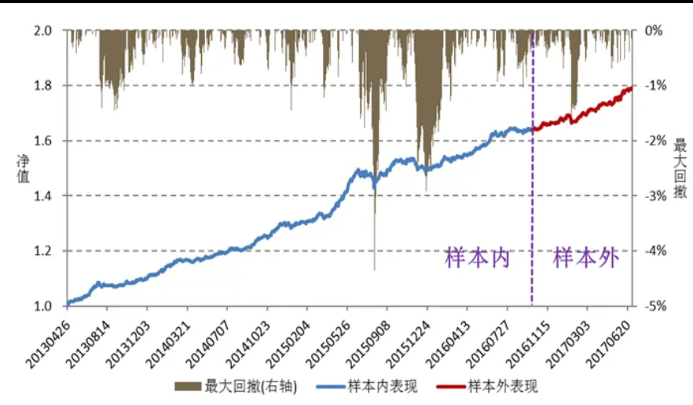
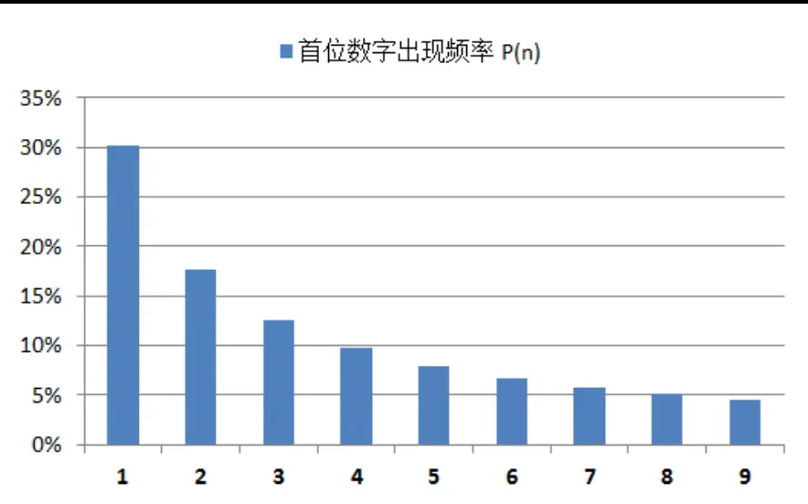
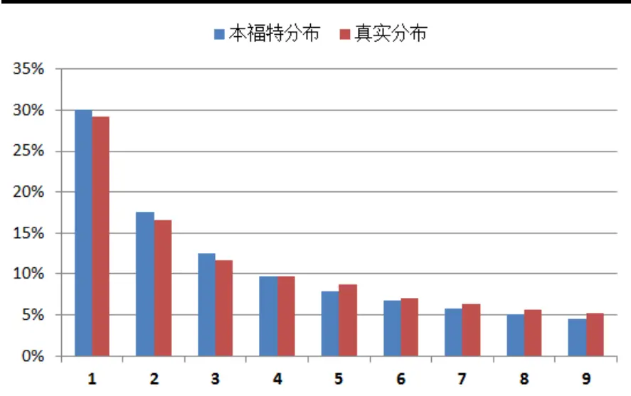
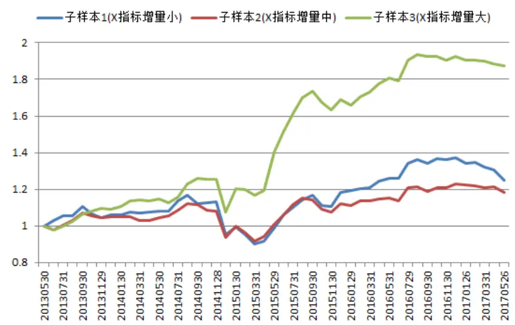
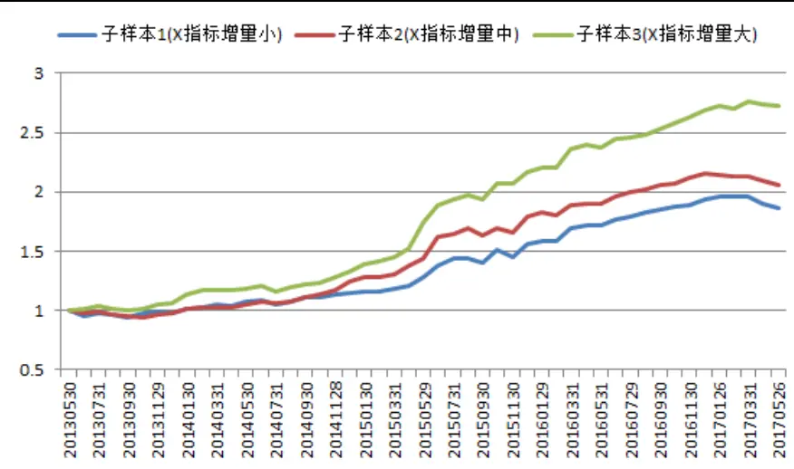
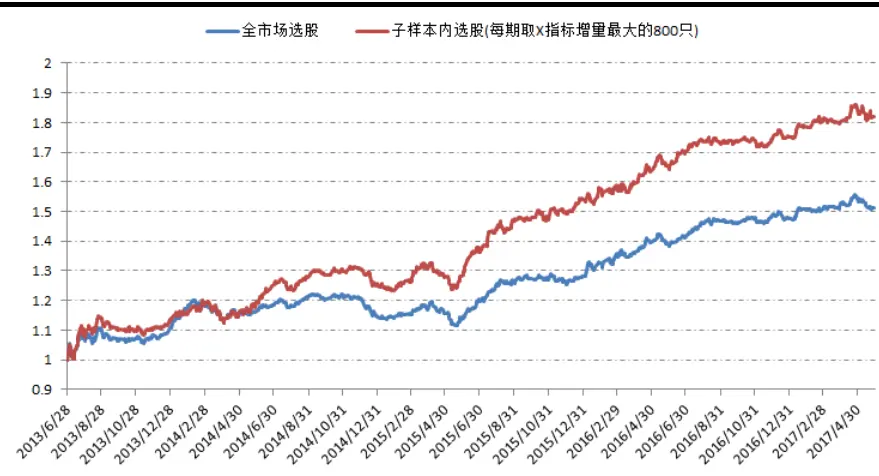
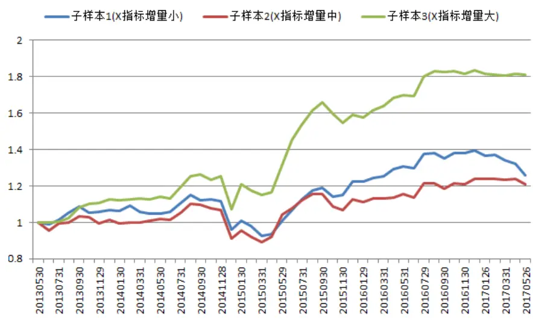
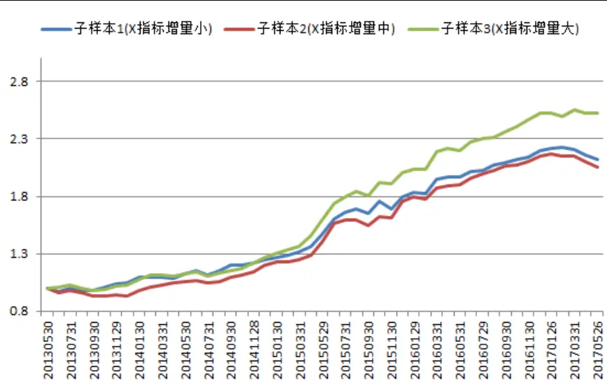
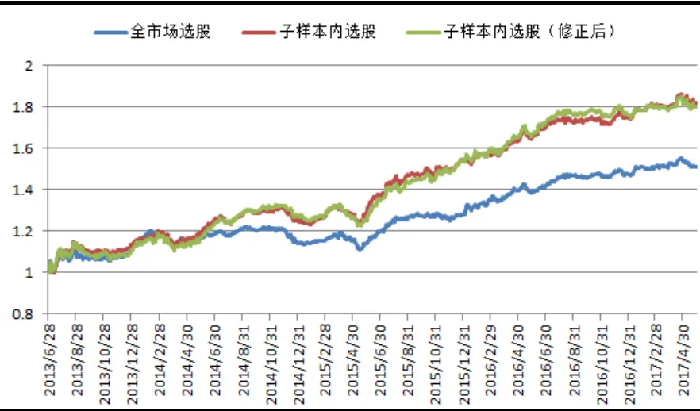

“聆听高频世界的声音”系列研究（六） 金融工程研究

# 方正证券研究所证券研究报告

[金融工程高级分析师 TABLE_ANALYSISINFO ：魏建榕 ]

执业证书编号： S1220516020001

S122051602000E-mail ： weijianrong@foundersc.com

[金融工程首席分析师 TABLE_ANALYSISINFO ：高子剑 ]

执业证书编号： S1220514090003

S122051602000E-mail ： gaozijian@foundersc.com

[Ta 联系人： ble_Author] 陈实

E-mail： chenshi0@foundersc.com

[Table_Author] 联系人： 张翔

E-mail： zhangxiang@foundersc.com

[Table_Author] 联系人： 朱定豪

E-mail： zhudinghao@foundersc.com

## 相关研究

异动罗盘：寻一只特立独行的票

2017.08.13

“聆听高频世界的声音”系列研究（一）

夜空中最亮的星：十字星形态的选股研究

——“聆听高频世界的声音”系列研究（二）

跟踪聪明钱：从分钟行情数据到选股因子

——“聆听高频世界的声音”系列研究（三）

持仓量的奥义：从交易行为到 CTA 策略

——“聆听高频世界的声音”系列研究（四）

凤鸣朝阳：股价日内模式中蕴藏的选股因子

——“聆听高频世界的声音”系列研究（五）

请务必阅读最后特别声明与免责条款

## 研究结论

- 本福特法则是一个统计规律：在许多常见的数据集中，首位数字出现 1、2、3、…、9的频率并不相同。具体而言，首位数字出现 1的频率超过 30%，出现 2的频率约为 18%，其他数字依次递减。

- 在本篇报告中，方正金工团队借助本福特法则，分析了分钟成交量的统计特征，在此基础上构造了机构痕迹指标。指标数值越大，表示机构的行为痕迹越大。报告中我们将展示，机构痕迹指标具有对因子选股进行“情景分析”的潜力。

- 情景分析是本报告最为重要的讨论。情景分析的思路，恰好与“因子择时”形成对照。所谓“因子择时”，本质上是在问“因子什么时候有效，什么时候不可用？”，是纵向（时间轴）的划分。而“情景分析”，则是在关心“因子对于哪些股票有效，对于哪些股票不可用？”，是横截面（样本空间）的划分。这是因子研究的一项新课题，抛砖引玉，期待启发更多的思考。

- 风险提示：模型测试基于历史数据，市场未来可能发生变化。

## 1 引言

见微知著，象牙箸能知天下兴亡。分钟成交数据的微小特征中，也蕴藏着机构交易热情的大气候。在本篇报告中，方正金工团队创造性地借助本福特法则，分析了分钟成交量的统计特征，在此基础上构造出度量“机构行为痕迹”的指标X。在后文中，我们将向读者展示，机构痕迹指标 X具有对因子选股进行“情景分析”的潜力。

本报告系方正金工“聆听高频世界的声音”系列研究的第 6篇。在此之前，自2016年 4月开始我们已陆续推出：《异动罗盘：寻一只特立独行的票》、《夜空中最亮的星：十字星形态的选股研究》、《跟踪聪明钱：从分钟行情数据到选股因子》、《持仓量的奥义：从交易行为到CTA策略》、《凤鸣朝阳：股价日内模式中蕴藏的选股因子》等5 篇专题报告。笔者倍感欣慰的是，我们提出的研究理念“高频数据、低频信号”，广得圈内同行的认可，引领了一波量化研究的小潮流。更加值得一提的是，2017年初以来，凤鸣朝阳APM因子与聪明钱Q因子，在剔除行业与风格影响之后，仍然呈现出稳定强劲的收益，是名副其实的alpha因子。其中，凤鸣朝阳APM因子表现尤为亮眼，样本外多空对冲的信息比率高达 3.65（图表1）。

图表 1：纯净 APM因子的多空对冲曲线

资料来源：wind资讯，方正证券研究所

图表 2：凤鸣朝阳APM因子、聪明钱Q 因子与传统因子的相关系数

|  | Beta | 长期动量短期动量 |  | 价值 | 盈利 | 成长 | 杠杆 | 波动 | 流动性 | 规模 非线性规模 |  | 聪明钱因子APM因子 |  |
| --- | --- | --- | --- | --- | --- | --- | --- | --- | --- | --- | --- | --- | --- |
| Beta | 1.00 | -0.04 -0.02 |  | -0.10 | -0.17 | 0.02 | -0.14 | 0.00 | 0.28 | -0.19 0.15 |  | -0.05 | 0.07 |
| 长期动量 | -0.04 | 1.00 | -0.06 | -0.29 | -0.07 | 0.15 | -0.02 | 0.53 | 0.26 | 0.01 0.01 |  | 0.05 | 0.02 |
| 短期动量 | -0.02 | -0.06 | 1.00 | -0.11 | -0.05 | 0.02 | 0.00 | 0.15 | 0.11 | 0.00 -0.01 |  | 0.11 | 0.00 |
| 价值 | -0.10 | -0.29 | -0.11 | 1.00 | 0.41 | -0.09 | 0.23 | -0.43 | -0.26 | 0.29 | -0.08 | -0.04 | -0.03 |
| 盈利 | -0.17 | -0.07 | -0.05 | 0.41 | 1.00 | 0.02 | 0.07 | -0.23 | -0.12 | 0.33 | -0.13 | 0.01 | -0.05 |
| 成长 | 0.02 | 0.15 | 0.02 | -0.09 | 0.02 | 1.00 | -0.03 | 0.14 | 0.10 | 0.04 0.04 |  | 0.01 | 0.01 |
| 杠杆 | -0.14 | -0.02 | 0.00 | 0.23 | 0.07 | -0.03 | 1.00 | -0.05 | -0.10 | 0.17 | 0.00 | 0.01 | -0.01 |
| 波动 | 0.00 | 0.53 | 0.15 | -0.43 | -0.23 | 0.14 | -0.05 | 1.00 | 0.50 | -0.01 | 0.06 | 0.06 | 0.07 |
| 流动性 | 0.28 | 0.26 | 0.11 | -0.26 | -0.12 | 0.10 | -0.10 | 0.50 | 1.00 | -0.01 | -0.01 | 0.05 | 0.13 |
| 规模 | -0.19 | 0.01 | 0.00 | 0.29 | 0.33 | 0.04 | 0.17 | -0.01 | -0.01 | 1.00 | 0.00 | 0.05 | -0.02 |
| 非线性规模 | 0.15 | 0.01 | -0.01 | -0.08 | -0.13 | 0.04 | 0.00 | 0.06 | -0.01 | 0.00 | 1.00 | -0.02 | 0.00 |
| 聪明钱因子 | -0.05 | 0.05 | 0.11 | -0.04 | 0.01 | 0.01 | 0.01 | 0.06 | 0.05 | 0.05 | -0.02 | 1.00 | -0.01 |
| APM因子 | 0.07 | 0.02 | 0.00 | -0.03 | -0.05 | 0.01 | -0.01 | 0.07 | 0.13 | -0.02 | 0.00 | -0.01 | 1.00 |

数据来源：wind资讯，方正证券研究所

## 2 机构痕迹指标 X的构造

本福特法则(Benford's Law)是一个令人惊艳的统计规律：在许多常见的数据集中，首位数字出现 1、2、3、…、9的频率竟不相同！具体而言，首位数字出现1 的频率超过30%，出现2的频率约为 18%，其他数字的出现频率依次递减(图表 3)。精确的数学表达为：在十进制中，首位数字出现 n 的频率等于 log10(n+1)−log10(n)。满足本福特法则的数据随处可见，从自然领域的河流长度、物理学常数、放射性半衰期，到社会领域的人口、GDP、财务数据，不胜枚举。关于本福特法则的数学理解，感兴趣的读者可以参阅附注文献[1-2]。

图表 3：本福特法则：首位数字的出现频率

资料来源：方正证券研究所

在这里，我们有一个好奇心的发问：股票的分钟成交量数据，是否也会符合本福特法则呢？作为一个随机挑选的示例，图表4给出了2017年4月万科A(000002.SZ)所有分钟成交量首位数字的频率分布。统计结果显示，分钟成交量数据很好地贴近本福特法则的理想分布。

图表 4：分钟成交量的首位数字（万科A，2017年4 月）

资料来源：方正证券研究所

如果我们细致地对比图表4的红蓝柱子，真实数据与理想分布的偏差还是存在的。那么，是什么因素在影响偏差的大小呢？方正金工提出一个定性的讨论：平均而言，机构的交易相较于散户，由于成交量更大，更易对首位数字造成干扰。因此，成交量数据与本福特理想分布的偏差，某种意义上讲，可以视为“机构行为痕迹”的代理变量。以下我们设计一个 X指标，用于衡量成交量数据与本福特法则的偏离程度，计算步骤如下：

（1）在每个月底，对每只股票，向前取其最近5000个非零的分钟成交量数据（若前推 40个交易日仍未取足5000个非零数据，则该股票当期不参与X指标的计算）；

（2）对于步骤 1得到的 5000个成交量数据，统计首位数字出现的频率，分别记为 f(1)、f(2)、f(3)、…、f(9)；

（3）对于步骤 2 得到的频率分布，计算其与本福特理想分布的偏差X，算式如下：

$$
\mathrm{X}=\sum_{n=1}^{9}(f(n)-P(n))^{2}
$$

其中，P(n)为本福特理想分布中首位数字出现 n 的频率。X 的数学含义是真实分布与理想分布各项偏差的平方和，我们将 X 指标称为“机构痕迹指标”。X的数值越大，则成交量数据与本福特理想分布的偏离越大，机构的行为痕迹也越大。

## 3 机构痕迹指标 X的情景分析应用

机构痕迹指标 X，因其不带“买”或“卖”的方向性，天然地不具备选股能力。本报告尝试讨论 X 指标在“情景分析”上的应用，以期起到抛砖引玉之效。“情景分析”的思路，恰好与“因子择时”形成对照。所谓“因子择时”，本质上是在问“因子什么时候有效，什么时候不可用？”，是纵向（时间轴）的划分。而“情景分析”，则是在关心“因子对于哪些股票有效，对于哪些股票不可用？”，是横截面（样本空间）的划分。

为了测试机构痕迹指标 X的情景分析能力，方正金工采用如下分析框架：

1) 回测时段为2013 年4月-2017年5 月，样本空间为全体 A股（剔除 ST股和上市未满60日的新股）；

2) 在每个月底，将股票按照 X 指标的增量ΔX（本月 X 指标/上月 X指标 - 1）进行排序分组，划分为3个情景空间；

3) 在 3个情景空间内部，分别对待测因子进行选股能力检验。

在以上分析框架中，我们实际上是在进行这样的情景分析：当机构行为痕迹增加时，因子的选股效果如何？当机构行为痕迹下降时，因子的选股效果又如何？下面我们给出一些有趣的摸索结果。

## 因子 1：换手率的变化率

换手率的变化率，包含有流动性改善或恶化的信息，因此在全市场具有选股能力。这里，我们对“换手率的变化率”的定义是：近 20个交易日平均换手率/近40个交易日平均换手率 - 1。图表5 给出了“换手率的变化率”因子在3 个情景空间内部的选股能力。在机构痕迹增量最大的情景空间中，因子的 ICIR 为 1.26，五分组多空对冲的年化收益为18.2%（绿线）。对于机构痕迹增量居中的情景空间，ICIR为0.63，多空对冲年化收益为5.0%（红线）。对于机构痕迹增量最小的情景空间，ICIR为0.90，多空对冲年化收益为6.8%（蓝线）。我们得到的结论是：对于机构行为痕迹增大的股票，流动性恶化的溢价现象更加显著。

图表 5：“换手率的变化率”因子在不同情景空间的多空对冲曲线

资料来源：wind资讯，方正证券研究所

## 数据来源：Wind资讯，方因子 2：聪明钱 Q 因子

聪明钱Q因子是方正金工独家提出的新因子，用于跟踪市场上聪明钱的投资方向。感兴趣的读者，可参阅专题报告《跟踪聪明钱：从分钟行情到数据选股因子》（20160708）。图表6 给出了聪明钱Q因子在3个情景空间内部的选股能力。在机构痕迹增量最大的情景空间中，因子的ICIR为2.93，五分组多空对冲的年化收益为 29.2%（绿线）。对于机构痕迹增量居中的情景空间，ICIR 为 2.06，多空对冲年化收益为20.3%（红线）。对于机构痕迹增量最小的情景空间，ICIR为1.88，多空对冲年化收益为17.3%（蓝线）。我们得到的结论是：对于机构行为痕迹增大的股票，跟踪聪明资金投资方向所带来的收益更加显著。这是一个十分自洽的结论。

图表 6：聪明钱Q因子在不同情景空间的多空对冲曲线

资料来源：wind资讯，方正证券研究所

## 因子数据来源： 3：净利润同比增长率Wind资讯，方正证

净利润同比增长率（yoyprofit）是指，根据报表税后净利润的公布值，计算本期相对上年同期调整数的增长百分比。图表7展示了对yoyprofit因子的情景分析。结论是相同的，在机构痕迹增大的情景空间中，因子的选股效果更好。

图表 7：yoyprofit因子的多空对冲曲线

资料来源：wind资讯，方正证券研究所

## 4 补充讨论

X 指标与风格因子是否存在强关联，这是一个非常重要的问题——如果 X指标可以完全被风格因子所解释，那么X指标存在的意义将被大大地削弱。方正金工检验发现，X 指标与成交量变化率和动量因子均呈现负相关。实际上，X 指标主要是与成交量变化率存在负相关，与动量因子的负相关，可以理解为通过成交量变化率传递过去的（成交量变化率与动量存在正相关）。

为了检验 X指标是否真正贡献了“情景分析”的能力，我们用横截面回归的方法，剔除 X指标中成交量变化率的影响，再重复前文情景分析的过程。图表8、9、10给出了风格剔除后的结果，可以看到，情景区分的效果仍然存在。

总的来说，本篇报告借由本福特法则尝试构造一个度量机构痕迹的量化指标。此外，也是更加重要的是，我们尝试对因子做“情景分析”的讨论，期待以此启发更多的思考。

图表 8：X指标对“换手率的变化率”因子的情景区分（风格剔除后）

资料来源：wind资讯，方正证券研究所

图表 9：X指标对聪明钱Q因子的情景区分（风格剔除后）

资料来源：wind资讯，方正证券研究所

图表数据来源： 10：XWind 指标对资讯，方正证券研究所 yoyprofit 因子的情景区分（风格剔除后）

资料来源：wind资讯，方正证券研究所

## 5 风险提示

模型测试基于历史数据，市场未来可能发生变化。

## 附注：

[1]Pietronero L, Tosatti E, Tosatti V, et al. Explaining the uneven distribution of numbers in nature: the laws of Benford and Zipf [J]. Physica A, 2001, 293(1): 297-304.

[2]Hill T P. A statistical derivation of the significant digit law [J]. Statistical science, 1995: 354-363.

[3]实习生苏俊豪、傅开波参与了因子的计算工作。

## 分析师声明

作者具有中国证券业协会授予的证券投资咨询执业资格，保证报告所采用的数据和信息均来自公开合规渠道，分析逻辑基于作者的职业理解，本报告清晰准确地反映了作者的研究观点，力求独立、客观和公正，结论不受任何第三方的授意或影响。研究报告对所涉及的证券或发行人的评价是分析师本人通过财务分析预测、数量化方法、或行业比较分析所得出的结论，但使用以上信息和分析方法存在局限性。特此声明。

## 免责声明

方正证券股份有限公司（以下简称“本公司”）具备证券投资咨询业务资格。本报告仅供本公司客户使用。本报告仅在相关法律许可的情况下发放，并仅为提供信息而发放，概不构成任何广告。

意见及推测仅反映本公司于发布本报告当日的判断。在不同时期，本公司可发出与本报告所载资料、意见及推测不一致的报告。本公司不保证本报告所含信息保持在最新状态。同时，本公司对本报告所含信息可在不发出通知的情形下做出修改，投资者应当自行关注相应的更新或修改。

在任何情况下，本报告中的信息或所表述的意见均不构成对任何人的投资建议。在任何情况下，本公司、本公司员工或者关联机构不承诺投资者一定获利，不与投资者分享投资收益，也不对任何人因使用本报告中的任何内容所引致的任何损失负任何责任。投资者务必注意，其据此做出的任何投资决策与本公司、本公司员工或者关联机构无关。

本公司利用信息隔离制度控制内部一个或多个领域、部门或关联机构之间的信息流动。因此，投资者应注意，在法律许可的情况下，本公司及其所属关联机构可能会持有报告中提到的公司所发行的证券或期权并进行证券或期权交易，也可能为这些公司提供或者争取提供投资银行、财务顾问或者金融产品等相关服务。在法律许可的情况下，本公司的董事、高级职员或员工可能担任本报告所提到的公司的董事。

市场有风险，投资需谨慎。投资者不应将本报告为作出投资决策的惟一参考因素，亦不应认为本报告可以取代自己的判断。

本报告版权仅为本公司所有，未经书面许可，任何机构和个人不得以任何形式翻版、复制、发表或引用。如征得本公司同意进行引用、刊发的，需在允许的范围内使用，并注明出处为“方正证券研究所”，且不得对本报告进行任何有悖原意的引用、删节和修改。

## 公司投资评级的说明：

强烈推荐：分析师预测未来半年公司股价有20%以上的涨幅；

推荐：分析师预测未来半年公司股价有10%以上的涨幅；

中性：分析师预测未来半年公司股价在-10%和10%之间波动；

减持：分析师预测未来半年公司股价有10%以上的跌幅。

## 行业投资评级的说明：

推荐：分析师预测未来半年行业表现强于沪深300指数；

中性：分析师预测未来半年行业表现与沪深300指数持平；

减持：分析师预测未来半年行业表现弱于沪深300指数。

|  | 北京 | 上海 | 深圳 | 长沙 |
| --- | --- | --- | --- | --- |
| 地址： | 北京市西城区阜外大街甲34号方正证券大厦8楼(100037)3 | 上海市浦东新区浦东南路 | 深圳市福田区深南大道4013 | 长沙市芙蓉中路二段200号侨国际大厦24楼(410015) |
|  |  | 60号新上海国际大厦36楼(200120) | 号兴业银行大厦201(418000)华 |  |
| 网址： | http://www.foundersc.com | http://www.foundersc.comh | ttp://www.foundersc.com | http://www.foundersc.com |
| E-mail:y | jzx@foundersc.com | yjzx@foundersc.com | yjzx@foundersc.com | yjzx@foundersc.com |