## [Tab相关研究

Table_ReportInfo]《放松组合构建中的行业中性约束》2018.10.30

《选股因子系列研究（四十一）——医药行业因子选股研究》2018.10.23

《选股因子系列研究（四十）——预期因子的底层数据处理》2018.10.19

分析师:冯佳睿

Tel:(021)23219732

Email:fengjr@htsec.com

证书:S0850512080006

分析师:姚石

Tel:(021)23219443

Email:ys10481@htsec.com

证书:S0850517120002

## 高频量价因子在股票与期货中的表现

## 投资要点：

我们在本篇报告中将目光聚焦于日内价量信息和交易特征，使用分钟数据构建一系列高频因子，并对比各因子在股票和期货中的表现。

- 高频因子分类。高频因子可以分为收益率分布、成交量分布、量价复合、资金流和日内动量等几个主要的类别，各类因子还可以做进一步的细化，例如收益率分布因子包括已实现偏度、已实现峰度和上下行波动率等。

- 收益率分布因子。高频偏度和下行波动占比具有显著的选股效果，多空组合月均收益差分别为 和 ，因子 分别为 和 。因子在股票中均呈现出反转效应，即高频偏度小、下行波动占比高的股票未来收益表现更好，而在期货中呈现出动量效应，即高频偏度大、上行波动占比高的期货品种未来收益表现更好，最优参数区域的平均年化收益率分别为 3.59%和 3.81%。

- 成交量分布因子。日内不同时段的成交量分布能够反映投资者的行为特征。上午10 点-11 点成交量占比因子和股票下月收益显著正相关，正交因子 IR均超过 2，而收盘前半小时成交量占比因子和股票下月收益显著负相关，正交因子 IR 高达3.24。对于期货，由于不同品种交易时段存在差异，该因子不具备区分效果。

- 量价复合因子。高频量价相关性因子具有显著选股效果，日内走势呈现出“量价背离”特征的股票未来收益表现好于“量价同向”的股票，多空组合月均收益差为 2.10%，因子 IR 为 2.48。因子在期货中表现有所不同，量价相关性和仓价相关性因子值大的期货品种未来收益更高，最优参数区域的平均年化收益率分别为3.46%和 3.58%。

- 资金流因子。资金流向来自交易时产生的委托信息，反映的是微观层面的供求关系。期货资金流因子在回看期和持有期较短时取得负收益，在回看期和持有期较长时取得正收益，这意味着期货资金流入因子具有短期反转、长期动量特征。

- 趋势强度因子。股票趋势强度因子具有一定选股效果，多空组合月均收益差为1.18%，但剔除风格因子后不再具备选股效果。因子在期货中表现较好，最优参数区域内平均年化收益率为 5.30%。

- 改进反转因子。除了直接使用分钟级别数据构建因子之外，我们还可以使用日内信息对传统因子做增强。剔除了隔夜和开盘后半小时涨幅的一个月反转因子的多空组合月均收益差从 提升至 ， 年以来提升效果尤为明显。

- 高频因子在股票和期货中的表现存在差异。大多数高频因子在股票中体现出反转效应，即因子值小的股票未来收益更高，而在期货中体现出动量效应，即因子值大的期货品种未来收益更高。这种差异化特征与交易机制和投资者结构有关。

风险提示。因子失效风险、流动性风险、统计规律失效风险。

## 1. 研究背景

在 FICC 系列研究报告中，我们构建了动量、期限结构、会员持仓、基本面等不同类型的 因子，在本篇报告中我们将目光聚焦在日内交易特征上，使用分钟数据构建一系列高频因子，并对比各因子在股票和期货中的表现。

根据现有的研究成果，我们可以把高频因子分为收益率分布、成交量分布、量价复合、资金流和日内动量等几个主要的类别，各类因子还可以做进一步的细化，例如收益率分布因子包括已实现偏度、已实现峰度和上下行波动率等等。

图1 高频因子分类
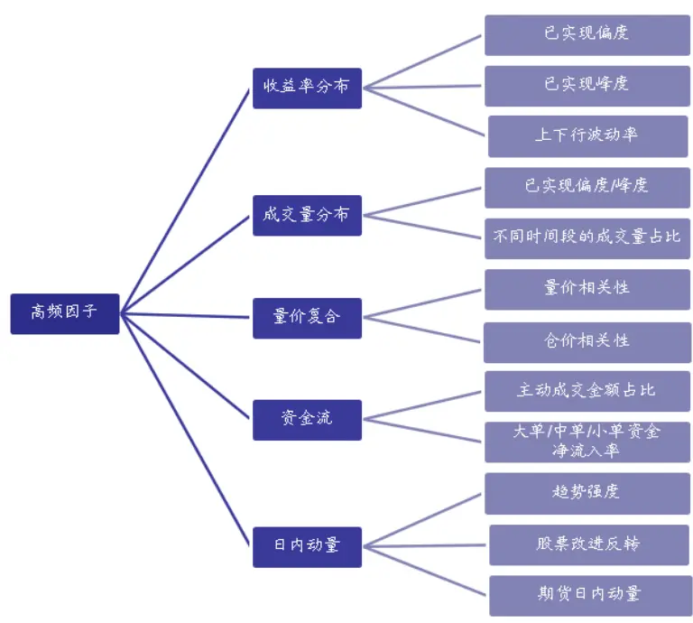
资料来源：海通证券研究所整理

除了图 1中展示的各类因子之外，我们还可以通过一些复杂的业务逻辑或者机器学习方法来挖掘新的高频因子。

## 2. 回测参数设臵

我们在本文中使用如下回测参数：

1. 回测区间：2010.01-2018.09。

2. 对于期货，所有品种的保证金固定为 20%；策略无杠杆，即调仓日使用 20%的资金作为保证金买入期货合约，余下的现金不计算收益。

在每个调仓时点上剔除上市不足半年或过去 个交易日日均成交不足 万手的品种，将剩下的品种按因子值排序，做多前 20%，做空后 20%，考察多空组合收益表现。

4. 若调仓周期为 H个交易日，则将资金等权分成 5份，依次相隔[H/5]个交易日建仓，将每个通道的净值相加得到策略的总净值，避免存在路径依赖。

5. 对于股票，月末调仓，剔除 ST、停牌、涨跌停、上市不满 6 个月、距退市不足个月的股票；考察原始因子和正交因子的收益表现，其中正交因子通过逐步回归剔除行业、市值、非线性市值、反转、换手、特异度等风格因子的影响来构建。

6. 由于部分因子难以确定影响方向，故回测时暂未扣费。

## 3. 收益率分布因子

## 3.1 高频偏度与峰度

Amaya et al.(2011)1研究发现日内高阶矩与股票的未来收益之间存在联系，利用股票的日内分时数据，构建了高频已实现方差、偏度以及峰度三个指标，计算方法如下：

高频已实现方差: $\begin{array}{r}{RVar_{i}=\sum_{j=1}^{N}r_{ij}^{2}}\end{array}$

高频已实现偏度： $\begin{array}{r}{RSkew_{i}=\frac{\sqrt{N}\sum_{j=1}^{N}r_{ij}^{3}}{RVar_{i}^{3/2}}}\end{array}$

高频已实现峰度： $\begin{array}{r}{RKurtosis_{i}=\frac{N\sum_{j=1}^{N}r_{ij}^{4}}{RVar_{i}^{2}}}\end{array}$

其中 $\boldsymbol{r}_{ij}$ 为股票 i的日内 1分钟对数收益序列 $\{j=1,\cdots,N\}$ ，因子值为过去 20 日的指标均值。

我们在前期报告《选股因子系列研究(十九)——高频因子之股票收益分布特征》中实证发现，高频偏度因子具有显著的选股能力，而方差和峰度没有选股能力。高频偏度因子分组收益和 IC 表现如图 2-5 所示，原始因子和正交因子的 IC 均值分别为-0.047 和-0.023，ICIR 分别为-2.61 和-2.38，top-bottom 多空组合月均收益差分别为 1.45%和0.82%。

图2 股票高频偏度因子分组收益
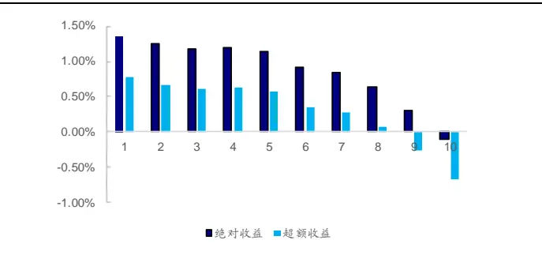
资料来源：Wind，海通证券研究所

图3 股票高频偏度因子 IC
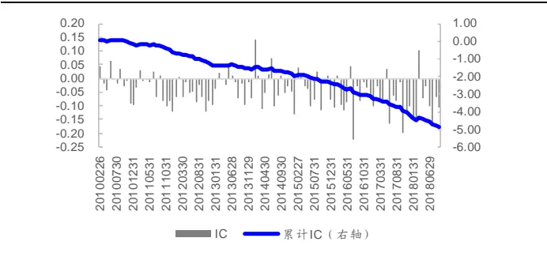
资料来源：Wind，海通证券研究所

图4 股票高频偏度因子（正交）分组收益
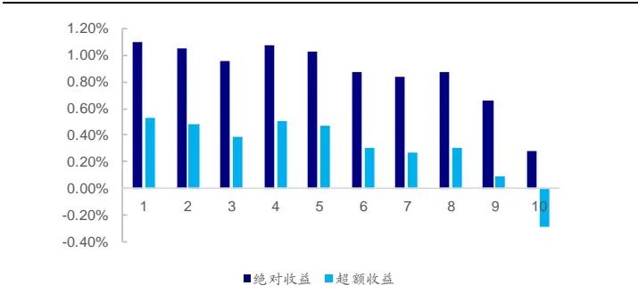
资料来源：Wind，海通证券研究所

图5 股票高频偏度因子（正交）IC
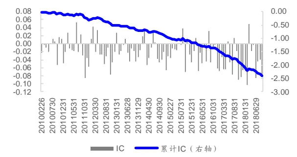
资料来源：Wind，海通证券研究所

对于期货，采用同样的因子计算方法，但由于品种数量比较少，需要对参数敏感性进行分析。因子在绝大部分参数组下均能取得正收益（见表 1），这意味着高频偏度大的期货品种未来能够取得更高的收益。

当回看期 R 和持有期 H 均为 1 天时，因子收益最高，为 7.32%，夏普比率2为 1.21。因子在 R=10-15，H=1-5 参数区域内表现相对稳定，平均年化收益率为 3.59%。

表 1 期货高频偏度因子的年化收益率与夏普比率

| H | 年化收益率（%） |  |  |  |  |  |  |  |
| --- | --- | --- | --- | --- | --- | --- | --- | --- |
|  | 1 | 2 | 3 | 4 | 5 | 10 | 15 | 20 |
| R 1 | 7.32 | 4.15 | 3.37 | 3.18 | 2.72 | 2.38 | 1.10 | 0.70 |
| 2 | 5.02 | 3.11 | 2.54 | 2.49 | 1.90 | 2.23 | 2.44 | 2.14 |
| 3 | 4.23 | 2.88 | 2.55 | 2.22 | 2.08 | 3.23 | 1.60 | 2.71 |
| 4 | 3.24 | 2.37 | 1.83 | 1.73 | 1.76 | 2.13 | 1.69 | 1.51 |
| 5 | 3.38 | 1.82 | 1.61 | 1.95 | 2.02 | 2.22 | 1.91 | 1.66 |
| 10 | 4.60 | 3.42 | 3.46 | 3.32 | 3.42 | 2.15 | 1.46 | 0.53 |
| 15 | 4.28 | 3.68 | 3.09 | 3.35 | 3.30 | 1.74 | 1.31 | 1.16 |
| 20 | 3.44 | 2.37 | 1.26 | 0.96 | 0.57 | 0.10 | 0.05 | 0.17 |
| 30 | -0.36 | -0.21 | -0.26 | 0.11 | 0.01 | -0.56 | -0.45 | -0.51 |

资料来源： ，海通证券研究所

|  | 1.21 | 0.99 | 0.97 | 1.07 | 1.02 | 0.86 | 0.39 | 0.25 |
| --- | --- | --- | --- | --- | --- | --- | --- | --- |
|  | 0.84 | 0.63 | 0.60 | 0.66 | 0.57 | 0.81 | 0.85 | 0.76 |
|  | 0.70 | 0.54 | 0.54 | 0.53 | 0.54 | 0.95 | 0.54 | 0.92 |
|  | 0.54 | 0.45 | 0.38 | 0.38 | 0.41 | 0.58 | 0.51 | 0.50 |
|  | 0.58 | 0.35 | 0.32 | 0.41 | 0.45 | 0.56 | 0.54 | 0.50 |
| 10 | 0.77 | 0.60 | 0.62 | 0.60 | 0.63 | 0.43 | 0.32 | 0.13 |
| 15 | 0.69 | 0.61 | 0.53 | 0.58 | 0.58 | 0.33 | 0.26 | 0.25 |
| 20 | 0.56 | 0.40 | 0.22 | 0.17 | 0.10 | 0.02 | 0.01 | 0.03 |
| 30 | -0.06 | -0.03 | -0.04 | 0.02 | 0.00 | -0.10 | -0.08 | -0.09 |

图6 期货高频偏度因子净值曲线
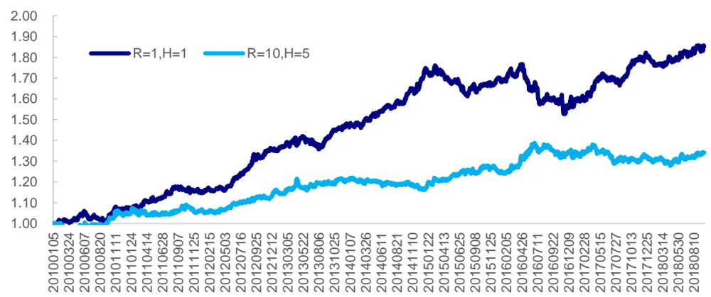
资料来源：Wind，海通证券研究所

股票高频峰度因子分组收益和 IC 表现如图 7-11所示，原始因子和正交因子的 IC均值分别为-0.005 和-0.008，ICIR 分别为-0.14 和-0.45，多空组合月均收益差均为 0.21%，没有选股效果。

图7 股票高频峰度因子分组收益
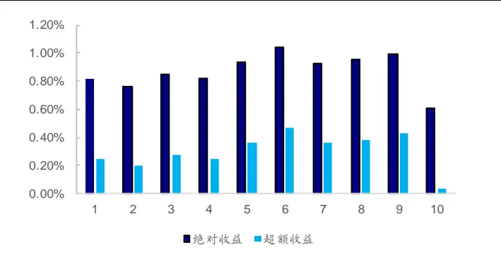
资料来源： ，海通证券研究所

图8 股票高频峰度因子 IC
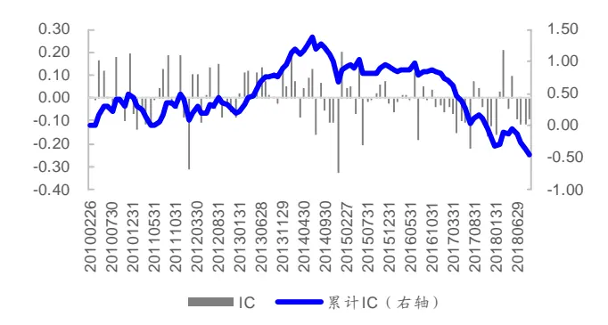
资料来源：Wind，海通证券研究所

本文中我们按无风险利率为 来计算夏普比率。

对于期货，高频峰度因子在所有参数组下均取得负收益（见表 2），意味着高频峰度低的期货品种未来能够取得更高的收益。当回看期 R和持有期 H均为 1 天时，因子负向收益最高，为-4.32%，夏普比率为-0.73。

表 2 期货高频峰度因子的年化收益率与夏普比率

| 年化收益率（%） 夏普比率HR HR1 -0.73 -0.422 |  |  |  |  |  |  |  |  |  |  |  |  |  |  |  |  |  |  |  |  |  |  |  |  |  |  |  |  |  |  |  |  |  |  |
| --- | --- | --- | --- | --- | --- | --- | --- | --- | --- | --- | --- | --- | --- | --- | --- | --- | --- | --- | --- | --- | --- | --- | --- | --- | --- | --- | --- | --- | --- | --- | --- | --- | --- | --- |
|  |  |  |  |  |  |  |  |  |  |  |  |  |  |  |  |  |  |  |  |  |  |  | 10 | 15 | 20 | R |  |  |  |  |  | 10 | 15 | 20 |
|  |  |  |  |  |  |  |  |  |  |  |  |  |  |  |  |  |  | -4.26 | -1.96 | -2.13 | -1.52 | -1.57 | -1.77 | -2.10 | -1.42 |  | -0.73 | -0.45 | -0.54 | -0.42 | -0.46 | -0.51 | -0.60 | -0.42 |
|  |  |  |  |  |  |  |  |  |  |  |  |  |  |  |  |  |  | -2.96 | -1.55 | -1.54 | -1.24 | -0.64 | -1.37 | -1.49 | -1.74 | 2 | -0.52 | -0.30 | -0.34 | -0.29 | -0.16 | -0.38 | -0.40 | -0.47 |
| 3 | -3.46 | -1.74 | -2.37 | -1.81 | -1.88 | -3.62 | -2.74 | -2.89 | 3 | -0.59 | -0.33 | -0.48 | -0.39 | -0.42 | -0.89 | -0.70 | -0.76 |  |  |  |  |  |  |  |  |  |  |  |  |  |  |  |  |  |
| 4 | -2.34 | -1.87 | -2.10 | -2.07 | -2.30 | -2.56 | -3.35 | -1.69 | 4 | -0.41 | -0.35 | -0.41 | -0.42 | -0.49 | -0.59 | -0.82 | -0.42 |  |  |  |  |  |  |  |  |  |  |  |  |  |  |  |  |  |
| 510 | -3.32 | -2.45 | -2.98 | -3.13 | -3.27 | -4.03 | -3.20 | -3.31 | 5 | -0.56 | -0.44 | -0.56 | -0.61 | -0.66 | -0.88 | -0.73 | -0.77 |  |  |  |  |  |  |  |  |  |  |  |  |  |  |  |  |  |
|  | -3.98 | -3.13 | -3.34 | -3.50 | -3.55 | -3.55 | -2.92 | -2.60 | 10 | -0.68 | -0.55 | -0.60 | -0.64 | -0.65 | -0.67 | -0.58 | -0.53 |  |  |  |  |  |  |  |  |  |  |  |  |  |  |  |  |  |
| 15 | -3.76 | -3.17 | -3.02 | -3.00 | -2.92 | -2.78 | -2.12 | -1.58 | 15 | -0.62 | -0.53 | -0.51 | -0.52 | -0.51 | -0.50 | -0.39 | -0.30 |  |  |  |  |  |  |  |  |  |  |  |  |  |  |  |  |  |
| 2030 | -3.12 | -3.01 | -3.19 | -3.18 | -2.81 | -2.33 | -1.92 | -1.65 | 20 | -0.51 | -0.50 | -0.53 | -0.54 | -0.48 | -0.41 | -0.34 | -0.30 |  |  |  |  |  |  |  |  |  |  |  |  |  |  |  |  |  |
|  | -2.67 | -2.89 | -2.80 | -2.43 | -2.34 | -2.49 | -2.40 | -2.71 | 30 | -0.42 | -0.46 | -0.45 | -0.39 | -0.38 | -0.41 | -0.41 | -0.47 |  |  |  |  |  |  |  |  |  |  |  |  |  |  |  |  |  |

资料来源：Wind，海通证券研究所

图9 期货高频峰度因子净值曲线
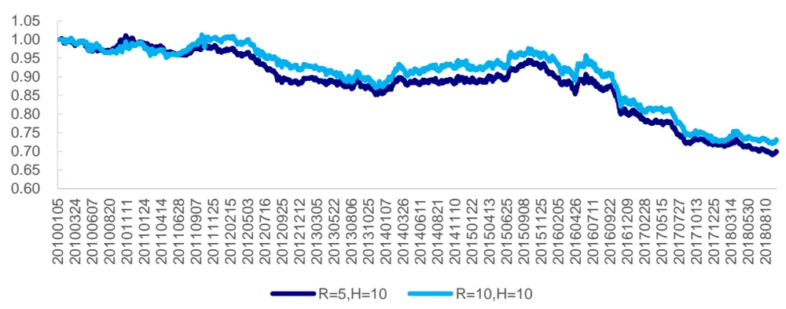
资料来源：Wind，海通证券研究所

我们可以将高频偏度和峰度因子相叠加构建复合因子，即将所有满足流动性条件的N个期货品种按高频偏度值从低到高排序打分1-N，按高频峰度值从高到低排序打分1-N，将两个因子等权相加后选择分数最高的前 20%期货品种做多，分数最低的前 20%期货品种做空，因子在不同参数组下的表现如表 3所示。当回看期 R和持有期 H均为 1天时，因子收益最高，为 7.46%，夏普比率为 1.27。因子在 R=10-15，H=1-5 参数区域内表现相对稳定，平均年化收益率为 3.96%。

表 3 期货高频偏度+峰度复合因子的年化收益率与夏普比率

| 年化收益率（%） 夏普比率H 5 H2101520 10R R |  |  |  |  |  |  |  |  |  |  |  |  |  |  |  |  |  |  |  |  |  |  |  |  |  |  |  |  |  |  |  |  |
| --- | --- | --- | --- | --- | --- | --- | --- | --- | --- | --- | --- | --- | --- | --- | --- | --- | --- | --- | --- | --- | --- | --- | --- | --- | --- | --- | --- | --- | --- | --- | --- | --- |
|  |  |  |  |  |  |  |  |  |  |  |  |  |  |  |  |  |  | 2 | 3 | 4 | 5 | 10 | 15 | 20 | H | 2 | 3 | 4 | 5 | 10 | 15 | 20 |
|  |  |  |  |  |  |  |  |  |  |  |  |  |  |  |  |  |  |  |  |  |  |  |  |  | R |  |  |  |  |  |  |  |
| 1 | 7.46 | 3.80 | 3.71 | 3.22 | 3.16 | 2.09 | 2.27 | 1.14 | 1 | 1.27 | 0.89 | 0.98 | 0.95 | 0.99 | 0.66 | 0.72 | 0.36 |  |  |  |  |  |  |  |  |  |  |  |  |  |  |  |
| 2 | 4.06 | 2.53 | 2.06 | 1.86 | 1.60 | 2.60 | 2.41 | 2.92 | 2 | 0.69 | 0.50 | 0.46 | 0.46 | 0.42 | 0.76 | 0.72 | 0.85 |  |  |  |  |  |  |  |  |  |  |  |  |  |  |  |
| 3 | 3.25 | 2.54 | 2.98 | 2.45 | 2.26 | 4.18 | 3.12 | 3.12 | 3 | 0.54 | 0.47 | 0.61 | 0.55 | 0.53 | 1.10 | 0.88 | 0.87 |  |  |  |  |  |  |  |  |  |  |  |  |  |  |  |
| 4 | 3.97 | 2.81 | 2.38 | 2.16 | 2.68 | 4.26 | 3.12 | 3.01 | 4 | 0.66 | 0.52 | 0.47 | 0.45 | 0.59 | 1.07 | 0.82 | 0.82 |  |  |  |  |  |  |  |  |  |  |  |  |  |  |  |
| 5 | 2.47 | 1.21 | 1.55 | 2.24 | 2.94 | 4.10 | 3.25 | 2.77 | 5 | 0.42 | 0.22 | 0.30 | 0.45 | 0.61 | 0.95 | 0.80 | 0.72 |  |  |  |  |  |  |  |  |  |  |  |  |  |  |  |
| 10 | 3.29 | 3.00 | 3.33 | 3.80 | 3.94 | 3.78 | 2.74 | 1.70 | 10 | 0.54 | 0.51 | 0.58 | 0.68 | 0.72 | 0.73 | 0.56 | 0.37 |  |  |  |  |  |  |  |  |  |  |  |  |  |  |  |
| 15 | 5.32 | 3.97 | 3.41 | 3.87 | 4.07 | 2.96 | 2.26 | 1.53 | 15 | 0.85 | 0.66 | 0.58 | 0.67 | 0.71 | 0.54 | 0.43 | 0.30 |  |  |  |  |  |  |  |  |  |  |  |  |  |  |  |
| 20 | 5.31 | 4.16 | 3.40 | 3.09 | 2.97 | 2.18 | 1.63 | 1.27 | 20 | 0.84 | 0.68 | 0.56 | 0.52 | 0.50 | 0.38 | 0.29 | 0.23 |  |  |  |  |  |  |  |  |  |  |  |  |  |  |  |
| 30 | 1.69 | 1.12 | 1.02 | 0.98 | 0.85 | 0.55 | 0.22 | 0.22 | 30 | 0.25 | 0.17 | 0.16 | 0.15 | 0.13 | 0.09 | 0.04 | 0.04 |  |  |  |  |  |  |  |  |  |  |  |  |  |  |  |

资料来源： ，海通证券研究所

图10 期货高频偏度+峰度复合因子净值曲线
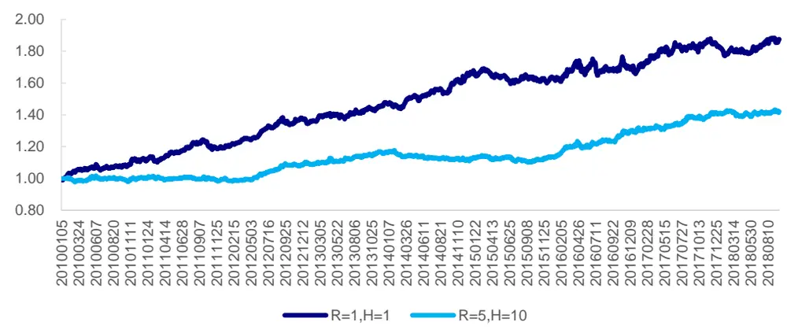
资料来源： ，海通证券研究所

## 3.2 高频上下行波动占比

Feunou B et al.(2015)3将波动率拆分成上行波动率和下行波动率，发现投资者更为关注下行波动，要求更高的风险补偿。我们在前期报告《选股因子系列研究(二十五)——高频因子之已实现波动率分解》中构建了下行波动占比因子，发现该因子具有显著的选股能力。因子计算方法如下：

$$
\begin{array}{r}{\frac{3}{\frac{3}{|\alpha}|}+\frac{1}{|\beta|}\mathcal{T}\llap/{\tilde{\tau}}\tilde{\langle\tilde{\tau}\rangle}\ast\vec{\chi}_{\tilde{\mathcal{Z}}}\Rightarrow\downarrow\nwarrow\ k\in=\ \frac{\sum_{j=1}^{N}r_{ij}^{2}\cdot I_{r_{ij}<0}}{\sum_{j=1}^{N}r_{ij}^{2}}}\end{array}
$$

其中 $\boldsymbol{r}_{ij}$ 为股票 i的日内 1分钟对数收益序列，股票的因子值为过去 20 日的指标均值。

高频下行波动占比因子的分组收益和 IC 表现如图 11-14 所示，原始因子和正交因子的 IC 均值分别为 0.063 和 0.031，ICIR 分别为 3.31 和 3.12，多空组合月均收益差分别为 1.87%和 0.94%。

图11 股票下行波动占比因子分组收益
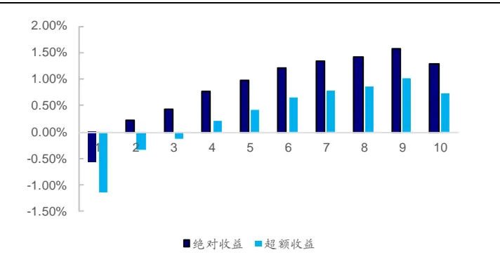
资料来源： ，海通证券研究所

图12 股票下行波动占比因子 IC
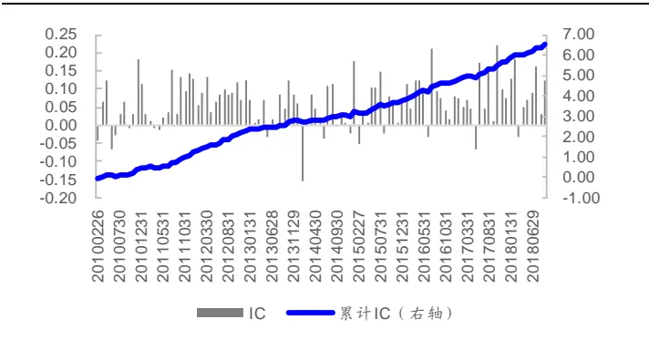
资料来源：Wind，海通证券研究所

图13 股票下行波动占比因子（正交）分组收益
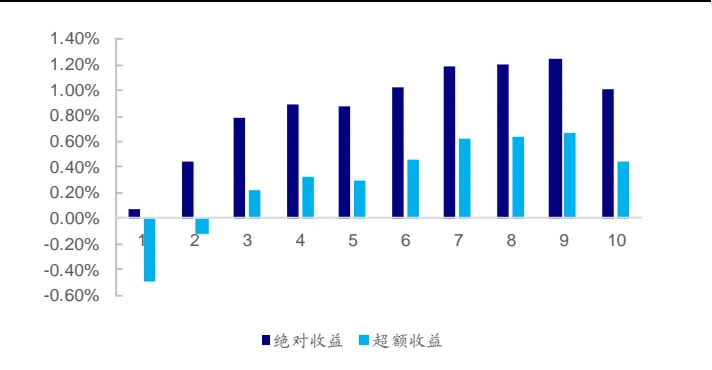
资料来源：Wind，海通证券研究所

图14 股票下行波动占比因子（正交）IC
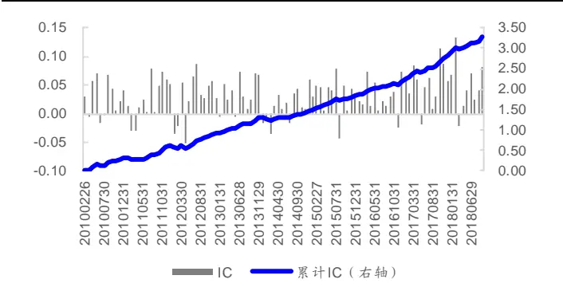
资料来源：Wind，海通证券研究所

对于期货，为了方便起见，我们考察上行波动占比因子在不同参数组下的表现，因子在绝大部分参数组下均能取得正收益（见表 4），这意味着上行波动占比高的期货品种未来能够取得更高的收益。

当回看期 R 和持有期 H 均为 1 天时，因子收益最高，为 8.11%，夏普比率为 1.31。因子在 R=10-15，H=1-5 参数区域内表现相对稳定，平均年化收益率为 3.81%。

表 4 期货上行波动占比因子的年化收益率与夏普比率

| 年化收益率（%） 夏普比率 |  |  |  |  |  |  |  |  |  |  |  |  |  |  |  |  |  |
| --- | --- | --- | --- | --- | --- | --- | --- | --- | --- | --- | --- | --- | --- | --- | --- | --- | --- |
| HR | 1 | 2 | 3 | 4 | 5 | 10 | 15 | 20 | HR | 1 | 2 | 3 | 4 | 5 | 10 | 15 | 20 |
| 1 | 8.11 | 3.58 | 2.37 | 2.59 | 2.07 | 1.79 | 1.07 | 0.50 | 1 | 1.31 | 0.82 | 0.67 | 0.83 | 0.74 | 0.62 | 0.36 | 0.17 |
| 2 | 3.91 | 1.32 | 1.65 | 1.76 | 1.29 | 1.95 | 1.48 | 1.72 | 2 | 0.64 | 0.26 | 0.38 | 0.45 | 0.37 | 0.68 | 0.50 | 0.60 |
| 3 | 3.12 | 1.85 | 1.81 | 1.64 | 1.59 | 2.42 | 1.94 | 2.71 | 3 | 0.51 | 0.34 | 0.37 | 0.38 | 0.40 | 0.71 | 0.65 | 0.91 |
| 4 | 3.53 | 1.57 | 1.28 | 1.38 | 1.69 | 2.74 | 1.98 | 2.24 | 4 | 0.58 | 0.29 | 0.26 | 0.30 | 0.39 | 0.77 | 0.60 | 0.75 |
| 5 | 2.61 | 1.57 | 1.73 | 2.01 | 1.94 | 2.36 | 2.77 | 1.75 | 5 | 0.43 | 0.29 | 0.33 | 0.41 | 0.41 | 0.59 | 0.76 | 0.53 |
| 10 | 3.57 | 3.47 | 3.74 | 4.22 | 4.17 | 4.10 | 2.37 | 1.57 | 10 | 0.59 | 0.60 | 0.67 | 0.77 | 0.77 | 0.83 | 0.52 | 0.38 |
| 15 | 4.58 | 3.94 | 3.64 | 3.63 | 3.70 | 3.02 | 2.52 | 1.68 | 15 | 0.73 | 0.66 | 0.63 | 0.64 | 0.66 | 0.58 | 0.51 | 0.37 |
| 20 | 3.01 | 2.33 | 1.77 | 1.61 | 1.85 | 2.07 | 1.12 | 0.94 | 20 | 0.49 | 0.39 | 0.30 | 0.28 | 0.33 | 0.38 | 0.21 | 0.19 |
| 30 | 1.83 | 1.40 | 1.40 | 1.40 | 1.31 | 1.07 | 0.76 | 0.49 | 30 | 0.29 | 0.23 | 0.23 | 0.23 | 0.22 | 0.18 | 0.14 | 0.09 |

资料来源：Wind，海通证券研究所

图15 期货上行波动占比因子净值曲线
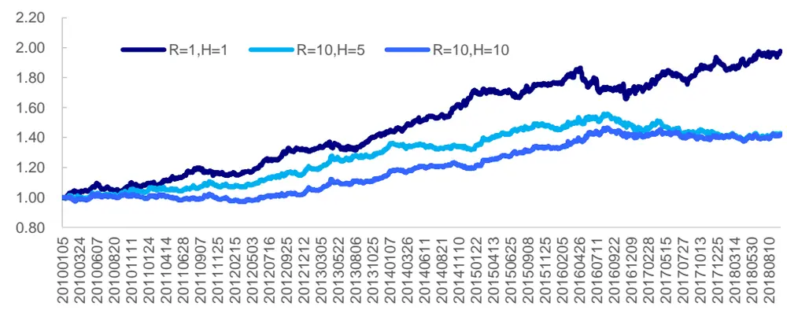
资料来源：Wind，海通证券研究所

如果考虑到波动率的水平，我们可以将上行波动占比因子转换为“累计上行波动率-累计下行波动率”这一形式，新因子在各参数组下均能取得正收益，收益水平高于原始因子（见表 5）。因子在 R=10-30，H=1-10 参数区域内表现相对稳定，平均年化收益率为 3.96%。

表 5 期货上行波动率-下行波动率因子的年化收益率与夏普比率

| 年化收益率（%） 夏普比率H HR1 |  |  |  |  |  |  |  |  |  |  |  |  |  |  |  |  |  |  |  |  |  |  |  |  |  |  |  |  |  |  |  |  |  |  |
| --- | --- | --- | --- | --- | --- | --- | --- | --- | --- | --- | --- | --- | --- | --- | --- | --- | --- | --- | --- | --- | --- | --- | --- | --- | --- | --- | --- | --- | --- | --- | --- | --- | --- | --- |
|  |  |  |  |  |  |  |  |  |  |  |  |  |  |  |  |  |  |  |  |  |  |  | 10 | 15 | 20 | R |  |  |  |  |  | 10 | 15 | 20 |
|  |  |  |  |  |  |  |  |  |  |  |  |  |  |  |  |  |  | 4.55 | 1.75 | 1.27 | 1.55 | 1.64 | 1.57 | 1.69 | 1.91 |  | 0.64 | 0.36 | 0.31 | 0.45 | 0.53 | 0.46 | 0.50 | 0.57 |
| 2 | 2.67 | 0.64 | 0.74 | 1.19 | 0.47 | 1.26 | 1.95 | 2.19 | 2 | 0.38 | 0.11 | 0.14 | 0.27 | 0.12 | 0.39 | 0.56 | 0.68 |  |  |  |  |  |  |  |  |  |  |  |  |  |  |  |  |  |
| 3 | 1.52 | 1.38 | 1.34 | 1.02 | 0.80 | 2.04 | 2.09 | 2.21 | 3 | 0.22 | 0.22 | 0.24 | 0.20 | 0.17 | 0.53 | 0.61 | 0.67 |  |  |  |  |  |  |  |  |  |  |  |  |  |  |  |  |  |
| 4 | 3.10 | 2.04 | 1.22 | 1.14 | 1.57 | 3.42 | 1.72 | 2.73 | 4 | 0.43 | 0.32 | 0.21 | 0.21 | 0.30 | 0.82 | 0.44 | 0.79 |  |  |  |  |  |  |  |  |  |  |  |  |  |  |  |  |  |
| 510 | 1.48 | 0.77 | 1.33 | 2.12 | 2.50 | 3.41 | 3.69 | 3.00 | 5 | 0.21 | 0.12 | 0.22 | 0.37 | 0.46 | 0.74 | 0.87 | 0.77 |  |  |  |  |  |  |  |  |  |  |  |  |  |  |  |  |  |
|  | 2.44 | 3.44 | 4.18 | 5.14 | 5.36 | 5.71 | 3.44 | 2.70 | 10 | 0.35 | 0.52 | 0.65 | 0.81 | 0.86 | 0.99 | 0.66 | 0.56 |  |  |  |  |  |  |  |  |  |  |  |  |  |  |  |  |  |
| 1520 | 4.78 | 3.90 | 4.08 | 4.61 | 4.86 | 4.38 | 3.11 | 1.95 | 15 | 0.67 | 0.56 | 0.60 | 0.69 | 0.74 | 0.70 | 0.53 | 0.36 |  |  |  |  |  |  |  |  |  |  |  |  |  |  |  |  |  |
|  | 4.02 | 3.56 | 3.06 | 3.27 | 3.45 | 3.43 | 2.16 | 1.62 | 20 | 0.56 | 0.51 | 0.45 | 0.49 | 0.53 | 0.55 | 0.36 | 0.28 |  |  |  |  |  |  |  |  |  |  |  |  |  |  |  |  |  |
| 30 | 4.29 | 3.70 | 3.56 | 3.43 | 3.41 | 2.98 | 1.71 | 1.02 | 30 | 0.60 | 0.52 | 0.51 | 0.50 | 0.50 | 0.45 | 0.27 | 0.17 |  |  |  |  |  |  |  |  |  |  |  |  |  |  |  |  |  |

资料来源：Wind，海通证券研究所

图16 期货上行波动率-下行波动率因子净值曲线
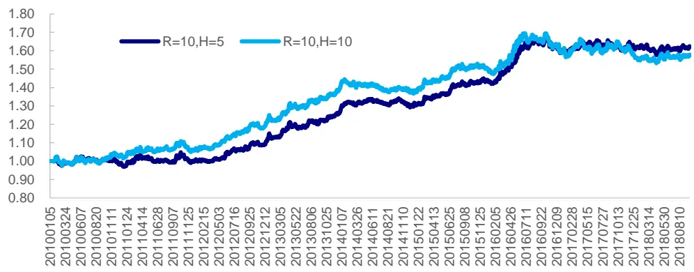
资料来源：Wind，海通证券研究所

## 3.3 小结

根据以上研究结果，高频偏度和下行波动占比因子在在期货和股票中的表现截然不同。二者在股票中体现出反转效应，即因子值小的股票未来收益更高，而在期货中体现出动量效应，即因子值大的期货品种未来收益更高，即便我们仅考察一个月涨跌幅这个日频因子，也可以得出这一结论。

这种差异化特征可能与交易机制和投资者结构有关。股票市场以单向做多机制为主，散户交易占比较高，容易出现过度反应和定价偏误，而期货市场可以多空双向T+0交易，机构参与度高，程序化交易应用广泛，定价相对更为精确，价格的涨跌往往与库存等基本面数据变化形成共振，更容易向一个方向持续运动。

## 4. 成交量分布因子

## 4.1 日内成交量分布

一般来说，股票日内成交量呈现“U”型或者“W”型走势，即成交量在开盘和收盘阶段比其他交易时段更高，午间休市可能导致下午开盘时成交量也出现高点。各个时点的成交量分布能够反映投资者的行为特征，蕴含额外信息。

我们以半小时为间隔划分成八个区间，计算每个区间成交量占比VolumeRatio，并使用股票过去 日指标均值作为因子值。

$$
VolumeRatio_{t}=\frac{Volume_{t}}{Volume_{total}}
$$

不同时间区间的因子 IC统计结果如表 6所示，上午 10:00 之前，下午 14:30 之后的成交量占比因子和股票下月收益负相关；10:00-11:00 的成交量占比因子和股票下月收益显著正相关。

表 6 成交量占比因子 IC统计结果

|  | 原始因子 |  |  | 正交因子 |  |
| --- | --- | --- | --- | --- | --- |
| 第 N 个半小时 | 均值 IR | 胜率 | 均值 | IR | 胜率 |
| 1 | -0.036 | -1.22 36.5% | 0.008 | 0.50 | 50.0% |
| 2 | 0.022 1.13 | 57.7% | 0.024 | 2.19 | 76.0% |
| 3 | 0.037 | 2.43 78.8% | 0.022 | 2.26 | 76.9% |
| 4 | 0.027 | 1.69 72.1% | 0.008 | 0.85 | 63.5% |
| 5 | 0.032 | 1.60 61.5% | 0.010 | 0.93 | 55.8% |
| 6 | 0.022 | 1.08 57.7% | 0.004 | 0.41 | 50.0% |
| 7 | 0.014 | 0.64 56.7% | -0.009 | -0.88 | 37.5% |
| 8 | -0.027 | -1.01 40.4% | -0.047 | -3.24 | 17.3% |

资料来源：Wind，海通证券研究所

图17 成交量占比因子分组表现
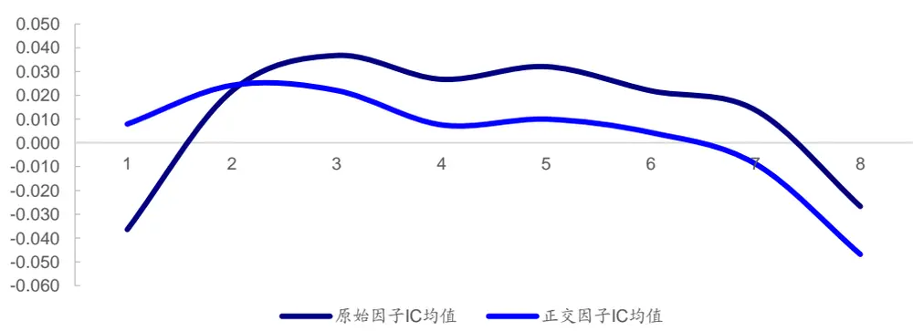
资料来源： ，海通证券研究所

## 4.2 10:30-11:00 成交量占比

10:30-11:00 成交量占比因子的分组收益和 IC 表现如图 18-21 所示，原始因子和正交因子的 IC 均值分别为 0.037 和 0.022；ICIR 分别为 2.43 和 2.26，多空组合月均收益差分别为 1.35%和 0.82%。

图18 10:30-11:00 成交量占比因子分组收益
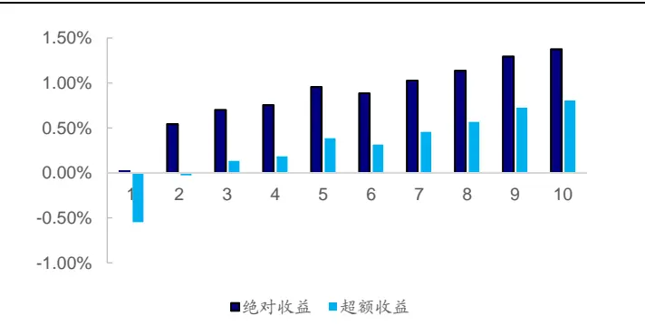
资料来源：Wind，海通证券研究所

图19 10:30-11:00 成交量占比因子 IC
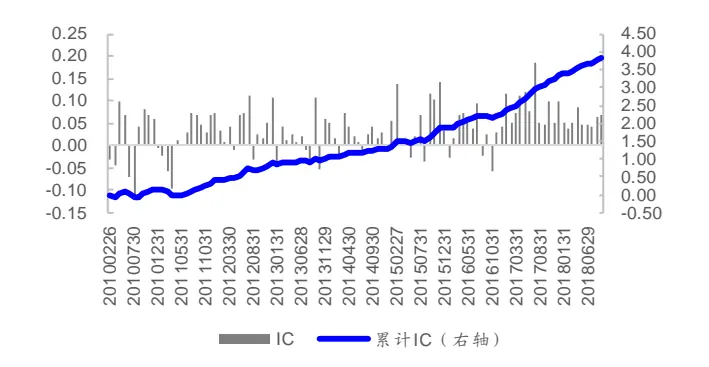
资料来源：Wind，海通证券研究所

图20 10:30-11:00成交量占比因子（正交）分组收益
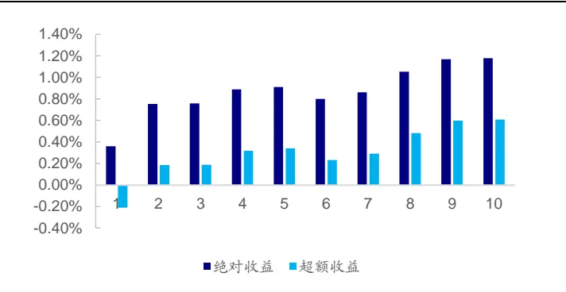
资料来源：Wind，海通证券研究所

图21 10:30-11:00 成交量占比因子（正交）IC
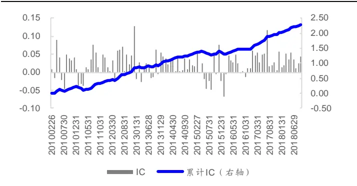
资料来源：Wind，海通证券研究所

## 4.3 14:30-15:00 成交量占比

14:30-15:00 成交量占比因子的分组收益和 IC 表现如图 22-25 所示，原始因子和正交因子的 IC 均值分别为-0.027 和-0.047；ICIR 分别为-1.01 和-3.24，多空组合月均收益差分别为 0.99%和 1.54%。

图22 14:30-15:00 成交量占比因子分组收益
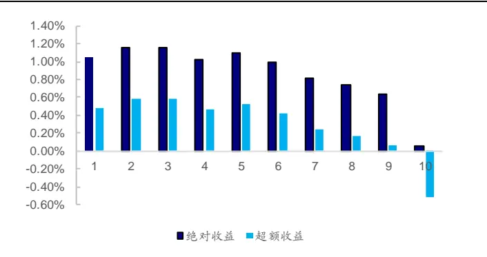
资料来源：Wind，海通证券研究所

图23 14:30-15:00 成交量占比因子 IC
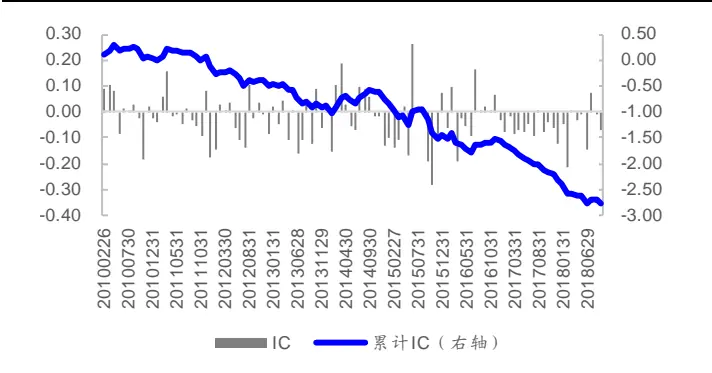
资料来源：Wind，海通证券研究所

图24 14:30-15:00成交量占比因子（正交）分组收益
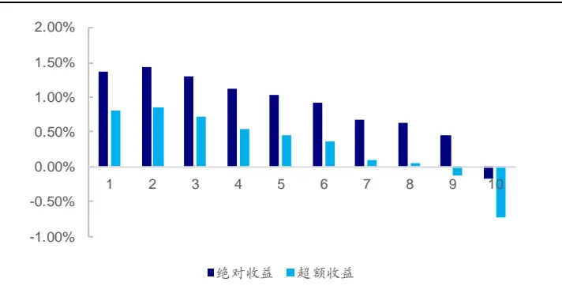
资料来源：Wind，海通证券研究所

图25 14:30-15:00 成交量占比因子（正交）IC
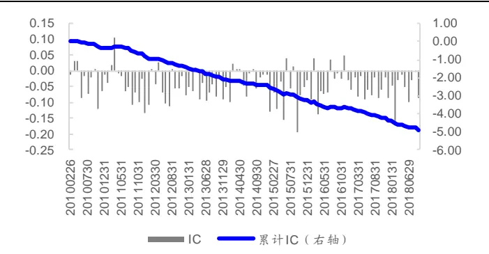
资料来源：Wind，海通证券研究所

为什么不同时段的成交量占比选股效果存在显著差异？一个可能的原因在于：开盘后半小时的交易反映了投资者对隔夜信息的分歧度，噪声较多；收盘前的交易反映出投资者对下一个交易日的预期，部分个人投资者厌恶承担日内波动，选择在临近收盘时交易，从而使得该时段的预期收益下降，而真正的知情交易者会选择在盘中噪声较少时交易。

我们在期货市场中同样构建了成交量占比因子，收盘前半小时成交占比因子在不同参数组下的表现如表 7所示。该因子不具备区分效果，一个可能的原因是不同期货品种交易时间有所不同，难以统一比较，部分品种没有夜盘交易，有夜盘交易的品种，例如螺纹钢、沪铜和黄金，交易时长也有所不同。

表 7 期货收盘前半小时成交占比因子的年化收益率与夏普比率

| 年化收益率（%） 夏普比率HR 1 HR |  |  |  |  |  |  |  |  |  |  |  |  |  |  |  |  |  |  |  |  |  |  |  |  |
| --- | --- | --- | --- | --- | --- | --- | --- | --- | --- | --- | --- | --- | --- | --- | --- | --- | --- | --- | --- | --- | --- | --- | --- | --- |
|  |  |  |  |  |  |  |  |  |  |  |  |  |  |  |  |  |  | 10 | 15 | 20 | R | 10 | 15 | 20 |
| 1 | -1.51 | -1.20 | -0.24 | -0.79 | -0.63 | -1.20 | -0.08 | -1.38 | 1 | -0.26 | -0.27 | -0.06 | -0.22 | -0.19 | -0.35 | -0.02 | -0.40 |  |  |  |  |  |  |  |
| 2 | -3.32 | -0.86 | 0.11 | 0.11 | 0.54 | -0.88 | -0.06 | -1.07 | 2 | -0.59 | -0.18 | 0.02 | 0.03 | 0.13 | -0.24 | -0.02 | -0.29 |  |  |  |  |  |  |  |
| 3 | 0.41 | -0.14 | -0.02 | -0.25 | -0.16 | -1.26 | -0.20 | -0.84 | 3 | 0.07 | -0.03 | 0.00 | -0.05 | -0.04 | -0.31 | -0.05 | -0.22 |  |  |  |  |  |  |  |
| 4 | -1.30 | -1.45 | -0.47 | -0.55 | -0.61 | -0.78 | 0.04 | -0.30 | 4 | -0.23 | -0.28 | -0.09 | -0.11 | -0.13 | -0.19 | 0.01 | -0.08 |  |  |  |  |  |  |  |
| 5 | -2.04 | -1.62 | -0.85 | -0.88 | -1.12 | -0.43 | -0.12 | -0.89 | 5 | -0.36 | -0.30 | -0.16 | -0.18 | -0.23 | -0.10 | -0.03 | -0.22 |  |  |  |  |  |  |  |
| 10 | -2.30 | -1.42 | -1.12 | -0.89 | -0.60 | 0.11 | 0.02 | -0.62 | 10 | -0.41 | -0.26 | -0.21 | -0.17 | -0.11 | 0.02 | 0.00 | -0.14 |  |  |  |  |  |  |  |
| 152030 | -2.78 | -1.34 | -0.85 | -0.60 | -0.47 | -0.65 | -1.45 | -1.20 | 15 | -0.48 | -0.24 | -0.15 | -0.11 | -0.09 | -0.13 | -0.29 | -0.25 |  |  |  |  |  |  |  |
|  | -1.87 | -1.62 | -0.93 | -0.50 | -0.35 | -0.99 | -1.41 | -0.89 | 20 | -0.33 | -0.29 | -0.17 | -0.09 | -0.06 | -0.19 | -0.29 | -0.19 |  |  |  |  |  |  |  |
|  | -3.31 | -2.83 | -2.47 | -2.10 | -1.88 | -1.15 | -0.81 | 0.09 | 30 | -0.56 | -0.49 | -0.43 | -0.37 | -0.34 | -0.21 | -0.16 | 0.02 |  |  |  |  |  |  |  |

资料来源：Wind，海通证券研究所

## 5. 量价复合因子

## 5.1 高频量价相关性

我们在《选股因子系列研究(十二)——“量”与“价”的结合》中发现日频股票价格和换手率的相关系数具有显著的选股能力，相关系数大，即“量价背离”的股票未来收益表现好于相关系数小，即“量价同向”的股票。

下面我们使用日内数据构建高频量价相关性因子，即每一交易日取股票日内 1分钟频率的价格 $\cdot P_{t}$ 和成交量 $\mathbf{\nabla}V_{t}.$ 序列，计算 Pearson 相关系数，

$$
\pmb{\rho}=corr(\pmb{P}_{t},\pmb{V}_{t})
$$

并使用过去 20日指标均值作为因子值。

高频量价相关性因子同样具有显著的选股能力，因子分组收益和 IC 表现如图 26-29所示，原始因子和正交因子的IC均值分别为-0.061和-0.037，ICIR分别为-2.48和-2.73，多空组合月均收益差分别为 2.10%和 1.17%。

图26 股票高频量价相关性因子分组收益
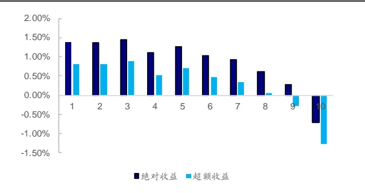
资料来源：Wind，海通证券研究所

图27 股票高频量价相关性因子 IC表现
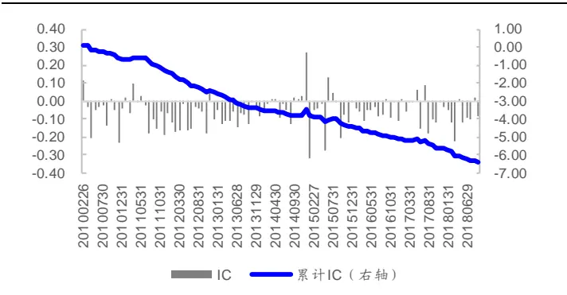
资料来源：Wind，海通证券研究所

图28 股票高频量价相关性因子（正交）分组收益
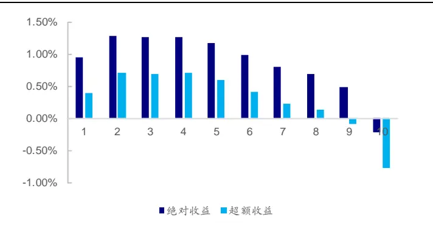
资料来源：Wind，海通证券研究所

图29 股票高频量价相关性因子（正交）IC表现
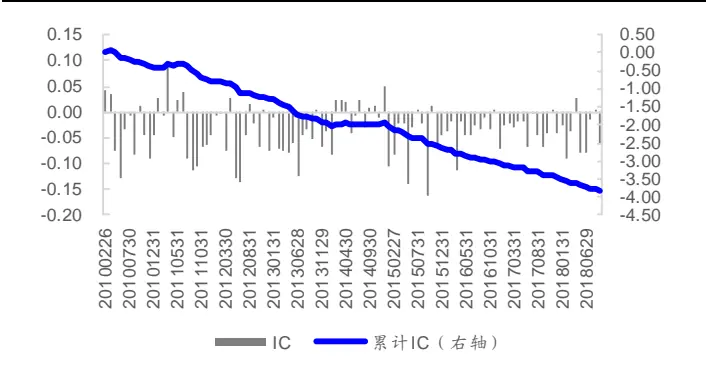
资料来源： ，海通证券研究所

对于期货，高频量价相关性因子在不同参数组下的表现如表 8所示。当回看期 R和持有期H较短时，因子取得负收益，随着R和H增加因子收益开始由负转正，在R=15-30，H=5-20 参数区域内表现相对稳定，平均年化收益率为 3.46%。

表 8 期货高频量价相关性因子的年化收益率与夏普比率

| HR 1 2 |  |  | 年化收益率（%） 夏普比率 |  |  |  |  |  |  |  |  |  |  |  |  |  |  |
| --- | --- | --- | --- | --- | --- | --- | --- | --- | --- | --- | --- | --- | --- | --- | --- | --- | --- |
|  |  |  | 3 | 4 | 5 | 10 | 15 | 20 | HR | 1 | 2 | 3 | 4 | 5 | 10 | 15 | 20 |
| 1 | -3.55 | -2.34 | -1.50 | -0.96 | -1.18 | 0.60 | -0.09 | 1.63 | 1 | -0.56 | -0.52 | -0.40 | -0.29 | -0.39 | 0.21 | -0.03 | 0.56 |
| 2 | -3.74 | -1.79 | -1.00 | -0.88 | -0.63 | 0.36 | 1.10 | 2.79 | 2 | -0.59 | -0.34 | -0.22 | -0.21 | -0.17 | 0.12 | 0.37 | 0.89 |
| 3 | -3.60 | -2.29 | -1.63 | -1.43 | -1.08 | 0.47 | 1.69 | 1.79 | 3 | -0.56 | -0.42 | -0.32 | -0.31 | -0.25 | 0.13 | 0.56 | 0.60 |
| 4 | -2.26 | -0.33 | -0.24 | -0.17 | 0.42 | 1.23 | 1.93 | 2.31 | 4 | -0.36 | -0.06 | -0.05 | -0.03 | 0.09 | 0.32 | 0.56 | 0.75 |
| 5 | -1.77 | -0.49 | -0.06 | 0.20 | 0.46 | 1.51 | 3.25 | 2.87 | 5 | -0.28 | -0.09 | -0.01 | 0.04 | 0.09 | 0.37 | 0.90 | 0.85 |
| 10 | -0.25 | 1.24 | 1.67 | 2.01 | 2.23 | 3.05 | 3.05 | 3.59 | 10 | -0.04 | 0.21 | 0.30 | 0.37 | 0.42 | 0.63 | 0.70 | 0.88 |
| 15 | 2.22 | 2.43 | 2.63 | 2.82 | 3.10 | 4.15 | 3.69 | 3.64 | 15 | 0.36 | 0.42 | 0.46 | 0.51 | 0.57 | 0.82 | 0.78 | 0.83 |
| 20 | 2.35 | 3.08 | 2.99 | 3.27 | 3.53 | 3.52 | 3.26 | 3.05 | 20 | 0.38 | 0.52 | 0.52 | 0.58 | 0.63 | 0.66 | 0.65 | 0.63 |
| 30 | 2.81 | 2.86 | 3.04 | 3.04 | 2.90 | 3.80 | 3.31 | 3.56 | 30 | 0.46 | 0.48 | 0.52 | 0.53 | 0.51 | 0.69 | 0.62 | 0.68 |

资料来源：Wind，海通证券研究所

图30 期货高频量价相关性因子净值曲线
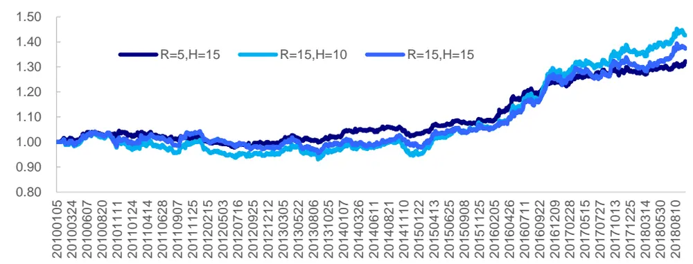
资料来源：Wind，海通证券研究所

## 5.2 高频仓价相关性

期货相比股票，存在持仓量这一额外的信息维度，我们可以使用同样的方法计算日内价格和持仓量之间的相关系数。

仓价相关性因子在不同参数组下的表现如表 9 所示。与量价相关性因子表现相似，当回看期 R 和持有期 H 较短时，因子取得负收益，随着 R和 H 增加因子收益开始由负转正，在 R=10-30，H=1-10 参数区域内表现相对稳定，平均年化收益率 3.58%。

从直观上理解，仓价相关性较高，意味着该品种持仓量随价格上升而增加——多头加仓，继续看涨，或随价格下跌而减少——多头平仓止损，空头获利了结，市场跌势趋缓，二者均为多头信号；仓价相关性较低，意味着该品种持仓量随价格上升而下降——空头平仓止损，多头获利了结，市场涨势趋缓，或随价格下跌而上升——空头加仓，继续看跌，二者均为空头信号。

表 9 期货高频仓价相关性因子的年化收益率与夏普比率

| 年化收益率（%） 夏普比率HR 1 |  |  |  |  |  |  |  |  |  |  |  |  |  |  |  |  |  |  |  |  |  |  |  |  |
| --- | --- | --- | --- | --- | --- | --- | --- | --- | --- | --- | --- | --- | --- | --- | --- | --- | --- | --- | --- | --- | --- | --- | --- | --- |
|  |  |  |  |  |  |  |  |  |  |  |  |  |  |  |  |  |  | 10 | 15 | 20 | R | 10 | 15 | 20 |
| 1 | -0.97 | -0.29 | -0.11 | 0.31 | -0.51 | 0.26 | 1.52 | 0.82 | 1 | -0.17 | -0.07 | -0.03 | 0.09 | -0.15 | 0.08 | 0.47 | 0.27 |  |  |  |  |  |  |  |
| 2 | -0.95 | -0.65 | -0.11 | -0.02 | -0.29 | 1.50 | 1.43 | 1.77 | 2 | -0.17 | -0.13 | -0.03 | -0.01 | -0.07 | 0.41 | 0.42 | 0.51 |  |  |  |  |  |  |  |
| 3 | -1.66 | -0.19 | 0.01 | -0.08 | 0.10 | 1.98 | 2.29 | 1.65 | 3 | -0.29 | -0.04 | 0.00 | -0.02 | 0.02 | 0.49 | 0.61 | 0.45 |  |  |  |  |  |  |  |
| 4 | -0.19 | -0.53 | -0.90 | -0.15 | 0.22 | 2.03 | 2.11 | 1.94 | 4 | -0.03 | -0.10 | -0.18 | -0.03 | 0.05 | 0.48 | 0.53 | 0.52 |  |  |  |  |  |  |  |
| 5 | -1.05 | -0.81 | -0.38 | 0.37 | 0.38 | 2.12 | 2.95 | 2.33 | 5 | -0.18 | -0.15 | -0.07 | 0.07 | 0.08 | 0.47 | 0.70 | 0.58 |  |  |  |  |  |  |  |
| 10 | 2.88 | 3.77 | 3.86 | 4.06 | 4.06 | 4.31 | 3.48 | 2.56 | 10 | 0.48 | 0.66 | 0.69 | 0.74 | 0.75 | 0.85 | 0.72 | 0.55 |  |  |  |  |  |  |  |
| 1520 | 4.78 | 4.61 | 4.07 | 3.88 | 3.93 | 3.98 | 2.75 | 2.75 | 15 | 0.79 | 0.78 | 0.70 | 0.68 | 0.70 | 0.74 | 0.54 | 0.56 |  |  |  |  |  |  |  |
|  | 2.79 | 3.01 | 3.17 | 3.25 | 3.39 | 3.12 | 2.64 | 2.24 | 20 | 0.46 | 0.51 | 0.55 | 0.57 | 0.60 | 0.57 | 0.50 | 0.44 |  |  |  |  |  |  |  |
| 30 | 3.14 | 3.46 | 3.47 | 3.21 | 3.09 | 2.64 | 2.02 | 1.34 | 30 | 0.52 | 0.59 | 0.59 | 0.55 | 0.54 | 0.47 | 0.37 | 0.26 |  |  |  |  |  |  |  |

资料来源：Wind，海通证券研究所

图31 期货高频仓价相关性因子净值曲线
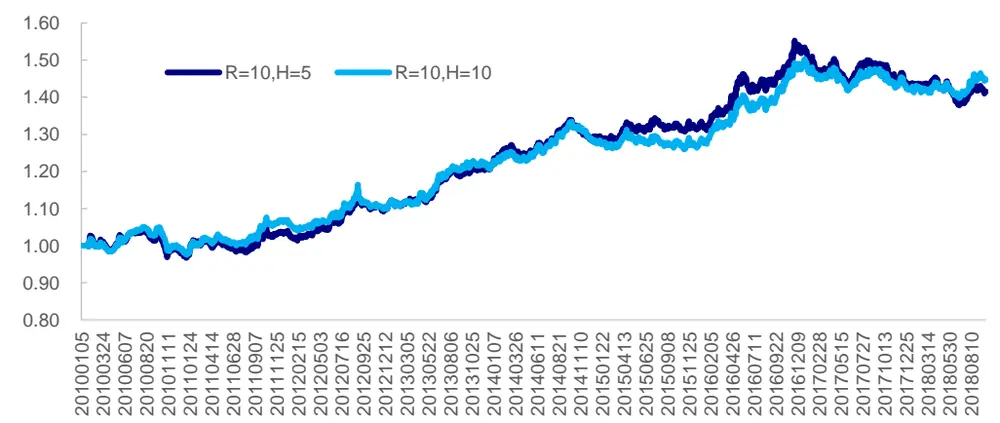
资料来源：Wind，海通证券研究所

## 6. 资金流因子

资金流向来自交易时产生的委托信息，反映的是微观层面的供求关系。Wind 中提供了数十个股票资金流汇总指标，包括不同类型投资者（机构、大户、中户、散户）成交占比、主动买（卖）量（额、单数、比率）、净流入量（额、单数、比率）等等。我们在《选股因子系列研究(十一)——Level2 行情选股因子初探》中测试了多个资金流因子的选股效果，由于因子数量较多，本文中暂不做展示，详见相关报告。

对于期货的资金流入因子，由于 wind未提供汇总指标，我们使用分钟数据自行定义。该因子有两种定义方式，第一种是基于成交量的因子 1：

$$
flowInRatio=\sum_{i}\sum_{j}Volume_{ij}\cdot Close_{ij}\cdot\frac{Close_{ij}-Close_{ij-1}}{\left|Close_{ij}-Close_{ij-1}\right|}\rangle\sum_{i}Amount_{i,total}
$$

第二种是基于持仓量变化的因子 2：

$$
flowInRatio=\sum_{i}\sum_{j}|OI_{ij}-OI_{ij-1}|\cdot Close_{ij}\cdot\frac{Close_{ij}-Close_{ij-1}}{\left|Close_{ij}-Close_{ij-1}\right|}/(OI_{t-R}\cdot Settle_{t-R})
$$

其中， $close_{ij}$ 、Volume 、 $\pmb{OI}_{ij}$ 依次表示 i日第j 分钟的收盘价、成交量、持仓量、$Amount_{i,total}.$ 表示 i日的成交金额， $\pmb{OI}_{t-R}$ 和 $Settle_{t-R}$ 表示 t-R 日的持仓量和结算价。

因子 1和因子 2表现相近，在回看期和持有期较短时取得负收益，在回看期和持有期较长时取得正收益（见表 10-11），这意味着期货资金流入因子具有短期反转、长期动量特征。

表 10 期货资金流入因子 1的年化收益率与夏普比率

|  |  |  | 4 | 5 | 10 | 15 | 20 | HR | 1 | 2 | 3 | 4 | 5 | 10 | 15 | 20 |
| --- | --- | --- | --- | --- | --- | --- | --- | --- | --- | --- | --- | --- | --- | --- | --- | --- |
| 3.65 | -0.56 | -1.40 | -0.33 | -0.85 | -0.10 | -0.85 | 0.10 | 1 | 0.64 | -0.13 | -0.40 | -0.11 | -0.31 | -0.04 | -0.29 | 0.04 |
| -0.17 | -2.68 | -2.22 | -2.12 | -2.00 | 0.34 | -0.09 | 1.81 | 2 | -0.03 | -0.54 | -0.52 | -0.56 | -0.59 | 0.12 | -0.03 | 0.64 |
| -2.04 | -2.77 | -2.99 | -2.75 | -2.24 | -0.42 | 0.25 | 0.74 | 3 | -0.34 | -0.53 | -0.62 | -0.64 | -0.57 | -0.13 | 0.09 | 0.26 |
| -0.32 | -1.74 | -2.02 | -1.36 | -1.37 | 0.70 | 0.02 | 0.61 | 4 | -0.05 | -0.32 | -0.40 | -0.29 | -0.31 | 0.20 | 0.01 | 0.21 |
| -2.09 | -2.97 | -2.01 | -1.39 | -0.96 | -0.05 | 0.92 | -0.07 | 5 | -0.35 | -0.54 | -0.39 | -0.28 | -0.21 | -0.01 | 0.25 | -0.02 |
| -0.92 | -0.55 | 0.11 | 0.53 | 0.85 | 1.90 | 1.52 | 1.48 | 10 | -0.16 | -0.10 | 0.02 | 0.10 | 0.17 | 0.40 | 0.34 | 0.35 |
| 1.37 | 0.00 | 0.21 | 0.33 | 0.68 | 1.59 | 1.35 | 0.26 | 15 | 0.23 | 0.00 | 0.04 | 0.06 | 0.12 | 0.31 | 0.28 | 0.05 |
| 1.94 | 1.34 | 1.07 | 1.11 | 1.18 | 2.04 | 1.44 | 0.74 | 20 | 0.31 | 0.22 | 0.18 | 0.19 | 0.21 | 0.38 | 0.28 | 0.15 |
| 1.34 | 0.90 | 0.56 | 0.89 | 0.97 | 1.28 | 1.71 | 0.78 | 30 | 0.21 | 0.15 | 0.09 | 0.15 | 0.16 | 0.23 | 0.31 | 0.15 |

资料来源：Wind，海通证券研究所

表 11 期货资金流入因子 2的年化收益率与夏普比率

| 年化收益率（%） |  |  |  |  |  |  |  |  | 夏普比率 |  |  |  |  |  |  |  |  |
| --- | --- | --- | --- | --- | --- | --- | --- | --- | --- | --- | --- | --- | --- | --- | --- | --- | --- |
| HR | 1 | 2 | 3 | 4 | 5 | 10 | 15 | 20 | HR | 1 | 2 | 3 | 4 | 5 | 10 | 15 | 20 |
| 1 | -1.77 | -2.20 | -1.95 | -1.33 | -1.18 | -0.23 | 1.92 | -0.10 | 1 | -0.29 | -0.45 | -0.43 | -0.32 | -0.30 | -0.06 | 0.51 | -0.03 |
| 2 | -2.97 | -2.18 | -2.06 | -1.84 | -1.54 | 0.17 | 0.48 | 0.32 | 2 | -0.49 | -0.39 | -0.40 | -0.38 | -0.33 | 0.04 | 0.12 | 0.08 |
| 3 | -2.46 | -2.70 | -2.23 | -1.98 | -1.55 | 0.16 | 0.45 | 0.18 | 3 | -0.40 | -0.46 | -0.41 | -0.38 | -0.31 | 0.03 | 0.11 | 0.04 |
| 4 | -2.89 | -2.11 | -2.09 | -1.87 | -1.28 | -0.01 | 0.81 | -0.44 | 4 | -0.47 | -0.36 | -0.37 | -0.34 | -0.24 | 0.00 | 0.18 | -0.10 |
| 5 | -3.13 | -2.13 | -1.69 | -1.09 | -0.95 | 0.01 | 0.61 | -0.32 | 5 | -0.50 | -0.36 | -0.29 | -0.20 | -0.17 | 0.00 | 0.13 | -0.07 |
| 10 | -1.93 | -2.21 | -2.03 | -1.51 | -1.31 | 0.21 | 0.21 | -0.37 | 10 | -0.31 | -0.36 | -0.34 | -0.26 | -0.22 | 0.04 | 0.04 | -0.07 |
| 15 | -1.50 | -1.36 | -1.12 | -1.32 | -1.29 | 0.03 | -0.24 | -0.23 | 15 | -0.24 | -0.22 | -0.18 | -0.22 | -0.22 | 0.01 | -0.04 | -0.04 |
| 20 | -1.42 | -1.55 | -1.86 | -1.83 | -1.66 | -0.95 | -0.83 | -0.64 | 20 | -0.23 | -0.25 | -0.31 | -0.30 | -0.28 | -0.16 | -0.15 | -0.12 |
| 30 | -3.26 | -2.83 | -2.55 | -2.42 | -2.25 | -1.38 | -0.85 | -0.64 | 30 | -0.53 | -0.47 | -0.42 | -0.41 | -0.38 | -0.24 | -0.15 | -0.12 |

资料来源：Wind，海通证券研究所

图32 期货资金流因子净值曲线
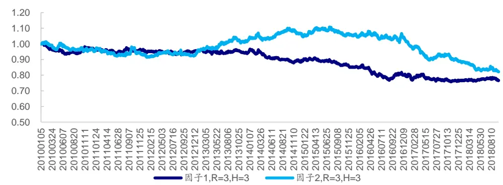
资料来源：Wind，海通证券研究所

## 7. 动量类因子

## 7.1 趋势强度

记 t日 1 分钟频率的价格序列为 $P_{t}(t=1,2,\cdots,n)$ ，则趋势强度指标定义如下：

$$
trendStrength=\ \frac{P_{n}-P_{1}}{\sum_{i=2}^{n}abs(P_{i}-P_{i-1})_{t}}
$$

该指标可以理解为日内价格位移与路程之比，能够刻画日内趋势的强弱。我们同样将过去 R日指标均值定义为趋势强度因子。

股票趋势强度因子具有一定选股效果，IC均值为-0.034，多空组合月均收益差为1.18%，但剔除风格因子后，因子 IC 均值为 0.002，top-bottom 月均收益为-0.05%，完全丧失了选股效果。

对于期货，当回看期 R和持有期 H均为 1 天时，因子收益最高，为 9.45%，夏普比率为 1.48。因子在 R=10-20，H=1-10 参数区域内表现相对稳定，平均年化收益率为5.30%（见表 12）。

表 12期货趋势强度因子的年化收益率与夏普比率

| 年化收益率（%） 夏普比率 |  |  |  |  |  |  |  |  |  |  |  |  |  |  |  |  |  |
| --- | --- | --- | --- | --- | --- | --- | --- | --- | --- | --- | --- | --- | --- | --- | --- | --- | --- |
| HR | 1 | 2 | 3 | 4 | 5 | 10 | 15 | 20 | HR | 1 | 2 | 3 | 4 | 5 | 10 | 15 | 20 |
| 12 | 9.45 | 3.58 | 1.54 | 2.04 | 1.49 | 1.53 | 0.21 | 1.41 | 1 | 1.48 | 0.77 | 0.40 | 0.59 | 0.47 | 0.50 | 0.07 | 0.45 |
|  | 3.64 | 0.59 | 1.12 | 1.25 | 0.66 | 2.48 | 1.89 | 2.75 | 2 | 0.56 | 0.11 | 0.23 | 0.29 | 0.17 | 0.78 | 0.58 | 0.88 |
| 3 | 3.84 | 2.25 | 1.31 | 1.16 | 1.06 | 1.27 | 2.06 | 1.28 | 3 | 0.60 | 0.38 | 0.24 | 0.23 | 0.23 | 0.34 | 0.61 | 0.41 |
| 4 | 5.92 | 2.87 | 1.93 | 2.03 | 2.18 | 3.17 | 1.65 | 1.72 | 4 | 0.89 | 0.47 | 0.34 | 0.37 | 0.43 | 0.77 | 0.42 | 0.51 |
| 510152030 | 1.43 | 0.54 | 1.30 | 2.11 | 2.21 | 3.30 | 2.88 | 2.07 | 5 | 0.21 | 0.09 | 0.22 | 0.37 | 0.41 | 0.74 | 0.69 | 0.55 |
|  | 5.96 | 4.98 | 5.07 | 5.08 | 5.20 | 5.11 | 3.62 | 2.51 | 10 | 0.88 | 0.76 | 0.80 | 0.82 | 0.86 | 0.91 | 0.69 | 0.52 |
|  | 9.35 | 7.10 | 6.17 | 5.61 | 5.21 | 3.88 | 2.52 | 1.57 | 15 | 1.32 | 1.03 | 0.91 | 0.85 | 0.80 | 0.63 | 0.44 | 0.29 |
|  | 6.71 | 4.69 | 4.15 | 4.16 | 3.95 | 2.97 | 1.79 | 1.36 | 20 | 0.94 | 0.67 | 0.60 | 0.61 | 0.59 | 0.47 | 0.29 | 0.23 |
|  | 4.05 | 3.28 | 2.94 | 2.68 | 2.66 | 2.13 | 1.32 | 0.45 | 30 | 0.56 | 0.46 | 0.42 | 0.38 | 0.39 | 0.32 | 0.21 | 0.07 |

资料来源：Wind，海通证券研究所

图33 期货趋势强度因子净值曲线
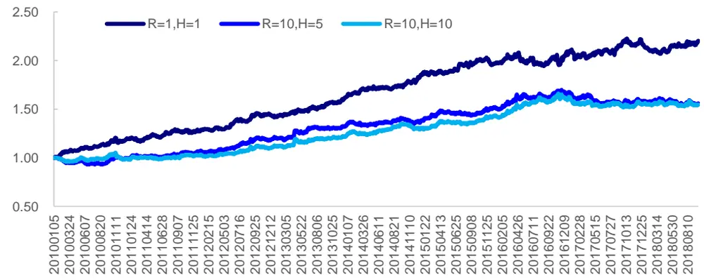
资料来源：Wind，海通证券研究所

## 7.2 改进的反转因子

除了直接使用分钟级别数据构建因子之外，我们还可以使用日内信息对传统因子做增强。例如一个月反转因子自 2017 年以来有效性有所减弱，一个重要的原因是投资者更加注重基本面研究和价值投资，青睐基本面向好的公司，抛弃基本面恶化或者业绩“爆雷”的公司。由于大多数公司选择在收盘之后发布财务数据等重要信息，股票次日往往跳空开盘，并在随后一段时间大幅波动。近年来，A股机构投资者占比提升，市场交易行为在慢慢向美股等发达市场靠拢，这种在美股财报季常见的开盘跳空现象属于市场对重要数据或信息的合理定价，而并非投资者行为造成的错误定价。

基于以上现象，我们可以尝试将将隔夜和开盘后半小时的涨幅剔除，再计算当日涨幅r ，将过去一个月r 的累计值作为新的反转因子。改进因子和原始因子的对比如图 34所示，多空组合月均多空收益差由 1.79%提升至 2.28%，2017 年以来提升效果尤为明显。

图34 改进反转因子增强效果明显
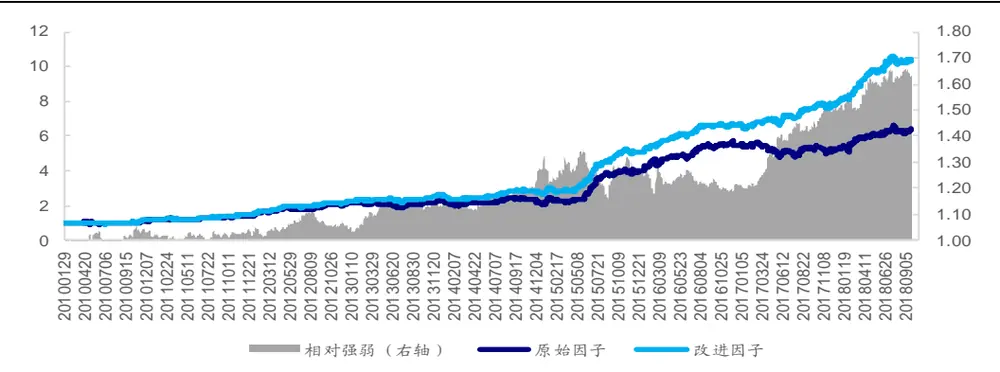
资料来源：Wind，海通证券研究所

正交因子 IC 均值为-0.037，ICIR 为-3.25，多空组合月均收益差为 1.42%，胜率高达 80.8%，选股效果仍然显著。

图35 改进反转因子（正交）分组收益
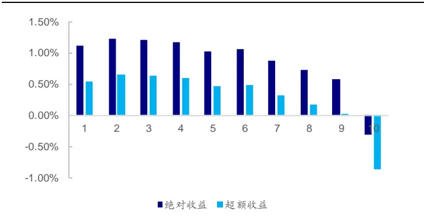
资料来源：Wind，海通证券研究所

图36 改进反转因子（正交）IC
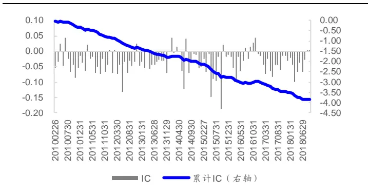
资料来源： ，海通证券研究所

## 7.3 期货日内动量

由于期货是 T+0 交易，因此我们可以构建日内策略：在 t 时刻，做多日内累计涨幅高的前 20%品种，做空涨幅低的前 20%品种，持有至收盘平仓。日内动量因子表现稳定，当 t为 9:03 时，因子取得 10.61%的年化收益率和 1.97 的夏普比率，随着 t 的延长收益逐渐衰减，但胜率有所提升。

表 13期货日内动量因子表现

| 时点 | 年化收益率 | 夏普比率 胜率 |  |  |  |  |  |  |
| --- | --- | --- | --- | --- | --- | --- | --- | --- |
| 903 |  |  | 10.61% | 1.97 | 55% |  |  |  |
| 905 |  |  | 8.96% | 1.66 | 54% |  |  |  |
| 910 |  |  | 9.16% | 1.77 | 54% |  |  |  |
| 915 |  |  | 7.96% | 1.55 | 54% |  |  |  |
| 920 |  |  | 8.21% | 1.60 | 54% |  |  |  |
| 925 |  |  | 8.68% | 1.70 | 55% |  |  |  |
| 930945 |  |  | 6.07% | 1.22 | 53% |  |  |  |
|  |  |  | 7.62% | 1.65 | 56% |  |  |  |
| 1000103012001400 |  |  | 4.75% | 1.04 | 54% |  |  |  |
|  |  |  |  |  |  | 7.24% | 1.65 | 57% |
|  |  |  | 5.79% | 1.73 | 57% |  |  |  |
|  |  |  | 7.69% | 2.71 | 59% |  |  |  |

资料来源：Wind，海通证券研究所

图37 期货日内动量因子净值曲线
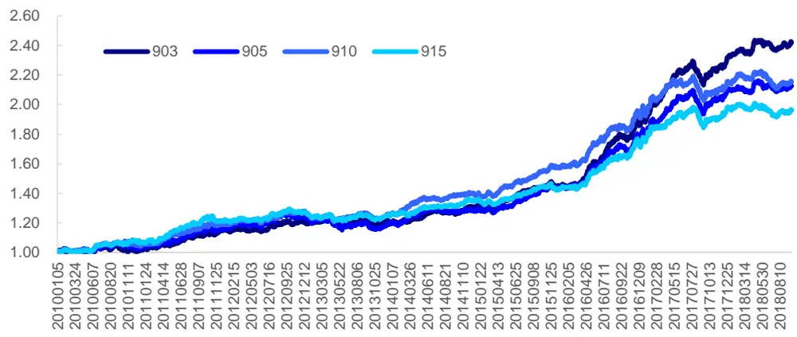
资料来源：Wind，海通证券研究所

## 8. 高频因子相关性

股票高频因子秩相关系数矩阵如表 所示，大多数因子间具有较低的相关性，而下行波动率占比和高频偏度因子间具有较高的负相关性，高达-0.83，这是因为二者都能够刻画日内收益率分布的非对称性。前文分析结果显示，下行波动占比因子具有更好的选股效果。在剔除了下行波动占比因子影响后，高频偏度因子 C下降至 ，多空组合月均收益差下降至 0.17%，说明高频偏度因子的选股能力全部可以被下行波动占比因子所解释。

表 14股票高频因子秩相关系数均值
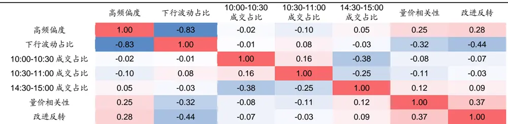
资料来源：Wind，海通证券研究所

期货高频因子秩相关系数矩阵如图 38 所示，与股票相似，上行波动率占比和高频偏度因子间具有较高的正相关性，其他高频因子之间相关性普遍较低，但绝大多数都和时间序列动量因子正相关。

图38 期货高频因子秩相关系数均值
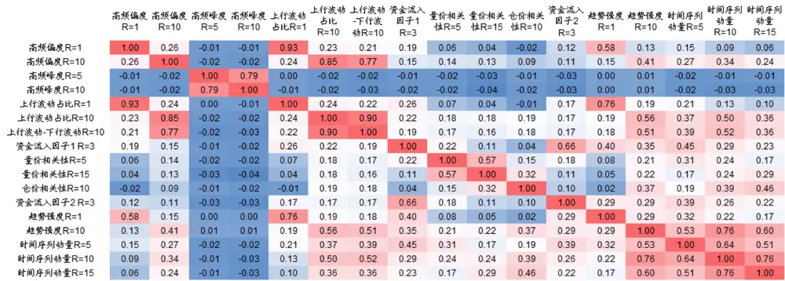
资料来源：Wind，海通证券研究所

## 9. 总结与展望

本篇报告中我们使用分钟级别数据构建了一系列高频因子，并对比各因子在股票和期货中的表现。

高频偏度、下行波动率占比、量价相关性因子具有显著的选股效果。成交量分布因子同样具备一定的选股效果，收盘前成交量越大的股票未来表现越差，而上午 10-11 点成交量越大的股票未来表现越好。此外，还可以使用日内信息对传统因子进行改进，反转因子多空组合月均收益差可以从 1.79%提升至 2.28%。2017 年以来提升效果尤为显著。

多数高频因子在期货和股票中的表现截然不同，在股票中体现出反转效应，在期货中体现出动量效应，这种差异化特征可能与交易机制和投资者结构有关。股票市场以单向做多机制为主，散户交易占比较高，容易出现过度反应和定价偏误，而期货市场可以多空双向 T+0 交易，机构参与度高，程序化交易应用广泛，定价相对更为精确，价格的涨跌往往与库存等基本面数据变化形成共振，更容易向一个方向持续运动。

在后面的研究中，我们将基于交易者行为特征挖掘更多日内或短周期 alpha 因子，完善多因子选股和 CTA策略体系。

## 10. 风险提示

因子失效风险、流动性风险、统计规律失效风险。

## 信息披露

分析师声明

[Table冯佳睿yst金融工程研究团队s]

姚石金融工程研究团队

本人具有中国证券业协会授予的证券投资咨询执业资格，以勤勉的职业态度，独立、客观地出具本报告。本报告所采用的数据和信息均来自市场公开信息，本人不保证该等信息的准确性或完整性。分析逻辑基于作者的职业理解，清晰准确地反映了作者的研究观点，结论不受任何第三方的授意或影响，特此声明。

## 法律声明

本报告仅供海通证券股份有限公司（以下简称 本公司 ）的客户使用。本公司不会因接收人收到本报告而视其为客户。在任何情况下，本报告中的信息或所表述的意见并不构成对任何人的投资建议。在任何情况下，本公司不对任何人因使用本报告中的任何内容所引致的任何损失负任何责任。

本报告所载的资料、意见及推测仅反映本公司于发布本报告当日的判断，本报告所指的证券或投资标的的价格、价值及投资收入可能会波动。在不同时期，本公司可发出与本报告所载资料、意见及推测不一致的报告。

市场有风险，投资需谨慎。本报告所载的信息、材料及结论只提供特定客户作参考，不构成投资建议，也没有考虑到个别客户特殊的投资目标、财务状况或需要。客户应考虑本报告中的任何意见或建议是否符合其特定状况。在法律许可的情况下，海通证券及其所属关联机构可能会持有报告中提到的公司所发行的证券并进行交易，还可能为这些公司提供投资银行服务或其他服务。

本报告仅向特定客户传送，未经海通证券研究所书面授权，本研究报告的任何部分均不得以任何方式制作任何形式的拷贝、复印件或复制品，或再次分发给任何其他人，或以任何侵犯本公司版权的其他方式使用。所有本报告中使用的商标、服务标记及标记均为本公司的商标、服务标记及标记。如欲引用或转载本文内容，务必联络海通证券研究所并获得许可，并需注明出处为海通证券研究所，且不得对本文进行有悖原意的引用和删改。

根据中国证监会核发的经营证券业务许可，海通证券股份有限公司的经营范围包括证券投资咨询业务。

## 海通证券股份有限公司研究所

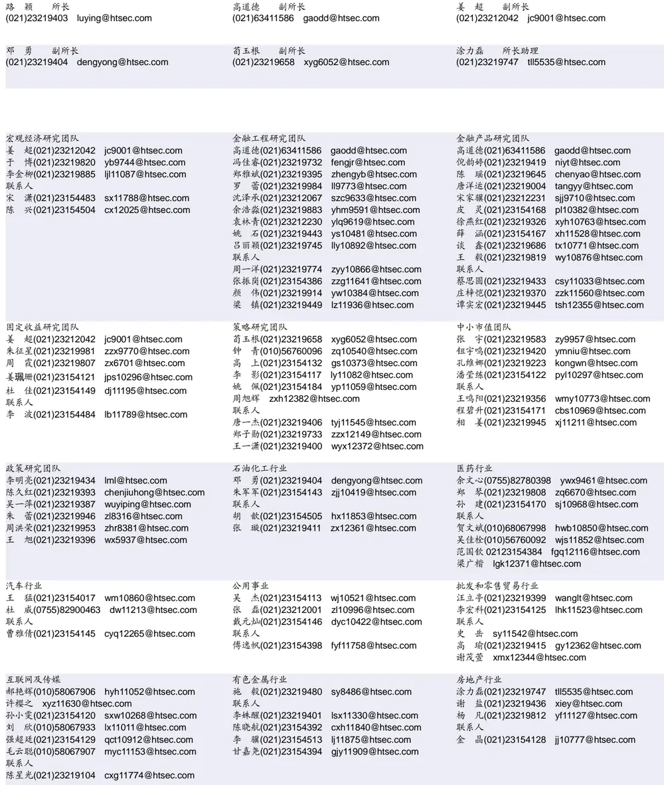

| 电子行业 |  | 煤炭行业 |  | 电力设备及新能源行业 |  |  |
| --- | --- | --- | --- | --- | --- | --- |
|  | 陈 平(021)23219646 cp9808@htsec.com |  | 李 淼(010)58067998 Im10779@htsec.com |  | 张一弛(021)23219402 | zyc9637@htsec.com |
|  | 尹 苓(021)23154119 yl11569@htsec.com |  | 戴元灿(021)23154146 dyc10422@htsec.com |  | 房 青(021)23219692 fangq@htsec.com |  |
|  | 谢 磊(021)23212214 xl10881@htsec.com |  | 吴 杰(021)23154113 wj10521@htsec.com |  | 曾 彪(021)23154148 zb10242@htsec.com |  |
| 联系人 |  |  | 联系人 |  | 徐柏乔(021)23219171 xbq6583@htsec.com |  |
|  | 石 坚(010)58067942 sj11855@htsec.com |  | 王 涛 02123219760 wt12363@htsec.com |  | 张向伟(021)23154141 | zxw10402@htsec.com |

| 基础化工行业 |  | 计算机行业 |  | 通信行业 |  |
| --- | --- | --- | --- | --- | --- |
| 刘 威(0755)82764281 | Iw10053@htsec.com | 郑宏达(021)23219392 | zhd10834@htsec.com | 朱劲松(010)50949926 | zjs10213@htsec.com |
| 刘海荣(021)23154130 Ihr10342@htsec.com |  | 黄竞晶(021)23154131 | hjj10361@htsec.com | 余伟民(010)50949926 | ywm11574@htsec.com |
| 张翠翠(021)23214397 | zcc11726@htsec.com | 杨 林(021)23154174 yl11036@htsec.com |  | 张 弋 01050949962 zy12258@htsec.com |  |
| 孙维容(021)23219431 | swr12178@htsec.com | 鲁 立(021)23154138 II11383@htsec.com |  | 张峥青(021)23219383 zzq11650@htsec.com |  |
| 联系人 |  | 于成龙 ycl12224@htsec.com |  |  |  |
| 李 智(021)23219392 lz11785@htsec.com |  | 联系人 |  |  |  |
|  |  | 洪 琳(021)23154137 hl11570@htsec.com |  |  |  |

| 非银行金融行业 |  | 交通运输行业 | 纺织服装行业 |  |  |
| --- | --- | --- | --- | --- | --- |
|  | 孙 婷(010)50949926 st9998@htsec.com | 虞 楠(021)23219382 yun@htsec.com |  | 梁 希(021)23219407 lx11040@htsec.com |  |
| 联系人 | 何 婷(021)23219634 ht10515@htsec.com | 罗月江(021)56760091 lyj12399@htsec.com 联系人 | 联系人 | 盛开(021)23154510 | sk11787@htsec.com |
| 李芳洲(021)23154127 Ifz11585@htsec.com |  | 李 丹(021)23154401 Id11766@htsec.com 党新龙(0755)82900489 dxl12222@htsec.com |  | 刘 溢(021)23219748 | ly12337@htsec.com |

| 建筑建材行业 |  | 机械行业 |  | 钢铁行业 |  |
| --- | --- | --- | --- | --- | --- |
| 冯晨阳(021)23212081 fcy10886@htsec.com 联系人 |  | 余炜超(021)23219816 swc11480@htsec.com 耿 耘(021)23219814 gy10234@htsec.com | 联系人 | 刘彦奇(021)23219391 liuyq@htsec.com |  |
| 申 浩(021)23154114 sh12219@htsec.com |  | 杨 震(021)23154124 yz10334@htsec.com |  |  | 周慧琳(021)23154399 zhl11756@htsec.com |
|  |  | 沈伟杰(021)23219963 swj11496@htsec.com |  | 刘 璇(0755)82900465 lx11212@htsec.com |  |
|  | 周 丹 zd12213@htsec.com |  |  |  |  |

| 建筑工程行业 |  | 农林牧渔行业 |  | 食品饮料行业 |  |
| --- | --- | --- | --- | --- | --- |
| 杜市伟(0755)82945368 dsw11227@htsec.com |  | 丁 频(021)23219405 dingpin@htsec.com |  |  | 闻宏伟(010)58067941 whw9587@htsec.com |
| 张欣劫 zxj12156@htsec.com |  | 陈雪丽(021)23219164 cxl9730@htsec.com |  |  | 成 珊(021)23212207 cs9703@htsec.com |
|  | 李富华(021)23154134 Ifh12225@htsec.com | 联系人 | 陈 阳(021)23212041 cy10867@htsec.com |  | 唐 宇(021)23219389 ty11049@htsec.com |

| 军工行业 |  | 银行行业 |  | 社会服务行业 |  |
| --- | --- | --- | --- | --- | --- |
|  | 蒋 俊(021)23154170 jj11200@htsec.com |  | 孙 婷(010)50949926 st9998@htsec.com |  | 汪立亭(021)23219399 wanglt@htsec.com |
|  | 刘 磊(010)50949922 II11322@htsec.com |  | 解巍巍 xww12276@htsec.com |  | 陈扬扬(021)23219671 cyy10636@htsec.com |
| 张恒晅 zhx10170@htsec.com |  | 联系人 | 林加力(021)23214395 ljl12245@htsec.com |  |  |
| 联系人 张宇轩(021)23154172 zyx11631@htsec.com |  |  | 谭敏沂(0755)82900489 tmy10908@htsec.com |  |  |

## 研究所销售团队

深广地区销售团队

蔡铁清(0755)82775962 ctq5979@htsec.com

伏财勇(0755)23607963 fcy7498@htsec.com

辜丽娟(0755)83253022 gulj@htsec.com

刘晶晶(0755)83255933 liujj4900@htsec.com

王雅清(0755)83254133 wyq10541@htsec.com

饶 伟(0755)82775282 rw10588@htsec.com

欧阳梦楚(0755)23617160

oymc11039@htsec.com

宗 亮 zl11886@htsec.com

巩柏含 gbh11537@htsec.com

上海地区销售团队
胡雪梅(021)23219385 huxm@htsec.com
朱 健(021)23219592 zhuj@htsec.com
季唯佳(021)23219384 jiwj@htsec.com
黄 毓(021)23219410 huangyu@htsec.com
漆冠男(021)23219281 qgn10768@htsec.com
胡宇欣(021)23154192 hyx10493@htsec.com
黄 诚(021)23219397 hc10482@htsec.com
毛文英(021)23219373 mwy10474@htsec.com
马晓男 mxn11376@htsec.com
杨祎昕(021)23212268 yyx10310@htsec.com
张思宇 zsy11797@htsec.com
慈晓聪(021)23219989 cxc11643@htsec.com
王朝领 wcl11854@htsec.com
李 寅 021-23219691 ly12488@htsec.com
邵亚杰 23214650 syj12493@htsec.com
北京地区销售团队
殷怡琦(010)58067988 yyq9989@htsec.com
郭 楠 010-5806 7936 gn12384@htsec.com
吴 尹 wy11291@htsec.com
张丽萱(010)58067931 zlx11191@htsec.com
杨羽莎(010)58067977 yys10962@htsec.com
杜 飞 df12021@htsec.com
张 杨(021)23219442 zy9937@htsec.com
何 嘉(010)58067929 hj12311@htsec.com
李 婕 lj12330@htsec.com
欧阳亚群 oyyq12331@htsec.com

海通证券股份有限公司研究所

地址：上海市黄浦区广东路 689号海通证券大厦 9楼

电话：（021）23219000

传真：（021）23219392

网址：www.htsec.com