## [Tab相关研究

Table_ReportInfo]《选股因子系列研究（四十八）——探索

A 股的五因子模型》2019.05.28

《创业板动量成长指数及华夏创成长产品投资价值分析》《创蓝筹指数及华夏创蓝筹 ETF产品投资价值分析》2019.05.22

分析师:冯佳睿

Tel:(021)23219732

Email:fengjr@htsec.com

证书:S0850512080006

分析师:周一洋

Tel:(021)23219774

Email:zyy10866@htsec.com

证书:S0850518120001

## 听海外高频交易专家讲解美国的高频交易

## 投资要点：

- 高频交易在美国证券市场中的角色。如果把正在正常交易、买卖力量均衡的市场比喻成一个平静的水面，此时，某个基本面交易员下了一个数量较大的订单，这好比往水中投入了一块石头。那么，不论是订单自身的价格推动力，还是其他投资者做出的反应，都会使市场产生一系列波动，一如水面泛起的层层涟漪。而高频交易则藏匿于其中，于市场的起伏之中寻找获利的机会。

- 在美国，上市和交易业务是完全分离的，所有的上市证券均可以在任何一家交易所交易。对高频交易商而言，这种碎片化的交易模式提供了很大的获利机会。试想，同一个证券很有可能因为市场流动性或是参与者结构的差异，甚至只是信息传递存在时滞，在不同的交易所上形成不同的价格。那么，高频交易商完全可以凭借速度优势抓住这一稍纵即逝的价差，在电光火石之间完成一次套利交易。

做市策略的基本原理是，越靠近最新形成的价格的委托单，遭遇的逆向选择越少。这是因为，新价格形成之际，是市场信息最不充分的时刻，也是投资者对下一步的市场走向最不确定的时刻。倘若我们自认为并不具有信息优势，那么最佳策略就是尽可能让自己的订单排在委托队列的前端，从而最大程度地降低，甚至是消除被逆向选择的概率。

- 增量行情的应用和推广，使得市场进一步走向公开和透明，信息的传递和消化也变得更为迅速和有效。简而言之，增量行情是指市场上每一个和成交或委托相关的事件，都会以一条记录的形式推送。因此，相邻两个快照的后一个，都可由前一个加上若干条增量行情获得。

- 增量行情相比快照行情最突出的两大优点。第一，市场的任何一次变化，都能为所有人知晓。快照行情只展示了市场是什么样的，增量行情则揭示了市场是怎么变成这样的。第二，大幅减少了每次信息传输占用的字节数，提升了处理速度。例如，增量行情——“取消订单 2”可能只需占用几个字节，然而，接收并存储委托快照的资源消耗可能是前者的几百倍。

当前有关高频交易的前沿技术大体包含了以下六个方面。程序应用、操作系统、进程通讯、网络硬件、硬件优化、地理位臵。可以说，我们对交易系统所做的每一个优化，不论是硬件层面还是软件层面，最终目的都是为了将速度发挥到极致。

- 高频交易的理论基础是统计学中的大数法则。对于每一笔交易，我们希望有超过50%的胜率。但要转化为回报，必须增加交易的次数。因为只有样本量足够大时，样本均值才会和总体均值无限接近。然而，交易次数一旦增加，成本也会随之提高。所以，不论是策略的设计，还是软硬件的优化，目的都是为了降低交易成本。只有控制好成本，我们才能放心地去提高交易的频率，从而获得更加稳定的回报。

- 风险提示。专家的实际经验并不构成投资建议。美国证券市场的交易机制和国内不同，相关策略仅供参考，不能直接应用。

高频交易兴起于上世纪 80 年代的美国证券市场。和传统的通过持有股票组合获取收益不同，高频交易很少持仓过夜，目的就是通过交易获利。经过 30余年的发展，高频交易已成为一类主流的投资策略，诞生了文艺复兴（Renaissance）、Citadel等一系列知名的对冲基金。

对于仍然年轻的中国证券市场而言，高频交易显得神秘而又充满诱惑力。为了让国内的相关从业人员更好地了解高频交易，海通证券金融工程团队邀请到了在美国有 10年高频交易经验的专家，进行了一次内部培训，详细讲解了美国高频交易的原理、策略和现状。经专家同意，特将培训纪要以报告形式发布，希望给国内关注高频交易的投资者带来些许参考和帮助。

专家从 2009 年起供职于美国的一家高频交易商，主要负责交易系统开发、交易策略研发和风控体系设定等一系列工作。公司每天的交易量大约是美国股票市场的 5%，策略的夏普比例在 8到 10之间。

整个培训从一个经典的案例——Flash Crash 讲起，介绍了高频交易在当前美国股票市场中的角色。进而引出对美国股票市场架构的分析，从中可以衍化出两类十分经典的高频交易策略。接着，详述了高频交易所必需的技术条件和最新的发展趋势。最后，以高频交易中最朴素的原理作为结尾。

## 1. 高频交易在美国证券市场中的角色

美国股票市场的 Flash Crash（闪崩）发生于 2010 年 5月 6 日，尽管距今已显得有些久远，但其意义和影响力仍不容忽视。当天 左右，美国的标普 指数在短短几分钟之内，大幅下跌了约 9%。之后，又迅速反弹。在此期间，市场的交易量激增。（如下图所示，左侧为标普 500 的迷你期货，右侧为跟踪标普 500 指数的 ETF——SPY。）这一事件在当时的美国引起了极大的震动，对投资者的信心也造成了巨大打击。

图1 标普 500迷你期货的价格和成交量（2010.05.06）
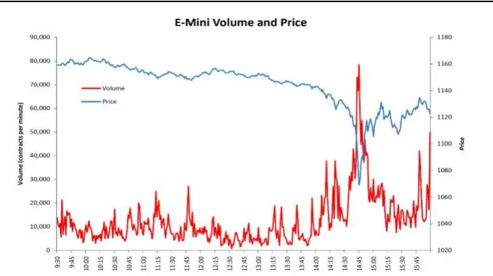
资料来源：Bloomberg，海通证券研究所

图2 标普 500 ETF 的价格和成交量（2010.05.06）
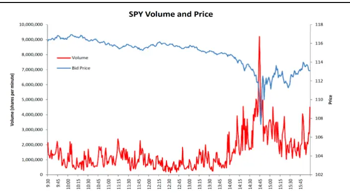
资料来源：Bloomberg，海通证券研究所

为了弄清事件的来龙去脉，美国证监会专门召集了一个团队，花了半年的时间进行研究分析，并形成了一份最终报告。透过报告中的数据，我们可以一窥美国股票市场的架构及运行规律、高频交易在其中所扮演的角色。更重要的是，这样一个独特而又充满竞争性的市场架构，为诸多高频交易策略提供了肥沃的土壤。

简单来说，“闪崩”源于流动性的严重缺失。有人也许会质疑，以上两图分明显示了，在 14:45 左右，期货和 ETF的成交量大幅上升，怎么能说是没有流动性呢？这一说法实际上是将成交量和流动性混淆了。我们可以进一步观察下图，左右两侧分别对应标普 500迷你期货和 ETF在当日的挂单情况（市场深度）。在成交量飙升的 14:45，挂单量却急剧萎缩，迷你期货和 ETF 的委托买单量甚至接近于零。这一巨大的反差揭示出一个非常重要的概念：成交量≠流动性。

图3 标普 500 迷你期货的挂单变化（2010.05.06）
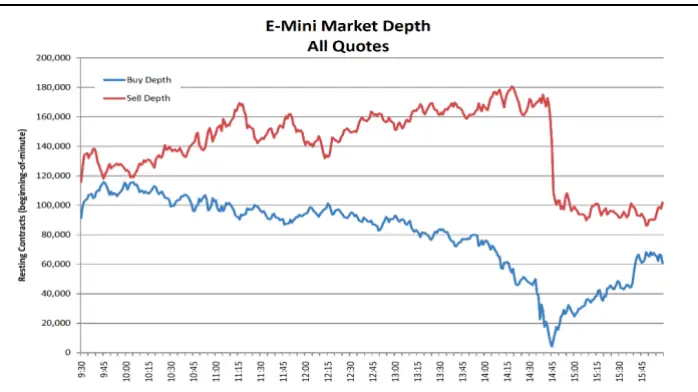
资料来源：Bloomberg，海通证券研究所

图4 标普 500 ETF 的挂单变化（2010.05.06）
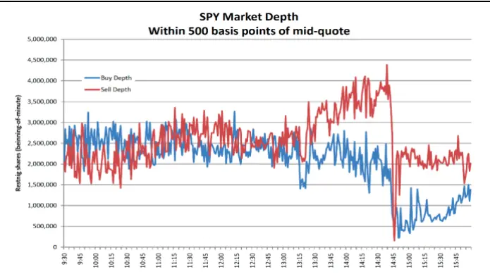
资料来源：Bloomberg，海通证券研究所

解释清了“闪崩”的根源是流动性的缺失，另一个问题又随之而来。既然市场上几乎已经没有委买单可以执行，这么大的成交量又是从何而来。让我们回到 SEC 的报告，看一看这几分钟内究竟发生了什么。

2010 年 5 月，正值第一次欧债危机的高峰，市场情绪低迷。6日 14:32，一个基本面交易员为了对冲手中的股票头寸，卖空了 75000 手标普 500 迷你期货合约，价值 41亿美元。这样一个正常的套保行为在平日里并不会给市场带来多大的冲击，但在当天负面情绪弥漫的环境下，却成为了压死骆驼的最后一根稻草。原本有义务提供连续报价的做市商在这个关键时刻纷纷选择自保，或是采用“无成交意向的报价”（stub quote），或是干脆关闭做市系统。市场流动性枯竭，一部分股票以 0.01 美元的价格成交，标普500 指数大跌。

但是，这 75000 手空单还是成交了，而且只花了大约 10 分钟。是谁吸收了它们？报告发现，共有十余家高频交易商在 14:31-14:44 的 3 分钟内，交易了总计 140000 手迷你期货合约，占交易量的 50%。然而，这些高频交易商的净仓位却只增加了 200 手。可以想象，在承接了巨量空单后，他们又以极高的速度在期货和现货市场进行了转移。例如，通过纽约和芝加哥的两个交易所之间的期现套利，将头寸的压力传导至 ，并进一步传导至个股。事实上，这些都是高频交易领域中极为经典的策略。

Flash Crash 当天所发生的一切虽然只是极端市场环境中的一个特例，但它却极其生动地勾勒出高频交易在整个二级市场中所扮演的角色和地位。如果把正在正常交易、买卖力量均衡的市场比喻成一个平静的水面，此时，某个基本面交易员下了一个数量较大的订单，这好比往水中投入了一块石头。那么，不论是订单自身的价格推动力，还是其他投资者做出的反应，都会使市场产生一系列波动，一如水面泛起的层层涟漪。而高频交易则藏匿于其中，于市场的起伏之中寻找获利的机会。

## 2. 美国证券市场架构与高频交易策略

美国的证券市场有着较为特殊的架构，这也成为了孕育各种高频交易策略的温床。两类最为经典的高频交易策略——做市和趋势，均是建立在这种市场架构之上的。下面，我们将依次介绍美国证券市场的三个典型特征。其中的每一个，都对应着一种高频交易策略的原理和机制。

## 2.1 交易市场的碎片化与做市策略

美国有近 10 家证券交易所，所有的上市证券均可以在这些交易所交易，这与 A股市场有着很大的不同。在国内，上交所只能交易在上交所上市的股票，深交所亦是如此。但在美国，上市和交易业务是完全分离的，在纽交所上市的股票同样可以在纳斯达克交易所买卖。

对高频交易商而言，这种碎片化的交易模式提供了很大的获利机会。试想，同一个证券很有可能因为市场流动性或是参与者结构的差异，甚至只是信息传递存在时滞，在不同的交易所上形成不同的价格。那么，高频交易商完全可以凭借速度优势抓住这一稍纵即逝的价差，在电光火石之间完成一次套利交易。

除了这些公开竞价的交易所，美国还有将近 50 家暗池（Dark Pool）。所谓暗池，就是一些大型券商机构，如高盛、摩根斯坦利，内部的撮合交易系统。它们的存在，进一步扩大了高频交易商活跃的空间。不过，需要注意的是，美国的法律对这类内部交易系统有着较为严格的监管，规定通过暗池成交的价格必须在所有交易所的买一价和卖一价之间。

在介绍如何利用交易市场的碎片化构建高频交易策略之前，有必要引入一个概念——逆向选择（Adverse Selection）。它对高频交易的成功实施至关重要，可以说，任何一次高频交易本质上都是为了尽可能地避免被逆向选择。我们通过一个例子加以说明。

下图是一个简化了的订单簿。假设市场刚刚上涨，虚线代表当前的成交价。右侧为买一价，从左至右间隔的色块表示按照达到交易所时间的先后顺序排列的委托单。一般认为，越靠近最新形成的价格的委托单，遭遇的逆向选择越少。这是因为，新价格形成之际，是市场信息最不充分的时刻，也是投资者对下一步的市场走向最不确定的时刻。倘若我们自认为并不具有信息优势1，那么最佳策略就是尽可能让自己的订单排在委托队列的前端，从而最大程度地降低，甚至是消除被逆向选择的概率。其中的原理和逻辑可以从以下两个方面来阐述。

首先，当前的最新价格是市场上涨形成的，由于动量效应的存在，我们预期价格仍然会向上移动。此时，若我们的订单位于买一委托队列的末端，那么在上涨过程中，该订单被成交的概率是很小的。相应地，我们也失去了获利的机会。

其次，若排在队列末端的订单被成交了，那么很大可能是对手方跨过买一卖一价差（Bid-ask Spread）的主动行为。此时，市场大概率已形成向下的动能，成交的订单也会遭遇亏损。

因此，订单越靠近委托队列的前端，其收益的数学期望也会更高。而且，交易所对提供流动性的做市行为，会给予返佣的奖励。靠前的订单成交概率更大，获得的返佣也将更多。而靠后的订单永远只会在价格趋势和预期相反时，才能够得到执行。

图5 证券交易中的逆向选择（Adverse Selection）

资料来源：海通证券研究所整理

通过以上分析，我们可以发现，仅仅是简单的挂单做市，就可以形成一类高频交易策略，所要求的无非是把订单放在委托队列的前端。但当所有的高频交易商都在市场上竞争时，这么做也就变得没那么容易了。而且，由于同一证券可在所有交易所买卖，美国的监管机构对挂单行为也有较为严格的限制。

下面我们以美股市场活跃度最高的证券之一——SPY（标普 500ETF）为例，详细说明如何合法、合规、高效地实施这一做市高频策略。

下图是某一时刻，我们的交易系统接收到的SPY在纽交所、纳斯达克交易所及BATS上的买卖委托队列。虚线上方为委卖，下方为委买。值得一提的是，相比前两个交易所，BATS 在国内的知名度并不高，但实际上它也承担了美国证券市场 15%-20%的交易量。

图6 高频做市策略
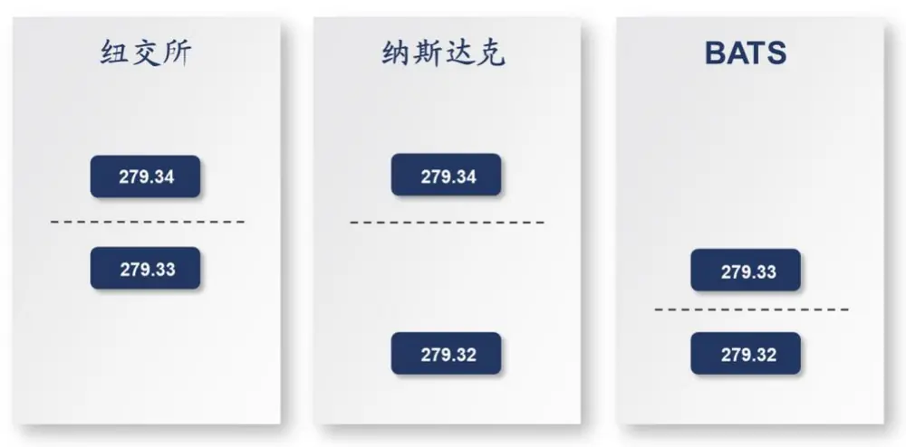
资料来源：海通证券研究所整理

假如此时我们观察到，纳斯达克交易所上的 SPY价格刚刚从 279.32 美元上涨至279.33 美元，且当前价格上并没有委托买单。那么根据逆向选择原理，作为高频交易商的我们，应当争取第一个把买单挂在 279.33 美元的位臵上。

但是，为了保证交易的公平性，美国证券交易监督委员会（SEC）规定，同一时刻，所有交易所之间不允许出现买一价和卖一价相同的情况。因此，当我们把“在 279.33美元上挂委买单”的指令发给纳斯达克交易所后，他们并不会立即将其放入订单簿，而是会先通过网络查询其他交易所的卖一价。只有在确认整个市场上不存在相同价格的委卖后，我们的订单才会进入委托队列。否则，证监会下属的金融业监管局（FINRA）就会对交易所进行处罚。显然，在上图的状态下，因为 BATS上存在卖一价为 279.33 美元的委托单，我们是无法第一时间在纳斯达克交易所上挂单的。

由于交易所只是为了合规，因此他们并不会优化查询速度。通常情况下，整个过程需要耗时 1 毫秒。这样的延迟对高频交易商而言，几乎是不可接受的。所以，为了绕开交易所的查询线路，同时又保证合法合规，高频交易商的惯用做法是成立一个类似于券商的法律实体，专门用以承担法律责任。它会向交易所承诺，每次我们发送委买指令的同时，都会把其他交易所扫描一遍，确保不存在相同价格的委卖单。如有，我们则会发送一个相同价格和大小的买单到该交易所，与其成交。并且，所有与挂单相关的法律责任均由我方承担。

这样一来，交易所既不需要承担法律责任，又可以吸引高频交易商大量的做市订单，活跃市场交易，自然十分乐意在收到指令后立即把委托单放入订单簿。而高频交易商由于拥有更快的传输速度，避免了交易所查询所需的 1 毫秒延时，也可以实现更为高效迅捷的挂单。

这个策略看似十分简单，但要成功也并非易事。首先是合规。我们必须与所有交易所都有实时的连接，并且保证发送买单的同时，“吃掉”其他交易所同价格的卖单。其次是成本。任何一笔投资都希望 100%利用资金，但当“吃掉”其他卖单所占用的资金过大时，我们就需要权衡其中的得失。最后也是最重要的一点——竞争。每个高频交易商都想快人一步，在合法合规的前提下，速度是唯一的凭借。任何软件的优化和硬件的革新，都能带来显著的优势。在“赢家通吃”的高频交易世界中，“军备竞赛”不可避免。

然而，仔细观察图 6，却可以发现一处明显的矛盾——纽交所已经出现了 279.33 美元的委买单。面对这种现象，最容易让人联想到的就是有高频交易商钻空子，在没有向BATS 发送买单的情况下，在纽交所挂单。但实际上，FINRA对此类行为的处罚非常严厉。一旦查实，高频交易商将面临数以千万计的罚款，这也许是公司一年甚至是几年的利润。

因此，当我们从自己的行情接收端观察到上述状况时，一般会倾向于认为是我们连接 BATS的网络出现了延迟。纽交所上 279.33 美元的委买单是合法的，即，此时 BATS上已不存在相同价格的委卖单。我们看到的，有可能只是几微秒前的订单簿。如果这一系列推断是合理的，那么我们会更愿意在纳斯达克交易所上做市，因为我们发到 BATS的买单有很大概率不会被成交。这样，也就不用承担持有非做市头寸的风险。

在这个过程中，有一个动作非常重要，即不论我们的推断是什么，只要我们看到BATS 上有同一价格的卖单，就必须向其发出买单。因为 FINRA 认定高频交易商做市行为合法的依据不是当时市场的真实状态，而是每个交易商自己的行情接收系统记录的各家交易所的订单簿情况。并且，FINRA 在监管时遵循的是“有罪推定”的原则。常见的调查方式是，在某个高频交易商的历史挂单记录中随机抽取 20-50 条，要求还原当时的市场状态，并证明自己的操作是合规的。若交易商无法自证，那么很有可能面对极其高昂的违法成本。

## 2.2 特殊订单类型与做市策略

上节中的做市策略讨论的是如何尽可能快地挂单，最好是能放在委托队列的第一位。但为了合规，我们不得不占用一部分资金去和其他交易所同价格的反方向委托单主动成交。实质上，这也是一种成本。因此，有时候我们会退而求其次，只要求委托单能排在队列的前几位，而不苛求第一。这样做的好处是显而易见的。第一，依然保持了较高的成交概率；第二，不必承担任何法律风险；第三，没有资金占用。

实现这样的做市策略，往往需要借助交易所开发的特殊订单类型。下面这个例子详细讲述了美国第四大证券交易所——Direct Edge 推出的一种特殊订单类型，它曾经在高频交易商的圈子里风靡一时。

如下图所示，虚线上方从下至上依次对应卖一和卖二的委托单，下方为买一的委托单，不同的订单用间隔的色块区分。在这样的一个订单簿结构下，我们认为，市场在下一个时刻是倾向于上涨的，因为买一的数量大幅高于卖一。于是，我们计划在市场上涨、当前的卖一价变为买一价时，把委买单放在靠前的位臵。此时，一种名为“Hidenot Slide”的特殊订单类型，就可以帮助我们实现这个目标。

图7 特殊订单类型案例
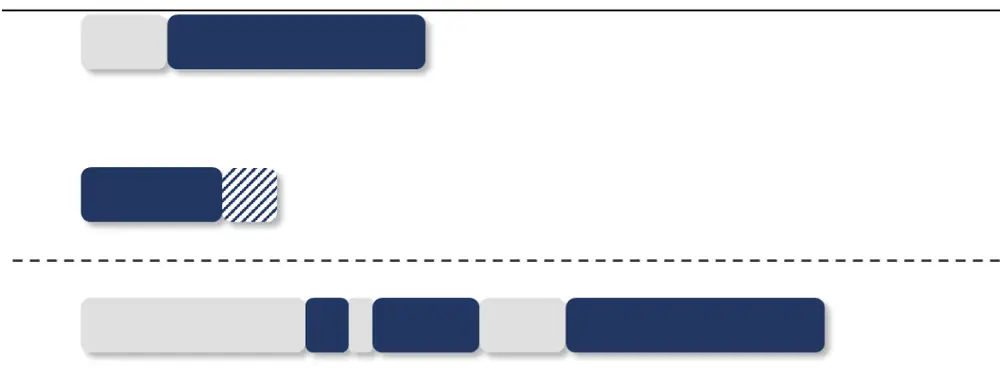
资料来源：海通证券研究所整理

具体而言，当我们观察到上图的市场状态后，会立刻给 Direct Edge 发送一个价格等于卖一价的“Hidenot Slide”委买单。理论上，这个订单应当立刻和卖一成交。但使用这种特殊订单类型后，它就不会被执行，而是进入一个隐藏队列。上图中，用短斜线部分代表。只有待到市场上涨，我们的订单才会显示在可见的委托队列中，如下图所示。

图8 特殊订单类型案例（续）
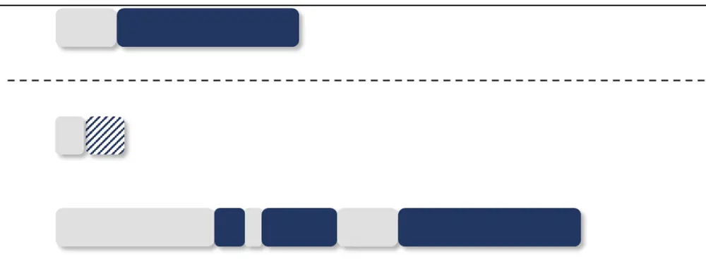
资料来源：海通证券研究所整理

在这种情况下，我们的订单是几乎不可能出现在队列第一位的。但通过运用特殊订单类型，主动承担小幅的逆向选择风险，我们既规避了合规麻烦，又提高了资金利用效率，不啻为另一种性价比极高的做市策略。

然而，这一订单类型最终还是被监管机构取消了。起因是，一名《华尔街日报》的记者针对该订单类型写了一篇报道，意指其有违公平。例如，某公募基金想要交易手中一个较大的头寸，根据可见的订单簿，他预计下单时会处在比较有利的位臵。但当他真正执行的时候，却发现被一连串隐藏订单挤到了委托队列的末尾。这就激起了众多基本面交易员的不满，纷纷声讨高频交易商利用规则的灰色地带获利。在这样的背景下，美国证监会出手禁止了这一特殊订单类型。

但实际上，任何一个美国证券市场的投资者，只要在 Direct Edge 上交易，就可以使用这种订单类型。只不过，高频交易商对此更为敏感，与交易所的联系也更加紧密。因为对交易所而言，提供此类服务，能够吸引更多高频交易商参与做市，从而提升交易活跃度，增强自身的竞争力。

## 2.3 增量行情与趋势策略

除了上市和交易业务的分离，美国证券市场的另一重要特征是全增量的行情分发形式。为了说明这种形式的优点，我们将其与常见的快照行情进行对比。

以下两图为交易所以最短间隔分发的某证券的两个委托快照。虚线的左右两侧分别是委买和委卖队列，依旧以不同色块区分订单，并标有相应的委托价格。

图9 委托快照 1
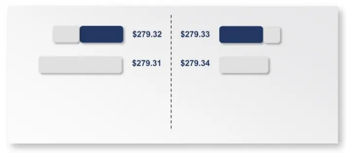
资料来源：海通证券研究所整理

图10 委托快照 2
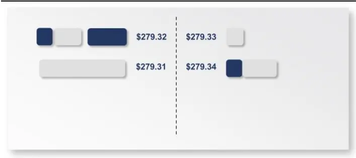
资料来源：海通证券研究所整理

从相邻的两个委托快照中，我们可以观察到每个委托价格上委托量的变化，这为研究投资者的交易意愿提供了重要信息。例如，第 2个快照中，买一的委托量显著增加，表明投资者的买入意愿增强，因而该证券倾向于上涨。但是，委托快照毕竟只是截面数据，这两个时点之间，市场发生了什么变化，我们无从知晓。这样的行情分发形式，实际上阻碍了信息的及时流通，不利于市场有效性的提升。

增量行情的应用和推广，使得市场进一步走向公开和透明，信息的传递和消化也变得更为迅速和有效，因而已为当前美国各大交易所采用。简而言之，增量行情是指市场上每一个和成交或委托相关的事件，都会以一条记录的形式推送。因此，相邻两个快照的后一个，都可由前一个加上若干条增量行情获得。下面，我们通过说明图 9 是如何演化成图 10 的，来介绍增量行情的形式和实际意义。

如左下图所示，首先用数字标记每个委托订单。随后，将我们从交易所接收到三条信息，对委托快照进行加工。最终，可以得到右下图中新的委托状态。

图11 增量行情 1
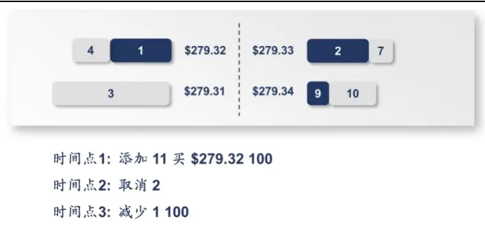
资料来源：海通证券研究所整理

图12 增量行情 2
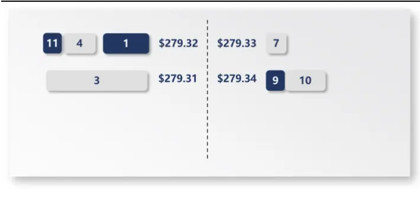
资料来源：海通证券研究所整理

通过这个例子，我们可以看到增量行情相比快照行情最突出的两大优点。

第一， 市场的任何一次变化，都能为所有人知晓。快照行情只展示了市场是什么样的，增量行情则揭示了市场是怎么变成这样的。包括：每个订单是在什么时间到达市场的；它是在当前价格形成后多久到达的；它到达时的市场状态是怎样的；它自己的量多有大；最终这个订单有没有被执行或取消。每个投资者都将因为这些更为丰富的信息而收益，不仅仅是高频交易商。

第二， 大幅减少了每次信息传输占用的字节数，提升了处理速度。例如，图 11 中时间点 的增量行情——“取消 ”可能只需占用 个字节，然而，接收并存储委托快照的资源消耗可能是前者的几百倍，更遑论其中的时间成本对高频交易商的影响。

高频交易商又是如何从中获利的呢？如果说，上市和交易业务的分离催生了做市这一经典的高频策略，那么，增量行情则成为了趋势策略生长并壮大的土壤。通过增量行情，我们得以知晓每个证券在任一时刻的买卖力量对比，并从中提取交易信号。

不同的订单包含的信息有很大差别。一般说来，基本面交易员或公募基金被认为是有信息优势的一方，因此他们的订单更有可能对市场产生较大的推动力。而高频交易商并不会进行较为长期的预判（很少持仓过夜），故他们的订单包含的信息量较少，对市场方向的影响也不会太大。由此可见，识别和区分各种订单，能让我们更加精确地把握当前市场真实的买卖意愿。而增量行情由于囊括了一个订单的所有信息，在这个方面有着天然的优势。

举例来说，我们通过研究历史行情后发现，公募基金更喜欢在大交易所，如纽交所、纳斯达克交易所上下单。他们的订单在委托队列中的位臵通常不会靠前（高频交易商的做市订单更快），单个订单的委托量相对较大，可能以某种特定的规律达到交易所（采用TWAP 或 VWAP等算法）。而高频交易商的订单特征则恰好相反，订单的委托量小，但常常在市场价格刚刚形成的时候，就能到达。

基于这些假设，我们就可以在接收到每一条增量行情后，给当前订单簿中的每个委托单重新赋权。例如，对那些被我们判定为是公募基金发出的订单给予更高的权重，因为它们包含的信息更多；降低那些疑似高频交易商发出的订单的权重，甚至可以直接抹除，因为它们几乎不包含增量信息。通过重新构建订单簿，一些原本被掩盖的交易信号就有可能显现出来。

例如，在原先的订单簿中，买一和卖一的委托量可能十分接近，很难从中得到双方的力量对比。但仔细观察后，发现卖一队列充斥着大量委托量很小的订单。于是，我们推断，这部分订单皆由高频交易商发出，可以将其忽略。而买一队列的前 5位虽也存在类似情形，但剩余的大部分订单均来自纳斯达克交易所，且单个委托量较大。因此，它们大概率属于公募基金，应当赋予更高的权重。经过这样的调整，我们重构了买卖的力量，并发现了一个较强的买入信号，适合主动跟随。

这个例子虽然有些理想化，但却简明地展示了如何基于增量行情构建高频趋势策略。实际上，最终的交易信号的生成，既可以结合多个角度，如订单完全执行的耗时，或前五档委托的分析。也可以通过一系列子信号的平滑，得到更加准确的判断。至于预测周期的长短，则并无定式。从几微妙到几十分钟，均不鲜见，依赖的是对信号的研究结果。这种形态的高频交易，是美国市场上除做市外，另一类大行其道的策略。

## 3. 高频交易的技术基础

虽说策略是高频交易的核心，但高频交易之所以被称为高频交易，速度才是其根本和基础。对于做市策略，如果我们的速度足够快，总能把订单放在委托队列的第一位，这其中的获利空间将不可估量；对于趋势策略，如果我们强大到能迅速处理每一条增量行情，并及时生成交易信号，那就可以抓住更多的趋势性机会。因此，“赢者通吃（winner-take-all）”的场面在高频交易的世界中时有发生。可以说，我们对交易系统所做的每一个优化，不论是硬件层面还是软件层面，最终目的都是为了将速度发挥到极致。从我们的经验来看，当前有关高频交易的前沿技术大体包含了下图所示的六个方面。

图13 高频交易系统的优化技术
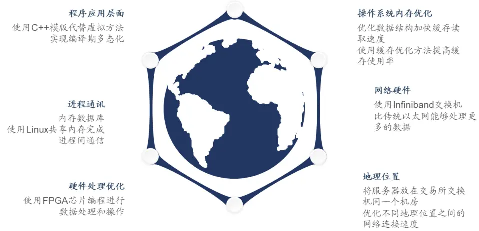
资料来源：海通证券研究所整理

## 程序应用

高频交易系统多以 C++为开发语言。在普通的 C++程序中，常以虚函数实现多态化。但是，由于高频交易系统对运行速度有着极致的追求，实现多态化就需要借助模板函数。这是因为在模板函数下，我们可以通过内联函数进行深度优化。所谓内联函数，就是在编译时将函数体嵌入每一个调用处。虽然扩大了编译程序所占用的空间，但却降低了函数出入“栈”的调用时间，实际上是一种以空间换时间的方式。而虚函数是不可优化和内联的，所以，运用模板函数可以获得高于虚函数十倍以上的运行效率。

## 操作系统

以高频交易对速度的要求，CPU 从内存中读取数据所花费的时间实在“太长”了。当数据请求量较大时，这种缺点更是会成倍地放大。常用的硬件解决方案是在 CPU 中设臵多级高速缓存，并把一些需要反复使用的数据存取其中，尽可能地减少 CPU 和内存的频繁交互。由于 从缓存中读取数据的速度要比内存快上几十倍，因此整个交易系统的运行效率也随之大大提升。

## 进程通讯

一般情况下，交易数据的存储是通过底层数据库（如磁盘）完成的。但高频交易商为了进一步提高读写速度，常常会将数据直接存放在内存中。相比传统的数据库技术，内存数据库需要全新的管理系统，并结合缓存的重新设计，才能让 CPU 更有效的运行。

一个完整的交易系统至少需要包括行情接收、信号生成、下单交易这三项基本功能。虽然在一个进程里运行这三个线程的架构可以节约资源，但任何一个环节出错都会导致整个系统的崩溃。所以，我们一般不会把三个关联如此紧密的线程放入同一个进程，而是让它们分布在不同的进程中。而且，高频交易涉及多个市场，单进程多线程的架构也无法满足实际需求。于是，使用多进程成为了必然的选择。

然而，Linux 系统进程间的切换是需要消耗时间的，这势必会减缓交易系统的速度。为了弥补这一缺陷，我们可以在以下两个方面进行优化。首先，由于 Linux 系统允许不同进程共享内存上的信息，因此，我们会尽可能将更多的进程映射到同一个内存上，避免数据传输导致的延迟。其次，在执行多个进程的切换时，我们也会最大程度地保证它们之间良好的通信状态，力求以最高的精度完成。通过这些技术手段，我们可以大幅缩小多进程系统和单进程多线程系统之间在运行速度上的差距。

## 网络硬件

当前主流的高频交易商在进行服务端的数据传输时，使用的都是“InfiniBand”交换机。由于主机总线的限制，传统的以太网或光纤要达到双向 2Gb/s的速度都很困难，而“InfiniBand”交换机可达每端口 2.5Gb/s 至 10Gb/s。它和通道适配器互相协作，对接支持该项技术的各大交易所机房的 Linux 系统，为高频交易搭建了一条“私人高速公路”。

## 硬件优化

为了进一步提升高频交易系统的速度，我们会把一些比较简单的功能植入 FPGA（Field-Programmable Gate Array）芯片。当数据达到网卡后，直接在硬件层面处理，而不需要经过一个“从操作系统到 CPU 再返回”的复杂过程。这两种方式的差别，可通过以下两幅示意图说明。

图14 CPU 处理流程
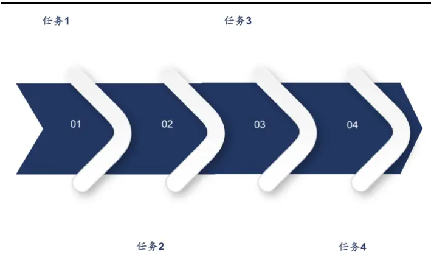
资料来源：海通证券研究所整理

图15 FPGA 并行运算
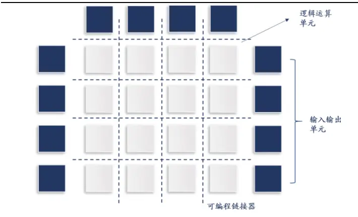
资料来源：海通证券研究所整理

传统的 CPU 运算是一个流水线过程，从任务 1 到任务 4 依次运行，而 FPGA 并行运算的本质则类似于显卡的工作原理。为了达到更好的成像效果，显卡在设计和发展的过程中，都是以块状结构为单位同时计算。FPGA 在此基础上进行优化，通过建立多个输入、输出单元，实现多任务并行处理，大幅提升了整个交易系统的运行效率。当前美国一些以速度见长的高频交易商，如 Virtu，都已经把很多策略直接写在了 FPGA上面。

不过，FPGA也存在一些缺点。首先，它毕竟不是 CPU，无法运行太过复杂的策略。其次，它和内存之间的交互较为复杂，耗时也更长。所以，FPGA 上的策略大多是一些计算简单、规则明确的交易信号。

## 地理位臵

将交易系统的服务器放在交易所的交换机所在的机房，早已是稀松平常。如何克服各交易所地理位臵之间的距离，缩短两两之间的数据传输时间，各大高频交易商各显神通，不惜花重金打造这样一条高速走廊。

曾经有一个叫 Spread Network 的公司，花了 3 亿美金在芝加哥和纽约之间挖了一条私有电缆，并向外界出租。虽然每月的租金高达数百万美元，但华尔街的高频交易商们依然趋之若鹜。原因很简单，它可以将原来 16 毫秒的传输时间缩短至 13毫秒。可别小看了这貌似微不足道的提升，在芝加哥和纽约的这条线路上不仅有着全美最大的期现套利交易，也承担着期货引导现货的重要功能。对于高频交易商而言，相差 3 毫秒可能就是云泥之别。

## 4. 总结与讨论——高频交易的原理

高频交易的理论基础是统计学中的大数法则。对于每一笔交易，我们希望有超过50%的胜率，但如何将其转化为回报呢？我们的选择是增加交易的次数。因为只有当样本量足够大时，样本均值才会和总体均值无限接近。

然而，交易次数一旦增加，成本也会随之提高。所以，上文介绍的方方面面，不论是策略的设计，还是软硬件的优化，目的都是为了降低交易成本。只有控制好了成本，我们才能放心地去提高交易的频率，从而获得更加稳定的回报。

最后，以公募基金经常会提的一个问题作为结尾，“我们做交易都要付钱，你们看起来还能通过交易赚钱，这也太神奇了吧？”

## 5. Q&A

## Q：美国高频交易的现状如何，真正能实现盈利的公司多吗？

A：高频交易实际上是一个零和博弈，每个人都想从交易对手的口袋中赚钱，所以整个领域的生存法则是非常残酷的。过去 3 年，有很多高频交易商倒闭。一方面是因为“军备竞赛”白热化，部分公司无法承担其中的成本。另一方面，那些把速度优化到极致的公司，永远能在每一次市场变化时，做到快人一步。自然，剩下的公司只能一直处于弱势地位。

当前业界知名且业绩优异的高频交易公司大约有十几家。有些以速度见长，比如前文提到的 Virtu；有些在基于订单簿的信号研究上非常突出，比如 Citadel、Two Sigma。据了解，Citadel80%的交易都是以拿单（消耗市场流动性）的方式完成的，这就说明他们有着非常强大的趋势预测能力。

Q：在美国，大家对高频交易的态度是什么样的？会不会因为高频交易有可能赚的是公募基金的钱，这些钱又来自老百姓的养老金，而对它进行限制？

A：对于这个问题，美国也一直存在着争论。从好的方面来讲，有了高频交易后，证券市场总体的流动性还是提升了。但监管机构也担忧，高频交易商每年从市场中赚取这么多收益，到底谁在亏钱，会不会因此动摇投资者对整个美国证券市场的信心？

不过，要出台相关法律对高频交易进行限制，恐怕也很难做到。因为这完全是一种市场行为，不论是交易所还是 ETF 提供商，都希望提升交易的活跃度。高频交易在这方面有着天然的优势。

## Q：美国市场可以裸卖空吗，对卖空数量是否有限制，做空的具体流程是怎样的？

A：在美国市场上做空，几乎是完全没有限制的。每天早上，合作的券商会给我们发送一张清单，上面列示了当天可以做空的股票及其数量。一般情况下，做空这些股票不需要任何条件，但不能超出总数。

有时，如果我们需要某些特定的证券，也会主动找到券商，让他们寻找券源。在一天的交易中，这些信息都是实时更新的。比如，当券商告知我们已找到目标证券，那下一个时刻，我们就可以做空了。

## Q：高频交易一般会持仓过夜吗？

A：不能一概而论，还是要看策略的性质。如果是做市策略，一般不会持仓过夜。因为我们在执行策略时，完全不会考虑基本面。所以，隔夜的风险是很大的，我们不愿意承担。而趋势策略，由于包含了预测的成分，是有可能持有一定隔夜头寸的。

## Q：高频交易的资金容量有上限吗？

A：很难用传统的管理规模去度量高频交易的资金容量，因为我们在日内会以十几倍的杠杆率融资。业内一般习惯用盈利的具体金额评价一个高频交易商的“规模”。

高频交易萌芽的时候，被普遍认为是小打小闹，很难成为一类主流的投资方式。但它的发展速度极其惊人，每一年都刷新着人们对其“规模”的认知。去年，Citadel 的盈利再次攀上高峰，达到了 40 亿美元。

## Q：现在美国的高频交易商有哪些新的变化和发展？

A：一个普遍的趋势是，成立对冲基金。

现在全球的 asset owner（资金方）出于组合多样化的考虑，都会将对冲基金作为一个重要的资产类别进行配臵。而高频交易公司有非常强大的执行能力和海量的数据储备，再招募一个投研团队后，就可以直接转向统计套利等对冲基金策略，正好契合前者的需求。

## 6. 风险提示

专家的实际经验并不构成投资建议。美国证券市场的交易机制和国内不同，相关策略仅供参考，不能直接应用。

（感谢专家授权发表培训内容，感谢实习生汪佳伦对录音的整理，感谢实习生朱曈彤对本文的重要贡献。）

## 信息披露

分析师声明

[Tab冯佳睿le yst金融工程s] 研究团队

周一洋金融工程研究团队

本人具有中国证券业协会授予的证券投资咨询执业资格，以勤勉的职业态度，独立、客观地出具本报告。本报告所采用的数据和信息均来自市场公开信息，本人不保证该等信息的准确性或完整性。分析逻辑基于作者的职业理解，清晰准确地反映了作者的研究观点，结论不受任何第三方的授意或影响，特此声明。

## 法律声明

本报告仅供海通证券股份有限公司（以下简称 本公司 ）的客户使用。本公司不会因接收人收到本报告而视其为客户。在任何情况下，本报告中的信息或所表述的意见并不构成对任何人的投资建议。在任何情况下，本公司不对任何人因使用本报告中的任何内容所引致的任何损失负任何责任。

本报告所载的资料、意见及推测仅反映本公司于发布本报告当日的判断，本报告所指的证券或投资标的的价格、价值及投资收入可能会波动。在不同时期，本公司可发出与本报告所载资料、意见及推测不一致的报告。

市场有风险，投资需谨慎。本报告所载的信息、材料及结论只提供特定客户作参考，不构成投资建议，也没有考虑到个别客户特殊的投资目标、财务状况或需要。客户应考虑本报告中的任何意见或建议是否符合其特定状况。在法律许可的情况下，海通证券及其所属关联机构可能会持有报告中提到的公司所发行的证券并进行交易，还可能为这些公司提供投资银行服务或其他服务。

本报告仅向特定客户传送，未经海通证券研究所书面授权，本研究报告的任何部分均不得以任何方式制作任何形式的拷贝、复印件或复制品，或再次分发给任何其他人，或以任何侵犯本公司版权的其他方式使用。所有本报告中使用的商标、服务标记及标记均为本公司的商标、服务标记及标记。如欲引用或转载本文内容，务必联络海通证券研究所并获得许可，并需注明出处为海通证券研究所，且不得对本文进行有悖原意的引用和删改。

根据中国证监会核发的经营证券业务许可，海通证券股份有限公司的经营范围包括证券投资咨询业务。

## 海[Table_PeopleI 通证券股份有限公司研究所nfo]

路 颖所长

(021)23219403 luying@htsec.com

高道德 副所长(021)63411586 gaodd@htsec.com

姜 超副所长

(021)23212042 jc9001@htsec.com

| 副所长 (021)23219404 dengyong@htsec.com | 荀玉根 副所长 | 涂力磊 所长助理 (021)23219747 tll5535@htsec.com |
| --- | --- | --- |
|  | (021)23219658 xyg6052@htsec.com |  |

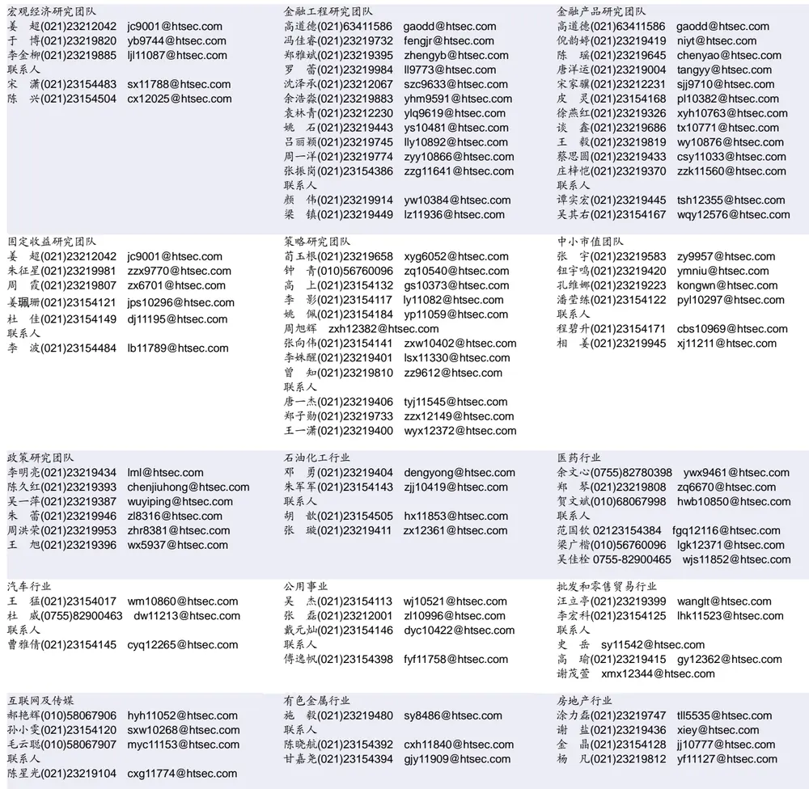

| 电子行业 |  | 煤炭行业 | 电力设备及新能源行业 |  |
| --- | --- | --- | --- | --- |
|  | 陈 平(021)23219646 cp9808@htsec.com | 李 淼(010)58067998 Im10779@htsec.com | 张一弛(021)23219402 zyc9637@htsec.com |  |
|  | 尹 苓(021)23154119 yl11569@htsec.com | 戴元灿(021)23154146 dyc10422@htsec.com | 房 青(021)23219692 fangq@htsec.com |  |
|  | 谢 磊(021)23212214 xl10881@htsec.com | 吴 杰(021)23154113 wj10521@htsec.com | 曾 彪(021)23154148 zb10242@htsec.com |  |
| 联系人 | 石 坚(010)58067942 sj11855@htsec.com | 联系人 | 徐柏乔(021)23219171 xbq6583@htsec.com |  |
|  |  | 王 涛(021)23219760 wt12363@htsec.com | 联系人 | 陈佳彬(021)23154513 cjb11782@htsec.com |

| 基础化工行业 | 计算机行业 | 通信行业 |
| --- | --- | --- |
| 刘 威(0755)82764281 Iw10053@htsec.com | 郑宏达(021)23219392 zhd10834@htsec.com | 朱劲松(010)50949926 zjs10213@htsec.com |
| 刘海荣(021)23154130 Ihr10342@htsec.com | 杨 林(021)23154174 yl11036@htsec.com | 余伟民(010)50949926 ywm11574@htsec.com |
| 张翠翠(021)23214397 zcc11726@htsec.com | 鲁 立(021)23154138 I11383@htsec.com | 张 弋 01050949962 zy12258@htsec.com |
| 孙维容(021)23219431 swr12178@htsec.com | 于成龙 ycl12224@htsec.com | 张峥青(021)23219383 zzq11650@htsec.com |
| 联系人 | 黄竞晶(021)23154131 hjj10361@htsec.com |  |
| 李 智(021)23219392 lz11785@htsec.com | 洪 琳(021)23154137 hl11570@htsec.com |  |

| 非银行金融行业 |  | 交通运输行业 |  | 纺织服装行业 |  |
| --- | --- | --- | --- | --- | --- |
|  | 孙 婷(010)50949926 st9998@htsec.com |  | 虞 楠(021)23219382 yun@htsec.com | 梁 希(021)23219407 lx11040@htsec.com |  |
|  | 何 婷(021)23219634 ht10515@htsec.com |  | 罗月江（010）56760091 lyj12399@htsec.com | 联系人 |  |
| 联系人 |  |  | 联系人 | 盛 开(021)23154510 | sk11787@htsec.com |
| 李芳洲(021)23154127 Ifz11585@htsec.com |  |  | 李 丹(021)23154401 Id11766@htsec.com | 刘 溢(021)23219748 | ly12337@htsec.com |

| 建筑建材行业 | 机械行业 | 钢铁行业 |  |
| --- | --- | --- | --- |
| 冯晨阳(021)23212081 fcy10886@htsec.com | 余炜超(021)23219816 swc11480@htsec.com | 刘彦奇(021)23219391 liuyq@htsec.com |  |
| 潘莹练(021)23154122 pyl10297@htsec.com | 耿 耘(021)23219814 gy10234@htsec.com | 刘 璇(0755)82900465 lx11212@htsec.com |  |
| 联系人 申 浩(021)23154114 sh12219@htsec.com | 杨 震(021)23154124 yz10334@htsec.com 沈伟杰(021)23219963 swj11496@htsec.com | 联系人 | 周慧琳(021)23154399 zhl11756@htsec.com |
|  | 周 丹 zd12213@htsec.com |  |  |

| 建筑工程行业 |  | 农林牧渔行业 | 食品饮料行业 |  |
| --- | --- | --- | --- | --- |
| 杜市伟(0755)82945368 dsw11227@htsec.com |  | 丁 频(021)23219405 dingpin@htsec.com |  | 闻宏伟(010)58067941 whw9587@htsec.com |
| 张欣劫 zxj12156@htsec.com |  | 陈雪丽(021)23219164 cxl9730@htsec.com |  | 成 珊(021)23212207 cs9703@htsec.com |
| 李富华(021)23154134 Ifh12225@htsec.com |  | 陈 阳(021)23212041 cy10867@htsec.com |  | 唐 宇(021)23219389 ty11049@htsec.com |
|  | 联系人 孟亚琦 myg12354@htsec.com |  |  |  |

| 军工行业 |  | 银行行业 | 社会服务行业 |
| --- | --- | --- | --- |
|  | 蒋 俊(021)23154170 jj11200@htsec.com | 孙 婷(010)50949926 st9998@htsec.com | 汪立亭(021)23219399 wanglt@htsec.com |
|  | 刘 磊(010)50949922 II11322@htsec.com | 解巍巍 xww12276@htsec.com | 陈扬扬(021)23219671 cyy10636@htsec.com |
| 张恒晅 zhx10170@htsec.com |  | 林加力(021)23214395 ljl12245@htsec.com | 许樱之 xyz11630@htsec.com |
| 联系人 谭敏沂(0755)82900489 tmy10908@htsec.com |  |  |  |
| 张宇轩(021)23154172 zyx11631@htsec.com |  |  |  |

| 家电行业 | 造纸轻工行业 |
| --- | --- |
| 陈子仪(021)23219244 chenzy@htsec.com | 衣桢永(021)23212208 yzy12003@htsec.com |
| 李 阳(021)23154382 ly11194@htsec.com | 赵 洋(021)23154126 zy10340@htsec.com |
| 朱默辰(021)23154383 zmc11316@htsec.com |  |
| 联系人 |  |
| 刘 璐(021)23214390 II11838@htsec.com |  |

## 研究所销售团队

深广地区销售团队
蔡铁清(0755)82775962 ctq5979@htsec.com
伏财勇(0755)23607963 fcy7498@htsec.com
辜丽娟(0755)83253022 gulj@htsec.com
刘晶晶(0755)83255933 liujj4900@htsec.com
王雅清(0755)83254133 wyq10541@htsec.com
饶 伟(0755)82775282 rw10588@htsec.com
欧阳梦楚(0755)23617160
oymc11039@htsec.com
巩柏含 gbh11537@htsec.com
上海地区销售团队
胡雪梅(021)23219385 huxm@htsec.com
朱 健(021)23219592 zhuj@htsec.com
季唯佳(021)23219384 jiwj@htsec.com
黄 毓(021)23219410 huangyu@htsec.com
漆冠男(021)23219281 qgn10768@htsec.com
胡宇欣(021)23154192 hyx10493@htsec.com
黄 诚(021)23219397 hc10482@htsec.com
毛文英(021)23219373 mwy10474@htsec.com
马晓男 mxn11376@htsec.com
杨祎昕(021)23212268 yyx10310@htsec.com
张思宇 zsy11797@htsec.com
慈晓聪(021)23219989 cxc11643@htsec.com
王朝领 wcl11854@htsec.com
邵亚杰 23214650 syj12493@htsec.com
李 寅 021-23219691 ly12488@htsec.com北京地区销售团队
殷怡琦(010)58067988 yyq9989@htsec.com郭 楠 010-5806 7936 gn12384@htsec.com张丽萱(010)58067931 zlx11191@htsec.com杨羽莎(010)58067977 yys10962@htsec.com杜 飞 df12021@htsec.com
张 杨(021)23219442 zy9937@htsec.com何 嘉(010)58067929 hj12311@htsec.com李 婕 lj12330@htsec.com
欧阳亚群 oyyq12331@htsec.com

海通证券股份有限公司研究所

地址：上海市黄浦区广东路 689号海通证券大厦 9楼

电话：（021）23219000

传真：（021）23219392

网址：www.htsec.com