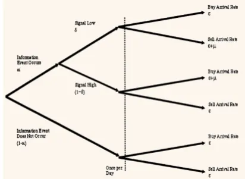
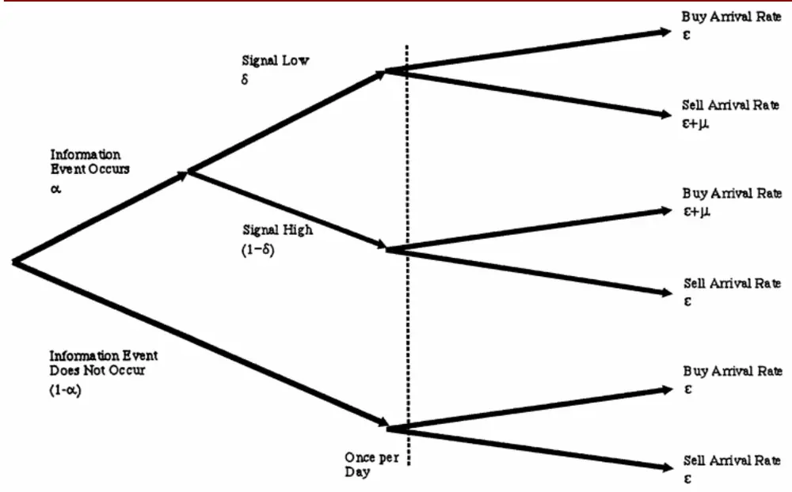
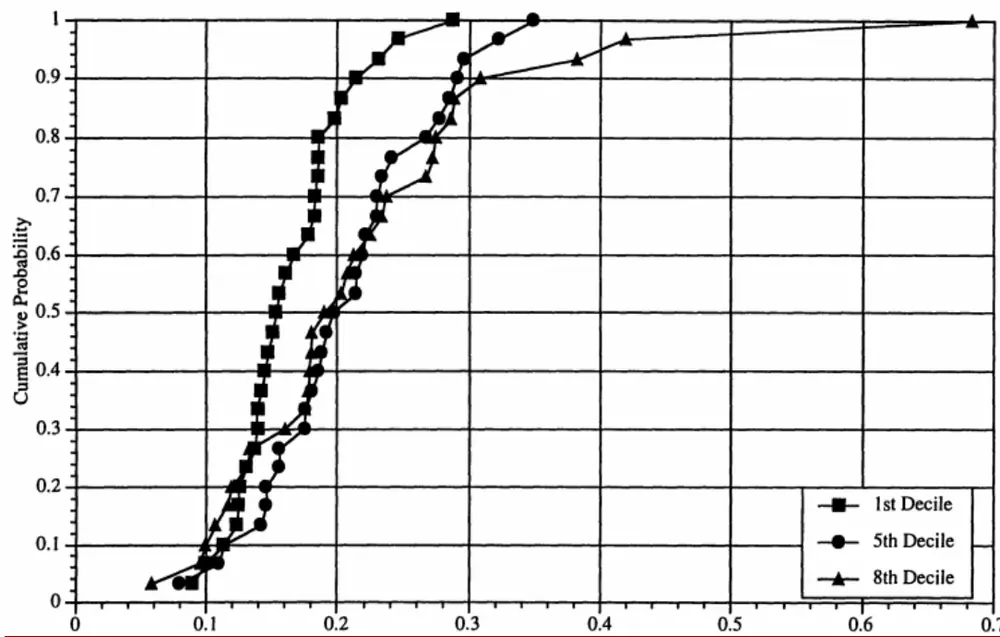
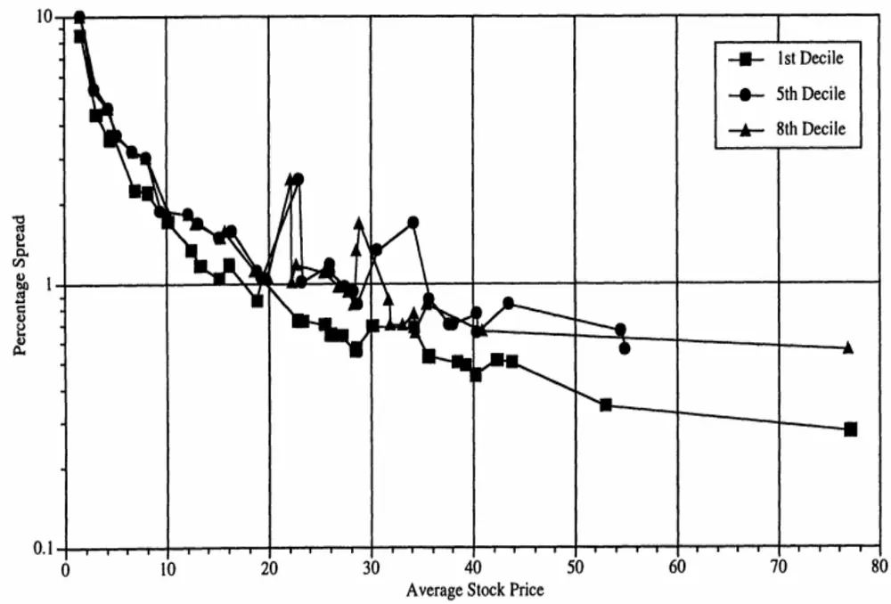

# 高频数据中的知情交易

专题报告

2019 年10 月29 日

## 交易过程树形图

资料来源：《Liquidity, information,and infrequently traded stocks》、招商证券定量组整理

## “琢璞”系列报告之二

高频数据该如何使用？如何从订单数据中挖掘知情交易者的踪迹从而获取收益？对于刚接触高频数据的研究者来说这是可能面临的问题。本期我们推荐《Liquidity, information, and infrequently traded stocks》，这是一篇有点“上了年纪”的论文，但是却是几位微观市场结构领域大师联袂合著的 PIN（时间订单流信息）研究方法的典范之作。或许能给刚刚涉及该领域的投资者一些启发。

- 高频数据，尤其是高频订单数据包含了很多可以挖掘的信息。若有些投资者刚刚接触高频数据（Tick数据或者是高频订单数据），也许会无从下手，而这篇文章或许可以给刚刚接触高频数据研究的投资者一点启发。《Liquidity, information, and infrequently traded stocks》是有多位微观市场结构领域大师合著的论文，尽管文章假设的场景和国内的 A 股市场有差异，但是其对于知情信息出现概率的模型构建以及后续推断的严密逻辑可供国内投资者参考。

## 相关报告

《“琢璞”系列报告之一：行业动量源于因子动量？》2019-10

- 原文的主旨内容研究的是知情交易中的差异是否可以解释交易活跃的与交易不活跃的股票之间的价差差异。作者估算了纽约证券交易所(NYSE)上市股票样本的知情交易风险，并使用交易数据中的信息来确定新信息出现的频率、新信息出现时的交易结构和不同成交量的股票的市场深度。原文最重要的实证结果是：对于成交量高的股票，知情交易的概率较低。通过回归，证明了知情交易之于股票价差的经济意义。

任瞳

86-755-83081468

rentong@cmschina.com.cn

S1090519080004

崔浩瀚

86-21-68407276

cuihaohan@cmschina.com.cn

S1090519070004

敬请阅读末页的重要说明

## 一、引言

高频数据，尤其是高频订单数据包含了很多可以挖掘的信息。若有些投资者刚刚接触高频数据（tick 数据或者是高频订单数据），也许会无从下手。而这篇文章或许可以给刚刚接触高频数据研究的投资者一点启发。

高频研究领域在数据处理方面经历了从 PIN（时间订单流）到 VPIN（成交量订单流）的发展。本文的作者 Easley，Kiefer，O'hara M 等都是微观市场结构领域的大师，这篇《Liquidity, information, and infrequently traded stocks》是 PIN 数据处理领域的典范之作，后续有大量的的高频理论和高频实证文章都是围绕 PIN 展开。

尽管文中所假设的市场背景是纽交所的做市商市场，与 A股市场不太一致，但是文中对于知情消息概率的处理以及一系列严密的逻辑推理都可以为投资者所借鉴。

## 二、文章主要内容

## 文章背景

虽然证券交易所中的成交量很高，但是许多（即使不是大多数）上市股票并不经常交易。伦敦证券交易所中，50％上市股票的成交量仅占总成交量的 1.5％，超过 1000 只股票平均每天少于一笔交易；纽约证券交易所(NYSE)中，个股通常一连几天甚至几周没有交易，伦敦的一只股票甚至无人问津长达十一年之久。这种交易不活跃的股票的一个特点是买卖价差很大：在伦敦，最活跃的“α 股”的平均价差为1％，而最不活跃的“δ股”的平均价差为 11.8％；纽交所中，成交量较低的股票的价差与股价的比例比交易频繁的股票高达 50%。

对于这种巨大价差存在几种推测性解释。第一种解释是存量/流动性效应：如果一只股票交易不频繁，那么其指定做市商(specialist)的持股量可能长期不平衡。流动性的缺乏可能导致风险厌恶的做市商设定更高的价差来补偿风险敞口。第二种解释是做市商的市场地位：对于许多不活跃的股票，只有单一的做市商提供流动性，几乎没有交易者发布限价订单来竞争。这种垄断地位允许做市商设定比在竞争环境中更大的买卖价差。第三个解释则关于私有信息：对于交易不频繁的股票，其活跃的交易日散布在不活跃的交易日之间，订单流的波动率往往更高。如果交易者只在掌握私有信息时才交易股票，做市商将面临巨大的损失。因此，由于流动性较差的股票具有更高的知情交易风险，做市商自然会设置更高的价差。

不仅是学术圈关注高价差的原因，如何对非活跃股票的交易建模已经得到了广泛的讨论。
有建议提出将活跃度较低的股票转入另类清算，这在一些市场中引起争议（并得到应用）。

例如，在伦敦，活跃度较低的股票交易困难，因此创建了 SEATS 系统。在该系统中，做市商为一般用于除最活跃股票以外的交易的基于屏幕的系统提供了替代方案。在巴黎，欠活跃股票最近开始通过上下午的集合竞价交易，而活跃度较低的股票则通过集合竞价交易。在纽约证券交易所，交易不活跃的股票通常被做市商纳入股票组合，以便能够被活跃股所弥补。

然而，所有这些交易制度的效果都令人怀疑，而大多困惑源于人们对活跃股与非活跃股

交易的不同性质缺乏了解。

本文研究了这种差异的一个方面，即活跃股与非活跃股之间的知情交易风险差异。作者估算了基于信息对纽约证券交易所(NYSE)上市股票样本进行交易的风险。其中，使用交易数据中的信息来估算知情交易的可能性，可以确定知情交易的概率和构成是否随成交量的不同而不同，也就是说，既可以确定新信息（或信息事件）发生的频率，又可以确定订单流中有多大一部分来自知情交易者。采用这种估计方法，还可以通过比较不同成交量下噪声交易的“正常”水平，来评估不同成交量的股票的市场深度。

本文最重要的实证结果是：成交量高的股票，知情交易的概率较低。高成交量的股票具有更高的信息事件发生概率和知情交易者市场到达率（交易强度），而这些会被更高的非知情交易者到达率所抵消。欠活跃的股票面临更大的知情交易风险，因此买卖价差也更大。此外，虽然成交量高的股票与成交量居中的股票表现不同，但成交量低的股票与成交量居中的股票有许多相似之处。特别是基于交易数据的估计结果显示，二者发生知情交易的概率没有显著差异。两种股票的价差在统计上没有显着差异，证实了这一预测。使用回归结果，作者还证明了知情交易之于股票价差的经济意义。

从技术角度来看，作者采用了一种新的分析金融问题的实证技术来估计连续时间序列交易模型——不是通过搜索价格来获取知情交易的间接证据，而是通过估计做市商的决策来直接测度知情交易影响。直观上看，做市商的定价决策问题以交易数据为输入、价格为输出。作者建立连续时间微观结构模型来提出决策规则，其中做市商对订单流的推断会影响其决策。通过分析订单流中的信息，可以测度对于不同的证券，订单流传递的信息有何不同。这种基于交易数据的分析方法虽然和Hasbrouck(1988; 1991)用于检测预期外交易行为中的信息的向量自回归方法在应用上有所区别，却是后者的补充。

本文的结构如下：第一节建立了连续事件序列交易模型，并推导出用于估计的似然函数；第二节讨论了数据和取样技术；第三节估计了模型参数，并计算样本中每只股票的知情交易概率；第四节通过检验真实的价差行为来测试模型的含义，并就成交量和信息对价差的不同影响给出回归结果；第五节总结了实证结果，并讨论了研究交易机制的政策意义。

## 模型构建

## 交易过程

本节中，对做市商建立混合的离散-连续时间序列交易模型。该模型的标准之处在于：交易是由一群潜在的知情和非知情交易者竞价形成，而价格是由风险中性的、竞争性做市商报价产生。该模型与传统微观结构模型的不同之处在于，它在连续时间框架下将交易者的市场到达率纳入模型。本文旨在凭经验估计模型的参数，这极大地便利了对高成交量股票的估计。

## 模型假设

- 在交易日i=1,…,I内，个人投资者与做市商交易单一风险资产和货币。

- 在任意交易日内，时间是连续的，表示为t ∈ [0,T]。

做市商随时准备以其报出的买入价和卖出价买入或卖出一单位资产。由于做市商是竞争性的并且风险中立，其报价等于以交易时点所获信息为条件的资产的期望价值。

任意交易日开始之前，自然决定了是否发生与资产价值有关的信息事件。信息事件独立分布，发生概率为 。其中，该事件是好消息的概率为 δ，是坏消息的概率为δ。在当天交易结束之后、出现新信息之前，资产的价格等于其完全信息价值。

令随机变量 $(V_{i})_{i=1}^{I}$ 表示交易日 $(\mathsf{i}=1,\ldots,1)$ 结束时的资产价格。这些价格自然是相关的，由于分析中不需要，作者不对相关性做任何具体假设。令V̅表示第 i 个交易日出现好消息时的资产价值，V表示第 i 个交易日出现坏消息时的资产价值，V∗表示第 i 个交易日没有消息出现时的资产价值。假定 $\underline{{V_{i}}}<V_{i}^{*}<\bar{V}_{i}$ 。

交易来自（已看到信号的）知情交易者和非知情交易者。在任意交易日内，非知情买方和卖方的到达率均独立服从期望值为ε的泊松分布，该比率每分钟更新一次。当信息事件发生时，知情交易者也进场交易。假设所有的知情交易者都是风险中性的并且存在竞争。若发现利好信号，使交易者利润最大化的交易策略是买入股票；反之，若发现利空信号，交易者将卖出股票。假设信息一次到达一个交易者，其之后的市场到达率服从期望值为μ的泊松分布。假定所有交易者的交易过程相互独立。

图 1的树形图描述了这一交易过程。在第一个节点，自然决定信息事件是否发生。如果事件发生，自然接着决定它是好消息还是坏消息。虚线左侧的三个节点（没有事件、好消息、坏消息）每天更新一次。已知交易日当天的节点情况，交易者遵循相应的泊松分布进入市场。如果当天发生利好事件，买方和卖方的到达率分别为ε+μ和ε；如果当天出现利空事件，买方和卖方的到达率分别为ε和ε+μ；如果当天没有信息事件发生，仅非知情交易者进场交易，买方和买方的到达率均为ε。

图 1 交易过程树形图

资料来源：《Liquidity, information, and infrequently traded stocks》、招商证券定量组整理

## 交易和价格

每天自然选择树状图三个分支中的一个。做市商知道每个分支的发生概率和各分支下的订单流交易过程，但并不知道自然会选择哪一个分支。假设做市商是“贝叶斯人”，利用交易的到达和交易率来更新他对信息事件发生概率的预期。交易日之间相互独立，因此可以在每个交易日单独分析其预期的变化。令 $\mathsf{P}(\mathsf{t})=(P_{n}(\mathsf{t}),P_{b}(\mathsf{t}),P_{g}(\mathsf{t}))$ 表示做市商在 t时刻对事件“无消息”(n)、“是坏消息”(b)、“是好消息 $\Gamma(\mathbf{{\mathfrak{g}}})$ 的先验概率。因此在 0时刻，他的先验概率为 $\mathrm{P}(0)=(1-\alpha,\alpha\delta,\alpha(1-\delta))$ 。

为了确定t时刻的报价，做市商会根据相关类型订单的到达情况更新其先验条件。例如，t时刻的买入价 b(t)等于资产的期望价值，该期望值取决于t时刻订单到达之前的历史交易过程（由统计量 P(t)表示）和 t 时刻的单位资产出售情况。令 $-S_{t}$ 表示事件“时刻 t 到达1 个卖单”， $\mathsf{B}_{t}$ 表示事件“时刻 t 到达 1 个买单”， $\mathrm{P}(\mathfrak{t}|S_{t})$ 表示做市商以 t 时刻之前的交易历史和 t时刻的卖单到达情况为条件更新的后验概率。

根据贝叶斯规则，如果 t时刻到达一个卖单，做市商在t时刻对“当天没有信息事件发生”的后验概率为：

$$
P_{n}(t|S_{t})=\frac{P_{n}(t)\varepsilon}{\varepsilon+P_{b}(t)\mu}\tag{1}
$$

类似地，“当天出现坏消息“的后验概率为：

$$
P_{b}(t|S_{t})=\frac{P_{b}(t)(\varepsilon+\mu)}{\varepsilon+P_{b}(t)\mu}\tag{2}
$$

“当天出现好消息“的后验概率为：

$$
P_{g}(t|S_{t})=\frac{P_{g}(t)\varepsilon}{\varepsilon+P_{b}(t)\mu}\tag{3}
$$

在任意时刻 t，预期获利为0 的买入价 ${\bf b}({\bf t})$ 是做市商以t时刻之前的交易历史和 $\imath S_{t}$ 为条件对资 $产$ 的期望价值。因此，在第 i个交易日内t时刻的买入价为：

$$
\mathrm{b}(\mathrm{t})=\frac{P_{n}(t)\varepsilon V_{i}^{*}+P_{b}(t)(\varepsilon+\mu)\underline{V_{i}}+P_{g}(t)\varepsilon\overline{V_{i}}}{\varepsilon+P_{b}(t)\mu}\tag{4}
$$

类似得到 t时刻的卖出价：

$$
\mathrm{a}(\mathrm{t})=\frac{P_{n}(t)\varepsilon V_{i}^{*}+P_{b}(t)\varepsilon\underline{V_{i}+P_{g}(t)(\varepsilon+\mu)\overline{V_{i}}}}{\varepsilon+P_{b}(t)\mu}\tag{5}
$$

为了更好地解释报价，将 时刻的买入价与卖出价同 时刻资产的先验期望价值联系起来。以 t时刻之前的交易历史为条件的资产的期望价值为：

$$
\mathrm{E}[V_{i}|\mathsf{t}]=P_{n}(t)V_{i}^{*}+P_{b}(t)\underline{{V_{i}}}+P_{g}(t)\overline{{V_{i}}}\tag{6}
$$

将公式(6)分别代入买入价公式(4)和卖出价公式(5)，有：

$$
\mathbf{b}(\mathbf{t})=\mathbb{E}[V_{i}|\mathbf{t}]-\frac{\mu P_{b}(t)}{\varepsilon+\mu P_{b}(t)}\left(\mathbb{E}[V_{i}|\mathbf{t}]-\underline{{V_{i}}}\right)\tag{7}
$$

且

$$
\mathbf{a}(\mathbf{t})=\operatorname{E}[V_{i}|\mathbf{t}]+{\frac{\mu P_{g}(t)}{\varepsilon+\mu P_{g}(t)}}{\big(}{\overline{{V}}}_{i}-\operatorname{E}[V_{i}|\mathbf{t}]{\big)}.\tag{8}
$$

这些公式表明知情和非知情交易者进场对交易价格的影响显著。如果不存在知情交易者$(\mu=0)$ ，交易将不反映新信息，因此资产的买卖报价均等于其先验期望价值；如果不存在非知情交易者 $(\varepsilon=0)$ ，则在任意时刻 t， $\mathbf{b}(\mathbf{t})=\underline{{V_{i}}},\quad\mathbf{a}(\mathbf{t})=\overline{{V_{i}}}.$ 。在这种价格下，由于没有非知情交易者参与交易，市场实际上关闭了。而通常市场中既有知情交易者又有非知情交易者，因此资产的买入价低于E[V|t]，卖出价则高于 $\mathrm{{:}E[}V_{i}|\mathfrak{t}{]}$ 。做市商通过设置价差来保护自己避免因非知情交易者而遭受损失。

明确地写出价差公式会更容易确定价差的影响因素。令 $\mathbf{\Sigma}(\mathbf{t})=\mathbf{a}(\mathbf{t})-\mathbf{b}(\mathbf{t})$ 表示 t 时刻的价差，计算得：

$$
\Sigma(\mathrm{t})=\frac{\mu P_{g}(t)}{\varepsilon+\mu P_{g}(t)}\left(\overline{{V}}_{i}-\mathbb{E}[V_{i}|\mathrm{t}]\right)+\frac{\mu P_{b}(t)}{\varepsilon+\mu P_{b}(t)}\left(\mathbb{E}[V_{i}|\mathrm{t}]-\underline{{V}}_{i}\right)\tag{9}
$$

t 时刻的价差等于买方是知情交易者的概率与其预期损失的乘积，加上卖方是知情交易者的概率与之预期损失的乘积。t时刻发生知情交易的概率是这些概率的总和，即：

$$
\mathrm{PI}(t)=\frac{\mu(1-P_{n}(t))}{\mu(1-P_{n}(t))+2\varepsilon}\tag{10}
$$

这一概率取决于知情交易和非知情交易的比例，以及做市商对信息事件发生和构成的预期。因此，如果市场中没有新信息 $(P_{n}(t)=1)$ 或者没有人基于私人信息交易 $(\mu=0)$ ，那$\mathrm{PI}(\mathrm{t})=0$ ，不存在买卖价差；如果所有交易都是含有私人信息的交易 $(\varepsilon=0)$ ，那么$\mathrm{PI}(\mathrm{t})=1$ ，价差足够大 $(\overline{{V}}_{i}-\underline{{V}}_{i})$ 以防止任何人利用私人信息获利。

自然情况下，开盘时发生利好事件与利空事件的可能性相等，因此开盘报价的价差形式特别简单：令 $\cdot\delta=1-\delta$ ，有

$$
\Sigma(0)=\frac{\alpha\mu}{\alpha\mu+2\varepsilon}\big[\bar{V}_{i}-\underline{{V_{i}}}\big]\tag{11}
$$

该式的第一项代表当天第一笔交易是知情交易的概率。交易对手方是知情交易者的风险是影响价差大小的关键因素。如果这一概率存在个股差异，那么模型将预测初始价差如何变化，这提供了一种方法来检测知情交易差异对价的影响。

如果能够像做市商一样知道问题的参数 $\boldsymbol{\theta}=(\alpha,\delta,\varepsilon,\mu)$ ，并观察到订单的到达过程，那么就可以计算买入价与卖出价的随机过程，以直接检验新信息对价差的影响。实际上，虽然可以观察到订单的到达过程，却不知道参数，而这些参数可以通过订单流数据估计得到。接下来将介绍这一问题。

## 似然函数

由于无法直接观测到受这些参数影响的任何信息事件或交易的发生，估计参数向量θ =$(\alpha,\delta,\varepsilon,\mu)$ 比仅仅根据独立泊松分布估计市场到达率要复杂得多。参数α和δ确定了三类信息事件（没有消息/好消息/坏消息）的概率，它们都是不可观察的；参数ε和μ分别确定非知情交易者和知情交易者的到达率。虽然可以观察到买卖单的到达，但无法确定背后的交易者是否拥有私人信息。因此，需要建立一个结构化模型来估计这些参数，从可观测变量（买卖单）中提取参数的相关信息。

在模型中，每天的买卖单服从三种泊松分布之一。尽管当天订单服从的具体分布未知，但可以通过数据挖掘得到隐含的信息结构：若发生利好事件，预期当天买单增加；若发生利空事件，则预期卖单增加；若当天没有发生信息事件，则知情交易者不进场，股票的成交量减少。这些比率和概率由结构化模型决定，模型中三种可能分布（即“交易树”

的三个分支，分别代表“没有消息/好消息/坏消息”）的权重反映了它们在数据中出现的概率。下面分析如何建立这种结构化模型。

首先考虑在已知类型的一天中订单到达的可能性，构造似然函数。以利空事件发生日为例：当出现坏消息时，知情交易者与非知情交易者都会卖出资产，卖单到达率为 $(\mu+\varepsilon)$ 而只有非知情交易者会买入资产，买单到达率为ε。模型中的统计数据独立地服从泊松分布。因此，在总时间T 内，在利空事件发生日到达B 个买单和S 个卖单的可能性为：

$$
e^{-\varepsilon T}\frac{(\varepsilon T)^{B}}{B!}e^{-(\mu+\varepsilon)T}\frac{[(\mu+\varepsilon)T]^{S}}{S!}\tag{12}
$$

类似地，在无信息日到达B 个买单和S 个卖单的可能性为：

$$
e^{-\varepsilon T}\frac{(\varepsilon T)^{B}}{B!}e^{-\varepsilon T}\frac{(\varepsilon T)^{S}}{S!}\tag{13}
$$

在利好事件发生日到达B个买单和S 个卖单的可能性为：

$$
e^{-(\mu+\varepsilon)T}\frac{[(\mu+\varepsilon)T]^{B}}{B!}e^{-\varepsilon T}\frac{(\varepsilon T)^{S}}{S!}\tag{14}
$$

从公式(12)、(13)、(14)可以看出，对于给定的时间 T，买卖单的数量(B,S)是充分统计量。因此，要估计交易过程中的买卖单到达率，只需要考虑任意交易日内的买单总数B与卖单总数 S。

以三种类型交易日的发生概率为权数，对公式(12)、(13)、(14)加权平均，计算未知类型交易日内到达 B 个卖单和 S 个卖单的可能性。已知交易日当天无消息、出现利空消息、出现利好消息的概率分别为 $1-\alpha、\alpha\delta、\alpha(1-\delta)$ ，则似然函数为：

$$
\begin{aligned}\mathrm{L}\big((\mathrm{B},&\mathrm{S})\big|\boldsymbol{\theta}\big)=(1-\alpha)*e^{-\varepsilon T}\frac{(\varepsilon T)^B}{B!}e^{-\varepsilon T}\frac{(\varepsilon T)^S}{S!}\\&+\alpha\delta*e^{-\varepsilon T}\frac{(\varepsilon T)^B}{B!}e^{-(\mu+\varepsilon)T}\frac{[(\mu+\varepsilon)T]^S}{S!}\\&+\alpha(1-\delta)*e^{-(\mu+\varepsilon)T}\frac{[(\mu+\varepsilon)T]^B}{B!}e^{-\varepsilon T}\frac{(\varepsilon T)^S}{S!}\end{aligned}\tag{15}
$$

对于任意给定的交易日，信息事件参数α和δ的最大似然估计值是 0或1，表明一天至多发生一次信息事件。而在数天内，这些参数可以根据日内买卖单的数量估计得到。因此，在模型中，使用日内数据估计交易者的选择概率，使用日间数据估计信息事件参数。由于交易日之间相互独立，在 I天内观测到订单量 $\mathbb{M}=(B_{i},S_{i})_{i=1}^{I}$ 的可能性等于每日可能性的乘积：

$$
\mathrm{L}(\mathsf{M}|\boldsymbol{\theta})=\prod_{i=1}^{I}L(\boldsymbol{\theta}|B_{i},S_{i}),\tag{16}
$$

为了从数据集 M 中估计参数向量θ，将公式(16)定义的似然函数最大化，以直接估计对于特定股票，知情交易和非知情交易的比率，以及与该股票紧密相关的信息事件结构。

## 成交量、知情交易和价差

本文的研究目的是确定知情交易的风险差异能否解释价差差异。上述模型能够估计知情交易概率，并预测这些概率如何反过来影响价差。需要检验的假设是“成交量不同的股票之间的价差差异来自知情交易的潜在风险差异”。

使用结构化模型意味着该假设检验包括对模型含义和模型本身的联合检验。联合检验的结构如下：首先，对估计的概率做统计检验，确定它们的差异是否真的来自股票的交易活动，以检验假设 股票间存在知情交易差异 ，并研究知情交易能否解释价差行为。然后，通过检验模型的预测能力，研究估计值是否与知情交易有关。特别要注意的是，参数值是根据交易数据估计的，而价差则来自价格数据。如果基于交易数据的估计值能够准确地预测价差，便证明基本模型具有可行性。之后，将通过价差对知情交易概率估计值的回归，来进一步检验模型。

## 数据

下面开始估计模型，特别是确定个股的知情交易风险。对于样本中的每只股票，都需要估计描述交易过程的参数，并确定这些参数与价差之间的关系。该过程中有两个困难：第一，如果股票交易非常不活跃，可能缺乏足够的数据来准确估计隐含的交易过程；第二，正如模型所表示的那样，价差受交易参数和交易价格波动范围的共同影响，价差与股价水平之间的关系未必是单调的。如果无法就此调整，将会引入分析偏差。作者直接在样本选择标准中解决了这些困难。

## 取样

从纽交所的交易股票中剔除优先股、权证、股票型基金和 ADR 后，进行随机取样。为了解决上述提出的交易频率问题，以 1990年总成交量数据为指标，对所有满足条件的股票进行排序，按成交量从高到低将样本等分为 10组。其中，第1 组的股票最为活跃，成交量随组别序号的增加而迅速减少。为了研究不同成交量的股票差异，并保证有足够的成交量数据用于估计，作者重点关注第 1组、第5 组和第8 组股票的表现。

将股价相同、成交量不同的股票作为对照样本，以排除股价的干扰。根据CRSP（证券价格研究中心）数据库，计算样本中每只股票自 1990 年 10 月1 日至 1990年12 月23日的平均收盘价，以此为指标，对第1 组和第5 组股票进行排序，并将来自不同组别的相邻股票进行配对，共产生 75 对股票。从中随机选择 30 对，接着从第 8 组股票中选择 30只平均收盘价最接近配对价格的股票，得到90只股票样本。

附录中列出了所选股票的平均收盘价与 1990 年总成交量数据（见表A.I.）。第 1/5/8组股票的平均成交量分别为147/13.8/3.7 百万股，成交量随组别序号的增加而减少。不同组股票的交易规模差异显著。此外，每组股票的年化平均收盘价均约为 24 美元，因此无法拒绝假设“样本中3 组股票价格分布的均值和方差相同”。第8 组股票的平均收盘价略低，是因为其中能够匹配1、5 组股票对的高价股数量较少。

## 交易数据

样本中 90 只股票的交易数据来自 ISSM 数据库，时间范围为 1990 年 10 月 1 日至 12月 23 日。先前的研究(Easley、Kiefer 和 O’Hara, 1993)表明，60 天的交易窗口足够合理准确地估计参数，但由于长度有限，无法保证模型的平稳性。

为了计算公式(16)中的似然函数，需要每只样本股每天的买卖单数量，这些数据来自

ISSM数据库。需要注意的是：第一，大型交易有时在一方有多个交易者。当仅有一笔交易到达时，可能被错误报告为多笔交易。为缓和这一问题，作者规定若没有中途修改报价，则把在 5 秒内以相同价格成交的交易视为一笔交易。第二，使用 Lee 和Ready(1990)提出的技术将交易分为买单和卖单：成交价格高于买卖价中间值的属于买单，低于中间值的属于卖单。这种分类的依据是：由买方发起的交易最有可能以卖出价或接近卖出价的价格成交，而卖单则最有可能以买入价或接近买入价的价格执行。该方案对除了以买卖价中间值成交的所有交易进行分类。以中间值成交的交易则采用“交易价格检验法” (tick test)：以高于上笔交易价格成交的属于买单，低于上一交易价格成交的则属于卖单。如果交易中途关闭，且成交价与上笔交易相同，则将其价格与下一个最近的交易进行比较，直到交易被成功分类为止。使用这一程序无疑会出现错误分类，但它是标准的，并且已被证明有效。

## 估计

下面估计结构化模型的参数。交易过程由四个参数决定：α（发生信息事件的概率），δ（信息是坏消息的概率），μ（知情交易者的市场到达率），ε（非知情交易者的市场到达率）。这些参数反过来决定了发生股票知情交易的概率。本文要研究的正是这一概率及其与价差的关系。

## 参数估计

如上所述，作者通过最大化以股票交易数据为条件的似然函数来估计样本中每只股票的交易参数。首先，通过对数变换，将概率参数α和δ限制在(0, 1)、比率参数ε和μ限制在(0, ∞)。然后，采用GQOPT包中的二次爬山算法 GRADX来最大化无限制参数。最后，使用增量方法从转换后参数的渐近分布中计算经济参数估计的标准误差。

附录中列出了样本中每只股票的参数估计值和标准误差（见表 ）。标准误差值表明模型能够被准确估计。整体来看，由于数据集中包括大量交易，到达率变量的估计精度很高；信息参数α和δ的估计标准误略大，但仍然在合理的精度范围内。

表 1列出了按成交量组别估计参数的均值。值得注意的是，各组之间参数估计值的排名一致，表明不同成交量股票的知情交易风险概率存在显著差异。而估计值的波动性表明均值可能掩盖了重要的参数性质。因此，通过检测估计变量的累积分布，可能会得到更真实的结果。

表 1：各组参数估计结果

| Parameter | First Decile | Fifth Decile | Eighth Decile |
| --- | --- | --- | --- |
| Number in Sample | 30 | 30 | 30 |
| μ | 0.131970 | 0.030148 | 0.015696 |
| Mean Median | 0.104864 | 0.027596 | 0.014122 |
| Std. dev. | 0.079314 | 0.013238 | 0.008607 |
| ε Mean | 0.175742 | 0.023970 | 0.009614 |
| Median | 0.136797 | 0.022917 | 0.008925 |
| Std. dev. | 0.141192 | 0.013158 | 0.005093 |
| α |  |  |  |
| Mean | 0.500294 | 0.433952 | 0.356320 |
| Median | 0.477761 | 0.448613 | 0.363841 |
| Std. dev. | 0.141192 |  |  |
| 8 |  | 0.170253 | 0.173540 |
|  | 0.349078 | 0.444393 |  |
| Mean |  |  | 0.501787 |
| Median | 0.360357 | 0.418164 | 0.455418 |
| Std. dev. | 0.227188 | 0.238763 | 0.318183 |
| Prob(Inf) |  |  |  |
| Mean | 0.163919 | 0.207788 | 0.220245 |
| Median | 0.154193 | 0.205858 | 0.196712 |
| Std. dev. | 0.043794 | 0.064794 | 0.121155 |

资料来源：《Liquidity, information, and infrequently traded stocks》、招商证券定量组整理

作者采用非参数检验，特别是 Kruskal-Wallis 检验和 Mann-Whitney 检验（也称Wilcoxon秩和检验）来比较这些分布。Kruskal-Wallis 检验三种总体分布函数是否相同，尤其是其中一种总体分布是否与另两种不同，检验结果如表 2.A 所示；Wilcoxon 检验两个样本的定向关系，即一组样本值是否有高于或低于另一组样本的趋势，检验结果如表 2.B所示。

表 2：非参数检验

| Panel A: Kruskal-Wallis Tests on Parameters |  |  |
| --- | --- | --- |
| Parameter | Test Statistic |  |
| μ | 66.279 |  |
| ε | 69.859 |  |
| α | 10.853 |  |
| δ | 4.236 |  |
| Prob(Inf) | 8.027 |  |
| Critical value for α = 0.05 is 5.991. |  |  |
| Panel B: Mann-Whitney Tests on Parameters |  |  |
| Pairwise Comparisons (n = 30, m = 30) |  |  |
| Parameter | 1 to 5 1 to 8 | 5 to 8 |
| μ | 6.402 6.623 | 4.480 |
| ε | 6.505 6.653 | 5.071 |
| α | 1.390 3.326 | 1.789 |
| δ | -1.508 -1.937 | -0.547 |
| Prob(Inf) | -2.883 -1.952 | 0.192 |

The test statistic is normally distributed and the critical value for α = 0.05 is ±1.6449
资料来源：《Liquidity, information, and infrequently traded stocks》、招商证券定量组整理

首先分析信息事件参数α的估计。如表 1 所示，第 1/5/8 组样本股的α均值分别是0.500/0.434/0.356，表明信息事件的发生概率随股票活跃程度的降低而减小。α的累积分布揭示的结果类似但更为复杂：不同成交量组别股票的α分布不同，其中最活跃股票的α总是高于成交量居中的股票，也通常高于成交量低的股票。

接着确定这些差异的统计性质，尤其是活跃股的 分布是否高于非活跃股：表 中的Kruskal-Wallis 检验结果表明这一差异是显著的：置信水平为 0.05 时，检验统计量10.853 高于临界值 5.991，因此拒绝“三组α分布相同”的假设；Mann-Whitney 检验结果表明，对于成交量低的股票，发生信息事件的概率显著低于成交量高或居中的股票。然而，这一差异在高成交量与中等成交量股票之间并不显著。

模型中的另一个信息参数是“新信息是坏消息”的概率δ。没有理论认为股票出现坏消息的概率因成交量的不同而有所差异，因此这一参数估计简单检测了模型的合理性。如表1 所示，第 1/5/8 组股票的δ估计均值分别为 0.349/0.444/0.505，非常接近；另外，不同组的δ累积分布出现多次交叉，表明这一概率在不同组别之间的差异并不显著。p=0.05时，Kruskal-Wallis 检验统计量 4.236 低于临界值 5.991，证明了这一点。因此，对于成交量不同的股票，信息事件的方向没有显著性差异。

下面分析非知情交易者到达率ε与知情交易者到达率μ。如表 所示，第 组股票的非知情交易者到达率分别为 0.176/0.024/0.010，差异显著。Kruskal-Wallis 检验统计量为 69.9(p=0.05)，拒接了“三组ε分布相同”的假设；Mann-Whitney 检验结果则表明，第1 组的ε分布显著异于第5组和第 8组。另外，第5组和第8组的ε分布也差异显著，说明非知情交易者市场到达率随股票活跃度降低而显著下降。

知情交易者到达率的表现相似：第 1/5/8组中，μ的平均估计值分别为 0.132/0.030/0.016，表明股票越活跃，知情交易者到达率越高。如表2所示，Kruskal-Wallis和Mann-Whitney检验均证明：第1 组股票的μ值显著高于第 5组和第8 组，且第5 组的μ值显著高于第8组。因此，成交量越高的股票，知情交易者到达率越高。

流动性高的股票具有更高的非知情交易者与知情交易者到达率，这与它们的高成交量表现一致，却未必能解释股票间的价差差异。也就是说，如果股票具有更高的知情交易者到达率，其买卖价差可能更高。这一推断忽视了价差与信息间的复杂关系：股票价差与其知情交易风险息息相关，正如模型所示，这种影响取决于信息事件概率与到达率概率之间的相互作用。在估计了参数值以后，下面确定样本股的知情交易概率，并检测这一概率在活跃股与非活跃股之间的差异。

## 知情交易概率

知情交易概率是反映各种交易过程参数的复合变量。在模型中，这一概率的表达式如公式(10)所示。基于做市商最初的预期，有：

$$
\mathrm{PI}={\frac{\alpha\mu}{\alpha\mu+2\varepsilon}}\tag{17}
$$

可见，知情交易概率取决于（知情与非知情）交易者市场到达率和存在新信息的概率。
要确定知情交易对股票价差的影响，这些参数间的相互作用非常重要。

计算样本中每只股票发生知情交易的概率，各组均值如表1所示（个股的估计值见附录表 A.2）。有趣的是，活跃股的知情交易风险最低：第1/5/8组股票发生知情交易的平均概率分别为 0.164/0.208/0.220，表明第 1 组股票的知情交易风险明显低于后两组不太活跃的股票。

各组股票PI的累积分布如图2所示。第1组的PI累积分布曲线虽然与其他两组有交点，但整体位于它们的左侧。Kruskal-Wallis 检验统计量为 8.027，高于临界值 5.991(p=0.05)，拒绝了“三组股票PI分布相同”的假设；采用Wilcoxon 秩和检验进行结对测试，拒绝原假设“第1 组股票的PI值高于第 5组和第8组股票”。检验统计量如表2 所示。

图 2 各组股票知情交易概率的累积分布图

资料来源：《Liquidity, information, and infrequently traded stocks》、招商证券定量组整理

但是，检验结果表示第 5组与第8 组股票的知情交易概率没有显著差异：Mann-Whitney检验统计量(0.1920)明显不显著，说明两组股票具有相同的知情交易风险；图2中，第5 组与第8 组股票的PI累积分布曲线多次交叉，也证明了这一结论。

以上结果有力地证明了信息不对称至少能够部分地解释不同成交量的股票之间的价差差异。样本股中，成交量高的股票知情交易风险较低，而成交量居中和较低的股票知情交易风险基本相同。基于参数估计值，应用该模型生成了两个预测：第一，活跃股的买卖价差低于非活跃股；第二，交易不活跃的股票价差基本相同。因此，第 5 组与第 8组的股票价差没有明显差异。

## 价差与知情交易

下面采用两种方式检验模型预测的经济意义和有效性。首先，通过检验三组共 只股票的实际买卖价差，直接检测模型的预测结果（“信息不对称导致不同成交量股票间存在价差差异”）。而正如引言所属，价差也可能受到股票存量、做市商市场地位等因素的影响。本文的模型并不包含这些因素，因此可以检验股票知情交易风险对价差的整体解释力。这是对模型经济有效性的事实检验。作者通过回归分析来研究估计变量在价差预测方面的表现。

先看样本中股票价差与成交量关系。各组股票的买卖价差与百分比价差数据如表 3所示，第 1/5/8 组股票的价差均值分别为 0.18/0.25/0.27，表明价差均值随股票交易活动的增加而减小。统计检验拒绝了“第1组股票与第5组、第8组股票的价差均值相同”的假设，但是不能拒绝“第5 组与第8 组股票的价差均值相同”。

表 3：各组股票的买卖价差与百分比价差统计

|  | First Decile | Fifth Decile | Eighth Decile |
| --- | --- | --- | --- |
| Number in sample | 30 | 30 | 30 |
| Average spread |  |  |  |
| Mean | 0.1763 | 0.2549 | 0.2708 |
| Median Std. dev. | 0.1717 | 0.2581 | 0.2802 0.0585 |
|  | 0.0243 | 0.0588 |  |
| Average % spread |  |  |  |
| Mean | 1.4140 | 1.9158 | 1.9824 |
| Median | 0.7123 | 1.1446 | 1.1688 |
| Std. dev. | 1.6961 | 1.9379 | 2.0211 |

资料来源：《Liquidity, information, and infrequently traded stocks》、招商证券定量组整理

各组股票的百分比价差-股价关系如图 3 所示，从中可以得到更多的百分比价差分布信息。在所有样本点中，第 组的百分比价差 股价曲线都低于第 组，而第 组曲线通常但并不总是低于第 8 组。然后，采用Wilcoxon 符号秩检验比较配对股票的百分比价差曲线，拒绝了原假设“第1 组股票的百分比价差高于第5 组股票”（p=0.05，检验统计量为 4.741，远高于临界值1.6449）以及“第1 组股票的百分比价差高于第 8组股票（检”验统计量为 4.576），不能拒绝假设“第5 组股票的百分比价差高于第 8组股票”（检验统计量为 1.471）。

图 3 各组股票的平均百分比价差-平均股价关系

资料来源：《Liquidity, information, and infrequently traded stocks》、招商证券定量组整理

这些数据有力地证实了股票价差行为的非对称信息解释，特别是模型的预测“由于知情交易风险较低，第1 组股票的价差将低于第5 组和第8组股票”，以及“由于第5组和第8 组股票的知情交易风险估计相同，它们的买卖价差也应该相同”。“股票价差与流动性非单调相关”是该领域中一个新颖而独特的发现。以上研究结果表明，知情交易风险差异是活跃股与非活跃股价差行为差异的主要解释因素。

目前为止，作者的分析着重于将模型对股票的估计与其价差行为联系起来。这些研究结果在统计上是显著的，并且似乎可以很好地预测实际的价差行为。另外要检验的是估计变量对价差行为的整体解释力。模型估计了每只股票的知情交易概率，如果估计是准确的，那么被估计的参数应当以可预测的方式影响买卖价差。通过回归分析，能够对估计方法的有效性进行简单的事实检验，以确定模型结果的经济意义。

回到公式(11)中的开盘价差，其中好消息与坏消息近似等概率出现，与实证结果一致。因此，第i 个交易日的开盘价差可以表示为：

$$
\Sigma=\big[\overline{{V}}_{i}-\underline{{V}}_{i}\big]\mathrm{PI}\tag{18}
$$

其中，括号内是资产的报价范围，右边是知情交易者参与开盘交易的概率。假设股票的报价范围是股价的线性函数，表示为 V，则开盘价差可以重新表示为：

$$
\Sigma=\beta_{1}\cdot V\cdot\mathrm{PI}\tag{19}
$$

$\beta_{1}$ 是比例系数。从公式(19)可以直接看出，股票的买卖价差正比于发生知情交易的概率。

当然，任何股票的价差都可能受到模型之外的因素影响。例如，如果存在存量效应，那么平均日内美元成交量也会影响价差。作者的模型只考虑了非对称信息，并没有明确预测其他因素的影响。但是，从直觉上看，做市商的存量成本应与交易后股票实际存量与做市商理想存量的距离变化正相关，而与美元成交量负相关。后者是因为股票成交量越大，做市商能够越快地达到其理想的存量水平。

据此修改开盘价差的表达式：

$$
\Sigma=\beta_{0}+\beta_{1}\cdot V\cdot\mathrm{PI}+\beta_{2}\cdot\mathrm{Vol}+\eta\tag{20}
$$

其中，Vol 是平均日内美元成交量，η是误差项， $\beta_{0}$ 是常数。添加常数项 $\beta_{0}$ 是因为模型忽略了除知情交易损失之外的做市商成本：竞争性做市商会让交易者承担其操作的固定成本，因此实际价差会高于模型的预测结果。如果该模型能够准确预测知情交易的发生概率， $\beta_{1}$ 应为正。尽管缺少存量效应模型，但根据上面的分析， $\beta_{2}$ 应为负。

对样本中的 90 只股票进行回归分析。其中，Σ是样本期内(1990/10/1-1990/12/23)每只股票的平均每日开盘价差；V 取自CRSP，代表样本期内每股的平均收盘价；PI是估计的知情交易概率，具体见附录；Vol 是样本期内平均每日美元成交量，等于平均每日成交的股票数量与 V的乘积。

回归结果如表4 第1 列所示。所有估计变量的系数都有预测方向。其中最重要的是，知情交易概率系数在统计上显著为正，说明股票价差随知情交易概率的增大而增大。调整后的 $R^{2}$ 为52.16，F值为49.5，说明该回归部分解释了价差方差，具有显著性。

表 4：回归结果

|  | General Model | Restriction to $\beta_{1}=0$ | Restriction to $\beta_{2}=0$ |
| --- | --- | --- | --- |
| Intercept | 0.2114 | 0.2885 | 0.2034 |
|  | (20.453) | (31.954) | (18.030) |
| V*PI | 0.0193 (9.463) |  | 0.0178 (7.982) |
| Vol | -1.035E-11 | -6.879E-12 |  |
|  | (-4.572) | (−2.175) |  |
| Adj. R² | 0.5216 | 0.0402 | 0.4134 |
| F-Value | 49.518 | 4.730 | 63.720 |

资料来源：《Liquidity, information, and infrequently traded stocks》、招商证券定量组整理

接下来分析回归中每个变量的单独解释力。首先令V* PI的系数 $\beta_{1}$ 为 $0,$ ，单独看成交量在确定价差中的作用，结果如表 4 第 2 列所示。价差对成交量的回归系数如预期为负，但不具有统计意义；此外，这一受约束回归的 $R^{2}$ 仅为 4.02%，说明成交量单独没有太大解释力。然后令成交量系数 $\cdot\beta_{2}$ 为 0，分析信息变量的影响，结果如表 4 第 3 列所示。知情交易概率的系数仍然显著为正，R2为 41.34，F值为 63.7，与模型的结论一致。至少在作者的样本中，知情交易概率比成交量对价差有更好的预测作用。结合前面的分析，说明对于不同成交量的股票，其知情交易差异至少可以部分地解释价差差异。

## 原文结论

本文研究了纽交所样本股中活跃股与非活跃股之间的差异行为。采用一种新的实证技术，通过交易数据来估计每只样本股发生知情交易的概率。结果表明，活跃股的知情交易风险低于非活跃股，且成交量居中与较低的股票之间不存在知情交易风险差异，据此预测它们之间的价差也没有差异。然后，作者使用价格数据来测试模型的预测，检验结果支持预测结果。

作者的研究结果提供了许多有关市场行为的见解。成交量低的股票被发现具有较高的知情交易风险，表明这类股票的高价差不仅仅是做市商市场地位或者所承担的存量风险的结果。欠活跃股票的风险较高，是因为它们更有可能发生知情交易，这与 Amihud 和Mendleson(1986)的发现一致，即股票的平均风险溢价随买卖价差的增加而显著增加。作者推测知情交易风险差异或许能够解释文献中提到的其他异象，并计划在之后进行研究。

研究的一个发现是，私人信息对于交易不活跃的股票更为重要。虽然很少发生有关这类股票的信息事件，但是出现的新信息对交易的影响程度更大。Hasbrouck(1991)采用向量自回归研究了这一影响。他的结论是，由于小市值股票的信息不对称程度更高，异常交易对价格的持续性影响更大。本文则通过直接说明低成交量 小市值股票具有更高的知情交易概率来解释这一发现：在这类股票中，Hasbrouck 发现的价格影响其实是高知情交易风险的结果。

另一个有趣的发现是股票交易构成与流动性之间的关系：虽然高成交量股票倾向于具有（略微）更高的信息事件概率与知情交易者到达率，但这些会被更高的非知情交易者到达率所抵消。这一结果突出了市场深度的关键作用。市场深度通常被定义为非知情交易的规模。从做市商角度来看，欠活跃股票的风险更高，是因为知情交易者参与交易的概率更大。因此，欠活跃股票的问题并不是知情交易者太多，而是非知情交易者太少。

## 三、我们的思考

对于知情交易出现的概率的推断，学术界关注的往往是政策层面的指导意义，而业界则更关注其中可以挖掘的跟踪价值。本文用精巧的模型搭建和严密的逻辑推理，根据高频订单数据来进行知情交易发生的概率。在这篇文章发表之后，后续有大量的研究都是参照本文的研究范式展开，因而本文有很大的参考价值。

尽管如此，本文所使用的是纽交所的样本数据，同时研究的是做市商环境下的交易情形，如何将模型进行改造以适应于A 股市场，还需要投资者进一步研究和创新。

## 参考文献

Easley D, Kiefer N M, O'hara M, et al. Liquidity, information, and infrequently traded stocks[J]. The Journal of Finance, 1996, 51(4): 1405-1436.

## 风险提示

本文内容基于原作者对美国纽交所(NYSE)历史数据进行的实证研究，当模型应用于国内市场或者应用环境与假设环境出现差异的时候，存在模型失效的风险。

## 分析师承诺

负责本研究报告全部或部分内容的每一位证券分析师，在此申明，本报告清晰、准确地反映了分析师本人的研究观点。本人薪酬的任何部分过去不曾与、现在不与，未来也将不会与本报告中的具体推荐或观点直接或间接相关。

任瞳：首席分析师，定量研究团队负责人，管理学硕士，16 年证券研究经验，2010年、2015年、2016、2017年新财富最佳分析师。在量化选股择时、基金研究以及衍生品投资方面均有深入读到的见解。

崔浩瀚：量化分析师，浙江大学经济学硕士,3 年量化策略研究开发经验。研究方向是机器学习在金融领域的应用和多因子选股策略开发。

## 投资评级定义

## 公司短期评级

以报告日起6个月内，公司股价相对同期市场基准（沪深 300 指数）的表现为标准：

强烈推荐：公司股价涨幅超基准指数20%以上

审慎推荐：公司股价涨幅超基准指数5-20%之间

中性：公司股价变动幅度相对基准指数介于±5%之间

回避：公司股价表现弱于基准指数 5%以上

## 公司长期评级

A：公司长期竞争力高于行业平均水平

B：公司长期竞争力与行业平均水平一致

C：公司长期竞争力低于行业平均水平

## 行业投资评级

以报告日起6个月内，行业指数相对于同期市场基准（沪深 300指数）的表现为标准：

推荐：行业基本面向好，行业指数将跑赢基准指数

中性：行业基本面稳定，行业指数跟随基准指数

## 重要声明

本报告由招商证券股份有限公司（以下简称“本公司”）编制。本公司具有中国证监会许可的证券投资咨询业务资格。本报告基于合法取得的信息，但本公司对这些信息的准确性和完整性不作任何保证。本报告所包含的分析基于各种假设，不同假设可能导致分析结果出现重大不同。报告中的内容和意见仅供参考，并不构成对所述证券买卖的出价，在任何情况下，本报告中的信息或所表述的意见并不构成对任何人的投资建议。除法律或规则规定必须承担的责任外，本公司及其雇员不对使用本报告及其内容所引发的任何直接或间接损失负任何责任。本公司或关联机构可能会持有报告中所提到的公司所发行的证券头寸并进行交易，还可能为这些公司提供或争取提供投资银行业务服务。客户应当考虑到本公司可能存在可能影响本报告客观性的利益冲突。

本报告版权归本公司所有。本公司保留所有权利。未经本公司事先书面许可，任何机构和个人均不得以任何形式翻版、复制、引用或转载，否则，本公司将保留随时追究其法律责任的权利。