## [Tab相关研究

Table_ReportInfo]《选股因子系列研究（五十六）——买卖

单数据中的 Alpha》2019.11.07

《中证银行指数及华宝中证银行 投资价值分析》2019.11.06

《基本面量化与另类数据应用的实践》2019.10.28

分析师:冯佳睿

Tel:(021)23219732

Email:fengjr@htsec.com

证书:S0850512080006

分析师:姚石

Tel:(021)23219443

Email:ys10481@htsec.com

证书:S0850517120002

# 高频因子在不同周期和域下的表现及影响因素分析

## 投资要点：

在前期报告中，我们从交易逻辑出发，使用分钟、tick 以及逐笔数据构建了一系列高频因子。在本篇报告中，我们将考察因子在不同周期和域下的表现，以及分析影响因子表现的因素。

高频因子计算方法。我们基于交易逻辑和投资者行为构建了高频偏度、下行波动占比、改进反转、尾盘成交占比、量价相关性、平均单笔流出金额占比、大单推动涨幅、成交委托相关性以及收盘前成交委托相关性等高频因子。因子计算方法相对统一：使用每日日内信息计算得到指标，取指标 N日均值或累计值作为因子值。

月频调仓下的因子表现。在全市场中，绝大多数因子月均多空收益差在 以上， 均值在 以上，其中成交委托相关性因子收益最高。正交后，改进反转和尾盘成交占比因子表现较好。多数因子空头贡献更大，其中平均单笔流出金额占比因子多头收益最高，月均超额 0.64%。沪深 300 成分股中，成交委托相关性因子表现较好。中证 500 成分股中，改进反转和大单推动涨幅因子表现较好。

- 周频调仓下的因子表现。在全市场中，绝大多数因子周均多空收益差在 0.5%以上，rank IC 均值在 5%以上，其中改进反转因子收益最高。正交后，多数因子选股效果明显下降，尾盘成交占比因子正交之后选股效果有所提升，但相对月频调仓，提升幅度较小。多数因子空头贡献更大，其中平均单笔流出金额占比因子多头收益仍然最高，周均超额 0.29%。改进反转和量价相关性因子在沪深 300 和中证 500 成分股中表现较好。

- 复合高频因子。同一级别、同一类别因子之间相关性较高，但不同级别、不同类别因子之间相关性较低。高频因子复合后稳定性进一步提升，月频模型 rank IC均值和 rank ICIR 分别为 6.82%和 6.15；周频模型的 rank IC 均值和 rank ICIR分别为 8.48%和 10.86。

- 高频因子影响因素分析。由于高频因子具有高信息比率和高胜率的特征，基于外生变量构建的回归树模型解释能力普遍较低。影响较大的择时变量主要是市场中表现最差的一部分股票的跌幅，这是因为高频因子选空头能力更为突出。高频因子收益难以被外生变量解释，因此我们建议投资者将高频因子作为 alpha 因子加入到多因子组合中，以提升组合的信息比和胜率，降低组合的回撤。

- 风险提示。因子失效风险、流动性风险。

在前期报告中，我们从交易逻辑出发，使用分钟、tick 以及逐笔数据构建了一系列高频因子，在 2019 年 5 月发布周报样本外跟踪以来，取得了优异稳定的表现。

在本篇报告中，我们将考察高频因子在不同周期和域下的表现，以及分析影响因子表现的因素。

## 1. 高频因子计算方法

## 1.1 因子定义

基础数据：t日股票 i 的日内 1 分钟频率 $(j=1,\dots,240)$ 的收益率序列 $r_{i,j,t}$ ，收盘价序列 $Close_{i,j,t}$ ，成交量序列 $Vol_{i,j,t}$ ，成交额序列 $Amt_{i,j,t}$ ， 成交笔数序列TrdNum 。

高频因子计算方法相对统一，即使用每日日内信息计算得到指标，取指标 N日均值或累计值作为因子值（例：月度选股则 N 为 20，周度选股 N 为 5），具体计算公式如下所示：

高频偏度： $\begin{array}{r}{\frac{1}{N}{\sum_{n=t}^{n=t-N+1}}\frac{\sqrt{N^{j}}\sum_{j}r_{i,j,n}^{3}}{\left(\sum_{j}r_{i,j,n}^{2}\right)^{1.5}}}\end{array}$

下行波动占比： $\begin{array}{r}{\frac{1}{N}{\sum_{n=t}^{n=t-N+1}}\frac{\sum_{j}r_{i,j,n}^{2}\cdot I_{r_{i,j,n}<0}}{\sum_{j}r_{i,j,n}^{2}}}\end{array}$

改进反转： $\begin{array}{r}{\prod_{n=t}^{n=t-N+1}\frac{Close_{i,15:00,n}}{Close_{i,10:00,n}}-1}\end{array}$

尾盘成交占比： $\frac{1}{N}{\textstyle\sum_{n=t}^{n=t-N+1}}\frac{Vol_{i,14:30-15:00,n}}{\sum_{j}Vol_{i,j,n}}$

量价相关性： $\scriptstyle{\frac{1}{N}}\sum_{n=t}^{n=t-N+1}corr\left(Close_{i,j,n},{\frac{Vol_{i,j,n}}{\sum_{j}Vol_{i,j,n}}}\right)$

平均单笔流出金额占比: $\begin{array}{r}{\frac{1}{N}{\sum_{n=t}^{n=t-N+1}}\frac{\sum_{j}Amt_{i,j,n}\cdot I_{r_{i,j,n}<0}/\sum_{j}TrdNum_{i,j,n}\cdot I_{r_{i,j,n}<0}}{\sum_{j}Amt_{i,j,n}\cdot\sum_{j}TrdNum_{i,j,n}}}\end{array}$

大单推动涨幅： $\begin{array}{r}{\prod_{n=t}^{n=t-N+1}\bigl(\prod_{j}(1+r_{i,j,n}\cdot I_{\{j\epsilon IdxSet\}})\bigr)-1}\end{array}$ ，其中IdxSet表示 j 日平均单笔成交金额最大的 30%的 K 线的序号

成交委托相关性： $\frac{1}{N}\sum_{n=t}^{n=t-N+1}corr(r_{i,j,n},\frac{一档委买变化量_{i,j,n}-一档委卖变化量_{i,j,n}}{流通股本_{i,n}})$

收盘前成交委托相关性：每日仅使用 14:26-14:57 的数据计算成交委托相关性。

各个因子的交易逻辑和影响方向如下表所示：

表 1 高频因子交易逻辑及影响方向

| 因子名称 | 交易逻辑 | 影响方向 |
| --- | --- | --- |
| 高频偏度 | 日内下行风险大的股票具有更高的风险溢价 | 负向 |
| 下行波动占比 | 同上 | 正向 |
| 尾盘成交占比 | 1. 尾盘投机度较高，容易出现操纵行为； 2. 个人投资者或非知情交易者不愿承担日内波动，更倾向于 尾盘交易，而知情交易者则倾向于在早盘交易 | 负向 |
| 量价相关性 | 量价背离的股票未来表现更好，即日内缩量上涨或者放量下 跌优于放量上涨或缩量下跌。背后可能原因——缩量上涨持 续性强，放量下跌换手充分 | 负向 |
| 改进反转 | 隔夜和开盘后半小时涨幅属于市场对隔夜信息和数据的合理 定价，而并非投资者行为造成的错误定价，不存在反转效应 | 负向 |
| 平均单笔流出金额占比 | 下跌时单笔成交金额大说明委买有大单，是一种抄底行为 | 正向 |
| 大单推动涨幅 | 平均单笔成交金额较大的K线多空博弈激烈，未来反转效应 更强 | 负向 |
| 成交委托相关性 | 股票在下跌时，若净委买上升，说明投资者抄底意愿强；若 净委买下降，说明投资者抄底意愿弱 | 负向 |
| 收盘前成交委托 相关性 | 同上 | 负向 |

资料来源：Wind，海通证券研究所

## 1.2 回测参数设臵

回测区间：2010.01-2019.08；

样本空间：剔除 ST、停牌、涨跌停、上市不满 6 个月、距退市不足 1个月的股票；

成交价：次日开盘后半小时 VWAP；

交易成本：双边千分之三。

我们在下文中将依次考察原始因子和正交因子的表现，其中正交因子是通过横截面回归剔除行业、市值、非线性市值、反转、换手、特异度、流动性、估值、盈利、成长等因子后得到。

## 2. 月频调仓下的因子表现

## 2.1 全市场选股

月频调仓下，各个因子在全市场中选股表现如以下图表所示。绝大多数因子月均多空收益差在 1.5%以上，rank IC均值在 7%以上，其中成交委托相关性因子收益最高。

在剔除了行业、市值等常规因子影响之后，多数因子选股效果明显下降，其中尾盘成交占比因子由于和市值具有负相关性，正交之后选股效果明显提升，因子月均多空收益差从 0.97%提升至 1.47%，rank IC 均值从 1.92%提升至 4.30%。

我们分别考察因子多头和空头的超额收益，可以发现，多数因子空头贡献更大，其中平均单笔流出金额占比因子多头收益最高，月均超额 0.64%。

图1 高频因子多空净值（月频，全市场选股）
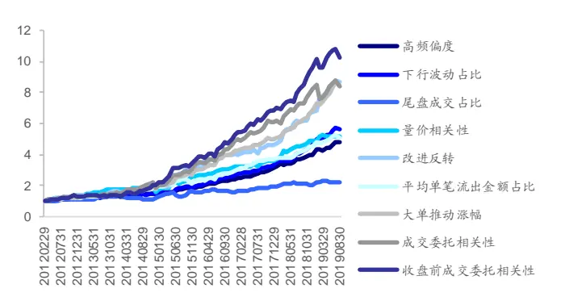
资料来源：Wind，海通证券研究所

图2 高频因子累计 rank IC（月频，全市场选股）
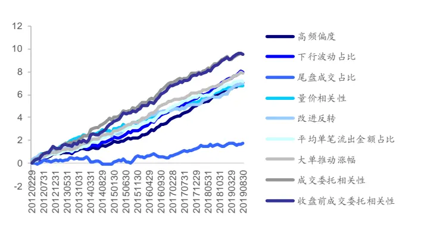
资料来源：Wind，海通证券研究所

表 2 高频因子收益表现（月频，全市场选股）

|  | 月均多 空收益 | 月均多 头收益 | 月均空 头收益 | 多空 胜率 | IC 均值 | ICIR | IC>0 占比 | rlC 均值 | rICIR | rIC>0 占比 |
| --- | --- | --- | --- | --- | --- | --- | --- | --- | --- | --- |
| 高频偏度 | 1.76% | 0.54% | -1.22% | 80% | 6.04% | 3.10 | 78% | 7.79% | 3.44 | 82% |
| 下行波动占比 | 1.97% | 0.35% | -1.62% | 79% | 6.64% | 2.69 | 80% | 8.75% | 3.17 | 84% |
| 尾盘成交占比 | 0.97% | 0.25% | -0.73% | 64% | 3.07% | 1.14 | 65% | 1.92% | 0.65 | 57% |
| 量价相关性 | 1.89% | 0.41% | -1.49% | 79% | 6.18% | 2.59 | 82% | 7.47% | 2.83 | 85% |
| 改进反转 | 2.48% | 0.66% | -1.82% | 77% | 7.19% | 2.47 | 80% | 7.61% | 2.30 | 73% |
| 平均单笔流出金额占比 | 1.82% | 0.76% | -1.05% | 79% | 5.87% | 2.61 | 78% | 7.76% | 3.02 | 78% |
| 大单推动涨幅 | 2.38% | 0.83% | -1.55% | 86% | 7.24% | 3.42 | 88% | 8.58% | 4.12 | 91% |
| 成交委托相关性 | 2.47% | 0.86% | -1.62% | 71% | 7.22% | 2.17 | 75% | 10.47% | 2.87 | 79% |
| 收盘前成交委托相关性 | 2.70% | 0.79% | -1.91% | 70% | 7.65% | 2.25 | 73% | 10.45% | 2.75 | 79% |

资料来源：Wind，海通证券研究所

图3 高频因子多空净值（月频，全市场选股，正交后）
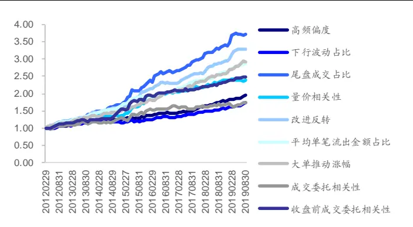
资料来源：Wind，海通证券研究所

图4 高频因子累计 rank IC（月频，全市场选股，正交后）
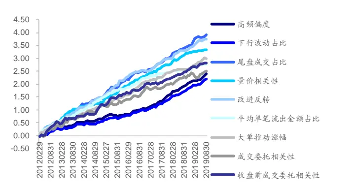
资料来源：Wind，海通证券研究所

表 3 高频因子收益表现（月频，全市场选股，正交后）

|  | 月均多 空收益 | 月均多 头收益 | 月均空 头收益 | 多空 胜率 | IC 均值 | ICIR | IC>0 占比 | rIC 均值 | rICIR | rIC>0 占比 |
| --- | --- | --- | --- | --- | --- | --- | --- | --- | --- | --- |
| 高频偏度 | 0.75% | 0.14% | -0.61% | 75% | 2.49% | 2.93 | 81% | 2.64% | 3.09 | 85% |
| 下行波动占比 | 0.62% | 0.01% | -0.60% | 69% | 2.16% | 2.59 | 78% | 2.41% | 2.82 | 77% |
| 尾盘成交占比 | 1.47% | 0.48% | -0.99% | 79% | 4.56% | 3.84 | 88% | 4.30% | 3.58 | 87% |
| 量价相关性 | 0.97% | -0.01% | -0.98% | 73% | 3.03% | 3.20 | 81% | 3.67% | 3.76 | 88% |
| 改进反转 | 1.33% | 0.25% | -1.08% | 84% | 4.15% | 4.02 | 92% | 4.13% | 3.86 | 89% |
| 平均单笔流出金额占比 | 1.16% | 0.64% | -0.52% | 89% | 3.08% | 4.21 | 90% | 3.01% | 3.81 | 86% |
| 大单推动涨幅 | 1.18% | 0.25% | -0.93% | 83% | 3.31% | 3.65 | 86% | 3.24% | 3.58 | 88% |
| 成交委托相关性 | 0.63% | 0.49% | -0.14% | 63% | 1.61% | 1.09 | 63% | 2.74% | 1.71 | 68% |
| 收盘前成交委托相关性 | 1.02% | 0.50% | -0.53% | 73% | 2.32% | 1.74 | 64% | 3.08% | 2.21 | 74% |

资料来源：Wind，海通证券研究所

## 2.2 沪深 300 中选股

将选股空间限定为沪深 成分股以后，因子选股能力普遍下降，其中尾盘成交占比因子表现较好，月均多空收益差和 rank IC 均值分别为 0.97%和 3.98%。两个成交委托相关性因子多头表现较好，月均超额收益均在 0.5%以上。

图5 高频因子多空净值（月频，沪深 300中选股，正交后）
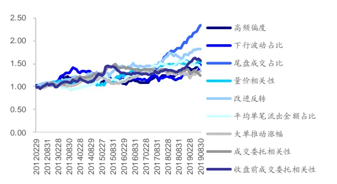
资料来源： ，海通证券研究所

图6 高频因子累计 rank IC（月频，沪深 300中选股，正交后）
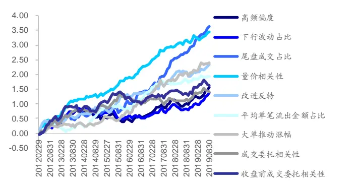
资料来源： ，海通证券研究所

表 4 高频因子收益表现（月频，沪深 300中选股，正交后）

|  | 月均多 空收益 | 月均多 头收益 | 月均空 头收益 | 多空 胜率 | IC 均值 | ICIR | IC>0 占比 | rlC 均值 | rICIR | rlC>0 占比 |
| --- | --- | --- | --- | --- | --- | --- | --- | --- | --- | --- |
| 高频偏度 | 0.52% | 0.00% | -0.52% | 57% | 2.05% | 1.15 | 59% | 1.73% | 0.98 | 60% |
| 下行波动占比 | 0.47% | -0.03% | -0.50% | 56% | 1.65% | 0.91 | 64% | 1.52% | 0.90 | 66% |
| 尾盘成交占比 | 0.97% | 0.38% | -0.59% | 67% | 3.77% | 1.95 | 75% | 3.98% | 2.07 | 78% |
| 量价相关性 | 0.50% | 0.09% | -0.41% | 56% | 3.07% | 1.90 | 70% | 3.79% | 2.36 | 75% |
| 改进反转 | 0.69% | 0.24% | -0.45% | 63% | 2.61% | 1.38 | 66% | 2.57% | 1.34 | 65% |
| 平均单笔流出金额占比 | 0.40% | 0.29% | -0.11% | 58% | 2.31% | 1.55 | 64% | 2.10% | 1.29 | 65% |
| 大单推动涨幅 | 0.35% | -0.04% | -0.40% | 58% | 2.65% | 1.40 | 66% | 2.59% | 1.39 | 64% |
| 成交委托相关性 | 0.25% | 0.51% | 0.25% | 56% | 1.23% | 0.70 | 57% | 1.54% | 0.83 | 58% |
| 收盘前成交委托相关性 | 0.53% | 0.50% | -0.03% | 53% | 1.46% | 0.73 | 56% | 1.78% | 0.84 | 59% |

资料来源： ，海通证券研究所

## 2.3 中证 500 中选股

高频因子在中证 500 成分股中的表现介于全市场和沪深 300 成分股之间。尾盘成交占比因子同样表现出色，月均多空收益差和 rank IC 均值分别为 1.29%和 3.92%。

图7 高频因子多空净值（月频，中证 500中选股，正交后）
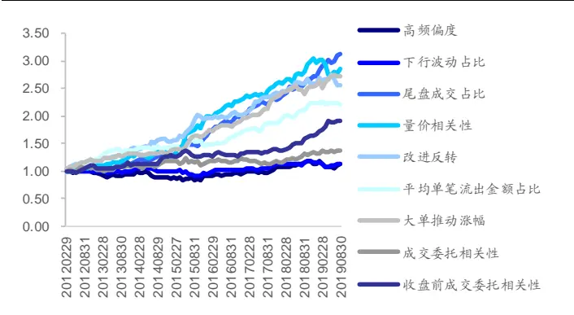
资料来源：Wind，海通证券研究所

图8 高频因子累计 rank IC（月频，中证 500中选股，正交后）
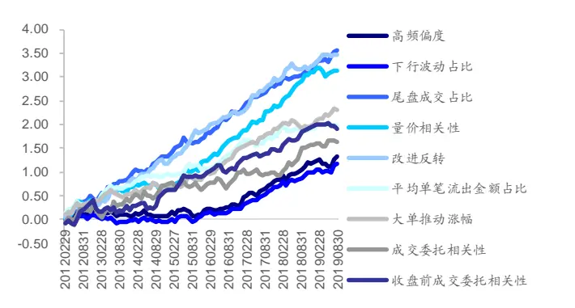
资料来源：Wind，海通证券研究所

表 5 高频因子收益表现（月频，中证 500中选股，正交后）

|  | 月均多 空收益 | 月均多 头收益 | 月均空 头收益 | 多空 胜率 | IC 均值 | ICIR | IC>0 占比 | rIC 均值 | rICIR | rIC>0 占比 |
| --- | --- | --- | --- | --- | --- | --- | --- | --- | --- | --- |
| 高频偏度 | 0.16% | -0.11% | -0.27% | 56% | 1.35% | 0.97 | 60% | 1.45% | 1.05 | 64% |
| 下行波动占比 | 0.14% | -0.08% | -0.22% | 51% | 1.09% | 0.89 | 60% | 1.27% | 1.02 | 66% |
| 尾盘成交占比 | 1.29% | 0.61% | -0.68% | 74% | 4.08% | 2.60 | 78% | 3.92% | 2.63 | 78% |
| 量价相关性 | 1.19% | 0.27% | -0.92% | 67% | 3.29% | 2.04 | 69% | 3.43% | 2.12 | 77% |
| 改进反转 | 1.06% | 0.38% | -0.68% | 71% | 4.12% | 2.76 | 77% | 3.80% | 2.55 | 79% |
| 平均单笔流出金额占比 | 0.89% | 0.46% | -0.43% | 72% | 2.53% | 1.94 | 70% | 2.15% | 1.55 | 66% |
| 大单推动涨幅 | 1.11% | 0.30% | -0.81% | 75% | 2.96% | 2.26 | 74% | 2.51% | 1.72 | 66% |
| 成交委托相关性 | 0.37% | 0.12% | -0.25% | 58% | 1.00% | 0.50 | 53% | 1.81% | 0.88 | 59% |
| 收盘前成交委托相关性 | 0.73% | 0.24% | -0.49% | 63% | 1.42% | 0.79 | 56% | 2.10% | 1.14 | 67% |

资料来源：Wind，海通证券研究所

## 2.4 因子表现对比

不同选股空间和评价指标下表现最好的因子如下表所示。

表 6 不同选股空间下表现最好的因子（月频）

| 多空收益高 |  |  | 多头收益高 | rank IC 高 | 因子稳定性强 |
| --- | --- | --- | --- | --- | --- |
| 全市场 | 正交前 | 成交委托相关性、 尾盘成交委托相关性 | 成交委托相关性、 大单推动涨幅 | 成交委托相关性、 尾盘成交委托相关性 | 大单推动涨幅 |
|  | 正交后 | 尾盘成交占比、 改进反转 | 平均单笔流出金额占比、 收盘前成交委托相关性 | 尾盘成交占比、 改进反转 | 尾盘成交占比、 改进反转、 平均单笔流出金额占比 |
|  | 正交前 | 成交委托相关性、 尾盘成交委托相关性 | 尾盘成交占比、 收盘前成交委托相关性 | 高频偏度、 下行波动占比、 成交委托相关性、 | 高频偏度、 下行波动占比 |
| 沪深 300 中证 500 | 正交后 | 尾盘成交占比、 改进反转 | 成交委托相关性、 尾盘成交委托相关性 | 尾盘成交委托相关性 尾盘成交占比、 量价相关性 | 尾盘成交占比、 量价相关性 |
|  | 正交前 | 改进反转、 大单推动涨幅 | 平均单笔流出金额占比 | 成交委托相关性、 尾盘成交委托相关性 | 高频偏度、 大单推动涨幅 |
|  | 正交后 | 尾盘成交占比 | 尾盘成交占比、 平均单笔流出金额占比 | 尾盘成交占比、 改进反转 | 尾盘成交占比、 改进反转 |

资料来源： ，海通证券研究所

## 3. 周频调仓下的因子表现

## 3.1 全市场选股

周频调仓下，各个因子在全市场中选股表现如以下图表所示。绝大多数因子周均多空收益差在 0.5%以上，rank IC 均值在 5%以上，其中改进反转因子收益最高，周均多空收益差和 rank IC 均值分别为 1.10%和 7.76%。

在剔除了行业、市值等常规因子影响之后，多数因子选股效果明显下降，尾盘成交占比因子正交之后选股效果有所提升，但相对月频调仓，提升幅度较小。

我们分别考察因子多头和空头的超额收益，可以发现，多数因子空头贡献更大，其中平均单笔流出金额占比因子多头收益仍然最高，周均超额 0.29%。

图9 高频因子多空净值（周频，全市场选股）
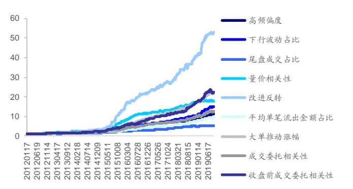
资料来源： ，海通证券研究所

图10 高频因子累计 rank IC（周频，全市场选股）
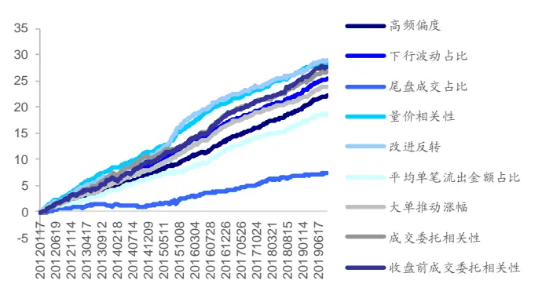
资料来源： ，海通证券研究所

表 7 高频因子收益表现（周频，全市场选股）

|  | 周均多 空收益 | 周均多 头收益 | 月均空 头收益 | 多空 胜率 | IC 均值 | ICIR | IC>0 占比 | rlC 均值 | rICIR | rlC>0 占比 |
| --- | --- | --- | --- | --- | --- | --- | --- | --- | --- | --- |
| 高频偏度 | 0.66% | 0.12% | -0.54% | 72% | 4.20% | 4.56 | 77% | 5.97% | 5.79 | 81% |
| 下行波动占比 | 0.75% | 0.14% | -0.61% | 70% | 4.80% | 3.85 | 75% | 6.83% | 4.96 | 80% |
| 尾盘成交占比 | 0.47% | 0.12% | -0.34% | 66% | 2.75% | 2.43 | 68% | 1.98% | 1.64 | 61% |
| 量价相关性 | 0.79% | 0.16% | -0.63% | 71% | 6.16% | 5.32 | 79% | 7.64% | 5.82 | 81% |
| 改进反转 | 1.10% | 0.22% | -0.88% | 73% | 6.85% | 4.42 | 76% | 7.76% | 4.46 | 76% |
| 平均单笔流出金额占比 | 0.61% | 0.33% | -0.28% | 79% | 3.93% | 4.80 | 80% | 5.01% | 5.57 | 82% |
| 大单推动涨幅 | 0.84% | 0.31% | -0.53% | 77% | 5.42% | 6.10 | 82% | 6.40% | 7.03 | 83% |
| 成交委托相关性 | 0.69% | 0.28% | -0.41% | 69% | 4.21% | 3.24 | 70% | 7.20% | 4.89 | 78% |
| 收盘前成交委托相关性 | 0.86% | 0.29% | -0.57% | 71% | 4.92% | 3.61 | 71% | 7.45% | 4.93 | 77% |

资料来源：Wind，海通证券研究所

图11 高频因子多空净值（周频，全市场选股，正交后）
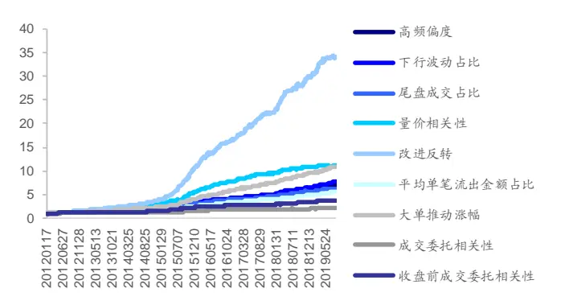
资料来源：Wind，海通证券研究所

图12 高频因子累计 rank IC（周频，全市场选股，正交后）
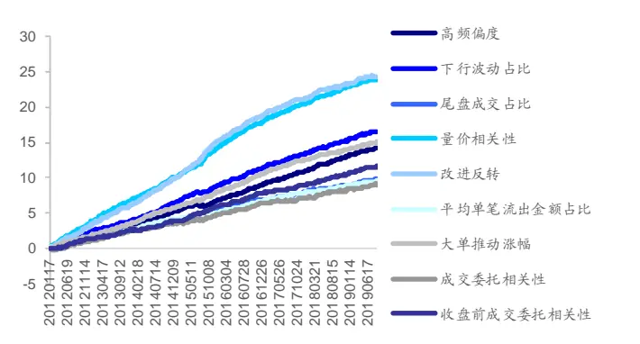
资料来源：Wind，海通证券研究所

表 8 高频因子收益表现（周频，全市场选股，正交后）

|  | 月均多 空收益 | 月均多 头收益 | 月均空 头收益 | 多空 胜率 | IC 均值 | ICIR | IC>0 占比 | rlC 均值 | rICIR | rIC>0 占比 |
| --- | --- | --- | --- | --- | --- | --- | --- | --- | --- | --- |
| 高频偏度 | 0.52% | 0.09% | -0.44% | 76% | 3.07% | 5.69 | 79% | 3.84% | 6.77 | 82% |
| 下行波动占比 | 0.56% | 0.07% | -0.48% | 75% | 3.46% | 5.25 | 76% | 4.47% | 6.39 | 81% |
| 尾盘成交占比 | 0.49% | 0.12% | -0.37% | 71% | 2.98% | 4.74 | 77% | 2.63% | 4.25 | 78% |
| 量价相关性 | 0.65% | 0.14% | -0.52% | 79% | 5.32% | 8.51 | 91% | 6.46% | 9.46 | 93% |
| 改进反转 | 0.96% | 0.21% | -0.75% | 81% | 5.94% | 7.02 | 84% | 6.57% | 7.24 | 84% |
| 平均单笔流出金额占比 | 0.45% | 0.29% | -0.16% | 83% | 2.68% | 6.68 | 88% | 2.55% | 6.52 | 83% |
| 大单推动涨幅 | 0.64% | 0.21% | -0.44% | 84% | 3.92% | 8.41 | 89% | 4.03% | 8.67 | 89% |
| 成交委托相关性 | 0.20% | 0.14% | -0.06% | 59% | 1.26% | 1.84 | 60% | 2.45% | 3.34 | 70% |
| 收盘前成交委托相关性 | 0.36% | 0.17% | -0.19% | 66% | 2.23% | 3.60 | 69% | 3.13% | 4.71 | 76% |

资料来源：Wind，海通证券研究所

## 3.2 沪深 300 中选股

将选股空间限定为沪深 300 成分股以后，因子选股能力普遍下降，其中量价相关性和改进反转因子表现较好，rank IC 均值分别为 5.53%和 4.73%。多头周均超额收益均为 0.17%。

图13 高频因子多空净值（周频，沪深 300中选股，正交后）
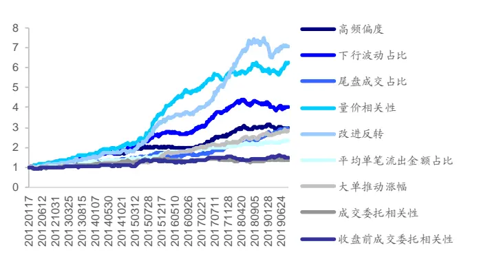
资料来源：Wind，海通证券研究所

图14 高频因子累计 rank IC（周频，沪深 300中选股，正交后）
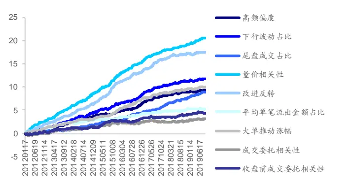
资料来源：Wind，海通证券研究所

表 9 高频因子收益表现（周频，沪深 300中选股，正交后）

|  | 周均多 空收益 | 周均多 头收益 | 月均空 头收益 | 多空 胜率 | IC 均值 | ICIR | IC>0 占比 | rIC 均值 | rICIR | rlC>0 占比 |
| --- | --- | --- | --- | --- | --- | --- | --- | --- | --- | --- |
| 高频偏度 | 0.30% | 0.04% | -0.26% | 60% | 2.09% | 2.35 | 63% | 2.51% | 2.82 | 65% |
| 下行波动占比 | 0.39% | 0.10% | -0.29% | 61% | 2.55% | 2.59 | 64% | 3.16% | 3.24 | 67% |
| 尾盘成交占比 | 0.30% | 0.07% | -0.23% | 60% | 2.41% | 2.48 | 63% | 2.41% | 2.52 | 65% |
| 量价相关性 | 0.50% | 0.17% | -0.33% | 65% | 4.54% | 4.48 | 74% | 5.53% | 5.53 | 79% |
| 改进反转 | 0.54% | 0.17% | -0.36% | 62% | 4.43% | 4.08 | 74% | 4.73% | 4.45 | 77% |
| 平均单笔流出金额占比 | 0.24% | 0.13% | -0.11% | 60% | 1.56% | 2.10 | 60% | 1.40% | 1.82 | 60% |
| 大单推动涨幅 | 0.29% | 0.07% | -0.21% | 58% | 2.39% | 2.68 | 66% | 2.67% | 3.08 | 67% |
| 成交委托相关性 | 0.09% | 0.12% | 0.04% | 52% | 0.43% | 0.47 | 52% | 0.85% | 0.86 | 59% |
| 收盘前成交委托相关性 | 0.12% | 0.10% | -0.02% | 53% | 0.77% | 0.84 | 56% | 1.19% | 1.24 | 58% |

资料来源：Wind，海通证券研究所

## 3.3 中证 500 中选股

高频因子在中证 500 成分股中的表现介于全市场和沪深 300 成分股之间，量价相关性和改进反转因子同样表现较好，rank IC 均值分别为 5.82%和 5.75%。

图15 高频因子多空净值（周频，中证 500中选股，正交后）
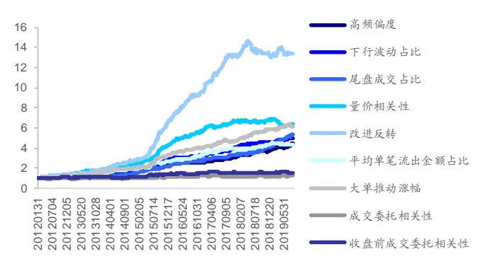
资料来源： ，海通证券研究所

图16 高频因子累计 rank IC（周频，中证 500中选股，正交后）
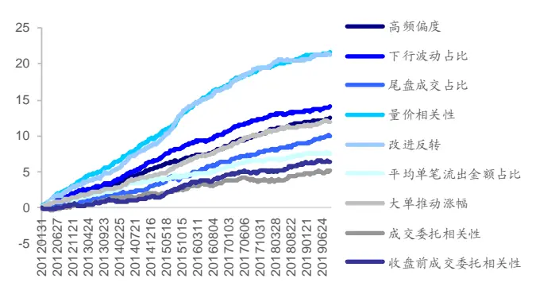
资料来源： ，海通证券研究所

表 10 高频因子收益表现（周频，中证 500中选股，正交后）

|  | 周均多 空收益 | 周均多 头收益 | 月均空 头收益 | 多空 胜率 | IC 均值 | ICIR | IC>0 占比 | rIC 均值 | rICIR | rIC>0 占比 |
| --- | --- | --- | --- | --- | --- | --- | --- | --- | --- | --- |
| 高频偏度 | 0.42% | 0.09% | -0.33% | 67% | 2.56% | 3.49 | 70% | 3.36% | 4.54 | 74% |
| 下行波动占比 | 0.45% | 0.12% | -0.33% | 63% | 2.84% | 3.38 | 67% | 3.80% | 4.38 | 75% |
| 尾盘成交占比 | 0.48% | 0.18% | -0.30% | 64% | 3.21% | 3.87 | 71% | 2.70% | 3.18 | 69% |
| 量价相关性 | 0.50% | 0.07% | -0.43% | 69% | 4.63% | 5.16 | 77% | 5.82% | 6.22 | 83% |
| 改进反转 | 0.72% | 0.20% | -0.52% | 69% | 5.06% | 4.61 | 73% | 5.75% | 5.24 | 77% |
| 平均单笔流出金额占比 | 0.39% | 0.26% | -0.12% | 67% | 2.29% | 3.41 | 70% | 2.04% | 2.88 | 70% |
| 大单推动涨幅 | 0.48% | 0.20% | -0.29% | 67% | 3.07% | 3.80 | 74% | 3.22% | 4.21 | 73% |
| 成交委托相关性 | 0.06% | 0.05% | -0.01% | 51% | 0.17% | 0.21 | 52% | 1.39% | 1.60 | 64% |
| 收盘前成交委托相关性 | 0.12% | 0.04% | -0.08% | 50% | 0.95% | 1.22 | 56% | 1.74% | 2.07 | 58% |

资料来源：Wind，海通证券研究所

## 3.4 因子表现对比

不同选股空间和评价指标下表现最好的因子如下表所示。

表 11不同选股空间下表现最好的因子（周频）

|  |  | 多空收益高 | 多头收益高 | rank IC 高 | 因子稳定性强 |
| --- | --- | --- | --- | --- | --- |
| 全市场 沪深 | 正交前 | 改进反转 | 平均单笔流出金额占比、 大单推动涨幅 | 量价相关性、 成交委托相关性、 尾盘成交委托相关性 | 大单推动涨幅 |
|  | 正交后 | 改进反转 | 平均单笔流出金额占比 | 量价相关性、改进反转 | 量价相关性、改进反转 |
|  | 正交前 | 量价相关性、改进反转 | 改进反转、 成交委托相关性 | 量价相关性、改进反转 | 高频偏度、量价相关性 |
| 300 | 正交后 | 量价相关性、改进反转 | 量价相关性、改进反转 | 量价相关性、改进反转 | 量价相关性、改进反转 |
|  | 正交前 | 改进反转、大单推动涨幅 | 平均单笔流出金额占比、 大单推动涨幅 | 成交委托相关性、 尾盘成交委托相关性 | 高频偏度、量价相关性 |
| 中证 500 | 正交后 | 改进反转 | 改进反转、 平均单笔流出金额占比、 大单推动涨幅 | 量价相关性、改进反转 | 量价相关性、改进反转 |

资料来源：Wind，海通证券研究所

## 4. 复合高频因子

## 4.1 因子相关性

我们下面考察高频因子相关性，图17展示的是截面因子值相关系数均值及因子rankIC 时间序列的相关系数。可以发现，同一级别、同一类别因子之间相关性较高，例如收益分布类因子中的高频偏度与下行波动占比因子值的相关系数和 的相关系数分别为-0.89 和 0.90。但不同级别、不同类别因子之间相关性较低，例如使用分钟数据计算生成的尾盘成交占比和使用 tick 数据计算生成的成交委托相关性因子值的相关系数和rank IC 的相关系数分别为-0.06 和-0.10。

图17 高频因子相关系数
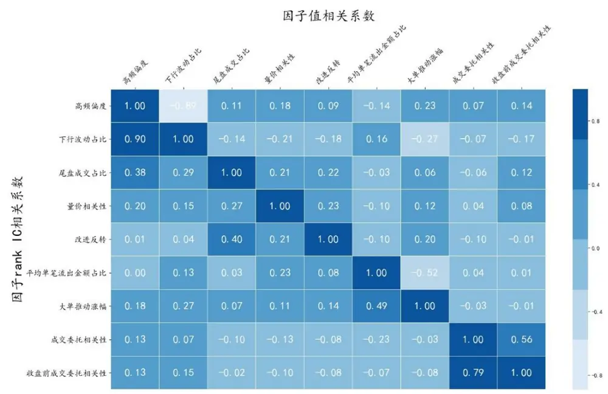
资料来源：Wind，海通证券研究所

## 4.2 复合因子表现

我们首先对和常规因子正交后的 9 个高频因子做进一步对称正交，再按过去 12 个月因子 IC均值加权，构建复合因子。

复合因子在不同周期和域下的表现如以下图表所示。月频调仓下，因子 rank IC 均值和 rank ICIR 分别为 6.85%和 6.13，胜率高达 96%。周频调仓下，因子表现进一步提升，rank IC 均值和 rank ICIR 分别为 8.48%和 10.86。

图18 复合高频因子多空净值（月频）
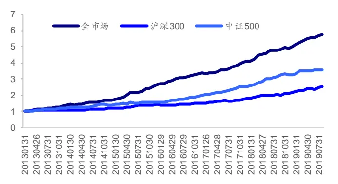
资料来源：Wind，海通证券研究所

图19 复合高频因子累计 rank IC （月频）
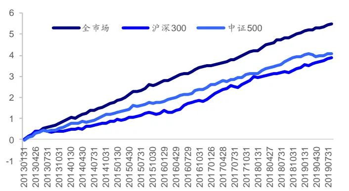
资料来源：Wind，海通证券研究所

表 12 复合高频因子收益表现（月频）

|  | 月均多 空收益 | 月均多 头收益 | 月均空 头收益 | 多空 胜率 | IC 均值 | ICIR | IC>0 占比 | rIC 均值 | rICIR | rlC>0 占比 |
| --- | --- | --- | --- | --- | --- | --- | --- | --- | --- | --- |
| 全市场 | 2.22% | 0.88% | -1.34% | 89% | 6.35% | 5.70 | 94% | 6.85% | 6.13 | 96% |
| 沪深300 | 1.20% | 0.51% | -0.69% | 70% | 4.63% | 2.75 | 80% | 4.83% | 2.73 | 80% |
| 中证500 | 1.63% | 0.70% | -0.93% | 79% | 5.05% | 3.42 | 86% | 5.07% | 3.58 | 85% |

资料来源：Wind，海通证券研究所

图20 复合高频因子多空净值（周频）
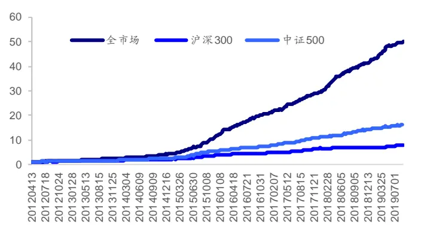
资料来源：Wind，海通证券研究所

图21 复合高频因子累计 rank IC（周频）
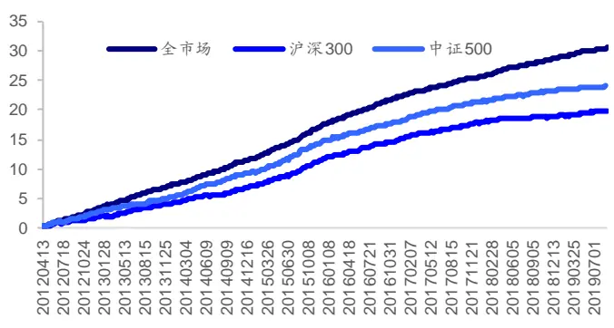
资料来源：Wind，海通证券研究所

表 13 复合高频因子收益表现（周频）

|  | 月均多 空收益 | 月均多 头收益 | 月均空 头收益 | 多空 胜率 | IC 均值 | ICIR | IC>0 占比 | rIC 均值 | rICIR | rIC>0 占比 |
| --- | --- | --- | --- | --- | --- | --- | --- | --- | --- | --- |
| 全市场 | 1.10% | 0.36% | -0.74% | 89% | 7.45% | 10.08 | 94% | 8.48% | 10.86 | 96% |
| 沪深300 | 0.58% | 0.19% | -0.39% | 69% | 4.90% | 5.03 | 73% | 5.50% | 5.57 | 79% |
| 中证500 | 0.78% | 0.21% | -0.58% | 75% | 5.90% | 6.57 | 83% | 6.67% | 6.93 | 85% |

资料来源：Wind，海通证券研究所

## 5. 高频因子影响因素分析

在专题报告《选股因子系列研究（五十二）——基于决策树的因子择时模型》中，我们构建了决策树模型来划分市场环境，并分析因子在不同市场环境下的表现。在本篇报告中，我们将沿用决策树模型，探讨高频因子的影响因素。

## 5.1 模型与择时变量

由于高频因子本身胜率较高、稳定性较强，我们采用全样本同期回归进行分析。

本文选取了指数收益率、波动率、换手率等14个基础择时指标（指标代码后缀_raw），以及滞后一期（指标代码后缀_lag1）、24 期滚动时间序列标准化（指标代码后缀_zscore）、24 期滚动时间序列标准化+滞后一期处理后（指标代码后缀_zscore_lag1）的 42 个衍生指标，总共 56个指标作为择时变量，具体如表 14 所示。

分析因子在不同域中的表现时，我们使用相应指数以及成分股来计算指标，例如全样本选股则计算 wind 全 A 指数的相关指标，沪深 300 指数内选股则计算沪深 300 指数的相关指标。

我们分别选取正交后的因子多空收益、多头超额收益、rank IC、回归溢价 beta 作为被解释变量，总共构建了 216 棵回归树，对应不同因子、周期、域下的不同因子收益类型。

| 表14 择时变量集合 |  |
| --- | --- |
| 指标代码 | 指标名称 |
| idx_ret | 指数月收益率 |
| idx_vol | 指数月波动率 |
| idx_amplitude | 指数月振幅（（月最高价-月最低价）/前收盘价-1） |
| idx_maxRet | 指数月最大涨幅（月最高价/前收盘价-1） |
| idx_minRet | 指数月最大跌幅（月最低价/前收盘价-1） |
| idx_illiq | 指数非流动性（Amihud） |
| idx_avgAmt | 指数日均成交额 |
| idx_avgTurn | 指数日均换手率 |
| idx_avgFreeTurn | 指数日均自由流通换手率 |
| stk_ret_mean | 成分股月收益率均值 |
| stk_ret_top10 | 涨幅最大的 10%个股月均收益 |
| stk_ret_bot10 | 跌幅最大的10%个股月均收益 |
| stk_ret_Is_top10 | 涨幅最大最小的10%个股月均收益差 |
| stkDivergence | 个股月收益率截面标准差 |

资料来源：Wind，海通证券研究所

决策树又可进一步分为分类树与回归树，本文后续构建的模型主要基于回归树，在训练回归树时使用 CART 算法。对于回归树模型，最大深度（Max Depth）、节点最小样本量（Min sample leaf）以及分叉最小样本量（Min sample split）都是模型的超参数。在进行模型超参数选择时，使用时间序列交叉验证的方式确定相关超参数。

## 5.2 单因子回归树

我们在本节中将以高频偏度和成交委托相关性为例展示单因子回归树，回归结果如图 22-25 所示。

高频偏度的影响因子主要为指数月最大涨幅与表现最差的 的个股的平均收益。当指数月最大涨幅低于一定阈值，表现最差的 10%的个股涨幅低于一定阈值时，因子表现最好，该情景下共有 46 个样本，对应因子 rank IC均值为 4.4%。

成交委托相关性的影响因子主要为个股月收益率截面标准差和个股月收益率均值。当个股月收益率截面标准差极高时，因子月均多空收益差高达 ，但仅有 个样本。当个股月收益率截面标准差低于阈值时，个股月收益率均值具有明显的区分效果，均值较低的样本中因子多空收益更高。

由此可见，高频偏度和成交委托相关性因子都是在市场整体表现不佳的环境下能够获得更高的收益，这和我们在前文得到的结论一致，即高频因子选空头能力更强。

图22 高频偏度因子回归树（月频+全市场+rank IC）
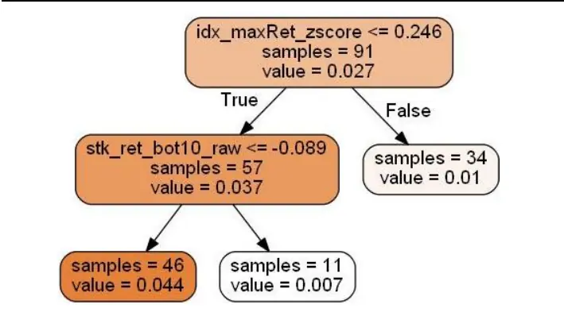
资料来源：Wind，海通证券研究所

图23 成交委托相关性因子回归树（月频+全市场+多空收益）
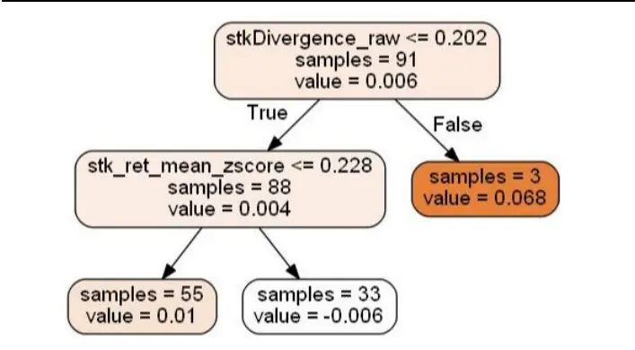
资料来源：Wind，海通证券研究所

图24 高频偏度因子净值与环境划分（月频+全市场+rank IC）
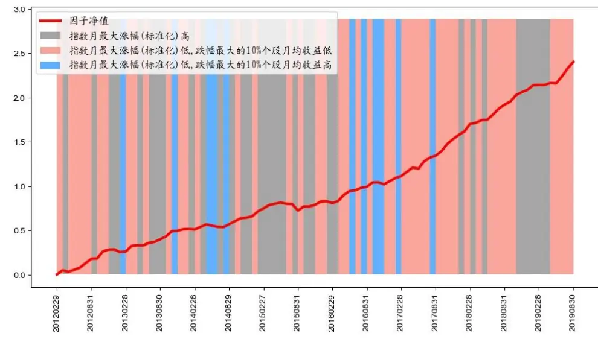
资料来源：Wind，海通证券研究所

图25 成交委托相关性因子净值与环境划分（月频+全市场+多空收益）
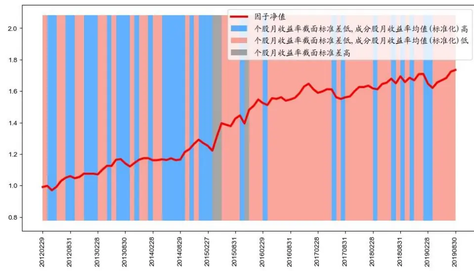
资料来源：Wind，海通证券研究所

## 5.3 整体表现

高频因子在不同周期、域、因子收益类型下的回归树 R方如表 15-16 所示，月频调仓下的 R方分布在 20%-30%区域内，周频调仓下的 R方分布在 10%-20%区域内，模型解释能力普遍较低。

各回归树的特征重要性均值如图 26-27 所示，月频和周频下最重要的特征分别为跌幅最大的 10%个股月均收益，以及涨幅最大与涨幅最小的 10%个股的月均收益差。

由此可见，由于高频因子稳定性较强，因子收益难以被外生变量解释，且多数高频因子选空头能力强，故表现最差的个股的收益对因子收益影响相对较大。

表 15 单因子回归树 R方（月频）

|  | 全市场 |  |  | 沪深300 |  |  |  | 中证 500 |  |  |  |
| --- | --- | --- | --- | --- | --- | --- | --- | --- | --- | --- | --- |
|  | beta | rlC 多头 |  | 多空 | beta rlC | 多头 | 多空 | beta | rIC | 多头 | 多空 |
| 成交委托相关性 | 39% | 38% | 52% | 14% | 21% | 24% 33% | 47% | 16% | 26% | 15% | 14% |
| 大单推动涨幅 | 31% | 23% | 17% | 22% | 11% | 13% 14% | 10% | 20% | 26% | 22% | 29% |
| 改进反转 | 13% | 19% | 16% | 19% | 13% | 23% 26% | 30% | 7% | 9% | 18% | 17% |
| 高频偏度 | 20% | 16% | 18% | 14% | 22% | 34% 7% | 11% | 37% | 34% | 12% | 14% |
| 量价相关性 | 15% | 25% | 22% | 18% | 24% | 7% 9% | 10% | 5% | 12% | 31% | 27% |
| 平均单笔流出金 额占比 | 31% | 15% | 24% | 8% | 19% | 9% 34% | 18% | 15% | 22% | 12% | 13% |
| 收盘前成交委托 相关性 | 41% | 15% | 25% | 22% | 25% | 30% 32% | 14% | 44% | 35% | 26% | 37% |
| 尾盘成交占比 | 17% | 13% | 38% | 9% | 21% | 6% 15% | 44% | 16% | 11% | 8% | 16% |
| 下行波动占比 | 33% | 14% | 14% | 22% | 32% | 18% 23% | 24% | 18% | 13% | 8% | 22% |
| 均值 | 27% | 20% | 25% | 16% | 21% | 18% 22% | 23% | 20% | 21% | 17% | 21% |

资料来源：Wind，海通证券研究所

表 16 单因子回归树 R方（周频）

|  | 全市场 |  |  | 沪深 300 |  |  |  | 中证 500 |  |  |  |
| --- | --- | --- | --- | --- | --- | --- | --- | --- | --- | --- | --- |
|  | beta | rlC | 多头 | 多空 | beta rlC | 多头 | 多空 | beta | rlC | 多头 | 多空 |
| 成交委托相关性 | 21% | 27% | 15% | 14% | 36% | 36% 15% | 23% | 10% | 15% | 15% | 9% |
| 大单推动涨幅 | 3% | 10% | 5% | 3% | 17% | 29% 21% | 28% | 17% | 9% | 8% | 19% |
| 改进反转 | 6% | 7% | 7% | 13% | 28% | 28% 16% | 29% | 21% | 10% | 10% | 14% |
| 高频偏度 | 4% | 5% | 5% | 7% | 4% | 17% 24% | 11% | 2% | 4% | 12% | 7% |
| 量价相关性 | 11% | 12% | 15% | 7% | 28% | 19% 17% | 17% | 9% | 11% | 6% | 9% |
| 平均单笔流出金 额占比 | 10% | 6% | 21% | 4% | 13% | 12% 18% | 35% | 6% | 5% | 3% | 17% |
| 收盘前成交委托 相关性 | 32% | 20% | 8% | 15% | 13% | 15% 12% | 14% | 9% | 9% | 13% | 14% |
| 尾盘成交占比 | 9% | 8% | 7% | 8% | 12% | 15% 11% | 15% | 8% | 5% | 4% | 6% |
| 下行波动占比 | 9% | 11% | 10% | 7% | 8% | 18% 20% | 16% | 3% | 10% | 9% | 6% |
| 均值 | 12% | 12% | 10% | 9% | 18% | 21% 17% | 21% | 9% | 9% | 9% | 11% |

资料来源：Wind，海通证券研究所

图26 回归树特征重要性（月频）
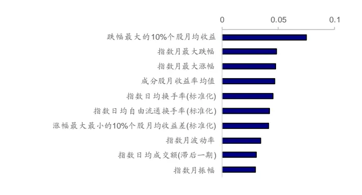
资料来源：Wind，海通证券研究所

图27 回归树特征重要性（周频）
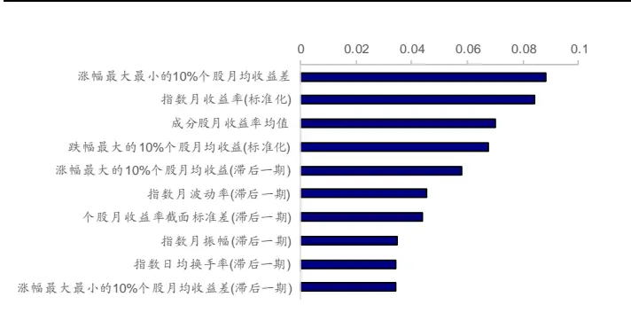
资料来源：Wind，海通证券研究所

## 6. 总结与展望

我们在本篇报告中考察了高频因子在不同周期和域下的表现，并分析了影响因子表现的因素，得到以下结论与思考。

月频调仓下，在全市场中，成交委托相关性因子表现较好；正交后，改进反转和尾盘成交占比因子表现较好。沪深 300 成分股中，成交委托相关性因子表现较好；中证 500成分股中，改进反转和大单推动涨幅因子表现较好。平均单笔流出金额占比因子多头超额收益较高。周频调仓下，绝大多数因子的选股能力有所增强。高频因子复合后稳定性进一步提升，月频模型 rank IC 均值和 rank ICIR 分别为 6.82%和 6.15；周频模型的 rankIC 均值和 rank ICIR 分别为 8.48%和 10.86。

由于高频因子具有高信息比率和高胜率的特征，基于外生变量构建的回归树模型 R方普遍较低。影响较大的择时变量主要是市场中表现最差的一部分股票的跌幅，这是因为高频因子选空头能力更为突出。

高频因子收益难以被外生变量解释，因此我们建议投资者将高频因子作为 alpha 因子加入到多因子组合中，以提升组合的信息比和胜率，降低组合的回撤，感兴趣的投资者可以参考报告《近期指数增强策略回撤原因分析》。关于如何解决因子空头问题，可以采取加权 IC 打分、因子反向剔除、长短周期组合叠加等思路，我们将在后续报告中作进一步研究。

本文介绍的高频因子均基于交易逻辑，未来将尝试自动挖掘高频因子，并动态调整因子库。我们在日频数据上已经做了一些尝试，感兴趣的投资者可以参考报告《量化选股因子的批量生产与集中管理》。

## 7. 风险提示

因子失效风险、流动性风险。

## 信息披露

分析师声明

[Table冯佳睿yst金融工程研究团队s]

姚石金融工程研究团队

本人具有中国证券业协会授予的证券投资咨询执业资格，以勤勉的职业态度，独立、客观地出具本报告。本报告所采用的数据和信息均来自市场公开信息，本人不保证该等信息的准确性或完整性。分析逻辑基于作者的职业理解，清晰准确地反映了作者的研究观点，结论不受任何第三方的授意或影响，特此声明。

## 法律声明

本报告仅供海通证券股份有限公司（以下简称“本公司”）的客户使用。本公司不会因接收人收到本报告而视其为客户。在任何情况下，本报告中的信息或所表述的意见并不构成对任何人的投资建议。在任何情况下，本公司不对任何人因使用本报告中的任何内容所引致的任何损失负任何责任。

本报告所载的资料、意见及推测仅反映本公司于发布本报告当日的判断，本报告所指的证券或投资标的的价格、价值及投资收入可能会波动。在不同时期，本公司可发出与本报告所载资料、意见及推测不一致的报告。

市场有风险，投资需谨慎。本报告所载的信息、材料及结论只提供特定客户作参考，不构成投资建议，也没有考虑到个别客户特殊的投资目标、财务状况或需要。客户应考虑本报告中的任何意见或建议是否符合其特定状况。在法律许可的情况下，海通证券及其所属关联机构可能会持有报告中提到的公司所发行的证券并进行交易，还可能为这些公司提供投资银行服务或其他服务。

本报告仅向特定客户传送，未经海通证券研究所书面授权，本研究报告的任何部分均不得以任何方式制作任何形式的拷贝、复印件或复制品，或再次分发给任何其他人，或以任何侵犯本公司版权的其他方式使用。所有本报告中使用的商标、服务标记及标记均为本公司的商标、服务标记及标记。如欲引用或转载本文内容，务必联络海通证券研究所并获得许可，并需注明出处为海通证券研究所，且不得对本文进行有悖原意的引用和删改。

根据中国证监会核发的经营证券业务许可，海通证券股份有限公司的经营范围包括证券投资咨询业务。

## 海通证券股份有限公司研究所[Table_PeopleInfo]

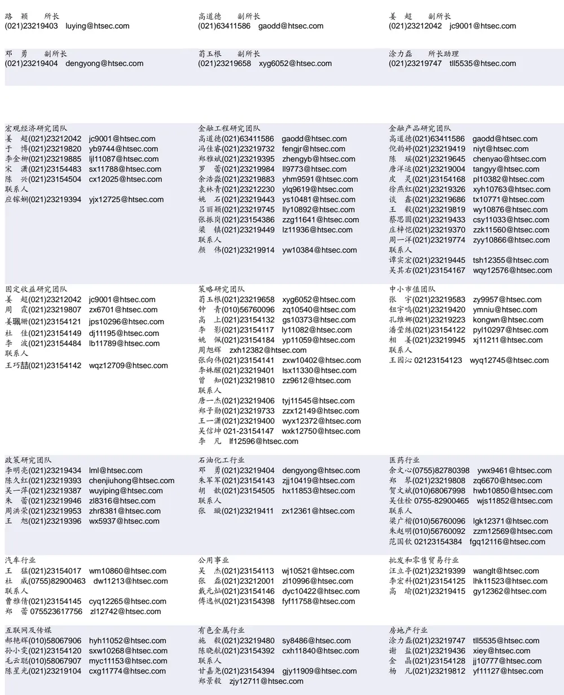

| 电子行业 |  | 煤炭行业 |  | 电力设备及新能源行业 |  |
| --- | --- | --- | --- | --- | --- |
|  | 陈 平(021)23219646 cp9808@htsec.com |  | 李 淼(010)58067998 Im10779@htsec.com | 张一弛(021)23219402 | zyc9637@htsec.com |
|  | 尹 苓(021)23154119 yl11569@htsec.com |  | 戴元灿(021)23154146 dyc10422@htsec.com | 房 青(021)23219692 | fangq@htsec.com |
|  | 谢 磊(021)23212214 xl10881@htsec.com | 吴 杰(021)23154113 wj10521@htsec.com |  |  | 曾 彪(021)23154148 zb10242@htsec.com |
|  | 蒋 俊(021)23154170 jj11200@htsec.com | 联系人 |  | 徐柏乔(021)23219171 xbq6583@htsec.com |  |
| 联系人 |  |  | 王 涛(021)23219760 wt12363@htsec.com |  | 陈佳彬(021)23154513 cjb11782@htsec.com |

| 基础化工行业 |  | 计算机行业 |  | 通信行业 |  |
| --- | --- | --- | --- | --- | --- |
| 刘 威(0755)82764281 Iw10053@htsec.com |  | 郑宏达(021)23219392 zhd10834@htsec.com |  | 朱劲松(010)50949926 | zjs10213@htsec.com |
| 刘海荣(021)23154130 | Ihr10342@htsec.com | 杨 林(021)23154174 | yl11036@htsec.com | 余伟民(010)50949926 | ywm11574@htsec.com |
| 张翠翠(021)23214397 | zcc11726@htsec.com | 鲁 立(021)23154138 II11383@htsec.com |  | 张峥青(021)23219383 | zzq11650@htsec.com |
| 孙维容(021)23219431 | swr12178@htsec.com | 于成龙 ycl12224@htsec.com |  | 张 弋 01050949962 | zy12258@htsec.com |
| 李 智(021)23219392 | lz11785@htsec.com | 黄竞晶(021)23154131 | hjj10361@htsec.com | 联系人 |  |
|  |  | 洪 琳(021)23154137 hl11570@htsec.com |  | 杨彤昕 010-56760095 ytx12741@htsec.com |  |

| 非银行金融行业 |  | 交通运输行业 |  |  | 纺织服装行业 |  |
| --- | --- | --- | --- | --- | --- | --- |
|  | 孙 婷(010)50949926 st9998@htsec.com |  |  | 虞 楠(021)23219382 yun@htsec.com |  | 梁 希(021)23219407 lx11040@htsec.com |
|  | 何 婷(021)23219634 ht10515@htsec.com |  | 罗月江（010）56760091 lyj12399@htsec.com |  |  | 盛 开(021)23154510 sk11787@htsec.com |
|  | 李芳洲(021)23154127 Ifz11585@htsec.com |  |  | 李 轩(021)23154652 lx12671@htsec.com | 联系人 |  |
| 联系人 |  |  | 联系人 |  |  | 刘 溢(021)23219748 ly12337@htsec.com |
| 任广博(021)23154388 rgb12695@htsec.com |  |  | 李 丹(021)23154401 Id11766@htsec.com |  |  |  |

| 建筑建材行业 | 机械行业 | 钢铁行业 |
| --- | --- | --- |
| 冯晨阳(021)23212081 fcy10886@htsec.com 潘莹练(021)23154122 pyl10297@htsec.com | 余炜超(021)23219816 swc11480@htsec.com 耿 耘(021)23219814 gy10234@htsec.com | 刘彦奇(021)23219391 liuyq@htsec.com 周慧琳(021)23154399 zhl11756@htsec.com |
| 申 浩(021)23154114 sh12219@htsec.com 杜市伟(0755)82945368 dsw11227@htsec.com | 杨 震(021)23154124 yz10334@htsec.com 周 丹 zd12213@htsec.com |  |
|  | 联系人 吉 晟(021)23154145 js12801@htsec.com |  |

| 建筑工程行业 | 农林牧渔行业 | 食品饮料行业 |  |
| --- | --- | --- | --- |
| 张欣劫 zxj12156@htsec.com | 丁 频(021)23219405 dingpin@htsec.com | 闻宏伟(010)58067941 | whw9587@htsec.com |
| 李富华(021)23154134 Ifh12225@htsec.com | 陈雪丽(021)23219164 cxl9730@htsec.com 陈 阳(021)23212041 cy10867@htsec.com | 唐 宇(021)23219389 联系人 | ty11049@htsec.com |
| 杜市伟(0755)82945368 dsw11227@htsec.com | 联系人 |  | 程碧升(021)23154171 cbs10969@htsec.com |
|  | 孟亚琦(021)23154396 mvg12354@htsec.com |  |  |

| 军工行业 | 银行行业 | 社会服务行业 |
| --- | --- | --- |
| 张恒晅 zhx10170@htsec.com | 孙 婷(010)50949926 st9998@htsec.com | 汪立亭(021)23219399 wanglt@htsec.com |
| 联系人 | 解巍巍 xww12276@htsec.com | 陈扬扬(021)23219671 cyy10636@htsec.com |
| 张宇轩(021)23154172 zyx11631@htsec.com | 林加力(021)23154395 ljl12245@htsec.com | 许樱之 xyz11630@htsec.com |
|  | 谭敏沂(0755)82900489 tmy10908@htsec.com |  |

| 家电行业 |  | 造纸轻工行业 |  |
| --- | --- | --- | --- |
| 陈子仪(021)23219244 | chenzy@htsec.com |  | 衣桢永(021)23212208 yzy12003@htsec.com |
| 李 阳(021)23154382 | ly11194@htsec.com | 赵 洋(021)23154126 zy10340@htsec.com |  |
| 朱默辰(021)23154383 | zmc11316@htsec.com |  |  |
| 刘 璐(021)23214390 | II11838@htsec.com |  |  |

## 研究所销售团队

深广地区销售团队
蔡铁清(0755)82775962 ctq5979@htsec.com伏财勇(0755)23607963 fcy7498@htsec.com辜丽娟(0755)83253022 gulj@htsec.com
刘晶晶(0755)83255933 liujj4900@htsec.com王雅清(0755)83254133 wyq10541@htsec.com饶 伟(0755)82775282 rw10588@htsec.com欧阳梦楚(0755)23617160
oymc11039@htsec.com
巩柏含 gbh11537@htsec.com
上海地区销售团队
胡雪梅(021)23219385 huxm@htsec.com
朱 健(021)23219592 zhuj@htsec.com
季唯佳(021)23219384 jiwj@htsec.com
黄 毓(021)23219410 huangyu@htsec.com
漆冠男(021)23219281 qgn10768@htsec.com
胡宇欣(021)23154192 hyx10493@htsec.com
黄 诚(021)23219397 hc10482@htsec.com
毛文英(021)23219373 mwy10474@htsec.com
马晓男 mxn11376@htsec.com
杨祎昕(021)23212268 yyx10310@htsec.com
张思宇 zsy11797@htsec.com
王朝领 wcl11854@htsec.com
邵亚杰 23214650 syj12493@htsec.com
李 寅 021-23219691 ly12488@htsec.com北京地区销售团队
殷怡琦(010)58067988 yyq9989@htsec.com郭 楠 010-5806 7936 gn12384@htsec.com张丽萱(010)58067931 zlx11191@htsec.com杨羽莎(010)58067977 yys10962@htsec.com杜 飞 df12021@htsec.com
何 嘉(010)58067929 hj12311@htsec.com李 婕 lj12330@htsec.com
欧阳亚群 oyyq12331@htsec.com
郭金垚(010)58067851 gjy12727@htsec.com

海通证券股份有限公司研究所

地址：上海市黄浦区广东路 689号海通证券大厦 9楼

电话：（021）23219000

传真：（021）23219392

网址：www.htsec.com