## “技术分析拥抱选股因子”系列研究（一）

## [Table_Main] 高频价量相关性，意想不到的选股因子

## 研究结论

- 前言：东吴金工开辟“技术分析拥抱选股因子”系列研究，旨在将技术分析的思想应用于选股因子的构建。作为系列研究第一篇，本报告从最简单的价量关系入手，考察高频价量相关性中蕴藏的选股信息。

- 本文简介：技术分析的众多指标中，成交量是最简单又最明确的。例如，天量出天价，意即在上升趋势中，成交量创出新高被认为是上升趋势的终结。然而，对成交量的观察，多数停留在日频。本研究试图从高频数据，即包含成交价和成交量的分时走势图中，寻找新的选股因子。

- 价量相关性的平均数因子：平均数因子利用成交量的信息，修正了传统反转因子对股票价格涨跌的判断，即价格涨跌的反转不完全由价格自己决定，还需看成交量的信息，若有量的确认，则月度行情的反转效应更强；若没有量的确认，则月度行情更容易呈现动量效应。

- 价量相关性的波动性因子：波动性因子则从价量形态稳定性的角度，对反转因子进行了改进，即无论股票价格过去的涨跌，只要每日价量关系维持某种稳定形态，下个月就更有可能上涨；而价量关系在多种形态间频繁切换的股票，下个月更有可能下跌。

- 价量相关性的趋势因子：股票价量相关性的变化趋势中也包含了有效的选股信号。回测结果显示，价量相关系数随时间推移变小的股票，下个月的收益倾向于越高。

- 价量相关性最终因子：最后综合上述3个维度的信息，构建最终的价量相关性因子 CPV。在回测期 2014/01/01-2020/01/31 内，以全体 A 股为研究样本，CPV 因子的月度 IC 均值为-0.053，年化 ICIR 为-3.77，5 分组多空对冲的年化收益为 19.29%，信息比率为 3.03，月度胜率为87.32%，最大回撤为2.90%。剔除市场常用风格和行业的干扰后，纯净CPV 因子仍然具备良好的选股能力，其5分组多空对冲的信息比率甚至有所提升，可达 3.43。

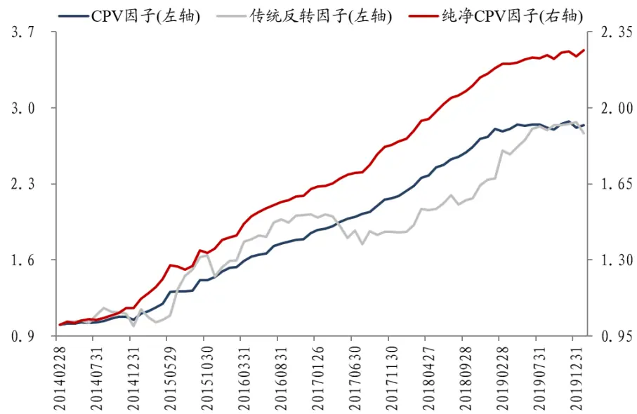
数据来源：Wind 资讯，东吴证券研究所

- 风险提示：本报告所有统计结果均基于历史数据，未来市场可能发生重大变化；单因子的收益可能存在较大波动，实际应用需结合资金管理、风险控制等方法。

uthor] 2020 年 02 月 23 日

证券分析师 高子剑

执业证号：S0600518010001

021-60199793

gaozj@dwzq.com.cn

研究助理 沈芷琦

021-60199793

shenzhq@dwzq.com.cn

## 相关研究

1、《成交量对动量因子的修正：日与夜的殊途同归》20190906

## 1. 前言

1884年，查尔斯·道和他的合伙人爱德华·琼斯首创股票市场平均价格指数，并提出了一套分析股价走势的方法和技巧，后世称之为“道氏理论”。该理论的提出标志着技术分析的起源，时至今日，历经近140年的发展，技术分析已在“道氏理论”的基础上，衍生出众多经验法则，被广泛应用于股票、商品、债券、外汇、期货等的研究分析中。但投资界关于技术分析适用性的争论从未停止，技术分析仍然受到不少专业人士的质疑：金融市场纷繁复杂，仅凭“一把尺、一支笔”就真的能行遍天下吗？

实践证明，技术分析虽不能说万无一失，但毫无疑问是存在用武之地的。就以最经典的价量关系“放量上涨”和“放量下跌”为例，前者常被用来判定强势股，后者被用来识别弱势股。下图1和图2 分别展示了 2019/10/16，中公教育（002607.SZ）和微芯生物（688321.SH）的日内分钟走势，两只股票呈现出了完全不同的形态：中公教育当日上涨3.53%，且在每一小段上涨行情中，皆伴随着成交量的放大，是技术分析中标准的“强势股”；而微芯生物则属于“弱势股”，当日下跌5.33%，且每一小段下跌行情都伴随着放量。价格走势得到量的确认，次日中公教育的强势行情得以延续，再度上涨3.74%，而微芯生物则继续下跌 2.93%。技术分析利用“价”与“量”的相互关系，有效识别了两只股票的强弱。

图 1：中公教育分钟走势图：（2019/10/16）
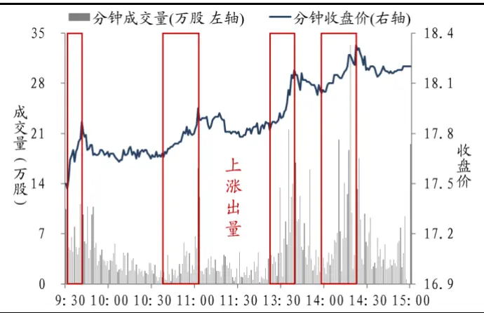
数据来源：Wind 资讯，东吴证券研究所

图 2：微芯生物分钟走势图（2019/10/16）
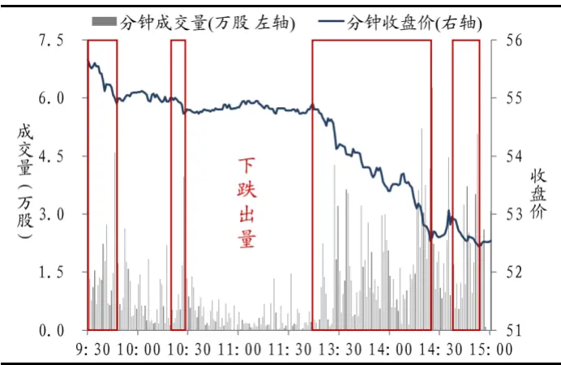
数据来源：Wind 资讯，东吴证券研究所

上述例子只是沧海一粟。东吴金工一直认为在A 股市场中，技术分析是行之有效的，不仅可用于传统的择时，而且也能在选股策略上发挥作用。因此，东吴金工开辟了“技术分析拥抱选股因子”系列研究，旨在将技术分析的思想应用于选股因子的构建。随着本系列研究内容的逐渐展开，我们将发现，许多经典朴素的技术分析思想中，其实都蕴藏着有效的选股信号。

作为系列研究第一篇，本报告将顺着前述案例的思路，从最简单的价量关系入手，考察高频价量相关性在横截面上的选股能力。在报告最后，我们希望能在各位读者面前呈现一个优秀的选股因子。

## 2. 高频价量相关性中的选股信号

上一节案例中描述的股票日内价量关系，其实可以用当日分钟收盘价与分钟成交量的相关系数来衡量，比如中公教育呈现“放量上涨”行情，则当日的价量相关系数为正；微芯生物“放量下跌”，则当日的价量相关系数为负。东吴金工试图基于上述高频价量相关性，构造选股因子。

## 2.1. 价量相关性因子的构建

经过探索，我们找到一种提炼有效信息的方案，以全体A股为研究样本（剔除其中的 ST 股、停牌股以及上市不足 60 个交易日的次新股），以 2014/01/01-2020/01/31 为回测时间段，实施以下操作：

（1）每月月底，回溯每只股票过去 20个交易日的价量信息，每日计算该股票分钟收盘价与分钟成交量的相关系数；

（2）每只股票取20日相关系数的平均值，做横截面市值中性化处理，将得到的结果记为平均数因子 PV_corr_avg；

（3）每只股票取20日相关系数的标准差，同样做市值中性化处理，将结果记为波动性因子 PV_corr_std；

（4）采用最简单的方式综合上述两个因子的信息，将 PV_corr_avg 和 PV_corr_std分别横截面标准化，等权线性相加得到价量相关性综合因子 PV_corr，即

$$
\mathrm{PV_{-}corr=\frac{PV_{-}corr_{-}avg-mean(PV_{-}corr_{-}avg)}{std(PV_{-}corr_{-}avg)}+\frac{PV_{-}corr_{-}std-mean(PV_{-}corr_{-}std)}{std(PV_{-}corr_{-}std)}}
$$

每月将所有样本按照两个子因子值分别排序分组，下图 3 和图 4 分别展示了PV_corr_avg 和PV_corr_std的 5分组及多空对冲净值走势（其中分组1因子值最小，分组5因子值最大），表1则汇报了它们多空对冲的各项绩效指标。另外，PV_corr_avg和PV_corr_std 的平均月度相关系数约为 0.15。

图 3：PV_corr_avg因子 5分组及多空对冲净值走势
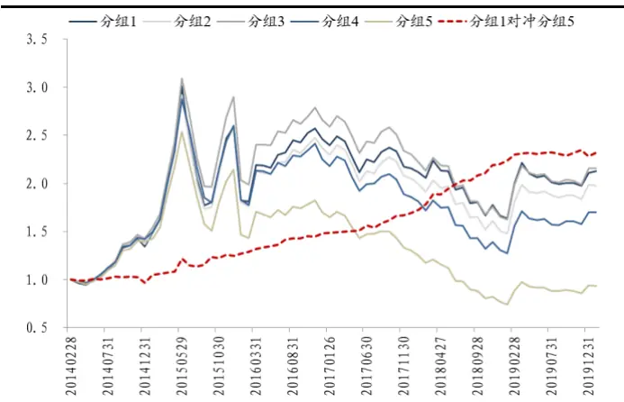
数据来源：Wind 资讯，东吴证券研究所

图 4：PV_corr_std因子 5分组及多空对冲净值走势
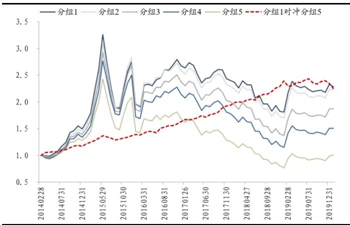
数据来源：Wind 资讯，东吴证券研究所

表 1：PV_corr_avg、PV_corr_std 因子 5 分组多空对冲的绩效指标

|  | PV_corr_avg 因子 | PV_corr_std 因子 |
| --- | --- | --- |
| 年化收益率 | 15.25% | 14.74% |
| 年化波动率 | 8.96% | 7.02% |
| 信息比率 | 1.70 | 2.10 |
| 月度胜率 | 76.06% | 76.06% |
| 最大回撤率 | 6.72% | 7.26% |

数据来源：Wind 资讯，东吴证券研究所

两个子因子各自都已具备不错的选股能力，将它们的信息加总，得到综合因子PV_corr，其月度 IC 均值为-0.058，RankIC 均值为-0.081，年化 ICIR 为-2.93，年化 RankICIR为-3.69。回测期内，综合因子5分组及多空对冲净值走势如下图5所示，多空对冲年化收益为 19.62%，年化波动 8.09%，信息比率 2.42，月度胜率 83.10%，最大回撤为 9.50%。

图 5：综合因子 PV_corr的 5分组及多空对冲净值走势
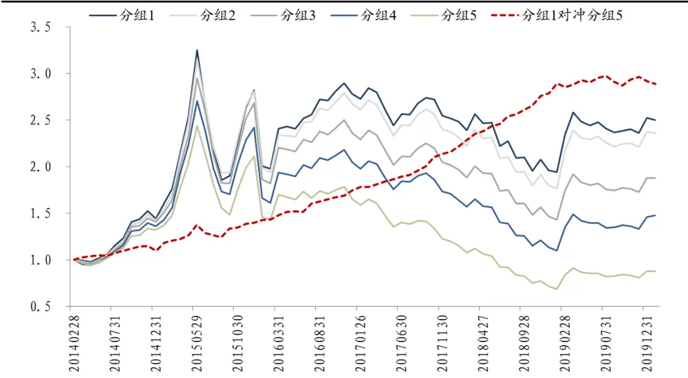
数据来源：Wind 资讯，东吴证券研究所

## 2.2. 价量相关性因子的逻辑

上一小节集中展示了高频价量相关性因子的计算方法和回测效果，这一小节我们将详细探索因子背后的逻辑。

## 2.2.1. 平均数因子

先来看平均数因子 PV_corr_avg，它衡量了股票过去 20 日价量相关性的平均水平，回测结果显示，价量相关系数越小的股票，未来收益倾向于越高。经过反复推敲，我们认为该因子其实是对传统反转因子做了修正。如下图 6所示，传统反转因子认为，股票的月度行情存在反转效应，过去 20 日上涨的股票下个月更倾向于下跌，应该归于空头；而过去 20 日下跌的股票未来更有可能上涨，下个月应该归为多头。价量相关性的平均数因子PV_corr_avg则加入量的信息，细化了反转因子对股票价格形态的分类。

图 6：平均数因子 PV_corr_avg 对传统反转的修正
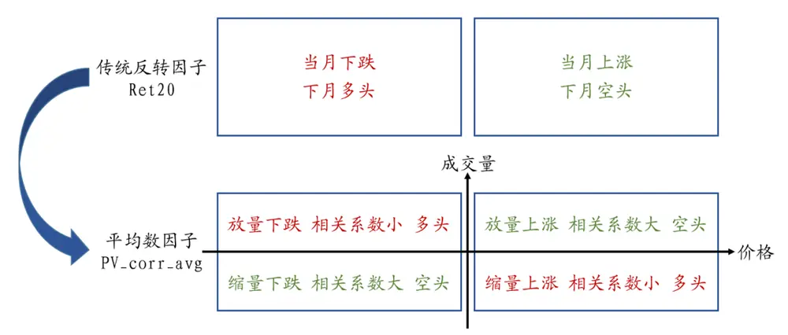
数据来源：东吴证券研究所整理

对于价格上涨，可以进一步分为放量上涨和缩量上涨，前者的价量相关系数较大，后者的价量相关系数较小，在PV_corr_avg 因子看来，两者不可混为一谈。过去放量上涨的股票，就好比武侠小说中的“末路英雄”，强弩之末，难穿鲁缟，耗尽了内力，下个月便倾向于下跌，这一点与反转因子一致；而过去缩量上涨的股票，好比有绵绵内力不断缓缓释放，上个月还未涨到尽头，仍有力量支撑，下个月便能延续之前的行情，继续上涨，这一点正好与反转因子相反。

对于价格下跌，也可以进一步分为放量下跌和缩量下跌，前者的价量相关系数小，后者的价量相关系数大，PV_corr_avg 因子对这两类股票也持有不同的态度。放量下跌的股票，PV_corr_avg 的判断与反转因子一致，认为下个月行情更容易反转，归为多头；而过去平均来看缩量下跌的股票，由于还未经历放量见底的过程，下个月的反转行情相对较弱，仍然归于空头，这一点与反转因子不同。

综上所述，平均数因子PV_corr_avg 对传统反转因子的修正逻辑可总结为：价格涨跌的反转不完全由价格自己决定，还需看成交量的信息，若有量的确认，则月度行情的反转效应更强；若没有量的确认，则月度行情的动量效应更强。

## 2.2.2. 波动性因子

再来看衡量股票过去价量相关性波动情况的 PV_corr_std 因子，回测结果显示，因子值越小，股票未来收益越高。我们也分 4 种价量关系分析该因子的选股逻辑。

对于缩量上涨和放量下跌的情形，若股票的价量相关系数波动较小，则意味着股票在过去20个交易日，每日都稳定呈现缩量上涨或放量下跌的形态，自然与PV_corr_avg因子的判断一致，将股票归为多头。

而对另外两种情形的分析，PV_corr_std因子则与PV_corr_avg不同。对于放量上涨，若价量相关系数波动较小，则意味着股票过去 20 个交易日，每日都呈现放量上涨的状态，此时它不再是“末路英雄”，而是“绝顶高手”，比如受到了众多利好信息的持续刺激，这类股票下个月应该仍然归为多头，期待上涨行情得以延续；对于缩量下跌，若股票每日都稳定呈现此状态，则 PV_corr_std 因子对该股的判断与反转因子相同，认为下个月更有可能反转，出现上涨行情。

其实，波动性因子PV_corr_std包含的选股信息也可以看做是对反转因子的一种修正：无论股票过去是上涨还是下跌，只要每日价量关系维持一种稳定的形态，PV_corr_std因子就把这只股票归为未来的多头；而价量关系在多种形态间频繁转换的股票，就会被 PV_corr_std因子归为空头。

图 7：波动性因子PV_corr_std对传统反转的修正
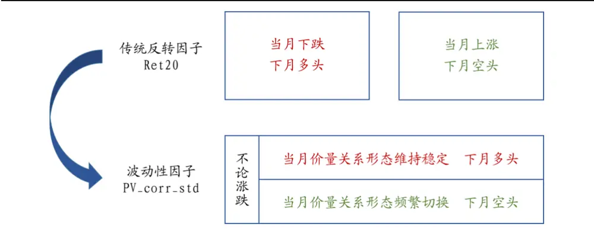
数据来源：东吴证券研究所整理

## 2.2.3. 小结与信息精炼

图 8总结了前两部分的分析，价量相关性因子可以看做是对传统反转的修正。

图 8：价量相关性因子的逻辑总结
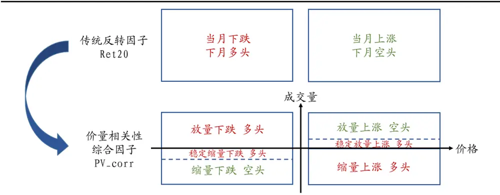
数据来源：东吴证券研究所整理

历史回测证明，上述修正是有效的。在 2014/01/01-2020/01/31期间，以全体A股为研究样本，传统反转因子（以过去 20 日收益率为例）的月度 RankIC 均值为-0.070，年化RankICIR 为-1.48，5 分组多空对冲信息比率为 1.04，月度胜率69.01%，最大回撤为14.22%，稳定性较差。而根据前述内容，由 PV_corr_avg 和 PV_corr_std 构造的综合因子 PV_corr，月度 RankIC 均值为-0.081，年化 RankICIR 为-3.69，5 分组多空对冲信息比率为2.42，月度胜率 83.10%，最大回撤为9.50%，显然优于传统反转因子。但美中不足的是，综合因子在某些时间段表现较差，如 2015年 6月至 8月、2019年 2月、2019年8 月至 9月，在这些时间段，传统反转因子的表现大多较好，高频价量相关性对反转效应进行修正的效果不尽如人意。下图9 展示了价量相关性综合因子PV_corr与传统反转因子的5分组多空对冲净值走势，表2 则比较了两者多空对冲的绩效指标。

图 9：综合因子 PV_corr与传统反转因子的多空对冲净值走势对比
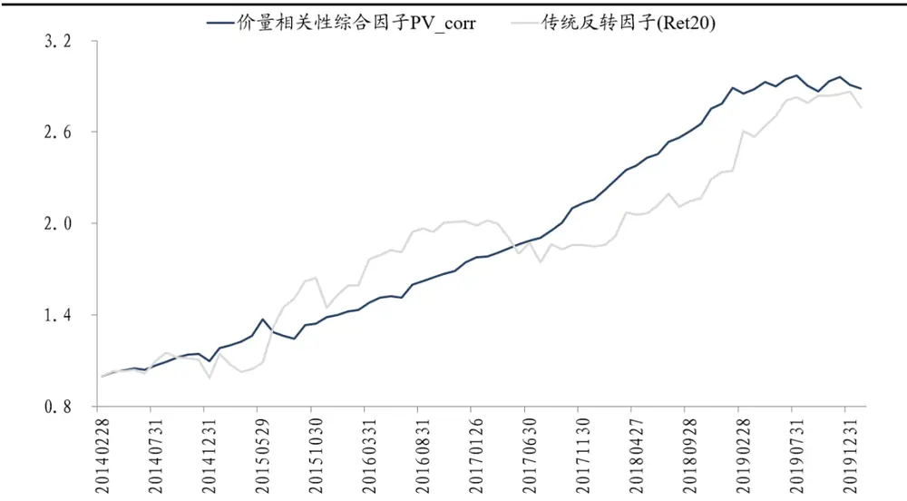
数据来源：Wind 资讯，东吴证券研究所

表 2：综合因子 PV_corr与传统反转因子的多空对冲绩效对比

| 传统反转因子(Ret20) |  | 价量相关性综合因子 PV_corr |
| --- | --- | --- |
| 年化收益率 | 18.74% | 19.62% |
| 年化波动率 | 18.03% | 8.09% |
| 信息比率 | 1.04 | 2.42 |
| 月度胜率 | 69.01% | 83.10% |
| 最大回撤率 | 14.22% | 9.50% |

数据来源：Wind 资讯，东吴证券研究所

既然可以看做是对传统反转因子的修正，价量相关性因子的选股信息必然与传统反转存在重叠。检验结果显示，综合因子PV_corr与反转因子的平均月度相关系数约为0.16。因此，我们可进一步精炼选股信息，先将两个子因子 PV_corr_avg 和 PV_corr_std 分别剔除反转因子，再各自横截面标准化，等权线性相加构建综合因子，将得到的新因子记为 PV_corr_deRet20。

在回测期 2014/01/01-2020/01/31 内，新因子的月度 IC 均值为-0.054，RankIC 均值为-0.076，年化 ICIR 为-3.28，年化 RankICIR 为-4.17。下图 10 展示了新因子的 5 分组及多空对冲净值走势，表3 对比了其与传统反转因子多空对冲的各项绩效指标，表 4则报告了因子各年度的表现情况。相比于传统反转因子，PV_corr_deRet20 因子在维持年化收益不变的情况下，大幅提高了稳定性，信息比率达到 2.86，月度胜率为 84.51%，最大回撤仅为 3.67%。

剔除反转因子之后的新因子，在整体上具有更优秀的选股能力，但由于反转效应在2019年的表现非常好（2019年传统反转因子Ret20的5分组多空对冲信息比率为2.09，月度胜率 83.33%），价量相关性因子的修正效果不太理想。

图 10：新因子 PV_corr_deRet20 的 5 分组及多空对冲净值走势
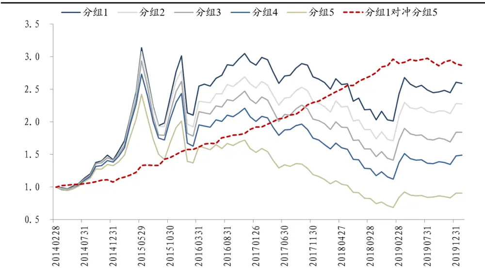
数据来源：Wind 资讯，东吴证券研究所

表 3：新因子 PV_corr_deRet20与传统反转因子的多空对冲绩效对比

| 传统反转因子(Ret20) |  | 新因子 PV_corr_deRet20 |
| --- | --- | --- |
| 年化收益率 | 18.74% | 19.50% |
| 年化波动率 | 18.03% | 6.83% |
| 信息比率 | 1.04 | 2.86 |
| 月度胜率 | 69.01% | 84.51% |
| 最大回撤率 | 14.22% | 3.67% |

数据来源：Wind 资讯，东吴证券研究所

表 4：新因子 PV_corr_deRet20 分年度表现

|  | 年化收益率 |  | 分组 1 对冲分组 5 绩效指标 |  |  |  |
| --- | --- | --- | --- | --- | --- | --- |
| 年份 | 分组1 | 分组5 | 分组 1 对冲分组 5 | 年化波动率 信息比率 | 月度胜率 | 最大回撤率 |
| 2014 | 52.27% | 40.44% | 8.90% | 5.35% | 1.66 80.00% | 3.40% |
| 2015 | 112.25% | 51.88% | 44.04% | 9.65% 4.56 | 91.67% | 0.76% |
| 2016 | -2.97% | -21.14% | 21.98% | 5.33% 4.12 | 83.33% | 0.18% |
| 2017 | -9.18% | -26.88% | 23.11% | 3.68% | 6.29 100.00% | 0.00% |
| 2018 | -23.38% | -38.27% | 23.38% | 2.69% | 8.70 100.00% | 0.00% |
| 2019 | 28.39% | 26.17% | 0.87% | 6.08% | 0.14 58.33% | 3.67% |

数据来源：Wind 资讯，东吴证券研究所

## 3. 进一步探索：趋势因子的增量信息

在前文研究的基础上，我们额外发现股票价量相关性的变化趋势也能带来一些增量信息，因此本节内容做进一步探索，挖掘新信息，并在最后呈现包含价量相关性3个维度信息的最终因子。

## 3.1. 价量相关性的趋势因子

本节介绍的选股因子计算过程如下：

（1）每月月底，仍然回溯每只股票过去 20个交易日的价量信息，每日计算该股票分钟收盘价与分钟成交量的相关系数；

（2）将每只股票的20个相关系数 $\mathcal{P}_{t}$ 对时间t回归，取回归系数 $\boldsymbol{\cdot}\beta$ ，即 $\rho_{t}=\beta*t+\varepsilon_{t}$ 其中，t取值为 1,2,3,……,20；

（3）将所有股票的回归系数β在横截面上剔除市值、传统价量类因子（20日反转、20日换手率、20日波动率因子），将得到的结果定义为趋势因子PV_corr_trend。

仍以全体 A 股为研究样本（剔除其中的 ST 股、停牌股以及上市不足 60 个交易日的次新股），在回测期 2014/01/01-2020/01/31 内，趋势因子 PV_corr_trend 的月度 IC 均值为-0.042，RankIC 均值为-0.057，年化 ICIR 为-3.45，年化 RankICIR 为-3.97，因子值越小，即价量相关系数随时间推移变小的股票，未来收益倾向于越高，这与平均数因子PV_corr_avg 的逻辑相呼应。下图11 展示了趋势因子的 5 分组及多空对冲净值走势，表5 则报告了因子各年度的表现情况。在整个时间段上，趋势因子 5 分组多空对冲的年化收益为 14.55%，信息比率为 2.83，月度胜率 85.92%，最大回撤为 2.45%。虽然整体分组不严格单调（分组 2 优于分组 1），但多空对冲在 2019 年的表现明显优于上一节的$\mathrm{PV\_corr\_deRet}20$ 因子。

图 11：趋势因子 PV_corr_trend 的 5 分组及多空对冲净值走势
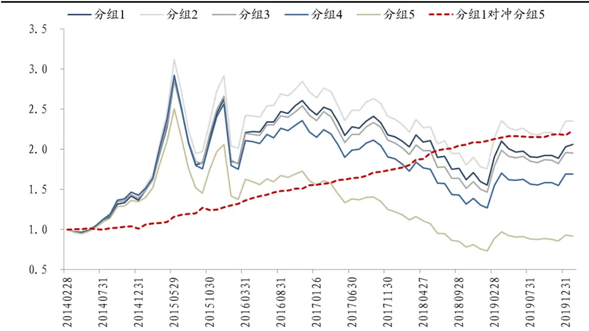
数据来源：Wind 资讯，东吴证券研究所

表 5：趋势因子 PV_corr_trend 分年度表现

|  | 年化收益率 |  |  | 分组 1 对冲分组 5 绩效指标 |  |  |  |
| --- | --- | --- | --- | --- | --- | --- | --- |
| 年份 | 分组1 | 分组5 | 分组 1 对冲分组 5 | 年化波动率 | 信息比率 | 月度胜率 | 最大回撤率 |
| 2014 | 44.85% | 43.01% | 1.45% | 3.81% | 0.38 | 70.00% | 2.45% |
| 2015 | 92.97% | 53.11% | 26.45% | 8.43% | 3.14 | 91.67% | 2.43% |
| 2016 | -4.88% | -21.93% | 21.16% | 2.85% | 7.43 | 100.00% | 0.00% |
| 2017 | -13.63% | -23.98% | 13.32% | 2.47% | 5.40 | 100.00% | 0.00% |
| 2018 | -25.97% | -37.92% | 18.76% | 4.28% | 4.38 | 91.67% | 0.07% |
| 2019 | 27.07% | 22.08% | 4.23% | 2.35% | 1.80 | 58.33% | 0.73% |

数据来源：Wind 资讯，东吴证券研究所

## 3.2. 最终的价量相关性因子——CPV

经检验，上一小节介绍的趋势因子 PV_corr_trend 在剔除原来的综合因子PV_corr_deRet20 后，仍然具有一定的选股能力，因此我们将 PV_corr_trend 带来的增量信息叠加到 PV_corr_deRet20 之上，最终因子命名为 CPV 因子（Correlation of Price andVolume），涵盖了本篇报告提出的价量相关性 3个维度上的综合信息：

$$
\begin{array}{r}{\mathrm{CPV}=\frac{\mathrm{PV}_{-}\mathrm{corr}_{-}\mathrm{deRet}20\mathrm{-}\mathrm{mean}(\mathrm{PV}_{-}\mathrm{corr}_{-}\mathrm{deRet}20)}{\mathrm{std}(\mathrm{PV}_{-}\mathrm{corr}_{-}\mathrm{deRet}20)}}\\{+\frac{\mathrm{PV}_{-}\mathrm{corr}_{-}\mathrm{trend-}\mathrm{mean}(\mathrm{PV}_{-}\mathrm{corr}_{-}\mathrm{trend})}{\mathrm{std}(\mathrm{PV}_{-}\mathrm{corr}_{-}\mathrm{trend})}}\end{array}
$$

图 12：CPV因子总结
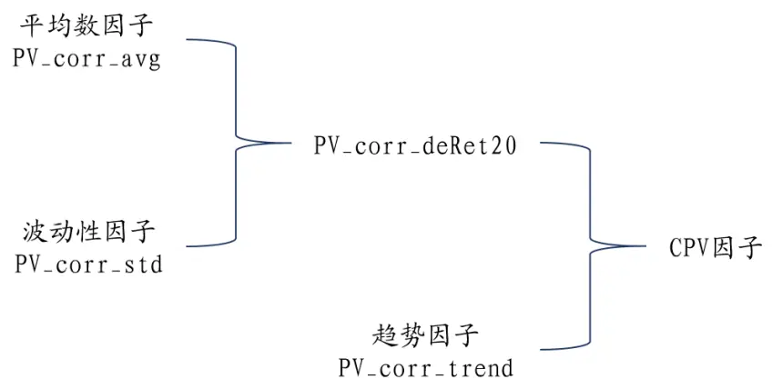
数据来源：东吴证券研究所整理

回测结果显示，CPV 因子的月度 IC 均值为-0.053，RankIC 均值为-0.073，年化 ICIR为-3.77，年化 RankICIR 为-4.53。下图 13、14 分别展示了 CPV 因子的 5 分组回测、多空对冲净值走势，表 6 比较了 CPV 因子与传统反转因子（Ret20）5 分组多空对冲的各项绩效指标，表 7 则报告了 CPV 因子各年度的表现情况。回测期 2014/01/01-2020/01/31内，CPV因子的年化收益为19.29%，信息比率达到3.03，月度胜率为87.32%，最大回撤仅为 2.90%。

相比于PV_corr_deRet20，CPV 因子在2019年的表现虽然得到了些许提升，但仍然不太理想。所幸的是，2020 年 1 月份，传统反转因子（Ret20）发生较大回撤，其 5 分组多空对冲收益为-3.65%，而当月CPV因子取得了正向收益 0.71%，价量相关性带来的增量信息对反转因子进行了正确的修正。

图 13：CPV因子 5分组回测净值走势
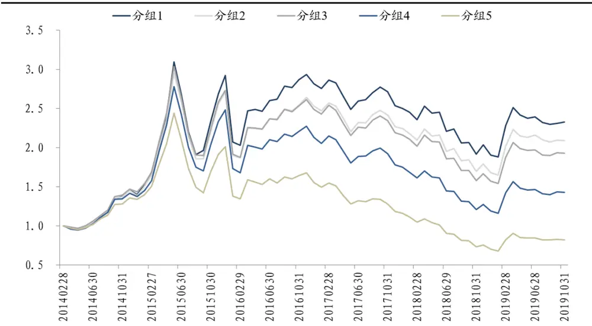
数据来源：Wind 资讯，东吴证券研究所

图 14：CPV因子与反转因子 5分组多空对冲净值走势
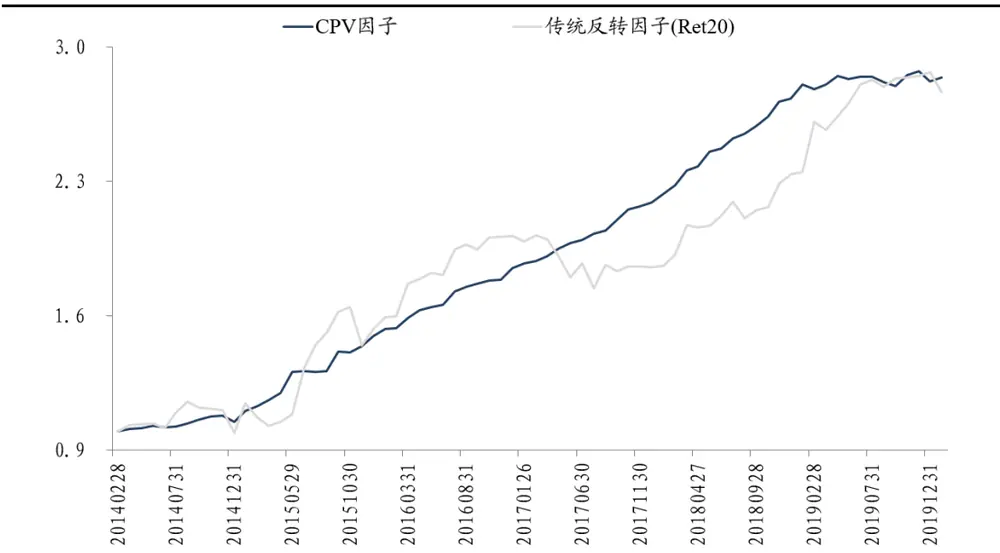
数据来源：Wind 资讯，东吴证券研究所

表 6：CPV因子与反转因子 5分组多空对冲的绩效指标对比

| 传统反转因子(Ret20) |  | CPV 因子 |
| --- | --- | --- |
| 年化收益率 | 18.74% | 19.29% |
| 年化波动率 | 18.03% | 6.36% |
| 信息比率 | 1.04 | 3.03 |
| 月度胜率 | 69.01% | 87.32% |
| 最大回撤率 | 14.22% | 2.90% |

数据来源：Wind 资讯，东吴证券研究所

表 7：CPV因子分年度表现

|  | 年化收益率 |  |  | 分组 1 对冲分组 5 绩效指标 |  |  |  |
| --- | --- | --- | --- | --- | --- | --- | --- |
| 年份 | 分组1 | 分组5 | 分组 1 对冲分组 5 | 年化波动率 | 信息比率 | 月度胜率 | 最大回撤率 |
| 2014 | 49.82% | 42.13% | 5.81% | 4.80% | 1.21 | 80.00% | 2.90% |
| 2015 | 108.57% | 50.05% | 42.53% | 10.10% | 4.21 | 83.33% | 0.23% |
| 2016 | -3.67% | -22.82% | 23.69% | 4.36% | 5.43 | 100.00% | 0.00% |
| 2017 | -11.13% | -25.40% | 18.49% | 2.50% | 7.39 | 100.00% | 0.00% |
| 2018 | -23.79% | -39.21% | 24.64% | 3.12% | 7.90 | 100.00% | 0.00% |
| 2019 | 28.55% | 23.87% | 3.29% | 4.48% | 0.73 | 58.33% | 1.82% |

数据来源：Wind 资讯，东吴证券研究所

## 4. 其他重要讨论

## 4.1. 纯净 CPV因子的选股能力

得到了最终的价量相关性CPV因子后，我们考察其与市场常用风格因子的相关性，下表8展示了CPV因子与10个Barra风格因子的相关系数（此处，Barra模型中的动量、波动、流动性因子，分别用传统 20日反转因子 Ret20、20日波动率因子Vol20、20日换手率因子Turn20代替）。

表 8：CPV因子与 Barra风格因子相关系数

|  | CPV 因子 |  | CPV 因子 |
| --- | --- | --- | --- |
| Beta | 0.0685 | Size | 0.0124 |
| BooktoPrice | -0.0844 | NonLinearSize | -0.0318 |
| EarningsYield | -0.0747 | Ret20 | 0.0000 |
| Growth | 0.0018 | Vol20 | 0.1087 |
| Leverage | 0.0309 | Turn20 | 0.1249 |

数据来源：Wind 资讯，东吴证券研究所

为了剔除风格和行业的干扰，每月月底将 CPV 因子对 Barra 风格因子和 28 个申万一级行业虚拟变量进行回归，将残差作为选股因子。回测结果显示，剔除风格和行业后，纯净 CPV 因子的选股能力有所提升，其月度 IC 均值为-0.042，RankIC 均值为-0.056，年化 ICIR 为-4.19，年化 RankICIR 为-5.33，5 分组多空对冲的年化收益为 14.81%，信息比率高达 3.43，月度胜率 87.32%，最大回撤仅为 1.58%。表 9 汇报了纯净 CPV 因子各年度的表现情况，相比于原来的 CPV 因子，其在 2019 年的表现也得到了较大改善。

图 15：纯净 CPV因子 5分组回测净值走势
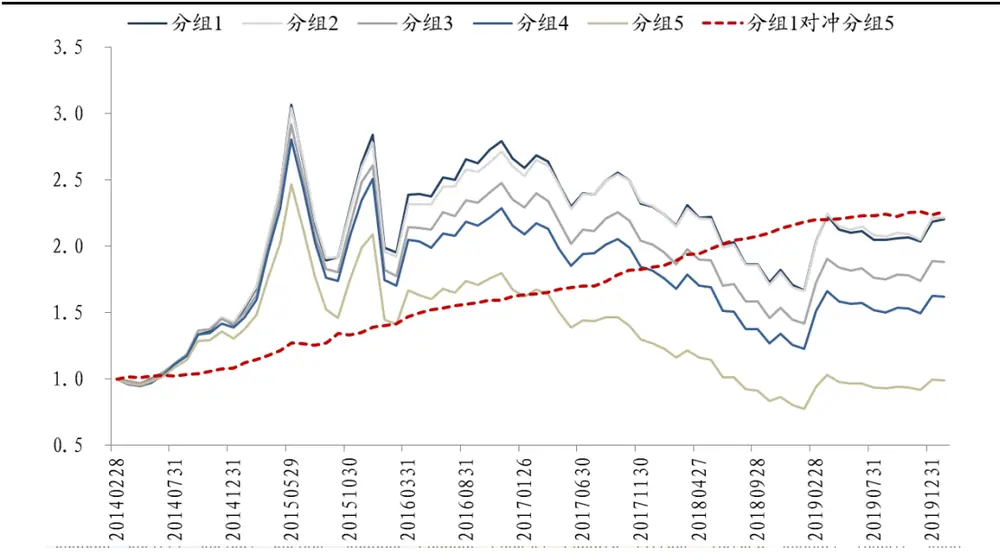
数据来源：Wind 资讯，东吴证券研究所

表 9：纯净 CPV因子分年度表现

|  | 年化收益率 |  |  | 分组 1 对冲分组 5 绩效指标 |  |  |  |
| --- | --- | --- | --- | --- | --- | --- | --- |
| 年份 | 分组1 | 分组5 | 分组 1 对冲分组 5 | 年化波动率 | 信息比率 | 月度胜率 | 最大回撤率 |
| 2014 | 50.38% | 37.62% | 9.58% | 2.45% | 3.91 | 80.00% | 0.37% |
| 2015 | 102.46% | 60.16% | 28.97% | 7.31% | 3.97 | 75.00% | 1.58% |
| 2016 | -6.46% | -19.87% | 16.85% | 3.22% | 5.23 | 100.00% | 0.00% |
| 2017 | -13.60% | -24.15% | 13.54% | 2.70% | 5.02 | 100.00% | 0.00% |
| 2018 | -25.61% | -36.62% | 16.82% | 2.15% | 7.81 | 100.00% | 0.00% |
| 2019 | 27.86% | 23.30% | 3.69% | 2.26% | 1.63 | 66.67% | 0.95% |

数据来源：Wind 资讯，东吴证券研究所

## 4.2. CPV 因子的参数敏感性

改变每月月底的回看天数，本篇报告发掘的价量相关性信息，仍然可以对传统反转因子进行有效改进。图 16、17 分别展示了在回看40、60 个交易日的情况下，CPV 因子与传统反转因子的 5 分组多空对冲净值走势，表 10 则比较了两者的各项绩效指标。可以看到，无论是回看 40还是 60个交易日，CPV因子均大幅优于传统反转因子。

图 16：CPV、反转因子 5分组对冲净值（回看 40日）
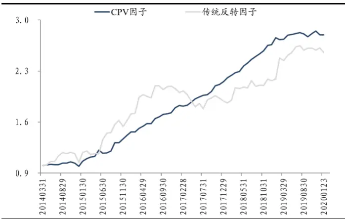
数据来源：Wind 资讯，东吴证券研究所

图 17：CPV、反转因子 5分组对冲净值（回看 60日）
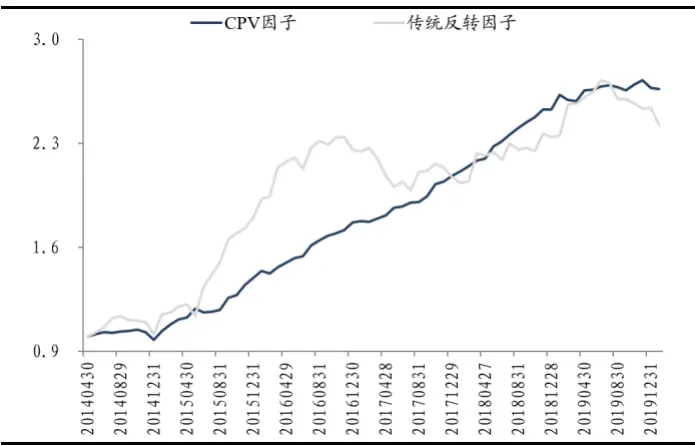
数据来源：Wind 资讯，东吴证券研究所

表 10：CPV、反转因子 5分组多空对冲的绩效指标对比（回看 40、60日）

|  | 年化收益率 | 年化波动 | 信息比率 | 月度胜率 | 最大回撤率 |
| --- | --- | --- | --- | --- | --- |
| 回看40 日 | 传统反转因子 17.40% | 16.04% | 1.08 | 60.00% | 14.92% |
|  | CPV 因子 19.29% | 7.40% | 2.61 | 84.29% | 5.75% |
| 回看 60 日 | 传统反转因子 16.63% | 15.55% | 1.07 | 60.87% | 15.26% |
|  | CPV 因子 18.59% | 6.97% | 2.67 | 82.61% | 6.85% |

数据来源：Wind 资讯，东吴证券研究所

## 4.3. 其他样本空间的情况

最后，检验本篇报告提出的 CPV 因子在不同样本空间的表现。以回看 20 日为例，在沪深300成分股中，传统反转因子的 5分组多空对冲年化收益为7.07%，信息比率为0.30，月度胜率 52.11%；CPV 因子的 5 分组多空对冲年化收益为 12.11%，信息比率为1.19，月度胜率 71.83%。在中证500成分股中，传统反转因子的 5分组多空对冲年化收益为 7.36%，信息比率为 0.43，月度胜率 56.34%；CPV 因子的 5 分组多空对冲年化收益为 15.67%，信息比率为1.86，月度胜率 74.65%。在沪深 300 和中证 500 成分股中，CPV 因子的选股能力均显著优于传统反转因子。

图 18：沪深 300成分股 CPV 因子 5 分组对冲净值
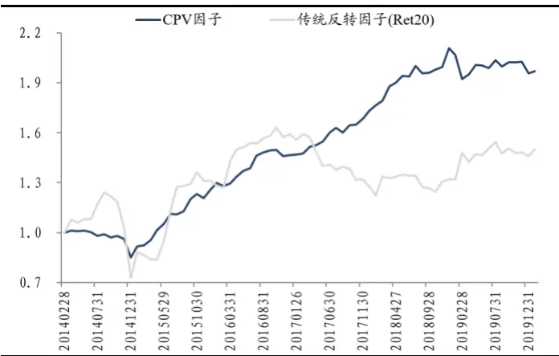
数据来源：Wind 资讯，东吴证券研究所

图 19：中证 500成分股 CPV 因子 5分组对冲净值
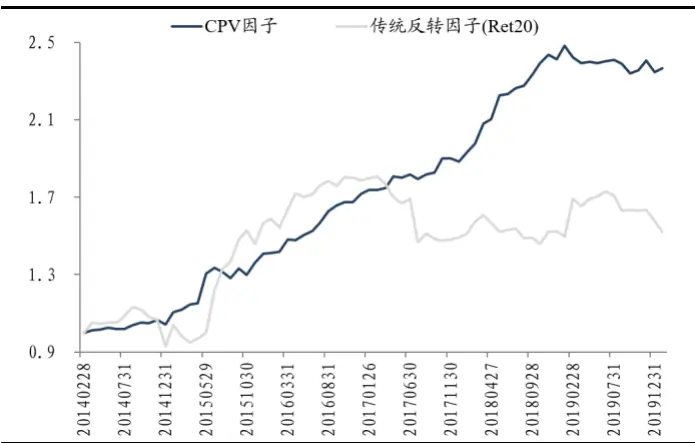
数据来源：Wind 资讯，东吴证券研究所

表 11：沪深 300、中证 500成分股多空对冲绩效指标对比

|  | 年化收益率 | 年化波动 | 信息比率 | 月度胜率 | 最大回撤率 |
| --- | --- | --- | --- | --- | --- |
| 沪深300 | 传统反转因子 7.07% | 23.22% | 0.30 | 52.11% | 41.50% |
|  | CPV 因子 12.11% | 10.15% | 1.19 | 71.83% | 16.00% |
| 中证500 | 传统反转因子 7.36% | 17.20% | 0.43 | 56.34% | 19.31% |
|  | CPV 因子 15.67% | 8.41% | 1.86 | 74.65% | 5.74% |

数据来源：Wind 资讯，东吴证券研究所

## 5. 总结

本篇报告从技术分析中最简单的价量关系入手，在计算股票每日高频价量相关系数的基础上，逐步挖掘了其中蕴藏的选股因子。

首先，我们定义了价量相关性的平均数因子和波动性因子。研究发现，两者其实都可以看做是对传统反转因子的修正。平均数因子认为，股票的月度行情是否反转需要看成交量的信息，若有量的确认，则月度行情的反转效应更强；而若没有量的确认，则月度行情更容易呈现动量效应。波动性因子则不论股票过去价格的涨跌，只要每日价量关系维持稳定形态，下个月就更有可能上涨；而价量关系在多种形态间频繁转换的股票，下个月更有可能下跌。

其次，我们发现股票价量相关性的变化趋势也具有不错的选股能力，因此定义了趋势因子。回测结果显示，上个月的趋势因子值越小，即价量相关系数随时间推移逐渐变小的股票，下个月的收益倾向于越高，这与平均数因子的选股逻辑相呼应。

最后，本篇报告综合上述 3 个维度的信息，构建了最终的价量相关性因子 CPV，其各项回测指标均大幅优于传统反转因子。即使剔除市场常用风格和行业的干扰，纯净CPV 因子仍然具备良好的选股能力。

## 6. 风险提示

本报告所有统计结果均基于历史数据，未来市场可能发生重大变化；单因子的收益可能存在较大波动，实际应用需结合资金管理、风险控制等方法。

## 免责声明

东吴证券股份有限公司经中国证券监督管理委员会批准，已具备证券投资咨询业务资格。

本研究报告仅供东吴证券股份有限公司（以下简称“本公司”）的客户使用。本公司不会因接收人收到本报告而视其为客户。在任何情况下，本报告中的信息或所表述的意见并不构成对任何人的投资建议，本公司不对任何人因使用本报告中的内容所导致的损失负任何责任。在法律许可的情况下，东吴证券及其所属关联机构可能会持有报告中提到的公司所发行的证券并进行交易，还可能为这些公司提供投资银行服务或其他服务。

市场有风险，投资需谨慎。本报告是基于本公司分析师认为可靠且已公开的信息，本公司力求但不保证这些信息的准确性和完整性，也不保证文中观点或陈述不会发生任何变更，在不同时期，本公司可发出与本报告所载资料、意见及推测不一致的报告。

本报告的版权归本公司所有，未经书面许可，任何机构和个人不得以任何形式翻版、复制和发布。如引用、刊发、转载，需征得东吴证券研究所同意，并注明出处为东吴证券研究所，且不得对本报告进行有悖原意的引用、删节和修改。

## 东吴证券投资评级标准：

公司投资评级：

买入：预期未来 6个月个股涨跌幅相对大盘在 15%以上；

增持：预期未来 6个月个股涨跌幅相对大盘介于 5%与15%之间；

中性：预期未来 6个月个股涨跌幅相对大盘介于-5%与5%之间；

减持：预期未来 6个月个股涨跌幅相对大盘介于-15%与-5%之间；

卖出：预期未来 6个月个股涨跌幅相对大盘在-15%以下。

行业投资评级：

增持： 预期未来 6个月内，行业指数相对强于大盘 5%以上；

中性： 预期未来 6个月内，行业指数相对大盘-5%与5%；

减持： 预期未来 6个月内，行业指数相对弱于大盘 5%以上。

