# 方正证券研究所证券研究报告

市场微观结构剖析系列 6

金融工程研究

2020.02.27

分析师：朱定豪

执业证书编号：S1220519040002

E-mail：zhudinghao@foundersc.com

首席分析师：严佳炜

执业证书编号：S1220519090003

E-mail：yanjiawei@foundersc.com

## 相关研究

[《TABLE_REPORTINFO股“跳一跳”：隔夜跳空选股因子] 》《超越反转：基于均线的乖离率选股因子》

《量价齐飞，水天一色：基于价量互动的选股因子 2》

《量价抢跑，推陈出新：基于价量互动的选股因子 3》

《分钟线的尾部特征》

## 请务必阅读最后特别声明与免责条款

## 报告要点

## 核心结论

本篇报告是量价互动选股因子的续篇，笔者将前几篇中低频（日频）Alpha 因子的研究结论和构建方法移植到日内高频数据上。研究发现，日内高频量价关系和日度量价关系之间有着微妙的联系，因子构建的逻辑可以相互印证，因子构建的方法基本可以迁移，但两者时间尺度上的差异导致微观交易结构出现变化，使得因子构建的细节呈现出一定的差异。

我们从“价-量”、“涨跌幅-量”两个视角出发，讨论了常态下量价关系与异常量价关系蕴藏的 Alpha，构建了三个不同的 Alpha 因子。因子算法捕捉的是微观层面的量价纠缠，或许反映的是宏观层面的个股投机与泡沫，日内交易平稳的股票次月更容易上涨。进一步，我们通过时间序列错期、低流动性剔除、日内成交额分布标准化等算法变形，提升了因子的预测能力。

对常见因子中性后，等权合成因子的IC均值仍有-5.03%，RankIC 均值为-5.73%，年化 ICIR 为-4.31。2014-2019 年，因子十分组收益分化明显，多空组合年化收益达到 22.51%，年化波动 5.48%，年化 IR达到4.11，月度胜率超过85%，最大回撤仅 4.92%，表现非常优秀。

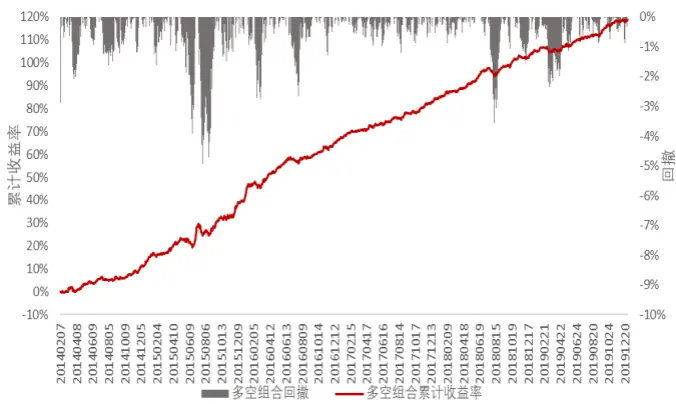
资料来源：Wind资讯，方正证券研究所

## 风险提示

本报告基于历史个股高频数据进行测试，历史回测结果不代表未来收益。未来市场风格可能切换，微观交易结构可能发生变化，Alpha因子可能失效，本文内容仅供参考。

## 1 量价关系的两个视角

本篇报告是“市场微观结构剖析”系列的第六篇，系列报告从行为金融学的视角出发，捕捉市场异常交易行为，挖掘隐藏在海量数据之下的 Alpha。

笔者曾在《量价齐飞，水天一色：基于价量互动的选股因子 》、《量价抢跑，推陈出新：基于价量互动的选股因子 》等报告中多维度地探讨了基于日度量价关系的 因子的构建。继承这种研究方法，本篇报告从日度向高频进发，基于分钟级别的量价关系构建选股因子。研究发现，日内高频量价关系和日度量价关系之间有着微妙的联系，因子构建的逻辑可以相互印证，因子构建的方法基本可以迁移。但两者时间尺度上的差异导致微观交易结构出现变化，使得因子构建的细节呈现出一定的差异。

## 直觉上，量价关系有两个研究视角：

一是股价与成交额之间的关系，这种关系我们常表述为“天量见天价、地量见地价”、“放量上涨、缩量下跌”等口耳相传的交易经验。在 线图上，我们可以观察股价 和成交额 两条曲线的运动轨迹，以“量价同向”或是“量价背离”来描述两者的关系。统计表明，在日度级别上，量价同向的现象更为常见，两者月度相关性均值达到 0.43（中位数 0.49），股价上涨时常常会伴随着成交量的上升，股价下跌时会伴随着成交量的下降，异常的量价关系蕴藏 Alpha；在分钟级别上，量价相关性均值下降至 附近，暗示日内量价同向的关系被打破。上述日度价量关系，笔者在报告《量价齐飞，水天一色：基于价量互动的选股因子 》中进行了研究，本文继而探讨在高频分钟级别上两者的联系。

二是涨跌幅与成交额之间的关系，涨跌幅是股价的变动速率，两者的关系较难从 线图上直接观测，是更深层次的量价关系。一定程度上，涨跌幅与成交额的关系可以用来表征主力交易行为，例如统计区间成交额异常增加的时段，可能代表增量资金入市，观察股票倾向于上涨还是下跌、波动（涨跌幅的绝对值）的增加与下降，可以刻画该股票的微观交易结构，表征股票短期的交易热度。我们在报告《量价抢跑，推陈出新：基于价量互动的选股因子 》中讨论了日度级别上的这种量价互动与因子构建。特别的，我们发现数据的错期匹配带来了增量 Alpha，成交量抢跑暗示了知情交易者的交易行为，本文也将这种研究方法运用在高频数据上。

图表1： 量价关系的两个研究视角
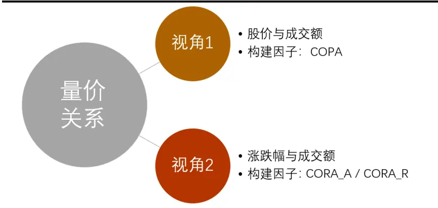
资料来源：方正证券研究所

## 2 从日频走向高频

## 2.1 数据统计性质差异

我们常假设股票交易价格服从几何布朗运动，则股票的对数收益率服从正态分布。公式暗示股票价格在短时期内的变动主要来源于两个方面： 、预期收益率的变化， 、随机波动项。许多现代金融模型都依赖于上述假设，例如 的期权定价模型等。

$$
dS_{t}=\mu S_{t}dt+\sigma S_{t}dW_{t}
$$

真实的股票日频交易数据基本符合上述模型，当我们把目光从日频数据转向高频数据时，学者发现几何布朗运动并不能很好地描述高频数据的特征，可能需要引入罗尔（ ）等高频交易价格模型。例如Joel Hasbrouck在《市场微观结构实证》一书中提出，相比于日频数据，日内高频价格数据至少具有以下三个特征：

## 1）当数据间隔足够小时，漂移项均值μ接近于零

2）数据具有极值离散的特征，以至于高频数据的偏度、峰度、甚至方差都被怀疑是否有界。

3）高频数据的自相关性大幅上升，而日度序列自相关性较低。

更为重要的变化来自于成交额的日内分布特征，日内各分钟的成交额显然不是同分布的，并且呈现出明显的 型（或 型）特征，成交额的峰值比较容易出现在开盘和收盘，早尾盘交易情绪高涨，而盘中单位分钟的成交额下降，此外午后第一分钟成交额也有明显的放量（案例详见图表 37）。

本系列报告主要基于量价的相关性构建因子，日频和日内高频数据统计性质有差异，导致日频因子和高频因子之间既有相似的结论，也有微妙的差异，是本篇报告的理论基石。

## 2.2 量价同向关系的打破

图表 2 展现了上证综指（000001.SH）从 2014 年 1 月 1 日至 2019年 月 日的日度收盘价以及日度成交额的整体走势，图表中的成交额与价格呈现出明显的同向变化的特征，有“放量上涨，缩量下跌”的现象，个股的日度量价关系也有类似结论。根据之前报告测算，个股 日价格序列与成交额序列的相关性系数均值在 左右（中位数0.49），暗示常态下价量倾向于同向变化。

图表 3 展示了平安银行（000001.SZ）2019 年最后 5 个交易日的分钟股价与成交额的走势图。由于日内分钟成交额分布不独立且极值较多，量价同向的关系被打破，两者没有呈现出显著的关系，因此日度COPA因子和日内高频COPA因子均值有明显的差异。

图表2： 上证综指日度收盘价与成交额关系
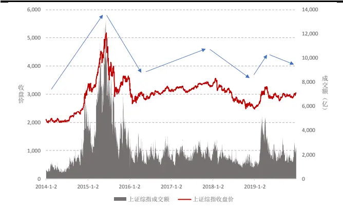
资料来源：Wind资讯，方正证券研究所

图表3： 平安银行2019年最后5日高频量价关系
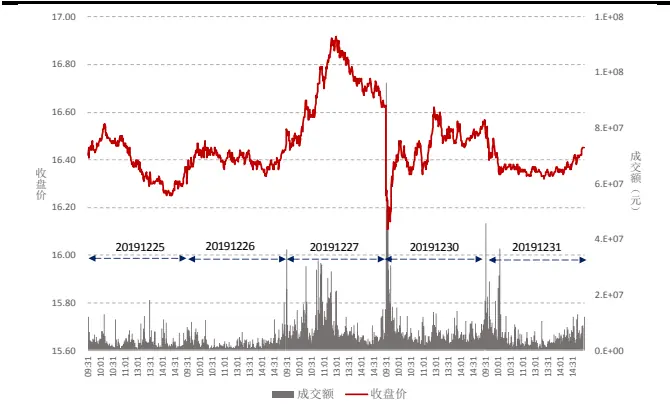
资料来源：Wind资讯，方正证券研究所

“慧博资讯”专业的投资研究大数据分享平台

## 2.3 价格冲击对称性的提升

第二个视角是股价变动与成交量之间的关系，实际上关注的是股票涨跌幅与成交量之间的关系。Karpoff（1987）对学界已有关于股价变动和交易量的研究进行了回顾和梳理，发现股票交易量和股价变动及变动的绝对值都正相关，并由此提出了不对称交易量-股价变化假说（asymmetric volume-price change hypothesis）。如图表 4 所示，他认为价格涨幅增大时，量也会同时放大；价格跌幅增大时，量也会同时放大，但极端上涨往往伴随着更高的成交额，即纵轴左侧的斜率绝对值小于纵轴右侧。

在此前的日度量价因子报告中，我们曾经将标准化涨跌幅从小到大等量分成 组（剔除涨跌停），统计各组标准化换手率的均值，见图表 。图像整体呈现出 型分布的特征，即股票涨幅较大和跌幅较大时都会放量。进一步地，图像呈现出左低右高的非对称 型分布，这表明，极端上涨的股票成交量异常大，这和论文的结论基本吻合。

造成这种现象的可能原因是散户追涨的交易习惯，因此极端上涨时能带动更多的成交量。A 股目前实行T+1交易制度，日度有±10%涨跌停板限制，上述交易制度与散户的追涨杀跌的交易心理共振，催生了游资“涨停敢死队”式的交易手法。

图表4： 不对称的股价变动与交易量
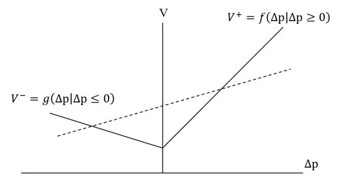
资料来源：Wind资讯，方正证券研究所

图表5： 涨跌幅与换手率的关系
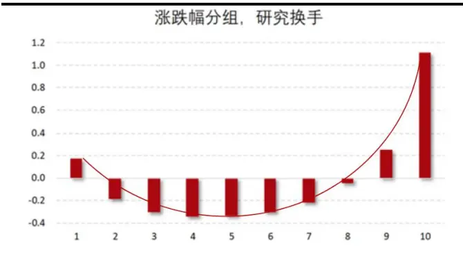
资料来源：Wind资讯，方正证券研究所

高频分钟数据上，涨跌幅与换手率呈现出基本对称的 型关系，对称性明显提升。我们使用个股分钟收益率来表示“涨跌幅”，使用换手率来表示“量”，在剔除异常值后，按照涨跌幅从小到大等量分为10组，统计各组换手率的均值。

相比于日度数据，高频数据具有更好的统计特征，这可能是因为高频交易数据更加纯粹，投机资金较难操纵日内 分钟每一分钟的价量数据。由于这种对称关系，我们使用分钟涨跌幅的绝对值来代理变量“价格变动”，考察单位资金与价格变动的关系。

图表6： 不对称的股价变动与交易量
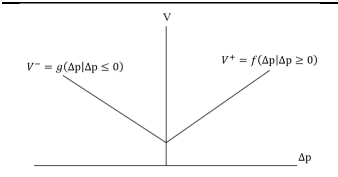
资料来源：Wind资讯，方正证券研究所

图表7： 高频下涨跌幅与换手率的关系
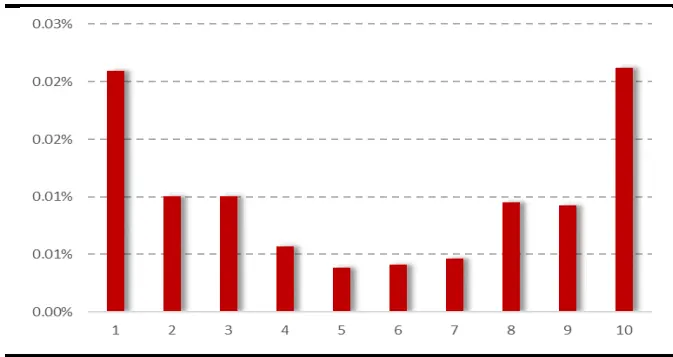
资料来源：Wind资讯，方正证券研究所

## 3 两个高频量价关系因子

## 3.1 因子的初步构建

首先，我们在分钟频度上构建初始因子 COPA(Correlationcoefficient between Price and Amount)，衡量分钟价格和分钟成交额的相关程度：

$$
COPA=corr(P_{t},A_{t}),\quad t\in[1{,}240]
$$

其中 $P_{t}$ 为个股日内第 分钟的收盘价， $A_{t}$ 为个股日内第 分钟的成交额。每只股票每日可以得到一个日内量价相关系数，为了得到月度因子值，我们以月末为基日，前溯 个交易日，取 日因子平均值作为月度因子值（参数敏感性测试见 5.3节）。研究发现使用成交额、成交量或者换手率区别不大，原因是个股的价格在日内变动有限。隔日价格变动相较于日内价格变动跳跃较大，因此逐日计算因子值多日平均的效果，可能好于多日数据拼齐计算相关性。

样本期内，COPA因子均值为 0.037，中位数为0.034，标准差为0.086，偏度为0.119，因子略微呈现正偏态。

为了进一步分析COPA因子在时间序列上的特征，我们逐月计算了 2014/01/01 到 2019/12/31 期间因子在全市场的均值、上 10%分位数、50%分位数和下10%分位数。整体来看，因子的时间序列特征比较稳定，分位数的因子值波动不大。

图表8： COPA 因子值分布
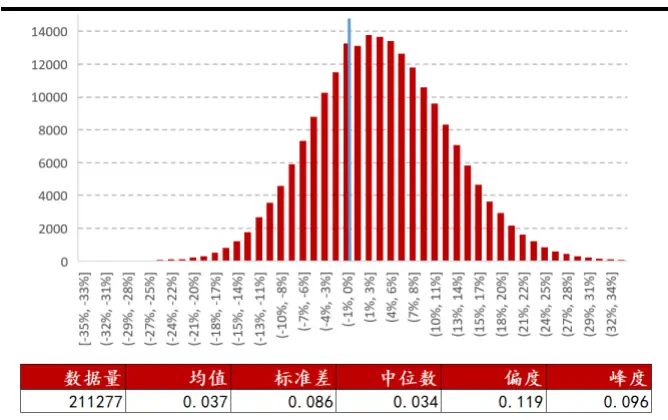
资料来源：Wind资讯，方正证券研究所

图表9： COPA 因子时间序列特征
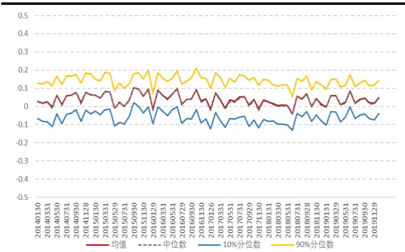
资料来源：Wind资讯，方正证券研究所

其次，我们关注成交额与价格变动之间的互动关系，我们使用收益率的绝对值来表示价格的变动幅度。以此构建因子 CORA（Correlation coefficient between Return and Amount），衡量分钟价格变动幅度与分钟成交额之间的相关程度：

$$
CORA=corr(|Ret_{t}|,A_{t}),\quad\mathfrak{t}\in[1{,}240]
$$

其中 $|Ret_{t}|$ 为个股日内第 t分钟的对数收益率的绝对值， $A_{t}$ 为个股日内第t分钟的成交额，月度因子值同样取10日平均。

样本期内，CORA 因子均值为 0.336，标准差为 0.093，中位数为 0.339，偏度为-0.239，峰度为 0.382，因子值分布略微呈现尖峰左拖尾的特征。因子值极大概率取正，表示市场上绝大多数股票大涨大跌时伴随着交易量的急剧提升，符合我们的一般认知。

为了进一步分析CORA 因子在时间序列上的特征，我们逐月计算了 2014/01/01 到 2019/12/31 期间因子在全市场的均值、上 10%分位数、50%分位数和下10%分位数。整体来看，因子的在时间序列上稳定为正，分位数的因子值波动不大。

图表10：CORA 因子值分布
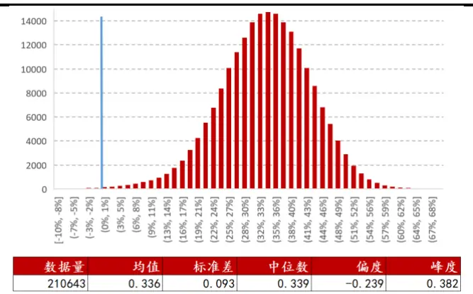
资料来源：Wind资讯，方正证券研究所

图表11：CORA 因子分组时间序列
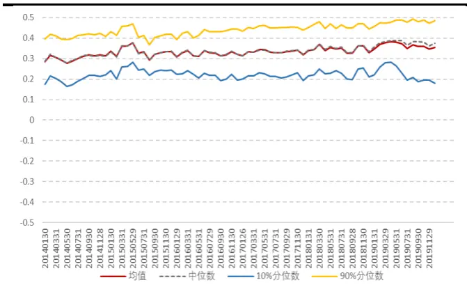
资料来源：Wind资讯，方正证券研究所

## 3.2 原始因子测试结果

我们以 2014年至 2019年为回测区间，全部A股为样本，构建十分组下的月度选股组合，回测模型参数和假设见附录。COPA和CORA量价因子的月度 IC，RankIC，年化 ICIR 以及多空组合的收益波动表现如下所示，原始日内量价因子表现出不错的选股效果。

图表12：量价因子的基本表现

| 因子代号 | 因子含义 | IC | rankIC | ICIR | 年化收益 | 年化波动年化 | IR | 胜率 | 最大回撤 |
| --- | --- | --- | --- | --- | --- | --- | --- | --- | --- |
| COPA | 价与量 | -0.0544 | -0.0663 | -2.62 | 22.38% | 8.75% | 2.56 | 81.69% | 12.95% |
| CORA | 涨跌幅与量 | -0.0553 | -0.0840 | -2.33 | 26.49% | 10.23% | 2.59 | 80.28% | 11.89% |

资料来源：Wind资讯，方正证券研究所

量价因子的 值为负说明因子值越低，股票的下个月收益越高。COPA因子值代表的是股票量价同向或量价背离的程度，因子值越高，表明股票量价同向的程度高，即一只股票成交额上升时价格也同步上升，量跌时价也同步下跌，该类股票往往是一些受资金驱动严重的股票，短期交易热度高，该类股票月度上往往具有负向 Alpha。

CORA 因子值代表单位成交额对股价推动的关系。因子值过高，表明股票成交额放量同时伴随着价格剧烈波动，该类股票投机属性强，资金对价格的扰动多，短期交易过热，股票在月度上也具有负向Alpha。

由于都是从交易行为出发构建的因子，高频量价因子包含了一部分与传统常见因子的重叠。图表 13 为两个量价因子与常见因子的相关系数表，发现COPA量价因子暴露于高反转与高换手，CORA量价因子暴露于高波动与高换手。因此，需要将常见因子剥离后方可得到纯净的量价因子的表现。

图表13：量价因子与常见因子的相关性

| 因子代号 | 因子含义 | 市值 | 反转 | 波动 | 换手 |
| --- | --- | --- | --- | --- | --- |
| COPA | 价与量 | 0.0786 | 0.2510 | 0.0713 | 0.1721 |
| CORA | 涨跌幅与量 | 0.0326 | 0.1477 | 0.3936 | 0.4779 |

资料来源：Wind资讯，方正证券研究所

## 3.3 中性后因子测试结果

为了考察纯粹量价因子的表现，我们在横截面上对中信一级行业、对数市值、20日反转、20日换手和20日波动这些常见因子作正交处理，得到中性后的因子值。

$$
factor=\beta_{1}*logMV+\beta_{2}*Mom_{20D}+\beta_{3}*Turn_{20D}+\beta_{4}*
$$

$$
\begin{array}{r}{Vol_{20D}+\sum_{i=1}^{29}\beta_{5i}*Ind_{i}+\varepsilon}\end{array}
$$

各个量价因子中性后的月度 IC，RankIC，年化 ICIR 以及多空组合的收益波动表现如图表14所示。

我们发现COPA因子中性化后效果略有下降，IC均值为-0.0362，因子的年化ICIR值达到了-3.94。逐月来看，IC值为负的概率为91.55%，月度 IC 表现非常稳定。多空组的年化收益为 14.58%，年化波动为5.37%。年化夏普为 2.71，月度胜率达到 84.51%，最大回撤在 7.07%左右。数据显示 COPA因子在中性后具有较强的预测能力，尤其是稳定性较强，胜率较高。

因子中性化后预测能力下降， 均值为 ，因子的ICIR 值-1.21。逐月来看，IC 值为负的概率为 60.56%，月度 IC 不够稳定。多空组的年化收益为 ，年化波动为 。年化夏普为1.39，月度胜率59.15%，时间轴上可以看到有几次大的回撤。数据显示 因子在中性后选股能力偏弱， 因子中性后选股能力下降的主要原因是 因子在计算相关系数时，本身很大程度上捕捉了股票的波动性和流动性，因子信息含量与传统选股因子重合较大。

图表14：量价因子中性后的基本表现

| 因子代号 | 因子含义 | 1C | rankIC | ICIR | 年化收益 | 年化波动 | 年化IR | 胜率 | 最大回撤 |
| --- | --- | --- | --- | --- | --- | --- | --- | --- | --- |
| COPA | 价与量 | -0.0362 | -0.0422 | -3.94 | 14.58% | 5.37% | 2.71 | 84.51% | 7.07% |
| CORA | 涨跌幅与量 | -0.0170 | -0.0189 | -1.21 | 7.89% | 5.69% | 1.39 | 59.15% | 9.48% |

资料来源：Wind资讯，方正证券研究所

图表15：COPA 多空组合收益与回撤
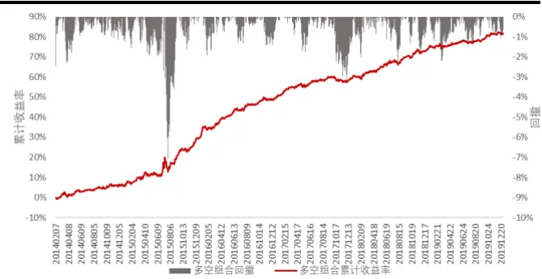
资料来源：Wind资讯，方正证券研究所

图表16：COPA 月度 IC 表现
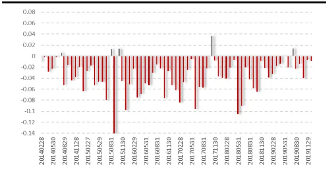
资料来源：Wind资讯，方正证券研究所

图表17：CORA 多空组合收益与回撤
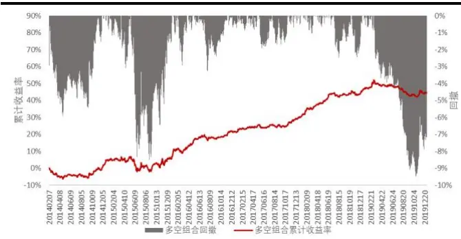
资料来源：Wind资讯，方正证券研究所

图表18：CORA 月度 IC 表现
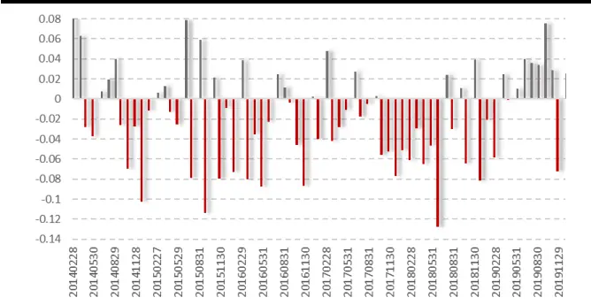
资料来源：Wind资讯，方正证券研究所

将中性后COPA 因子值从小到大依次分成十组，构建组合，统计各组收益画出2014至2019各组的净值曲线。Alpha主要由空头贡献，分组基本呈现单调，多头收益单调性略差，符合传统量价因子的收益分布特征。中性后的CORA 因子表现欠佳，有比较大的改进空间，我们在下一章中作讨论。

图表19：COPA 因子分10组年化收益
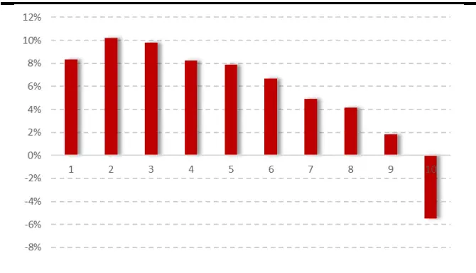
资料来源：Wind资讯，方正证券研究所

图表20：COPA 因子分 10 组净值
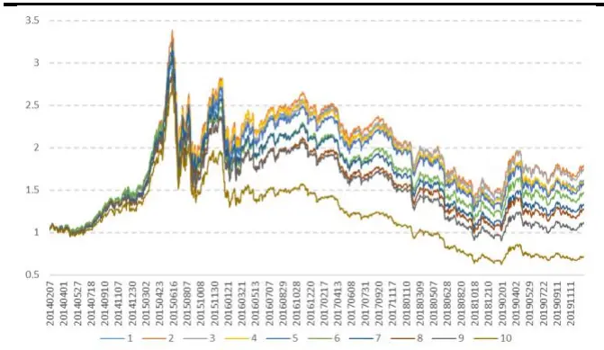
资料来源：Wind资讯，方正证券研究所

## 4 量价错期匹配的新 Alpha

## 4.1 日度量价错期的启示

股市有一句俗语叫“量在价先”，意味着成交量有时会领先价格出现波动。某些股票在利好 利空消息公布前，成交量就已经出现了异常放大，暗示知情交易者（informedtrader）或在提前行动。我们在《量价抢跑，推陈出新：基于价量互动的选股因子 3》等报告中，在日频上构建了抢跑因子FR（Front Running）来衡量股票的异常交易行为。量价抢跑现象越明显，股票次月的表现越差。

特别的，我们发现当日涨跌幅与当日成交额的关系没有预测能力，领先的成交额与滞后的涨跌幅之间含有 Alpha。当我们剔除当日量价关系后，隔日量价关系的选股效果大幅提升，因此表明更纯粹的“量价抢跑”现象。

$$
\begin{array}{c}{Turn_{t-1}=\alpha+\beta*Turn_{t}+\varepsilon_{t-1}}\\{FR_{pure}=corr(\varepsilon_{t-1},Ret_{t})}\end{array}
$$

在高频的世界里，我们也得到了相似的结论。相较于同期成交额与涨跌幅关系的CORA 因子，错期因子CORA_A和CORA_R 的独立预测能力大幅提升。

从低频走向高频，因子构建方法也发生一些微妙的不同。例如 2.3节中我们提到高频分钟数据上，成交额对涨跌幅冲击的对称性提升，考察成交额与涨跌幅绝对值的关系更为合理。其次，日频上量在价先有 Alpha，而价在量先的算法没有太多预测能力。但在高频上，我们发现两者皆有预测能力，我们将量在价先的因子命名为CORA_A，将价在量先的因子命名为CORA_R，两者的相关性不算很高。

## 4.2 高频量价错期因子构建

在分钟频度上构建错期量在价先因子 CORA_A (Correlationcoefficient between Return and Amount _Amount before Return)，表示量在价前一分钟，衡量前一分钟的量与后一分钟的价的协同运动情况。

$$
CORA\_A=corr(A_{t-1},|Ret_{t}|)
$$

该因子值越大，表示信息的提前泄露程度越高，知情交易者或庄家在价格变动前提前出手。

与之对应，我们猜测价先于量的提前变动可能也蕴含着一些微观交易行为的变化，如果市场投资者对股票价格极度敏感，股价发生变动后，大量投资者急于成交手中的股票，则会造成价在量前提前波动。因此，我们在分钟频度上构建错期价在量先因子 CORA_R (Correlationcoefficient between Return and Amount _Return before Amount)，衡量前一分钟的价与后一分钟的量的协同运动情况。

$$
CORA_{-}R=corr(|Ret_{t-1}|,A_{t})
$$

该因子值越大，表示市场交易情绪受股价涨跌的影响程度越高，两者均可以用来衡量股票的短期交易热度。

图表21：CORA_A计算方式示意图

| 股票 | 日期 | 分钟 | 收盘价 | 开盘价 | \|Ret\| | A |
| --- | --- | --- | --- | --- | --- | --- |
| 000002.SZ | 201812280 | 9:31 | 23.80 | 23.67 | 0.0055 | 15863364 |
| 000002.SZ | 201812280 | 9:32 | 23.79 | 23.80 | 0.0004 | 7126857 |
| 000002.SZ | 20181228\| | 09:33 | 23.85 | 23.79 | 0.0025 | 9409095 |
| 000002.SZ | 201812280 | 9:34 | 23.86 | 23.85 | 0.0004 | 9275437 |
| 000002.SZ | 201812280 | 9:35 | 24.06 | 23.89 | 0.0071 | 3398818 |
| 000002.SZ | 20181228 0 | 9:36 | 24.01 | 24.06 | 0.0021 | 0082912 |
| 000002.SZ | 201812280 | 9:37 | 24.03 | 23.97 | 0.0025 | 0010067 |
| 000002.SZ | 201812280 | 9:38 | 23.98 | 24.02 | 0.0017 | 9606959 |
| 000002.SZ | 201812280 | 9:39 | 23.95 | 23.99 | 0.0017 | 4219732 |
| 000002.SZ | 20181228 | 09:40 | 23.91 | 23.96 | 0.0021 | 6958624 |
| n n n |  | …. | … | … | …. | a a a |
| 000002.SZ | 201812281 | 4:51 | 23.88 | 23.82 | 0.0025 | 2939736 |
| 000002.SZ | 201812281 | 4:52 | 23.92 | 23.89 | 0.0013 | 4340768 |
| 000002.SZ | 201812281 | 4:53 | 23.90 | 23.92 | 0.0008 | 5548422 |
| 000002.SZ | 201812281 | 4:54 | 23.88 | 23.90 | 0.0008 | 2981969 |
| 000002.SZ | 201812281 | 4:55 | 23.85 | 23.89 | 0.0017 | 5108927 |
| 000002.SZ | 20181228 | 14:56 | 23.76 | 23.85 | 0.0038 | 3897228 |
| 000002.SZ | 201812281 | 4:57 | 23.80 | 23.73 | 0.0029 | 6710295 |
| 000002.SZ | 20181228 | 14:58 | 23.80 | 23.80 | 0.0000 | 0 |
| 000002.SZ | 201812281 | 4:59 | 23.80 | 23.80 | 0.0000 | 0 |
| 000002.SZ | 201812281 | 5:00 | 23.82 | 23.80 | 0.0008 | 9551820 |

资料来源：Wind资讯，方正证券研究所

图表22：CORA_R计算方式示意图

| 股票 | 日期 | 分钟 | 收盘价 | 开盘价 | \|Ret\| | A |
| --- | --- | --- | --- | --- | --- | --- |
| 000002.SZ | 20181228 | 09:31 | 23.80 | 23.67 | 0.0055 | 15863364 |
| 000002.SZ | 20181228 | 09:32 | 23.79 | 23.80 | 0.0004 | 7126857 |
| 000002.SZ | 20181228 | 09:33 | 23.85 | 23.79 | 0.0025 | 9409095 |
| 000002.SZ | 20181228 | 09:34 | 23.86 | 23.85 | 0.0004 | 9275437 |
| 000002.SZ | 20181228 | 09:35 | 24.06 | 23.89 | 0.0071 | 23398818 |
| 000002.SZ | 20181228 | 09:36 | 24.01 | 24.06 | 0.0021 | 10082912 |
| 000002.SZ | 20181228 | 09:37 | 24.03 | 23.97 | 0.0025 | 10010067 |
| 000002.SZ | 20181228 | 09:38 | 23.98 | 24.02 | 0.0017 | 9606959 |
| 000002.SZ | 20181228 | 09:39 | 23.95 | 23.99 | 0.0017 | 4219732 |
| 000002.SZ | 20181228 | 09:40 | 23.91 | 23.96 | 0.0021 | 6958624 |
| 000002.SZ | 20181228 | 14:51 | 23.88 | 23.82 | 0.0025 | 2939736 |
| 000002.SZ | 20181228 | 14:52 | 23.92 | 23.89 | 0.0013 | 4340768 |
| 000002.SZ | 20181228 | 14:53 | 23.90 | 23.92 | 0.0008 | 5548422 |
| 000002.SZ | 20181228 | 14:54 | 23.88 | 23.90 | 0.0008 | 2981969 |
| 000002.SZ | 20181228 | 14:55 | 23.85 | 23.89 | 0.0017 | 5108927 |
| 000002.SZ | 20181228 | 14:56 | 23.76 | 23.85 | 0.0038 | 13897228 |
| 000002.SZ | 20181228 | 14:57 | 23.80 | 23.73 | 0.0029 | 6710295 |
| 000002.SZ | 20181228 | 14:58 | 23.80 | 23.80 | 0.0000 | 0 |
| 000002.SZ | 20181228 | 14:59 | 23.80 | 23.80 | 0.0000 | 0 |
| 000002.SZ | 20181228 | 15:00 | 23.82 | 23.80 | 0.0008 | 9551820 |

资料来源：Wind资讯，方正证券研究所

样本期内， 与 因子均值都略微偏正。对比图表 10 和图表 11，错期因子的均值和中位数下降，标准差变化不大，偏度由负转正，峰度一增一减可能意义不大。从因子时序图来看，除了 2015 年中以外，因子在时间序列上稳定为正，分位数的因子值波动不大。

因子的均值在 ，中位数在 ，错期因子无论是CORA_A，还是 CORA_R 的因子值都出现下降，表示错期量价纠缠的关系减弱。但两者的偏度都有所增加，由负转正，右尾异常值较多，这类股票是因子负向 Alpha 的主要来源。前者表示分钟数据出现了显著的量在价先的现象，后者表示分钟数据出现了显著的价在量先的现象，暗示股票交易过热，股票月度上具有负向Alpha。

图表23：CORA_A 因子值分布
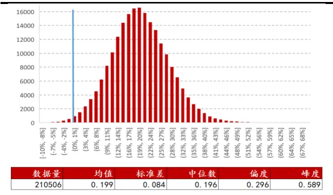
资料来源：Wind资讯，方正证券研究所

图表24：CORA_A因子时间序列特征
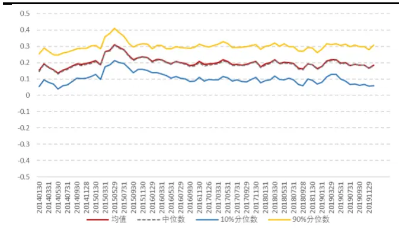
资料来源：Wind资讯，方正证券研究所

图表25：CORA_R 因子值分布
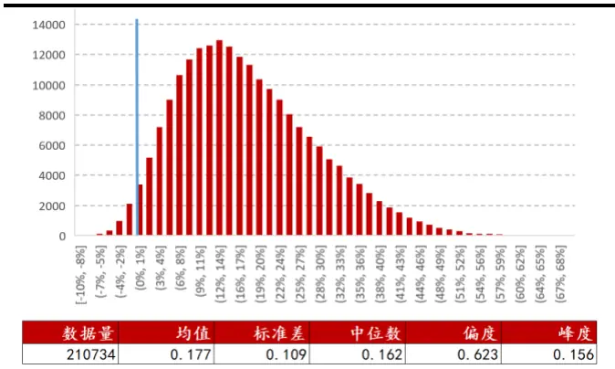
资料来源：Wind资讯，方正证券研究所

图表26：CORA_R因子时间序列特征
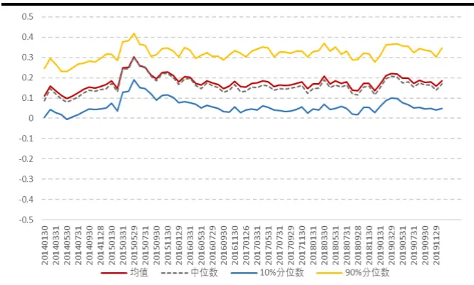
资料来源：Wind资讯，方正证券研究所

## 4.3 因子测试表现

为了考察日内错期因子是不是新的Alpha因子，我们同样在横截面上对传统因子进行中性化处理。下表显示了各个量价因子中性前后的月度 ， ，年化 以及多空组合的收益波动表现。

图表27：错期量价因子中性前的基本表现

| 因子代号 | 因子含义 | 1C | rankIC | ICIR | 年化收益 | 年化波动 | 年化IR | 胜率 | 最大回撤 |
| --- | --- | --- | --- | --- | --- | --- | --- | --- | --- |
| CORA_A | 量先价后 | -0.0733 | -0.1050 | -2.70 | 36.07% | 11.76% | 3.07 | 78.87% | 12.68% |
| CORA_R | 价先量后 | -0.0850 | -0.1204 | -2.74 | 38.64% | 12.64% | 3.06 | 81.69% | 13.08% |

资料来源：Wind资讯，方正证券研究所

图表28：错期量价因子中性后的基本表现

| 因子代号 | 因子含义 | IC | rankIC | ICIR | 年化收益 | 年化波动 | 年化IR | 胜率 | 最大回撤 |
| --- | --- | --- | --- | --- | --- | --- | --- | --- | --- |
| CORA_A | 量先价后 | -0.0309 | -0.0345 | -2.55 | 13.54% | 5.41% | 2.50 | 78.87% | 9.56% |
| CORA_R | 价先量后 | -0.0364 | -0.0450 | -3.05 | 14.81% | 5.43% | 2.73 | 77.46% | 5.54% |

资料来源：Wind资讯，方正证券研究所

错期因子在中性前效果很强，剔除掉常见因子后，仍然有比较好的预测效果，证明市场中性量价错期运动的协同性确实蕴含了新的Alpha。

根据图表 24 和图表 26，CORA_A 和 CORA_R 的多头因子均值近乎为 0，表明多头组合不存在“量在价先”或者“价在量先”的现象。这一点符合直觉，常态下的错期量价数据理论上不存在相关性。

CORA_A 和 CORA_R 的空头因子均值从 0.19 上升至 0.3 附近，空头组合的错期量价相关性提升。前者捕捉的是“量在价先”的异常交易行为，可能有聪明资金在抢跑交易，后者捕捉的是“价在量先”的异常交易行为，可能是聪明钱在利用波动频繁交易。两者从不同的方向描述了股票短期的交易热度，因子值越大，股票交易越热，次月的负向 Alpha越显著，因子的具体表现如下：

1、CORA_A因子的IC均值为-0.0309，因子的ICIR值达到了-2.55。逐月来看，IC 值为负的概率为 78.87%，月度IC 表现较为稳定。多空组的年化收益为13.54%，年化波动为5.41%。年化夏普为 2.50，月度胜率达到 78.87%，最大回撤在 9.56%左右，回撤主要发生在 2015 年中以及2019年后半年。

2、CORA_R因子的IC均值为-0.0364，因子的ICIR 值达到了-3.05。逐月来看，IC 值为负的概率为 84.51%，月度IC 表现较为稳定。多空组的年化收益为14.81%，年化波动为5.43%。年化夏普为 2.73，月度胜率达到77.46%，最大回撤在 5.54%左右。CORA_R 的因子表现略优于 CORA_A。

图表29：CORA_A多空组合收益与回撤
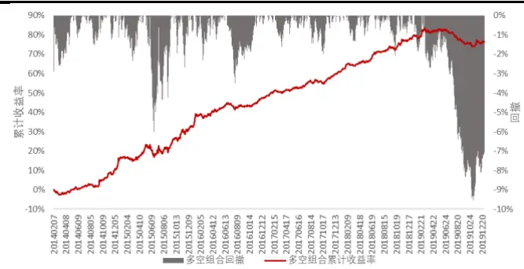
资料来源：Wind资讯，方正证券研究所

图表30：CORA_A 月度 IC 表现
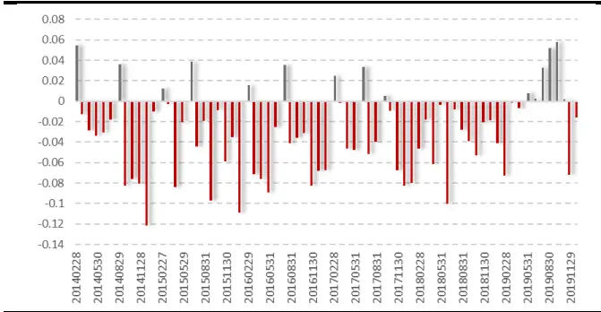
资料来源：Wind资讯，方正证券研究所

图表31：CORA_R多空组合收益与回撤
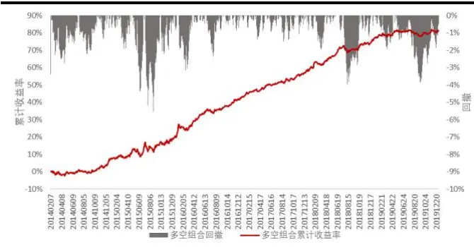
资料来源：Wind资讯，方正证券研究所

图表32：CORA_R 月度 IC 表现
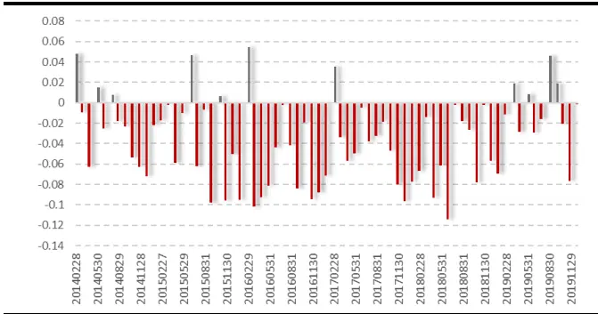
资料来源：Wind资讯，方正证券研究所

类似地，按照因子值从小到大依次分成十组，构建等权选股组合，统计各组收益，画出 2014 至 2019 各组的净值曲线。10 分组下，CORA_A 和 CORA_R 各组收益分化明显，呈现出较强的单调性，尤其是CORA_R 因子，10组的净值曲线分化比较清晰。

组合面临的一个问题是多头收益占比略低，收益主要由空头组贡献。多头组的含义是股票几乎没有“量在价先”或者“价在量先”的异常交易现象，两者相关性近乎为 ；空头组的含义是股票频繁出现“量在价先”或者“价在量先”的异常交易行为，股票短期交易过热。多头组合是量价低相关性组，容易受到噪音数据的干扰，是后文处理的重点。

图表33：CORA_A 因子分 10 组年化收益
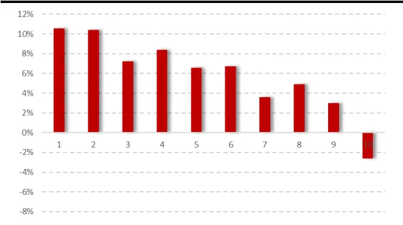
资料来源：Wind资讯，方正证券研究所

图表34：CORA_A 因子分 10 组净值
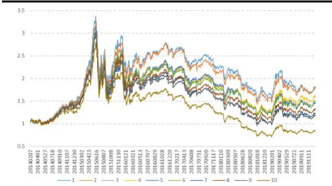
资料来源：Wind资讯，方正证券研究所

图表35：CORA_R 因子分 10 组年化收益
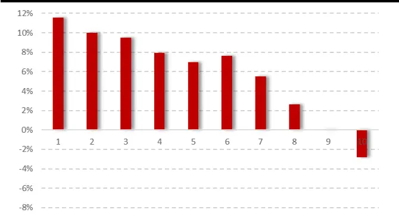
资料来源：Wind资讯，方正证券研究所

图表36：CORA_R 因子分 10 组净值
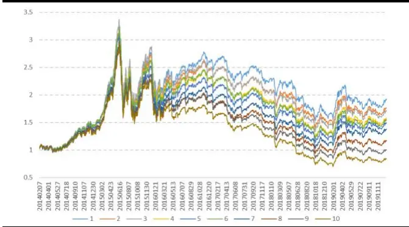
资料来源：Wind资讯，方正证券研究所

## 4.4 因子小结

综上，我们发现初始因子股价和成交额的相关性COPA有预测能力，月度表现十分稳定，中性后因子年化 ICIR 达到 3.94。当期的涨跌幅与成交额相关性因子CORA 尽管也有预测能力，但被波动率和换手率因子解释较多，独立的 Alpha有限。

本节提出量价错期算法对 因子做改进，基于“量在价先”和“价在量先”的两种逻辑，分别得到因子 CORA_A 和 CORA_R。算法赋予因子更多的独立 Alpha，多空组年化收益高，表现优良且分组效果单调。错期匹配对同期成交额与价格关系的COPA因子影响不大，与日频因子上得到的结论基本对应。

至此，我们得到了三个表现较好的量价关系Alpha因子，分别为COPA、CORA_A 和CORA_R。在后续第五章中，我们讨论因子构建中的细节处理，测试发现更精细化的数据处理，可以进一步提升因子的选股能力。我们举了 个典型案例，前两个案例涉及数据的清洗与标准化，后两个案例涉及到参数的优化，希望能给读者带来启发。

## 5 因子构建中的细节讨论

## 5.1 日内成交额分布的数据修正

分钟成交量在日内有天然的分布规律，呈现 型分布或 型分布，这可能由于隔夜信息以及午间信息的积累导致早尾盘以及午市开盘时的分钟成交量天然高的特点，但收益率在日内没有明显的分布特点，这种不对等的分布特征可能影响相关性的计算。

图表37：2018/12/28全市场的分钟成交额在日内的序列
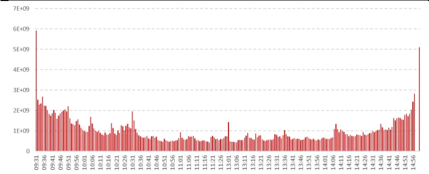
资料来源：Wind资讯，方正证券研究所

为剔除成交量在日内天然分布所带来的影响，我们对每一分钟的成交额进行标准化，标准化后的成交额捕捉的是该分钟成交额相对于正常情况下的异常波动，方法是用前 20 交易日的该分钟成交额进行调整。

$$
\begin{aligned}\mu_{i,t}=&\frac{\sum_{d=1}^{20}A_{i,t,d}}{20}\\\sigma_{i,t}=&\sqrt{\frac{1}{20}\sum_{d=1}^{20}(A_{i,t,d}-\mu_{i,t})^2}\\&adjA_{i,t}=\frac{A_{i,t}-\mu_{i,t}}{\sigma_{i,t}}\end{aligned}
$$

*公式中t为分钟标记 d为日标记 i 为股票标记

## 5.2 日内低流动性的数据修正

在分钟频度下，市场上某些股票在一分钟内的涨跌幅样本为 0，原因有：①该股票在该分钟内无成交，因此涨跌幅为 0；②该股票在该分钟内成交额较小，没有信息增量的投资者挂市价单成交，股价无变动，因此涨跌幅为 0；③该股票在该分钟内价格上涨（下跌）后又下跌（上涨）回原价格，因此涨跌幅为 。

我们逐日计算全市场股票分钟涨跌幅，统计该数据为零的频率，如图表 所示，该比例与全市场日度成交额高度负相关，两者均为流动性指标。例如 年末，市场流动性较差，全市场日度成交额仅在2000亿左右，个股分钟数据上，接近一半的分钟涨跌幅为 0，这些分钟上信息含量少且可能有噪音。

当某只股票交易极度不活跃时，会产生大量分钟收益率为 的样本，导致相关性系数偏高，对量价互动关系的描述失真。由于本文聚焦于分钟频率上量价关系，构建因子的数据样本量大，因此可以采取剔除法剔除部分信息含量较低的数据。

具体而言，我们剔除涨跌幅为0的数据，该算法已经包括了剔除成交额为 0的数据，借此我们期望减少低流动性带来的噪音干扰。

图表38：分钟涨跌幅为 0的数据占比
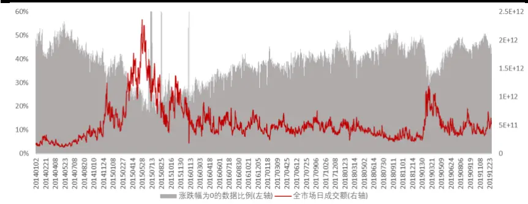
资料来源：Wind资讯，方正证券研究所

在进行上述两个因子细节处理后，一是分钟成交额的标准化处理，二是涨跌幅为零的分钟数据剔除。我们对前文中的错期量价因子CORA_A 和 CORA_R 进行优化，捕捉更真实、纯粹的量价异动。优化后的因子在时间序列上表现更为平坦，因子均值下降至 0.1附近。

研究发现，CORA_A 和CORA_R的效果大幅提升。

$$
\begin{aligned}adj_{-}CORA_{-}A&=corner(adjA_{t-1},\left|Ref_{t}\right|),\;Ref_{t}\neq0\\adj_{-}CORA_{-}R&=error(\left|Ref_{t-1}\right|,adjA_{t}),\;Ref_{t-1}\neq0\end{aligned}
$$

图表39：CORA_A 时序分布
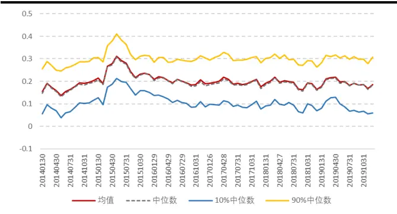
资料来源：Wind资讯，方正证券研究所

图表40：adj_CORA_A 时序分布
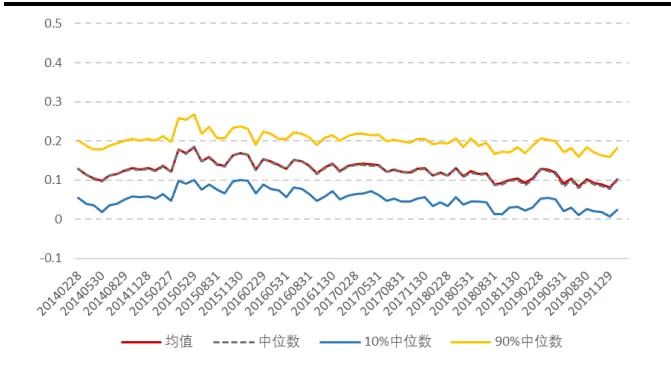
资料来源：Wind资讯，方正证券研究所

图表41：CORA_R 时序分布
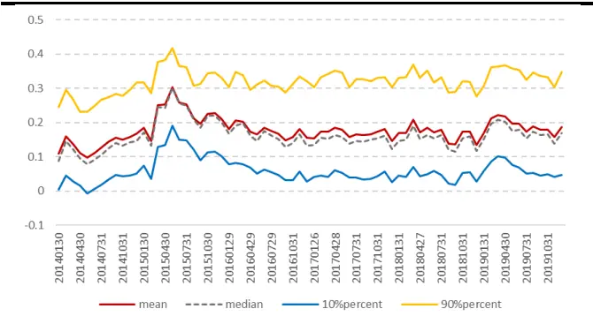
资料来源：Wind资讯，方正证券研究所

图表42：adj_CORA_R 时序分布
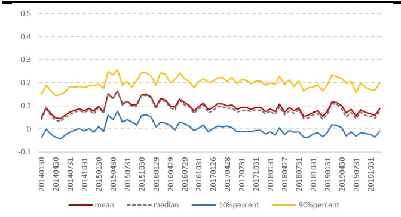
资料来源：Wind资讯，方正证券研究所

优化后的因子基本表现如图表43所示，因子的IC均值都有提升，年化ICIR 均超过了3，多空组收益显著提高，回撤显著降低，夏普比率显著提升，CORA_A 的多空组年化 IR 从 2.50 提升至 3.19，CORA_R的 IR 从 2.73 提升至 3.20，因子表现更稳定。此外，多头组的年化收益也显著提升。

图表43：改进前后错期量价因子表现对比

| 因子代号 | IC均值 | 秩IC均值年 | 化ICIR | 对冲组 |  |  |  | 多头年化收益 |
| --- | --- | --- | --- | --- | --- | --- | --- | --- |
|  |  |  |  | 年化收益 | 年化波动 | 年化IR 最 | 大回撤 |  |
| CORA A | -0.031 | -0.035 | -2.550 | 13.54% | 5.41% | 2.500 | 9.56% | 10.58% |
| adj_CORA A | -0.036 | -0.040 | -3.250 | 15.92% | 4.99% | 3.189 | 4.11% | 12.13% |
| CORA_R | -0.036 | -0.045 | -3.048 | 14.81% | 5.43% | 2.727 | 5.54% | 11.57% |
| adj_CORA_R | -0.042 | -0.050 | -3.186 | 19.34% | 6.05% | 3.197 | 5.06% | 13.28% |

资料来源：Wind资讯，方正证券研究所

量先价后的日内错期因子 在优化后改善效果显著，年化ICIR 从-2.550 上升到了-3.250，多空组的累计净值曲线显得更为平坦，呈现出显著的Alpha特性，时间轴上的回撤大幅降低，可以看到2015 年中以及 2019 年下半年的回撤变小了，夏普比率从 2.500 升高到 3.189，多头组（即第一组）的年化收益显著上升，分组年化收益率更加单调。

图表44：adj_CORA_A 多空组合收益与回撤
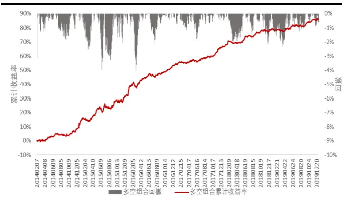
资料来源：Wind资讯，方正证券研究所

图表45：adj_CORA_A 月度 IC 序列
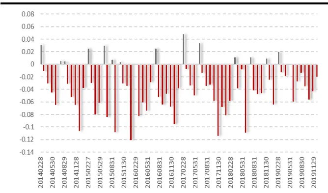
资料来源：Wind资讯，方正证券研究所

图表46：CORA_A改进前后分组收益变化
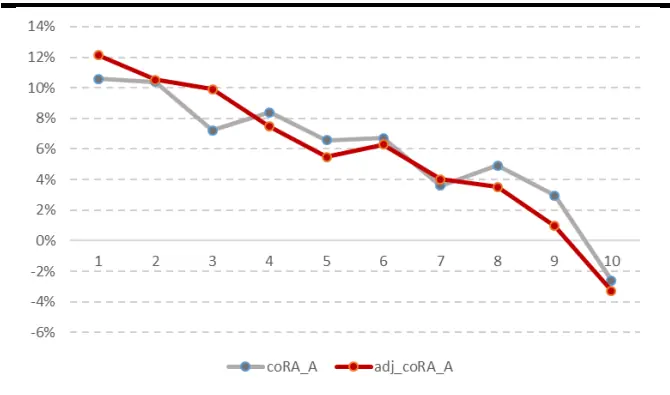
资料来源：Wind资讯，方正证券研究所

图表47：adj_CORA_A 分 10 组净值
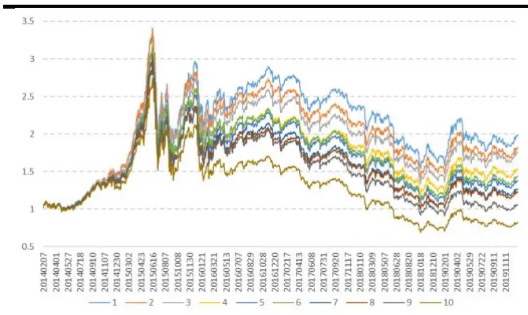
资料来源：Wind资讯，方正证券研究所

价在量先的日内错期因子CORA_R在优化后改善效果同样显著，年化ICIR 从-3.048上升到了-3.186，多空组的累计净值曲线显得更为平坦，呈现出显著的Alpha 特性， 2015年中以及2019 年下半年的回撤显著降低，夏普比率从 2.727升高到3.197，多头组（即第一组）的年化收益从 升高到 ，分组净值曲线分化清晰。

图表48：adj_CORA_R 多空组合收益与回撤
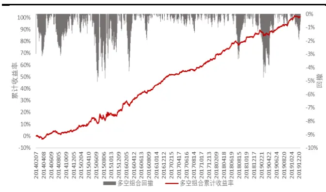
资料来源：Wind资讯，方正证券研究所

图表49：adj_CORA_R 月度 IC 序列
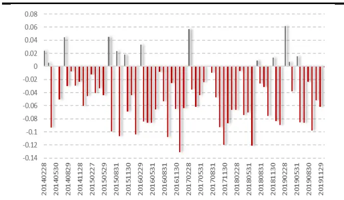
资料来源：Wind资讯，方正证券研究所

图表50：CORA_R改进前后分组收益变化
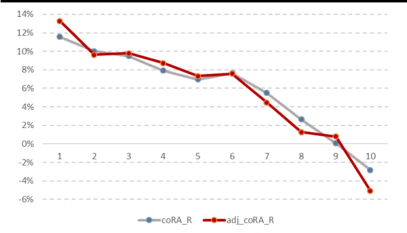
资料来源：Wind资讯，方正证券研究所

图表51：adj_CORA_R 分 10 组净值
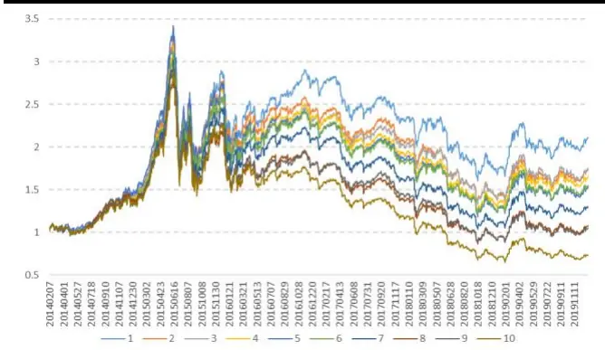
资料来源：Wind资讯，方正证券研究所

## 5.3 错期参数 N的敏感性测试

前文中，计算日内错期因子时，选用的是量在价前1 分钟，价在量前1分钟：

$$
\begin{array}{r}{CORA\_A=corr(A_{t-1},|Ret_{t}|)}\\{CORA\_R=corr(|Ret_{t-1}|,A_{t})}\end{array}
$$

考虑到信息的延迟与市场反应所需的时间，我们尝试采用错期2,3,4,5分钟来调整错期因子计算方式，结果如图表 52。对于两个错期因子来说，随着错期数的增长，虽然仍有效果，但因子的效果都在下降。因此采用 分钟数据计算 因子时，错期 分钟可能是较好的选择，更高频的数据结论有待测试。

图表52：改进前后错期量价因子表现对比

| 量在价前n分钟 | IC均值秩 | IC均值年 | 化ICIR | 年化收益 | 年化波动年 |  | 化IR | 胜率 | 最大回撤多 | 头年化收益 |
| --- | --- | --- | --- | --- | --- | --- | --- | --- | --- | --- |
| 1 | -0.028 | -0.034 | -2.527 | 11.74% |  | 5.44% | 2.160 | 69.01% | 5.41% | 9.50% |
| 2 | -0.024 | -0.030 | -2.214 | 9.38% |  | 5.29% | 1.775 | 67.61% | 5.38% | 7.54% |
| 3 | -0.023 | -0.028 | -2.372 | 9.25% |  | 5.20% | 1.780 | 67.61% | 5.12% | 7.50% |
| 4 | -0.020 | -0.026 | -2.141 | 7.57% | 5.14% |  | 1.473 | 66.20% | 8.15% | 6.45% |
| 5 | -0.020 | -0.025 | -2.157 | 8.24% | 4.87% |  | 1.690 | 70.42% | 6.73% | 6.79% |
| 价在量前n分钟 | IC均值秩 | IC均值年化ICIR |  | 年化收益 | 年化波动 |  | 年化IR | 胜率 最 | 大回撤多 | 头年化收益 |
| 1 | -0.034 | -0.043 | -3.075 | 15.20% |  | 5.16% | 2.947 | 76.06% | 5.00% | 9.72% |
| 2 | -0.029 | -0.037 | -2.700 | 11.36% |  | 5.13% | 2.215 | 71.83% | 5.68% | 6.70% |
| 3 | -0.028 | -0.035 | -2.890 | 12.07% |  | 4.93% | 2.451 | 78.87% | 4.06% | 8.57% |
| 4 | -0.023 | -0.030 | -2.597 | 9.60% |  | 4.89% | 1.963 | 73.24% | 6.15% | 7.09% |
| 5 | -0.018 | -0.025 | -2.144 | 6.33% |  | 4.96% | 1.275 | 61.97% | 6.34% | 5.36% |

资料来源：Wind资讯，方正证券研究所

图表 53 绘制了N期量在价前错期因子

$CORA_{-}A=corr(A_{t-n},|Ret_{t}|)$ 的因子值分布图；图表 54绘制了N 期价在量前错期因子 $\cdot CORA_{-}R=corr(|Ret_{t-n}|,A_{t})$ 的因子值分布图。图表中N取值 0-5，特别的当 N=0时，即为当期因子CORA。

我们发现，随着 的增加，因子分布的均值越来越趋向于 ，相关程度越来越低。我们在第三章计算过当期涨跌幅与成交额相关性因子CORA 的选股效果，结果显示该因子的独立增量Alpha较少，而错期涨跌幅与量因子CORA_A和 CORA_R独特的增量Alpha较多。这表明在量价关系分析的第二个角度：涨跌幅与成交额的关系上，当期涨跌幅和当期成交额蕴含的信息较少，但错期涨跌幅与错期成交额能够带来新的Alpha，但是随着错期的增大，这种增量Alpha也会慢慢衰减。

图表53：量在价前错期因子值分布
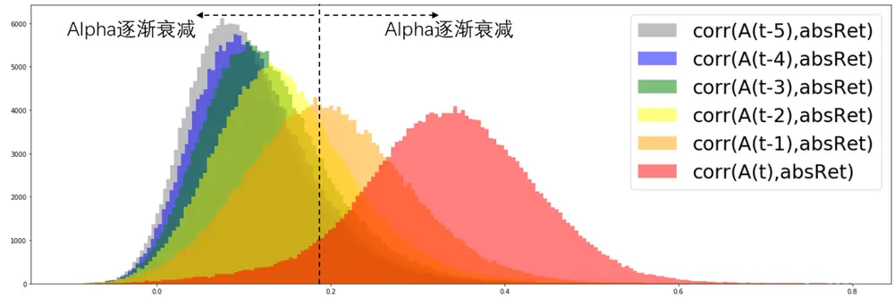
资料来源：Wind资讯，方正证券研究所

图表54：价在量前错期因子值分布
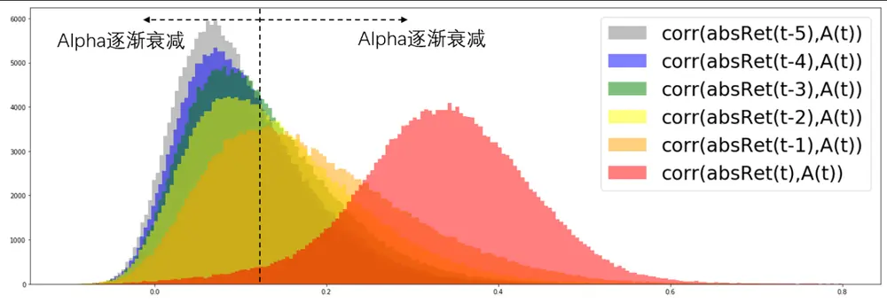
资料来源：Wind资讯，方正证券研究所

## 5.4 因子计算窗口的敏感性测试

前文，每个月因子的合成值取用的是月末 10 日平均，10 日可能不是最优参数，下面我们分别使用月末N 个交易日因子的平均值来合成月频因子。下表罗列了本文中效果较好的因子：初始因子COPA 以及改进后的两个错期量价因子 adj_CORA_A，adj_CORA_R 在 N=1~20情况下的表现情况。

1、对于初始因子COPA 来说，对参数变化不是很敏感，在N 取不同值的情况下，ICIR 稳定在-4 左右。

2、对于量先价后的错期因子adj_CORA_A来说，随着N的增大，IC 均值越来越负，多空组年化收益变大，回撤降低，随着N的增大，因子越来越有效并趋于稳定，根据结果来看，建议N 取 5~15。

3、对于价先量后的错期因子adj_CORA_R来说，随着N的增大，均值越来越负，多空组年化收益和多头年化收益显著变大，但波动也略有提升，N 的增大在一定程度上可以提升因子的有效性，根据结果来看，建议 N 取 5~15。具体的 N 的取值可以根据可承受计算量以及计算速度来调整。

图表55：N 取不同值时量价因子表现对比

| COPA = corr(Pt, At) |  |  |  |  |  |  |  |  |  |  |  |
| --- | --- | --- | --- | --- | --- | --- | --- | --- | --- | --- | --- |
| N值IC | 均值秩I | C均值年 | 化ICIR年 | 化收益年 | 化波动 |  | 年化IR | 胜率最大 | 回撤多 | 头年化收益 |  |
| 1 | -0.035 | -0.039 | -4.284 | 16.15% |  | 4.96% | 3.257 | 87.32% | 4.96% |  | 8.25% |
| 2 | -0.035 | -0.040 | -3.874 | 14.66% |  | 5.25% | 2.795 | 85.92% | 7.74% |  | 7.44% |
| 3 | -0.033 | -0.039 | -3.715 | 13.60% |  | 5.35% | 2.543 | 83.10% | 8.02% |  | 7.86% |
| 4 | -0.035 | -0.041 | -4.354 | 13.88% |  | 5.26% | 2.639 | 80.28% | 8.43% |  | 8.24% |
| 5 | -0.036 | -0.041 | -4.417 | 15.16% |  | 5.16% | 2.938 | 83.10% | 5.86% |  | 9.30% |
| 6 | -0.034 | -0.040 | -4.292 | 14.40% |  | 5.20% | 2.769 | 84.51% | 7.22% |  | 9.31% |
| 7 | -0.036 | -0.041 | -4.279 | 15.50% |  | 5.31% | 2.917 | 87.32% | 7.89% |  | 9.19% |
| 8 | -0.035 | -0.040 | -4.053 | 14.11% |  | 5.24% | 2.691 | 92.96% | 8.09% |  | 8.47% |
| 9 | -0.036 | -0.042 | -4.078 | 14.68% |  | 5.35% | 2.743 | 88.73% | 7.15% |  | 8.29% |
| 10 | -0.036 | -0.042 | -3.937 | 14.58% |  | 5.37% | 2.714 | 84.51% | 7.07% |  | 8.32% |
| 11 | -0.036 | -0.042 | -3.862 | 15.05% |  | 5.40% | 2.787 | 85.92% | 6.79% |  | 9.36% |
| 12 | -0.035 | -0.041 | -3.947 | 16.26% |  | 5.22% | 3.113 | 85.92% | 4.72% | 1 | 0.22% |
| 13 | -0.034 | -0.040 | -3.825 | 14.52% |  | 5.36% | 2.707 | 84.51% | 3.88% |  | 9.22% |
| 14 | -0.034 | -0.040 | -3.901 | 13.84% |  | 5.36% | 2.581 | 80.28% | 6.01% |  | 8.36% |
| 15 | -0.034 | -0.040 | -3.811 | 14.49% |  | 5.36% | 2.701 | 87.32% | 4.94% | 8.77% |  |
| 20 | -0.031 | -0.038 | -3.314 | 11.71% | 5.14% |  | 2.278 | 78.87% | 5.90% | 9.07% |  |

| N值 | IC均值 | 秩IC均值年 | 化ICIR年 | 化收益年 | 化波动 |  | 年化IR | 胜率 | 最大回撤多 |  | 头年化收益 |
| --- | --- | --- | --- | --- | --- | --- | --- | --- | --- | --- | --- |
| 1 | -0.017 | -0.022 | -2.128 | 7.13% |  | 4.27% | 1.669 | 74.65% | 4.56% |  | 9.07% |
| 2 | -0.025 | -0.029 | -3.293 | 10.58% |  | 4.00% | 2.642 | 77.46% |  | 6.09% | 10.68% |
| 3 | -0.028 | -0.032 | -3.336 | 13.08% |  | 4.16% | 3.140 | 80.28% |  | 6.18% | 10.50% |
| 4 | -0.031 | -0.035 | -3.211 | 14.53% |  | 4.26% | 3.413 | 80.28% |  | 3.65% | 11.91% |
| 5 | -0.031 | -0.035 | -3.130 | 13.63% |  | 4.37% | 3.118 | 73.24% |  | 3.66% | 11.73% |
| 6 | -0.032 | -0.036 | -3.121 | 15.32% |  | 4.69% | 3.270 | 76.06% |  | 3.79% | 12.42% |
| 7 | -0.034 | -0.037 | -3.199 | 15.27% |  | 4.68% | 3.261 | 73.24% |  | 3.52% | 11.38% |
| 8 | -0.035 | -0.038 | -3.195 | 15.73% |  | 4.87% | 3.226 | 74.65% |  | 4.19% | 11.32% |
| 9 | -0.036 | -0.040 | -3.319 | 16.62% |  | 5.00% | 3.321 | 80.28% |  | 4.65% | 12.44% |
| 10 | -0.036 | -0.040 | -3.250 | 15.92% |  | 4.99% | 3.189 | 70.42% |  | 4.11% | 12.13% |
| 11 | -0.036 | -0.041 | -3.165 | 15.53% |  | 5.07% | 3.063 | 71.83% |  | 4.34% | 11.92% |
| 12 | -0.036 | -0.041 | -3.103 | 16.19% |  | 5.00% | 3.237 | 78.87% |  | 4.14% | 12.68% |
| 13 | -0.036 | -0.041 | -3.079 | 16.07% |  | 5.05% | 3.185 | 77.46% | 4.56% |  | 12.69% |
| 14 | -0.037 | -0.042 | -3.080 | 17.16% |  | 5.29% | 3.242 | 77.46% | 4.50% |  | 12.98% |
| 15 | -0.037 | -0.042 | -3.051 | 16.60% |  | 5.41% | 3.067 | 76.06% |  | 6.15% | 12.38% |
| 20 | -0.038 | -0.044 | -3.025 | 16.47% |  | 5.74% | 2.870 | 81.69% |  | 6.26% | 12.17% |

| N值 | IC均值 | 秩IC均值 | 年化ICIR年 | 化收益 | 年化波动 |  | 年化IR | 胜率 | 最大回撤多 |  | 头年化收益 |  |
| --- | --- | --- | --- | --- | --- | --- | --- | --- | --- | --- | --- | --- |
| 1 | -0.025 | -0.031 | -2.875 | 8.80% |  | 4.28% | 2.054 | 74.65% |  | 4.09% |  | 7.39% |
| 2 | -0.032 | -0.039 | -3.496 | 11.06% |  | 4.63% | 2.391 | 78.87% |  | 4.11% |  | 7.75% |
| 3 | -0.037 | -0.043 | -3.619\| | 15.40% |  | 4.78% | 3.220 | 81.69% |  | 5.82% |  | 9.56% |
| 4 | -0.039 | -0.046 | -3.475 | 15.72% |  | 4.91% | 3.200 | 78.87% |  | 4.17% |  | 10.18% |
| 5 | -0.039 | -0.045 | -3.187 | 17.15% |  | 5.15% | 3.329 | 80.28% |  | 5.03% | 10.91% |  |
| 6 | -0.039 | -0.045 | -2.996 | 17.61% |  | 5.44% | 3.237 | 83.10% |  | 5.60% | 12.02% |  |
| 7 | -0.040 | -0.046 | -3.031 | 18.45% |  | 5.52% | 3.345 | 85.92% |  | 5.46% | 12.46% |  |
| 8 | -0.042 | -0.048 | -3.146 | 18.92% |  | 5.71% | 3.315 | 80.28% |  | 4.96% | 12.72% |  |
| 9 | -0.042 | -0.049 | -3.138 | 18.74% |  | 5.72% | 3.276 | 80.28% |  | 5.48% | 13.50% |  |
| 10 | -0.042 | -0.050 | -3.186 | 19.34% |  | 6.05% | 3.197 | 85.92% |  | 5.06% | 13.28% |  |
| 11 | -0.043 | -0.051 | -3.120 | 18.46% |  | 6.00% | 3.077 | 74.65% |  | 6.18% | 12.68% |  |
| 12 | -0.043 | -0.050 | -3.112 | 18.64% |  | 6.04% | 3.088 | 77.46% |  | 6.22% | 12.82% |  |
| 13 | -0.043 | -0.051 | -3.015 | 18.38% |  | 5.99% | 3.068 | 80.28% |  | 5.88% | 12.93% |  |
| 14 | -0.043 | -0.052 | -3.021 | 19.35% |  | 6.15% | 3.149 | 81.69% |  | 5.91% | 12.77% |  |
| 15 | -0.043 | -0.052 | -2.963 | 18.71% |  | 6.09% | 3.071 | 81.69% |  | 5.88% | 11.88% |  |
| 20 | -0.044 | -0.052 | -2.932 | 17.75% |  | 6.28% | 2.827 | 77.46% |  | 6.66% | 11.26% |  |

资料来源：Wind资讯，方正证券研究所

## 6 高频量价关系因子合成

本文共得到了 个表现较好的高频量价互动因子，分别是基于价格和成交额的初始因子 COPA，基于涨跌幅与成交额的错期量价因子adj_CORA_A 和 adj_CORA_R。我们计算各因子之间在横截面上的相关系数，并在时序上平均，如图表 56 所示。总体来说，基于价格和成交额的因子与基于涨跌幅与成交额的错期量价因子之间相关性较小，两个错期量价因子相关性稍高。

图表56：三个因子之间的相关性

|  | COPA | adjCORA_A | adjCORA_R |
| --- | --- | --- | --- |
| COPA | 1.000 | 0.229 | 0.321 |
| adjCORAA |  | 1.000 | 0.699 |
| adjCORA_R |  |  | 1.000 |

资料来源：Wind资讯，方正证券研究所

最后，我们合成效果较优的高频价量因子。为了避免数据挖掘，我们没有使用复杂的 ICIR 等加权方法，仅使用简单等权方法进行合成，合成因子的算法如下：

$$
会成因子=COPA+adj\_CORA\_A+adj\_CORA\_R
$$

对市值、行业、换手、波动、反转中性后，合成高频量价关系因子具有不俗的表现，其月度 IC 序列为负的概率为 87.32%，月度表现十分稳定。IC 均值为-0.0503，RankIC 均值为-0.0573，年化 ICIR 为-4.3146。按因子大小值分为 10 组后，分组之间具有显著的单调性。多空组年化收益达到22.51%，年化波动5.48%，年化 IR 达到 4.1061，胜率超过85%，最大回撤仅 4.92%。总体来说，合成高频量价因子具有很强的预测能力。

图表57：合成高频量价因子月度IC序列
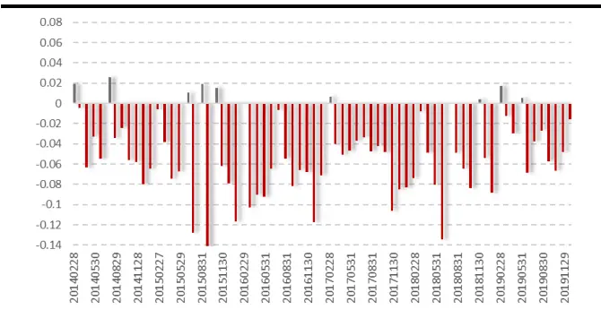
资料来源：Wind资讯，方正证券研究所

图表58：合成高频量价因子分组年化收益
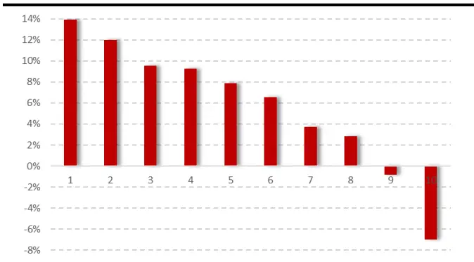
资料来源：Wind资讯，方正证券研究所

图表59：合成因子多空组合收益与回撤
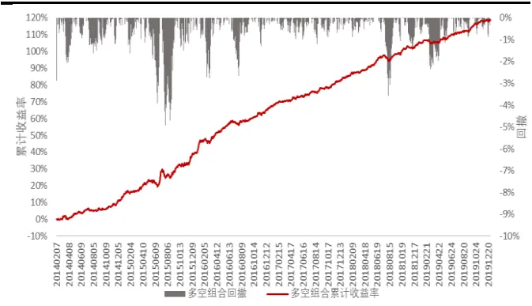
资料来源：Wind资讯，方正证券研究所

图表60：合成因子分10组净值
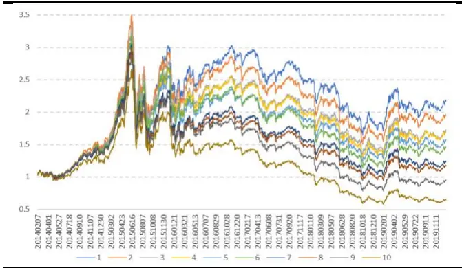
资料来源：Wind资讯，方正证券研究所

我们测试合成因子在沪深300以及中证500内的选股效果（正交后，剔除常见因子）。在沪深 300范围内选股，因子的 RankIC 值达到-0.0404，多空组年化收益为 13.05%，年化波动 8.55%，年化 IR1.53。在中证 500 内选股，因子的 RankIC 达到-0.0423，多空组年化收益为12.41%，年化波动为 8%，年化 IR1.55。总体来说，在指数内依然有不错的选股效果。

图表61：合成因子在指数内的选股效果

| 选股范围 | IC | rankIC | ICIR | 年化收益 | 年化波动 | 年化IR | 胜率 | 最大回撤 |
| --- | --- | --- | --- | --- | --- | --- | --- | --- |
| 沪深300内 | -0.0371 | -0.0404 | -1.87 | 13.05% | 8.55% | 1.53 | 64.79% | 8.88% |
| 中证500内 | -0.0402 | -0.0423 | -2.16 | 12.41% | 8.00% | 1.55 | 71.83% | 8.74% |

资料来源：Wind资讯，方正证券研究所

图表62：合成因子300内多空收益与回撤
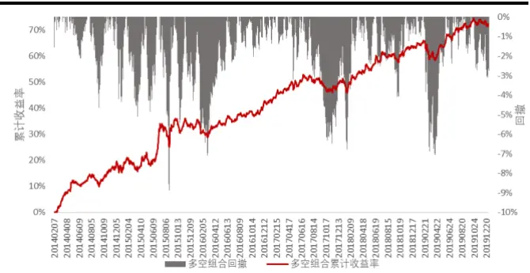
资料来源：Wind资讯，方正证券研究所

图表63：合成因子500内多空收益与回撤
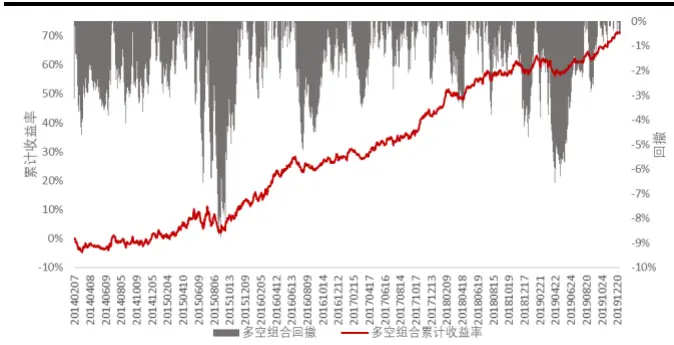
资料来源：Wind资讯，方正证券研究所

## 7 总结与心得

本篇报告是量价互动选股因子的续篇，笔者将前几篇中低频（日频）Alpha因子的研究结论和构建方法移植到日内高频数据上。对于没有读过前三篇报告的读者，本文的逻辑可能有些跳跃，例如为何从上述两个量价关系的视角切入，错期算法的灵感来源等没有做详细的解释，这些问题的答案可以在前置报告中找到，本文没有再做赘述。

通过计算日内高频价格和成交额的相关性，我们得到因子 。和日频因子相似，日内高频 因子比较稳健，数据的标准化、截尾处理、错期算法都没有给因子带来显著的 增量。具体来看，我们发现形如 4、5.1、5.2 的算法变形没有带来显著提升，因此我们推荐直接使用原始的价格与成交额计算相关性因子COPA，避免在反复的数据处理中造成信息丢失，以及引入不自知的数据挖掘偏差。

日内高频COPA 的因子均值在 0.04，多头组因子均值 0.14，空头组因子均值 。 因子值较高的股票具有短时期内异常放量上涨的特征，是典型的交易过热（投机）的特征，股票月频上有负向Alpha；反之因子值较小则量价更为平稳，投机性较弱。高频 COPA因子的结论和日频因子基本相同，不过因子的预测能力和稳健性有大幅提升，中性后的因子在测试期内的月度胜率高达84.51%。

通过计算日内高频涨跌幅的绝对值和成交额的相关性，我们得到因子 ，进而得到“量在价先”错期因子 ，“价在量先”错期因子 CORA_R。和日频因子相似，同期 CORA 因子独立 Alpha有限，被传统的波动和换手因子解释较多， 的错期构建大幅增加了因子独立预测能力。和 相比， 因子改进空间比较大，这可能由于涨跌幅比价格更加敏感，但同时数据的不稳定性也上升。通过剔除涨跌幅为 的噪音数据，并对成交额做标准化剔除日内分布特征带来的干扰，我们改进了该因子的选股效果。

日内高频 CORA_A 和 CORA_R 的因子均值在 0.2 附近，空头组因子均值约 0.3，多头组因子均值接近 0。这表明多头组基本没有量价抢跑现象，交易相对平稳；空头组频繁出现“量在价先”或者“价在量先”的异常迹象，这种微观层面的量价纠缠，或许反映出宏观层面的投机与泡沫，在月频上也表现为负向 Alpha。两个错期因子中性后的 RankIC 分别达到-4%和-5%，较为理想。

最后我们使用等权法对三个因子进行合成，合成因子 IC 均值为-5%，RankIC 均值为-5.73%，年化 ICIR 为-4.31。十分组收益分化明显，多空年化收益达到22.51%，年化波动5.48%，年化 IR 达到4.11，月度胜率超过85%，最大回撤仅 4.92%，表现非常优秀。

本文展示了因子的月频调仓结果，如果提高到周频，因子的选股效果还有进一步的提升，受制于篇幅，我们不再做展示。笔者以为，随着中低频（日频）上的Alpha逐渐被挖掘，新因子挖掘的方向一个是转向另类数据，另一个则是高频数据。相比于中低频，高频上仍有不少Alpha有待市场挖掘，因子的稳健性有不少提升。

## 回测说明

（1）如果没有特别说明，本文回测一律采用市值、行业、换手、波动、反转中性后的纯净因子

（2） 本文的回测时间段均为 2014/01/01 ~2019/12/31，其中前一个月为因子值计算月，真实持仓日期为 2014/02/07~2019/12/31 共计 1443个交易日。

（3） 手续费设为双边 3‰，组合月度调仓，月末最后一天按收盘价卖出，月初第一天按开盘价买入。

（4） 在全部 A 股中，剔除涨停、跌停、ST 和*ST、停牌、超低成交、上市不满 180 天的新股等特殊股票。

（5） 单因子测试中没有做组合优化和换手率控制，收益仍有提升空间

## 8 风险提示

本报告基于历史个股高频数据进行测试，历史回测结果不代表未来收益。未来市场风格可能切换，微观交易结构可能发生变化，Alpha因子可能失效，本文内容仅供参考。

感谢上海财经大学实习生钱静闲对本文的贡献

## 分析师声明

作者具有中国证券业协会授予的证券投资咨询执业资格，保证报告所采用的数据和信息均来自公开合规渠道，分析逻辑基于作者的职业理解，本报告清晰准确地反映了作者的研究观点，力求独立、客观和公正，结论不受任何第三方的授意或影响。研究报告对所涉及的证券或发行人的评价是分析师本人通过财务分析预测、数量化方法、或行业比较分析所得出的结论，但使用以上信息和分析方法存在局限性。特此声明。

## 免责声明

方正证券股份有限公司（以下简称“本公司”）具备证券投资咨询业务资格。本报告仅供本公司客户使用。本报告仅在相关法律许可的情况下发放，并仅为提供信息而发放，概不构成任何广告。

本报告的信息来源于已公开的资料，本公司对该等信息的准确性、完整性或可靠性不作任何保证。本报告所载的资料、意见及推测仅反映本公司于发布本报告当日的判断。在不同时期，本公司可发出与本报告所载资料、意见及推测不一致的报告。本公司不保证本报告所含信息保持在最新状态。同时，本公司对本报告所含信息可在不发出通知的情形下做出修改，投资者应当自行关注相应的更新或修改。

在任何情况下，本报告中的信息或所表述的意见均不构成对任何人的投资建议。在任何情况下，本公司、本公司员工或负任何责任。投资者务必注意，其据此做出的任何投资决策与本公司、本公司员工或者关联机构无关。

本公司利用信息隔离制度控制内部一个或多个领域、部门或关联机构之间的信息流动。因此，投资者应注意，在法律许可的情况下，本公司及其所属关联机构可能会持有报告中提到的公司所发行的证券或期权并进行证券或期权交易，也可能为这些公司提供或者争取提供投资银行、财务顾问或者金融产品等相关服务。在法律许可的情况下，本公司的董事、高级职员或员工可能担任本报告所提到的公司的董事。

市场有风险，投资需谨慎。投资者不应将本报告为作出投资决策的惟一参考因素，亦不应认为本报告可以取代自己的判断。

本报告版权仅为本公司所有，未经书面许可，任何机构和个人不得以任何形式翻版、复制、发表或引用。如征得本公司同意进行引用、刊发的，需在允许的范围内使用，并注明出处为“方正证券研究所”，且不得对本报告进行任何有悖原意的引用、删节和修改。

## 公司投资评级的说明：

强烈推荐：分析师预测未来半年公司股价有20%以上的涨幅；

推荐：分析师预测未来半年公司股价有10%以上的涨幅；

中性：分析师预测未来半年公司股价在-10%和10%之间波动；

减持：分析师预测未来半年公司股价有10%以上的跌幅。

## 行业投资评级的说明：

推荐：分析师预测未来半年行业表现强于沪深300指数；

中性：分析师预测未来半年行业表现与沪深300指数持平；

减持：分析师预测未来半年行业表现弱于沪深300指数。

|  | 北京 | 上海 | 深圳 | 长沙 |
| --- | --- | --- | --- | --- |
| 地址： | 北京市西城区阜外大街甲34号方正证券大厦8楼(100037)3 | 上海市浦东新区浦东南路60号新上海国际大厦36楼(200120) | 深圳市福田区深南大道4013号兴业银行大厦201(418000)华 | 长沙市芙蓉中路二段200号侨国际大厦24楼(410015) |
| 网址： | http://www.foundersc.com | http://www.foundersc.com | http://www.foundersc.com | http://www.foundersc.com |
| E-mail:y | jzx@foundersc.com | yjzx@foundersc.com | yjzx@foundersc.com | yjzx@foundersc.com |