## 金融工程

## 市场微观结构探析系列之四：

## 结合中高频信息的指数增强策略

## 数据频率与预测宽度

数据频率与因子预测时间宽度存在天然隔阂，数据频率越高其时间序列自相关性便越低，所能预测的时间宽度通常越有限。因此信息的变频处理对于在中高频数据中构建长周期 alpha 尤为关键。本篇报告中，我们希望探索中高频数据的通用化降频方式，进而我们通过“公式化”alpha 达到批量构建长周期量价因子的目标。

## 基于中高频数据的长周期 alpha

我们将因子构建拆解成信号生成、日度降频、月度降频三部分，进而得到公式化表达：

## factor=Alpha(formula， dailyTrans， monthlyTrans， windows)

其中 formula为初始日内中高频信号，dailyTrans为日内信号到日度因子转换的变频方式，monthlyTrans、windows 分别为日度因子值到月度因子的二次变频方式及滚动窗口长度。

基于中高频数据，本文采用以上 Alpha 表达式构建了 10 个以月为预测宽度的长周期因子，因子剔除常见量价风格后平均 IC 均值为 4.0%、ICIR 达到 3.16，多空收益 13.6%、多头收益 6.8%，表现出稳健的选股能力。

## 结合中高频量价信息的指数增强策略

我们将 10 个基于中高频数据构建的长周期因子与传统基本面因子结合构建月度调仓的中证 500 指数和与沪深 300 指数增强模型，中高频信息显著提升了指数增强组合收益。

风险提示：因子失效风险，模型失效风险，市场风格变动风险

证券研究报告

2020 年 05 月 14 日

## 作者

吴先兴分析师

SAC 执业证书编号：S1110516120001

wuxianxing@tfzq.com

缪铃凯

联系人

miaolingkai@tfzq.com

## 相关报告

1 《金融工程：市场微观结构探析系列之三：分时 K线中的 alpha》2020-02-252 《金融工程：市场微观结构探析系列之二：订单簿上的 alpha》 2019-09-05

## 1. 数据频率与预测宽度

我们以诸如IC等指标度量因子f对区间宽度为 T 未来收益率ret的预测能力，即：

$$
IC_{f,t,T}=corr\big(f_{t}^{i},ret_{t,t+T}^{i}\big)
$$

则 alpha 因子根据类型不同其适宜的预测时间宽度也存在明显差异。本文中，我们称预测时间宽度较长、自身变化频率较慢的选股因子为低频 alpha 因子或长周期 alpha 因子。定义AutoCorr指标度量因子在不同时间截面的自相关性，即

$$
AutoCorr_{f,t,T}=corr(f_{t}^{i},f_{t+T}^{i})
$$

则低频 alpha 通常拥有较高的自相关性，这也是其对长区间收益预测稳定性的保证。

以选股指标−1 ∗ ts_Max(3, Rank(Return))和SUE为例，我们分别计算其对滞后 T 期的日收益率的预测能力以及因子自相关的变化，其中ic_mean/ic_std定义为：

$$
ic_{\_mean/ic_{\_}std}=Mean(corr(f_{t}^{i},ret_{t+T-1,t+T}^{i}))/Std(corr(f_{t}^{i},ret_{t+T-1,t+T}^{i}))
$$

长周期指标SUE对股票的短期收益预测能力弱于短周期指标，但其 alpha 衰减却非常缓慢，因子自相关同样保持了缓慢的衰减速度，因子的预测宽度显著的高于另一个短周期指标；−1 ∗ ts_Max(3, Rank(Return))指标对于短期收益的预测能力强于SUE，但其 alpha 和自相关性衰退非常迅速，在 5 个交易日之后 alpha 能力开始落于下风，3 个交易日后因子自相关已经衰减至 0。

图 1：SUE 指标 ICIR 及自相关
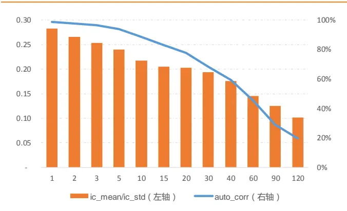
资料来源：Wind，天风证券研究所

图 2：-1*ts_Max(3,Rank(Return))指标 ICIR 及自相关
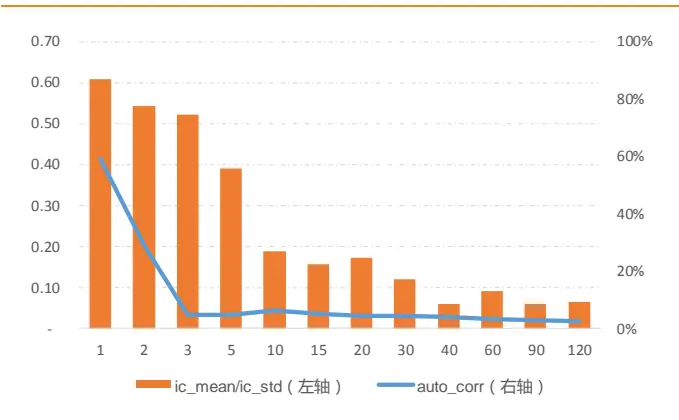
资料来源：Wind，天风证券研究所

数据频率与因子预测时间宽度存在天然隔阂，数据频率越高其时间序列自相关性便越低，所能预测的时间宽度通常越有限。低频 alpha 需要有较高的自相关和较长的时间宽度，财务数据和日频交易行情数据是常规的低频 alpha 信息源。基于常规数据的 alpha 挖掘早已进入瓶颈，获取增量 alpha 需要拓宽基础数据的来源。

中高频交易行情数据是拓宽 alpha 源的重要途经，而由于中高频数据自相关较低，数据本身能预测的时间宽度较短，从中高频数据中构建低频 alpha 时对于信息的变频处理将尤为关键。

在系列报告中，我们希望借由中高频交易数据探索市场微观结构现象，进而捕获增量的 alpha 信息。在报告《订单簿上的 alpha》中，我们详述了从探索 Tick 数据、发掘微观规律、数据变频，最终构建月频 alpha 因子的过程；而在报告《分时 K 线中的 alpha》中，我们以遗传算法为工具，基于日内分时 K 线数据展示了日频选股因子的自动化挖掘过程。

本篇报告中，我们将探索对于中高频数据的通用化降频方式。在此基础上，通过手工构建或算法自动生成中高频信号，我们基于中高频数据构建了一系列“公式化”长周期alpha 因子。各因子间保持较强独立性，因子在不同股票域中均表现出显著选股能力，原始指数增强模型中加入这些因子后组合收益出现显著提升。

## 2. 数据变频与 alpha 公式化

本节中，我们首先围绕数据降频方式展开，通过启发式的例子抽象了中高频数据的通用化降频方式；其次，为了提高因子挖掘效率，我们通过“公式化”alpha 因子展示了自动流水线化的长周期选股因子生成方式。

## 2.1. 启发式例子

## 2.1.1. 日内信号生成

以报告《市场微观结构探析系列之二：订单簿上的 alpha-20190905》中介绍的 Spread因子为例，我们展示了数据降频到因子构建的过程。首先分别定义指标Bid、Ask度量盘口委买、委卖挂单的流动性强弱：

$$
\left\{\begin{array}{ll}{{\displaystyle Bid=\sum_{i=1}^{10}bidPrice_{i}*bidVol_{i}*w_{i}}}\\{{\displaystyle Ask=\sum_{i=1}^{10}askPrice_{i}*askVol_{i}*w_{i}}}\end{array}\right.
$$

其中 $bidPrice_{i}$ $bidVol_{i}$ 分别为买盘第 i 挡挂单的价格和数量； $askPrice_{i}$ 7 $askVol_{i}$ 分别为卖盘第 i 挡挂单的价格和数量； $w_{i}$ 为不同档位权重，按价格成交优先次序从高到低衰减。

参照盘口流动性 Bid/Ask Spread1 常见的定义方式，我们定义Spread_tick指标度量每个 Tick 切片时间节点盘口买卖委托挂单的强弱差异：

$$
\it Spread\_tick=\frac{Bid\ -dsk}{Bid\ +\it Ask}
$$

其中Bid、Ask定义如上，其分别度量了盘口委买、委卖挂单流动性强弱。

## 2.1.2. 日度降频

我们发现短期高额成交会对盘口挂单造成显著的冲击，以平安银行-20190802 日盘口数据为例，我们比较每个 Tick 切片上Spread_tick指标到下一切片的变化量绝对值abs_diff_Spread与该切片成交量间的相关性。

图 3：成交量对盘口 Spread 冲击-000001.SZ-20190802
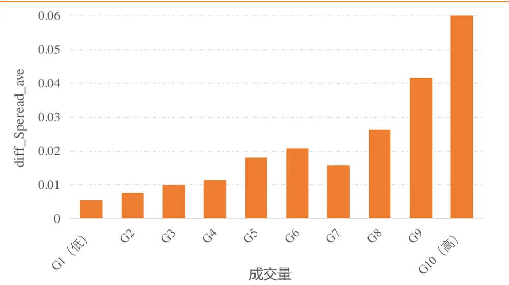
资料来源：Wind，天风证券研究所

如上图所示，高额的成交量将导致更大幅度的Spread_tick变动，而Spread_tick恢复至均衡状态需要交易中的重新挂单，短期内其可能导致买卖委托挂单相对强弱失真。

考虑如上因素，在指标降频过程中对每只股票我们将所有 Tick 切片按成交量排序，筛选出成交量最低的 50%切片取平均以得到日频因子Spread $\_date_{t}$ ：

$$
Spread_{-}date_{t}=\frac{2}{N}*\sum_{i=1}^{N}Spread_{-}tick_{t,i}*I_{vol_{t,i}<Median_{-}VoL_{t}}
$$

其中 $\boldsymbol{^{1}Spread\_tick_{t,i}}$ 为交易日 t 的 Tick 快照 i 上的指标值， $vol_{t,i}$ 为交易日 t 的 Tick 快照 i 上的成交额，Median ${\mathbf{}}Vol_{t}$ 为交易日 t 所有 Tick 成交量的中位数，N 为交易日 t 的快照总数；$\mathrm{I}_{\mathrm{A}}(x)$ 为取值 0-1 的示性函数。

## 2.1.3. 月度降频

步骤 b)展示日内高频信号到日频信号的降频过程，我们发现降频后的Spread_date与市场收益呈现显著相关性，市场收益越低的交易日股票整体的Spread_date倾向于越大。

图 4：日频 Spread 与市场 beta 相关性
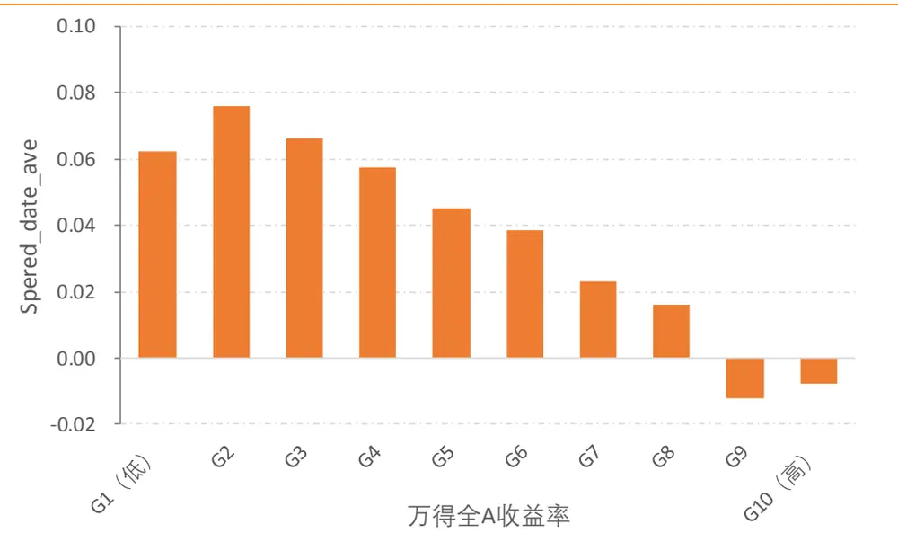
资料来源：Wind，天风证券研究所

为解决相同股票在不同交易日指标值不可比的问题，首先我们在截面上对指标值进行ZScore标准化：

$$
Spre\widehat{ad_{-}}date_{t}=\frac{Spread_{-}date_{t}-Mean(Spread_{-}date_{t})}{Std(Spread_{-}date_{t})}
$$

而后，我们给定窗口期 window，将窗口期内 $Spre\widehat{ad\_date}_{t}$ 加权平均以得到最终以未来 1个月为预测区间的选股因子 $Spread\_month_{m}$ :

$$
Spread\_month_{m}=\frac{1}{\sum_{t}w_{t}}*\sum_{t=m-window+1}^{t=m}w_{t}*Spre\widehat{ad_{-}}date_{t}
$$

其中 $\mathrm{w}_{\mathrm{t}}=1-(m-t)/window$ 为各交易日指标值的权重。

## 2.2. 公式化 Alpha

启发式的，我们将从中高频数据构建长周期因子的过程抽象为以下步骤：

1.信号生成：通过机器学习算法或手工构建方式，我们基于中高频数据得到股票在对应频率的日内信号值；

2.日度降频：由于同一股票在日内不同时点均有信号取值，利用特定的标准化处理我们将其降频得到日度的因子值；

3. 月度降频：为了让不同时间截面因子值可比，我们先对因子进行截面Z-Score标准化，其次为提高因子自相关性以及拓宽预测时间宽度，我们根据给定的滚动窗口和二次变频方式构建最终的 alpha 因子；

图 5：从高频信号到因子构建流程
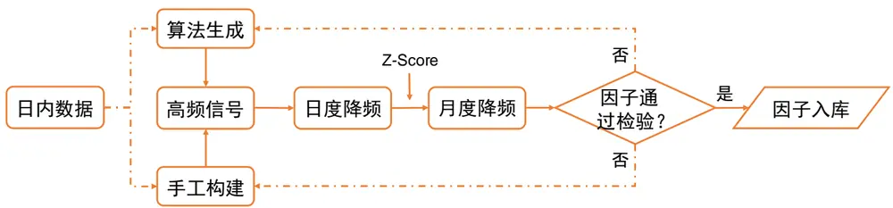
资料来源：天风证券研究所

如上图所示，最终从高频数据到长周期 Alpha 因子的构建过程可抽象成“公式化”的因子表达：

$$
factor=Alpha(formula,~dailyTrans,~monthlyTrans,~windows)
$$

其中formula为初始日内中高频信号，dailyTrans为日内信号到日度因子转换的变频方式，montℎlyTrans、 windows分别为日度因子到月度因子的二次变频方式及滚动窗口长度。

因此，因子的构建最终转换为信号公式formula的构建以及信号与各类变频方式的组合。

## 2.2.1. 信号生成

日内信号是生成主要包括手工构建和机器学习算法生成两类方式。上文例子中我们展示了纯手工构建的基于 Tick 数据的信号；而另一类方式则是基于机器学习算法自动化生成信号表达式。我们在报告《市场微观结构探析系列之三：分时 K 线中的 alpha-20200225》中详细介绍了基于遗传算法，我们用日内 30 分钟 K 线挖掘能有效预测隔日收益的 Alpha因子。

图 6：遗传算法流程
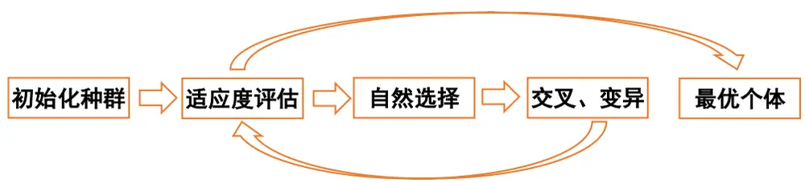
资料来源：天风证券研究所

所有的信号均由可公式化的量价特征以及对特征进行操作的算子组成。在本文中，我们使用股票 30 分钟 K 线数据，其中量价特征包含 K 线及该日的开盘价、最高价、最低价、收盘价、均价、成交量、成交额、收益率、换手率等信息。

表 1：特征及其描述

| 特征 | 含义 | 特征 | 含义 |
| --- | --- | --- | --- |
| open_price | K线开盘价 | today_open | 日开盘价 |
| highest_price | K线最高价 | today_high | 日最高价 |
| lowest_price | K线最低价 | doday_low | 日最低价 |
| close_price | K线收盘价 | today_close | 日收盘价 |
| vwap | K线均价 | today_vwap | 日均价 |
| volume | K线成交量 | today_volume | 日成交量 |
| turnover | K线成交额 | today_turnover | 日成交额 |
| RET | K线收益率 | today_RET | 日收益率 |
| TR | K线换手率 | today_TR | 日换手率 |

资料来源：天风证券研究所

算子包含向量运算符（加 add、减 sub、乘 mul、除 div 等）、时间截面运算符（截面序值 rank 等）以及时间序列运算符（时序最小值 ts_Min，时序均值 ts_Mean 等），本文中涉及的算子如下表所示。

表 2：算子公式及描述

| 算子 | 含义 | 算子 | 含义 |
| --- | --- | --- | --- |
| add(x,y) | ×加y | delta(n,x) | x减去n 期前×的取值 |
| sub(x,y) | ×减y | ts_Max(n,x) | 过去n期x的最大值 |
| mul(x,y) | x乘y | ts_Min(n,x) | 过去 n 期 ×的最小值 |
| div(x,y) | x除y | ts_Rank(n,x) | x 在过去n 期取值的排序 |
| sqrt(x) | ×的开方 | ts_Mean(n,x) | 过去n期×的平均值 |
| log(x) | x的对数 | ts_Sum(n,x) | 过去n期x的和 |
| abs(x) | x的绝对值 | stddev(n,x) | 过去n 期×的波动率 |
| neg(x) | x的相反数 | correlation(n,x,y) | x 和 y 在过去n 期的相关系数 |
| rank(x) | x 在截面排序值 | covariance(n,x,y) | x 和 y 在过去 n 期的协方差 |
| max(x,y) | x、y最大值 | pctange_ts(n,x) | 过去n期x的变化率 |
| min(x,y) | x、y最小值 | REGbeta_ts(n,x,y) | 过去n期×对y回归系数 |
| delay(n,x) | x在n期前的值 | REGresid_ts(n,x,y) | 过去n 期x 对于回归残差 |

资料来源：天风证券研究所

## 2.2.2. 数据变频

由于从日内中高频数据到以月为预测区间的选股因子数据需要变频的幅度较大，因此我们将数据的变频过程拆分为两步：从日内到日频、从日频到月频。

首先，我们将日内中高频信号降频为日度的因子取值，本文可能涉及的降频方式如下所描述：

- timestamp：取日内特定时点因子值作为当日因子值，如 timestamp=1500 代表用收盘时点信号值作为当日因子值。日内不同时间点所反应的信息有较大差异，如开盘、收盘时点可能蕴含更丰富的知情交易信息。

max_name、 min_name：取特征 name 在当日取值最大、最小时点的信号值，如max_turnover获取日内成交额最大 K 线上的因子值。日内极端行情的时间点可能蕴含着特殊的信息，通过该方式捕捉极端行情时点的因子信号。

- diff_name、 div_name：获取特征 name 日内取值最大、最小时点的因子比值或差值，该方式对比了日内两类极端行情下的信号差异。

- sortmeandiv_name、 sortmeandiff_name：将日内 k 线按 name 排序，返回前一半 k线上因子均值与后一半 K 线上因子均值的比值或差值。该方式对比了日内不同情境下的信号差异。

- mean_kline：返回日内各 K 线因子值的平均值，其为基于均线逻辑的简单平滑。

表 3：日度降频公式

| 公式 | 含义 |
| --- | --- |
| timestamp | 提取特定时间戳因子值，如 timestamp为1500 时获取收盘时点因子值 |
| max_name | 特征name 日内取值最大值时因子值，如max_turnover获取日内成交额最大 K线上的因子值 |
| min_name | 特征 name日内取值最小时因子值 |
| div_name | 特征name日内取值最大、最小时点的因子比值 |
| diff_name | 特征name日内取值最大、最小时点的因子差值 |
| sortmeandiv_name | 将日内K线按name排序，返回前一半K线因子均值与后一半K线因子均值的比值 |
| sortmeandiff_name | 将日内 K线按name排序，返回前一半K线因子均值与后一半K线因子均值的差值 |
| mean_kline | 返回日内各K线因子值的平均值 |

资料来源：天风证券研究所

其次，对于日度因子值，我们需要进一步降频处理以提高因子自相关性以及拓宽其预测时间宽度。对于给定的窗口长度 windows，本文可能涉及到的月度降频方式如下所示，分别为取因子在窗口期内均值 mean、标准差 std、最小值 min、最大值 max、均值/标准差mean/std 和差值 diff等。

表 4：月度降频公式

| 公式 | 含义 |
| --- | --- |
| mean | 窗口期内每日因子值的平均值 |
| std | 窗口期内每日因子值的标准差 |
| min | 窗口期内每日因子值的最小值 |
| max | 窗口期内每日因子值的最大值 |
| mean/std | 窗口期内每日因子值的均值/标准差 |
| diff | 因子滚动均值在窗口期初和期末的差值 |

资料来源：天风证券研究所

- mean：mean方法计算因子在窗口期的均值，其对因子进行MA 均线平滑处理。

- std：std 方法计算因子在窗口期的标准差，刻画了因子值的波动情况。

min max min max 方法获取因子在窗口内的极值；若希望因子值整体越大，通过min 方法获取极小值，极小值越大越能保证因子整体取值更大。

mean/std：mean/std类似信息比率计算逻辑，其确保因子均值较大同时波动越小。

- diff：diff计算因子在窗口期的变化幅度，其刻画了因子值整体的增长幅度。

最后，我们以如下因子为例，解释根据公式计算因子的详细过程：

$$
Alpha(pctchange\_ts(4,close\_price),\ 1500,\ mean/std,\ 40)
$$

1. 对于每根 K 线计算收盘价相对 4 期前的变化率pctcℎange_ts(4, close_price)；

2. 取每日 1500 时刻 K 线的信号值作为当日的因子值；

3. 因子逐日 Z-Score 标准化，以 40 个交易日为窗口期滚动计算均值与标准差比值；

## 3. 基于中高频数据的长周期 alpha

按照前文所述方法，我们在本节中展示从日内 30 分钟 K 线数据中挖掘的 alpha 因子表达以及历史绩效。我们在全 A 中剔除上市不满 120 个交易日新股、ST 股票、ST 摘帽不满60 个交易日股票以及长期停牌股票构建股票池以测试选股因子的历史表现。

由于量价指标易跟常见的量价因子呈现出高度相关，为获取增量信息我们将指标值与中信一级行业、对数市值、过去一个月日均收益率、过去一个月日均换手率、过去一个月日收益波动率、过去一个月日均非流动性冲击指标回归取残差作为中性化后因子值：

$$
f_{i}=\sum_{s}\beta_{i}^{s}Style_{i}^{s}+\sum_{ind}\beta_{i}^{ind}X_{i}^{ind}+\varepsilon_{i}
$$

其中对于股票i, $Style_{i}^{s}$ 是股票在风格s上的暴露， $X_{i}^{ind}$ 为股票对于行业ind的 0-1 哑变量，残差 $\mathbf{\mathcal{E}}_{i}$ 为风格中性化后因子取值。

按照上述模式我们构建了 10 个 Alpha 因子如下表所示，因子自相关均值在 50%附近，多头组合换手率约 60%，因子公式表达及历史绩效将在后文详细展示。

表 5：指标盈利逻辑

| 因子 | 盈利逻辑 |
| --- | --- |
| Alpha1 | Alpha1 度量了股价在尾盘涨跌幅在日内的排序，尾盘拉升幅度相对日内其它时间点更大的股票，其股价被操纵 的可能性更大。 |
| Alpha2 | Alpha2 为反转逻辑的特殊表达，指标度量了股价在过去一段时间午盘收益的信息比率，信息比率越高的股票在 未来股价反转概率越大。 |
| Alpha3 | Alpha3为动量因子，其度量了股价隔日跳空高开的幅度大小，相较于股价日内收益的反转效应，股价在日间呈 现出动量效应，高开的幅度越大意味着其中知情交易信息的蕴含度越高。 |
| Alpha4 | Alpha4 度量了股价在不同成交量情境下的振幅差异，高成交量时点振幅越大意味着主力的多空博弈越激烈，股 价未来走势不确定性越大，相对收益越低。 |
| Alpha5 | Alpha5度量了日内不同时点持仓成本相对日平均成本的大小，股票在日内有较大成交量在相对低的价位成交， 其可能反应了机构投资者的低位建仓行为，因此股价长期走高概率更大。 |
| Alpha6 | Alpha6 度量了股价尾盘成交额在日内的排序大小，尾盘的相对高额成交可能反应了对于收盘价的操控，相对成 交额越大股价被操控的概率将越大。 |
| Alpha7 | Alpha7度量了股价在早盘的换手率大小，操纵股价的关键两个时点在于开盘和收盘，股票在早盘换手率越高意 味着其股价被操控可能性将越大。 |
| Alpha8 | Alpha8 度量了股价在尾盘的换手率大小，相比 Alpha6 在时间序列上度量成交额高低，Alpha8 在截面上度量了股 票间的换手率差异，尾盘高换手股票股价被操控可能性将更大。 |
| Alpha9 | Alpha9度量了股票在不同的涨跌幅情境下的价差大小，分别取日内涨跌幅最低K线的最高价减去涨跌幅最高K 线的最高价，二者价差越大股票未来收益越高。 |
| Alpha10 | Alpha10度量了股票在日内最高价与收益率间的相关性，日内涨跌幅最高的时点股价未创新高，则股票在未来的 收益率越低。 |

资料来源：天风证券研究所

## 3.1. 价格相关

## 3.1.1. Alpha1

Alpℎa1 = Alpℎa(ts_Rank(8, pctcℎange_ts(6, ℎigℎest_price))， 1500， mean/std， 40)

Alpha1 以 K 线最高价计算股票尾盘 3 小时收益在日内的排序值，并以 40 日为窗口滚动计算均值与标准差比值。尾盘拉升幅度相对日内其它时间点更大的股票，其股价被操纵的可能性更大，未来相对收益将更低。

图 7：Alpha1 分组收益
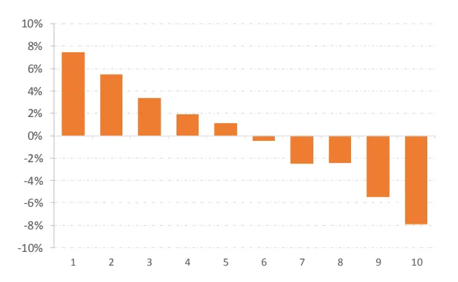
资料来源：Wind，天风证券研究所

图 8：Alpha1 多空净值
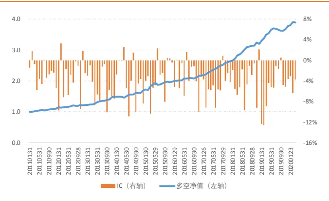
资料来源：Wind，天风证券研究所

Alpha1 因子表现出稳定的选股能力，分组收益单调性显著。2011 年以来多空收益 15.4%，多头超额 7.5%，IC 均值 4.0%，ICIR 达到 3.93。

表 6：Alpha1 历史绩效

| 年份 | 多空收益 | 多头超额 | 多头IR | 多空IR | IC 均值 | ICIR | IC 胜率 |
| --- | --- | --- | --- | --- | --- | --- | --- |
| 2011 | 7.4% | 4.6% | 2.87 | 3.56 | -2.5% | -3.88 | 83.3% |
| 2012 | 10.5% | 1.8% | 0.44 | 2.10 | -3.4% | -2.77 | 83.3% |
| 2013 | 25.2% | 12.3% | 2.85 | 4.25 | -5.3% | -5.69 | 100.0% |
| 2014 | 17.3% | 2.7% | 0.60 | 1.82 | -3.8% | -3.00 | 83.3% |
| 2015 | 24.6% | 16.7% | 1.93 | 1.93 | -3.2% | -3.02 | 75.0% |
| 2016 | 9.2% | 5.8% | 2.83 | 3.07 | -3.3% | -3.48 | 83.3% |
| 2017 | 17.2% | 8.6% | 6.09 | 11.46 | -5.0% | -6.32 | 91.7% |
| 2018 | 13.7% | 5.9% | 3.31 | 3.47 | -3.9% | -3.81 | 91.7% |
| 2019 | 20.5% | 11.9% | 3.31 | 3.23 | -5.4% | -4.57 | 91.7% |
| 20200331 | 3.2% | 2.4% | 4.94 | 2.36 | -4.4% | -8.65 | 100.0% |
| 全样本 | 15.4% | 7.5% | 2.25 | 2.92 | -4.0% | -3.93 | 87.4% |

资料来源：Wind，天风证券研究所

Alpha1 在不同股票池中均表现出稳定的选股能力，在沪深 300、中证 500、中证 800、中证 1000 中因子 IC 均值绝对值均大于 3.0%，ICIR 分别达到 1.75、1.94、2.30、3.37。

表 7：Alpha1 分股票池因子表现

| 股票池 | 多空收益 | 多头超额 | 多空IR | IC 均值 | ICIR | IC 胜率 |
| --- | --- | --- | --- | --- | --- | --- |
| 全样本 | 15.4% | 7.5% | 2.92 | -4.0% | -3.93 | 87.4% |
| 沪深 300 | 12.5% | 8.4% | 1.31 | -4.0% | -1.75 | 68.5% |
| 中证 500 | 10.3% | 3.4% | 1.44 | -3.2% | -1.94 | 71.2% |
| 中证800 | 11.4% | 5.6% | 1.75 | -3.5% | -2.30 | 75.7% |
| 中证1000 | 15.8% | 7.2% | 2.05 | -4.5% | -3.37 | 84.6% |

资料来源：Wind，天风证券研究所

## 3.1.2. Alpha2

$$
Alpha2=Alpha(pctchange_{-}ts(4,close_{-}price),~1500,~mean/std,~40)
$$

Alpha2 因子为反转因子，其以股票午盘收益在最近 40 个交易日的信息比率作为反转逻辑的另类表达，根据反转效应历史信息比越高的股票在未来相对收益将越低。

图 9：Alpha2 分组收益
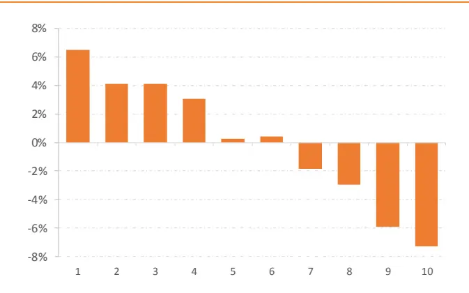
资料来源：Wind，天风证券研究所

图 10：Alpha2 多空净值
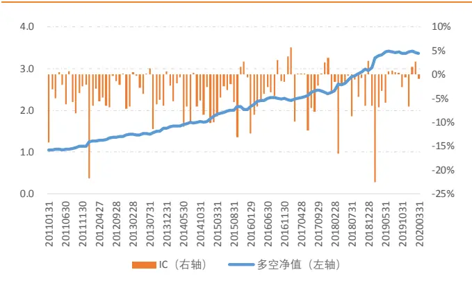
资料来源：Wind，天风证券研究所

Alpha2 因子表现出稳定的选股能力，分组收益单调性显著。2011 年以来多空收益 13.8%，多头超额 6.5%，IC 均值 4.0%，ICIR 达到-2.80。

表 8：Alpha2 历史绩效

| 年份 | 多空收益 | 多头超额 | 多头IR | 多空IR | IC 均值 | ICIR | IC 胜率 |
| --- | --- | --- | --- | --- | --- | --- | --- |
| 2011 | 9.4% | 4.4% | 2.88 | 2.80 | -4.3% | -3.67 | 83.3% |
| 2012 | 21.7% | 8.2% | 1.81 | 2.37 | -5.5% | -3.30 | 91.7% |
| 2013 | 12.1% | 7.5% | 1.90 | 2.00 | -3.4% | -2.94 | 66.7% |
| 2014 | 15.4% | 5.4% | 1.39 | 2.76 | -5.1% | -4.72 | 91.7% |
| 2015 | 28.0% | 18.3% | 2.72 | 2.04 | -4.7% | -3.25 | 83.3% |
| 2016 | 10.9% | 6.2% | 2.70 | 2.05 | -3.7% | -2.83 | 83.3% |
| 2017 | 5.0% | 0.5% | 0.25 | 1.27 | -2.2% | -1.36 | 41.7% |
| 2018 | 14.8% | 7.1% | 2.13 | 3.13 | -3.8% | -2.58 | 91.7% |
| 2019 | 16.6% | 7.0% | 1.66 | 1.81 | -4.4% | -2.33 | 66.7% |
| 20200331 | -0.9% | 0.4% | 0.67 | -2.28 | 1.2% | 2.24 | 33.3% |
| 全样本 | 13.8% | 6.5% | 1.86 | 2.12 | -4.0% | -2.80 | 76.6% |

资料来源：Wind，天风证券研究所

Alpha2 在不同股票池中均表现出稳定的选股能力，在沪深 300、中证 500、中证 800、中证 1000 中因子 IC 均值绝对值均大于 3.5%，ICIR 分别达到 1.21、1.96、1.81、2.25。

表 9：Alpha2分股票池因子表现

| 股票池 | 多空收益 | 多头超额 | 多空IR | IC 均值 | ICIR | IC 胜率 |
| --- | --- | --- | --- | --- | --- | --- |
| 全样本 | 13.8% | 6.5% | 2.12 | -4.0% | -2.80 | 76.6% |
| 沪深300 | 12.6% | 4.1% | 1.13 | -3.7% | -1.21 | 61.3% |
| 中证500 | 12.7% | 4.1% | 1.43 | -4.2% | -1.96 | 71.2% |
| 中证800 | 11.9% | 4.1% | 1.45 | -4.0% | -1.81 | 71.2% |
| 中证1000 | 15.4% | 8.2% | 1.76 | -3.8% | -2.25 | 66.2% |

资料来源：Wind，天风证券研究所

## 3.1.3. Alpha3

$$
Alpha3=Alpha(div(open\_price,pre\_close),1000,min,40)
$$

Alpha3 因子是个动量因子，其度量了股票隔日跳空高开的幅度。每日取第一根 K 线开盘价计算相对昨日收盘价的涨跌幅，截面标准化后滚动 40 个交易日取因子最小值。相较于股价日内收益的反转效应，股价在日间呈现出动量效应，高开的幅度越大意味着其中知情交易信息的蕴含度越高，未来的预期收益越高。

图 11：Alpha3 分组收益
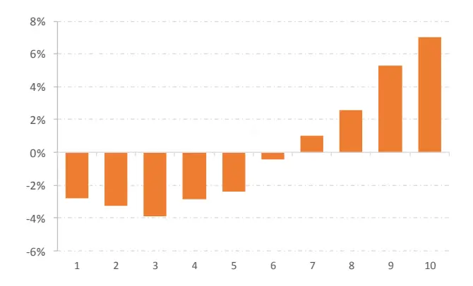
资料来源：Wind，天风证券研究所

图 12：Alpha3 多空净值
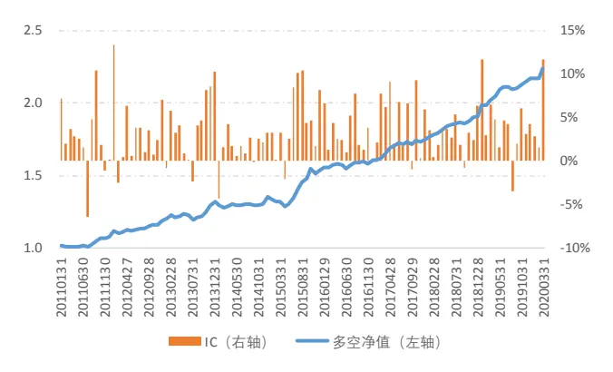
资料来源：Wind，天风证券研究所

Alpha3因子表现出稳定的选股能力，分组收益单调性显著。2011年以来多空收益9.8%，多头超额 7.0%，IC 均值 3.5%，ICIR 达到-2.80。

表 10：Alpha3 历史绩效

| 年份 | 多空收益 | 多头超额 | 多头IR | 多空IR | IC 均值 | ICIR | IC 胜率 |
| --- | --- | --- | --- | --- | --- | --- | --- |
| 2011 | 6.0% | 5.0% | 2.79 | 1.94 | 2.5% | 2.04 | 83.3% |
| 2012 | 10.2% | 7.5% | 2.56 | 1.90 | 3.4% | 2.87 | 91.7% |
| 2013 | 12.8% | 7.4% | 1.76 | 1.80 | 3.9% | 3.47 | 83.3% |
| 2014 | 4.1% | 4.5% | 1.11 | 0.53 | 1.4% | 2.33 | 83.3% |
| 2015 | 28.7% | 20.3% | 2.25 | 1.56 | 4.6% | 3.99 | 91.7% |
| 2016 | 4.0% | 4.5% | 2.10 | 1.32 | 3.2% | 4.62 | 91.7% |
| 2017 | 8.0% | 6.9% | 3.24 | 2.38 | 4.7% | 4.68 | 91.7% |
| 2018 | 6.4% | 4.0% | 4.33 | 4.37 | 2.8% | 5.01 | 91.7% |
| 2019 | 16.4% | 9.0% | 2.02 | 2.96 | 4.1% | 3.97 | 91.7% |
| 20200331 | 3.1% | 1.6% | 0.73 | 2.29 | 5.4% | 3.40 | 100.0% |
| 全样本 | 9.8% | 7.0% | 2.10 | 1.81 | 3.5% | 3.45 | 89.2% |

资料来源：Wind，天风证券研究所

Alpha3 在不同股票池中均表现出稳定的选股能力，在沪深 300、中证 500、中证 800、中证 1000 中因子 IC 均值绝对值均大于 3.5%，ICIR 分别达到 1.21、1.96、1.81、2.25。

表 11：Alpha3 分股票池因子表现

| 股票池 | 多空收益 | 多头超额 | 多空IR | IC 均值 | ICIR | IC 胜率 |
| --- | --- | --- | --- | --- | --- | --- |
| 全样本 | 9.8% | 7.0% | 1.81 | 3.5% | 3.45 | 89.2% |
| 沪深 300 | 6.5% | 4.3% | 0.71 | 2.1% | 1.00 | 64.9% |
| 中证 500 | 10.6% | 5.8% | 1.50 | 3.6% | 2.16 | 77.5% |
| 中证800 | 9.5% | 5.2% | 1.48 | 3.0% | 1.97 | 73.0% |
| 中证1000 | 12.7% | 8.1% | 1.61 | 4.6% | 3.49 | 86.2% |

资料来源：Wind，天风证券研究所

## 3.1.4. Alpha4

Alpℎa4 = Alpℎa(sub(ℎigℎest_price, lowest_price)， sortmeandiv_turnover ， mean/std， 40)

Alpha4 因子度量了在不同成交额情境下的振幅差异。每日取成交量最低的一半 K 线振幅均值除以成交量最高的另一半 K 线振幅均值作为当日因子值，因子值截面标准化后滚动40 个交易日计算因子均值与标准差的比值。高成交量时点振幅相对越大意味着主力的多空博弈越激烈，股价未来走势不确定性越大，相对收益越低。

图 13：Alpha4 分组收益
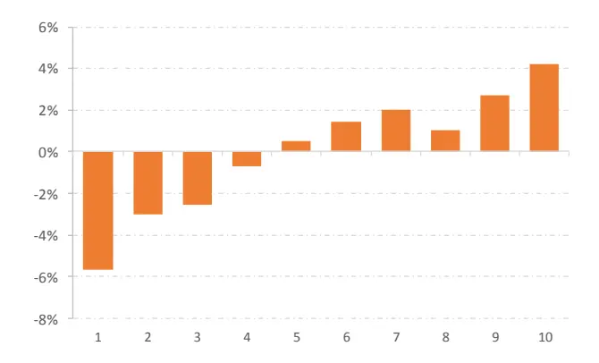
资料来源：Wind，天风证券研究所

图 14：Alpha4 多空净值
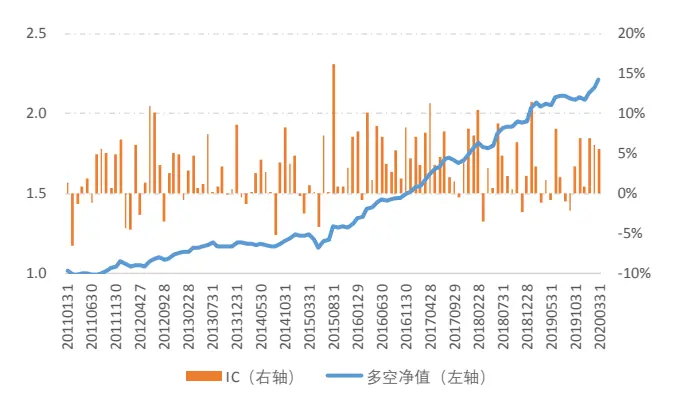
资料来源：Wind，天风证券研究所

Alpha4因子表现出稳定的选股能力，分组收益单调性显著。2011年以来多空收益9.9%，多头超额 4.2%，IC 均值 3.2%，ICIR 达到 2.67。

表 12：Alpha4 历史绩效

| 年份 | 多空收益 | 多头超额 | 多头IR | 多空IR | IC 均值 | ICIR | IC 胜率 |
| --- | --- | --- | --- | --- | --- | --- | --- |
| 2011 | 6.3% | 2.1% | 1.20 | 1.48 | 2.0% | 1.78 | 75.0% |
| 2012 | 5.5% | 2.8% | 0.69 | 0.83 | 2.5% | 1.61 | 66.7% |
| 2013 | 7.7% | 4.1% | 1.45 | 1.34 | 2.5% | 2.83 | 83.3% |
| 2014 | 5.9% | 4.8% | 1.27 | 1.14 | 2.0% | 1.94 | 75.0% |
| 2015 | 15.9% | 11.0% | 0.80 | 0.58 | 2.5% | 1.60 | 75.0% |
| 2016 | 13.1% | 7.2% | 3.60 | 3.21 | 5.1% | 5.21 | 91.7% |
| 2017 | 12.6% | 4.6% | 2.68 | 2.99 | 5.1% | 5.24 | 91.7% |
| 2018 | 8.4% | 2.1% | 0.70 | 2.19 | 3.4% | 2.75 | 83.3% |
| 2019 | 8.5% | 1.2% | 0.23 | 1.24 | 2.8% | 2.27 | 66.7% |
| 20200331 | 5.5% | 1.6% | 1.25 | 17.74 | 6.3% | 32.82 | 100.0% |
| 全样本 | 9.9% | 4.2% | 1.13 | 1.57 | 3.2% | 2.67 | 79.3% |

资料来源：Wind，天风证券研究所

Alpha4 在不同股票池中均表现出稳定的选股能力，在沪深 300、中证 500、中证 800、中证 1000 中因子 IC 均值绝对值均大于 3.0%，ICIR 分别达到 1.54、1.74、1.94、2.36。

表 13：Alpha4 分股票池因子表现

| 股票池 | 多空收益 | 多头超额 | 多空IR | IC 均值 | ICIR | IC 胜率 |
| --- | --- | --- | --- | --- | --- | --- |
| 全样本 | 9.9% | 4.2% | 1.57 | 3.2% | 2.67 | 79.3% |
| 沪深 300 | 11.1% | 4.9% | 0.93 | 3.7% | 1.54 | 64.0% |
| 中证 500 | 10.8% | 3.8% | 1.22 | 3.1% | 1.74 | 69.4% |
| 中证800 | 10.4% | 4.1% | 1.34 | 3.2% | 1.94 | 68.5% |
| 中证1000 | 11.0% | 4.3% | 1.27 | 3.9% | 2.36 | 76.9% |

资料来源：Wind，天风证券研究所

## 3.1.5. Alpha5

$$
Alpha5=Alpha(div(today\_vwap,vwap),\ mean\_kline,\ max,\ 40)
$$

Alpha5 因子度量了日均价与日内各 K 线均价比值的均值，日指标值标准化以 40 个交易日为窗口滚动计算最大值作为最终因子。因子刻画了日内不同时点持仓成本相对日平均成本的大小，因子越小意味着股票在日内有越多的成交在相对低位成交，其可能反应了机构投资者的低位建仓行为，因此股价长期走高概率更大。

图 15：Alpha5 分组收益
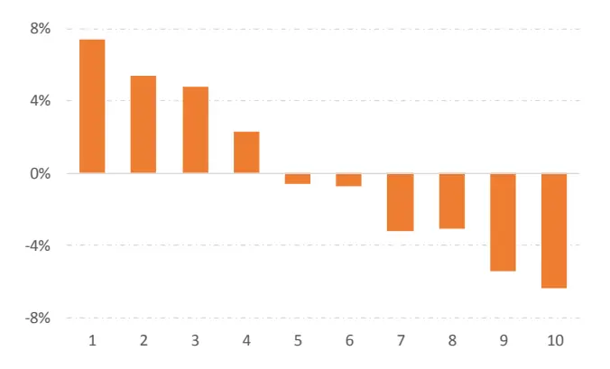
资料来源：Wind，天风证券研究所

图 16：Alpha5 多空净值
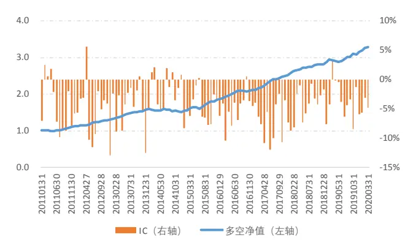
资料来源：Wind，天风证券研究所

Alpha5 因子表现出稳定的选股能力，分组收益单调性显著。2011 年以来多空收益 13.8%，多头超额 7.4%，IC 均值-4.5%，ICIR 达到-4.30。

表 14：Alpha5 历史绩效

| 年份 | 多空收益 | 多头超额 | 多头IR | 多空IR | IC 均值 | ICIR | IC 胜率 |
| --- | --- | --- | --- | --- | --- | --- | --- |
| 2011 | 8.7% | 4.5% | 2.27 | 2.81 | -4.5% | -3.53 | 75.0% |
| 2012 | 16.3% | 9.8% | 3.72 | 4.10 | -5.4% | -3.74 | 91.7% |
| 2013 | 22.5% | 9.5% | 3.68 | 7.22 | -4.6% | -4.16 | 91.7% |
| 2014 | -4.7% | -3.3% | -0.93 | -0.72 | -1.5% | -1.80 | 58.3% |
| 2015 | 36.2% | 25.8% | 3.38 | 2.86 | -4.8% | -6.03 | 91.7% |
| 2016 | 12.6% | 9.5% | 4.52 | 3.84 | -5.0% | -6.41 | 91.7% |
| 2017 | 15.6% | 5.6% | 3.27 | 6.28 | -7.0% | -7.57 | 100.0% |
| 2018 | 8.1% | 4.9% | 3.23 | 4.34 | -4.2% | -5.23 | 100.0% |
| 2019 | 13.0% | 3.8% | 1.40 | 2.18 | -3.6% | -3.57 | 91.7% |
| 20200331 | 4.3% | 3.2% | 2.27 | 4.40 | -4.6% | -12.27 | 100.0% |
| 全样本 | 13.8% | 7.4% | 2.43 | 2.90 | -4.5% | -4.30 | 88.3% |

资料来源：Wind，天风证券研究所

Alpha5 在不同股票池中均表现出稳定的选股能力，在沪深 300、中证 500、中证 800、中证 1000 中因子 IC 均值绝对值均大于 4.0%，ICIR 绝对值分别达到 2.16、2.67、2.91、4.29。

表 15：Alpha5 分股票池因子表现

| 股票池 | 多空收益 | 多头超额 | 多空IR | IC 均值 | ICIR | IC 胜率 |
| --- | --- | --- | --- | --- | --- | --- |
| 全样本 | 13.8% | 7.4% | 2.90 | -4.5% | -4.30 | 88.3% |
| 沪深 300 | 12.0% | 5.5% | 1.40 | -4.7% | -2.18 | 75.7% |
| 中证 500 | 9.1% | 4.2% | 1.29 | -4.3% | -2.67 | 77.5% |
| 中证800 | 10.5% | 4.3% | 1.81 | -4.3% | -2.91 | 82.0% |
| 中证1000 | 16.6% | 8.6% | 2.26 | -5.0% | -4.35 | 92.3% |

资料来源：Wind，天风证券研究所

## 3.2. 成交量相关

## 3.2.1. Alpha6

$$
Alpha6=Alpha(ts_{-}Rank(8,turnover),~1500,~mean,~40)
$$

Alpha6 因子度量为尾盘成交额在日内的排序，每日尾盘成交在日内所有 K 线成交量中的排序值作为因子值，日指标值标准化后滚动 40 日平均作为最终因子。尾盘的相对成交额可能反应了收盘价被操控的程度，尾盘相对成交额越大股价被操控的概率将越大。

图 17：Alpha6 分组收益
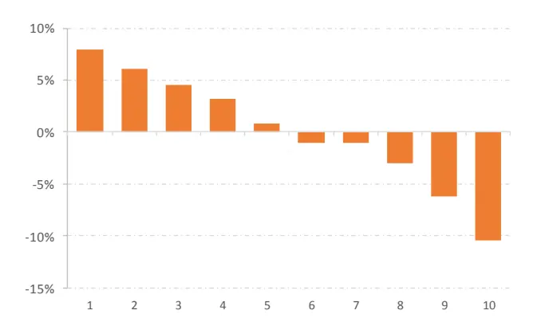
资料来源：Wind，天风证券研究所

图 18：Alpha6 多空净值
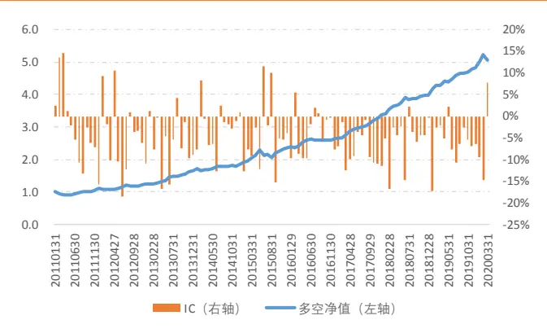
资料来源：Wind，天风证券研究所

Alpha6 因子表现出稳定的选股能力，分组收益单调性显著。2011 年以来多空收益 18.4%，多头超额 7.9%，IC 均值-4.8%，ICIR 达到-2.46。

表 16：Alpha6 历史绩效

| 年份 | 多空收益 | 多头超额 | 多头IR | 多空IR | IC 均值 | ICIR | IC 胜率 |
| --- | --- | --- | --- | --- | --- | --- | --- |
| 2011 | 8.3% | 2.0% | 0.34 | 1.11 | -2.6% | -0.95 | 66.7% |
| 2012 | 12.2% | 4.7% | 0.63 | 1.43 | -4.7% | -1.87 | 75.0% |
| 2013 | 36.3% | 18.3% | 3.20 | 4.18 | -6.0% | -3.24 | 83.3% |
| 2014 | 15.6% | 0.4% | 0.06 | 1.54 | -2.4% | -1.57 | 75.0% |
| 2015 | 35.9% | 17.2% | 1.14 | 1.67 | -4.5% | -1.88 | 83.3% |
| 2016 | 10.3% | 2.1% | 0.58 | 1.85 | -3.8% | -2.48 | 75.0% |
| 2017 | 22.5% | 14.8% | 3.84 | 5.90 | -7.6% | -6.46 | 100.0% |
| 2018 | 12.6% | 7.1% | 2.14 | 3.03 | -5.2% | -3.32 | 91.7% |
| 2019 | 24.3% | 11.1% | 2.02 | 3.49 | -5.9% | -4.20 | 91.7% |
| 20200331 | 4.8% | 0.6% | 0.36 | 1.39 | -5.4% | -1.59 | 66.7% |
| 全样本 | 18.4% | 7.9% | 1.24 | 2.16 | -4.8% | -2.46 | 82.0% |

资料来源：Wind，天风证券研究所

Alpha6 在不同股票池中均表现出稳定的选股能力，在沪深 300、中证 500、中证 800、中证 1000 中因子 IC 均值绝对值均大于 4.0%，ICIR 绝对值分别达到 2.27、2.03、2.18、2.29。

表 17：Alpha6 分股票池因子表现

| 股票池 | 多空收益 | 多头超额 | 多空IR | IC 均值 | ICIR | IC 胜率 |
| --- | --- | --- | --- | --- | --- | --- |
| 全样本 | 18.4% | 7.9% | 2.16 | -4.8% | -2.46 | 82.0% |
| 沪深 300 | 22.9% | 12.2% | 1.70 | -7.1% | -2.27 | 78.4% |
| 中证 500 | 17.4% | 8.2% | 1.98 | -4.4% | -2.03 | 77.5% |
| 中证 800 | 18.8% | 9.1% | 1.88 | -5.0% | -2.18 | 73.9% |
| 中证1000 | 21.1% | 9.1% | 2.07 | -5.1% | -2.29 | 76.9% |

资料来源：Wind，天风证券研究所

## 3.2.2. Alpha7

$$
Alpha7=Alpha(TR,\ 1000,\ max,\ 40)
$$

Alpha7因子度量了股票的开盘换手率大小，取每日开盘30分钟换手率作为日指标值，将日指标值截面标准化后滚动 40 日取最大值作为最终的因子值。开盘和收盘类似的是操纵股价的关键两个时点，早盘换手率越高意味着股票价格被操控可能性将越大。

图 19：Alpha7 分组收益
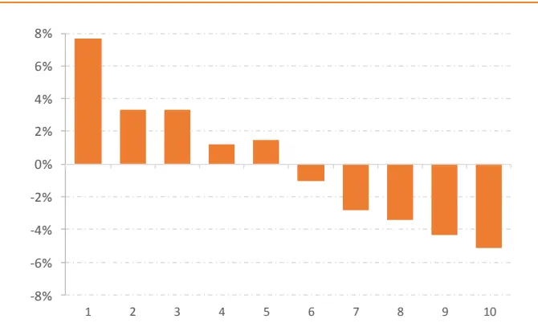
资料来源：Wind，天风证券研究所

图 20：Alpha7 多空净值
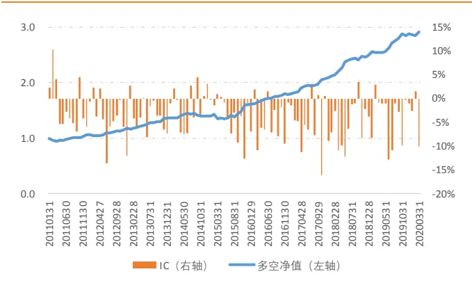
资料来源：Wind，天风证券研究所

Alpha7 因子表现出稳定的选股能力，分组收益单调性显著。2011 年以来多空收益 12.8%，多头超额 7.7%，IC 均值-3.7%，ICIR 达到-2.71。

表 18：Alpha7 历史绩效

| 年份 | 多空收益 | 多头超额 | 多头IR | 多空IR | IC 均值 | ICIR | IC 胜率 |
| --- | --- | --- | --- | --- | --- | --- | --- |
| 2011 | 5.0% | 2.9% | 1.09 | 1.08 | -1.5% | -0.96 | 66.7% |
| 2012 | 10.8% | 6.0% | 2.09 | 2.19 | -4.2% | -2.95 | 83.3% |
| 2013 | 19.3% | 13.6% | 3.42 | 3.91 | -3.5% | -3.77 | 83.3% |
| 2014 | 4.7% | 5.2% | 1.26 | 0.58 | -1.5% | -1.18 | 58.3% |
| 2015 | 26.9% | 18.1% | 1.12 | 1.16 | -3.5% | -2.86 | 83.3% |
| 2016 | 9.8% | 5.2% | 1.59 | 2.82 | -4.7% | -3.82 | 83.3% |
| 2017 | 13.7% | 6.2% | 1.49 | 2.93 | -5.2% | -3.27 | 75.0% |
| 2018 | 13.4% | 9.1% | 2.86 | 3.20 | -5.1% | -3.77 | 91.7% |
| 2019 | 18.2% | 9.4% | 2.11 | 2.86 | -3.9% | -2.64 | 91.7% |
| 20200331 | 1.4% | 0.3% | 0.14 | 1.02 | -3.7% | -2.18 | 66.7% |
| 全样本 | 12.8% | 7.7% | 1.56 | 1.94 | -3.7% | -2.71 | 79.3% |

资料来源：Wind，天风证券研究所

Alpha7 在沪深 300、中证 500、中证 800、中证 1000 中因子 ICIR 绝对值分别为 0.48、1.26、1.08、2.90，因子在小市值股票表现出更强的选股能力。

表 19：Alpha7分股票池因子表现

| 股票池 | 多空收益 | 多头超额 | 多空IR | IC 均值 | ICIR | IC 胜率 |
| --- | --- | --- | --- | --- | --- | --- |
| 全样本 | 12.8% | 7.7% | 1.94 | -3.7% | -2.71 | 79.3% |
| 沪深 300 | 3.5% | -0.9% | 0.30 | -1.2% | -0.48 | 53.2% |
| 中证 500 | 7.4% | 2.9% | 0.74 | -2.6% | -1.26 | 70.3% |
| 中证800 | 5.0% | 0.8% | 0.53 | -2.1% | -1.08 | 63.1% |
| 中证1000 | 17.4% | 7.8% | 2.24 | -4.5% | -2.90 | 80.0% |

资料来源：Wind，天风证券研究所

## 3.2.3. Alpha8

$$
Alpha8=Alpha(TR,\ 1500,\ max,\ 40)
$$

Alpha8因子度量了股票的尾盘换手率大小，取每日尾盘30分钟换手率作为日指标值，日指标值截面标准化后滚动 40 日取最大值作为最终因子。相比 Alpha6 在时间序列上度量成交额高低，Alpha8 在截面上度量了股票间的换手率差异，尾盘高换手的股票具有更大的可能性股价被操控。

图 21：Alpha8 分组收益
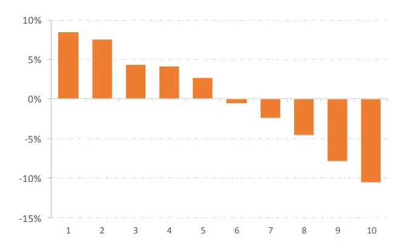
资料来源：Wind，天风证券研究所

图 22：Alpha8 多空净值
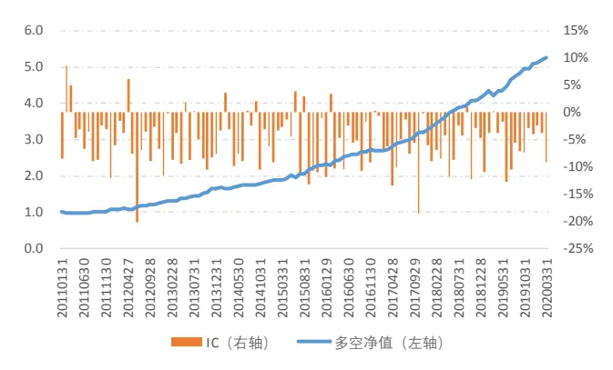
资料来源：Wind，天风证券研究所

Alpha8 因子表现出稳定的选股能力，分组收益单调性显著。2011 年以来多空收益 19.0%，多头超额 8.5%，IC 均值-5.5%，ICIR 达到-3.86。

表 20：Alpha8 历史绩效

| 年份 | 多空收益 | 多头超额 | 多头IR | 多空IR | IC 均值 | ICIR | IC 胜率 |
| --- | --- | --- | --- | --- | --- | --- | --- |
| 2011 | 6.3% | 2.3% | 0.68 | 1.18 | -4.0% | -2.33 | 83.3% |
| 2012 | 19.2% | 6.9% | 1.43 | 2.49 | -6.1% | -3.37 | 91.7% |
| 2013 | 30.6% | 11.8% | 2.59 | 4.89 | -5.7% | -4.63 | 83.3% |
| 2014 | 15.6% | 7.1% | 2.03 | 2.24 | -4.1% | -3.03 | 75.0% |
| 2015 | 37.6% | 25.0% | 2.17 | 2.32 | -5.1% | -3.02 | 83.3% |
| 2016 | 14.0% | 4.2% | 1.31 | 2.25 | -5.6% | -4.00 | 83.3% |
| 2017 | 16.5% | 6.5% | 1.78 | 4.42 | -6.8% | -4.40 | 100.0% |
| 2018 | 17.9% | 9.1% | 3.70 | 6.05 | -6.2% | -5.36 | 91.7% |
| 2019 | 25.9% | 14.3% | 3.00 | 3.15 | -5.9% | -5.17 | 91.7% |
| 20200331 | 3.2% | 0.7% | 0.63 | 12.45 | -5.1% | -4.91 | 100.0% |
| 全样本 | 19.0% | 8.5% | 1.94 | 2.90 | -5.5% | -3.86 | 87.4% |

资料来源：Wind，天风证券研究所

Alpha8 在沪深 300、中证 500、中证 800、中证 1000 中因子 ICIR 绝对值分别为 0.88、2.46、1.68、3.94，因子在小市值股票表现出更强的选股能力。

表 21：Alpha8 分股票池因子表现

| 股票池 | 多空收益 | 多头超额 | 多空IR | IC 均值 | ICIR | IC 胜率 |
| --- | --- | --- | --- | --- | --- | --- |
| 全样本 | 19.0% | 8.5% | 2.90 | -5.5% | -3.86 | 87.4% |
| 沪深 300 | 6.6% | -0.9% | 0.55 | -2.6% | -0.88 | 60.4% |
| 中证 500 | 14.9% | 5.6% | 1.54 | -5.0% | -2.46 | 74.8% |
| 中证800 | 11.5% | 2.6% | 1.31 | -3.9% | -1.68 | 68.5% |
| 中证1000 | 21.6% | 10.5% | 2.88 | -5.8% | -3.94 | 87.7% |

资料来源：Wind，天风证券研究所

## 3.3. 其他类型

## 3.3.1. Alpha9

$$
Alpha9=Alpha(highest\_price,\ diff\_RET,\ mean/std,\ 40)
$$

Alpha9 因子度量了股票在日内不同涨跌幅情境下的价差大小。分别取日内涨跌幅最大、最小 K 线的最高价并计算二者价差作为日指标值，因子值截面标准化后滚动 40 个交易日计算因子均值与标准差的比值。

图 23：Alpha9 分组收益
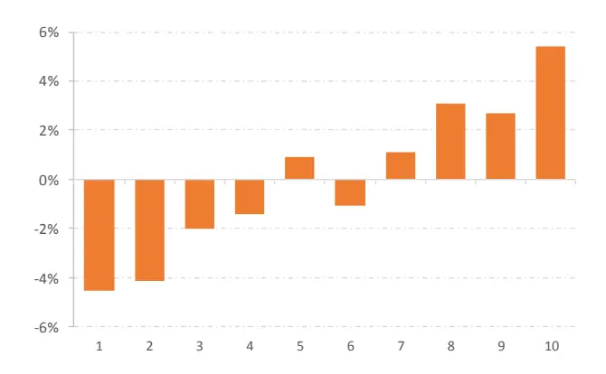
资料来源：Wind，天风证券研究所

图 24：Alpha9 多空净值
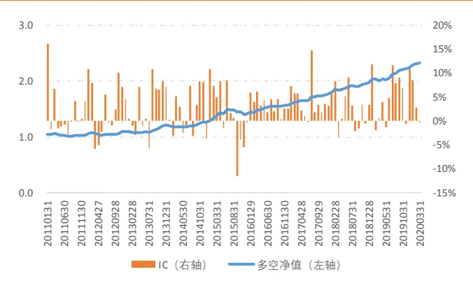
资料来源：Wind，天风证券研究所

Alpha9因子表现出稳定的选股能力，分组收益单调性显著。2011年以来多空收益9.9%，多头超额 5.4%，IC 均值 3.0%，ICIR 达到 2.17。

表 22：Alpha9 历史绩效

| 年份 | 多空收益 | 多头超额 | 多头IR | 多空IR | IC 均值 | ICIR | IC 胜率 |
| --- | --- | --- | --- | --- | --- | --- | --- |
| 2011 | 2.5% | 2.4% | 0.82 | 0.46 | 1.9% | 1.24 | 41.7% |
| 2012 | 7.6% | 3.8% | 1.01 | 1.19 | 2.8% | 1.73 | 58.3% |
| 2013 | 12.1% | 6.0% | 1.35 | 1.56 | 3.1% | 2.03 | 66.7% |
| 2014 | 4.7% | 2.1% | 0.50 | 0.73 | 1.8% | 1.37 | 58.3% |
| 2015 | 21.5% | 12.4% | 1.39 | 1.38 | 1.7% | 0.87 | 58.3% |
| 2016 | 9.4% | 5.5% | 1.75 | 2.44 | 3.6% | 7.12 | 100.0% |
| 2017 | 10.5% | 5.4% | 1.95 | 2.47 | 4.2% | 3.67 | 91.7% |
| 2018 | 8.1% | 4.0% | 1.82 | 2.61 | 2.7% | 2.24 | 66.7% |
| 2019 | 17.1% | 7.7% | 1.89 | 2.51 | 5.3% | 3.57 | 75.0% |
| 20200331 | 3.6% | 3.0% | 3.36 | 6.90 | 3.7% | 2.86 | 66.7% |
| 全样本 | 9.9% | 5.4% | 1.43 | 1.64 | 3.0% | 2.17 | 68.5% |

资料来源：Wind，天风证券研究所

Alpha9 在沪深 300、中证 500、中证 800、中证 1000 中因子 ICIR 绝对值分别为 1.66、1.99、2.13、2.32，因子在不同股票池中均表现出稳定的选股能力。

表 23：Alpha9 分股票池因子表现

| 股票池 | 多空收益 | 多头超额 | 多空IR | IC 均值 | ICIR | IC 胜率 |
| --- | --- | --- | --- | --- | --- | --- |
| 全样本 | 9.9% | 5.4% | 1.64 | 3.0% | 2.17 | 68.5% |
| 沪深 300 | 14.7% | 7.2% | 1.27 | 4.7% | 1.66 | 64.9% |
| 中证 500 | 12.1% | 6.0% | 1.29 | 3.9% | 1.99 | 70.3% |
| 中证 800 | 13.3% | 6.9% | 1.49 | 4.1% | 2.13 | 73.0% |
| 中证1000 | 11.9% | 6.5% | 1.62 | 3.5% | 2.32 | 78.5% |

资料来源：Wind，天风证券研究所

## 3.3.2. Alpha10

$$
Alpha10=Alpha(correlation(6,RET,highest\_price),\ 1500,\ mean,\ 40)
$$

Alpha10 因子度量了股票在日内最高价与收益率间的相关性，取每日 11 点起的 6 根 K线计算 K 线收益率与最高价间的相关性，日指标值截面标准化后滚动 40 日取均值作为最终因子。日内涨跌幅最快的时点股价并非日内高点或跌幅最快时点股价非日内低点，则股票在未来的相对收益率越低。

图 25：Alpha10 分组收益
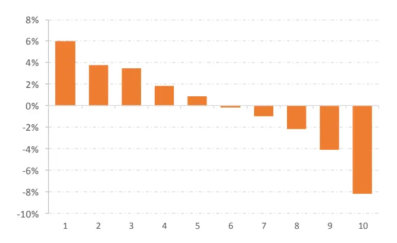
资料来源：Wind，天风证券研究所

图 26：Alpha10 多空净值
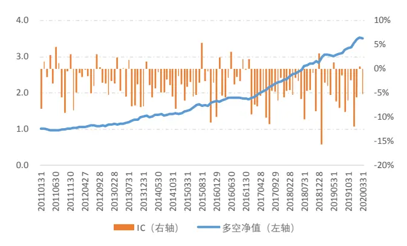
资料来源：Wind，天风证券研究所

Alpha10 因子表现出稳定的选股能力，分组收益单调性显著。2011 年以来多空收益14.2%，多头超额 6.0%，IC 均值-3.7%，ICIR 达到 3.30。

表 24：Alpha10 历史绩效

| 年份 | 多空收益 | 多头超额 | 多头IR | 多空IR | IC 均值 | ICIR | IC 胜率 |
| --- | --- | --- | --- | --- | --- | --- | --- |
| 2011 | 3.5% | 0.9% | 0.23 | 0.75 | -2.0% | -1.42 | 58.3% |
| 2012 | 7.2% | 2.9% | 0.88 | 2.03 | -2.1% | -2.98 | 83.3% |
| 2013 | 23.2% | 10.6% | 1.89 | 3.27 | -3.8% | -3.50 | 75.0% |
| 2014 | 6.7% | -2.7% | -0.37 | 0.95 | -3.6% | -4.76 | 91.7% |
| 2015 | 35.1% | 17.9% | 1.65 | 2.56 | -3.5% | -3.09 | 91.7% |
| 2016 | 4.6% | -0.1% | -0.11 | 1.18 | -1.7% | -1.51 | 66.7% |
| 2017 | 22.7% | 13.2% | 6.94 | 10.08 | -6.6% | -8.33 | 100.0% |
| 2018 | 13.0% | 4.9% | 2.56 | 3.95 | -4.2% | -4.10 | 91.7% |
| 2019 | 22.3% | 12.5% | 2.65 | 2.89 | -6.0% | -4.36 | 91.7% |
| 20200331 | 3.8% | 1.0% | 1.50 | 2.73 | -3.5% | -3.43 | 66.7% |
| 全样本 | 14.2% | 6.0% | 1.37 | 2.47 | -3.7% | -3.30 | 82.9% |

资料来源：Wind，天风证券研究所

Alpha10 在沪深 300、中证 500、中证 800、中证 1000 中因子 ICIR 绝对值分别为 1.06、1.62、1.43、3.67，因子在小市值股票表现出更强的选股能力。

表 25：Alpha10 分股票池因子表现

| 股票池 | 多空收益 | 多头超额 | 多空IR | IC 均值 | ICIR | IC 胜率 |
| --- | --- | --- | --- | --- | --- | --- |
| 全样本 | 14.2% | 6.0% | 2.47 | -3.7% | -3.30 | 82.9% |
| 沪深 300 | 11.3% | 8.7% | 1.02 | -2.7% | -1.06 | 61.3% |
| 中证 500 | 9.7% | 2.4% | 1.19 | -2.8% | -1.62 | 71.2% |
| 中证800 | 10.1% | 4.5% | 1.35 | -2.5% | -1.43 | 68.5% |
| 中证1000 | 19.8% | 8.4% | 2.60 | -4.8% | -3.67 | 89.2% |

资料来源：Wind，天风证券研究所

## 3.4. 因子相关性分析

为了分析因子独立性，我们比较本文构建的 Alpha1 到 Alpha10 因子与常见因子之间的截面相关性。因子热力图如下所示，10 个因子之间表现出较高独立性，因子两两相关系数绝对值平均值为 18.3%；因子与常用的基本量因子和量价因子之间高度独立，平均相关系数绝对值仅为 5%，蕴涵显著的增量信息。

图 27：因子相关性热力图
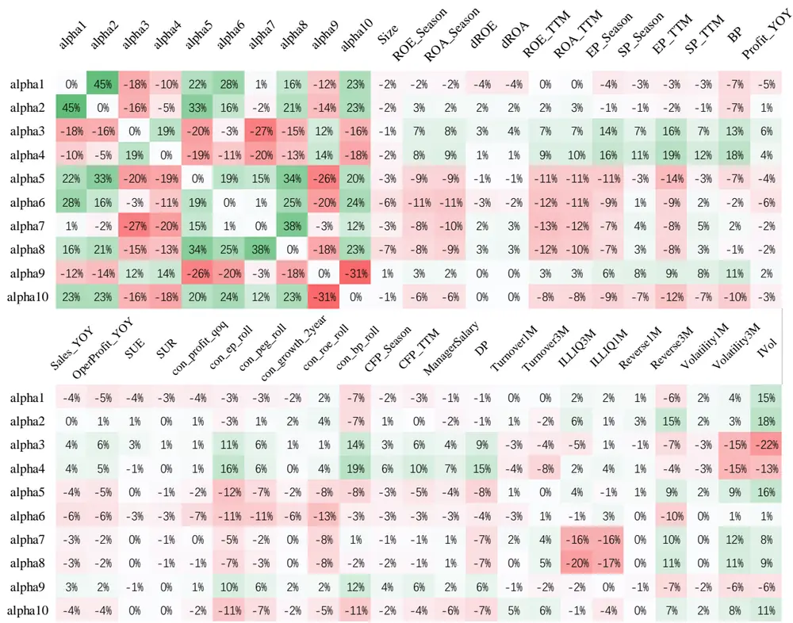
资料来源：Wind，天风证券研究所

## 4. 结合中高频量价信息的指数增强策略

本节中，我们将展示本文基于中高频数据构建的因子对于指数增强策略中带来的增量的 alpha 信息。

我们在常用的选股因子的基础上叠加 Alpha1 到 Alpha10 因子构建选股模型，其中本文所使用的因子主要来自于企业财务数据以及一些常见股票技术指标，包含盈利、成长、估值、分析师预期、分红、运营、技术等类别。

我们根据下表中的选股因子构建月频 alpha 模型，所有指标均进行行业、市值中性化。此外，增速指标我们同时进行对数前值中性化，本文中基于中高频数据构建的量价因子还与反转、换手、波动、非流动冲击指标中性化。

表 $26\div$ 因子列表

| 因子类型 | 因子简称 | 因子名称 | 因子计算方式 |
| --- | --- | --- | --- |
| 盈利 | ROE_Season | 单季度净资产收益率 | 单季度归母净利润*2/（期初总资产+期末总资产） |
|  | ROA_Season | 单季度总资产收益率 | 单季度归母净利润*2/（期初总资产+期末总资产） |
|  | ROE_TTM | 净资产收益率 TTM | 归母净利润TTM*2/（期初总资产+期末总资产） |
|  | ROA_TTM | 总资产收益率TTM | 归母净利润TTM*2/（期初总资产+期末总资产） |
|  | dROE | 单季度净资产收益率同比变化 | 单季度净资产收益率-去年同期单季度净资产收益率 |
|  | dROA | 单季度总资产收益率同比变化 | 单季度总资产收益率-去年同期单季度总资产收益率 |
| 估值 | BP | 账面市值比 | 净资产/总市值 |
|  | EP_Season | 单季度市盈率倒数 | 单季度归母净利润/总市值 |
|  | SP_Season | 单季度市销率倒数 | 单季度营业收入/总市值 |
|  | CFP_Season | 单季度市现率倒数 | 单季度经营性现金流净额/总市值 |
|  | EP_TTM | 市盈率倒数TTM | 归母净利润TTM/总市值 |
|  | SP_TTM | 市销率倒数TTM | 营业收入 TTM/总市值 |
|  | CFP_TTM | 市现率倒数 TTM | 经营性现金流净额TTM/总市值 |
| 成长 | Profit_YOY | 单季度净利润同比增速 | 单季度净利润同比增长率 |
|  | Sales_YOY | 单季度营业收入同比增速 | 单季度营业收入同比增长率 |
|  | OperProfit_YOY | 单季度营业利润同比增速 | 单季度营业利润同比增长率 |
|  | SUE | 标准化预期外盈利 | (单季度实际净利润-预期净利润)/预期净利润标准差 |
|  | SUR | 标准化预期外收入 | (单季度实际营业收入-预期营业收入）/预期营业收入标准差 |
| 一致预期 | con_ep_roll | 一致预期市盈率倒数TTM | 一致预期市盈率倒数TTM |
|  | con_peg_roll | 一致预期 PEG | 一致预期 PEG |
|  | con_profit_qoq | 一致预期净利润季度增速 | 一致预期净利润季度增速 |
|  | con_roe_roll | 一致预期 ROE | 一致预期 ROE |
|  | con_bp_roll | 一致预期滚动 BP | 一致预期滚动 BP |
| 技术 | Turnover1M | 一个月日均换手 | 过去20 个交易日换手率均值 |
|  | ILLIQ1M | 非流动性冲击 | 过去20个交易日的日涨跌幅绝对值/成交额的均值 |
|  | Reverse1M | 一个月反转 | 过去20 个交易日涨跌幅 |
|  | Volatility1M | 一个月波动率 | 过去20个交易日的收益波动率 |
|  | IVR | 特异度 | 1-过去 20 个交易日 Fama 三因子回归的拟合度 |
| 运营 | ManagerSalary | 高管薪酬 | 前 5 大高管薪酬总额 |
| 分红 | DP | 股息率 | 近12月股息率 |

资料来源：天风证券研究所

我们首先对指标作对称正交处理，记因子暴露矩阵 $F_{N\times K}$ 在 $(\mathsf{n},\mathsf{k})$ 位置的元素为第n 只股票在第 k 个因子上的取值，我们通过过渡矩阵 $S_{K\times K}$ 线性变换使得矩阵 $\widetilde{F_{N\times K}}$ 所有列向量两两正交：

$$
\widetilde{F_{N\times K}}=F_{N\times K}*S_{K\times K}
$$

其中 $\lvert S_{K\times K}$ 满足：

$$
S_{K\times K}=U_{K\times K}\ast D_{K\times K}^{-1/2}\ast U_{K\times K}^{\prime}
$$

且， $D_{K\times K}\bar{\mathcal{F}}\sharp U_{K\times K}$ 分别为矩阵 $M=F_{N\times K}^{\prime}*F_{N\times K}$ 的特征值对角阵以及特征向量矩阵。

我们将对称正交后的因子按最近 12 个期的 ICIR 加权得到股票打分：

$$
{\mathrm{\ alpha_{i}=\sum_{\boldsymbol{k}}}}ICIR_{k}*f_{k,i}
$$

其中 $ICIR_{k}$ 为因子 k 的 ICIR 值， $f_{k,i}$ 为股票 i 在因子 k 上的暴露值。

表 $^{27}:$ 因子打分对比

| 打分类型 | 多空收益 | 多头超额 | 多头IR | 多空IR | IC 均值 | ICIR | IC 胜率 | 自相关 | 多头换手 |
| --- | --- | --- | --- | --- | --- | --- | --- | --- | --- |
| 加入新因子 | 47.5% | 23.5% | 4.25 | 5.38 | 12.7% | 6.94 | 97.3% | 67.9% | 52.7% |
| 未加型因子 | 44.2% | 22.1% | 3.53 | 4.57 | 12.1% | 6.44 | 95.5% | 68.0% | 50.2% |

资料来源：Wind，天风证券研究所

对比由上表基础指标构建的原始模型、基础因子加入中高频指标后的新模型，中高频因子给模型带来了显著的增量信息。模型多空收益从 44.2%提高到 47.5%，其中多头收益从22.1%提高到 23.5%，多头组合 IR 从 3.53 提升到 4.25，ICIR 从 6.44 提升到 6.94；本文构建中高频指标自相关较高，模型自相关和多头换手未出现显著变化，因子未导致额外换手。

## 4.1. 指数增强组合

根据选股打分我们分别构建沪深 300 指数以及中证 500 指数的增强模型，我们通过组合优化方式构建组合：

$$
\begin{array}{rl}&{Maxmize:~r^{\prime}w-\rho\|w-w_{0}\|_{1}}\\&{~s.t.~s_{l}\leq w^{\prime}X-S_{b}\leq s_{u}}\\&{~h_{l}\leq w^{\prime}H-H_{b}\leq h_{\mathrm{u}}}\\&{~l_{b,i}\leq w_{i}\leq u_{b,i}}\\&{~{\operatorname{w}^{\prime}}I\geq i_{0}}\\&{~{\operatorname{w}^{\prime}}\vec{1}=1}\end{array}
$$

其中X为股票风格暴露基准， $S_{b}$ 为基准指数风格暴露， $s_{l}$ $s_{u}$ 为风格偏离上下限；H为股票行业属性的 0-1 矩阵， $H_{b}$ 为基准指数行业配置， $h_{l},\ h_{\mathrm{u}}$ 为行业偏离上下限； $l_{b,i}\bar{\ast}\mathbb{H}u_{b,i}$ 为个股权重约束上下限；I为基准指数权重列向量， $i_{0}$ 为成分股约束下限； $\rho$ 为换手惩罚系数， $\mathrm{w}_{0}$ 为组合调仓前持仓权重。

本文回溯区间为 2011 年至 2020 年 4 月 30 日，其中我们在全 A 中剔除上市不满半年新股、ST 股票、长期停牌等股票作为样本池，月度调仓，股票按次日均价撮合交易，扣除双边千 3 的交易成本。

## 4.1.1. 中证 500

以中证 500 指数为基准，我们构建中证 500 指数增强组合。为了对比加入中高频因子前后组合收益的变化，我们在相同约束条件下分别以基础因子以及基础因子叠加中高频因子构建 Alpha 模型作为收益率预测来构建增强组合。下左图展示了叠加中高频因子后最终增强组合相对基准指数的净值，右图中展示了加入中高频因子前后组合的累计净值。

图 28：中证 500增强组合净值
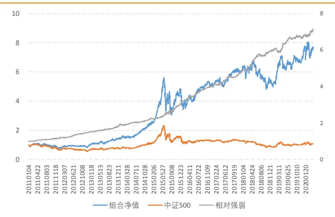
资料来源：Wind，天风证券研究所

图 29：中证 500增强净值对比
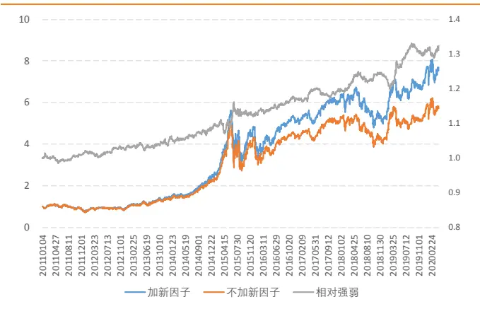
资料来源：Wind，天风证券研究所

中证 500 指数增强组合 2011 年以来的绩效如下表所示，组合年化超额基准 24.5%，信息比率 4.21，月度胜率 84.8%，日度胜率 61.3%，相对最大回撤 5.1%。

表 28：中证 500增强组合绩效

| 年份 | 年化超额 | 组合收益 | 基准收益 | 信息比 | 超额回撤 | 起始时间 | 结束时间 | 跟踪误差 | 日度胜率 | 月度胜率 |
| --- | --- | --- | --- | --- | --- | --- | --- | --- | --- | --- |
| 2011 | 11.1% | -22.7% | -33.8% | 3.98 | -2.4% | 20110705 | 20110728 | 3.9% | 61.9% | 75.0% |
| 2012 | 28.5% | 28.8% | 0.3% | 6.57 | -1.6% | 20120119 | 20120207 | 3.8% | 68.7% | 100.0% |
| 2013 | 28.7% | 45.6% | 16.9% | 4.67 | -2.4% | 20131129 | 20131205 | 4.7% | 60.9% | 100.0% |
| 2014 | 28.0% | 67.0% | 39.0% | 3.87 | -3.4% | 20140117 | 20140304 | 4.7% | 58.8% | 83.3% |
| 2015 | 52.1% | 95.3% | 43.1% | 3.82 | -3.8% | 20150810 | 20150825 | 8.6% | 59.0% | 83.3% |
| 2016 | 25.5% | 7.7% | -17.8% | 6.71 | -0.9% | 20160506 | 20160513 | 4.1% | 65.6% | 100.0% |
| 2017 | 20.2% | 20.0% | -0.2% | 4.62 | -2.8% | 20170726 | 20170913 | 4.0% | 61.9% | 75.0% |
| 2018 | 16.0% | -17.3% | -33.3% | 4.32 | -2.0% | 20180720 | 20180820 | 5.0% | 57.6% | 83.3% |
| 2019 | 17.2% | 43.6% | 26.4% | 2.52 | -5.1% | 20190130 | 20190312 | 4.9% | 58.2% | 66.7% |
| 20200430 | 4.4% | 6.0% | 1.6% | 1.10 | -2.7% | 20200203 | 20200225 | 3.7% | 58.2% | 75.0% |
| 全样本 | 24.5% | 25.4% | 0.9% | 4.21 | -5.1% | 20190130 | 20190312 | 5.2% | 61.3% | 84.8% |

资料来源：Wind，天风证券研究所

我们对比加入中高频因子前后中证 500 指数增强组合的绩效变化。组合超额收益表现出稳健的提升，11 年以来组合年化收益提升 3.9%、信息比提升 0.59，各年份收益均出现提高。同时中高频因子并未明显提升组合换手率，组合单边年换手仅上升约 0.35。

表 29：中证 500 增强绩效对比

| 年份 | 超额收益 |  |  |  | 信息比率 |  |  | 累计单边换手率 |  |  |
| --- | --- | --- | --- | --- | --- | --- | --- | --- | --- | --- |
|  | 新组合 | 原始组合 | 差值 | 新组合 | 原始组合 | 差值 | 新组合 |  | 原始组合 | 差值 |
| 2011 | 11.1% | 10.0% | 1.2% | 3.98 | 3.50 | 0.48 | 4.79 | 4.31 |  | 0.48 |
| 2012 | 28.5% | 26.1% | 2.4% | 6.57 | 6.47 | 0.10 | 4.74 |  | 4.39 | 0.35 |
| 2013 | 28.7% | 26.5% | 2.2% | 4.67 | 4.90 | -0.23 | 4.99 |  | 4.84 | 0.15 |
| 2014 | 28.0% | 22.7% | 5.2% | 3.87 | 3.14 | 0.74 | 4.90 |  | 4.56 | 0.34 |
| 2015 | 52.1% | 45.7% | 6.4% | 3.82 | 3.34 | 0.48 | 5.73 |  | 5.53 | 0.20 |
| 2016 | 25.5% | 21.1% | 4.4% | 6.71 | 6.07 | 0.64 | 5.34 |  | 4.81 | 0.52 |
| 2017 | 20.2% | 17.6% | 2.7% | 4.62 | 3.68 | 0.94 |  | 3.92 | 3.22 | 0.70 |
| 2018 | 16.0% | 13.1% | 2.9% | 4.32 | 3.77 | 0.55 |  | 4.40 | 4.07 | 0.33 |
| 2019 | 17.2% | 9.2% | 8.0% | 2.52 | 1.42 | 1.10 |  | 4.84 | 4.63 | 0.21 |
| 20200430 | 4.4% | 3.4% | 1.0% | 1.10 | 0.82 | 0.27 |  | 1.69 | 1.54 | 0.15 |
| 全样本 | 24.5% | 20.7% | 3.9% | 4.21 | 3.62 | 0.59 |  | 45.33 | 41.90 | 3.43 |

资料来源：Wind，天风证券研究所

## 4.1.2. 沪深 300

同样地，以沪深 300 指数为基准，我们构建沪深 300 指数增强组合。在相同约束条件下我们分别以基础因子以及基础因子叠加中高频因子构建 Alpha模型作为收益率预测来构建增强组合。下左图展示了叠加中高频因子后最终增强组合相对基准指数的净值，右图中展示了加入中高频因子前后组合的累计净值对比。

图 30：沪深 300增强组合净值
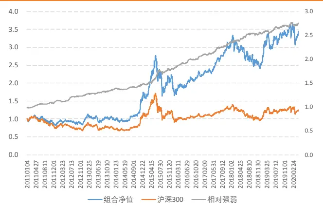
资料来源：Wind，天风证券研究所

图 31：沪深 300增强净值对比
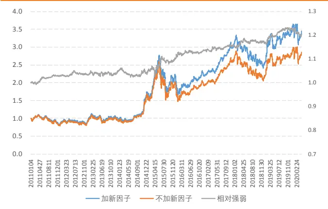
资料来源：Wind，天风证券研究所

沪深 300 指数增强组合 2011 年以来的绩效如下表所示，组合年化超额基准 12.2%，信息比率 2.87，月度胜率 75.0%，日度胜率 57.3%，相对最大回撤 3.6%。

表 30：沪深 300增强组合绩效

| 年份 | 年化超额 | 组合收益 | 基准收益 | 信息比 | 超额回撤 | 起始时间 | 结束时间 | 跟踪误差 | 日度胜率 | 月度胜率 |
| --- | --- | --- | --- | --- | --- | --- | --- | --- | --- | --- |
| 2011 | 8.8% | -16.2% | -25.0% | 3.34 | -1.6% | 20110118 | 20110218 | 3.3% | 58.6% | 66.7% |
| 2012 | 12.6% | 20.1% | 7.6% | 3.53 | -2.9% | 20120130 | 20120319 | 3.1% | 58.0% | 66.7% |
| 2013 | 9.5% | 1.9% | -7.6% | 3.05 | -1.5% | 20130830 | 20130923 | 3.2% | 60.5% | 66.7% |
| 2014 | 12.2% | 63.9% | 51.7% | 2.06 | -2.5% | 20140217 | 20140324 | 3.9% | 54.3% | 75.0% |
| 2015 | 22.9% | 28.5% | 5.6% | 3.14 | -3.6% | 20150729 | 20150825 | 6.5% | 56.1% | 83.3% |
| 2016 | 12.8% | 1.5% | -11.3% | 3.86 | -1.2% | 20160111 | 20160118 | 3.6% | 58.6% | 83.3% |
| 2017 | 16.8% | 38.6% | 21.8% | 3.95 | -1.5% | 20170804 | 20170814 | 3.3% | 60.2% | 91.7% |
| 2018 | 6.4% | -19.0% | -25.3% | 2.28 | -1.9% | 20181017 | 20181102 | 3.7% | 58.4% | 75.0% |
| 2019 | 6.9% | 43.0% | 36.1% | 1.40 | -2.0% | 20190322 | 20190429 | 3.6% | 52.0% | 66.7% |
| 20200430 | 2.4% | -2.1% | -4.5% | 1.10 | -2.6% | 20200203 | 20200316 | 2.3% | 54.4% | 75.0% |
| 全样本 | 12.2% | 14.7% | 2.5% | 2.87 | -3.6% | 20150729 | 20150825 | 4.0% | 57.3% | 75.0% |

资料来源：Wind，天风证券研究所

中高频因子对于沪深 300 指数的增强效果弱于中证 500 指数增强，增强组合 11 年以来组合收益提升 2.4%，信息比提升 0.42，相对原始组合仍有较明显提升。

表 31：沪深 300增强绩效对比

| 年份 | 超额收益 |  |  |  | 信息比率 |  |  | 累计单边换手率 |  |  |
| --- | --- | --- | --- | --- | --- | --- | --- | --- | --- | --- |
|  | 新组合 | 原始组合 | 差值 | 新组合 | 原始组合 | 差值 | 新组合 |  | 原始组合 | 差值 |
| 2011 | 8.8% | 6.5% | 2.3% | 3.34 | 2.53 | 0.81 | 3.58 | 3.51 |  | 0.07 |
| 2012 | 12.6% | 12.0% | 0.5% | 3.53 | 3.90 | -0.37 | 3.48 |  | 3.54 | -0.06 |
| 2013 | 9.5% | 8.7% | 0.8% | 3.05 | 2.88 | 0.16 |  | 3.90 | 3.43 | 0.47 |
| 2014 | 12.2% | 12.8% | -0.5% | 2.06 | 2.29 | -0.23 |  | 3.54 | 3.14 | 0.40 |
| 2015 | 22.9% | 15.5% | 7.4% | 3.14 | 2.39 | 0.75 | 4.26 |  | 4.48 | -0.21 |
| 2016 | 12.8% | 9.8% | 3.0% | 3.86 | 2.80 | 1.06 |  | 3.95 | 3.85 | 0.10 |
| 2017 | 16.8% | 14.3% | 2.5% | 3.95 | 3.39 | 0.56 |  | 2.91 | 2.61 | 0.30 |
| 2018 | 6.4% | 5.2% | 1.1% | 2.28 | 1.97 | 0.31 |  | 3.42 | 3.00 | 0.42 |
| 2019 | 6.9% | 0.5% | 6.4% | 1.40 | 0.10 | 1.30 |  | 3.92 | 3.68 | 0.24 |
| 20200430 | 2.4% | 4.2% | -1.8% | 1.10 | 1.96 | -0.86 |  | 1.34 | 1.14 | 0.20 |
| 全样本 | 12.2% | 9.9% | 2.4% | 2.87 | 2.45 | 0.42 |  | 34.31 | 32.38 | 1.93 |

资料来源：Wind，天风证券研究所

## 4.2. 换手率分析

在因子组合中配置量价因子可能导致的额外换手是组合构建过程中面临的常见问题。本文构建的 Alpha1 到 Alpha10 因子自相关性和换手率如下左图所示，因子自相关均值在50%附近，多头组合换手率约 60%，因子整体具有较低的多头换手以及较高自相关。

图 32：因子换手率分析
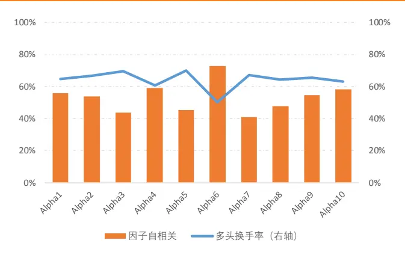
资料来源：Wind，天风证券研究所

图 33：组合换手率分析
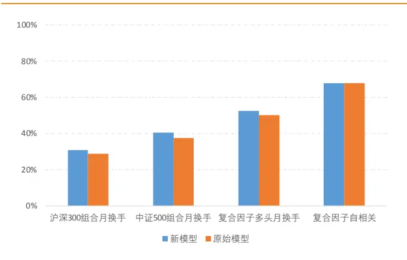
资料来源：Wind，天风证券研究所

从 Alpha 模型以及各增强组合表现来看，在因子复合以及组合构建过程中，此部分因子并未导致组合额外的换手率。

表 32：组合换手率对比

| 模型类型 | 沪深 300 组合月换手 | 中证 500 组合月换手 | 复合因子多头月换手 | 复合因子自相关 |
| --- | --- | --- | --- | --- |
| 新模型 | 30.6% | 40.5% | 52.7% | 67.9% |
| 原始模型 | 28.9% | 37.4% | 50.2% | 68.0% |

资料来源：Wind，天风证券研究所

## 5. 总结

数据频率与因子预测时间宽度存在天然隔阂，数据频率越高其时间序列自相关性便越低，所能预测的时间宽度通常越有限。因此信息的变频处理对于在中高频数据中构建长周期 alpha 尤为关键。本篇报告中，我们希望探索中高频数据的通用化降频方式，进而我们通过“公式化”alpha 达到批量构建长周期量价因子的目标。

我们将因子构建拆解成信号生成、日度降频、月度降频三部分，进而得到公式化表达：

$$
factor=Alpha(formula,~dailyTrans,~monthlyTrans,~windows)
$$

其中formula为初始日内中高频信号，dailyTrans为日内信号到日度因子转换的变频方式，montℎlyTrans、 windows分别为日度因子值到月度因子的二次变频方式及滚动窗口长度。

基于中高频数据，本文采用以上 Alpha 表达式构建了 10 个以月为预测宽度的长周期因子，因子剔除常见量价风格后平均 IC 均值为 4.0%、ICIR 达到 3.16，多空收益 13.6%、多头收益 6.8%，表现出稳健的选股能力。

我们将10个基于中高频数据构建的长周期因子与传统基本面因子结合构建月度调仓的中证 500指数和与沪深300指数增强模型，中高频信息显著提升了组合收益。

2011 年以来中证 500 指数增强组合年化超额收益率24.5%，信息比 4.21；中高频信息分别提升组合收益和信息比为 3.9%、0.59。

2011 年以来沪深 300 指数增强组合年化超额收益率12.2%，信息比 2.87；中高频信息分别提升组合收益和信息比为 2.4%、0.42。

## 分析师声明

本报告署名分析师在此声明：我们具有中国证券业协会授予的证券投资咨询执业资格或相当的专业胜任能力，本报告所表述的所有观点均准确地反映了我们对标的证券和发行人的个人看法。我们所得报酬的任何部分不曾与，不与，也将不会与本报告中的具体投资建议或观点有直接或间接联系。

## 一般声明

除非另有规定，本报告中的所有材料版权均属天风证券股份有限公司（已获中国证监会许可的证券投资咨询业务资格）及其附属机构（以下统称“天风证券”）。未经天风证券事先书面授权，不得以任何方式修改、发送或者复制本报告及其所包含的材料、内容。所有本报告中使用的商标、服务标识及标记均为天风证券的商标、服务标识及标记。

本报告是机密的，仅供我们的客户使用，天风证券不因收件人收到本报告而视其为天风证券的客户。本报告中的信息均来源于我们认为可靠的已公开资料，但天风证券对这些信息的准确性及完整性不作任何保证。本报告中的信息、意见等均仅供客户参考，不构成所述证券买卖的出价或征价邀请或要约。该等信息、意见并未考虑到获取本报告人员的具体投资目的、财务状况以及特定需求，在任何时候均不构成对任何人的个人推荐。客户应当对本报告中的信息和意见进行独立评估，并应同时考量各自的投资目的、财务状况和特定需求，必要时就法律、商业、财务、税收等方面咨询专家的意见。对依据或者使用本报告所造成的一切后果，天风证券及/或其关联人员均不承担任何法律责任。

本报告所载的意见、评估及预测仅为本报告出具日的观点和判断。该等意见、评估及预测无需通知即可随时更改。过往的表现亦不应作为日后表现的预示和担保。在不同时期，天风证券可能会发出与本报告所载意见、评估及预测不一致的研究报告。

天风证券的销售人员、交易人员以及其他专业人士可能会依据不同假设和标准、采用不同的分析方法而口头或书面发表与本报告意见及建议不一致的市场评论和/或交易观点。天风证券没有将此意见及建议向报告所有接收者进行更新的义务。天风证券的资产管理部门、自营部门以及其他投资业务部门可能独立做出与本报告中的意见或建议不一致的投资决策。

## 特别声明

在法律许可的情况下，天风证券可能会持有本报告中提及公司所发行的证券并进行交易，也可能为这些公司提供或争取提供投资银行、财务顾问和金融产品等各种金融服务。因此，投资者应当考虑到天风证券及/或其相关人员可能存在影响本报告观点客观性的潜在利益冲突，投资者请勿将本报告视为投资或其他决定的唯一参考依据。

## 投资评级声明

| 类别 | 说明 | 评级 | 体系 |
| --- | --- | --- | --- |
| 股票投资评级 | 自报告日后的6个月内，相对同期沪 深 300 指数的涨跌幅 | 买入 | 预期股价相对收益20%以上 |
|  |  | 增持 | 预期股价相对收益10%-20% |
|  |  | 持有 | 预期股价相对收益-10%-10% |
| 行业投资评级 | 自报告日后的6个月内，相对同期沪 深 300指数的涨跌幅 | 卖出 强于大市 | 预期股价相对收益-10%以下 预期行业指数涨幅5%以上 |
|  |  | 中性 | 预期行业指数涨幅-5%-5% |
|  |  | 弱于大市 | 预期行业指数涨幅-5%以下 |

## 天风证券研究

| 北京 | 武汉 | 上海 | 深圳 |
| --- | --- | --- | --- |
|  | 北京市西城区佟麟阁路36号 湖北武汉市武昌区中南路99 | 上海市浦东新区兰花路333 | 深圳市福田区益田路5033号 |
| 邮编：100031 | 号保利广场 A 座 37 楼 | 号 333 世纪大厦 20 楼 | 平安金融中心 71 楼 |
| 邮箱：research@tfzq.com | 邮编：430071 | 邮编：201204 | 邮编：518000 |
|  | 电话：(8627)-87618889 | 电话：(8621)-68815388 | 电话：(86755)-23915663 |
|  | 传真：(8627)-87618863 | 传真：(8621)-68812910 | 传真：(86755)-82571995 |
|  | 邮箱：research@tfzq.com | 邮箱：research@tfzq.com | 邮箱：research@tfzq.com |