# 高频视角下成交额蕴藏的 Alpha：市场微观结构剖析之七

报告日期：2020-06-10

分析师：尹沿技

执业证书号： S0010520020001

邮箱： yinyj@hazq.com

## 主要观点：

本篇报告是日内高频选股因子的续篇，主要基于日内分钟频度上的成交额来构造因子。

研究发现，个股之间分钟成交额在时序上的不对等分布特征与传统换手率因子有着独特的关系，在此基础上，我们构造了 240分钟的成交额占比因子来细致分析，发现独立于传统因子的增量Alpha信息主要集中在尾盘，因此构建尾盘成交额占比因子。

此外，本篇报告也补充分析了分钟成交额的高阶矩因子，自相关性系数因子等，发现这些因子的大部分效果都被传统的换手因子所解释。

总结来说，构造的尾盘 20分钟成交额占比因子 ${\cdot}APL_{20}$ ，月度因子以指数加权移动平均法合成。对常见因子中性后， $APL_{20}因$ 子的 IC 均值为-5.43%，RankIC 均值为-5.56%，月度胜率 93%，年化 ICIR 为-5.18。2014-2019 年，因子十分组收益分化明显，多头端收益明显，多空组合年化收益达到 23.19%，年化波动 5.90%，年化 IR 达到 3.94，最大回撤仅6.38%，预测能力十分优秀。

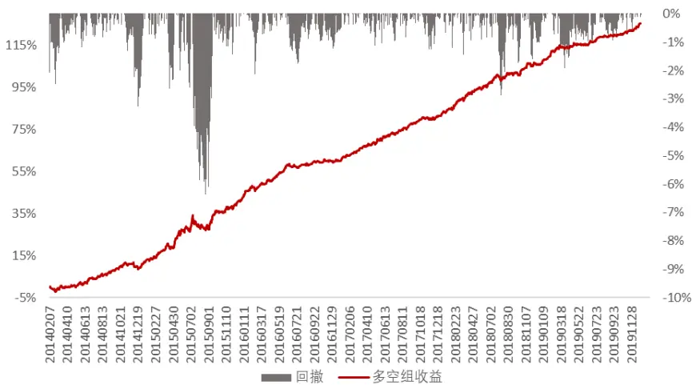
资料来源：Wind，华安证券研究所

## 风险提示

本报告基于历史个股高频数据进行测试，历史回测结果不代表未来收益。未来市场风格可能切换，微观交易结构可能发生变化，Alpha因子可能失效，本文内容仅供参考。

## 1 引言

本篇报告是“市场微观结构剖析”系列的第七篇，系列报告从行为金融学的视角出发，捕捉市场异常交易行为，挖掘隐藏在海量数据之下的 Alpha，本篇报告集中挖掘潜藏在分钟成交额之下的有效信息。

一方面，市场中常常关注早盘和尾盘的放量，许多投资者认为早盘或者尾盘的放量情况预示着股价某种未来走向，因此，本篇报告探讨成交额在不同时段的日内分布特征是否能够在传统因子的基础上添加有效的增量 Alpha 信息。

市场的流动性在日内时间轴上存在天然的差距，市场流动性在上午开盘时相对较差（价格冲击指数、相对买卖价差和相对有效价差数值较高，流动性指数较低），开盘一小时内流动性增长较快，随后开始缓慢增长。中午休市前后流动性出现短暂波动，下午开盘后流动性继续维持缓慢增长趋势，接近收盘时由于最后三分钟实行集合竞价而出现小幅波动。

图表 1 流动性指标的日内特征（2019 年）
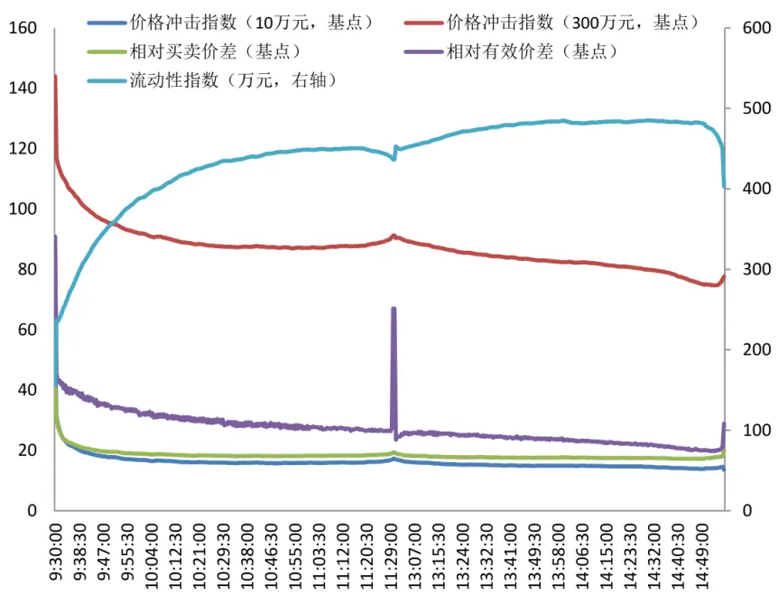
资料来源：上交所市场质量报告，华安证券研究所

而成交额在日内呈现天然的 U 型或 W 型分布特征。早盘成交额的高峰来源于隔夜信息叠加的反应，中午开市后有个成交额小高峰，来源于中午 1 个半小时的信息叠加的反应，尾盘成交额的高峰更多是对第二天股价的预期以及可能的信息提前泄露。从成交额结果来看，市场更喜欢在早盘，午后以及尾盘进行成交，这也是自然状态下的成交额分布状况。本篇报告的 2~4 节主要分析如果成交额在日内的分布状态偏离了自然分布，是否包含着额外的有效信息。根据市场日内流动性以及成交额占比的分布状况来看，初步推测早尾盘的成交信息更容易产生有效的因子。

另一方面，第五节补充统计了分钟成交额的一些其他指标，比如分钟成交额的高阶矩以及自相关系数，构建日内成交额的其他特征因子并测试其效果。

图表 2 全市场成交额在日内的分钟分布（2019/12/31）
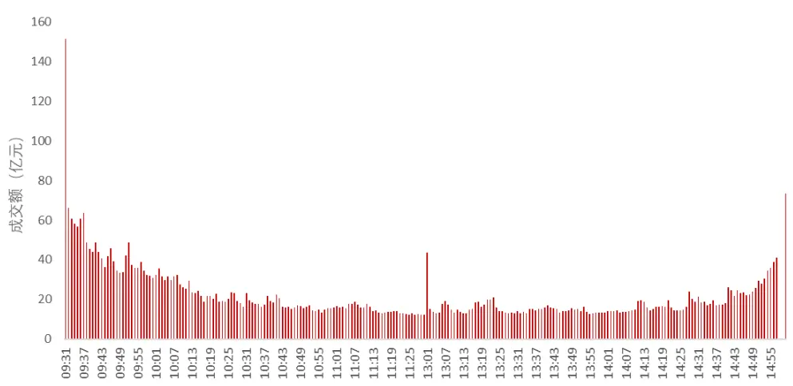
资料来源：wind，华安证券研究所

## 2 日内分钟成交额占比与换手率的关系

首先我们分别计算日内 240 分钟的成交额占比因子，其中 ${\boldsymbol{\cdot}}{\boldsymbol{A}}{\boldsymbol{P}}_{t,d}$ 为个股某日第 t 分钟的因子值，计算月度因子值时回溯 20 个交易日移动平均得到月度因子值 $AP_{t}$

$$
AP_{t,d}=\frac{Amount_{t,d}}{Total\;Amount_{d}}
$$

$$
AP_{t}=\frac{\sum_{d=1}^{N}AP_{t,d}}{N}
$$

其 $\#$ ，t为分钟标记，d为日度标记

与此同时我们计算股票的 20 日平均换手率因子，统计分钟成交额占比因子与日均换手率因子的相关系数，发现两者之间存在奇特的相关关系，如图表 3 所示。

$$
TurnOver={\sum}_{d=1}^{N}TurnOver_{d}
$$

图表 3 分钟成交额占比与日均换手率的相关性
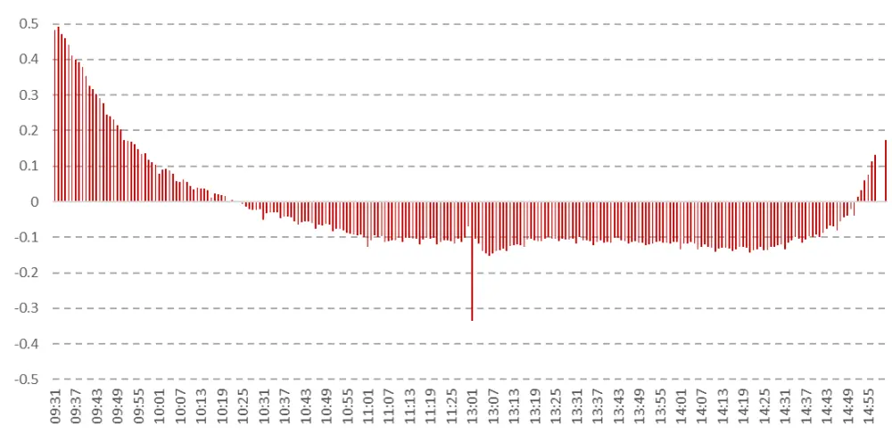
资料来源：wind，华安证券研究所

早盘分钟成交额占比与日均换手率的相关程度很高，达到了 0.5 左右，早盘往后

相关程度逐渐降低并转为负相关，维持在-0.1 左右，在第 121 分钟（即 13:00~13:01 这一分钟）相关性最低，低于-0.3，接近尾盘时相关程度又逐渐升高。

从分钟成交额占比与换手率相关系数的日内序列图上，可以推测得到几个结论：

1、日度的成交分散到分钟频度的成交上时，在日内 240 分钟序列上是分布不均匀的，在早盘和尾盘成交得更多，其他时间段基本平稳成交，早盘和尾盘的流动性也和其他时间段有显著差距，即高换手股票更倾向于在早盘和尾盘更多成交；

2、虽然相关性在尾盘也有一个微量提升，但远远不如早盘强烈。相关系数小于 0.2；

3、日内分钟成交额占比之和为 1，因此不同分钟之间互相影响，存在此消彼长的关系，比如某只股票在开盘 30 分钟内成交额很高，会导致日内其他时间段成交额相对更低，与日均换手率的相关系数也自然降低，这是其他时间段-0.1 微弱负相关的原因；

4、由于日内分钟成交额占比之间会互相影响，为辅助解释究竟哪些时间区间蕴含了有效信息，我们在第四节补充测试了日内每分钟的绝对换手率的效果。

5、由于分钟成交额占比与换手率之间的这种联系，在构造日内成交额特征因子时，需要考虑是否在剔除传统因子后（换手，波动等）是否能够有新的 Alpha 产生。

## 3 日内成交额占比因子

## 3.1 分钟成交额占比因子的表现

以 2014 年至 2019 年为回测区间，全部 A 股为样本，测试 240 个分钟成交额占比因子 AP 因子（Amount Percentage）的基本表现（由于 14:58,14:59 两分钟无成交数据，实际 238 个分钟是有效的）。

$$
\begin{aligned}&AP_{t,d}=\frac{Amount_{t,d}}{TotalAmount_{d}}\\&\\&AP_{t}=\frac{\sum_{i=1}^{N}AP_{t,d}}{N}\\\end{aligned}
$$

其中，t为分钟标记，d为日度标记

其中 $AP_{t,d}$ 为个股某日第 t 分钟的因子值，计算月度因子值时回溯 20 个交易日移动平均得到月度因子值 ${\boldsymbol{A}}{\boldsymbol{P}}_{t}$ 。因子在横截面上对行业以及市值进行中性化处理，组合月度调仓。分钟成交额占比因子的月度 IC均值以及年化 ICIR如图4,5红色柱状图所示。

图表 4 分钟成交额占比因子 IC（行业市值中性）
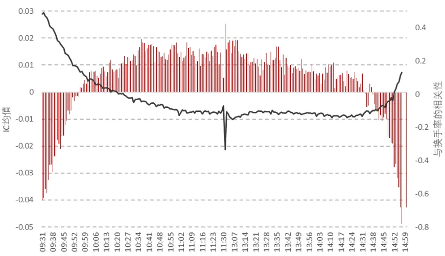
资料来源：wind，华安证券研究所

图表 5 分钟成交额占比因子 ICIR（行业市值中性）
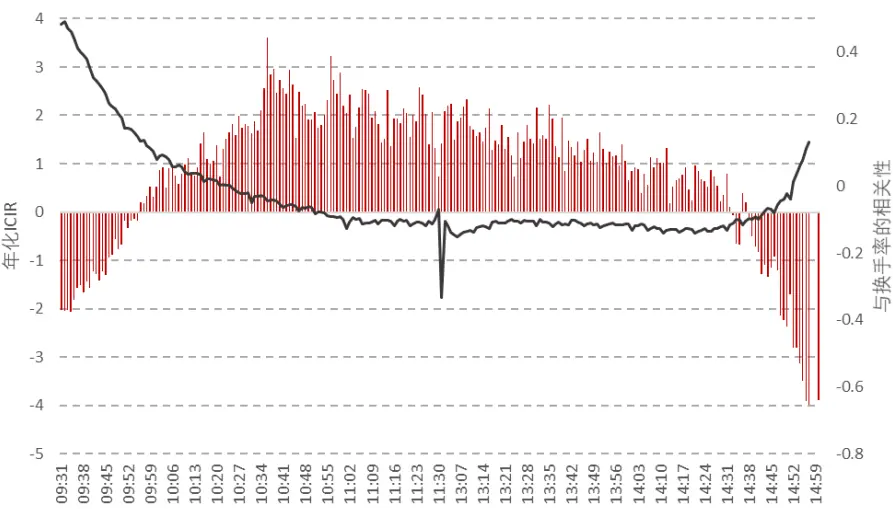
资料来源：wind，华安证券研究所

我们发现早盘和尾盘的成交额占比因子具有不错的选股效果，早盘 9:30~9:40 这10 分钟的 $AP_{1}{\sim}AP_{10}$ 因子 IC 均值超过了-0.02，午市开盘 13:00~13:01 这分钟的 $AP_{121}$ 因子 IC 均值大于 0.02，尾盘 14:51~14:57 以及 14:59~15:00 这 7 分钟的 ${AP_{232}}{\sim}{AP_{237}}$ $AP_{240}$ 因子 IC 均值超过了-0.02。

图 4,5 中黑色曲线代表该分钟成交额占比与日均换手率的相关性，由于早盘的成交额占比因子与日均换手因子高度正相关，午后一分钟成交额占比因子与日均换手因子高度负相关，我们推测 $AP_{1}{\sim}AP_{10}$ 以及 $AP_{121}$ 因子的效果主要是被换手率因子所解释。

如果在横截面上对因子进行比较强的中性化处理（对行业+市值+动量+波动+换手中性），不同分钟成交额占比因子的月度 IC 均值以及年化 ICIR如图 6,7 所示。

在较强的中性化处理后，早盘成交额占比因子效果衰减明显，有效的增量 Alpha信息集中在尾盘。在最后 7 分钟，即 14：53~14:57 时间段的成交额占比以及 15:00 的集合竞价成交额占比，IC 均值超过-0.03，年化 ICIR 超过 3.5。

图表 6 分钟成交额占比因子 IC（对5个传统因子中性）
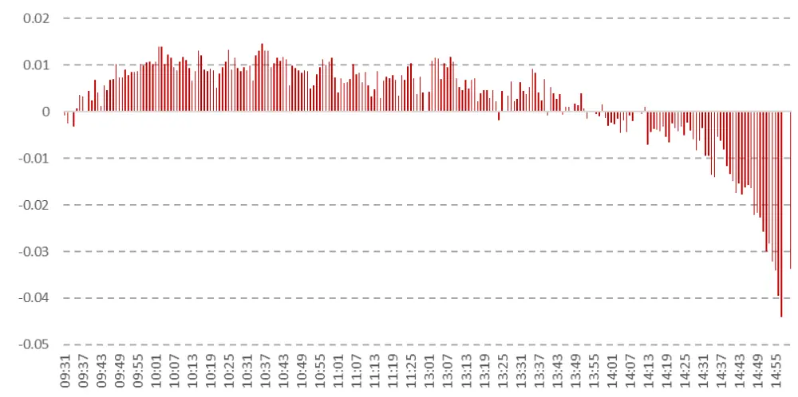
资料来源：wind，华安证券研究所

图表 7 分钟成交额占比因子 ICIR（对 5 个传统因子中性）
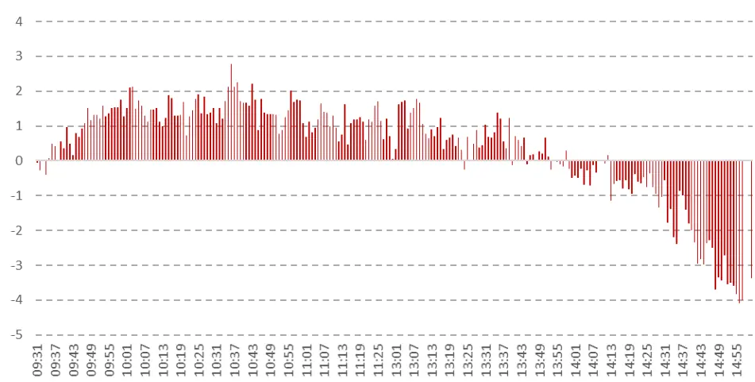
资料来源：wind，华安证券研究所

## 3.2 尾盘成交额占比因子的构建

根据前文，尾盘成交额占比是一个比较有效的 Alpha 因子，由于使用一分钟的成交额数据可能不够稳定，我们测试不同时间区间的尾盘成交额占比因子 $APL_{t}$ （AmountPercentage of Last t Minutes）的效果。例如 $.APL_{30}$ 表示尾盘最后 30 分钟的成交额占比因子。月度因子值依然以 20 日移动平均。以横轴表示不同 $APL_{t}$ 的效果，因子的月度 IC均值如图表 7 所示，因子的年化 ICIR 序列如图表 8 所示。

$$
\begin{aligned}APL_{t,d}=&\frac{\sum_{i=240-t}^{240}Amount_{t,d}}{TotalAmount_{d}}\\APL_{t}=&\frac{\sum_{i=1}^{N}APD_{t,d}}{N}\end{aligned}
$$

其中，t为分钟标记，d为日度标记

图表 8 尾盘成交额占比因子APLt月度 IC 值（行业市值中性）
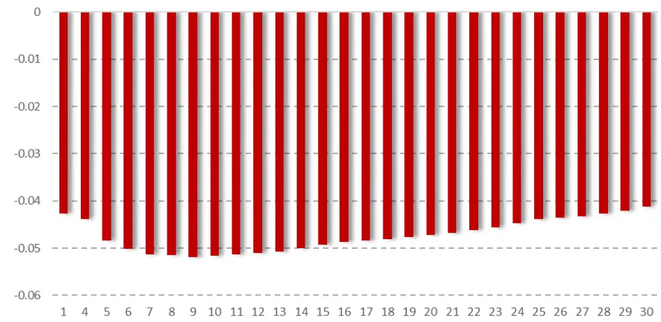
资料来源：wind，华安证券研究所

图表 9 尾盘成交额占比因子APL 年化 ICIR值（行业市值中性）
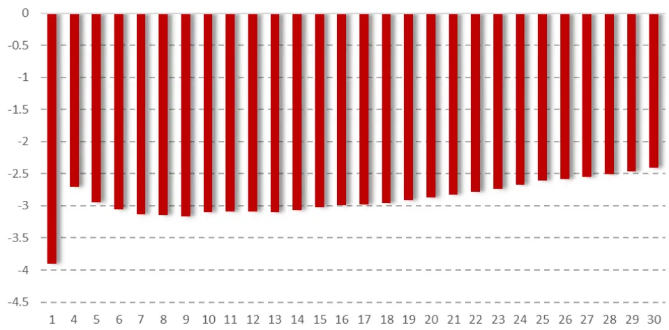
资料来源：wind，华安证券研究所

因子仅对行业和市值做中性化处理时，ICIR 效果最好为尾盘最后一分钟的成交额占比，这主要是由于尾盘一分钟成交额占比因子受到日均换手因子影响较大，如图 10所示。

图表 10 尾盘成交额占比因子APLt与换手率的相关系数
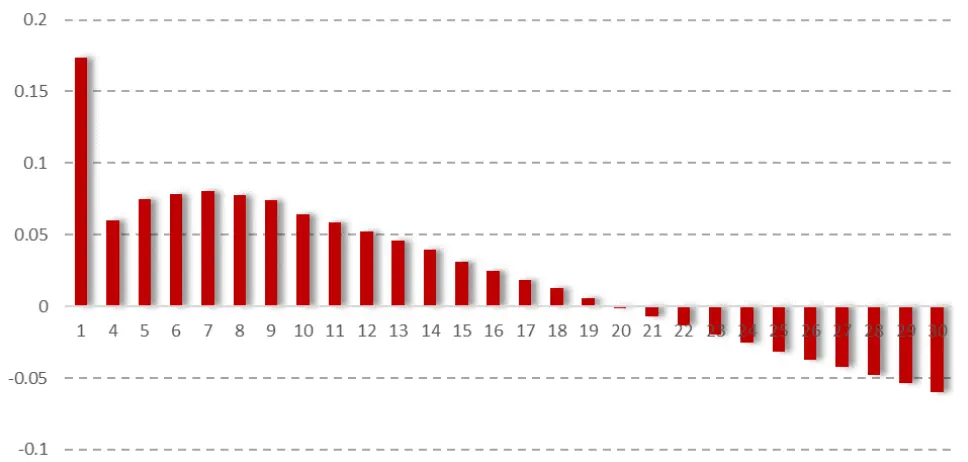
资料来源：wind，华安证券研究所

对因子进行比较强的中性化处理（对行业+市值+动量+波动+换手中性）后，以横轴表示不同APL 的效果，月度 IC 均值如图 11 所示，年化 ICIR如图 12 所示。我们发现当 t大于等于 15 时，因子的 IC 均值和年化 ICIR表现较优，趋向稳定，推测尾盘成交额占比因子的最优时间区间在 15 分钟到 25 分钟左右。

图表 11 尾盘成交额占比因子 ${\boldsymbol{\cdot}}APL_{t}$ 月度IC值（对 5个传统因子中性）
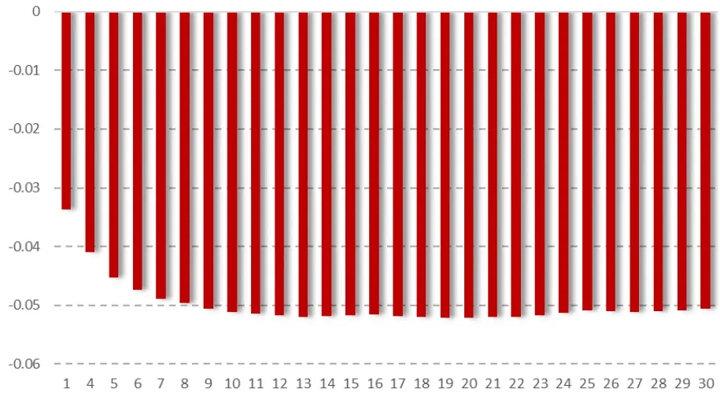
资料来源：wind，华安证券研究所

图表 12 尾盘成交额占比因子 ${APL}_{t}$ 年化 ICIR（对5个传统因子中性）
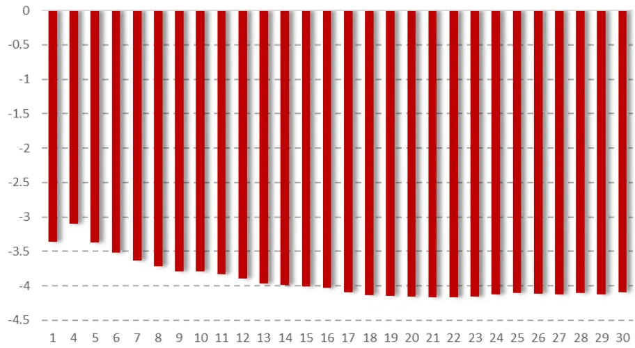
资料来源：wind，华安证券研究所

## 3.3 尾盘成交额占比因子的表现

以 t=20 时的 $APL_{20}$ 因子为例，该因子的均值在 0.123 左右，即正常市场交易状况下，尾盘 20 分钟的成交额占整日成交额大约为 12.3%，中位数为 0.120，标准差为 0.024，偏度为 2.372，峰度为 40.253，因子呈现正偏态尖峰的特征。

图表 13 APL20因子值分布
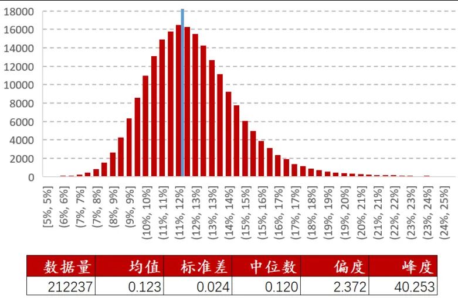
资料来源：wind，华安证券研究所

图表 14 APL20月度 IC 序列
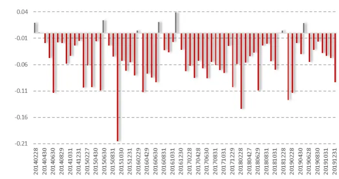
资料来源：wind，华安证券研究所

图表 15 APL20多空组收益与回撤
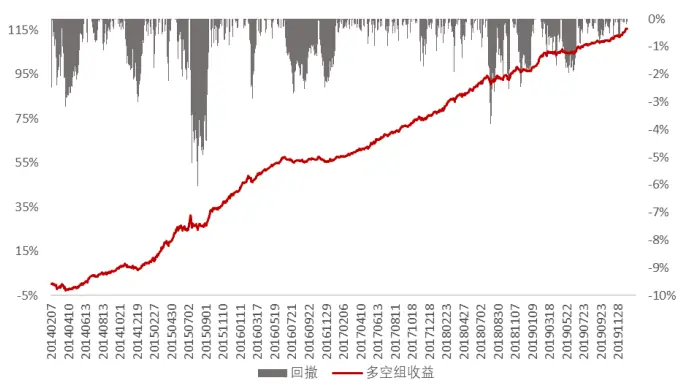
资料来源：wind，华安证券研究所

按照因子值从小到大依次分成十组，构建等权选股组合，统计各组收益。 $APL_{20}$ 因子的月度 IC 均值为-0.052，rankIC 均值为-0.055，年化 ICIR 为-4.161，因子表现非常优秀。逐月来看，如图表 13 所示， $APL_{20}$ 因子的月度 IC 值为负的概率为 87.32%，月度IC 表现非常稳定。多空组的年化收益为 21.06%，年化波动为 6.12%。年化夏普为 3.44，月度胜率达到 84.51%，最大回撤在 6.05%左右。

图表 16 APL 因子分 10 组年化收益
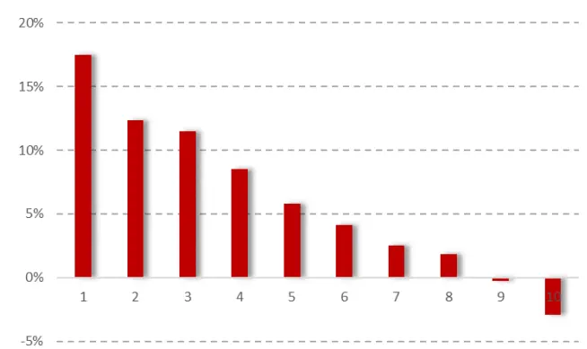
资料来源：wind，华安证券研究所

图表 17 APL20因子分 10 组净值
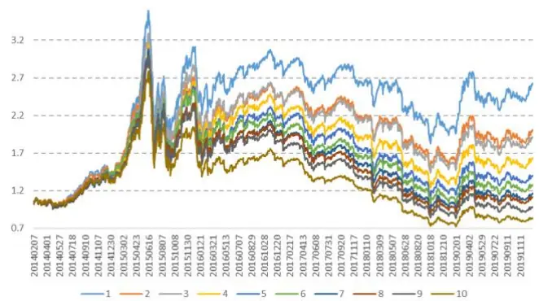
资料来源：wind，华安证券研究所

从分组的年化收益来看， $APL_{20}$ 因子单调性明显，分 10 组时多头组年化收益达到17.51%，与等权全体相比超额收益为 9.73%，各组净值曲线分化明显，总体来说 $APL_{20}$ 因子在较强的中性化处理后依然具备很强的预测能力，月度 IC 序列稳定，多头组超额收益显著。

图表 18 $APL_{20}$ 因子时间序列特征
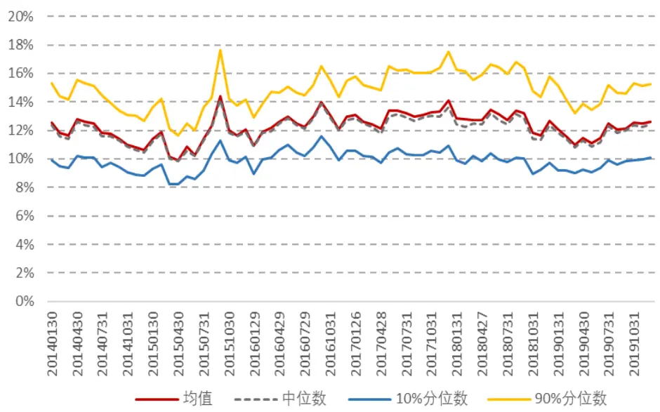
资料来源：wind，华安证券研究所

进一步分析 $rAPL_{20}$ 因子在时间序列上的特征，逐月计算 2014/01/01 到 2019/12/31期间因子在全市场的均值、上 10%分位数、50%分位数和下 10%分位数。整体来看，因子的时间序列特征比较稳定，分位数的因子值波动不大，在市场活跃时期，整体因子值会略微偏大，第一组的因子值在大约在 10%以下，即多头组选出的股票尾盘 20 分钟成交额占比小于 10%，第 10 组的因子值大概在 14%以上，即空头组选出的股票尾盘20 分钟成交额占比大于 14%，尾盘成交额占比越小，股票下月的预期表现越好。

造成尾盘成交额占比因子的这种表现特征可能有多种原因：1、合理的信息披露时点为盘前/后、以及午盘（少量），对应的信息交易时段为早盘及午间开盘，若 APL 因子值高可以识别为交易驱动型股票，反之为基本面驱动型； 2、APL 因子高的股票存在知情交易者比例更多，资金获得了利好消息后选择在噪 $\begin{aligned}&\cdot 声\end{aligned}$ 交易者更少的尾盘买入。

## 3.4 参数敏感性测试

在以日度因子值计算月度因子值时，可以采用移动平均法（MA）计算月度因子值。图表 18 分别为 MA5,10,15,20 天时尾盘 15~25 分钟成交额占比因子 ${\cdot}APL_{t}$ 的表现。整体对参数敏感性不高，建议最优尾盘成交额占比因子取尾盘 18~22 分钟，移动平均天数取 15 日。

$$
month\_factor_{t}=\frac{1}{d}{\sum}_{i=1}^{d}APL_{t}
$$

图表 19 MA 法合成月度因子APL 测试结果

| MA天数 | 5 |  |  | 10 |  |  | 15 |  |  | 20 |  |  |
| --- | --- | --- | --- | --- | --- | --- | --- | --- | --- | --- | --- | --- |
| 尾盘t分钟 | IC | 年化ICIR | 胜率 | IC | 年化ICIR | 胜率 | IC | 年化ICIR | 胜率 | IC | 年化ICIR | 胜率 |
| APL_15 | -0.049 | -5.375 | 91.55% | -0.051 | -4.826 | 88.73% | -0.052 | -4.287 | 87.32% | -0.052 | -4.009 | 85.92% |
| APL_16 | -0.048 | -5.352 | 91.55% | -0.051 | -4.807 | 90.14% | -0.051 | -4.309 | 87.32% | -0.052 | -4.032 | 87.32% |
| APL_17 | -0.048 | -5.365 | 91.55% | -0.051 | -4.863 | 91.55% | -0.052 | -4.376 | 90.14% | -0.052 | -4.096 | 87.32% |
| APL_18 | -0.048 | -5.423 | 90.14% | -0.051 | -4.915 | 91.55% | -0.052 | -4.428 | 87.32% | -0.052 | -4.134 | 88.73% |
| APL_19 | -0.048 | -5.382 | 90.14% | -0.051 | -4.930 | 91.55% | -0.052 | -4.452 | 87.32% | -0.052 | -4.152 | 87.32% |
| APL_20 | -0.048 | -5.340 | 88.73% | -0.051 | -4.921 | 90.14% | -0.052 | -4.470 | 85.92% | -0.052 | -4.161 | 84.51% |
| APL_21 | -0.048 | -5.267 | 87.32% | -0.051 | -4.909 | 88.73% | -0.052 | -4.483 | 85.92% | -0.052 | -4.168 | 85.92% |
| APL_22 | -0.048 | -5.273 | 85.92% | -0.051 | -4.912 | 85.92% | -0.052 | -4.482 | 87.32% | -0.052 | -4.168 | 85.92% |
| APL_23 | -0.047 | -5.219 | 87.32% | -0.051 | -4.865 | 85.92% | -0.051 | -4.454 | 87.32% | -0.052 | -4.160 | 85.92% |
| APL_24 | -0.047 | -5.218 | 87.32% | -0.050 | -4.839 | 85.92% | -0.051 | -4.429 | 85.92% | -0.051 | -4.130 | 84.51% |
| APL_25 | -0.046 | -5.183 | 90.14% | -0.050 | -4.804 | 84.51% | -0.050 | -4.401 | 85.92% | -0.051 | -4.106 | 85.92% |

资料来源：wind，华安证券研究所

如果采用指数加权移动平均法（EWMA）来合成月度因子，即在月末回溯 d 天时，越靠近月末的日度因子所占权重越高，效果整体比 MA 法更优，总体依然对参数不太敏感，建议最优因子为尾盘18~22分钟的15日EWMA成交额占比，IC均值达到-0.054，年化 ICIR 超过 5。

$$
\begin{aligned}factor\_month_{t}&=\sum_{i=1}^{d}\frac{\theta^{i}}{\sum_{j=1}^{d}\theta^{j}}\times APD_{t}\\衰减系数&\theta=1-\frac{2}{1+d}\end{aligned}
$$

图表 20 EWMA 法合成月度因子APLt测试结果

| EMA天数 | 5 |  |  | 10 |  |  | 15 |  |  | 20 |  |  |
| --- | --- | --- | --- | --- | --- | --- | --- | --- | --- | --- | --- | --- |
| 尾盘t分钟 | IC | 年化ICIR | 胜率 | IC | 年化ICIR | 胜率 | IC | 年化ICIR | 胜率 | IC | 年化ICIR | 胜率 |
| APL 15 | -0.048 | -5.603 | 90.14% | -0.052 | -5.387 | 90.14% | -0.054 | -5.035 | 91.55% | -0.055 | -4.724 | 88.73% |
| APL 16 | -0.047 | -5.617 | 90.14% | -0.052 | -5.390 | 90.14% | -0.054 | -5.033 | 91.55% | -0.055 | -4.737 | 91.55% |
| APL 17 | -0.047 | -5.698 | 90.14% | -0.052 | -5.462 | 91.55% | -0.054 | -5.108 | 91.55% | -0.055 | -4.809 | 91.55% |
| APL_18 | -0.047 | -5.770 | 88.73% | -0.052 | -5.531 | 91.55% | -0.054 | -5.171 | 90.14% | -0.055 | -4.871 | 90.14% |
| APL_19 | -0.047 | -5.734 | 90.14% | -0.052 | -5.531 | 94.37% | -0.054 | -5.188 | 91.55% | -0.055 | -4.894 | 91.55% |
| APL 20 | -0.046 | -5.694 | 88.73% | -0.052 | -5.506 | 94.37% | -0.054 | -5.178 | 92.96% | -0.055 | -4.890 | 88.73% |
| APL_21 | -0.046 | -5.652 | 87.32% | -0.052 | -5.484 | 92.96% | -0.054 | -5.172 | 92.96% | -0.055 | -4.889 | 91.55% |
| APL_22 | -0.046 | -5.650 | 91.55% | -0.052 | -5.492 | 92.96% | -0.054 | -5.181 | 92.96% | -0.055 | -4.896 | 91.55% |
| APL 23 | -0.046 | -5.578 | 91.55% | -0.052 | -5.432 | 94.37% | -0.054 | -5.135 | 91.55% | -0.055 | -4.868 | 91.55% |
| APL_24 | -0.045 | -5.565 | 85.92% | -0.051 | -5.410 | 91.55% | -0.054 | -5.119 | 92.96% | -0.054 | -4.846 | 90.14% |
| APL_25 | -0.045 | -5.590 | 88.73% | -0.051 | -5.396 | 88.73% | -0.053 | -5.101 | 90.14% | -0.054 | -4.823 | 88.73% |

资料来源：wind，华安证券研究所

## 3.5 指数内选股效果

将样本股范围缩小至指数内，仍然有不错的选股效果。以 EWMA 法加权的 15 日$APL_{20}$ 为例，对行业+市值+动量+波动+换手中性后，在沪深 300 以及中证 500 内的 IC均值均超过了-0.05，等权加权时多头（即第一组）的分组净值显著跑赢其他组合，多头端收益显著。

图表 21 $APL_{20}$ 指数内选股效果

|  | IC | rankiC | 年化ICIR | 胜率 | 多空组 |  |  |  | 多头组年化收益 |
| --- | --- | --- | --- | --- | --- | --- | --- | --- | --- |
|  |  |  |  |  | 年化收益年 | 化波动年 | 化IR | 最大回撤 |  |
| 300内 | -0.053 | -0.058 | -2.517 | 70.42% | 15.93% | 9.84% | 1.618 | 13.86% | 13.18% |
| 500内 | -0.054 | -0.055 | -3.493 | 81.69% | 20.64% | 8.33% | 2.479 | 12.31% | 12.80% |

资料来源：wind，华安证券研究所

图表 22 APL20因子 300 内多空组收益与回撤
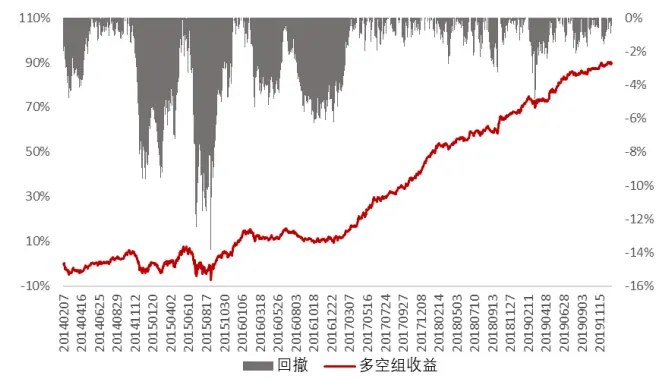
资料来源：wind，华安证券研究所

图表 23 APL20因子 300 内分 10 组净值
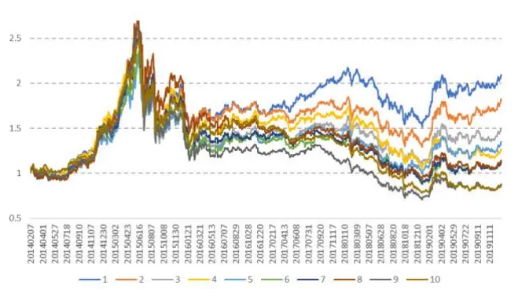
资料来源：wind，华安证券研究所

图表 24 APL 因子 500内多空组收益与回撤
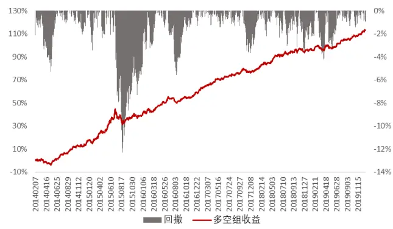
资料来源：wind，华安证券研究所

图表 25 APL20因子 500 内分 10 组净值
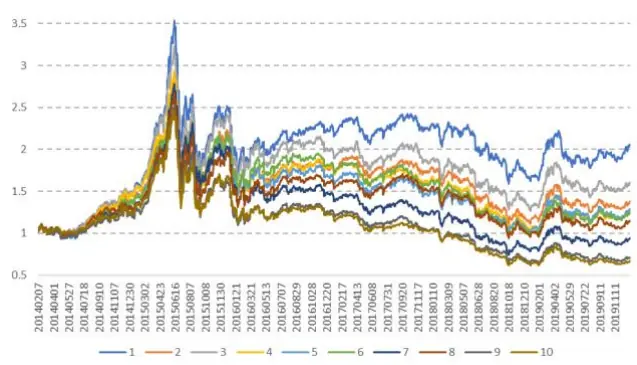
资料来源：wind，华安证券研究所

为更进一步展示出APL 因子在常见指数内优秀的选股效果，我们在指数内进行选股组合的简单权重优化，在不考虑换手率和交易成本时，保持行业、市值暴露与基准指数一致，对目标函数进行优化,得到最优权重构建选股组合。在优化权重时，考虑了涨跌停等交易条件的限制。

$$
\begin{aligned}\max\sum&\sum_{i=1}^{n}(w_{i}-w_{benchmark})^{T}\times factor_{i}\\s.t.&(w_{i}-w_{benchmark})^{T}X_{industry}=0\\&(w_{i}-w_{benchmark})^{T}X_{MV}=0\\&0\leq w_{i}\leq1\\&\sum_{i=1}^{n}w_{i}=1\end{aligned}
$$

图表 26 指数内中性组合分年度收益情况

| 300内 |  |  |  | 500内 |  |  |  |
| --- | --- | --- | --- | --- | --- | --- | --- |
| 年份 | 组合收益指 | 数收益 | 超额收益 | 年份 | 组合收益 | 指数收益 | 超额收益 |
| 2014 | 67.37% | 64.42% | 2.95% | 2014 | 47.62% | 38.62% | 9.00% |
| 2015 | 12.86% | 7.81% | 5.05% | 2015 | 76.53% | 56.94% | 19.59% |
| 2016 | -3.00% | -2.87% | -0.13% | 2016 | 7.01% | -5.46% | 12.47% |
| 2017 | 53.02% | 20.72% | 32.30% | 2017 | 10.01% | -5.28% | 15.29% |
| 2018 | -26.15% | -24.87% | -1.28% | 2018 | -30.24% | -32.83% | 2.59% |
| 2019 | 47.18% | 40.36% | 6.82% | 2019 | 45.06% | 28.31% | 16.75% |

资料来源：wind，华安证券研究所

从组合的净值表现来看，能够稳定的跑赢指数，尤其是在中证 500 内效果更好。

逐年来说，行情上涨时能够取得较高的超额收益，行情下跌时组合表现基本不会比指数更差。并且测试时使用的 $APL_{20}$ 因子值是行业+市值+动量+波动+换手中性后的纯净因子，构建组合的超额收益完全是由 $APL_{20}$ 的增量 Alpha 带来的。

图表 27 $APL_{20}$ 因子 300 内中性组合净值
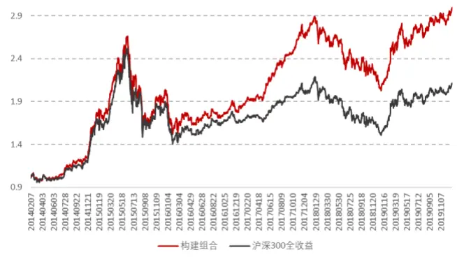
资料来源：wind，华安证券研究所

图表 28 $APL_{20}$ 因子 500 内中性组合净值
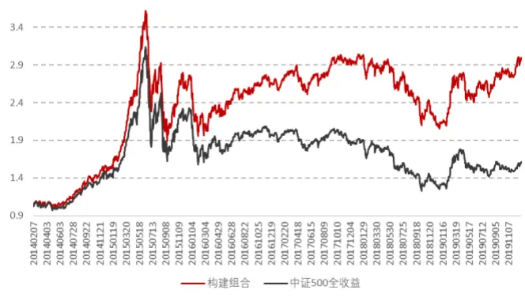
资料来源：wind，华安证券研究所

## 3.6 半月调仓测试结果对比

在上文测试中，调仓频率都是月度调仓，在这一节中测试使用 EWMA 法加权的15 日 $APL_{20}$ 的半月调仓效果，与月度调仓进行对比。从多空组收益与回撤对比来看，月度调仓多空组年化收益为 23.19%，最大回撤 6.38%，年化夏普 3.94，半月调仓多空组年化收益为 28.80%，最大回撤 5.88%，年化夏普 4.90%，半月调仓效果优于月度调仓。

图表 29 $APL_{20}$ 月度调仓多空收益与回撤
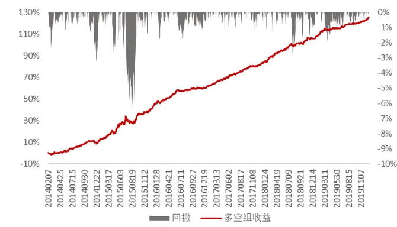
资料来源：wind，华安证券研究所

图表 30 $APL_{20}$ 半月调仓多空收益与回撤
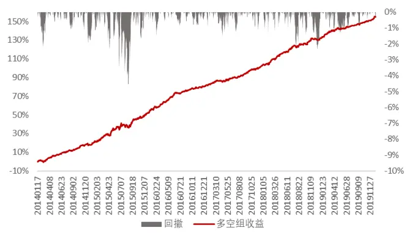
资料来源：wind，华安证券研究所

图表 31 $APL_{20}$ 因子不同调仓方式下的年化换手率对比

| 月度调仓年化换手率半 |  | 月调仓年化换手率 |  |
| --- | --- | --- | --- |
| 2014年 | 845% | 2014年 | 1531% |
| 2015年 | 768% | 2015年 | 1366% |
| 2016年 | 808% | 2016年 | 1458% |
| 2017年 | 829% | 2017年 | 1448% |
| 2018年 | 815% | 2018年 | 1451% |
| 2019年 | 854% | 2019年 | 1211% |

资料来源：wind，华安证券研究所

按照因子值从小到大依次分成十组，统计各组收益时，由于半月调仓的调仓频率更高，所以分 10 组的净值受到手续费的影响更大，图表 31 展示了两种调仓方式下多头的年化换手率对比。

当双边手续费设为 3‰时，分 10 组的年化收益如图 32,33 所示。虽然半月调仓付出的手续费远比月度调仓高，但半月调仓多头组的收益 18.69%还是略高于月度调仓18.32%。

图表 32 APL20月度调仓（手续费 3‰）
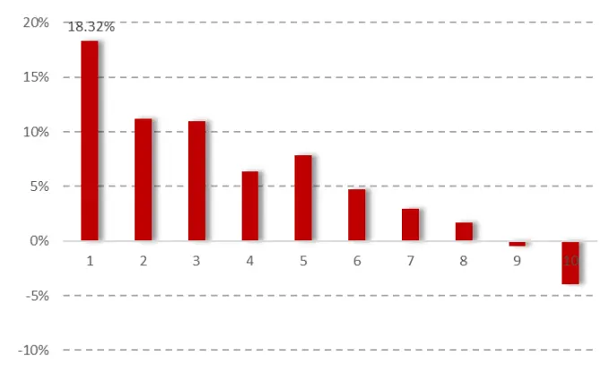
资料来源：wind，华安证券研究所

图表 33 APL20半月调仓（手续费 3‰）
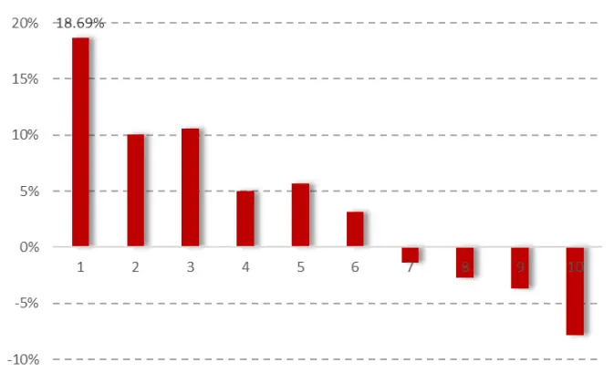
资料来源：wind，华安证券研究所

当双边手续费降低为 1.5‰时，分 10 组的年化收益如图 34,35 所示。低手续费条件下，半月调仓多头组的收益 23.91%高于月度调仓 21.21%。因此如果可以接受比较低的手续费，尝试更高频率的换仓可以带来正向收益。

图表 34 APL20月度调仓（手续费 1.5‰）
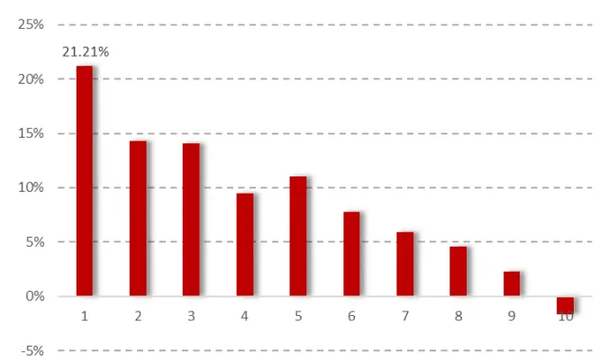
资料来源：wind，华安证券研究所

图表 35 APL20半月调仓（手续费 1.5‰）
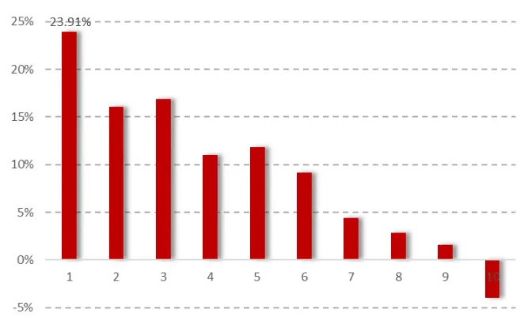
资料来源：wind，华安证券研究所

## 3.7 小结

在探索日内成交额的分布是否含有有效信息时，我们分时段统计了每一分钟的成交额占比因子，并且与日度的换手率因子进行相关性分析，得到了增量有效 Alpha 实际上集中在尾盘成交上的结论，构建了尾盘成交额占比的高频日内因子。日度因子计算以尾盘 18~22 分钟计算为宜，月度因子以 15~20 日指数加权移动平均法（EWMA）构建时表现较为优秀。与其他的高频因子相比，尾盘成交额占比因子具有多头收益显著，换手率相对稍低的独特优点，在指数内多头端仍然有较优的表现，在设置较低手续费的情况下，调仓频率趋向半月能够获得更高的多头收益。

## 4 与日内分钟换手率因子的对比

上文的因子计算方式是用日内某分钟成交额除以当日总成交额，得到相对的分钟成交额占比，日内每分钟之间会相互影响，存在此消彼长的关系。我们在这一节计算日内绝对的分钟换手率因子，即用分钟成交额除以个股自由流通市值，进行对比，研究这个因子表现是否比相对成交额占比更好。这两个角度的统计量之间有一定的相互关系。

$$
分纳成交额占比=\frac{分纳成交额}{岂月必成交额}
$$

$$
分纳成交额占比=\frac{分纳成予率}{当月成予率}=\frac{分纳成交额占比逝占比逝占比}{当月当成交额占比逝占比逝占比}
$$

对 9:30~11:30,13:00~15:00 时间段共计 240 分钟的分钟换手率进行研究，分别计算其与个股的日均换手率的相关性，发现，早盘分钟换手率与个股日均换手率的相关程度极高，达到了 0.65 以上，早盘往后相关程度逐渐降低，在第 121 分钟（即 13:00~13:01这一分钟）相关性最低，下午分钟换手率与日均换手率维持在 0.55 左右，而在尾盘相关性程度微微提升。

图表 36 分钟换手率与日均换手率的相关性
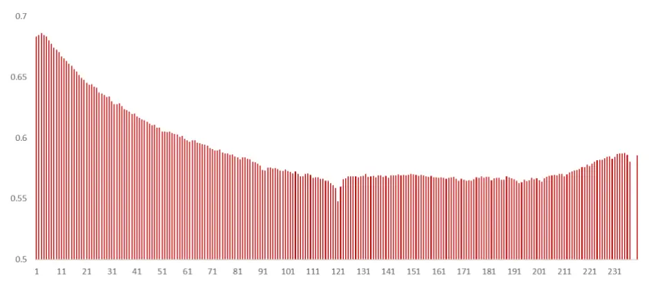
资料来源：wind，华安证券研究所

这里结论与图表 3 得到的结论十分类似：日换手率高的股票，自然而然地，日内的分钟换手率也更高，但日度的高成交映射到分钟频度上时，在日内 240 分钟上是不均匀的，在早盘的呈现更加强烈。

在对行业市值中性后，如图 37，分钟换手率因子的 IC 均低于-0.06，呈现比较好的选股效果，如果进行比较强的中性化处理（对行业+市值+动量+波动+换手中性），如图 38，发现日内仅有尾盘的 IC 值是有效的，与我们在 3.1 节中得到的结论相符。

经过测试发现，分钟换手率因子与分钟相对成交额占比因子比较时有一些缺陷：1、分钟换手率与日度换手率的相关性非常高，因子许多效果都被日度换手率因子所解释；2、分钟换手率受个股的流动性影响特别大，在日度的时间轴上受整体市场的流动性影响也大，虽然其在日内分钟频度上互相独立，但因子的许多统计特征都比分钟成交额占比因子差一些。因此，使用分钟成交额占比来描述日内成交额的分布更加合适。

图表 37 分钟换手率因子 IC（行业市值中性）
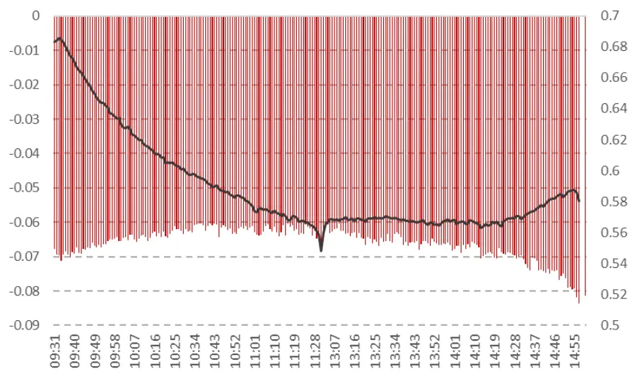
资料来源：wind，华安证券研究所

图表 38 分钟换手率因子 IC（对 5 个传统因子中性）
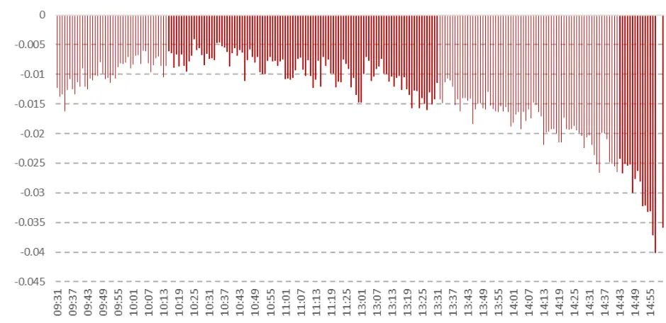
资料来源：wind，华安证券研究所

## 5 日内成交额的其他特征

## 5.1 分钟成交额的高阶矩

2~4 节主要探讨分钟成交额的时间序列分布特征，这一节中讨论分钟成交额的方差因子 VMA（Variance of Minute Amount），偏度因子 SMA（Skewness of Minute Amount），峰度因子 KMA（Kurtosis of Minute Amount）的表现。

$$
\begin{aligned}\mu=&\frac{1}{N}{\sum_{t=1}^{N}}Amount_{t}\\VMA=\sigma^{2}=&\frac{1}{N}{\sum_{t=1}^{N}}(Amount_{t}-\mu)^{2}\\SMA=&\frac{1}{N}{\sum_{t=1}^{N}}(\frac{Amount_{t}-\mu}{\sigma})^{3}\end{aligned}
$$

$$
KMA=\frac{1}{N}{\sum}_{t=1}^{N}(\frac{Amount_{t}-\mu}{\sigma})^{4}
$$

仅对行业和市值中性化处理，VMA，SMA，KMA 因子的基本表现如图 39 所示，仅对行业市值中性时，VMA 因子表现出一定的选股能力，SMA 和 KMA 因子无效果，计算三个因子与传统因子市值、动量、波动、换手因子的相关系数后发现，VMA 因子与市值、波动、换手因子相关程度都较高，在进行较强的中性化处理后，VMA 因子选股效果不佳。

在日内分钟频度上，以分钟成交额计算的高阶矩与日度统计量相关性很强，并没有出现独特的增量 Alpha。

图表 39 分钟成交额的高阶矩因子表现（行业+市值中性）

|  | IC | rankIC | 年化ICIR | 胜率 |  | 多空组 |  |  |
| --- | --- | --- | --- | --- | --- | --- | --- | --- |
|  |  |  |  |  | 年化收益 | 年化波动年化 | IR | 最大回撤 |
| VMA | -0.068 | -0.091 | -2.767 | 77.46% | 27.21% | 9.91% | 2.746 | 10.76% |
| SMA | -0.011 | -0.004 | -0.647 | 53.52% | 2.51% | 8.55% | 0.294 | 14.93% |
| KMA | -0.015 | -0.008 | -0.997 | 60.56% | 4.88% | 7.67% | 0.637 | 13.38% |

资料来源：wind，华安证券研究所

图表 40 分钟成交额的高阶矩因子表现（对5个传统因子中性）

|  | IC | rankIC | 年化ICIR | 胜率 | 多空组 |  |  |  |
| --- | --- | --- | --- | --- | --- | --- | --- | --- |
|  |  |  |  |  | 年化收益 | 年化波动 | 1年化IR | 最大回撤 |
| VMA | -0.023 | -0.021 | -2.680 | 71.83% | 9.62% | 4.48% | 2.148 | 8.06% |
| SMA | -0.011 | -0.005 | -0.793 | 59.15% | 1.93% | 7.40% | 0.261 | 15.40% |
| KMA | -0.012 | -0.005 | -0.925 | 60.56% | 2.80% | 6.73% | 0.416 | 12.36% |

资料来源：wind，华安证券研究所

图表 41 分钟成交额的高阶矩因子与传统因子相关性

|  | 市值 | 动量 | 波动 | 换手 |
| --- | --- | --- | --- | --- |
| VMA | 0.520 | 0.170 | 0.406 | 0.446 |
| SMA | -0.090 | 0.078 | -0.064 | -0.084 |
| KMA | -0.087 | 0.076 | -0.014 | -0.032 |

资料来源：wind，华安证券研究所

## 5.2 分钟成交额的自相关性

我们以 ACMA 因子（Autocorrelation ofMinute Amount）表示分钟成交额的序列自相关性，i 为自相关滞后分钟数。

$$
ACMA_{i}=corr(Amount_{t-i},Amount_{t})
$$

计算一分钟滞后的成交额自相关系数 $_{1ACMA_{1}}$ 后发现，因子的均值为 0.385，自然状态下分钟成交额在日内分钟序列上有显著的自相关性，如图表 42 所示，尾部呈现右拖尾，表明许多股票的分钟成交额自相关性极强，偏离正常阈值。日内分钟成交额自相关性强的股票，在微观上可以理解为股票受到事件刺激频率更高，对信息反应时容易集群交易，羊群效应显著。

图表 42 ACMA 统计特征
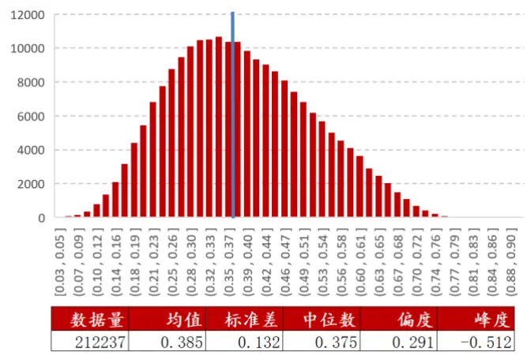
资料来源：wind，华安证券研究所

图表 43 ACMA1 时间序列特征
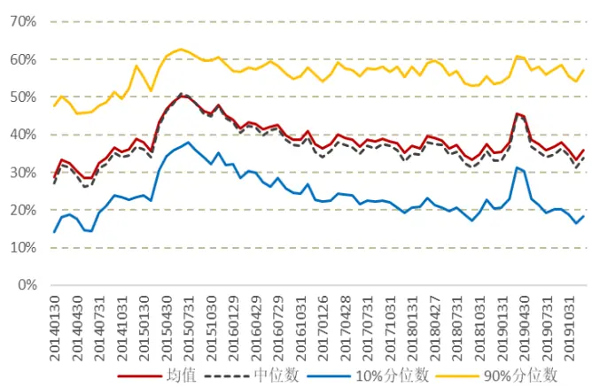
资料来源：wind，华安证券研究所

对ACMA 因子进行回测，滞后阶数取1~5分钟，ACMA 因子的基本表现如图44~46所示，仅对行业和市值中性化处理时，因子表现出不错的选股能力，但由于其与波动、换手因子的相关系数较高，对行业、市值、波动、换手因子中性化处理后，效果有所下降，最优的ACMA 因子为滞后 1 分钟的自相关系数。

图表 44 分钟成交额的自相关性因子表现（行业+市值中性）

|  | IC | rankIC | 年化ICIR | 胜率 | 多空组 |  |  |  |
| --- | --- | --- | --- | --- | --- | --- | --- | --- |
|  |  |  |  |  | 年化收益 | 年化波动年化 | IR | 最大回撤 |
| ACMA_1 | -0.081 | -0.114 | -3.003 | 81.69% | 36.44% | 10.90% | 3.342 | 8.53% |
| ACMA_2 | -0.079 | -0.112 | -2.988 | 80.28% | 34.09% | 10.67% | 3.195 | 8.50% |
| ACMA_3 | -0.076 | -0.109 | -2.885 | 83.10% | 33.18% | 10.52% | 3.155 | 8.51% |
| ACMA_4 | -0.074 | -0.107 | -2.820 | 80.28% | 32.47% | 10.49% | 3.097 | 8.78% |
| ACMA_5 | -0.071 | -0.104 | -2.745 | 81.69% | 31.65% | 10.68% | 2.965 | 7.95% |

资料来源：wind，华安证券研究所

图表 45 分钟成交额的自相关性因子表现（对 5 个传统因子中性）

|  | IC | rankIC | 年化ICIR | 胜率 | 多空组 |  |  |  |
| --- | --- | --- | --- | --- | --- | --- | --- | --- |
|  |  |  |  |  | 年化收益 | 年化波动 | 年化IR | 最大回撤 |
| ACMA_1 | -0.041 | -0.054 | -3.299 | 80.28% | 16.68% | 4.98% | 3.352 | 4.30% |
| ACMA_2 | -0.039 | -0.052 | -3.167 | 73.24% | 14.43% | 4.89% | 2.950 | 6.53% |
| ACMA_3 | -0.035 | -0.048 | -2.906 | 77.46% | 12.99% | 4.89% | 2.658 | 5.62% |
| ACMA_4 | -0.032 | -0.044 | -2.625 | 77.46% | 12.57% | 4.81% | 2.615 | 6.07% |
| ACMA_5 | -0.028 | -0.040 | -2.352 | 71.83% | 11.05% | 4.76% | 2.324 | 7.97% |

资料来源：wind，华安证券研究所

图表 46 分钟成交额的自相关性因子与传统因子相关性

|  | 市值 | 动量 | 波动 | 换手 |
| --- | --- | --- | --- | --- |
| ACMA_1 | 0.180 | 0.153 | 0.582 | 0.688 |
| ACMA_2 | 0.164 | 0.147 | 0.586 | 0.675 |
| ACMA_3 | 0.165 | 0.154 | 0.594 | 0.669 |
| ACMA_4 | 0.171 | 0.160 | 0.597 | 0.662 |
| ACMA_5 | 0.176 | 0.162 | 0.597 | 0.655 |

资料来源：wind，华安证券研究所

对ACMA 因子从小到大依次分成十组，构建多空组合与等权选股组合，统计各组收益。因子的效果主要来自于空头端，分钟成交额自相关性强的，容易发生集群交易的股票，在下个月的表现更差。

图表 47 ACMA 多空组收益与回撤
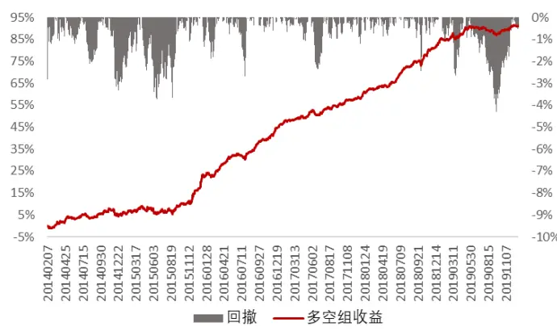
资料来源：wind，华安证券研究所

图表 48 ACMA 分 10 组年化收益
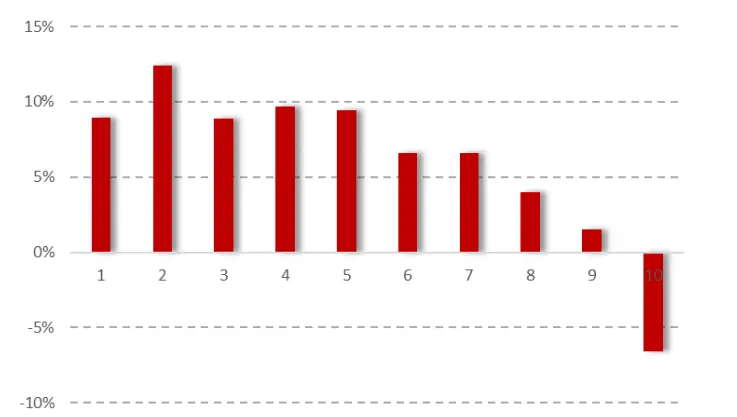
资料来源：wind，华安证券研究所

## 5.3 空头效应对尾盘成交额占比因子的强化

在使用 $ACMA_{1}$ 因子构建股票组合时，由于其多头效应不够显著，直接将其与有效因子加权组合会削弱有效因子的多头端收益。以前文中提到的有效因子尾盘成交额占比因子为例，我们可以使用空头效应对 $APL_{20}$ 进行效果强化，具体操作方式为：1、按照尾盘成交占比因子 ${\cdot}APL_{20}$ 从小到大把股票池分成十组；2、对各组股票再按照 $ACMA_{1}$ 因子从小到大排序，剔除因子值最大的 x%的股票，剩下的股票作为持仓组合。

x=20，即剔除 $1CMA_{1}$ 因子值最大的 20%的股票后，各组强化效果如图 45 所示，对每一组效果都增强了。多头组（即第一组）的年化收益从 18.32%上升到 19.31%。

图表 49 对尾盘成交额占比因子强化前后分组收益
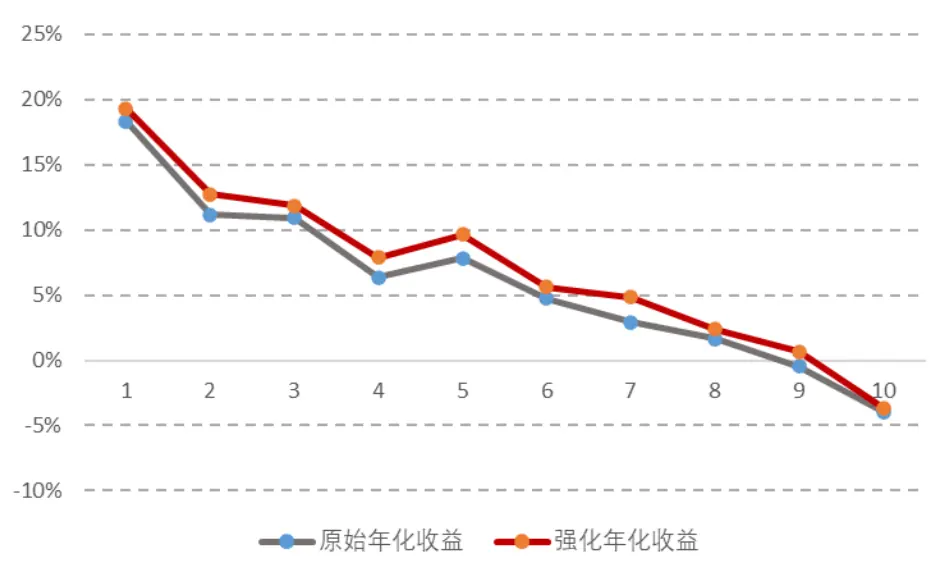
资料来源：wind，华安证券研究所

图表 50 对尾盘成交额占比因子强化前后多头净值
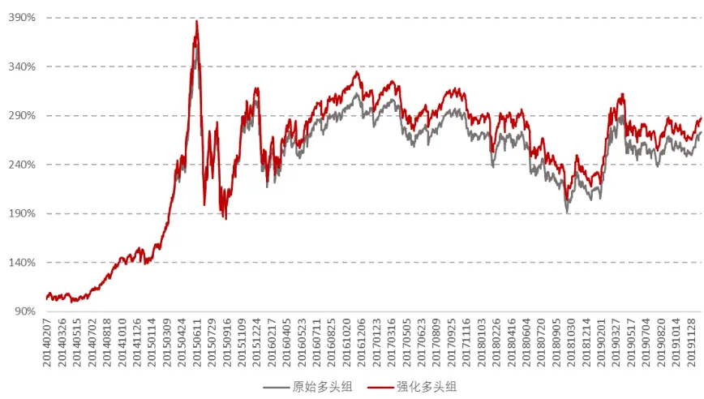
资料来源：wind，华安证券研究所

## 6 总结

图表 51 APL 月度 IC 序列
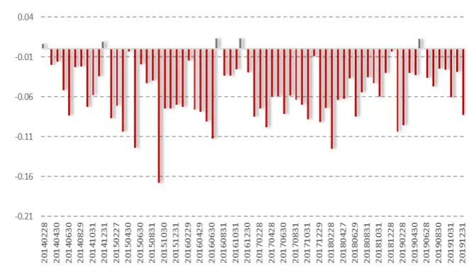
资料来源：wind，华安证券研究所

图表 52 APL 多空组收益与回撤

资料来源：wind，华安证券研究所

图表 53 APL 因子分 10 组年化收益
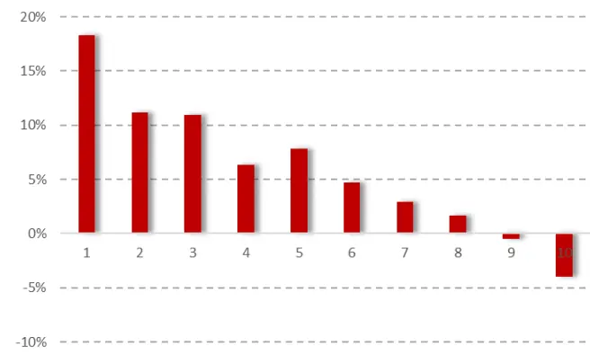
资料来源：wind，华安证券研究所

图表 54 APL 因子分 10 组净值
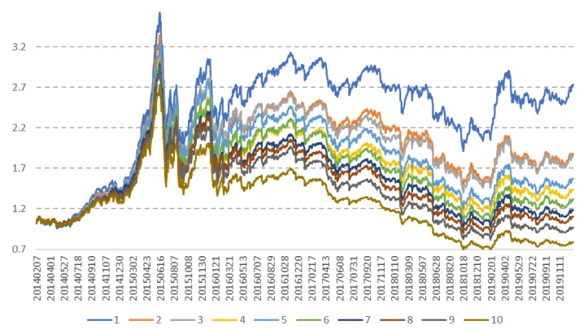
资料来源：wind，华安证券研究所

成交额的日内高频因子很容易与换手因子的相关性很大，因为它本质是一个基于成交额来构造的因子，尾盘成交额占比因子从成交额在日内的不平均分布入手，发现了潜藏在微观交易行为下的尾盘增量 Alpha。而成交额的其他日内特征如自相关系数因子，空头效应显著，可以对选股组合进行排雷强化。

APL ，即尾盘 20 分钟成交额占比因子，采用 15 日 EWMA 方法计算月度因子，中性化后IC均值达到了-0.054，IC表现稳定，ICIR达到了-5.18，多空组年化收益23.19%，年化波动 5.90%，年化 IR3.94，最大回撤仅 6.38%，分 10 组收益曲线明显单调，且多头效应显著。

## 回测说明：

（1）如果没有特别说明，本文回测一律采用市值、行业、换手、波动、反转中性后的纯净因子。

（2） 本文的回测时间段均为 2014/01/01 ~2019/12/31，月度调仓时第一个月为因子值计算月，真实持仓日期为 2014/02/07~2019/12/31 共计 1443 个交易日。半月度调仓时，半月调仓日期取月末日期的中间值。

（3） 无特别说明时，手续费设为双边 3‰。组合月度调仓时，月末最后一天按收盘价卖出，月初第一天按开盘价买入，半月度调仓类似。

（4） 在全部 A 股中，剔除涨停、跌停、ST 和*ST、停牌、超低成交、上市不满180 天的新股等特殊股票。

（5）单因子等权组合测试中没有做组合优化和换手率控制，收益仍有提升空间。

## 风险提示：

本报告基于历史个股高频数据进行测试，历史回测结果不代表未来收益。未来市场风格可能切换，微观交易结构可能发生变化，Alpha 因子可能失效，本文内容仅供参考。

## 重要声明

## 分析师声明

本报告署名分析师具有中国证券业协会授予的证券投资咨询执业资格，以勤勉的执业态度、专业审慎的研究方法，使用合法合规的信息，独立、客观地出具本报告，本报告所采用的数据和信息均来自市场公开信息，本人对这些信息的准确性或完整性不做任何保证，也不保证所包含的信息和建议不会发生任何变更。报告中的信息和意见仅供参考。本人过去不曾与、现在不与、未来也将不会因本报告中的具体推荐意见或观点而直接或间接收任何形式的补偿，分析结论不受任何第三方的授意或影响，特此声明。

## 免责声明

华安证券股份有限公司经中国证券监督管理委员会批准，已具备证券投资咨询业务资格。本报告中的信息均来源于合规渠道，华安证券研究所力求准确、可靠，但对这些信息的准确性及完整性均不做任何保证，据此投资，责任自负。本报告不构成个人投资建议，也没有考虑到个别客户特殊的投资目标、财务状况或需要。客户应考虑本报告中的任何意见或建议是否符合其特定状况。华安证券及其所属关联机构可能会持有报告中提到的公司所发行的证券并进行交易，还可能为这些公司提供投资银行服务或其他服务。

本报告仅向特定客户传送，未经华安证券研究所书面授权，本研究报告的任何部分均不得以任何方式制作任何形式的拷贝、复印件或复制品，或再次分发给任何其他人，或以任何侵犯本公司版权的其他方式使用。如欲引用或转载本文内容，务必联络华安证券研究所并获得许可，并需注明出处为华安证券研究所，且不得对本文进行有悖原意的引用和删改。如未经本公司授权，私自转载或者转发本报告，所引起的一切后果及法律责任由私自转载或转发者承担。本公司并保留追究其法律责任的权利。

## 投资评级说明

以本报告发布之日起 6个月内，证券（或行业指数）相对于同期沪深 300指数的涨跌幅为标准，定义如下：

## 行业评级体系

增持—未来 6 个月的投资收益率领先沪深 300 指数 5%以上;

中性—未来 6 个月的投资收益率与沪深 300 指数的变动幅度相差-5%至 5%;

减持—未来 6 个月的投资收益率落后沪深 300 指数 5%以上;

## 公司评级体系

买入—未来6-12个月的投资收益率领先市场基准指数 15%以上；

增持—未来 6-12 个月的投资收益率领先市场基准指数 5%至 15%；

中性—未来6-12个月的投资收益率与市场基准指数的变动幅度相差-5%至5%；

减持—未来 6-12 个月的投资收益率落后市场基准指数 5%至 15%；

卖出—未来6-12个月的投资收益率落后市场基准指数 15%以上；

无评级—因无法获取必要的资料，或者公司面临无法预见结果的重大不确定性事件，或者其他原因，致使无法给出明确的投资评级。 市场基准指数为沪深 300指数。