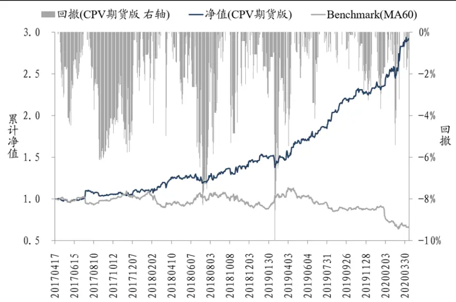
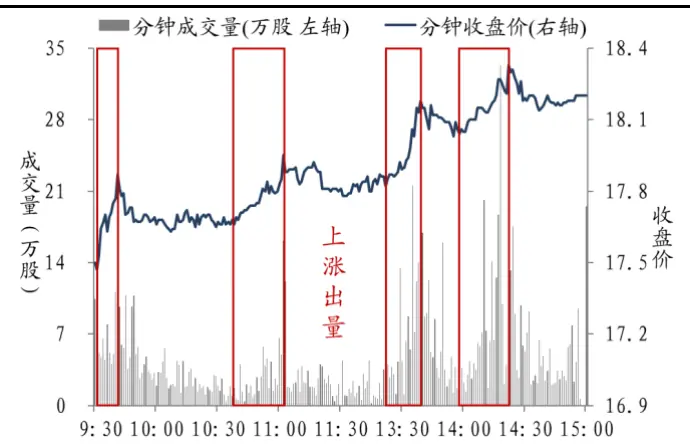
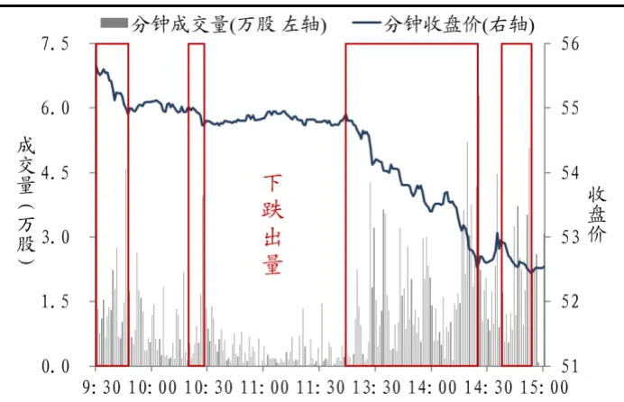
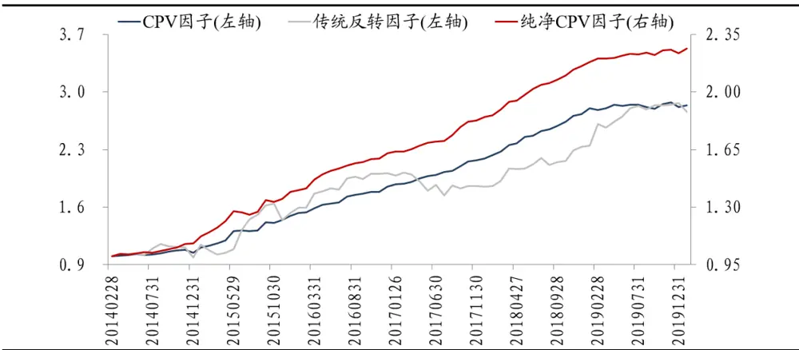
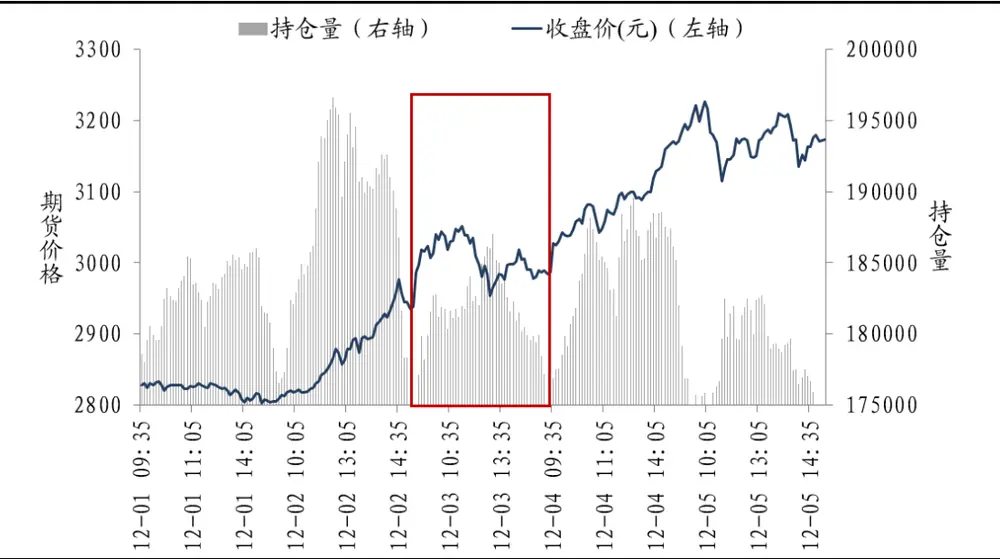
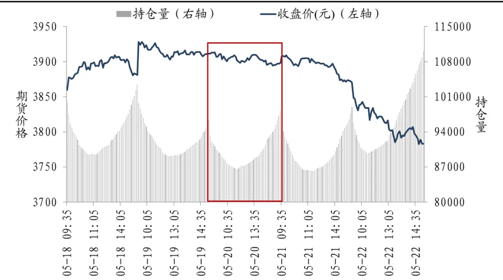
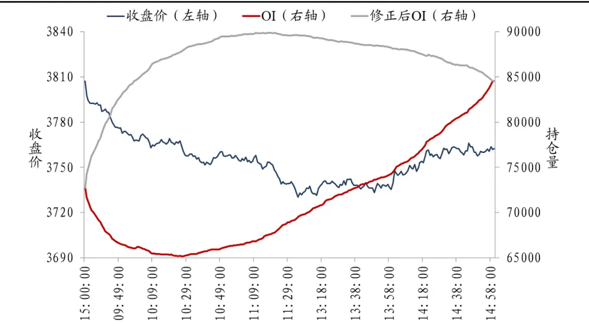
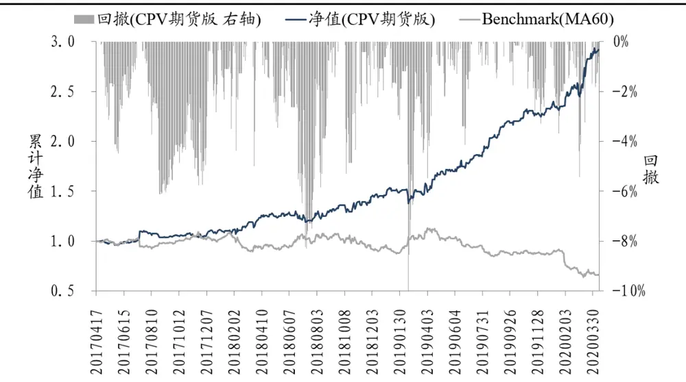

## “高频价量相关性拥抱 CTA”系列研究（一）

## [Table_Main]CPV 因子期货版

## 研究结论

- 前言：东吴金工推出“高频价量相关性拥抱CTA”系列研究，旨在将技术分析的方法应用到 CTA 策略的构建。作为系列研究第一篇，本报告从最基本的价量关系入手，捕捉高频价量相关性中蕴含的多空信息，构建稳健有效的CTA交易策略。

- 本文简介：在以往的价量研究中，量的选择大多只停留在成交量的层面。然而，持仓量作为衍生品的特色，往往蕴藏了许多有别于成交量的信息。本研究聚焦高频数据，通过修正期货的日内分时持仓量，挖掘成交价与修正持仓量相关系数中的多空信号。

- 修正后持仓量：原始的日内持仓量，呈现出先下降后上升的“山谷”形态。然而，与直观感受相反，持仓量下降代表T+0交易者进场，持仓量上升代表T+0 交易者离场。修正后的持仓量，通过分配日内总持仓量变化，将持仓量的形态从“山谷”变为“山峰”，真实地还原了交易者的多空意图。

- 价量信号 CTA策略：基于每日价量相关性信号，我们构建了CTA交易策略。从 2017年4月17日至 2020年 4月 14日，共计728 个交易日，其中635天存在有效交易信号，换仓283次。策略的年化收益为44.48%，年化波动为 19.84%，收益波动比 2.24，日度胜率为 57.27%，最大回撤为 10.34%。

策略回测净值表现

数据来源：Wind资讯，东吴证券研究所

- 风险提示：本报告所有统计结果均基于历史数据，未来市场可能发生重大变化。

uthor] 2020 年 06 月 18 日

证券分析师 高子剑

执业证号：S0600518010001

021-60199793

gaozj@dwzq.com.cn

研究助理 沈芷琦

021-60199793

shenzhq@dwzq.com.cn

## 相关研究

1、《“技术分析拥抱选股因子”系列研究（一）：高频价量相关性，意想不到的选股因子》202002232、《技术分析的品格——以沪深300 指数和随机数序列为例》20191031

## 1. 前言

从 1884 年“道氏理论”被提出，到如今缠论等各种衍生经验法则的盛行，技术分析历经130多年的发展，已经被广泛应用于股票、商品、债券、衍生品等各类金融资产的研究中。作为最经典的技术分析手段之一，价量关系的研究历久弥新，时至今日仍被众多学者和从业者津津乐道。就以下图1和图 2所展示的两只股票为例，图1 中的股票“价量配合”，表现为上涨时放量，下跌时缩量，是技术分析中标准的“强势股”；图 2中的股票“价量背离”，表现为上涨时缩量，下跌时放量，是技术分析中典型的“弱势股”。利用“价”与“量”的相互关系，技术分析能够有效识别股票强弱。

图 1：中公教育分钟走势图：（2019/10/16）

数据来源：Wind 资讯，东吴证券研究所

图 2：微芯生物分钟走势图（2019/10/16）

数据来源：Wind 资讯，东吴证券研究所

从“价量关系”的角度出发，东吴金工在之前的研究中，通过计算股票分钟成交价与成交量的相关系数，逐步挖掘出一个新的选股因子——CPV因子。剔除行业和市场常用风格因子的干扰后，纯净 CPV 因子表现优异，全市场 5 分组多空对冲的信息比率达到3.43，月度胜率为87.32%，最大回撤仅为1.58%（详情请参见《技术分析拥抱选股因子”系列研究（一）：高频价量相关性，意想不到的选股因子》）。

图 3：CPV因子全市场 5分组多空对冲的净值走势

数据来源：Wind 资讯，东吴证券研究所

在本篇报告的研究中，东吴金工尝试将 CPV 因子的构建思想，进一步拓展到股指期货上。与股票不同的是，股指期货除成交量指标外，还有其特殊的持仓量指标。本报告将延续前期研究的思想，充分论述和剖析更为复杂的持仓量数据，并处理期货特有的交割周期问题。在报告的最后，各位读者将看到一个零参数的稳健 CTA 策略。

## 2. 修正后持仓量

## 2.1. 持仓量的选择逻辑

前述中提到，通过计算价与量的相关系数可以判断资产价格的未来走势。但与股票的研究不同，期货研究在量的选择上除了成交量数据外，还有持仓量数据。在本篇报告价量关系的研究中，我们选取了期货的持仓量数据。一方面，我们认为，持仓量作为期货特有的技术指标，相较于成交量更具有研究的理论价值；另一方面，持仓量包含更为纯净的多空信息，能更加真实地反映投资者对后市的预期，揭示市场中多空实力的变化。

## 2.2. 持仓量的形态特征

在揭开持仓量的“神秘面纱”前，我们先聚焦持仓量的形态特征。以下图 4 和图 5为例，图 4 中股指期货的日内持仓量是一座“山峰”，而图 5 中股指期货的日内持仓量变成了一座“山谷”。

图 4：IF（当月连续）价格走势和持仓量“山峰”形态

数据来源：Wind 资讯，东吴证券研究所

图 5：IF（当月连续）价格走势和持仓量“山谷”形态

数据来源：Wind 资讯，东吴证券研究所

经过研究发现，持仓量这种“化峰为谷”的改变，是由 T+0投资者交易行为的变化所导致的。在 2015 年 9 月之前，每个交易日的前半段时间，随着 T+0 交易者进场，持仓量逐渐增加；每个交易日的后半段时间，随着T+0 交易者出场，持仓量逐渐减少，日内持仓量因此呈现出“山峰”的形状。而在 2015 年 9 月之后，中金所出台新规，平仓当日开仓（简称“平今仓”）的手续费，是非平今仓手续费的“15 倍”。为规避骤增的手续费，T+0交易者倾向于在当日收盘，同时留1手多单和1手空单。其隔日的交易行为，我们以下表 1与表2中的数据为例，进行一个简单的路径模拟。表1 中，T+0 交易者看多后市，在盘中空单平仓（交易指令为买），收盘前空单开仓（交易指令为卖），仍旧同时留1手多单和 1手空单。表2中，T+0 交易者看空后市，在盘中多单平仓（交易指令为卖），收盘前多单开仓（交易指令为买），仍旧同时留1 手多单和 1手空单。这就产生了与 2015 年 9 月之前截然不同的持仓量形态，“山峰”也因此变为“山谷”：每天的前半段交易时间，随着T+0交易者进场，持仓量逐渐减少；每天的后半段时间，随着T+0交易者出场，持仓量逐渐增加。

表 1：T+0 交易者做多模拟

| T+0 交易者投资路径 | 同留多空 | 空单平仓 | 空单开仓 |
| --- | --- | --- | --- |
| 时间 | 9:30 | 10:00 | 15:00 |
| 多单数量 | 1 | 1 | 1 |
| 空单数量 | 1 | 0 | 1 |
| 双 0I | 2 | 1 | 2 |

数据来源：东吴证券研究所整理

表 2：T+0 交易者做空模拟

| T+0 交易者投资路径 | 同留多空 | 多单平仓 | 多单开仓 |
| --- | --- | --- | --- |
| 时间 | 9:30 | 10:00 | 15:00 |
| 多单数量 | 1 | 0 | 1 |
| 空单数量 | 1 | 1 | 1 |
| 双0I | 2 | 1 | 2 |

数据来源：东吴证券研究所整理

## 2.3. 持仓量的修正路径

上一小节的案例提到，开盘后持仓量的下降，反而代表T+0 交易者的进场， $\hslash$ 午盘前后持仓量的上升，反而代表T+0交易者的离场。原始的日内持仓量变化，无法真实地反映交易者的多空意图，因此在进行下一步研究之前，我们需要对日内持仓量进行修正，实现“退谷还峰”。

修正的过程主要分为以下四步：

（1）计算日内 $\mathrm{t_{l}}$ 时刻与 $\mathrm{t_{i-1}}$ 时刻的持仓量的变化量 $\Delta\mathrm{OI_{i}}$ 与成交量的变化量 $\Delta\mathrm{V}_{\mathrm{i}}$ ；

（2）以 $\mathrm{ti}$ 时刻的成交量变化量 $\Delta\mathrm{V}_{\mathrm{i}}$ ，占当日总成交量∆V的比例作为权重，将当日总持仓量的变化量∆OI，按权重分配到 $\mathrm{t_{l}}$ 时刻，得到该时刻T+1交易者的持仓量变化量$\Delta\mathrm{OI(T+l)}_{\mathrm{i}}$ i：

$$
\Delta0\mathrm{I(T+1)_{i}=\frac{\Delta V_{i}}{\Delta V}*\Delta0I}
$$

（3）用 $\mathrm{t_{l}}$ 时刻的持仓量变化量 $\Delta\mathrm{OI_{i}}$ ，减去该时刻 T+1 交易者的持仓量变化量∆OI(T+1)i，得到该时刻 T+0 交易者的持仓量变化量∆OI(T+0)i；所得结果乘上“-1”，将T+0交易者的“离场”（操作上为平仓）修正为“进场”：

$$
\Delta0\mathrm{I(T+0)_{i}=-1*[\Delta0I_{i}-\Delta0I(T+1)_{i}]}
$$

（4）将修正后的T+0交易者的持仓量变化量∆OI(T+0)i，与T+1交易者的持仓量变化量∆OI(T+1)i汇总，加到上一时刻 $\mathrm{t_{i-1}}$ 的总持仓量 OI(i-1)上，得到当前时刻 $\mathrm{t_{i}}$ 的总持仓量 OI(i)：

$$
\mathrm{OI(i)}=\mathrm{OI(i-1)}+\Delta\mathrm{OI(T+0)}_{\mathrm{i}}+\Delta\mathrm{OI(T+1)}_{\mathrm{i}}
$$

表 3：持仓量修正举例

| 总持仓量 | 20 15 | 10 | 29 | 30 |
| --- | --- | --- | --- | --- |
| ΔOI | -5 | -5 | 19 | 1 |
| 成交量(∆ Vi) | 9 | 15 | 25 | 1 |
| ∆ OI(T+1) | 1.8 | 3 | 5 | 0.2 |
| Δ OI(T+0) | 6.8 | 8 | -14 | -0.8 |
| 修正Δ OI(总) | 8.6 | 11 | -9 | -0.6 |
| 修正 OI(总) | 20 28.6 | 39.6 | 30.6 | 30 |

数据来源：东吴证券研究所整理

上表 3中的案例数据，简单模拟了分时持仓量的修正路径。根据以上四步修正的方法，股指期货日内持仓量的形态，成功从“山谷”变为了“山峰”，T+0交易者与T+1交易者的真实多空意图得以体现。下图 6 展示了某一交易日的实际修正案例。

图 6：2020年 4月 21日持仓量修正案例

数据来源：Wind 资讯，东吴证券研究所

## 3. 修正后价量相关性交易策略

在本节中，我们将基于上述修正方法，计算修正后的价量相关系数PV 值，并据此构建我们的交易策略。策略设计具体如下：

（1）修正日内分钟持仓量：将日内持仓量的总变化量，利用分钟成交量加权，分配到每一分钟，计算T+0、T+1的持仓量，得到修正的持仓量；

（2）计算日内价量相关系数 PV 值：用日内分钟价格与分钟修正持仓量，构造∆P序列和∆OI序列，计算两个序列之间的相关系数；

（3）每日收盘，根据PV值构建交易信号：PV 值大于0，发出看多信号；PV值小于0，发出看空信号；

（4）T+1开盘建仓，若连续两天信号相同，T+2开盘不平仓；若信号不相同，T+2开盘平仓反手。

以沪深 300股指期货为回测标的，以2017年4 月至2020年4月为回测时间段，期间统一剔除了交割周期中产生的信号，并且交割后的第一个交易日不开仓。策略表现优秀，具体绩效指标如表 4 所示，年化收益为 30.71%（不含杠杆），年化波动为 19.46%，收益波动比为 1.58。

表 4：非交割周期中交易日的回测表现

| 沪深 300 股指期货 | 年化收益 |  | 年化波动收益波动比 | 日度胜率最大回撤 |  |
| --- | --- | --- | --- | --- | --- |
| 当月连续 | 30.71% | 19.46% | 1.58 | 55.60% | 11.49% |

数据来源：Wind 资讯，东吴证券研究所

## 4. 其他重要处理

## 4.1. 交割周期

与股票交易不同，期货交易会面临交割周期的问题。处在交割周期中的期货合约，交易活跃度降低，持仓量和成交量都会大幅下降；而次月合约的交易活跃性则会显著上升。因而单纯使用交割周期中合约所产生的信号，准确度会在一定程度上被削弱。在本小节中，我们将集中讨论交割周期中合约换月的问题。

观察交割当日的期货合约，在收盘前两小时，当月合约的价格将趋近于结算价。价格失真，当月合约PV值也因此失真。由于换仓的影响，次月合约的持仓量全天稳定上升，持仓量失真，次月合约PV 值也失真。因此我们直接剔除交割当日产生的信号。

交割周期中其余四个交易日的处理，将综合考虑当月合约和次月合约的信号值。我们回测了 2017 年 4 月至 2020 年 4 月之间，所有交割周期的样本。绩效统计结果显示，当月合约与次月合约信号相同的交易日共有 51 个，贡献的年化收益达到 8.00%，策略胜率高达 68.63%。而当月合约与次月合约信号不同的交易日共有 93个，在这些交易日中，若只根据当月合约信号进行交易，则年化收益只有0.05%，胜率降至 52.69%；若只根据次月合约进行交易，则年化收益为负，胜率小于 50%。因此对于交割周期中余下的四天，只在当月合约与次月合约信号相同时进行交易，其余交易日剔除信号，不做交易。

表 5：交割周期中交易日的回测表现

| 根据当月PV值信号交易 |  |  |  |
| --- | --- | --- | --- |
| 交易日数 | 日度胜率 | 年化收益 年化波动 | 信号方向 |
| 51 | 68.63% | 8.00% 23.03% | 当月与次月信号相同 |
| 93 | 52.69% | 0.05% 20.50% | 当月与次月信号相反 |
| 根据次月 PV 值信号交易 |  |  |  |
| 交易日数 | 日度胜率 | 年化收益 年化波动 | 信号方向 |
| 51 | 68.63% | 8.00% 23.03% | 当月与次月信号相同 |
| 93 | 46.24% | -0.58% 20.50% | 当月与次月信号相反 |

数据来源：Wind 资讯，东吴证券研究所

## 4.2. 长假影响

策略信号的产生，在每个交易日的盘后，当前后两个交易日间隔时间较长时，容易受到突发事件带来的干扰，导致上一交易日的信号无法准确预测下一交易日标的的走势。2017年4 月至 2020年4月内，回测结果显示，相邻两个交易日之间的间隔为3天时，策略平均产生 0.68%的年化收益，胜率为 75%；间隔天数大于3 天时，策略平均年化收益为-0.50%，胜率小于50%。因此，对于下一个交易日间隔超过3天的信号，我们将直接剔除，不做交易。例如5月 1日至5 月5 日为长假，则我们剔除 4月30号的信号。

表 6：长假前交易日的回测表现

| 与下一交易日相隔天数 | 样本数 | 平均收益（T+1 开盘到 T+2 开盘） | 日度胜率 |
| --- | --- | --- | --- |
| 3 | 8 | 0.68% | 75.00% |
| >3 | 11 | -0.50% | 45.45% |

数据来源：Wind 资讯，东吴证券研究所

## 5. 价量相关性综合策略

至此，完整的价量相关性综合策略“粉墨登场”。我们同时构建了Benchmark（MA60）信号策略作为对比。基准策略如下：

（1）计算多空信号值：CSI300 收盘价>CSI300(MA60)收盘价，次日看多；CSI300收盘价<CSI300(MA60)收盘价，次日看空；

（2）根据信号值交易：以 T+1 日开盘价开仓，T+2 日开盘价平仓；若前后两次信号一致，则保持原有仓位不变。

回测期2017年4月至2020年4月内，综合策略的年化收益为44.48%（不含杠杆），年化波动为 19.84%，收益波动比2.24，日度胜率 57.27%，最大回撤为 10.34%，绩效表现显著优于基准策略。在产生信号的635个交易日中，换仓次数为 283次，表明信号间存在一定的自相关性，在考虑手续费单边万 0.23的情况下，总手续费仅为 1.30%。

图 7：策略回测表现与标的信号净值对比

数据来源：Wind 资讯，东吴证券研究所

表 7：策略回测表现与标的信号绩效指标对比

|  | 年化收益 | 年化波动 | 收益波动比 | 最大回撤 | 总交易天数 | 换仓次数 |  | 日度胜率手续费 |
| --- | --- | --- | --- | --- | --- | --- | --- | --- |
| CTA 策略 | 44.48% | 19.84% | 2.24 | 10.34% | 635 | 283 | 57.27% | 1.30% |
| benchmark | -13.30% | 20.98% | -0.63 | 43.82% | 728 | 48 | 49.73% | 0.22% |

数据来源：Wind 资讯，东吴证券研究所

## 6. 总结

本报告为“高频价量相关性拥抱CTA”系列的第一篇，将利用价量相关性判断股票强弱的思想，拓展到了股指期货的研究中。首先，我们处理了期货持仓量的“山谷”形态问题，通过剖析模拟T+0 投资者的交易行为，构建了修正持仓量的特殊方法，还原了交易者的真实多空意愿。在修正持仓量的基础上，我们计算了期货的高频价量相关系数，构建了初步的CTA策略。随后，我们深入探讨了期货特有的交割周期换月问题，同时也剔除了部分长假的影响。最后，我们得到CTA综合策略，其表现显著优于基准策略，在不带杠杆的情况下，剔除手续费后仍有超过40%的年化收益。

纵观全篇，本文最大的优势在于，策略的构建不含任何参数，完全来源于对市场现象的深入剖析和长达十八年积累的研究经验，强有力地保证了策略的稳健性。另一方面，本文的研究方法类比性强，能够“举一反三”、“触类旁通”，后续我们将尝试把本文的研究方法，迁移到国债期货、商品期货以及利率期货等众多金融资产的研究上。

## 7. 风险提示

本报告所有统计结果均基于历史数据，未来市场可能发生重大变化。

附注：感谢实习生杨舒媛、李航驰为本报告做出贡献。

## 免责声明

东吴证券股份有限公司经中国证券监督管理委员会批准，已具备证券投资咨询业务资格。

本研究报告仅供东吴证券股份有限公司（以下简称“本公司”）的客户使用。本公司不会因接收人收到本报告而视其为客户。在任何情况下，本报告中的信息或所表述的意见并不构成对任何人的投资建议，本公司不对任何人因使用本报告中的内容所导致的损失负任何责任。在法律许可的情况下，东吴证券及其所属关联机构可能会持有报告中提到的公司所发行的证券并进行交易，还可能为这些公司提供投资银行服务或其他服务。

市场有风险，投资需谨慎。本报告是基于本公司分析师认为可靠且已公开的信息，本公司力求但不保证这些信息的准确性和完整性，也不保证文中观点或陈述不会发生任何变更，在不同时期，本公司可发出与本报告所载资料、意见及推测不一致的报告。

本报告的版权归本公司所有，未经书面许可，任何机构和个人不得以任何形式翻版、复制和发布。如引用、刊发、转载，需征得东吴证券研究所同意，并注明出处为东吴证券研究所，且不得对本报告进行有悖原意的引用、删节和修改。

## 东吴证券投资评级标准：

公司投资评级：

买入：预期未来 6个月个股涨跌幅相对大盘在 15%以上；

增持：预期未来 6个月个股涨跌幅相对大盘介于 5%与15%之间；

中性：预期未来 6个月个股涨跌幅相对大盘介于-5%与5%之间；

减持：预期未来 6个月个股涨跌幅相对大盘介于-15%与-5%之间；

卖出：预期未来 6个月个股涨跌幅相对大盘在-15%以下。

行业投资评级：

增持： 预期未来 6个月内，行业指数相对强于大盘 5%以上；

中性： 预期未来 6个月内，行业指数相对大盘-5%与5%；

减持： 预期未来 6个月内，行业指数相对弱于大盘 5%以上。

