## 交易指令流中的 Alpha

“高频寻踪”系列之一

任瞳

0755-83081468

rentong@cmschina.com.cn

S1090519080004

点击进入http://www.hibor.com.cn

崔浩瀚
021-68407276
cuihaohan@cmschina.com.cn
S1090519070004

CMS招商证券

2020年6月20日

## 指令流毒性（VPIN）的学术背景

- 市场微观结构理论认为，信息是影响市场上投资者交易行为的重要因素之一，投资者可以根据自己所拥有的信息，判断市场的走势并采取相应的交易策略而获利；另一方面，金融市场的信息在不同的投资者之间的分布又是不均衡的，市场中客观存在的信息不对称会导致逆向选择行为的发生，知情交易者可以利用自己的私有信息从交易对手方处获得利润，通过对市场中信息结构的刻画可以更好地认识和理解金融市场运行的过程。

- 由于在美股市场，每只股票都会安排一个以上的做市商（market maker，或者是特约交易商 specialist）来为股票提供流动性。而知情交易者的存在会有目的性地从做市商那里获利，当知情交易者大量存在时，有可能导致做市商离场，市场流动受到损害，继而引发市场闪崩。Easley等（2012）利用高频数据直接对交易环境下知情交易的概率进行估计，并将知情交易的概率形象地称为“指令流毒性（Order FlowToxicity）”。

- 当指令流逆向地选择做市商时，这些指令流就被认为是有毒性的，这时做市商在提供流动性的同时也遭受了损失。

## VPIN指标对美国股指期货闪崩的预测

资料来源：Easley, David, Marcos M. Lopez De Prado, and Maureen O’Hara. “The microstructure of the “flash crash”: flow toxicity, liquidity crashes, and the probability of informed trading.” The Journal of Portfolio Management 37.2 (2011): 118-128、 招商证券 点击进入http/wtww商jbo.com.cn

关于指令流毒性的高频数据测量在过去30年中经历了从PIN到VPIN（Volume-Synchrogazed Probability of Informed Trading）的演变，实际是从时钟衡量到量钟衡量的演变。

- Easley, Kiefer & O’hara 在1996年建立了一个不确定事件下的序贯交易模型，并基于市场数据，利用极大似然估计法来估算模型参数（PIN），得到知情交易概率。具体可参见我团队报告《琢璞系列之二：高频数据中的知情交易》

- 根据贝叶斯规则，“当天出现坏消息“的后验概率为：

$$
P_{b}(t|S_{t})=\frac{P_{b}(t)(\varepsilon+\mu)}{\varepsilon+P_{b}(t)\mu}
$$

不确定事件下的序贯交易

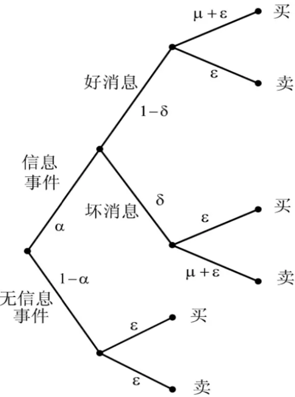
资料来源：招商证券

- 在任意时刻t，预期获利为0的买入价b(t)是做市商以t时刻之前的交易历史和 $\cdot S_{t}$ 为条件对资产的期望价值。因此，在第i个交易日内t时刻的买入价为：

$$
b(t)=\frac{P_{n}(t)\varepsilon V_{i}^{*}+P_{b}(t)(\varepsilon+\mu)\underline{V_{i}}+P_{g}(t)\varepsilon\overline{V_{i}}}{\varepsilon+P_{b}(t)\mu}
$$

- 在一系列的假设和推导下，建立似然函数，并用实际观测数据对似然函数中的参数进行估计：

$$
\mathrm{L}((\mathtt{B},\mathtt{S})|\theta)=(1-\alpha)*e^{-\varepsilon T}\frac{(\varepsilon T)^{B}}{B!}e^{-\varepsilon T}\frac{(\varepsilon T)^{S}}{S!}
$$

$$
+\alpha\delta*e^{-\varepsilon T}\frac{(\varepsilon T)^{B}}{B!}e^{-(\mu+\varepsilon)T}\frac{[(\mu+\varepsilon)T]^{S}}{S!}
$$

$$
+\alpha(1-\delta)*e^{-(\mu+\varepsilon)T}\frac{[(\mu+\varepsilon)T]^{B}}{B!}e^{-\varepsilon T}\frac{(\varepsilon T)^{S}}{S!}
$$

- 知情交易者到达的概率（PIN）为：

$$
PIN=\frac{\alpha\mu}{\alpha\mu+2\varepsilon}
$$

- 由于PIN方式模型复杂，计算繁琐，在实际操作难度大，因而一直以来都没有被广泛应用。Easley等在2012年又提出了基于量钟的衡量方式，VPIN是PIN的近似计算，但是在形式上简单得多，克服了在交易量很大的市场里估计 PIN 的困难，具备实际操作性，VPIN模型得到广泛使用，用于对市场流动性风险进行预测和预警。

$$
VPIN=\frac{\alpha\mu}{\alpha\mu+2\varepsilon}\approx\frac{1}{N}{\sum_{\tau=1}^{N}}|V_{\tau}^{S}-V_{\tau}^{B}|/V
$$

- 其中：

$$
\begin{array}{r}{V_{\tau}^{B}=\sum_{i=t(\tau-1)+1}^{t(\tau)}V_{i}Z\left(\frac{P_{i}^{E}-P_{i}^{B}}{\sigma_{\Delta P}}\right)}\end{array}
$$

“慧博资讯”专业的投资研究大数据分享平 $\begin{array}{r}{\underset{\tau}{\underbrace{V^{S}}}=\sum_{i=t(\tau-1)+1}^{t(\tau)}V_{i}\left[1-Z\left(\frac{P_{i}^{E}-P_{i}^{B}}{\sigma_{\Delta P}}\right)\right]=V-V_{\tau}^{B}}\end{array}$

## 指令流毒性（VPIN）的现实含义

$$
VPIN=\frac{\alpha\mu}{\alpha\mu+2\varepsilon}\approx\frac{1}{N}{\sum_{\tau=1}^{N}}|V_{\tau}^{S}-V_{\tau}^{B}|/V
$$

- 其中：

$$
\begin{array}{r}{V_{\tau}^{B}=\sum_{i=t(\tau-1)+1}^{t(\tau)}\boxed{V_{i}Z\left(\frac{P_{i}^{E}-P_{i}^{B}}{\sigma_{\Delta P}}\right)}.}\end{array}
$$

$$
\begin{array}{r}{V_{\tau}^{S}=\sum_{i=t(\tau-1)+1}^{t(\tau)}V_{i}\left[1-Z\left(\frac{P_{i}^{E}-P_{i}^{B}}{\sigma_{\Delta P}}\right)\right]=V-V_{\tau}^{B}}\end{array}
$$

- 其中t(τ)为第τ个区间内最后的时间间隔， $V_{i}$ 是第τ个区间中第i个时间间隔内的成交量，$P_{i}^{B}$ 和 $P_{i}^{E}$ 分别是第i个时间间隔开始和结束时的最新交易价格， $\sigma_{\Delta P}$ 为不同时间间隔开始到结束时价格变化的标准差，Z是标准正态分布的累积分布函数(CDF)。

- 从直观逻辑来看， $V_{\tau}^{B}$ （买方驱动成交量）和 $V_{\tau}^{s}$ （卖方驱动成交量）其实是单位成交量和价格变动幅度的加权之和，价格波动幅度越大则说明知情交易者存在的可能性就越大。如果在一个时间间隔内价格从 起点到终点没有发生变化，则认为在这个时间间
隔内买卖双方的市场势力对等。

点击进入hp/wwjbo.com.cn

## 个股VPIN可能影响未来收益

- 我们认为知情交易的存在会影响个股后市的表现：

- 猜想之一：知情交易者的加入会增加市场对该只个股的关注度，过分炒作会偏离股票的真实价值，未来将利空。

- 猜想之二：知情交易者过多的股票被视为“妖股”，不被机构等大型投资者（大资金）看好，对股票价值本身是一种伤害。

- 为了验证 VPIN 指标选股能力的有效性，我们对沪深300的历史成分股进行测试，探究知情交易是否会影响个股未来的收益，即探究 VPIN 指标是不是一个有效的选股因子。

## 样本个股 VPIN 计算

- 观测窗口：我们选择了2015年1月5日至2020年5月26日作为观测窗口期。

- 样本选择：选取2015年以来的沪深300指数成分股并集共643只A股股票，剔除ST股票和上市不足20个交易日的个股。

- 数据频率：我们使用样本个股在观测窗口期内的分钟级别数据，计算样本个股的VPIN值。

$$
VPIN\approx\frac{1}{N}{\sum_{\tau=1}^{N}}|V_{\tau}^{S}-V_{\tau}^{B}|/V.
$$

- 对于参数V 和N，我们参照Easley, Kiefer & $0^{\prime}$ ’hara (2011b)的做法，将V设定为样本期内日均成交量的五十分之一， 单位为股（按单边交易计算），同时取N = 50 。

- “高频数据，低频信号“，月末交易日取月度均值，作为月频因子暴露度。

- $V_{\tau}^{B}$ （买方驱动成交量）和 $|V_{\tau}^{S}|$ （卖方驱动成交量）需要在单个交易量篮子中计算，因而我们要先根据日均成交量的五十分之一来划分交易篮子。

## VPIN计算方式示意（“篮子”的划分）

“篮子” (Volume Bucket)划分示意表格（截取600000.SH部分交易数据）

| τ | 截止时间 | 开盘价 | 收盘价 | 第N个“篮子” | VB τ | V |
| --- | --- | --- | --- | --- | --- | --- |
| 1 | 2015/2/11 13:03 | 14.36 | 14.37 | 7862 | 229741.985 | 1203862.01 |
| 2 | 2015/2/11 13:10 | 14.36 | 14.37 | 7863 | 872439.746 | 718127.254 |
| 3 | 2015/2/11 13:16 | 14.36 | 14.35 | 7864 | 495298.158 | 851726.842 |
| 4 | 2015/2/11 13:19 | 14.33 | 14.32 | 7865 | 383075.626 | 1387436.37 |
| 5 | 2015/2/11 13:24 | 14.33 | 14.33 | 7866 | 792554.98 | 702204.02 |
| 6 | 2015/2/11 13:27 | 14.36 | 14.36 | 7867 | 1231358.75 | 354809.249 |
| 7 | 2015/2/11 13:29 | 14.37 | 14.4 | 7868 | 900475.612 | 193129.388 |

资料来源：招商证券

- 每个篮子拥有相似的成交量V （本例中约为650万股），而跟传统的按时间划分交易数据有本质的区别。量钟分类法比传统始终分类更加有效。高频交易的性质决定信息并非均匀等速到达市场，有的信息由于更加重要从而引发了更多的交易量，不同时间
博资讯”段含有信息量不恒定，相对于传统时钟模型量钟模型给信息量大的时间段更多的权重。
点击进入yhttp.//wwwhibor.com.cn- 12 -

## VPIN统计量与股价变动的关系

VPIN与价格走势（示例：600006.SH, 东风汽车 ，2014-12-11至2020-05-26）
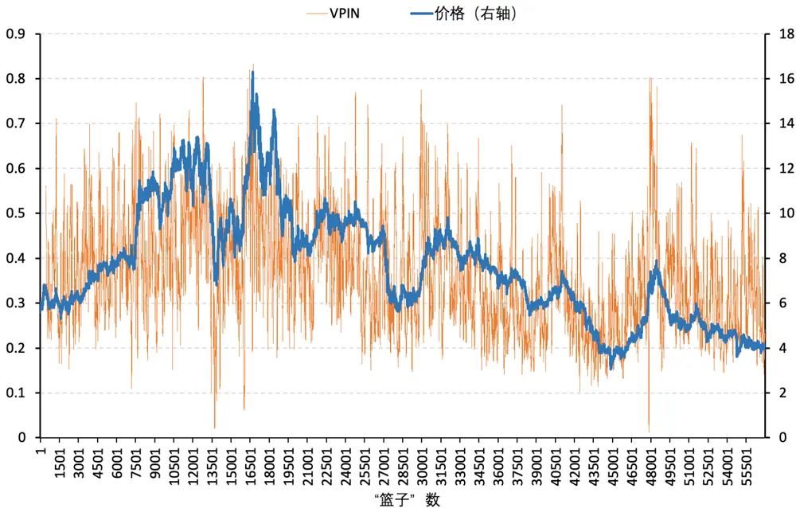
资料来源：招商证券

- VPIN值按照“篮子”个数为单位统计，并且在股价发生快速变动的时候出现高值。

## VPIN统计量分布图

VPIN原始值分布（示例：600006.SH, 东风汽车 ，2014-12-11至2020-05-26）

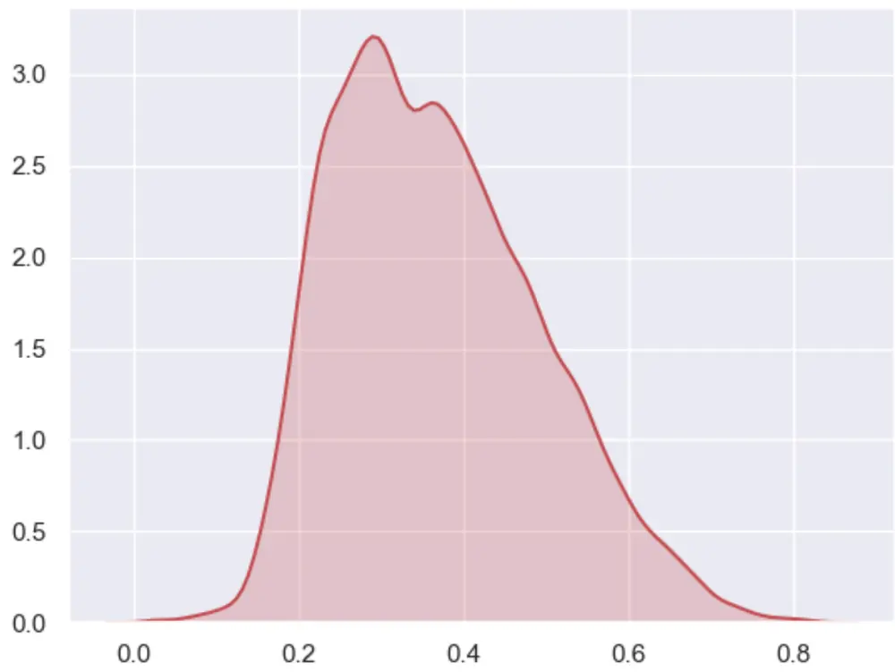
资料来源：招商证券

## VPIN因子（原始）多空组合收益

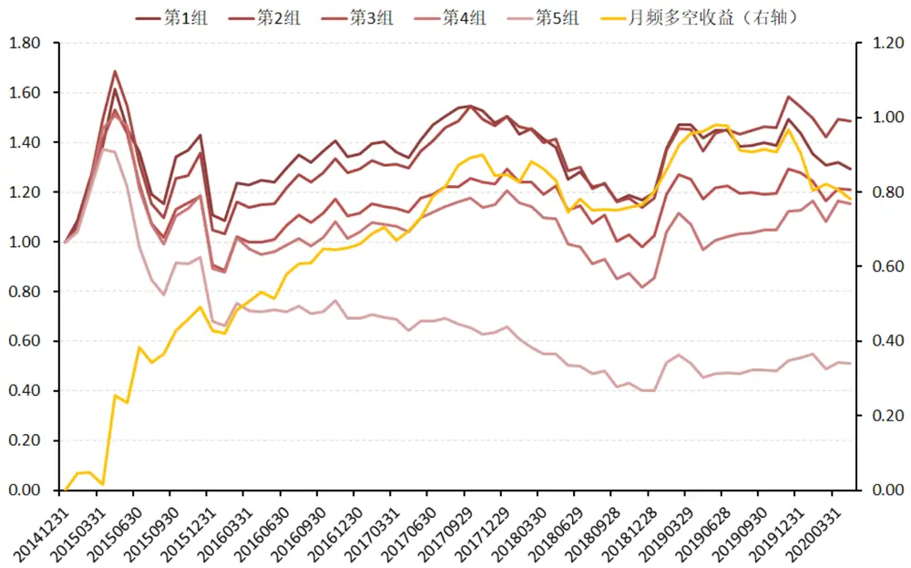
资料来源：招商证券 2015-01-31至2020-04-30

- 将样本个股在月末交易日按照VPIN因子的原始暴露值进行从小到大排序，将可计算个股等分5组，月频调仓，组内等权配置。并做多第1组（VPIN值最小），做空第5组（VPIN值最大） ，得到多空组合，并计算因子的多空组合收益。

- 因子单调性较好、过去5年半时间多空组合获取收益78%。

## VPIN因子分组业绩表

VPIN因子分组业绩表现

|  | 总收益 | 年化收益 | 年化波动 | Sharpe 比率 | 最大回撤 | 年化超额 收益 | 信息比率 |
| --- | --- | --- | --- | --- | --- | --- | --- |
| 第1组 | 29.23% | 4.93% | 43.59% | 0.067 | 32.94% | 3.23% | 0.084 |
| 第2组 | 48.55% | 7.70% | 52.72% | 0.108 | 38.85% | 6.20% | 0.172 |
| 第3组 | 20.90% | 3.62% | 40.23% | 0.040 | 42.28% | 1.83% | 0.073 |
| 第4组 | 15.47% | 2.73% | 45.14% | 0.016 | 45.79% | 0.87% | 0.028 |
| 第5组 | -48.89% | -11.83% | 76.13% | -0.182 | 70.93% | -15.63% | -0.206 |
| 月频多空 | 78.12% | 11.43% | 86.94% | 0.108 | 10.01% | 10.14% | 0.110 |
| 沪深300 | 10.72% | 1.93% | 38.60% | -0.002 | 40.56% | 一 | 1 |

资料来源：招商证券 2015-01-31至2020-04-30

## VPIN因子rank_IC计算

VPIN因子IC分布走势（沪深300成分股）
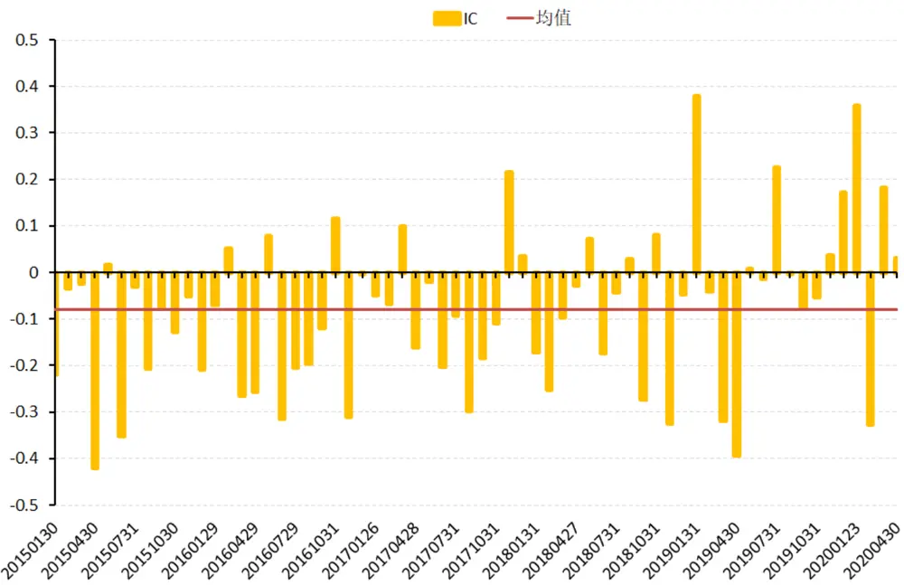

资料来源：招商证券 2015-01-31至2020-04-30

| 样本空间 IC均值 IC最大值 IC最小值 IC标准差 IR IC t值 有效期数 平均个数 |
| --- |
| -0.4202 0.1720 -0.4653 -3.7223 “慧博资沪深3业的投资研究大8分享平03781 64 299.8 |

## VPIN因子在市值上的分布

VPIN因子与在各市值区间股票中的分布

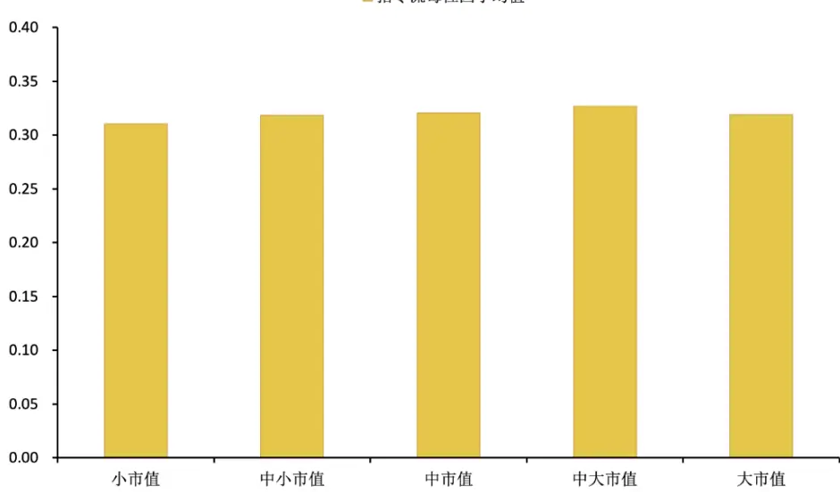
资料来源：Wind资讯、招商证券 2015-01-31至2020-04-30
因子与流通市值的 spearman 相关系数走势

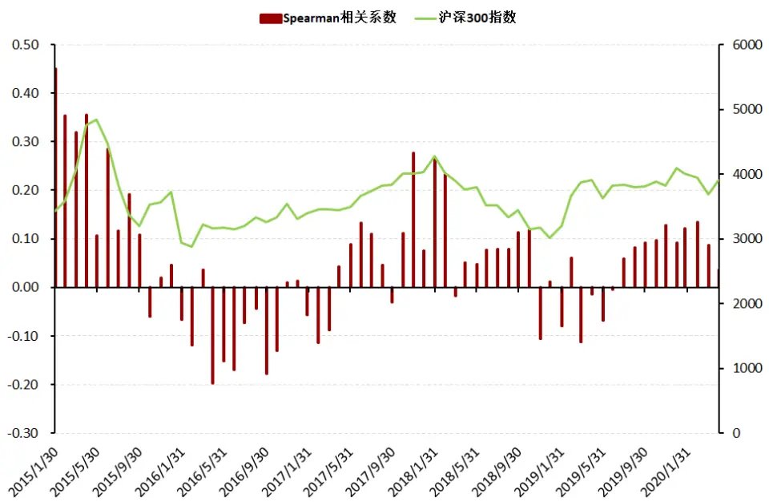

- 我们计算了VPIN因子在各市值区间个股上的分布（注意样本股票均为历史上的沪深300成分股），整体来看，在各市值区间上的因子值分布差异并不显著。

- 我们又计算了VPIN因子与流通市值的spearman相关系数走势，在2015年和2017年、2018年、2020年呈现弱正相关；而在其他年份为弱负相关。

## VPIN因子中信一级行业分布

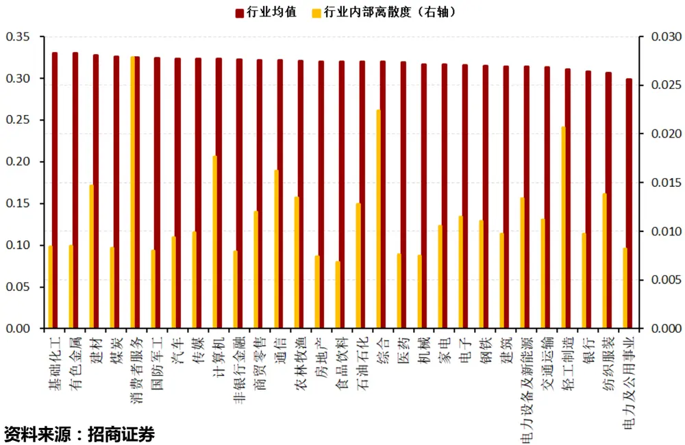

- 我们同样计算了VPIN因子在中信一级行业（暂不考虑新增的“综合金融”）上的分布差异，整体来看，在各中信一级行业上的因子值分布差异也不显著。

- 在各行业内部，我们计算了VPIN值的历史波动，消费者服务、综合轻工制造等波幅居前、食品饮料、房地产等波幅靠后。

## VPIN因子（中性化）多空组合收益

资料来源：招商证券 2015-01-31至2020-04-30

- 对VPIN因子进行行业和中性化处理之后，多空净值的走势没有明显收窄，同时波动率比原值因子有所减小。

- 中性化因子因子单调性良好，过去5年半时间多空组合获取收益78%，且有29%来自多头端，多头端收益明显提升。

## VPIN因子（中性化）分组业绩表

VPIN因子（市值、行业中性化之后）分组业绩表现

|  | 总收益 | 年化收益 | 年化波动 | Sharpe 比率 | 最大回撤 | 年化超额 收益 | 信息比率 |
| --- | --- | --- | --- | --- | --- | --- | --- |
| 第1组 | 34.59% | 5.73% | 42.86% | 0.087 | 33.78% | 4.09% | 0.118 |
| 第2组 | 10.20% | 1.84% | 41.67% | -0.004 | 41.52% | -0.10% | -0.003 |
| 第3组 | 26.28% | 4.47% | 44.71% | 0.055 | 40.74% | 2.75% | 0.106 |
| 第4组 | 3.26% | 0.60% | 43.82% | -0.032 | 48.47% | -1.44% | -0.043 |
| 第5组 | -27.26% | -5.79% | 66.77% | -0.117 | 63.61% | -8.57% | -0.130 |
| 月频多空 | 61.85% | 9.45% | 70.33% | 0.106 | 8.12% | 8.05% | 0.106 |
| 沪深300 | 10.72% | 1.93% | 38.60% | -0.002 | 40.56% | - | 一 |

资料来源：招商证券 2015-01-31至2020-04-30

## VPIN因子与其他因子的相关性

VPIN因子与其他因子的的spearman相关系数均值

|  | VPIN 因子 | 流通市值 对数 | BP因子 | 20日波动率20日均换手 20日动量 收益偏度 |
| --- | --- | --- | --- | --- |
| VPIN 因子 | 1.0000 |  |  |  |
| 流通市值 对数 | 0.0544 | 1.0000 |  |  |
| BP因子 | -0.1493 | 0.0249 | 1.0000 |  |
| 20日波动率 | 0.5733 | -0.1422 | -0.3670 1.0000 |  |
| 20日均换手 | 0.5755 | -0.3364 | -0.3241 0.6397 | 1.0000 |
| 20日动量 | 0.2448 | 0.1029 | -0.1093 0.1771 | 0.0982 1.0000 |
| 收益偏度 | -0.0059 | 0.0813 | -0.0623 0.0146 | -0.0041 0.0200 1.0000 |

资料来源：招商证券 2015-01-31至2020-04-30

- 我们计算了VPIN因子与其他重要量价因子的spearman相关系数，发现与波动率因子、换手率（流动性）因子有较高的相关性。而与市值因子、收益偏度因子以及20日动量因子、BP因子的相关系数较小。

- 为此，我们将对因子进行独立性考察，看剔除相关因子之后是否依旧有较强的选股能力。

## 剥离相关因子

波动率因子在沪深300历史成分股中的选股能力较弱
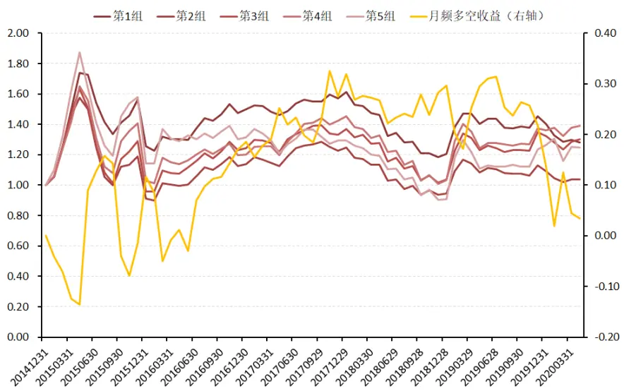
换手率因子在沪深300历史成分股中的多空表现
资料来源：招商证券 2015-01-31至2020-04-30

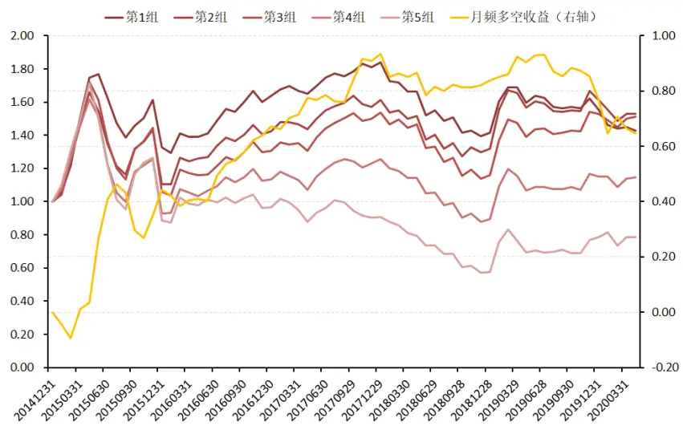

- 由于VPIN因子与波动率及流动性因子有较强的相关性，因而VPIN因子的选股能力可能与其他常用因子的选股能力有所重叠，为了验证这一点，我们在每期横截面上对VPIN因子进行因子剥离，看剥离其他因子（标准化）之后的因子是否依然具备选股能力。

$$
VPIN=\beta_1lnCap_i+\beta_2BP_i+\beta_3Std20D_i+\beta_4Turnover20D_i
$$

“慧博资讯”专业的投资研究大数据分享平台 $+\beta_{5}Mom_{-}20D_{i}+\sum\beta_{n}Industry_{i,n}+\varepsilon_{i}$ 点击进入http/twwjbo.comn.cn

## 剥离相关因子之后依然具备选股能力

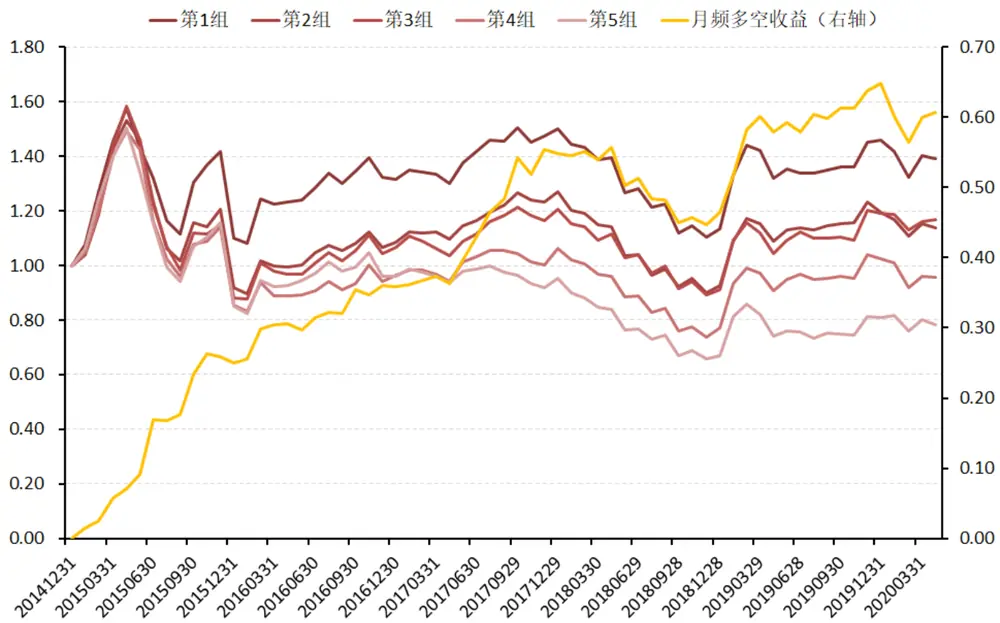
资料来源：招商证券 2015-01-31至2020-04-30

- 从月频的多空组合来看，在剥离了波动率、换手率和动量因子之后，VPIN因子依然具备不错的选股能力。

- 单调性略有衰减，多空组合的收益约为61%，同时近期的回撤有所减小。

## VPIN因子（剥离相关因子）分组业绩表

VPIN因子（剥离相关因子之后）分组业绩表现

|  | 总收益 | 年化收益 | 年化波动 | Sharpe 比率 | 最大回撤 | 年化超额 收益 | 信息比率 |
| --- | --- | --- | --- | --- | --- | --- | --- |
| 第1组 | 34.59% | 5.73% | 42.86% | 0.087 | 33.78% | 4.09% | 0.118 |
| 第2组 | 10.20% | 1.84% | 41.67% | -0.004 | 41.52% | -0.10% | -0.003 |
| 第3组 | 26.28% | 4.47% | 44.71% | 0.055 | 40.74% | 2.75% | 0.106 |
| 第4组 | 3.26% | 0.60% | 43.82% | -0.032 | 48.47% | -1.44% | -0.043 |
| 第5组 | -27.26% | -5.79% | 66.77% | -0.117 | 63.61% | -8.57% | -0.130 |
| 月频多空 | 61.85% | 9.45% | 70.33% | 0.106 | 8.12% | 8.05% | 0.106 |
| 沪深300 | 10.72% | 1.93% | 38.60% | -0.002 | 40.56% | – | 1 |

资料来源：招商证券 2015-01-31至2020-04-30

## VPIN因子的自相关性（调仓成本）

量价类因子暴露度自相关系数比较

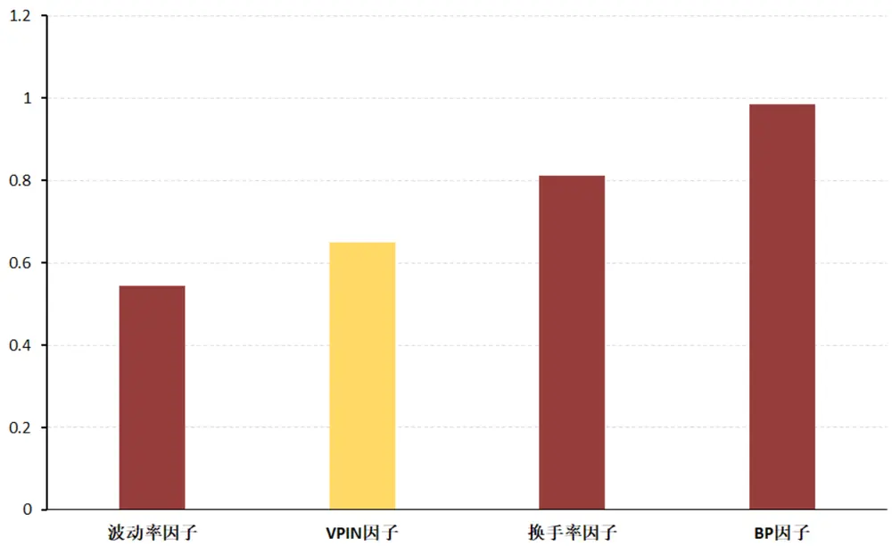
资料来源：Wind资讯、招商证券

- 我们统计比较了3个量价类因子和1个基本面因子的自相关系数（T月与T+1月）的均值，发现VPIN的自相关系数间于波动率因子和换手率因子之间。

- 可以大致反映VPIN因子的调仓成本。

## 总结

- 市场微观结构理论认为，信息是影响市场上投资者交易行为的重要因素之一。Easley等（2012）利用高频数据直接对交易环境下知情交易的概率进行估计（VPIN）。

- 我们根据VPIN的计算方式构建了 VPIN 因子，并在沪深300历史成分股中进行因子测试。

- VPIN因子的原始因子和中性化因子均具有较好的选股能力。在沪深300成分股内，观测期rank_IC均值绝对值为0.08，IR为0.47，近五年来，多空组合收益78%；沪深300历史成分股内， rank_IC均值绝对值为0.09，IR为0.60。

- 我们计算了VPIN因子与其他重要量价因子的spearman相关系数，发现与波动率因子、换手率（流动性）因子有较高的相关性。

- 我们在每期横截面上对VPIN因子进行因子剥离，剥离其他因子（标准化）之后因子依然具备较好的选股能力。近五年来，多空组合的收益约为61.85%，且大部分来自多头端的收益。

## 分析师承诺

负责本研究报告的每一位证券分析师，在此申明，本报告清晰、准确地反映了分析师本人的研究观点。本人薪酬的任何部分过去不曾与、现在不与，未来也将不会与本报告中的具体推荐或观点直接或间接相关。

任瞳：首席分析师，定量研究团队负责人，管理学硕士，16年证券研究经验，2010年、2015年、2016、2017年新财富最佳分析师。在量化选股择时、基金研究以及衍生品投资方面均有深入独到的见解。

崔浩瀚：量化分析师，浙江大学经济学硕士，3年量化策略研究开发经验。研究方向是机器学习在金融领域的应用和多因子选股策略开发。

## 投资评级定义

## 公司短期评级

以报告日起6个月内，公司股价相对同期市场基准（沪深300指数）的表现为标准：

强烈推荐：公司股价涨幅超基准指数20%以上

审慎推荐：公司股价涨幅超基准指数5-20%之间

中性：公司股价变动幅度相对基准指数介于±5%之间

回避：公司股价表现弱于基准指数5%以上

## 公司长期评级

A：公司长期竞争力高于行业平均水平

B：公司长期竞争力与行业平均水平一致

C：公司长期竞争力低于行业平均水平

## 行业投资评级

以报告日起6个月内，行业指数相对于同期市场基准（沪深300指数）的表现为标准：

推荐：行业基本面向好，行业指数将跑赢基准指数

中性：行业基本面稳定，行业指数跟随基准指数

回避：行业基本面向淡，行业指数将跑输基准指数

## 重要声明

本报告由招商证券股份有限公司（以下简称“本公司”）编制。本公司具有中国证监会许可的证券投资咨询业务资格。本报告基于合法取得的信息，但本公司对这些信息的准确性和完整性不作任何保证。本报告所包含的分析基于各种假设，不同假设可能导致分析结果出现重大不同。报告中的内容和意见仅供参考，并不构成对所述证券买卖的出价，在任何情况下，本报告中的信息或所表述的意见并不构成对任何人的投资建议。除法律或规则规定必须承担的责任外，本公司及其雇员不对使用本报告及其内容所引发的任何直接或间接损失负任何责任。本公司或关联机构可能会持有报告中所提到的公司所发行的证券头寸并进行交易，还可能为这些公司提供或争取提供投资银行业务服务。客户应当考虑到本公司可能存在可能影响本报告客观性的利益冲突。

本报告版权归本公司所有。本公司保留所有权利。未经本公司事先书面许可，任何机构和个人均不得以任何形式翻版、复制、引用或转载，否则，本公司将保留随时追究其法律责任的权利。

## 8888

## 感谢聆听

Thank You

招商定量研究&基金评价公众号