# 高频数据中的知情交易（二）

专题报告

2020 年6 月30 日

## 美国股指期货的 VPIN走势

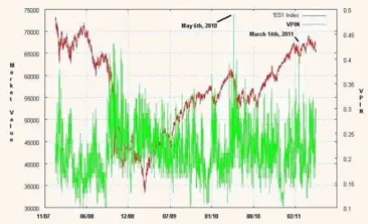

## “琢璞”系列报告之十七

不论是在国内还是在海外，对于知情交易者的追踪向来是投资者关心的话题。在“琢璞”系列的第二篇中，我们详细介绍了用 PIN 方法来衡量市场中知情交易者存在的可能性（或者“指令流毒性”）。但是 PIN 方法存在的缺点也很明显，模型复杂，对算力和数据的要求高。2012年，原作者改进了对于知情交易者衡量的方式，提出了VPIN 的衡量方法，该方法牺牲了一些准确性，但是却极大地提升了模型在实际应用中的可操作性。本期琢璞我们推荐David, E. , López de Prado Marcos M, & Maureen, O. 的《Flow toxicity and liquidity in ahigh-frequency world》，来详细介绍用 VPIN 方式衡量指令流毒性。

- 知情交易者可以利用不知情交易者。在美股市场，每只股票都有一个以上的做市商提供流动性。而当知情交易者的指令流逆向选择做市商时，被认为是有毒性的，并且做市商可能并未意识到他们在提供流动性的同时也在遭受着损失。

- 当察觉到有较多知情交易者存在时，做市商可能会离场，这对流动性会带来危害，引发市场的闪崩。

- 基于交易量不平衡与交易强度（VPIN 指令流毒性指标），文章提出了一种新的方法以估算信息交易的概率。VPIN 基于交易量时间（volume-time）而不是时钟时间为基准来更新，使其可在高频交易领域内进行应用。

- 估算 VPIN 指标并不需要对一些不可观测的描述指令流的或者数值方法的中间参数进行估计，但其需要输入交易类型是买入还是卖出。基于一种文章认为比逐笔分类（tick-by-tick classification）更为适用于高频交易的新的量钟（bulk volume）分类方法，文章对交易进行分类。结果表明 VPIN 指标是一个更为有效的反应短期毒性诱导波动率的指标。

任瞳

86-755-83081468

rentong@cmschina.com.cn

S1090519080004

崔浩瀚

- 在高频交易的世界，指令流毒性影响着做市商活动的规模和范围，而高水平的VPIN 意味着后续价格大幅波动的风险，这种基于流动性的风险对于直接承担毒性影响的做市商很重要，而对于面临毒性导致价格大幅变动的交易员也同样重要。

86-21-68407276

- 总体而言，在高频市场当中，无论是对投资者还是监管部门，VPIN 可以作为一个比较有效的风险管理工具。

cuihaohan@cmschina.com.cn

S1090519070004

敬请阅读末页的重要说明

## 一、引言

指令流毒性是市场微观结构中重要的概念，美股市场的股票都会安排一个以上的做市商来为市场提供流动性。当市场上出现较多知情交易者逆向选择做市商来牟取利润的时候，做市商会选择离开市场，使市场流动性受到损害，继而引发极端事件。

对于指令流毒性的衡量经历了从 PIN 到VPIN的演变，我们在琢璞系列二中详细介绍了PIN方式衡量知情交易者的方法（在 1996 年提出），该方式虽然有完备的理论基础，但是在测算上存在较大难度，对于数据质量和算力的要求也较高，在当时没有引起市场的广泛关注。2012 年，三位作者又对 PIN 指标进行了改进，剔除了 VPIN 测量方式，这使得衡量的难度大幅减小，实际操作变得可能。

本期琢璞我们推荐 David, E. , López de Prado Marcos M, & Maureen, O. 的《Flowtoxicity and liquidity in a high-frequency world》，来详细介绍用 VPIN 方式衡量指令流毒性。

## 二、文章主要内容

## 1. 文章背景

高频交易公司约占美国市场 20000家交易公司的2%，但自从2009 年开始，其贡献了美国股票市场超过 70%的交易量与期货市场接近 50%的交易量（Iati [2009], CFTC[2010]）。这些高频交易公司常常扮演做市场的角色，通过电子订单簿提供不同的被动指令并为头寸持有者提供流动性。被动指令被定义为不跨市场的指令，因此发起人无法直接控制其执行时间。高频交易公司通常不对任何方向的头寸下注，其盈利主要来源于大量交易下的微小的价差。他们这样做主要源于要控制头寸风险，控制该风险的能力受到在执行被动指令时他们控制逆向选择的能力的影响。

逆向选择在业界中通常被表述为“被动指令在应该缓慢执行时被迅速执行，而在应该迅速执行时被缓慢执行或不执行的自然趋势”（Jeria and Sofianos [2008]）。这种直观的表述与市场微观结构模型相一致（参见 Glosten and Milgrom [1985]，Kyle [1985] andEasley and O'Hara [1987，1992b]），从而使知情交易者可以利用不知情交易者。而当指令流逆向选择做市商时，被认为是有毒性的，并且做市商可能并未意识到他们在提供流动性的同时也在遭受着损失。

基于交易量不平衡与交易强度（VPIN指令流毒性指标），文章提出了一种新的方法以估算信息交易的概率。VPIN基于交易量时间（volume-time）而不是时钟时间为基准来更新，使其可在高频交易领域内进行应用。估算VPIN 指标并不需要对一些不可观测的描述指令流的或者数值方法的中间参数进行估计，但其需要输入交易类型是买入还是卖出。基于一种文章认为比逐笔分类（tick-by-tick classification）更为适用于高频交易的新的量钟（bulk volume）分类方法，文章对交易进行分类。结果表明VPIN指标是一个更为有效的反应短期毒性诱导波动率的指标。

文章对高频交易中指令流毒性及其影响的分析与近年来一些跨市场的高频交易研究相关。Hendershott 和 Riordan [2009]展示了高频交易在德意志交易所的应用。Brodegaard[2010]和Hasbrouck和Saar [2010]分析了高频交易者在美国股票市场中的作用和策略。

Kirilenko，Kyle，Samadi 和 Tuzun [2010]广泛地描述了高频交易者和其他市场参与者在标准普尔 500 期货市场中的行为。越来越多的文献开始关注交易计算机化与高频交易对流动性的影响。Hendershott，Jones 和 Menkveld [2011]通过研究算法交易与流动性之间的经验关系，发现算法交易可以提高高市值股票的流动性。Chaboud，Chiquoine，Hjalmarsson 和 Vega [2009]对外汇交易中算法交易的影响进行了类似的分析。这些分析补充了最近有关流动性和市场脆弱性之间关系的理论研究（参见 Brunnermeir andPedersen [2009], and Huang and Wang [2011]）。

本文主要结构如下。第 1 节讨论了基本方法的理论框架并说明了 PIN 如何影响买卖价差。第 节介绍了估算 指标的过程。第 节评估了 指标的稳健性。第 节对股票指数和石油期货的VPIN 指标进行了估算。第5节讨论了VPIN指标对波动性的预测性质。第6 节总结了文章的发现与结论。技术附录提供了用于计算VPIN 毒性指标的伪代码及其 Monte Carlo 模拟的准确性。

## 2. 模型介绍

Easley 等人在一系列论文中介绍了微观结构模型如何通过使用交易数据来确定单个股票的PIN指标。这一微观结构模型将交易视作流动性提供者与交易者（头寸持有者）之间的博弈，并在所有交易阶段 $i=1,\dots,I$ 内不断重复。在每个阶段的开始。环境都会决定是否一个包含信息的事件会发生。这些事件以α的概率随机发生且相互独立。如果该信息是个好消息，那么知情交易者将会知道在这一交易阶段临近结束时，标的资产将会价值 $\bar{S_{i}}$ 。如果该信息是个坏消息，那么标的资产将会价值 $\underline{{S}}_{i}\underline{{\operatorname{FL}}}\bar{S}_{i}>\underline{{S}}_{i}$ 。好消息出现的概率是 $.1-\delta_{\mathrm{{\scriptsize~\cdot}}}$ ，坏消息出现的概率为 $\delta_{\circ}$ 。在一个信息事件发生或不发生后，交易阶段开始，并且交易指令将会依照Poisson过程到达。在一个发生了信息事件的交易阶段内，知情交易者的指令将会以到达强度 $\mathbf{\nabla}_{\cdot}\mu$ 到达。这些交易者如果见到好消息将会买入，见到坏消息将会卖出。而每一交易阶段中，不知情交易的买家和不知情的卖家指令将会以到达强度ε到达。

结构模型将可见市场行为（买与卖）和交易中不可见信息及指令到达过程相关联起来。先前的研究主要集中在如何通过最大似然估计估算这些隐含参数。直观来讲，这一模型将普通买卖行为阐释为不知情交易，并且用该数据计算不知情指令流强度ε。异常买卖行为被解释为知情交易，并且用该数据计算 $\cdot\mu.$ 。而存在异常交易买卖量的交易阶段数量则被用于计算α和δ。

流动性提供者通常利用对这些参数的理解决定其自身的提供的买入价（bid）与卖出价（ ）。而卖出价与买入价存在价差，因为流动性提供者不知道对手方是知情交易者还是不知情交易者。这一价差可以由标的资产对想从流动性提供者处买入的价格条件期望与对想向流动性提供者卖出的价格条件期望的差值计算得出。这两个条件期望不同的主要原因是逆向选择导致的更好的知情交易者出现的可能性。

随着交易的进行，流动性提供者会对交易行为进行建模并利用贝叶斯公式对指令流毒性参 数 进 行 更 新 ， $\hslash$ 在 文 章 的 模 型 中 ， 这 一 过 程 被 称 为 参 数 估 计 。 令$P(t)=\Big(P_{n}(t),P_{b}(t),P_{g}(t)\Big)$ 作为流动性提供者对于“无消息”（n），“坏消息”（b）以及“好消 $\therefore\frac{A}{A}\because(g)$ 在时间点t的判断。其在 0时间点的判断为 $(1-\alpha,\alpha\delta,\alpha(1-\delta))$ )。

为了决定在时间点t的买入价与卖出价。流动性提供者将会依据指令流到达的条件期望

更新其判断。因此，t时间基于过去交易的资产价格条件期望为

$$
E[S_{i}|t]=P_{n}(t)S_{i}^{*}+P_{b}(t)\underline{{S}}_{i}+P_{g}(t)\bar{S}_{i}\#(1)
$$

其中 $S_{i}^{*}=\delta S_{i}+(1-\delta)\bar{S}_{i}$ 是先验期望资产价格。

买入价是当有交易者想把资产卖给流动性提供者时的资产价格的条件期望值

$$
B(t)=E[S_{i}|t]-\frac{\mu P_{b}(t)}{\varepsilon+\mu P_{b}(t)}\big(E[S_{i}|t]-\underline{{S}}_{i}\big)\#(2)
$$

同样地，卖出价是当有交易者想向流动性提供者买入资 $\dot{\bar{y}}$ 时的资产价格的条件期望值

这些等式明确阐述了知情和不知情交易者的到来对做市商报价的影响。如果没有知情交易者 $(\mu=0)$ ），则交易不包含任何信息，因此买价和卖价都等于资产的先验期望值。或者，如果没有不知情的交易者 $(\varepsilon=0)$ ），则买价和卖价分别处于最小和最大价格。基于这些价格，没有知情交易者会进行交易，而市场实际上也关闭了。通常，知情交易者和不知情交易者都会参与市场，因此买价会小于 $E\left[S_{i}|t\right]\sqrt{n}$ 卖出价大于 $E[S_{i}|t]$ 。

t时间的价差可以被表述为 $\Sigma(t)=A(t)-B(t)$ ，即

$$
\Sigma(t)=\frac{\mu P_{g}(t)}{\varepsilon+\mu P_{g}(t)}(\bar{S}_{i}-E[S_{i}|t])+\frac{\mu P_{b}(t)}{\varepsilon+\mu P_{b}(t)}\big(E[S_{i}|t]-\underline{{S}}_{i}\big)\mathrm{.}\tag{#(4}
$$

价差方程中的第一项是基于信息的买入交易概率乘以对知情买家的预期损失，第二项是对于知情卖家的对称项。在最初的交易时段报价价差Σ，假设好事件和坏事件发生概率相同，即 $\delta=1-\delta$ ，因此有着非常简单的形式

$$
\Sigma=\frac{\alpha\mu}{\alpha\mu+2\varepsilon}\big(\bar{S}_{i}-\underline{{S}}_{i}\big)\#(5)
$$

这一模型的关键组成部分是指令来自知情交易者的概率，也就是所谓的PIN。因此可以很直接地写出某个时期的期初交易是基于信息的概率为：

$$
PIN=\frac{\alpha\mu}{\alpha\mu+2\varepsilon}\#(6)
$$

其中， $\alpha\mu+2\varepsilon$ 是所有指令到达率， $\alpha\mu.$ 是信息指令到达率。因此 PIN 是对知情交易者指令在总指令流中占比的度量，并且价差方程表明该指标是价差的关键决定因素。

这些等式说明了流动性提供者需要正确估算PIN以确定最优价格来参与市场交易。PIN指标的意外增加将使那些未调整价格的做市商亏损。

## 3. VPIN指标和参数估计

计算 PIN 模型的标准方法是使用最大似然估计来确定驱动交易的随机过程中的不可观测参数 $(\alpha,\mu,\delta,\varepsilon)$ ），之后再利用这些参数计算 PIN 指标。在这一节中，文章提出了一种对指令流毒性的直接解析性估计方法，该方法不要求对不可观测参数的数值模拟估计。文章基于交易量时间更新指标以匹配新信息到达市场的速度。这种基于等量方法来计算的指标被文章称为 指标，其为高频交易环境下的毒性提供了一个简单的衡量方法。首先，文章从信息和时间在高频交易中的作用开始讨论。

## 3.1 信息和时间的本质

标准序列交易模型中的信息通常被视为可提供标的资产未来价格信息的数据。在股票市场中，信息可以是公司前景，产品市场等等。在有效市场中，资产价格将会随知情交易者试图利用信息牟利而趋近于包含全部信息的价格。因为做市商可以做多或做空股票，未来资产价格的变化将会影响他们的盈利能力，因此他们会尝试从交易行为中推断出潜在的新信息。他们最新的判断则被包含在他们的买入价和卖出价中。

在高频世界中，做市商面临着同样的基本问题，尽管他们操作的时间与频率以有趣的方式改变了传统。预期持有股票几分钟的高频做市商将会受到该时间段内有关股价的信息影响。这些信息有可能与标的资产价格基础决定因素相关，也有可能与整体市场交易性质的影响因素或一些特定时点的流动性需求相关。举例来说，对于期货合约，导致对冲合约需求增加的信息通常会影响期货价格，因此与该信息与做市商相关。这一对信息的更为广泛的定义意味着信息事件可能在一天中频繁发生，并且它们对于未来价格变动可能具有不同的重要性。尽管如此，它们的存在仍然可以从交易的性质和时机推断而出。

Mandelbrot 和 Taylor [1967]指出，高频建模最重要的一点是交易在时间上的间隔并不相等。交易以不规则的频率到达，并且某些交易比其他交易更重要，因为它们会显示不同数量的信息。例如，如图 1所示，E-mini S＆P 500 期货交易（图表中蓝线和左侧比例尺）和 EUR/USD 期货交易（图表中红线和右侧比例尺）表现出不同的日内周期性。新信息到达市场会触发一系列决策行为，而这些决策将转化为大量的市场交易。与不同产品相关的信息会在不同时间到达，从而产生不同的日内交易量的周期性。

图 1：E-mini S&P期货和 EC1期货的平均日内交易量
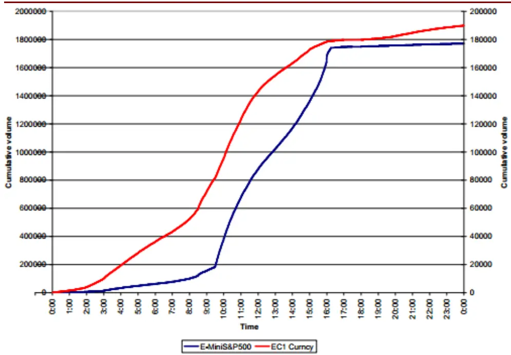
资料来源：《Flow Toxicity and Liquidity in a High Frequency World》、招商证券定量组整理

在本文研究中，文章基于交易量时间而不是时钟时间进行建模。Easley和 O'Hara [1992]曾提出交易指令之前的时间与新信息的存在相关，这也为文章关注交易量时间提供了基础。一般来讲一条消息越相关，其引起的交易量就越大。通过在每次市场交易量相等的情况下抽取样本，文章尝试模拟具有相关性的信息到达市场的情况。如果一条消息的触发的交易量是另一条消息的两倍，文章将采样至原有观察量的两倍，并使其在样本中的权重加倍。

## 3.2 交易篮子

以上例为基础，如果文章从200000个交易合约中抽取一个E-mini S＆P 500期货样本，则平均每天将抽取约 9 个样本。在市场非常活跃的时期，文章将以 9 的倍数进行取样，而在市场不活跃时文章将取更少的数据点。再次注意 EUR/USD 期货合约的日均交易量是 E-mini S＆P 500期货日均交易量的 1/10。因此，如果要每天取9 次样，就需要将两次观察值之间的交易量距离减少至 20000 个合约。由于它们的日内交易模式不同，当文章取第一笔E-mini S＆P 500 当天的期货观察样本时，文章将要取第四份EUR/USD期货的当天观察样本。

为了实现这种与交易量相关的抽样，文章基于外生变量交易数量V将交易序列重新分为一个个等量交易篮子。一个交易篮子是交易量大小为V的许多单笔交易集合。如果组成交易篮子所需的最后一笔交易量大于需求时，多余的量将分配给下一个交易篮子。文章以τ = 1,…,n对交易篮子进行编号。附录中提供了有关交易篮子划分的详细算法。由于交易量不平衡对流动性提供者有着明显的经济意义，基于交易篮子抽样可以使文章可以将交易时段划分为信息可比的时段。

## 3.3 买入量和卖出量分类

一个尚未解决的问题是如何区分买入量和卖出量。交易量的划分是十分必要的，因为它与指令流毒性有潜在的关系。总体交易量水平暗示着新信息的存在，而交易量的方向则暗示着价格变化方向。因此，大量的购买（出售）量代表着由于好消息（坏消息）存在而产生的毒性。

微观结构研究依靠逐笔算法来标记交易。但是，交易分类一直存在缺陷。一个问题是，市场报告方式可能会根据指令的买卖来区别对待指令。例如，如果一个大的卖单与多个买单同时发生，纽约证券交易所将仅报告一项合并交易，但是如果一个大的买单与多个卖单同时发生，纽约证券交易所将报告多个交易。同样，将大指令拆分为多个小指令意味着短时间内发生的交易实际上并不相互独立。因此将短时间内的交易依据方向进行汇总是过去研究人员惯用的处理方法。

第二个困难是对交易的分类还需要将交易价格与当前报价联系起来。交易员接受做市商的买入价（卖出价）就相当于卖方（买方），而介于买入和卖出价之间的交易则用逐笔算法进行分类。Lee-Ready [1991]的算法还建议在报告报价和交易价格之间设置5秒钟的延迟，以应对报价机制与交易报告机制的不同。即使在更简单的专业交易（类似于做市商）领域中，交易分类的错误也很严重。

在高频条件下，交易分类要困难得多。在文章所研究的期货市场中，没有专业交易员，流动性来自电子订单簿上包含多个交易者下达的有限指令。在这个电子市场中，交易者可以按之前一笔交易的价格提交指令，也可以以高出之前一笔交易的价格提交指令，并且逐笔规则通常会将交易划分为错误方向。此外，指令拆分，报价和指令取消十分常见，并且庞大的交易量是往往是压倒性的。根据 2010年5月以来的E-mini S＆P 500期货数据，文章发现平均一天的 2650391次报价变化源于指令增加或取消，789676 次报价变化源于交易。由于最佳买卖价格（BBO）在交易之间发生多次变化，因此实际上许多交易是以相同的价格进行买卖的。在这个高频领域内，将标准逐步算法应用于单个交易是徒劳的。

在文章的分析中，文章将短时间内的交易汇总并使用间隔开始和结束之间的标准化价格变化来确定买卖所占交易量的百分比。合并减轻了指令拆分的影响，并且使用标准化的价格变动可以依据概率项对交易量进行分类（文章称之为量钟分类）。文章使用一分钟为时间间隔来计算买卖量 $(V_{\tau}^{B}\mathcal{\mathrm{\#}}\pi V_{\tau}^{S})$ （稍后文章将展示文章方法和其他时间汇总方法同样有效）。

$$
V_{\tau}^{B}=\sum_{i=t(\tau-1)+1}^{t(\tau)}V_{i}Z(\frac{P_{i}-P_{i-1}}{\sigma_{\Delta P}})
$$

$$
V_{\tau}^{S}=\sum_{i=t(\tau-1)+1}^{t(\tau)}V_{i}\left[1-Z\left(\frac{P_{i}-P_{i-1}}{\sigma_{\Delta P}}\right)\right]=V-V_{\tau}^{B}\#(7)
$$

其中， $t(\tau)$ 是上一个时间间隔的编号，且被告包含在第τ个交易篮子内。Z是标准正态分布的累计分布函数，且 ${\bf\mathcal{\sigma}}_{\Delta P}$ 是对时间间隔之间价格变化标准差的估算。如果一个时间间隔的开始与结束没有价格变化，文章会将时间段中的交易量平均分为买入和卖出量。此外，如果价格上涨，则买入交易量将会大于卖出交易量，且分配的比例取决于价格变化相对于整体价格变化分布的位置。

量钟分类与 Lee-Ready 算法之间的主要区别在于后者将交易量不是标记为买入就是卖出，而前者将交易量拆分为买入部分和卖出部分。换句话说，Lee-Ready算法是离散的分类，而量钟算法是连续的分类。这意味着即使在单个时间间隔充满了一个交易篮子的极端情况下，交易量仍有可能被平衡的分为买入量与卖出量（视 $\cdot\frac{P_{i}-P_{i-}}{\sigma_{\Delta P}}$ 1情况而定）。

文章主要通过交易量计算指令不平衡。令 $OI_{\tau}=|V_{\tau}^{B}-V_{\tau}^{S}|$ 为第τ个交易篮子的指令不平衡程度。由于其基于文章的概率交易量分类法，这种衡量方法当然只是对真实指令不平衡的一种估计方法。文章首先为什么展示 $E[OI_{\tau}]$ 和交易速率关系并不受交易成比例放缩的影响。假设每一个时间间隔内的交易量用因子 $\ B^{\cdot}\beta>0,V_{i}^{*}=\beta V_{i}$ 进行放缩，且交易量不平衡在交易篮子内的分布类似。之后填充交易篮子所需的时间间隔的期望数量将于 $\cdot\beta$ 成反比，即 $\frac{t(\tau)-t(\tau-1)}{\beta}$ 。从等式（7）可得，期望指令不平衡E $[OI_{\tau}]$ 未发生改变，

$$
{\cal E}[OI_{\tau}]={\cal E}[|V_{\tau}^{*B}-V_{\tau}^{*S}|]=\frac{1}{\beta}{\cal E}[|\beta V_{\tau}^{*B}-\beta V_{\tau}^{*S}|]={\cal E}[OI_{\tau}]\#(8)
$$

其次，文章认为在合理的范围内，时间间隔所包含的时间多少对指令不平衡的度量几乎没有影响。为了证明这一点，文章计算了E-mini S＆P 500从2008年 1月1日至 2011年 8 月 15 日期间的指令不平衡程度，并使时间间隔所包含的时间范围从 1分钟到 240分钟不等。对于每种时间栏间隔，文章每天基于 50 个交易篮子计算指令不平衡程度对于交易篮子大小的比率。图 2展示了指令不平衡程度对交易篮子大小的比率和交易篮子内时间间隔的平均数量之间的关系。随着交易篮子内时间间隔的平均数量减少，指令不平衡程度对交易篮子大小的比率会逐渐增加，而且从不会接近 1，最终随着文章使用（不合理的）时间间隔长度而趋于平稳。

图 2：订单不平衡和时间限制
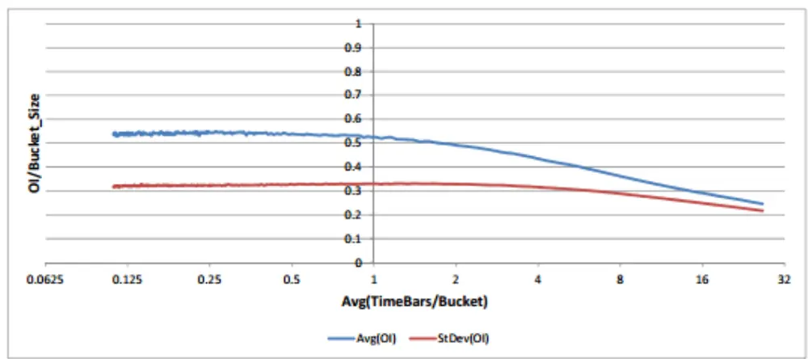
资料来源：《Flow Toxicity and Liquidity in a High Frequency World》、招商证券定量组整理

这种方法会将一些交易量错误分类。文章的目标并不是准确的对每一笔交易进行分类（任何情况下都不可能完成），而是通过创造一个交易不平衡的度量方法来衡量指令流毒性。通过使用时间间隔，文章尝试让市场价格有时间适应基于量钟分类恢复的交易方向信息。在本文的后面文章也提供了有关对整合数据量钟分类的方法对比原始数据逐笔分类更为有效的证据。

## 3.4 等交易量信息交易概率（VPIN 指令流毒性指标）

标准PIN模型仅关注买卖数量以推断其中包含的信息结构；而交易量并没有明确的作用。在高频交易市场中，交易的数量存在很严重的问题。回到PIN模型的理论基础，文章最终需要的是知情交易者与不知情交易者的交易意向信息。交易意向与交易数据之间的联系充斥着噪声，因为交易意向有可能被分割为多个部分以减少市场影响。一个指令有可能进行多次交易执行，并且基于信息的交易有可能以多种指令形式完成。由于这些原因，文章将每一个被报告的交易视为对单笔交易的合并（即以某个价格p交易五个合约被视为以价格p交易一个合约五次）。由于该规则的存在，文章将交易强度纳入分析。接下来，文章解决如何将这些交易与理论联系起来的问题。

从 Easley，Engle，O'Hara 和 Wu [2008]的研究中可以知道交易不平衡的期望为$E[|V_{\tau}^{S}-V_{\tau}^{B}|]\approx\alpha\mu$ 且整体交易的期望到达率为

$$
\begin{array}{l}{{\displaystyle{\frac{1}{n}}\sum_{\tau=1}^{n}(V_{\tau}^{B}+V_{\tau}^{S})=V}\ ~}\\{{\displaystyle~=\alpha(1-\delta)(\varepsilon+\mu+\varepsilon)+\alpha\delta(\mu+\varepsilon+\varepsilon)}\ ~}\\{{\displaystyle~+(1-\alpha)(\varepsilon+\varepsilon)=\alpha\mu+2\varepsilon}}\end{array}\tag{9}
$$

交易篮子可以使文章的很简单的估算该模型。特别的，文章将交易日分为等交易量的交易篮子。这意味对于所有的交易篮子， $V_{\tau}^{B}+V_{\tau}^{S}$ 是常数，且等于V。

从上面的计算可知，文章可以得出等交易量信息交易概率，即 VPIN 指令流毒性指标，

$$
VPIN={\frac{\alpha\mu}{\alpha\mu+2\varepsilon}}={\frac{\alpha\mu}{V}}\approx{\frac{\sum_{\tau=1}^{n}\bigl|V_{\tau}^{S}-V_{\tau}^{B}\bigr|}{nV}}\#(10)
$$

估算 VPIN 指标需要决定每个交易篮子中的交易量V和用于近似计算交易不平衡的篮子数量n。作为初始条件，文章将关注V等于日均交易量的五十分之一的情况。如果文章之后选择n = 50，文章将计算 50 个交易篮子中的 VPIN 指标，这对应着每日的 VPIN指标。正如在第 5节讨论的那样，文章的结果对于不同的V与n的选择是稳健的。

VPIN 指标将会在每个交易篮子后更新。因此，当第 51 个交易篮子被填充完毕时，文章将舍弃第一个篮子以计算新的VPIN指标。文章基于交易量时间更新VPIN 指标主要因为两个原因。其一，文章想让更新 VPIN 的速度接近新信息到达市场的速度。其次，文章想让每次更新都有近似等量的信息。在市场参与度低时，交易量可能会非常不平衡，并且这种低交易量情况不太可能包含新的信息。因此基于时钟时间更新会导致每次更新基于不等量的信息。

以 E-mini S＆P 500期货在 2010年 5月 6日的交易为例。该日的交易量（“闪跌”发生的时间）非常高，因此文章的算法对 VPIN指标进行了 137次估算。相比之下，平均每日文章只有 50 个估算值。由于文章的样本长度（n）也为 50，因此在 2010 年 5 月 6日对VPIN指标的估算所基于的时间长度仅为几个小时，而平均的时间长度为24小时。

图 3 说明了时间长度变得“弹性”的方式取决于交易强度（信息到达速度的替代）。在上午 9:30，用于计算 VPIN 的数据几乎涵盖了一整天。但是随着纽约证券交易所于 2010年 5月6日开盘，文章的算法开始更频繁地更新VPIN 指标，并且其估算结果基于更短的时钟时间间隔。到下午 12:17 为止，VPIN 指标的计算仅基于之前半天。值得注意的是减少样本所涵盖的时间段并不会导致噪声提高。相反，VPIN 指标随着连续的趋势而不断变化。这样的原因是固定时间间隔并未包含近似等量的信息。但是基于交易量时间的更新却包含近似等量的信息。

图 3：时间间隔和VPIN（2020年5月 6日）
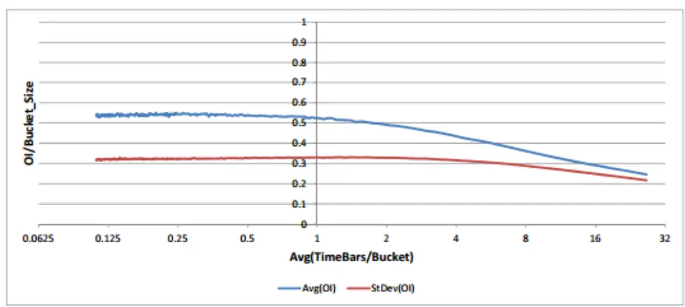
资料来源：《Flow Toxicity and Liquidity in a High Frequency World》、招商证券定量组整理

GARCH模型提供了另一种处理在时钟时间下高频数据波动率聚集的方法。通过利用交易量时间的方法减少了波动率聚集的影响，因为文章每次都基于等交易量进行估算。大幅度价格变化往往伴随着大量的交易，基于交易量取样可以近似地视为依据波动率取样。其取样结果近似于正态分布，且相比基于时钟时间取样异质性更少。因此，基于交易量时间的方法可以视为类似于 GARCH 模型的方法。

为了展示这种转化如何使分布更趋近正态，文章以 2008 年 1 月 1 日到 2010 年 10 月22 日的E-mini S＆P 500期货每分钟柱状样本为例。文章每天平均抽取了50个价格观察值，在第一种情况下按等距时间抽样（时钟时间），在第二种情况下按等交易量抽样（交易量时间）。之后，对样本进行一阶差分并标准化。这两个样本均呈左偏且具有肥尾，但等交易量样本与正态分布更为接近，并且自相关性与异方差性更小。随着采样频率的增加，这一点变得更加明显（比较 50 次和 100 次抽样的表格）。表 1 给出了统计量结果，且图4 提供了标准化后价格变化的图形说明。

表 1：按时钟时间与交易量时间的采样结果

| Stats (50) | Chrono time | Volume time |  | Stats (100) Chrono time Volume time |  |
| --- | --- | --- | --- | --- | --- |
| Mean | 0.0000 | 0.0000 | Mean | 0.0000 | 0.0000 |
| StDev | 1.0000 | 1.0000 | StDev | 1.0000 | 1.0000 |
| Skew | -0.0788 | -0.2451 | Skew | -0.1606 | -0.4808 |
| Kurt | 31.7060 | 15.8957 | Kurt | 44.6755 | 23.8651 |
| Min | -21.8589 | -20.6117 | Min | -28.3796 | -29.2058 |
| Max | 19.3092 | 13.8079 | Max | 24.6700 | 15.5882 |
| L-B* | 34.4551 | 22.7802 | L-B* | 115.3207 | 36.1189 |
| White* | 0.0971 | 0.0548 | White* | 0.0873 | 0.0370 |
| J-B* | 34.3359 | 6.9392 | J-B* | 72.3729 | 18.1782 |

资料来源：《Flow Toxicity and Liquidity in a High Frequency World》、招商证券定量组整理

图 4：E-mini S＆P 500 期货的统计数据和 PDF（按固定的时间间隔和交易量间隔进行采样）
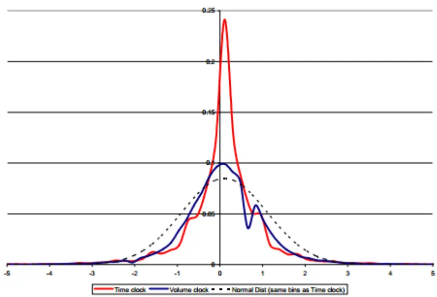
资料来源：《Flow Toxicity and Liquidity in a High Frequency World》、招商证券定量组整理

## 4. VPIN指标和参数估计

VPIN 估计涉及到多个参数的初始值选定问题，其中最重要的两个参数是交易篮子的划分方式以及交易记录的起始位置。我们将根据 E-mini S&P 500 期货合约自 2008 年 1月 1日至2011年8月 15日的表现来观测 VPIN在不同参数设置下的稳定性。

## 4.1 交易篮子划分对VPIN 稳定性的影响

交易篮子的选择对于VPIN 的估计具有非常重要的作用，由于估计VPIN时涉及到交易不平衡以及交易强度的问题，采用时间条的形式来聚集交易量有助于降低噪音。下面我们通过对 2010年5月 6日的美股闪崩事件时不同交易篮子下 VPIN的表现来观测其稳定性，事实上，我们认为VPIN的 CDF 累积分布函数变化比VPIN 本身更能反应VPIN的实际情况。

图 5：VPIN毒性指标和交易分类
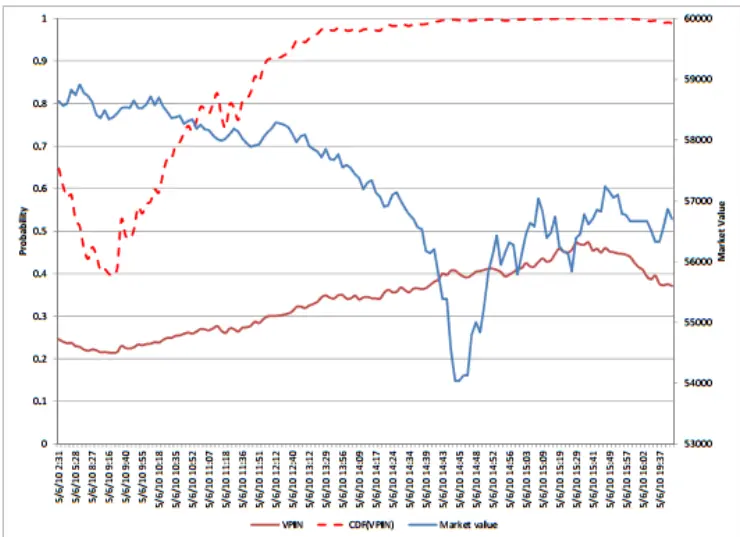
(a) VPIN estimated on 1-minute time bars bulk classification

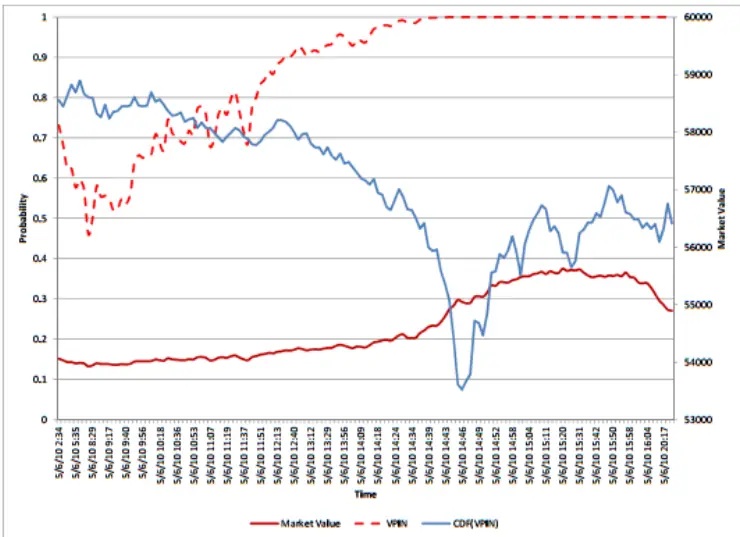
(b) – VPIN Estimated on 10-seconds time bars bulk classification

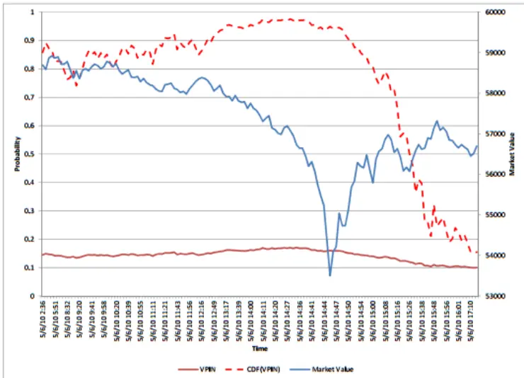
(c) – VPIN Estimated on trade-by-trade Lee-Ready classification
资料来源：《Flow Toxicity and Liquidity in a High Frequency World》、招商证券定量组整理

图 a、b 使用了1 分钟和10 秒的时间条下的分类算法，而图 c采用了Lee-Ready分类算法。可以看出在闪崩发生的两个小时以前，3 个算法都观测到了极高的VPIN 指令流毒性（CDF 达到了0.9 的界限以上）。1分钟及10秒时间条下的交易篮子算法具有非常近似的走势，CDF 函数在闪崩到来前便做出反应，随后一直居于高位，表现出 VPIN 在不同交易篮子划分下的整体稳定性。而 Lee-Ready则做出了相对不同的表现，CDF 函数在闪崩前表现出增长趋势，但并不显著，而在闪崩后降落到了低点并维持在低水平，但奇怪的是，CDF 的下落却伴随着市场近 4%的走强，这种不寻常的表现被 Easley andO’Hara(2011a)归结为算法对交易量的错误分类，因此在 VPIN 的估计时不考虑采用Lee-Ready 算法。

## 4.2 交易记录起始位置的改变对 VPIN 稳定性的影响

第二项 VPIN 对稳定性的测试便是检验交易记录的起始位置对 VPIN 估计 的影响。总体而言，交易记录的差错或缺失会产生两种影响：第一，丢失的交易记录会改变交易量的不平衡性，然而我们在计算VPIN 时采用对交易量等量划分的方法，一些缺失或差错的交易记录相对于每天的总交易量来说是一个很小的数量级，可以忽略不计。第二，交易记录的丢失将改变 VPIN 的轨迹，对于这点，可以通过观察不同起始记录点下的 VPIN轨迹差异来检验 VPIN估计 的稳定性。

对此，我们在E-mini S&P 500期货合约下采用1000个相邻的起始位置作出VPIN轨迹，使得每个起始位置间间隔一个时间条的长度，随后将每条轨迹与相对应的时间对齐后，通过第 1条VPIN 轨迹与随后 999条 VPIN 轨迹的差值来观察 VPIN估计的稳定性。

图 6：VPIN毒性矩阵估计的稳定性
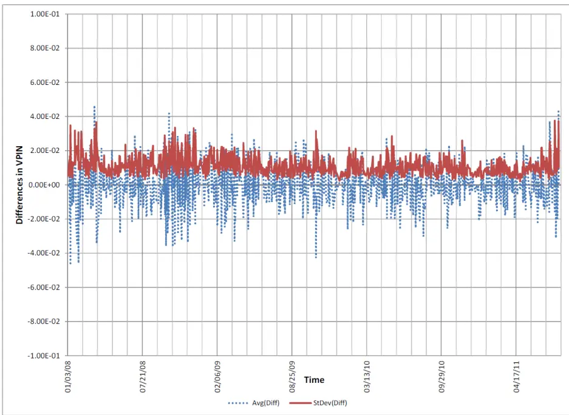
资料来源：《Flow Toxicity and Liquidity in a High Frequency World》、招商证券定量组整理

结果显示，不同交易起始位置对于VPIN 估计结果的影响可以忽略。事实上，各轨迹差异的均值处于 0.015 上下而 VPIN 的本身估计值远高于此水平（约 0.23），例如 2010年5月6日美股闪崩当日，各轨迹的标准差来到0.02，但当日的VPIN水平却接近0.5。因此总体而言，起始位置的不同与缺失的交易记录并不会对VPIN 估计的结果产生显著影响，而事实上，VPIN 的差异最终表现在 CDF 函数上的变化会变得更小，进一步保障了算法的稳定性。

## 5. 期货合约的VPIN估计实证

在完成了VPIN 估计的稳定性检验后，我们便可以将其应用于 E-mini S&P 500（CME交易所）与WTI原油期货合约（NYMEX交易所）进行实证观察。样本时间从2008年1 月 1 日追溯到2011 年 6月 6 日，平均每天50 个交易篮子，样本长度 50，即窗口长度约为一个单位日。两期货合约下的 VPIN估计如表2所示。

表 2：S&P500 E-mini 期货和 WTI 原油期货的 VPIN 毒性矩阵

| Stat | S&P500 | Crude |
| --- | --- | --- |
| Average | 0.2251 | 0.2191 |
| StDev | 0.0576 | 0.0455 |
| Skew | 0.7801 | 0.5560 |
| Ex. Kurt | 0.9124 | 0.3933 |
| AR(1) | 0.9958 | 0.9932 |
| #Observ. | 44665 | 42425 |

资料来源：《Flow Toxicity and Liquidity in a High Frequency World》、招商证券定量组整理

## 5.1 S&P 500 期货合约(CME)

从 E-mini S&P 500 期货合约的VPIN 估计结果可以看出，VPIN虽然表现出较高的波动率，但整体稳定。值得注意的是，VPIN 的AR(1)自回归系数达到了 0.9958，这会使我们产生疑问，因为它可能预示着 VPIN 并不稳定，而 CDF 函数便不再对估计未来合约价格有效。然而，我们已经在第三章验证了VPIN不会被起始位置所影响，而如果我们将总时间分割为美股闪崩（2010 年 5 月 6 日）前后两段，统计结果显示其两段 CDF几乎保持相同。

图 7：E-mini S&P500 期货 VPIN
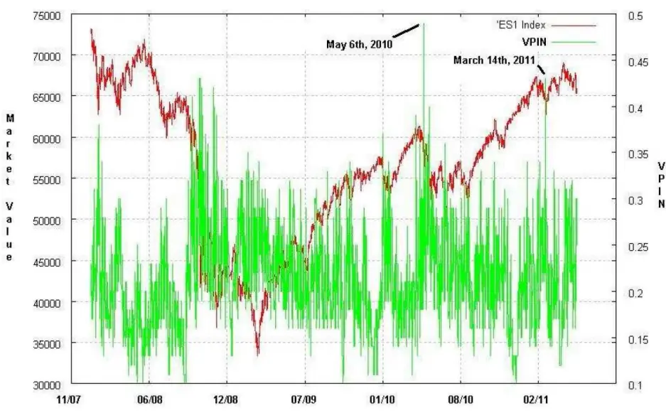
资料来源：《Flow Toxicity and Liquidity in a High Frequency World》、招商证券定量组整理

从 E-mini S&P 500 期货合约的VPIN 估计结果可以看出，VPIN虽然表现出较高的波动率，但整体稳定。值得注意的是，VPIN 的AR(1)自回归系数达到了 0.9958，这会使我们产生疑问，因为它可能预示着 VPIN 并不稳定，而 CDF 函数便不再对估计未来合约价格有效。然而，我们已经在第三章验证了VPIN不会被起始位置所影响，而如果我们将总时间分割为美股闪崩（2010 年 5 月 6 日）前后两段，统计结果显示其两段 CDF几乎保持相同。

表 3：不同样本区间VPIN的CDF

| Prob | CDF_1 | CDF_2 | CDF_Total |
| --- | --- | --- | --- |
| 0.1 | 0.1711 | 0.1591 | 0.1648 |
| 0.2 | 0.1890 | 0.1792 | 0.1838 |
| 0.3 | 0.2030 | 0.1952 | 0.1989 |
| 0.4 | 0.2158 | 0.2101 | 0.2128 |
| 0.5 | 0.2284 | 0.2250 | 0.2267 |
| 0.6 | 0.2419 | 0.2409 | 0.2415 |
| 0.7 | 0.2571 | 0.2592 | 0.2583 |
| 0.8 | 0.2762 | 0.2824 | 0.2795 |
| 0.9 | 0.3050 | 0.3180 | 0.3119 |

资料来源：《Flow Toxicity and Liquidity in a High Frequency World》、招商证券定量组整理

事实上，VPIN极高的自回归系数与稳定性皆出自同一个原因：在样例中，VPIN 估计被设计为 50 个交易篮子长度，那么在每次更新时第一个篮子会被舍弃，而后在末尾补入新的篮子，这样的操作便保证了 VPIN 存在高度的自相关性，却不具备 50 个交易篮子长度以外的记忆。

此外可以发现，在 2010 年 5 月 6 日美股闪崩当日，VPIN 来到了最高点，这预示着当日的交易被单向指令流吞没，而极端的指令流毒性使得做市商从流动性提供者的角色成为了流动性消费者。

图 8：福岛核危机期间的 E-mini S&P500 期货
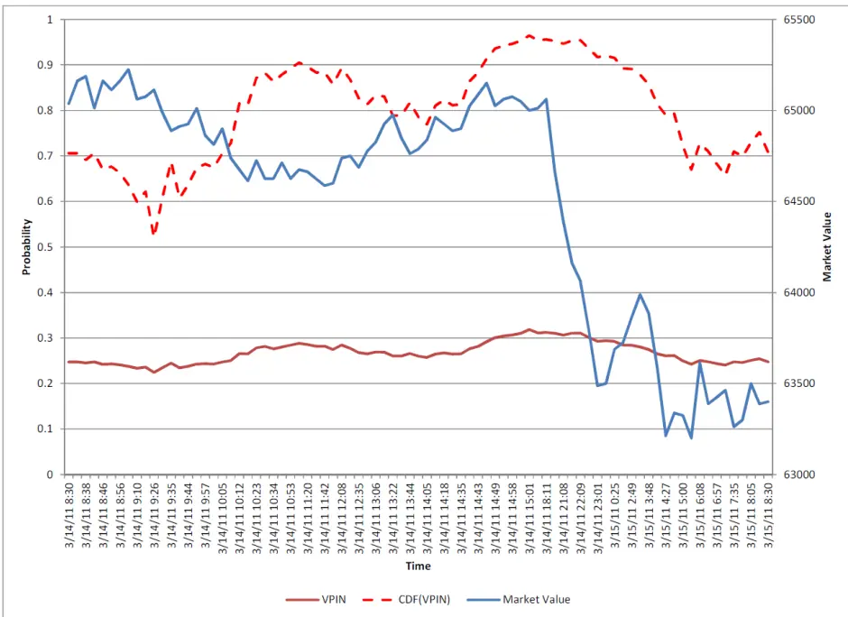
资料来源：《Flow Toxicity and Liquidity in a High Frequency World》、招商证券定量组整理

另一个极端的指令流毒性例子出现在 2011 年3 月东日本大地震时。当时，虽然大地震与海啸发生在 2011 年3 月11 日的晨间，但 S&P 500 指数在3 月 14 日福岛核危机揭露之前并未出现大幅下跌，但在 3月 14 日当日，S&P 500指数的数据显示出了巨大的指令流毒性。值得一提的是，自 到 点的当日晚间并未出现大量的交易，但在仅仅约 287,360份合约完成交易后，指数下跌幅度便到达2.5%。而事实上VPIN的 CDF 数据在 3 点时便来到了 0.97 的高位，这预示着较小的交易量同样能够带来很大的指令流毒性，并被 VPIN捕捉。

## 5.2 WTI 原油期货合约 (NYMEX)

原油是世界上交易量最大的大宗商品，对世界经济具有战略性意义，是地缘政治和宏观经济赌注的理想选择，而能源期货也是做市商面临指令流剧烈波动的场所。

图 9：WTI原油期货的VPIN毒性矩阵
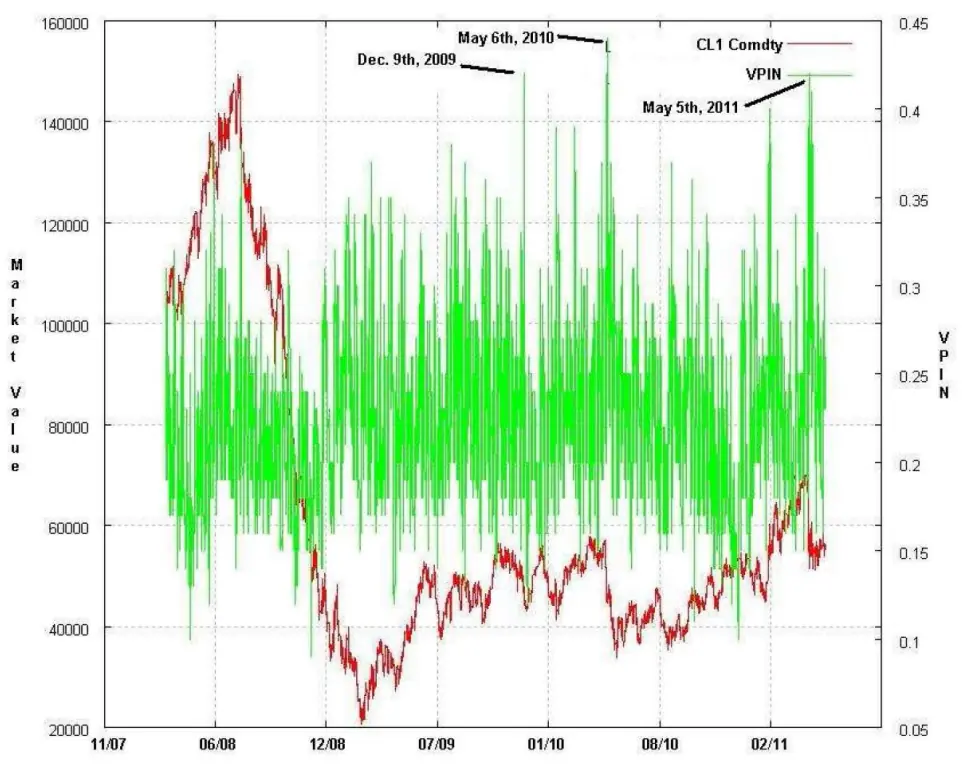
资料来源：《Flow Toxicity and Liquidity in a High Frequency World》、招商证券定量组整理
对WTI原油期货而言，其历史最高的指令流毒性同样发生在 2010 年5 月6日美股闪崩当天，说明即使事件本身与能源商品无关，但其仍旧对国际原油市场造成了跨市场性的影响。

图 10：2011年5月 5日原油价格变化
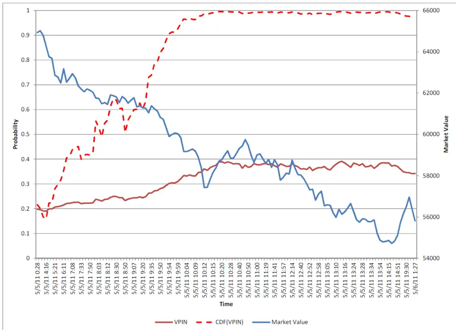
资料来源：《Flow Toxicity and Liquidity in a High Frequency World》、招商证券定量组整理

图 11：2009年12月9日原油价格变化
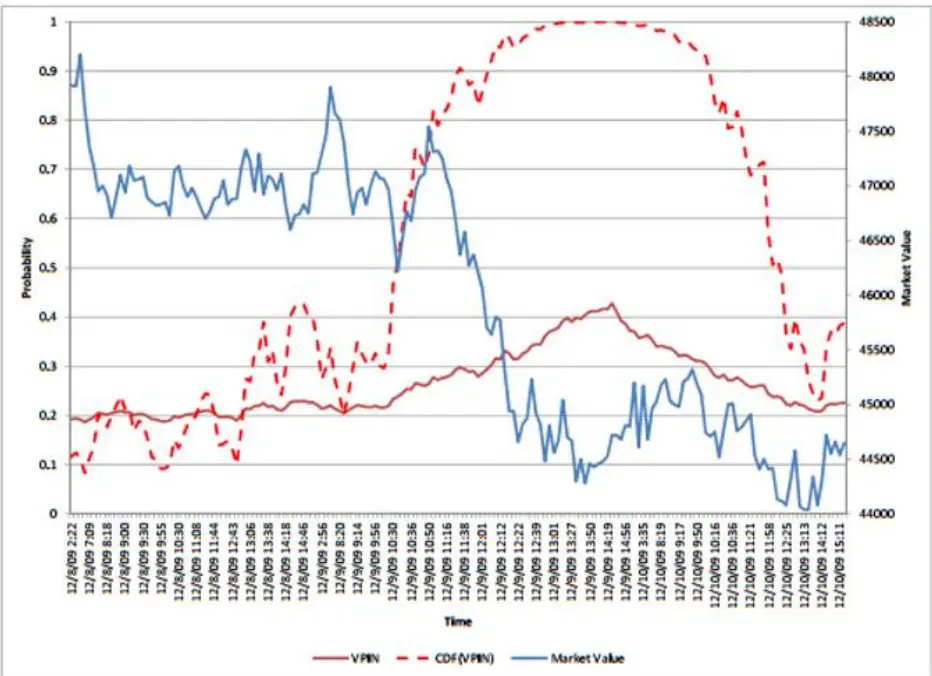
资料来源：《Flow Toxicity and Liquidity in a High Frequency World》、招商证券定量组整理

随之而来的另一次指令流毒性发生在 2011 年 5 月 5 日。2011 年 5 月初，美国商品期货交易委员会（CFTC）公布了原油交易商历史上最大的多头投机头寸，《纽约时报》将这些头寸归因于交易员认为能源价格将在席卷北非与中东的暴力事件下走高。5月5日，其中的一些交易员决定平仓获利，他们大量的平仓操作导致其向不知情的交易员寻求流动性，而当这些交易员意识到抛售压力持续存在时便开始撤出离场，这又一步增加了成交量中的毒性浓度。从 VPIN 的数据中可以看出，CDF 在当日 10 点不到便超出了 0.9的阈值，在一天的剩余时间里都保持在这个高位，而在这短短几个小时内，WTI合约价格便暴跌超过8%。

## 6. 指令流毒性与期货合约价格变动

在高频交易中，做市商可以运用上述的VPIN 及相关指标来衡量指令流的毒性，而由于毒性会直接影响做市商的利润，所以它也会影响做市商的行为，进一步影响到市场的流动性。在本节中，我们将进一步讨论指令流毒性与期货合约价格变动之间的联系。

对于高频做市商来说，由于做市商本身是被动的交易者，他们必须等待订单流的到来，所以交易量相对时间而言才是更有效的衡量标准，而交易量也适用于考虑毒性和期货价格变动的联系。对做市商而言，有两个问题是需要关注的：首先，高指令流毒性会对价格产生怎样的影响？其次，持续的高指令流毒性会如何进一步影响价格变动？

下面，我们将通过观察毒性、流动性与波动性之间的联系来回答这些问题。我们首先研究指令流毒性与其随后一个交易篮子内的合约价格变动之间的关系，再进而研究指令流毒性的持续如何影响较长时间内的价格变动。一般来说，我们知道，随着毒性的增加，做市商面临潜在的损失，因此可能会选择减少甚至放弃做市活动。流动性的减少，反过来，表明高水平的VPIN应该预示着更大的价格波动性。

## 6.1 相关性观测

从最简单的问题出发：VPIN 的波动是否与期货合约的价格变动相关？这里我们使用了VPIN 的自然对数与下一个交易篮子内合约价格的绝对变化量来衡量这种关系

$$
\mathsf{P}\left(Ln(VPIN_{\tau-1}),\Big|\frac{P_{\tau}}{P_{\tau-1}}-1\Big|\right)\#(11)
$$

其中τ 表示交易篮子的索引。由于VPIN 本身可以使用每天的交易篮子数量与样本长度的各种组合来估计，因此这里我们通过选取不同的参数组合来研究 VPIN与期货价格变动的关系。

图 12：E-mini S&P 500 期货波动性和 VPIN 的相关性
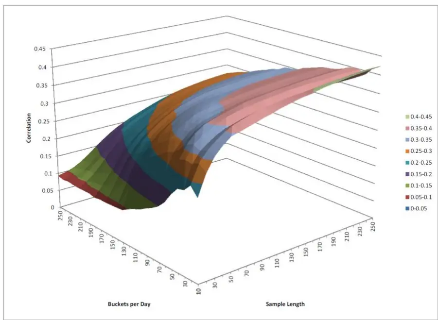
资料来源：《Flow Toxicity and Liquidity in a High Frequency World》、招商证券定量组整理

对于E-mini S&P 500 期货合约而言，VPIN与期货价格变动正相关。图中给出了 VPIN与期货价格变化的相关性的三维图像，可以看到随着交易篮子参数的变化，相关性随之光滑平稳地改变，总体而言，VPIN 与期货价格变化的相关性随着样本长度的增大而增大，随着每日交易篮子数量的增大而减小。

对该期货合约而言（50，250）似乎是一个不错的交易篮子参数组合，事实上，这样的组合有一个通俗易懂的解释，即 “一周”的数据（每天50 个交易篮子，每周 5个交易日）。对于这样的参数组合，相关性达到了 0.4，并且这样的取值不用担心过拟合的发生，因为整个相关性表面非常光滑平稳，因此临近的参数组合皆具有同样的效果而不会产生大幅度的变化。

图 13：S&P 500 对 VPIN 的反应
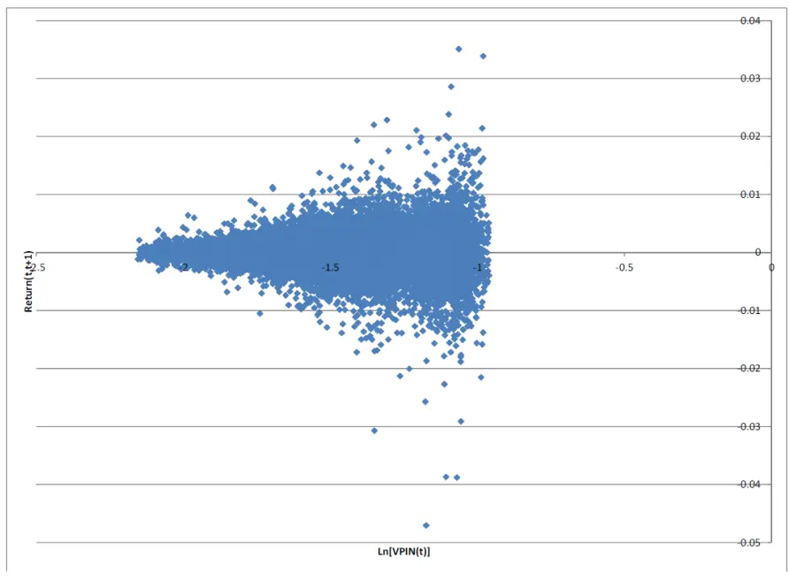
资料来源：《Flow Toxicity and Liquidity in a High Frequency World》、招商证券定量组整理

如果对（50，250）的参数组合进行 VPIN 的排序，我们可以发现随着 VPIN 的升高，期货合约价格的波动随之增大。

上述对于相关性的发现是具有启发性的，但简单的相关性指标并不足以令人满足。进一步地，我们希望构造一个条件概率模型，而我们紧接着感兴趣的问题便是：第一，当VPIN 较高时，后续的价格变动是什么？第二，当价格变动很大时，先前的 VPIN 处于怎样的水平？

## 6.2 条件概率

为了表示两类条件概率，首先需要计算 VPIN 与价格变动的联合分布。为此，我们将VPIN 以5%设为间隔步长，再将价格变动以0.25%设为间隔步长，从而设计离散分布

$$
\left(VPIN_{\tau-1},\Big|\frac{P_{\tau}}{P_{\tau-1}}-1\Big|\right)\#(12)
$$

首先观测在 5%间隔的 VPIN 条件下的价格变动分布。这 20 个条件分布如表 4a 所示。其中，每一行代表了一个VPIN 间隔条件内的期货变动的概率分布。可以非常非常直观地观测到，当VPIN处于较低水平，绝大多数时间（90%以上）价格的变动在0.25%以内，相反地，当VPIN处于较高水平，价格变动的条件概率分布显得更加分散。值得注意的是：一些极高的价格变动（1.5%以上）有时会在高VPIN 时出现，但在低VPIN 时从未出现，以及，即使是高 VPIN 的条件下，价格变动的幅度也往往不会非常巨大。我们将在下一小节对这一点做出进一步分析，并认为需要持续高水平的VPIN才会产生较为可靠的巨大价格变动。

表 4：VPIN和绝对收益的条件概率分布

|  | 0.05 | 0.25% 96.56% | 0.50% | 0.75% | 1.00% | 1.25% | 1.50% | 1.75% | 2.00% | >2.00% |
| --- | --- | --- | --- | --- | --- | --- | --- | --- | --- | --- |
|  | 0.10 | 96.33% | 3.33% 3.44% | 0.11% 0.23% | 0.00% 0.00% | 0.00% 0.00% | 0.00% 0.00% | 0.00% 0.00% | 0.00% 0.00% | 0.00% 0.00% |
|  | 0.15 | 91.54% | 7.56% |  | 0.11% | 0.06% | 0.00% | 0.00% |  | 0.00% |
|  |  |  |  | 0.73% |  |  |  |  | 0.00% |  |
|  | 0.20 | 90.41% | 8.24% | 0.96% | 0.28% | 0.11% | 0.00% | 0.00% | 0.00% | 0.00% |
|  | 0.25 | 90.47% | 8.74% | 0.79% | 0.00% | 0.00% | 0.00% | 0.00% | 0.00% | 0.00% |
|  | 0.30 | 89.45% | 9.87% | 0.62% | 0.00% | 0.06% | 0.00% | 0.00% | 0.00% | 0.00% |
|  | 0.35 | 88.21% | 10.55% | 1.02% | 0.06% | 0.17% | 0.00% | 0.00% | 0.00% | 0.00% |
|  | 0.40 | 84.72% | 13.20% | 1.69% | 0.23% | 0.17% | 0.00% | 0.00% | 0.00% | 0.00% |
|  | 0.45 | 80.88% | 17.26% | 1.64% | 0.17% | 0.06% | 0.00% | 0.00% | 0.00% | 0.00% |
|  | 0.50 | 81.90% | 14.89% | 2.65% | 0.34% | 0.06% | 0.17% | 0.00% | 0.00% | 0.00% |
| VPpntes Viles | 0.55 | 79.74% | 17.55% | 2.09% | 0.56% | 0.00% | 0.06% | 0.00% | 0.00% | 0.00% |
|  | 0.60 | 79.30% | 18.05% | 2.09% | 0.39% | 0.11% | 0.00% | 0.06% | 0.00% | 0.00% |
|  | 0.65 | 79.30% | 16.92% | 2.88% | 0.39% | 0.28% | 0.11% | 0.06% | 0.00% | 0.06% |
|  | 0.70 | 75.06% | 20.60% | 3.22% | 0.85% | 0.11% | 0.06% | 0.06% | 0.06% | 0.00% |
|  | 0.75 | 68.25% | 24.99% | 5.25% | 1.18% | 0.11% | 0.11% | 0.11% | 0.00% | 0.00% |
|  | 0.80 | 62.32% | 27.58% | 6.49% | 2.65% | 0.51% | 0.28% | 0.17% | 0.00% | 0.00% |
|  | 0.85 | 62.81% | 26.52% | 7.67% | 1.86% | 0.51% | 0.23% | 0.34% | 0.06% | 0.00% |
| 0.90 |  | 56.38% | 29.35% | 9.20% | 2.93% | 1.24% | 0.51% | 0.06% | 0.11% | 0.23% |
| 0.95 |  | 43.71% | 30.51% | 16.02% | 5.75% | 2.14% | 0.79% | 0.51% | 0.17% | 0.39% |
|  | 1.00 | 39.56% | 29.12% | 16.42% | 7.62% | 3.27% | 1.64% | 0.90% | 0.73% | 0.73% |

$$
\begin{array}{r}{Table4a-Prob\left(\left|\frac{P_{\tau}}{P_{\tau-1}}-1\right||VPIN_{\tau-1}\right)}\end{array}
$$

Absolute return between two consecutive buckets

| 0.15 0.20 |  | 0.25% | 0.50% | 0.75% | 1.00% | 1.25% | 1.50% | 1.75% | >=2% |
| --- | --- | --- | --- | --- | --- | --- | --- | --- | --- |
| Vpi Iiles | 0.05 0.10 | 6.28% | 0.98% | 0.14% | 0.00% | 0.00% | 0.00% | 0.00% | 0.00% |
|  | 6.27% |  | 1.02% | 0.28% | 0.00% | 0.00% | 0.00% | 0.00% | 0.00% |
|  | 5.96% |  | 2.23% | 0.90% | 0.44% | 0.63% | 0.00% | 0.00% | 0.00% |
|  | 5.88% |  | 2.43% | 1.17% | 1.11% | 1.26% | 0.00% | 0.00% | 0.00% |
|  | 0.25 5.89% | 2.59% |  | 0.97% | 0.00% | 0.00% | 0.00% | 0.00% | 0.00% |
|  | 0.30 5.82% | 2.92% |  | 0.76% | 0.00% | 0.63% | 0.00% | 0.00% | 0.00% |
|  | 0.35 5.74% |  | 3.12% | 1.24% | 0.22% | 1.89% | 0.00% | 0.00% | 0.00% |
|  | 0.40 | 5.51% | 3.90% | 2.07% | 0.89% | 1.89% | 0.00% | 0.00% | 0.00% |
|  | 0.45 | 5.26% | 5.10% | 2.00% | 0.67% | 0.63% | 0.00% | 0.00% | 0.00% |
|  | 0.50 0.55 | 5.33% | 4.40% | 3.24% | 1.33% | 0.63% | 4.29% | 0.00% | 0.00% |
|  | 0.60 | 5.19% | 5.19% | 2.55% | 2.22% | 0.00% | 1.43% | 0.00% | 0.00% |
|  | 0.65 | 5.16% | 5.34% | 2.55% | 1.56% | 1.26% | 0.00% | 2.50% | 0.00% |
| 0.70 | 5.16% | 5.00% | 3.52% | 1.56% | 3.14% | 2.86% | 2.50% | 2.22% |  |
| 0.75 | 4.88% | 6.09% | 3.93% | 3.33% | 1.26% | 1.43% | 2.50% | 2.22% |  |
|  | 4.44% | 7.39% | 6.42% | 4.67% | 1.26% | 2.86% | 5.00% | 0.00% |  |
| 0.80 | 4.06% | 8.16% | 7.94% | 10.44% | 5.66% | 7.14% | 7.50% | 0.00% |  |
| 0.85 | 4.09% | 7.84% | 9.39% | 7.33% | 5.66% | 5.71% | 15.00% | 2.22% |  |
| 0.90 | 3.67% | 8.67% | 11.25% | 11.56% | 13.84% | 12.86% | 2.50% | 13.33% |  |
| 0.95 | 2.84% | 9.02% | 19.60% | 22.67% | 23.90% | 20.00% | 22.50% | 22.22% |  |
| 1.00 | 2.57% | 8.61% | 20.08% | 30.00% | 36.48% | 41.43% | 40.00% | 57.78% |  |
| Table 4b – Prob |  |  |  |  | (VPINτ-1 | P{ Pτ-1 |  |  |  |

资料来源：《Flow Toxicity and Liquidity in a High Frequency World》、招商证券定量组整理

类似地，表 4b 中统计了在 0.25%间隔的价格变动下的 VPIN 分布，每一列代表了一个价格变动间隔条件内的 VPIN 的概率分布。值得关注是，当价格变动很大时，VPIN 往往也很大，而整个统计的上四分位数包含了价格变动超过 0.75%的情况的 84%。这一事实表面VPIN 对极端价格波动具有保险价值。

图 14：高VPIN和高收益的热力图
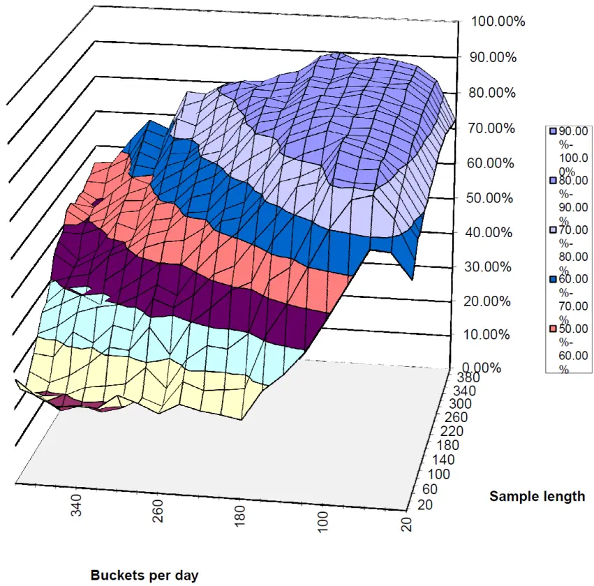
资料来源：《Flow Toxicity and Liquidity in a High Frequency World》、招商证券定量组整理

同样地，如果采用不同的交易篮子参数组合，并计算当价格波动大于 0.75%时 VPIN 处于上四分位数的概率： $\begin{array}{r}{\mathrm{Prob}(\mathrm{CDF}(VPIN_{\tau-1})>\frac{3}{4}|\left|\frac{P_{\tau}}{P_{\tau-1}}-1\right|>0.75\%)}\end{array}$ 。可以发现，只要每日的交易篮子数量不极端地多，样本长度不极端地小，那么此概率可以较为稳定地落在 80%至 90%之间。这一结果不仅预示着 VPIN 可以预测大量的极端波动事件，同时也表明指令流毒性引起的波动是价格波动的一大重要来源。

## 6.3 极端价格变动是否都紧随于高 VPIN 之后？

正如前文中表格所显示的那样，对于 E-mini S&P 500 期货合约而言，低位的 VPIN几乎无法造成极端的价格波动。但在现实世界中，这却是可能发生的，2011 年 6 月 8 日纽约商品交易所的天然气期货价格极度波动的例子生动地说明了这种可能性。据《金融时报》报道，当年 7 月的天然气合约价格曾大幅下跌 39 美分，跌幅近 8.1%，然而几秒钟后，价格再次反弹了回来。

一些业内人士将下跌归因于“fat finger”错误，即交易员在订单末尾错误地键入一个额外的零，使其规模增加了 10 倍。其他人则倾向将其归咎于交易期货的计算机算法出现故障。当成交量较小时，任何大额订单都可能产生巨大影响。

图 15：2011年6月 8日天然气价格变化
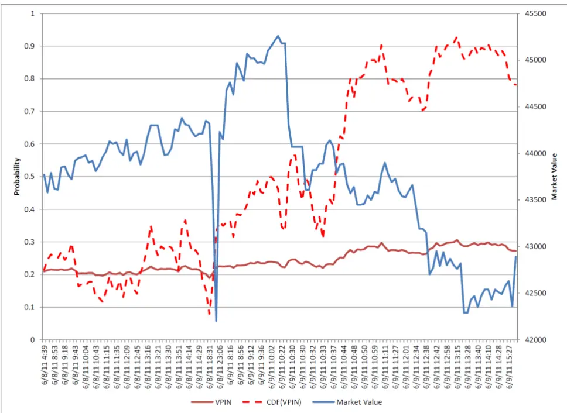
资料来源：《Flow Toxicity and Liquidity in a High Frequency World》、招商证券定量组整理

如果其解释是正确的，那么 VPIN 的 CDF 数据在价格下跌之前应该不会过高。而实证结果揭示了当日所发生的情况：价格突然下降，随后立即恢复，所有这些都发生在相对较低的指令流毒性水平下。而这个例子说明了：并不是所有的价格变动都是由指令流毒性引起的；知道价格下跌的原因是否是指令流毒性将可以给监管机构带来帮助。

## 6.4 处于高位的VPIN是否预示着极端价格变动？

我们已经得知高位的VPIN 并不意味着将紧随极端的价格变动，因为高VPIN 观测值之后的绝大多数价格变动都不是很大。那么，持续高水平的 是否会大概率导致极端的价格波动？为了检验这一想法，我们需要量化做市商持续暴露在某高 VPIN 水平下的最大价格变动。

为此，我们选择去计算 VPIN 保持在 5%范围内时的最大期货合约价格变化量。即，当VPIN 从一个5%移动到另一个 5%之前，我们将会统计任意两个（不一定连续）交易篮子之间的最大价格变化。例如，假设 VPIN 处于第 85 个百分位，在经历 4 个交易篮子后移动到第 90 个百分位，那么我们将计算所有四个交易篮子之内的价格变动，并将其中的最大值认作 85分位内做市商所面临的最大价格变动。

这种计算方式比起表 中所示的条件概率更为有效，因为它捕捉到了所有分位数内中间过程的价格波动，并将价格漂移和价格回升的影响纳入考虑，因为缓慢的价格波动和价格回升都可能掩盖极端的价格变动。但这种分析方式也具有局限性，因为它不能捕捉到跨越多个 百分位的指令流毒性的持续增加。例如，当指令流毒性从第 分位增加到第 80 分位，然后再增加到第 85 分位、第90分位时，跨越多个分位的指令流毒性叠加并未被捕捉到。也因此，5%的 VPIN 分位数阈值必定会低估指令流毒性对价格变动的影响。

图 16：“真实肯定”的可能性
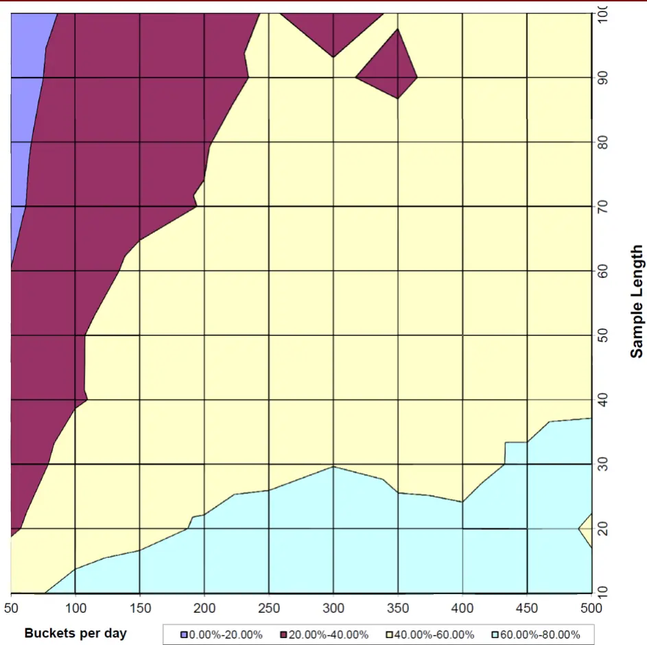
资料来源：《Flow Toxicity and Liquidity in a High Frequency World》、招商证券定量组整理

图 16 描绘了最大绝对回报率超过 0.75%的概率，而 VPIN 在其分布的上四分位数（即VPIN 在 0.75-0.80、0.80-0.85、0.85-0.90、0.90-0.95 或 0.95-1.00 bin）中的任何 5%分位数，用于每天不同桶数和样本长度的组合。

对于交易篮子的参数组合（50，250），当 VPIN 停留在任意高位（上四分位数内）的5%区间内时，有51.84%的概率观察到超过0.75%的价格波动。而使 VPIN预测能力最大化的参数取值为（10，350），即每天10个交易篮子，样本长度为 350（约1.6个月）。对于此组参数组合，有78.57%的概率能够在高VPIN下观测到超过0.75%的价格波动。

## 7. 原文结论

本文提出了一种新的估计知情交易概率的方法——利用VPIN来估计高频交易的指令流毒性。VPIN 指标对指令流毒性所诱发的市场价格变动具有显著的预测能力，而 VPIN的一个重要优势就是利用 的不断更新来匹配信息到达的速度。它是一种直接的分析估计过程，不依赖于像以往的PIN那样利用中间估计参数的方法来估计知情交易概率。

在高频交易的世界，指令流毒性影响着做市商活动的规模和范围，而高水平的 VPIN 意味着后续价格大幅波动的风险，这种基于流动性的风险对于直接承担毒性影响的做市商很重要，而对于面临毒性导致价格大幅变动的交易员也同样重要。总体而言，在高频市场当中，无论是对投资者还是监管部门，VPIN 可以作为一个比较有效的风险管理工具。

## 三、我们的思考

对于应用金融来说，一个指标除了需要扎实的理论基础之外，还应该具备可操作性。PIN模型相对复杂，不具备实操性，而 VPIN 模型在牺牲一部分精确性的前提下，大大改善了模型的可操作性。也使得 VPIN 模型受到广泛的关注。

我们认为指令流毒性的作用并不只限于预测市场的闪崩，其实还具备更多的使用空间，受到本文的启发，我们可以在市场的微观结构中做更多的探索。

## 参考文献

David E , López de Prado Marcos M, Maureen O . Flow Toxicity and Liquidity in a High-frequency World[J]. 2012.

## 风险提示

本文内容基于原作者对美国纽交所(NYSE)历史数据进行的实证研究，当模型应用于国内市场或者应用环境与假设环境出现差异的时候，存在模型失效的风险。

## 分析师承诺

负责本研究报告全部或部分内容的每一位证券分析师，在此申明，本报告清晰、准确地反映了分析师本人的研究观点。本人薪酬的任何部分过去不曾与、现在不与，未来也将不会与本报告中的具体推荐或观点直接或间接相关。

任瞳：首席分析师，定量研究团队负责人，管理学硕士，16年证券研究经验，2010年、2015年、2016、2017年新财富最佳分析师。在量化选股择时、基金研究以及衍生品投资方面均有深入读到的见解。

崔浩瀚：量化分析师，浙江大学经济学硕士,3 年量化策略研究开发经验。研究方向是机器学习在金融领域的应用和多因子选股策略开发。

## 投资评级定义

## 公司短期评级

以报告日起6个月内，公司股价相对同期市场基准（沪深 300 指数）的表现为标准：

强烈推荐：公司股价涨幅超基准指数20%以上

审慎推荐：公司股价涨幅超基准指数5-20%之间

中性：公司股价变动幅度相对基准指数介于±5%之间

回避：公司股价表现弱于基准指数 5%以上

## 公司长期评级

A：公司长期竞争力高于行业平均水平

B：公司长期竞争力与行业平均水平一致

C：公司长期竞争力低于行业平均水平

## 行业投资评级

以报告日起6个月内，行业指数相对于同期市场基准（沪深 300指数）的表现为标准：

推荐：行业基本面向好，行业指数将跑赢基准指数

中性：行业基本面稳定，行业指数跟随基准指数

## 重要声明

本报告由招商证券股份有限公司（以下简称“本公司”）编制。本公司具有中国证监会许可的证券投资咨询业务资格。本报告基于合法取得的信息，但本公司对这些信息的准确性和完整性不作任何保证。本报告所包含的分析基于各种假设，不同假设可能导致分析结果出现重大不同。报告中的内容和意见仅供参考，并不构成对所述证券买卖的出价，在任何情况下，本报告中的信息或所表述的意见并不构成对任何人的投资建议。除法律或规则规定必须承担的责任外，本公司及其雇员不对使用本报告及其内容所引发的任何直接或间接损失负任何责任。本公司或关联机构可能会持有报告中所提到的公司所发行的证券头寸并进行交易，还可能为这些公司提供或争取提供投资银行业务服务。客户应当考虑到本公司可能存在可能影响本报告客观性的利益冲突。

本报告版权归本公司所有。本公司保留所有权利。未经本公司事先书面许可，任何机构和个人均不得以任何形式翻版、复制、引用或转载，否则，本公司将保留随时追究其法律责任的权利。