# 如何利用负面因子做指数增强？高频因子篇

分析师及联系人

[Table_A● 覃川桃 (8621)61118766

qinct@cjsc.com.cn

执业证书编号：

S0490513030001

- 刘懿(8621)61118705

liuyi4@cjsc.com.cn

执业证书编号：

S0490518120004

请阅读最后评级说明和重要声明

# 报告要点

报告日期 2020-07-01

金融工程专题报告

## 相关研究

- 《主动基金的优势何以得到强化？——长江金工2020年度中期投资策略》2020-06-30

- 《资金流跟踪系列十四：今时不同往日，创业板行业、风格变迁及改革推动》2020-06-28

- 《工银黄金ETF：黄金供需存缺口，利 率、美元或共振》2020-06-16

## 负面Alpha研究（三）

## 如何利用负面因子做指数增强？高频因子篇

## ble_Summary 高频因子的空头组具有显著的负向超额]

从因子分组表现看，开盘成交占比、收盘成交占比、量价相关性、收益率方差、结构化反转和非流动性因子在中证 500 中具有显著的负向超额收益。

## 高频因子负面组合具有显著的负面Alpha

从 2010-01-01 至 2020-06-24的测算结果看，量价相关性、收盘成交占比、结构化反转、非流动性、收益率方差和开盘成交占比因子的负面组合相对于中证 500 指数增强组合具有显著的负面 Alpha，年化依次分别为 17.27%、13.56%、13.01%、11.07%、10.78%和 7.99%。

## ⚫ 指数增强策略

从中证 500 的回测结果来看，合成因子的负面 Alpha 高达 21.44%。复杂增强策略每年都跑赢了中证 500，且超额收益更显著。策略平均年化收益为 9.61%，超额指数7.06%，相对基准的最大回撤为 1.76%，收益回撤比为 3.96，信息比率为 2.4，跟踪误差为 2.66%，月度跑赢概率为 77.17%。

风险提示：[Table_R

## 如何利用负面因子做指数增强？

在上一篇关于因子负面 Alpha 的研究专题《如何利用负面因子做指数增强？——风格因子篇》中，我们提出了一种利用因子的负面 Alpha 来做指数增强的框架，步骤如下：

1． 测算单个因子在指数成分股中的分组表现，观察空头组的负向超额收益是否显著；

2． 测算单个因子的负面组合（空头组）和剔除空头组后的指数成分股的表现，观察因子的负面增强效果是否稳定；

3． 选取负向超额收益较显著且稳定的因子合成新因子，利用合成因子的空头组对指数进行增强。

本篇报告将在上述框架的基础上对高频因子的空头效应进行讨论，下面我们先来看一下高频因子的构建方法。

## 高频因子构建方法

表 1 为本篇报告用到的所有因子类型，因子值的计算方法分为两步，首先根据每日的 1分钟交易数据计算出股票的日度指标值，然后计算出每月的日度指标的均值作为最终的因子值。其中高阶矩、反转和非流动性因子的详细构建方法和描述可以参见长江金工高频因子系列报告。

表 1：高频因子类型定义

| 大类 | 指标 | 方向 |
| --- | --- | --- |
| 开盘成交占比 | 开盘5 分钟成交占比 | -1 |
|  | 开盘 15 分钟成交占比 |  |
|  | 开盘 30 分钟成交占比 |  |
|  | 开盘 60 分钟成交占比 |  |
| 收盘成交占比 | 收盘5 分钟成交占比 | -1 |
|  | 收盘 15 分钟成交占比 |  |
|  | 收盘 30 分钟成交占比 |  |
|  | 收盘 60 分钟成交占比 |  |
| 资金流向 | 资金流向 | -1 |
| 量价相关性 | 量-价相关性 | -1 |
|  | 量-收益率相关性 |  |
| 高阶矩 | 收益率方差 | -1 |
|  | 收益率偏度 |  |
|  | 收益率峰度 |  |
| 反转 | 结构化反转 | -1 |
| 非流动性 | 原非流动性 | 1 |
|  | 改进非流动性 |  |

资料来源：长江证券研究所

下面我们会给出高频因子的详细计算方法，同时分别测算因子在中证 500 和沪深 300成分股中的分组表现（年化超额收益），测算的时间范围为 2010-01-01 至2020-06-24。

## 开盘成交占比

开盘成交占比反应了股票在一天中开始时段的交易活跃度，我们分别用开盘后 5 分钟、15 分钟、30 分钟和 60 分钟的总成交量和全天总成交量的占比来表示。

开盘5分钟成交占比和开盘15分钟成交占比的空头组在中证500和沪深300成分股中均具有较强的负向超额收益，且多头组的超额收益也是各组中最高的。

图 1：开盘 5分钟成交占比因子分组表现
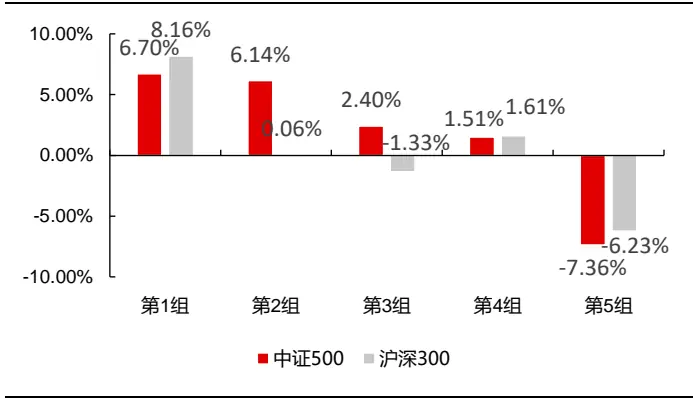
资料来源：天软，Wind，长江证券研究所

图 2：开盘 15分钟成交占比因子分组表现
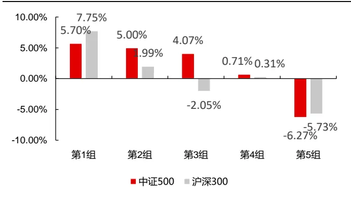
资料来源：天软，Wind，长江证券研究所

图 3：开盘 30分钟成交占比因子分组表现
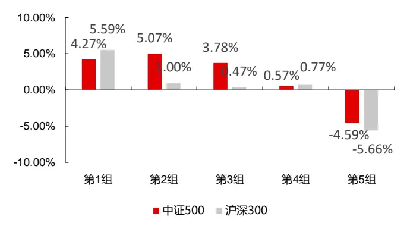
资料来源：天软，Wind，长江证券研究所

图 4：开盘 60分钟成交占比因子分组表现
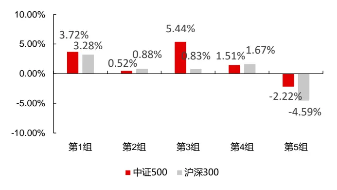
资料来源：天软，Wind，长江证券研究所

## 收盘成交占比

收盘成交占比反应了股票在一天中结束时段的交易活跃度，我们分别用收盘前 5 分钟、15 分钟、30 分钟和 60 分钟的总成交量和全天总成交量的占比来表示。

中证 500 成分股中表现最好的是收盘 5 分钟成交占比和收盘15 分钟成交占比，具有较显著的多头和空头超额，单调性也较为明显。

沪深 300 的空头组中表现最好的同样是收盘 5 分钟成交占比和收盘 15 分钟成交占比，但多头组中表现最好的则为收盘 30 分钟成交占比和收盘 15 分钟成交占比。

图 5：收盘 5分钟成交占比因子分组表现
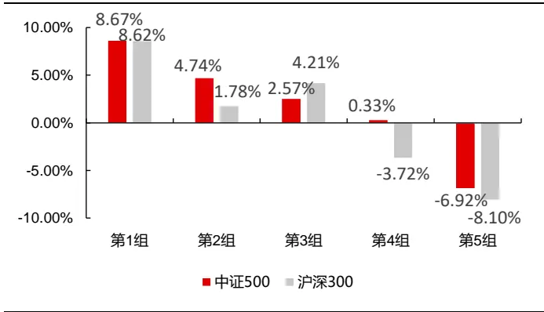
资料来源：天软，Wind，长江证券研究所

图 6：收盘 15分钟成交占比因子分组表现
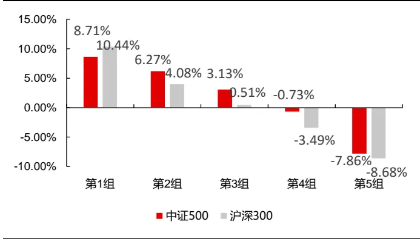
资料来源：天软，Wind，长江证券研究所

图 7：收盘 30 分钟成交占比因子分组表现
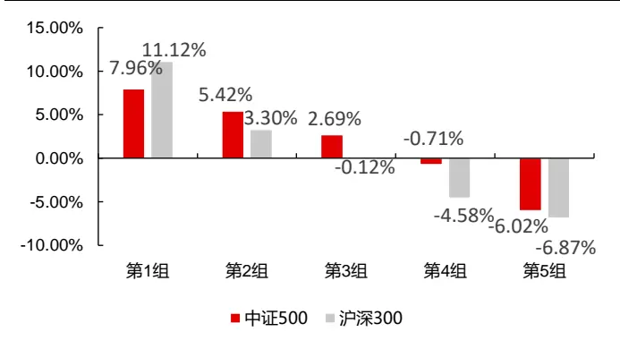
资料来源：天软，Wind，长江证券研究所

图 8：收盘 60分钟成交占比因子分组表现
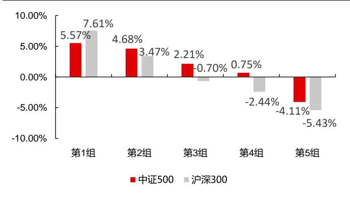
资料来源：天软，Wind，长江证券研究所

## 资金流向

资金流向指标反映了一段时间内股票的供需关系，如果股价上涨我们认为股票的需求大于供给，资金呈流入状态；反之我们则认为供给大于需求，资金流出。指标计算公式如下：

$$
\dot{\mathcal{Z}}\dot{\mathcal{Z}}\dot{\mathcal{Z}}\dot{\mathcal{W}}\dot{\mathcal{P}}\dot{\mathcal{J}}=\frac{\sum_{i=1}^{N}Amount_{i}\times\frac{Close_{i}-Close_{i-1}}{|Close_{i}-Close_{i-1}|}}{\sum_{i=1}^{N}Amount_{i}}
$$

其中Amount 为 1 分钟内成交额，Close 为 1分钟收盘价。

从图 9 我们可以看到，资金流向在中证 500 成分股中的单调性较为明显，但空头效应不是很明显，而在沪深 300 成分股中则完全没有单调性。

图 9：资金流向因子分组表现
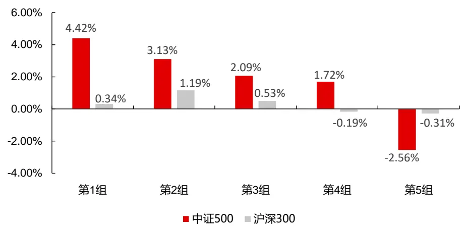
资料来源：天软，Wind，长江证券研究所

## 量价相关性

量价相关性可以用来衡量成交量和股价之间的趋同或背离程度，趋同程度高反映了股票交易行为中存在着羊群效应，从而进一步导致了短期的过度反应和随后的收益反转效应。这里我们用成交量和股价以及收益率的相关性来表示这一指标。

从因子分组表现来看，量-价相关性因子的表现显著好于量-收益率相关性，中证 500 和沪深 300 成分股中空头组的负面超额收益分别达到了 10.35%和 10.4%，但是都没有明显的单调性。

图 10：量-价相关性因子分组表现
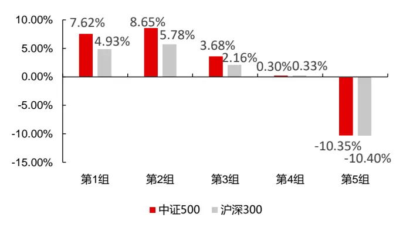
资料来源：天软，Wind，长江证券研究所

图 11：量-收益率相关性因子分组表现
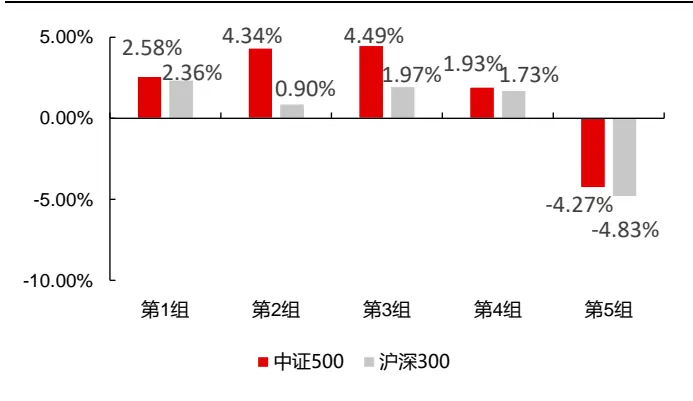
资料来源：天软，Wind，长江证券研究所

## 高阶矩

高阶矩因子刻画了股票收益率的分布情况，直接反映了交易行为中的异常程度，公式如下：

$$
4\acute{\chi}\dot{\widetilde{z}}\widetilde{\pi}\dot{\overline{{{z}}}}\widetilde{\pi}\dot{\overline{{{z}}}}\dot{\overline{{{z}}}}Var=\frac{\sum_{i=1}^{N}\left(r_{i}-r_{Avg}\right)^{2}}{N-1}
$$

$$
4\textcircled{\div}\frac{\div}{2m}=\textcircled{\div}\frac{\rho}{4m}\times\frac{\div}{2}.5kewness=\frac{\sum_{i=1}^{N}\bigl(r_{i}-r_{Avg}\bigr)^{3}}{(N-1)Var^{\frac{3}{2}}}
$$

$$
4\times\frac{3}{200}=\frac{4}{160}(\frac{3}{2})\frac{4}{5}Kurtosis=\frac{\sum_{i=1}^{N}\bigl(r_{i}-r_{Avg}\bigr)^{4}}{(N-1)Var^{2}}
$$

其中 $r_{i}$ 为 1 分钟对数收益率， $r_{Avg}$ 为每天的 1 分钟对数收益率平均。

中证 500 成分股中空头组表现较好的是收益率方差，负面超额收益达到了 7.73%，但是各组的单调性较差。多头组表现最好的是收益率峰度，且具有一定的单调性。

沪深 300 成分股中空头组表现较好的是收益率偏度和收益率峰度，但是单调性都较差。

图 12：收益率方差因子分组表现
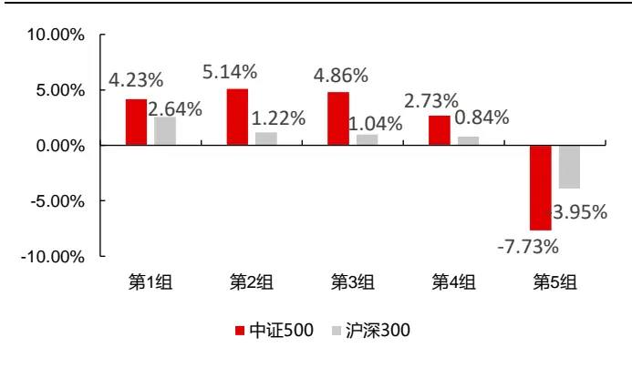
资料来源：天软，Wind，长江证券研究所

图 13：收益率偏度因子分组表现
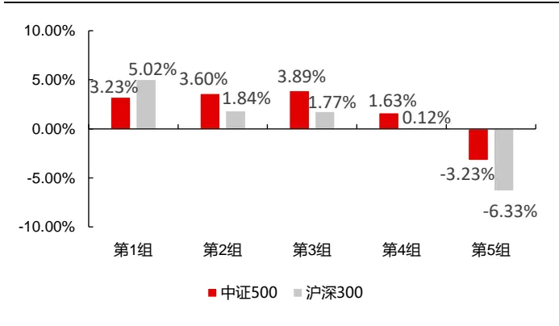
资料来源：天软，Wind，长江证券研究所

图 14：收益率峰度因子分组表现
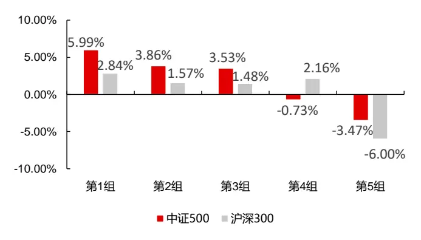
资料来源：天软，Wind，长江证券研究所

## 结构化反转

从报告《高频因子（二）：结构化反转因子》中我们了解到交易层面的反转效应会和成交活跃程度相关，成交量越低反转效应越弱，且到达一定阈值后转变为动量效应。基于此特性，给出了结构化反转因子的构建方法：

$$
\mathcal{\underline{{L}}}\sharp\sharp\mathcal{J}/\mathcal{L}/\mathscr{Z}\mathscr{\sharp}\mathscr{\sharp}=\frac{\sum_{i=1}^{N}r_{i}\times volume_{i}}{\sum_{i=1}^{N}volume_{i}}
$$

其中r为 1 分钟对数收益率。

结构化反转因子在中证 500 和沪深 300 成分股中的空头组具有较强的负向超额收益，分别为 7.26%和 6.25%。

图 15：结构化反转因子分组表现
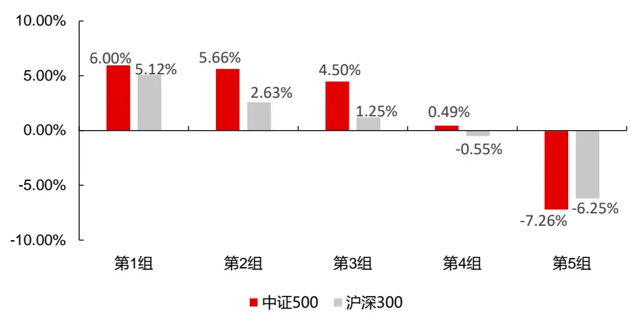
资料来源：天软，Wind，长江证券研究所

## 非流动性

在报告《高频因子（五）：高频因子和交易行为》中介绍了 Amihud（2003）以收益率和成交额构建的非流动性因子，并以轨迹变动的方式对非流动性因子进行了改进：

$$
E{\ '}={\ '}jk\rangle\dot{\mathcal{Z}}{\dot{\mathcal{W}}}{\dot{\mathcal{Z}}}{\dot{\mathcal{W}}}/{\dot{\mathcal{W}}}=mean\left({\frac{|Return_{i}|}{Amount_{i}}}\right)
$$

$$
2\xi\zeta i\#\exists\mathcal{I}\xi\dot{\mathcal{W}}\dot{z}\dot{z}\delta\dot{\mathcal{W}}/\mathcal{G}=\frac{\log\prod(1+|Return_{i}|)}{\sum_{i=1}^{N}Amount_{i}}
$$

其中 $Return_{i}$ 为 1 分钟收益率， $Amount_{i}$ 为 1 分钟成交额。

非流动性表示过去一段时间每单位成交额带来的价格变动，以衡量个股受冲击层面的影响，同等价格变动需要的成交额越大，个股流动性越好，所以因子值越大，个股非流动性越强。一般来说个股流动性越差，风险越高，可以从中获取流动性溢价。

非流动性因子在中证 500 中的表现要明显好于在沪深 300 中的表现，中证 500 中多头组和空头组的超额收益较显著，且各组单调性更明显。

图 16：原非流动性因子分组表现
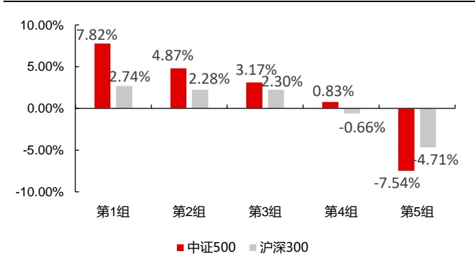
资料来源：天软，Wind，长江证券研究所

图 17：改进非流动性因子分组表现
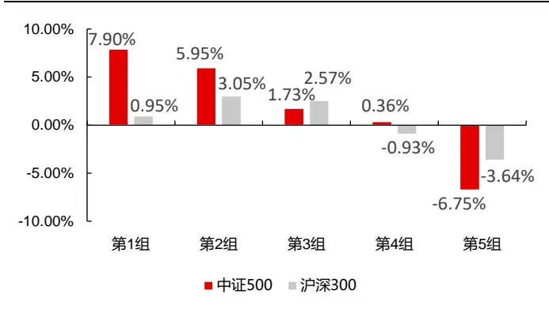
资料来源：天软，Wind，长江证券研究所

## 高频因子负面组合表现

通过单因子分组表现的测算，下面我们挑选在中证 500 和沪深 300 中有较强负向超额收益的因子来合成负面因子，大类因子内部按等权合成，如表 2 所示。

表 2：高频负面因子合成

| 大类 | 中证500 | 沪深300 | 方向 |
| --- | --- | --- | --- |
| 开盘成交占比 | 开盘5 分钟成交占比 | 开盘5分钟成交占比 | -1 |
|  | 开盘15 分钟成交占比 | 开盘15分钟成交占比 |  |
| 收盘成交占比 | 收盘 5 分钟成交占比 | 收盘5 分钟成交占比 | -1 |
|  | 收盘 15 分钟成交占比 | 收盘 15 分钟成交占比 |  |
| 量价相关性 | 量-价相关性 | 量-价相关性 | -1 |
| 高阶矩 | 收益率方差 | 收益率偏度 | -1 |
|  |  | 收益率峰度 |  |
| 反转 | 结构化反转 | 结构化反转 | -1 |
| 非流动性 | 原非流动性 | 原非流动性 | 1 |
|  | 改进非流动性 |  |  |

资料来源：长江证券研究所

为了进一步观察这些因子的长期有效性，我们利用每个因子的空头组建立负面组合，并从中证 500/沪深 300 成分股中剔除空头组建立指数增强组合，对比两个组合的表现，具体测算方法如下：

选股范围：中证 500/沪深 300 成分股；

- 组合构建：按因子排序把空头组（排名最后 1/5 股票）作为负面组合，并从指数成分股中剔除空头组建立指数增强组合，同时保持行业市值中性；

加权方式：流通市值加权；

## 开盘成交占比

开盘成交占比在中证 500 中负面组合从长期看能获得较稳定的负面 Alpha，净值比（负面组合/指数增强组合，下同）自 2013 年以后持续向下，平均每年跑输 7.99%。沪深300 的负面组合表现则较不稳定，超额收益的波动较大。

图 18：开盘成交占比因子在中证500中负面组合净值表现
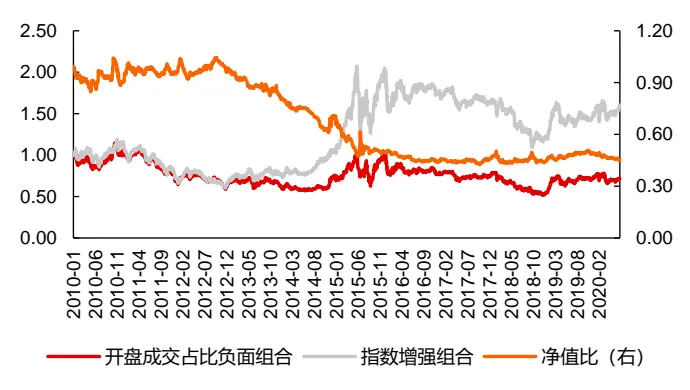
资料来源：天软，Wind，长江证券研究所

图 19：开盘成交占比因子在沪深300中负面组合净值表现
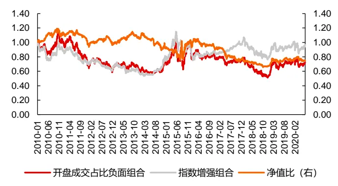
资料来源：天软，Wind，长江证券研究所

表 3：开盘成交占比因子负面组合年化收益

| 中证500 |  |  |  |  | 沪深300 |  |
| --- | --- | --- | --- | --- | --- | --- |
| 年份 | 负面组合 | 指数增强组合 | 负面 Alpha | 负面组合 | 指数增强组合 | 负面 Alpha |
| 2010 | -0.46% | 4.38% | -4.84% | -0.46% | -11.92% | 11.47% |
| 2011 | -32.18% | -32.53% | 0.34% | -32.18% | -20.66% | -11.53% |
| 2012 | -0.56% | -1.55% | 0.99% | -0.56% | -2.63% | 2.07% |
| 2013 | -7.54% | 11.19% | -18.73% | -7.54% | -13.31% | 5.77% |
| 2014 | 16.44% | 33.87% | -17.43% | 16.44% | 33.00% | -16.56% |
| 2015 | 38.11% | 94.37% | -56.26% | 38.11% | 23.18% | 14.93% |
| 2016 | -23.38% | -13.52% | -9.86% | -23.38% | -13.43% | -9.95% |
| 2017 | -2.46% | -6.48% | 4.03% | -2.46% | 16.02% | -18.48% |
| 2018 | -30.40% | -27.59% | -2.81% | -30.40% | -19.88% | -10.52% |
| 2019 | 44.24% | 29.94% | 14.30% | 44.24% | 27.47% | 16.78% |
| 2020 | -3.73% | 5.21% | -8.94% | -3.73% | -2.33% | -1.41% |
| 合计 | -3.20% | 4.79% | -7.99% | -3.20% | -0.33% | -2.87% |

资料来源：天软，Wind，长江证券研究所

## 收盘成交占比

收盘成交占比在中证500中的负面组合除了2010和2016年都能跑输了指数增强组合，净值比持续向下，平均每年跑输13.56%。沪深300中的负面组合平均每年跑输6.92%。

图 20：收盘成交占比因子在中证500中负面组合净值表现
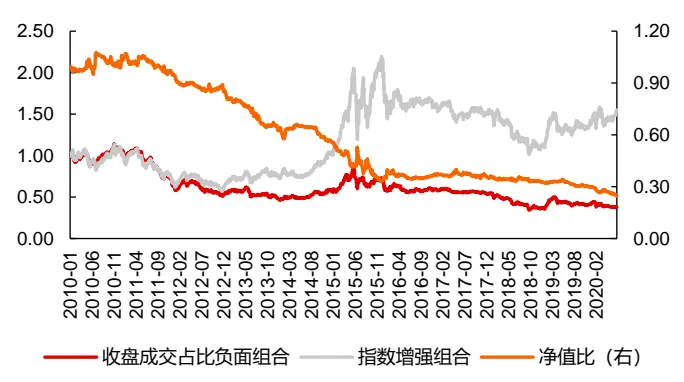
资料来源：天软，Wind，长江证券研究所

图 21：收盘成交占比因子在沪深300中负面组合净值表现
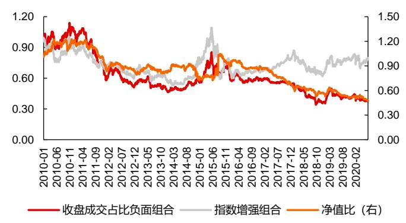
资料来源：天软，Wind，长江证券研究所

表 4：收盘成交占比因子负面组合年化收益

| 中证500 |  |  |  |  |  |
| --- | --- | --- | --- | --- | --- |
| 年份 | 负面组合 | 指数增强组合 | 负面 Alpha | 负面组合 | 沪深300 指数增强组合 负面 Alpha |
| 2010 | 5.21% | 1.44% | 3.77% | 5.21% -13.32% | 18.53% |
| 2011 | -40.61% | -34.79% -5.82% | -40.61% | -21.07% | -19.55% |
| 2012 | -12.27% | 1.54% | -13.82% -12.27% | -0.26% | -12.02% |
| 2013 | -12.04% | 13.84% | -25.88% | -12.04% -13.65% | 1.61% |
| 2014 | 19.38% | 32.81% | -13.42% | 19.38% 30.20% | -10.82% |
| 2015 | 24.97% | 112.46% | -87.49% | 24.97% -0.64% | 25.61% |
| 2016 | -18.17% | -26.50% | 8.33% | -18.17% | -13.82% -4.35% |
| 2017 | -9.86% | -5.52% | -4.34% | -9.86% | 19.95% -29.80% |
| 2018 | -32.08% | -27.58% | -4.49% | -32.08% | -20.24% -11.84% |
| 2019 | 19.02% | 32.61% | -13.58% | 19.02% | 30.45% -11.43% |
| 2020 | -11.12% | 7.99% | -19.11% | -11.12% | -2.42% -8.70% |
| 合计 | -9.12% | 4.44% | -13.56% | -9.12% | -2.20% -6.92% |

资料来源：天软，Wind，长江证券研究所

## 量价相关性

量价相关性从稳定性上看是所有因子中表现最好的，负面组合在中证 500 和沪深 300中绝大多数年份都能跑输指数增强组合，净值比均稳定向下，平均年化负面 Alpha 分别为 17.27%和 12.75%，远远跑输指数增强组合。

图 22：量价相关性因子在中证 500 中负面组合净值表现
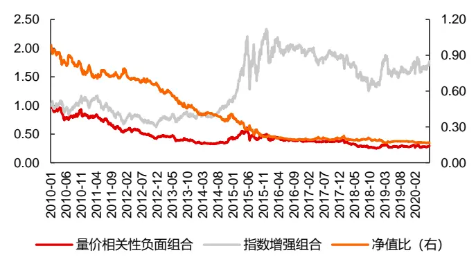
资料来源：天软，Wind，长江证券研究所

图 23：量价相关性因子在沪深 300 中负面组合净值表现
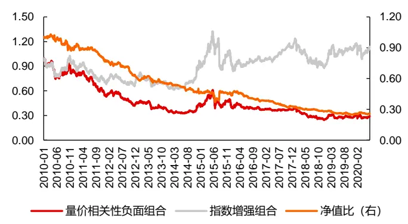
资料来源：天软，Wind，长江证券研究所

表 5：量价相关性因子负面组合年化收益

| 中证500 |  |  |  |  |  |
| --- | --- | --- | --- | --- | --- |
| 年份 | 负面组合 | 指数增强组合 | 负面 Alpha | 负面组合 | 沪深300 指数增强组合 负面 Alpha |
| 2010 | -17.99% | 8.22% | -26.21% | -17.99% -10.03% | -7.97% |
| 2011 | -34.58% | -33.26% | -1.32% -34.58% | -22.73% | -11.85% |
| 2012 | -14.81% | 1.65% | -16.46% | -14.81% 8.84% | -23.65% |
| 2013 | -20.99% | 10.98% | -31.97% | -20.99% -12.64% | -8.35% |
| 2014 | 17.78% | 30.93% | -13.15% | 17.78% 41.77% | -24.00% |
| 2015 | 15.64% | 114.69% | -99.05% | 15.64% 13.61% | 2.03% |
| 2016 | -25.17% | -15.85% | -9.32% | -25.17% | -10.23% -14.94% |
| 2017 | 0.09% | -5.56% | 5.65% | 0.09% | 17.91% -17.82% |
| 2018 | -32.24% | -26.42% | -5.82% | -32.24% | -21.02% -11.22% |
| 2019 | 19.32% | 24.84% | -5.51% | 19.32% | 30.44% -11.12% |
| 2020 | -1.62% | 6.07% | -7.69% | -1.62% | -1.76% 0.13% |
| 合计 | -11.45% | 5.82% | -17.27% | -11.45% | 1.30% -12.75% |

资料来源：天软，Wind，长江证券研究所

## 高阶矩

高阶矩因子在中证 500 中的负面组合在所有年份都能跑输指数增强组合，稳定性较强，平均每年跑输 10.78%。沪深 300 中的负面组合也在大部分年份能跑输指数增强组合，平均每年跑输 6.19%。

图 24：高阶矩因子在中证 500 中负面组合净值表现
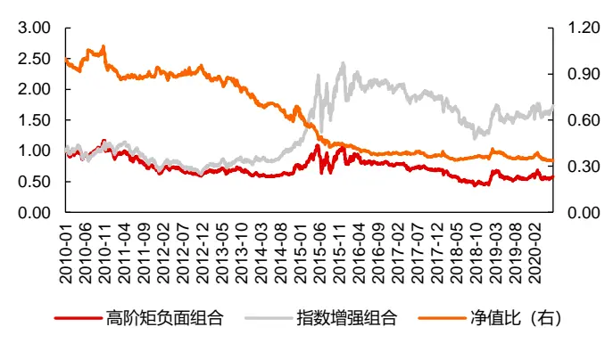
资料来源：天软，Wind，长江证券研究所

图 25：高阶矩因子在沪深 300中负面组合净值表现
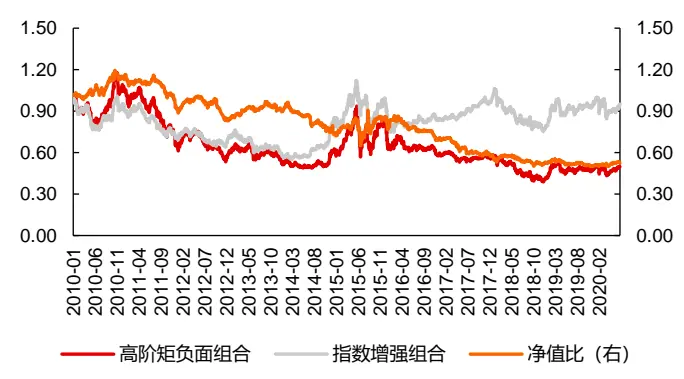
资料来源：天软，Wind，长江证券研究所

表 6：高阶矩因子负面组合年化收益

| 中证500 |  |  |  |  |  |
| --- | --- | --- | --- | --- | --- |
| 年份 | 负面组合 | 指数增强组合 | 负面 Alpha | 负面组合 | 沪深300 指数增强组合 负面 Alpha |
| 2010 | 0.27% | 6.14% | -5.87% | 3.79% -10.64% | 14.43% |
| 2011 | -32.73% | -32.49% | -0.24% -38.18% | -21.35% | -16.83% |
| 2012 | -4.49% | -0.07% | -4.43% | -5.93% 2.08% | -8.01% |
| 2013 | -4.52% | 15.09% | -19.61% | -9.99% -16.46% | 6.47% |
| 2014 | 23.46% | 34.16% | -10.70% | 10.99% 36.12% | -25.13% |
| 2015 | 38.09% | 115.57% | -77.49% | 36.25% 17.10% | 19.16% |
| 2016 | -26.97% | -15.56% | -11.41% | -29.79% -12.87% | -16.91% |
| 2017 | -10.76% | -8.60% | -2.15% | -3.98% | 15.70% -19.68% |
| 2018 | -33.54% | -30.83% | -2.71% | -29.23% | -20.60% -8.63% |
| 2019 | 28.28% | 29.60% | -1.32% | 27.28% | 28.23% -0.96% |
| 2020 | 0.38% | 5.23% | -4.85% | -0.19% | -2.81% 2.63% |
| 合计 | -5.18% | 5.59% | -10.78% | -6.68% | -0.49% -6.19% |

资料来源：天软，Wind，长江证券研究所

## 反转

反转因子在中证 500 中的平均年化负面 Alpha 为 13.01%，除了 2011 年和2017 年，其他年份都能获得负面 Alpha，净值比稳定向下。沪深 300 中的负面组合在 2015 年的表现较差，其他年份基本能跑输指数增强组合，平均跑输 6.62%。

图 26：反转因子在中证 500中负面组合净值表现
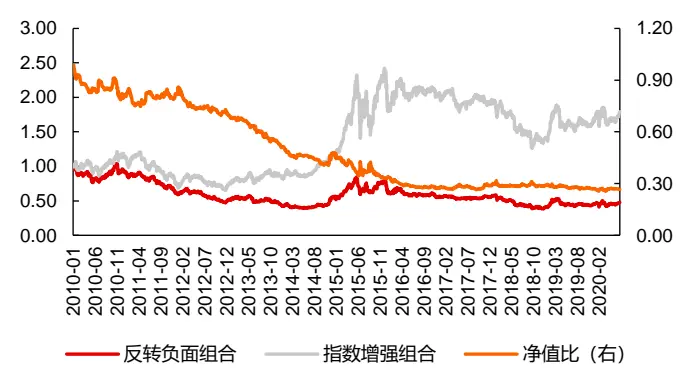
资料来源：天软，Wind，长江证券研究所

图 27：反转因子在沪深 300中负面组合净值表现
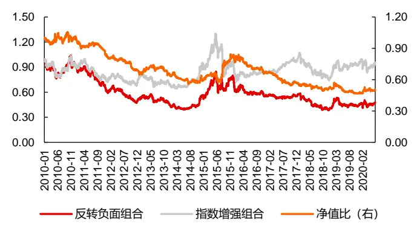
资料来源：天软，Wind，长江证券研究所

表 7：反转因子负面组合年化收益

| 中证500 |  |  |  |  |  |
| --- | --- | --- | --- | --- | --- |
| 年份 | 负面组合 | 指数增强组合 | 负面 Alpha | 负面组合 | 沪深300 指数增强组合 负面 Alpha |
| 2010 | -9.22% | 12.23% | -21.45% | -9.22% -8.15% | -1.06% |
| 2011 | -34.03% | -34.65% 0.61% | -34.03% | -20.13% | -13.91% |
| 2012 | -13.55% | 2.22% | -15.77% -13.55% | 7.79% | -21.35% |
| 2013 | -14.06% | 15.27% | -29.33% | -14.06% -11.66% | -2.41% |
| 2014 | 22.35% | 32.98% | -10.64% | 22.35% 30.21% | -7.86% |
| 2015 | 43.62% | 106.45% | -62.83% | 43.62% 2.57% | 41.05% |
| 2016 | -29.78% | -15.10% | -14.68% | -29.78% | -11.58% -18.20% |
| 2017 | 0.25% | -5.62% | 5.87% | 0.25% | 17.77% -17.51% |
| 2018 | -29.98% | -28.90% | -1.08% | -29.98% | -22.21% -7.77% |
| 2019 | 19.89% | 26.28% | -6.39% | 19.89% | 28.80% -8.92% |
| 2020 | 3.35% | 5.09% | -1.75% | 3.35% | -1.72% 5.07% |
| 合计 | -7.07% | 5.94% | -13.01% | -7.07% | -0.45% -6.62% |

资料来源：天软，Wind，长江证券研究所

## 非流动性

非流动性负面组合在中证 500 和沪深 300 中的平均年化负面 Alpha 分别为 11.07%和6.52%，有一定的空头效应，但在 2017 年的表现较差。

图 28：非流动性因子在中证 500 中负面组合净值表现
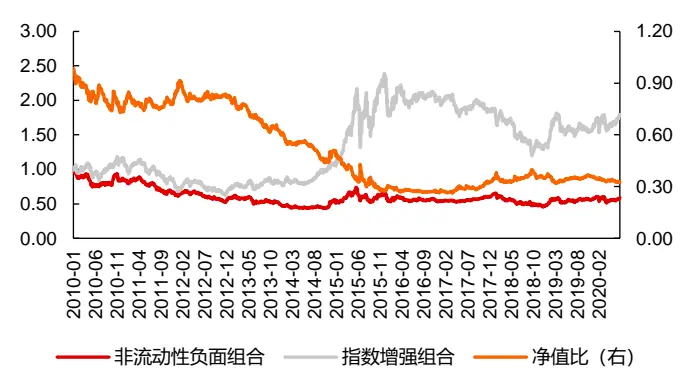
资料来源：天软，Wind，长江证券研究所

图 29：非流动性因子在沪深 300中负面组合净值表现
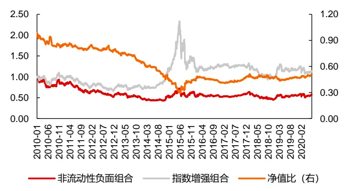
资料来源：天软，Wind，长江证券研究所

表 8：非流动性因子负面组合年化收益

| 中证500 |  |  |  |  |  |
| --- | --- | --- | --- | --- | --- |
| 年份 | 负面组合 | 指数增强组合 | 负面 Alpha | 负面组合 | 沪深300 指数增强组合 负面 Alpha |
| 2010 | -16.63% | 5.47% | -22.11% | -16.55% -2.15% | -14.40% |
| 2011 | -25.42% | -30.94% | 5.52% -26.53% | -23.48% | -3.05% |
| 2012 | -5.60% | -1.32% | -4.28% | -4.34% 1.06% | -5.41% |
| 2013 | -16.51% | 12.79% | -29.29% | -17.27% 0.46% | -17.73% |
| 2014 | 8.97% | 31.29% | -22.32% | 8.55% 50.99% | -42.45% |
| 2015 | 21.38% | 119.29% | -97.91% | 21.31% 23.64% | -2.33% |
| 2016 | -17.81% | -14.26% | -3.56% | -18.88% -12.50% | -6.38% |
| 2017 | 13.27% | -8.27% | 21.54% | 14.00% -1.95% | 15.95% |
| 2018 | -23.04% | -28.75% | 5.71% | -22.87% | -20.66% -2.20% |
| 2019 | 27.35% | 28.07% | -0.72% | 27.49% 28.50% | -1.01% |
| 2020 | -0.42% | 7.21% | -7.63% | 0.56% | -7.80% 8.36% |
| 合计 | -5.12% | 5.95% | -11.07% | -5.19% | 1.33% -6.52% |

资料来源：天软，Wind，长江证券研究所

## 指数增强策略

下面我们利用上一部分测算下来负面 Alpha 比较强的几个因子合成一个新的负面因子来对指数收益进行增强，主要思路和单因子的做法类似，也是将负面因子的空头组从指数成分股中剔除，通过减少负向超额收益来提高指数整体收益。

## 简单增强策略

我们先来看一下简单的等权配置增强策略，回测方法如下：

- 选股范围：中证 500/沪深 300 成分股；

- 因子合成：中证 500 为开盘成交占比、收盘成交占比、量价相关性、高阶矩、反转和非流动性因子等权，沪深 300 为收盘成交占比、量价相关性、高阶矩、反转和非流动性因子等权；

- 组合构建：按合成因子排序，从指数成分股中剔除空头组（排名最后 1/5 股票）建立指数增强组合，同时保持行业市值中性；

Y加权方式：流通市值加权；

## 中证500 回测结果

简单增强策略与中证 500 的净值比曲线持续向上，说明策略获得的超额收益比较稳定。

图 30：中证 500简单增强策略净值表现
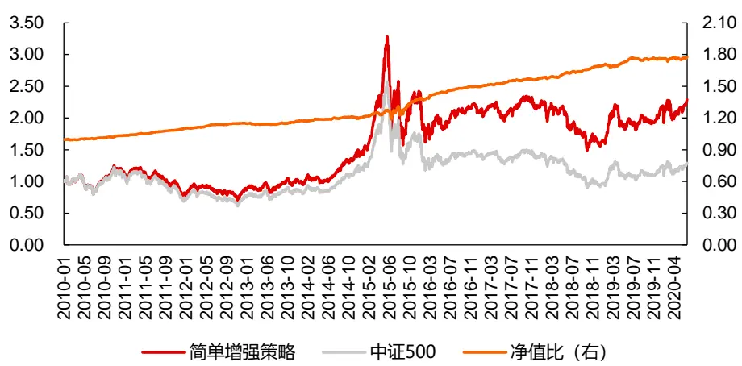
资料来源：天软，Wind，长江证券研究所

从历史表现看，简单增强策略在中证500中的平均年化收益为8.54%，跑赢指数5.99%，相对基准的最大回撤为5.53%，收益回撤比为1.08，信息比率为1.79，跟踪误差为3.38%。从分年表现看，策略在所有年份均跑赢了中证 500，月度跑赢概率为 75.59%。

表 9：中证 500简单增强策略分年表现

| 年份 | 绝对收益 | 超额收益 | 相对最大回撤 | 收益回撤比 | 信息比率 | 跟踪误差 | 月度超额胜率 |
| --- | --- | --- | --- | --- | --- | --- | --- |
| 2010 | 13.97% | 3.91% | 0.90% | 4.36 | 2.00 | 1.81% | 66.67% |
| 2011 | -29.62% | 4.21% | 0.43% | 9.88 | 4.15 | 1.52% | 100.00% |
| 2012 | 4.93% | 4.66% | 0.43% | 10.75 | 3.36 | 1.41% | 83.33% |
| 2013 | 18.95% | 2.07% | 0.88% | 2.34 | 1.00 | 1.86% | 58.33% |
| 2014 | 42.54% | 3.53% | 1.26% | 2.80 | 1.22 | 2.14% | 66.67% |
| 2015 | 64.95% | 21.83% | 5.53% | 3.95 | 2.04 | 8.94% | 75.00% |
| 2016 | -11.29% | 6.48% | 0.79% | 8.23 | 3.17 | 2.62% | 83.33% |
| 2017 | 5.11% | 5.31% | 0.50% | 10.65 | 3.11 | 1.73% | 91.67% |
| 2018 | -28.34% | 4.98% | 0.80% | 6.25 | 3.89 | 1.98% | 91.67% |
| 2019 | 31.90% | 5.52% | 1.30% | 4.25 | 1.83 | 2.28% | 58.33% |
| 2020 | 10.43% | 0.63% | 1.41% | 0.45 | 0.39 | 2.86% | 50.00% |
| 全部 | 8.54% | 5.99% | 5.53% | 1.08 | 1.79 | 3.38% | 75.59% |

资料来源：天软，Wind，长江证券研究所

## 沪深300 回测结果

策略与沪深 300 的净值比总体向上，但波动较大，2019 年以来净值比有所回撤。

图 31：沪深 300简单增强策略净值表现
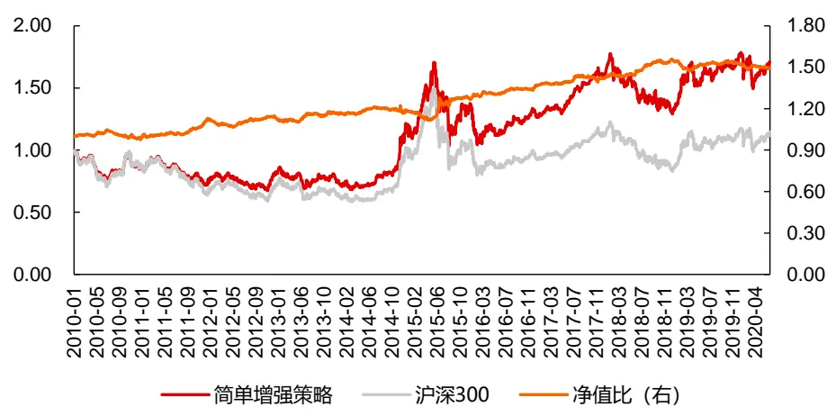
资料来源：天软，Wind，长江证券研究所

从历史表现看，策略在沪深 300 中的表现要稍差一下，平均年化收益为 5.44%，跑赢指数 4.08%，相对基准的最大回撤为 3.55%，收益回撤比为 1.15。从分年表现看，最近两年策略都没跑赢沪深 300，月度跑赢概率为 55.12%。

表 10：沪深 300简单增强策略分年表现

| 年份 | 绝对收益 | 超额收益 | 相对最大回撤 | 收益回撤比 | 信息比率 | 跟踪误差 | 月度超额胜率 |
| --- | --- | --- | --- | --- | --- | --- | --- |
| 2010 | -13.64% | -1.13% | 1.81% | -0.62 | -0.44 | 4.04% | 41.67% |
| 2011 | -15.41% | 9.60% | 1.60% | 6.00 | 2.63 | 4.54% | 83.33% |
| 2012 | 10.53% | 2.98% | 1.16% | 2.56 | 0.59 | 3.99% | 66.67% |
| 2013 | -5.98% | 1.66% | 1.77% | 0.94 | 0.27 | 4.95% | 50.00% |
| 2014 | 53.56% | 1.90% | 3.55% | 0.54 | 0.25 | 5.41% | 41.67% |
| 2015 | 14.41% | 8.82% | 3.55% | 2.49 | 1.04 | 7.84% | 58.33% |
| 2016 | -4.69% | 6.59% | 1.40% | 4.71 | 2.13 | 3.36% | 58.33% |
| 2017 | 26.89% | 5.11% | 1.05% | 4.86 | 1.15 | 3.61% | 58.33% |
| 2018 | -18.71% | 6.60% | 1.13% | 5.85 | 2.37 | 3.59% | 66.67% |
| 2019 | 33.40% | -2.67% | 1.53% | -1.74 | -0.77 | 3.20% | 50.00% |
| 2020 | -2.19% | -2.32% | 1.30% | -1.79 | -1.76 | 3.24% | 16.67% |
| 全部 | 5.44% | 4.08% | 3.55% | 1.15 | 0.79 | 4.60% | 55.12% |

资料来源：天软，Wind，长江证券研究所

## 合成因子负面组合表现

简单增强策略合成因子的负面组合在中证 500 中表现较稳定，与指数增强组合的净值比稳定向下，每年都能获得负向超额收益，平均年化负面 Alpha 达到了 21.44%。负面组合在沪深 300 中有 3 年没跑输指数增强组合，稳定性相比中证 500 稍差，平均年化负面 Alpha 为 16.59%。

图 32：中证 500 合成因子负面组合净值表现
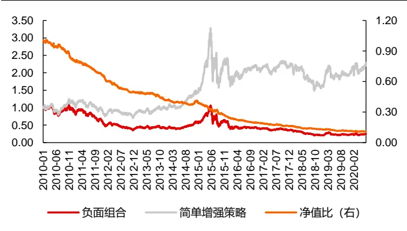
资料来源：天软，Wind，长江证券研究所

图 33：沪深 300合成因子负面组合净值表现
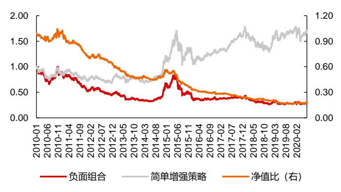
资料来源：天软，Wind，长江证券研究所

表 11：负面组合年化收益

| 中证500 |  |  |  |  | 沪深300 |  |
| --- | --- | --- | --- | --- | --- | --- |
| 年份 | 负面组合 | 指数增强组合 | 负面 Alpha | 负面组合 | 指数增强组合 | 负面 Alpha |
| 2010 | -7.90% | 13.97% | -21.87% | -12.71% | -13.64% | 0.93% |
| 2011 | -44.39% | -29.62% | -14.77% | -39.86% | -15.41% | -24.44% |
| 2012 | -18.78% | 4.93% | -23.71% | -7.35% | 10.53% | -17.89% |
| 2013 | 0.28% | 18.95% | -18.68% | -27.70% | -5.98% | -21.71% |
| 2014 | 40.80% | 42.54% | -1.75% | 84.94% | 53.56% | 31.38% |
| 2015 | 1.78% | 64.95% | -63.16% | -28.16% | 14.41% | -42.57% |
| 2016 | -32.40% | -11.29% | -21.11% | -23.49% | -4.69% | -18.79% |
| 2017 | -11.92% | 5.11% | -17.03% | 8.18% | 26.89% | -18.71% |
| 2018 | -42.02% | -28.34% | -13.69% | -31.60% | -18.71% | -12.89% |
| 2019 | 13.13% | 31.90% | -18.77% | 12.74% | 33.40% | -20.66% |
| 2020 | 6.36% | 10.43% | -4.08% | 1.85% | -2.19% | 4.04% |
| 合计 | -12.90% | 8.54% | -21.44% | -11.14% | 5.44% | -16.59% |

资料来源：天软，Wind，长江证券研究所

## 复杂增强策略

简单增强策略利用了因子的空头效应来增强指数收益，但是在单因子分组表现的测算中我们发现有的高频因子的多头组的正向超额收益也是比较显著的，下面我们尝试把因子的多头效应也加入到我们的回测框架里面来，这里主要选取多头组超额收益比较强且分组收益单调性比较明显的因子，具体回测方法如下：

- 选股范围：中证 500/沪深 300 成分股；

- 负面因子：中证 500 为开盘成交占比、收盘成交占比、量价相关性、高阶矩、反转和非流动性因子等权，沪深 300 为收盘成交占比、量价相关性、高阶矩、反转和非流动性因子等权；

- 正面因子：中证 500 为开盘成交占比、收盘成交占比、峰度、反转和非流动性因子等权，沪深 300 为开盘成交占比和收盘成交占比因子等权；

- 组合构建：按合成因子排序，从指数成分股中剔除空头组（负面因子排名后 1/5股票），并把剔除股票的仓位配置到多头组（正面因子排名前 1/5 股票），同时保持行业市值中性；

- 加权方式：流通市值加权；

## 中证500 回测结果

复杂增强策略与中证 500 的净值比曲线也比较稳定且持续向上，超额收益比较稳定。

图 34：中证 500复杂增强策略净值表现
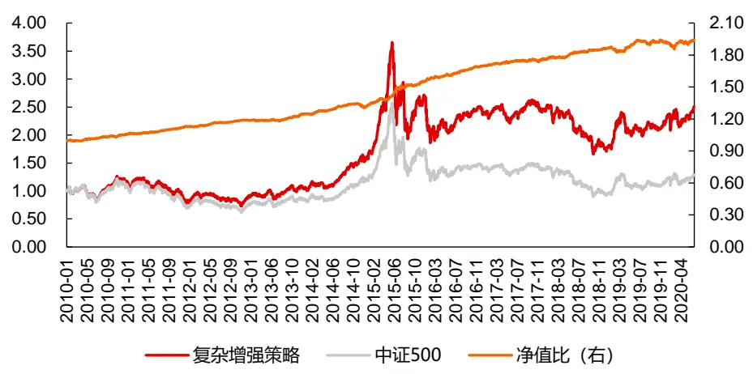
资料来源：天软，Wind，长江证券研究所

从历史表现看，在中证 500 中复杂增强策略各项指标都有所提升，平均年化收益为9.61%，超额指数7.06%，相对基准的最大回撤为 1.76%，收益回撤比为 3.96，信息比率为 2.4，跟踪误差为 2.66%。从分年表现看，策略同样在所有年份均跑赢了中证 500，且超额收益更显著，月度跑赢概率提高到 77.17%。

表 12：中证 500复杂增强策略分年表现

| 年份 | 绝对收益 | 超额收益 | 相对最大回撤 | 收益回撤比 | 信息比率 | 跟踪误差 | 月度超额胜率 |
| --- | --- | --- | --- | --- | --- | --- | --- |
| 2010 | 16.33% | 6.26% | 0.91% | 6.88 | 2.39 | 2.33% | 75.00% |
| 2011 | -28.99% | 4.84% | 0.41% | 11.72 | 3.52 | 2.00% | 83.33% |
| 2012 | 5.31% | 5.03% | 0.44% | 11.40 | 3.06 | 1.61% | 75.00% |
| 2013 | 22.60% | 5.71% | 0.71% | 8.04 | 2.05 | 2.36% | 66.67% |
| 2014 | 45.87% | 6.86% | 1.67% | 4.12 | 1.98 | 2.44% | 66.67% |
| 2015 | 69.80% | 26.69% | 0.88% | 30.39 | 4.35 | 4.02% | 83.33% |
| 2016 | -10.00% | 7.77% | 0.76% | 10.18 | 4.05 | 2.25% | 100.00% |
| 2017 | 3.50% | 3.71% | 0.67% | 5.50 | 1.58 | 2.30% | 91.67% |
| 2018 | -29.56% | 3.76% | 0.87% | 4.30 | 2.62 | 2.10% | 91.67% |
| 2019 | 30.63% | 4.25% | 1.76% | 2.41 | 0.95 | 3.21% | 58.33% |
| 2020 | 10.91% | 1.11% | 1.55% | 0.67 | 0.40 | 4.24% | 58.33% |
| 全部 | 9.61% | 7.06% | 1.76% | 3.96 | 2.40 | 2.66% | 77.17% |

资料来源：天软，Wind，长江证券研究所

## 沪深300 回测结果

从沪深 300 回测结果来看，复杂增强策略相比简单增强策略稍有改善，平均年化收益为6.65%，跑赢指数 5.28%，收益回撤比为 1.28，信息比率为 1.02，月度跑赢概率提高到 62.99%，但最近两年仍然跑输指数。

图 35：沪深 300复杂增强策略净值表现
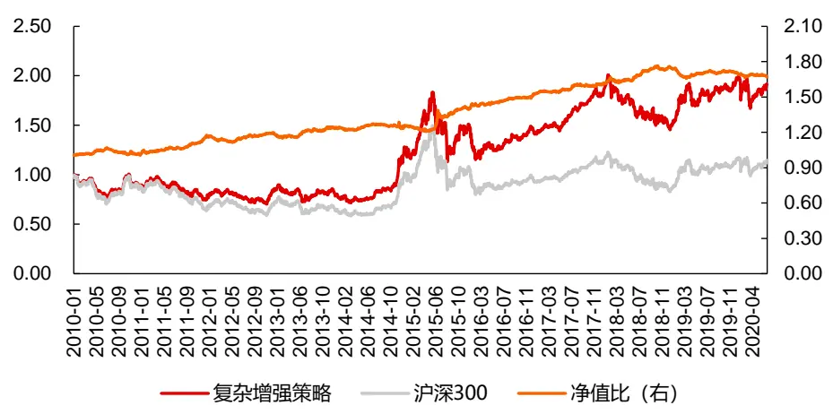
资料来源：天软，Wind，长江证券研究所

表 13：沪深 300 复杂增强策略分年表现

| 年份 | 绝对收益 | 超额收益 | 相对最大回撤 | 收益回撤比 | 信息比率 | 跟踪误差 | 月度超额胜率 |
| --- | --- | --- | --- | --- | --- | --- | --- |
| 2010 | -11.25% | 1.26% | 1.93% | 0.66 | 0.26 | 4.22% | 58.33% |
| 2011 | -14.44% | 10.57% | 1.63% | 6.50 | 2.85 | 4.63% | 83.33% |
| 2012 | 11.00% | 3.45% | 1.45% | 2.38 | 0.68 | 4.09% | 66.67% |
| 2013 | -4.36% | 3.29% | 1.77% | 1.86 | 0.63 | 5.04% | 58.33% |
| 2014 | 52.55% | 0.89% | 3.61% | 0.25 | 0.12 | 5.28% | 50.00% |
| 2015 | 19.22% | 13.63% | 4.13% | 3.30 | 1.53 | 7.77% | 66.67% |
| 2016 | -3.18% | 8.10% | 1.15% | 7.05 | 2.40 | 3.61% | 83.33% |
| 2017 | 28.61% | 6.84% | 0.90% | 7.62 | 1.66 | 3.35% | 75.00% |
| 2018 | -18.96% | 6.35% | 1.50% | 4.25 | 2.07 | 3.96% | 66.67% |
| 2019 | 32.26% | -3.81% | 1.63% | -2.34 | -1.12 | 2.95% | 41.67% |
| 2020 | -1.97% | -2.11% | 0.94% | -2.25 | -1.85 | 2.76% | 33.33% |
| 全部 | 6.65% | 5.28% | 4.13% | 1.28 | 1.02 | 4.62% | 62.99% |

资料来源：天软，Wind，长江证券研究所

## 总结

## 1. 高频因子的空头组具有显著的负向超额

从因子分组表现看，开盘成交占比、收盘成交占比、量价相关性、收益率方差、结构化反转和非流动性因子在中证 500 中具有显著的负向超额收益。

## 2. 高频因子负面组合具有显著的负面Alpha

从 2010-01-01 至 2020-06-24的测算结果看，量价相关性、收盘成交占比、结构化反转、非流动性、收益率方差和开盘成交占比因子的负面组合相对于中证 500 指数增强组合具有显著的负面 Alpha，年化依次分别为 17.27%、13.56%、13.01%、11.07%、10.78%和 7.99%。

## 3. 指数增强策略

从中证 500 的回测结果来看，合成因子的负面 Alpha 高达 21.44%。复杂增强策略每年都跑赢了中证 500，且超额收益更显著。策略平均年化收益为 9.61%，超额指数 7.06%，相对基准的最大回撤为1.76%，收益回撤比为3.96，信息比率为2.4，跟踪误差为2.66%，月度跑赢概率为 77.17%。

## 投资评级说明

行业评级 报告发布日后的 12 个月内行业股票指数的涨跌幅相对同期沪深 300 指数的涨跌幅为基准，投资建议的评级标准为：

看 好： 相对表现优于市场

中性： 相对表现与市场持平

看 淡： 相对表现弱于市场

公司评级 报告发布日后的 12 个月内公司的涨跌幅相对同期沪深 300 指数的涨跌幅为基准，投资建议的评级标准为：

买 入： 相对大盘涨幅大于 10%

增 持： 相对大盘涨幅在 5%～10%之间

中 性： 相对大盘涨幅在-5%～5%之间

减 持： 相对大盘涨幅小于-5%

无投资评级： 由于我们无法获取必要的资料，或者公司面临无法预见结果的重大不确定性事件，或者其他原因，致使我们无法给出明确的投资评级。

相关证券市场代表性指数说明：A 股市场以沪深300 指数为基准；新三板市场以三板成指（针对协议转让标的）或三板做市指数（针对做市转让标的）为基准；香港市场以恒生指数为基准。

## 办公地址:

[Tabl上海

Add /浦东新区世纪大道 1198号世纪汇广场一座 29 层P.C /（200122）

武汉
Add /武汉市新华路特8 号长江证券大厦 11 楼
P.C /（430015）

北京

Add /西城区金融街 33 号通泰大厦 15 层

深圳

P.C /（100032）

Add /深圳市福田区中心四路1号嘉里建设广场 3 期 36 楼P.C /（518048）

## 分析师声明：

作者具有中国证券业协会授予的证券投资咨询执业资格并注册为证券分析师，以勤勉的职业态度，独立、客观地出具本报告。分析逻辑基于作者的职业理解，本报告清晰准确地反映了作者的研究观点。作者所得报酬的任何部分不曾与，不与，也不将与本报告中的具体推荐意见或观点而有直接或间接联系，特此声明。

## 重要声明：

长江证券股份有限公司具有证券投资咨询业务资格，经营证券业务许可证编号：10060000。

本报告仅限中国大陆地区发行，仅供长江证券股份有限公司（以下简称：本公司）的客户使用。本公司不会因接收人收到本报告而视其为客户。本报告的信息均来源于公开资料，本公司对这些信息的准确性和完整性不作任何保证，也不保证所包含信息和建议不发生任何变更。本公司已力求报告内容的客观、公正，但文中的观点、结论和建议仅供参考，不包含作者对证券价格涨跌或市场走势的确定性判断。报告中的信息或意见并不构成所述证券的买卖出价或征价，投资者据此做出的任何投资决策与本公司和作者无关。

本报告所载的资料、意见及推测仅反映本公司于发布本报告当日的判断，本报告所指的证券或投资标的的价格、价值及投资收入可升可跌，过往表现不应作为日后的表现依据；在不同时期，本公司可以发出其他与本报告所载信息不一致及有不同结论的报告；本报告所反映研究人员的不同观点、见解及分析方法，并不代表本公司或其他附属机构的立场；本公司不保证本报告所含信息保持在最新状态。同时，本公司对本报告所含信息可在不发出通知的情形下做出修改，投资者应当自行关注相应的更新或修改。

本公司及作者在自身所知情范围内，与本报告中所评价或推荐的证券不存在法律法规要求披露或采取限制、静默措施的利益冲突。

本报告版权仅为本公司所有，未经书面许可，任何机构和个人不得以任何形式翻版、复制和发布。如引用须注明出处为长江证券研究所，且不得对本报告进行有悖原意的引用、删节和修改。刊载或者转发本证券研究报告或者摘要的，应当注明本报告的发布人和发布日期，提示使用证券研究报告的风险。未经授权刊载或者转发本报告的，本公司将保留向其追究法律责任的权利。