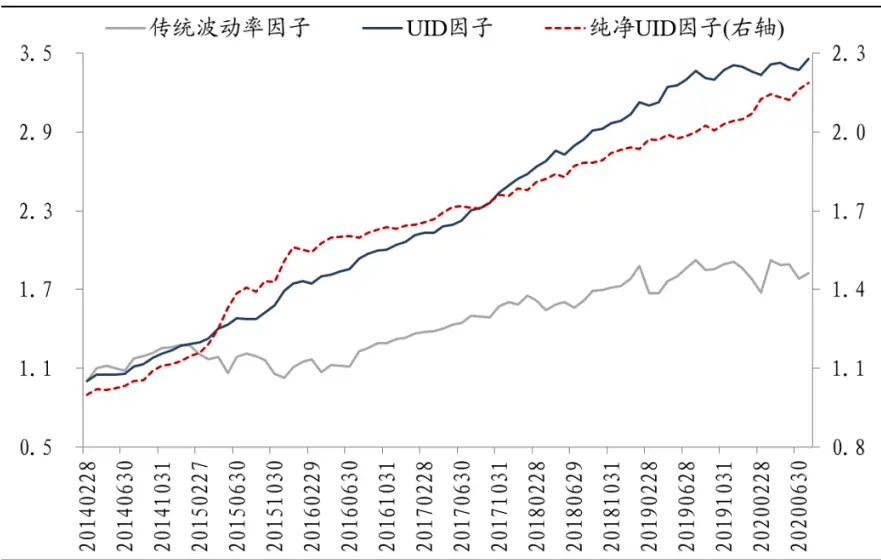
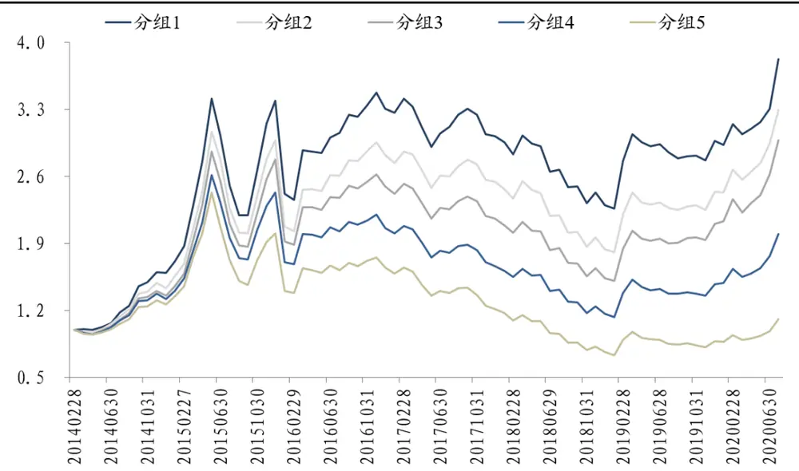
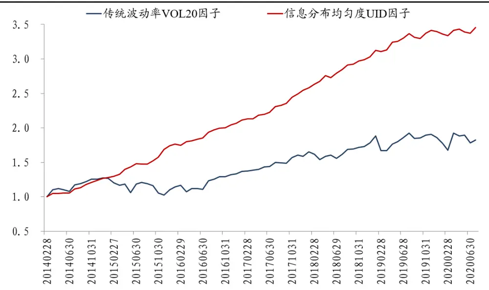
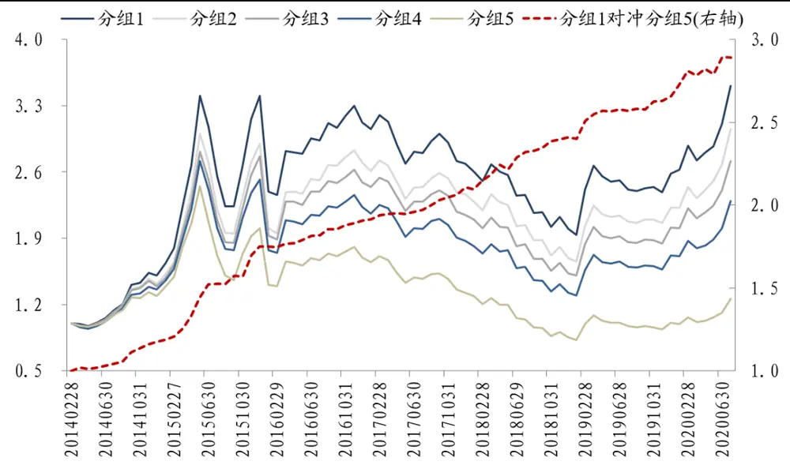
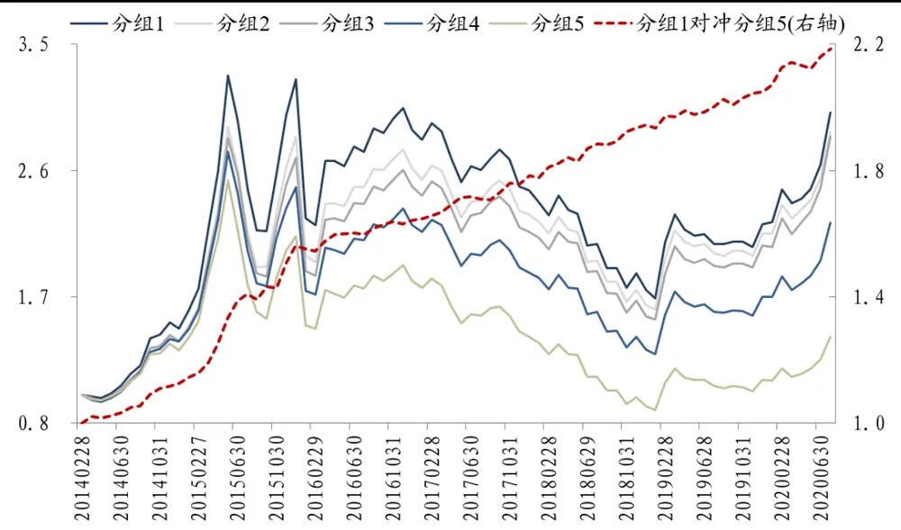
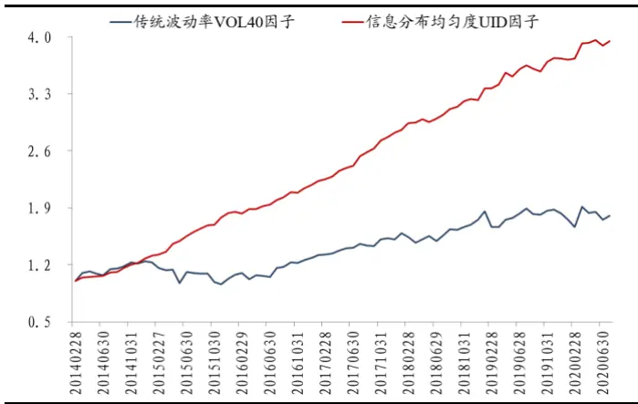
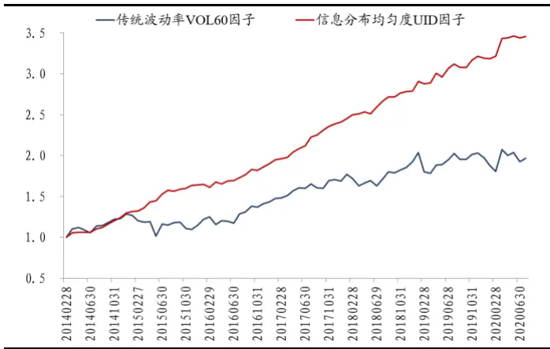

## “波动率选股因子”系列研究（二）

## [Table_Main] 信息分布均匀度，基于高频波动率的选股因子

## 研究结论

- 前言：本篇报告为东吴金工“波动率选股因子”系列研究的第二篇，受到学术界“股价波动与股票信息流”关系理论的启发，从“信息冲击”的角度出发，逐步构建了衡量“股票信息分布均匀度”的选股因子。

- 波动率与信息冲击：学术研究表明，股票价格的波动，与流入股票的信息流直接相关。借鉴前人研究经验，我们提出如下猜想：若股票信息匀速流入市场，则股价的波动相对较小；但若信息流入市场的速度发生剧烈变化，则会造成股价的波动迅速增大。因此，我们认为股价波动率大小的变化幅度，可以用来衡量信息冲击的剧烈程度。

- 信息分布均匀度 UID 因子：利用个股分钟数据，在计算每日高频波动率的基础上，构建信息分布均匀度 UID 因子。在回测期 2014/01/01-2020/07/31 内，以全体 A 股为研究样本，UID 因子的月度 IC 均值为-0.059，RankIC 均值为-0.074，年化 ICIR 为-4.19，年化 RankICIR 为-4.23；5 分组多空对冲的年化收益为 21.32%，年化波动为5.84%，信息比率为3.65，月度胜率为83.12%，最大回撤为 2.18%，选股效果大幅优于传统波动率因子。在剔除了市场常用风格和行业的干扰后，纯净UID 因子仍然具备不错的选股能力，其年化 ICIR 仍可达到-3.17，全市场 5 分组多空对冲的年化收益为 12.96%，信息比率为 2.61，月度胜率为 75.32%，最大回撤仅为 1.22%。

信息分布均匀度UID 因子多空对冲净值走势

数据来源：Wind资讯，东吴证券研究所

- 风险提示：本报告所有统计结果均基于历史数据，未来市场可能发生重大变化；单因子的收益可能存在较大波动，实际应用需结合资金管理、风险控制等方法。

uthor] 2020 年 09 月 01 日

证券分析师 高子剑

执业证号：S0600518010001

021-60199793

gaozj@dwzq.com.cn

研究助理 沈芷琦

021-60199793

shenzhq@dwzq.com.cn

## 相关研究

1、《“求索动量因子”系列研究（一）：成交量对动量因子的修正——日与夜的殊途同归》20190906

2、《“技术分析拥抱选股因子”系列研究（一）：高频价量相关性，意想不到的选股因子》20200223

3、《“波动率选股因子”系列研究（一）：寻找特质波动率中的纯真信息——剔除跨期截面相关性的纯真波动率因子》20200528

4、《“技术分析拥抱选股因子”系列研究（二）：上下影线，蜡烛好还是威廉好？》202006195、《“求索动量因子”系列研究（二）：交易者结构对动量因子的改进》20200818

## 1. 前言

“低波异象”自 2006 年被发现以来，就一直是金融实证领域关注的热点问题。东吴金工借鉴前人经验，开拓创新，推出“波动率选股因子”系列研究，旨在目前已被广泛使用的传统波动率因子的基础上，进行一系列新的探索。

在第一篇报告《寻找特质波动率中的纯真信息——剔除跨期截面相关性的纯真波动率因子》中，我们从学术界发现的“波动聚集现象”出发，对传统波动率因子提出了一种简单朴素而又效果优秀的改进方案：在传统因子的计算过程中，只需增加 1 行代码，就可以实现信息比率从1.5到 2.2的提升。

表 1：纯真波动率因子回顾：年化 ICIR及5分组多空对冲绩效指标

|  | 年化ICIR | 年化收益率 | 年化波动率 | 信息比率 | 月度胜率 | 最大回撤率 |
| --- | --- | --- | --- | --- | --- | --- |
| 传统特质波动率因子 | -1.78 | 17.93% | 12.13% | 1.48 | 70.65% | 14.49% |
| 纯真波动率因子 | -2.16 | 18.89% | 8.70% | 2.17 | 78.26% | 8.29% |

数据来源：Wind资讯，东吴证券研究所

但“纯真波动率因子”也存在局限性，它与传统因子的相关性仍然较高，在实际应用中，纯真因子或许只能替换原来的传统因子，而不足以做为一个携带足够增量信息的新因子，加入到已有的因子库中。

因此，作为系列研究的第二篇报告，本文就带着“提供增量信息”的目标，尝试挖掘一个“新”的波动率因子。具体地，我们将从“信息冲击”的角度出发，利用分钟数据，在计算股票高频波动率的基础上，逐步构建新因子。

## 2. 波动率与信息冲击

Ross[1]和Andersen[2]分别通过理论和实证研究，发现股票价格的波动，与流入股票的信息流直接相关。其中，Ross建立的理论模型，甚至得到了这样强有力的结论：在无套利均衡市场中，股价的波动完全等于信息流的波动。

借鉴上述前辈们的研究结论，我们对“股价波动与股票信息流”的关系，提出如下猜测与拓展：若股票信息匀速流入市场，则股价的波动相对较小；但若信息流入市场的速度突然发生变化，比如在极端情况下，某些时点发生了较强烈的信息冲击——好比在原本平静或微波荡漾的水面，突然投入一颗巨大的石头——则会造成股价的波动迅速增大。因此，我们认为股价波动率大小的变化幅度，可以用来衡量信息冲击的剧烈程度。

## 3. 波动的波动：信息分布的均匀度

基于上一节内容的分析，我们构造一个衡量股票“信息分布均匀度”的因子，简称为 UID（the Uniformity of Information Distribution）因子，具体操作步骤如下：

（1）每月月底，回溯所有股票过去20 个交易日，每个交易日都利用分钟数据，计算日内分钟涨跌幅的标准差，记为每日的高频波动率 Vol_daily；

（2）每只股票，计算 20 个 Vol_daily 的标准差，记为该股票当月每日波动率的波动 std（Vol_daily）；

（3）每只股票，计算 20 个 Vol_daily 的平均值，衡量该股票当月每日波动率的平均水平 mean（Vol_daily）；将 std（Vol_daily）除以 mean（Vol_daily），再做市值中性化处理，得到每只股票的信息分布均匀度 UID因子，即

$$
100\div(20\div7)+32\div75\times10=\frac{\frac{3}{10}+32}{\frac{3}{10}+32}\times12\div7\times10=\frac{3}{(100)}\times10=\frac{3}{(100)}\times10=115\times10=115\times12=115(1001\textmd{o}120+115)
$$

接下来，对上述操作步骤的逻辑和含义，逐一作出解释：

- 步骤（1）中，计算每日的高频波动率Vol_daily，仅用到当日的日内分钟涨跌幅，即剔除了属于隔夜收益的第一分钟涨跌幅数据；原因是我们认为，隔夜信息对股价的影响模式与日内截然不同，值得单独讨论，因此此处先将隔夜部分剥离，关于这一论点的详细论证，可参考笔者的另一篇报告《“求索动量因子”系列研究（一）：成交量对动量因子的修正——日与夜的殊途同归》（外发于2019年 9月 6日）；

- 步骤（2）中，每日波动率的波动 std（Vol_daily）的含义：我们认为该指标能够反映股票在过去 20个交易日的信息分布均匀程度；假设某只股票在过去 20个交易日中的信息总量是一定的，若在某几个交易日发生了信息冲击，即在这几个交易日中的某些时点，信息流入的速度突然加快、流入的信息量突然增大，那么这几个交易日的波动率Vol_daily 就会明显高于其他交易日，这就会导致在过去 20 个交易日中，每日波动率的波动std（Vol_daily）也比较大；因此，频繁发生信息冲击的股票，或者说信息分布越不均匀的股票，std（Vol_daily）就会越大；顺带着，我们猜测 std（Vol_daily）的方向应当与传统波动率因子一致，即 IC 为负；

- 步骤（3）中，为何最终的信息分布均匀度 UID因子，要除以每日波动率的平均水平：我们认为，std（Vol_daily）应当与 mean（Vol_daily）高度正相关，即本身波动越大的股票，波动的波动也倾向于越大，因此需要将 std（Vol_daily）除以 mean（Vol_daily），做标准化处理；实际检验结果也佐证了我们的想法，以全体A 股为研究样本（剔除其中的 ST 股、停牌股以及上市未满 60 个交易日的次新股），时间段 2014/01/01-2020/07/31内，std（Vol_daily）与 mean（Vol_daily）的平均月度相关系数高达 0.66。

检验信息分布均匀度UID因子的选股效果，并与传统波动率因子VOL20（过去 20日的日收益率标准差，并做市值中性化处理）进行对比。回测结果显示，UID 因子的月度 IC 均值为-0.059，RankIC 均值为-0.074，年化 ICIR 为-4.19，年化 RankICIR 为-4.23。下图1、2 分别展示了UID因子的5分组回测、多空对冲净值走势，表 2比较了UID因子、VOL20 因子的 IC 信息及多空对冲绩效指标，表 3 则报告了 UID 各年度的表现情况。在整段回测期内，UID 因子的年化收益为 21.32%，年化波动为 5.84%，信息比率可达3.65，月度胜率为 83.12%，最大回撤仅为 2.18%，选股效果大幅优于传统波动率因子。

图 1：信息分布均匀度 UID因子 5分组回测净值走势

数据来源：Wind资讯，东吴证券研究所

图 2：UID因子、VOL20因子 5分组多空对冲净值走势

数据来源：Wind资讯，东吴证券研究所

表 2：UID因子、VOL20因子的 IC信息及5分组多空对冲绩效指标

| 传统波动率 VOL20 因子 |  | 信息分布均匀度 UID 因子 |
| --- | --- | --- |
| 月度IC均值 | -0.045 | -0.059 |
| 年化ICIR | -1.12 | -4.19 |
| 年化收益率 | 9.83% | 21.32% |
| 年化波动率 | 15.69% | 5.84% |
| 信息比率 | 0.63 | 3.65 |
| 月度胜率 | 64.94% | 83.12% |
| 最大回撤率 | 19.77% | 2.18% |

数据来源：Wind资讯，东吴证券研究所

表 3：信息分布均匀度UID因子分年度表现

|  | 年化收益率 |  |  | 分组 1 对冲分组 5 绩效指标 |  |  |  |
| --- | --- | --- | --- | --- | --- | --- | --- |
| 年份 | 分组1 | 分组5 | 分组 1 对冲分组 5 | 年化波动率 | 信息比率 | 月度胜率 | 最大回撤率 |
| 2014 | 75.34% | 32.57% | 33.27% | 6.38% | 5.21 | 90.00% | 0.14% |
| 2015 | 112.58% | 58.49% | 37.21% | 7.11% | 5.23 | 91.67% | 0.41% |
| 2016 | -2.60% | -17.79% | 18.39% | 4.72% | 3.90 | 91.67% | 1.19% |
| 2017 | -8.62% | -26.41% | 23.25% | 3.79% | 6.14 | 91.67% | 0.08% |
| 2018 | -23.94% | -36.90% | 19.22% | 3.62% | 5.31 | 91.67% | 1.11% |
| 2019 | 29.46% | 14.76% | 12.08% | 5.24% | 2.31 | 66.67% | 2.03% |
| 2020(至7月底) | 53.91% | 49.63% | 2.93% | 5.07% | 0.58 | 42.86% | 1.82% |

数据来源：Wind资讯，东吴证券研究所

从上述图表中我们可以发现，UID 因子在最近1 年的表现欠佳，这可能是受到传统波动率因子的拖累（2019年 8 月以来，传统因子的累计多空对冲收益为负）。因此，我们将 UID 因子对 VOL20 做正交化处理，取残差定义为 UID_deVOL20，考察剔除传统波动率因子的线性信息后，新因子的选股效果。

回测结果显示，UID_deVOL20 仍具备不错的选股能力，月度 IC 均值为-0.044，年化ICIR为-3.43；全市场 5分组多空对冲的年化收益为 17.99%，年化波动为 6.42%，信息比率为 2.80，月度胜率为 81.82%，最大回撤为 1.26%。下图 3 展示了 UID_deVOL20因子的5 分组及多空对冲净值走势，表4汇报了其分年度的表现情况，可以看到相比于UID，UID_deVOL20 在最近的表现明显提升。

图 3：UID_deVOL20因子 5分组回测及多空对冲净值走势

数据来源：Wind资讯，东吴证券研究所

表 4：UID_deVOL20 因子分年度表现

|  | 年化收益率 |  |  | 分组 1 对冲分组 5 绩效指标 |  |  |  |
| --- | --- | --- | --- | --- | --- | --- | --- |
| 年份 | 分组1 | 分组5 | 分组 1对冲分组 5 | 年化波动率 | 信息比率 | 月度胜率 | 最大回撤率 |
| 2014 | 63.24% | 35.55% | 21.43% | 5.15% | 4.17 | 90.00% | 1.04% |
| 2015 | 126.06% | 55.68% | 48.90% | 10.03% | 4.88 | 83.33% | 0.09% |
| 2016 | -8.19% | -15.46% | 8.90% | 2.21% | 4.02 | 91.67% | 0.37% |
| 2017 | -13.83% | -22.08% | 10.52% | 2.25% | 4.68 | 91.67% | 0.14% |
| 2018 | -25.73% | -35.59% | 14.31% | 4.56% | 3.14 | 83.33% | 1.26% |
| 2019 | 29.22% | 18.12% | 10.33% | 4.46% | 2.32 | 66.67% | 0.27% |
| 2020(至7月底) | 69.37% | 47.39% | 15.59% | 6.44% | 2.42 | 57.14% | 1.16% |

数据来源：Wind 资讯，东吴证券研究所

## 4. 其他重要讨论

## 4.1. 纯净 UID 因子的表现

得到了信息分布均匀度UID 因子后，我们考察其与市场常用风格因子的相关性。仍以全体 A 股为研究样本，以 2014/01/01-2020/07/31 为回测时间段，下表 5 展示了 UID与 10 个 Barra 风格因子的相关系数（其中，波动因子用前文提到的传统波动率因子VOL20 替代）。

表 5：UID因子与Barra风格因子相关系数

|  | UID 因子 | UID 因子 |
| --- | --- | --- |
| Beta | -0.0438 | Size -0.0040 |
| BooktoPrice | -0.1968 | NonLinearSize -0.0466 |
| EarningsYield | -0.0833 | Momentum 0.0582 |
| Growth | 0.0210 | VOL20 0.2806 |
| Leverage | -0.0424 | Liquidity 0.1350 |

数据来源：Wind资讯，东吴证券研究所

为了剔除常用风格和行业的干扰，我们每月月底将UID 因子对Barra风格因子和28个申万一级行业虚拟变量进行回归，取残差作为纯净新因子，检验其效果。下图 4展示了纯净 UID 因子的 5 分组及多空对冲净值走势，表 6 汇报了其分年度的表现情况。剔除常用风格和行业后，纯净 UID因子的年化 ICIR仍可达到-3.17，全市场 5分组多空对冲的年化收益为 12.96%，年化波动为 4.97%，信息比率为 2.61，月度胜率为 75.32%，最大回撤仅为1.22%；且最近 1年的表现也得到明显提升。

图 4：纯净 UID因子 5分组回测及多空对冲净值走势

数据来源：Wind资讯，东吴证券研究所

表 6：纯净UID因子分年度表现

|  | 年化收益率 |  |  | 分组 1 对冲分组 5 绩效指标 |  |  |  |
| --- | --- | --- | --- | --- | --- | --- | --- |
| 年份 | 分组1 | 分组5 | 分组 1对冲分组5 | 年化波动率 | 信息比率 | 月度胜率 | 最大回撤率 |
| 2014 | 59.52% | 39.10% | 15.34% | 3.62% | 4.24 | 90.00% | 0.50% |
| 2015 | 120.11% | 61.94% | 38.62% | 7.72% | 5.00 | 83.33% | 1.22% |
| 2016 | -11.10% | -15.01% | 5.20% | 2.77% | 1.88 | 66.67% | 1.15% |
| 2017 | -14.90% | -21.89% | 8.60% | 2.54% | 3.38 | 75.00% | 0.55% |
| 2018 | -28.77% | -34.97% | 8.91% | 2.89% | 3.08 | 75.00% | 0.70% |
| 2019 | 26.69% | 20.38% | 5.47% | 2.73% | 2.00 | 66.67% | 0.83% |
| 2020(至7月底) | 69.00% | 52.11% | 11.74% | 3.60% | 3.26 | 71.43% | 0.91% |

数据来源：Wind资讯，东吴证券研究所

## 4.2. UID 因子的参数敏感性

在前述回测中，我们都只考虑了每月月底回看过去 20 个交易日的情况。本小节内容，我们改变回看天数为40、60个交易日，检验 UID 因子的回测效果，并与传统换手率因子进行对比。

下图 5-6 分别展示了在回看 40、60 个交易日的情况下，UID 因子、传统波动率因子的5分组多空对冲净值走势，表7 则比较了它们的各项绩效指标。可以看到，无论是回看40还是 60个交易日，UID因子均显著优于传统因子。

图 5：新旧波动率因子 5分组对冲净值（回看 40日）

数据来源：Wind 资讯，东吴证券研究所

图 6：新旧波动率因子 5分组对冲净值（回看 60日）

数据来源：Wind 资讯，东吴证券研究所

表 7：新旧波动率因子5分组多空对冲绩效指标（回看40、60日）

|  | 年化收益率 | 年化波动率 | 信息比率 | 月度胜率 | 最大回撤率 |
| --- | --- | --- | --- | --- | --- |
| 回看40 日 | VOL40 因子 9.61% | 16.64% | 0.58 | 59.74% | 22.74% |
|  | UID 因子 23.87% | 6.02% | 3.97 | 87.01% | 1.97% |
| 回看 60 日 | VOL60 因子 11.12% | 16.68% | 0.67 | 62.34% | 20.99% |
|  | UID 因子 21.32% | 6.49% | 3.29 | 83.12% | 2.12% |

数据来源：Wind资讯，东吴证券研究所

## 4.3. 其他样本空间的情况

我们检验UID 因子在不同样本空间的表现。以回看20 日为例，回测结果显示，在沪深300 和中证500成分股中，UID 因子均能战胜传统波动率因子，且在正交化了传统因子之后，UID_deVOL20 的效果可以得到进一步提升。

表 8：沪深300、中证 500成分股多空对冲绩效指标

|  | 年化收益率 | 年化波动率 | 信息比率 | 月度胜率 | 最大回撤率 |
| --- | --- | --- | --- | --- | --- |
| 沪深 300 | VOL20 因子 -0.93% | 17.34% | -0.05 | 54.55% | 38.45% |
|  | UID 因子 11.51% | 10.54% | 1.09 | 57.14% | 22.32% |
|  | UID_deVOL20 15.79% | 10.72% | 1.47 | 67.53% | 13.18% |
| 中证500 | VOL20 因子 -0.22% | 15.22% | -0.01 | 57.14% | 25.66% |
|  | UID 因子 13.49% | 9.15% | 1.48 | 64.94% | 15.26% |
|  | UID_deVOL20 16.65% | 8.91% | 1.87 | 68.83% | 4.80% |

数据来源：Wind资讯，东吴证券研究所

## 4.4. 信息冲击对价格涨跌作用的对称性

既然提到“信息冲击”，我们自然会想到，构造因子的时候是否需要区分“好的信息”与“坏的信息”。如果好、坏信息冲击的数量、强度、对股价的作用等存在明显差异，比如不妨假设好信息的数量远多于坏信息，同时好信息对股价的提升作用，远大于坏信息对股价的下挫作用，那么基于“信息冲击”理念构建的UID因子，可能会与传统涨跌幅因子存在较高的相关性。因此，我们需要检验信息冲击与股价涨跌的关系，具体实施如下步骤：

（1）如前所述，以全体 A 股为研究样本，每只股票每个交易日，都用日内分钟涨跌幅计算波动率Vol_daily，作为当日信息冲击强度的代理变量；

（2）每只股票，在整段时间 2014/01/01-2020/07/31 内，挑选波动率 Vol_daily 最大的20%样本，根据日内涨跌幅的正负分为两组，计算每一组的样本数量占比、涨跌幅平均值、涨跌幅中位数、涨跌幅绝对值与波动率的相关系数；

（3）遍历所有股票后，计算所有股票上述指标的平均值；

（4）在上述计算过程中，剔除所有日内曾经涨跌停的样本。

下表 9 展示了上述测算的结果，我们可以看到，在日内波动率 Vol_daily 较大的样本中，“上涨”和“下跌”的数量占比、涨跌幅绝对值、涨跌幅绝对值与波动率相关系数的统计结果，都相差不大。由此可见，信息冲击与股价涨跌的关系，呈现较为良好的对称性，即好、坏信息冲击的数量、对股价的作用强度都大致相同。除此之外，我们也更为直接地计算了 UID 因子与传统反转因子 Ret20（每月月底计算过去 20 个交易日的累计涨跌幅）的相关系数，结果为0.10，也佐证了上述测试的结论，说明利用“信息冲击”选股和根据价格涨跌选股，是在执行不同的操作，即UID因子能够提供未被传统反转因子包含的增量信息。

表 9：信息冲击对价格涨跌作用的对称性

|  | 样本量占比 | 涨跌幅平均值 | 涨跌幅中位数 | 涨跌幅绝对值与波动率的相关系数 |
| --- | --- | --- | --- | --- |
| 上涨 | 52.88% | 1.90% | 1.42% | 0.45 |
| 下跌 | 47.12% | -1.81% | -1.39% | 0.40 |

数据来源：Wind资讯，东吴证券研究所

## 5. 总结

本篇报告属于东吴金工“波动率选股因子”系列研究第二篇，受到学术界“股价波动与股票信息流”关系理论的启发，从“信息冲击”的角度出发，逐步构建了一个新的选股因子。具体地，我们借鉴学术大师们的研究成果，提出股价波动率大小的变化幅度，可以用来衡量信息冲击的剧烈程度。基于上述理念，我们利用分钟高频数据，在计算股票每日波动率的基础上，构造了“信息分布均匀度UID 因子”，其选股效果显著优于传统波动率因子。在剔除了市场常用风格和行业的干扰后，纯净UID 因子仍然具备不错的选股能力。

## 6. 风险提示

本报告所有统计结果均基于历史数据，未来市场可能发生重大变化；单因子的收益可能存在较大波动，实际应用需结合资金管理、风险控制等方法。

附注：[1]Ross, Stephen A., 1989, Information and Volatility: The No-Arbitrage Martingale Approach to Timing and Resolution Irrelevancy, Journal of Finance XLIV, 1–17.

[2]Andersen, T. G., 1996, Return Volatility and Trading Volume: An Information Flow Interpretation of Stochastic Volatility, Journal of Finance 51, 169–204.

## 免责声明

东吴证券股份有限公司经中国证券监督管理委员会批准，已具备证券投资咨询业务资格。

本研究报告仅供东吴证券股份有限公司（以下简称“本公司”）的客户使用。本公司不会因接收人收到本报告而视其为客户。在任何情况下，本报告中的信息或所表述的意见并不构成对任何人的投资建议，本公司不对任何人因使用本报告中的内容所导致的损失负任何责任。在法律许可的情况下，东吴证券及其所属关联机构可能会持有报告中提到的公司所发行的证券并进行交易，还可能为这些公司提供投资银行服务或其他服务。

市场有风险，投资需谨慎。本报告是基于本公司分析师认为可靠且已公开的信息，本公司力求但不保证这些信息的准确性和完整性，也不保证文中观点或陈述不会发生任何变更，在不同时期，本公司可发出与本报告所载资料、意见及推测不一致的报告。

本报告的版权归本公司所有，未经书面许可，任何机构和个人不得以任何形式翻版、复制和发布。如引用、刊发、转载，需征得东吴证券研究所同意，并注明出处为东吴证券研究所，且不得对本报告进行有悖原意的引用、删节和修改。

## 东吴证券投资评级标准：

公司投资评级：

买入：预期未来 6个月个股涨跌幅相对大盘在 15%以上；

增持：预期未来 6个月个股涨跌幅相对大盘介于 5%与15%之间；

中性：预期未来 6个月个股涨跌幅相对大盘介于-5%与5%之间；

减持：预期未来 6个月个股涨跌幅相对大盘介于-15%与-5%之间；

卖出：预期未来 6个月个股涨跌幅相对大盘在-15%以下。

行业投资评级：

增持： 预期未来 6个月内，行业指数相对强于大盘 5%以上；

中性： 预期未来 6个月内，行业指数相对大盘-5%与5%；

减持： 预期未来 6个月内，行业指数相对弱于大盘 5%以上。

