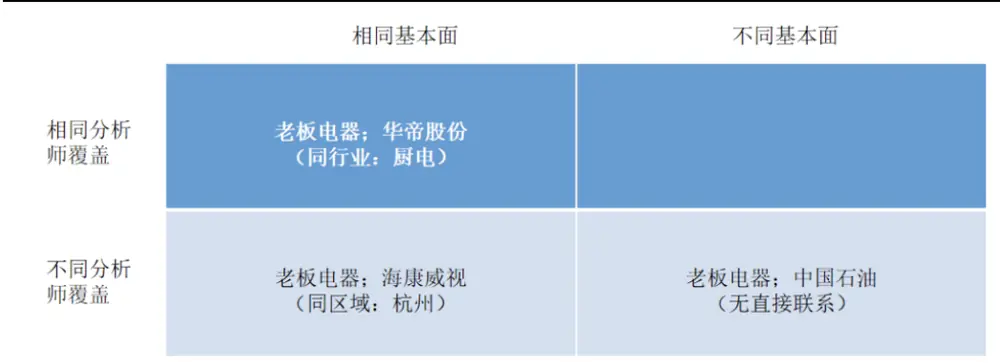
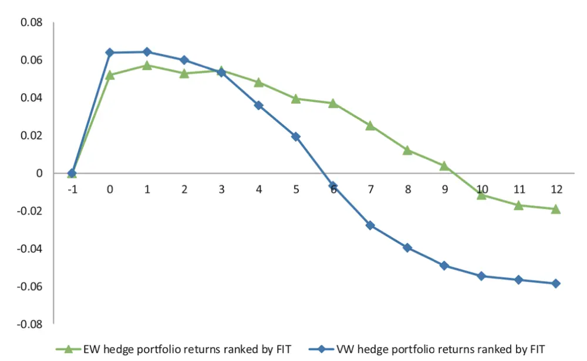
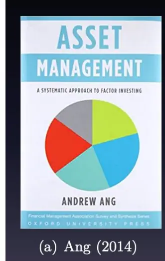
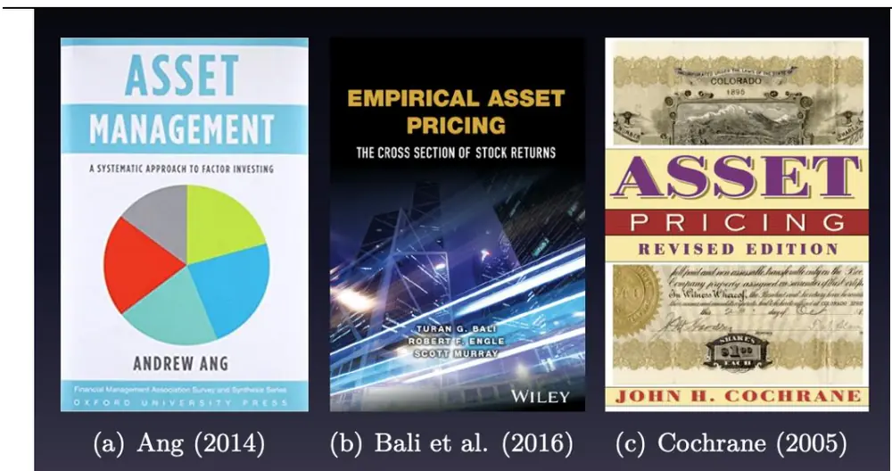

## [Tab相关研究

Table_ReportInfo]《选股因子系列研究（七十）——日内市场微观结构与高频因子选股能力》

2020.08.29

《短周期交易策略研究之五——周内效应与日内效应相结合的股指期货CTA策略》2020.08.16

《改革、创新、活力——创业板 指数与科创50指数的三大关键词》2020.08.03

分析师:冯佳睿

Tel:(021)23219732

Email:fengjr@htsec.com

证书:S0850512080006

# 准另类数据与因子投资（刘洋溢博士）

## 投资要点：

- 准另类数据处于传统数据和另类数据中间的地带。首先，它肯定不属于典型的公司特征，比如，公司的规模、估值、动量、盈利能力等。其次，它不应该是常见的宏观经济数据，比如，经济增长、通胀率等，也不应该像现在大家所熟知的一些另类数据，比如，文本数据、图像数据等，那样难以获取。

- 准另类数据必须要有另类数据的一些特征。这意味着，它必须是那些被传统分析或传统投资者所忽视，或者至少说是利用不那么充分的数据。

- 日内数据。利用日内数据可以对股票的风险及其未来短期收益进行更好的预测，从而获得更高的 alpha。例如，方差不对称性、Semibetas。

- 公司间关联。投资者对公司间关联信息的注意力不足，导致他们的反应不足，大概是所有公司间关联因子可以带来 alpha 的原因。此外，由于投资者的注意力不足，导致公司间的关联效应对公司未来的基本面有显著的预测能力。常见的公司间关联有，科技关联度、地理联系、重要客户动量、复杂公司、共同分析师覆盖。

- 公司间关联信息的优点。公司间的关联作为我们所讨论的准另类数据的典型代表，它的数据大部分是可以通过公开渠道获取的。而且历史数据表明，不管是在美股还是 股市场，看起来都是比较有效的。就当前的研究情况来看，还有很多种的公司间关联未被充分挖掘，它们应该有机会可以带来更多潜在的 alpha，尤其是和传统方法相关性比较低的 alpha。

- 基金隐含信息。通过跟踪分析我们认为可能有比较高投研能力的投资者（即，基金经理）的行为，可以从中挖掘出更多的信息。例如，股票质量与隐含 alpha、Flow-Induced Trading、ETF 持股比例。

- 风险提示。嘉宾的演讲内容来自于个人的研究和实践经验，并不构成投资建议。

西南财经大学金融学博士刘洋溢的主题报告：《准另类数据与因子投资》，本文为演讲纪要。

## 1. 因子投资

因子投资和学术研究中的实证资产定价紧密相关，核心是把资产的预期超额收益分解为两个部分，一部分是 alpha，另一部分是通过承担系统性风险所获得的风险溢价。

因子投资的核心在于获取超额收益，主要有两种方式。一种是通过配臵 beta 来获取风险溢价，其中比较典型的就是 Smart Beta ETF。个人理解，现在流行的指数增强型产品，在某种层面上也属于这种类型。另外一种方式更为直接，也是主动管理常用的，就是通过预测超额收益或 alpha 来筛选股票。

但是我们现在遇到的问题是，很多常见的因子，比如，规模、估值、动量，已经被挖掘得很充分了，可能很难带来特别显著的超额收益。在这种情况之下，我们应该怎么办？我想，我们至少有三种方式。

首先，我们可以尝试用更好的模型去拟合数据。比如，Lasso，弹性网络等。也可以尝试用一些非线性模型去刻画，比如，决策树、神经网络等。实际上，这些模型在业界的应用已经很广泛了，学术界这几年对这些方法的研究也越来越多。

第二种方法是使用更好的数据。举两个简单的例子，一是在业界已被普遍使用的高频数据，可以用来做高频交易。显然，它跟传统的中低频量价因子不是很相关。二是如果可以拿到投资者交易账户数据，就可以对投资者的行为偏差进行分析，并从中挖掘一些交易机会。当然，不太确定业界是否能拿到这样的数据，一些学术研究是可以拿到的。

第三种方法是同时拥有更好的模型和更好的数据。一个典型的例子是，基于文本数据，比如，公司的年报、和公司相关的新闻，还有一些股吧的评论，进行情感分析，从中找出新因子。在一些最新的研究和实践中，已经有人提出，我们不仅可以对文本数据做情感分析，甚至还可以对图像数据做情感分析。当然，这些方法比较新颖，相关的数据获取难度和建模的复杂程度也会更高一些。

## 2. 准另类数据

实际上，除了业界，这些有关新数据的研究在学术中也非常重要。最近 5年，金融学顶级期刊上发表的文章，有超过一半都用到了一些独特的新数据。由此可见，不论是业界还是学术界，另类数据都很有价值。

另类数据虽好，但也有一个很重要、很关键的问题，就是另类数据往往很贵，甚至根本没有办法获取到。在这种情况下，有没有一些解决办法呢？除了想方设法获取另类数据外，我们或许还可以从准另类数据的角度去尝试做一些挖掘和探索。准另类数据其实并不是一个严格、规范的术语，只是为了方便本文的叙述。所以，我们有必要先对它的特征做一个更为清晰的定义。

我想，准另类数据至少应该有三个特征。首先，它肯定不属于典型的公司特征，比如，公司的规模、估值、动量、盈利能力等。其次，它不应该是常见的宏观经济数据，比如，经济增长、通胀率等，也不应该像现在大家所熟知的一些另类数据，比如，文本数据、图像数据等，那样难以获取。这两个方面表明它是处于传统数据和另类数据中间的地带，体现了“准”的概念。

第三，准另类数据也必须要有另类数据的一些特征。这意味着，它必须是那些被传统分析或传统投资者所忽视，或者至少说是利用不那么充分的数据。所以，把这三个特征放在一起，就可以比较充分地来定义我们要讨论的准另类数据。

下面，我们将通过三组例子展开分析，探讨准另类数据可以有哪些应用。这三组例子分别包括日内数据、公司间关联和基金隐含的信息。关于日内数据，可以参考海通金工的相关报告，我们只做一些简单的讨论。重点是在第二组例子，公司间的关联。这一组例子非常有趣，也是未来极具挖掘空间的一个方向。最后，对基金的隐含信息，我们也会做一些简短的介绍。

## 3. 日内数据

首先，是日内数据的一些应用，举两个例子。

## 3.1 方差不对称性

第一个例子是日内已实现方差的不对称性。显然，这里有两个关键词。一个是已实现方差，一个是不对称性。已实现方差的计算比较容易理解，以 股为例，每天有 个小时的交易时间，假设每隔一分钟采样一次，可以把每天的交易时间分成 个分钟，这 个分钟收益率的平方和就是当日的已实现方差。

不对称性意味着，还需要计算一个带方向的已实现方差。它的算法也很简单，根据每分钟的收益是正还是负，把分钟收益率划分为两个部分。把收益为正的分钟收益率取平方后相加，得到上行的已实现方差；计算下跌分钟上的收益率平方和，可得到下行的已实现方差。最后，用上行的已实现方差减去下行的已实现方差就可以得到方差的不对称性。当然，一般还需除以已实现方差进行标准化。

$$
RSJ_{t}=\frac{RV_{t}^{+}-RV_{t}^{-}}{RV_{t}}
$$

$$
RV_{t}=\sum_{i=1}^{n}r_{t-1+i/n}^{2}
$$

$$
RV_{t}^{+}=\sum_{i=1}^{n}r_{t-1+i/n}^{2}I(r_{t-1+i/n}>0)
$$

$$
RV_{t}^{-}=\sum_{i=1}^{n}r_{t-1+i/n}^{2}I(r_{t-1+i/n}<0)
$$

我们可以想象一下，在什么情况下，方差不对称性指标会比较大呢？很显然，有这么两种情况。第一种是上涨的分钟很多；第二种是，虽然从平均水平来看，上涨的收益率和下跌的收益率是类似的。但上涨的时候是快速拉升，而下跌的时候是平稳下行。

日内收益往往有均值回复的特征。所以，如果已实现方差的不对称性比较大，那么就可以预期，在未来一段时间内，或者说，第二天，股票的收益相对来说就会低一些。

下表展示的是有关方差不对称性指标的实证结果，是一个典型的学术中常用的 FM回归。由第一列可见，方差不对称性指标对下一天的股票收益存在显著为负的效应。而且，t统计量的绝对值也非常大。

表 1 RSJ 因子的 Fama-MacBeth 回归
Panel A. Simple Regressions

| RSJ |  | RVOL | RSK | RKT | BETA | ME | BM | MOM | REV | IVOL | CSK | CKT | MAX | MIN | ILLIQ |
| --- | --- | --- | --- | --- | --- | --- | --- | --- | --- | --- | --- | --- | --- | --- | --- |
|  | -111.76 (-8.20) | 6.01 (0.44) | -21.47 (-7.97) | -0.31 (-0.70) | 2.73 (0.32) | -2.49 (-1.44) | 4.28 (0.85) | 0.00 (1.31) | -0.02 (-5.87) | -58.97 (-0.25) | 2.09 (0.34) | 1.48 (0.51) | -0.02 (-2.78) | -0.02 (-1.64) | 0.37 (0.87) |

Panel B. Multiple Regressions

| Regression | RSJ | RVOL | RSK | RKT | BETA | ME | BM | MOM REV | IVOL |  | CSK | CKT | MAX | MIN | ILLIQ |
| --- | --- | --- | --- | --- | --- | --- | --- | --- | --- | --- | --- | --- | --- | --- | --- |
| I | -74.29 (-9.17) |  |  |  | -0.24 (-0.04) | -4.28 (-3.35) | -0.39 (-0.14) | 0.00 (2.14) | -0.03 (-7.20) | -198.27 (-1.50) | -4.43 (-1.03) | 1.92 (0.89) | 0.02 (3.32) | 0.03 (5.64) | -0.77 (-2.74) |
| II |  | 1.78 (0.26) |  |  | -1.06 (-0.16) | -4.23 (-3.44) | -0.34 (-0.12) | 0.00 (2.16) | -0.03 (-9.07) | -211.07 (-1.71) | -4.65 (-1.09) | 2.02 (0.94) | 0.02 (3.69) | 0.04 (6.05) | -0.85 (-2.97) |
| III |  |  | -12.60 (-7.33) |  | 0.08 (0.01) | -4.37 (-3.41) | -0.40 (-0.15) | 0.00 (2.15) |  | -0.03 -190.68 (-8.14) (-1.44) | -4.51 (-1.05) | 1.84 (0.85) | 0.02 (3.54) | 0.03 (5.82) | -0.79 (-2.80) |
| IV | -248.78 | 1.16 | 34.62 | -0.78 (-2.37) -0.49 | 0.30 (0.04) | -4.55 | -0.83 (-3.50) (-0.30) | 0.00 | -0.03 | -188.95 (2.21)(-9.12) (-1.43) (-1.01) (0.88) | -4.35 | 1.90 | 0.02 (3.83) | 0.03 | -0.81 (5.91) (-2.87) |
| V VI | (-8.57) -255.02 | (0.08) -12.96 | (6.31) 35.20 | (-1.02) -1.07 | -2.34 | -3.46 | 0.38 | 0.00 |  |  |  |  |  |  |  |
| VII | (-10.50) -184.93 | (-1.58) -11.54 | (7.42) 25.57 | (-2.92) -1.08 | (-0.34) -1.00 | (-2.75) -3.44 | (0.14) 0.32 | (1.68) 0.00 | -0.01 |  |  |  |  |  |  |
| VIII | (-8.34) -254.27 | (-1.44) -6.84 | (5.65) 35.02 | (-2.98) -0.98 | (-0.15) -1.62 | (-2.76) -3.93 | (0.12) -0.56 | (1.68) 0.00 | (-4.41) | -308.17 |  |  |  |  |  |
| IX | (-10.49) -248.79 | (-0.90) -13.03 | (7.37) 34.22 | (-2.67) -1.04 | (-0.24) -2.37 | (-3.12) -3.46 | (-0.21) 0.52 | (1.87) 0.00 |  | (-2.87) 0.37 |  |  |  |  |  |
| X | (-10.34) -249.16 | (-1.61) -12.57 | (7.25) 34.25 | (-2.86) -1.10 | (-0.35) -2.97 | (-2.75) -3.63 | (0.19) 0.39 | (1.74) 0.00 |  |  | (0.10) | 1.83 |  |  |  |
| XI | (-10.38) -235.83 | (-1.52) -7.16 | (7.27) 32.29 | (-3.00) -0.91 | (-0.45) -1.49 | (-2.87) -3.19 | (0.14) 0.23 | (1.77) 0.00 |  |  |  | (1.12) | -0.01 |  |  |
| XII | (-9.86) -255.32 | (-0.86) -11.84 | (6.79) 35.16 | (-2.48) -1.01 | (-0.22) -2.86 | (-2.56) -3.29 | (0.08) 0.46 | (1.75) 0.00 |  |  |  |  | (-3.42) | 0.00 |  |
| XIII | (-11.12) -247.02 | (-1.46) -12.75 | (7.68) 34.02 | (-2.75) -1.05 | (-0.43) -2.37 | (-2.61) -4.30 | (0.17) 0.47 | (1.72) 0.00 |  |  |  |  |  | (0.55) | -0.84 |
| XIV | (-10.19) -159.73 | (-1.56) -1.32 | (7.17) 21.46 | (-2.87) -0.84 | (-0.35) -1.36 | (-3.41) -4.31 (-2.31) (-0.21)(-3.48) | (0.17) -0.21 (-0.08) | (1.67) 0.00 (2.22) | -0.02 -203.76 -4.31 (-6.62)(-1.66)(-1.02) |  |  | 2.20 | 0.02 | 0.03 | (-2.92) -0.80 |

资料来源：Good Volatility, Bad Volatility, and the Cross Section of Stock Returns，海通证券研究所

## 3.2 Semibetas

第二个例子是 Semibetas，中文叫半 beta，它和方差不对称性有很多相似之处。因为从资产定价的角度来说，影响最大的是 beta。而 beta 的计算中，有一部分是斜方差的形式。

下式为斜方差的计算公式。其中，r是资产收益，f 是因子收益，最简单就是市场因子。根据 r和 f 各自的符号，可以把资产和市场的协方差拆分为四个部分。相应地，beta也就被拆分成了四个部分。

$$
\begin{array}{rl}&{Cov(r,f)}\\&{=E[rfI(r<0,f<0)]+E[rfI(r>0,f>0)]}\\&{+E[rfI(r<0,f>0)]+E[rfI(r>0,f<0)]}\\&{=N+P+M^{+}+M^{-}}\\&{\Rightarrow\beta=\frac{Cov(r,f)}{Var(f)}=\frac{N+P+M^{+}+M^{-}}{Var(f)}=\beta^{N}+\beta^{P}-\beta^{M+}-\beta^{M-}}\end{array}
$$

从经验来看，投资者对向上的波动并不敏感，主要关注资产价格的下跌，也就是亏损的风险。所以，我们可以做一个合理的推断， f 大于 0 的这两个部分，也就是第二项$\beta^{p}$ 和第三项 的预期收益，应该是不显著的。于是，我们集中研究第一项和第四项。

第一项 $\cdot\beta^{N}$ 刻画的是当市场下跌时，资产也下跌的情况。显然，这是传统金融学中典型的系统性风险。所以，它的预期收益应该为正。第四项 描述的是，当市场下跌时，资产收益为正的情况。因此，它就不是一个系统性风险，而应该把它看作是一个对冲资产。可以预期， $\beta^{M-}\sharp\sharp$ 预期收益应该是负的，相关的实证研究也证实了这一点。

有了上述推导，下面的步骤就显得非常自然，也是在业界实践中，最常用的做法。因为 有正的预期收益，投资者应该买入 比较高的股票，卖出 $\beta^{N}$ 比较低的股票。站在学术的角度上，这就构成了一个对冲组合。

对于 也是同理。因为它的预期收益为负，所以应该买入 较小的股票，卖出较大的股票。于是，我们便得到了两个策略——BOSB 和 BASB。进一步，把这两个策略的收益做一个平均，就得到了所谓的 Semibetas：BOASB 策略。

从实证结果来看，下表最后两列中， $\beta^{N}\mathcal{\neq}\mathfrak{s}\beta^{M-}$ 这两个策略的 Sharpe 比率都比较高，尤其是 $\beta^{M-}$ 。而从 alpha 的角度来看，第一行代表的年化收益大约在 7%到 10%之间，是一个比较高的水平，而第二行展示的两个策略的 t 统计量也都非常大。

表 2 BOASB 策略的表现

| Avg ret Std dev | $\beta$ |  | Semi β |  | $\beta^{N}$ |  | $\beta^{\mathcal{M}^{-}}$ |  |
| --- | --- | --- | --- | --- | --- | --- | --- | --- |
|  | 4.98 |  | 9.76 |  | 10.98 |  | 7.66 |  |
|  | 16.57 0.30 |  | 9.30 1.05 |  | 16.89 |  | 8.00 |  |
| Sharpe α | 2.19 0.87 | 4.17 1.77 | 8.35 6.32 | 9.68 | 0.65 8.05 3.36 | 10.62 | 0.96 7.76 | 7.88 |
| $\beta_{MKT}$ | 0.59 | 0.51 | 0.30 | 7.38 0.25 | 0.61 | 4.58 0.52 | 4.17 -0.02 | 4.19 -0.03 |
|  | 67.61 | 55.78 | 64.70 | 47.90 | 73.15 | 56.89 | -2.34 | -3.44 |
| $\beta_{SMB}$ | 0.30 | 0.12 | 0.30 | 0.21 | 0.40 | 0.22 | 0.20 | 0.20 |
|  | 18.10 | 7.36 | 33.91 | 22.61 | 25.00 | 13.49 | 16.08 | 14.98 |
| $\beta_{HML}$ | -0.02 | 0.18 | -0.01 | 0.11 | -0.08 | 0.13 | 0.05 |  |
|  | -1.24 | 10.58 | -1.61 | 11.10 | -4.75 | 7.57 | 3.82 | 0.08 6.08 |
| $\beta_{MOM}$ | -0.24 |  | -0.14 |  | -0.22 |  |  |  |
|  | -19.53 |  | -22.46 |  | -19.01 |  | -0.07 -7.31 |  |
| $\beta_{RMW}$ |  | -0.50 |  |  |  |  |  |  |
|  |  | -22.15 |  | -0.28 -22.56 |  | -0.53 -23.70 |  | -0.04 -2.28 |
| $\beta_{CMA}$ |  |  |  |  |  |  |  |  |
|  |  | -0.35 -13.21 |  | -0.28 -19.09 |  | -0.44 -16.74 |  | -0.13 -5.95 |
| $R^{2}$ | 58.15 | 60.26 | 55.92 | 59.55 | 60.59 | 64.38 | 6.72 | 7.42 |

资料来源：Realized Semibetas，海通证券研究所

将它们平均之后，得到的 Semibetas 策略的 Sharpe 比率和 alpha 进一步提升。这样做可以利用 $\beta^{N}$ 和 这两个因子组合之间的负相关性，从而获得一些分散化的收益。

作为对比，第一列展示了传统的低 beta 策略。理论上，低 beta 策略可以获得比较显著的收益。但从实证结果来看，收益水平较低。尤其是与 Semibetas 策略相比，差距非常明显。

总结来看，利用日内数据可以对股票的风险及其未来短期收益进行更好的预测，从而获得更高的 alpha。一个典型的应用场景就是日频换仓的交易。然而，随着交易频率的降低，比如，在学术研究中或中低频的基本面量化投资中更常见的月频，这些因子虽仍然有效，但效果却会大打折扣。

## 4. 公司间关联

第二组例子也是我个人认为最有趣的部分，叫做公司之间的关联。

## 4.1科技关联度

我们还是从一个例子出发，它来自于 2019 年 JFE 上发表的一篇文章。其核心是科技关联度指标，是利用企业的专利数据来计算的。

从逻辑上来说，为什么要考虑这样一个基于专利数据的公司关联呢？我们知道，传统意义上最显性的企业间的关联是行业。但这篇文章指出，典型的显性行业并不能反映公司业务之间的全部关联，而企业申请的专利数据的相关性，恰恰可以在这方面提供一些新的信息，因此就有了科技关联度指标。

指标的计算十分简单，把每家公司在不同类型专利上的数据表示成一个向量，然后计算两家公司对应向量之间夹角的余弦。

但是，就公司关联研究而言，度量关联本身并不是最核心的问题。真正重要的是，把与一家公司有关联的其他公司的股票收益进行加权，来得到关联收益。以科技关联度为例，假设要计算公司 的科技关联收益，只需把其他所有公司 月的收益，按照它们各自同公司 i的科技关联度求加权平均。

$$
TECH~RET_{i,t}=\frac{\sum_{j\neq i}TECH_{i,j,t}RET_{j,t}}{\sum_{j\neq i}TECH_{i,j,t}}
$$

从经济学逻辑上来说，我们可以很自然地认为，这些关联企业之间的表现应该是相似的。因此，可以预期存在一个所谓的动量溢出效应。也就是，做多关联收益高的公司，做空关联收益低的公司。下表给出了这一策略的实证结果。

表 3 科技关联动量因子组合

| Panel A: Portfolio returns |  |  |  |  |  |  |
| --- | --- | --- | --- | --- | --- | --- |
| Decile | Excess returns (%) | CAPM alpha (%) | 3-Factor alpha (%) | 4-Factor alpha (%) | 5-Factor alpha (%) | 6-Factor alpha (%) |
| 1 | 0.42 | -0.16 (−1.04) | -0.33 (-2.66) | -0.13 (−1.09) | -0.27 (-2.17) | -0.12 (-0.99) |
| (Low) 10 | (1.46) 1.59 | 1.05 | 0.93 | 0.95 | 1.10 | 1.09 |
| (High) | (5.38) | (5.37) | (6.41) 1.26 | (6.36) 1.08 | (8.11) | (7.97) |
| L/S (Equal- | 1.17 (5.47) | 1.22 (5.70) | (5.88) | (4.98) | 1.37 (6.49) | 1.21 (5.76) |
| weights) |  |  |  |  |  |  |
| L/S (Value- | 0.69 (3.19) | 0.74 (3.40) | 0.80 (3.62) | 0.65 (2.91) | 0.86 (3.81) | 0.73 (3.24) |

资料来源：Technological Links and Predictable Returns，海通证券研究所

最后两行是科技关联动量因子多空组合的表现。其中，倒数第二行是等权组合，最后一行是市值加权组合。从中可见，无论是用哪一种加权方法，科技关联动量因子的收益都是非常显著的。这一点既体现在 t 统计量上，也体现在它的水平上。

再看表中第二行，也就是 High 对应的这一行，代表的是科技关联动量因子的多头组合。可以看到，它的平均收益和 alpha 也都是高度显著的。这一特征非常有趣，尤其是对业界实践非常有价值。因为很多传统的因子，虽然多空组合非常显著，但收益更多来自于空头。如果只看多头，很多因子都不是那么显著。而在业界实践中，考虑到 A股市场做空比较困难，我们可能更关心多头组合的表现。所以，这样的因子就显得非常有价值。

这个例子虽然简单，却具备一般性。它提供了公司间关联因子的基本逻辑和构建方式，因而很容易进行拓展。

从基本逻辑的角度看，公司间关联因子之所以有效，是因为它反应了常见公司特征以及像行业等显性关联所没有包含的信息。而这部分信息恰恰是尚未被大部分投资者所注意到的，因而就可能包含较高的 alpha。

从因子构建的角度看，我们的核心指标总是某种关联收益，它的计算往往也很简单。就是把与目标公司有关联的其他公司的收益，按照一定的权重求加权和，而最典型的权重即为关联度。某些情况下，也可以是简单的等权。有了上述这两个认识，再来看后面的例子，相对来说，应当更容易理解。

## 4.2地理联系

第二个例子讲的是公司之间的地理联系。按理说，地理关联应该是最容易想到的例子之一。因为一般说来，在考虑公司之间关联的时候，首先想到的肯定是行业，其次就是它们的地理联系。但由于行业关联太重要，所以在考虑地理关联的时候，需要剥离行业关联。因此，我们这里关注的核心是在同一个城市、但属于不同行业的公司股票间的关联。

为了更清楚地理解地理联系，我们来看如下的示意图。以老板电器为例，可以看到公司之间的关联分为如下几种。首先，最典型的关联是老板电器和华帝股份，它们之间的关系是很清晰的。因为它们属于同一个行业——厨电，有非常相似的基本面和分析师的覆盖。但它们不在一个城市，老板电器在杭州，华帝股份在广东省中山市。

图1 公司间关联示意图

资料来源：海通证券研究所整理

其次是老板电器和海康威视。后者是安防监控的龙头，一个偏科技类的公司。很明显，它跟老板电器的基本面是不同的。但它们也有一个很大的共同点，那就是都在杭州。因此，它们之间的关联就是地理动量所关注的重点。

最后是老板电器和中国石油。显然，无论是从行业还是从城市来看，它们之间都没有什么联系。

按照上文的逻辑，地理动量的计算也非常直接。即，在每个月末，找出与公司在同一个城市、但属于不同行业的其他公司，计算它们的平均收益，作为公司的地理关联收益。随后，做多关联收益高的公司，做空关联收益低的公司。可以预期，应当能获得比较显著的收益。

如下表中的实证结果所示，多空组合的收益和 alpha 都非常显著。但我们也需注意，无论是收益还是 alpha，都只有 40多个 bp，与科技关联动量相比，明显要小很多。

表 4 地理动量因子组合

| Table 5 Area momentum trading strategy |  |  |  |  |  |  |  |  |  |  |  |  |  |
| --- | --- | --- | --- | --- | --- | --- | --- | --- | --- | --- | --- | --- | --- |
| Momentum trading strategy, quintiles |  |  |  |  |  |  |  |  |  |  |  |  |  |
|  | Mean (%) | CAPM α | t-stat | FF-3α | t-stat | FF-3+MOM α | t-stat | FF-5α | t-stat | Sharpe Ratio | Volatility (%) Mkt share (%) |  | Portfolio characteristics Size B/M |
| Lowest city return | 0.735 0.876 | -0.258 -0.077 | -3.228 -1.112 | -0.244 -0.038 | -3.011 -0.520 | -0.223 0.002 | -2.713 0.021 | -0.199 -2.333 -0.016 | 0.207 | 5.292 | 0.182 | 15.312 15.682 | 0.597 |
|  | 1.027 | 0.109 | 1.432 | 0.127 | 1.583 | 0.178 | 2.309 | -0.191 1.553 | 0.318 0.452 | 4.986 | 0.212 0.219 | 0.567 |  |
|  | 0.949 | -0.009 | -0.102 | -0.002 |  |  | 0.132 | 0.122 | 0.366 | 4.661 |  | 15.778 0.564 |  |
| 1.158 |  | 0.212 | 3.196 | -0.022 3.029 | -0.024 | -0.288 2.629 | 0.013 0.217 | 2.714 | 0.526 | 5.030 | 0.206 | 15.625 0.571 |  |
| Highest city return |  |  |  | 0.211 [3.99] | 0.195 0.419 | [3.40] | 0.417 | [3.319] |  | 4.863 | 0.181 | 15.264 0.590 |  |
| 5-1 spread | 0.423 [3.65] | 0.471 | [4.16] | 0.455 |  |  |  |  |  | 2.629 |  |  |  |

资料来源：Geographic Lead-Lag Effects，海通证券研究所

这一现象也符合预期，因为地理关联是大家很容易想到的，所以必然在一定程度上被挖掘得更为充分。但无论如何，它还是可以带来一个较为显著的收益。

## 4.3重要客户动量

第三个例子讲的是供应链上下游公司间的关联，即考察一家公司的重要客户，比较常见的是公司的前 大客户。举一个不太恰当的例子， 股中的苹果概念股有一段时间很火热。假设苹果也是在 A股上市的，那我们就可以知道，苹果概念股的重要客户一定有苹果，再把这些概念股的其他重要客户也找出来，假设它们也都是上市公司，那就能计算关联收益，得到重要客户动量指标。

下表中最后一列是重要客户动量指标的多空组合，收益非常显著，而且水平大概可以达到月均 1.6%，比最开始讲的科技关联度的收益还要高。

表 5 重要客户动量因子组合

| Panel A: Value Weights | Q1(Low) | Q2 | Q3 | Q4 | Q5(High) | L/S |
| --- | --- | --- | --- | --- | --- | --- |
| Excess returns | -0.596 | -0.157 | 0.125 | 0.313 | 0.982* | 1.578* |
| Three-factor alpha | [-1.42] | [-0.41] | [0.32] | [0.79] | [2.14] | [3.79] |
|  | -1.062* | -0.796* | -0.541* | -0.227 | 0.493* | 1.555* |
| Four-factor alpha | [-3.78] | [-3.61] | [-2.15] | [-0.87] | [1.98] | [3.60] |
|  | -0.821* | -0.741* | -0.488 | -0.193 | 0.556* | 1.376* |
| Five-factor alpha | [-2.93] | [-3.28] -0.737* | [-1.89] -0.493 | [-0.72] -0.019 | [1.99] | [3.13] |
|  | -0.797* [-2.87] | [-3.04] | [-1.94] | [-0.07] | 0.440 [1.60] | 1.237* [2.99] |

资料来源：Economic Links and Predictable Returns，海通证券研究所

但是，也有一个细节需要注意，有相当多公司的重要客户并不是上市公司，因此，对于重要客户动量这个指标来说，适用的股票池会比一般的因子小很多。平均而言，大概会少一半股票，因此可能会面临持股不够分散的问题。但不管怎么说，它都是一个非常具有启发意义的策略。

## 4.4 复杂公司

下一个例子也很有趣，讲的是复杂公司的故事。市场中的公司一般有两类，第一类，公司业务非常简单，比如，贵州茅台，只有和白酒相关的业务。第二类，公司业务非常多元，比如，行业分类中的综合行业。这些公司的特点是业务非常多，但又没有一类业务非常突出，能够作为主营业务。显然，像贵州茅台这样业务比较简单的公司，投资者理解它的业务相对会更容易，因而对它估值也会比较容易。但对于业务多元化的复杂公司，要对它进行准确的估值就会比较难。

如果要像上文那样计算复杂公司和其他公司的关联收益，做法就会和前几个例子略有区别。因为这里计算的基础或者说关联的基础不是其他公司，而是复杂公司所从属的各个行业。那么，紧接着的问题是，怎么算行业组合的收益？可以肯定的是，不能直接用传统的行业指数，因为它其中也可能包含这些复杂公司。一个比较直观的方法是，把从事相关行业的所有简单公司，也就是把只从事这个行业的公司挑出来，算一个组合收益，再按照复杂公司在不同行业中的业务权重求加权和，从而得到复杂公司的关联收益。

$$
\ COM\ RET_{i,t}=\frac{\sum_{j\in Ind_{i}}W_{i,j,t}\ RET_{j,t}}{\sum_{j\in Ind_{i}}W_{i,j,t}}
$$

其中， $\begin{array}{r}{W_{i,j,t}=\frac{sales_{i,j,t}}{sales_{i,t}};}\end{array}$ ：i 公司在 j 行业上的营业额占 i 公司总营业额的比例； $\mathsf{RET}_{\mathrm{j,t}}\mathrm{:}$ 只从事j行业的公司的组合在 t 月的收益

有了关联收益之后，我们就可以重复之前的老套路，做多关联收益高的公司，做空关联收益低的公司。从下表中的最后两行可以看到，无论是多空组合还是纯多头组合，收益都非常显著，水平也都非常高。

表 6 复杂公司动量因子组合

| Decile | Excess returns | 1-Factor alpha | 3-Factor alpha | 4-Factor alpha | 5-Factor alpha |
| --- | --- | --- | --- | --- | --- |
| Panel A: Equal weights |  |  |  |  |  |
| 1 (Low) 2 | 0.14% (0.43) 0.08% | -0.47% (−2.83) -0.50% | -0.71% (−4.80) -0.73% | -0.61% (−4.01) -0.64% | -0.65% (−4.39) -0.68% |
| 3 | (0.28) 0.50% | (-3.57) -0.03% | (-5.94) -0.25% | (−5.35) -0.18% | (-5.90) -0.20% |
| 4 | (1.85) 0.67% | (−0.25) 0.14% | (−2.30) -0.09% | (−1.63) 0.00% | (−1.85) -0.01% |
| 5 | (2.48) 0.85% | (1.11) 0.34% | (−0.82) 0.11% | (0.01) 0.18% | (−0.09) 0.19% |
| 6 | (3.26) 0.85% | (2.83) 0.32% | (1.16) 0.08% | (1.90) 0.15% | (1.96) 0.15% |
| 7 | (3.20) 0.90% | (2.72) 0.37% | (0.84) 0.13% | (1.54) 0.15% | (1.50) 0.16% |
| 8 | (3.38) 0.97% (3.63) | (3.11) 0.44% | (1.36) 0.21% | (1.43) 0.22% (2.00) | (1.57) 0.24% (2.20) |
| 9 | 0.99% (3.66) | (3.67) 0.46% (3.61) | (2.15) 0.24% (2.23) | 0.24% (2.12) | 0.25% (2.12) |
| 10 (High) L/S | 1.31% (4.34) 1.18% (5.51) | 0.74% (4.63) 1.21% (5.52) | 0.48% (3.63) 1.18% (5.30) | 0.47% (3.30) 1.08% (4.48) | 0.47% (3.09) 1.12% (4.50) |

资料来源：Complicated Firms，海通证券研究所

## 4.5共同分析师覆盖

最后一个例子的逻辑也很简单，讲的是共同分析师覆盖，这本身也已不是一个新鲜的话题了。但作者们却玩出了一点新花样，他们关注的不是分析师覆盖本身，而是将共同分析师覆盖作为一个桥梁，把有关联的公司的股票表现给联系起来。用上文类似的套路，可以计算这种关联方式下，每个公司的动量因子。

$$
CF\ RET_{i,t}=\frac{\sum_{j}n_{i,j,t}{RET_{j,t}}}{\sum_{j}n_{i,j,t}}
$$

其中， $\mathsf{n}_{\mathrm{i,j,t}}\mathrm{:}$ t-11至 t 月期间同时覆盖公司 i和 j的分析师数量。

如下表所示，通过这个动量因子得到的多空组合，多空收益同样非常显著。即使是纯多头组合，结论亦是如此。更值得注意的是，该因子的收益水平高于之前讨论的所有关联动量因子。对此，作者还进行了一些更深入的分析，并提出了一个观点。基于共同分析师覆盖所构建的因子，可以解释其他的关联动量效应。

表 7 共同分析师覆盖动量因子组合

| Equal weighted |  |  |  |  |  |  |  |  |
| --- | --- | --- | --- | --- | --- | --- | --- | --- |
| Quintile | Excess ret | 4-factor alpha | 5-factor alpha | Mkt-Rf | SMB | HML | UMD | ST reversal |
| 1 | -0.36 | -1.05 | -1.21 | 1.01 | 0.67 | 0.03 | -0.05 | 0.75 |
|  | (−1.03) | (-6.46) | (-11.65) | (39.96) | (10.95) | (0.59) | (-1.51) | (17.21) |
| 2 | 0.47 | -0.23 | -0.29 | 0.99 | 0.57 | 0.20 | -0.04 | 0.33 |
|  | (1.66) | (-2.69) | (-4.12) | (48.54) | (10.54) | (5.59) | (−1.96) | (7.65) |
| 3 | 0.82 | 0.15 | 0.14 | 0.96 | 0.53 | 0.29 | -0.07 | 0.08 |
|  | (3.20) | (2.12) | (1.83) | (42.71) | (10.42) | (6.94) | (-2.98) | (1.74) |
| 4 | 1.07 | 0.39 | 0.43 | 1.02 | 0.59 | 0.25 | -0.07 | -0.19 |
|  | (4.09) | (4.98) | (6.03) | (48.83) | (13.34) | (6.31) | (-2.92) | (-5.03) |
| 5 | 1.41 | 0.76 | 0.89 | 1.08 | 0.85 | 0.11 | -0.10 | -0.65 |
|  | (4.66) | (5.11) | (8.93) | (43.02) | (14.94) | (2.60) | (-3.33) | (-14.97) |
| 5-1 | 1.76 | 1.81 | 2.10 | 0.07 | 0.18 | 0.08 | -0.06 | -1.41 |
|  | (6.23) | (6.15) | (11.88) | (1.65) | (1.74) | (1.09) | (−1.02) | (-17.80) |

资料来源：Shared Analyst Coverage: Unifying Momentum Spillover Effects，海通证券研究所

当然，从实践应用的角度看，我们并不那么关心哪个因子可以更好地解释其他因子，因为核心问题是获取 alpha。所以，即便最后这个关联动量因子可以解释其他因子，我们也至少可以用其他因子来提供一些分散化的收益，这对投资实践还是十分有益的。

更重要的是，作者并没有把所有相关的动量因子都覆盖完整，还有很多其他的关联并没有被考虑进来，比如基于公司交叉持股的一些观点等等。因此，有关这一类型的动量溢出效应，仍然存在很多尚未被市场挖掘出来的信息，值得我们去深入探索。

我们刚才讨论的这么多例子，都是基于美国市场的案例研究。下面，我们简单看一下 A股市场的实证分析。在这里，我们只简单讨论一下共同分析师覆盖，这个被号称是最权威的动量因子。

我们在一篇尚未公开发表的论文中考察了 2003 到 2018 年的 A 股，剔除了一些典型的不太可交易的股票，如，ST 股、次新股等。同时，为了控制小市值的影响，我们还把市值最小的 30%股票也剔除了，主要关注控制了市值之后的因子表现。

从下表中可以看到，无论是在小盘股还是大盘股中，关联公司动量效应都是显著的。我们也做了很多其他分析，发现在控制了各种各样的公司特征后，这个因子都是很显著的。后续如果大家感兴趣的话，可以尝试在 A股做更多的实证。

表 8 A股共同分析师覆盖动量因子组合（控制规模，2003-2018）

| Low | 2 | High | High-Low |
| --- | --- | --- | --- |
| Small 0.96 | 1.37 | 1.57 | 0.61 |
| t-stat 1.30 | 1.86 | 2.07 | 2.68 |
| Big 0.46 | 0.70 | 1.28 | 0.82 |
| t-stat 0.74 | 1.14 | 1.86 | 2.26 |
| Average 0.71 | 1.04 | 1.42 | 0.71 |
| t-stat 1.08 | 1.59 | 2.05 | 2.68 |

资料来源：《准另类数据与因子投资——刘洋溢》，海通证券研究所

以上是有关公司间关联的一些介绍，做一个简单的总结。投资者对公司间关联信息的注意力不足，导致他们的反应不足，大概是所有公司间关联因子可以带来 alpha 的原因。此外，由于投资者的注意力不足，导致公司间的关联效应对公司未来的基本面有显著的预测能力，相关研究在前面提到的各种文献中均有很详细的讨论。

正如一开始提到过的，公司间的关联作为我们所讨论的准另类数据的典型代表，它的数据大部分是可以通过公开渠道获取的。而且历史数据表明，不管是在美股还是 A股市场，看起来都是比较有效的。就当前的研究情况来看，还有很多种的公司间关联未被充分挖掘，它们应该有机会可以带来更多潜在的 alpha，尤其是和传统方法相关性比较低的 alpha。

## 5. 基金隐含信息

最后，再简单看一下跟基金有关的一些信息，我们称之为基金隐含信息。之所以会关注这个方面，是因为刚才讨论的公司间的关联，更多的是站在信息生成的角度。而从基金的角度出发，观察的是机构投资者使用信息的过程。通过跟踪分析我们认为可能有比较高投研能力的投资者（即，基金经理）的行为，就可以从中挖掘出更多的信息。

## 5.1 股票质量与隐含 alpha

第一个例子是股票质量，它的做法就很简单。 $\mathsf{S}_{\mathrm{i,t}}$ 表示基金 i 的 alpha， $\mathsf{W}_{\mathrm{i,j,t}}$ 表示它持有股票 j 的市值，以此为权重，将它的 alpha 进行加权，就可以得到每个基金所隐含的股票的 alpha。

$$
\hat{\alpha}_{j,t+1}=\frac{\sum_{i}W_{i,j,t}\hat{S}_{i,t}}{\sum_{i}W_{i,j,t}}
$$

其中，j 代表股票，i代表基金， $\hat{S}_{i,t}$ 为 t期基金 i的能力估计值。

于是，我们就得到了一个隐含 alpha因子。买入隐含 alpha高的股票，卖出隐含 alpha低的股票，可以获得非常显著的收益（见下表）。

表 9 GIA 因子组合

|  | Characteristic Quintile Ranks |  |  |  | Net Return (%) |  |  |  |  |  |
| --- | --- | --- | --- | --- | --- | --- | --- | --- | --- | --- |
|  | SIZE | BM |  | MOM | Q1 | Q2 | Q3 | Q4 | JT4 |  |
| D1 (Bottom) | 3.53 | 2.81 |  | 2.97 | 3.02 | 3.02 | 2.95 | 3.03 | 2.97 |  |
| D2 | 2.85 | 3.01 |  | 2.89 | 3.31 | 3.33 | 3.22 | 3.27 | 3.25 |  |
| D3 | 2.41 | 3.06 |  | 2.85 | 3.24 | 3.52 | 3.37 | 3.18 | 3.32 |  |
| D4 | 1.98 | 3.14 |  | 2.87 | 3.19 | 3.21 | 3.27 | 3.45 | 3.25 |  |
| D5 | 1.56 | 3.21 |  | 2.93 | 3.64 | 3.82 | 3.68 | 3.73 | 3.70 |  |
| D6 | 1.69 | 3.2 |  | 2.96 | 3.69 | 3.59 | 3.53 | 3.56 | 3.59 |  |
| D7 | 2.07 | 3.14 |  | 2.94 | 3.70 | 3.68 | 3.39 | 3.64 | 3.62 |  |
| D8 | 2.44 | 3.08 |  | 2.97 | 3.88 | 3.73 | 3.75 | 3.58 | 3.74 |  |
| D9 | 2.89 | 2.97 |  | 3.07 | 4.17 | 3.92 | 3.62 | 3.49 | 3.81 |  |
| D10 (Top) | 3.51 | 2.7 |  | 3.26 | 4.55 | 4.34 | 3.93 | 3.42 | 4.07 |  |
| D10-D1 |  |  |  |  | 1.53 (5.11) | 1.31 (4.08) | 0.98 (2.85) | 0.39 (0.65) | 1.10 (3.99) |  |
|  | Characteristic-adjusted Return (%) |  |  |  |  | 4-factor Alpha (%) |  |  |  |  |
|  | Q1 | Q2 | Q3 | Q4 | JT4 | Q1 | Q2 | Q3 | Q4 | JT4 |
| D1 (Bottom) | -0.38 | -0.36 | -0.30 | -0.09 | -0.29 | -0.35 | -0.38 | -0.36 | -0.27 | -0.36 |
| D2 | 0.04 | -0.01 | -0.10 | -0.08 | 0.02 | -0.17 | -0.09 | -0.11 | -0.11 | -0.12 |
| D3 | 0.08 | -0.08 | 0.13 | -0.02 | 0.11 | -0.19 | -0.05 | -0.20 | -0.27 | -0.14 |
| D4 | -0.02 | -0.11 | -0.01 | 0.10 | 0.01 | -0.18 | -0.12 | -0.12 | -0.06 | -0.10 |
| D5 | 0.16 | 0.17 | 0.07 | 0.21 | 0.20 | -0.15 | -0.08 | 0.00 | -0.13 | -0.06 |
| D6 | 0.36 | 0.19 | 0.19 | 0.15 | 0.23 | 0.06 | -0.12 | -0.03 | -0.05 | -0.02 |
| D7 | 0.36 | 0.19 | 0.15 | 0.33 | 0.25 | 0.11 | -0.06 | 0.02 | 0.19 | 0.09 |
| D8 | 0.43 | 0.26 | 0.28 | 0.19 | 0.31 | 0.19 | 0.03 | 0.15 | 0.06 | 0.13 |
| D9 | 0.64 | 0.31 | 0.12 | 0.10 | 0.32 | 0.44 | 0.20 | 0.17 | 0.12 | 0.25 |
| D10 (Top) | 0.76 | 0.47 | 0.24 | -0.06 | 0.36 | 0.80 | 0.62 | 0.37 | 0.12 | 0.50 |
| D10-D1 | 1.14 | 0.83 | 0.53 | 0.04 | 0.65 | 1.15 | 1.00 | 0.73 | 0.40 | 0.86 |
|  | (5.72) | (3.87) | (2.64) | (0.18) | (4.50) | (3.50) | (2.98) | (2.23) | (1.16) | (3.22) |

资料来源：Forecasting Stock Returns through an Efficient Aggregation of Mutual Fund Holdings，海通证券研究所

## 5.2 Flow-Induced Trading

第二个例子讲的是，随着资金的流入/流出，基金为了保持合理仓位，必然会被迫做一些交易。那么，在一些合理的假定下，就可以估计基金因资金的流入/流出所做的交易行为，我们把估计量记为 FIT。

对基金 i 和股票 j，

$$
trade_{i,j,t}=\beta_{0}+\beta_{1}flow_{i,t}+\gamma_{2}X+\gamma_{3}flow_{i,t}X+\varepsilon_{i,t}
$$

$$
FIT_{j,t}=\frac{\sum_{i}shares_{i,j,t-1}*flow_{i,t}*PSF_{i,t-1}}{\sum_{i}shares_{i,j,t-1}}
$$

其中， $\mathsf{PSF}_{\mathrm{i},\mathrm{t}-1}$ 来自上一步估计的 $\beta_{1}$ 。

从下图中可以看到，该因子第 期的收益非常高，之后的 个季度也基本保持平稳，但在这之后开始出现显著的下滑。因此，首先可以确定的是，FIT 因子，也就是资金流导致的交易行为，对股票的同期收益有非常显著的解释能力。

图2 FIT因子分组组合累计收益

资料来源：A Flow-Based Explanation for Return Predictability，海通证券研究所

不过，对于实践而言，我们并不关心对同期收益的解释能力，而是关心是对未来收益的预测能力，因此我们需要对这个因子的构建方法做进一步的探讨。可以看到的是，FIT 因子是以资金流（flow）来进行预测的。故而，我们只要估计 flow，就可以相应地估计 FIT。

从已有的研究结果来看，相对而言，估计 flow还是有比较可靠的方法。因此，我们就可以很自然地先估计 flow，再把它代入，并估计股票的 FIT 因子。由下表可见，这样得到的 FIT 因子（E[FIT]）对股票未来 1到 4个季度的收益都有显著的预测能力。

表 10 预期 FIT因子组合

| Panel A: Stocks ranked by E[FIT] |  |  |  |  |  |  |  |  |  |  |  |  |
| --- | --- | --- | --- | --- | --- | --- | --- | --- | --- | --- | --- | --- |
| Decile | Excess Return | 3-Factor Alpha | 4-Factor Alpha | Excess Return | 3-Factor Alpha | 4-Factor Alpha | Excess Return | 3-Factor Alpha | Excess Return | 3-Factor Alpha | Excess Return | 3-Factor |
|  |  | Qtr. 1 |  |  | Qtr. 1-4 |  | Qtr. 5 |  |  |  | Qtr. 6–12 | Alpha |
| 1 | 0.38% | -0.50% | -0.25% | 0.53% | -0.40% | -0.13% | 0.52% | -0.24% | 0.84% | Qtr. 6-8 -0.01% | 0.94% | 0.13% |
| 10 | 1.21% | 0.43% | 0.27% | 0.97% | 0.18% | 0.24% | 0.63% | -0.01% | 0.54% | -0.23% | 0.67% | -0.14% |
| 10- 1 | 0.84% | 0.93% | 0.53% | 0.44% | 0.58% | 0.37% | 0.10% | 0.23% | -0.29% | -0.22% | -0.27% | -0.27% |
|  | (3.96) | (4.15) | (3.51) | (2.63) | (3.30) | (2.26) | (0.49) | (0.81) | (−2.06) | (-1.32) | (-2.17) | (-2.04) |

Panel B: Mutual funds ranked by E[FIT*]

| Decile | Excess Return | 3-Factor Alpha | 4-Factor Alpha | Excess Return | 3-Factor Alpha | 4-Factor Alpha | Excess Return | 3-Factor Alpha | Excess Return | 3-Factor Alpha | Excess Return | 3-Factor Alpha |
| --- | --- | --- | --- | --- | --- | --- | --- | --- | --- | --- | --- | --- |
|  |  | Qtr. 1 |  |  | Qtr. 1-4 |  | Qtr. 5 |  |  | Qtr. 6-8 |  | Qtr. 6–12 |
| 1 | 0.58% | -0.17% | -0.03% | 0.62% | -0.15% | -0.11% | 0.71% | 0.07% | 0.87% | 0.25% | 0.79% | 0.18% |
| 10 | 1.14% | 0.54% | 0.37% | 1.02% | 0.40% | 0.26% | 0.70% | 0.11% | 0.56% | -0.05% | 0.57% | -0.07% |
| 10 -1 | 0.55% | 0.71% | 0.41% | 0.40% | 0.55% | 0.37% | -0.01% | 0.04% | -0.31% | -0.30% | -0.22% | -0.25% |
|  | (2.66) | (3.14) | (2.58) | (2.65) | (3.44) | (2.34) | (−0.06) | (0.22) | (-2.23) | (-2.07) | (−1.70) | (-1.87) |

资料来源：A Flow-Based Explanation for Return Predictability，海通证券研究所

## 5.3 ETF 持股比例

最后一个例子同样非常有趣，但其中的机制比较复杂。故我们略去原理，只介绍它的思想和结果。前面讨论的两个例子都是关于主动股票型基金的，而这个例子关注的是ETF 的持股。研究发现，ETF的持股比例可以显著预测股票的未来收益。

$$
ETFownership_{j,t}=\frac{\sum_{i}W_{i,j,t}AUM_{i,t}}{MktCap_{j,t}}
$$

其中，i 代表 ETF，j 代表股票， $\mathsf{W}_{\mathrm{i,j,t}}$ 为 t 期第 i 个 ETF 持有股票 j 的权重， $\mathsf{AUM}_{\mathrm{i,t}}$ 为 t 期第 i 个 ETF 的规模，MktC $\mathsf{ap}_{\mathrm{j,t}}$ 为 t期股票j 的市值。

从下表中可以看到，ETF 持股比例这个因子，无论是收益，还是相对于各种模型的alpha，都是非常显著而稳定的。虽然它的水平值不是太高，平均每月 30 到 40 个 bp，但稳定性却很高。

表 11 ETF持股比例因子的表现

| Dependent Variable: | Ret(High-Minus-Low ETF Ownership) |  |  |  |  |  |  |  |
| --- | --- | --- | --- | --- | --- | --- | --- | --- |
|  | (1) | (2) | (3) | (4) | (5) | (6) | (7) | (8) |
| Alpha | 0.347** (2.296) | 0.303** (2.074) | 0.334** (2.294) | 0.355** (2.429) | 0.364** | 0.350** | 0.383** | 0.383** |
| MKTRF |  | 0.130*** | 0.126*** | 0.136*** | (2.477) 0.125*** | (2.287) 0.132*** | (2.482) 0.119*** | (2.461) 0.119*** |
|  |  | (4.012) | (3.915) | (4.126) | (3.437) | (3.204) | (2.847) | (2.829) |
| HML |  |  | -0.089** (-1.996) | -0.095** (-2.127) | -0.101** (-2.223) | -0.111** (-2.046) | -0.051 (-0.749) | -0.051 (-0.738) |
| SMB |  |  |  | -0.061 (-1.316) | -0.054 | -0.044 | -0.036 | -0.036 |
| UMD |  |  |  |  | (−1.132) -0.021 | (-0.778) -0.023 | (-0.645) -0.014 | (-0.620) -0.014 |
| RMW |  |  |  |  | (-0.747) | (-0.787) 0.025 | (−0.475) 0.016 | (-0.474) 0.016 |
| CMA |  |  |  |  |  | (0.340) | (0.220) | (0.219) |
|  |  |  |  |  |  |  | -0.136 (-1.460) | -0.136 (-1.455) |
| PS.VWF |  |  |  |  |  |  |  | -0.001 |
| Number of months | 191 | 191 | 191 | 191 | 191 | 191 |  | (-0.021) |
| R2 | 0.000 | 0.078 | 0.098 | 0.106 | 0.109 | 0.109 | 191 0.119 | 191 0.119 |

资料来源：Do ETFs Increase Volatility?，海通证券研究所

## 6. 总结与讨论

以上便是有关准另类数据的所有内容，在此做一个简单的总结。我们认为，另类数据很有价值，但也有很多问题。比如，获取的代价很昂贵，甚至根本没有获取的渠道。因此，我们只能退而求其次，考虑使用准另类数据。它有两个好处，一方面，这些数据通常都是公开的，获取也比较便利；另一方面，这些数据有效的基础往往是行为金融学理论。因此，有理由相信，它们产生的 alpha 或是效应应当会比较持续。

在结束全部内容前，再做一些简单的资料推荐。平时在和朋友交流的过程中，常常会让我推荐一些和因子投资相关的书籍或资料。就我个人而言，特别喜欢的是这三本书：《Asset management》、《Empirical Asset Pricing》和《Asset Pricing》。第一本是自己开始认真做因子研究后，系统性看的第一本书。直到现在，每隔一段时间，我都还是会翻出来再看看，每次都能得到新的启发。第二本有点类似业界的实践操作手册，第三本则更偏重理论基础，有数学公式和推导，但并不复杂。以上三本书，在此一并推荐给大家。谢谢各位！

图3 三本经典书籍

资料来源：海通证券研究所整理

## 7. 风险提示

嘉宾的演讲内容来自于个人的研究和实践经验，并不构成投资建议。

# 信息披露

分析师声明

[Table冯佳睿yst金融工程研究团队s]

本人具有中国证券业协会授予的证券投资咨询执业资格，以勤勉的职业态度，独立、客观地出具本报告。本报告所采用的数据和信息均来自市场公开信息，本人不保证该等信息的准确性或完整性。分析逻辑基于作者的职业理解，清晰准确地反映了作者的研究观点，结论不受任何第三方的授意或影响，特此声明。

## 法律声明

本报告仅供海通证券股份有限公司（以下简称 本公司 ）的客户使用。本公司不会因接收人收到本报告而视其为客户。在任何情况下，本报告中的信息或所表述的意见并不构成对任何人的投资建议。在任何情况下，本公司不对任何人因使用本报告中的任何内容所引致的任何损失负任何责任。

本报告所载的资料、意见及推测仅反映本公司于发布本报告当日的判断，本报告所指的证券或投资标的的价格、价值及投资收入可能会波动。在不同时期，本公司可发出与本报告所载资料、意见及推测不一致的报告。

市场有风险，投资需谨慎。本报告所载的信息、材料及结论只提供特定客户作参考，不构成投资建议，也没有考虑到个别客户特殊的投资目标、财务状况或需要。客户应考虑本报告中的任何意见或建议是否符合其特定状况。在法律许可的情况下，海通证券及其所属关联机构可能会持有报告中提到的公司所发行的证券并进行交易，还可能为这些公司提供投资银行服务或其他服务。

本报告仅向特定客户传送，未经海通证券研究所书面授权，本研究报告的任何部分均不得以任何方式制作任何形式的拷贝、复印件或复制品，或再次分发给任何其他人，或以任何侵犯本公司版权的其他方式使用。所有本报告中使用的商标、服务标记及标记均为本公司的商标、服务标记及标记。如欲引用或转载本文内容，务必联络海通证券研究所并获得许可，并需注明出处为海通证券研究所，且不得对本文进行有悖原意的引用和删改。

根据中国证监会核发的经营证券业务许可，海通证券股份有限公司的经营范围包括证券投资咨询业务。

## 海通证券股份有限公司研究所[Table_PeopleInfo]

路 颖所长

(021)23219403 luying@htsec.com

高道德 副所长(021)63411586 gaodd@htsec.com

姜 超 副所长

(021)23212042 jc9001@htsec.com

| 邓勇 副所长 | 荀玉根 副所长 (021)23219658 xyg6052@htsec.com |  | 涂力磊 所长助理 |  |
| --- | --- | --- | --- | --- |
| (021)23219404dengyong@htsec.com |  |  | (021)23219747 tll5535@htsec.com |  |
| 余文心 所长助理 (0755)82780398 ywx9461@htsec.com 宏观经济研究团队 金融工程研究团队 |  |  |  |  |
| 姜 超(021)23212042 jc9001@htsec.com 李金柳(021)23219885 Ijl11087@htsec.com 宋 潇(021)23154483 sx11788@htsec.com 陈 兴(021)23154504 cx12025@htsec.com 联系人 应镓娴(021)23219394 yjx12725@htsec.com 侯 欢(021)23154658 hh13288@htsec.com 固定收益研究团队 | 高道德(021)63411586 冯佳睿(021)23219732 郑雅斌(021)23219395 罗 蕾(021)23219984 余浩淼(021)23219883 袁林青(021)23212230 姚 石(021)23219443 吕丽颖(021)23219745 张振岗(021)23154386 颜 伟(021)23219914 联系人 孙丁茜(021)23212067 | gaodd@htsec.com fengjr@htsec.com zhengyb@htsec.com I19773@htsec.com yhm9591@htsec.com ylq9619@htsec.com ys10481@htsec.com lly10892@htsec.com zzg11641@htsec.com yw10384@htsec.com sdq13207@htsec.com 策略研究团队 荀玉根(021)23219658 xyg6052@htsec.com | 金融产品研究团队 高道德(021)63411586 倪韵婷(021)23219419 唐洋运(021)23219004 皮 灵(021)23154168 徐燕红(021)23219326 谈 鑫(021)23219686 王 毅(021)23219819 蔡思圆(021)23219433 庄梓恺(021)23219370 周一洋(021)23219774 联系人 谭实宏(021)23219445 吴其右(021)23154167 黄雨薇(021)23219645 中小市值团队 钮宇鸣(021)23219420 ymniu@htsec.com | gaodd@htsec.com niyt@htsec.com tangyy@htsec.com pl10382@htsec.com xyh10763@htsec.com tx10771@htsec.com wy10876@htsec.com csy11033@htsec.com zzk11560@htsec.com zyy10866@htsec.com tsh12355@htsec.com wqy12576@htsec.com hyw13116@htsec.com |
| 周 霞(021)23219807 姜珮珊(021)23154121 杜 佳(021)23154149 联系人 王巧喆(021)23154142 张紫睿021-23154484 孙丽萍(021)23154124 | zx6701 @htsec.com jps10296@htsec.com dj11195@htsec.com wqz12709@htsec.com zzr13186@htsec.com slp13219@htsec.com | 高 上(021)23154132 gs10373@htsec.com 李 影(021)23154117 ly11082@htsec.com 周旭辉 zxh12382@htsec.com 张向伟(021)23154141 zxw10402@htsec.com 李姝醒 Isx11330@htsec.com 曾 知(021)23219810 zz9612@htsec.com 郑子勋(021)23219733 刘 溢(021)23219748 ly12337@htsec.com 联系人 唐一杰(021)23219406 | 联系人 zzx12149@htsec.com tyj11545@htsec.com | 孔维娜(021)23219223 kongwn@htsec.com 潘莹练(021)23154122 pyl10297@htsec.com 相 姜(021)23219945 xj11211@htsec.com 王园沁 02123154123 wyq12745@htsec.com |
| 政策研究团队 李明亮(021)23219434 Iml@htsec.com 吴一萍(021)23219387 wuyiping@htsec.com 朱 蕾(021)23219946 zl8316@htsec.com 周洪荣(021)23219953 zhr8381@htsec.com 王 旭(021)23219396 wx5937@htsec.com | 石油化工行业 联系人 | 邓 勇(021)23219404 dengyong@htsec.com 朱军军(021)23154143 zjj10419@htsec.com 胡 歆(021)23154505 hx11853@htsec.com 张 璇(021)23219411 zx12361@htsec.com | 医药行业 联系人 | 余文心(0755)82780398 ywx9461@htsec.com 郑 琴(021)23219808 zq6670@htsec.com 贺文斌(010)68067998 hwb10850@htsec.com 范国钦 02123154384 fgq12116@htsec.com 梁广楷(010)56760096 Igk12371@htsec.com 朱赵明(010)56760092 zzm12569@htsec.com |
|  |  |  |  | 联系人 |
|  |  |  |  | 李宏科(021)23154125 |
| 杜 威(0755)82900463 dw11213@htsec.com |  |  | wj10521@htsec.com | 批发和零售贸易行业 汪立亭(021)23219399 |
| 王 猛(021)23154017 wm10860@htsec.com |  | 公用事业 |  | 孟 陆 86 10 56760096 ml13172@htsec.com |
| 汽车行业 |  |  |  |  |
|  |  | 吴 杰(021)23154113 戴元灿(021)23154146 | dyc10422@htsec.com | wanglt@htsec.com |
|  |  | 傅逸帆(021)23154398 |  |  |
|  |  |  | fyf11758@htsec.com |  |
|  |  |  |  | 高 瑜(021)23219415 |
|  |  | 张 磊(021)23212001 |  |  |
| 联系人 |  |  | zl10996@htsec.com | Ihk11523@htsec.com |
| 曹雅倩(021)23154145 |  |  |  | gy12362@htsec.com |
|  | cyq12265@htsec.com |  |  |  |
| 房乔华 021-23219807 | fqh12888@htsec.com |  |  |  |
| 郑 蕾 23963569 zl12742@htsec.com |  |  |  | 马浩然(021)23154138 mhr13160@htsec.com |
|  |  |  |  | 毛弘毅(021)23219583 mhy13205@htsec.com |
| 互联网及传媒 |  | 有色金属行业 |  | 房地产行业 |
| 郝艳辉(010)58067906 | hyh11052@htsec.com | 施 毅(021)23219480 sy8486@htsec.com |  |  |
|  |  |  |  | 涂力磊(021)23219747 tll5535@htsec.com |
| 毛云聪(010)58067907 | myc11153@htsec.com | 陈晓航(021)23154392 | cxh11840@htsec.com | 谢 盐(021)23219436 |
|  |  |  |  | xiey@htsec.com |
| 陈星光(021)23219104 |  | 甘嘉尧(021)23154394 | gjy11909@htsec.com |  |
|  | cxg11774@htsec.com |  |  |  |
|  |  |  | 金 | 晶(021)23154128 jj10777@htsec.com |
| 孙小雯(021)23154120 | sxw10268@htsec.com | 联系人 |  | 杨 凡(010)58067828 yf11127@htsec.com |

| 电子行业 |  | 煤炭行业 |  | 电力设备及新能源行业 |
| --- | --- | --- | --- | --- |
|  | 陈 平(021)23219646 cp9808@htsec.com |  | 李 淼(010)58067998 Im10779@htsec.com | 张一弛(021)23219402 zyc9637@htsec.com |
|  | 尹 苓(021)23154119 yl11569@htsec.com | 戴元灿(021)23154146 dyc10422@htsec.com |  | 房 青(021)23219692 fangq@htsec.com |
|  | 谢 磊(021)23212214 xl10881@htsec.com | 吴 杰(021)23154113 wj10521@htsec.com |  | 曾 彪(021)23154148 zb10242@htsec.com |
|  | 蒋 俊(021)23154170 jj11200@htsec.com | 联系人 |  | 徐柏乔(021)23219171 xbq6583@htsec.com |
| 联系人 |  | 王 涛(021)23219760 wt12363@htsec.com |  | 陈佳彬(021)23154513 cjb11782@htsec.com |
| 肖隽翀021-23154139 xic12802@htsec.com |  |  |  |  |

| 基础化工行业 |  | 计算机行业 | 通信行业 |
| --- | --- | --- | --- |
| 刘 威(0755)82764281 Iw10053@htsec.com |  | 郑宏达(021)23219392 zhd10834@htsec.com | 朱劲松(010)50949926 zjs10213@htsec.com |
| 刘海荣(021)23154130 Ihr10342@htsec.com |  | 杨 林(021)23154174 yl11036@htsec.com | 余伟民(010)50949926 ywm11574@htsec.com |
| 张翠翠(021)23214397 | zcc11726@htsec.com | 于成龙 ycl12224@htsec.com | 张峥青(021)23219383 zzq11650@htsec.com |
| 孙维容(021)23219431 | swr12178@htsec.com | 黄竞晶(021)23154131 hjj10361@htsec.com | 张 弋(010)58067852 zy12258@htsec.com |
| 李 智(021)23219392 lz11785@htsec.com |  | 洪 琳(021)23154137 hl11570@htsec.com 联系人 | 联系人 杨彤昕 010-56760095 ytx12741@htsec.com |

| 非银行金融行业 |  | 交通运输行业 |  | 纺织服装行业 |  |
| --- | --- | --- | --- | --- | --- |
|  | 孙 婷(010)50949926 st9998@htsec.com |  | 虞 楠(021)23219382 yun@htsec.com |  | 梁 希(021)23219407 lx11040@htsec.com |
|  | 何 婷(021)23219634 ht10515@htsec.com |  | 罗月江（010）56760091 lyj12399@htsec.com |  | 盛 开(021)23154510 sk11787@htsec.com |
|  | 李芳洲(021)23154127 Ifz11585@htsec.com |  | 李 轩(021)23154652 lx12671@htsec.com |  |  |
| 联系人 |  |  | 陈 宇(021)23219442 cy13115@htsec.com |  |  |
| 任广博(010)56760090 rgb12695@htsec.com |  |  |  |  |  |

| 建筑建材行业 | 机械行业 | 钢铁行业 |
| --- | --- | --- |
| 冯晨阳(021)23212081 fcy10886@htsec.com | 余炜超(021)23219816 swc11480@htsec.com | 刘彦奇(021)23219391 liuyq@htsec.com |
| 潘莹练(021)23154122 pyl10297@htsec.com | 周 丹 zd12213@htsec.com | 周慧琳(021)23154399 zhl11756@htsec.com |
| 申 浩(021)23154114 sh12219@htsec.com | 吉 晟(021)23154653 js12801@htsec.com |  |
| 杜市伟(0755)82945368 dsw11227@htsec.com 颜慧菁 yhj12866@htsec.com | 赵玥炜(021)23219814 zyw13208@htsec.com |  |

| 建筑工程行业 | 农林牧渔行业 |  | 食品饮料行业 |
| --- | --- | --- | --- |
| 张欣劫 zxj12156@htsec.com |  | 丁 频(021)23219405 dingpin@htsec.com | 闻宏伟(010)58067941 whw9587@htsec.com |
| 李富华(021)23154134 Ifh12225@htsec.com 杜市伟(0755)82945368 dsw11227@htsec.com | 联系人 | 陈 阳(021)23212041 cy10867@htsec.com | 唐 宇(021)23219389 ty11049@htsec.com 颜慧菁 yhj12866@htsec.com |
|  |  | 孟亚琦(021)23154396 myq12354@htsec.com | 张宇轩(021)23154172 zyx11631@htsec.com 联系人 |

| 军工行业 | 银行行业 | 社会服务行业 |
| --- | --- | --- |
| 张恒晅 zhx10170@htsec.com | 孙 婷(010)50949926 st9998@htsec.com | 汪立亭(021)23219399 wanglt@htsec.com |
| 张高艳 0755-82900489 zgy13106@htsec.com 联系人 | 解巍巍 xww12276@htsec.com 林加力(021)23154395 ljl12245@htsec.com | 陈扬扬(021)23219671 cyy10636@htsec.com 许樱之 xyz11630@htsec.com |
| 刘砚菲021-2321-4129 lyf13079@htsec.com | 联系人 董栋梁(021) 23219356 ddl13026@htsec.com |  |

| 家电行业 | 造纸轻工行业 |
| --- | --- |
| 陈子仪(021)23219244 chenzy@htsec.com | 衣桢永(021)23212208 yzy12003@htsec.com |
| 李 阳(021)23154382 ly11194@htsec.com | 赵 洋(021)23154126 zy10340@htsec.com |
| 朱默辰(021)23154383 zmc11316@htsec.com | 联系人 |
| 刘 璐(021)23214390 II11838@htsec.com | 柳文韬(021)23219389 Iwt13065@htsec.com |

## 研究所销售团队

深广地区销售团队
蔡铁清(0755)82775962 ctq5979@htsec.com
伏财勇(0755)23607963 fcy7498@htsec.com
辜丽娟(0755)83253022 gulj@htsec.com
刘晶晶(0755)83255933 liujj4900@htsec.com
饶 伟(0755)82775282 rw10588@htsec.com
欧阳梦楚(0755)23617160
oymc11039@htsec.com
巩柏含 gbh11537@htsec.com
滕雪竹 txz13189@htsec.com
上海地区销售团队
胡雪梅(021)23219385 huxm@htsec.com
朱 健(021)23219592 zhuj@htsec.com
季唯佳(021)23219384 jiwj@htsec.com
黄 毓(021)23219410 huangyu@htsec.com
漆冠男(021)23219281 qgn10768@htsec.com
胡宇欣(021)23154192 hyx10493@htsec.com
黄 诚(021)23219397 hc10482@htsec.com
毛文英(021)23219373 mwy10474@htsec.com
马晓男 mxn11376@htsec.com
杨祎昕(021)23212268 yyx10310@htsec.com
张思宇 zsy11797@htsec.com
王朝领 wcl11854@htsec.com
邵亚杰 23214650 syj12493@htsec.com
李 寅 021-23219691 ly12488@htsec.com
董晓梅 dxm10457@htsec.com北京地区销售团队
殷怡琦(010)58067988 yyq9989@htsec.com郭 楠 010-5806 7936 gn12384@htsec.com张丽萱(010)58067931 zlx11191@htsec.com杨羽莎(010)58067977 yys10962@htsec.com李 婕 lj12330@htsec.com
欧阳亚群 oyyq12331@htsec.com
郭金垚(010)58067851 gjy12727@htsec.com

海通证券股份有限公司研究所

地址：上海市黄浦区广东路 689号海通证券大厦 9楼

电话：（021）23219000

传真：（021）23219392

网址：www.htsec.com