# 北上资金高频数据的CTA潜力

2020年11月14日

## 金融工程研究团队

魏建榕（首席分析师）

邮箱：weijianrong@kysec.cn

证书编号：S0790519120001

## 张翔（分析师）

邮箱：zhangxiang2@kysec.cn

证书编号：S0790520110001

## 傅开波（分析师）

邮箱：fukaibo@kysec.cn

证书编号：S0790520090003

## 高 鹏（分析师）

邮箱：gaopeng@kysec.cn

证书编号：S0790520090002

## 苏俊豪（研究员）

邮箱：sujunhao@kysec.cn

证书编号：S0790120020012

## 胡亮勇（研究员）

邮箱：huliangyong@kysec.cn

证书编号：S0790120030040

## 王志豪（研究员）

邮箱：wangzhihao@kysec.cn

证书编号：S0790120070080

## 相关研究报告

《开源量化评论（4）-陆股通解析：谁 是真正的“北境之王”？》-2020.8.4《开源量化评论（7）-从托管机构细窥 北向资金选股能力》-2020.9.23《开源量化评论（10）-北向资金行为视角下的行业轮动》-2020.10.28

# ——开源量化评论（11）

## 魏建榕（分析师）

weijianrong@kysec.cn

傅开波（分析师）

证书编号：S0790519120001

fukaibo@kysec.cn

证书编号：S0790520090003

## ⚫ 北上资金的力量日渐彰显

近年来，北上资金对于A股市场的影响力日渐彰显，受到越来越多投资者的关注。在图1中，我们计算了“北上资金分钟净买入金额”与“A股指数分钟涨跌幅”的同步相关性。可以看到，从2017年以来，北上净买入金额对指数涨跌幅的解释度逐渐增加，从2020年9月份以来，相关系数更是录得0.7以上的高峰。图2则显示，陆股通成交金额占两市成交金额的比例也逐渐上升，2017年至2020年，年度平均占比从2.11%提升至10.6%，提升了近5倍。北上资金已成为A股市场中不可小觑的力量。

## ⚫ 定量测试：陆股通分钟数据为CTA策略带来显著提升

通过对交易日的定性复盘，我们可以看到北上资金对A股市场走势具有预判性，为此我们分别使用日频数据和分钟频数据构建信号序列Signal 和Signal ，结果表明，不论测试标的是沪深300期指还是中证500期指，使用分钟频的CTA策略表现大幅优于使用日频数据。

Signal 信号绩效表现：2017年至今，沪深300期指下的策略年化收益率为21.3%，收益波动比1.07；中证500期指下策略的年化收益率为15.0%，收益波动比0.64。

Signal 信号绩效表现：2017年至今，沪深300期指下的策略年化收益率为32.9%，收益波动比1.65；中证500期指下策略的年化收益率为32.6%，收益波动比1.39。

## ⚫ 若干重要讨论

使用分钟频数据构建的CTA策略较使用日频数据的CTA策略，在交易次数上有所上升。为此，我们测试在不同费率下这两种策略的实际表现。测试结果表明：在不同费率下不论是IF或IC，陆股通分钟频的择时策略表现均优异于陆股通日频的择时策略表现。

另外，为了证明使用陆股通数据对大盘走势具有预见性，我们使用蒙特卡洛模拟生成随机信号作为参照组，模拟次数为10000次，测试在随机模拟信号下CTA策略的收益波动比。结果表明，在不考虑费率的情况下，不管使用沪深300期指或中证500期指，使用陆股通信息的择时策略明显优于随机模拟得到的CTA策略，利用北上资金数据构建择时策略具有适用性。

⚫ 风险提示：本报告模型及结果通过历史数据统计、建模和测算完成，在市场波动不确定性下可能存在失效风险；历史数据不代表未来业绩。

## 1、 引言：北上资金研究前景广阔

北上资金，通常被认为是先知先觉的聪明资金，其对A股市场走势的预见性和定价能力，近几年来愈发明显。

关于北上资金的行为，开源证券金融工程团队自2020年8月起，开始尝试做更加深入的定量研究。在《陆股通解析：谁是真正的“北境之王”》、《从托管机构细窥北向资金选股能力》、《北向资金行为视角下的行业轮动》这三篇系列报告中，我们基于陆股通托管机构数据，构建“跟随聪明托管机构”的股票组合和行业组合，受到业内的广泛关注。本篇报告我们将从陆股通分钟数据出发，构建基于北上资金日内高频行为的择时信号。我们最终将展示，相较于日频数据，使用分钟数据构建的CTA策略收益更加稳健。

## 2、 北上资金的力量日渐彰显

近年来，北上资金对于A股市场的影响力日渐彰显，受到越来越多投资者的关注。在图1中，我们计算了“北上资金分钟净买入金额”与“A股指数分钟涨跌幅”的同步相关性。可以看到，从2017年以来，北上净买入金额对指数涨跌幅的解释度逐渐增加，从2020年9月份以来，相关系数更是录得0.7以上的高峰。图2则显示，陆股通成交金额占两市成交金额的比例也逐渐上升，2017年至2020年，年度平均占比从2.11%提升至10.6%，提升了近5倍。北上资金已成为A股市场中不可小觑的力量。

图1：分钟涨跌幅与分钟北上净买入的相关性1持续上升
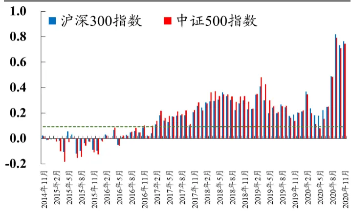
数据来源：Wind、开源证券研究所

图2：陆股通成交金额占两市比例逐渐上升
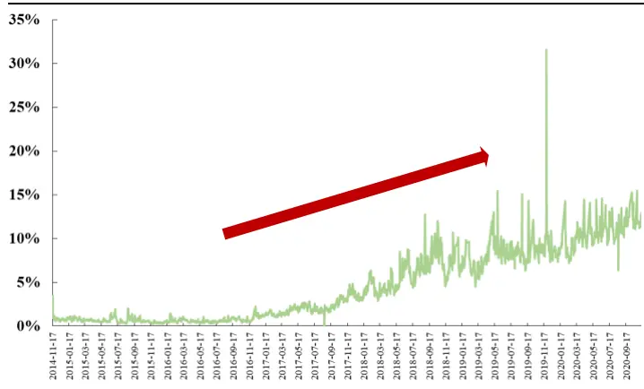
数据来源：Wind、开源证券研究所

## 3、 定性复盘：北上资金对A股市场走势具有预判性

在本节中，我们将选取若干交易日作为案例，复盘北上资金与A股指数的盘中走势。我们从定性的角度考察：北上资金对A股市场走势，是否具有一定的预判性和推动作用？

案例一：2019年3月29日，上证综指上涨3.20%，北上资金日度净买入金额近111亿人民币。图3的分钟数据显示，从当日上午10:00起，北上净买入金额呈加速增长态势，上证综指同步迅速拉升，截至中午收盘涨幅约2.4%。上证综指的涨势在午后变缓，下午2小时仅上涨0.9%，与此大相径庭的是，北上资金在尾盘40分钟继续呈加入净流入。这个迹象似乎在暗示，“聪明资金”对后市继续持有乐观态度。果不其然，在随后的交易日（2019年4月1日），上证综指继续大涨2.58%。

案例二：2020年7月24日，上证综指下跌3.86%，北上资金日度净卖出金额近163亿人民币。图4的分钟数据显示，截至上午10:30，北上资金累计净买入逾80亿元，尽管市场已大幅下挫近1%，北上净卖出趋势并没有放缓，10:30至11:30收盘，北上净卖出近40亿元，截至中午收盘，上证综指下挫1.72%。下午开盘后，尽管最初20分钟买入金额和卖出金额基本势均力敌，大盘暂且稳住下挫趋势，但13:20之后，北上卖出趋势继续扩大，13:40大盘继续转而向下，继续加速下跌，下午总计跌幅1.65%。

图3：20190329北上资金持续净流入，市场大涨
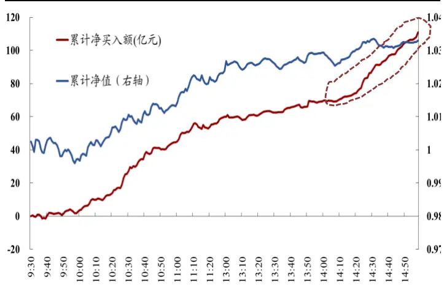
数据来源：Wind、开源证券研究所

图4：20200724北上资金持续净流出，市场大跌
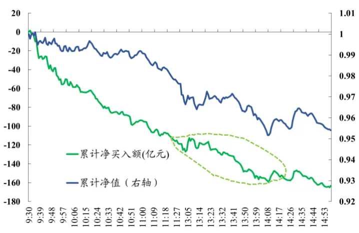
数据来源：Wind、开源证券研究所

## 4、 定量测试：陆股通分钟数据为CTA策略带来显著提升

通常，我们会通过收盘后得到的陆股通净买入成交金额作为今天北上资金的情绪，部分投资者根据陆股通是净买入或净卖出，对明天的大盘走势进行判断。为此，我们构建日频CTA策略进行简单的测试，回测框架如表1所示。

表1：CTA策略回测框架

| 信号 | T日净买入金额 |
| --- | --- |
| 开仓时点 | 若T日信号指标Signal为正，则T+1日开盘价买入股指期货；若T日信号指标Signal为负，则卖空股指期货 |
| 平仓时点 | T+2日开盘价平仓 |
| 手续费 | 暂不考虑手续费 |
| 资产标的 | 沪深300股指期货和中证500期货的当月连续合约，且考虑合约换仓 |
| 时间区间 | 2017年至今 |

数据来源：Wind、开源证券研究所

首先，我们使用日频数据的陆股通净买入金额构建信号指标：

$$
Signal_{日频}=\left\{\begin{aligned}1,&\quad 当日陆殷通净买入金额为正\\-1,&\quad 当日陆殷通净买入金额为负\end{aligned}\right.
$$

图5和表2分别为使用 $Signal_{日频}$ 作为信号的绩效表现。可以看到，使用回测标的为沪深300期货的绩效表现优于中证500期货。2017年至今，沪深300股指期货下的策略年化收益率为21.3%，年化波动率为19.9%，收益波动比1.07，尤其从2019年以来，使用日频数据做跟随策略，具有非常可观的盈亏比，2019年和2020年，策略的年化收益波动比分别为3.18和2.86。

图5：Signal日频的策略净值：沪深300股指期货表现优于中证500股指期货
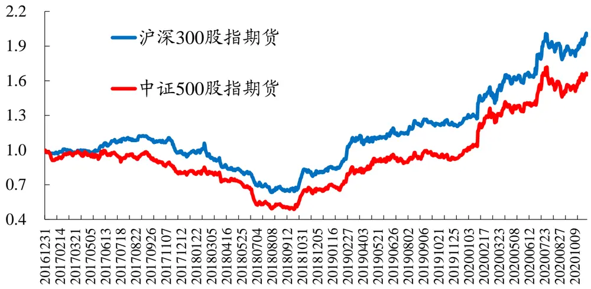
数据来源：Wind、开源证券研究所

表2：Signal日频的绩效表现：沪深300股指期货收益波动比1.07，中证500股指期货收益波动比0.64

| 标的 | 年份 | 年化收益率 | 年化波动率 | 收益波动比 |  | 最大回撤 单次收益 | 实际交易次数 | 胜率 | 盈亏比 |
| --- | --- | --- | --- | --- | --- | --- | --- | --- | --- |
| IF | 2017年 | -5.4% | 11.7% | -0.47 | 16.2% | -0.003% | 69 | 46.4% | 0.79 |
|  | 2018年 | -13.1% | 22.0% | -0.60 | 40.1% | -0.061% | 80 | 47.5% | 0.92 |
|  | 2019年 | 59.8% | 18.8% | 3.18 | 6.9% | 0.201% | 72 | 47.2% | 2.00 |
|  | 2020年 | 73.0% | 25.6% | 2.86 | 11.2% | 0.235% | 75 | 50.7% | 1.29 |
|  | 2017年至今 | 21.3% | 19.9% | 1.07 | 43.6% | 0.085% | 297 | 47.8% | 1.18 |
| IC | 2017年 | -21.9% | 15.9% | -1.38 | 21.3% | -0.076% | 69 | 36.2% | 1.10 |
|  | 2018年 | -16.0% | 25.0% | -0.64 | 42.9% | -0.072% | 80 | 45.0% | 0.98 |
|  | 2019年 | 54.0% | 23.2% | 2.33 | 8.1% | 0.186% | 72 | 55.6% | 1.29 |
|  | 2020年 | 86.1% | 28.5% | 3.02 | 15.0% | 0.270% | 75 | 45.3% | 1.58 |
|  | 2017年至今 | 15.0% | 23.4% | 0.64 | 51.2% | 0.067% | 297 | 45.5% | 1.21 |

数据来源：Wind、开源证券研究所

从图5和表2的绩效表现可以看到，近年来跟随聪明钱的操作确实能获取不错的收益。接下来，我们使用陆股通的分钟频数据构建Signal分钟频信号。图6、图7和表3为使用Signal 信号后的策略表现，不论沪深300期指或中证500期指，使用分钟频以后择时策略表现，较使用日频数据有大幅度的改善。在标的资产为沪深300期指下，$\mathrm{signal_{分钟频}}$ 的年化收益率为32.9%，收益波动比1.65， $而\mathrm{signal_{日频}}$ 的收益波动比为1.07；在标的资产为中证500期指下， $\mathrm{signal_{分钟频}}$ 的年化收益率为32.6%，收益波动比1.39，$而\mathrm{signal_{日频}}$ 的收益波动比仅为0.64。

从分年来看， $\mathrm{signal_{分钟频}}$ 的策略表现均优于 $\mathrm{signal_{日频}}$ 。以2018年为例，2018年市场大幅下跌， $\mathrm{signal_{日频}}$ 的年化收益率为-13.1%，而 $\mathrm{Signal}_{分钟频}$ 仅跌4%（测试标的IF）。

图6：年化收益波动比提升至1.65（测试标的为IF）
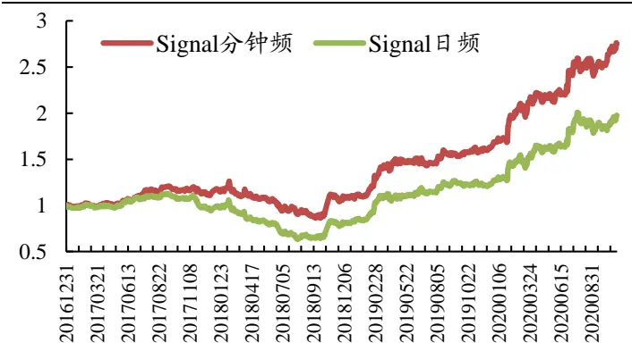
数据来源：香港交易所、Wind、开源证券研究所

图7：年化收益波动比提升至1.39（测试标的为IC）
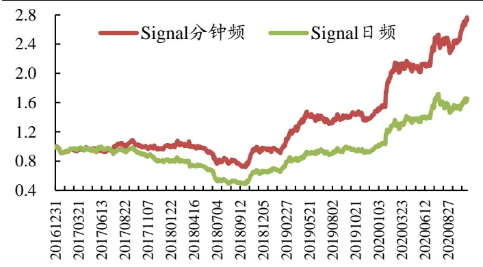
数据来源：香港交易所、Wind、开源证券研究所

表3：Signal分钟频的绩效表现：使用分钟陆股通数据后的策略表现较原始日度数据有大幅度改善

| 标的 | 年份 | 年化收益率 | 年化波动率 | 收益波动比 | 最大回撤 | 单次收益 | 实际交易次数 | 胜率 | 盈亏比 |
| --- | --- | --- | --- | --- | --- | --- | --- | --- | --- |
| IF | 2017年 | 14.1% | 11.7% | 1.21 | 8.5% | 0.064% | 85 | 50.6% | 1.08 |
|  | 2018年 | -4.0% | 22.0% | -0.18 | 31.6% | -0.021% | 85 | 47.1% | 1.02 |
|  | 2019年 | 62.0% | 18.8% | 3.30 | 5.4% | 0.207% | 82 | 51.2% | 1.66 |
|  | 2020年 | 84.9% | 25.7% | 3.30 | 7.5% | 0.262% | 74 | 50.0% | 1.20 |
|  | 2017年至今 | 32.9% | 19.9% | 1.65 | 31.6% | 0.122% | 328 | 49.7% | 1.19 |
| IC | 2017年 | -2.1% | 16.0% | -0.13 | 11.9% | 0.010% | 85 | 51.8% | 1.05 |
|  | 2018年 | -4.2% | 25.0% | -0.17 | 33.7% | -0.019% | 85 | 45.9% | 0.98 |
|  | 2019年 | 65.4% | 23.1% | 2.83 | 11.2% | 0.214% | 82 | 52.4% | 1.33 |
|  | 2020年 | 115.7% | 28.6% | 4.05 | 10.0% | 0.330% | 74 | 43.2% | 1.67 |
|  | 2017年至今 | 32.6% | 23.4% | 1.39 | 34.0% | 0.124% | 328 | 48.5% | 1.19 |

数据来源：香港交易所、Wind、开源证券研究所

## 5、 若干重要讨论

从表2和表3的“实际交易次数”这一列中可以看到，使用分钟频数据构建的CTA策略较使用日频数据的CTA策略，在交易次数上有所上升。为此，我们测试在不同费率下这两种策略的实际表现。

图8和图9分别为在沪深300股指期货和中证500股指期货下按照不同费率下的策略净值。可以看到，不论是IF或IC，陆股通分钟频的择时策略表现均优异于陆股通日频的择时策略表现。

图8：不同费率下的Signal分钟频策略在IF上依然稳健
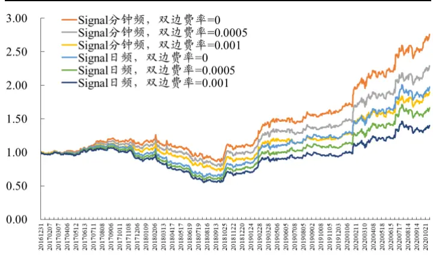
数据来源：香港交易所、Wind、开源证券研究所

图9：不同费率下的Signal分钟频在IC上依然稳健
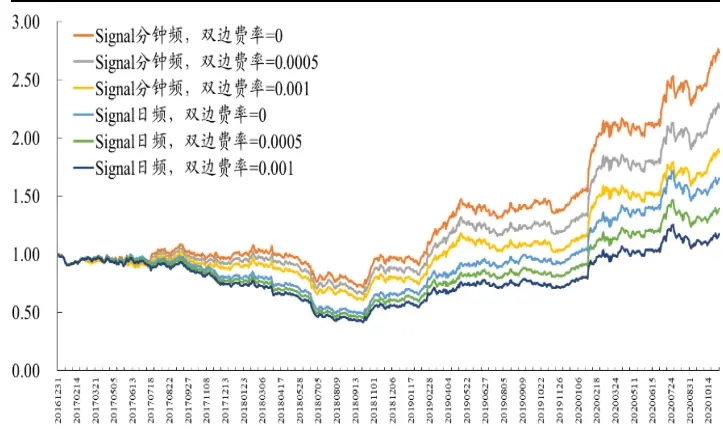
数据来源：香港交易所、Wind、开源证券研究所

另外，为了证明使用陆股通数据对大盘走势具有预见性，我们使用蒙特卡洛模拟生成随机信号作为参照组，模拟次数为10000次，测试在随机模拟信号下CTA策略的收益波动比。图10和图11表明，在不考虑费率的情况下，不管使用沪深300期指或中证500期指，使用陆股通信息的择时策略明显优于随机模拟得到的CTA策略，利用北上资金数据构建择时策略具有适用性。

图10：陆股通信号效果对短期未来走势具有预见性（IF）
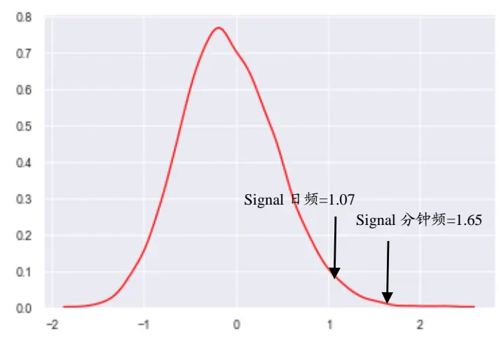
数据来源：香港交易所、Wind、开源证券研究所

图11：陆股通信号效果对短期未来走势具有预见性（IC）
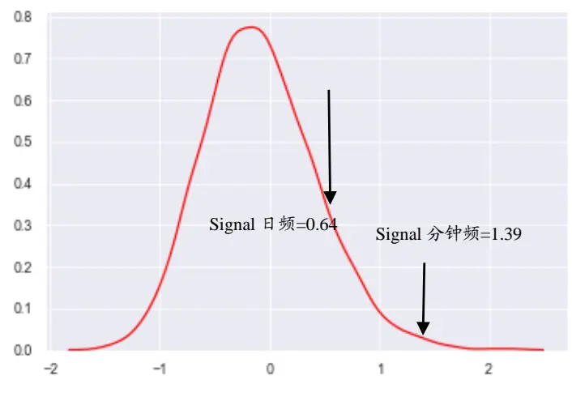
数据来源：香港交易所、Wind、开源证券研究所

## 6、 风险提示

本报告模型及结果通过历史数据统计、建模和测算完成，在市场波动不确定性下可能存在失效风险；历史数据不代表未来业绩。

## 特别声明

《证券期货投资者适当性管理办法》、《证券经营机构投资者适当性管理实施指引（试行）》已于2017年7月1日起正式实施。根据上述规定，开源证券评定此研报的风险等级为R3（中风险），因此通过公共平台推送的研报其适用的投资者类别仅限定为专业投资者及风险承受能力为C3、C4、C5的普通投资者。若您并非专业投资者及风险承受能力为C3、C4、C5的普通投资者，请取消阅读，请勿收藏、接收或使用本研报中的任何信息。

因此受限于访问权限的设置，若给您造成不便，烦请见谅！感谢您给予的理解与配合。

## 分析师承诺

负责准备本报告以及撰写本报告的所有研究分析师或工作人员在此保证，本研究报告中关于任何发行商或证券所发表的观点均如实反映分析人员的个人观点。负责准备本报告的分析师获取报酬的评判因素包括研究的质量和准确性、客户的反馈、竞争性因素以及开源证券股份有限公司的整体收益。所有研究分析师或工作人员保证他们报酬的任何一部分不曾与，不与，也将不会与本报告中具体的推荐意见或观点有直接或间接的联系。

## 股票投资评级说明

|  | 评级 | 说明 |
| --- | --- | --- |
| 证券评级 | 买入（Buy） | 预计相对强于市场表现20%以上； |
|  | 增持（outperform） | 预计相对强于市场表现5%~20%； |
|  | 中性（Neutral） | 预计相对市场表现在-5%~+5%之间波动； |
|  | 减持（underperform） | 预计相对弱于市场表现5%以下。 |
| 行业评级 | 看好（overweight） | 预计行业超越整体市场表现; |
|  | 中性（Neutral） | 预计行业与整体市场表现基本持平； |
|  | 看淡（underperform） | 预计行业弱于整体市场表现。 |
| 备注：评级标准为以报告日后的6~12个月内，证券相对于市场基准指数的涨跌幅表现，其中A股基准指数为沪深300指数、港股基准指数为恒生指数、新三板基准指数为三板成指（针对协议转让标的）或三板做市指数（针对做市转让标的)、美股基准指数为标普500或纳斯达克综合指数。我们在此提醒您，不同证券研究机构采用不同的评级术语及评级标准。我们采用的是相对评级体系，表示投资的相对比重建议；投资者买入或者卖出证券的决定取决于个人的实际情况，比如当前的持仓结构以及其他需要考虑的因素。投资者应阅读整篇报告，以获取比较完整的观点与信息，不应仅仅依靠投资评级来推断结论。 |  |  |

## 分析、估值方法的局限性说明

本报告所包含的分析基于各种假设，不同假设可能导致分析结果出现重大不同。本报告采用的各种估值方法及模型均有其局限性，估值结果不保证所涉及证券能够在该价格交易。

## 法律声明

开源证券股份有限公司是经中国证监会批准设立的证券经营机构，已具备证券投资咨询业务资格。

本报告仅供开源证券股份有限公司（以下简称“本公司”）的机构或个人客户（以下简称“客户”）使用。本公司不会因接收人收到本报告而视其为客户。本报告是发送给开源证券客户的，属于机密材料，只有开源证券客户才能参考或使用，如接收人并非开源证券客户，请及时退回并删除。

本报告是基于本公司认为可靠的已公开信息，但本公司不保证该等信息的准确性或完整性。本报告所载的资料、工具、意见及推测只提供给客户作参考之用，并非作为或被视为出售或购买证券或其他金融工具的邀请或向人做出邀请。本报告所载的资料、意见及推测仅反映本公司于发布本报告当日的判断，本报告所指的证券或投资标的的价格、价值及投资收入可能会波动。在不同时期，本公司可发出与本报告所载资料、意见及推测不一致的报告。客户应当考虑到本公司可能存在可能影响本报告客观性的利益冲突，不应视本报告为做出投资决策的唯一因素。本报告中所指的投资及服务可能不适合个别客户，不构成客户私人咨询建议。本公司未确保本报告充分考虑到个别客户特殊的投资目标、财务状况或需要。本公司建议客户应考虑本报告的任何意见或建议是否符合其特定状况，以及（若有必要）咨询独立投资顾问。在任何情况下，本报告中的信息或所表述的意见并不构成对任何人的投资建议。在任何情况下，本公司不对任何人因使用本报告中的任何内容所引致的任何损失负任何责任。若本报告的接收人非本公司的客户，应在基于本报告做出任何投资决定或就本报告要求任何解释前咨询独立投资顾问。

本报告可能附带其它网站的地址或超级链接，对于可能涉及的开源证券网站以外的地址或超级链接，开源证券不对其内容负责。本报告提供这些地址或超级链接的目的纯粹是为了客户使用方便，链接网站的内容不构成本报告的任何部分，客户需自行承担浏览这些网站的费用或风险。

开源证券在法律允许的情况下可参与、投资或持有本报告涉及的证券或进行证券交易，或向本报告涉及的公司提供或争取提供包括投资银行业务在内的服务或业务支持。开源证券可能与本报告涉及的公司之间存在业务关系，并无需事先或在获得业务关系后通知客户。

本报告的版权归本公司所有。本公司对本报告保留一切权利。除非另有书面显示，否则本报告中的所有材料的版权均属本公司。未经本公司事先书面授权，本报告的任何部分均不得以任何方式制作任何形式的拷贝、复印件或复制品，或再次分发给任何其他人，或以任何侵犯本公司版权的其他方式使用。所有本报告中使用的商标、服务标记及标记均为本公司的商标、服务标记及标记。

## 开源证券研究所

上海

地址：上海市浦东新区世纪大道1788号陆家嘴金控广场1号

楼10层

邮编：200120

邮箱：research@kysec.cn

北京
地址：北京市西城区西直门外大街18号金贸大厦C2座16层
邮编：100044
邮箱：research@kysec.cn

地址：深圳市福田区金田路2030号卓越世纪中心1号

邮编：518000

邮箱：research@kysec.cn

西安

地址：西安市高新区锦业路1号都市之门B座5层

邮编：710065

邮箱：research@kysec.cn