2020 年 12 月 31 日

## 金融工程研究团队

魏建榕（首席分析师）

邮箱：weijianrong@kysec.cn

证书编号：S0790519120001

## 张翔（分析师）

邮箱：zhangxiang2@kysec.cn

证书编号：S0790520110001

## 傅开波（分析师）

邮箱：fukaibo@kysec.cn

证书编号：S0790520090003

## 高 鹏（分析师）

邮箱：gaopeng@kysec.cn

证书编号：S0790520090002

## 苏俊豪（研究员）

邮箱：sujunhao@kysec.cn

证书编号：S0790120020012

## 胡亮勇（研究员）

邮箱：huliangyong@kysec.cn

证书编号：S0790120030040

## 王志豪（研究员）

邮箱：wangzhihao@kysec.cn

证书编号：S0790120070080

## 相关研究报告

《开源量化评论（9）-长端动量因子与基本面更兼容》-2020.10.15

《开源量化评论（10）-北向资金行为视角下的行业轮动》-2020.10.28

《开源量化评论（11）-北向资金高频数据的 CTA 潜力》-2020.11.14

《开源量化评论（12）-国债期货的假期效应》-2020.11.17

## 高频股东数据的隐含信息量

# ——开源量化评论（13）

## 魏建榕（分析师）

weijianrong@kysec.cn

胡亮勇（联系人）

huliangyong@kysec.cn

证书编号：S0790519120001

证书编号：S0790120030040

## ⚫ 互动易平台实时披露的数据是定期报告披露数据的有益补充

互动易平台上关于上市公司最新股东户数的问询相对频繁，隐含着投资者认为股东户数的相关信息与公司股价的未来表现有一定的联系。

互动易平台关于股东户数问询的有效回复每期占比在 20%~30%的区间波动，每期有效回复个股数量在 600 只上下。

过去八年间，1/4 的深交所上市公司通过互动易平台披露最新股东户数的次数少于 12次；近80家上市公司披露股东户数超 150次；383 家上市公司始终未在该平台上披露过股东户数相关信息。

## ⚫ 低频股东户数变化因子具有选股能力

低频股东类因子更新频率低，时效性差，低频数据的高频化需要选择合理的方法。低频股东户数因子（ABS_N）不具有选股能力，但低频股东户数变化因子（PCT_N）具有比较优秀的选股能力。即，股东户数本身的大小不具备获取超额收益的能力，但股东户数的变动蕴含着丰富的信息。

低频股东户数变化因子（PCT_N）多头累计净值4.58，多空累计净值 1.73，年化收益率 21%，夏普比率0.72。

## ⚫ 纳入高频股东数据的合成股东变化因子具有收益增强能力

高回复个股数前期逐步增加，后期趋于稳定，每期高回复个股数量在 600只左右浮动。

高频合成股东户数变化因子（M_PCT_N）相对于低频股东户数因子（PCT_N），无论从五分组收益还是多空对冲净值上都产生了一定的提升作用。

M_PCT_N因子多头累计净值 4.79，多空累计净值1.97，年化收益率 22%，夏普比率 0.74。

在高回复股票池中，高频合成股东户数变化因子（H_M_PCT_N）相比低频股东户数因子（H_PCT_N），有更好的效果提升。

## ⚫ 不同股票池下高频股东数据信息含量不一

股东类因子与各主要大类风险因子具有较低的相关性。其中，相关性最高的为流动性因子，相关性最低的为市值类因子。

不同股票池下，高频数据对原始低频因子的增益效果差异明显。其中，以深证成指增益最高，年化超额达到10%。

一言以蔽之，高频股东数据的纳入能够帮助传统的低频股东因子产生额外的收益增益，但增益幅度的大小与选取的股票池相关。

⚫ 风险提示：模型测试基于历史数据，市场未来可能发生变化。

## 1、 互动易平台数据概览

深交所互动易(irm.cninfo.com.cn) 是“深圳证券交易所上市公司投资者关系互动平台”的简称，由深交所官方推出，是供投资者与上市公司直接沟通的平台，一站式公司资讯汇集，提供第一手的互动问答、投资者关系信息、公司声音等内容，整合了公司公告、股东信息、公司财务与融资等综合信息，帮助投资者更了解上市公司。作为承载投资者与上市公司直接沟通的桥梁，互动易一定程度上改善了投资者获取信息的及时性与准确性，提升了市场信息效率水平。

在互动易诸多问询内容中，针对上市公司最新股东户数的提问始终占据着较高的热度。其中隐含的假设为大部分投资者认为公司股东户数的变化与未来股价的表现存在一定的关联性。为了验证这个猜测，我们尝试对互动易平台上投资者关于股东户数的问询进行分析，以期能从中探寻出一定的规律。

从 2013 年 1 月 1 日开始（在此之前数据稀疏且质量不高，不纳入考察），截至2020年11月30日，互动易平台累计共有1971 家上市公司针对投资者关于股东户数的问询进行了有效回复，占深交所全部上市公司约 80%的比例。有效回复为上市公司针对投资者关于股东户数的提问给出了具体数字答复。

按照逐年统计，投资者在互动易平台上关于股东户数的问询次数与市场波动率（年化）之间存在显著的正相关性。当市场处于高波动状态时，投资者更倾向于在互动易平台上咨询最新的股东人数。其体现的心理效应是，当市场波动放大加剧投资者持仓个股的波动时，投资者开始对自己的持仓自信心下降，需要通过外界各种利好消息来证明自身持仓决定的正确性。

图1：股东问询次数与市场波动率高度相关
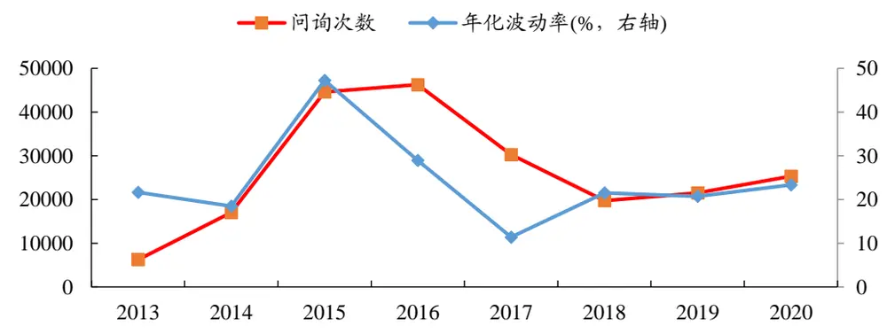
数据来源：互动易、Wind、开源证券研究所

按照月度统计，深交所上市公司关于投资者对股东户数问询的有效回复初期缓慢增加，后随着2014年下半年牛市的展开有一个快速攀升的过程（提问数大幅增加），2015年后有效回复率逐步稳定在20%~30%的区间，每期有效回复个股数目逐步稳定在 600 只附近。

图2：互动易平台有效回复个股占比和数量均趋于稳定
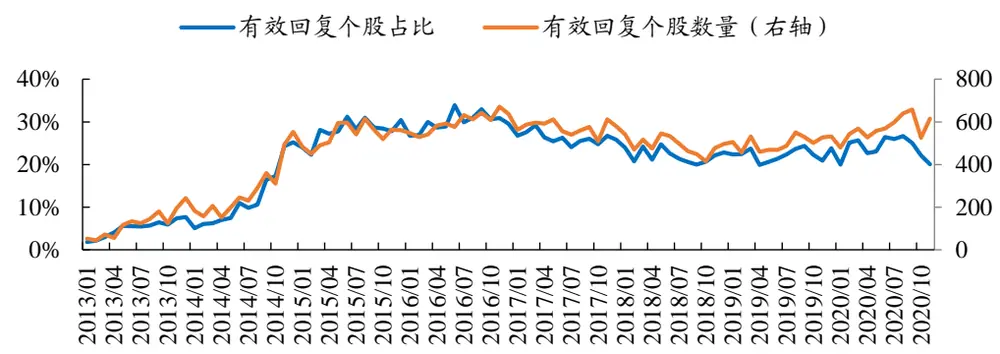
数据来源：互动易、开源证券研究所

从个股层面来看，问询有效回复分布有偏现象严重。测试区间内有效回复数低于 12次的个股占比高达43.78%，高于 100次的个股占比仅8.59%。对于投资者问询有效回复最多的公司是中航西飞（000768.SZ），共计 228 次；累计回复数超过 200次的公司目前有 6家，均位于中小板；383家深交所上市公司自互动易平台开放以来，未在其上针对投资者提问披露过股东户数相关信息。

图3：有效回复数分布
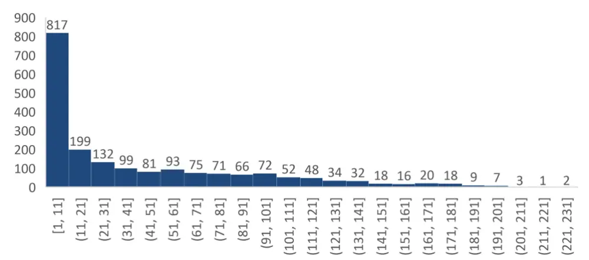
数据来源：互动易、开源证券研究所

我们以一个具体案例来切入股东户数的变动与股价表现之间的关系。 2019年9月到 2020 年 2 月间，世纪华通（002602.SZ）股价发生大幅度拉升，期间累计涨幅最高达到 70%，此时股东户数仅从 29000多户小幅增长到33000多户，增幅约14%。2020 年 3 月后，股价进入横盘震荡走势，股东户数开始大幅攀升，到 2020 年 7 月14 日股价进入阶段高点时，股东户数上涨到近 90000 户，四个月时间股东户数涨幅近两倍。2020年8月后，股东户数继续攀升，最高上涨至 170000户后开始在高位震荡，从行情起点计算，股东户数翻了近 5 倍，但此后公司股价逐步走低，截至 2020年 11月底，从高点累计下跌约45%。可以看到世纪华通股东户数的变动与股价未来表现的有着显著负相关性，一叶知秋，从全市场角度来看，股东户数的变化是否具有稳定的超额收益呢？

图4：世纪华通股价表现与股东户数变动比较
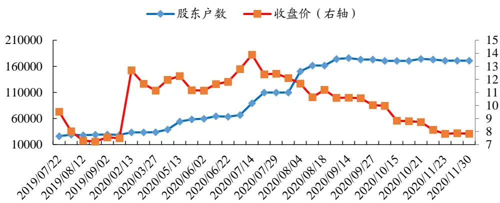
数据来源：互动易、Wind、开源证券研究所

## 2、 低频股东因子

当前，投资者获取股东数据的方式主要来源于上市公司每年定期披露的报告，包括一季报、半年报、三季报及年报。但当前获取股东数据的方式，存在两个显著的缺点：

第一， 更新频率低。对于大部分的投资者而言，低频数据的高频化处理是比较棘手的。

第二， 时效性差。定期披露的股东数据，存在着明显的时滞，短则十几天（季报），长则三四个月（年报）。通常，数据对未来的预测能力会随着滞后期的增长而相应减弱。

虽然原始低频股东数据有无法避免的缺陷，但其依然是值得探索的维度。我们尝试在多因子框架下对低频股东因子进行测试，以探究其是否具有选股能力。股东类因子的潜在有效性可以基于投资者的行为进行推演，一般而言，当某只股票的股东数在一段时间内呈现持续下降的趋势时，其通常被认为是主力资金在逐渐收集个人投资者手中的筹码，等吸收到的筹码足够减轻未来的抛压时，则未来股价拉升存在的阻力便会减小，股价倾向于在业绩改善、题材驱动等事件影响下迎来上涨；反之，当某只股票股东户数呈现不断上升的趋势时，则大概率面临主力资金逐步止盈出场的境地，未来股价拉升动力下降，股价未来倾向于走弱。

## 2.1、 低频股东因子构建

基于前文的假设，我们对低频股东数据进行因子化。在进行因子化之前，我们需要对定期报告披露的数据进行日期的调整，避免存在未来数据。概括来说，我们根据实际发布日期来对报告日期进行调整，比如某只股票一季报在 4 月 12 日披露，则将其真实可获取日期修改为 4 月 12 日，而非 3 月 31 日。不同股票定期报告披露日期存在差异，为了保证数据对齐，统一采用前值填充到月底。

对于股东户数相关因子的构建主要从两个维度出发，一是直接将股东户数的具体数值作为因子值，二是将股东户数的变化值作为因子值。值得注意的是，由于股东数据是使用前值填充的，所以直接使用股东户数变化的百分比会在特定月份产生诸多的 0值，如每年的5月、6月和 7 月，从而导致因子值无法有效分组。为此，在构建股东变化因子时，我们通过隔季选取股东户数进行时序上的 ZSCORE 处理，从而得到相应股东变化的因子值。

举个例子，假设当前日期为2020 年10月 31日，回溯期为 2 年（9个季度），在隔季选取的规则下，参与股东变化因子计算的日期包括【计算日期】列对应的 9 个日期，但参与计算的数据来源于【实际日期】列披露的数据，基于该日期下的数据进行运算。

表1：股东户数变动因子计算流程

| 报告日期 | 披露日期 | 计算日期 | 实际日期 | 股东数量 |
| --- | --- | --- | --- | --- |
| 2018/9/30 | 2018/10/24 | 2018/10/31 | 2018/8/16 | 421677 |
| 2018/12/31 | 2019/3/7 | 2019/1/31 | 2018/10/24 | 435978 |
| 2019/3/31 | 2019/4/24 | 2019/4/30 | 2019/3/7 | 406242 |
| 2019/6/30 | 2019/8/8 | 2019/7/31 | 2019/4/24 | 369119 |
| 2019/9/30 | 2019/10/22 | 2019/10/31 | 2019/8/8 | 354508 |
| 2019/12/31 | 2020/2/14 | 2020/1/31 | 2019/10/22 | 299958 |
| 2020/3/31 | 2020/4/21 | 2020/4/30 | 2020/4/21 | 397399 |
| 2020/6/30 | 2020/8/28 | 2020/7/31 | 2020/4/21 | 397399 |
| 2020/9/30 | 2020/10/22 | 2020/10/31 | 2020/8/28 | 431036 |

数据来源：互动易、Wind、开源证券研究所

在进行因子测试前，我们在每个截面上剔除上市不满一年的个股（股东数目变动逐渐摆脱新股的影响），月末调仓，暂且不考虑手续费影响，测试区间设置为 2013年 1 月至 2020 年 11 月。

由于股东户数与市值大小存在高相关性，所以在检验因子表现之前需要在截面上进行市值中性化处理。同理，由于不同行业之间股东户数存在有偏现象，比如银行行业股东户数中位数显著高于全市场中位数，所以需要对原始股东户数做行业中性化处理。为避免潜在影响，如无特别说明，后续所有因子均做市值行业中性化处理。

图5：股东户数与个股市值高度相关
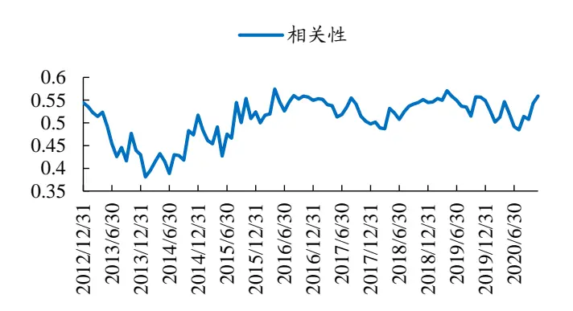
数据来源：Wind、开源证券研究所

图6：不同行业之间股东户数有偏
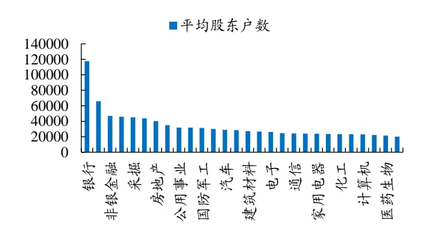
数据来源：Wind、开源证券研究所

## 2.2、 低频股东因子测试

## 2.2.1、 股东户数因子

进行市值行业中性化后，低频的股东户数因子乏善可陈，五分组之间没有明显的差异度，多空对冲收益不稳定，不存在超额收益。我们亦测试过不进行中性化的股东户数因子，其分组收益稳定，中性化后的表现急剧下滑，说明股东户数因子的超额收益来源于市值效应带来的增量。

图7：股东户数因子分组收益不单调
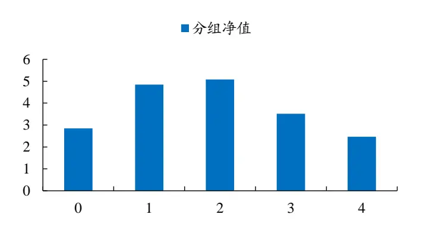
数据来源：Wind、开源证券研究所

图8：股东户数因子不存在超额收益
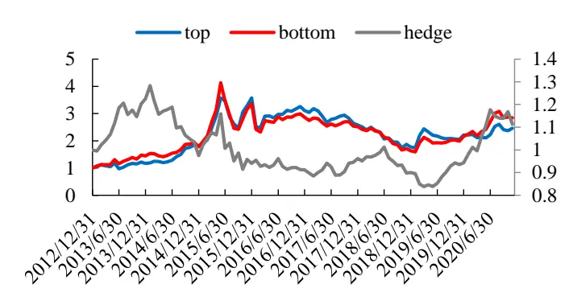
数据来源：Wind、开源证券研究所

## 2.2.2、 股东户数变化因子

前文我们详细介绍了股东户数变化因子的构建方式，在实际构建时，需要设置回溯时间的参数，这里我们按照回溯一年，即首尾五期数据来进行ZSCORE计算。我们认为主力吸筹建仓和派筹出局的过程是一个相对偏短的周期，一般不超过一年，回溯时间过长容易导致数据有效性降低。

相比于股东户数因子，市值行业中性化后的股东户数变化因子在深交所上市公司间有较好的选股效果。虽然分组收益在测试区间内单调性不够好，但高低分组之间的收益差却是比较稳定的，多空对冲收益在测试区间内总体向上不断上升，2019年以来因子多空区分度更是进一步提升。

图9：股东户数变化因子分组收益整体单调
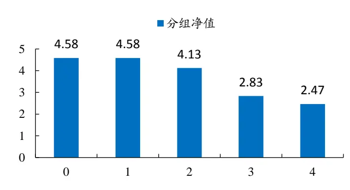
数据来源：Wind、开源证券研究所

图10：股东户数变化因子选股效果整体表现较好
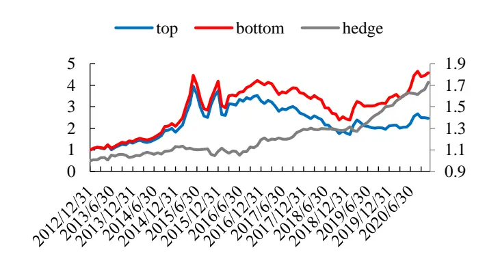
数据来源：Wind、开源证券研究所

## 3、 高频股东因子

在低频维度上，股东户数因子本身没有超额收益，但股东户数变化因子表现较好。如果我们获取股东人数的滞后性降低，从滞后一个月到几个月变成仅滞后几个或十几个交易日，是否能对当前股东户数变化因子的表现进行一定程度改善呢？循着这个思路，我们尝试将互动易平台上更高频的问询回复信息与定期披露的报告信息相结合。

## 3.1、 高频股东数据的处理

在进入正题之前，我们来看看互动易平台公布数据的特征。在截取的样本信息中，各主要字段含义如下：

mainContent：投资者的问询内容；

attachedContent：上市公司的回复内容；

pubDate：是投资者在互动易平台提问的日期；

updateDate：是上市公司回复投资者问询的日期。

当我们通过正则表达式对文本进行解析，得到相关的股东数据后，我们使用updateDate 来对股东户数进行映射。因为投资者问询日期与上市公司实际回复日期之间通常存在一定的时间间隔，这样处理避免了在pubDate拿到updateDate 的数据。

图11：互动易平台股东问询回复样例
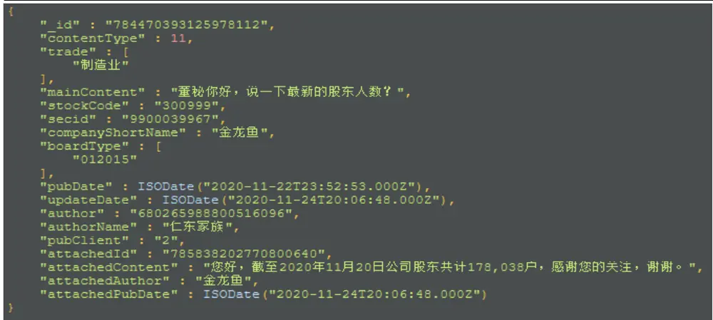
数据来源：互动易、开源证券研究所

高频股东因子的构建遵循低频数据为主，高频数据为辅的理念，即互动易披露的股东数据仅对定期报告股东数据缺失的月份进行补全，对当月已先披露的数据进行更新。以平安银行为例，在 2019 年 10 月我们使用三季报数据替换最新的互动易问答数据，在 2020年 4月我们使用更晚公布的互动易数据替换更早公布的定期报告数据（虽然二者数值一致）。下表中的Y 表示数据来源于定期报告，N 表示数据来源于互动易平台，删除线表示本期不予采用。

表2：互动易数据填补逻辑演示

| 股票代码 | 报告日期 | 股东户数 | 调整日期 | 数据来源 |
| --- | --- | --- | --- | --- |
| 000001.SZ | 2019/10/17 | 321929 | 2019/10/31 | N |
| 000001.SZ | 2019/10/22 | 299958 | 2019/10/31 | Y |
| 000001.SZ | 2020/2/14 | 322864 | 2020/2/29 | Y |
| 000001.SZ | 2020/4/21 | 397399 | 2020/4/30 | ￥ |
| 000001.SZ | 2020/4/29 | 397399 | 2020/4/30 | N |
| 000001.SZ | 2020/5/29 | 397399 | 2020/5/31 | N |
| 000001.SZ | 2020/7/28 | 397399 | 2020/7/31 | N |
| 000001.SZ | 2020/8/28 | 431036 | 2020/8/31 | Y |
| 000001.SZ | 2020/9/29 | 397399 | 2020/9/30 | N |
| 000001.SZ | 2020/10/22 | 351374 | 2020/10/31 | Y |

数据来源：互动易、Wind、开源证券研究所

## 3.2、 高频股东因子测试

## 3.2.1、 合成股东户数变化因子

按照以上思路填补好数据后，我们开始构建高频股东因子数据，为了避免相邻月份之间的数值一致，我们仍然采用隔月选取的模式。需要注意的是，由于现在实际可获取数据数量有所增加，我们对回溯一年隔季取值求时序股东户数变动因子的方法进行小幅的改动：在回溯期长度保持不变的情况下（维持一年），每隔两个月选取一次数值进行时序股东户数变化因子计算。

可以看到，纳入互动易高频股东户数数据后的合成因子，无论从五分组收益区分度上还是多空对冲收益的增幅上都有了一定的改善，这也印证了我们的猜想，互动易的高频股东数据是能够产生信息增益的。

图12：合成股东户数变化因子分组收益表现改善
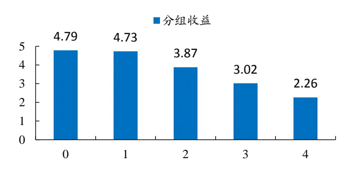
数据来源：互动易、Wind、开源证券研究所

图13：合成股东户数变化因子对冲收益更稳定
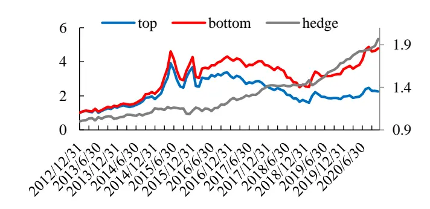
数据来源：互动易、Wind、开源证券研究所

为了更清晰的展示二者的差异，我们将各自的对冲净值绘制在同一幅图上，如下图所示：高频股东户数变化因子相对纯低频的因子产生了稳定的超额收益。

图14：高频因子相比低频因子有着稳定的超额收益
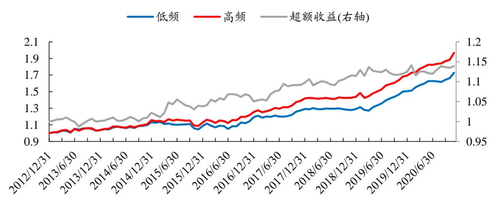
数据来源：互动易、Wind、开源证券研究所

## 3.2.2、 高回复合成股东户数变化因子

虽然纳入互动易数据后的策略表现有所改善，但是效果并不显著。根据前文可知，互动易数据对个股的覆盖度每期在 20%~30%之间波动，导致合成因子中高频数据的占比较少，因子收益的改善不是特别明显。为此，我们尝试将股票池进行缩小，仅保留那些在互动易平台上经常对投资者的问询进行有效回复的个股。

我们以上市公司过去一年中至少有六个月在互动易平台上进行有效回复为限，构建高回复股票池。自 2013 年开始，滚动十二个月的高回复个股数量从 2015 年后开始稳定在 500 只以上，前后两期高回复个股变化率自 2016 年后逐步稳定在 5%附近。为了尽量减少股票池变动带来的偏差，我们将测试起始日期调整为2014年6月，每期符合条件的股票数达到 300只以上。

图15：互动易高回复个股数量前期逐步增加后期趋于稳定
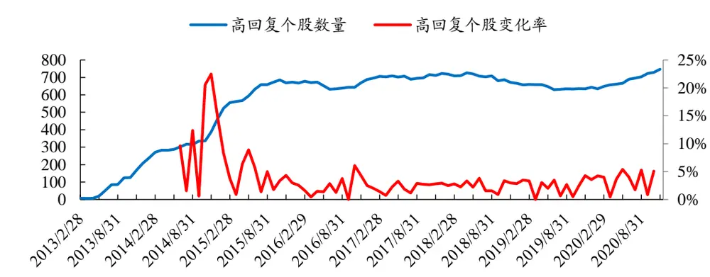
数据来源：互动易、开源证券研究所

在测试区间内，高回复合成股东户数变化因子的多空收益稳定，但是分组表现却不再单调，第二分组表现明显好于第一组。为此，我们尝试将分组数设置为三分组，以期降低股票池个股减少带来的影响。测试发现，当从五分组减少为三分组后，分组收益开始呈现单调特性，多头净值从 2.79上升到 3.05。

图16：高回复合成股东变化因子分三组严格单调
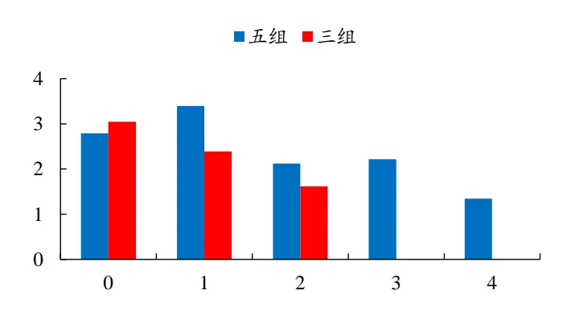
数据来源：互动易、Wind、开源证券研究所

图17：高回复合成股东变化因子（三分组）分层明显
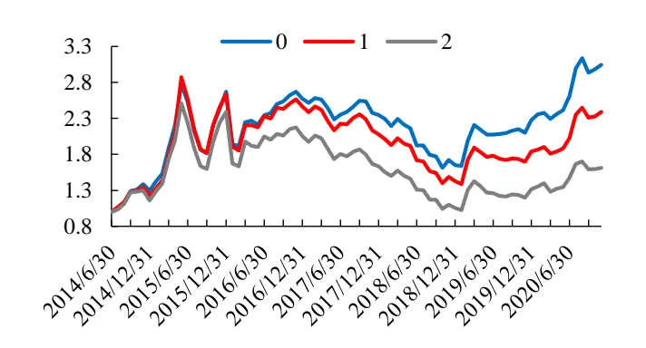
数据来源：互动易、Wind、开源证券研究所

## 4、 延展讨论

## 4.1、 不同股东类因子的表现比较

为了使不同构建形式的股东因子收益具有可比性，我们将回测起点统一为同一日期（2014年6月30日），参与比较的因子包括原始低频股东户数变动因子（PCT_N）、高频合成股东户数变动因子(M_PCT_N)、高回复低频股东户数变动因子(H_PCT_N)和高回复高频合成股东户数变动因子(H_M_PCT_N)。其中，PCT表示股东户数变化因子，N 表示中性化处理,M表示合成的高频因子，H 表示高回复股票池。简便起见，下文涉及相关因子时根据场合将以英文简称表示。

根据对比净值图，可以发现纳入高频股东数据后，低频策略都有了改善。值得注意的是，高回复低频策略表现差于纯粹的低频策略，表明高回复个股本身的质地相比市场基准有一定的下降，这从一定程度上降低了我们高回复高频策略的净值表现。

图18：纳入高频股东数据的因子优于纯低频股东数据因子的表现
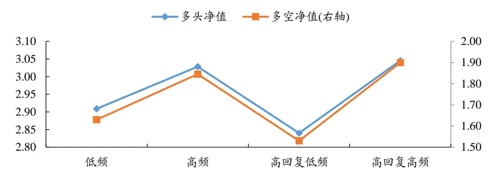
数据来源：互动易、Wind、开源证券研究所

针对不同的因子构建方法，我们试着从多个指标层面去比较各自的优劣。可以看到，纳入高频股东数据后的因子 RankIC 和 ICIR 都有了一定的提升。在当前以深交所所有上市公司作为股票池的情况下，纳入高频股东数据的因子收益端改善并不显著。收益端表现最好的是未中性化的股东户数因子，多头年化达到 28%。

表3：不同策略指标比较

| 指标 ABS | ABS_N | PCT | PCT_N | M_PCT_N H_M_PCT_N |
| --- | --- | --- | --- | --- |
| RankIC -0.040 | -0.015 | -0.033 | -0.030 | -0.032 -0.042 |
| ICIR -0.94 | -0.46 | -1.52 | -1.69 | -1.74 -1.78 |
| 负值占比 66% | 61% | 65% | 69% | 69% 73% |
| 年化收益率 28% | 14% | 23% | 21% | 22% 19% |
| 夏普比率 0.79 | 0.46 | 0.79 | 0.72 | 0.74 0.62 |
| 胜率 | 57% 53% | 55% | 57% | 57% 57% |

数据来源：互动易、Wind、开源证券研究所

我们选取了 PCT_N、M_PCT_N 和 H_M_PCT_N 三个因子分别与常见的风险因子进行相关性分析。可以看到，股东户数变化类因子与所选风险因子整体相关性都处于较低水平，其与流动性因子相关性最高，与市值类风险因子相关性最低。

表4：股东户数变动相关因子与常见风险因子相关性低

| 因子类别 | 动量 | 市值 | 流动性 | 波动性 | 盈利 | 成长 | 非线性市值 |
| --- | --- | --- | --- | --- | --- | --- | --- |
| 低频 | -0.047 | 0.007 | 0.180 | 0.083 | 0.021 | 0.098 | -0.008 |
| 高频 | -0.068 | -0.003 | 0.216 | 0.133 | 0.012 | 0.067 | -0.006 |
| 高回复高频 | -0.079 | 0.024 | 0.275 | 0.165 | 0.015 | 0.091 | 0.015 |

数据来源：互动易、Wind、开源证券研究所

## 4.2、 不同股票池的策略表现对比

在前面部分我们主要是在深交所所有上市公司之间进行策略验证，但是这几年市场风格越来越极端，马太效应充分演绎，各行各业龙头股表现大幅超于行业基准，主要成份指数的股票表现相对于全市场通常也有着较明显的超额收益。而互动易中很多股票并不在指数成份股中，鉴于此，我们尝试在不同股票池中测试高频合成股东户数变化因子的选股效果。

由于目前仅有深交所上市股票的高频股东数据，因此测试股票池选取目前也仅限定在深交所相关指数上，这里主要选取深证成指（399001.SZ）、中小板综指（399101.SZ）、创业板综指（399102.SZ）和深证综指（399106.SZ）四类。没有选取中小板指（399005.SZ）和创业板指（399006.SZ）主要在于其指数成分股数量过少，均为 100 只股票，股票池样本深度不够。因子测试按照三分组进行，未考虑手续费影响。

图19：不同股票池下的高低频股东相关因子表现（三分组）
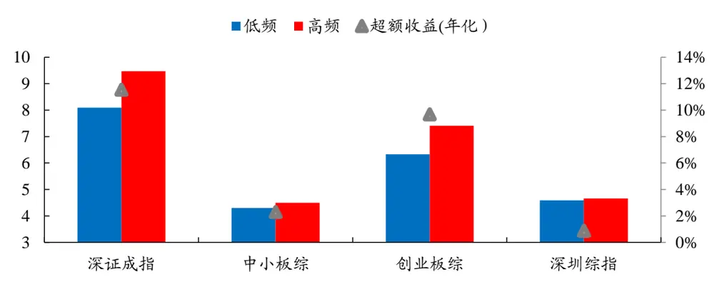
数据来源：互动易、Wind、开源证券研究所

从累计净值上看，纳入高频股东数据的因子在不同股票池之间都产生了超额收益，其中深证成指表现最好，年化超额收益超 10%；在深圳综指和中小板综指上，虽然累计净值都是高频的合成股东户数变化因子表现较好，但年化超额收益率分别仅有 2.29%和0.88%。从多空对冲净值走势来看，深证成指的走势是最稳定，也是涨幅最大的。在 2013年6 月到2016 年6月这段时间，M_PCT_N因子在创业板综指股票池中失效。

图20：高频股东因子对冲净值表现（三分组）
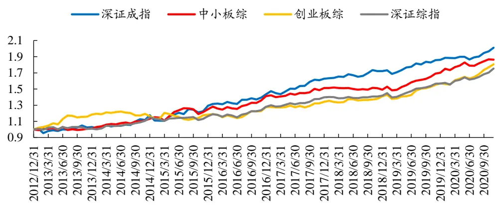
数据来源：互动易、Wind、开源证券研究所

一言以蔽之，高频股东数据的纳入能够帮助传统的低频股东因子产生额外的收益增益，但增益幅度的大小与选取的股票池相关。

## 5、 风险提示

模型测试基于历史数据，市场未来可能发生变化。

## 特别声明

《证券期货投资者适当性管理办法》、《证券经营机构投资者适当性管理实施指引（试行）》已于2017年7月1日起正式实施。根据上述规定，开源证券评定此研报的风险等级为R3（中风险），因此通过公共平台推送的研报其适用的投资者类别仅限定为专业投资者及风险承受能力为 、 、 的普通投资者。若您并非专业投资者及风险承受能力为C3、C4、C5的普通投资者，请取消阅读，请勿收藏、接收或使用本研报中的任何信息。因此受限于访问权限的设置，若给您造成不便，烦请见谅！感谢您给予的理解与配合。

## 分析师承诺

负责准备本报告以及撰写本报告的所有研究分析师或工作人员在此保证，本研究报告中关于任何发行商或证券所发表的观点均如实反映分析人员的个人观点。负责准备本报告的分析师获取报酬的评判因素包括研究的质量和准确性、客户的反馈、竞争性因素以及开源证券股份有限公司的整体收益。所有研究分析师或工作人员保证他们报酬的任何一部分不曾与，不与，也将不会与本报告中具体的推荐意见或观点有直接或间接的联系。

## 股票投资评级说明

|  | 评级 | 说明 |
| --- | --- | --- |
| 证券评级 | 买入（Buy） | 预计相对强于市场表现20%以上； |
|  | 增持（outperform） | 预计相对强于市场表现5%~20%； |
|  | 中性（Neutral） | 预计相对市场表现在-5%～+5%之间波动； |
|  | 减持（underperform） | 预计相对弱于市场表现5%以下。 |
| 行业评级 | 看好（overweight） | 预计行业超越整体市场表现; |
|  | 中性（Neutral） | 预计行业与整体市场表现基本持平； |
|  | 看淡（underperform） | 预计行业弱于整体市场表现。 |
| 备注：评级标准为以报告日后的6~12个月内，证券相对于市场基准指数的涨跌幅表现，其中A股基准指数为沪深300指数、港股基准指数为恒生指数、新三板基准指数为三板成指（针对协议转让标的）或三板做市指数（针对做市转让标的)、美股基准指数为标普500或纳斯达克综合指数。我们在此提醒您，不同证券研究机构采用不同的评级术语及评级标准。我们采用的是相对评级体系，表示投资的相对比重建议；投资者买入或者卖出证券的决定取决于个人的实际情况，比如当前的持仓结构以及其他需要考虑的因素。投资者应阅读整篇报告，以获取比较完整的观点与信息，不应仅仅依靠投资评级来推断结论。 |  |  |

## 分析、估值方法的局限性说明

本报告所包含的分析基于各种假设，不同假设可能导致分析结果出现重大不同。本报告采用的各种估值方法及模型均有其局限性，估值结果不保证所涉及证券能够在该价格交易。

## 法律声明

开源证券股份有限公司是经中国证监会批准设立的证券经营机构，已具备证券投资咨询业务资格。

本报告仅供开源证券股份有限公司（以下简称“本公司”）的机构或个人客户（以下简称“客户”）使用。本公司不会因接收人收到本报告而视其为客户。本报告是发送给开源证券客户的，属于机密材料，只有开源证券客户才能参考或使用，如接收人并非开源证券客户，请及时退回并删除。

本报告是基于本公司认为可靠的已公开信息，但本公司不保证该等信息的准确性或完整性。本报告所载的资料、工具、意见及推测只提供给客户作参考之用，并非作为或被视为出售或购买证券或其他金融工具的邀请或向人做出邀请。本报告所载的资料、意见及推测仅反映本公司于发布本报告当日的判断，本报告所指的证券或投资标的的价格、价值及投资收入可能会波动。在不同时期，本公司可发出与本报告所载资料、意见及推测不一致的报告。客户应当考虑到本公司可能存在可能影响本报告客观性的利益冲突，不应视本报告为做出投资决策的唯一因素。本报告中所指的投资及服务可能不适合个别客户，不构成客户私人咨询建议。本公司未确保本报告充分考虑到个别客户特殊的投资目标、财务状况或需要。本公司建议客户应考虑本报告的任何意见或建议是否符合其特定状况，以及（若有必要）咨询独立投资顾问。在任何情况下，本报告中的信息或所表述的意见并不构成对任何人的投资建议。在任何情况下，本公司不对任何人因使用本报告中的任何内容所引致的任何损失负任何责任。若本报告的接收人非本公司的客户，应在基于本报告做出任何投资决定或就本报告要求任何解释前咨询独立投资顾问。

本报告可能附带其它网站的地址或超级链接，对于可能涉及的开源证券网站以外的地址或超级链接，开源证券不对其内容负责。本报告提供这些地址或超级链接的目的纯粹是为了客户使用方便，链接网站的内容不构成本报告的任何部分，客户需自行承担浏览这些网站的费用或风险。

开源证券在法律允许的情况下可参与、投资或持有本报告涉及的证券或进行证券交易，或向本报告涉及的公司提供或争取提供包括投资银行业务在内的服务或业务支持。开源证券可能与本报告涉及的公司之间存在业务关系，并无需事先或在获得业务关系后通知客户。

本报告的版权归本公司所有。本公司对本报告保留一切权利。除非另有书面显示，否则本报告中的所有材料的版权均属本公司。未经本公司事先书面授权，本报告的任何部分均不得以任何方式制作任何形式的拷贝、复印件或复制品，或再次分发给任何其他人，或以任何侵犯本公司版权的其他方式使用。所有本报告中使用的商标、服务标记及标记均为本公司的商标、服务标记及标记。

## 开源证券研究所

上海

地址：上海市浦东新区世纪大道1788号陆家嘴金控广场1号

楼10层

邮编：200120

邮箱：research@kysec.cn

北京
地址：北京市西城区西直门外大街18号金贸大厦C2座16层
邮编：100044
邮箱：research@kysec.cn

地址：深圳市福田区金田路2030号卓越世纪中心1号

邮编：518000

邮箱：research@kysec.cn

西安

地址：西安市高新区锦业路1号都市之门B座5层

邮编：710065

邮箱：research@kysec.cn