## 轻装上阵，高频数据因子的应用“高频寻踪”系列之二

任瞳

0755-83081468 
rentong@cmschina.com.cn 
S1090519080004

点击进入http://www.hibor.com.cn

崔浩瀚
021-68407276
cuihaohan@cmschina.com.cn
S1090519070004

CMS招商证券

2021年01月07日

## VPIN指标对美国股指期货闪崩的预测

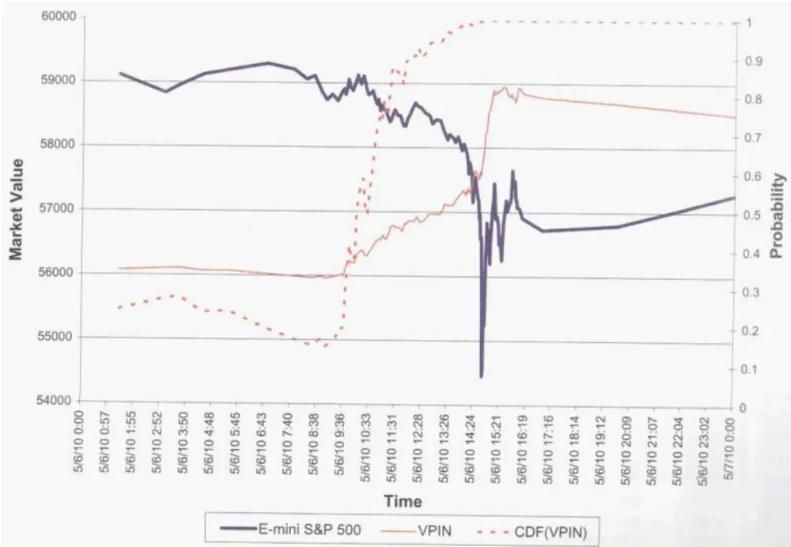
资料来源：Easley, David, Marcos M. Lopez De Prado, and Maureen O’Hara. “The microstructure of the “flash crash”: flow toxicity, liquidity crashes, and the probability of informed trading.” The Journal of Portfolio Management 37.2 (2011): 118-128、 招商证券 点击进入htip//wtww商jbor.com.cn

## 个股VPIN可能影响未来收益

- 我们认为知情交易的存在会影响个股后市的表现：

- 猜想之一：知情交易者的加入会增加市场对该只个股的关注度，过分炒作会偏离股票的真实价值，未来将利空。

- 猜想之二：知情交易者过多的股票被视为“妖股”，不被机构等大型投资者（大资金）看好，对股票价值本身是一种伤害。

- 为了验证 VPIN 指标选股能力的有效性，我们在全A和沪深300、中证500成分股进行测试，探究知情交易是否会影响个股未来的收益，探测的结果较为显著。

## 指令流毒性（从 PIN 到 VPIN）

- “指令流毒性”（VPIN）指的是市场上知情交易者存在的可能性，本系列的上一篇报告中，我们证实了其在沪深300成分股中有较为可观的选股能力。

- Easley等在2012年又提出了基于量钟的衡量方式提出VPIN指标， VPIN是从PIN模型发展而来，克服了PIN模型似然函数估计时存在的数据溢出的问题。

- VPIN是PIN的近似计算，但是在形式上简单得多，克服了在交易量很大的市场里估计 PIN 的困难，具备实际操作性，VPIN模型得到广泛使用，用于对市场流动性风险进行预测和预警。

$$
VPIN=\frac{\alpha\mu}{\alpha\mu+2\varepsilon}\approx\frac{1}{N}\sum_{\tau=1}^{N}\lvert V_{\tau}^{S}-V_{\tau}^{B}\rvert/V
$$

- 其中：

$$
\begin{array}{r}{V_{\tau}^{B}=\sum_{i=t(\tau-1)+1}^{t(\tau)}V_{i}Z\left(\frac{P_{i}^{E}-P_{i}^{B}}{\sigma_{\Delta P}}\right)}\end{array}
$$

$$
\begin{array}{r}{V_{\tau}^{S}=\sum_{i=t(\tau-1)+1}^{t(\tau)}V_{i}\left[1-Z\left(\frac{P_{i}^{E}-P_{i}^{B}}{\sigma_{\Delta P}}\right)\right]=V-V_{\tau}^{B}}\end{array}
$$

## 样本个股 VPIN 计算（全A）

- 观测窗口：我们选择了2015年1月5日至2020年11月30日作为观测窗口期。

- 样本选择：全部A股上市公司股票，剔除ST股票和上市不足20个交易日的个股。

- 数据频率：我们使用样本个股在观测窗口期内的分钟级别数据，计算样本个股的VPIN值。

$$
VPIN\approx\frac{1}{N}\sum_{\tau=1}^{N}\lvert V_{\tau}^{S}-V_{\tau}^{B}\rvert/V
$$

- 对于参数V 和N，我们参照Easley, Kiefer $\&\cup^{\prime}$ hara (2011b)的做法，将V设定为样本期内日均成交量的五十分之一， 单位为股（按单边交易计算），同时取 $N=50$

- “高频数据，低频信号“，月末交易日取月度均值，作为月频因子暴露度。

- $V_{\tau}^{B}$ （买方驱动成交量）和 $V_{\tau}^{S}$ （卖方驱动成交量）需要在单个交易量篮子中计算，因而我们要先根据日均成交量的五十分之一来划分交易篮子（此环节较耗费算力）。

VPIN因子多空组合走势（月频，全A）
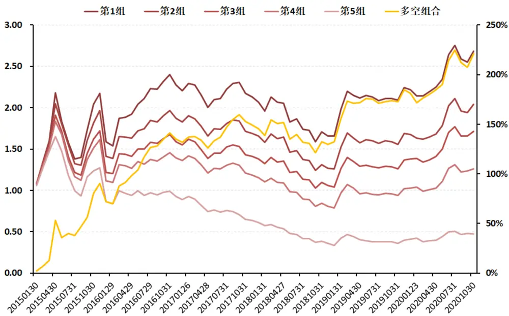
资料来源：Wind资讯、 招商证券

## VPIN因子分组业绩表（月频，全A）

VPIN因子分组业绩表现

|  | 总收益 | 年化收益 | 年化波动 | Sharpe 比率 | 最大回撤 | 年化超额 收益 | 信息比率 |
| --- | --- | --- | --- | --- | --- | --- | --- |
| 第1组 | 168.22% | 20.32% | 33.61% | 0.5451 | 36.78% | 14.15% | 0.1301 |
| 第2组 | 104.12% | 14.31% | 31.97% | 0.3852 | 39.41% | 6.29% | 0.0993 |
| 第3组 | 71.24% | 10.61% | 31.20% | 0.2760 | 45.99% | 1.03% | 0.0176 |
| 第4组 | 25.84% | 4.40% | 31.47% | 0.0764 | 57.12% | -9.08% | -0.1548 |
| 第5组 | -52.87% | -13.16% | 32.83% | -0.4616 | 79.51% |  | 1 |
| 月频多空 | 221.09% | 24.45% | 20.74% | 1.0825 | 14.74% | 19.22% | 0.0959 |
| 全A (等权) | 65.65% | 9.93% | 30.72% | 0.2580 | 48.01% | – | - |

资料来源：招商证券 2015-01-31至2020-11-30

VPIN因子IC序列走势（月频，全A）
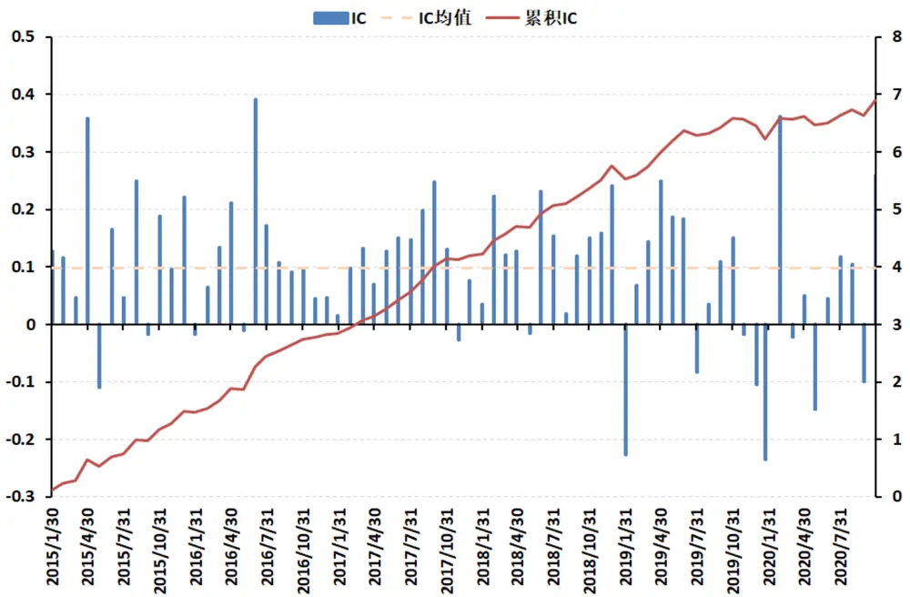
资料来源：Wind资讯、 招商证券

| 样本空间 IC均值 IC最大值 IC最小值 IC标准差 IR IC t值 有效期数 平均个数 |
| --- |
| 0.098 0.392 -0.236 0.121 0.807 6.574 70 3231 全 慧博资讯 业的投资研究大数据分享平台 |

VPIN因子多空组合走势（中性化，月频，全A）
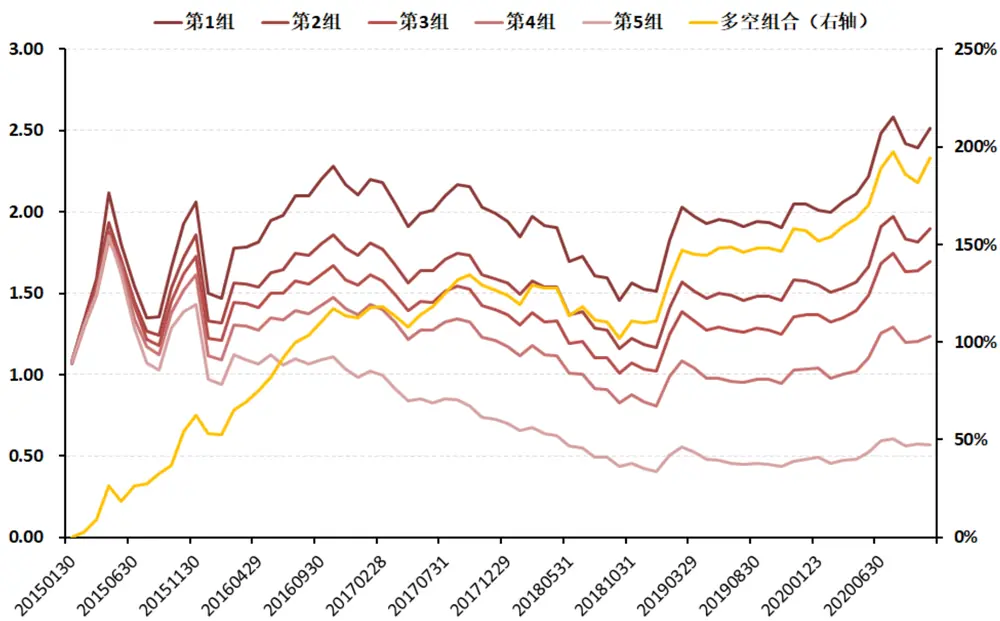
资料来源：Wind资讯、 招商证券

## VPIN因子多空组合走势（中性化，月频）

沪深300成分股
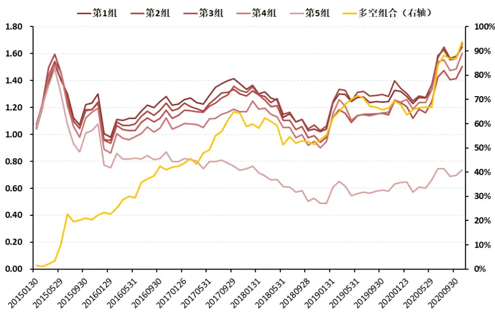

中证500成分股
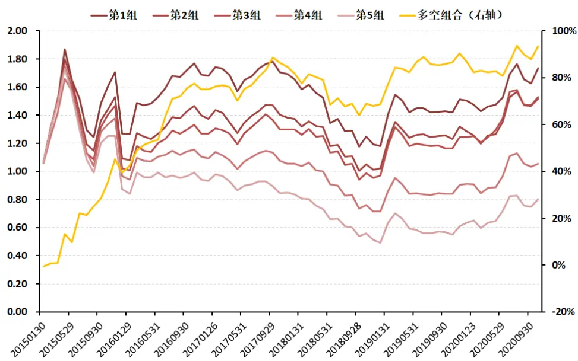

| 成分股 | 总收益 | 年化收益 | 年化波动 | Sharpe 比率 | 最大回撤 | 年化超额 收益 | 信息比率 |
| --- | --- | --- | --- | --- | --- | --- | --- |
| 全A | 194.12% | 22.42% | 13.74% | 1.4858 | 14.02% | 16.76% | 0.0885 |
| 沪深300 | 93.84% | 13.21% | 8.80% | 1.2736 | 8.25% | 4.77% | 0.0400 |
| 中证500 | 93.33% | 13.16% | 10.64% | 1.0490 | 13.08% | 4.69% | 0.0398 |
| 基准 | 65.65% | 9.93% | 30.72% | 0.2580 | 48.01% | ( | – |

## 高频数据因子收益提升

- 高频数据因子的提升：缩短因子的预测周期。预测期从月预测缩短到周预测。

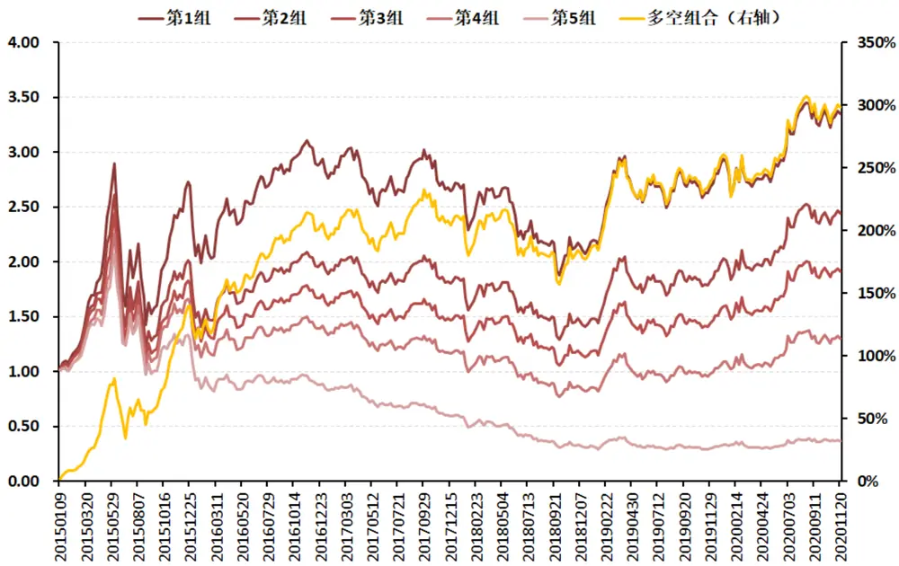
资料来源：Wind资讯、 招商证券

## VPIN因子分组业绩表（周频，全A）

## VPIN因子分组业绩表现

|  | 总收益 | 年化收益 | 年化波动 | Sharpe 比率 | 最大回撤 | 年化超额 收益 | 信息比率 |
| --- | --- | --- | --- | --- | --- | --- | --- |
| 第1组 | 235.19% | 23.15% | 33.58% | 0.6299 | 50.78% | 18.03% | 0.0610 |
| 第2组 | 143.90% | 16.59% | 33.09% | 0.4410 | 53.71% | 9.64% | 0.0578 |
| 第3组 | 91.49% | 11.84% | 33.56% | 0.2931 | 56.92% | 2.92% | 0.0270 |
| 第4组 | 29.82% | 4.60% | 33.77% | 0.0768 | 65.89% | -9.35% | -0.1034 |
| 第5组 | -63.22% | -15.82% | 34.32% | -0.5192 | 86.04% | – | – |
| 周频多空 | 298.41% | 26.87% | 19.62% | 1.2678 | 26.44% | 22.51% | 0.0425 |
| 全A (等权) | 73.28% | 9.93% | 30.59% | 0.2592 | 57.10% | - | – |
| 月频多空 221.09% |  | 24.45% | 20.74% | 1.0825 | 14.74% | 19.22% | 0.0959 |

资料来源：招商证券 2015-01-31至2020-11-30
“慧博资讯”专业的投资研究大数据分享平台

VPIN因子IC序列走势（周频，全A）
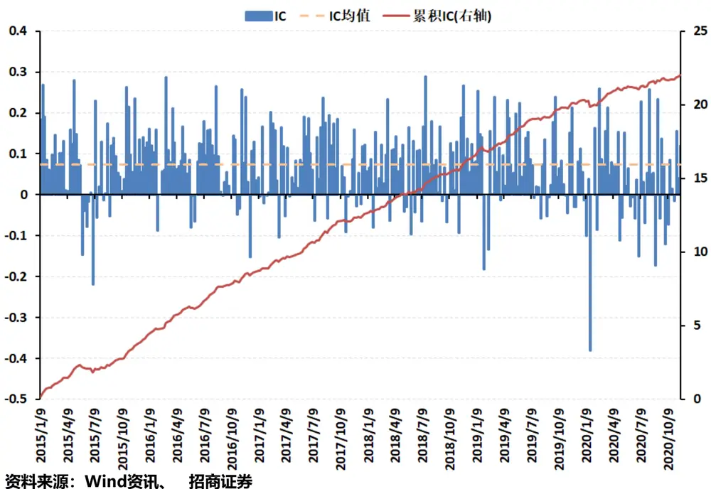

| 样本空间 IC均值 IC最大值 IC最小值 IC标准差 IR IC t值 |
| --- |
| 有效期数 平均个数 0.073 0.2888 -0.3806 0.0987 0.7421 12.8752 301 3231.9 全A |
| 业的投资研究大数据分享平台 |

## 多空组合累积收益的回撤分析

- 从多空组合的累积收益来看，因子的回撤主要集中在2017年末到2018年整年，我们猜测其主要原因是来自于投资者结构的特点的改变。

- 量价类因子赚钱的逻辑是市场的短期无效性，以本因子为例，VPIN因子的收益来源是订单流的不平衡性，而这种不平衡性具有较强的自相关性，因而有学者推测这种不平衡性可能源于个人投资者的“羊群交易”（高雅， 2019）。

- 2017年以来，A股市场的投资者结构发生了重要变化，机构投资者的占比开始逐渐上升。

- 同时，2018年市场整体收益不佳，个人投资者市场参与度低，因而个人投资者的“羊群交易”在此期间处于低值，导致因子在此期间的累积收益发生回撤。

## 高频因子与传统因子的结合

- 高频数据因子往往能独立提供较为可观的多空收益表现，但是是否能与原来的因子结合，提供更多的超额收益则是需要探究的一个课题。为此，我们进行了一些探索。

## 直接赋权方式

- 将高频数据因子跟我们长期跟踪的多因子模型直接结合，进行权重配置（或打分），然后用权重配置后的结果进行选股。

## 空头剔除

- 事前剔除：在股票池中率先剔除高频数据因子空头端的个股，然后在剩下的股票池中进行原有因子的选股。

- 事后剔除：利用原有因子先进行选股，构建投资组合，再于投资组合中剔除高频因子空头个股。

## 高频因子与传统因子的结合：直接赋权

- 直接将高频因子直接纳入到我们的选股体系中，以招商定量研究团队长期跟踪的6个大类风格因子为基础模型，自2015年以来在全部A股中构建多空组合，分别计算5因子等权 和“5+1”因子等权的多空组合收益结果。

| 因子名称 | 大类风格代码 | 合成该风格因子所用到的细分因子 |
| --- | --- | --- |
| 价值 | Value | BP_LR, EP_Fwd12M, SP_TTM, OCFP_TTM, Sales2EV |
| 市值 | FloatCap | Ln_flaotcap |
| 成长 | Growth | Gr_Q_Earning, Gr_Q_OpEarning, Gr_Q_Sale |
| 情绪 | Sentiment | EPS_FY0_R1M, Rating_R3M, TargetReturn |
| 质量 | Quality | ROE_TTM |
| 反转 | Momentum | RTN_20D, RTN_60D, RTN_1200D |
| 交易行为 | TradingBehavior | VolAvg_20D_240D, RealizedSkewness_240D, VolCV_20D, TurnoverAvg_20D, SpreadBias_120D, IVR, VWAPP_OLS |

“慧博资讯”专业的投资研究大数据分享平台

## VPIN与大类风格因子的序列相关性

|  | VPIN | 质量 | 成长 | 市值 | 反转 | 分析师情绪 | 交易行为 | 价值 |
| --- | --- | --- | --- | --- | --- | --- | --- | --- |
| VPIN | 1.000 |  |  |  |  |  |  |  |
| 质量 | 0.025 | 1.000 |  |  |  |  |  |  |
| 成长 | 0.009 | 0.061 | 1.000 |  |  |  |  |  |
| 市值 | 0.344 | 0.054 | 0.026 | 1.000 |  |  |  |  |
| 反转 | -0.216 | -0.007 | -0.105 | -0.205 | 1.000 |  |  |  |
| 分析师情绪 | -0.036 | -0.001 | 0.053 | -0.037 | 0.129 | 1.000 |  |  |
| 交易行为 | -0.365 | -0.014 | -0.025 | -0.125 | 0.447 | 0.076 | 1.000 |  |
| 价值 | -0.149 | 0.002 | -0.042 | -0.335 | 0.281 | 0.101 | 0.175 | 1.000 |

资料来源：Wind资讯、 招商证券

- VPIN因子和市值、交易行为因子有较高的相关性，与反转因子也有0.2以上的相关性，因此，我们对市值、行业、交易行为因子、反转因子做了剥离，用剥离之后的因子进

## 剥离掉相关因子之后的VPIN多空收益（月频，全A）

- 对市值、行业、交易行为因子、反转因子做了剥离，用剥离之后的因子多空组合收益如下：

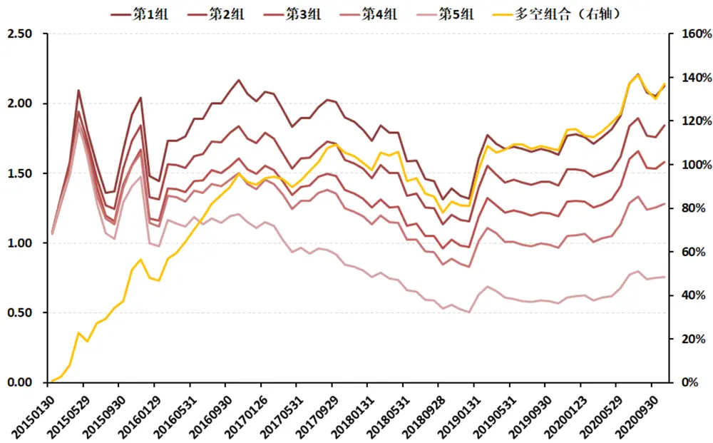

## 加入VPIN因子（剥离相关因子）前后多因子模型多空组合对比

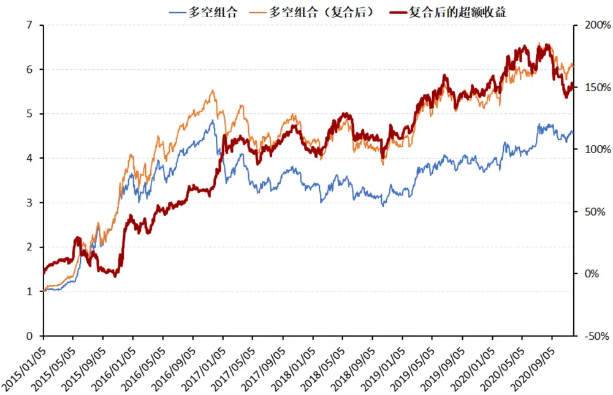

## 加入VPIN因子前后因子模型多空组合对比（直接赋权）

|  | 多空组合 (原始5因子) | 多空组合 (引入高频数据因子) | 基准 (全A等权) | 提升度 |
| --- | --- | --- | --- | --- |
| 总收益 | 241.39% | 289.62% | 73.28% | 48.23% |
| 年化收益 | 24.17% | 27.10% | 9.93% | 2.93% |
| 年化波动 | 15.95% | 16.42% | 30.59% | 0.48% |
| Sharpe | 1.33 | 1.47 | 0.2592 | 0.14 |
| 最大回撤 | 21.86% | 22.74% | 57.10% | 0.88% |

资料来源：Wind资讯、 招商证券

- 模型引入VPIN因子之后，多空组合整体收益在过去近6年时间里提升48%，年化收益提升2.93%，Sharpe值提升0.14，最大回撤反而有所减小。

## VPIN因子对单个风格因子的多空收益提升（直接赋权）

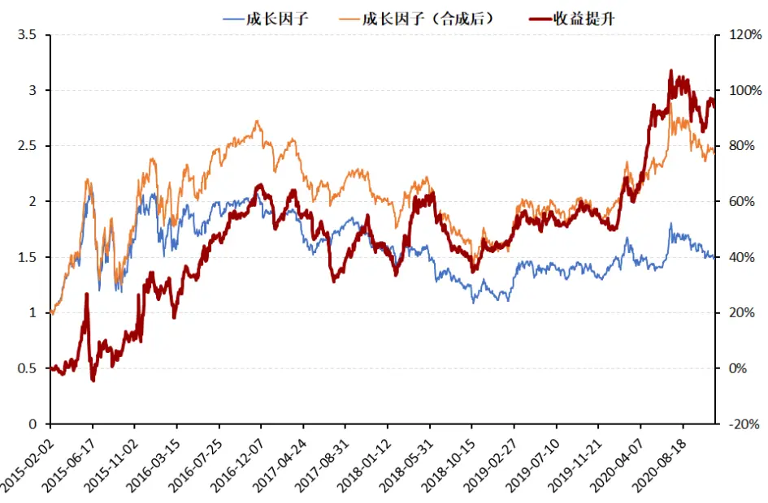

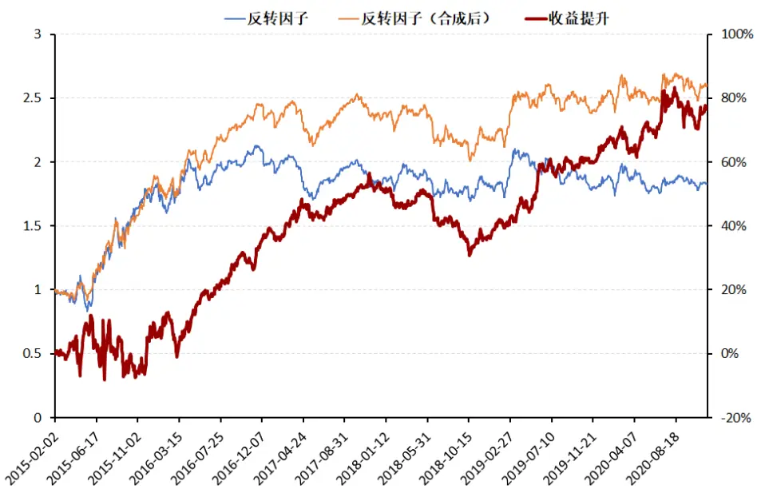

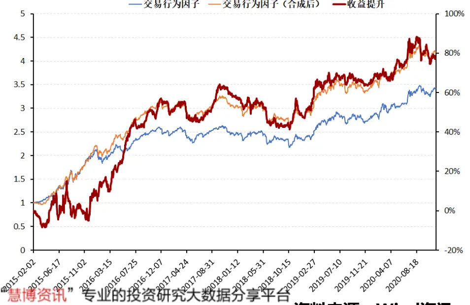
资料来源：Wind资讯、 招商证券

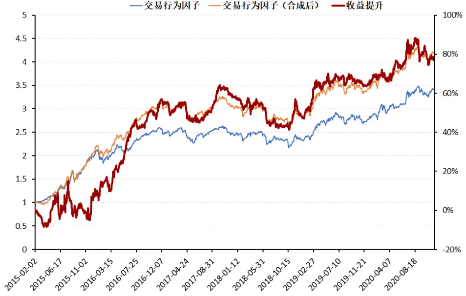

## VPIN因子对单个风格因子的多空收益提升（直接赋权）

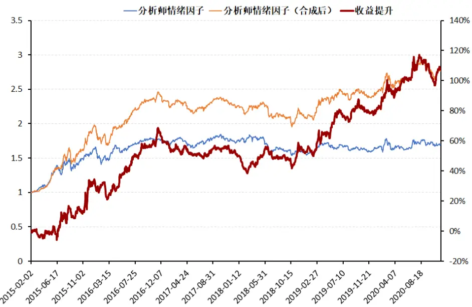
资料来源：Wind资讯、 招商证券

## 空头剔除：加入VPIN因子前后对比（全A）

## 事前剔除：

- 以10%为空头阈值，样本空间内股票VPIN因子值大于90%分位数（空头）的股票将从样本空间中被剔除，在剩余股票中利用其它风格因子进行选股。

- 事后剔除：

- 利用其它风格因子进行选股后，在选出的组合中剔除VPIN因子值大于90%分位数（空头）的股票。

| 多头组合 (原始5因子) | 多头组合 (事前剔除) | 多头组合 (事后剔除) |
| --- | --- | --- |
| 总收益 152.87% | 169.04% | 164.03% |
| 年化收益 17.77% | 19.06% | 18.67% |
| 年化波动 30.44% | 30.17% | 30.27% |
| Sharpe 0.485 | 0.532 | 0.518 |
| 最大回撤 41.49% | 39.66% | 40.98% |
| 多头平均持仓股数 91.8 | 91.5 | 83.7 |

## VPIN因子空头剔除对单个风格因子的收益提升

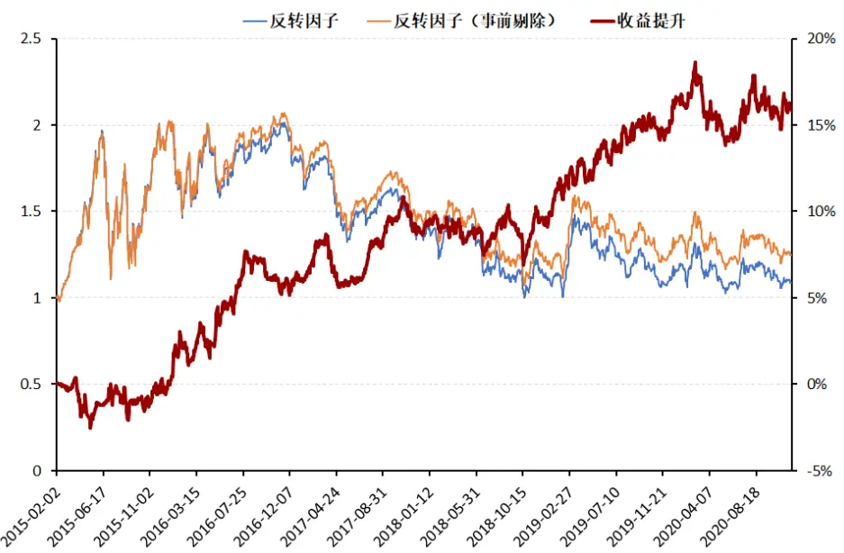

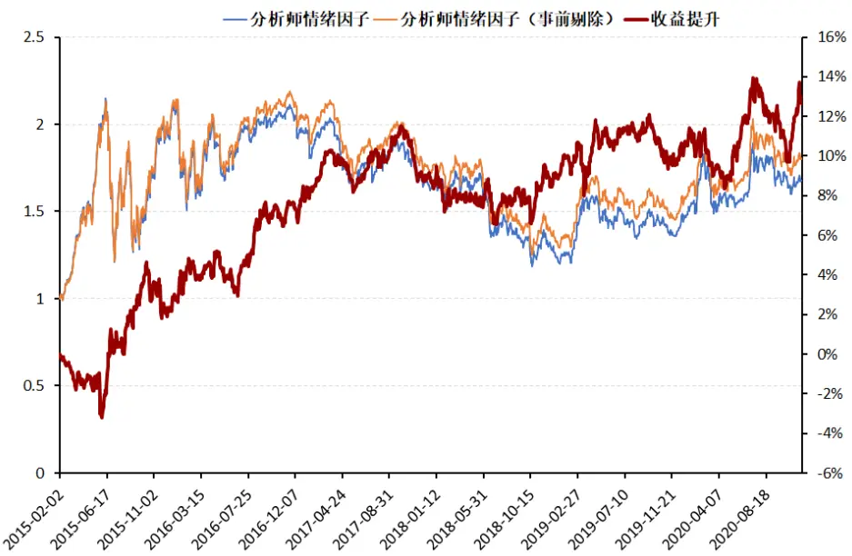

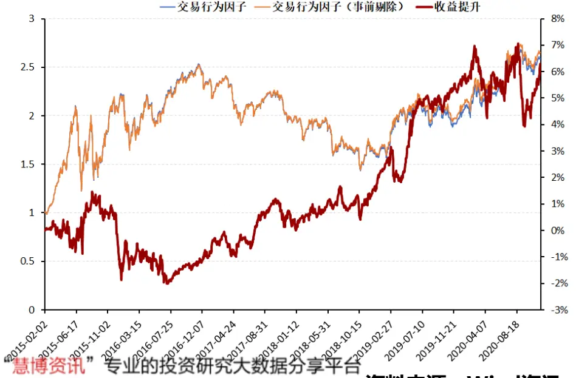

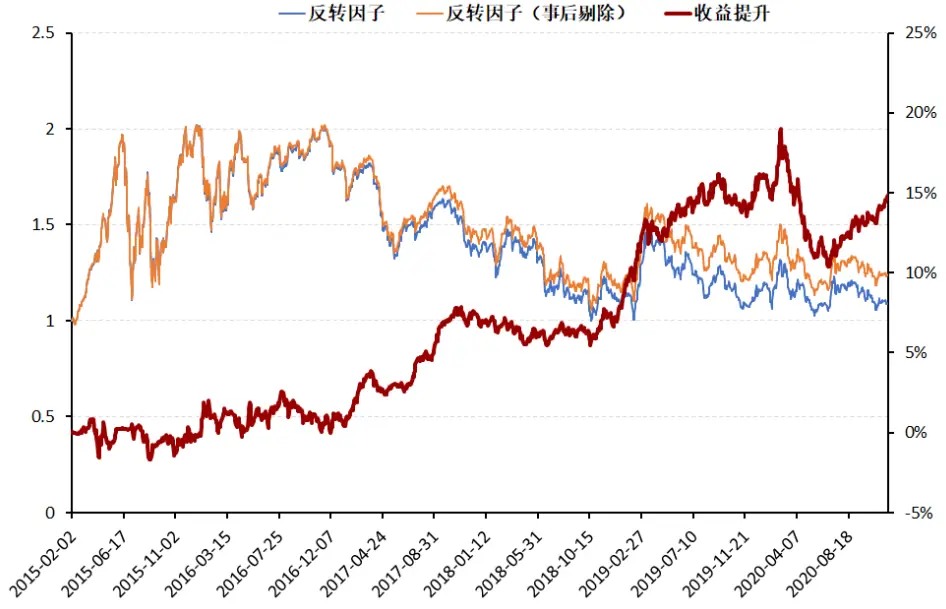

## VPIN 因子的局限性

## 【实践局限】

- 交易量篮子的划分是基于个股过去某较长一段时间交易量的比重划分（如过去5年日均交易量的五十分之一），有可能存在引入未来信息的争议。

- 在交易量篮子的切割过程中，由于计算量较为庞大，对算力的要求较高，数据计算和更新的时间也较长。

## 【理论局限】

- 在国外的一些实证研究（Andersen & Bondarenko，2014）中，发现VPIN在某些标的资产中测算知情交易者存在的概率是有偏的，无法精确有效衡量。

## 轻装上阵：VPIN 的改进

- 为了克服VPIN因子的局限性，近年来有些学者提出了VWPIN指标。

$$
VWPIN=\frac{\alpha\mu}{\alpha\mu+2\varepsilon}\approx\sum_{i=1}^{n}w_{i}\frac{|S_{i}-B_{i}|}{S_{i}+B_{i}}
$$

- 其中 $S_{i}$ 和 $B_{i}$ 分别表示第 i 交易时段内的买单数量和买单数量， $w_{i}$ 为该时段交易量占全天交易量的比例。通过实施用交易量加权的方式，起到了与“量钟”相似的作用。

- VWPIN指标有经过严格的数学推导，我们认为其优势主要体现在改进了VPIN因子在实践中的局限性。不用对交易量篮子进行划分，直接可以在物理时钟下考虑交易的不平衡性，这就避免了对算力的大量消耗，也解决了引入未来信息的争议。

- 由于VWPIN的后一项衡量的是订单流的不平衡性，一般而言，订单流的不平衡性会引起价格和收益率的变动，因而我们可以进一步改进VWPIN公式。将后一项改成关于价格变动或者收益变动的绝对值的函数。

$$
\sum_{\pm\frac{1}{2\pi}\frac{1}{\Theta}}^{n}w_{i}\left[\frac{|S_{i}-B_{i}|}{S_{i}+B_{i}}\right]\to\sum_{i=1}^{n}w_{i}f(|\Delta p|_{i})\to\sum_{i=1}^{n}w_{i}f(|\Delta R|_{i})
$$

## 订单流的不平衡性对价格的冲击

- 订单流的不平衡性会对价格带来冲击，但是当前的研究只能证明订单流的不平衡性有显著的正向价格冲击效应（即买单多于卖单，则价格朝正向变动；卖单多于买单，价格朝负向变动），却无法定量计算这一冲击的大小（麻文宇等，2013年）。因而f ∆R 的形式就有了需要探索的空间。

- 我们不妨先将 f ∆R 设置成指数函数的形式，获取 $|\Delta R|$ 的ζ 次幂。同时将n设置成48，也就是说， 我们每5分钟进行1次取样：

$$
\sum_{i=1}^{n}w_{i}f(|\Delta R_{i}|)\Longrightarrow\left|\sum_{i=1}^{48}w_{i}(|\Delta R_{i}|)^{\zeta}\right|
$$

$w_{i}$ 则代表第 i 个5分钟的成交量占当日交易量的比例， $\Delta R$ 则代表第 i 个5分钟的个股收益率。

- 改进后的VWPIN因子在计算过程中可以大幅减少对于计算机算力的消耗，减少因子的暴露度计算和测试的时间。

## 样本个股 VWPIN 计算

- 观测窗口：我们选择了2015年1月5日至2020年11月30日作为观测窗口期。

- 样本选择：全部A股上市公司股票，剔除ST股票和上市不足20个交易日的个股。

- 数据频率：我们使用样本个股在观测窗口期内的分钟级别数据，计算样本个股的VWPIN值。

$$
VWPIN=\sum_{i=1}^{48}w_{i}(|\Delta R_{i}|)^{\zeta}=\sum_{i=1}^{48}w_{i}\left(\left|\ln\frac{p_{i}}{p_{i-1}}\right|\right)^{\zeta}
$$

- “高频数据，低频信号“，月（周）末交易日取月（周）度均值，作为月（周）频因子暴露度。

- 前文说到，由于订单流不平衡性对于价格和收益率的冲击暂时没有确定性的量化模型，因而我们有必要对 ζ 的取值进行探索。

- 我们分别计算 ζ ∈ 0.25, 0.5, 1, 1.5, 2, 3, 4, 5, 6, 7, 8 下因子的多空收益结果，来确定最佳的 ζ 取值。

不同ζ取值下因子多空累积收益走势（周频）
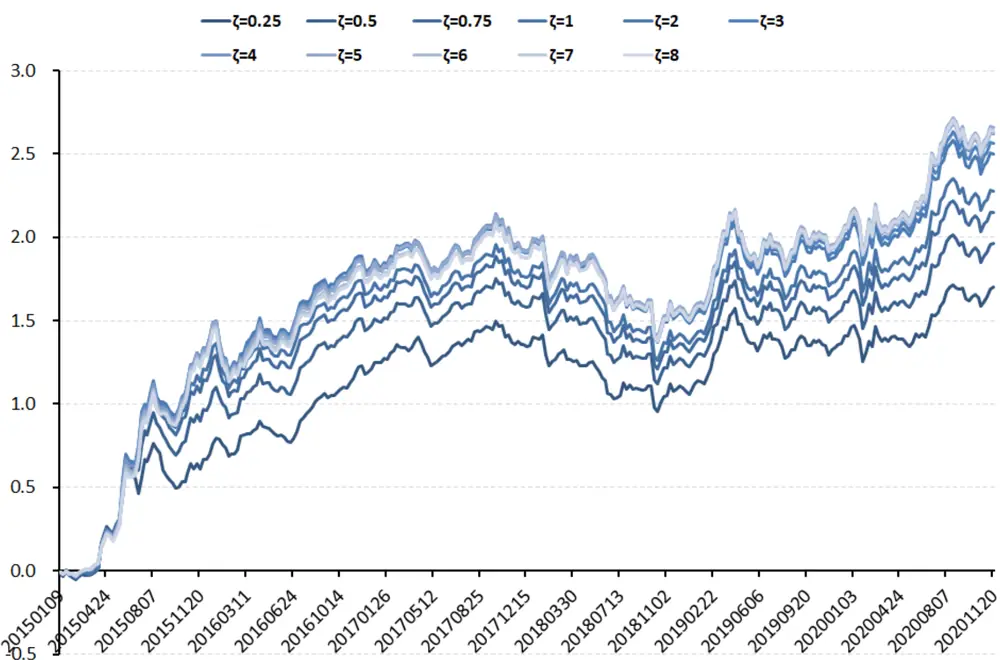
资料来源：Wind资讯、 招商证券

## ζ 取值现实意义的探讨

- 从各组多空走势看， ζ 取值越大，则多空组合的累积收益越明显，但是随着ζ的不断增大，累积收益的增量逐步收敛，因而我们暂时将 ζ = 8 作为最有效的 ζ 取值。

$$
VWPIN=\sum_{i=1}^{48}w_{i}\left(\left|\mathrm{ln}\frac{p_{i}}{p_{i-1}}\right|\right)^{8}
$$

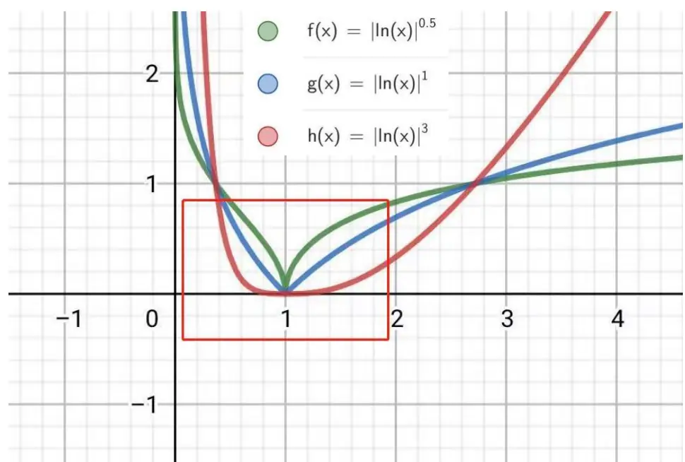

- 研究VWPIN因子的函数图像，不难发现 ζ 值越高，图像在1周围越平坦，差异越小。因而我们认为，高阶的 ζ 事实上是重点捕捉了那些高价格波动的收益数据。短期较大的成交量配合激进的价格变动，往往包含更多的市场信息，在因子里面的权重也越高。

VWPIN因子（ζ= 8）多空组合走势（周频）
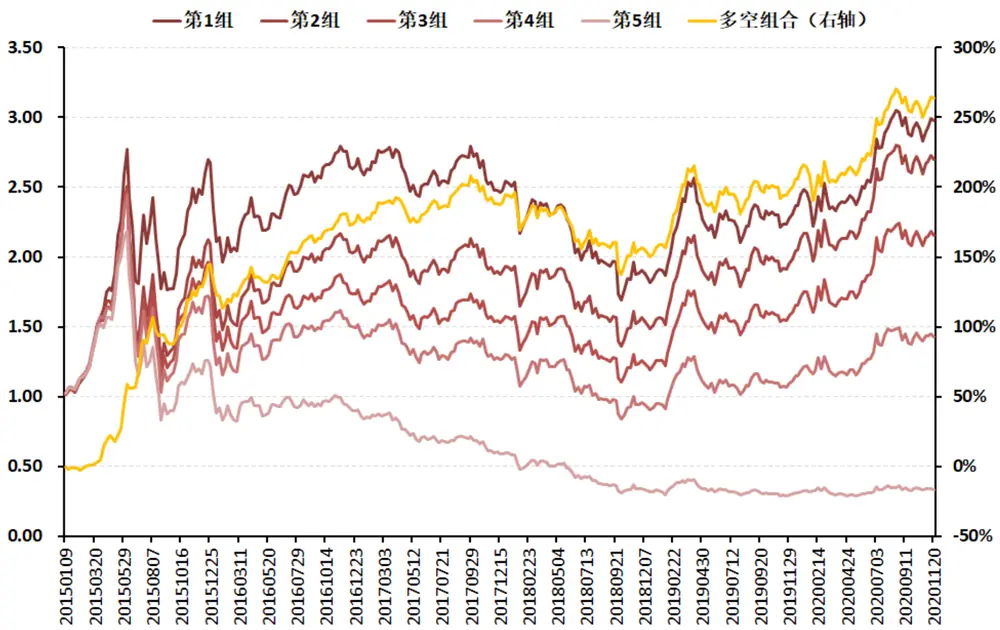
资料来源：Wind资讯、 招商证券

VWPIN因子（ζ= 8）IC序列走势（周频）
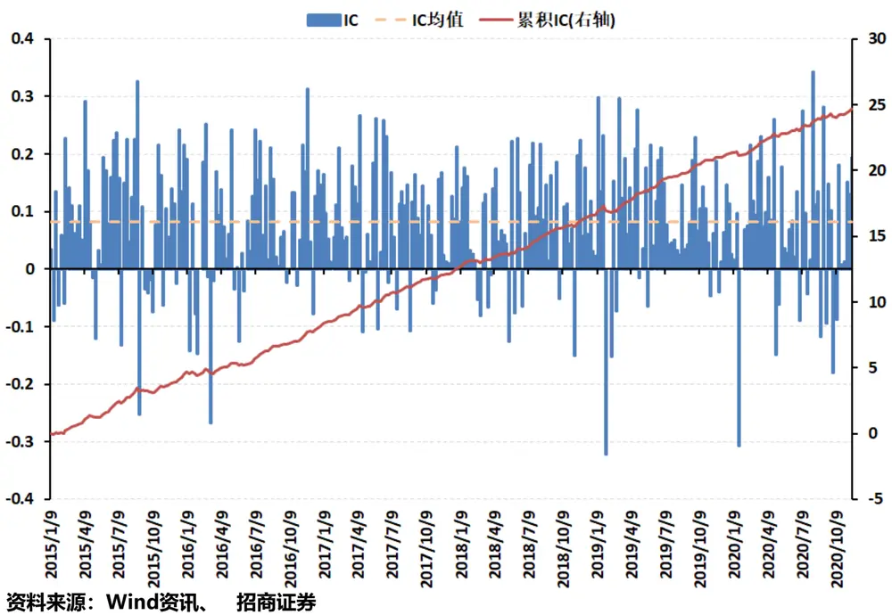

| 样本空间 IC均值 | IC最大值 IC最小值 IC标准差 IR |
| --- | --- |
| IC t值 有效期数 平均个数 0.082 0.3420 -0.3224 0.1114 0.7370 12.7867 301 3230.9 |  |
| 全A 专业的投资研究大数据分享平台 |  |

## 加入VWPIN因子前后多因子模型（等权）多空组合对

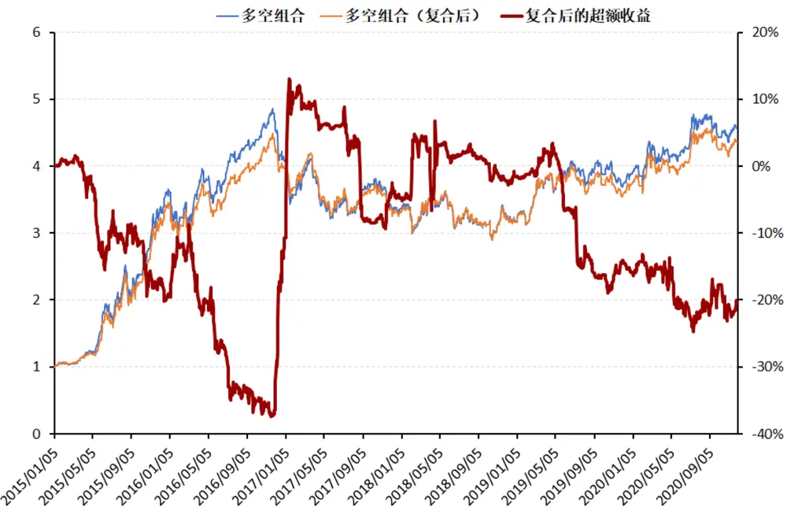

## 加入VWPIN因子前后因子模型多空组合对比

|  | 多空组合 (原始6因子) | 多空组合 (引入高频数据因子) | 基准 (全A等权) | 提升度 |
| --- | --- | --- | --- | --- |
| 总收益 | 356.33% | 336.14% | 73.28% | -20.19% |
| 年化收益 | 30.18% | 29.16% | 9.93% | -1.02% |
| 年化波动 | 23.80% | 22.84% | 30.59% | -0.96% |
| Sharpe | 1.1421 | 1.1452 | 0.2592 | 0.0032 |
| 最大回撤 | 40.17% | 35.55% | 57.10% | -4.62% |

资料来源：Wind资讯、 招商证券

- 模型引入VWPIN因子之后，回撤有所减小，但是整体没有太大的改善。

## 空头剔除：加入VWPIN因子前后对比（全A）

## 事前剔除：

- 以5%为空头阈值，样本空间内股票VWPIN因子值大于95%分位数的股票将从样本空间中被剔除，在剩余股票中利用其它风格因子进行选股。

## 事后剔除：

- 利用其它风格因子进行选股后，在选出的组合中剔除VWPIN因子值大于95%分位数的股票。

| 多头组合 (原始6因子) | 多头组合 (事前剔除) | 多头组合 (事后剔除) |
| --- | --- | --- |
| 总收益 273.01% | 298.81% | 293.00% |
| 年化收益 25.70% | 27.17% | 26.84% |
| 年化波动 33.97% | 33.79% | 33.89% |
| Sharpe 0.668 | 0.715 | 0.704 |
| 最大回撤 52.69% | 50.21% | 50.91% |

## VWPIN因子对单个风格因子的收益提升

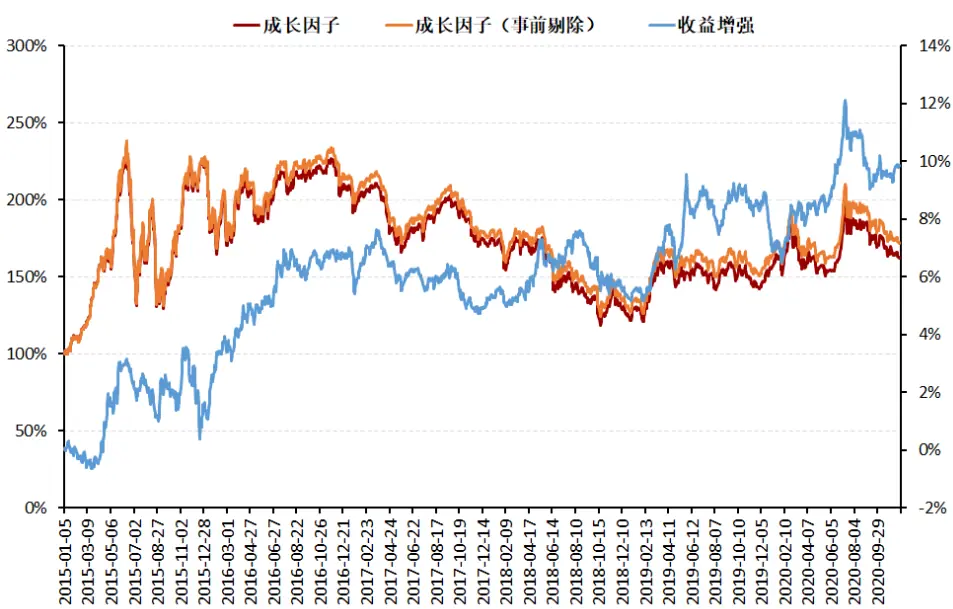

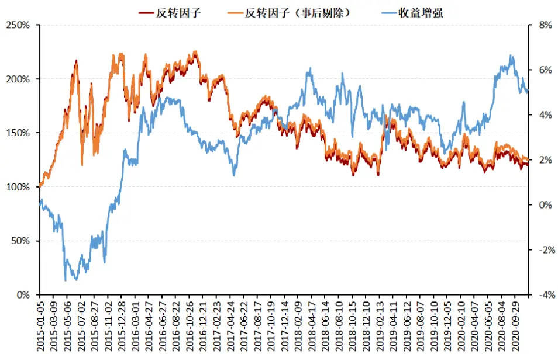

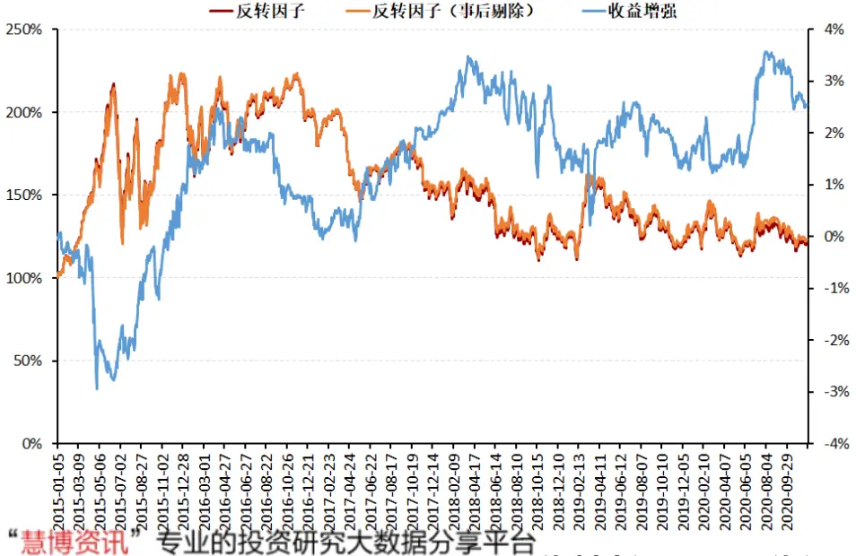

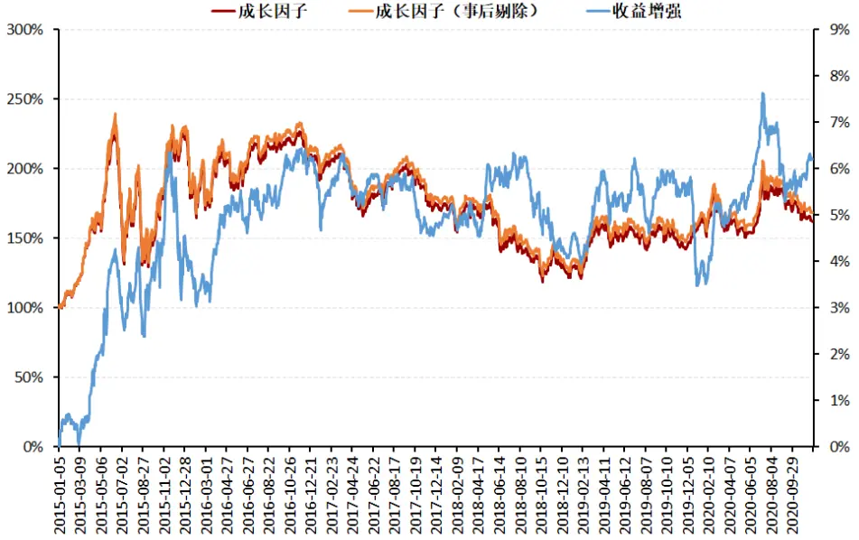

## 总结

- 本报告对本系列的第一篇报告进行了拓展，我们发现，将高频数据因子的调仓频率从月频提升至周频之后，能有效提升因子的多空组合收益。以VPIN因子为例，过去五年的累积年化收益从24.45%提升至26.87%。

- 针对高频数据因子的应用我们进行了探索，通过直接赋值方式和空头剔除方式可以提升组合的整体收益，其中直接赋值方式将原风格因子组合的多空年化收益提升了2.93%；事前剔除方式和事后剔除方式也能显著提升组合多头端的收益。

- 此外，针对VPIN因子的存在的一些实践局限性，我们提出了改良后的VWPIN因子，在不同的股票池范围下均有显著的选股能力。

- 风险提示：报告模型基于历史数据构建，若未来市场环境发生变化，比如投资者结构发生重大变化或出现其他宏观、经济重大变化，则存在模型失效的风险。

## 分析师承诺

负责本研究报告的每一位证券分析师，在此申明，本报告清晰、准确地反映了分析师本人的研究观点。本人薪酬的任何部分过去不曾与、现在不与，未来也将不会与本报告中的具体推荐或观点直接或间接相关。

任瞳：首席分析师，定量研究团队负责人，管理学硕士，17年证券研究经验，2010年、2015年、2016、2017年、2020年新财富最佳分析师。在量化选股择时、基金研究以及衍生品投资方面均有深入独到的见解。

崔浩瀚：量化分析师，浙江大学经济学硕士，4年量化策略研究开发经验。研究方向是机器学习在金融领域的应用和多因子选股策略开发。

## 投资评级定义

## 公司短期评级

以报告日起6个月内，公司股价相对同期市场基准（沪深300指数）的表现为标准：

强烈推荐：公司股价涨幅超基准指数20%以上

审慎推荐：公司股价涨幅超基准指数5-20%之间

中性：公司股价变动幅度相对基准指数介于±5%之间

回避：公司股价表现弱于基准指数5%以上

## 公司长期评级

A：公司长期竞争力高于行业平均水平

B：公司长期竞争力与行业平均水平一致

C：公司长期竞争力低于行业平均水平

## 行业投资评级

以报告日起6个月内，行业指数相对于同期市场基准（沪深300指数）的表现为标准：

推荐：行业基本面向好，行业指数将跑赢基准指数

中性：行业基本面稳定，行业指数跟随基准指数

回避：行业基本面向淡，行业指数将跑输基准指数

## 重要声明

本报告由招商证券股份有限公司（以下简称“本公司”）编制。本公司具有中国证监会许可的证券投资咨询业务资格。本报告基于合法取得的信息，但本公司对这些信息的准确性和完整性不作任何保证。本报告所包含的分析基于各种假设，不同假设可能导致分析结果出现重大不同。报告中的内容和意见仅供参考，并不构成对所述证券买卖的出价，在任何情况下，本报告中的信息或所表述的意见并不构成对任何人的投资建议。除法律或规则规定必须承担的责任外，本公司及其雇员不对使用本报告及其内容所引发的任何直接或间接损失负任何责任。本公司或关联机构可能会持有报告中所提到的公司所发行的证券头寸并进行交易，还可能为这些公司提供或争取提供投资银行业务服务。客户应当考虑到本公司可能存在可能影响本报告客观性的利益冲突。

本报告版权归本公司所有。本公司保留所有权利。未经本公司事先书面许可，任何机构和个人均不得以任何形式翻版、复制、引用或转载，否则，本公司将保留随时追究其法律责任的权利。

## 8888

## 感谢聆听

Thank You

招商量化和基金评价公众号