## [Tab相关研究

Table_ReportInfo]《选股因子系列研究（五十六）——买卖单数据中的 Alpha》2019.11.17

《选股因子系列研究（六十六）——寻找

逐笔交易中的有效信息》2020.06.21

《选股因子系列研究（七十一）——逐笔大单因子与大资金行为》2020.12.17

分析师:冯佳睿

Tel:(021)23219732

Email:fengjr@htsec.com

证书:S0850512080006

分析师:袁林青

Tel:(021)23212230

Email:ylq9619@htsec.com

证书:S0850516050003

# 高频数据应用系列研究（一）——使用高频数据跟踪核心资产的公募基金持仓变化

## 投资要点：

近几年来，我们基于逐笔成交数据构建了一系列选股因子，如净买入类因子、买入意愿类因子以及大单类因子等。随着对于高频数据研究的深入，我们认为高频数据不仅仅可服务于传统的因子选股，还可作为基础指标协助其他类型的研究。本文在前期高频研究的基础之上，尝试使用高频数据跟踪机构交易者的行为，高频率刻画个股上公募基金持仓占比的变化。

- 可使用微观数据协助预估个股的公募基金持仓占比。可寻找与公募基金持仓变化高相关的指标，并构建模型预估公募基金整体在个股上的持仓占比变化。前期研究成果表明，高频信息能够在一定程度上捕捉机构投资者的行为。

全市场模型在样本外具有一定的预测能力。在滚动使用历史系数均值进行样本外预测时，模型样本外 方均值为 ，样本外相关性均值为 。

- 可通过划分股票范围进一步提升模型的预测能力。考虑到公募基金管理人对于不同类型的股票在操作上可能存在差异，因此可尝试划分不同股票范围，并在不同的股票范围内分别构建模型。本文尝试了三种不同的范围划分方法：1）按照宽基指数划分；2）按照行业板块划分；3）按照期初基金持仓占比划分。

- 通过宽基指数划分股票范围，模型在沪深 300指数内具有相对较好的样本外预测能力。模型在沪深 300 指数内的样本外 R方以及样本外相关性相对较高，样本外R 方均值达 28.3%，样本外相关性均值达 0.56。

通过行业板块划分股票范围，模型在科技、消费以及工业板块中的样本外预测能力相对较好。模型在科技、消费以及工业板块中的样本外 方均值分别为 、18.2%以及 16.6%，样本外相关性均值分别为 0.48、0.44 以及 0.43。

- 通过期初公募基金持仓占比划分股票范围，模型在机构持仓占比较高的股票范围具有相对较好的样本外预测能力。模型在机构持仓占比较高的股票中的样本外方均值达 30.3%，样本外相关性均值达 0.58。

在实际应用中，可高频跟踪特定个股、行业以及风格的机构持仓占比变化。由于回归模型的自变量可每日观测，因此可使用模型得到日度更新的个股公募基金持仓占比预估。基于个股的公募基金持仓占比预估，可进一步合成得到行业以及特定风格以及因子组合的公募基金持仓占比预估。

- 风险提示。市场系统性风险、资产流动性风险以及政策变动风险会对策略表现产生较大影响。

近几年来，我们基于逐笔成交数据构建了一系列选股因子，如净买入类因子、买入意愿类因子以及大单类因子等。随着对于高频数据研究的深入，我们认为高频数据不仅仅可服务于传统的因子选股，还可作为基础指标协助其他类型的研究。本文在前期高频研究的基础之上，尝试使用高频数据跟踪机构交易者的行为，高频率刻画个股上公募基金持仓占比的变化。

本文共分为六个部分，第一部分介绍了海外的相关研究成果并对于国内市场模型的构建思路进行了讨论，第二部分介绍了模型所使用的数据并构建了全市场模型，第三部分在前文的基础之上构建了分板块模型，第四部分展示了模型的实际应用场景，第五部分总结了全文，第六部分提示了风险。

## 1. 公募基金持仓变化的度量与预估

近年来，随着股票市场中公募基金定价能力的提升，投资者对于公募基金持仓的关注度也越来越高。然而，由于公募基金仅季度披露前 10 大持仓，且披露时间还有一定的滞后性，因此市场上关于公募基金持仓的研究大多集中在对于底层基金产品的筛选，通过精选底层基金产品，来提升公募基金持仓数据的整体质量。我们也在前期发布的专题报告中进行了深入探讨。

那么是否有方法改善公募基金持仓数据的稀疏性以及滞后性呢？我们认为可寻找与机构持仓变化高相关的指标并构建模型预估公募基金整体在个股上的持仓占比的变化。海外相关研究结果表明，机构季度持仓变化与一系列变量皆存在一定的关联。Sias（2004）1发现机构季度持仓变化与前一季度持仓变化相关；Grinblatt（ $1995)^{2}$ 、Wermers（2000）3、Nofsinger（1998）4、Bennett（2003）5发现机构季度持仓变化与同期股票收益相关。

年以来，也有许多研究尝试通过纽交所公开披露的交易数据去高频地度量机构的股票交易行为。Kraus（1972）6、Holthausen（1987）7、Madhavan（1997）8、Ofek（2003）9、Bozcuk（2005）10都在相关研究中尝试使用交易数据度量机构的交易行为。此外，越来越多的研究也开始使用 TAQ数据库中的高频交易数据。

基于海外相关研究结果并结合国内的实际情况以及数据可得性，我们可构建以下回归模型：

$$
chgPct_{i,t,t+1}=\alpha+\beta_{1}hldPct_{i,t}+\beta_{2}chgPct_{i,t-1,t}+\beta_{3}BO_{i,t,t+1}+\beta_{4}BS_{i,t,t+1}+\beta_{5}Ret_{i,t,t+1}+\varepsilon_{i,t}
$$

其中， $\mathsf{chgPct}_{\mathrm{i,t,t+1}}$ 为股票 i在 t至 t+1 时刻之间公募基金持仓占比的变化（股票 i上的公募基金持仓占比为公募基金在股票 i上的持仓总金额占股票 i总市值的比例），hldPct为股票 i在 t 时刻的公募基金持仓占比， $\mathsf{chgPct}_{\mathrm{i},\mathrm{t}-1,\mathrm{t}}$ 为股票 i在 t-1至 t 时刻之间的公募基金持仓变化， $\mathsf{BO}_{\mathsf{i},\mathsf{t},\mathsf{t}+1}$ 为股票 i在 t至 t+1 时刻之间的大单净买入占比， $\mathsf{BS}_{\mathsf{i},\mathsf{t},\mathsf{t}+1}$ 为股票 i在 t至 t+1 时刻之间的净主买占比， $\mathsf{Ret}_{\mathsf{i,t,t+1}}$ 为股票 在 至 时刻之间的超额收益。

由于国内市场公募基金季度披露的持仓为前 大持仓，仅有半年报与年报披露全部持仓，因此在实际处理的过程中，为了顾及数据的时效性以及统一性，本文模型使用了季度披露的前 大持仓计算个股的公募基金持仓占比。个股的公募基金持仓占比以及持仓占比变化计算公式如下：

$$
\begin{array}{c}{{hldPct_{i,t}=\displaystyle\frac{\sum_{j}hldAmt_{j,i,t}}{mktVal_{i,t}}}}\\{{chgPct_{i,t,t+1}=hldPct_{i,t+1}-hldPct_{i,t}}}\end{array}
$$

其中，hldPct 为股票 i在 t时刻的公募基金持仓占比，hldAmt 为基金j 季报披露的 t时刻在股票 i上的持仓金额，mktVal 为股票 i在 t时刻的总市值，chgPct 为股票 i在 t 时刻至 t+1 时刻之间的公募基金持仓占比变化。

## 2. 全市场模型

基于前文提出的回归模型，本章使用了 2013 年 6月以来的数据构建模型。下表给出了回归模型中各变量的回归系数均值以及显著的比例（回归系数 T 统计量绝对值大于2 的比例）。

表 1 全市场回归模型回归系数（2013.06.30~2021.03.31）

|  | 截距项 | 期初持仓占比 | 前一期持仓占比变化 | 大单净买入占比 | 净主买占比 | 个股超额收益 |
| --- | --- | --- | --- | --- | --- | --- |
| 回归系数均值 | 0.0036 | -0.1469 | -0.0484 | 0.0703 | 0.0390 | 0.0160 |
| \|T\|>2 的比例 | 100% | 100% | 84% | 97% | 97% | 100% |

资料来源：Wind，海通证券研究所

观察上表可知，截距项均值为正，这体现出个股的公募基金持仓占比整体呈现持续上升的态势，这也与近年来公募基金管理规模持续上升的趋势较为一致。

期初持仓占比回归系数均值为负，这体现出个股期初公募基金持仓占比越高，该期的持仓占比增量越小。前一期持仓占比变化的回归系数均值同样为负，这体现出个股前一期持仓占比增量越大，该期公募基金持仓占比增量越小。观察该变量的回归系数在历史上的走势不难发现，回归系数围绕 值波动。该系数在 年 月 日至 年9 月 30 日以及 2017 年 3 月 31 日至 2018 年 9 月 30 日之间处于 0 值之上。2020 年 6月 日以来，回归系数呈现出了较为明显的回升态势。这一结果同样体现出近年来公募基金季度持仓变化的反转性有所减弱。

图1 前一期公募基金持仓占比变化回归系数
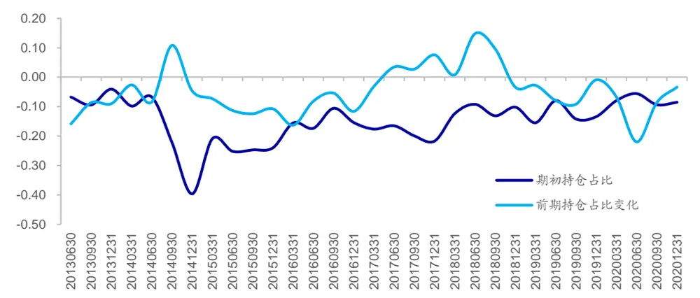
资料来源：Wind，海通证券研究所

大单净买入占比、净主买占比的回归系数皆为正值，且显著比例较高，这体现出个股的大单净买入占比越高或者净主买占比越高，个股的公募基金持仓占比增量越大。两变量的回归系数在历史上基本维持在 0 以上，且显著比例较高。除了大单净买入占比以及净主买占比以外，个股超额收益的回归系数均值也为正，且显著比例较高。这体现出了公募基金持仓变化与个股同期超额收益之间存在正向关联。

图2 大单净买入占比回归系数
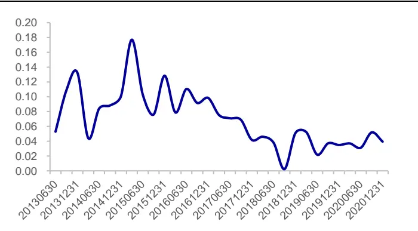
资料来源：Wind，海通证券研究所

图3 净主买占比回归系数
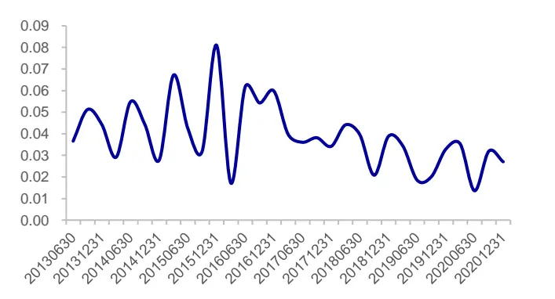
资料来源：Wind，海通证券研究所

可进一步观察回归模型的样本内解释能力。模型在样本内对于个股的公募基金持仓占比变化具有一定的解释能力，但是该种解释能力在历史上的不同时段存在较为明显的差异。模型样本内调整 R 方在 17%上下波动。模型 R方在 2014 年 9月 30 日至 2014年 12 月 31 日这一期达到了 42%的历史高点。2019 年以来，模型调整 R方基本处于10%~15%的区间内。

表 2 全市场回归模型样本内 R 方（2013.06.30~2021.03.31）

|  | 10%分位数 | 25%分位数 | 50%分位数 | 均值 | 75%分位数 | 90%分位数 |
| --- | --- | --- | --- | --- | --- | --- |
| 调整R方 | 13.0% | 14.3% | 17.8% | 19.2% | 22.6% | 27.0% |

资料来源： ，海通证券研究所

当然，我们也可使用模型进行样本外预测。在预测未来一期个股公募基金持仓占比变化时，可滚动使用历史回归系数均值作为预测模型的参数。在评价模型样本外预测效果时，不仅可使用预测结果与实际结果之间的相关性，还可使用样本外 方。样本外相关性度量了模型预测的个股公募基金持仓占比变化与实际的公募基金持仓占比变化之间的相关性。下图分别展示了模型历史上各期的样本外相关性与样本外 R方。

图4 全市场回归模型样本外相关性
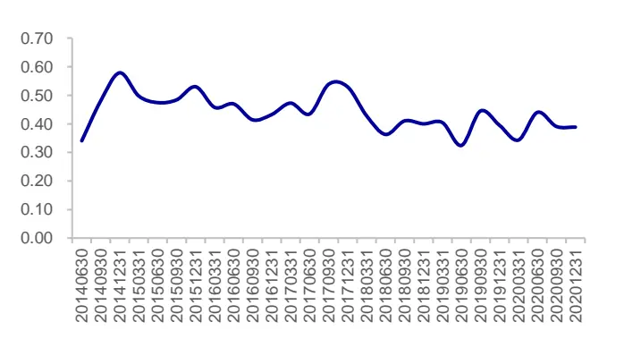
资料来源：Wind，海通证券研究所

图5 全市场回归模型样本外 R方
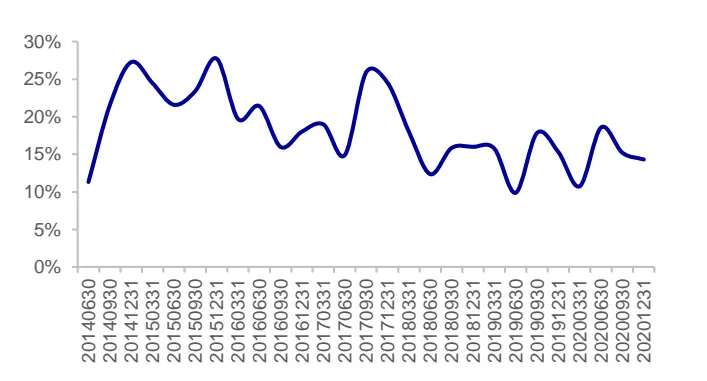
资料来源：Wind，海通证券研究所

观察上图不难发现，模型整体上呈现出了一定的样本外预测能力，且模型样本外预测能力与样本内预测能力差别较小。在滚动使用历史系数均值进行样本外预测时，模型样本外相关性在 0.43 上下波动，样本外 R方在 18%上下波动。值得注意的是，全市场模型的样本外 R方在最近几期呈现出了回落态势，样本外预测能力有所回落。

表 3 全市场回归模型样本外预测效果（2013.06.30~2021.03.31）

|  | 10%分位数 | 25%分位数 | 50%分位数 | 均值 | 75%分位数 | 90%分位数 |
| --- | --- | --- | --- | --- | --- | --- |
| 样本外相关性 | 0.36 | 0.40 | 0.43 | 0.44 | 0.48 | 0.53 |
| 样本外R方 | 11.9% | 15.2% | 18.0% | 18.4% | 21.6% | 25.1% |

资料来源：Wind，海通证券研究所

综合上述结果来看，全市场回归模型具有一定的样本内解释能力以及样本外预测能力，但是模型依旧存在较为明显的改进提升空间。考虑到公募基金管理人对于不同范围的股票操作风格存在差异，因此使用全市场所有股票构建模型显然并不合理，因此本文将在下一章中对于不同范围内的股票分别构建公募基金持仓占比变化回归模型。

## 3. 分板块模型

在前一章中，我们使用全市场数据初步构建了个股公募基金持仓占比变化回归模型。回测结果表明，虽然模型在样本内具有一定的解释能力且在样本外同样具有一定预测效果，但是模型依旧存在改进空间。

考虑到公募基金管理人对于不同类型的股票在操作上可能存在差异，因此可尝试划分不同的股票范围，并在不同的股票范围内分别构建模型。本章尝试了三种不同的范围划分方法：1）按照宽基指数划分；2）按照行业板块划分；3）按照期初公募基金持仓占比划分。

## 3.1 按照宽基指数划分

在按照宽基指数划分时，本节将股票分为了三个范围：沪深 300 指数内、中证 500指数内以及中证 800 外。基于前文提出的回归模型，可使用 2013 年 6月以来的数据构建回归模型。下表给出了回归模型中各变量的回归系数均值以及显著的比例。

表 4 分板块回归模型回归系数（按照宽基指数划分，2013.06.30~2021.03.31）

| 指数范围 | 指标 | 截距项 | 期初持仓占比 | 前一期 持仓占比变化 | 大单净买入占比 | 净主买占比 | 个股超额收益 |
| --- | --- | --- | --- | --- | --- | --- | --- |
| 沪深 300 指数内 | 回归系数均值 | 0.0040 | -0.1196 | 0.0067 | 0.1941 | 0.1243 | 0.0271 |
|  | IT\|>2 比例 | 90% | 87% | 48% | 90% | 68% | 97% |
| 中证 500 指数内 | 回归系数均值 | 0.0043 | -0.1496 | -0.0491 | 0.1034 | 0.0692 | 0.0222 |
|  | \|T\|>2 比例 | 94% | 90% | 35% | 90% | 77% | 100% |
| 中证 800 指数外 | 回归系数均值 | 0.0033 | -0.1434 | -0.0663 | 0.0582 | 0.0320 | 0.0135 |
|  | \|T\|>2 比例 | 100% | 100% | 81% | 90% | 87% | 100% |

资料来源：Wind，海通证券研究所

期初持仓占比的回归系数均值在三个范围内皆为负，其中，沪深 300 指数内的回归系数均值相对较高，而中证 指数内与中证 指数外的回归系数均值较为接近。前一期持仓占比变化的回归系数均值在沪深 300 指数内为正，而在剩下两个范围内为负。这一结果体现出公募基金在大市值股票范围的持仓变化反转性较弱。此外，虽然该变量的回归系数虽然在中证 500 指数内为负，但是显著比例偏低。

大单净买入占比以及净主买占比的回归系数均值在不同的指数范围内为正，且显著比例较高。这表明大单净买入以及净主买与同时段机构持仓的变化之间存在显著联系。进一步观察回归系数的大小可知，沪深 300 指数内的回归系数均值高于中证 500 指数内的回归系数均值，而中证 500 指数内的回归系数均值高于中证 800 指数外的回归系数均值。这也说明，沪深 300 指数内的大单净买入或者净主买更有可能是公募基金的交易行为。

此外，个股超额收益的回归系数均值在不同的指数范围内为正，且显著比例同样较高。这说明公募基金的持仓变化与同期股票超额收益之间存在正向关联。相比而言，该变量在沪深 300 指数内的回归系数均值更高。

在划分了不同指数范围并分别构建模型后，模型的解释能力相比于全市场模型出现了较为明显的改进与提升。对比不同指数范围内的样本内调整 R方，模型在沪深 300 指数内具有更强的解释能力，调整 R方的均值以及中位数皆明显高于其他两个范围。

表 5 分板块回归模型样本内 R 方（按照宽基指数划分，2013.06.30~2021.03.31）

|  | 10%分位数 | 25%分位数 | 50%分位数 | 均值 | 75%分位数 | 90%分位数 |
| --- | --- | --- | --- | --- | --- | --- |
| 沪深 300 指数内 | 23.1% | 25.8% | 34.0% | 34.7% | 40.8% | 45.3% |
| 中证 500 指数内 | 15.2% | 19.9% | 26.2% | 24.8% | 29.4% | 30.1% |
| 中证800 指数外 | 9.9% | 12.3% | 15.8% | 17.5% | 21.0% | 25.1% |

资料来源：Wind，海通证券研究所

相比于全市场模型，滚动预测模型同样呈现出了较强的样本外预测能力，全市场持仓变动的样本外相关性从的 0.43 上升至 0.46，样本外预测 R方中位数从 18%上升至。相比而言，模型对于沪深 指数内以及中证 指数内的股票的持仓占比变化的预测能力更强，模型样本外 R 方围绕 30%波动。（下表在计算分板块模型在全市场的样本外相关性以及 R方时，首先在各板块内进行预测，然后合并得到全市场股票的样本外预测，最后基于全市场股票的样本外预测结果计算样本外相关性以及 R 方。）

表 6 分板块回归模型样本外预测效果（按照宽基指数划分，2013.06.30~2021.03.31）

| 指标 | 范围 | 10%分位数 | 25%分位数 | 50%分位数 | 均值 | 75%分位数 | 90%分位数 |
| --- | --- | --- | --- | --- | --- | --- | --- |
| 样本外相关性 | 全市场 | 0.39 | 0.41 | 0.46 | 0.45 | 0.49 | 0.53 |
|  | 沪深 300 指数内 | 0.45 | 0.48 | 0.57 | 0.56 | 0.63 | 0.66 |
|  | 中证500 指数内 | 0.39 | 0.44 | 0.49 | 0.49 | 0.54 | 0.58 |
|  | 中证 800 指数外 | 0.32 | 0.35 | 0.40 | 0.42 | 0.47 | 0.51 |
| 样本外R方 | 全市场 | 14.1% | 15.9% | 20.0% | 19.7% | 22.5% | 26.7% |
|  | 沪深 300 指数内 | 13.9% | 20.3% | 30.4% | 28.3% | 37.0% | 40.3% |
|  | 中证 500 指数内 | 18.0% | 20.5% | 30.4% | 28.9% | 37.2% | 40.7% |
|  | 中证 800 指数外 | 9.9% | 17.0% | 23.4% | 22.1% | 27.8% | 30.1% |
| 全市场模型 | 样本外相关性 | 0.36 | 0.40 | 0.43 | 0.44 | 0.48 | 0.53 |
|  | 样本外R方 | 11.9% | 15.2% | 18.0% | 18.4% | 21.6% | 25.1% |

资料来源： ，海通证券研究所

## 3.2 按照行业板块划分

在按照行业板块划分股票范围时，本节将股票分为了六个板块：原材料、工业、金融地产、消费、科技以及其他。基于前文提出的回归模型，可使用 2013 年 6月以来的数据构建分板块模型。

表 7 分板块回归模型回归系数（按照行业板块划分，2013.06.30~2021.03.31）

| 指数范围 | 指标 | 截距项 | 期初持仓占比 | 前一期 持仓占比变化 | 大单净买入占比 | 净主买占比 | 个股超额收益 |
| --- | --- | --- | --- | --- | --- | --- | --- |
| 原材料 | 回归系数均值 | 0.0023 | -0.1762 | -0.0841 | 0.0432 | 0.0236 | 0.0122 |
|  | \|T\|>2 比例 | 77% | 77% | 58% | 45% | 45% | 84% |
| 工业 | 回归系数均值 | 0.0029 | -0.1540 | -0.0780 | 0.0537 | 0.0308 | 0.0130 |
|  | \|T\|>2 比例 | 94% | 90% | 65% | 68% | 74% | 97% |
| 金融地产 | 回归系数均值 \|T\|>2 比例 | 0.0019 45% | -0.1455 74% | -0.0592 48% | 0.0369 39% | 0.0194 29% | 0.0085 68% |
| 科技 | 回归系数均值 \|T\|>2 比例 | 0.0060 100% | -0.1553 87% | -0.0729 48% | 0.1085 87% | 0.0580 77% | 0.0231 100% |
| 消费 | 回归系数均值 \|T\|>2 比例 | 0.0039 100% | -0.1374 97% | -0.0173 55% | 0.0790 84% | 0.0435 84% | 0.0182 100% |
| 其他 | 回归系数均值 \|T\|>2 比例 | 0.0035 74% | -0.1326 87% | -0.0500 52% | 0.0692 58% | 0.0333 42% | 0.0148 94% |

资料来源：Wind，海通证券研究所

期初持仓占比的回归系数均值在不同板块内皆为负，其中，消费以及其他板块中的系数均值相对更高。前一期持仓占比变化回归系数均值在各板块中皆为负，但是该变量在大部分板块中的显著比例处于 50%上下。此外，该变量在消费板块中的回归系数明显更接近于 0，这说明消费板块中个股公募基金持仓变化的反转性并不明显。

大单净买入占比、净主买占比的回归系数均值在不同的板块中内为正，两变量在科技板块以及消费板块内的系数均值明显高于其他板块，这表明两板块中的大单净买入或者净主买有更高的概率是公募基金的交易行为。这一结论也与近年来公募基金的偏好较为吻合。此外，个股超额收益的回归系数在不同板块中为正，这表明个股超额收益越明显，公募基金增配的概率越大。

在划分了不同行业板块范围并分别构建模型后，模型的解释能力相比于全市场模型出现了一定程度的改进与提升。对比模型在不同行业板块中的表现可知，模型在原材料以及科技板块中的解释能力相对更强。

表 8 分板块回归模型样本内 R 方（按照宽基指数划分，2013.06.30~2021.03.31）

| 行业板块 | 10%分位数 | 25%分位数 | 50%分位数 | 均值 | 75%分位数 | 90%分位数 |
| --- | --- | --- | --- | --- | --- | --- |
| 原材料 | 10.4% | 15.5% | 23.9% | 23.9% | 30.4% | 36.1% |
| 工业 | 11.8% | 15.7% | 19.3% | 19.8% | 24.0% | 29.1% |
| 金融地产 | 7.7% | 9.6% | 16.3% | 22.6% | 32.5% | 42.0% |
| 科技 | 14.5% | 19.8% | 24.8% | 25.1% | 27.8% | 37.9% |
| 消费 | 12.1% | 14.9% | 17.6% | 19.7% | 23.7% | 26.0% |
| 其他 | 12.1% | 15.8% | 20.4% | 21.3% | 27.4% | 32.7% |

资料来源：Wind，海通证券研究所

在使用行业板块划分了股票范围后，我们并未观察到模型样本预测效果的明显改善。模型在全市场的样本外相关性的中位数从0.43回落至0.42，样本外R方的中位数从18%回落至 。（下表在计算分板块模型在全市场的样本外相关性以及 方时，首先在各板块内进行预测，然后合并得到全市场股票的样本外预测，最后基于全市场股票的样本外预测结果计算样本外相关性以及 R 方。）

表 9 分板块回归模型样本外预测效果（按照行业板块划分，2014.06.30~2021.03.31）

| 指标名称 | 股票范围 | 10%分位数 | 25%分位数 | 50%分位数 | 均值 | 75%分位数 | 90%分位数 |
| --- | --- | --- | --- | --- | --- | --- | --- |
| 样本外相关性 | 全市场 | 0.36 | 0.40 | 0.42 | 0.44 | 0.48 | 0.53 |
|  | 原材料 | 0.22 | 0.32 | 0.40 | 0.41 | 0.52 | 0.56 |
|  | 工业 | 0.30 | 0.38 | 0.44 | 0.43 | 0.47 | 0.52 |
|  | 金融地产 | 0.12 | 0.22 | 0.39 | 0.35 | 0.50 | 0.57 |
|  | 科技 | 0.33 | 0.43 | 0.50 | 0.48 | 0.55 | 0.59 |
|  | 消费 | 0.36 | 0.39 | 0.43 | 0.44 | 0.51 | 0.52 |
|  | 其他 | 0.23 | 0.30 | 0.37 | 0.40 | 0.52 | 0.59 |
| 样本外R方 | 全市场 | 12.5% | 14.6% | 17.4% | 18.3% | 21.6% | 25.2% |
|  | 原材料 | -8.0% | 8.1% | 14.9% | 12.8% | 20.4% | 28.8% |
|  | 工业 | 8.7% | 12.7% | 17.5% | 16.6% | 21.8% | 24.3% |
|  | 金融地产 | -15.7% | 2.2% | 10.5% | 5.5% | 20.6% | 27.1% |
|  | 科技 | 9.0% | 15.7% | 22.8% | 20.9% | 27.8% | 30.5% |
|  | 消费 | 12.0% | 13.7% | 16.7% | 18.2% | 23.7% | 25.7% |
|  | 其他 | -2.4% | 4.1% | 13.3% | 13.4% | 22.1% | 30.5% |
| 全市场模型 | 样本外相关性 | 0.36 | 0.40 | 0.43 | 0.44 | 0.48 | 0.53 |
|  | 样本外R方 | 11.9% | 15.2% | 18.0% | 18.4% | 21.6% | 25.1% |

资料来源：Wind，海通证券研究所

## 3.3按照期初公募基金持仓占比划分

考虑到机构在调整持仓时也会考虑到股票当前的机构持仓情况，我们同样可根据期初个股的公募基金持仓占比进行范围划分。本节基于期初公募基金持仓占比将全市场股票分为了公募基金持仓占比高、公募基金持仓占比低以及无公募基金持仓三个范围。

公募基金持仓占比高为期初公募基金持仓占比大于 的股票中持仓占比前 的股票，公募基金持仓占比低为期初公募基金持仓占比大于 0 的股票中持仓占比后 70%的股票，无公募基金持仓占比为期初公募基金持仓占比为 0的股票。基于前文提出的回归模型，可使用 2013 年 6月以来的数据构建回归模型。

表 10 分板块回归模型回归系数（按照期初持仓占比划分，2013.06.30~2021.03.31）

| 指数范围 | 指标 | 截距项 | 期初持仓占比 | 前一期 持仓占比变化 | 大单净买入占比 | 净主买占比 | 个股超额收益 |
| --- | --- | --- | --- | --- | --- | --- | --- |
| 公募基金持仓高 | 回归系数均值 | 0.0093 | -0.1568 | -0.0342 | 0.3406 | 0.1853 | 0.0458 |
|  | \|T\|>2 比例 | 90% | 94% | 39% | 100% | 100% | 100% |
| 公募基金持仓低 | 回归系数均值 | 0.0035 | -0.1093 | -0.0871 | 0.0530 | 0.0309 | 0.0168 |
|  | \|T\|>2 比例 | 100% | 55% | 71% | 74% | 84% | 100% |
| 无公募基金持仓 | 回归系数均值 | 0.0015 |  | -0.1180 | 0.0159 | 0.0067 | 0.0053 |
|  | \|T\|>2 比例 | 100% |  | 71% | 45% | 52% | 100% |

资料来源： ，海通证券研究所

期初持仓占比的回归系数均值在公募基金持仓高以及公募基金持仓低两个范围中皆为负，其中，该变量回归系数在公募基金持仓高的股票中显著比例更高。前一期持仓占比变化回归系数均值在各范围中皆为负。相比而言，该系数在公募基金持仓占比高的股票中更加接近于 0，且系数显著比例明显低于其他两个范围。这说明，在该范围中，公募基金持仓变化的反转性并不明显。在其余两个范围中，公募基金季度持仓变化具有一定的反转性。

大单净买入占比以及净主买占比的回归系数均值在各范围内为正，且在公募基金持仓占比高的股票范围中均值更高，显著比例也较高。这表明，在公募基金持仓占比较高的股票范围中，股票上的大单流入以及资金净流入有更高的概率为公募基金交易行为，这一结论也较为符合直观理解。

个股超额收益的回归系数均值在各个范围内同样为正，且在公募基金持仓占比较高的股票范围中系数均值更高。这同样说明，个股上公募基金持仓的变化与同期股票超额收益之间存在较为明显的正向关联。

模型在公募基金持仓占比较高的股票范围内有着较强的解释能力，模型调整 方围绕 35%波动。对于公募基金持仓占比较低以及无持仓的股票，模型的解释能力相对偏弱，模型调整 R 方分别围绕 15%以及 5%波动。

表 11 分板块回归模型样本内 R 方（按照期初持仓占比划分，2013.06.30~2021.03.31）

| 股票范围 | 10%分位数 | 25%分位数 | 50%分位数 | 均值 | 75%分位数 | 90%分位数 |
| --- | --- | --- | --- | --- | --- | --- |
| 公募基金持仓高 | 26.0% | 31.3% | 35.5% | 34.7% | 38.0% | 39.1% |
| 公募基金持仓低 | 10.0% | 11.7% | 14.9% | 15.3% | 18.3% | 21.5% |
| 无公募基金持仓 | 2.1% | 2.9% | 5.4% | 6.5% | 9.2% | 11.5% |

资料来源：Wind，海通证券研究所

相比于全市场模型，模型的样本外预测能力有所提升。模型在全市场的样本外相关性的中位数从 上升至 ，样本外 方的中位数从 上升至 。分股票范围来看，模型在公募基金持仓占比高的股票中具有较强的预测能力，而对于公募基金持仓占比低的股票以及公募基金未持仓的股票的预测效果偏弱。（下表在计算分板块模型在全市场的样本外相关性以及 R方时，首先在各板块内进行预测，然后合并得到全市场股票的样本外预测，最后基于全市场股票的样本外预测结果计算样本外相关性以及 R 方。）

表 12 分板块回归模型样本外预测效果（按照期初持仓占比划分，2013.06.30~2021.03.31）

| 指标 | 范围 | 10%分位数 | 25%分位数 | 50%分位数 | 均值 | 75%分位数 | 90%分位数 |
| --- | --- | --- | --- | --- | --- | --- | --- |
| 样本外相关性 | 全市场 | 0.48 | 0.52 | 0.55 | 0.55 | 0.56 | 0.61 |
|  | 公募基金持仓高 | 0.51 | 0.55 | 0.58 | 0.58 | 0.62 | 0.64 |
|  | 公募基金持仓低 | 0.28 | 0.34 | 0.39 | 0.38 | 0.45 | 0.49 |
|  | 无公募基金持仓 | 0.14 | 0.17 | 0.22 | 0.22 | 0.26 | 0.33 |
| 样本外R方 | 全市场 | 21.8% | 25.1% | 30.2% | 29.2% | 31.4% | 36.2% |
|  | 公募基金持仓高 | 19.3% | 23.8% | 30.3% | 28.9% | 33.4% | 37.5% |
|  | 公募基金持仓低 | -2.2% | 9.1% | 11.0% | 11.7% | 16.5% | 22.4% |
|  | 无公募基金持仓 | -6.4% | -2.8% | 2.8% | 0.7% | 5.0% | 7.9% |
| 全市场模型 | 样本外相关性 | 0.36 | 0.40 | 0.43 | 0.44 | 0.48 | 0.53 |
|  | 样本外R方 | 11.9% | 15.2% | 18.0% | 18.4% | 21.6% | 25.1% |

资料来源：Wind，海通证券研究所

## 3.4 模型对比

下表对比了不同的模型在不同的股票范围内的样本外预测效果。从样本外相关性的角度看，分板块模型（按照期初持仓占比）在各范围内具有相对更好的样本外预测能力。从全市场的角度看，模型的预测持仓变化与实际持仓占比变化之间的相关性中位数高于。从各个股票范围的角度看，模型的样本外相关性同样高于其余模型。（下表在计算分板块模型在全市场以及特定股票范围内的样本外相关性以及 方时，首先在各板块内进行预测，然后合并得到全市场股票的样本外预测，最后基于指定范围股票的样本外预测结果计算模型在该范围内的样本外相关性以及 R方。）

表 13 持仓变化预测模型样本外相关性中位数对比（2014.06.30~2021.03.31）

| 股票范围 | 全市场模型 | 分板块模型 (按照宽基指数) | 分板块模型 (按照行业板块） | 分板块模型 (按照期初持仓占比) |
| --- | --- | --- | --- | --- |
| 全市场 | 0.43 | 0.46 | 0.42 | 0.55 |
| 沪深300 | 0.43 | 0.57 | 0.44 | 0.59 |
| 中证500 | 0.47 | 0.49 | 0.47 | 0.57 |
| 中证 800 外 | 0.43 | 0.40 | 0.41 | 0.53 |
| 原材料 | 0.42 | 0.46 | 0.40 | 0.52 |
| 工业 | 0.45 | 0.42 | 0.44 | 0.55 |
| 金融地产 | 0.36 | 0.42 | 0.39 | 0.49 |
| 科技 | 0.48 | 0.51 | 0.50 | 0.58 |
| 消费 | 0.42 | 0.45 | 0.43 | 0.56 |
| 其他 | 0.42 | 0.43 | 0.37 | 0.50 |
| 公募基金持仓高 | 0.49 | 0.50 | 0.47 | 0.58 |
| 公募基金持仓低 | 0.34 | 0.35 | 0.32 | 0.39 |
| 无公募基金持仓 | 0.21 | 0.20 | 0.21 | 0.22 |

资料来源：Wind，海通证券研究所

从样本外 R 方的角度看，分板块模型（按照期初持仓占比）同样较好。从全市场的角度看，模型的样本外 R方中位数为 30.2%，明显高于其余各模型。从各个股票范围的角度看，模型同样呈现出了较强的样本外预测能力，模型样本外 R 方在各股票范围内皆相对较高。

表 14 持仓变化预测模型样本外 R 方中位数对比（2014.06.30~2021.03.31）

| 股票范围 | 全市场模型 | 分板块模型 (按照宽基指数) | 分板块模型 (按照行业板块） | 分板块模型 (按照期初持仓占比) |
| --- | --- | --- | --- | --- |
| 全市场 | 18.0% | 20.0% | 17.4% | 30.2% |
| 沪深 300 | 15.3% | 30.4% | 16.5% | 31.5% |
| 中证500 | 19.7% | 23.4% | 20.1% | 30.6% |
| 中证800外 | 15.9% | 15.2% | 15.0% | 29.2% |
| 原材料 | 14.9% | 16.7% | 14.9% | 22.6% |
| 工业 | 17.4% | 17.4% | 17.5% | 29.4% |
| 金融地产 | 7.6% | 14.2% | 10.5% | 29.6% |
| 科技 | 21.7% | 24.5% | 22.8% | 32.2% |
| 消费 | 17.3% | 19.8% | 16.7% | 29.0% |
| 其他 | 16.7% | 17.2% | 13.3% | 24.4% |
| 公募基金持仓高 | 16.0% | 18.5% | 16.0% | 30.3% |
| 公募基金持仓低 | 7.8% | 7.8% | 7.7% | 11.0% |
| 无公募基金持仓 | -24.1% | -17.7% | -27.8% | 2.8% |

资料来源：Wind，海通证券研究所

## 4. 模型应用案例

基于前文构建的模型，我们可较为便捷地对于个股的公募基金持仓变动进行预测。本节展示了模型的三种应用方式，我们也会在后续报告中围绕相关应用进行更加详细的讨论。

由于个股的高频数据每日可得，因此可基于前期已披露的基金持仓占比以及模型预估的持仓占比变化得到当前的公募基金持仓占比预估。下图以部分股票为例展示了模型对于相关个股的公募基金持仓占比以及持仓占比变化的预测。（季度对比图为模型在每个季度末的预估值与季报披露的实际值的对比。而对于日度对比图，由于基金季报通常在季度结束后的 个工作日内披露，因此在对比实际披露以及模型预估的公募基金持仓占比时同样考虑了这一时间滞后。）

图6 贵州茅台公募基金持仓占比预估（季度对比）
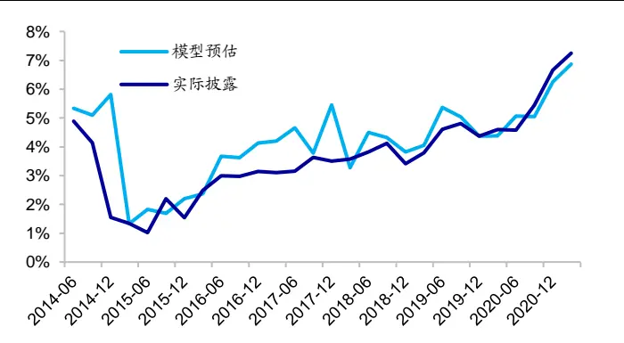
资料来源：Wind，海通证券研究所

图7 贵州茅台公募基金持仓占比预估（日度对比）
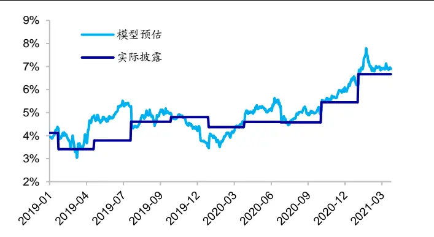
资料来源：Wind，海通证券研究所

图8 海康威视公募基金持仓占比预估（季度对比）
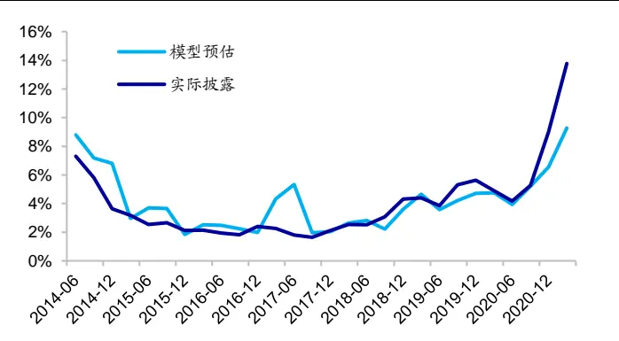
资料来源：Wind，海通证券研究所

图9 海康威视公募基金持仓占比预估（日度对比）
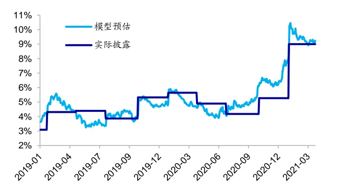
资料来源：Wind，海通证券研究所

观察上图不难发现，相比于简单沿用前期披露的机构持仓占比，模型能够提供日度的持仓占比预期，对于机构持仓占比较高的股票，模型具有相对较高的预测效果。值得注意的是，模型对于个股的持仓占比预期在部分时点依旧存在一定的偏差。

基于个股的公募基金持仓占比预测结果，我们可进一步合成行业的公募基金持仓占比。下图以部分行业为例展示了模型对于相关行业的公募基金持仓占比以及持仓占比变化的预测。与个股部分类似，

图10 医药公募基金持仓占比预估（季度对比）
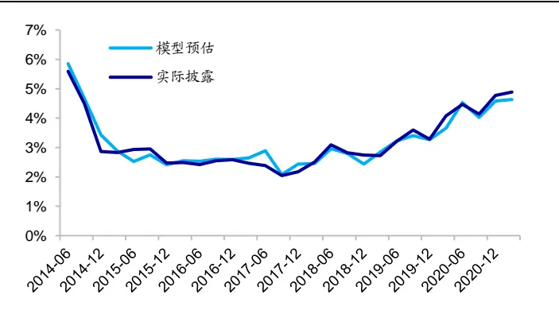
资料来源：Wind，海通证券研究所

图11 医药公募基金持仓占比预估（日度对比）
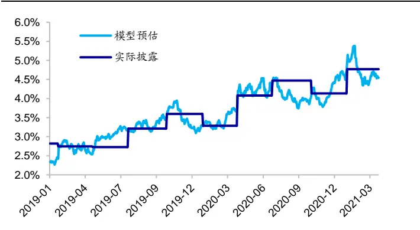
资料来源：Wind，海通证券研究所

图12 钢铁公募基金持仓占比预估（季度对比）
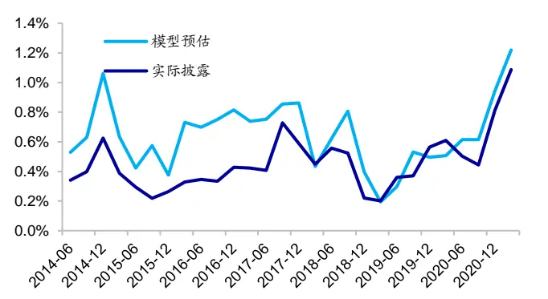
资料来源：Wind，海通证券研究所

图13 钢铁公募基金持仓占比预估（日度对比）
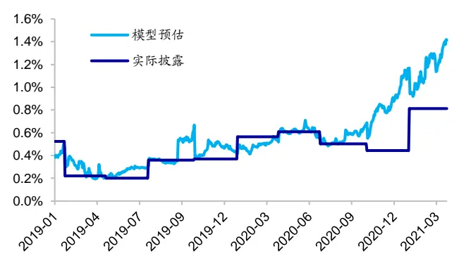
资料来源：Wind，海通证券研究所

除了个股与行业外，我们同样可使用个股的公募基金持仓占比预估特定股票构成的因子或者风格的公募基金持仓占比。下图以部分行业为例展示了 BP_LY最高的 10%的股票的模型预期以及实际披露的公募基金持仓占比。

图14 价值风格公募基金持仓占比预估（BP_LY排序，季度）
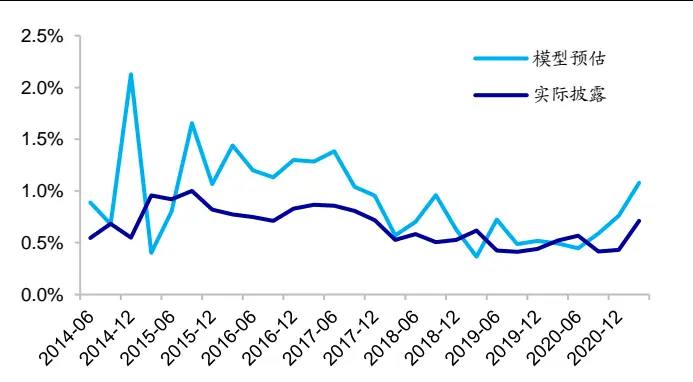
资料来源：Wind，海通证券研究所

图15 价值风格公募基金持仓占比预估（BP_LY排序，日度）
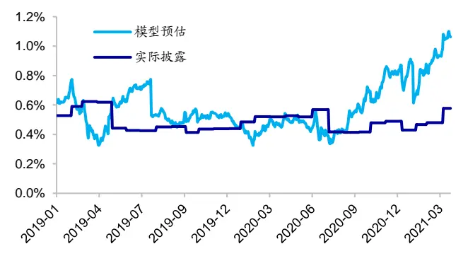
资料来源：Wind，海通证券研究所

对比个股、行业以及风格的公募基金持仓占比预估结果以及前期实际披露结果不难发现，模型预估结果具有更强的灵活性。由于实际披露数据具有明显的稀疏性以及滞后性，个股、行业以及风格的公募基金持仓占比实际披露结果整体呈现阶梯走势。相比而言，模型预估结果考虑了多方面的因素，会随着市场的演变而对于当前的公募基金持仓占比预期进行修正，因此展现出了更强的灵活性。

此外，模型预估结果也具有一定的准确性。特别是对于公募基金持仓占比较高的个股、行业或者风格。模型预估的持仓占比变化方向与实际披露的结果基本一致，部分时点上仅存在具体数值上的差异。

总而言之，模型预估结果相比于前期披露结果具有更强的灵活性以及准确性，因此可考虑基于模型预估结果构建选股、行业轮动等投资策略。

## 5. 总结

本文尝试使用市场微观数据，从微观交易的角度跟踪刻画公募基金投资者的交易行为，并构建模型高频预估个股的公募基金持仓占比变化。回测结果表明，全市场模型在样本内对于个股的公募基金持仓变动具有一定的解释能力。通过划分股票范围，在不同股票范围内单独构建模型预测股票持仓变动，可进一步提升模型的解释能力。

在实际应用中，可构建模型滚动预估个股上公募基金持仓占比的变化。回测结果表明，全市场模型的样本外预测能力有待提升，按照期初公募基金持仓占比划分股票范围的分板块模型具有相对较好的样本外预测能力。基于个股的公募基金持仓预估，我们可进一步对于行业、因子以及风格的公募基金持仓占比变化进行预估。

总而言之，文中构建得到的个股公募基金持仓占比变化预估模型在具有样本内解释能力的同时也具有一定的样本外预测能力。我们将在后续报告中对于预估结果的应用进行更加细致的讨论。

## 6. 风险提示

市场系统性风险、资产流动性风险以及政策变动风险会对策略表现产生较大影响。

## 信息披露

分析师声明

[Table冯佳睿yst 金融工程研究团队s]

袁林青金融工程研究团队

本人具有中国证券业协会授予的证券投资咨询执业资格，以勤勉的职业态度，独立、客观地出具本报告。本报告所采用的数据和信息均来自市场公开信息，本人不保证该等信息的准确性或完整性。分析逻辑基于作者的职业理解，清晰准确地反映了作者的研究观点，结论不受任何第三方的授意或影响，特此声明。

## 法律声明

。本公司不会因接收人收到本报告而视其为客户。在任何情况下，

本报告中的信息或所表述的意见并不构成对任何人的投资建议。在任何情况下，本公司不对任何人因使用本报告中的任何内容所引致的任何损失负任何责任。

本报告所载的资料、意见及推测仅反映本公司于发布本报告当日的判断，本报告所指的证券或投资标的的价格、价值及投资收入可能会波动。在不同时期，本公司可发出与本报告所载资料、意见及推测不一致的报告。

市场有风险，投资需谨慎。本报告所载的信息、材料及结论只提供特定客户作参考，不构成投资建议，也没有考虑到个别客户特殊的投资目标、财务状况或需要。客户应考虑本报告中的任何意见或建议是否符合其特定状况。在法律许可的情况下，海通证券及其所属关联机构可能会持有报告中提到的公司所发行的证券并进行交易，还可能为这些公司提供投资银行服务或其他服务。

本报告仅向特定客户传送，未经海通证券研究所书面授权，本研究报告的任何部分均不得以任何方式制作任何形式的拷贝、复印件或复制品，或再次分发给任何其他人，或以任何侵犯本公司版权的其他方式使用。所有本报告中使用的商标、服务标记及标记均为本公司的商标、服务标记及标记。如欲引用或转载本文内容，务必联络海通证券研究所并获得许可，并需注明出处为海通证券研究所，且不得对本文进行有悖原意的引用和删改。

根据中国证监会核发的经营证券业务许可，海通证券股份有限公司的经营范围包括证券投资咨询业务。

海通证券股份有限公司研究所[Table_PeopleInfo]
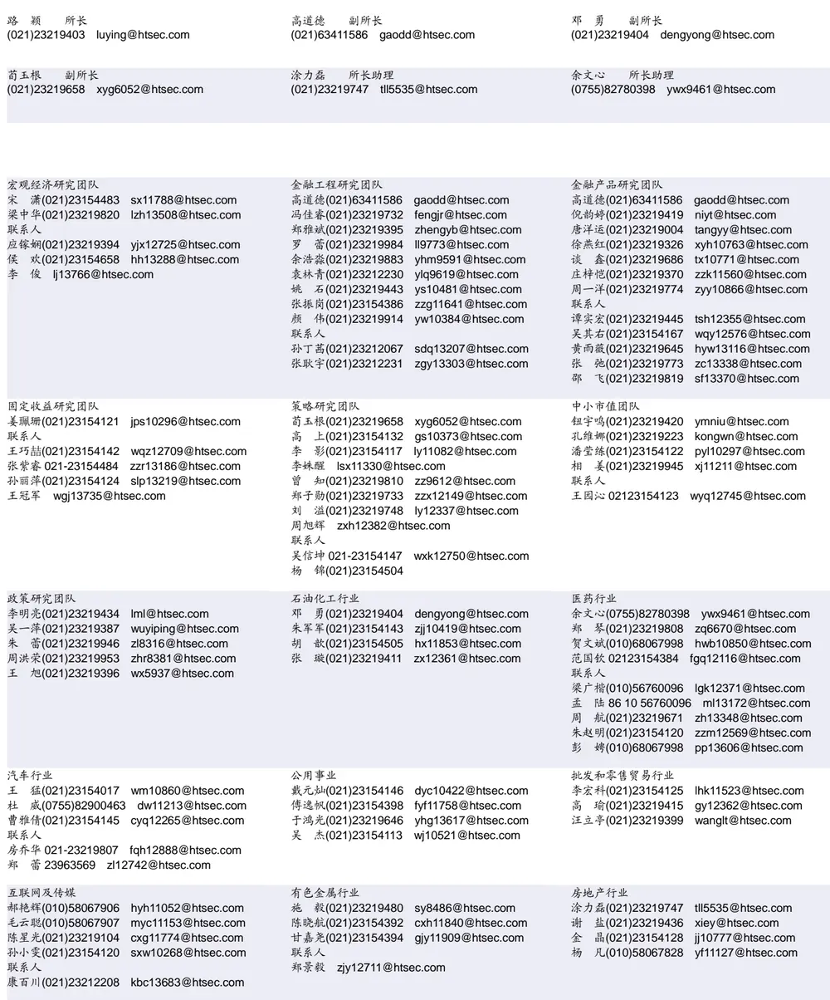

| 电子行业 |  | 煤炭行业 |  | 电力设备及新能源行业 |  |
| --- | --- | --- | --- | --- | --- |
| 周旭辉 zxh12382@htsec.com 李 轩(021)23154652 lx12671@htsec.com |  | 李 淼(010)58067998 戴元灿(021)23154146 | Im10779@htsec.com dyc10422@htsec.com | 张一弛(021)23219402 房 青(021)23219692 | zyc9637@htsec.com fangq@htsec.com |
| 联系人 肖隽翀021-23154139 xjc12802@htsec.com |  | 王涛(021)23219760 吴 杰(021)23154113 | wt12363@htsec.com wj10521@htsec.com | 曾 彪(021)23154148 徐柏乔(021)23219171 张 磊(021)23212001 | zb10242@htsec.com xbq6583@htsec.com zl10996@htsec.com |
| 刘 威(0755)82764281 刘海荣(021)23154130 张翠翠(021)23214397 孙维容(021)23219431 李 智(021)23219392 | Iw10053@htsec.com Ihr10342@htsec.com zcc11726@htsec.com swr12178@htsec.com lz11785@htsec.com | 计算机行业 郑宏达(021)23219392 杨 林(021)23154174 于成龙(021)23154174 黄竞晶(021)23154131 洪 琳(021)23154137 联系人 杨 蒙(0755)23617756 | zhd10834@htsec.com yl11036@htsec.com ycl12224@htsec.com hjj10361@htsec.com hl11570@htsec.com | 通信行业 朱劲松(010)50949926 余伟民(010)50949926 张峥青(021)23219383 联系人 杨彤昕 010-56760095 | zjs10213@htsec.com ywm11574@htsec.com zzq11650@htsec.com ytx12741@htsec.com |
| 非银行金融行业 孙 婷(010)50949926 | st9998@htsec.com | 交通运输行业 虞 楠(021)23219382 yun@htsec.com |  | 纺织服装行业 |  |
| 何 婷(021)23219634 | ht10515@htsec.com |  | 罗月江（010）56760091 lyj12399@htsec.com | 梁 希(021)23219407 盛 开(021)23154510 | lx11040@htsec.com sk11787@htsec.com |
| 李芳洲(021)23154127 联系人 | Ifz11585@htsec.com | 陈 宇(021)23219442 cy13115@htsec.com |  |  |  |
| 任广博(010)56760090 |  |  |  |  |  |
|  | rgb12695@htsec.com |  |  |  |  |
| 建筑建材行业 冯晨阳(021)23212081 | fcy10886@htsec.com | 机械行业 余炜超(021)23219816 swc11480@htsec.com |  | 钢铁行业 刘彦奇(021)23219391 | liuyq@htsec.com |
| 潘莹练(021)23154122 | pyl10297@htsec.com | 周 丹 zd12213@htsec.com |  | 周慧琳(021)23154399 |  |
| 申 浩(021)23154114 颜慧菁 yhj12866@htsec.com | sh12219@htsec.com | 吉 晟(021)23154653 赵玥炜(021)23219814 | js12801@htsec.com zyw13208@htsec.com |  | zhl11756@htsec.com |
|  |  | 联系人 |  |  |  |
|  |  | 赵靖博(021)23154119 | zjb13572@htsec.com |  |  |
| 建筑工程行业 张欣劼 zxj12156@htsec.com |  | 农林牧渔行业 丁 频(021)23219405 |  | 食品饮料行业 |  |
| 李富华(021)23154134 Ifh12225@htsec.com |  | 陈 阳(021)23212041 | dingpin@htsec.com cy10867@htsec.com | 闻宏伟(010)58067941 whw9587@htsec.com 颜慧菁 yhj12866@htsec.com |  |
|  |  | 联系人 |  | 张宇轩(021)23154172 |  |
|  |  | 孟亚琦(021)23154396 | myq12354@htsec.com | 程碧升(021)23154171 | zyx11631@htsec.com cbs10969@htsec.com |
| 军工行业 |  |  |  |  |  |
| 张恒晅 zhx10170@htsec.com |  | 银行行业 |  | 社会服务行业 |  |
|  |  | 孙 婷(010)50949926 st9998@htsec.com |  | 汪立亭(021)23219399 | wanglt@htsec.com |
| 张高艳 0755-82900489 zgy13106@htsec.com |  | 解巍巍 xww12276@htsec.com |  | 许樱之(755)82900465 | xyz11630@htsec.com |
| 联系人 |  |  |  |  |  |
|  |  | 林加力(021)23154395 | ljl12245@htsec.com | 联系人 |  |
| 刘砚菲 021-2321-4129 |  | 联系人 |  |  |  |
|  | lyf13079@htsec.com |  |  |  | mhy13205@htsec.com |
|  |  |  |  | 毛弘毅(021)23219583 |  |
|  |  | 董栋梁(021) 23219356 | ddl13026@htsec.com |  |  |
| 家电行业 |  | 造纸轻工行业 |  |  |  |
| 陈子仪(021)23219244 chenzy@htsec.com |  | 汪立亭(021)23219399 | wanglt@htsec.com |  |  |
| 李 阳(021)23154382 |  |  |  |  |  |
|  |  | 赵 洋(021)23154126 | zy10340@htsec.com |  |  |
|  | ly11194@htsec.com |  |  |  |  |
| 朱默辰(021)23154383 |  | 联系人 |  |  |  |
|  | zmc11316@htsec.com |  |  |  |  |
| 刘 璐(021)23214390 |  | 柳文韬(021)23219389 | Iwt13065@htsec.com |  |  |
|  | II11838@htsec.com |  |  |  |  |

## 研究所销售团队

深广地区销售团队

蔡铁清(0755)82775962 ctq5979@htsec.com

伏财勇(0755)23607963 fcy7498@htsec.com

辜丽娟(0755)83253022 gulj@htsec.com

刘晶晶(0755)83255933 liujj4900@htsec.com

欧阳梦楚(0755)23617160

饶 伟(0755)82775282 rw10588@htsec.com

oymc11039@htsec.com

巩柏含 gbh11537@htsec.com

滕雪竹 txz13189@htsec.com

上海地区销售团队
胡雪梅(021)23219385 huxm@htsec.com
季唯佳(021)23219384 jiwj@htsec.com
黄 毓(021)23219410 huangyu@htsec.com
漆冠男(021)23219281 qgn10768@htsec.com
胡宇欣(021)23154192 hyx10493@htsec.com
黄 诚(021)23219397 hc10482@htsec.com
毛文英(021)23219373 mwy10474@htsec.com
马晓男 mxn11376@htsec.com
杨祎昕(021)23212268 yyx10310@htsec.com
张思宇 zsy11797@htsec.com
王朝领 wcl11854@htsec.com
邵亚杰 23214650 syj12493@htsec.com
李 寅 021-23219691 ly12488@htsec.com
董晓梅 dxm10457@htsec.com北京地区销售团队
殷怡琦(010)58067988 yyq9989@htsec.com朱 健(021)23219592 zhuj@htsec.com
张丽萱(010)58067931 zlx11191@htsec.com杨羽莎(010)58067977 yys10962@htsec.com郭金垚(010)58067851 gjy12727@htsec.com张钧博 zjb13446@htsec.com
高 瑞 gr13547@htsec.com
郭 楠 010-5806 7936 gn12384@htsec.com

海通证券股份有限公司研究所

地址：上海市黄浦区广东路 689号海通证券大厦 9楼

电话：（021）23219000

传真：（021）23219392

网址：www.htsec.com