## [Tab相关研究

Table_ReportInfo]《选股因子系列研究（六十六）——寻找逐笔交易中的有效信息》

《选股因子系列研究（七十二）——大单的精细化处理与大单因子重构》

2021.01.18

《高频数据应用系列研究（一）——使用高频数据跟踪核心资产的公募基金持仓变化》2021.04.24

分析师:冯佳睿

Tel:(021)23219732

Email:fengjr@htsec.com

证书:S0850512080006

分析师:袁林青

Tel:(021)23212230

Email:ylq9619@htsec.com

证书:S0850516050003

# 高频数据应用系列研究（二）——公募基金持仓占比预期在选股以及行业轮动中的应用

## 投资要点：

系列前期报告《高频数据应用系列研究（一）——使用高频数据跟踪核心资产的公募基金持仓变化》讨论了使用高频数据对于基金披露的持仓进行持续修正，并得到个股上公募基金持仓占比预期的方法。本文在前期研究的基础之上，探讨了公募基金持仓占比预期（后文简称公募持仓预期）在选股以及行业轮动策略中的应用。

- 模型跟踪表现良好。对于公募持仓占比较高的股票，个股公募持仓预期具有相对较好的拟合效果。此外，基于个股公募持仓预期，可向上合成特定行业的公募持仓预期。行业公募持仓预期样本外拟合效果同样较好。

- 基于个股公募持仓预期构建选股因子。在构建选股因子时，可考虑从以下两个角度出发： ）刻画个股当前预期持仓水平； ）刻画个股当前预期持仓水平相对于历史持仓水平的变化。

- 预期持仓占比因子：因子在沪深 指数内以及中证 指数内皆呈现出了显著的选股能力。在正交处理后，因子选股能力有所回落，但是预期持仓占比因子依旧具有选股能力。

- 预期持仓占比变化因子：虽然因子截面收益区分能力相对偏弱，但是因子在正交前后皆呈现出了相对较强的多头效应。因子多头组合收益性相对较强。

- 基于个股公募持仓占比预期可得到行业公募持仓占比预期，从而构建行业轮动策略。可从 3个不同角度构建行业轮动策略：1）选择预期持仓占比高的行业；2）选择预期持仓占比相比于 1 季度前已披露的持仓占比提升大的行业；3）选择预期持仓占比相比于最新季报披露的持仓占比提升大的行业。

- 行业轮动策略 1：策略年化多空收益 16.96%，年化多头超额 11.67%。相比于使用已披露的行业持仓占比构建的行业轮动策略，行业轮动策略 1多空收益以及多头超额收益更高。截至 2021 年 6 月 30 日，策略 2021 年以来多头超额收益达7.38%。

- 行业轮动策略 2：策略年化多空收益 13.96%，年化多头超额 8.55%。相比于使用已披露的行业持仓占比变化构建的行业轮动策略，行业轮动策略 2多空收益以及多头超额收益更高。截至 2021 年 6 月 30 日，策略 2021 年以来多头超额收益为 3.84%。

- 行业轮动策略 3：策略年化多空收益 12.01%，年化多头超额 9.70%。截至 2021年 6 月 30日，策略在 2021 年以来多头超额收益达 9.46%。

- 风险提示。市场系统性风险、资产流动性风险以及政策变动风险会对策略表现产生较大影响。

系列前期报告《高频数据应用系列研究（一）——使用高频数据跟踪核心资产的公募基金持仓变化》讨论了使用高频数据对于基金披露的持仓进行持续修正，并得到个股上公募基金持仓占比预期的方法。本文在前期研究的基础之上，探讨了公募基金持仓占比预期（后文简称公募持仓预期）在选股以及行业轮动策略中的应用。

本文共分为 5个部分，第一部分更新展示了部分个股以及行业的日度公募持仓预期。第二部分基于个股的公募持仓预期构建了选股因子，并测试了相关因子在沪深 300 指数以及中证 800 指数内的选股能力。第三部分基于个股的公募持仓预期构建了行业轮动策略，并测试了相关策略的收益表现。第四部分总结了全文。第五部分提示了风险。

## 1. 数据跟踪

基于系列前期报告《高频数据应用系列研究（一）——使用高频数据跟踪核心资产的公募基金持仓变化》中提出的方法，可基于基金披露的季报持仓数据以及个股底层的微观交易数据，得到个股上公募基持仓占比的日度预期。本部分以部分个股以及行业为例，展示了相关跟踪结果。

## 1.1 个股跟踪结果

下图以部分股票为例，展示了模型对于相关个股的公募持仓占比的预期。在日度对比图中，由于基金季报通常在季度结束后的 15 个工作日内完成披露，因此在对比实际披露以及模型预估的公募持仓占比时，同样考虑了这一时间滞后。

图1 贵州茅台公募持仓占比预期（日度对比）
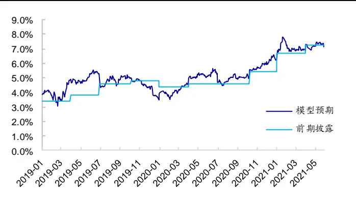
资料来源：Wind，海通证券研究所

图2 宁德时代公募持仓占比预期（日度对比）
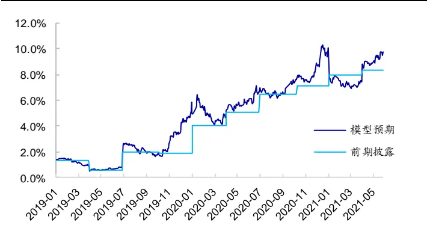
资料来源：Wind，海通证券研究所

图3 隆基股份公募持仓占比预期（日度对比）
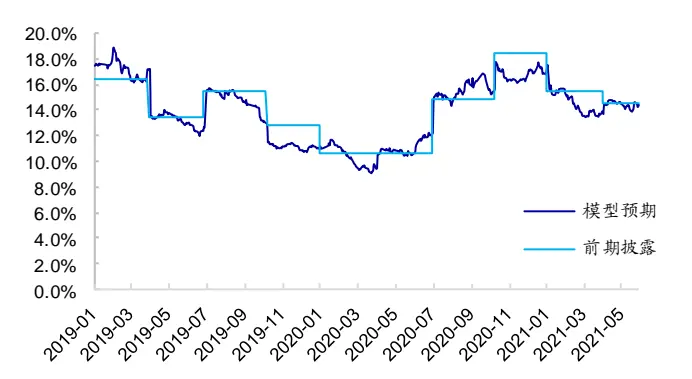
资料来源：Wind，海通证券研究所

图4 恒瑞医药公募持仓占比预期（日度对比）
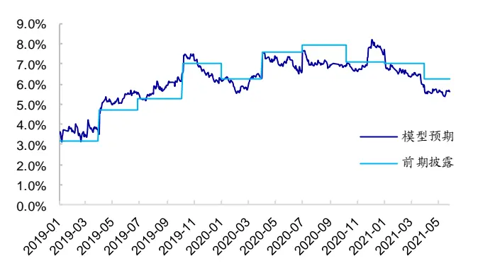
资料来源：Wind，海通证券研究所

观察上图不难发现，模型对于市场关注度较高、公募持仓占比较高的股票具有较强的拟合效果。在很多时点上，模型预估结果与实际披露结果较为接近。以上图中所展示的宁德时代为例，模型预期的公募持仓占比相比于 2021 年 1 季度出现了大幅提升。

## 1.2 行业跟踪结果

基于个股的公募持仓占比预期，我们可进一步合成得到行业的公募持仓占比预期。下图以部分行业为例，展示了模型对于相关行业的公募持仓占比预期。从一级行业的角度看，模型同样呈现出了较强的拟合效果。以下图为例， 年一季报以来，模型在电力设备及新能源以及有色金属两个行业上，预期有较高的公募持仓占比的提升。

图5 食品饮料公募持仓占比预期（日度对比）
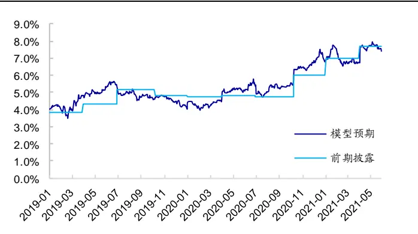
资料来源：Wind，海通证券研究所

图6 电力设备及新能源公募持仓占比预期（日度对比）
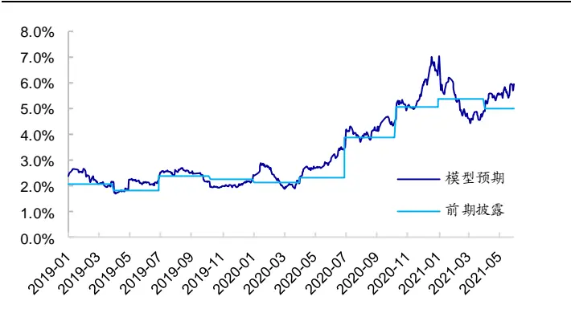
资料来源：Wind，海通证券研究所

图7 有色金属公募持仓占比预期（日度对比）
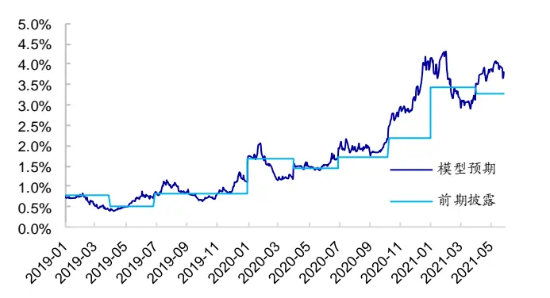
资料来源：Wind，海通证券研究所

图8 钢铁公募持仓占比预期（日度对比）
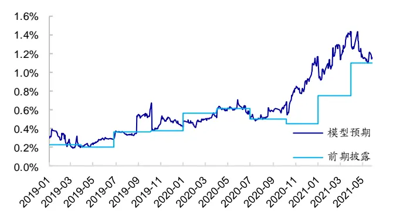
资料来源：Wind，海通证券研究所

## 2. 公募持仓预期的选股能力

为了能够利用公募持仓预期的选股能力，可考虑将其转化为选股因子。在构建选股因子时，可从以下几个角度出发：1）刻画个股当前预期持仓水平；2）刻画个股当前预期持仓水平相对于历史持仓水平的变化。

## 2.1 预期持仓占比因子

首先可考虑构建预期持仓占比因子，因子计算方法如下：

$$
所购样会占比_{i,t}=\log\left(\frac{所购样会会额_{i,t}}{总产值_{i,t}}\right)
$$

其中，预期持仓金额 为股票 在交易日 的公募预期持仓金额，总市值 为股票 在交 $^{\mathrm{i,t}}$ $^{\mathrm{i,t}}$ 易日 t的总市值。此处取对数是为了降低持仓金额原始值在分布上的偏度。

下表展示了因子在沪深 300 指数以及中证 800 指数内，原始因子月度 IC以及多空收益。考虑预期持仓占比因子与市值、估值、盈利以及股票短期涨幅存在一定的相关性，下表同样测试了因子在正交后的选股能力。

表 1 预期持仓占比因子月度选股能力（2015.01~2021.06）

| 选股空间 | 因子类型 | 因子名称 | 月均IC | 年化ICIR | 月度胜率 | 月均多空收益 | 月均多头超额收益 |
| --- | --- | --- | --- | --- | --- | --- | --- |
| 沪深 300 指数内 | 正交前 | 预期持仓占比 | 0.067 | 1.49 | 64% | 2.21% | 1.00% |
|  |  | 最新披露持仓占比 | 0.061 | 1.42 | 66% | 2.12% | 1.17% |
|  | 正交后 | 预期持仓占比 | 0.042 | 1.60 | 70% | 1.26% | 0.38% |
| 最新披露持仓占比 |  | 0.033 |  | 1.33 | 68% 0.92% | 0.12% |  |
| 中证 800 指数内 | 正交前 | 预期持仓占比 | 0.040 | 1.01 | 60% | 1.05% | 0.74% |
|  |  | 最新披露持仓占比 | 0.042 | 1.21 | 58% | 1.36% | 0.89% |
|  | 正交后 最新披露持仓占比 | 预期持仓占比 | 0.025 0.021 | 0.99 1.11 | 62% 58% | 0.53% 0.34% | 0.40% 0.04% |

资料来源：Wind，海通证券研究所

观察上表不难发现，预期持仓占比原始因子在沪深 指数内呈现出了较为显著的选股能力。预期持仓占比越高的股票，未来一个月超额收益表现越好。因子月均 IC 约为0.06。从多空收益的角度看，预期持仓占比因子在沪深 300 指数内同样展现出了较高的多空收益，因子年化多空收益为 27.1%，年化多头超额收益达 12.2%。对比使用最新披露持仓占比计算得到的因子，预期持仓占比在月均 IC、年化 ICIR、月度多空收益上表现更好。在正交处理后，预期持仓占比因子依旧展现出了一定的选股能力，因子在各方面皆强于最新披露持仓占比因子。预期持仓占比因子年化多空收益约为 16.0%，年化多头超额收益为 4.7%。

当将选股空间扩展为中证800后，原始因子以及正交因子的选股能力皆出现了下降。原始因子月均 IC从 0.06 下降至 0.04，正交因子月均 IC 从 0.04 下降至 0.02。此外，因子在月度胜率、月均多空收益以及月均多头超额收益等方面也出现了下降。

分年度来看，预期持仓占比原始因子在 2019 年以及 2020 年展现出了极强的多头超额收益，因子多头组合超额收益超 40%。在正交处理后，因子仅在 2019 年依旧有较为明显的多头超额收益。

图9 预期持仓占比因子分年度多头收益（沪深 300 指数内-正交前）
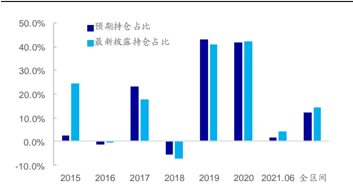
资料来源：Wind，海通证券研究所

图10 预期持仓占比因子分年度多头收益（沪深 300 指数内-正交后）
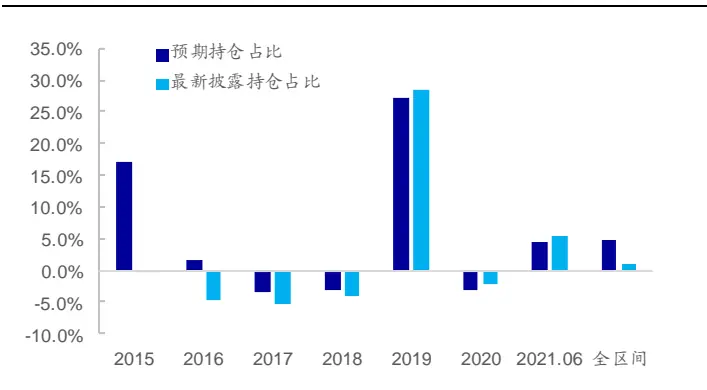
资料来源：Wind，海通证券研究所

## 2.2 预期持仓占比变化因子

除了刻画个股当前的公募持仓水平外，还可尝试刻画持仓占比的变化。因此，可构建预期持仓占比变化因子，刻画个股当前的预期持仓占比相对于一个季度之前已披露的持仓占比的变化，因子计算公式如下：

$$
预期样会占比变化_{i,t}=预期样会占比_{i,t}-已成惊样会占比_{i,t0}
$$

其中，预期持仓占比 为交易日 t股票 i的公募持仓占比预期，t0 为交易日 t向前一个季度对应的时点，已披露持仓占比 为交易日 t0股票 i已披露的公募持仓占比。下表展示了正交前后，因子在沪深 300指数以及中证 800 指数内的选股能力。

表 2 预期持仓占比变化因子月度选股能力（2015.01~2021.06）

| 选股空间 | 因子类型 | 因子名称 | 月均IC | 年化ICIR | 月度胜率 | 月均多空收益 | 月均多头超额收益 |
| --- | --- | --- | --- | --- | --- | --- | --- |
| 沪深 300 指数内 | 正交前 | 预期持仓占比变化 | 0.013 | 0.31 | 56% | 0.26% | 0.63% |
|  |  | 已披露持仓占比变化 | 0.028 | 0.81 | 56% | 0.94% | 0.96% |
|  | 正交后 | 预期持仓占比变化 | 0.020 | 0.75 | 57% | 0.87% | 0.99% |
|  |  | 已披露持仓占比变化 | 0.023 | 0.87 | 56% | 0.76% | 0.79% |
| 中证 800 指数内 | 正交前 | 预期持仓占比变化 | 0.007 | 0.23 | 53% | 0.25% | 0.61% |
|  |  | 已披露持仓占比变化 | 0.019 | 0.78 | 61% | 0.65% | 0.89% |
|  | 正交后 | 预期持仓占比变化 | 0.015 | 0.81 | 57% | 0.68% | 0.88% |
|  |  | 已披露持仓占比变化 | 0.015 | 0.82 | 58% | 0.52% | 0.75% |

资料来源： ，海通证券研究所

观察上表不难发现，预期持仓占比变化因子无论是在沪深 300 指数还是在中证 800指数内，皆未展现出显著的截面收益区分能力。值得注意的是，虽然因子组间收益单调性较差，但是多头组合依旧呈现出一定的收益性。下图分别展示了因子在沪深 300 指数内以及中证 800 指数内的分年度多头收益表现。

图11 预期持仓占比变化因子分年度多头收益（沪深 300 指数内）
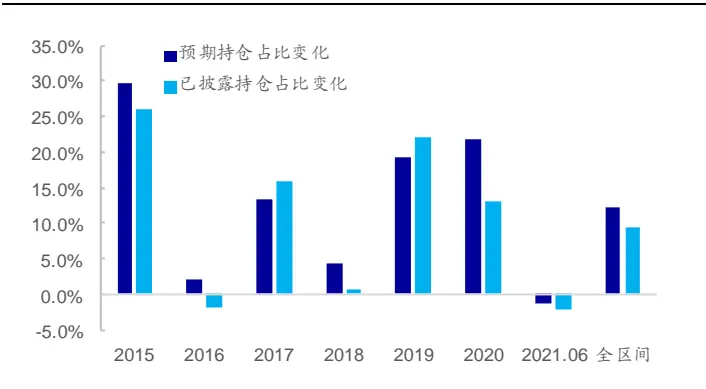
资料来源：Wind，海通证券研究所

图12 预期持仓占比变化因子分年度多头收益（中证 800 指数内）
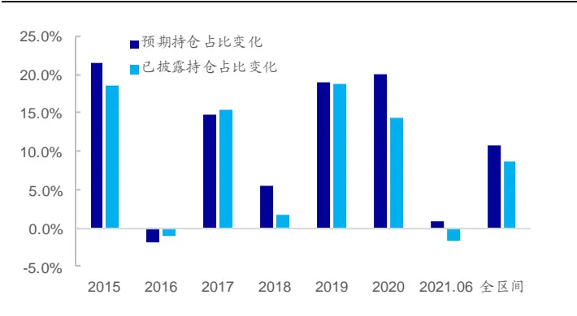
资料来源：Wind，海通证券研究所

## 2.3 本章小结

本章基于个股的公募持仓预期构建了选股因子，并测试了因子的选股效果。总体来看，预期持仓占比因子在沪深 指数内具有一定的选股能力，在剔除高相关的因子后，预期持仓占比因子依旧残余了一定的选股能力。因此，我们认为，可考虑用该因子替换基于历史披露数据计算得到的持仓占比因子。

除了持仓预期外，本章还尝试构建因子刻画持仓占比的变化。IC 以及 ICIR 结果均表明，该因子截面收益区分能力较弱，但多头组合具有较为明显的多头超额收益。因子在 2015 年、2017 年、2019 年以及 2020 年，皆呈现出较为明显的多头超额收益。

## 3. 基于公募基金持仓预期的行业轮动

## 3.1 行业轮动策略构建

考虑到基于个股的预期持仓占比，可向上合成行业的预期持仓占比，因此我们可围绕行业的预期持仓占比构建轮动策略。行业的预期持仓占比计算方法如下所示：

$$
存业预期样企业比=\frac{\sum_{k\in 存业}预期样企业额_{k,t}}{\sum_{k\in 存业段是}预期样企业额_{k,t}}
$$

其中，预期持仓金额 $^{\mathrm{k,t}}$ 为交易日 t股票 k 的公募持仓金额预期。

本章在使用行业预期持仓占比构建行业轮动策略时，主要从以下几个角度进行了尝试：

1）选择预期持仓占比高的行业；

2）选择预期持仓占比相比于 1 季度前已披露的持仓占比提升大的行业；

3）选择预期持仓占比相比于最新季报披露的持仓占比提升大的行业。

本章使用 2016 年以来的数据，回测了相关策略在月度调仓设定下的表现。策略每个月从 30 个行业中选取 5个行业为多头行业，5个行业为空头行业。在考察策略表现时，本章不仅计算了策略的多空收益以及相对于行业等权的超额收益，还与简单行业动量策略进行了对比。

## 3.2 策略 1：选择预期持仓占比较高的行业

基于策略 1 的核心思路，可计算行业的预期持仓占比，每月选择行业预期持仓占比最高的 5个行业作为多头行业，行业预期持仓占比最低的 5 个行业作为空头行业。下表对比展示了策略 1 以及部分行业动量策略在不同时段的收益表现。

表 3 策略 1 收益表现（2016.01~2021.06）

| 年份 | 策略1 |  | 已披露持仓占比 |  | 行业1个月动量 |  | 行业3个月动量 |  | 行业6个月动量 |  |
| --- | --- | --- | --- | --- | --- | --- | --- | --- | --- | --- |
|  | 多空收益 | 多头超额 | 多空收益 | 多头超额 | 多空收益 | 多头超额 | 多空收益 | 多头超额 | 多空收益 | 多头超额 |
| 2016 | -2.93% | -0.39% | -9.37% | -1.71% | -17.61% | -8.53% | -12.48% | -5.37% | -5.00% | -3.19% |
| 2017 | 23.37% | 21.75% | 22.68% | 20.80% | 10.55% | 7.78% | 14.14% | 6.13% | 20.26% | 8.88% |
| 2018 | 3.87% | 3.20% | 1.18% | 3.39% | -0.67% | -2.70% | 2.44% | 3.76% | 0.67% | 1.26% |
| 2019 | 32.70% | 18.61% | 34.56% | 20.01% | -8.81% | 1.90% | 11.31% | 12.11% | 8.98% | 9.96% |
| 2020 | 45.24% | 22.03% | 42.09% | 18.87% | 24.01% | 16.85% | 26.67% | 21.88% | 59.80% | 36.50% |
| 2021.06 | 4.33% | 7.38% | 0.96% | 4.13% | 12.06% | 6.11% | -4.12% | -3.97% | 2.99% | -3.94% |
| 全区间 | 16.96% | 11.67% | 14.12% | 10.40% | 2.41% | 2.47% | 5.28% | 4.94% | 13.33% | 6.88% |

资料来源：Wind，海通证券研究所

观察上表不难发现，策略 具有较好的收益表现。 年以来，策略年化多空收益达 16.96%，年化多头超额收益达 11.67%。与同期的行业动量策略相比，策略 1具有相对更强的多头收益。策略在 2017 年、2019 年以及 2020 年多头超额收益在 20%左右。此外，2021 年以来，策略 1 取得了 7.38%的多头超额收益。从胜率上看，策略 1的多头超额收益月度胜率为 63%，多空收益月度胜率为 62%。从回撤的角度看，策略 1的多头超额最大回撤为 5.7%，多空超额最大回撤为 11.6%。

下图进一步展示了策略 1 的净值走势。

图13 策略 1多头超额净值
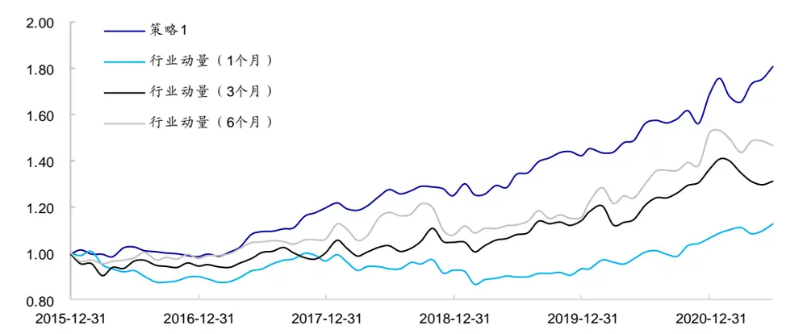
资料来源：Wind，海通证券研究所

除了收益风险特征外，还可以观察策略的换手特征。总体来看，策略 1 持仓较为稳定，月均换手率为 5%，平均年化换手率为 60%。

图14 策略 1多头组合换手率
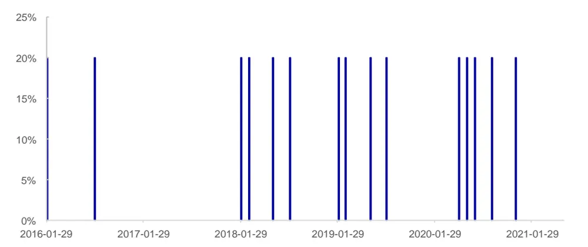
资料来源：Wind，海通证券研究所

下表展示了 2021 年以来，策略 1的行业选择结果以及该行业在当月的收益排序。观察策略持仓不难发现，策略持仓较为稳定，2021 年以来并未发生明显变化。

表 4 2021年策略 1多头行业

| 年月 | 行业名称 |  |  |  |
| --- | --- | --- | --- | --- |
| 2021.01 | 电力设备及新能源(5) | 医药(12) 食品饮料(10) | 银行(2) | 电子(13) |
| 2021.02 | 电力设备及新能源(29) | 医药(23) 食品饮料(28) | 银行(13) | 电子(26) |
| 2021.03 | 电力设备及新能源(17) | 医药(15) 食品饮料(21) | 银行(7) | 电子(26) |
| 2021.04 | 电力设备及新能源(4) | 医药(1) 食品饮料(6) | 银行(24) | 电子(5) |
| 2021.05 | 电力设备及新能源(7) | 医药(15) 食品饮料(6) | 银行(14) | 电子(20) |
| 2021.06 | 电力设备及新能源(1) | 医药(14) 食品饮料(25) | 银行(22) | 电子(2) |
| 2021.07 | 电力设备及新能源 | 医药 食品饮料 | 银行 | 电子 |

资料来源：Wind，海通证券研究所

## 3.3 策略 2：选择预期持仓占比相比于 1季度前已披露持仓占比变化高的行业

对于策略 2，可计算行业当前的预期持仓占比与 1个季度之前已披露持仓占比之间的变化，并选择持仓占比上升幅度最高的 5个行业作为多头组合，持仓占比上升幅度最低的 5个行业作为空头组合。持仓占比变化计算公式如下：

$$
存业预期样会占比变化_{i,t}=存业预期样会占比_{i,t}-存业已我忘样会占比_{i,t0}
$$

其中，行业预期持仓占比 为交易日 t 行业 i的预期持仓占比，t0 为交易日 t向前一个季度对应的时点，行业已披露持仓占比 为交易日 t0 行业 i的已披露持仓占比。

下表对比展示了策略 2以及部分行业动量策略在不同时段的收益表现。

表 5 策略 2 收益表现（2016.01~2021.06）

| 年份 | 策略2 |  | 已披露持仓占比变化 |  | 行业1个月动量 |  | 行业3个月动量 |  | 行业6个月动量 |  |
| --- | --- | --- | --- | --- | --- | --- | --- | --- | --- | --- |
|  | 多空收益 | 多头超额 | 多空收益 | 多头超额 | 多空收益 | 多头超额 | 多空收益 | 多头超额 | 多空收益 | 多头超额 |
| 2016 | 8.26% | 0.19% | -1.52% | -3.21% | -17.61% | -8.53% | -12.48% | -5.37% | -5.00% | -3.19% |
| 2017 | 20.65% | 10.58% | 29.06% | 15.56% | 10.55% | 7.78% | 14.14% | 6.13% | 20.26% | 8.88% |
| 2018 | 7.16% | 6.35% | -10.52% | -3.85% | -0.67% | -2.70% | 2.44% | 3.76% | 0.67% | 1.26% |
| 2019 | 1.87% | 10.17% | 15.30% | 12.43% | -8.81% | 1.90% | 11.31% | 12.11% | 8.98% | 9.96% |
| 2020 | 29.84% | 19.62% | 19.42% | 16.68% | 24.01% | 16.85% | 26.67% | 21.88% | 59.80% | 36.50% |
| 2021.06 | 10.46% | 3.84% | 7.58% | -0.42% | 12.06% | 6.11% | -4.12% | -3.97% | 2.99% | -3.94% |
| 全区间 | 13.96% | 8.55% | 8.56% | 5.01% | 2.41% | 2.47% | 5.28% | 4.94% | 13.33% | 6.88% |

资料来源： ，海通证券研究所

观察上表可知，2016 年以来，策略 2 同样呈现出了一定收益性，策略年化多空收益为 13.96%，年化多头超额收益为 8.55%，多头收益占比相对较高。此外，策略在 2017年、2019 年以及 2020 年也取得了 10%以上的多头超额收益。2021 年以来，策略取得了 3.84%的多头超额收益。

从胜率上看，策略 2的多头超额收益月度胜率为 72%，多空收益月度胜率为 63%。从回撤上看，策略 2的多头超额最大回撤为 6.9%，多空超额最大回撤为 11.2%。

下图进一步展示了策略 2 的净值走势。

图15 策略 2多头超额净值
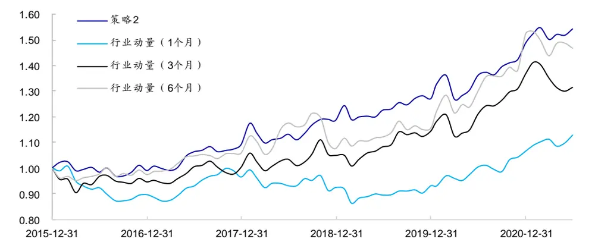
资料来源：Wind，海通证券研究所

除了收益风险特征外，还可以观察策略的换手特征。总体来看，策略 2 换手略高于策略 1，月均换手率为 34%，平均年化换手率为 408%。

图16 策略 2多头组合换手率
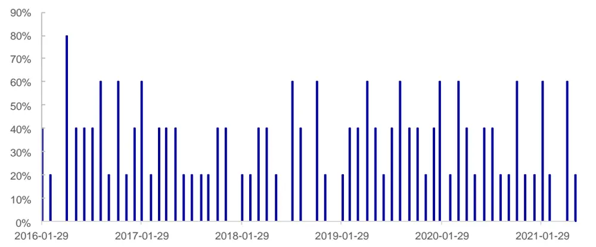
资料来源：Wind，海通证券研究所

下表展示了 2021 年以来，策略 2的行业选择结果以及该行业在当月的收益排序。

表 6 2021年策略 2多头行业

| 年月 | 行业名称 |  |  |  |  |
| --- | --- | --- | --- | --- | --- |
| 2021.01 | 电力设备及新能源(5) | 国防军工(28) | 汽车(7) | 食品饮料(10) | 银行(2) |
| 2021.02 | 石油石化(5) | 有色金属(4) | 基础化工(10) | 食品饮料(28) | 银行(13) |
| 2021.03 | 石油石化(28) | 有色金属(30) | 基础化工(23) | 消费者服务(11) | 银行(7) |
| 2021.04 | 石油石化(16) | 有色金属(2) | 基础化工(9) | 消费者服务(15) | 银行(24) |
| 2021.05 | 电力及公用事业(12) | 基础化工(4) | 医药(15) | 银行(14) | 电子(20) |
| 2021.06 | 基础化工(5) | 医药(14) | 食品饮料(25) | 银行(22) | 电子(2) |
| 2021.07 | 基础化工 | 电力设备及新能源 | 汽车 | 医药 | 电子 |

资料来源：Wind，海通证券研究所

## 3.4 策略 3：选择预期持仓占比与最新季报披露的持仓占比差值较大的行业

对于策略 3，可计算行业当前的预期持仓占比与最新季报披露的持仓占比之间的差值，并选择差值最高的 5 个行业作为多头组合，差值最低的 5个行业作为空头组合。预期持仓占比差的计算公式如下：

$$
存业预期待会占比_{i,t}=存业预期待会占比_{i,t}-存业最新平预期富的待会占比_{i,t}
$$

其中，行业预期持仓占比 为交易日 t 行业 i的预期持仓占比，行业最新季报披露的持仓 $^{\mathrm{i,t}}$ 占比 $^{\mathrm{i,t}}$ 为交易日 t 行业 i最新季报披露的公募基金持仓占比。

下表对比展示了策略 3以及部分行业动量策略在不同时段的收益表现。

表 7 策略 3 收益表现（2016.01~2021.06）

| 年份 | 策略3 |  | 行业1个月动量 |  | 行业3个月动量 |  | 行业6个月动量 |  |
| --- | --- | --- | --- | --- | --- | --- | --- | --- |
|  | 多空收益 | 多头超额 | 多空收益 | 多头超额 | 多空收益 | 多头超额 | 多空收益 | 多头超额 |
| 2016 | 7.16% | 1.42% | -17.61% | -8.53% | -12.48% | -5.37% | -5.00% | -3.19% |
| 2017 | 7.38% | 5.88% | 10.55% | 7.78% | 14.14% | 6.13% | 20.26% | 8.88% |
| 2018 | 21.95% | 14.38% | -0.67% | -2.70% | 2.44% | 3.76% | 0.67% | 1.26% |
| 2019 | -18.02% | 1.52% | -8.81% | 1.90% | 11.31% | 12.11% | 8.98% | 9.96% |
| 2020 | 21.62% | 20.02% | 24.01% | 16.85% | 26.67% | 21.88% | 59.80% | 36.50% |
| 2021.06 | 15.59% | 9.42% | 12.06% | 6.11% | -4.12% | -3.97% | 2.99% | -3.94% |
| 全区间 | 12.01% | 9.70% | 2.41% | 2.47% | 5.28% | 4.94% | 13.33% | 6.88% |

资料来源： ，海通证券研究所

观察上表可知，2016 年以来，策略 3 多头收益较为明显，策略多空年化收益为，多头年化超额收益为 ，多头收益占比较高。策略虽然在 年超额收益偏弱，但是在 年取得了 以上的多头超额收益。 年以来，策略取得了9.42%的多头超额收益。

从胜率上看，策略 3的多头超额收益月度胜率为 57%，多空收益月度胜率为 57%。从回撤上看，策略 3的多头超额最大回撤为 9.4%，多空超额最大回撤为 19.5%。

下图进一步展示了策略 3 的净值走势。

图17 策略 3多头超额净值
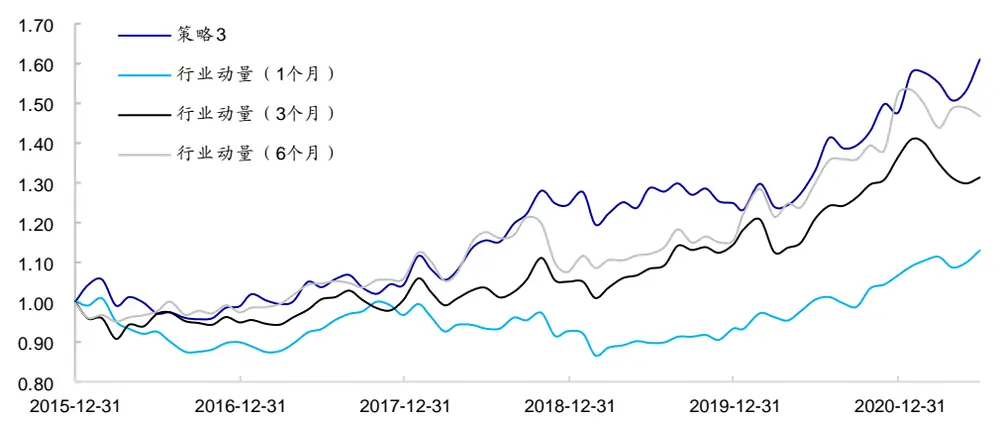
资料来源：Wind，海通证券研究所

除了收益风险特征外，还可以观察策略的换手特征。总体来看，策略 3与策略 2换手率较为接近，月均换手率为 33%，年化换手率为 396%。

图18 策略 3多头组合换手率
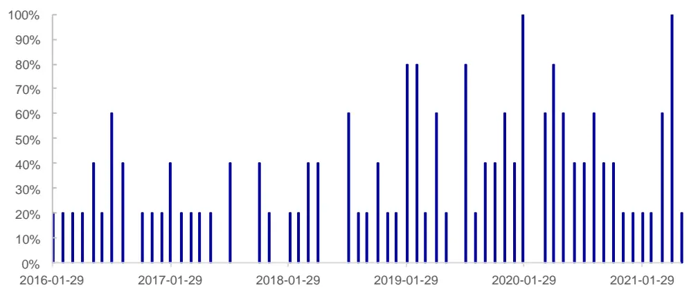
资料来源：Wind，海通证券研究所

下表展示了 2021 年以来，策略 3的行业选择结果以及该行业在当月的收益排序。观察策略持仓不难发现，策略 3 在 2021 年 1月、5月以及 6月皆选出了表现相对较好的行业。

表 8 2021年策略 3多头行业

| 年月 | 行业名称 |  |  |  |  |
| --- | --- | --- | --- | --- | --- |
| 2021.01 | 石油石化(1) | 有色金属(4) | 基础化工(3) | 汽车(7) | 银行(2) |
| 2021.02 | 石油石化(5) | 基础化工(10) | 汽车(30) | 银行(13) | 交通运输(14) |
| 2021.03 | 石油石化(28) | 基础化工(23) | 银行(7) | 房地产(19) | 交通运输(12) |
| 2021.04 | 石油石化(16) | 电力及公用事业(30) | 钢铁(3) | 建筑(29) | 银行(24) |
| 2021.05 | 有色金属(5) | 基础化工(4) | 电力设备及新能源(7) | 汽车(9) | 医药(15) |
| 2021.06 | 有色金属(23) | 基础化工(5) | 电力设备及新能源(1) | 汽车(3) | 医药(14) |
| 2021.07 | 有色金属 | 基础化工 | 电力设备及新能源 | 汽车 | 电子 |

资料来源： ，海通证券研究所

## 4. 总结

本文在系列前期报告《高频数据应用系列研究（一）——使用高频数据跟踪核心资产的公募基金持仓变化》的基础上，进一步探讨了公募基金持仓预期在选股以及行业轮动策略中的应用。

从选股的角度来看，正交前后，预期持仓占比因子在沪深 指数内都展现出了较为显著的选股能力。而且，相比于已披露持仓占比，预期持仓占比因子的选股能力更强。值得注意的是，预期持仓占比变化因子并未呈现出显著的截面收益区分能力。但是因子多头效应较强，多头组合展现出了较高的超额收益。

从行业轮动的角度看，行业预期持仓占比具有较为明显的行业轮动能力，策略多头超额收益较为明显，且强于同期行业动量策略。此外，行业预期持仓占比变化、行业预期持仓占比与最新季报披露的持仓占比差值，也呈现出一定的行业轮动能力。

## 5. 风险提示

市场系统性风险、资产流动性风险以及政策变动风险会对策略表现产生较大影响。

## 信息披露

分析师声明

[Table冯佳睿ys金融工程研究团队ts]

袁林青金融工程研究团队

本人具有中国证券业协会授予的证券投资咨询执业资格，以勤勉的职业态度，独立、客观地出具本报告。本报告所采用的数据和信息均来自市场公开信息，本人不保证该等信息的准确性或完整性。分析逻辑基于作者的职业理解，清晰准确地反映了作者的研究观点，结论不受任何第三方的授意或影响，特此声明。

## 法律声明

。本公司不会因接收人收到本报告而视其为客户。在任何情况下，

本报告中的信息或所表述的意见并不构成对任何人的投资建议。在任何情况下，本公司不对任何人因使用本报告中的任何内容所引致的任何损失负任何责任。

本报告所载的资料、意见及推测仅反映本公司于发布本报告当日的判断，本报告所指的证券或投资标的的价格、价值及投资收入可能会波动。在不同时期，本公司可发出与本报告所载资料、意见及推测不一致的报告。

市场有风险，投资需谨慎。本报告所载的信息、材料及结论只提供特定客户作参考，不构成投资建议，也没有考虑到个别客户特殊的投资目标、财务状况或需要。客户应考虑本报告中的任何意见或建议是否符合其特定状况。在法律许可的情况下，海通证券及其所属关联机构可能会持有报告中提到的公司所发行的证券并进行交易，还可能为这些公司提供投资银行服务或其他服务。

本报告仅向特定客户传送，未经海通证券研究所书面授权，本研究报告的任何部分均不得以任何方式制作任何形式的拷贝、复印件或复制品，或再次分发给任何其他人，或以任何侵犯本公司版权的其他方式使用，所有本报告中使用的商标、服务标记及标记均为本公司的商标、服务标记及标记，如欲引用或转载本文内容，务必联络海通证券研究所并获得许可，并需注明出处为海通证券研究所，目不得对本文进行有悖原意的引用和删改。

根据中国证监会核发的经营证券业务许可，海通证券股份有限公司的经营范围包括证券投资咨询业务。

## 海通证券股份有限公司研究所[Table_PeopleInfo]

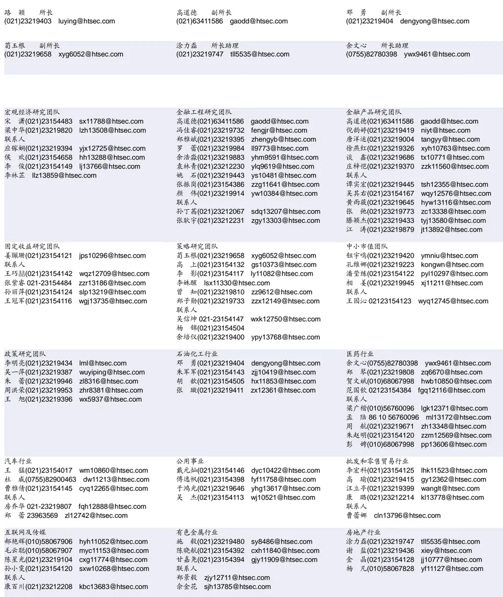

| 电子行业 | 煤炭行业 |  | 电力设备及新能源行业 张一弛(021)23219402 |  |
| --- | --- | --- | --- | --- |
| 朱劲松(010)50949926 zjs10213@htsec.com 李 轩(021)23154652 lx12671@htsec.com 刘 溢(021)23219748 ly12337@htsec.com 联系人 肖隽翀 021-23154139 xjc12802@htsec.com 文 灿 wc13799@htsec.com | 李 淼(010)58067998 戴元灿(021)23154146 王 涛(021)23219760 吴 杰(021)23154113 | Im10779@htsec.com dyc10422@htsec.com wt12363@htsec.com wj10521@htsec.com | 房 青(021)23219692 曾 彪(021)23154148 徐柏乔(021)23219171 张 磊(021)23212001 联系人 ywz13822@htsec.com | zyc9637@htsec.com fangq@htsec.com zb10242@htsec.com xbq6583@htsec.com zl10996@htsec.com |
| 薛逸民 xym13863@htsec.com 基础化工行业 刘 威(0755)82764281 Iw10053@htsec.com 刘海荣(021)23154130 Ihr10342@htsec.com 张翠翠(021)23214397 zcc11726@htsec.com 孙维容(021)23219431 swr12178@htsec.com 李 智(021)23219392 lz11785@htsec.com 杨 蒙(0755)23617756 | 计算机行业 郑宏达(021)23219392 zhd10834@htsec.com 杨 林(021)23154174 yl11036@htsec.com 于成龙(021)23154174 ycl12224@htsec.com 黄竞晶(021)23154131 hjj10361@htsec.com 洪 琳(021)23154137 hl11570@htsec.com 联系人 |  | 姚望洲(021)23154184 通信行业 朱劲松(010)50949926 余伟民(010)50949926 张峥青(021)23219383 联系人 杨彤昕 010-56760095 夏 凡(021)23154128 |  |
| ym13254@htsec.com 非银行金融行业 孙 婷(010)50949926 st9998@htsec.com 何 婷(021)23219634 ht10515@htsec.com 李芳洲(021)23154127 Ifz11585@htsec.com 联系人 | 交通运输行业 虞 楠(021)23219382 yun@htsec.com 罗月江(010）56760091 lyj12399@htsec.com 陈 宇(021)23219442 cy13115@htsec.com |  | 纺织服装行业 梁 希(021)23219407 lx11040@htsec.com 盛 开(021)23154510 sk11787@htsec.com |  |
| 任广博(010)56760090 rgb12695@htsec.com 建筑建材行业 冯晨阳(021)23212081 fcy10886@htsec.com 潘莹练(021)23154122 pyl10297@htsec.com 申 浩(021)23154114 sh12219@htsec.com 吉 晟(021)23154653 js12801@htsec.com | 机械行业 余炜超(021)23219816 swc11480@htsec.com 周 丹 zd12213@htsec.com |  | 钢铁行业 刘彦奇(021)23219391 liuyq@htsec.com 周慧琳(021)23154399 zhl11756@htsec.com |  |
| 颜慧菁 yhj12866@htsec.com 建筑工程行业 张欣劼 zxj12156@htsec.com 闻宏伟(010)58067941 whw9587@htsec.com | 赵玥炜(021)23219814 zyw13208@htsec.com 联系人 赵靖博(021)23154119 zjb13572@htsec.com 农林牧渔行业 丁 频(021)23219405 dingpin@htsec.com |  | 食品饮料行业 |  |
| 军工行业 张恒晅 zhx10170@htsec.com 孙 婷(010)50949926 st9998@htsec.com | 陈 阳(021)23212041 cy10867@htsec.com 刘丛丛(021)23219164 Icc13806@htsec.com 联系人 孟亚琦(021)23154396 myq12354@htsec.com 银行行业 |  | 颜慧菁 yhj12866@htsec.com 张宇轩(021)23154172 zyx11631@htsec.com 程碧升(021)23154171 cbs10969@htsec.com 社会服务行业 汪立亭(021)23219399 wanglt@htsec.com |  |
| 联系人 刘砚菲 021-2321-4129 lyf13079@htsec.com 家电行业 陈子仪(021)23219244 chenzy@htsec.com 汪立亭(021)23219399 wanglt@htsec.com | 解巍巍 xww12276@htsec.com 林加力(021)23154395 ljl12245@htsec.com 联系人 董栋梁(021) 23219356 ddl13026@htsec.com 造纸轻工行业 |  | 许樱之(755)82900465 xyz11630@htsec.com 联系人 毛弘毅(021)23219583 mhy13205@htsec.com |  |
| 李 阳(021)23154382 ly11194@htsec.com 赵 洋(021)23154126 zy10340@htsec.com 朱默辰(021)23154383 zmc11316@htsec.com 郭庆龙 gql13820@htsec.com 刘 璐(021)23214390 II11838@htsec.com 联系人 柳文韬(021)23219389 Iwt13065@htsec.com |  |  |  |  |

深广地区销售团队

伏财勇(0755)23607963 fcy7498@htsec.com

蔡铁清(0755)82775962 ctq5979@htsec.com

辜丽娟(0755)83253022 gulj@htsec.com

刘晶晶(0755)83255933 liujj4900@htsec.com

饶 伟(0755)82775282 rw10588@htsec.com

欧阳梦楚(0755)23617160

oymc11039@htsec.com

巩柏含 gbh11537@htsec.com

滕雪竹 txz13189@htsec.com

上海地区销售团队
胡雪梅(021)23219385 huxm@htsec.com
黄 诚(021)23219397 hc10482@htsec.com
季唯佳(021)23219384 jiwj@htsec.com
黄 毓(021)23219410 huangyu@htsec.com
李 寅 021-23219691 ly12488@htsec.com
漆冠男(021)23219281 qgn10768@htsec.com
胡宇欣(021)23154192 hyx10493@htsec.com
马晓男 mxn11376@htsec.com
邵亚杰 23214650 syj12493@htsec.com
杨祎昕(021)23212268 yyx10310@htsec.com
毛文英(021)23219373 mwy10474@htsec.com
王朝领 wcl11854@htsec.com
张思宇 zsy11797@htsec.com北京地区销售团队
朱 健(021)23219592 zhuj@htsec.com
殷怡琦(010)58067988 yyq9989@htsec.com郭 楠 010-5806 7936 gn12384@htsec.com杨羽莎(010)58067977 yys10962@htsec.com董晓梅 dxm10457@htsec.com
张丽萱(010)58067931 zlx11191@htsec.com郭金垚(010)58067851 gjy12727@htsec.com张钧博 zjb13446@htsec.com
高 瑞 gr13547@htsec.com

海通证券股份有限公司研究所

地址：上海市黄浦区广东路 689号海通证券大厦 9楼

电话：（021）23219000

传真：（021）23219392

网址：www.htsec.com