2021 年 09 月 24 日

## 金融工程研究团队

魏建榕（首席分析师）

证书编号：S0790519120001

张 翔（分析师）

证书编号：S0790520110001

傅开波（分析师）

证书编号：S0790520090003

## 高 鹏（分析师）

证书编号：S0790520090002

## 苏俊豪（研究员）

证书编号：S0790120020012

## 胡亮勇（研究员）

证书编号：S0790120030040

## 王志豪（研究员）

证书编号：S0790120070080

## 盛少成（研究员）

证书编号：S0790121070009

## 苏 良（研究员）

证书编号：S0790121070008

## 相关研究报告

《金融工程专题-分析师目标价的Alpha 信息》-2021.9.14

《金融工程定期-北上资金行为画像

（2021 年 9 月 13 日）》-2021.9.13

《金融工程定期-量化基金业绩简报

（2021 年 9 月 12 日）》-2021.9.12

## 独家量价因子的高频测试

# ——开源量化评论（36）

## 魏建榕（分析师）

傅开波（分析师）

weijianrong@kysec.cn

fukaibo@kysec.cn

证书编号：S0790519120001

证书编号：S0790520090003

## ⚫ 2021年大小市值切换，量化基金相对主动权益基金打了“翻身仗”

“大小市值切换”无疑是2021 年以来投资者最为明显之感受之一。2016年开始的以大盘股占优的行情在2021年春节后彻底哑火，市值风格正向中小盘切换。2021 年来以沪深 300 所表征的大盘蓝筹，其成分股成交额占全市场成交额明显下滑，而以中证 500 和中证 1000 所表征的中小盘股，其成交活跃度有了一定程度的提升。

从 7月21日起，A 股成交额已连续 45个交易日连破万亿，市场交易情绪明显升温，量化交易在A 股交易量占比情况成为近期市场关注的热门话题。

## ⚫ 独家因子在高频环境下仍表现优异

开源金工独家量价因子包括主动买卖、聪明钱、理想振幅、APM、理想反转、大单资金流、小单资金流和长端动量因子。

从因子相关矩阵可以看到，大部分因子间的相关性并不高，尤其是长端动量因子；理想振幅因子与聪明钱因子具有一定正相关性（0.34），大单资金流因子与小单资金流因子具有高度负相关性（-0.63）。

## 因子高频测试的五大结论：

（1）8个量价因子的测试频率从月频提升至更高频下，仍具有高夏普比率；

（2）三种测试频率下的因子整体效果，双周频>周频>月频；

（3）大单资金流、长端动量因子在三种频率下的多头表现均优异；

（4）大单资金流、理想振幅、聪明钱在三种频率下的多空表现均优异。

（5）8 个因子的多空净值均在创历史新高，而长端动量、大单资金流因子的多头净值创历史新高。

## ⚫ 复合因子在多头端及多空端均显著优于原始因子

考虑到因子相关性，我们选取 6 个因子（主动买卖、理想振幅、APM、理想反转、大单资金流和长端动量）进行复合。

以周频为例，复合因子无论是在多头端还是多空端均优于各原始因子。

⚫ 风险提示：模型测试基于历史数据，市场未来可能发生变化。

## 1、 2021年大小市值切换，量化基金终于打了“翻身仗”

“大小市值切换”无疑是2021年以来投资者最为明显之感受之一。2016年开始的以大盘股占优的行情在2021年春节后彻底哑火，市值风格正向中小盘切换。

2021年来以沪深300所表征的大盘蓝筹，其成分股成交额占全市场成交额明显下滑，而以中证500和中证1000所表征的中小盘股，其成交活跃度有了一定程度的提升（图1绿色框部分所示）。

从 7 月 21 日起，A 股成交额已连续 45 个交易日连破万亿（图 2），市场交易情绪明显升温，量化产品“高调”回归到投资者的视野。量化交易在 A 股交易量占比情况成为近期市场关注的热门话题。

高频是量化投资最为特色的投资战场之一，以量价为代表的高换手因子在近期的表现着实亮眼。而开源金工独家量价因子库有不少受业内关注的量价因子，前期的应用频率主要是月频。本篇，我们将尝试探索因子在更高频下的表现结果。

图1：重要指数成分股成交额占比：2021 年以来，中证500和中证 1000成交占比上升，沪深 300成交占比下降
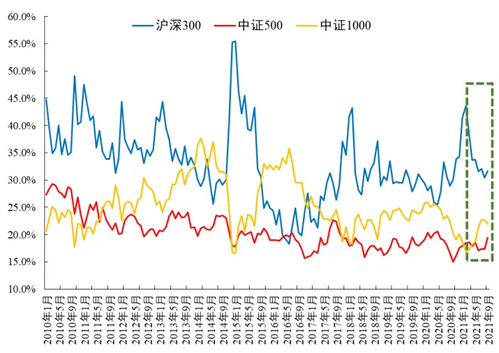
数据来源：Wind、开源证券研究所

图2：从 7月 21日起，A股成交额已连续 43个交易日连破万亿
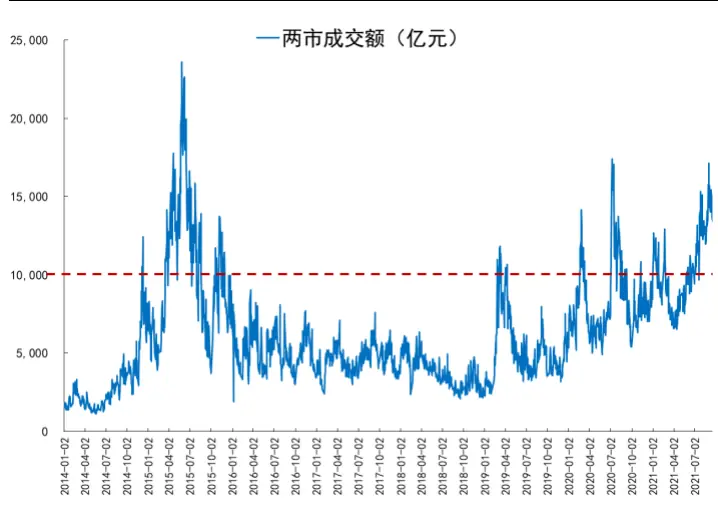
数据来源：Wind、开源证券研究所

## 2、 独家因子在高频环境下仍表现优异

开源金工独家量价因子包括主动买卖、聪明钱、理想振幅、APM、理想反转、大单资金流、小单资金流和长端动量因子1。

从因子相关矩阵可以看到，大部分因子间的相关性并不高，尤其是长端动量因子；理想振幅因子与聪明钱因子具有一定正相关性（0.34），大单资金流因子与小单资金流因子具有高度负相关性（-0.63）。

图3：因子相关性分析：理想振幅与聪明钱有一定正相关（0.341），大单资金流与小单资金流高度负相关（-0.629）

| 主动买卖 聪明钱 |  | 理想振幅 | APM 理想反转 大单资金流 小单资金流 长端动量 |  |  |
| --- | --- | --- | --- | --- | --- |
| 主动买卖 | -0.156 | -0.211 | -0.109 -0.229 0.298 | -0.219 | 0.028 |
| 聪明钱 |  | 0.341 | -0.020 0.149 -0.081 | 0.049 | -0.025 |
| 理想振幅 |  |  | -0.119 0.266 -0.114 | 0.042 | -0.080 |
| APM |  |  | -0.021 -0.097 | 0.106 | 0.056 |
| 理想反转 |  |  | -0.180 | 0.111 | -0.071 |
| 大单资金流 |  |  |  | -0.629 | 0.048 |
| 小单资金流 |  |  |  |  | -0.005 |
| 长端动量 |  |  |  |  |  |

数据来源：Wind、开源证券研究所

我们对这8个因子进行周频、双周频、月频的因子测试2。图4至图7为因子在四种频率下的因子绩效汇总。从图表中有以下结论：

（1）8个量价因子的测试频率从月频提升至更高频下，仍具有高夏普比率；

（2）三种测试频率下的因子整体效果，双周频>周频>月频；

（3）大单资金流、长端动量因子在三种频率下的多头表现均优异；

（4）大单资金流、理想振幅、聪明钱在三种频率下的多空表现均优异。

图4：单因子测试：周频下，多头端大单资金流、长端动量、小单资金流的收益波动比位列前三

| 指标 |  | 主动买卖 | 聪明钱 | 理想振幅 | APM | 理想反转 | 长端动量 | 大单资金流 小单资金流 |  |
| --- | --- | --- | --- | --- | --- | --- | --- | --- | --- |
| 整体 | IC均值 rankIC均值 | 0.016 0.037 | -0.022 -0.053 | -0.031 -0.061 | 0.019 0.023 | -0.024 -0.052 | 0.014 | 0.025 | -0.020 -0.034 |
|  | 年化ICIR | 1.86 | -2.49 | -2.97 | 2.83 | -2.29 | 0.023 1.28 | 0.045 2.76 | -2.18 |
| 多空对冲 | 年化收益率 收益波动比 | 13.60% 2.08 | 21.85% 2.49 | 26.56% 2.92 | 12.62% 1.99 | 17.23% 1.98 | 15.29% 1.67 | 23.05% 2.95 | 15.83% 1.88 |
| 多头 | 年化收益率 收益波动比 月均换手率 | 28.05% 1.08 143.5% | 25.66% 0.89 269.7% | 30.06% 1.06 210.0% | 26.25% 0.94 151.7% | 29.43% 1.08 203.2% | 35.22% 1.21 68.9% | 31.28% 1.25 128.5% | 28.36% 1.15 128.6% |

数据来源：Wind、开源证券研究所

图5：单因子测试：双周频下，多头端大单资金流、长端动量、小单资金流的收益波动比位列前三

| 指标 |  | 主动买卖 | 聪明钱 | 理想振幅 | APM | 理想反转 | 长端动量 | 大单资金流 小单资金流 |  |
| --- | --- | --- | --- | --- | --- | --- | --- | --- | --- |
| 整体 | IC均值 | 0.025 | -0.027 | -0.041 | 0.022 | -0.034 | 0.023 | 0.035 | -0.027 |
|  | rankIC均值 | 0.053 | -0.063 | -0.075 | 0.030 | -0.065 | 0.033 | 0.062 | -0.047 |
|  | 年化ICIR | 2.11 | -2.12 | -2.60 | 2.34 | -2.20 | 1.39 | 2.57 | -1.89 |
| 多空对冲 | 年化收益率 收益波动比 | 15.82% | 23.34% | 27.69% | 10.70% | 17.87% | 19.04% | 22.54% | 13.36% |
|  | 年化收益率 | 2.35 34.44% | 2.93 34.01% | 3.05 36.68% | 1.66 | 2.00 | 1.83 | 2.84 | 1.41 |
| 多头 | 收益波动比 | 1.33 | 1.20 | 1.28 | 30.78% 1.10 | 35.28% 1.28 | 41.72% 1.44 | 35.35% 1.45 | 32.60% 1.35 |
|  | 月均换手率 | 103.3% | 154.0% | 129.4% | 105.1% | 127.5% | 45.3% | 91.4% | 91.9% |

数据来源：Wind、开源证券研究所

图6：单因子测试：月频下，多头端长端动量、大单资金流、主动买卖的收益波动比位列前三

| 指标 |  | 主动买卖 | 聪明钱 | 理想振幅 | APM | 理想反转 | 长端动量 | 大单资金流 小单资金流 |  |
| --- | --- | --- | --- | --- | --- | --- | --- | --- | --- |
| 整体 | IC均值 | 0.032 | -0.038 | -0.051 | 0.024 | -0.048 | 0.036 | 0.040 | -0.026 |
|  | rankIC均值 | 0.063 | -0.072 | -0.083 | 0.033 | -0.076 | 0.044 | 0.072 | -0.050 |
|  | 年化ICIR | 1.86 | -2.61 | -2.43 | 2.01 | -2.03 | 1.40 | 2.21 | -1.38 |
| 多空对冲 | 年化收益率 | 13.47% | 22.38% | 22.72% | 10.01% | 16.00% | 19.17% | 15.32% | 4.47% |
|  | 收益波动比 | 1.68 | 2.64 | 2.35 | 1.36 | 1.62 | 1.65 | 1.75 | 0.41 |
| 多头 | 年化收益率 | 30.55% | 33.02% | 31.60% | 29.19% | 31.48% | 37.15% | 28.88% | 26.10% |
|  | 收益波动比 | 1.07 | 1.01 | 1.01 | 0.96 | 1.07 | 1.17 | 1.08 | 0.97 |
|  | 月均换手率 | 71.2% | 78.7% | 77.7% | 73.9% | 77.1% | 32.0% | 67.4% | 67.3% |

数据来源：Wind、开源证券研究所

以周频为例，图8至图 15为在周频下的因子分组和多空净值曲线。从图中可以看到，这 8 个因子的多空净值均在近期创历史新高，而长端动量、大单资金流因子的多头净值创历史新高。

图7：周频下，主动买卖因子的多空收益波动比2.08
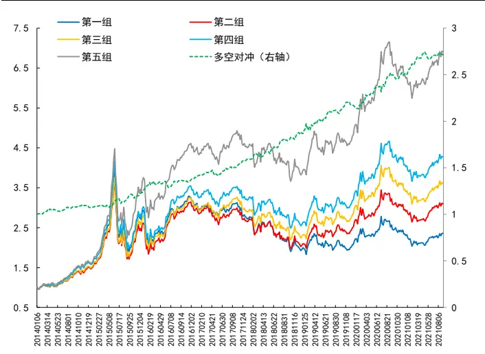
数据来源：Wind、开源证券研究所

图8：周频下，聪明钱因子的多空收益波动比2.49
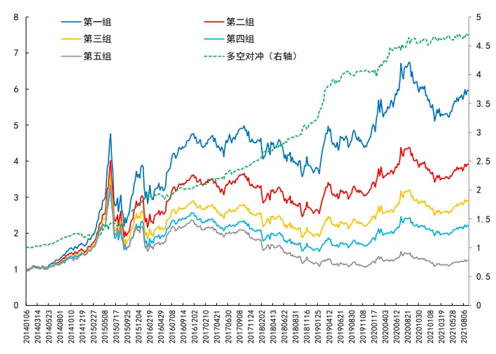
数据来源：Wind、开源证券研究所

图9：周频下，APM因子的多空收益波动比1.99
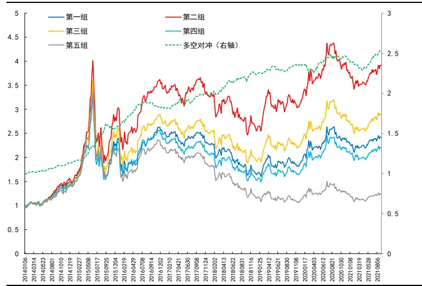
数据来源：Wind、开源证券研究所

图10：周频下，理想反转因子的多空收益波动比1.98
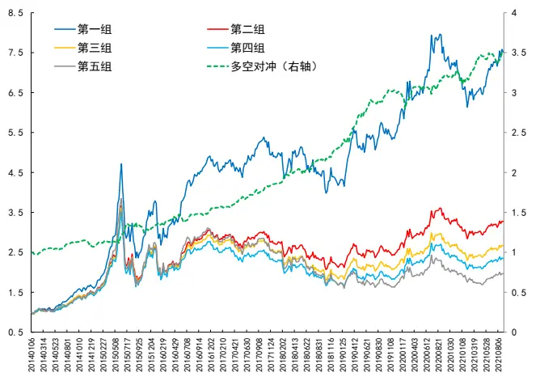
数据来源：Wind、开源证券研究所

图11：周频下，理想振幅因子的多空收益波动比2.92
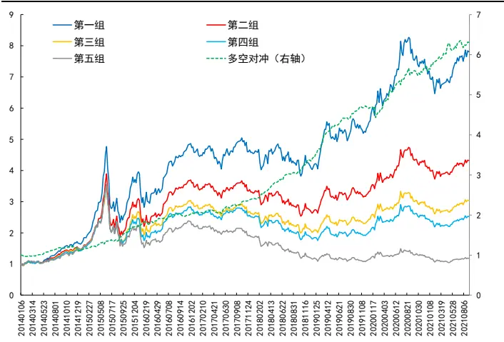
数据来源：Wind、开源证券研究所

图12：周频下，长端动量因子的多空收益波动比1.67
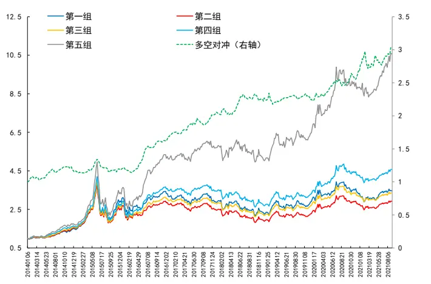
数据来源：Wind、开源证券研究所

图13：周频下，大单资金流的多空收益波动比2.95
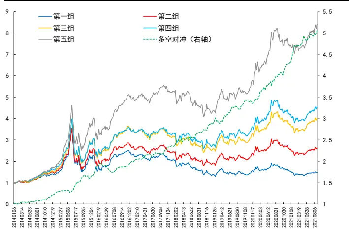
数据来源：Wind、开源证券研究所

图14：周频下，小单资金流的多空收益波动比1.88
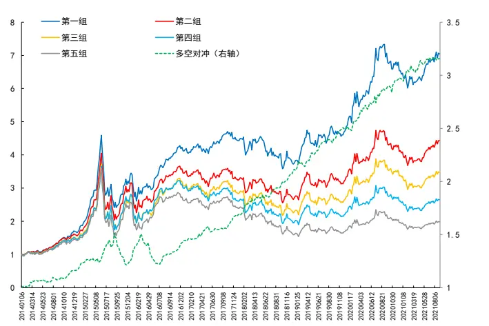
数据来源：Wind、开源证券研究所

## 3、 复合因子在多头端及多空端均显著优于原始因子

本节，我们将对上述因子进行复合，以期探索复合因子在高频下组合的表现。因理想振幅与聪明钱有一定正相关（0.341），大单资金流与小单资金流高度负相关（-0.629），因此我们保留主动买卖、理想振幅、APM、理想反转、大单资金流和长端动量这 6个因子进行复合3。

以周频为例，图 15 和图 16 为复合因子与原始 8 个因子的多空净值和多头净值曲线，从中可以看到，复合因子无论是在多头端还是多空端均优于原始因子。

图15：周频下，复合组合与8大因子的多空净值
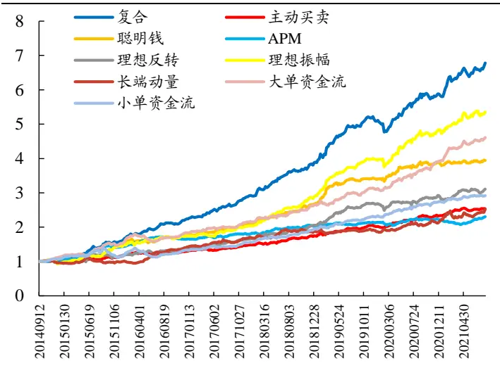
数据来源：Wind、开源证券研究所

图16：周频下，复合组合与8大因子的多头净值
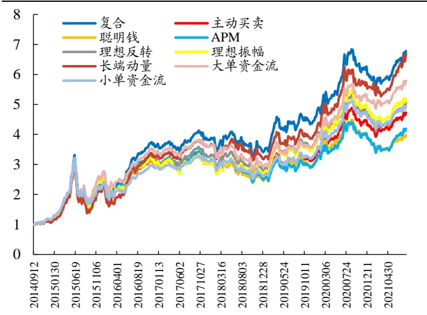
数据来源：Wind、开源证券研究所

## 4、 附录

表 1 为上述 8 个因子的具体构建方式以及报告来源，关于因子构建的展开以及逻辑，可详见原始报告。

表1：8个因子的构建方式和报告来源

| 因子名称 | 因子构建方式 | 发布日期 | 报告名 |
| --- | --- | --- | --- |
| 理想反转 | (1）对选定股票S，回溯取其过去20日的数据； (2）计算股票S每日的平均单笔成交金额（成交金额/成交笔数); (3)单笔成交金额高的10个交易日，涨跌幅加总，记作 ${}^{;}M_{\mathrm{high}};$ （4）单笔成交金额低的10个交易日，涨跌幅加总，记作 $M_{\mathrm{low}};$ (5)理想反转因子 $M=M_{high}-M_{low};$ （6）对所有股票，都进行以上操作，计算各自的理想反转因子M。 | 2019/12/23 | 《A股反转之力的 微观来源》 |
| 聪明钱2.0 钟数据按照指标 | （1）对选定股票，回溯取其过去10个交易日的分钟行情数据； （2）构造指标 $S_{t}=\|R_{t}\|/{V_{t}}^{0.25}$ ，其中 $\cdot R_{t}$ 为第t分钟涨跌幅， $V_{t}.$ 为第t分钟成交量；(3）将分 $\therefore S_{t1}$ 从大到小进行排序，取成交量累积占比前20%的分钟，视为聪明钱交易； (4）计算聪明钱交易的成交量加权平均价 $\mathrm{VWAP_{smax}};$ (5)计算所有交易的成交量加权平均价 $\mathrm{VWAP_{all}};(6)$ 聪明 $Q=VWAP_{small}/VWAP_{all}$ | 2020/2/9 | 《聪明钱因子模 型的2.0版本》 |
| APM | (1）对选定股票，回溯取其过去20日数据，记逐日上午的股票收益率为 $tr_{t}^{am}$ ，指数收益 率为 $R_{t}^{am};$ 逐日下午的股票收益率为 $r_{t}^{pm}$ ，指数收益率为 $R_{t}^{pm}$ (2)将得到的40组上午与下午 $\boldsymbol{\cdot}(\boldsymbol{r},R)$ 的收益率数据进行回归 $\mathbf{:}r_{i}=\alpha+\beta R_{i}+\varepsilon_{i}$ ，得到残差 项 $\left[\varepsilon_{i};\right.$ (3)以上得到的40个残差 $\varepsilon_{i}$ 中，上午残差记为 $\cdot\varepsilon_{t}^{am}$ ，下午残差记为 $\varepsilon_{t}^{pm}$ ，进一步计算每日 上午与下午残差的差： $\delta_{t}=\varepsilon_{t}^{am}-\varepsilon_{t}^{pm}$ •0 (4)构造统计量stat来衡量上午与下午残差的差异程度，计算公式如下 $(\mu)$ 为均值，σ为标 准差): $\begin{array}{r}{\mathrm{stat}=\frac{\mu(\delta_{t})}{\sigma(\delta_{t})/\sqrt{N}},}\end{array}$ (5）为了消除动量因子影响，将统计量stat对动量因子进行横截面回归： $\mathtt{stat}_{j}=$ | 2020/3/7 | 《APM因子模型 的进阶版》 |
| 理想振幅 | （1）对选定股票S，回溯取其最近N个交易日（这里选择N=20）的数据； (2）计算股票S每日的振幅（最高价/最低价-1); （3）选择收盘价较高的λ（这里选择25%）有效交易日，计算振幅均值得到高价振幅因 子 $V_{\mathrm{high}}(\lambda)$ ；选择收盘价较低的λ（这里选择25%）有效交易日，计算振幅均值得到低价 振幅因子 $\vdash_{low}(\lambda);$ 。8 （4）理想振幅因子： $V(\lambda)=V_{\mathrm{high}}(\lambda)-V_{\mathrm{low}}(\lambda).$ (1)逐日计算大单和中单总的主动买卖因子 以及小单的主动买卖因子 | 2020/5/12 | 《振幅因子的隐 藏结构》 |
| $\overline{ACT}_{负向,t}:$ 主动买卖 | $\overline{ACT}_{正向,t},$ $ACT_{正向,t}=\frac{主动买入金额(大单+中单)-主动卖出金额(大单+中单)}{主动买入金额(大单+中单)+主动卖出金额(大单+中单)}$ $\frac{主动买入金额(小单)-主动卖出金额(小单)}{主动买入金额(小单)+主动卖出金额(小单)}$ (2）回溯过去20个交易日，取收益率最高λ比例的交易日，称为高收益日；取收益率最 低λ比例的交易日，称为低收益日； (3)对高收益日的 $\boldsymbol{A}\boldsymbol{C}\boldsymbol{T}_{正向,t}$ 因子取平均，记为 $\left[ACT_{正向};\right.$ 对低收益日的 $\begin{aligned}\overline{ACT}_{负向,t}\end{aligned}$ 因子取平 均，记为 $\begin{aligned}&ACT_{负向}。\\\end{aligned}$ | 2020/9/5 | 《主动买卖因子 的正确用法》 |
| 长端动量 | （1）对选定股票，回溯取其最近160个交易日的数据； (2）计算股票每日的振幅（最高价/最低价-1); (3）选择振幅较低的70%交易日，涨跌幅加总，得到长端动量因子。 | 2020/7/21 | 《A股市场中如何 构造动量因子？》 |
| 大小单资 金流 | （1）计算小单资金流强度：分子为（小单买额-小单卖额）之和，分母为其绝对值；计 算大单资金流强度：分子为（小单买额-小单卖额）之和，分母为其绝对值； $S_{t}=\frac{\sum_{t-T}^{t}(buy_{t}-sell_{t})}{\sum_{t-T}^{t}\|buy_{t}-sell_{t}\|}$ (2)对其关于过去20日涨跌幅做回归，得到残差： $S_{t}=a+bRet20_{t}+\varepsilon_{t}。$ | 2021/6/2 | 《大单与小单资 金流的alpha能力》 |

资料来源：开源证券研究所

## 5、 风险提示

模型测试基于历史数据，市场未来可能发生变化。

## 特别声明

《证券期货投资者适当性管理办法》、《证券经营机构投资者适当性管理实施指引（试行）》已于2017年7月1日起正式实施。根据上述规定，开源证券评定此研报的风险等级为R3（中风险），因此通过公共平台推送的研报其适用的投资者类别仅限定为专业投资者及风险承受能力为 、 、 的普通投资者。若您并非专业投资者及风险承受能力为C3、C4、C5的普通投资者，请取消阅读，请勿收藏、接收或使用本研报中的任何信息。因此受限于访问权限的设置，若给您造成不便，烦请见谅！感谢您给予的理解与配合。

## 分析师承诺

负责准备本报告以及撰写本报告的所有研究分析师或工作人员在此保证，本研究报告中关于任何发行商或证券所发表的观点均如实反映分析人员的个人观点。负责准备本报告的分析师获取报酬的评判因素包括研究的质量和准确性、客户的反馈、竞争性因素以及开源证券股份有限公司的整体收益。所有研究分析师或工作人员保证他们报酬的任何一部分不曾与，不与，也将不会与本报告中具体的推荐意见或观点有直接或间接的联系。

## 股票投资评级说明

|  | 评级 | 说明 |
| --- | --- | --- |
| 证券评级 | 买入（Buy） | 预计相对强于市场表现20%以上； |
|  | 增持（outperform） | 预计相对强于市场表现 5%~20%; |
|  | 中性（Neutral） | 预计相对市场表现在-5%~+5%之间波动； |
|  | 减持（underperform） | 预计相对弱于市场表现5%以下。 |
| 行业评级 | 看好（overweight） | 预计行业超越整体市场表现; |
|  | 中性（Neutral） | 预计行业与整体市场表现基本持平； |
|  | 看淡（underperform） | 预计行业弱于整体市场表现。 |
| 备注：评级标准为以报告日后的6~12个月内，证券相对于市场基准指数的涨跌幅表现，其中A股基准指数为沪深300指数、港股基准指数为恒生指数、新三板基准指数为三板成指（针对协议转让标的）或三板做市指数（针对做市转让标的)、美股基准指数为标普500或纳斯达克综合指数。我们在此提醒您，不同证券研究机构采用不同的评级术语及评级标准。我们采用的是相对评级体系，表示投资的相对比重建议；投资者买入或者卖出证券的决定取决于个人的实际情况，比如当前的持仓结构以及其他需要考虑的因素。投资者应阅读整篇报告，以获取比较完整的观点与信息，不应仅仅依靠投资评级来推断结论。 |  |  |

## 分析、估值方法的局限性说明

本报告所包含的分析基于各种假设，不同假设可能导致分析结果出现重大不同。本报告采用的各种估值方法及模型均有其局限性，估值结果不保证所涉及证券能够在该价格交易。

## 法律声明

开源证券股份有限公司是经中国证监会批准设立的证券经营机构，已具备证券投资咨询业务资格。

本报告仅供开源证券股份有限公司（以下简称“本公司”）的机构或个人客户（以下简称“客户”）使用。本公司不会因接收人收到本报告而视其为客户。本报告是发送给开源证券客户的，属于机密材料，只有开源证券客户才能参考或使用，如接收人并非开源证券客户，请及时退回并删除。

本报告是基于本公司认为可靠的已公开信息，但本公司不保证该等信息的准确性或完整性。本报告所载的资料、工具、意见及推测只提供给客户作参考之用，并非作为或被视为出售或购买证券或其他金融工具的邀请或向人做出邀请。本报告所载的资料、意见及推测仅反映本公司于发布本报告当日的判断，本报告所指的证券或投资标的的价格、价值及投资收入可能会波动。在不同时期，本公司可发出与本报告所载资料、意见及推测不一致的报告。客户应当考虑到本公司可能存在可能影响本报告客观性的利益冲突，不应视本报告为做出投资决策的唯一因素。本报告中所指的投资及服务可能不适合个别客户，不构成客户私人咨询建议。本公司未确保本报告充分考虑到个别客户特殊的投资目标、财务状况或需要。本公司建议客户应考虑本报告的任何意见或建议是否符合其特定状况，以及（若有必要）咨询独立投资顾问。在任何情况下，本报告中的信息或所表述的意见并不构成对任何人的投资建议。在任何情况下，本公司不对任何人因使用本报告中的任何内容所引致的任何损失负任何责任。若本报告的接收人非本公司的客户，应在基于本报告做出任何投资决定或就本报告要求任何解释前咨询独立投资顾问。

本报告可能附带其它网站的地址或超级链接，对于可能涉及的开源证券网站以外的地址或超级链接，开源证券不对其内容负责。本报告提供这些地址或超级链接的目的纯粹是为了客户使用方便，链接网站的内容不构成本报告的任何部分，客户需自行承担浏览这些网站的费用或风险。

开源证券在法律允许的情况下可参与、投资或持有本报告涉及的证券或进行证券交易，或向本报告涉及的公司提供或争取提供包括投资银行业务在内的服务或业务支持。开源证券可能与本报告涉及的公司之间存在业务关系，并无需事先或在获得业务关系后通知客户。

本报告的版权归本公司所有。本公司对本报告保留一切权利。除非另有书面显示，否则本报告中的所有材料的版权均属本公司。未经本公司事先书面授权，本报告的任何部分均不得以任何方式制作任何形式的拷贝、复印件或复制品，或再次分发给任何其他人，或以任何侵犯本公司版权的其他方式使用。所有本报告中使用的商标、服务标记及标记均为本公司的商标、服务标记及标记。

## 开源证券研究所

上海

地址：上海市浦东新区世纪大道1788号陆家嘴金控广场1号

楼10层

邮编：200120

邮箱：research@kysec.cn

北京
地址：北京市西城区西直门外大街18号金贸大厦C2座16层
邮编：100044
邮箱：research@kysec.cn

地址：深圳市福田区金田路2030号卓越世纪中心1号

邮编：518000

邮箱：research@kysec.cn

西安

地址：西安市高新区锦业路1号都市之门B座5层

邮编：710065

邮箱：research@kysec.cn