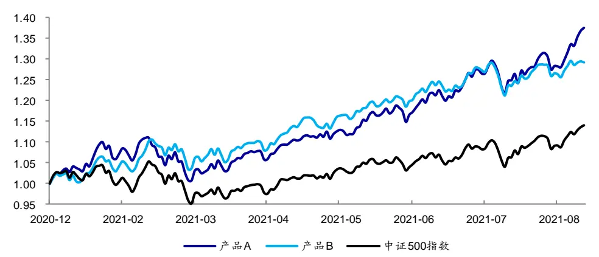
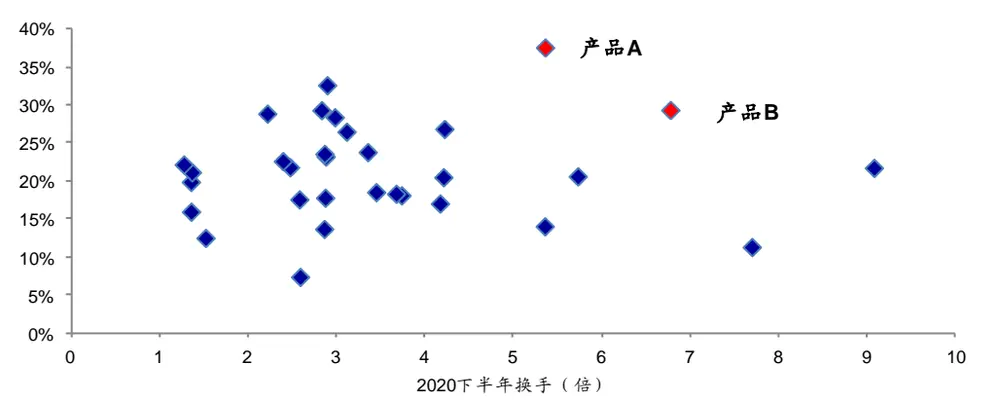

## [Tab相关研究

Table_ReportInfo]《选股因子系列研究（六十九）——高频因子的现实与幻想》《选股因子系列研究（七十一）——逐笔大单因子与大资金行为》《博道量化投资团队及杨梦女士侧写——基本面因子为锚，模型驱动风格切换》2021.08.18

分析师:冯佳睿

Tel:(021)23219732

Email:fengjr@htsec.com

证书:S0850512080006

分析师:袁林青

Tel:(021)23212230

Email:ylq9619@htsec.com

证书:S0850516050003

# 高频数据应用系列研究（三）——高频调仓对多因子模型的收益增强

## 投资要点：

2021 年以来，部分业绩表现较好的中证 500 指数增强基金呈现出高换手的特征。受此启发，本文将海通量化团队前期构建的高频因子，引入周度和日度调仓的选股模型。并在控制相关变量的情况下，与月度调仓的组合进行了对比。

两个过去一年（截至 ）业绩优异的公募中证 指数增强基金代表，的换手率分别为 倍和 倍，高于绝大部分同类产品。我们有理由猜测，较高的调仓频率可能为这两个产品的超额收益带来了一定的贡献。结合近几年，许多量化私募纷纷通过高换手的方式，取得了良好的业绩。我们认为，在合理的范围内提高换手，或许是未来公募增强型指数基金提升竞争力的一种手段。

- 对选股范围进行约束后，不论是行业中性还是行业动量组合，简单周度调仓的超额收益表现都有了全面提升，年化值从月度组合的 和 分别提升至和 。但与此同时，换手率也大幅增长，从 倍提升至 倍。

- 将调仓频率从月度提升至周度时，一种较为常见的思路是同时缩短因子计算和收益预测窗口。我们认为，这种方式可以利用高频因子短周期内（1-5 天）更强的选股有效性，进而提升增强组合的超额收益。但是，大幅增加的换手率也使最终效果变得对交易成本异常敏感。

- 为了在保证较高调仓频率的同时，适当地压缩换手率，我们尝试了以下三种思路。（1）延长高频因子计算窗口；（2）拉长收益预测窗口；（3）提高优化目标函数中的惩罚系数（fee）。

- 三种降低换手率的思路效果不一，投资者可结合实际情况选择。延长高频因子计算窗口兼顾了收益提升和换手降低两个方面，对交易成本不低的投资者而言是较有性价比的一种方案；而拉长收益预测窗口只会降低换手率，并不显著改善收益，因此适合那些对换手有更为严格要求的投资者；提高优化目标函数中的惩罚系数同时降低了收益和换手，与利用高频调仓提高收益的初衷相左，并不推荐投资者尝试。

- 有了周度调仓的良好基础，我们可以将上述做法进一步推广到日度调仓。模型的整体设定不变，高频因子计算窗口和收益预测窗口依然为 20 日和 5 日，只不过运行频率变为每日。

调仓频率提升至日度后，超额收益也随之再次上升。不同假设下，相对月度组合，年化超额收益的改善幅度在 2.6-4.7 个百分点不等。尤其是有成分股约束但允许行业偏离的组合，每一年都获得了比月度组合更高的超额收益。但是，日度调仓必然会提高换手率，和周度调仓相比，年化换手率上升至 12-15 倍（对应每日5%-6%）。

- 风险提示。市场系统性风险、资产流动性风险以及政策变动风险会对策略表现产生较大影响。

2021 年以来，部分业绩表现较好的中证 500 指数增强基金呈现出高换手的特征。受此启发，本文将海通量化团队前期构建的高频因子，引入周度和日度调仓的选股模型。并在控制相关变量的情况下，与月度调仓的组合进行了对比。

本文共分为六个部分，第一部分简要介绍模型构建思路和部分高频因子 2021 年的表现，第二部分展示月度模型的表现，第三部分讨论周度组合的构建，第四部分扩展到日度组合，第五部分总结全文，第六部分提示风险。

## 1. 引言

2021 年以来，大部分公募中证 500 增强指数型基金的超额收益表现十分优异。下图展示的便是其中两个代表产品 2021.01-2021.08 的净值走势。

图1 中证 500 增强指数型基金 A 和 B 的净值走势（2021.01-2021.08）

资料来源：Wind，海通证券研究所

截至 2021 年 8 月 31 日，产品 A 和 B 的 YTD 收益分别为 37.5%和 27.5%。而同期中证 500 指数的 YTD 收益仅为 14.5%，两者均获得了 10%以上的超额收益。

进一步分析这两个产品的换手率（见下图），我们发现，它们都有着明显的高换手特征。2020H2 的换手率分别为 5.4 倍和 6.8 倍，高于绝大部分同类产品1。

图2 中证 500 增强型指数基金的 2021YTD 收益率与 2020H2 换手率

资料来源：Wind，海通证券研究所

根据上述收益率和换手率的对比，我们有理由猜测，较高的调仓频率可能为这两个产品的超额收益带来了一定的贡献。结合近几年，许多量化私募纷纷通过高换手的方式，取得了良好的业绩。我们认为，在合理的范围内提高换手，或许是未来公募增强型指数基金提升竞争力的一种手段。

那么，怎样提高组合的换手率，或者说怎样设计有效的高频调仓信号呢？海通量化团队前期的研究发现，很多基于高频数据开发的因子，虽然在月度频率上依然有较好的选股效果，但也存在因衰减过快而无法更高效地利用信息的不足。既然如此，我们不妨物尽其用，通过快速更新的高频因子，每周或每日重新预测股票的未来收益，从而实现换仓频率的提升。

下表展示了海通量化团队开发并长期跟踪的高频因子，2021 年的多空收益。从中可见，部分高频因子，如基于分钟 K线计算的尾盘成交占比、基于逐笔数据得到的开盘后大单净买入占比，在全市场和中证 500 指数成分股内，均呈现出较为稳定的多空收益。（更多高频因子的业绩表现，可关注海通量化团队发布的《高频因子周报》。）

表 1 高频因子月度多空收益（2021.01-2021.08）

| 因子名称 | 选股范围 | 2021.01 | 2021.02 | 2021.03 | 2021.04 | 2021.05 | 2021.06 | 2021.07 | 2021.08 |
| --- | --- | --- | --- | --- | --- | --- | --- | --- | --- |
| 改进反转 | 全市场 | 0.5% | 4.7% | 0.6% | 2.1% | -2.3% | 1.5% | 0.6% | 5.4% |
|  | 沪深 300 | 2.8% | 7.9% | 1.5% | 5.6% | -2.4% | -6.0% | 4.8% | 4.3% |
|  | 中证500 | 4.7% | 7.5% | -1.1% | -3.6% | -5.7% | 3.1% | -1.0% | -0.5% |
| 高频偏度 | 全市场 | 2.0% | 1.2% | 0.8% | 1.0% | -0.1% | 2.4% | 1.8% | 3.0% |
|  | 沪深300 | 0.9% | 1.3% | -0.8% | 1.8% | 0.7% | 2.4% | 1.4% | -1.4% |
|  | 中证500 | 4.9% | 1.5% | 1.3% | -2.2% | -1.3% | 0.0% | 6.8% | -1.1% |
| 下行波动占比 | 全市场 | 1.3% | 1.1% | -0.1% | 0.8% | 0.9% | 2.3% | 1.1% | 3.4% |
|  | 沪深 300 | 0.1% | 2.1% | 2.2% | 2.6% | -0.4% | 2.8% | 1.4% | -0.5% |
|  | 中证500 | 5.1% | 2.1% | 0.8% | -3.7% | 1.1% | 1.4% | -0.9% | 0.8% |
| 尾盘成交占比 | 全市场 | 1.1% | 1.6% | 1.4% | 0.4% | 3.9% | 0.4% | 2.5% | 4.0% |
|  | 沪深300 | 0.3% | 1.3% | 1.7% | 0.1% | 1.9% | -4.7% | 5.4% | -0.5% |
|  | 中证500 | -0.4% | 5.4% | 4.3% | -2.0% | 0.1% | -1.2% | 4.6% | -0.2% |
| 开盘后买入意 愿占比 | 全市场 | 3.2% | 1.2% | 0.1% | 0.5% | -0.2% | 2.2% | 2.9% | 2.1% |
|  | 沪深 300 | 9.2% | 3.0% | -2.3% | 5.6% | -1.7% | 0.2% | -2.1% | 0.5% |
|  | 中证500 | 5.3% | -0.8% | -1.3% | -1.7% | -3.1% | 3.9% | 0.2% | 0.9% |
| 开盘后买入意 愿强度 | 全市场 | 3.4% | 1.2% | -0.3% | 2.6% | -1.4% | 2.9% | 3.2% | 3.7% |
|  | 沪深300 | 6.2% | -1.4% | 0.5% | 7.6% | -0.4% | 1.9% | -2.0% | -0.3% |
|  | 中证500 | 4.5% | -0.7% | 1.1% | 2.2% | -1.9% | 4.4% | 0.1% | 1.4% |
| 开盘后大单净 买入占比 | 全市场 | 2.9% | 1.7% | -0.5% | 4.6% | 0.1% | 2.2% | 4.3% | 2.0% |
|  | 沪深 300 | 7.3% | 3.4% | 4.3% | 5.7% | 1.7% | -1.0% | -1.2% | -3.0% |
|  | 中证500 | 3.8% | 3.6% | 2.0% | 2.2% | -0.4% | 2.6% | 2.8% | 3.4% |
| 开盘后大单净 买入强度 | 全市场 | 2.8% | 1.0% | 1.0% | 3.9% | -0.9% | 1.4% | 1.6% | -0.8% |
|  | 沪深300 | 4.7% | 4.9% | 2.2% | 4.3% | 0.2% | -1.4% | -6.7% | -3.0% |
|  | 中证500 | 7.5% | 3.7% | 1.2% | 1.6% | 0.6% | 2.3% | 1.3% | 1.5% |

资料来源：Wind，海通证券研究所

## 2. 月度调仓组合

为了给提高换手率的周度调仓和日度调仓组合提供一个比较基准，我们首先构建了传统的多因子月度调仓组合。使用的因子包括：市值、中盘（市值三次方）、估值、换手、反转、波动、盈利、 、分析师推荐、尾盘成交占比、买入意愿占比和大单净买入占比因子。

在预测个股收益时，我们首先采用回归法得到因子溢价，再计算最近 12 个月的因子溢价均值估计下期的因子溢价，最后乘以最新一期的因子值。

风险控制模型主要包括以下几个方面的约束：

1） 成分股：无约束（下简称“全市场组合”）和中证 500指数成分股的权重不低于90%（下简称“90%中证 500 内组合”）；

2） 个股权重：相对偏离不超过 2%；

3） 因子敞口：常规低频因子敞口≤ ±0.5，高频因子敞口≤ ±2.0；

4） 行业偏离：严格中性和相对偏离不超过 4%。对于允许行业偏离组合，我们使用动量的方式生成行业观点，进行轮动。分别简记为行业中性和行业动量。

考虑到高频调仓带来的高换手可能会产生高昂的交易费用，并侵蚀组合收益，我们引入组合的换手率作为惩罚项，以最大化扣费后的预期收益为优化目标，得到组合权重。具体的目标函数如下所示：

$$
\operatorname*{max}_{w_{i}}\biggl(\sum_{i=1}^{N}w_{i}*\mu_{i}-0.5*fee*\sum_{i=1}^{N}\bigl|w_{i}-w_{i,0}\bigr|\biggr)
$$

其中， $\mathsf{W}_{\mathrm{i}}$ 为组合中股票 i的权重， $\mathsf{w}_{\mathrm{i},0}$ 为组合中股票 i的初始权重， $\mu_{\mathrm{i}}$ 为股票 i的预期超额收益；fee作为惩罚系数，代表交易成本。为了使本文的结论贴近实践，如无特别说明，下文的测算均假定以次日均价调仓，同时扣除 3‰的交易成本。

下表展示的是在上述设定下，月度调仓的全市场组合 2016 年以来的收益风险特征。其中，行业中性组合年化超额收益 17.1%，行业动量组合年化超额收益 20.9%。两个组合的换手率（年化单边，下同）接近，分别为 8.09 和 7.68 倍。

表 2 月度调仓全市场组合的收益风险特征

|  |  | 超额收益 | 相对最大回撤 | 跟踪误差 | 月度胜率 | 信息比率 | 换手率 |
| --- | --- | --- | --- | --- | --- | --- | --- |
|  | 2016 | 23.2% | 1.7% | 6.0% | 100% | 3.83 | 8.30 |
|  | 2017 | 14.5% | 2.5% | 4.9% | 92% | 2.93 | 7.67 |
|  | 2018 | 18.2% | 1.9% | 5.5% | 83% | 3.29 | 7.20 |
|  | 2019 | 10.2% | 4.9% | 5.6% | 58% | 1.82 | 8.46 |
|  | 2020 | 17.3% | 5.0% | 7.1% | 75% | 2.45 | 8.08 |
|  | 2021.08 | 8.2% | 3.2% | 7.7% | 63% | 1.73 | 5.47 |
| 行业动量 | 全区间 | 17.1% | 5.0% | 6.1% | 78% | 2.79 | 8.09 |
|  | 2016 | 23.8% | 2.4% | 6.0% | 92% | 3.97 | 8.19 |
|  | 2017 | 23.3% | 2.9% | 6.0% | 83% | 3.85 | 7.25 |
|  | 2018 | 9.7% | 4.7% | 6.4% | 75% | 1.52 | 6.65 |
|  | 2019 | 12.7% | 4.7% | 5.7% | 67% | 2.22 | 8.04 |
|  | 2020 2021.08 | 34.5% | 4.2% | 8.0% | 83% | 4.32 | 7.26 |
|  | 全区间 | 17.8% 20.9% | 4.8% 4.8% | 9.3% 6.9% | 75% 78% | 3.20 3.05 | 5.48 7.68 |

资料来源：Wind，海通证券研究所

下表展示了 90%中证 500 指数内组合 2016 年以来的收益风险特征。与全市场选股组合相比，年化超额收益、跟踪误差和换手率都有一定幅度降低。其中，行业中性组合年化超额收益 14.7%，行业轮动组合年化超额收益 17.5%。

表 3 月度调仓 90%中证 500内组合的收益风险特征

|  |  | 超额收益 | 相对最大回撤 | 跟踪误差 | 月度胜率 | 信息比率 | 换手率 |
| --- | --- | --- | --- | --- | --- | --- | --- |
|  | 2016 | 19.8% | 1.9% | 5.8% | 100% | 3.43 | 7.07 |
|  | 2017 | 14.5% | 3.1% | 5.0% | 83% | 2.87 | 6.34 |
|  | 2018 | 11.4% | 2.8% | 5.0% | 92% | 2.29 | 6.05 |
|  | 2019 | 10.3% | 5.1% | 5.1% | 75% | 2.00 | 7.18 |
|  | 2020 | 17.4% | 2.8% | 5.8% | 83% | 3.02 | 6.69 |
|  | 2021.08 | 8.0% | 3.8% | 7.5% | 75% | 1.74 | 4.96 |
|  | 全区间 | 14.7% | 5.1% | 5.6% | 84% | 2.62 | 6.86 |
| 行业动量 | 2016 | 19.9% | 2.0% | 5.8% | 92% | 3.41 | 6.86 |
|  | 2017 | 21.1% | 2.4% | 5.7% | 75% | 3.69 | 5.93 |
|  | 2018 | 5.5% | 5.2% | 6.4% | 67% | 0.85 | 5.24 |
|  | 2019 | 19.5% | 2.9% | 5.5% | 75% | 3.55 | 7.13 |
|  | 2020 | 15.2% | 3.7% | 7.0% | 67% | 2.17 | 6.40 |
|  | 2021.08 | 22.0% | 4.2% | 8.3% | 63% | 4.45 | 4.77 |
|  | 全区间 | 17.5% | 5.2% | 6.4% | 72% | 2.73 | 6.51 |

资料来源：Wind，海通证券研究所

## 3. 周度调仓组合

## 3.1 简单周度调仓组合

将调仓频率从月度提升至周度时，一种较为常见的思路是同时缩短因子计算和收益预测窗口。我们还是采用对称的窗口期，即，使用过去 个交易日高频因子的均值代入收益预测模型，获得未来 5日的预期收益。

下表展示了上述调仓模式（下称“简单周度”）下，全市场组合的收益风险特征，并与前文的基准——月度组合进行对比。

表 4 简单周度调仓全市场组合的收益风险特征

| 行业中性 |  | 超额收益 (简单周度) | 超额收益 (月度组合) | 相对最大回撤 | 跟踪误差 | 月度胜率 | 信息比率 | 换手率 (简单周度) | 换手率 (月度组合) |
| --- | --- | --- | --- | --- | --- | --- | --- | --- | --- |
|  | 2016 | 25.3% | 23.2% | 1.7% | 6.3% | 92% | 4.00 | 31.09 | 8.30 |
|  | 2017 | 18.3% | 14.5% | 3.3% | 4.9% | 83% | 3.71 | 18.83 | 7.67 |
|  | 2018 | 16.6% | 18.2% | 1.6% | 5.6% | 92% | 2.99 | 18.00 | 7.20 |
|  | 2019 | 8.0% | 10.2% | 5.6% | 5.9% | 58% | 1.36 | 19.89 | 8.46 |
|  | 2020 | 12.1% | 17.3% | 4.0% | 6.2% | 75% | 1.95 | 19.28 | 8.08 |
|  | 2021.08 | 11.1% | 8.2% | 3.5% | 7.7% | 88% | 2.38 | 11.37 | 5.47 |
| 行业动量 | 全区间 | 17.1% | 17.1% | 6.1% | 6.0% | 80% | 2.83 | 20.68 | 8.09 |
|  | 2016 | 30.6% | 23.8% | 2.3% | 6.8% | 92% | 4.47 | 29.89 | 8.19 |
|  | 2017 | 26.8% | 23.3% | 3.1% | 5.4% | 92% | 4.98 | 18.04 | 7.25 |
|  | 2018 | 12.5% | 9.7% | 3.9% | 6.8% | 75% | 1.85 | 16.59 | 6.65 |
|  | 2019 | 16.1% | 12.7% | 3.1% | 5.9% | 67% | 2.73 | 19.73 | 8.04 |
|  | 2020 | 23.2% | 34.5% | 4.6% | 7.1% | 75% | 3.25 | 19.37 | 7.26 |
|  | 2021.08 | 24.6% | 17.8% | 5.1% | 9.7% | 100% | 4.27 | 10.47 | 5.48 |
|  | 全区间 | 23.6% | 20.9% | 5.1% | 6.9% | 81% | 3.42 | 19.91 | 7.68 |

资料来源：Wind，海通证券研究所

由上表可见，调仓频率从月度上升至周度后，行业动量组合的年化超额收益改进明显。且除 2020 年外，每年的超额收益均有提升。但是，高频调仓似乎对行业中性组合没有效果。值得注意的是，两个组合的换手率均从 8 倍左右大幅上升至 20 倍左右。

表 5 简单周度调仓 90%中证 500内组合的收益风险特征

| 行业中性 |  | 超额收益 (简单周度) | 超额收益 (月度组合) | 相对最大回撤 | 跟踪误差 | 月度胜率 | 信息比率 | 换手率 （简单周度） | 换手率 （月度组合） |
| --- | --- | --- | --- | --- | --- | --- | --- | --- | --- |
|  | 2016 | 20.1% | 19.8% | 1.8% | 6.0% | 83% | 3.33 | 28.33 | 7.07 |
|  | 2017 | 19.4% | 14.5% | 2.3% | 4.4% | 100% | 4.35 | 14.92 | 6.34 |
|  | 2018 | 12.3% | 11.4% | 1.6% | 4.7% | 92% | 2.60 | 13.62 | 6.05 |
|  | 2019 | 12.1% | 10.3% | 4.4% | 5.7% | 75% | 2.14 | 13.88 | 7.18 |
|  | 2020 | 10.0% | 17.4% | 5.0% | 5.7% | 67% | 1.74 | 14.46 | 6.69 |
|  | 2021.08 | 11.1% | 8.0% | 4.4% | 7.0% | 75% | 2.62 | 7.87 | 4.96 |
|  | 全区间 | 15.5% | 14.7% | 5.0% | 5.6% | 81% | 2.79 | 16.25 | 6.86 |
| 行业动量 | 2016 | 21.9% | 19.9% | 2.2% | 6.5% | 83% | 3.34 | 26.35 | 6.86 |
|  | 2017 | 23.2% | 21.1% | 2.8% | 5.1% | 92% | 4.54 | 13.46 | 5.93 |
|  | 2018 | 5.7% | 5.5% | 4.5% | 5.8% | 58% | 0.99 | 12.64 | 5.24 |
|  | 2019 | 21.1% | 19.5% | 2.6% | 5.6% | 92% | 3.76 | 14.09 | 7.13 |
|  | 2020 | 15.9% | 15.2% | 5.9% | 6.3% | 58% | 2.51 | 14.23 | 6.40 |
|  | 2021.08 | 27.7% | 22.0% | 3.2% | 7.7% | 88% | 6.08 | 8.06 | 4.77 |
|  | 全区间 | 19.5% | 17.5% | 5.9% | 6.1% | 77% | 3.17 | 15.50 | 6.51 |

资料来源：Wind，海通证券研究所

对选股范围进行约束后，不论是行业中性还是行业动量组合，简单周度调仓的超额收益表现都有了全面提升，年化值从月度组合的 14.7%和 17.5%分别提升至 15.5%和19.5%。但与此同时，换手率也大幅增长，从 6-7倍提升至 15-16 倍。

根据上述结果，我们认为，将调仓频率从月度提高至周度，可以利用高频因子短周期内（ 天）更强的选股有效性，进而提升增强组合的超额收益。但是，大幅增加的换手率也使最终效果变得对交易成本异常敏感。一旦实践中的交易成本远不止 3‰，那么高频调仓带来的收益改善极有可能会被快速侵蚀。因此，我们尝试了以下三种方式，以求在保证较高调仓频率的同时，适当地压缩换手率。

1） 延长高频因子计算窗口。由于高频因子的计算窗口和收益预测窗口都为 5 日，这就意味着每次调仓时，高频因子都会更新，换手率自然会高。既然如此，我们不妨延长高频因子的计算窗口，比如从 日回到 日。这样每次重新预测个股收益时，就有 15 日的数据保持不变，从而高频因子的更新速度变慢，换手率也随之降低。

2） 拉长收益预测窗口。在一个融合了低频基本面因子和高频量价因子的收益预测模型中，改变收益预测窗口的本质是在调节这两大类因子的权重。通常来看，收益预测窗口长，基本面因子的预测效果好，模型中的权重也高；反之，在较短的预测窗口内，高频因子的有效性强，从而会占据更大的权重。高频因子的权重低了，换手率自然也就下降了。

3） 提高优化目标函数中的惩罚系数（fee）。从目标函数的形式来看，在预期收益不变的条件下，当惩罚系数变大后，为使函数达到最大值，换手率项| w-w |自然变小。

## 3.2 延长高频因子计算窗口

以下两表展示了高频因子计算窗口延长至 20 日后，高频调仓组合（下简称“改进周度”）的收益风险特征。

和简单周度调仓相比，延长高频因子计算窗口后，换手率大约降低了 50%，年化超额收益则进一步提升。尤其是对有成分股约束的组合，不论是否有行业偏离，年化超额收益都能提升 3%左右。由此可见，延长高频因子计算窗口不仅保留了高频调仓的特征，还大幅降低了换手率。对交易成本较高的投资者而言，是一种颇具性价比的改进方式。

表 6 周度调仓全市场组合的收益风险特征（延长高频因子计算窗口）

|  |  | 超额收益 (改进周度) | 超额收益 (简单周度) | 超额收益 (月度组合) | 相对最 大回撤 | 跟踪 误差 | 月度 胜率 | 信息 比率 | 换手率 (改进周度) | 换手率 (简单周度) | 换手率 (月度组合） |
| --- | --- | --- | --- | --- | --- | --- | --- | --- | --- | --- | --- |
| 行业中性 | 2016 | 29.2% | 25.3% | 23.2% | 1.7% | 6.2% | 100% | 4.70 | 15.18 | 31.09 | 8.30 |
|  | 2017 | 11.9% | 18.3% | 14.5% | 5.0% | 5.5% | 75% | 2.18 | 9.13 | 18.83 | 7.67 |
|  | 2018 | 17.0% | 16.6% | 18.2% | 1.7% | 5.6% | 100% | 3.03 | 10.02 | 18.00 | 7.20 |
|  | 2019 | 12.0% | 8.0% | 10.2% | 3.7% | 5.2% | 67% | 2.31 | 11.27 | 19.89 | 8.46 |
|  | 2020 | 16.6% | 12.1% | 17.3% | 3.8% | 6.4% | 83% | 2.60 | 9.97 | 19.28 | 8.08 |
|  | 2021.08 | 14.2% | 11.1% | 8.2% | 2.2% | 7.2% | 100% | 3.25 | 6.07 | 11.37 | 5.47 |
|  | 全区间 | 18.6% | 17.1% | 17.1% | 5.0% | 6.0% | 86% | 3.11 | 10.76 | 20.68 | 8.09 |
| 行业动量 | 2016 | 33.1% | 30.6% | 23.8% | 2.3% | 6.5% | 100% | 5.09 | 15.27 | 29.89 | 8.19 |
|  | 2017 | 17.8% | 26.8% | 23.3% | 4.6% | 5.7% | 83% | 3.13 | 8.79 | 18.04 | 7.25 |
|  | 2018 | 15.6% | 12.5% | 9.7% | 3.6% | 6.7% | 75% | 2.31 | 9.99 | 16.59 | 6.65 |
|  | 2019 | 16.2% | 16.1% | 12.7% | 3.0% | 5.4% | 75% | 2.96 | 10.47 | 19.73 | 8.04 |
|  | 2020 | 22.0% | 23.2% | 34.5% | 4.6% | 7.0% | 83% | 3.13 | 9.47 | 19.37 | 7.26 |
|  | 2021.08 | 25.3% | 24.6% | 17.8% | 3.6% | 9.9% | 75% | 4.33 | 6.26 | 10.47 | 5.48 |
|  | 全区间 | 23.2% | 23.6% | 20.9% | 4.6% | 6.8% | 81% | 3.41 | 10.52 | 19.91 | 7.68 |

资料来源：Wind，海通证券研究所

表 7 周度调仓 90%中证 500内组合的收益风险特征（延长高频因子计算窗口）

|  |  | 超额收益 (改进周度) | 超额收益 (简单周度) | 超额收益 (月度组合) | 相对最 大回撤 | 跟踪 误差 | 月度 胜率 | 信息 比率 | 换手率 (改进周度) | 换手率 (简单周度) | 换手率 （月度组合） |
| --- | --- | --- | --- | --- | --- | --- | --- | --- | --- | --- | --- |
|  | 2016 | 21.5% | 20.1% | 19.8% | 1.8% | 5.8% | 92% | 3.67 | 13.29 | 28.33 | 7.07 |
|  | 2017 | 17.5% | 19.4% | 14.5% | 2.5% | 4.7% | 92% | 3.67 | 7.22 | 14.92 | 6.34 |
|  | 2018 | 10.9% | 12.3% | 11.4% | 2.9% | 5.1% | 92% | 2.13 | 8.45 | 13.62 | 6.05 |
|  | 2019 | 16.6% | 12.1% | 10.3% | 3.4% | 4.9% | 67% | 3.36 | 8.97 | 13.88 | 7.18 |
|  | 2020 | 18.2% | 10.0% | 17.4% | 5.4% | 5.7% | 83% | 3.19 | 7.57 | 14.46 | 6.69 |
|  | 2021.08 | 13.8% | 11.1% | 8.0% | 4.3% | 7.2% | 75% | 3.18 | 4.64 | 7.87 | 4.96 |
| 行业动量 | 全区间 | 17.4% | 15.5% | 14.7% | 5.4% | 5.5% | 83% | 3.15 | 8.75 | 16.25 | 6.86 |
|  | 2016 | 23.6% | 21.9% | 19.9% | 2.5% | 6.2% | 100% | 3.79 | 13.11 | 26.35 | 6.86 |
|  | 2017 | 19.2% | 23.2% | 21.1% | 3.9% | 5.3% | 83% | 3.60 | 7.12 | 13.46 | 5.93 |
|  | 2018 | 7.0% | 5.7% | 5.5% | 3.5% | 5.8% | 75% | 1.20 | 7.88 | 12.64 | 5.24 |
|  | 2019 | 20.3% | 21.1% | 19.5% | 2.0% | 5.3% | 92% | 3.83 | 9.27 | 14.09 | 7.13 |
|  | 2020 | 26.0% | 15.9% | 15.2% | 5.7% | 6.3% | 75% | 4.13 | 7.85 | 14.23 | 6.40 |
|  | 2021.08 | 27.5% | 27.7% | 22.0% | 4.6% | 8.4% | 75% | 5.59 | 4.79 | 8.06 | 4.77 |
|  | 全区间 | 20.8% | 19.5% | 17.5% | 5.7% | 6.2% | 83% | 3.39 | 8.73 | 15.50 | 6.51 |

资料来源：Wind，海通证券研究所

## 3.3 拉长收益预测窗口

在延长高频因子计算窗口的基础上，我们进一步考察收益预测窗口从 5日拉长至 10日后，组合的收益风险特征，结果如以下两表所示。为便于行文，“（1W）”和“（2W）”分别对应收益预测窗口为 5日和 10日的组合。

当收益预测窗口从 5日增加至 10 日后，换手率进一步下降，但年化超额收益并没有得到明显和一致的提升。

表 8 周度调仓全市场组合的收益风险特征（拉长收益预测窗口）

|  |  | 超额收益 (2W) | 超额收益 (1W) | 超额收益 (简单周度) | 相对最 大回撤 | 跟踪 误差 | 月度 胜率 | 信息 比率 | 换手率 (2W) | 换手率 (1W) | 换手率 (简单周度） |
| --- | --- | --- | --- | --- | --- | --- | --- | --- | --- | --- | --- |
| 行业中性 | 2016 | 31.5% | 29.2% | 25.3% | 1.8% | 6.0% | 100% | 5.22 | 13.83 | 15.18 | 31.09 |
|  | 2017 | 11.7% | 11.9% | 18.3% | 4.7% | 5.2% | 83% | 2.24 | 7.78 | 9.13 | 18.83 |
|  | 2018 | 16.6% | 17.0% | 16.6% | 1.8% | 5.6% | 100% | 2.99 | 8.64 | 10.02 | 18.00 |
|  | 2019 | 15.4% | 12.0% | 8.0% | 3.3% | 5.4% | 75% | 2.83 | 9.57 | 11.27 | 19.89 |
|  | 2020 | 15.9% | 16.6% | 12.1% | 4.7% | 6.4% | 75% | 2.50 | 8.44 | 9.97 | 19.28 |
|  | 2021.08 | 7.6% | 14.2% | 11.1% | 4.4% | 7.5% | 63% | 1.64 | 5.79 | 6.07 | 11.37 |
|  | 全区间 | 18.2% | 18.6% | 17.1% | 4.7% | 6.0% | 83% | 3.04 | 9.43 | 10.76 | 20.68 |
| 行业动量 | 2016 | 34.7% | 33.1% | 30.6% | 2.3% | 6.5% | 100% | 5.31 | 13.96 | 15.27 | 29.89 |
|  | 2017 | 22.5% | 17.8% | 26.8% | 3.3% | 5.6% | 83% | 3.99 | 7.45 | 8.79 | 18.04 |
|  | 2018 | 13.7% | 15.6% | 12.5% | 3.6% | 6.9% | 83% | 1.99 | 8.51 | 9.99 | 16.59 |
|  | 2019 | 24.3% | 16.2% | 16.1% | 1.8% | 5.4% | 83% | 4.48 | 9.50 | 10.47 | 19.73 |
| 2020 | 22.6% | 22.0% | 23.2% | 4.2% | 7.3% | 83% | 3.11 | 8.04 | 9.47 | 19.37 |  |
| 2021.08 | 22.7% | 25.3% | 24.6% | 4.5% | 9.4% | 88% | 4.09 | 6.03 | 6.26 | 10.47 |  |
| 全区间 | 24.8% | 23.2% | 23.6% | 4.5% | 6.8% | 86% | 3.64 | 9.34 | 10.52 | 19.91 |  |

资料来源：Wind，海通证券研究所

表 9 周度调仓 90%中证 500内组合的收益风险特征（拉长收益预测窗口）

|  |  | 超额收益 (2W) | 超额收益 (1W) | 超额收益 (简单周度) | 相对最 大回撤 | 跟踪 误差 | 月度 胜率 | 信息 比率 | 换手率 (2W) | 换手率 (1W) | 换手率 (简单周度) |
| --- | --- | --- | --- | --- | --- | --- | --- | --- | --- | --- | --- |
| 行业中性 | 2016 | 24.0% | 21.5% | 20.1% | 1.8% | 5.7% | 100% | 4.19 | 11.57 | 13.29 | 28.33 |
|  | 2017 | 19.5% | 17.5% | 19.4% | 2.4% | 4.7% | 92% | 4.11 | 6.40 | 7.22 | 14.92 |
|  | 2018 | 9.7% | 10.9% | 12.3% | 2.9% | 4.8% | 83% | 2.02 | 7.10 | 8.45 | 13.62 |
|  | 2019 | 14.0% | 16.6% | 12.1% | 4.5% | 5.2% | 75% | 2.69 | 7.60 | 8.97 | 13.88 |
|  | 2020 | 19.4% | 18.2% | 10.0% | 2.9% | 5.7% | 75% | 3.42 | 6.69 | 7.57 | 14.46 |
|  | 2021.08 | 11.6% | 13.8% | 11.1% | 4.8% | 7.3% | 75% | 2.62 | 4.62 | 4.64 | 7.87 |
|  | 全区间 | 17.4% | 17.4% | 15.5% | 4.8% | 5.5% | 83% | 3.16 | 7.67 | 8.75 | 16.25 |
| 行业动量 | 2016 | 25.3% | 23.6% | 21.9% | 2.2% | 6.1% | 100% | 4.13 | 11.08 | 13.11 | 26.35 |
|  | 2017 | 17.7% | 19.2% | 23.2% | 3.8% | 5.4% | 92% | 3.26 | 5.86 | 7.12 | 13.46 |
|  | 2018 | 4.8% | 7.0% | 5.7% | 4.1% | 6.2% | 58% | 0.78 | 6.32 | 7.88 | 12.64 |
|  | 2019 | 19.2% | 20.3% | 21.1% | 3.6% | 5.4% | 83% | 3.54 | 8.14 | 9.27 | 14.09 |
|  | 2020 | 27.8% | 26.0% | 15.9% | 4.3% | 6.3% | 83% | 4.43 | 6.79 | 7.85 | 14.23 |
|  | 2021.08 | 28.0% | 27.5% | 27.7% | 4.7% | 8.3% | 75% | 5.75 | 4.60 | 4.79 | 8.06 |
|  | 全区间 | 20.4% | 20.8% | 19.5% | 5.7% | 6.2% | 81% | 3.29 | 7.47 | 8.73 | 15.50 |

资料来源：Wind，海通证券研究所

进一步，我们还测试了预测窗口为未来 3周和 4 周的结果，并对比了不同参数下的年化超额收益和换手率（见下方的 4个表格）。随着预测窗口的不断拉长，换手率单调下降。这和我们的预期一致，因为越长的预测窗口对应越低的高频因子权重。当预测窗口为 20日时，周度调仓组合的换手率甚至低于月度调仓。但我们也可以看到，不同的预测窗口对应的年化超额收益并无显著差异。

表 10不同收益预测窗口下全市场组合的超额收益与换手率（行业中性）

| 超额收益 |  |  |  |  |  |  | 换手率 |  |  |  |  |  |
| --- | --- | --- | --- | --- | --- | --- | --- | --- | --- | --- | --- | --- |
|  | 月度 组合 | 简单 周度 | 改进周度 (1w) | 改进周度 (2w) | 改进周度 (3w) | 改进周度 (4w) | 月度 组合 | 简单 周度 | 改进周度 (1w) | 改进周度 (2w) | 改进周度 (3w) | 改进周度 (4w) |
| 2016 | 23.2% | 25.3% | 29.2% | 31.5% | 28.5% | 30.8% | 8.30 | 31.09 | 15.18 | 13.83 | 12.35 | 11.21 |
| 2017 | 14.5% | 18.3% | 11.9% | 11.7% | 12.0% | 10.0% | 7.67 | 18.83 | 9.13 | 7.78 | 6.78 | 5.94 |
| 2018 | 18.2% | 16.6% | 17.0% | 16.6% | 17.3% | 16.5% | 7.20 | 18.00 | 10.02 | 8.64 | 7.48 | 6.63 |
| 2019 | 10.2% | 8.0% | 12.0% | 15.4% | 18.1% | 14.1% | 8.46 | 19.89 | 11.27 | 9.57 | 8.53 | 7.30 |
| 2020 | 17.3% | 12.1% | 16.6% | 15.9% | 13.9% | 15.5% | 8.08 | 19.28 | 9.97 | 8.44 | 7.61 | 7.16 |
| 2021.08 | 8.2% | 11.1% | 14.2% | 7.6% | 3.2% | 6.9% | 5.47 | 11.37 | 6.07 | 5.79 | 5.51 | 5.00 |
| 全区间 | 17.1% | 17.1% | 18.6% | 18.2% | 17.2% | 17.3% | 8.09 | 20.68 | 10.76 | 9.43 | 8.42 | 7.55 |

资料来源：Wind，海通证券研究所

表 11 不同收益预测窗口下全市场组合的超额收益与换手率（行业动量）

| 超额收益 |  |  |  |  |  |  | 换手率 |  |  |  |  |  |
| --- | --- | --- | --- | --- | --- | --- | --- | --- | --- | --- | --- | --- |
|  | 月度 组合 | 简单 周度 | 改进周度 (1w) | 改进周度 (2w) | 改进周度 (3w) | 改进周度 | 月度 | 简单 周度 | 改进周度 | 改进周度 | 改进周度 | 改进周度 |
|  | 23.8% | 30.6% | 33.1% | 34.7% | 33.5% | (4w) 29.7% | 组合 8.19 | 29.89 | (1w) 15.27 | (2w) 13.96 | (3w) 12.62 | (4w) 10.97 |
| 2016 2017 | 23.3% | 26.8% | 17.8% | 22.5% | 21.4% | 19.2% | 7.25 | 18.04 | 8.79 | 7.45 | 6.58 | 5.91 |
| 2018 | 9.7% | 12.5% | 15.6% | 13.7% | 12.7% | 10.3% | 6.65 | 16.59 | 9.99 | 8.51 | 7.17 | 6.30 |
| 2019 | 12.7% | 16.1% | 16.2% | 24.3% | 19.5% | 21.3% | 8.04 | 19.73 | 10.47 | 9.50 | 8.56 | 7.34 |
| 2020 | 34.5% | 23.2% | 22.0% | 22.6% | 23.4% | 23.0% | 7.26 | 19.37 | 9.47 | 8.04 | 7.35 | 6.71 |
| 2021.08 | 17.8% | 24.6% | 25.3% | 22.7% | 20.6% | 17.7% | 5.48 | 10.47 | 6.26 | 6.03 | 5.55 | 5.15 |
| 全区间 | 20.9% | 23.6% | 23.2% | 24.8% | 23.1% | 21.1% | 7.68 | 19.91 | 10.52 | 9.34 | 8.35 | 7.40 |

资料来源：Wind，海通证券研究所

表 12 不同收益预测窗口下 90%中证 500内组合的超额收益与换手率（行业中性）

| 超额收益 |  |  |  |  |  |  |  | 换手率 |  |  |  |  |
| --- | --- | --- | --- | --- | --- | --- | --- | --- | --- | --- | --- | --- |
|  | 月度 组合 | 简单 周度 | 改进周度 (1w) | 改进周度 (2w) | 改进周度 (3w) | 改进周度 (4w) | 月度 组合 | 简单 周度 | 改进周度 (1w) | 改进周度 (2w) | 改进周度 (3w) | 改进周度 (4w) |
| 2016 | 19.8% | 20.1% | 21.5% | 24.0% | 26.0% | 25.1% | 7.07 | 28.33 | 13.29 | 11.57 | 9.90 | 8.67 |
| 2017 | 14.5% | 19.4% | 17.5% | 19.5% | 17.5% | 18.1% | 6.34 | 14.92 | 7.22 | 6.40 | 5.81 | 5.27 |
| 2018 | 11.4% | 12.3% | 10.9% | 9.7% | 10.8% | 9.2% | 6.05 | 13.62 | 8.45 | 7.10 | 6.16 | 5.49 |
| 2019 | 10.3% | 12.1% | 16.6% | 14.0% | 10.6% | 13.8% | 7.18 | 13.88 | 8.97 | 7.60 | 6.33 | 5.54 |
| 2020 | 17.4% | 10.0% | 18.2% | 19.4% | 18.1% | 17.4% | 6.69 | 14.46 | 7.57 | 6.69 | 6.03 | 5.48 |
| 2021.08 | 8.0% | 11.1% | 13.8% | 11.6% | 14.9% | 11.9% | 4.96 | 7.87 | 4.64 | 4.62 | 4.35 | 4.01 |
| 全区间 | 14.7% | 15.5% | 17.4% | 17.4% | 17.6% | 17.0% | 6.86 | 16.25 | 8.75 | 7.67 | 6.74 | 6.01 |

资料来源： ，海通证券研究所

表 13 不同收益预测窗口下 90%中证 500内组合的超额收益与换手率（行业动量）

| 超额收益 |  |  |  |  |  |  | 换手率 |  |  |  |  |  |
| --- | --- | --- | --- | --- | --- | --- | --- | --- | --- | --- | --- | --- |
|  | 月度 组合 | 简单 周度 | 改进周度 (1w) | 改进周度 (2w) | 改进周度 (3w) | 改进周度 (4w) | 月度 组合 | 简单 周度 | 改进周度 (1w) | 改进周度 (2w) | 改进周度 (3w) | 改进周度 (4w) |
| 2016 | 19.9% | 21.9% | 23.6% | 25.3% | 25.9% | 24.7% | 6.86 | 26.35 | 13.11 | 11.08 | 9.87 | 8.71 |
| 2017 | 21.1% | 23.2% | 19.2% | 17.7% | 19.3% | 23.6% | 5.93 | 13.46 | 7.12 | 5.86 | 5.40 | 4.74 |
| 2018 | 5.5% | 5.7% | 7.0% | 4.8% | 5.2% | 6.1% | 5.24 | 12.64 | 7.88 | 6.32 | 5.49 | 4.89 |
| 2019 | 19.5% | 21.1% | 20.3% | 19.2% | 19.8% | 18.1% | 7.13 | 14.09 | 9.27 | 8.14 | 7.07 | 6.23 |
| 2020 | 15.2% | 15.9% | 26.0% | 27.8% | 28.9% | 31.2% | 6.40 | 14.23 | 7.85 | 6.79 | 5.87 | 5.44 |
| 2021.08 | 22.0% | 27.7% | 27.5% | 28.0% | 25.3% | 28.6% | 4.77 | 8.06 | 4.79 | 4.60 | 4.36 | 4.10 |
| 全区间 | 17.5% | 19.5% | 20.8% | 20.4% | 20.8% | 22.2% | 6.51 | 15.50 | 8.73 | 7.47 | 6.64 | 5.96 |

资料来源：Wind，海通证券研究所

综上所述，我们认为，对于有进一步控制换手率需求的投资者而言，拉长预测窗口不失为一种较为理想的解决方案。它既可以达到和月度调仓组合相当的低换手水平，又可以利用高频因子更新信息快的优势提高收益表现。

## 3.4 提高优化目标函数中的惩罚系数（fee）

以下两表展示了惩罚系数从 3‰增加至 5‰后，组合超额收益的变化。

表 14 不同惩罚系数下周度调仓全市场组合的超额收益（2016.01-2021.08）

| 惩罚系数 | 月度组合 | 简单周度 | 改进周度(1w) | 改进周度(2W) | 改进周度(3w) | 改进周度(4w) |
| --- | --- | --- | --- | --- | --- | --- |
| 3% 行业中性 | 17.1% | 17.1% | 18.6% | 18.2% | 17.2% | 17.3% |
|  | 5% 16.6% | 17.8% | 17.6% | 15.6% | 15.4% | 16.2% |
| 3%0 行业动量 | 20.9% | 23.6% | 23.2% | 24.8% | 23.1% | 21.1% |
| 5% | 20.3% | 24.1% | 22.5% | 22.6% | 21.3% | 20.9% |

资料来源：Wind，海通证券研究所

表 15 不同惩罚系数下周度调仓 90%中证 500 内组合的超额收益（2016.01-2021.08）

| 惩罚系数 | 月度组合 | 简单周度 | 改进周度(1w) | 改进周度(2W) | 改进周度(3w) | 改进周度(4w) |
| --- | --- | --- | --- | --- | --- | --- |
| 3% 行业中性 | 14.7% | 15.5% | 17.4% | 17.4% | 17.6% | 17.0% |
|  | 5% | 15.5% | 16.2% 16.0% | 16.3% | 17.4% | 15.8% |
| 行业动量 | 3% 17.5% | 19.5% | 20.8% | 20.4% | 20.8% | 22.2% |
|  | 5% 17.6% | 21.9% | 20.3% | 20.1% | 20.0% | 17.9% |

资料来源： ，海通证券研究所

由于简单周度组合的换手率高（全市场组合 倍， 中证 内组合 倍），提高惩罚系数后，换手率下降明显（全市场和 中证 内组合分别下降至 倍和倍）。由此节约的交易成本，体现在了超额收益的提升之上。而改进周度组合本身换手率就不高，提高惩罚系数压缩换手率反而不利于发挥高频因子的优势。

## 3.5 小结

本部分详细探讨了周度调仓组合的构建方法。首先，我们通过同时缩短高频因子计算窗口和收益预测窗口，建立了最基础的周度调仓模式。但是，回测结果表明，这种方法会大幅提升换手率，年化单边换手率最高可达 倍。由此带来的高昂交易成本，使得周度调仓相对月度调仓的收益改善较为有限。为此，我们提出了三种降低周度调仓换手率的思路。（ ）延长高频因子计算窗口；（ ）拉长收益预测窗口；（ ）提高优化目标函数中的惩罚系数（fee）。

通过在各种参数假设下的回测分析，我们认为，延长高频因子计算窗口兼顾了收益提升和换手降低两个方面，对交易成本不低的投资者而言是较有性价比的一种方案；而拉长收益预测窗口只会降低换手率，并不显著改善收益，因此适合那些对换手有更为严格要求的投资者；提高优化目标函数中的惩罚系数同时降低了收益和换手，与利用高频调仓提高收益的初衷相左，并不推荐投资者尝试。

## 4. 日度调仓组合

有了周度调仓的良好基础，我们可以将上述做法进一步推广到日度调仓。模型的整体设定不变，高频因子计算窗口和收益预测窗口依然为 20 日和 5 日，只不过运行频率变为每日。

表 16日度调仓全市场组合的收益风险特征

| 行业中性 |  | 超额收益 (日度组 合，1W) | 超额收益 (改进周 度，1W) | 超额收益 (月度组 合） | 相对最 大回撤 | 跟踪 误差 | 月度 胜率 | 信息 比率 | 换手率（日 度组合， 1W) | 换手率（改 进周度， 1W) | 换手率（月 度组合） |
| --- | --- | --- | --- | --- | --- | --- | --- | --- | --- | --- | --- |
|  | 2016 | 35.2% | 29.2% | 23.2% | 1.4% | 5.8% | 100% | 6.00 | 23.23 | 15.18 | 8.30 |
|  | 2017 | 17.5% | 11.9% | 14.5% | 3.2% | 5.1% | 83% | 3.40 | 13.49 | 9.13 | 7.67 |
|  | 2018 | 20.7% | 17.0% | 18.2% | 1.6% | 5.7% | 100% | 3.64 | 14.74 | 10.02 | 7.20 |
|  | 2019 | 12.7% | 12.0% | 10.2% | 3.6% | 5.4% | 67% | 2.35 | 15.68 | 11.27 | 8.46 |
|  | 2020 | 21.5% | 16.6% | 17.3% | 3.4% | 6.3% | 75% | 3.41 | 13.23 | 9.97 | 8.08 |
|  | 2021.08 | 10.2% | 14.2% | 8.2% | 2.6% | 7.7% | 75% | 2.18 | 9.29 | 6.07 | 5.47 |
| 行业动量 | 全区间 | 21.8% | 18.6% | 17.1% | 3.7% | 6.0% | 83% | 3.65 | 15.60 | 10.76 | 8.09 |
|  | 2016 | 34.5% | 33.1% | 23.8% | 1.8% | 6.4% | 100% | 5.40 | 22.15 | 15.27 | 8.19 |
|  | 2017 | 20.9% | 17.8% | 23.3% | 3.6% | 5.6% | 92% | 3.75 | 12.97 | 8.79 | 7.25 |
|  | 2018 | 18.6% | 15.6% | 9.7% | 2.5% | 6.7% | 83% | 2.80 | 14.17 | 9.99 | 6.65 |
|  | 2019 | 17.0% | 16.2% | 12.7% | 3.3% | 5.8% | 75% | 2.91 | 14.97 | 10.47 | 8.04 |
|  | 2020 | 25.2% | 22.0% | 34.5% | 4.2% | 7.3% | 83% | 3.47 | 13.12 | 9.47 | 7.26 |
|  | 2021.08 | 20.6% | 25.3% | 17.8% | 4.1% | 9.4% | 100% | 3.68 | 9.08 | 6.26 | 5.48 |
|  | 全区间 | 24.7% | 23.2% | 20.9% | 4.2% | 6.8% | 87% | 3.64 | 15.05 | 10.52 | 7.68 |

资料来源：Wind，海通证券研究所

表 17日度调仓 90%中证 500内组合的收益风险特征

| 行业中性 |  | 超额收益 (日度组 合，1W) | 超额收益 (改进周 度，1W) | 超额收益 (月度组 合） | 相对最 大回撤 | 跟踪 误差 | 月度 胜率 | 信息 比率 | 换手率（日 度组合， 1W) | 换手率（改 进周度， 1W) | 换手率（月 度组合） |
| --- | --- | --- | --- | --- | --- | --- | --- | --- | --- | --- | --- |
|  | 2016 | 23.3% | 21.5% | 19.8% | 1.7% | 5.5% | 100% | 4.20 | 19.94 | 13.29 | 7.07 |
|  | 2017 | 19.8% | 17.5% | 14.5% | 2.7% | 4.8% | 92% | 4.10 | 10.81 | 7.22 | 6.34 |
|  | 2018 | 9.8% | 10.9% | 11.4% | 2.3% | 5.0% | 92% | 1.96 | 12.04 | 8.45 | 6.05 |
|  | 2019 | 14.1% | 16.6% | 10.3% | 4.8% | 5.2% | 75% | 2.70 | 13.08 | 8.97 | 7.18 |
|  | 2020 | 17.9% | 18.2% | 17.4% | 3.3% | 5.4% | 67% | 3.31 | 10.50 | 7.57 | 6.69 |
|  | 2021.08 | 12.4% | 13.8% | 8.0% | 4.0% | 7.3% | 75% | 2.80 | 7.48 | 4.64 | 4.96 |
| 行业动量 | 全区间 | 17.3% | 17.4% | 14.7% | 4.8% | 5.5% | 83% | 3.15 | 12.85 | 8.75 | 6.86 |
|  | 2016 | 26.0% | 23.6% | 19.9% | 2.6% | 6.2% | 100% | 4.16 | 19.74 | 13.11 | 6.86 |
|  | 2017 | 23.7% | 19.2% | 21.1% | 3.5% | 5.2% | 83% | 4.55 | 10.16 | 7.12 | 5.93 |
|  | 2018 | 7.4% | 7.0% | 5.5% | 2.9% | 6.0% | 67% | 1.23 | 11.27 | 7.88 | 5.24 |
|  | 2019 | 22.5% | 20.3% | 19.5% | 4.9% | 5.2% | 75% | 4.31 | 13.19 | 9.27 | 7.13 |
|  | 2020 | 30.0% | 26.0% | 15.2% | 3.8% | 6.1% | 92% | 4.91 | 10.23 | 7.85 | 6.40 |
|  | 2021.08 | 28.3% | 27.5% | 22.0% | 5.0% | 8.7% | 75% | 5.53 | 7.64 | 4.79 | 4.77 |
|  | 全区间 | 23.2% | 20.8% | 17.5% | 5.0% | 6.2% | 81% | 3.76 | 12.57 | 8.73 | 6.51 |

资料来源：Wind，海通证券研究所

由以上两表可见，调仓频率提升至日度后，超额收益也随之再次上升。不同假设下，相对月度组合，年化超额收益的改善幅度在 个百分点不等。尤其是有成分股约束但允许行业偏离的组合，每一年都获得了比月度组合更高的超额收益。但是，日度调仓必然会提高换手率，和周度调仓相比，年化换手率上升至 12-15 倍（对应每日 5%-6%）。不过，从上述回测结果来看，至少在 3‰的交易成本假设下，提高换仓频率还是值得的。

我们同样可以调整日度组合中收益预测窗口的长度，测试方法的稳健性，结果如以下 4 表所示。整体来看，结果对这个参数并不敏感，日度调仓组合均显著优于月度组合。

表 18 不同收益预测窗口下全市场组合的超额收益对比（行业中性）

|  | 月度组合 | 简单周度 | 改进周度 (1w) | 改进周度 (2w) | 改进周度 (3w) | 改进周度 (4w) | 日度组合 (1W) | 日度组合 (2W) | 日度组合 (3W) | 日度组合 (4W) |
| --- | --- | --- | --- | --- | --- | --- | --- | --- | --- | --- |
| 2016 | 23.2% | 25.3% | 29.2% | 31.5% | 28.5% | 30.8% | 35.2% | 37.1% | 35.4% | 33.4% |
| 2017 | 14.5% | 18.3% | 11.9% | 11.7% | 12.0% | 10.0% | 17.5% | 15.8% | 12.6% | 12.8% |
| 2018 | 18.2% | 16.6% | 17.0% | 16.6% | 17.3% | 16.5% | 20.7% | 20.1% | 19.3% | 16.8% |
| 2019 | 10.2% | 8.0% | 12.0% | 15.4% | 18.1% | 14.1% | 12.7% | 14.6% | 19.0% | 22.1% |
| 2020 | 17.3% | 12.1% | 16.6% | 15.9% | 13.9% | 15.5% | 21.5% | 21.7% | 17.6% | 17.2% |
| 2021.07 | 8.2% | 11.1% | 14.2% | 7.6% | 3.2% | 6.9% | 10.2% | 11.0% | 9.5% | 6.1% |
| 全区间 | 17.1% | 17.1% | 18.6% | 18.2% | 17.2% | 17.3% | 21.8% | 22.1% | 20.8% | 19.7% |

资料来源：Wind，海通证券研究所

表 19 不同收益预测窗口下全市场组合的超额收益对比（行业动量）

|  | 月度组合 | 简单周度 | 改进周度 (1w) | 改进周度 (2w) | 改进周度 (3w) | 改进周度 (4w) | 日度组合 (1W) | 日度组合 (2W) | 日度组合 (3W) | 日度组合 (4W) |
| --- | --- | --- | --- | --- | --- | --- | --- | --- | --- | --- |
| 2016 | 23.8% | 30.6% | 33.1% | 34.7% | 33.5% | 29.7% | 34.5% | 36.3% | 37.4% | 34.0% |
| 2017 | 23.3% | 26.8% | 17.8% | 22.5% | 21.4% | 19.2% | 20.9% | 20.8% | 21.1% | 20.5% |
| 2018 | 9.7% | 12.5% | 15.6% | 13.7% | 12.7% | 10.3% | 18.6% | 17.9% | 15.6% | 16.6% |
| 2019 | 12.7% | 16.1% | 16.2% | 24.3% | 19.5% | 21.3% | 17.0% | 19.5% | 27.7% | 27.7% |
| 2020 | 34.5% | 23.2% | 22.0% | 22.6% | 23.4% | 23.0% | 25.2% | 24.8% | 25.1% | 24.4% |
| 2021.07 | 17.8% | 24.6% | 25.3% | 22.7% | 20.6% | 17.7% | 20.6% | 22.9% | 18.4% | 19.4% |
| 全区间 | 20.9% | 23.6% | 23.2% | 24.8% | 23.1% | 21.1% | 24.7% | 25.5% | 25.7% | 25.2% |

资料来源：Wind，海通证券研究所

表 20 不同收益预测窗口下 90%中证 500内组合的超额收益对比（行业中性）

|  | 月度组合 | 简单周度 | 改进周度 (1w) | 改进周度 (2w) | 改进周度 (3w) | 改进周度 (4w) | 日度组合 (1W) | 日度组合 (2W) | 日度组合 (3W) | 日度组合 (4W) |
| --- | --- | --- | --- | --- | --- | --- | --- | --- | --- | --- |
| 2016 | 19.8% | 20.1% | 21.5% | 24.0% | 26.0% | 25.1% | 23.3% | 24.5% | 25.4% | 22.5% |
| 2017 | 14.5% | 19.4% | 17.5% | 19.5% | 17.5% | 18.1% | 19.8% | 18.3% | 18.4% | 19.2% |
| 2018 | 11.4% | 12.3% | 10.9% | 9.7% | 10.8% | 9.2% | 9.8% | 10.8% | 11.9% | 11.4% |
| 2019 | 10.3% | 12.1% | 16.6% | 14.0% | 10.6% | 13.8% | 14.1% | 12.6% | 10.7% | 13.1% |
| 2020 | 17.4% | 10.0% | 18.2% | 19.4% | 18.1% | 17.4% | 17.9% | 17.2% | 16.9% | 16.7% |
| 2021.07 | 8.0% | 11.1% | 13.8% | 11.6% | 14.9% | 11.9% | 12.4% | 12.2% | 13.2% | 16.0% |
| 全区间 | 14.7% | 15.5% | 17.4% | 17.4% | 17.6% | 17.0% | 17.3% | 17.1% | 17.4% | 17.7% |

资料来源：Wind，海通证券研究所

表 21 不同收益预测窗口下 90%中证 500内组合的超额收益对比（行业动量）

|  | 月度组合 | 简单周度 | 改进周度 (1w) | 改进周度 (2w) | 改进周度 (3w) | 改进周度 (4w) | 日度组合 (1W) | 日度组合 (2W) | 日度组合 (3W) | 日度组合 (4W) |
| --- | --- | --- | --- | --- | --- | --- | --- | --- | --- | --- |
| 2016 | 19.9% | 21.9% | 23.6% | 25.3% | 25.9% | 24.7% | 26.0% | 24.4% | 24.4% | 25.6% |
| 2017 | 21.1% | 23.2% | 19.2% | 17.7% | 19.3% | 23.6% | 23.7% | 24.5% | 21.4% | 21.1% |
| 2018 | 5.5% | 5.7% | 7.0% | 4.8% | 5.2% | 6.1% | 7.4% | 8.3% | 7.6% | 6.7% |
| 2019 | 19.5% | 21.1% | 20.3% | 19.2% | 19.8% | 18.1% | 22.5% | 19.2% | 17.4% | 16.1% |
| 2020 | 15.2% | 15.9% | 26.0% | 27.8% | 28.9% | 31.2% | 30.0% | 30.7% | 29.4% | 28.5% |
| 2021.07 | 22.0% | 27.7% | 27.5% | 28.0% | 25.3% | 28.6% | 28.3% | 30.5% | 30.5% | 25.2% |
| 全区间 | 17.5% | 19.5% | 20.8% | 20.4% | 20.8% | 22.2% | 23.2% | 23.3% | 22.1% | 20.9% |

资料来源：Wind，海通证券研究所

上文所有测算都假设交易成本为 3‰，但对公募基金而言，依然存在低估的可能。为此，我们又回测了 5‰成本下的日度调仓组合。从以下 4 表可见，日度调仓组合依然优于月度组合。我们认为，本文提出的高频调仓思路整体还是具备较强的实践价值。

表 22 全市场组合的超额收益对比（交易成本 5‰，行业中性）

|  | 月度组合 | 简单周度 | 改进周度 (1w) | 改进周度 (2w) | 改进周度 (3w) | 改进周度 (4w) | 日度组合 (1W) | 日度组合 (2W) | 日度组合 (3W) | 日度组合 (4W) |
| --- | --- | --- | --- | --- | --- | --- | --- | --- | --- | --- |
| 2016 | 21.5% | 20.3% | 28.4% | 26.9% | 26.2% | 25.6% | 29.9% | 32.4% | 31.5% | 30.0% |
| 2017 | 13.8% | 13.5% | 11.3% | 8.5% | 11.3% | 12.0% | 14.4% | 13.3% | 10.4% | 10.9% |
| 2018 | 14.9% | 15.5% | 12.6% | 13.5% | 12.4% | 13.3% | 18.1% | 18.0% | 17.5% | 15.3% |
| 2019 | 8.7% | 10.4% | 9.2% | 3.7% | 7.3% | 12.1% | 8.4% | 10.9% | 15.6% | 19.2% |
| 2020 | 12.1% | 7.6% | 12.9% | 14.2% | 11.2% | 15.6% | 17.8% | 18.4% | 14.7% | 14.6% |
| 2021.07 | 8.8% | 11.7% | 12.4% | 9.5% | 8.1% | 4.1% | 7.9% | 8.8% | 7.5% | 4.3% |
| 全区间 | 14.9% | 14.8% | 16.0% | 14.3% | 14.3% | 15.2% | 18.1% | 18.9% | 18.0% | 17.2% |

资料来源： ，海通证券研究所

表 23 全市场组合的超额收益对比（交易成本 5‰，行业动量）

|  | 月度组合 | 简单周度 | 改进周度 (1w) | 改进周度 (2w) | 改进周度 (3w) | 改进周度 (4w) | 日度组合 (1W) | 日度组合 (2W) | 日度组合 (3W) | 日度组合 (4W) |
| --- | --- | --- | --- | --- | --- | --- | --- | --- | --- | --- |
| 2016 | 22.9% | 25.6% | 30.2% | 30.0% | 27.2% | 22.1% | 29.4% | 31.7% | 33.4% | 30.6% |
| 2017 | 22.7% | 19.7% | 19.7% | 19.1% | 16.5% | 21.7% | 17.8% | 18.3% | 18.9% | 18.6% |
| 2018 | 8.2% | 12.8% | 10.2% | 8.5% | 9.2% | 7.2% | 16.2% | 15.9% | 13.9% | 15.0% |
| 2019 | 12.7% | 14.5% | 11.9% | 20.2% | 23.2% | 25.1% | 12.8% | 15.7% | 24.0% | 24.5% |
| 2020 | 26.9% | 19.8% | 24.5% | 24.5% | 21.8% | 23.9% | 21.4% | 21.6% | 22.3% | 21.8% |
| 2021.07 | 14.5% | 26.5% | 21.8% | 19.9% | 18.3% | 17.4% | 18.2% | 20.6% | 16.3% | 17.4% |
| 全区间 | 18.6% | 21.0% | 20.8% | 21.1% | 20.0% | 19.9% | 21.0% | 22.3% | 22.8% | 22.7% |

资料来源：Wind，海通证券研究所

表 24 90%中证 500内组合的超额收益对比（交易成本 5‰，行业中性）

|  | 月度组合 | 简单周度 | 改进周度 (1w) | 改进周度 (2w) | 改进周度 (3w) | 改进周度 (4w) | 日度组合 (1W) | 日度组合 (2W) | 日度组合 (3W) | 日度组合 (4W) |
| --- | --- | --- | --- | --- | --- | --- | --- | --- | --- | --- |
| 2016 | 20.2% | 16.9% | 20.0% | 23.4% | 24.8% | 20.4% | 19.2% | 21.1% | 22.4% | 20.1% |
| 2017 | 14.6% | 16.3% | 16.8% | 15.6% | 17.4% | 16.8% | 17.2% | 16.2% | 16.6% | 17.5% |
| 2018 | 10.5% | 9.2% | 6.0% | 5.9% | 7.1% | 6.0% | 8.0% | 9.3% | 10.5% | 10.2% |
| 2019 | 11.2% | 14.4% | 9.2% | 14.2% | 17.4% | 16.3% | 10.5% | 9.7% | 8.1% | 10.9% |
| 2020 | 18.7% | 8.6% | 20.9% | 18.8% | 19.0% | 19.4% | 15.1% | 14.7% | 14.7% | 14.7% |
| 2021.07 | 3.6% | 13.1% | 12.0% | 10.0% | 8.8% | 8.0% | 10.5% | 10.4% | 11.5% | 14.4% |
| 全区间 | 14.2% | 14.0% | 14.7% | 15.2% | 16.4% | 15.0% | 14.3% | 14.6% | 15.2% | 15.7% |

资料来源： ，海通证券研究所

表 25 90%中证 500内组合的超额收益对比（交易成本 5‰，行业动量）

|  | 月度组合 | 简单周度 | 改进周度 (1w) | 改进周度 (2w) | 改进周度 (3w) | 改进周度 (4w) | 日度组合 (1W) | 日度组合 (2W) | 日度组合 (3W) | 日度组合 (4W) |
| --- | --- | --- | --- | --- | --- | --- | --- | --- | --- | --- |
| 2016 | 17.0% | 19.4% | 22.2% | 23.7% | 22.0% | 21.3% | 21.8% | 21.0% | 21.5% | 23.0% |
| 2017 | 18.1% | 22.5% | 23.0% | 22.6% | 24.4% | 24.0% | 21.2% | 22.5% | 19.6% | 19.6% |
| 2018 | 3.9% | 4.0% | 2.7% | 3.3% | 1.9% | 1.1% | 5.7% | 7.0% | 6.4% | 5.7% |
| 2019 | 19.0% | 19.0% | 15.9% | 14.0% | 15.3% | 13.8% | 18.6% | 15.9% | 14.6% | 13.8% |
| 2020 | 17.6% | 20.9% | 28.5% | 23.5% | 26.8% | 23.1% | 26.9% | 28.0% | 27.0% | 26.3% |
| 2021.07 | 22.6% | 32.5% | 22.7% | 26.6% | 25.2% | 20.2% | 26.1% | 28.4% | 28.5% | 23.5% |
| 全区间 | 16.3% | 19.5% | 18.9% | 18.9% | 19.0% | 17.0% | 20.2% | 20.7% | 19.8% | 18.9% |

资料来源：Wind，海通证券研究所

## 5. 总结

年以来，部分业绩表现较好的中证 指数增强基金呈现出高换手的特征。受此启发，本文将海通量化团队前期构建的高频因子，引入周度和日度调仓的选股模型。并在控制相关变量的情况下，与月度调仓的组合进行了对比。

首先，我们通过同时缩短高频因子计算窗口和收益预测窗口，建立了最基础的周度调仓模式。但是，回测结果表明，这种方法会大幅提升换手率，年化单边换手率最高可达 20 倍。由此带来的高昂交易成本，使得周度调仓相对月度调仓的收益改善较为有限。

为此，我们提出了三种降低周度调仓换手率的思路。（1）延长高频因子计算窗口；（2）拉长收益预测窗口；（3）提高优化目标函数中的惩罚系数（fee）。

通过在各种参数假设下的回测分析，我们认为，延长高频因子计算窗口兼顾了收益提升和换手降低两个方面，对交易成本不低的投资者而言是较有性价比的一种方案；而拉长收益预测窗口只会降低换手率，并不显著改善收益，因此适合那些对换手有更为严格要求的投资者；提高优化目标函数中的惩罚系数同时降低了收益和换手，与利用高频调仓提高收益的初衷相左，并不推荐投资者尝试。

在周度调仓的基础上，我们又将上述做法进一步推广到日度调仓。模型的整体设定不变，高频因子计算窗口和收益预测窗口依然为 20 日和 5 日，只不过运行频率变为每日。整体来看，尽管日度调仓组合的年化单边换手率为 12-15 倍，但年化超额收益相对周度和月度组合依然有进一步的提升。即使交易成本上升至千分之五，结论也不会发生显著改变。

## 6. 风险提示

市场系统性风险、资产流动性风险以及政策变动风险会对策略表现产生较大影响。

## 信息披露

分析师声明

[Table冯佳睿yst 金融工程研究团队s]

袁林青金融工程研究团队

本人具有中国证券业协会授予的证券投资咨询执业资格，以勤勉的职业态度，独立、客观地出具本报告。本报告所采用的数据和信息均来自市场公开信息，本人不保证该等信息的准确性或完整性。分析逻辑基于作者的职业理解，清晰准确地反映了作者的研究观点，结论不受任何第三方的授意或影响，特此声明。

## 法律声明

。本公司不会因接收人收到本报告而视其为客户。在任何情况下，

本报告中的信息或所表述的意见并不构成对任何人的投资建议。在任何情况下，本公司不对任何人因使用本报告中的任何内容所引致的任何损失负任何责任。

本报告所载的资料、意见及推测仅反映本公司于发布本报告当日的判断，本报告所指的证券或投资标的的价格、价值及投资收入可能会波动。在不同时期，本公司可发出与本报告所载资料、意见及推测不一致的报告。

市场有风险，投资需谨慎。本报告所载的信息、材料及结论只提供特定客户作参考，不构成投资建议，也没有考虑到个别客户特殊的投资目标、财务状况或需要。客户应考虑本报告中的任何意见或建议是否符合其特定状况。在法律许可的情况下，海通证券及其所属关联机构可能会持有报告中提到的公司所发行的证券并进行交易，还可能为这些公司提供投资银行服务或其他服务。

本报告仅向特定客户传送，未经海通证券研究所书面授权，本研究报告的任何部分均不得以任何方式制作任何形式的拷贝、复印件或复制品，或再次分发给任何其他人，或以任何侵犯本公司版权的其他方式使用，所有本报告中使用的商标、服务标记及标记均为本公司的商标、服务标记及标记，如欲引用或转载本文内容，务必联络海通证券研究所并获得许可，并需注明出处为海通证券研究所，目不得对本文进行有悖原意的引用和删改。

根据中国证监会核发的经营证券业务许可，海通证券股份有限公司的经营范围包括证券投资咨询业务。

## 海通证券股份有限公司研究所[Table_PeopleInfo]

路 颖所长

高道德 副所长(021)63411586 gaodd@htsec.com

邓 勇副所长

| (021)23219403 luying@htsec.com |  | (021)63411586 | gaodd@htsec.com | (021)23219404 dengyong@htsec.com |  |
| --- | --- | --- | --- | --- | --- |
| 荀玉根 副所长 涂力磊 所长助理 (021)23219658 xyg6052@htsec.com (021)23219747 tll5535@htsec.com |  |  |  |  |  |
| 宏观经济研究团队 宋 潇(021)23154483 sx11788@htsec.com 梁中华(021)23219820 Izh13508@htsec.com 应镓娴(021)23219394 yjx12725@htsec.com 李 俊(021)23154149 lj13766@htsec.com 联系人 侯 欢(021)23154658 hh13288@htsec.com 李林芷(021)23219674 Ilz13859@htsec.com | 联系人 | 金融工程研究团队 高道德(021)63411586 冯佳睿(021)23219732 郑雅斌(021)23219395 罗蕾(021)23219984 余浩淼(021)23219883 袁林青(021)23212230 颜 伟(021)23219914 孙丁茜(021)23212067 张耿宇(021)23212231 郑玲玲(021)23154170 zll13940@htsec.com 黄雨薇(021)23154387 hyw13116@htsec.com | gaodd@htsec.com fengjr@htsec.com zhengyb@htsec.com I19773@htsec.com yhm9591@htsec.com ylq9619@htsec.com yw10384@htsec.com sdq13207@htsec.com 吴其右(021)23154167 zgy13303@htsec.com 张 弛(021)23219773 滕颖杰(021)23219433 | 金融产品研究团队 高道德(021)63411586 倪韵婷(021)23219419 唐洋运(021)23219004 徐燕红(021)23219326 谈 鑫(021)23219686 庄梓恺(021)23219370 联系人 谭实宏(021)23219445 tsh12355@htsec.com | gaodd@htsec.com niyt@htsec.com tangyy@htsec.com xyh10763@htsec.com tx10771@htsec.com zzk11560@htsec.com |
| 固定收益研究团队 姜珮珊(021)23154121 jps10296@htsec.com 王巧喆(021)23154142 wqz12709@htsec.com 联系人 张紫睿 021-23154484 | zzr13186@htsec.com 孙丽萍(021)23154124 slp13219@htsec.com | 策略研究团队 荀玉根(021)23219658 高 上(021)23154132 李 影(021)23154117 郑子勋(021)23219733 吴信坤 021-23154147 | xyg6052@htsec.com gs10373@htsec.com ly11082@htsec.com zzx12149@htsec.com wxk12750@htsec.com | 江 涛(021)23219879 章画意(021)23154168 中小市值团队 钮宇鸣(021)23219420 潘莹练(021)23154122 相 姜(021)23219945 联系人 王园沁 02123154123 wyq12745@htsec.com | jt13892@htsec.com zhy13958@htsec.com ymniu@htsec.com pyl10297@htsec.com xj11211@htsec.com |
| 政策研究团队 李明亮(021)23219434 吴一萍(021)23219387 | zyx13962@htsec.com Iml@htsec.com wuyiping@htsec.com | 王正鹤(021)23219812 杨 锦(021)23154504 石油化工行业 邓 勇(021)23219404 朱军军(021)23154143 | wzh13978@htesc.com yj13712@htsec.com dengyong@htsec.com zjj10419@htsec.com | 医药行业 余文心(0755)82780398 |  |
| 朱 蕾(021)23219946 | zl8316@htsec.com | 胡 歆(021)23154505 | hx11853@htsec.com | 郑 琴(021)23219808 | ywx9461@htsec.com zq6670@htsec.com |
| 周洪荣(021)23219953 李姝醒 02163411361 | zhr8381@htsec.com Isx11330@htsec.com |  |  | 贺文斌(010)68067998 范国钦 02123154384 | hwb10850@htsec.com fgq12116@htsec.com |
|  |  |  |  | 联系人 |  |
|  |  |  |  |  | Igk12371@htsec.com |
|  |  |  |  | 朱赵明(021)23154120 | zzm12569@htsec.com |
|  |  |  |  | 梁广楷(010)56760096 |  |
|  |  |  |  | 孟 陆 86 10 56760096 |  |
|  |  |  |  | 周 航(021)23219671 | ml13172@htsec.com |
|  |  |  |  | 彭 娉(010)68067998 | zh13348@htsec.com |
|  |  |  |  |  | pp13606@htsec.com |
| 汽车行业 |  | 公用事业 |  | 批发和零售贸易行业 |  |
|  |  | 戴元灿(021)23154146 |  |  |  |
|  | 王 猛(021)23154017 wm10860@htsec.com |  | dyc10422@htsec.com | 李宏科(021)23154125 | Ihk11523@htsec.com |
| 杜 威(0755)82900463 | dw11213@htsec.com | 傅逸帆(021)23154398 | fyf11758@htsec.com | 高 瑜(021)23219415 | gy12362@htsec.com |
| 曹雅倩(021)23154145 | cyq12265@htsec.com | 于鸿光(021)23219646 | yhg13617@htsec.com | 汪立亭(021)23219399 | wanglt@htsec.com |
| 郑 蕾(021)23963569 | zl12742@htsec.com | 吴 杰(021)23154113 | wj10521@htsec.com | 康 璐(021)23212214 kl13778@htsec.com |  |
| 联系人 |  | 联系人 |  | 联系人 |  |
| 房乔华 021-23219807 | fqh12888@htsec.com | 余玫翰(021)23154141 | ywh14040@htsec.com | 曹蕾娜 cln13796@htsec.com |  |
| 互联网及传媒 |  | 有色金属行业 |  | 房地产行业 |  |
| 毛云聪(010)58067907 | myc11153@htsec.com | 施 毅(021)23219480 | sy8486@htsec.com | 涂力磊(021)23219747 |  |
| 陈星光(021)23219104 | cxg11774@htsec.com |  |  |  | tll5535@htsec.com |
| 孙小雯(021)23154120 |  | 陈晓航(021)23154392 | cxh11840@htsec.com | 谢 盐(021)23219436 | xiey@htsec.com |
|  | sxw10268@htsec.com | 甘嘉尧(021)23154394 | gjy11909@htsec.com | 金 晶(021)23154128 | jj10777@htsec.com |
| 崔冰睿(021)23219774 cbr14043@htsec.com | kbc13683@htsec.com | 佘金花 sjh13785@htsec.com |  |  |  |
| 康百川(021)23212208 |  | zjy12711@htsec.com |  |  |  |
|  |  | 联系人 |  | 杨 |  |
| 联系人 |  |  |  |  |  |
|  |  |  |  | 凡(010)58067828 | yf11127@htsec.com |
|  |  | 郑景毅 |  |  |  |

| 电子行业 |  | 煤炭行业 |  | 电力设备及新能源行业 |  |  |
| --- | --- | --- | --- | --- | --- | --- |
| 朱劲松(010)50949926 zjs10213@htsec.com |  |  | 李 淼(010)58067998 Im10779@htsec.com | 张一弛(021)23219402 | zyc9637@htsec.com |  |
| 李 轩(021)23154652 lx12671@htsec.com |  |  | 戴元灿(021)23154146 dyc10422@htsec.com | 房 青(021)23219692 |  | fangq@htsec.com |
|  | 肖隽翀(021)23154139 xjc12802@htsec.com |  | 王 涛(021)23219760 wt12363@htsec.com |  | 曾 彪(021)23154148 zb10242@htsec.com |  |
| 华晋书 hjs14155@htsec.com |  |  | 吴 杰(021)23154113 wj10521@htsec.com |  | 徐柏乔(021)23219171 xbq6583@htsec.com |  |
| 联系人 |  |  |  |  | 张 磊(021)23212001 zl10996@htsec.com |  |
| 文 灿 wc13799@htsec.com | 薛逸民 xym13863@htsec.com |  |  |  | 联系人 | 姚望洲(021)23154184 ywz13822@htsec.com |

李 潇(010)58067830

| 基础化工行业 |  | 计算机行业 |  | 通信行业 |  |
| --- | --- | --- | --- | --- | --- |
| 刘 威(0755)82764281 Iw10053@htsec.com |  | 郑宏达(021)23219392 zhd10834@htsec.com |  | 朱劲松(010)50949926 zjs10213@htsec.com |  |
| 刘海荣(021)23154130 Ihr10342@htsec.com |  | 杨 林(021)23154174 | yl11036@htsec.com | 余伟民(010)50949926 | ywm11574@htsec.com |
| 张翠翠(021)23214397 | zcc11726@htsec.com | 于成龙(021)23154174 | ycl12224@htsec.com | 张峥青(021)23219383 | zzq11650@htsec.com |
| 孙维容(021)23219431 | swr12178@htsec.com | 洪 琳(021)23154137 | hl11570@htsec.com | 联系人 |  |
| 李 智(021)23219392 | Iz11785@htsec.com | 联系人 |  | 杨彤昕 010-56760095 | ytx12741@htsec.com |
|  |  | 杨 蒙(0755)23617756 | ym13254@htsec.com | 夏 凡(021)23154128 | xf13728@htsec.com |

| 非银行金融行业 |  |  | 交通运输行业 |  | 纺织服装行业 |  |  |
| --- | --- | --- | --- | --- | --- | --- | --- |
|  |  | 孙 婷(010)50949926 st9998@htsec.com | 虞 楠(021)23219382 yun@htsec.com |  |  |  | 梁 希(021)23219407 lx11040@htsec.com |
|  | 何 婷(021)23219634 ht10515@htsec.com |  | 罗月江（010）56760091 lyj12399@htsec.com |  |  | 盛 开(021)23154510 sk11787@htsec.com |  |
| 联系人 |  |  |  | 陈宇(021)23219442 cy13115@htsec.com |  |  |  |
|  |  | 任广博(010)56760090 rgb12695@htsec.com |  |  |  |  |  |
|  | 曹 锟 010-56760090 ck14023@htsec.com |  |  |  |  |  |  |

| 建筑建材行业 | 机械行业 |  | 钢铁行业 |
| --- | --- | --- | --- |
| 冯晨阳(021)23212081 fcy10886@htsec.com | 余炜超(021)23219816 swc11480@htsec.com 吉 晟(021)23154653 js12801@htsec.com |  | 刘彦奇(021)23219391 liuyq@htsec.com 周慧琳(021)23154399 zhl11756@htsec.com |
| 潘莹练(021)23154122 pyl10297@htsec.com 申 浩(021)23154114 sh12219@htsec.com | 赵玥炜(021)23219814 zyw13208@htsec.com |  |  |
| 颜慧菁 yhj12866@htsec.com | 联系人 | 赵靖博(021)23154119 zjb13572@htsec.com |  |

| 建筑工程行业 | 农林牧渔行业 | 食品饮料行业 |  |
| --- | --- | --- | --- |
| 张欣劫 zxj12156@htsec.com | 丁 频(021)23219405 dingpin@htsec.com | 闻宏伟(010)58067941 whw9587@htsec.com |  |
| 李富华(021)23154134 Ifh12225@htsec.com | 陈 阳(021)23212041 cy10867@htsec.com | 颜慧菁 yhj12866@htsec.com |  |
|  | 联系人 孟亚琦(021)23154396 myq12354@htsec.com | 张宇轩(021)23154172 zyx11631@htsec.com | 程碧升(021)23154171 cbs10969@htsec.com |

| 军工行业 | 银行行业 | 社会服务行业 |  |
| --- | --- | --- | --- |
| 张恒晅 zhx10170@htsec.com | 孙 婷(010)50949926 st9998@htsec.com | 汪立亭(021)23219399 wanglt@htsec.com |  |
| 张高艳 0755-82900489 zgy13106@htsec.com 联系人 | 解巍巍 xww12276@htsec.com 林加力(021)23154395 ljl12245@htsec.com | 许樱之(755)82900465 xyz11630@htsec.com 联系人 |  |
| 刘砚菲021-2321-4129 lyf13079@htsec.com | 联系人 董栋梁(021)23219356 ddl13206@htsec.com | 王祎婕(021)23219768 | 毛弘毅(021)23219583 mhy13205@htsec.com wyj13985@htsec.com |

| 家电行业 | 造纸轻工行业 |
| --- | --- |
| 陈子仪(021)23219244 chenzy@htsec.com | 汪立亭(021)23219399 wanglt@htsec.com |
| 李 阳(021)23154382 ly11194@htsec.com | 郭庆龙 gql13820@htsec.com |
| 朱默辰(021)23154383 zmc11316@htsec.com | 联系人 |
| 刘 璐(021)23214390 II11838@htsec.com | 柳文韬(021)23219389 Iwt13065@htsec.com |
|  | 王文杰 wwj14034@htsec.com |
|  | 吕科佳 Ikj14091@htsec.com |

## 研究所销售团队

深广地区销售团队

伏财勇(0755)23607963 fcy7498@htsec.com

蔡铁清(0755)82775962 ctq5979@htsec.com

辜丽娟(0755)83253022 gulj@htsec.com

刘晶晶(0755)83255933 liujj4900@htsec.com

饶 伟(0755)82775282 rw10588@htsec.com

欧阳梦楚(0755)23617160

oymc11039@htsec.com

巩柏含 gbh11537@htsec.com

滕雪竹 0755 23963569 txz13189@htsec.com

上海地区销售团队
胡雪梅(021)23219385 huxm@htsec.com
黄 诚(021)23219397 hc10482@htsec.com
季唯佳(021)23219384 jiwj@htsec.com
黄 毓(021)23219410 huangyu@htsec.com
李 寅 021-23219691 ly12488@htsec.com
胡宇欣(021)23154192 hyx10493@htsec.com
马晓男 mxn11376@htsec.com
邵亚杰 23214650 syj12493@htsec.com
杨祎昕(021)23212268 yyx10310@htsec.com
毛文英(021)23219373 mwy10474@htsec.com
王朝领 wcl11854@htsec.com
谭德康 tdk13548@htsec.com
王祎宁 wyn14183@htsec.com
北京地区销售团队
朱 健(021)23219592 zhuj@htsec.com
殷怡琦(010)58067988 yyq9989@htsec.com
郭 楠 010-5806 7936 gn12384@htsec.com
杨羽莎(010)58067977 yys10962@htsec.com
董晓梅 dxm10457@htsec.com
张丽萱(010)58067931 zlx11191@htsec.com
郭金垚(010)58067851 gjy12727@htsec.com
张钧博 zjb13446@htsec.com
高 瑞 gr13547@htsec.com
上官灵芝 sglz14039@htsec.com

海通证券股份有限公司研究所

地址：上海市黄浦区广东路 689号海通证券大厦 9楼

电话：（021）23219000

传真：（021）23219392

网址：www.htsec.com