# 基于高频快照数据的行为追踪因子另辟蹊径系列之一

金融工程深度报告

| 分析师 | 高智威 电话：0755-82832012 邮箱：gaozhw@dxzq. net.cn | 执业证书编号：S1480521030002 |
| --- | --- | --- |

## 投资摘要：

传统多因子模型换仓频率相对较低，所用因子以基本面因子、低频量价因子为主，近年来表现相对一般，国内私募越来越重视基于高频量价数据的短线策略研究，在风格切换频繁的市场往往能取得不错的超额收益。本文将从高频数据的角度探究市场的日内微观结构，寻找符合经济学逻辑的有价值的因子。

高频数据主要可以分成两大类，快照数据和逐笔数据。快照数据又称 tick 行情数据，展示的是 3 秒一次的最新市场行情，包含的数据包括 tick 级的量价数据以及盘口委托挂单数据，tick 级量价数据能够精准刻画股票日内价格波动，能够展现价格、成交量及成交笔数在时序上的分布和变化，盘口挂单数据能够体现不同时刻投资者的买入卖出意愿，可以从挂单维度展现股票不同走势情形下的买入卖出压力。逐笔数据可以分为逐笔成交数据和逐笔委托数据，能够帮助投资者较为清晰的分析市场大小资金的流动、买卖单对手盘具体分布情况。

本文构建了高低价格区间成交笔数因子、成交量因子和平均每笔成交量三类因子，其中成交笔数因子能够反映价格区间内的成交聚集度，成交量因子体现了成交活跃度，而平均每笔成交量因子能够衡量大小资金在对应价格区间的参与程度。回测结果显示三类因子在日频、周频换仓情况下均有良好的选股效果。

我们基于三类因子按相应权重合成基于快照数据的市场行为追踪因子，回测结果显示高频快照寻踪因子表现好于合成前任一因子，日频测试 IC 绝对值达到 3.99%，ICIR 为 0.45，多空收益达到 50.01%，周频行为追踪因子的 IC 绝对值达到 5.12%，多空收益达到 25.86%，多空最大回撤仅为 8.08%。

基于高频快照寻踪因子构建的周频换仓策略表现较好，在 2016 年7 月至 2021 年8 月范围内实现了 10.13%的年化收益率，相比于等权组合取得 7.34%的年化超额收益率，信息比率为 1.54。

风险提示：以上结果通过历史数据统计、建模和测算完成，在政策、市场环境发生变化时模型存在失效的风险。

## 1. 高频数据介绍

传统多因子模型换仓频率相对较低，所用因子以基本面因子、低频量价因子为主，近年来表现相对一般，国内私募越来越重视基于高频量价数据的短线策略研究，在风格切换频繁的市场往往能取得不错的超额收益。

东兴金工团队推出另辟蹊径系列报告，致力于寻找与众不同的维度为投资者提供投资建议。针对股票周频、日频以及分钟级的量价数据研究已经非常的深入与透彻，投资者在构建策略模型时可以将高频行情数据作为新的切入点，去寻找市场微观结构维度的额外信息，以获取超额收益。本报告是系列报告的第一篇，将从高频数据的角度探究市场的日内微观结构，寻找符合经济学逻辑的有价值的因子。

高频数据主要可以分成两大类，快照数据和逐笔数据，下文将对两类数据进行详细介绍。

图1：高频数据分类
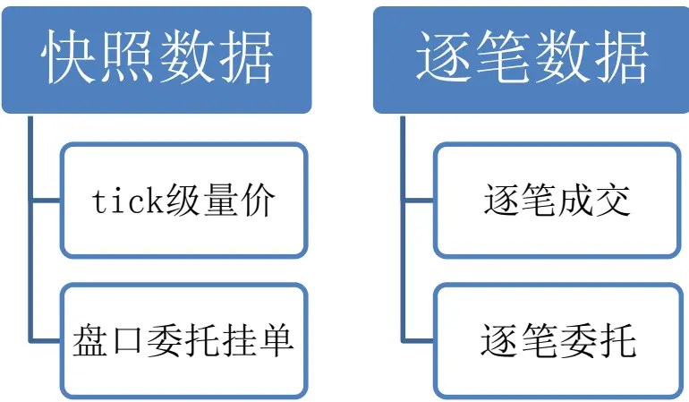
资料来源：wind，东兴证券研究所

## 1.1 快照数据

快照数据又称 tick 行情数据，展示的是3 秒一次的最新市场行情，包含的数据包括 tick 级的量价数据以及盘口委托挂单数据。下表展示快照数据的数据结构，本文所使用高频数据由 wind 提供。

表1：快照数据数据结构

| 字段名称 字段描述 | 类型 |
| --- | --- |
| code 代码 | string |
| date 日期 | int |
| time 时间 | int |
| price 成交价 | int |
| volume 成交量 | long |
| turnover 成交额 | long |

| 字段名称 | 字段描述 | 类型 |
| --- | --- | --- |
| matchitems | 成交笔数 | int |
| high | 最高价 | int |
| low | 最低价 | int |
| askprice | 十档叫卖价 | int |
| askvolume | 十档叫卖量 | long[ |
| bidprice | 十档叫买价 | int0 |
| bidvolume | 十档叫买量 | long[ |

资料来源：wind，东兴证券研究所

表2：快照数据示例 1

| code | date | time | price | volume | turnover | matchitems | high | low |
| --- | --- | --- | --- | --- | --- | --- | --- | --- |
| 000001.SZ | 20210813 | 92500000 | 197800 | 138600 | 2741508 | 152 | 197800 | 197800 |
| 000001.SZ | 20210813 | 93000000 | 197700 | 11600 | 229405 | 170 | 197900 | 197700 |
| 000001.SZ | 20210813 | 93003000 | 197800 | 48300 | 955263 | 252 | 197900 | 197700 |
| 000001.SZ | 20210813 | 93006000 | 197700 | 101300 | 2002748 | 307 | 197900 | 197600 |
| 000001.SZ | 20210813 | 93009000 | 197700 | 33200 | 656290 | 362 | 197900 | 197500 |
| 000001.SZ | 20210813 | 93012000 | 197600 | 49700 | 982750 | 437 | 197900 | 197500 |
| 000001.SZ | 20210813 | 93015000 | 197500 | 52500 | 1036429 | 498 | 197900 | 197100 |
| 000001.SZ | 20210813 | 93018000 | 197900 | 57159 | 1130825 | 571 | 197900 | 197100 |

资料来源：wind，东兴证券研究所

表3：快照数据示例 2

| code | date | time | askPrice1 | askVolume1 | bidPrice1 | bidVolume1 |
| --- | --- | --- | --- | --- | --- | --- |
| 000001.SZ | 20210813 | 93003000 | 197900 | 16400 | 197800 | 500 |
| 000001.SZ | 20210813 | 93006000 | 197800 | 19600 | 197700 | 700 |
| 000001.SZ | 20210813 | 93009000 | 197900 | 14538 | 197800 | 25100 |
| 000001.SZ | 20210813 | 93012000 | 197900 | 25200 | 197800 | 1500 |
| 000001.SZ | 20210813 | 93015000 | 197800 | 12300 | 197700 | 1500 |
| 000001.SZ | 20210813 | 93018000 | 197900 | 23000 | 197800 | 800 |

资料来源：wind，东兴证券研究所

tick 级量价数据记录了当前 tick 时间范围内的量价数据，包括高开低收价格、成交量、成交额以及成交笔数等数据。tick 级量价数据能够精准刻画股票日内价格波动，能够展现价格、成交量及成交笔数在时序上的分布和变化。

盘口委托挂单数据记录了 10 档深度的盘口挂单数据，包括挂单量、挂单价、委买委卖均价等。盘口挂单数据能够体现不同时刻投资者的买入卖出意愿，可以从挂单维度展现股票不同走势情形下的买入卖出压力。

## 1.2 逐笔数据

逐笔数据可以分为逐笔成交数据和逐笔委托数据。

如下表所示，逐笔成交数据记录了每一个时间点对应股票撮合交易的详细清单，包含成交的买卖双方订单号、成交价、成交量、BS 标志（买卖方向）等数据。逐笔委托数据记录交易所每个时间点收到的委买委卖的详细清单，包含买（卖）单号、委托价格、委托量、委托类型（包含撤单）等数据，逐笔委托数据与逐笔成交数据结构较为类似，在此不做额外展示。逐笔委托数据长期以来是深交所特有的高频数据，上交所的逐笔委托数据自 2021 年 5 月开始正式开始发布。

表4：逐笔成交数据结构

| 字段名称 字段描述 | 类型 |
| --- | --- |
| code 代码 | string |
| date 日期 | int |
| time 时间 | int |
| tradeprice 成交价 | int |
| tradevolume 成交量 | int |
| index 成交编号 | int |
| BSflag BS 标志 | char |
| askorder 卖单号 | int |
| bidorder 买单号 | int |

资料来源：wind.东兴证券研究所

表5：逐笔委托数据结构

| 字段名称 | 字段描述 类型 |
| --- | --- |
| code | 代码 string |
| date | 日期 int |
| time 时间 | int |
| orderprice | 成交价 int |
| ordervolume 成交量 | int |
| index 委托编号 | int |
| order | 交易所委托号 int |
| orderkind | 委托类型 char |
| functioncode | 委托代码（B/S/C） char |

资料来源：wind，东兴证券研究所

表6：逐笔成交数据示例

| code | date | time | tradeprice | tradevolume | index | BSflag | askorder | bidorder |
| --- | --- | --- | --- | --- | --- | --- | --- | --- |
| 000001.SZ | 20210813 | 93000110 | 197800 | 100 | 500894 | 66 | 495933 | 500893 |
| 000001.SZ | 20210813 | 93000120 | 197700 | 700 | 501368 | 83 | 501367 | 403449 |
| 000001.SZ | 20210813 | 93000120 | 197700 | 300 | 501369 | 83 | 501367 | 497766 |
| 000001.SZ | 20210813 | 93000120 | 197800 | 200 | 503563 | 66 | 495933 | 503562 |
| 000001.SZ | 20210813 | 93000120 | 197800 | 300 | 503564 | 66 | 500065 | 503562 |
| 000001.SZ | 20210813 | 93000130 | 197800 | 500 | 503565 | 66 | 500687 | 503562 |
| 000001.SZ | 20210813 | 93000160 | 197900 | 400 | 503566 | 66 | 333108 | 503562 |
| 000001.SZ | 20210813 | 93000210 | 197900 | 1000 | 503567 | 66 | 335376 | 503562 |

资料来源：wind，东兴证券研究所

逐笔成交数据是市场真实的单次成交状况，能够完整的展示市场买卖单撮合的具体情况，而逐笔委托数据是市场内投资者具体的挂单委托清单，能真实反映投资者买卖情绪。根据逐笔成交数据和逐笔委托数据，我们能够较为清晰的分析市场大小资金的流动、买卖单对手盘具体分布情况。

## 2.基于快照数据因子的构建

本篇报告作为高频数据系列报告第一篇，将基于快照数据中的高频量价数据构建相关因子，后续我们将进一步探究基于快照挂单数据、逐笔成交及逐笔委托数据的相关因子，请继续关注系列报告。

本章节描述的因子构建方法是基于一日的高频数据构建因子，一般应用于日频换仓（T+1）选股模型，后续章节会对日因子进行进一步处理以适应更长的持仓周期。

## 2.1 高低价格区间买卖行为的探究

股票在日内高低价格区间的波动会影响投资者的买入卖出意愿，如果股票在日内低价格区间交易量较大，尤其大资金活跃度较高，一定程度上体现了机构投资者对股票未来走势的信心，股票后续上涨可能性相对较高。我们探究使用快照数据追踪不同投资者在高低价格区间的买卖行为，以实现对未来收益的预测。

为了探究高低价格区间的市场微观结构是否对股票未来收益有预测作用，我们首先希望对股票日内走势区间的划分。过往量价因子在高低价格区间的判定往往是在日内最高最低价范围内进行线性划分，我们应用高频快照数据能在时序维度更精细地划分高低价格区间。

我们根据快照数据能够获取股票日内价格在时序上的分布，可以将处于全天的价格序列较高分位数的快照作为当天的高价格区间，将处于较低分位数的快照作为低价格区间，我们将探究高低价格区间内成交量、成交笔数以及平均每笔成交量的分布对股票未来收益的预测作用。

## 2.2 高低价格区间成交笔数占比因子

高低价格区间成交笔数占比因子是价格区间内所有快照的成交笔数累加与全天成交总笔数的比值。

$$
\frac{3}{159}\%+33\%\approx127.35\%+33.53\%=\frac{\sum_{j=1}^{N}matchitems*I_{\{j\in set.a\}}}{\sum_{j=1}^{N}matchitems}
$$

$I_{\{j\in set_{-}a\}}$ 表示快照所属区间的判断，其中，set_a 代表处于高低价格区间的快照集合，例如将20%作为价格区间判定标准，则计算高价格区间相关因子时，set_a 即为按照价格排序的前 20%快照的集合。

高低价格区间成交笔数占比因子能够反映价格区间内成交聚集程度。市场的每一笔成交是买卖双方委托单撮合的结果，在市场内机构、游资、散户等投资者下单方式较为固定的情况下，成交笔数的多少能够一定程度上反映市场投资行为的聚集度。

## 2.3 高低价格区间成交量占比因子

高低价格区间成交量占比因子是价格区间内所有快照的成交量数累加与全天成交总成交量的比值。

$$
\frac{1}{100}+11\times18\times17\times17\times17\times17\times17\times17\times17\times17\times17\times17\times17\times17\times17\times17\times17\times17\times17\times17\times17\times17\times17\times17\times17\times17\times17\times17\times17\times17\times17\times17\times17\times17\times17\times17\times17\times17\times17\times17\times17\times17\times17\times17\times17\times17\times17\times17\times17\times17\times17\times17\times17\times17\times17\times17\times17\times17\times17\times17\times17\times17\times17\times17\times17\times17\times17\times17\times17\times17\times17\times17\times17\times17\times17\times17\times17\times17\times17\times17\times17\times17\times17\times17\times17\times17\times17\times17\times17\times17\times17\times17\times17\times17\times17\times17\times17\times17\times17\times17\times17\times17\times17\times17\times17\times17\times17\times17\times17\times17\times17\times17\times17\times17\times17\times17\times17\times17\times17\times17\times1\times17\times17\times17\times17\times1\times17\times17\times17\times1\times17\times1\times17\times17\times1\times17\times1\times17\times1\times17\times1\times17\times1\times1\times17\times1\times1\times1\times17\times1\times1\times101\times1\times1\times1\times1\times1\times1\times10\times1\times1\times1\times11\times1\times1\times1\times1\times1\times1\times1\times
$$

$I_{\{j\in set_{-}a\}}$ 表示快照所属区间的判断，其中，set_a 代表处于高低价格区间的快照集合。

高低价格区间成交量占比因子能够体现价格区间内交易资金量大小，直观体现交易的活跃程度。股票日内快照数据中的成交量与成交笔数的相关性很高，但又包含不同的信息，成交量直观地体现了当前参与交易的资金量，成交笔数一定程度上反映了参与交易的投资者数量、下单的模式以及买卖方撮合的情况。

## 2.4 高低价格区间平均每笔成交量因子

高低价格区间平均每笔成交量因子是将目标价格区间内的平均每笔成交量与全天平均水平进行比较。

$$
\int_{-2}^{\infty}\int\mathop{\mathbb{A}}\langle\mathcal{A}\rangle\mathbin{\mathbb{A}}^{2}\mathrm{E}\langle\mathcal{H}\rangle\mathop{\mathbb{A}}\int\to{\mathbb{A}}\int\oplus\mathrm{E}\langle\mathrm{A}\mathbin{\mathbb{A}}\mathbin{\mathbb{A}}\mathbin{\mathbb{A}}^{\infty}\mathbin{\mathbb{A}}\mathbin{\mathbb{A}}\mathbin{\mathbb{A}}\mathbin{\mathbb{A}}\mathbin{\mathbb{A}}\mathbin{\mathbb{A}}\mathbin{\mathbb{A}}\mathbin{\mathbb{A}}\mathbin{\mathbb{A}}\mathbin{\mathbb{A}}\mathbin{\mathbb{A}}\mathbin{\mathbb{A}}\mathbin{\mathbb{A}}\mathbin{\mathbb{A}}\mathbin{\mathbb{A}}\mathbin{\mathbb{A}}\mathbin{\mathbb{A}}\mathbin{\mathbb{A}}\mathbin{\mathbb{A}}\mathbin{\mathbb{A}}\mathbin{\mathbb{A}}\mathbin{\mathbb{A}}\mathbin{\mathbb{A}}\mathbin{\mathbb{A}}\mathbin{\mathbb{A}}\mathbin{\mathbb{A}}\mathbin{\mathbb{A}}\mathbin{\mathbb{A}}\mathbin{\mathbb{A}}\mathbin{\mathbb{A}}\mathbin{\mathbb{A}}\mathbin{\mathbb{A}}\mathbin{\mathbb{A}}\mathbin{\mathbb{A}}\mathbin{\mathbb{A}}\mathbin{\mathbb{A}}\mathbin{\mathbb{A}}\mathbin{\mathbb{A}}\mathbin{\mathbb{A}}\mathbin{\mathbb{A}}\mathbin{\mathbb{A}}\mathbin{\mathbb{A}}\mathbin{\mathbb{A}}\mathbin{\mathbb{A}}\mathbin{\mathbb{A}}\mathbin{\mathbb{A}}\mathbin{\mathbb{A}}\mathbin{\mathbb{A}}\mathbin{\mathbb{A}}\mathbin{\mathbb{A}}\mathbin{\mathbb{A}}\mathbin{\mathbb{A}}\mathbin{\mathbb{A}}\mathbin{\mathbb{A}}\mathbin{\mathbb{A}}\mathbin{\mathbb{A}}\mathbin{\mathbb{A}}\mathbin{\mathbb{A}}\mathbin{\mathbb{A}}\mathbin{\mathbb{A}}\mathbin{\mathbb{A}}\mathbin{\mathbb{A}}\mathbin\mathbb
$$

$I_{\{j\in set_{-}a\}}$ 表示快照所属区间的判断，其中，set_a 代表处于高低价格区间的快照集合。

高低价格区间平均每笔成交量因子能够衡量大小资金在股票日内高低价格区间的活跃程度。若价格区间内平均每笔成交量相对全天水平较大，则说明在这个区间内大资金相对活跃。

## 3.因子的测试

## 3.1 高频数据因子的日频换仓测试

为了评估高频数据因子的有效性，我们采用因子 IC 测试和构建分位数组合的方法进行研究。考虑到中证 500股票池市值适中，是最为常用的投资标的之一，我们将高低价格区间成交笔数与成交量占比因子和平均每笔成交量因子在中证 500 股票池范围内进行测试，回测时间范围为 2016 年 7 月至 2021 年 8 月，因子回测分组数量为 5 组，换仓频率为日频，换仓时间点为开盘。

## 3.1.1高低价格区间成交笔数占比因子日频测试

高低价格区间成交笔数占比因子的 IC 统计如下表所示，高价格区间成交笔数占比因子与股票未来收益呈现显著的负相关性，20%价格区间的高价格区间成交笔数因子 IC 达到-3.01%，ICIR 达到-0.29。低价格区间成交笔数占比因子与股票未来收益呈现正相关性，30%价格区间因子的 IC 达到 2.43%，ICIR 为 0.23。

表7：高低价格区间成交笔数占比因子 IC统计

| 因子 | 价格区间 | 平均值 | 标准差 | 最小值 | 最大值 | ICIR | t统计量 |
| --- | --- | --- | --- | --- | --- | --- | --- |
| 高价格区间成交笔数因子 | 20% | -3.01% | 10.28% | -31.60% | 40.28% | -0.29 | -10.37 |
| 高价格区间成交笔数因子 | 30% | -2.90% | 10.25% | -31.01% | 42.41% | -0.28 | -10.01 |
| 低价格区间成交笔数因子 | 20% | 1.87% | 10.30% | -40.48% | 33.24% | 0.18 | 6.42 |
| 低价格区间成交笔数因子 | 30% | 2.43% | 10.61% | -31.10% | 33.49% | 0.23 | 8.10 |

资料来源：wind，东兴证券研究所

图2：高价格区间成交笔数因子（20%）分组超额收益率
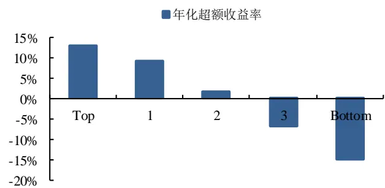
资料来源：wind，东兴证券研究所

图3：高价格区间成交笔数因子（30%）分组超额收益率
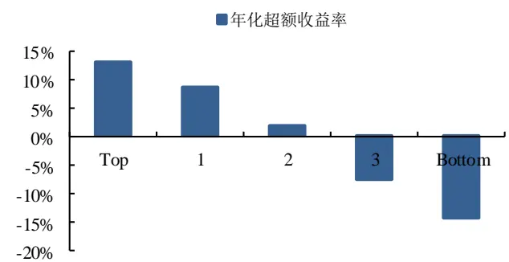
资料来源：wind，东兴证券研究所

图4：低价格区间成交笔数因子（20%）分组超额收益率
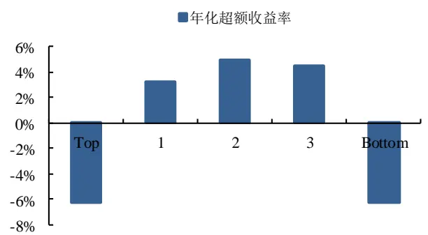
资料来源：wind.东兴证券研究所

图5：低价格区间成交笔数因子（30%）分组超额收益率
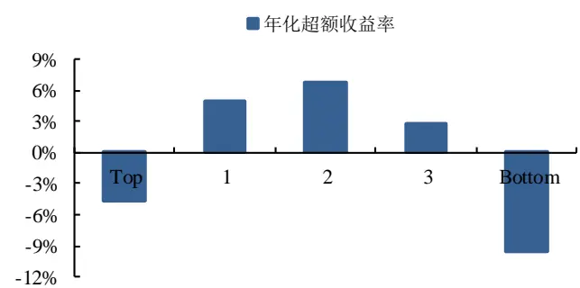
资料来源：wind.东兴证券研究所

对于分位数组合测试，我们按照因子值从高到低，将所有股票 5 组，分别等权构建 Top 组合至 Bottom组合，做多组合 Top 同时做空组合 Bottom，得到多空组合（L-S 组合），通过该组合的表现来衡量因子的预测能力。

从高价格区间成交笔数因子的分位数组合表现可以看出，从 Top 组合至 Bottom 组合，年化收益率基本呈现出单调递减的趋势，Top 组合至 Bottom 组合的差异非常明显，Top 组合的年化收益率显著超过市场平均收益率。

从低价格区间成交笔数因子的分位数组合表现可以看到，因子的分层收益呈现明显规律，但不完全单调，此类因子对未来收益的预测作用相对不稳定，但可能适用于非线性选股模型，本篇报告重点关注线性相关因子，对此不做更深入探究。

表8：高价格区间成交笔数因子（20%）分位数组合表现

| 组合 | 年化收益率 | 波动率 | 夏普比率 | 最大回撤 | 年化超额收益率 | 跟踪误差 | 信息比率 | 超额最大回撤 |
| --- | --- | --- | --- | --- | --- | --- | --- | --- |
| Top | 3.41% | 21.27% | 0.16 | 24.33% | 12.75% | 5.16% | 2.47 | 12.67% |
| Bottom | -21.76% | 20.04% | -1.09 | 73.47% | -14.92% | 5.40% | -2.76 | 56.99% |
| 市场 | -8.28% | 20.58% | -0.40 | 45.97% |  | - | - | - |
| L-S | 31.89% | 9.50% | 3.36 | 13.36% |  |  |  |  |

资料来源：wind，东兴证券研究所

从高价格区间成交笔数因子（20%）的分位数组合的净值可以看出，Top 组合的表现显著跑赢市场组合，年化超额收益率为 12.75%。而 Bottom 组合的表现显著跑输市场组合，年化超额收益率为-14.92%。

多空组合收益与净值显示，多空组合净值呈现稳步增加趋势，多空组合的年化收益率为 31.89%，夏普比率为 3.36，多空净值的最大回撤仅为 13.36%。

图6：高价格区间成交笔数因子（20%）分位数组合与多空组合净值
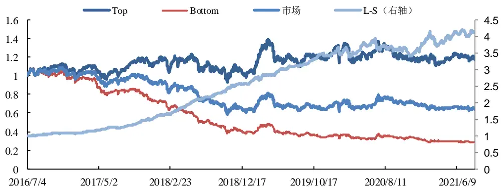
资料来源：wind.东兴证券研究所

## 3.1.2高低价格区间成交量占比因子日频测试

高低价格区间成交量占比因子的 IC 统计如下表所示，高价格区间成交量占比因子与股票未来收益呈现显著的负相关性，20%价格区间的高价格区间成交笔数因子 IC 达到-3.87%，ICIR 达到-0.38。低价格区间成交量占比因子与股票未来收益呈现正相关性，30%价格区间因子的 IC 达到 3.25%，ICIR 为 0.31。

表9：高低价格区间成交量占比因子 IC统计

| 因子 | 价格区间 | 平均值 | 标准差 | 最小值 | 最大值 | ICIR | t统计量 |
| --- | --- | --- | --- | --- | --- | --- | --- |
| 高价格区间成交量因子 | 20% | -3.87% | 10.06% | -33.05% | 37.90% | -0.38 | -13.61 |
| 高价格区间成交量因子 | 30% | -3.81% | 10.06% | -34.74% | 41.19% | -0.38 | -13.39 |
| 低价格区间成交量因子 | 20% | 2.83% | 9.98% | -37.04% | 33.82% | 0.28 | 10.05 |
| 低价格区间成交量因子 | 30% | 3.25% | 10.32% | -29.76% | 34.24% | 0.31 | 11.14 |

资料来源：wind.东兴证券研究所

图7：高价格区间成交量因子（20%）分组超额收益率
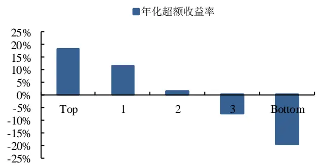
资料来源：wind，东兴证券研究所

图8：高价格区间成交量因子（30%）分组超额收益率
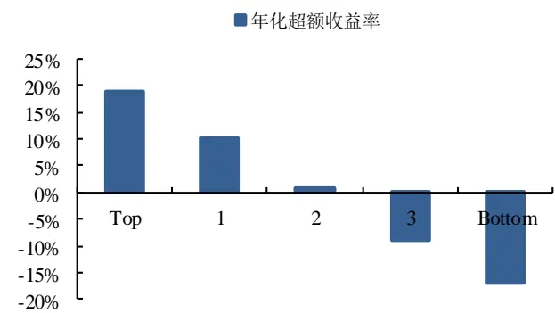
资料来源：wind，东兴证券研究所

从高价格区间成交量因子的分位数组合表现可以看出，从 Top 组合至 Bottom 组合，年化收益率基本呈现出单调递减的趋势，Top 组合至 Bottom 组合的差异非常明显，Top 组合的年化收益率显著超过市场平均收益率。与成交笔数因子类似，从低价格区间成交量因子也是非线性因子，分层收益呈现明显规律，但不完全单调。

表10：高价格区间成交量因子（20%）分位数组合表现

| 组合 | 年化收益率 | 波动率 | 夏普比率 | 最大回撤 | 年化超额收益率 | 跟踪误差 | 信息比率 | 超额最大回撤 |
| --- | --- | --- | --- | --- | --- | --- | --- | --- |
| Top | 8.47% | 21.01% | 0.40 | 21.49% | 18.22% | 4.94% | 3.69 | 9.63% |
| Bottom | -26.15% | 20.00% | -1.31 | 80.25% | -19.70% | 5.43% | -3.63 | 68.07% |
| 市场 | -8.28% | 20.58% | -0.40 | 45.97% |  | - | - | - |
| L-S | 46.50% | 9.26% | 5.02 | 11.59% |  |  |  |  |

资料来源：wind，东兴证券研究所

从高价格区间成交量因子（20%）的分位数组合的净值可以看出，Top 组合的表现显著跑赢市场组合，年化超额收益率为 18.22%。而 Bottom 组合的表现显著跑输市场组合，年化超额收益率为-19.70%。

多空组合收益与净值显示，多空组合净值呈现稳步增加趋势，多空组合的年化收益率为 46.50%，夏普比率为 5.02，多空净值的最大回撤仅为 11.59%。

图9：高价格区间成交量因子（20%）分位数组合与多空组合净值
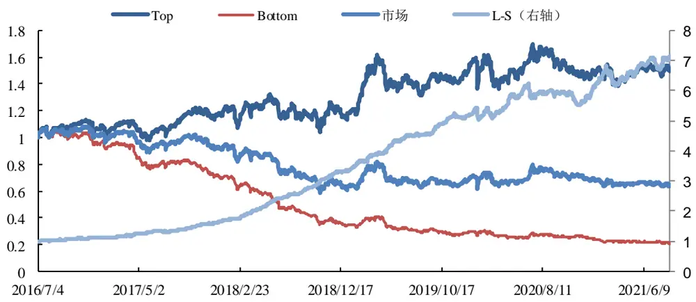
资料来源：wind.东兴证券研究所

## 3.1.3高低价格区间平均每笔成交量因子日频测试

高低价格区间平均每笔成交量因子的 IC 统计如下表所示，高价格区间平均每笔成交量因子与股票未来收益呈现显著的负相关性，30%价格区间的高价格区间平均每笔成交量因子 IC 达到-2.96%，ICIR 达到-0.42。低价格区间平均每笔成交量因子与股票未来收益呈现正相关性，10%价格区间因子的 IC 达到 2.81%，ICIR 为0.42。

表11：高低价格区间平均每笔成交量因子 IC统计

| 因子 | 价格区间 | 平均值 | 标准差 | 最小值 | 最大值 | ICIR | t统计量 |
| --- | --- | --- | --- | --- | --- | --- | --- |
| 高价格区间平均每笔成交量 | 10% | -2.53% | 7.03% | -26.95% | 22.12% | -0.36 | -12.71 |
| 高价格区间平均每笔成交量 | 20% | -2.83% | 7.12% | -25.38% | 24.08% | -0.40 | -14.09 |
| 高价格区间平均每笔成交量 | 30% | -2.96% | 7.06% | -25.70% | 26.43% | -0.42 | -14.85 |
| 低价格区间平均每笔成交量 | 10% | 2.81% | 6.76% | -25.31% | 26.93% | 0.42 | 14.70 |
| 低价格区间平均每笔成交量 | 20% | 2.82% | 7.01% | -25.13% | 26.89% | 0.40 | 14.24 |
| 低价格区间平均每笔成交量 | 30% | 2.73% | 7.12% | -26.15% | 26.48% | 0.38 | 13.54 |

资料来源：wind，东兴证券研究所

图10：高价格区间平均每笔成交量（10%）分组超额收益率
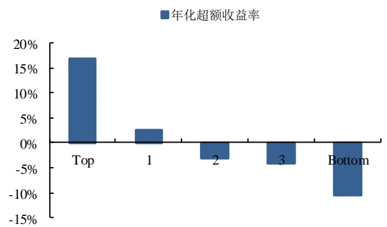
资料来源：wind，东兴证券研究所

图11：高价格区间平均每笔成交量（30%）分组超额收益率
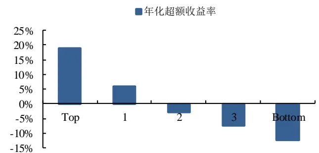
资料来源：wind，东兴证券研究所

图12：低价格区间平均每笔成交量（10%）分组超额收益率
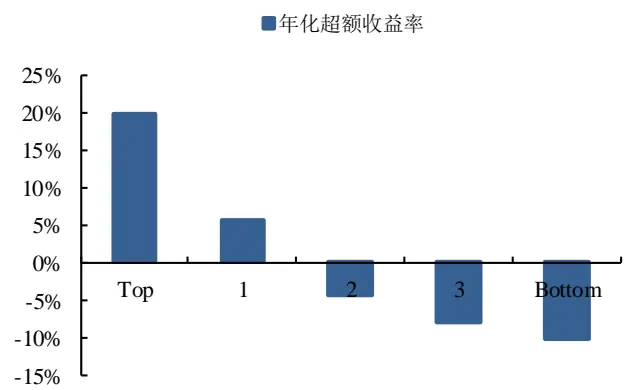
资料来源：wind.东兴证券研究所

图13：低价格区间平均每笔成交量（30%）分组超额收益率
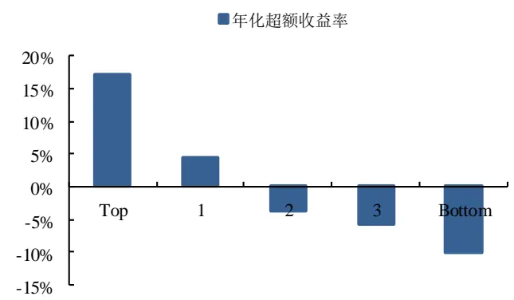
资料来源：wind.东兴证券研究所

从高低价格区间平均每笔成交量因子的分位数组合表现可以看出，从 Top 组合至 Bottom 组合，年化收益率基本呈现出单调递减的趋势，Top 组合至 Bottom 组合的差异非常明显，Top 组合的年化收益率显著超过市场平均收益率。

表12：低价格区间平均每笔成交量因子（10%）分位数组合表现

| 组合 | 年化收益率 | 波动率 | 夏普比率 | 最大回撤 | 年化超额收益率 | 跟踪误差 | 信息比率 | 超额最大回撤 |
| --- | --- | --- | --- | --- | --- | --- | --- | --- |
| Top | 10.00% | 19.89% | 0.50 | 25.51% | 19.67% | 3.79% | 5.19 | 4.17% |
| Bottom | -17.51% | 20.13% | -0.87 | 65.36% | -10.21% | 3.98% | -2.56 | 42.82% |
| 市场 | -8.28% | 20.58% | -0.40 | 45.97% |  |  | - |  |
| L-S | 33.00% | 6.16% | 5.36 | 5.64% |  |  |  |  |

资料来源：wind，东兴证券研究所

从低价格区间平均每笔成交量因子（10%）的分位数组合的净值可以看出，Top 组合的表现显著跑赢市场组合，年化超额收益率为 19.67%。而 Bottom 组合的表现显著跑输市场组合，年化超额收益率为-10.21%。

多空组合收益与净值显示，多空组合净值呈现稳步增加趋势，多空组合的年化收益率为 33.00%，夏普比率为 5.36，多空净值的最大回撤仅为 5.64%。

图14：低价格区间平均每笔成交量因子（10%）分位数组合与多空组合净值
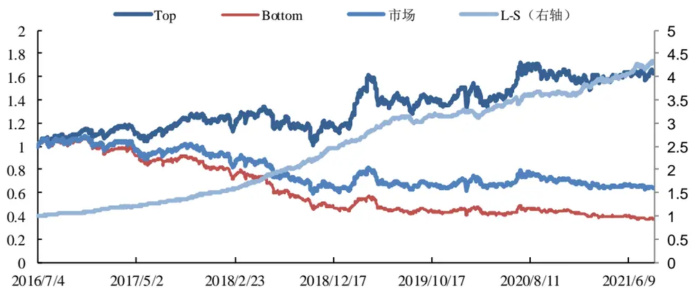
资料来源：wind，东兴证券研究所

## 3.2 高频因子低频化处理

单个日因子的多头收益不足以覆盖交易成本，我们考虑对日因子进行进一步加工处理，以提高因子的稳定性和因子在更长持仓周期的收益，我们尝试采用以下两种方法：

## 1. 移动平均处理

回溯计算周期 T 日内所有日因子，计算平均值作为当前因子值。（T = 5,10）

## 2. 加权移动平均

回溯计算周期 T 日内所有日因子，采用指数加权均值作为当前因子值，距离调仓日越近，日因子值权重越大。

$$
\sin\xi\overrightarrow{x}+\xi\overrightarrow{\xi}-\Big>\cdot\overrightarrow{\xi}+\frac{\mu}{\Delta t}\overrightarrow{\mathcal{F}}-\frac{\sum_{t=1}^{T}S_{t}\ast k^{T-t+1}}{\sum_{t=1}^{T}k^{T-t+1}}
$$

$S_{t}$ 为第 t 日的因子值，k 为加权参数。 （T = 5,10 k = 0.8）

## 3.3 高频数据因子的周频换仓测试

回测股票池为中证 500，回测时间范围为 2016 年 7 月至 2021 年 8 月，因子回测分组数量为 5 组，换仓频率为周频，换仓时间点为周初，交易价格为开盘价。

三类高频快照因子在不同处理方式下的 IC 统计如下表所示，使用多日因子值合成后的因子的预测效果显著好于单日因子，高低价格区间成交笔数与成交量占比因子在5日加权平均处理后在周频换仓测试下效果较好，低价格区间平均每笔成交量因子在 10 日加权平均处理后效果更佳。

表13：快照因子周频测试 IC及多空组合表现

| 因子 | 价格区间 | 处理方式 | IC | ICIR | 多空收益率 | 多空夏普率 |
| --- | --- | --- | --- | --- | --- | --- |
| 高价格区间成交笔数因子 | 20% | 不处理 | -2.82% | -0.27 | 10.42% | 1.07 |
| 高价格区间成交笔数因子 | 20% | 移动平均（5）* | -3.38% | -0.24 | 17.06% | 1.34 |
| 高价格区间成交笔数因子 | 20% | 加权平均（5） | -3.37% | -0.24 | 17.93% | 1.44 |
| 高价格区间成交笔数因子 | 20% | 加权平均（10） | -3.29% | -0.22 | 17.06% | 1.29 |
| 高价格区间成交量因子 | 20% | 不处理 | -3.09% | -0.31 | 14.76% | 1.57 |
| 高价格区间成交量因子 | 20% | 移动平均（5） | -3.57% | -0.26 | 17.29% | 1.43 |
| 高价格区间成交量因子 | 20% | 加权平均（5） | -3.64% | -0.27 | 17.99% | 1.51 |
| 高价格区间成交量因子 | 20% | 加权平均（10） | -3.56% | -0.25 | 18.50% | 1.46 |
| 低价格区间平均每笔成交量因子 | 10% | 不处理 | 2.93% | 0.44 | 15.89% | 2.35 |
| 低价格区间平均每笔成交量因子 | 10% | 移动平均（5） | 3.67% | 0.48 | 16.08% | 2.05 |
| 低价格区间平均每笔成交量因子 | 10% | 加权平均（5） | 4.00% | 0.52 | 19.53% | 2.61 |
| 低价格区间平均每笔成交量因子 | 10% | 加权平均（10） | 4.58% | 0.58 | 20.73% | 2.63 |

*因子处理的计算周期
资料来源：wind，东兴证券研究所

下方图表展示了经过加工处理后的三类因子在周频回测中的多空收益表现，可以看到三类因子的 IC 及多空组合表现较好，能够保持较为稳定的选股效果，其中低价格区间平均每笔成交量因子的多空收益表现最佳，年化收益达到 20.73%,多空夏普率为 2.63。

表14：高价格区间成交笔数因子（20%）-加权平均（5）分位数组合表现

| 组合 | 年化收益率 | 波动率 | 夏普比率 | 最大回撤 | 年化超额收益率 | 跟踪误差 | 信息比率 | 超额最大回撤 |
| --- | --- | --- | --- | --- | --- | --- | --- | --- |
| Top | 11.06% | 21.86% | 0.51 | 27.25% | 8.90% | 6.90% | 1.29 | 8.09% |
| Bottom | -6.42% | 21.06% | -0.30 | 51.33% | -8.36% | 6.38% | -1.31 | 41.88% |
| 市场 | 1.87% | 21.24% | 0.09 | 38.32% |  |  | - | - |
| L-S | 17.93% | 12.41% | 1.44 | 15.05% |  |  |  |  |

资料来源：wind，东兴证券研究所

图15：高价格区间成交笔数因子（20%）-加权平均（5）分位数组合与多空组合净值
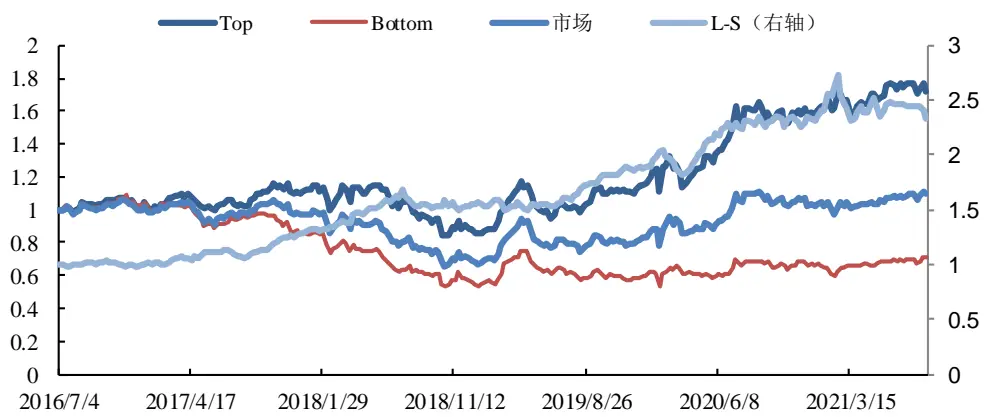
资料来源：wind，东兴证券研究所

表15：高价格区间成交量因子（20%）-加权平均（5）分位数组合表现

| 组合 | 年化收益率 | 波动率 | 夏普比率 | 最大回撤 | 年化超额收益率 | 跟踪误差 | 信息比率 | 超额最大回撤 |
| --- | --- | --- | --- | --- | --- | --- | --- | --- |
| Top | 10.51% | 21.84% | 0.48 | 32.09% | 8.39% | 6.39% | 1.31 | 8.39% |
| Bottom | -6.88% | 21.04% | -0.33 | 51.93% | -8.82% | 6.44% | -1.37 | 43.05% |
| 市场 | 1.87% | 21.24% | 0.09 | 38.32% |  | - | • | 1 |
| L-S | 17.99% | 11.93% | 1.51 | 15.38% |  |  |  |  |

资料来源：wind，东兴证券研究所

图16：高价格区间成交量因子（20%）-加权平均（5）分位数组合与多空组合净值
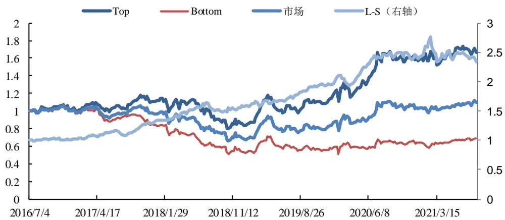
资料来源：wind，东兴证券研究所

表16：低价格区间平均每笔成交量因子（10%）-加权平均（10）分位数组合表现

| 组合 | 年化收益率 | 波动率 | 夏普比率 | 最大回撤 | 年化超额收益率 | 跟踪误差 | 信息比率 | 超额最大回撤 |
| --- | --- | --- | --- | --- | --- | --- | --- | --- |
| Top | 12.59% | 20.67% | 0.61 | 28.10% | 10.38% | 4.68% | 2.22 | 7.72% |
| Bottom | -7.26% | 21.67% | -0.33 | 49.31% | -8.87% | 4.31% | -2.06 | 39.90% |
| 市场 | 1.78% | 21.22% | 0.08 | 38.12% |  |  |  |  |
| L-S | 20.73% | 7.88% | 2.63 | 9.82% |  |  |  |  |

资料来源：wind，东兴证券研究所

图17：低价格区间平均每笔成交量因子（10%）-加权平均（10）分位数组合与多空组合净值
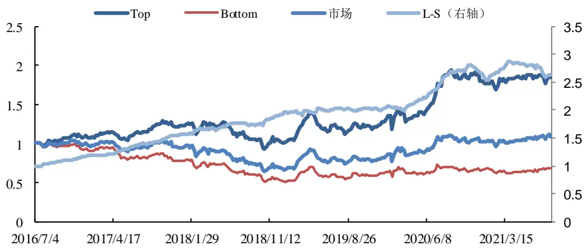
资料来源：wind.东兴证券研究所

## 3.4 因子测试结果总结

1. 高价格区间成交笔数与成交量因子与股票未来收益呈现显著的负相关性，即股票在日内高价格区间投资行为聚集程度与成交活跃度越低，未来上涨可能性越大。当股票在日内高价格区间成交量或成交笔数占比较高时，大资金高位出货或散户盲目追涨的可能性相对较大，股票可能处于“过度追捧”状态，后续走势不被看好。

2. 低价格区间平均每笔成交量因子与股票未来收益呈现显著的正相关性，即低价格区间的平均每笔成交量越大，大资金活跃程度越高，股票未来上涨可能性越大。

3．经过加工处理后的三类因子在周频回测中，IC 及多空组合表现较好，能够保持较为稳定的选股效果。

## 4.构建基于行为追踪因子的策略

## 4.1 行为追踪因子

单因子测试结果显示，本文构建的三类基于快照的高低价格区间相关因子均对股票未来收益有着显著预测作用，其中高价格区间成交笔数因子能够刻画价格区间内的成交聚集度，高价格区间成交量因子能够反映价格区间内的成交活跃度，而低价格区间平均每笔成交量因子能够体现机构投资者在股票日内低位波动阶段的参与度。

我们将三类因子合成市场行为追踪因子，考虑到高价格区间成交笔数因子与成交量因子的高相关性，我们将三类因子标准化处理后以（0.25,0.25,0.5）的权重进行合成。

表17：因子相关性分析

| 组合 | 高价格区间成交笔数因子 | 高价格区间成交量因子 | 低价格区间平均每笔成交量因子 |
| --- | --- | --- | --- |
| 高价格区间成交笔数因子 | 1.00 | 0.87 | -0.08 |
| 高价格区间成交量因子 | 0.87 | 1.00 | -0.26 |
| 低价格区间平均每笔成交量 因子 | -0.08 | -0.26 | 1.00 |

资料来源：wind，东兴证券研究所

## 4.1.1行为追踪因子日频测试

将三类日因子按照权重合成行为追踪因子，下表展示合成后因子的 IC 与多空组合的表现，可以看到行为追踪因子的 IC 绝对值达到 3.99%，ICIR 为 0.45，多空收益达到 50.01%，好于三类因子的回测结果。

表18：行为追踪因子日频测试 IC及多空表现对比

| 因子 | 价格区间 | IC | ICIR | 多空收益率 | 多空夏普率 | 多空最大回撤 |
| --- | --- | --- | --- | --- | --- | --- |
| 高价格区间成交笔数因子 | 20% | -3.01% | -0.29 | 31.89% | 3.36 | 13.36% |
| 高价格区间成交量因子 | 20% | -3.87% | -0.38 | 46.50% | 5.02 | 11.59% |
| 低价格区间平均每笔成交量因子 | 10% | 2.81% | 0.42 | 33.00% | 5.36 | 5.64% |
| 行为追踪因子 | - | 3.99% | 0.45 | 50.01% | 6.20 | 8.20% |

资料来源：wind，东兴证券研究所

图18：行为追踪因子分组超额收益率-日频测试
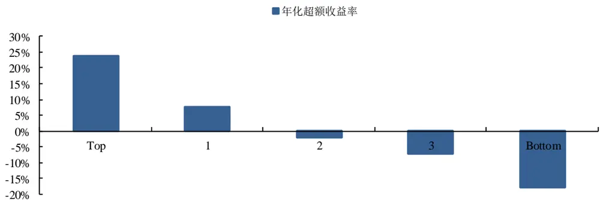
资料来源：wind，东兴证券研究所

表19：行为追踪因子分位数组合表现-日频

| 组合 | 年化收益率 | 波动率 | 夏普比率 | 最大回撤 | 年化超额收益率 | 跟踪误差 | 信息比率 | 超额最大回撤 |
| --- | --- | --- | --- | --- | --- | --- | --- | --- |
| Top | 12.72% | 20.64% | 0.62 | 22.96% | 23.69% | 4.48% | 5.29 | 4.95% |
| Bottom | -25.04% | 19.98% | -1.25 | 78.57% | -17.85% | 4.72% | -3.78 | 63.72% |
| 市场 | -8.96% | 20.59% | -0.44 | 46.71% |  |  |  |  |
| L-S | 50.01% | 8.06% | 6.20 | 8.20% |  |  |  |  |

资料来源：wind，东兴证券研究所

图19：行为追踪因子分位数组合与多空组合净值-日频测试
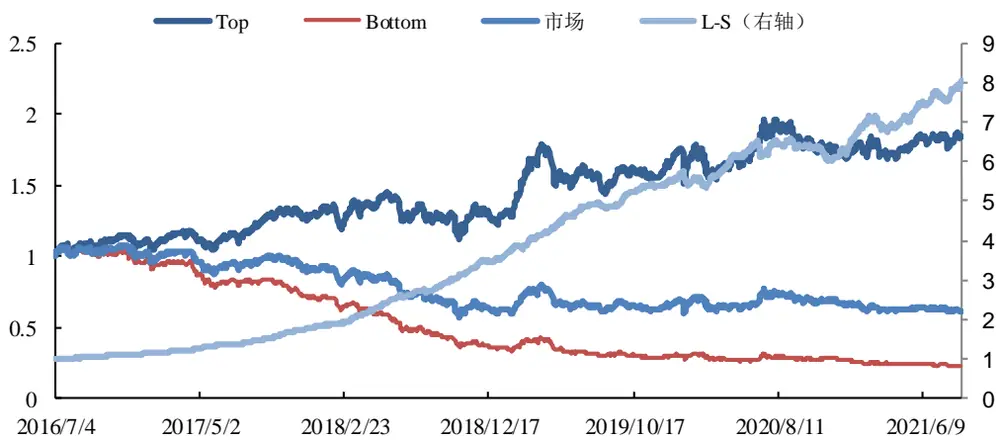
资料来源：wind，东兴证券研究所

## 4.1.2行为追踪因子周频测试

将三类因子周频处理后按照设定的权重合成周频行为追踪因子，其中高价格区间成交笔数和成交量因子为 5日加权平均处理，低价格区间平均每笔成交量因子为 10 日加权平均处理。

下表展示合成后因子的 IC 与多空组合的表现，可以看到周频行为追踪因子的 IC 绝对值达到 5.12%，多空收益达到 25.86%，多空最大回撤仅为 8.08%，好于三类因子的周频回测结果。

表20：行为追踪因子周频测试 IC及多空表现对比

| 因子 | 价格区间 | IC | ICIR | 多空收益率 | 多空夏普率 | 多空最大回撤 |
| --- | --- | --- | --- | --- | --- | --- |
| 高价格区间成交笔数因子 | 20% | -3.37% | -0.24 | 17.93% | 1.44 | 15.05% |
| 高价格区间成交量因子 | 20% | -3.64% | -0.27 | 17.99% | 1.51 | 15.38% |
| 低价格区间平均每笔成交量因子 | 10% | 4.58% | 0.58 | 20.73% | 2.63 | 9.82% |
| 行为追踪因子 | - | 5.12% | 0.47 | 25.86% | 2.66 | 8.08% |

资料来源：wind，东兴证券研究所

图20：行为追踪因子分组超额收益率-周频测试
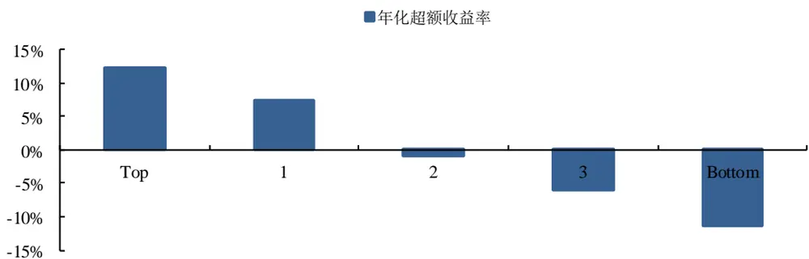
资料来源：wind，东兴证券研究所

表21：行为追踪因子分位数组合表现-周频

| 组合 | 年化收益率 | 波动率 | 夏普比率 | 最大回撤 | 年化超额收益率 | 跟踪误差 | 信息比率 | 超额最大回撤 |
| --- | --- | --- | --- | --- | --- | --- | --- | --- |
| Top | 14.67% | 21.13% | 0.69 | 29.08% | 12.18% | 5.32% | 2.29 | 5.97% |
| Bottom | -9.46% | 21.61% | -0.44 | 55.38% | -11.34% | 5.39% | -2.10 | 48.08% |
| 市场 | 2.04% | 21.32% | 0.10 | 39.01% |  |  |  |  |
| L-S | 25.86% | 9.72% | 2.66 | 8.08% |  |  |  |  |

资料来源：东兴证券研究所

图21：行为追踪因子分位数组合与多空组合净值-周频测试
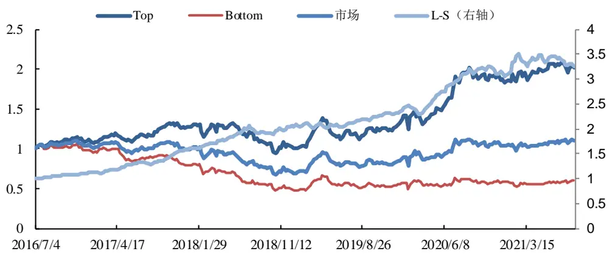
资料来源：wind，东兴证券研究所

## 4.2 构建基于行为追踪因子的策略

我们基于上文所述的基于高频快照数据的行为追踪因子构建周频换仓策略，以实现超额收益。策略选择中证500 股票池，周频调仓，周初开盘换仓，回测时间为 2016 年 7 月至 2021 年 8 月，持仓股票数为100 只，持仓行业权重分布依照股票池行业分布调整，交易成本为单边千一。

图22：行为追踪策略多头净值-周频测试
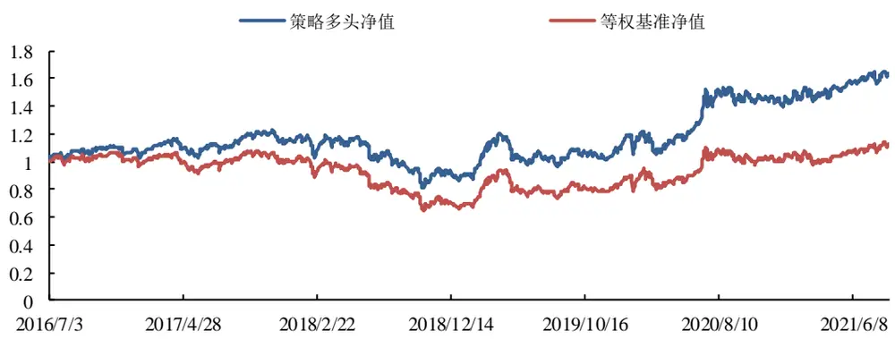
资料来源：wind，东兴证券研究所

上图展示了基于行为追踪因子策略的多头净值表现。可以看出，策略相比等权基准有较为明显的优势。从下图的超额净值可以看出来，超额收益整体稳步增加，回撤较小。

图23：行为追踪策略超额净值-周频测试
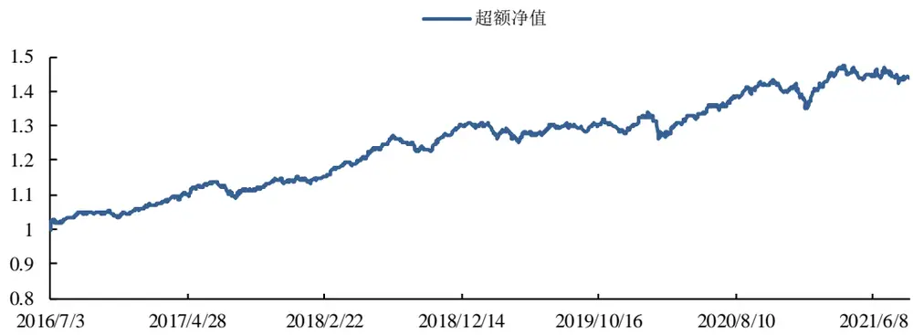
资料来源：wind，东兴证券研究所

整个回测时间段，基于行为追踪因子策略的年化收益率为 10.13%，而等权基准仅为 2.36%。年化超额收益率为 7.34%，夏普比率为 0.50，信息比率为 1.54。

表22：基于行为追踪因子策略组合收益、风险指标

| 指标 | 行为追踪因子策略 | 等权基准 |
| --- | --- | --- |
| 年化收益率 | 10.13% | 2.36% |
| 年化波动率 | 20.45% | 20.69% |
| 夏普比率 | 0.50 | 0.11 |
| 最大回撤 | 31.22% | 35.10% |
| 年化超额收益率 | 7.34% | 1 |
| 跟踪误差 | 4.85% |  |
| 信息比率 | 1.54 |  |
| 超额最大回撤 | 5.71% |  |
| 双边换手率 | 123.08% |  |

资料来源：wind，东兴证券研究所

如下图所示，我们统计了策略分年度的收益率与超额收益率。在回测期间内，除了 2019 策略表现与基准基本持平，其余 5 年范围内均取得了较为显著的超额收益，在 2018 年，策略实现了 14.29%的超额收益率。

图24：行为追踪策略分年度收益率
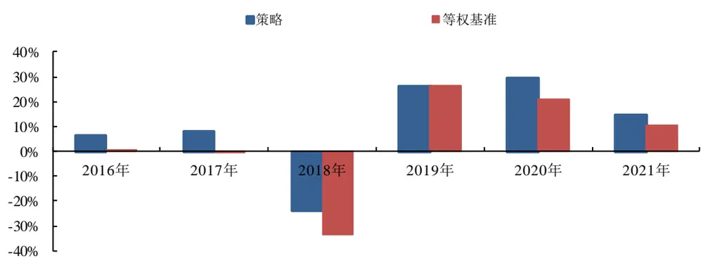
资料来源：wind，东兴证券研究所

图25：行为追踪策略分年度超额收益率
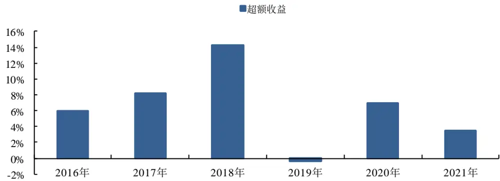
资料来源：wind，东兴证券研究所

综上，我们根据基于快照数据的行为追踪因子构建了周频换仓策略，在 2016 年至 2021 年范围内回测，最终实现了 10.13%的年化收益率，相比于等权组合取得 7.34%的年化超额收益率，信息比率为 1.54，值得关注。

## 5. 总结

本文初探了基于高频数据的市场微观结构，构建了高低价格区间成交笔数因子、成交量因子和平均每笔成交量三类因子，其中成交笔数因子能够反映价格区间内的成交聚集度、成交量因子体现了成交活跃度，而平均每笔成交量因子能够衡量大小资金在对应价格区间的参与程度。回测结果显示三类因子在日频、周频换仓情况下均有良好的选股效果。

我们基于三类因子按相应权重合成基于快照数据的市场行为追踪因子，回测结果显示高频快照寻踪因子表现好于合成前任一因子，日频测试 IC 绝对值达到 3.99%，ICIR 为 0.45，多空收益达到 50.01%，周频行为追踪因子的 IC 绝对值达到 5.12%，多空收益达到 25.86%，多空最大回撤仅为 8.08%。

基于高频快照寻踪因子构建的周频换仓策略表现较好，在 2016 年7 月至 2021 年8 月范围内实现了 10.13%的年化收益率，相比于等权组合取得 7.34%的年化超额收益率，信息比率为 1.54。

## 6. 风险提示

以上结果通过历史数据统计、建模和测算完成，在政策、市场环境发生变化时模型存在失效的风险。

## 相关报告汇总

| 报告类型 标题 |  | 日期 |
| --- | --- | --- |
| 金融工程普通报告 | 基金市场跟踪：沪港深线上消费ETF集中发行，消费主题基金表现出色 | 2021-10-11 |
| 金融工程普通报告 | 量化市场观察：行业轮动策略超额显著，质量因子有效性提升 | 2021-10-07 |
| 金融工程深度报告 | “基”不可失系列之八：长信基金宋海岸：优秀选股能力带来稳定超额收益 | 2021-09-29 |
| 金融工程普通报告 | 基金市场跟踪：MSCI中国 A50互联互通指数ETF产品集中申报，首批5只FOF-LOF 产品获监管批复 | 2021-09-29 |
| 金融工程普通报告 | 量化市场观察：一致预期因子强势反弹，转债估值因子有效性提升 | 2021-09-26 |
| 金融工程普通报告 | 海外文献速览系列之八：基金经理的因子择时能力 | 2021-09-22 |
| 金融工程普通报告 | 基金市场跟踪：宽基ETF资金持续净流入，医药主题基金表现出色 | 2021-09-22 |
| 金融工程普通报告 | 量化市场观察：价量择时胜率维持较高水平，波动率因子持续反弹 | 2021-09-21 |
| 金融工程深度报告 | “基”不可失系列之七：泰达宏利刘洋：深耕量化投资，精于风险控制 | 2021-09-17 |
| 金融工程深度报告 | “基”不可失系列之六：如何利用北上资金持股特征构建ETF轮动策略？ | 2021-09-15 |

资料来源：东兴证券研究所

## 分析师简介

## 高智威

东兴证券金融工程首席分析师，北京大学物理学博士，6 年左右金融工程研究经验，曾就职于兴业证券、招商证券，2021 年2 月加入东兴证券研究所。长期从事金融工程领域研究，擅长量化选股、资产配置、基金研究以及衍生品投资策略等。2015 年、2016 年、2017 年和2020 年作为团队核心成员上榜新财富最佳分析师。

## 分析师承诺

负责本研究报告全部或部分内容的每一位证券分析师，在此申明，本报告的观点、逻辑和论据均为分析师本人研究成果，引用的相关信息和文字均已注明出处。本报告依据公开的信息来源，力求清晰、准确地反映分析师本人的研究观点。本人薪酬的任何部分过去不曾与、现在不与，未来也将不会与本报告中的具体推荐或观点直接或间接相关。

## 风险提示

本证券研究报告所载的信息、观点、结论等内容仅供投资者决策参考。在任何情况下，本公司证券研究报告均不构成对任何机构和个人的投资建议，市场有风险，投资者在决定投资前，务必要审慎。投资者应自主作出投资决策，自行承担投资风险。

## 免责声明

本研究报告由东兴证券股份有限公司研究所撰写，东兴证券股份有限公司是具有合法证券投资咨询业务资格的机构。本研究报告中所引用信息均来源于公开资料，我公司对这些信息的准确性和完整性不作任何保证，也不保证所包含的信息和建议不会发生任何变更。我们已力求报告内容的客观、公正，但文中的观点、结论和建议仅供参考，报告中的信息或意见并不构成所述证券的买卖出价或征价，投资者据此做出的任何投资决策与本公司和作者无关。

我公司及其所属关联机构可能会持有报告中提到的公司所发行的证券头寸并进行交易，也可能为这些公司提供或者争取提供投资银行、财务顾问或者金融产品等相关服务。本报告版权仅为我公司所有，未经书面许可，任何机构和个人不得以任何形式翻版、复制和发布。如引用、刊发，需注明出处为东兴证券研究所，且不得对本报告进行有悖原意的引用、删节和修改。

本研究报告仅供东兴证券股份有限公司客户和经本公司授权刊载机构的客户使用，未经授权私自刊载研究报告的机构以及其阅读和使用者应慎重使用报告、防止被误导，本公司不承担由于非授权机构私自刊发和非授权客户使用该报告所产生的相关风险和责任。

## 行业评级体系

公司投资评级（以沪深300/恒生指数为基准指数）：

以报告日后的 6个月内，公司股价相对于同期市场基准指数的表现为标准定义：

强烈推荐：相对强于市场基准指数收益率 15％以上；

推荐：相对强于市场基准指数收益率5％～15％之间；

中性：相对于市场基准指数收益率介于-5％～+5％之间；

回避：相对弱于市场基准指数收益率5％以上。

行业投资评级（以沪深300/恒生指数为基准指数）：

以报告日后的 6个月内，行业指数相对于同期市场基准指数的表现为标准定义：

看好：相对强于市场基准指数收益率5％以上；

中性：相对于市场基准指数收益率介于-5％～+5％之间；

看淡：相对弱于市场基准指数收益率5％以上。

## 东兴证券研究所

北京

西城区金融大街 5 号新盛大厦 B座 16 层

上海

虹口区杨树浦路 248 号瑞丰国际大厦 5层

深圳

邮编：100033

邮编：200082

福田区益田路6009号新世界中心46F

电话：010-66554070

电话：021-25102800

邮编：518038

传真：010-66554008

传真：021-25102881

电话：0755-83239601

传真：0755-23824526