## [Tab相关研究

Table_ReportInfo]《传承中药文化，布局健康赛道——汇添富中证中药指数（LOF）投资价值分析》2021.12.29

《行稳才能致远——广发基金李巍侧写》2021.12.30

《选股因子系列研究（七十五）——限价订单簿（LOB）的还原和应用》2021.12.27

分析师:冯佳睿

Tel:(021)23219732

Email:fengjr@htsec.com

证书:S0850512080006

分析师:罗蕾

Tel:(021)23219984

Email:ll9773@htsec.com

证书:S0850516080002

# 高频因子还是行业暴露——多因子指数增强策略的突围选择

## 投资要点：

- 指数增强基金盘点。2021 年，中证 500 指数增强基金备受青睐，无论是公募还是私募产品，规模和数量均出现明显增长。业绩表现上，沪深 300 和中证 500指数增强基金 9月以前超额收益稳定向上；而进入 9月下旬之后，出现持续回撤。全年来看，公募沪深 300 指数增强基金的平均超额收益处于历年中等位臵，同时跟踪误差较大；中证 指数增强基金的平均超额收益处于偏低水平，跟踪误差同样较大。

- 风格因子表现。2021 年，小盘风格显著占优；估值风格剧烈波动，虽大部分月份仍以成长风格为主，但 2-3 月份、8-9 月份、以及 12月份，成长风格回撤明显，使得全年呈较为明显的价值风格，低估值股票组合的收益率高于高估值股票组合。

- 因子表现：大部分因子的有效性有所减弱。分析师推荐、尾盘成交占比、高频偏度、以及动量类高频因子继续保持优异的业绩表现；低频技术因子的表现整体与 年以来持平，但弱于 年； 年以来表现优异的基本面因子，选股收益则出现较大幅度的下滑；而预期净利润调整、预期 EP、中盘因子近乎失效，月均 IC小于 1%。

我们基于常用风格、技术、基本面、预期、高频因子构建的海通金工沪深 指数和中证 指数增强策略， 年超额收益水平偏低，波动较大，回撤达到2013 年以来的最高水平。归因模型显示，2021 年，指数增强策略个股选择贡献大幅降低，拖累策略超额收益。具体到因子，成长风格剧烈波动、中盘因子失效、价格反转效应减弱，均为策略带来了一定的负向超额；尾盘成交占比、换手率、SUE、分析师推荐、分析师覆盖度因子的正向贡献相对较为显著；ROE、预期净利润调整的贡献大幅降低，接近于 0。

从因子表现和指数增强策略的业绩分析来看，当前指数增强策略主要面临两大问题：（1）因子有效性减弱，个股选择贡献降低；（2）风险变大。

- 针对第一个问题，我们可以尝试如下两种解决方案，一是增加新的 Alpha 源，二是承担更多风险（如，行业暴露）。长期来看，这两种方案均可提升策略的超额收益。

- 针对第二个问题，最直接的方法是强化组合风险约束，但这样也会降低策略的收益。一种较为折中的解决方案是，结合板块贡献度的变化，动态调整风控。即，只有在单个板块风险贡献变大时，才采取较为严格的风险控制，尽可能地减小严控风险对策略收益造成的负面影响。

- 风险提示。模型误设风险，因子失效风险，历史统计规律失效风险。

本文回顾了 2021 年指数增强策略的表现，探讨可以尝试的突围方向。

## 1. 指数增强基金盘点

公募指数增强基金以宽基为主，2018 年以来，规模占比逾 7 成的产品均以沪深 300、中证 和上证 指数作为基准。分指数来看， 年及以前，宽基指数增强基金以沪深 增强为主，上证 增强为辅，再次是中证 增强。 年，受益于基准指数优异的表现以及可观的超额收益，中证 500 指数增强基金的数量和规模均显著增长。整个 年，市场新增 只中证 指数增强基金，存续产品共计 只；规模增长1.5 倍，至 512 亿元。中证 500 已成为指数增强产品中，跟踪规模最大的基准指数。

截至 2021 年底，市场现存 161 只公募指数增强基金，相较于去年增加 34 只；规模总计 1777 亿元，相较于去年增长 47.5%。除跟踪中证 500 指数的基金以外，跟踪沪深300 指数的基金共 47 只，规模总计 509 亿元，同比增长 19%；跟踪上证 50 指数的基金共 4只，规模总计 244 亿元，同比下降 13%。

图1 公募指数增强基金基准指数的规模分布（截至 2021.12.31）
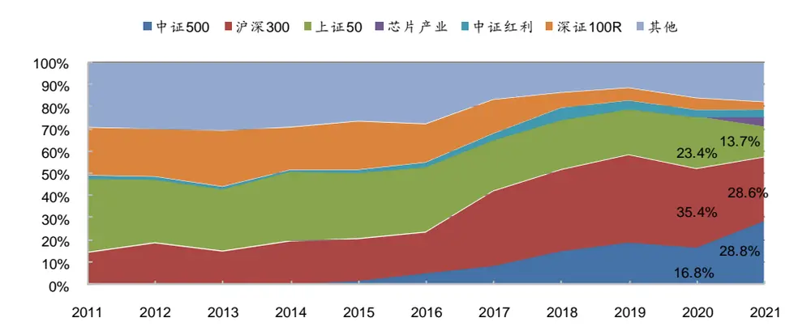
资料来源：Wind，海通证券研究所

私募指数增强产品也呈类似特征。2021 年，中证 500 指数增强产品更受青睐。截至 12 月底，2021 年新发私募指数增强产品共 1058 只。其中，中证 500 指数增强产品新增 557 只，占据新增产品的半壁江山。

图2 私募指数增强产品的数量变化（截至 2021.12.31）
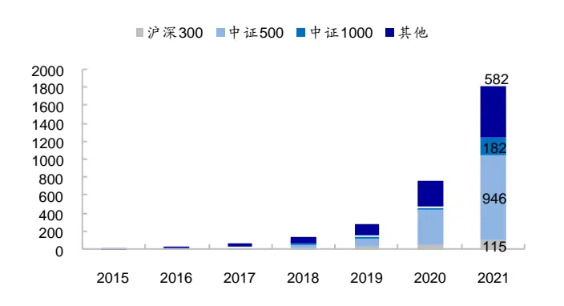
资料来源：Wind，海通证券研究所

图3 各基准指数新增的私募增强产品数量（2021）
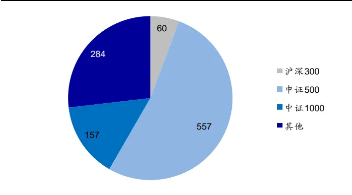
资料来源：Wind，海通证券研究所

从业绩表现来看，2021 年，绝大部分的公募沪深 300 和中证 500 指数增强基金均跑赢基准指数。相对而言，中证 指数增强产品的分化度更高，表现最差的产品跑输基准 16.4%，而表现最好的产品正超额 16.6%，跑赢基准的产品共计占比 74.3%。对于沪深 指数增强策略， 的产品均跑赢基准指数，其中表现最差的产品跑输基准，表现最好的产品正超额 。在风险指标上，沪深 指数增强基金的平均跟踪误差和最大回撤均小于中证 500 指数增强基金。

对比公募和私募指数增强产品的业绩表现，后者的平均超额收益更高，但跟踪误差和最大回撤也更大。而且，私募指数增强产品的分化度更高，表现最好和最差的产品，收益差异较大。

表 1 沪深 300 和中证 500 指数增强基金的平均业绩表现（2021.01-2021.12）

|  |  | 超额收益 |  |  |  | 跟踪误差 |  |  | 最大回撤 |  |  |
| --- | --- | --- | --- | --- | --- | --- | --- | --- | --- | --- | --- |
|  |  | 平均超额 | 跑赢基准 产品占比 | 最小值 | 最大值 | 平均值 | 最小值 | 最大值 | 平均值 | 最小值 | 最大值 |
| 沪深 300增 强 | 公募，日度 | 5.0% | 92.3% | -5.5% | 15.4% | 4.1% | 2.2% | 7.0% | -3.9% | -9.7% | -1.2% |
|  | 公募，周度 | 5.0% | 92.3% | -5.5% | 15.4% | 4.3% | 2.4% | 6.9% | -3.4% | -9.6% | -0.9% |
|  | 私募，周度 | 10.4% | 85.0% | -25.7% | 29.5% | 22.8% | 11.1% | 34.4% | -14.8% | -37.8% | -7.8% |
|  | 公募，日度 | 3.4% | 74.3% | -16.4% | 16.6% | 5.4% | 2.7% | 9.3% | -7.2% | -20.8% | -1.8% |
| 中证 500增 强 | 公募，周度 | 3.4% | 74.3% | -16.4% | 16.6% | 6.1% | 3.4% | 10.1% | -6.8% | -20.7% | -1.3% |
|  | 私募，周度 | 13.5% | 86.9% | -17.6% | 42.8% | 19.7% | 10.8% | 31.8% | -17.3% | -37.6% | -7.7% |

资料来源： ，海通证券研究所

对比历年业绩表现，2021 年，公募沪深 300 指数增强基金的平均超额收益处于中等位臵，而平均跟踪误差处于偏高水平（图 4-5）；公募中证 500 指数增强基金的平均超额收益处于偏低水平，同时跟踪误差较大（图 6-7）。

图4 公募沪深 300指数增强基金各年度平均超额收益
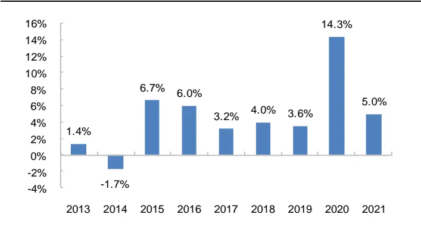
资料来源：Wind，海通证券研究所

图5 公募沪深 300指数增强基金各年度平均跟踪误差
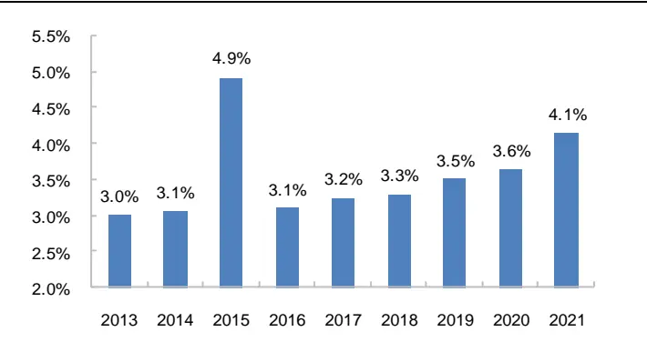
资料来源：Wind，海通证券研究所

图6 公募中证 500指数增强基金各年度平均超额收益
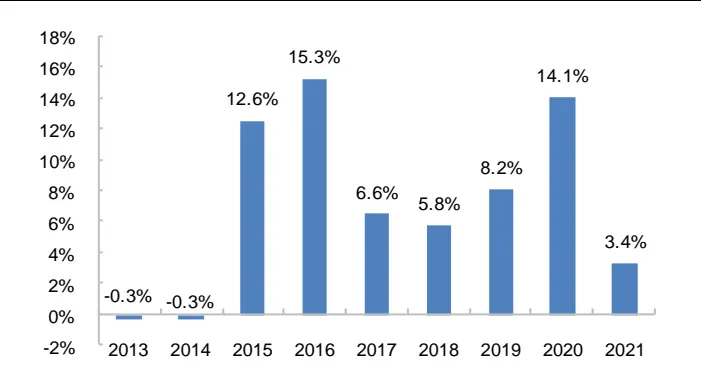
资料来源： ，海通证券研究所

图7 公募中证 500指数增强基金各年度平均跟踪误差
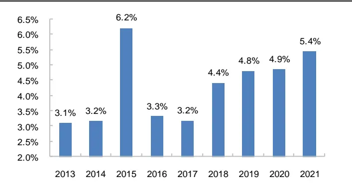
资料来源： ，海通证券研究所

进一步构建沪深 和中证 指数增强基金等权组合，考察 年增强产品相对于基准指数的累计超额收益，结果如图 8-9 所示。从中可见，9 月中旬以前，公募指数增强基金超额收益整体呈稳定上升态势；而 9月下旬之后，相对净值出现持续且幅度较大的回撤。私募指数增强产品超额收益的时间序列走势也呈现类似特征。

图8 公募指数增强基金等权组合累计超额收益（2021）
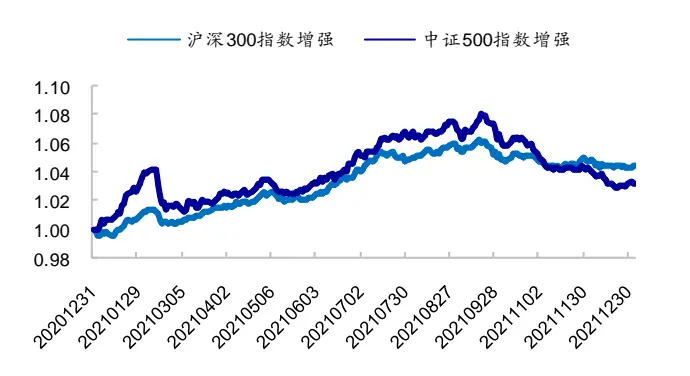
资料来源：Wind，海通证券研究所

图9 私募指数增强基金等权组合累计超额收益（2021）
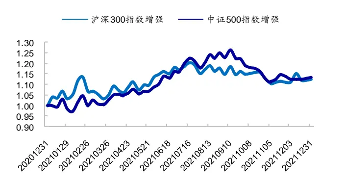
资料来源：Wind，海通证券研究所

综上所述，2021 年，中证 500 指数增强基金备受青睐，无论是公募还是私募产品，规模和数量均出现明显增长。业绩表现上，沪深 和中证 指数增强基金 月以前超额收益稳定向上；而进入 9 月下旬之后，出现持续回撤。全年来看，公募沪深 300 指数增强基金的平均超额收益处于历年中等位臵，同时跟踪误差较大；中证 500 指数增强基金的平均超额收益处于偏低水平，跟踪误差同样较大。

## 2. 多因子模型表现：因子有效性普遍减弱，指数增强策略个股选择贡献降低

## 2.1单因子表现

## 2.1.1 市值与估值：小盘风格显著占优，估值风格剧烈波动

## 小盘风格显著占优

基于市值将全市场股票等分为 10 组，考察市值最小一组股票等权组合相对于市值最大一组股票等权组合，每半年度的月均多空收益差，结果如左下图所示。2021 年，市值风格发生明显切换，由 2019 年下半年以来的大盘风格切换至小盘风格。进一步，从右下图可见，除 1、4、10月份外，大盘股在其他月份都显著跑输小盘股。

图10 小市值因子半年度月均多空收益
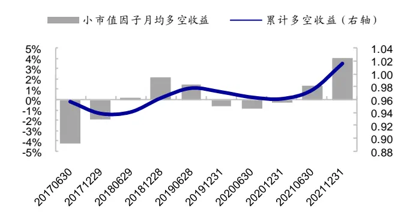
资料来源：Wind，海通证券研究所
注：小市值因子是指小市值等权组合相对于大市值等权组合的多空收益

图11 2021年小市值因子月度多空收益
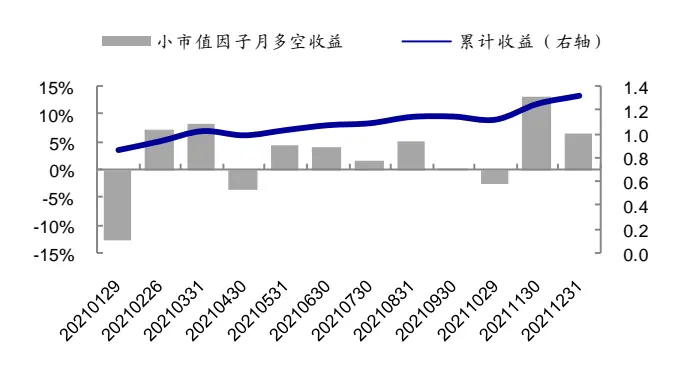
资料来源：Wind，海通证券研究所

## 估值风格剧烈波动

基于 PB将全市场股票等分为 10 组，考察 PB最小一组股票相对于 PB最大一组股票的月收益差，结果如图 12 所示。2017-2019 年上半年，市场呈较为明显的价值风格；而 2019 年下半年至 2020 年上半年，成长风格突出，高估值股票组合显著跑赢低估值股票组合。

自 2020 年下半年以来，估值风格一直呈剧烈波动状态，因子日度多空收益的波动率居高不下，高于 2017 年以来所有的半年度（图 13）。2021 年，大部分月份，市场仍为成长风格，但 2-3、7-8、以及 12月份，成长风格大幅回撤，低估值股票组合相对高估值股票组合的月超额达 5%以上，出现显著的价值修复行情。全年来看，市场呈价值风格，低估值股票组合的收益率高于高估值股票组合。

图12 2017年以来，低估值因子的月度多空收益
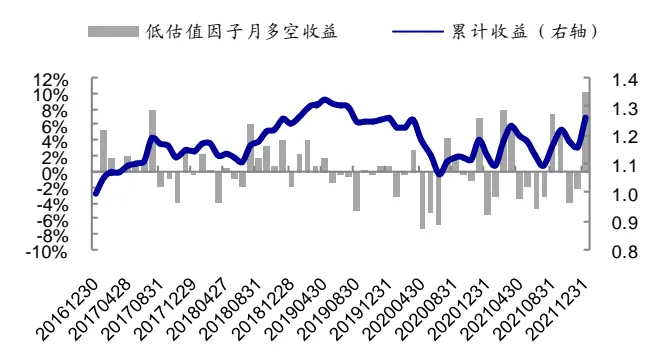
资料来源：Wind，海通证券研究所

图13 半年度低估值因子日度多空收益的年化波动率
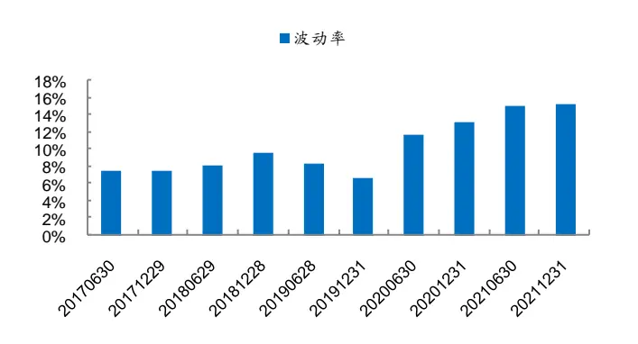
资料来源：Wind，海通证券研究所

## 2.1.2 Alpha 因子：大部分因子选股收益有所减弱

2021 年，大盘龙头股发生回撤，中盘股表现强势，使得中盘因子失效，月均 IC 仅为 0.15%，月均多空收益 0.08%，显著低于以往平均水平。

低频技术因子的表现整体与 2017-2020 年持平。反转、波动率、换手率因子表现最优的时期是 2013-2016 年，在此期间，这 3 个因子的月均多空收益均在 2%以上，且多空收益分布较为对称。而自 2017 年以来，低频技术因子的多头收益大幅降低，即前期涨幅小、波动率低、换手率低的股票后期跑赢市场等权基准的幅度较小。

以波动率因子为例，2013-2016 年，该因子月均多空收益 2.40%，其中，多头收益1.21%；2017-2020 年，波动率因子月均多头收益降至 0.25%，虽然空头收益有所增加（1.82%），但由于多头收益下降近 1%，使得因子多空收益降至 2.07%。2021 年，低频技术因子延续了 2017-2020 年的规律，因子多空收益和 IC表现较为显著，但多头效应弱、空头效应强的特征非常突出。

基本面因子的表现相较于前期大幅下滑，特别是盈利因子，月均多头收益降至0.02%，与 2017-2020 年 1.05%的多头收益相差甚远，甚至低于 2013-2016 年的平均水平（0.24%）。SUE因子的月均多空收益也下降了近一半，由 2017-2020 年的 1.42%降至 2021 年的 0.76%。

分析师相关因子上，除分析师推荐因子与 2017-2020 年持平外，预期净利润调整、预期 EP、分析师覆盖度因子均近乎失效，月均 IC降至 1%以下，多空收益反向。即，有分析师推荐的股票仍具有较为显著的正超额；但分析师关注度高、一致预期向好的那些股票，收益并不如前些年那般可观，甚至无法跑赢市场等权基准。

大部分高频因子仍稳定有效，多空收益和因子 IC 表现优异。具体来看，反转类高频因子中，尾盘成交占比、高频偏度表现突出，与历史水平较为接近。动量类高频因子中，开盘后大单净买入占比、开盘后大单净买入强度与历史持平，且多头组合表现优异；下行波动占比、开盘后买入意愿强度虽然表现不如 2017-2020 年，但仍显著有效，月均多空收益大于 1%。相对而言，这两个因子的多头收益偏弱，以空头效应为主。

对比不同阶段各因子的表现可发现，2013-2016 年，价量类因子表现优异，特别是反转类因子表现突出，如换手率、改进反转、波动率等，月均多头收益均在 1%以上。2017-2020 年，反转类因子多头收益趋于平淡，而受机构投资者关注的基本面指标和分析师相关因子表现突出；同时，一些动量类高频因子的选股效果相对于 2016 年以前也出现明显提升，如开盘后买入意愿强度等。

2021 年，分析师推荐、尾盘成交占比、高频偏度、以及动量类高频因子继续保持优异的业绩表现，同时低频技术因子的表现整体与 17 年以来持平；而预期净利润调整、预期 EP、中盘因子近乎失效，月均 IC 小于 1%，基本面因子的选股收益也出现较大幅度的下滑。

表 2 Alpha 因子的选股收益表现（截至 2021.12）

|  |  | 多空收益 |  |  | IC |  |  |  |
| --- | --- | --- | --- | --- | --- | --- | --- | --- |
|  |  | 2021年 | 2013-2020年 |  |  | 2021年 | 2013-2020年 |  |
|  | 因子方向 | 月均收益 信息比 | 月均收益 | 信息比 | 月均IC | ICIR | 月均IC | ICIR |
|  | 中盘 十 | 0.08% | 0.12 | 1.38% | 2.33 | 0.15% 0.11 | 3.90% | 2.30 |
| 反转 | - | 1.07% 1.29 | 1.84% | 1.84 | -2.88% | -1.66 | -4.57% | -1.84 |
| 波动率 |  | 1.71% 1.37 | 2.23% | 1.94 | -4.21% | -1.46 | -6.11% | -2.18 |
| 换手率 | - | 2.61% 2.25 | 2.54% | 2.11 | -5.51% | -1.77 | -6.12% | -1.82 |
| ROE | 十 | 0.39% 0.35 | 1.44% | 1.69 | 1.04% | 0.49 | 4.19% | 2.04 |
| SUE | + | 0.76% 0.87 | 1.44% | 2.48 | 1.59% | 0.98 | 4.38% | 3.15 |
| 预期净利润调整 | 十 | -0.04% -0.12 | 0.98% | 2.38 | 0.34% | 0.32 | 2.69% | 2.72 |
| 预期EP | 十 | -0.32% -0.38 | 0.97% | 1.28 | 0.77% | 0.36 | 3.07% | 1.58 |
| 分析师覆盖度 | 十 | -0.27% | -0.35 1.02% | 1.21 | 0.20% | 0.10 | 3.22% | 1.40 |
| 分析师推荐 | 十 | 1.18% 1.25 | 1.80% | 1.74 | 0.83% | 0.55 | 3.77% | 2.04 |
| 尾盘成交占比 |  | 1.02% | 0.95 1.30% | 1.37 | -1.44% | -0.77 | -3.70% | -1.95 |
| 改进反转 | - | 1.37% | 1.99 2.76% | 3.07 | -2.90% | -1.88 | -6.70% | -3.14 |
| 大单推动涨幅 |  | 0.78% 0.71 | 2.34% | 3.29 | -1.50% | -0.71 | -6.12% | -3.40 |
| 高频偏度 |  | 1.92% | 2.56 1.98% | 3.59 | -3.47% | -2.20 | -5.70% | -3.60 |
| 下行波动占比 | 十 | 1.57% | 1.76 2.25% | 3.06 | 3.41% | 1.76 | 6.13% | 2.97 |
| 开盘后买入意愿占比 | 十 | 0.41% | 0.69 0.80% | 1.20 | 1.34% | 0.95 | 2.49% | 1.53 |
| 开盘后买入意愿强度 | 十 | 1.11% | 1.34 1.45% | 1.94 | 2.50% | 1.54 | 3.99% | 2.28 |
| 开盘后大单净买入占比 | + | 1.58% | 2.14 1.65% |  | 2.37 | 3.22% 2.16 | 4.47% | 2.48 |
| 开盘后大单净买入强度 | 十 | 1.01% | 1.48 1.02% |  | 1.44 | 1.79% 1.51 | 2.30% | 1.32 |

资料来源： ，海通证券研究所
注：所有因子均经过市值和行业中性化处理，下同

图14 Alpha因子在不同时期的月均多空收益
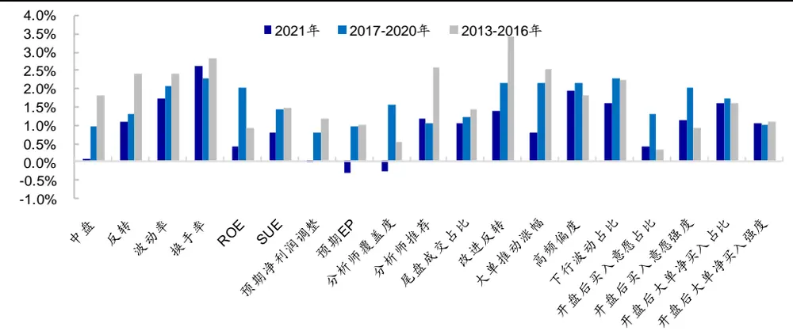
资料来源：Wind，海通证券研究所

图15 Alpha因子在不同时期的月均多头收益
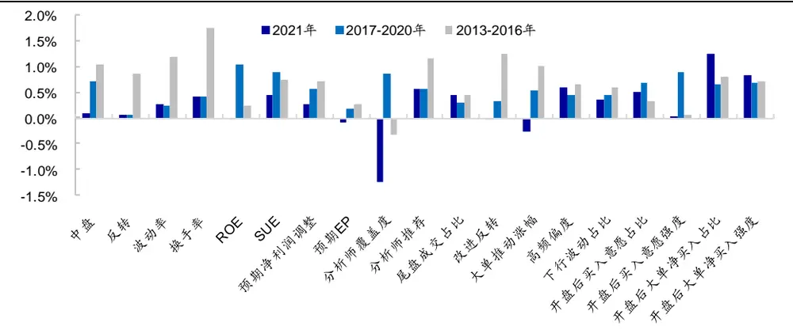
资料来源：Wind，海通证券研究所

## 2.2指数增强策略

我们基于风格、技术、基本面、预期、高频因子构建收益预测模型，在行业偏离 3%，个股偏离 1%，因子敞口暴露 0.6，成分股内权重 80%，市值中性、估值暴露 0.2 的约束条件下，构建了沪深 300 和中证 500 指数增强策略。

## 2.2.1 业绩表现：超额收益偏低，波动较大

扣除单边千 交易费用后，截止 年 月末，沪深 指数增强策略 年累计收益 ，同期沪深 指数累计收益 ，策略相对沪深 指数累计超额，相对全收益指数超额 。对比 年的收益表现， 年沪深指数增强策略超额收益低，而风险大。年跟踪误差为 6.2%，仅次于 2015 年；最大相对回撤 7.7%，为 2013 年以来最高水平，发生在 9月下旬至 12 月底。

2021 年，中证 500 指数增强策略累计收益 27.6%，同期中证 500 指数累计收益15.6%，策略相对中证 500 指数累计超额 12.0%，相对全收益指数超额 10.3%。对比2013-2020 年，2021 年中证 500 指数增强策略的收益率处于中等偏低水平，而风险偏高。年跟踪误差为 7.1%，仅次于 2015 年；最大回撤 6.3%，为 2013 年以来最高水平，发生在 9/15-11/8 期间。

图16 沪深 300指数增强策略累计相对净值（2021）
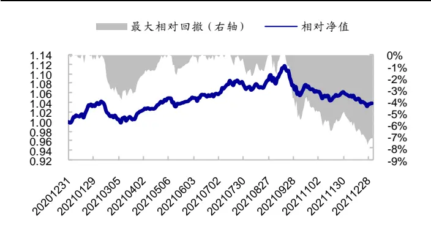
资料来源：Wind，海通证券研究所

图17 中证 500指数增强策略累计相对净值（2021）
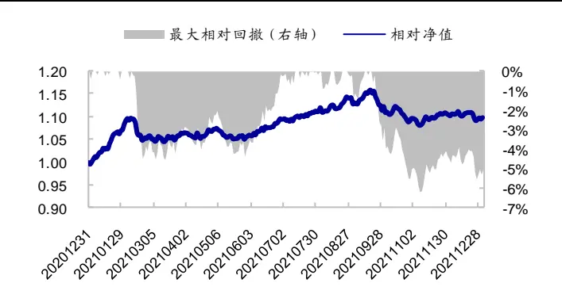
资料来源：Wind，海通证券研究所

表 3 指数增强策略业绩表现（2013.02-2021.12）

|  | 沪深 300 指数增强 |  |  |  |  |  | 中证 500 指数增强 |  |  |  |  |  |
| --- | --- | --- | --- | --- | --- | --- | --- | --- | --- | --- | --- | --- |
|  | 策略收 益 | 超额收 益 | 跟踪误 差 | 信息比 | 最大回 撤 | 月胜率 |  | 策略收 益 | 超额收 益 | 跟踪误 信息比 差 | 最大回 撤 | 月胜率 |
| 2013 | -2.6% | 10.3% | 4.8% | 2.88 | 3.8% | 81.8% | 18.8% | 12.7% | 4.9% | 2.85 | 2.9% | 81.8% |
| 2014 | 59.0% | 7.4% | 3.5% | 1.39 | 2.3% | 66.7% | 54.7% | 15.7% | 3.9% | 2.80 | 1.9% | 83.3% |
| 2015 | 37.0% | 31.4% | 6.5% | 4.23 | 3.3% | 91.7% | 92.9% | 49.8% | 9.6% | 3.49 | 4.2% | 75.0% |
| 2016 | -5.4% | 5.9% | 4.4% | 1.60 | 3.8% | 66.7% | -2.4% | 15.3% | 4.6% | 4.01 | 2.0% | 100.0% |
| 2017 | 42.6% | 20.8% | 3.4% | 4.75 | 1.2% | 91.7% | 11.0% | 11.2% | 4.3% | 2.54 | 4.4% | 83.3% |
| 2018 | -18.2% | 7.1% | 4.3% | 2.29 | 2.6% | 58.3% | -26.1% | 7.2% | 5.4% | 2.06 | 3.1% | 58.3% |
| 2019 | 45.1% | 9.0% | 3.1% | 2.13 | 1.7% | 75.0% | 46.0% | 19.6% | 4.6% | 3.21 | 3.6% | 75.0% |
| 2020 | 46.4% | 19.2% | 5.0% | 2.94 | 3.0% | 75.0% | 33.5% | 12.7% | 6.5% | 1.62 | 4.2% | 66.7% |
| 2021 | -1.3% | 3.9% | 6.2% | 0.72 | 7.7% | 50.0% | 27.6% | 12.0% | 7.1% | 1.52 | 6.3% | 58.3% |
| 全区间 | 19.7% | 12.5% | 4.7% | 2.46 | 7.7% | 73.6% | 24.8% | 16.4% | 5.9% | 2.53 | 6.3% | 76.4% |

资料来源： ，海通证券研究所

整体来看，2021 年指数增强策略业绩表现较差，超额收益偏低，而波动较大，回撤达到 2013 年以来的最高水平。

## 2.2.2 业绩归因：个股选择贡献大幅降低

基于 模型将指数增强策略相对于全收益指数的超额收益，分解为行业配臵、个股选择、以及交易成本三项。2021 年，以月均超额*12计算的沪深 300 指数增强策略相对全收益指数年化超额 2.3%，大幅低于历史（2013-2020）年超额 10.1%；中证 500指数增强策略相对全收益指数年化超额 9.2%，低于历史（2013-2020）年超额 13.9%。

总体来看，指数增强策略的收益结构为，个股选择贡献为主、行业配臵贡献为辅。由于沪深 300 指数的行业权重差异更大，因而，沪深 300 指数增强策略的行业配臵贡献大于中证 500 指数增强策略。

2013-2020 年，沪深 300 指数增强策略的个股选择贡献为 9.6%，行业配臵贡献为3.7%，在不考虑交易成本下，策略的年超额为 9.6+3.7%=13.3%；交易成本按单边千 3测算，一年大约为2.5%-3.3%，对应的月单边换手为35%-45%左右；扣除交易成本3.2%后，沪深 300 指数增强策略的超额收益为 13.3%-3.2%=10.1%。

与沪深 300 指数增强策略相比，中证 500 指数增强策略的换手率较高，交易成本也较大；行业配臵贡献较小，而个股选择贡献较大。

与历史（2013-2020）相比，2021 年，指数增强策略的个股选择贡献大幅降低：沪深 300 指数增强策略下降 7.4%，中证 500 指数增强策略下降 4.8%。同时，行业配臵贡献也出现了小幅降低。

图18 沪深 300 指数增强策略的 Brinson 归因（2021）
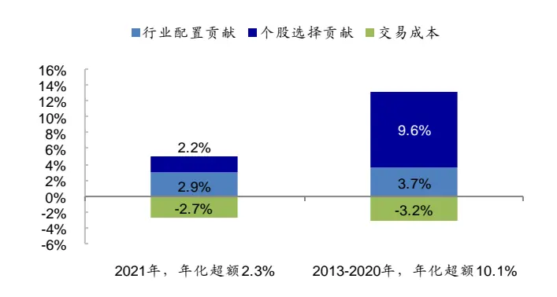
资料来源：Wind，海通证券研究所

图19 中证 500 指数增强策略的 Brinson 归因（2021）
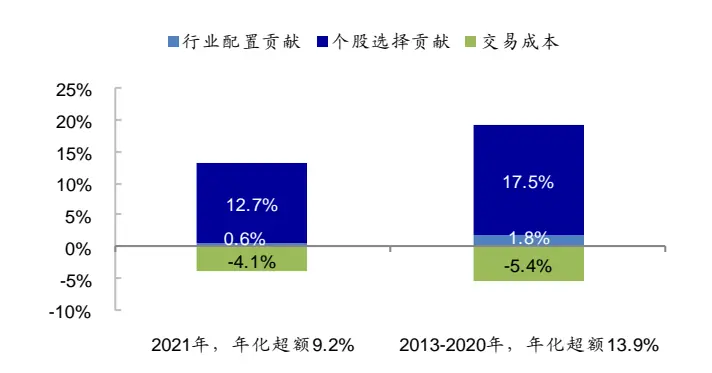
资料来源：Wind，海通证券研究所

基于 Barra 归因模型将指数增强策略的超额收益分解为，行业配臵、因子贡献、个股异质收益、以及误差 4 项，结果如图 20-21 所示。

图20 沪深 300 指数增强策略 Barra 归因结果（截至 2021.12）
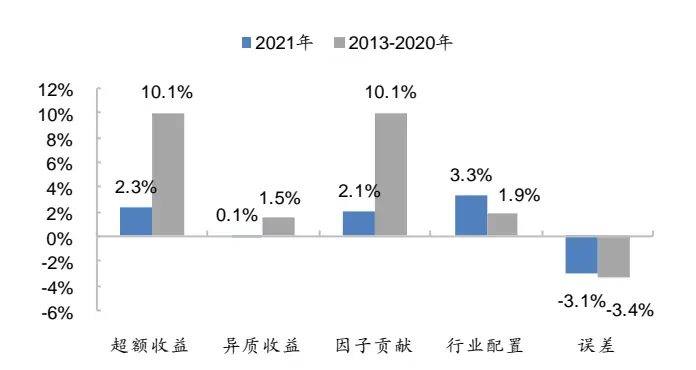
资料来源：Wind，海通证券研究所

图21 中证 500 指数增强策略 Barra 归因结果（截至 2021.12）
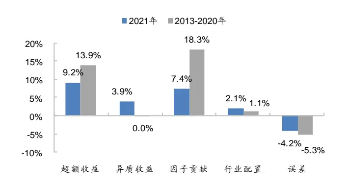
资料来源：Wind，海通证券研究所

Barra 归因结果与 Brinson 接近，整体来看，指数增强策略的收益结构为，个股选择贡献为主（因子贡献+个股异质收益），行业配臵贡献为辅。2021 年，策略个股选择贡献降低，特别是因子贡献，降幅明显。行业贡献上，与 Brinson 模型不同，Barra 模型显示，剥离风格因子影响后，2021 年策略行业贡献比以往年份要高。

具体到因子，组合的成长风格暴露给策略带来了较为明显的负向超额。无论是沪深300 还是中证 500 指数增强策略，在高估值因子上的暴露均达到了约束的上限（0.2）。2021 年，估值风格波动剧烈，全年呈较为明显的价值风格，这使得具有成长暴露的指数增强策略一方面波动较大、回撤明显，另一方面也削弱了策略的超额收益。

除了成长风格外，中盘、反转、波动率、大单推动涨幅，也对指数增强策略产生了一定的负向贡献。特别是中证 500 指数增强策略，在中盘因子上具有较高暴露（平均0.33）。2021 年中盘因子的大幅回撤，给策略带来较为明显的负向超额。

图22 沪深 300 指数增强策略 Barra 归因的因子贡献（截至2021.12）
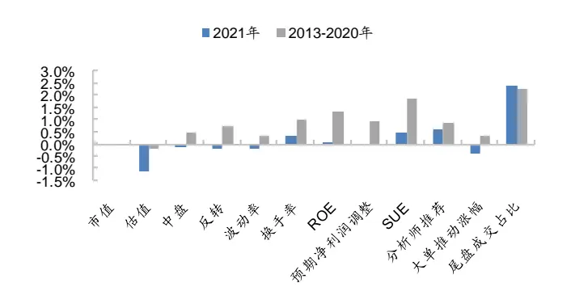
资料来源： ，海通证券研究所

图23 中证 500 指数增强策略 Barra 归因的因子贡献（截至2021.12）
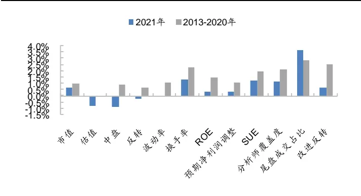
资料来源： ，海通证券研究所

基本面因子、预期因子以及高频因子，均为组合贡献了正向收益。与历年相比，对于沪深 300 指数增强策略，分析师推荐、尾盘成交占比因子的收益贡献与历史持平，其余因子的收益贡献则有所降低。对于中证 500 指数增强策略，换手率、SUE、分析师覆盖度、尾盘成交占比这 4 个因子的收益贡献仍超过 1%，而其余因子的收益贡献均有较大幅度的下降。

综上所述，在 归因体系下，策略整体的收益结构仍呈个股选择贡献为主，行业配臵贡献为辅的特征。但相对而言，2021 年的行业贡献比以往年份高，而因子贡献比以往年份低。具体到因子，成长风格剧烈波动、中盘因子失效、价格反转效应减弱，均为策略带来了一定的负向超额；尾盘成交占比、换手率、 、分析师推荐、分析师覆盖度因子的正向贡献相对较为显著；ROE、预期净利润调整的贡献大幅降低，接近于 0。

## 2.3 小结

2021 年，市值风格切换，小盘风格显著占优；估值风格剧烈波动。Alpha 因子上，大部分因子的选股有效性都有所减弱。

我们基于常用的风格、技术、基本面、预期、高频因子构建的海通金工沪深 300 指数和中证 500 指数增强策略，2021 年超额收益水平偏低，波动较大，回撤达到 2013 年以来的最高水平。归因模型显示，2021 年，指数增强策略个股选择贡献大幅降低，拖累策略超额收益。

## 3. 可以尝试的改进方向

从前文因子表现和指数增强策略的业绩分析来看，当前指数增强策略主要面临两大问题：（1）因子有效性减弱导致的个股选择贡献降低；（2）风险变大。

针对第一个问题，我们可以尝试如下两种解决方案，一是增加新的 Alpha 源，二是承担更多风险（如，行业暴露）。长期来看，这两种方案均可提升策略的超额收益。

针对第二个问题，最直接的方法是强化组合风险约束，但这样也会降低策略的收益。一种较为折中的解决方案是，结合板块贡献度的变化，动态调整风控，尽可能地减小严控风险对策略收益造成的负面影响。

## 3.1 增加新的 Alpha 源

引入新的 Alpha 源，是提升指数增强策略因子贡献最直接的方式。近年来，A 股内外资机构投资者占比持续上升。相较于散户，机构投资者的投资行为更加理性，与投资者过度反应有关的低频反转类因子近几年表现欠佳。我们认为，在这种机构话语权逐渐增大的环境下，高频动量类因子值得关注。例如，在收益预测模型中加入海通量化团队开发的“开盘后买入意愿强度”因子，2021 年可明显提升指数增强策略的业绩表现。

如表 4所示，在其他条件不变的情况下，加入买入意愿强度因子可显著提升中证 500增强指数增强策略的年化超额收益。特别是近 2 年，年超额收益的提升幅度均超过 3 个百分点（图 24）。从历史业绩来看，引入该因子同样能提升策略收益。除 2018-2019 年与原组合持平外，其余年份均明显战胜原组合。Brinson 归因结果显示（图 26），加入买入意愿强度因子后，2021 年的个股选择贡献得到明显改善，2013-2020 年也有 2 个点左右的提升。

表 4 引入开盘后买入意愿强度因子前后，指数增强策略的超额收益表现对比（2013.02-2021.12）

|  |  | 超额收益 | 跟踪误差 | 信息比 | 最大回撤 | 收益回撤比 | 月胜率 | 月单边换手率 |
| --- | --- | --- | --- | --- | --- | --- | --- | --- |
| 中证 500 指数增强 | 引入前 | 16.4% | 5.9% | 2.53 | 6.3% | 2.62 | 76.4% | 62.3% |
|  | 引入后 | 19.0% | 6.3% | 2.74 | 5.8% | 3.30 | 76.4% | 64.0% |
| 沪深 300 指数增强 | 引入前 | 12.5% | 4.7% | 2.46 | 7.7% | 1.63 | 73.6% | 43.9% |
|  | 引入后 | 12.5% | 4.9% | 2.39 | 7.1% | 1.77 | 73.6% | 46.5% |

资料来源：Wind，海通证券研究所

价量因子在沪深 300 指数成分股内的选股效果普遍弱于全市场，开盘后买入意愿强度因子也不例外。引入该因子后，策略全区间收益风险特征无明显变化；但 2021 年收益改善明显，超额收益由 2.3%提升至 6.5%（图 25），个股选择贡献由 2.2%提升至 6.8%（图 27）。

综上所述，引入买入意愿强度因子可显著改善指数增强策略 2021 年度的业绩表现。从历史业绩来看，该因子对中证 500 指数增强策略的收益提升更为稳定，绝大部分年份均可明显增厚策略收益；而对沪深 300 指数增强策略的业绩表现则无明显影响。我们认为，随着 A股投资者机构化的逐步演进，反转效应，特别是反转类因子的多头效应，难以重现2013-2016年的高收益，而像开盘后买入意愿强度这种高频动量类因子值得关注。

图24 引入开盘后买入意愿强度因子后，各年度中证 500增强超额收益的变化（截至 2021.12.31）
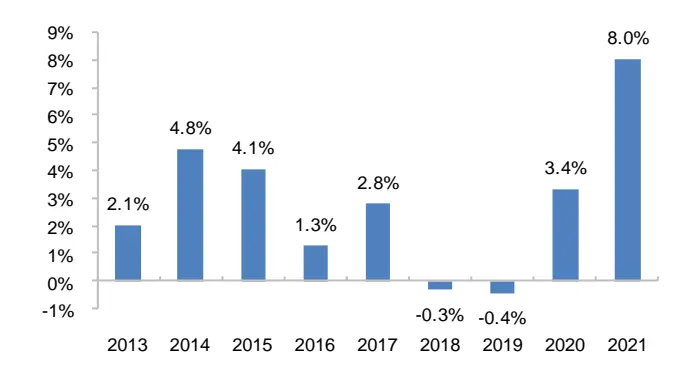
资料来源：Wind，海通证券研究所

图25 引入开盘后买入意愿强度因子后，各年度沪深 300增强超额收益的变化（截至 2021.12.31）
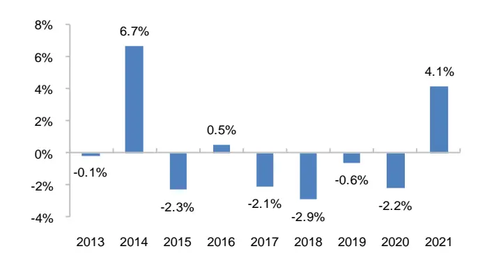
资料来源：Wind，海通证券研究所

图26 引入开盘后买入意愿强度因子前后，中证 500增强策略的 Brinson归因
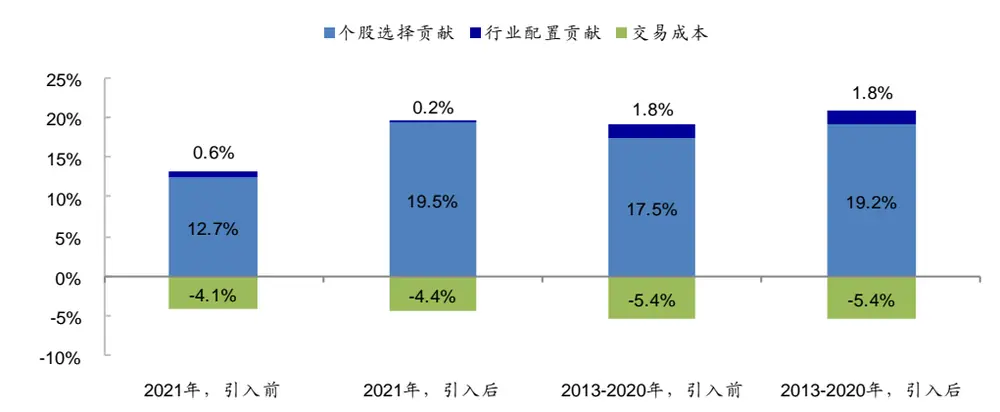
资料来源：Wind，海通证券研究所

图27 引入开盘后买入意愿强度因子前后，沪深 300增强策略的 Brinson归因
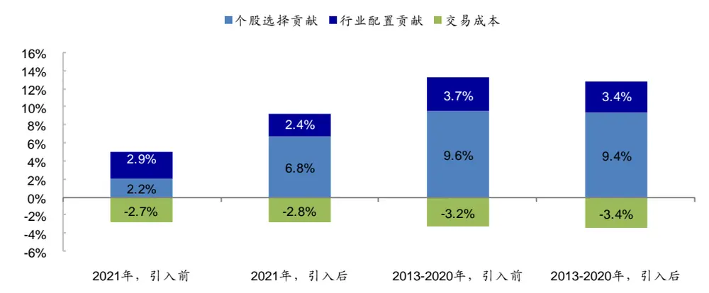
资料来源：Wind，海通证券研究所

## 3.2积极的行业轮动

在个股选择贡献降低的情况下，一个好的行业轮动模型可以为指数增强策略的收益提供可观的增量贡献。例如，近两年市场动量效应增强，这不仅体现在动量因子的选股收益上，还体现在其行业选择效果上。如图 所示，以行业过去 个月的收益均值构建行业动量因子， 年以来表现优异，多空净值稳定向上。在原有的基于盈利、增长、预期净利润调整 3 因子构建的行业轮动模型基础上，加入动量因子，可持续改善模型的多空收益和 IC表现（图 29）。

图28 行业动量因子累计多空收益
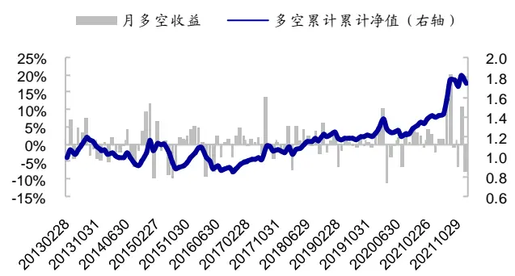
资料来源：Wind，海通证券研究所

图29 引入动量因子后，行业轮动因子对行业选择效果的提升
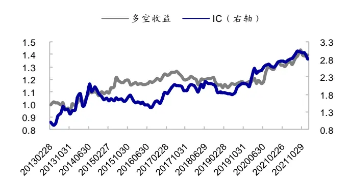
资料来源：Wind，海通证券研究所

将改进后的行业轮动因子加入收益预测模型，可明显提升近 2年指数增强策略的超额收益（图 30、32）。同时，Brinson 归因也显示，策略的行业配臵贡献也有所提升（图31、33）。相对而言，沪深 300 指数增强策略的提升幅度小于中证 500 指数增强策略。

需要注意的是，2016-2017 年的大部分月份，引入动量因子并不能改善行业轮动因子的多空收益，因此对两个指数增强策略都造成了年化 1%左右的收益损失。由此可见，引入行业轮动模型虽然潜在收益可观，长期来看能提升策略业绩表现，但短期也存在一定的行业错配风险。

图 引入行业动量因子后，各年度中证 指数增强策略超额收益的变化（截至 2021.12.31）
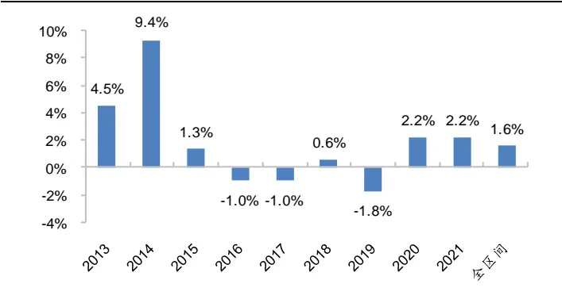
资料来源：Wind，海通证券研究所

图 引入行业动量前后，中证 指数增强策略的归因（2013.02-2021.12）
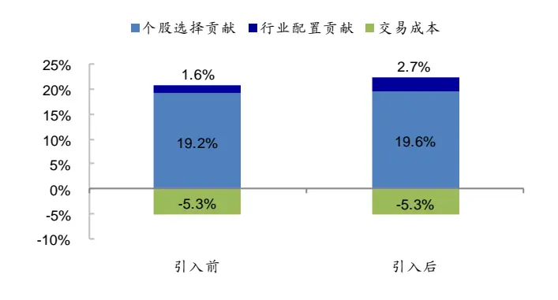
资料来源：Wind，海通证券研究所

图32 引入行业动量因子后，各年度沪深 300指数增强策略超额收益的变化（截至 2021.12.31）
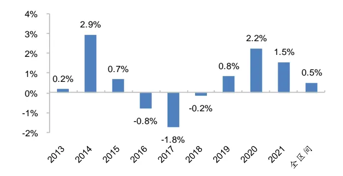
资料来源：Wind，海通证券研究所

图33 引入行业动量后，沪深 300 指数增强策略的 Brinson 归因（2013.02-2021.12）
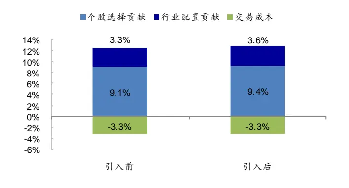
资料来源：Wind，海通证券研究所

## 3.3动态调整风控

如前文所述，增加新的 Alpha 源、积极的行业轮动确实能够提升指数增强策略 2021年的超额收益。但在风险约束条件不变的情况下，波动和回撤并没有明显降低。改进前，沪深 300 增强策略 2021 年的跟踪误差和相对最大回撤为 6.2%和 7.7%。改进后，这两个风险指标变为 7.8%和 7.0%。中证 500 增强策略 2021 年的跟踪误差和相对最大回撤，改进前后分别为 7.1%和 6.3% v.s 8.5%和 5.9%。

盈亏同源，要降低波动和回撤，最直接的方法就是强化组合的风险约束。例如，对于沪深 300 指数增强策略，若我们将约束条件调整为行业中性，个股偏离 0.5%，因子敞口暴露 0.3，则可大幅降低策略全区间的跟踪误差（3.1%）和最大回撤（3.6%）；但同时，收益也有较大幅度下滑，由年化 13.1%降低至 7.6%（表 5）。

在资产配臵理论中，风险贡献度衡量了每类资产对投资组合风险（通常为波动率或CVaR）的贡献。对于指数增强策略，若将股票所属的板块视为一类资产，则可以计算每个板块对股票组合的风险贡献。

一般情况下，指数增强策略受风险控制模型的约束，相对基准指数的风险贡献度会在一个较小的范围内波动。如图 34-35 所示，绝大部分时间内，中证 500 指数增强策略各板块的相对风险贡献度1都在-10%到+10%之间。

图34 中证 500指数增强策略各板块的相对风险贡献 1
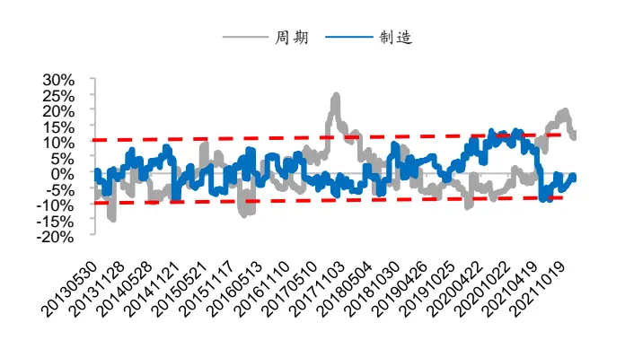
资料来源：Wind，海通证券研究所

图35 中证 500指数增强策略各板块的相对风险贡献 2
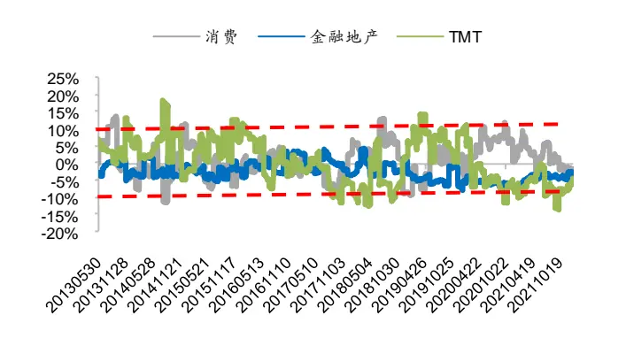
资料来源：Wind，海通证券研究所

但在极端情况下，单个板块的相对风险贡献度会迅速放大。例如，2021 年 5 月份以来，周期板块的相对风险贡献迅速增加，并于 7 月中下旬开始，持续高于过去 1 年的平均最大相对风险贡献（图 36）。

图36 中证 500指数增强策略周期板块的相对风险贡献（2021）
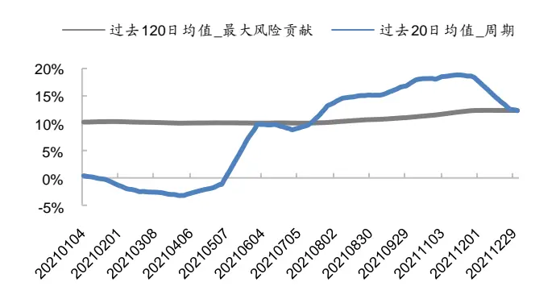
资料来源：Wind，海通证券研究所

图37 中证 500指数增强策略累计相对净值（2021）
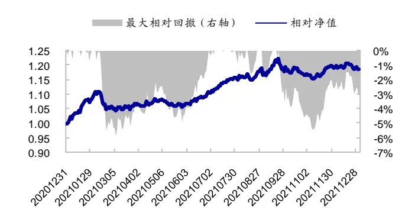
资料来源：Wind，海通证券研究所

风险逐步往周期板块集中，使得策略对单一风险的变化相当敏感，抵御风险的能力也在减弱。9月中旬开始，周期板块快速下跌，引致指数增强策略在 9/15-11/8期间发生持续相对回撤，累计回撤幅度达 5.5%。

基于上述分析，我们可以将相对风险贡献度作为一个事前预警指标，如果跟踪到某个板块的贡献度过高，表明策略的风险较为集中，抗风险能力减弱，此时就采取较为严格的风险控制。

为便于表述，后文中，我们将“行业偏离 3%、个股偏离 1%、因子敞口 0.6”的指数增强组合称为“基础组合”，“行业中性、个股偏离 0.5%、因子敞口 0.3”的组合称为“严控风险组合”。

具体的动态风控调整规则为，每天计算“基础组合”5 个板块的相对风险贡献度，取最大值。在月末换仓时，计算过去 个月的日均最大相对风险贡献度，记为短期相对风险贡献。同时，计算过去 1 年的日均最大相对风险贡献度，记为长期相对风险贡献。若短期相对风险贡献高于长期相对风险贡献，则认为当前风险较大，需采用较为严格的约束条件，构建“严控风险组合”；否则，保持“基础组合”不变。由这一过程得到的指数增强组合，称为“动态风控组合”。

与“基础组合”相比，“动态风控组合”的超额收益虽有所下降，但跟踪误差和最大回撤得到明显控制，相应的信息比和收益回撤比都有所改善（表 5）。分年度来看，2013-2021 年期间，绝大部分年份的跟踪误差和最大回撤都有所降低（表 6-7）。而与始终严控风险的组合相比，“动态风控组合”的风险指标仅略微增加，但收益提升明显。

由此可见，若想较好地控制指数增强策略的相对风险，同时又想尽量降低严控风险对策略收益造成的负向影响，可以结合板块贡献度的变化，动态调整风控措施。即，只在单个板块风险贡献变大时，才采取较为严格的约束条件。

表 5 动态调整风控，指数增强策略的超额收益表现（2013.02-2021.12）

|  |  | 收益率 | 跟踪误差 | 信息比 | 最大回撤 | 收益回撤比 | 月胜率 | 月单边换手率 |
| --- | --- | --- | --- | --- | --- | --- | --- | --- |
| 沪深 300 指数增强 | 基础组合 | 13.1% | 5.0% | 2.41 | 7.0% | 1.85 | 71.7% | 46.0% |
|  | 严控风险组合 | 7.6% | 3.1% | 2.34 | 3.6% | 2.11 | 71.7% | 35.8% |
|  | 动态风控组合 | 10.7% | 3.8% | 2.59 | 3.6% | 2.98 | 71.7% | 43.4% |
| 中证 500 指数增强 | 基础组合 | 20.6% | 6.4% | 2.88 | 5.9% | 3.49 | 80.2% | 64.1% |
|  | 严控风险组合 | 13.4% | 4.9% | 2.54 | 4.7% | 2.86 | 79.2% | 56.5% |
|  | 动态风控组合 | 17.5% | 5.5% | 2.88 | 4.7% | 3.76 | 80.2% | 63.3% |

资料来源：Wind，海通证券研究所

表 6 动态调整风控，沪深 300指数增强策略分年度超额收益表现（2013.02-2021.12）

|  | 基础组合 |  |  | 严控风险组合 |  |  | 动态风控组合 |  |  |
| --- | --- | --- | --- | --- | --- | --- | --- | --- | --- |
|  | 超额收益 | 跟踪误差 | 最大回撤 | 超额收益 | 跟踪误差 | 最大回撤 | 超额收益 | 跟踪误差 | 最大回撤 |
| 2013 | 10.3% | 4.6% | 3.7% | 5.5% | 2.7% | 2.6% | 6.9% | 3.2% | 2.6% |
| 2014 | 17.0% | 3.8% | 2.1% | 6.5% | 2.3% | 3.0% | 12.1% | 2.7% | 3.0% |
| 2015 | 29.8% | 7.1% | 4.3% | 15.9% | 5.2% | 3.6% | 25.4% | 6.2% | 3.6% |
| 2016 | 5.6% | 4.2% | 3.5% | 4.7% | 3.0% | 2.6% | 6.8% | 3.6% | 2.7% |
| 2017 | 17.0% | 3.6% | 1.1% | 12.6% | 2.0% | 0.8% | 13.5% | 2.2% | 1.1% |
| 2018 | 4.1% | 4.1% | 2.9% | 4.1% | 2.2% | 1.2% | 4.0% | 4.1% | 2.9% |
| 2019 | 9.3% | 3.1% | 2.0% | 5.4% | 2.3% | 2.8% | 8.7% | 2.8% | 1.7% |
| 2020 | 19.3% | 4.8% | 2.5% | 10.0% | 2.8% | 1.1% | 15.2% | 4.0% | 2.1% |
| 2021 | 9.5% | 7.8% | 7.0% | 4.1% | 3.6% | 2.5% | 6.3% | 4.2% | 2.5% |

资料来源：Wind，海通证券研究所

表 7 动态调整风控，中证 500指数增强策略分年度超额收益表现（2013.02-2021.12）

|  | 基础组合 |  |  | 严控风险组合 |  |  | 动态风控组合 |  |  |
| --- | --- | --- | --- | --- | --- | --- | --- | --- | --- |
|  | 超额收益 | 跟踪误差 | 最大回撤 | 超额收益 | 跟踪误差 | 最大回撤 | 超额收益 | 跟踪误差 | 最大回撤 |
| 2013 | 19.2% | 5.2% | 3.0% | 13.5% | 4.1% | 2.6% | 17.1% | 4.9% | 2.6% |
| 2014 | 29.8% | 4.2% | 1.8% | 17.4% | 3.1% | 1.5% | 19.6% | 3.5% | 1.5% |
| 2015 | 55.2% | 10.6% | 4.7% | 34.7% | 9.4% | 4.7% | 49.6% | 10.4% | 4.7% |
| 2016 | 15.7% | 4.7% | 1.8% | 15.9% | 3.7% | 1.5% | 15.3% | 4.4% | 1.6% |
| 2017 | 13.1% | 4.5% | 4.1% | 10.9% | 3.4% | 2.4% | 12.1% | 3.6% | 2.4% |
| 2018 | 7.5% | 5.7% | 3.9% | 7.0% | 4.4% | 2.2% | 8.0% | 5.2% | 3.1% |
| 2019 | 17.5% | 4.7% | 5.3% | 9.9% | 3.9% | 4.7% | 16.8% | 4.4% | 4.7% |
| 2020 | 18.2% | 6.8% | 3.7% | 8.0% | 4.3% | 2.9% | 13.3% | 4.6% | 2.8% |
| 2021 | 22.3% | 8.5% | 5.9% | 7.0% | 4.7% | 4.3% | 14.6% | 5.7% | 3.9% |

资料来源：Wind，海通证券研究所

表 8 各板块所包含的中信一级行业

| 包含行业 |  |
| --- | --- |
| 周期 | 石油石化、煤炭、钢铁、有色金属、电力及公用事业、基础化工、建筑、建材、交通运输 |
| 制造 | 轻工制造、机械、电力设备及新能源、国防军工、汽车 |
| 消费 | 食品饮料、农林牧渔、商贸零售、消费者服务、家电、纺织服装、医药 |
| 金融地产 | 银行、非银行金融、房地产 |
| TMT | 电子、通信、计算机、传媒 |

资料来源：Wind，海通证券研究所整理

## 3.4 小结

2021 年，指数增强策略主要面临两个问题：（1）因子有效性减弱，个股选择贡献降低；（2）风险变大。

针对第一个问题，我们可以尝试如下两种解决方案，一是增加新的 Alpha 源，二是承担更多风险（如，行业暴露）。长期来看，这两种方案均可提升策略的超额收益。

针对第二个问题，最直接的方法是强化组合风险约束，但这样也会降低策略的收益。一种较为折中的解决方案是，结合板块贡献度的变化，动态调整风控。即，只有在单个板块风险贡献变大时，才采取较为严格的风险控制，尽可能地减小严控风险对策略收益造成的负面影响。

## 4. 全文总结

2021 年，中证 500 指数增强基金备受青睐，无论是公募还是私募产品，规模和数量均出现明显增长。业绩表现上，沪深 300 和中证 500 指数增强基金 9月以前超额收益稳定向上；而进入 9月下旬之后，出现持续回撤。全年来看，公募沪深 300 指数增强基金的平均超额收益处于历年中等位臵，同时跟踪误差较大；中证 500 指数增强基金的平均超额收益处于偏低水平，跟踪误差同样较大。

风格因子上，2021 年，市值风格切换，小盘风格显著占优；估值风格剧烈波动。Alpha 因子上，大部分因子的选股有效性都有所减弱。我们基于常用的风格、技术、基本面、预期、高频因子构建的海通金工沪深 300 指数和中证 500 指数增强策略，2021年超额收益水平偏低，波动较大，回撤达到 2013 年以来的最高水平。归因模型显示，2021 年，指数增强策略个股选择贡献大幅降低，拖累策略超额收益。

2021 年，指数增强策略主要面临两个问题：（1）因子有效性减弱，个股选择贡献降低；（2）风险变大。

针对第一个问题，我们可以尝试如下两种解决方案，一是增加新的 Alpha 源，二是承担更多风险（如，行业暴露）。长期来看，这两种方案均可提升策略的超额收益。

针对第二个问题，最直接的方法是强化组合风险约束，但这样也会降低策略的收益。一种较为折中的解决方案是，结合板块贡献度的变化，动态调整风控。即，只有在单个板块风险贡献变大时，才采取较为严格的风险控制，尽可能地减小严控风险对策略收益造成的负面影响。

## 5. 风险提示

模型误设风险，因子失效风险，历史统计规律失效风险。

## 信息披露

分析师声明

[Table冯佳睿yst金融工程研究团队s]

罗蕾金融工程研究团队

本人具有中国证券业协会授予的证券投资咨询执业资格，以勤勉的职业态度，独立、客观地出具本报告。本报告所采用的数据和信息均来自市场公开信息，本人不保证该等信息的准确性或完整性。分析逻辑基于作者的职业理解，清晰准确地反映了作者的研究观点，结论不受任何第三方的授意或影响，特此声明。

## 法律声明

本报告仅供海通证券股份有限公司（以下简称“本公司”）的客户使用。本公司不会因接收人收到本报告而视其为客户。在任何情况下，本报告中的信息或所表述的意见并不构成对任何人的投资建议。在任何情况下，本公司不对任何人因使用本报告中的任何内容所引致的任何损失负任何责任。

本报告所载的资料、意见及推测仅反映本公司于发布本报告当日的判断，本报告所指的证券或投资标的的价格、价值及投资收入可能会波动。在不同时期，本公司可发出与本报告所载资料、意见及推测不一致的报告。

市场有风险，投资需谨慎。本报告所载的信息、材料及结论只提供特定客户作参考，不构成投资建议，也没有考虑到个别客户特殊的投资目标、财务状况或需要。客户应考虑本报告中的任何意见或建议是否符合其特定状况。在法律许可的情况下，海通证券及其所属关联机构可能会持有报告中提到的公司所发行的证券并进行交易，还可能为这些公司提供投资银行服务或其他服务。

本报告仅向特定客户传送，未经海通证券研究所书面授权，本研究报告的任何部分均不得以任何方式制作任何形式的拷贝、复印件或复制品，或再次分发给任何其他人，或以任何侵犯本公司版权的其他方式使用。所有本报告中使用的商标、服务标记及标记均为本公司的商标、服务标记及标记。如欲引用或转载本文内容，务必联络海通证券研究所并获得许可，并需注明出处为海通证券研究所，且不得对本文进行有悖原意的引用和删改。

根据中国证监会核发的经营证券业务许可，海通证券股份有限公司的经营范围包括证券投资咨询业务。

## 海通证券股份有限公司研究所[Table_PeopleInfo]

路 颖所长

(021)23219403 luying@htsec.com

高道德 副所长(021)63411586 gaodd@htsec.com

邓 勇副所长

(021)23219404 dengyong@htsec.com

| 荀玉根 副所长 | 涂力磊 所长助理 | 余文心 所长助理 |
| --- | --- | --- |
| (021)23219658 xyg6052@htsec.com | (021)23219747 tll5535@htsec.com | (0755)82780398 ywx9461@htsec.com |

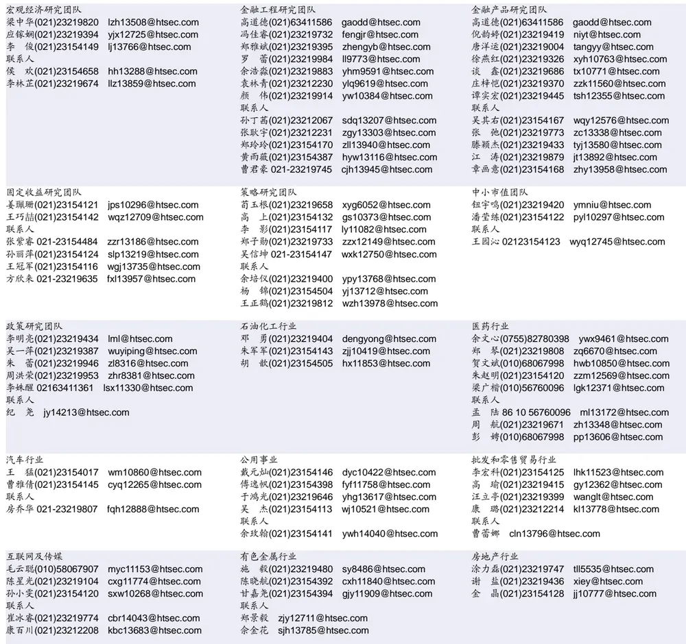

| 电子行业 |  | 煤炭行业 | 电力设备及新能源行业 |  |
| --- | --- | --- | --- | --- |
| 李 轩(021)23154652 lx12671@htsec.com |  | 李 淼(010)58067998 Im10779@htsec.com | 张一弛(021)23219402 | zyc9637@htsec.com |
| 肖隽翀(021)23154139 xjc12802@htsec.com |  | 戴元灿(021)23154146 dyc10422@htsec.com | 房 青(021)23219692 | fangq@htsec.com |
| 华晋书 hjs14155@htsec.com |  | 王 涛(021)23219760 wt12363@htsec.com | 曾 彪(021)23154148 | zb10242@htsec.com |
| 联系人 |  | 吴 杰(021)23154113 wj10521@htsec.com | 徐柏乔(021)23219171 | xbq6583@htsec.com |
| 文 灿(021)23154401 wc13799@htsec.com |  |  | 张 磊(021)23212001 | zl10996@htsec.com |
|  | 薛逸民(021)23219963 xym13863@htsec.com |  | 联系人 |  |
|  | 李 潇(010)58067830 Ix13920@htsec.com |  | 姚望洲(021)23154184 柳文韬(021)23219389 | ywz13822@htsec.com lwt13065@htsec.com |

| 基础化工行业 | 计算机行业 |  | 通信行业 |  | 余伟民(010)50949926 ywm11574@htsec.com |
| --- | --- | --- | --- | --- | --- |
| 刘 威(0755)82764281 Iw10053@htsec.com |  | 郑宏达(021)23219392 zhd10834@htsec.com |  |  |  |
| 刘海荣(021)23154130 Ihr10342@htsec.com |  | 杨 林(021)23154174 yl11036@htsec.com | 联系人 |  |  |
| 张翠翠(021)23214397 zcc11726@htsec.com |  | 于成龙(021)23154174 ycl12224@htsec.com |  | 杨彤昕 010-56760095 ytx12741@htsec.com |  |
| 孙维容(021)23219431 swr12178@htsec.com | 联系人 | 洪 琳(021)23154137 hl11570@htsec.com |  | 夏 凡(021)23154128 xf13728@htsec.com |  |
| 李 智(021)23219392 Iz11785@htsec.com |  | 杨 蒙(0755)23617756 ym13254@htsec.com |  |  |  |

| 非银行金融行业 |  | 交通运输行业 |  | 纺织服装行业 |  |
| --- | --- | --- | --- | --- | --- |
|  | 孙 婷(010)50949926 st9998@htsec.com |  | 虞 楠(021)23219382 yun@htsec.com |  | 梁 希(021)23219407 lx11040@htsec.com |
|  | 何 婷(021)23219634 ht10515@htsec.com |  | 罗月江（010）56760091 lyj12399@htsec.com |  | 盛 开(021)23154510 sk11787@htsec.com |
| 联系人 |  |  | 陈 宇(021)23219442 cy13115@htsec.com |  |  |
|  | 任广博(010)56760090 rgb12695@htsec.com |  |  |  |  |
|  | 曹 锟 010-56760090 ck14023@htsec.com |  |  |  |  |

| 建筑建材行业 | 机械行业 | 钢铁行业 |
| --- | --- | --- |
| 冯晨阳(021)23212081 fcy10886@htsec.com | 余炜超(021)23219816 swc11480@htsec.com | 刘彦奇(021)23219391 liuyq@htsec.com |
| 潘莹练(021)23154122 pyl10297@htsec.com 申 浩(021)23154114 sh12219@htsec.com 颜慧菁 yhj12866@htsec.com | 赵玥炜(021)23219814 zyw13208@htsec.com | 周慧琳(021)23154399 zhl11756@htsec.com |
|  | 赵靖博(021)23154119 zjb13572@htsec.com |  |

| 建筑工程行业 | 农林牧渔行业 |  |  | 食品饮料行业 |  |  |
| --- | --- | --- | --- | --- | --- | --- |
| 张欣劫 zxj12156@htsec.com |  | 丁 | 频(021)23219405 dingpin@htsec.com |  | 颜慧菁 yhj12866@htsec.com |  |
|  |  |  |  | 陈阳(021)23212041 cy10867@htsec.com |  | 张宇轩(021)23154172 zyx11631@htsec.com |

| 军工行业 | 银行行业 |  | 社会服务行业 |
| --- | --- | --- | --- |
| 张高艳 0755-82900489 zgy13106@htsec.com | 孙 婷(010)50949926 st9998@htsec.com 林加力(021)23154395 |  | 汪立亭(021)23219399 wanglt@htsec.com 许樱之(755)82900465 xyz11630@htsec.com |
| 张恒晅 zhx10170@htsec.com 联系人 | 联系人 | ljl12245@htsec.com | 联系人 |
| 刘砚菲 021-2321-4129 lyf13079@htsec.com | 董栋梁(021)23219356 ddl13206@htsec.com |  | 毛弘毅(021)23219583 mhy13205@htsec.com 王祎婕(021)23219768 wyj13985@htsec.com |

| 家电行业 | 造纸轻工行业 |  |
| --- | --- | --- |
| 陈子仪(021)23219244 chenzy@htsec.com | 汪立亭(021)23219399 wanglt@htsec.com |  |
| 李 阳(021)23154382 ly11194@htsec.com | 郭庆龙 gql13820@htsec.com |  |
| 朱默辰(021)23154383 zmc11316@htsec.com | 联系人 |  |
| 刘 璐(021)23214390 II11838@htsec.com | 王文杰 wwj14034@htsec.com |  |
|  | 吕科佳 | Ikj14091@htsec.com |
|  | 高翩然 gpr14257@htsec.com |  |

## 研究所销售团队

深广地区销售团队

伏财勇(0755)23607963 fcy7498@htsec.com

蔡铁清(0755)82775962 ctq5979@htsec.com

辜丽娟(0755)83253022 gulj@htsec.com

刘晶晶(0755)83255933 liujj4900@htsec.com

饶 伟(0755)82775282 rw10588@htsec.com

欧阳梦楚(0755)23617160

oymc11039@htsec.com

巩柏含 gbh11537@htsec.com

滕雪竹 0755 23963569 txz13189@htsec.com 上海地区销售团队 胡雪梅(021)23219385 huxm@htsec.com 黄 诚(021)23219397 hc10482@htsec.com 季唯佳(021)23219384 jiwj@htsec.com 黄 毓(021)23219410 huangyu@htsec.com 李 寅 021-23219691 ly12488@htsec.com 胡宇欣(021)23154192 hyx10493@htsec.com 马晓男 mxn11376@htsec.com 邵亚杰 23214650 syj12493@htsec.com 杨祎昕(021)23212268 yyx10310@htsec.com 毛文英(021)23219373 mwy10474@htsec.com 谭德康 tdk13548@htsec.com 王祎宁(021)23219281 wyn14183@htsec.com

北京地区销售团队
朱 健(021)23219592 zhuj@htsec.com
殷怡琦(010)58067988 yyq9989@htsec.com
郭 楠 010-5806 7936 gn12384@htsec.com
杨羽莎(010)58067977 yys10962@htsec.com
张丽萱(010)58067931 zlx11191@htsec.com
郭金垚(010)58067851 gjy12727@htsec.com
张钧博 zjb13446@htsec.com
高 瑞 gr13547@htsec.com
上官灵芝 sglz14039@htsec.com
董晓梅 dxm10457@htsec.com

海通证券股份有限公司研究所

地址：上海市黄浦区广东路 689号海通证券大厦 9楼

电话：（021）23219000

传真：（021）23219392

网址：www.htsec.com