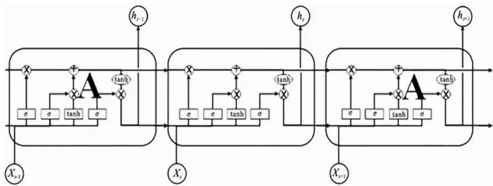
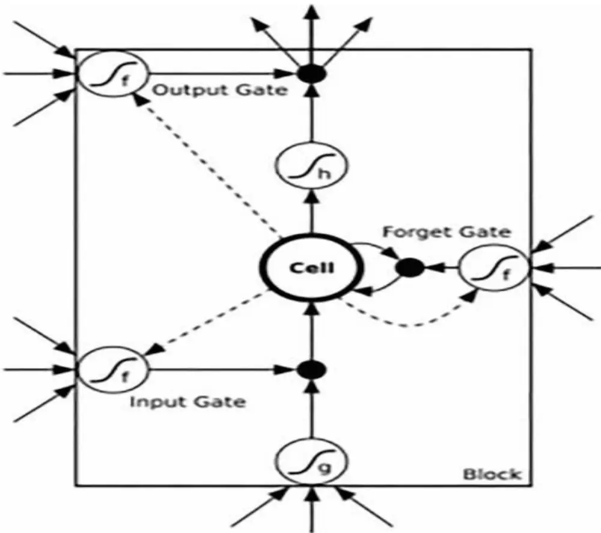
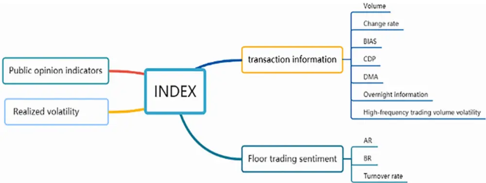
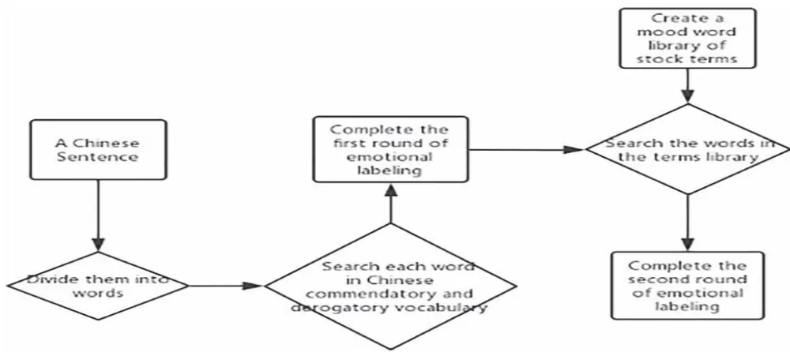
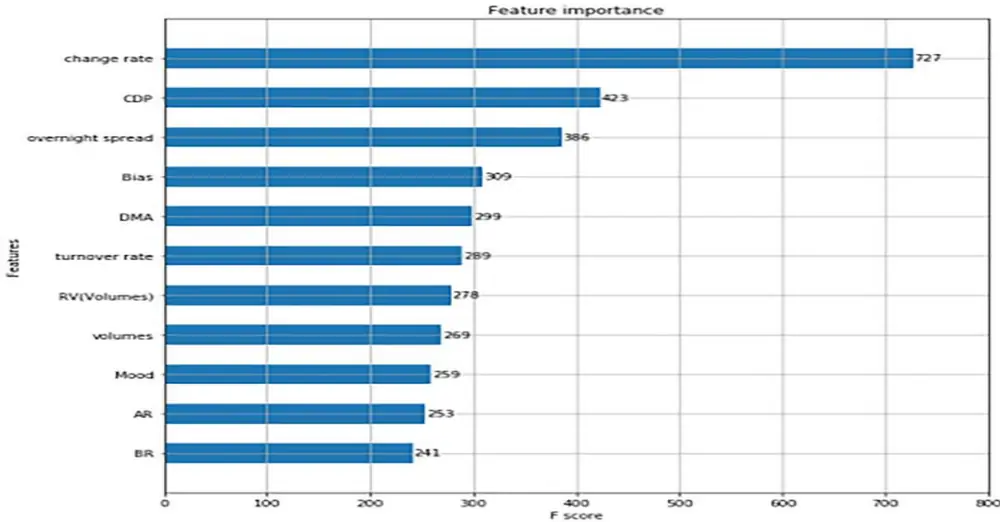
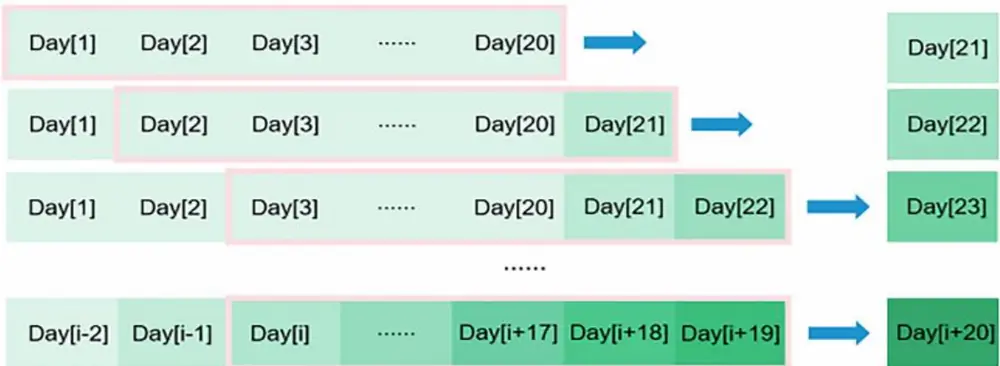
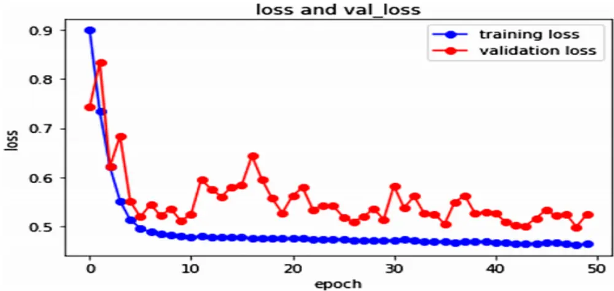
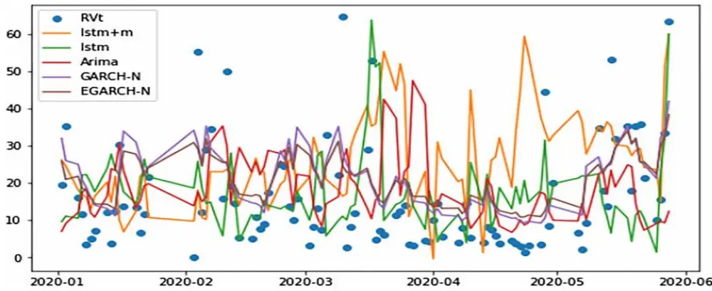

# 高频数据下基于文本挖掘和深度学习的股票波动性预测

2022 年 03 月 09 日

金融工程定期报告

——海外文献速览系列之十六

| 分析师 | 高智威 | 电话：0755-82832012 | 邮箱：gaozhw@dxzq.net.cn | 执业证书编号： S1480521030002 |
| --- | --- | --- | --- | --- |
| 研究助理 | 贺争盛 | 电话： 18768114667 | 邮箱：hezhsh@dxzq. net.cn | 执业证书编号：S1480121070099 |

## 投资摘要：

在开发量化投资策略时，海外优秀论文往往能够提供新的思路和方法，为了能够让各位投资者更有效率地吸收海外的经验，东兴金工团队推出海外文献速览系列报告。我们将定期从海外文献中筛选思路较为新颖且有潜力应用于国内市场投资的文章，以速览的形式呈现给各位投资者，内容涵盖资产配置、量化选股、基金评价以及衍生品投资等多个方面。

本篇报告作为该系列报告的第十六篇，我们选取了 Bolin Lei, Zhengdi Liu, Yuping Song 的文献《On stock volatilityforecasting based on text mining and deep learning under high-frequency data》。

金融资产价格的波动在衡量资产风险水平和衍生品定价方面发挥着极其重要的作用。因此，基于波动性特征发现更多预测指标和模型对于分析金融资产风险具有非常重要的理论意义和实用价值。

本文是一篇有关基于深度学习对波动率预测的新兴文献。深度学习在股票市场的应用是一个热门的学术研究领域。尽管在美国市场的研究已经很多，但深度学习方法在中国市场的应用能力仍然有待验证。作者认为深度学习模型的非线性关系拟合能力和强大的数据特征学习能力，为提高波动率预测的准确性提供了新思路。

很少有文献使用包含公众意见的文本信息作为波动率预测的输入指标。作者利用股东的文本评论信息构建了一个文本情绪因子，整合了评论的影响，然后结合波动率预测的其他交易信息，以高频金融数据为基础，采用了深度学习模型长短期记忆（LSTM）进行构建波动率预测模型。作者发现，带有情绪指标的 LSTM模型对波动率的预测准确率优于没有情绪指标的LSTM模型，并且与六种损失函数下的10个传统计量经济学模型的多步骤预测相比时，LSTM模型是更稳健的。随着民意指标的加入，LSTM的准确率在六个评价标准 MSE、RMSE、MAE、MSLE 、R2和 RMSPE 下分别提高了 9.3%、4.7%、6.2%、9.2%、7.9%和16.9%，表明股东情绪指标对市场股票股价波动率预测有正向影响。窗口长度的选择也对 LSTM 模型预测的准确性有一定的影响，若窗口时间过小，模型则无法获得足够的数据，若窗口时间过大，数据集会采集到过多的无关数据，影响模型的训练效率，从结果上看，窗口值为 20 时，模型可以达到最优的效果。作者的研究过程和结论提供了一个构建更准确、更稳健的波动率预测模型的新方法，深度学习和文本挖掘技术也被应用到金融时间序列分析中。

## 风险提示：

本报告内容来源于相关文献，不构成投资建议。文中的结果基于原作者对历史数据的回测，当市场环境发生变化的时候，存在模型失效的风险。

## 1. 研究背景

在开发量化投资策略时，海外优秀论文往往能够提供新的思路和方法，为了能够让各位投资者更有效率地吸收海外的经验，东兴金工团队推出海外文献速览系列报告。我们将定期从海外文献中筛选思路较为新颖且有潜力应用于国内市场投资的文章，以速览的形式呈现给各位投资者，内容涵盖资产配置、量化选股、基金评价以及衍生品投资等多个方面。

本篇报告作为该系列报告的第十六篇，我们选取了 Bolin Lei, Zhengdi Liu, Yuping Song 的文献《On stockvolatility forecasting based on text mining and deep learning under high-frequency data》。

投资者在进行资产配置时，不仅需要考虑金融产品、金融衍生品的收益，还需要考虑其风险，在金融研究中，我们通常使用波动率来描述风险，所以关于波动率的研究百花齐放，在此文中，作者结合了深度学习和高频数据构建了一个波动率预测模型，并取得了不错的效果。

金融资产价格的波动在衡量资产风险水平和衍生品定价方面发挥着极其重要的作用。因此，分析波动性的特征和基于波动性特征发现更多预测指标和模型对于分析金融资产风险具有非常重要的理论意义和实用价值。

波动率预测的研究过程可以概括为：从低频数据到高频数据，从不考虑高频波动的长记忆到长记忆计量经济学模型。Bollerslev（1986）提出了广义自回归条件异方差（GARCH）模型，该模型基于低频数据，通过表征金融资产收益残差的异方差性（即波动率聚合现象）来估计和预测波动率。然而，GARCH 模型只使用低频数据，没有考虑日内价格信息的非线性特征。此外，基于高频数据，Corsi（2009）提出了基于异构市场假说的异构自回归模型（HAR-RV）来预测波动性，以及 Andersen 等人(2003)提出了一种长记忆自回归分数积分移动平均(ARFIMA)模型来刻画波动率。ARFIMA 模型和 HAR-RV 模型比 GARCH模型拥有更好的样本外预测能力。上述模型有以下缺点，一是他们无法描述数据的非线性，二是预测时只考虑历史波动率，忽略交易信息、舆论等未来波动率变化的真实驱动因素，预测依据不足。

虽然上述模型实现了预测在数据源中从低频到高频的进展，他们仍然是传统的计量经济模型。为了提高波动率预测的准确性，通常是需要从预测模型和预测指标等两个方面进行创新。深度学习模型的非线性关系拟合能力和强大的数据特征学习能力，为提高波动率预测的准确性提供了新思路。首先，在预测模型方面，深度学习在金融领域的应用主要集中在预测股票价格和回报率，长短期记忆（LSTM）是金融时间序列最常见的预测模型。在股价预测方面，Karaoglu 等人(2017)在 Graves(2012)中使用 LSTM 模型来预测股票价格。Bao等人(2017)引入技术指标作为预测指标，并使用 LSTM预测股票价格。Lee 和 Yoo(2020)比较了包括 LSTM模型在内的三个RNN模型在预测股票价格时的准确率。在股票收益预测中，Batres-Estrada(2015)使用LSTM预测股票每日和每月的对数回报利率，以及 Zhou(2019)使用 LSTM 预测下月股票收益率来构建投资组合。在深度学习模型中，LSTM对长时记忆的特征可以更好适应波动率的波动特性，但它很少用于波动率预测。W.Chen(2018)以交易价格数据作为输入指标通过 LSTM 模型对股票波动率进行预测。此外，在预测指标方面，网络舆情往往反映了投资者对未来的预期。Bollen 等（2011）通过公众舆论构建情感因素对道琼斯指数走势进行预测。Oliveira 等(2017) 发现社交平台评论的文字信息对股价存在影响并用它来预测标准普尔指数500 的趋势。Yu 等人(2013)证明了收益和股票投资风险与社交平台的信息文本的相关性。根据已有的研究结果，发现公共舆论更多地是用来预测趋势的股价而舆论的文字信息较少用作波动率预测的输入指标。

为了提高波动率的预测精度，本文将 LSTM与公共舆论文本信息相结合，基于 5 分钟高频金融交易数据构建新的波动率的指标体系来预测实际的波动率，并与不考虑公众意见传统计量经济学模型和 LSTM模型的预测能力进行对比。

本文第 2 章节作者介绍了传统计量经济模型的原理和深度学习模型LSTM，全面总结预测指标和评价标准，并介绍了本文的研究过程，第 3 章节作者构建文本情感因子并展示舆论文本信息与波动性之间的相关性，选择 LSTM模型最理想的参数，最后比较样本外波动率预测准确性并基于 6 个损失函数对 12 个波动率预测模型进行排序。

## 2.模型与研究方法

## 2.1 传统的经济模型

## 2.1.1 GARCH 模型

Bollerslev（1986）提出了 GARCH 模型来刻画金融资产收益时间序列残差项的异方差性以衡量低频数据的波动。以 ARCH 模型为基础，GARCH 使用 ARCH 模型去表达方差，且对时间序列的长期自相关性有较好的影响。GARCH的模型定义如下：

$$
y_{t}=\varphi x_{t}+u_{t}
$$

$$
\sigma_{t}^{2}=\alpha_{0}+\sum_{i=1}^{q}\alpha_{i}u_{t-i}^{2}+\sum_{j=1}^{p}\beta_{j}\sigma_{t-j}^{2}
$$

其中等式 1 是均值价值等式，含有残差项的外生变量函数。 $y_{t}$ 和 $x_{t}$ 分别是因变量和解释变量； $u_{t}$ 是随机波动项。 ${\bf q}.$ 是 ARCH模型的阶数， $\mathrm{p}$ 是自回归 GARCH模型的阶数。 $\alpha_{0},~\alpha_{i}\hbar{\pi}\beta_{j}$ 是待评估的大于 0 的参数。

## 2.1.2 HAR-RV 模型

HAR-RV 模型是由 Corsi（2009），它可以解释长记忆性的特征和股票市场中时间序列的异质性。每日波动率与上一时期的每日、每周和每月波动率有关。HAR-RV 模型的定义如下：

$$
RV_{t}=\sum_{j=1}^{1/N}r_{j}^{2}
$$

$$
RV_{t+H}^{d}=\beta_{0}+\beta_{d}RV_{t}^{d}+\beta_{w}RV_{t}^{w}+\beta_{m}RV_{t}^{m}+\varepsilon_{t+H}
$$

其中 $RV_{t}$ 和R $V_{t}^{d}$ 是t阶段实际的每日波动率，N意味着将交易日分成N个时间段，r是每个时间的收益， $r_{j}$ $RV_{t}^{w}$ 是t阶段实际的每周波动率和 $\boldsymbol{\varepsilon}_{t+H}$ 是随机波动项。 $RV_{t+H}^{d}$ 是未来H天实际的波动率，H= 1，5，22。则每周和每月的波动率可以如下计算：

$$
\begin{array}{c}{{RV_{t}^{w}=(RV_{t}^{d}+RV_{t-1}^{w}+\cdots+RV_{t-4}^{w})/5}}\\{{\ }}\\{{RV_{t}^{w}=(RV_{t}^{d}+RV_{t-1}^{w}+\cdots+RV_{t-21}^{w})/22}}\end{array}
$$

## 2.1.3 ARFIMA 模型

自回归模型 AR 是用来描述现值与历史值的自相关性，而移动平均模型 MA 是用来描述 AR 模型里的误差累计项。结合 AR 与 MA 模型，作者得到自回归移动平均模型 ARMA 模型，其定义如下：

$$
y_{t}=\mu+\sum_{i=1}^{p}\gamma_{i}y_{t-i}+\varepsilon_{t}+\sum_{i=1}^{q}\theta_{i}\varepsilon_{t-i}
$$

其中 $\mathrm{y_{t}}$ 表示t时刻的价值，μ是常数项，q是模型中预测误差的滞后数， $\mathsf{Y}_{\mathrm{~i~}}$ 是自相关系数，ε 是误差项。

Granger 和 Joyeux（1980）提出了分形移动平均模型（ARFIMA），它结合了分形噪声模型（FDN）和 ARMA模型。Hosking 在 1981 年改进了 ARFIMA 模型，形式如下：

$$
\varphi(\mathrm{L})(1-\mathrm{L})^{\mathrm{d}}\Big(\mathrm{x}_{\mathrm{t}}-\mathrm{~\nabla~}\mu_{\mathrm{\scriptsize~t}}\Big)=\theta(\mathrm{L})\varepsilon_{t}
$$

其中L是滞后算子，φ(L)和θ(L)分别是p 阶和q 阶多项式滞后算子，它们描述了序列的短记忆性。(1− L)d是分形差分算子，其中d是分形差分参数（|d| < 0.5）来衡量时间序列的长记忆性。 $\mathbf{x_{t}}$ 是t时刻的价值， $\varepsilon_{t}$ 是白噪声序列。

## 2.2 深度学习模型-LSTM

长期短期记忆（LSTM）是一种特殊的循环神经网络(RNN)，由 Hochreiter 和 Schmidhuber(1997)首次提出，它有效解决梯度消失和长序列训练过程中的梯度爆炸的问题。LSTM和 RNN的区别在于 RNN有一个传输状态 $\dot{h}_{{}_{t}}$ ，然而 LSTM 有两个转移状态： $C_{t}\dot{\pi}\mu_{t^{\circ}}C_{t}$ 是用来保存当前时刻的记忆单元的状态信息，并传送到下一个时刻的记忆单元。 $C_{t}$ 是由前期的 LSTM传输的 $C_{t-1}$ 交互 $\dot{\bar{y}}$ 生的。这个联合作用的过程是 LSTM的核心，即利用“门控机制”来控制信息传输量。这个门控机制有三个“门”，即“遗忘门”、“记忆门”、“输出门”，该机制控制信息保留和传输并最终反馈到 $C_{t}$ 和 $\cdot\lambda_{t}.$ 。如图 1，有三个记忆单元，每个记忆单元（A）包括状态 $C_{t}$ 及对应的三道“门”。

图1：LSTM 结构

On stock volatility forecasting based on text mining and deep learning under high-frequency data 2021 5

1.“遗忘门”用于选择不重要的信息并忘记它们。公式如下：

$$
\mathbf{\boldsymbol{f}}_{\mathrm{t}}=\sigma(\mathbf{\boldsymbol{W}}_{\mathrm{f}}\cdot\left[\boldsymbol{\lambda}_{\mathrm{t-1}},\mathbf{\boldsymbol{x}}_{\mathrm{t}}\right]+\mathbf{\boldsymbol{b}}_{\mathrm{f}})
$$

其中 $\lambda_{\mathrm{t}-1}$ 是t − 1时刻的输出， $\mathbf{x_{t}}$ 为t时刻 LSTM 该层的输入值， $\mathsf{W}_{\mathrm{f}}$ 为每个变量的权重， $\boldsymbol{\mathbf{b}}_{\mathrm{f}}$ 为截距， $\sigma$ 为 sigmoid激活函数，输出值 $\mathrm{f_{t}}$ 在 0 到 1 之间。

2.“记忆门”与“遗忘门”相反，它选择 $\mathbf{x_{t}}$ 和 $\cdot h_{{\mathrm{t}}-1}$ 的重要信息并保留它们，接下来，通过“遗忘门”和“记忆门”，状态 $\mathrm{C_{t}}$ 会被更新，具体公式如下：

$$
\mathrm{i}_{\mathrm{t}}=\sigma(\mathrm{W}_{\mathrm{i}}\cdot\left[\lambda_{\mathrm{t}-1},\mathrm{x}_{\mathrm{t}}\right]+\mathrm{b}_{\mathrm{i}})
$$

$$
\widetilde{\mathrm{C}}_{\mathrm{t}}=\mathrm{tanh}(\mathsf{W}_{\mathrm{c}}\cdot\left[\lambda_{\mathrm{t-1}},\mathrm{x}_{\mathrm{t}}\right]+\mathsf{b}_{\mathrm{c}})
$$

$$
\mathsf{C}_{\mathrm{t}}=\mathsf{f}_{\mathrm{t}}\mathsf{C}_{\mathrm{t-1}}+\mathsf{i}_{\mathrm{t}}\tilde{\mathsf{C}}_{\mathrm{t}}
$$

其中 Tanh 是切向激活函数， $\mathrm{C_{t}}$ 是t−1时刻的状态，即在t时刻需要被保存的信息会从输入的信息中提取，从而得到一个更新后的状态。

3“输出门”决定了该层的输出信息，. sigmoid 激活函数决定了输出信息，Tanh 激活 $i\vec{\Sigma}_{I}$ 数用作处理 $\complement_{\mathrm{t}}$ ， $\bar{h}_{\mathrm{t}}$ 为 $0_{\mathrm{t}}$ 和tanh $\mathrm{(C_{t})}$ 的乘积，公式如下：

$$
O_{t}=\sigma(W_{o}\cdot\left(\lambda_{t-1},x_{t}\right)+b_{o})
$$

$$
\lambda_{{t}}=O_{t}\cdot\operatorname{tanh}(C_{t})
$$

一个记忆单元中的信息处理过程如图 2 所示，输入的信息经过若干个记忆单元，形成长时信息序列的长时记忆。损失函数用于评估模型的误差：通过误差反向传播，不断更新参数以减少损失值，最后拟合出合理的参数，得到准确的预测结果。

图2：LSTM 的三个“门”

On stock volatility forecasting based on text mining and deep learning under high-frequency data 2021  5

## 2.3 预测指标和评估标准

## 2.3.1 预测指标

本文选取四类指标进行波动率预测，即实际波动率、交易量信息、场内情绪指标和公众情绪指标（场外情绪指标），如图 3 所示。

图3：预测指标体系

On stock volatility forecasting based on text mining and deep learning under high-frequency data 2021  5

1. 交易量反映买卖双方达成交易的股票的成交量。

2. 变化率 = 变化价格/前一天收盘价 * 100%，反映了股票价格的改变率。

3. 偏差 = 收盘价 - 5 天平均价格 / 5 天平均价格，反映了当日价格与 5 天平均价格的偏离程度。

4. CDP = (上一个交易日最高价+上一个交易日最低价 $+2^{\star}.$ 上一个交易日收盘价）/ 4，也叫逆市运行指标。

5. ${\mathsf{DMA}}=5$ 天移动平均价格 - 10 天移动平均价格，也叫平行线差指标，主要用于判断买卖的力量和未来价格的趋势。

6. 隔夜信息 = 开盘价 - 上一个交易日收盘价，反映了隔夜信息对股票价格波动的影响。

7. 高频交易量波动率可以根据 5 分钟交易量的高频数据按如下公式计算：

$$
RV(V)_{t}=\sum_{d=1}^{48}\left(lnV_{t,d+1}-lnV_{t,d}\right)^{2}
$$

8. 市场里的情绪指标例如流行指标 AR 和 BR 可以按如下公式计算：

$$
{\begin{array}{rl}&{{\mathrm{AR~=~(closing~price-opening~price)/(opening~price~-lowest~price)*100}}}\\&{}\\&{{\mathrm{BR~=~(Highest~price-closing~price)/(closing~price~-~lowest~price)*100}}}\end{array}}
$$

其中，AR 主要反映市场买卖情绪，BR 反映市场买卖意愿程度。两者都从不同角度分析股价波动，进而反映市场情绪。

9. 换手率表示股票市场一天内股票交易的频率，反映市场活跃程度。

10. 每日实际波动率 $\mathrm{RV_{t}}$ 可根据 Andersen 等人（2003）的计算方式，首先使用两个相邻的 5 分钟对数收盘价数据 $\mathrm{P_{t,d}}$ 计算高频收益率 $\mathtt{R}_{\mathtt{t},\mathtt{d}}$ ，即

$$
R_{t,d}=100(lnP_{t,d}-lnP_{t,d-1})
$$

其中 $\mathrm{t}=1,2,3,4,\dots,2741,\mathrm{d}=1,2,\dots,48.$ . 那么第t天的实际波动率是所有高频收益率的平方和，即为

$$
RV_{t}=\sum_{d=1}^{48}R_{t,d}^{2}
$$

11. 对于公共舆论的指标计算（作者称为情绪指标），请参考 3.2 小节中文本情感因子的构造。

## 2.3.2 评估标准

为了反映预测结果的准确性，作者需要使用损失函数来衡量它。本文中损失值的测量是多方面的，所以作者选择六个损失函数来衡量预测不同方法的结果。作者使用均方误差(MSE)、均方根误差(RMSE)、平均绝对误差(MAE)、均方对数误差(MSLE)，决定系数(R2)和根均值平方预测误差(RMSPE)函数；具体的公式如下：

$$
MAE=\frac{1}{n}\sum\left|Y-Y_{predict}\right|
$$

$$
MSE=\frac{1}{n}\sum\left(Y-Y_{predict}\right)^{2}
$$

$$
RMSE=\sqrt{\frac{1}{n}\sum\left(Y-Y_{predict}\right)^{2}}
$$

$$
MSLE=\frac{1}{n}{\sum}\left(\ln(1+Y)-\ln(1+Y_{predict})\right)^{2}
$$

$$
R^{2}=1-{\frac{\sum(Y-Y_{predict})^{2}}{\sum(Y-Y_{mean})^{2}}}
$$

$$
RMSPE=\sqrt{\frac{1}{n}\sum\left(1-\frac{Y_{predict}}{Y}\right)^{2}}
$$

其中Y为真实值， $Y_{predict}$ 是预测值。

## 2.4 实证步骤

第一步是计算情绪因子。作者用 Python 爬虫从东方财富股票获取个股评论，根据分词文本构建三类情绪（正面、负面和中性）字典，匹配分段词语和分段文本计算文本情感指标，然后根据当天阅读次数计算每个文本的情感指标的加权和，作为每日情绪指标。

第二步是计算实际波动率。作者根据 5 分钟高频数据计算每日实际波动率，并计算市场场内情绪指标和排除情绪因素的交易信息指标。

第三步是构建深度学习算法 LSTM模型，预测未来波动率，并根据数据特征调整模型的超参数。

第四步是评估模型和比较它们。根据六项评价标准 MSE、RMSE、MAE、MSLE 和 RMSPE，作者评估不同模型的预测效果，并比较舆论指标对预测准确性的影响，模型包括带有 GARCH的 LSTM模型，自回归条件异方差模型(ARCH)、指标条件异方差模型(EGARCH)、积分自回归条件异方差模型(FIGARCH)和 ARFIMA。

## 3. 实证分析

## 3.1 数据选择

作者使用股票投资者的评论作为情绪分析的基础。即选择中国股市的漫步者（002351）股票作为研究对象，从中选取 2010 年2月 8 日至 2020年 5月 28 日的数据作为分析目标，其中起停牌于 2014年 12 月 11 日至2015 年 1 月 16 日。此外，根据深圳证券交易所周一至周五为交易日，法定节假日休息，因此一共是 2741个交易日。每个交易日，9:15am 至 9:25am 为集体竞价时间，9:30am 至 11:30am 和 13:00pm 至 14:57pm为连续竞价时间。每天得到 48 条高频交易数据，采集频率是每 5 分钟。作者使用两个相邻 5 分钟的收盘价计算高频收益率；然后每天得到 48 个高频收益率，因此一共 118,608 条高频收盘价数据。作者使用 Python软件爬取文本数据，其他交易数据来自 Wind 数据库。

## 3.2 文本情绪因子构建

首先，作者使用爬虫在东方财富个股信息网站（http://guba.eastmoney.com/）抓取 120,000 条评论从 2010年 2 月 8 日到 2020 年 5 月 28 日。作者工作的一个重点是将评论中投资者的情绪转化为一个可量化的数据索引。由于变量是中文，很难衡量复杂的情绪，就股票的波动性而言，作者认为股东情绪波动性有较大影响。因此，作者使用正面、中性和负面情绪，分别标记为 1、0 和-1。接下来，作者分别使用通用词库标签和特殊词库标签来衡量每个评论。该过程如图 4 所示。

图4：文本情绪指标的处理过程

On stock volatility forecasting based on text mining and deep learning under high-frequency data 2021 5

首先，作者用中文的褒贬词常用词汇库作为第一轮的标注分类；也就是说，搜索这个评论中所有汉语的褒义词、贬义词、中性词。积极的词为正数、中性的词为零，贬义词为负数，并且词的强度被标记为权重。如果结果是大于零，将标记为 1 并代表积极情绪；如果它等于零，将被标记为0 并代表中性情绪；如果它小于零，将被标记为-1 并代表负面情绪。但是，这种打标签方法存在一些问题；与表达股票相关情绪的表扬或批评的词汇不多，简单标签方法往往不能反映投资者真实想法，但是表达情绪的这些话往往是决定性的。为此，作者建立了一个与股票有关的词汇表。为了使这个新词汇表更有针对性，作者已经算过所有评论中单词的频率和对经常出现的词汇进行情绪标注，这样就编制了一个股票评论情绪词汇表。不同之处在于，这个股票评论情绪词汇表对句子情感的判断更具代表性和决定性。在第一轮的基础上，第二轮给文本情绪进一步标注。如果文本中出现了股票情感词汇表中的词汇，新的情感判断会覆盖原本的情绪。该方法在后来进行了手动测试，发现情绪测量的准确率得到显着改善。经过两轮标注，作者可以得到更准确的情绪评价的结果。在分析了投资者情绪后，作者将进一步量化情绪。每条评论的影响是不同的。有些评论会被识别，但有些评论可能不被重视。为了解决这个问题，作者对每条评论的影响采用了加权方法，把评论的浏览数作为权重。为了合理评估当天的情绪，使用 Antweiler 和 Frank 在(2004)年文章中提出的股票评论情绪标注的方法：

$$
\begin{array}{c}{{Mood_{t}=(\displaystyle\frac{M_{t}^{pos}-M_{t}^{neg}}{M_{t}^{pos}+M_{t}^{neg}})\mathrm{ln}(1+M_{t})}}\\{{{}}}\\{{M_{t}=M_{t}^{pos}+M_{t}^{neg}+M_{t}^{neu}}}\end{array}
$$

$Mood_{t}$ 是第t天的情绪指标， $M_{t}^{pos}$ $M_{t}^{neg}$ 和 $M_{t}^{neu}$ 分别是每天正面、负面、中性评论的加权总和，每日阅读量的权重为：

$$
M_{t}^{pos}=\sum_{j=0}^{N}r_{j}*S_{j}
$$

$S_{j}$ 是第j个当天评论的正面情绪得分，是在评论中的积极词与情感词汇表的匹配比例，消极和中性也采取一样的方法。 $\begin{array}{r}{S>\frac{1}{3}}\end{array}$ 表示评论是积极， $\begin{array}{r}{S=\frac{1}{3}}\end{array}$ 表示评论是中性， $S<\frac{1}{3}$ 表示评论是消极。根据以上的方法，可以量化情绪并将其加入波动率预测指标。

## 3.3 实际波动率估计

## 3.3.1数据描述性统计分析

图 5 显示了日收益率序列和实际波动率及其衍生序列的相关描述性统计结果。从所研究的三个序列的偏度和峰度值可以看出存在偏差和尖峰。此外，每个序列的 JB 统计量在 5%的置信水平上呈现显著性，表明每个序列不满足正态分布特征。如果是滞后 5、10 和 20 个周期，每个系列的 Q 统计量在5%的置信水平呈现显著性，表明每个系列之间都有相关性。计算出来的 Hurst 指标在 0.5 和 1 之间，表明存在每个序列之间都有显著的长记忆特征，越接近 1 长记忆特性越明显。因此，实际波动率为在 5%的置信水平上显著，表明具有长记忆的特点。ADF 单位根检验表明每个序列在 5%置信区间下都显著拒绝了单位根的假设，并且每个序列稳定。

图5：每日收益及波动率的描述性统计分析

|  | R | RVt | √RVt |
| --- | --- | --- | --- |
| Mean | -0.008 | 9.825 | 2.729 |
| Median | 0.000 | 5.114 | 2.261 |
| Standard deviation | 3.959 | 13.848 | 1.542 |
| Kurtosis | 88.289 | 36.006 | 5.659 |
| Skewness | -4.857 | 4.754 | 1.940 |
| Min | –73.571 | 0.000 | 0.000 |
| Max | 9.576 | 185.076 | 13.604 |
| ADF | -34.703** | –19.128** | –16.597** |
| J-B | 806341.670** | 141927.157** | 141927.157** |
| Q(5) | 23.414** | 2270.951** | 3288.476** |
| Q(10) | 25.108** | 3826.683** | 5572.357** |
| Q(20) | 36.814** | 6139.392** | 8868.884** |
| Hurst | 0.546 | 0.715 | 0.966 |

Note: R, represents the daily return rate series, RV, represents the daily volatility series, and /RV, is the square root series of the daily volatility. Q(n) is the Ljung-Box Q statistic, and n is the lag order; ADF is the stationarity test result of the sequence; when the Hurst index of the sequence is between 0.5 and 1, there is a long-term correlation.
**Significance at the 5% confidence level.
On stock volatility forecasting based on text mining and deep learning under high-frequency data 2021  5

## 3.3.2预测指标的重要性

作者参考 T. Chen和 Guestrin(2016)来计算预测指标的重要性。XGBoost 是基于结构得分来选择特征作为分裂点，一个特征的重要性体现于它出现在所有决策树中的时间之和。这意味着一个特征越多次被用于构建决策树，它就越重要。图 6 显示了由 XGBoost 计算得出的特征重要性。结果表明，公众观点指标对波动性的贡献很大，所以它可以作为波动率的预测指标。

图6：基于 XGBoost 的特征重要性

On stock volatility forecasting based on text mining and deep learning under high-frequency data 2021 5

## 3.4 波动率预测模型的效果比较

## 3.4.1 LSTM 模型的参数选择

将数据划分为训练集和测试集，对数据进行标准化以消除维度的影响后，按照 Wei（2010）的方法，使用滑动时间窗进行滚动预测。保持训练集区间不变，不断滚动预测第二天的波动率。如图 7，如果时间窗口s天，使用t天到t+s天数据预测t+ s +1天，和使用t+1天到t+ s +1天数据预测t+s + 2天，以此类推。转换二维输入索引的格式转化为三维数据（行数、时间步长和列数）用于滚动预测。

图7：滚动预报示意图

On stock volatility forecasting based on text mining and deep learning under high-frequency data 2021 5

为了分析训练步骤对 LSTM模型的预测效果，作者选择训练步长为 10、20、30 和 40 天构建训练数据。相应的 MAE 和 MSE 如图 8 所示。通过选择不同的时间窗口可以发现，当时间窗值为 20 天时，可以获得相对较小的验证损失值。这个结果的原因可能是如果时间窗口太大，相对无关的数据会影响模型的训练，大大降低训练的效率。如果时间窗口为 10，则值可能为太小，以至于与预测值相关的数据被忽略，模型无法获得足够的数据，所以结果不是很理想。在实验过程中发现，当时间窗口值为 20 时可以获得更好的结果。因此，在随后的参数调整过程中，时间窗值选择为 20；也就是股票通过前 20 天的数据来预测第 21 天的价格波动。

图8：LSTM 训练时间的窗口参数选择

| Windows width | MAE | MSE |
| --- | --- | --- |
| 10 | 0.227 | 0.456 |
| 20 | 0.219 | 0.437 |
| 30 | 0.224 | 0.447 |
| 40 | 0.242 | 0.481 |

On stock volatility forecasting based on text mining and deep learning under high-frequency data 2021 5

由于大量的预测指标和更复杂的函数关系，为了使网络更好地捕捉数据特征防止欠拟合，作者将使用两层LSTM和全连接层结构并适度增加节点数以增加模型的深度。另外，为了防止过拟合，在神经网络中添加了一个退出层以减少神经元之间复杂的共适应关系，然后多个不同的神经网络平均消除反向拟合现象以减少整个模型的过度拟合。具体 LSTM的预测模型的其他参数设置如图 9 所示。图 10 显示了模型计算过程中训练集和验证集之间的误差减少的过程。

图9：LSTM 的参数设定

| Parameter | Training set | Validation set | Optimizer | Excitation function | Loss function |
| --- | --- | --- | --- | --- | --- |
| Value | 95% | 5% | RMSprop | Linear | MAE |
| Parameter | Evaluation function |  | Training batch | Times of studies | Dropout |
| Value | MAE, MSE | 10 |  | 30 | 0.2 |

On stock volatility forecasting based on text mining and deep learning under high-frequency data 2021  5

图10：模型训练的损失曲线

On stock volatility forecasting based on text mining and deep learning under high-frequency data 2021  5

## 3.4.2 比较不同模型的预测结果

作者检验了 12 个预测模型的波动率RV，包括在正态分布和t分布误差项下的传统的计量经济学模型，例如ARCH，GARCH、EGARCH 和 FIGARCH，在有或没有文本情感因子作为预测指标下的 ARFIMA 和 HAR-RV模型和深度学习模型 LSTM。

表 4 显示了基于 6 个损失函数下的 12 个模型所对应的预测准确性及样本外的波动率RV排名，作者根据较高的综合准确率从上到下比较了误差程度和排名。根据图 11，作者得出以下结论：与传统的计量经济学模型相比，深度学习 LSTM模型在六种评价标准下对高频波动的预测准确率更高。具体从统计学的角度来说，与排名相对较高的传统经济学模型 ARFIMA 模型相比，深度学习模型 LSTM基于六个标准 MSE，RMSE，MAE，MSLE，R2和 RMSPE 在预测精度上分别提高了 2.5%，1.3%，14.6%，34.1%，4.9%和 24.9%。传统计量经济学的预测模型仅使用波动率的历史信息作为收益率序列和信息的显式线性关系，而深度学习模型不仅使用了波动率的历史信息，还使用了市场上的其他交易指标、股东的文本情绪因素等。LSTM模型更好地考虑了波动率的影响因素和变量之间的非线性关系，因此对未来波动率趋势的预测相对较好。相对于没有文本情感因素的 LSTM 模型，在 MSE、RMSE、MAE、MSLE、R2和 RMSPE 评价标准下，有文本情感因素的 LSTM模型的预测准确率分别提高了 9.3%、4.7%、6.2%、9.2%、7.9%和 16.9%,表明股东情绪对市场股票股价波动率有正向影响，将其纳入 LSTM模型的预测指标体系，可以提高预测精度。这与现实也是非常一致的。股票交易员的操作具有羊群效应。在传统的计量经济学模型中，ARFIMA 模型的预测精度和排名最好，说明波动率序列之间存在一定的相关性和长记忆性，这也符合 LSTM 模型的应用前提。具有正态分布误差项的GARCH系列模型表现排名其次，具有t分布误差项的 GARCH族模型表现最差。

图11：不同模型的预测误差及表现排名

|  | MSE |  | RMSE |  | MAE |  | MSLE |  | R² |  | RMSPE |  |  |
| --- | --- | --- | --- | --- | --- | --- | --- | --- | --- | --- | --- | --- | --- |
|  | Value | Rank | Value | Rank | Value | Rank | Value | Rank | Value | Rank | Value | Rank | Total rank |
| LSTM+M | 0.872 | 1 | 0.934 | 1 | 0.440 | 1 | 0.139 | 1 | 0.341 | 1 | 1.012 | 1 | 1 |
| LSTM | 0.961 | 2 | 0.980 | 2 | 0.469 | 2 | 0.153 | 2 | 0.316 | 2 | 1.218 | 2 | 2 |
| ARFIMA | 0.986 | 3 | 0.993 | 3 | 0.549 | 3 | 0.232 | 5 | 0.301 | 3 | 1.621 | 3 | 3 |
| GARCH-N | 1.018 | 4 | 1.009 | 4 | 0.764 | 5 | 0.138 | 3 | 0.278 | 5 | 1.644 | 4 | 4 |
| ARCH-N | 1.401 | 7 | 1.184 | 6 | 0.757 | 4 | 0.175 | 4 | 0.299 | 4 | 1.850 | 6 | 5 |
| HAR-RV | 1.396 | 6 | 1.182 | 5 | 0.911 | 6 | 0.315 | 6 | 0.233 | 6 | 2.053 | 7 | 6 |
| EGARCH- N | 1.095 | 5 | 1.380 | 7 | 1.127 | 7 | 0.417 | 7 | 0.233 | 6 | 1.705 | 5 | 7 |
| EGAECH-t | 3.538 | 8 | 1.881 | 8 | 1.646 | 8 | 0.521 | 8 | 0.202 | 8 | 2.597 | 8 | 8 |
| GARCH-t | 5.083 | 9 | 2.255 | 9 | 1.765 | 9 | 0.569 | 10 | 0.170 | 10 | 2.849 | 9 | 9 |
| FIGARCH- t | 5.616 | 10 | 2.370 | 10 | 1.867 | 11 | 0.586 | 11 | 0.196 | 9 | 3.421 | 11 | 10 |
| FIGARCH- N | 7.411 | 11 | 2.722 | 11 | 2.283 | 12 | 0.677 | 12 | 0.162 | 11 | 4.049 | 12 | 11 |
| ARCH-t | 9.433 | 12 | 3.071 | 12 | 1.861 | 10 | 0.543 | 9 | 0.143 | 12 | 3.180 | 10 | 12 |

Note: LSTM represents the model when the public opinion index is not added, and LSTM +M represents the LSTM model added the public opinion index; the comprehensive ranking is the average of the ranking of the six evaluation criteria for each model.
On stock volatility forecasting based on text mining and deep learning under high-frequency data 2021  5

基于这个结果，作者导出了 LSTM模型的预测结果，并进一步进行了两步法和五步法预测。同样，作者也对传统模型进行多步预测。具体结果见图 12 和图 13。通过比较不同步骤下预测的结果，作者发现 LSTM模型的预测比较稳健。以 ARFIMA 模型为例，在一步预测的情况下 ARFIMA 模型表现仅略差于 LSTM模型，但是两步法和五步法预测结果的准确性显著降低，尤其是两步法预测。图 12 和图 13 中的预测模型排列与图 11相同，可以直观的看出，准确率的变化是根据预测步长的变化影响很大。大多数模型准确度的变化与ARFIMA模型相似。但是，LSTM模型保持了很强的稳定性，其准确度呈现稳步下降趋势，描述长记忆波动性的能力更好。进一步发现，无论采用何种步长，加入情感指标的 LSTM模型的预测准确率都是最好的，说明文本情感因子对提高预测波动率精准度有一定的正向性影响。

图 14 为真实波动率和前5 个基于 MSE 的预测模型的对比图。预测方法均为过去 20 天数据预测1 天，横坐标为日期，纵坐标是当天的波动率，散点是当天的真实值。可以看出，LSTM对极值预测的效果要比传统模型好很多。在精度方面，带情绪指标的 LSTM模型更切合真实值，并且能更好地描述峰谷和预测极端波动变化。

图12：不同模型的预测误差及表现排名（预测第二步）

|  | MSE |  | RMSE |  | MAE |  | MSLE |  | $R^{2}$ |  | RMSPE |  |
| --- | --- | --- | --- | --- | --- | --- | --- | --- | --- | --- | --- | --- |
|  | Value | Rank | Value | Rank | Value | Rank | Value | Rank | Value | Rank | Value | Rank |
| LSTM+M | 1.032 | 1 | 1.016 | 1 | 0.743 | 1 | 0.134 | 1 | 0.289 | 1 | 1.423 | 1 |
| LSTM | 1.293 | 2 | 1.137 | 2 | 0.812 | 2 | 0.140 | 2 | 0.271 | 2 | 1.608 | 2 |
| ARFIMA | 1.991 | 10 | 1.411 | 10 | 1.113 | 10 | 0.210 | 6 | 0.205 | 7 | 1.718 | 3 |
| GARCH-N | 1.354 | 3 | 1.164 | 3 | 0.923 | 5 | 0.195 | 5 | 0.255 | 3 | 2.434 | 6 |
| ARCH-N | 1.602 | 8 | 1.266 | 8 | 0.884 | 4 | 0.210 | 6 | 0.206 | 6 | 1.920 | 4 |
| HAR-RV | 1.631 | 9 | 1.277 | 9 | 1.031 | 9 | 0.337 | 10 | 0.186 | 9 | 2.311 | 5 |
| GARCH-t | 1.405 | 5 | 1.185 | 4 | 0.947 | 7 | 0.193 | 4 | 0.246 | 4 | 3.064 | 8 |
| FIGARCH-t | 1.501 | 6 | 1.225 | 6 | 0.963 | 8 | 0.216 | 9 | 0.227 | 5 | 3.292 | 9 |
| FIGARCH-N | 1.404 | 4 | 1.185 | 4 | 0.946 | 6 | 0.188 | 3 | 0.196 | 8 | 3.632 | 10 |
| ARCH-t | 1.597 | 7 | 1.264 | 7 | 0.882 | 3 | 0.210 | 6 | 0.149 | 10 | 2.750 | 7 |

On stock volatility forecasting based on text mining and deep learning under high-frequency data 2021  5

图13：不同模型的预测误差及表现排名（预测第五步）

|  | MSE |  | RMSE |  | MAE |  | MSLE |  | $R^{2}$ |  | RMSPE |  |
| --- | --- | --- | --- | --- | --- | --- | --- | --- | --- | --- | --- | --- |
|  | Value | Rank | Value | Rank | Value | Rank | Value | Rank | Value | Rank | Value | Rank |
| LSTM+M | 1.036 | 1 | 1.018 | 1 | 0.781 | 1 | 0.140 | 1 | 0.278 | 1 | 1.502 | 1 |
| LSTM | 1.366 | 2 | 1.169 | 2 | 0.892 | 2 | 0.148 | 2 | 0.263 | 2 | 1.679 | 2 |
| ARFIMA | 1.933 | 10 | 1.390 | 10 | 1.085 | 9 | 0.219 | 9 | 0.218 | 4 | 1.764 | 3 |
| GARCH-N | 1.397 | 3 | 1.182 | 3 | 0.914 | 5 | 0.157 | 5 | 0.238 | 3 | 2.322 | 6 |
| ARCH-N | 1.812 | 8 | 1.346 | 7 | 0.908 | 4 | 0.194 | 7 | 0.198 | 6 | 1.819 | 4 |
| HAR-RV | 1.813 | 9 | 1.346 | 7 | 1.173 | 10 | 0.337 | 10 | 0.170 | 8 | 2.311 | 5 |
| GARCH-t | 1.407 | 5 | 1.186 | 5 | 0.924 | 6 | 0.154 | 4 | 0.199 | 5 | 3.153 | 8 |
| FIGARCH-t | 1.497 | 6 | 1.224 | 6 | 0.930 | 8 | 0.167 | 6 | 0.189 | 7 | 3.472 | 9 |
| FIGARCH-N | 1.405 | 4 | 1.185 | 4 | 0.924 | 6 | 0.152 | 3 | 0.156 | 9 | 4.008 | 10 |
| ARCH-t | 1.808 | 7 | 1.345 | 9 | 0.906 | 3 | 0.194 | 7 | 0.126 | 10 | 2.601 | 7 |

On stock volatility forecasting based on text mining and deep learning under high-frequency data 2021  5

图14：基于 MSE的样本外预测最准确的前五个模型的表现

On stock volatility forecasting based on text mining and deep learning under high-frequency data 2021 5

## 4. 总结

作者利用股民的文字评论信息，构建整合评论影响力的情感因子，然后基于高频金融数据与深度学习模型LSTM并结合其他交易信息进行波动率预测。基于高频数据，带文本舆论指标的 LSTM模型的波动率预测能力在六项评价标准下优于传统计量经济学模型，准确性和稳健性好于 ARCH、GARCH、EGARCH和具有正态分布和 t 分布误差项的 FIGARCH，ARFIMA 和 HAR-RV，以及没有舆论索引的 LSTM。这也表明文本舆情指标对提高波动率预测的准确性有积极作用。作者的研究过程和结论提供了一个构建更准确、更稳健的波动率预测模型的新思路，深度学习和文本挖掘技术也被应用到金融时间序列分析中。在应用方面，作者的结果可用于风险量化和衍生品定价，为投资者防范风险并获得利润。

## 5. 我们的点评

本文是一篇有关中国投资者情绪对市场中股票波动率影响的新兴文献，作者认为深度学习模型的非线性关系拟合能力和强大的数据特征学习能力，为提高波动率预测的准确性提供了新思路。在本文中作者从两个方面对波动率预测模型进行改进，一是使用深度学习算法去解决传统经济模型不可拟合非线性关系的问题，二是利用公众舆论构建情绪指标以预测情绪对股市波动率的影响。作者基于五分钟的高频交易数据、深度学习LSTM模型和情绪指标构建了一个新兴的模型，并取得了不错的效果：在与传统经济模型相比，带情绪指标的 LSTM模型更切合真实值，并且能更好地描述峰谷和预测极端波动变化，且在 20 天窗口的设置下达到最好的效果。同时，作者比较了 LSTM在有或没有情绪指标下的表现，证明了情绪指标构建的有效性。总的来说，本文为股票波动率分析提供了一个新的思路，结合深度学习和文本挖掘技术后，预测股票波动率的效果会更好。

## 6. 参考文献

Bolin Lei, Zhengdi Liu, and Yuping Song. "On stock volatility forecasting based on text mining and deep learning under high-frequency data." Journal of Forecasting (2021).

## 7. 风险提示

本报告内容来源于相关文献，不构成投资建议。文中的结果基于原作者对历史数据的回测，当市场环境发生变化的时候，存在模型失效的风险。

## 相关报告汇总

| 报告类型 标题 |  | 日期 |
| --- | --- | --- |
| 金融工程普通报告 | 基金市场跟踪：跨境ETF资金持续净流入，二月份基金发行再次遇冷 | 2022-03-07 |
| 金融工程普通报告 | 量化市场观察：价量轮动策略超额显著，价值因子强势反弹 | 2022-03-06 |
| 金融工程普通报告 | 日新月异系列：“双创”板块报价入围率提高，次新股精选组合最新持仓 | 2022-03-04 |
| 金融工程普通报告 | 基金市场跟踪：医药主题基金持续回暖，两只中证100ETF申报 | 2022-03-01 |
| 金融工程普通报告 | 量化市场观察：节后小盘股持续强势，成长因子有效性提升 | 2022-02-27 |
| 金融工程普通报告 | 基金市场跟踪：金融地产板块净流入，科创板新一代信息技术ETF集中申报 | 2022-02-21 |
| 金融工程普通报告 | 量化市场观察：价量择时胜率略有下降，一致预期因子强势反弹 | 2022-02-20 |
| 金融工程普通报告 | 基金市场跟踪：中小盘宽基ETF资金净流入，上游资源主题基金业绩领先 | 2022-02-14 |
| 金融工程普通报告 | 量化市场观察：行业轮动策略获正超额，价值因子表现突出 | 2022-02-13 |
| 金融工程深度报告 | 焦点洞察系列之四：从历史上看节后该如何配置行业和风格？ | 2022-02-11 |

资料来源：东兴证券研究所

## 分析师简介

## 高智威

东兴证券金融工程首席分析师，北京大学物理学博士，7 年左右金融工程研究经验，曾就职于兴业证券、招商证券，2021 年2 月加入东兴证券研究所。长期从事金融工程领域研究，擅长量化选股、资产配置、基金研究以及衍生品投资策略等。2015 年、2016 年、2017 年和2020 年作为团队核心成员上榜新财富最佳分析师。

## 研究助理简介

## 贺争盛

东兴证券金融工程研究员，浙江大学计算机本科，香港中文大学商业分析硕士，5 年以上数据分析以及量化研究经验，擅长高频数据因子挖掘、多因子选股模型研究等。

## 分析师承诺

负责本研究报告全部或部分内容的每一位证券分析师，在此申明，本报告的观点、逻辑和论据均为分析师本人研究成果，引用的相关信息和文字均已注明出处。本报告依据公开的信息来源，力求清晰、准确地反映分析师本人的研究观点。本人薪酬的任何部分过去不曾与、现在不与，未来也将不会与本报告中的具体推荐或观点直接或间接相关。

## 风险提示

本证券研究报告所载的信息、观点、结论等内容仅供投资者决策参考。在任何情况下，本公司证券研究报告均不构成对任何机构和个人的投资建议，市场有风险，投资者在决定投资前，务必要审慎。投资者应自主作出投资决策，自行承担投资风险。

## 免责声明

本研究报告由东兴证券股份有限公司研究所撰写，东兴证券股份有限公司是具有合法证券投资咨询业务资格的机构。本研究报告中所引用信息均来源于公开资料，我公司对这些信息的准确性和完整性不作任何保证，也不保证所包含的信息和建议不会发生任何变更。我们已力求报告内容的客观、公正，但文中的观点、结论和建议仅供参考，报告中的信息或意见并不构成所述证券的买卖出价或征价，投资者据此做出的任何投资决策与本公司和作者无关。

我公司及报告作者在自身所知情的范围内，与本报告所评价或推荐的证券或投资标的不存在法律禁止的利害关系。在法律许可的情况下，我公司及其所属关联机构可能会持有报告中提到的公司所发行的证券头寸并进行交易，也可能为这些公司提供或者争取提供投资银行、财务顾问或者金融产品等相关服务。本报告版权仅为我公司所有，未经书面许可，任何机构和个人不得以任何形式翻版、复制和发布。如引用、刊发，需注明出处为东兴证券研究所，且不得对本报告进行有悖原意的引用、删节和修改。

本研究报告仅供东兴证券股份有限公司客户和经本公司授权刊载机构的客户使用，未经授权私自刊载研究报告的机构以及其阅读和使用者应慎重使用报告、防止被误导，本公司不承担由于非授权机构私自刊发和非授权客户使用该报告所产生的相关风险和责任。

## 行业评级体系

公司投资评级（A股市场基准为沪深 300指数，香港市场基准为恒生指数）：

以报告日后的 6个月内，公司股价相对于同期市场基准指数的表现为标准定义：

强烈推荐：相对强于市场基准指数收益率 15％以上；

推荐：相对强于市场基准指数收益率5％～15％之间；

中性：相对于市场基准指数收益率介于-5％～+5％之间；

回避：相对弱于市场基准指数收益率5％以上。

行业投资评级（A股市场基准为沪深 300指数，香港市场基准为恒生指数）：

以报告日后的 6个月内，行业指数相对于同期市场基准指数的表现为标准定义：

看好：相对强于市场基准指数收益率5％以上；

中性：相对于市场基准指数收益率介于-5％～+5％之间；

看淡：相对弱于市场基准指数收益率5％以上。

## 东兴证券研究所

北京

西城区金融大街 5 号新盛大厦 B

上海

座 16 层

虹口区杨树浦路 248 号瑞丰国际大厦 5层

深圳

邮编：100033

邮编：200082

福田区益田路6009号新世界中心46F

邮编：518038

电话：010-66554070

电话：021-25102800

电话：0755-83239601

传真：010-66554008

传真：021-25102881

传真：0755-23824526

敬请参阅报告结尾处的免责声明