## [Tab相关研究

Table_ReportInfo]《选股因子系列研究（七十八）——构造

A 股价值组合的三种范式》2022.04.18

《不偏科、不炫技，敢为先、欲争锋—

中金科技先锋 ETF投资价值分析》

2022.04.17

《全天候思维下的多维度、多策略方法论——广发基金邱世磊投资风格分析》

2022.04.13

分析师[Table_Au:冯佳睿

Tel:(021)23219732

Email:fengjr@htsec.com

证书:S0850512080006

分析师:罗蕾

Tel:(021)23219984

Email:ll9773@htsec.com

证书:S0850516080002

分析师:袁林青

Tel:(021)23212230

Email:ylq9619@htsec.com

证书:S0850516050003

分析师:余浩淼

Tel:(021)23219883

Email:yhm9591@htsec.com

证书:S0850516050004

# 高频赛道拥挤了吗？——从2021年四季度量化私募的回撤说开去

## 投资要点：

本文尝试从海通量化团队研发和跟踪的高频因子出发，探索量化私募管理规模对策略的影响程度及作用机制，并为公募量化团队开展高频研究提供粗浅的观点和建议。

风头正劲却又饱受争议的量化私募。 年，量化私募飞速发展，规模节节攀升。尽管全年业绩斐然，但 月 日至年底，私募指数增强产品大面积回撤，其中尤以规模百亿以上的头部私募为甚。一时之间，光环褪去，非议四起，矛头直指规模迅速扩张后，策略拥挤引发的失效。

- 头部私募回撤原因分析。通过详细的数据分析和逻辑推演，我们认为，规模扩张确实是主要原因，但其影响机制却并非是策略拥挤。交易频率的降低和交易成本的上升，以及之后的连锁反应，才是头部私募业绩的不能承受之重。

- 规模快速扩张对头部私募的两大影响：频率降低和成本上升。首先，规模的迅速扩张使得头部私募不得不降低交易频率，导致在依旧十分有效的高频策略或因子上的应用强度明显减弱，损失了一部分收益。其次，规模的扩张提升了单只股票的交易成本，也对收益产生了相当程度的损耗。两者交织在一起，最终对头部私募的业绩形成了戴维斯“双杀”。

- 头部私募的无奈之举。为了继续维持可观的收益，头部私募不得不更多地应用低频基本面策略，其结果就是提升了在基本面因子，尤其是成长和动量上的暴露。而这些因子在 2021 年下半年的大幅失效，使得头部私募在损失了高频策略的稳定收益和背负着更高的交易成本之后，又遭遇了第三次打击。

- 高频因子的研发展望。就当前的情况而言，对于高频赛道的后来者，尤其是公募基金的量化投资团队，我们认为，有条件的话，不应放弃在这个方向上的努力和尝试。但是，根据我们的研发经验和跟踪结果，数据层面，建议使用更细粒度的高频行情，如，委托队列、逐笔成交和逐笔委托；工具层面，建议使用包含非线性结构的深度学习模型。

高频因子适用的规模空间。不管怎样，规模始终是高频策略或因子绕不开的终极话题。一个合适的规模，才能最大化高频策略或因子的价值。根据我们的测算，对于周度左右的换仓频率，较为合理的规模区间大约为 300-400 亿。在此之内，高频因子仍有望保持稳定的正向超额收益。

- 风险提示。1）本文所有结果都基于公开数据计算，不作为对未来业绩的判断和投资建议；2）本文结论由公开数据分析所得，存在由于数据不完善导致结论不精确的可能性；3）市场环境变化、统计规律失效等，都有可能影响本文的结论。

近两年，量化私募和高频交易成了国内金融市场的热点话题。2021 年 9 月以前，量化私募的发展欣欣向荣，业绩和规模双双创出新高，风头一时无两。但随后的 个月内，大批量化私募产品不约而同地发生大幅回撤，各种质疑也甚嚣尘上。其中主流的观点是，规模的快速扩张是导致本次回撤的“罪魁”。逻辑则是，量化私募的高频策略同质化程度较高，易随规模的增加而逐步拥挤，进而导致有效性的下降乃至彻底失效。如果这一系列推断成立，那么结论也是显而易见的，当前的高频赛道已进入存量博弈阶段，拥挤引发的失效将会愈加频繁地发生，而后来者也不应再进入。

## 事实是否真的如此？

有关量化私募规模和业绩之间的关系，诸多研究均有涉及。包括本文在内，都发现年 月至今，规模较大的头部私募遭遇的最大回撤幅度，显著大于规模较小的二线私募。但是，对产生这一差异的原因是否为策略拥挤，却鲜有文献或报告涉及。本文尝试从海通量化团队研发和跟踪的高频因子出发，探索规模对高频策略或因子的影响程度及作用机制，并为公募量化团队开展高频研究提供粗浅的观点和建议。

## 1.头部和二线私募的业绩对比：规模影响量化私募收益？

指数增强是股票量化策略的典型代表，也是最常见的量化私募产品形式。因此，本文将以指数增强产品为研究对象，展开具体分析。近两年，私募指数增强产品发展迅猛。据私募排排网的不完全统计，仅 2021 年，新发行的私募指数增强产品就有 1000 多只，相较 2020 年增长了 1倍有余（141%，图 1）。

数量的大幅增长源于产品优异的业绩。2021 年，私募排排网收录净值数据的私募指数增强产品平均上涨 23.3%，显著优于公募股票型基金总指数（8.0%）。其中，中证 500和中证 1000 指数增强产品的表现尤为突出，平均涨幅分别为 27.7%和 38.6%（图 2）。

图1 私募指数增强产品的数量变化（截至 2022.02.28）
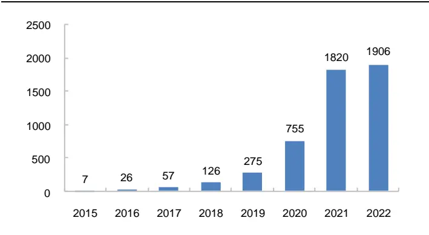
资料来源：私募排排网，海通证券研究所

图2 2021年私募指数增强产品的平均收益
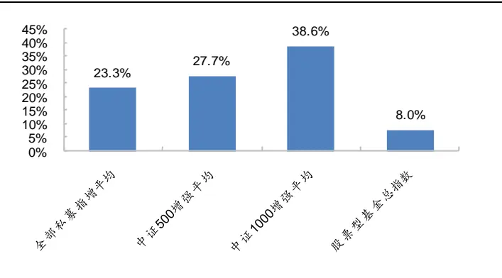
资料来源：私募排排网，Wind，海通证券研究所

新发产品数大增的直接结果是管理规模的迅猛扩张。据私募排排网的不完全统计，截至 2022 年 2月底，国内百亿量化私募已达 29家，在全部百亿私募（115家）中的数量占比为 。为行文方便，我们将管理规模在百亿以上的量化私募统一称为头部私募，其余则称为二线私募。

在行业高速发展的过程中，龙头效应逐渐显现，头部私募的产品更受投资者青睐。如图 3所示，2021 年 6-9 月期间，私募排排网中收录的 22 家头部私募共发行 375 只指数增强产品，在所有新发指增产品中的数量占比高达 73.4%。

高增长不仅体现在头部私募的数量和规模上，也体现在他们的业绩上。我们计算了每家头部私募基金公司所有指数增强产品平均收益率，再取中位数作为头部私募这个群体的业绩代表，将其与相同算法下的二线私募业绩进行对比，结果如图 4 所示。2020年初至 2021 年 9 月中上旬，头部私募的业绩表现持续优于二线私募。尤其是 2021 年 5月开始，两者的收益差距进一步扩大。

图3 头部私募与二线私募每月新发产品数
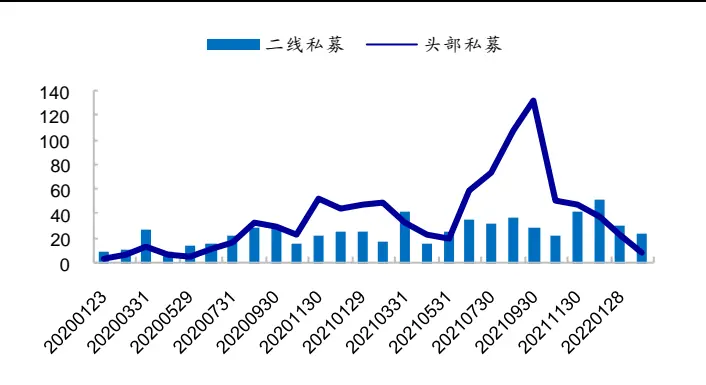
资料来源：私募排排网，海通证券研究所

图4 头部私募收益中位数相对二线私募的累计净值
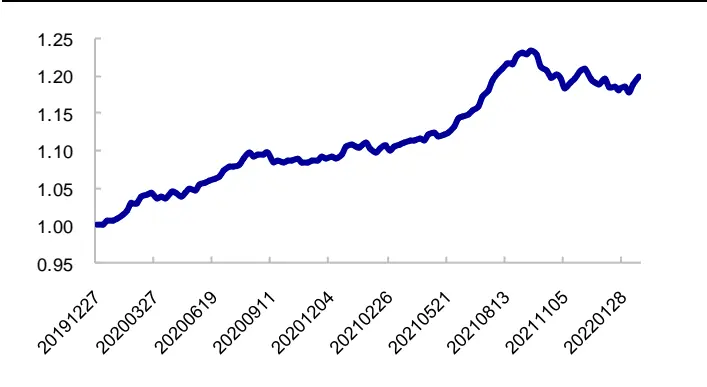
资料来源：私募排排网，海通证券研究所

然而，2021 年 9月 15 日后，头部私募的业绩明显落后于二线私募。如图 5-6 所示，最近半年，无论是沪深 300 增强、中证 500 增强，还是全部指数增强产品，头部私募业绩的平均水平和中位数均持续跑输二线私募。

图5 头部私募平均收益相对二线私募的累计净值
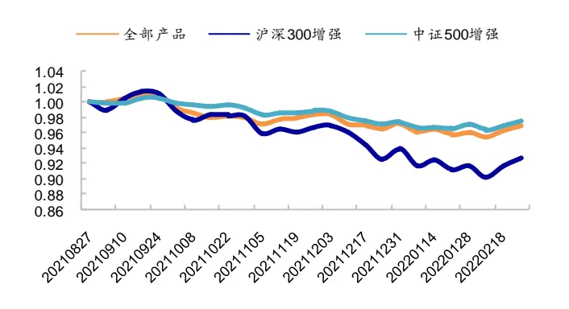
资料来源：私募排排网，海通证券研究所

图 头部私募收益中位数相对二线私募的累计净值
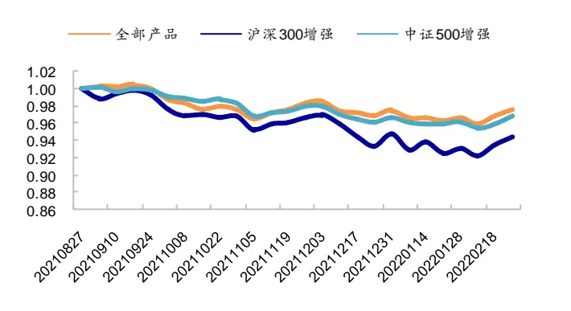
资料来源：私募排排网，海通证券研究所

从收益指标来看，2021 年 9 月至 2022 年 2 月，头部私募沪深 300 指数增强产品收益中位数为-9.13%，跑输基准指数 3.56%，低于二线私募的中位数（-3.55%，跑赢基准1.98%）；头部私募中证 500 指数增强产品收益中位数为-7.75%，跑输基准指数 1.44%，低于二线私募的中位数（-3.14%，跑赢基准 3.17%）。

从风险指标来看，头部私募的沪深 300 增强和中证 500 增强的最大回撤中位数分别为 10.2%和 5.9%，均显著高于二线私募的 4.6%和 3.7%。

表 1 头部私募与二线私募的业绩中位数对比（2021.09-2022.02）

| 沪深 300 增强 |  |  |  |  |  |  |  |
| --- | --- | --- | --- | --- | --- | --- | --- |
|  | 产品收益 | 超额收益 | 超额波动率 | 信息比 | 最大回撤 | 收益回撤比 | 周胜率 |
| 头部私募 | -9.13% | -3.56% | 10.8% | -0.85 | 10.2% | -0.37 | 52.1% |
| 二线私募 | -3.55% | 1.98% | 8.9% | 0.84 | 4.6% | 0.71 | 54.2% |
| 中证 500 增强 |  |  |  |  |  |  |  |
|  | 产品收益 | 超额收益 | 超额波动率 | 信息比 | 最大回撤 | 收益回撤比 | 周胜率 |
| 头部私募 | -7.75% | -1.44% | 6.9% | -0.46 | 5.9% | -0.24 | 52.1% |
| 二线私募 | -3.14% | 3.17% | 7.8% | 0.98 | 3.7% | 0.96 | 58.3% |

资料来源：私募排排网， ，海通证券研究所

由此可见，规模确实对量化私募的业绩产生了很大影响。但能否就此断定，头部私募表现不佳是源于规模大幅上升导致的策略拥挤？我们认为不尽然。如果高频赛道已拥挤如斯，不得不存量博弈，那何以手握硬件和人才两大资源优势的头部私募，业绩反而不及二线呢？如此看来，拥挤或许并不足以完全解释规模对高频策略的影响。

## 2.头部私募回撤原因分析：高频赛道因拥挤而失效？

二线私募显著优于头部私募的业绩，似乎是对“回撤是由策略拥挤引发的”这一观点较为有力的质疑，乃至驳斥。那么，规模增大对业绩的影响究竟表现在什么方面？我们以海通量化团队研发和跟踪的高频因子为基础，尝试探寻其中可能的联系。

## 2.1 规模快速扩张对头部私募的两大影响：频率降低和成本上升

## 频率降低

一般说来，不论是头部还是二线，量化私募较为倚赖的策略形态多为高频。因此，我们猜测，两者的业绩可能与高频因子有较高的相关性。事实也确实如此。

我们以头部和二线私募业绩的中位数分别代表整个群体的表现，计算它们与海通量化团队研发的四个逐笔级高频因子——开盘后买入意愿占比/强度、开盘后大单净买入占比/强度的多头超额收益之间，滚动 50 周相关系数的均值。如下图所示，2020 年 2 月末以来，两者均逐渐上升；进入 2021 年后，稳定在 30%附近波动；全区间的平均值分别为 0.27（头部）和 0.29（二线）。由此可见，上述四个因子可在一定程度上反映量化私募应用高频策略的情况。

图7 头部、二线私募和逐笔级高频因子的滚动 50周相关系数（2020.02.28-2022.02.25）
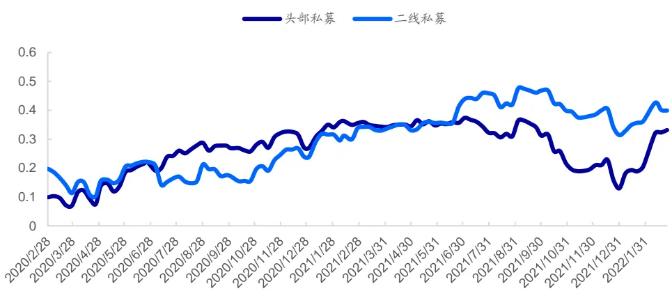
资料来源：私募排排网，Wind，海通证券研究所

不过，量化私募的业绩和逐笔级高频因子多头超额收益的相关系数并非一成不变。2020.07-2021.06，相关系数逐步上升；同时，头部私募始终高于二线私募。但 2021 年7 月起，二线私募反超，期间虽有波动，但一直保持领先。头部私募则掉头向下，一路跌落至 2021 年底的 0.1 附近后，才开始快速反弹。

进一步对比 2021 年上、下半年，头部、二线私募的业绩与每个逐笔级高频因子多头超额收益相关系数的变化，我们发现，（1）2021 下半年相对上半年，不论是头部还是二线私募，和逐笔级高频因子的相关性都下降了，但头部私募的降幅更大（图 8）。（2）二线私募和逐笔级高频因子的相关性在 2021 年上、下半年都高于头部私募，且这种差距在下半年进一步扩大（图 9）。

结合图 中量化私募新发产品数量在 年下半年的大幅增加，我们推测，规模的迅速扩张使得量化私募对高频策略的应用强度明显减弱，最可能的方式就是降低交易频率，表现为业绩和逐笔级高频因子多头超额收益相关性的降低。而头部私募在 2021年 6-11 月的发展速度更是惊人，因此降频的力度更大，导致相关性的降幅也显著高于二线私募。

图8 2021H2 和 2021H1 的相关系数之差
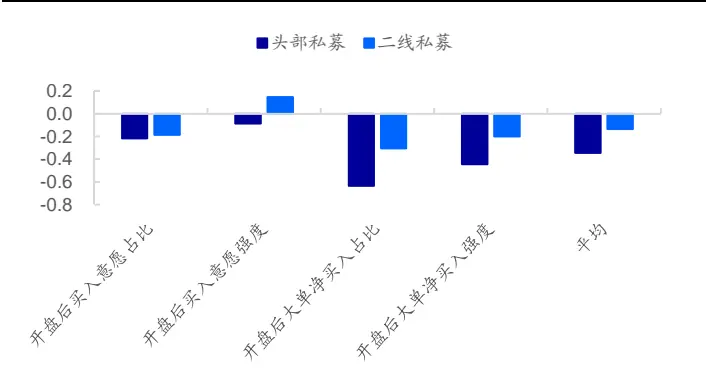
资料来源：私募排排网，Wind，海通证券研究所

图9 二线私募和头部私募的相关系数之差
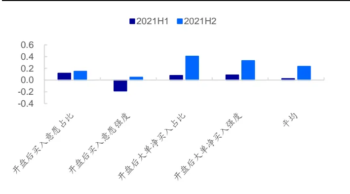
资料来源：私募排排网，Wind，海通证券研究所

降低交易频率的直接影响是无法有效捕获高频策略或因子的超额收益。如图 所示，在规模迅速扩张前（2020.02-2021.07），头部、二线私募和逐笔级高频因子的走势较为接近，回撤和反弹几乎都在同一时点。然而，从 年 月至年末，三者的表现大相径庭。逐笔级高频因子依然有效，二线私募净值走平，而头部私募则回撤明显。在此期间，量化私募，尤其是头部私募的规模呈爆发式增长。

图10 头部、二线私募和逐笔级高频因子的累计收益（2020.02.28-2022.02.25）
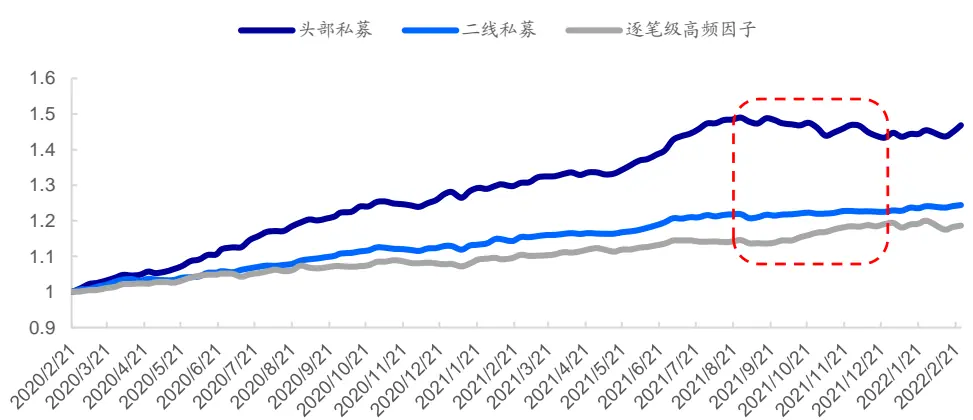
资料来源：私募排排网， ，海通证券研究所

综合以上分析，我们认为，2021 年 9-12 月，高频因子并未明显失效，期间虽有回撤，但反弹迅速。因此，我们不能简单地把量化私募的业绩下滑归咎于策略拥挤，不然怎么会出现二线私募业绩显著优于头部私募的现象，毕竟前者在策略研发、计算资源、执行速度等方面都不具备优势。

而从头部、二线私募业绩与高频因子相关性的变化和对比中，我们发现，规模快速扩张更直接的后果可能是量化私募被迫降低交易频率，减小了在依旧有效的高频策略或因子上的暴露，最终导致收益下滑。这也能解释为什么二线私募受到的冲击相对较小，规模从几十亿增长至一两百亿，和从四五百亿增长至千亿所需降频的幅度不可同日而语。

## 成本上升

过大的规模也会影响交易成本。尽管头部私募都有极其高效的算法交易系统，但同样一个股票，买卖十几手和上百手的执行难度和成本终究会有差异。尤其是对那些中小盘股而言，这种差异会更大。

为了更直观地展示规模对交易成本的影响，我们做了一个简单的模拟测试。假定交易对象是中证 成分股，总资金量分别为 亿、 亿和 亿。等权分配资金，即每个成分股的交易金额为 100万、1000 万和 1亿。交易时间为 9:30-10:00，即开盘后半小时。交易方式为，每 10 秒下一个等量市价单。比较基准为，9:30-10:00 的 TWAP。

下表展示的是 2021.09-2021.12 期间，不同交易金额对应的中证 500 指数前 10 大权重股的日均冲击成本。其中，买入冲击成本=(TWAP – 买入价格)/TWAP，卖出冲击成本=(卖出价格 –TWAP)/TWAP。

表 2 中证 500 前 10 大权重股的买卖冲击成本测算（bps，2021.09-2021.12）

| 买入 | 交易金额 | 100万 | 1000万 | 1亿 |
| --- | --- | --- | --- | --- |
|  | 均值 | -3.7 | -4.2 | -10.2 |
|  | 中位数 | -3.7 | -4.4 | -8.8 |
|  | 最小值 | -1.6 | -2.2 | -6.2 |
|  | 最大值 | -5.5 | -5.2 | -19.8 |
|  | 均值 | -3.9 | -4.9 | -10.2 |
| 卖出 | 中位数 | -4.0 | -4.6 | -9.1 |
|  | 最小值 | -2.5 | -3.5 | -6.3 |
|  | 最大值 | -5.6 | -7.1 | -19.2 |

资料来源：Wind，海通证券研究所

随着交易金额的上升，10 个股票日均冲击成本的均值和中位数也逐步增加。当每个成分股的交易金额为 1亿时，单边的平均冲击成本在 1‰左右，叠加印花税、佣金等，总成本超过 3‰。极端情况下，某些个股的单边冲击成本可达 2‰，总成本将突破 5‰。

考虑到我们测试的还只是中证 500 指数的前 10 大权重股，那些规模较小、流动性较差的成分股，或是中证 800以外的个股，很有可能会面临更高的交易成本，甚至无法交易的情况。

由此可见，除了不得不降低交易频率外，管理规模迅速扩张后的另一个潜在的影响就是交易成本上升带来的收益磨损。

那么，两者又是怎样共同作用于业绩的呢？我们基于海通量化团队研发的高频因子构建周度调仓的中证 500 纯量价增强组合，考察它在 20%、30%、40%和 50%的周度单边换手率以及 0.1%、0.2%、0.3%、0.4%和 0.5%双边交易成本下的超额收益。

所用的因子包括，尾盘成交占比、开盘后买入意愿强度、开盘后大单净买入占比和深度学习高频因子。风险控制模型则包括行业、市值中性，个股相对偏离小于 1%，并控制组合在估值、盈利和盈利增长因子上的相对暴露为 0。买卖的成交价格假定为次日VWAP。

下表展示了 2016 年以来 80%成分股权重约束下和无成分股约束的周度调仓组合的年化超额收益。当双边交易成本为 0.1%时，换手率从 50%下降至 20%，超额收益的降幅在 4%以上，再次体现出降频对高频策略的影响程度。即使交易成本上升至 0.3%，40%换手率假设下，仍可获得显著优于 20%换手率的超额收益。但是，如果交易成本进一步上升至 0.4%或 0.5%，50%换手率假设下的超额收益将是最低的。

需要说明的是，可能有人会质疑交易成本为 0.1%这一假设的合理性，毕竟印花税就有千分之一，还不包括券商佣金。但实际上，在规模不那么大时，量化私募凭借低廉的佣金和成熟的算法交易，已被证明完全有能力将一买一卖的成本控制在 0.1%乃至更低。显然，如果高频策略或因子依然有效（至少当前确实如此），保持高换手还是较优的选择。

表 3 交易成本对指数增强组合超额收益的影响

| 80%成分股权重约束 | 交易成本 | 20%单边换手 | 30%单边换手 | 40%单边换手 | 50%单边换手 |
| --- | --- | --- | --- | --- | --- |
|  | 0.1% | 14.0% | 18.4% | 18.8% | 18.5% |
|  | 0.2% | 12.9% | 16.7% | 16.5% | 15.7% |
|  | 0.3% | 11.8% | 15.0% | 14.3% | 12.9% |
|  | 0.4% | 10.8% | 13.4% | 12.1% | 10.3% |
|  | 0.5% | 9.7% | 11.7% | 10.0% | 7.6% |
|  | 0.5%-0.1% | -4.3% | -6.7% | -8.8% | -10.8% |
| 无成分股约束 | 0.1% | 18.4% 22.1% | 22.5% | 22.6% |  |
|  | 0.2% | 17.3% 20.4% | 20.2% | 19.7% |  |
|  | 0.3% | 16.1% 18.6% | 17.9% | 16.8% |  |
|  | 0.4% | 15.0% 16.9% | 15.6% | 14.1% |  |
|  | 0.5% | 13.9% 15.2% | 13.4% | 11.3% |  |
|  | 0.5%-0.1% | -4.5% -6.9% | -9.1% | -11.3% |  |

资料来源：Wind，海通证券研究所

另一方面，在同一换手率假设下，超额收益随交易成本的上升单调递减。而且，换手率越高，超额收益的降幅越大。例如，当交易成本从 0.1%上升至 0.5%，对于 20%换手率的假设，超额收益将下降 4.3-4.5%；而当换手率为 50%时，降幅则将超过 10%。

由此可见，量化私募主要采用的高频策略或因子对交易成本高度敏感，规模变大背后潜藏的成本上升，在各种换手率假设下都产生了不同程度的收益损耗。而且，从我们的分析来看，交易频率和交易成本对业绩的影响并不是孤立的。因此，如何确定适配自身交易成本的交易频率，或许是当前摆在量化私募面前的一个新的挑战。

对于规模一两百亿的二线私募，尚可维持较低的交易成本，因此只需小幅降频，甚至是不降频，仍能获得较为稳定的超额收益。但对于规模接近千亿级别的头部私募，大幅降低交易频率，以及较高的交易成本，形成了对业绩的戴维斯“双杀”。那么，面对这一压力，头部私募在 2021 年下半年又选择了怎样的应对方案，才致使更大回撤的发生，下文将继续展开分析。

## 2.2 头部私募高频策略收益下降后的无奈之举：提升基本面因子的暴露

当头部私募因为规模快速上升而选择降低交易频率，牺牲的只能是高频策略或因子相对稳定且可观的收益。与此同时，更高的交易成本进一步压缩了本就有限的收益空间。为了继续维持良好的业绩，头部私募不得不尝试其他的策略。

根据我们的经验，以基本面因子为主的低频量化策略，无疑是接受度和可行性都较高的一种方案。如果头部私募彼时的选择和我们的猜测一致，那么用传统的线性模型将头部私募的业绩对基本面和高频因子归因，应该可以看到因子暴露会在规模扩张前后呈现鲜明的变化，而二线私募的暴露变化，则应当不明显。

为此，我们继续以头部、二线私募中证 500 指数增强产品的超额收益中位数代表两者的业绩表现，并以 2021.06.30 为界，计算前后半年的因子暴露，具体结果如下图所示。

图11 私募中证 500 指数增强在风格因子上的暴露（2021.01-2021.12）

| 头部私募 |  |  |  |  | 二线私募 |  |  |  |  |
| --- | --- | --- | --- | --- | --- | --- | --- | --- | --- |
|  | 风格暴露 |  | 收益归因 |  |  | 风格暴露 |  | 收益归因 |  |
|  | 2021H1 | 2021H2 | 2021H1 | 2021H2 |  | 2021H1 | 2021H2 | 2021H1 | 2021H2 |
| 实际年收益 |  |  | 33.6% | 18.9% | 实际年收益 |  |  | 28.6% | 19.0% |
| alpha |  |  | 0.5% | 7.0% | alpha |  |  | 6.4% | 8.1% |
| 市场 |  |  | 15 % | .3% | 市场 |  |  | 15.5 | 7% |
| 市值 | B7 0 | B7 | 0.2% | 4.6% | 市值 | -0.21 | -0.08 | 0.1% | 1.0% |
| 估值 | 0.0 | 0 | 0.6% | -0.4% | 估值 | 0.07 | 0.00 | 0.6% | 0.0% |
| 动量 | 26 | 0. | 0.1% | -1.5% | 动量 | 0.00 | 13 | 0.0% | -0.8% |
| ROE | 0. | 0. | 2.5% | -3.2% | ROE | 0.50 | 0.54 | 2.7% | -2.7% |
| SUE | -0 69 | 0. 9 | -4.4% | -1.3% | SUE | 0.01 | 0.40 | 0.1% | -0.7% |
| 尾盘成交占比 | I 81 | -0 78 | 5.8% | 3.3% | 尾盘成交占比 | -0.20 | -0.14 | 1.4% | 0.6% |
| 开盘后大单净买入金额占比 | 0.2 | -0.30 | 1.6% | -1.5% | 开盘后大单净买入金额占比 | 0.31 | -0.04 | 2.3% | -0.2% |
| 开盘后买入意愿强度 | 0.3 | 0. | 1.5% | 0.5% | 开盘后买入意愿强度 | -0.11 | 0.24 | -0.4% | 1.0% |

资料来源：私募排排网， ，海通证券研究所

2021 年上半年，头部私募的年化收益领先二线私募多达 5 个百分点；但到了下半年，两者已无差异，二线私募的 alpha 甚至还高于头部私募。造成这一反转的原因，很大程度上与因子暴露的变化有关。

和 2021 年上半年相比，头部和二线私募不约而同地在下半年提升了动量、ROE和SUE 因子的暴露。而头部私募的提升幅度更为剧烈，其中，动量因子的暴露从-0.26 提升至 0.26，SUE因子的暴露则从-0.69 大幅提升至 0.79。并且，在 2021 年下半年，头部私募在这三个因子上的暴露都高于二线私募。但遗憾的是，三者对头部私募合计收益贡献为-6.0%。

与此同时，头部私募在两个逐笔级高频因子——开盘后大单净买入占比和开盘后买入意愿强度上的暴露，在前后两个半年内下降明显，并产生了 1%的损失。二线私募虽然也降低了在开盘后大单净买入占比因子上的暴露，并蒙受损失，但对开盘后买入意愿强度因子暴露幅度的提升，则获取了显著的正向收益，两者合计为 0.8%。

从以上的数据分析中，我们可以初步得到一个结论：头部私募将原本在高频策略或因子上的暴露，转移到了基本面因子，尤其是成长（SUE）和动量因子之上。

为了更加清晰地展示因子上暴露变化对头部和二线私募产生的影响，我们进一步将变化幅度和因子收益放入同一张表格中予以对照。2021 年下半年，头部私募显著降低了在依然有效的高频因子上的暴露，大幅提升在基本面因子上的暴露，而这些因子的收益都不尽如人意。

表 4 因子收益和量化私募的因子暴露

|  | 2021H1 |  | 2021H2 |  | 因子收益 | 2021H2-2021H1 因子暴露 |  |
| --- | --- | --- | --- | --- | --- | --- | --- |
|  | 因子暴露 |  | 因子暴露 因子收益 |  |  |  |  |
|  | 头部私募 | 二线私募 | (年化) 头部私募 | 二线私募 | (年化) | 头部私募 | 二线私募 |
| 动量 | -0.26 | 0.00 | -0.47% | 0.26 | 0.13 | -5.82% 0.52 | 0.13 |
| ROE | 0.48 | 0.50 | 5.35% | 0.63 | 0.54 -5.04% | 0.15 | 0.04 |
| SUE | -0.69 | 0.01 | 6.33% | 0.79 | 0.40 -1.68% | 1.48 | 0.39 |
| 开盘后大单净买入金额占比 | 0.21 | 0.31 | 7.39% | -0.30 | -0.04 | 4.89% -0.51 | -0.35 |
| 开盘后买入意愿强度 | 0.37 | -0.11 | 4.02% | 0.12 | 0.24 | 4.35% -0.25 | 0.35 |

资料来源： ，海通证券研究所

那么，头部私募在基本面因子上的高暴露会不会是使用了一些特殊的高频策略或因子导致的呢？虽然我们无从得知具体的策略/因子，但是通过分析海通量化团队研发的高频因子与常用低频基本面因子的相关性，或许也能从侧面找到一些线索。

如下表所示，绝大部分高频因子和低频基本面因子的相关系数都在 0附近。绝对值最大的为平均单笔流出金额占比和 BP之间的 0.31，而四个逐笔级高频因子和低频基本面因子的相关系数绝对值更是不超过 0.1。从这些数据来看，我们不倾向于认为头部私募在基本面因子上较高的暴露是由高频策略或因子导致的。

表 5 高频因子与低频基本面因子的相关性

|  | 市值 | 中盘 | BP | EP | ROE | dROE | SUE |
| --- | --- | --- | --- | --- | --- | --- | --- |
| 改进反转 | -0.01 | 0.00 | -0.06 | -0.02 | 0.00 | 0.02 | 0.01 |
| 尾盘成交占比 | -0.25 | -0.19 | 0.02 | -0.07 | -0.12 | -0.05 | -0.11 |
| 日内高频偏度 | -0.10 | -0.04 | -0.23 | -0.13 | -0.06 | -0.02 | -0.05 |
| 日内下行波动占比 | 0.06 | 0.01 | 0.28 | 0.11 | 0.01 | 0.00 | 0.01 |
| 大单推动涨幅 | 0.18 | 0.10 | -0.15 | -0.06 | 0.01 | 0.02 | 0.04 |
| 平均单笔流出金额占比 | -0.16 | -0.09 | 0.31 | 0.07 | -0.08 | -0.01 | -0.06 |
| 开盘后买入意愿占比 | 0.07 | -0.03 | -0.01 | 0.03 | 0.05 | 0.05 | 0.07 |
| 开盘后买入意愿强度 | 0.00 | -0.07 | 0.04 | 0.03 | 0.03 | 0.03 | 0.05 |
| 开盘后大单净买入占比 | 0.10 | 0.03 | -0.03 | 0.08 | 0.09 | 0.04 | 0.09 |
| 开盘后大单净买入强度 | 0.02 | -0.03 | -0.05 | 0.05 | 0.07 | 0.01 | 0.05 |

资料来源：Wind，海通证券研究所

至此，我们已经较为清晰地勾勒出 2021 年四季度头部量化私募大幅回撤的全貌。

首先，通过对量化私募的业绩和高频因子收益之间相关性的分析，我们发现，2021年下半年，头部私募使用高频策略或因子的强度下降了。由此我们推测，由于规模快速扩张，策略很快达到容量上限，头部私募不得不降低交易频率。另一方面，过大规模也使得交易成本变得更难控制，这也对交易频率形成了掣肘。

其次，我们构建了一个周度调仓的中证 500 纯量价增强组合，用以评估高频策略的业绩对换手率和交易成本的敏感性。数据结果表明，换手率下降和交易成本上升，都显著降低了超额收益。尤其是在相对较高的成本下，继续坚持使用换手率并不算低的策略，产生的收益损耗更加惊人。因此，我们认为，策略拥挤可能并不是头部私募在 2021 年四季度回撤的主要原因，规模压力下的降频和成本提升或许更加关键。

最后，我们用简单的线性归因模型，探讨了头部私募在降低交易频率之后的选择。2021 年上半年到下半年的因子暴露对比，生动地展现了头部私募在基本面因子，尤其是成长和动量上的暴露提升。而这些因子在下半年的大幅失效，使得头部私募在损失了高频策略的稳定收益和背负着更高的交易成本之后，又遭遇了第三次打击。

既然厘清了回撤的原因，那么，站在当前，对于那些高频赛道的后来者，尤其是共募基金，他们还应该上场吗？如果是，哪些方向是值得继续深入探索的，多大的规模是最适合高频策略或因子发挥的。下文就将针对这两个公募基金最为关心的话题展开讨论。

## 3.研发方向和规模空间的展望：后来者还应继续投入吗？

## 3.1 高频因子确实会因拥挤而失效

虽然前文的分析表明，赛道拥挤可能并非高频策略或因子失效的主因，但不可否认的是，随着应用的人越来越多，高频策略或因子必然会面临有效性减弱甚至失效的问题。

以海通量化团队开发的两个分钟级别的高频因子——改进反转和量价相关性为例，2013-2016 年，两者的表现都较为优异。尤其是改进反转因子（图 12），多头累计超额收益稳定向上，年超额收益（月均超额收益*12）高达 12.9%。2017-2020 年，因子有效性逐渐减弱，年超额收益降至 3.2%。2021-2022.02，多头累计超额收益转而向下，年超额收益-3.4%。

我们以多头个股总成交金额占全 A总成交金额之比，来反映因子的拥挤程度。多头成交金额占比越高，因子越拥挤。如图 14所示，因子的多头超额收益和拥挤程度呈较为明显的负相关性（相关系数-0.3）。即，因子越拥挤，多头超额收益越低。从时间序列角度来看，2013 年以来，改进反转因子的拥挤度持续上升，而多头超额收益则逐级下降。

量价相关性因子有效性的变化，也呈类似特征。2013 年以来，随着以多头成交额占比反映的因子拥挤度的不断上升，相应的多头超额收益也逐渐降低，直至因子彻底失效。

图12 改进反转因子多头累计超额收益
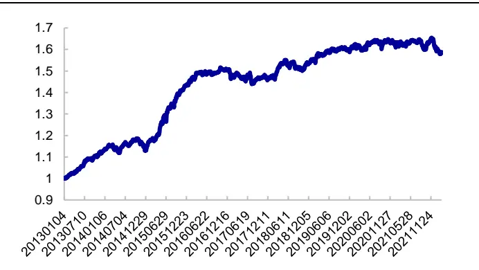
资料来源：Wind，海通证券研究所

图13 量价相关性因子多头累计超额收益
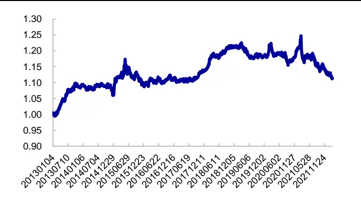
资料来源：Wind，海通证券研究所

图14 改进反转因子多头成交金额占比与月度多头超额收益散点图（2013.01-2022.02）
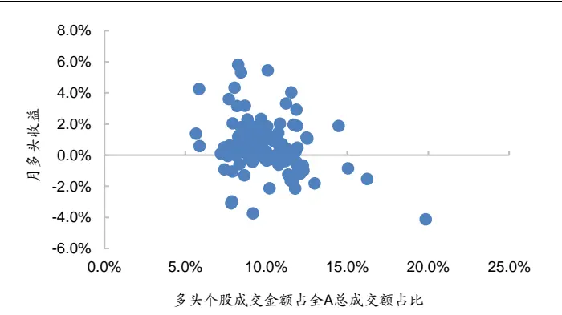
资料来源：Wind，海通证券研究所

图15 量价相关性因子多头成交金额占比与月度多头超额收益散点图（2013.01-2022.02）
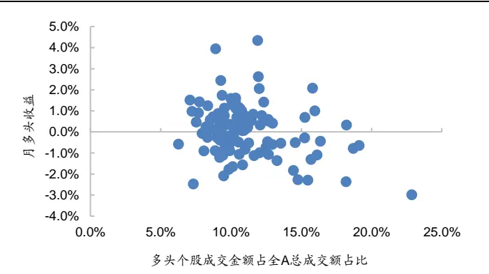
资料来源：Wind，海通证券研究所

图16 不同时期改进反转因子的拥挤程度和月均多头超额收益(2013.01-2022.02)
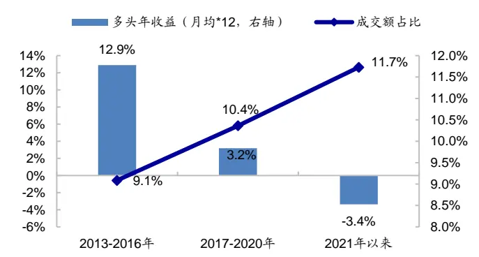
资料来源：Wind，海通证券研究所

图17 不同时期量价相关性因子的拥挤程度和月均多头超额收益（2013.01-2022.02）
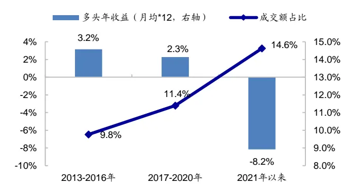
资料来源：Wind，海通证券研究所

由此可见，像改进反转、量价相关性这些逻辑浅显、计算简单的分钟级别高频因子，很容易被快速复制而产生拥挤后失效，这也给高频策略或因子的研发提出了更大的挑战。

## 3.2 高频因子的研发方向

事实上，不止是改进反转和量价相关性， 年，那些只依赖于价格序列的高频因子都迅速失效。日内偏度、日内下行波动占比和大单推动涨幅的多头超额收益同样逐年下降，且最近三年均小于零（图 18）。但同时，也有不少高频因子依然有效。尤其是基于逐笔数据构建的开盘后大单买入占比和开盘后买入意愿占比，近五年的多头超额收益十分稳定。

图18 高频因子的分年度多头超额收益
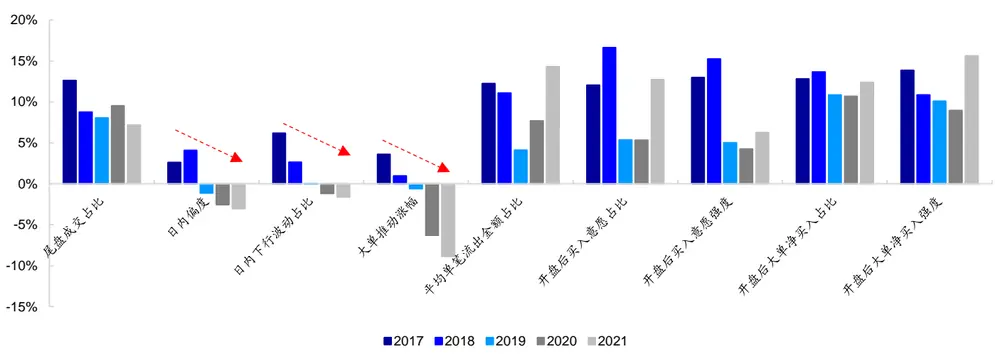
资料来源：Wind，海通证券研究所

由此可见，使用更细粒度的高频数据，如，委托队列、逐笔成交和逐笔委托，是未来高频策略或因子研发的必备条件。唯此，才能挖掘更多和市场微观结构或投资者行为相关的有用信息。近年来依然有效的开盘后买入意愿占比和开盘后大单净买入占比，乃至计算更加简便的尾盘成交占比，皆属此类。它们从不同角度刻画了各类市场参与者的行为，如，有信息优势的投资者或零售端的客户。

另一方面，即便是用到了逐笔数据，那些从人工逻辑出发、基于有显式表达的四则运算或统计计算得到的高频策略或因子（图 中的后四个），也很有可能随着关注度的提升和应用的普遍，而逐渐失效。

因此，借助信息加工能力更强，同时包含非线性结构的深度学习工具，似乎是不可避免的研发方向。事实上，近两年量化私募的崛起，或多或少都受益于这一路径。而从我们的经验和跟踪结果来看，用深度学习挖掘高频策略或因子，依然有着较大的空间。

下图展示的是海通量化团队研发的 4个高频类深度学习因子的收益表现。2017 年以来，4个因子每年的多头超额收益均超过 10%。尽管 2021 年的业绩相比之前年份略有下降，但进入 2022 年后，不论是多头超额收益还是多空收益均恢复到了与往年接近的水平。由此可见，如果有条件，深度学习不失为一条新的挖掘有效因子的途径。

图19 深度学习因子的分年度多头超额收益和多空收益
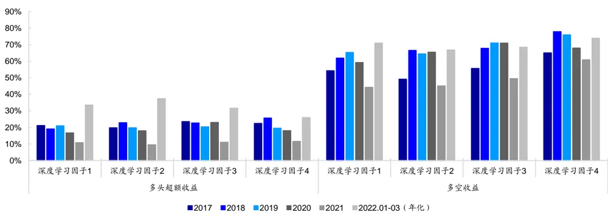
资料来源：Wind，海通证券研究所

通过以上的案例分析，我们的判断是，当前高频策略或因子仍有可为。只不过，近年来的快速发展，使得赛道上的后来者面临的挑战和竞争也越来越大。颗粒度更细的逐笔数据乃至完整还原后的限价订单簿（LOB），可能是我们在追赶先行者的脚步时，所必须依赖的基础设施。而对于深度学习类因子，我们的测试和经验表明，更合理的模型设计、更丰富的输入特征和持续的迭代更新，是因子维持较为稳定收益表现的重要保障。以上这些，或许就是量化人所需要付出的社会必要劳动。

## 3.3 高频因子适用的规模空间

虽然上文的分析表明，现阶段高频策略或因子尚未达到拥挤的程度，但规模过高导致的频率降低和成本上升，对业绩产生的负面影响也是显而易见的。那么，对于有意应用高频策略或因子的机构而言，什么样的规模才是较为适合发挥高频优势的呢？

我们以中证 800+中证 1000 成分股作为选股空间，探索规模和高频因子多头组合收益之间的关系。

首先，由表 2 的模拟撮合案例可知，对任意一只个股，其交易成本将随买入/卖出金额的增加而上升。因此，我们对组合中单只个股的买入规模占其流通市值的比例（下简称买入规模占比）和交易成本之间的关系，做出如下假设（表 6）。例如，当单只个股的买入规模占比为 2‰时，可以按当日均价及双边千 2 的成本完成交易。

表 6 买入规模占比与交易成本的假设

| 买入规模占比 | 交易成本 | 买入规模占比 |
| --- | --- | --- |
| 千分之2 | 双边千2 | 千分之5 双边千6 |
| 千分之3 | 双边千3 | 千分之6 双边千7 |
| 千分之4 | 双边千4 | 千分之8 双边千8 |

资料来源：海通证券研究所整理

其次，如果我们交易的是高频因子的多头组合，那么组合包含的个股数量及个股的加权方式，也会影响因子收益和组合规模之间的关系。因此，我们进一步假设，对每一个高频因子，其多头组合的构建方式为，选择因子得分最高的 1/20、1/15、1/10、1/5股票，加权方式则包括等权和市值加权两种。

最后，遍历每个高频因子上述 6*4*2（交易成本*个股数量*加权方式）共 48 种情形，可得每一种情形下，组合规模与多头组合相对选股空间内所有股票市值加权组合年超额收益（月均超额收益*12）的散点图（图 20-25）。其中，组合规模的计算公式为：

min（个股 i的流通市值*买入规模占比/个股 i在组合中的权重）。

为展示方便，对于情形j，若可以找到交易规模和收益都更高的情形 k，则将情形 j删除，只保留情形 k。

显然，无论是月度、周度还是日度换仓，随着组合规模的增加，收益都会逐步下降。

对于分钟高频因子，月度换仓频率下（图 ），组合规模在 亿左右时，因子年超额收益大约为 ；组合规模在 亿左右时，因子年超额收益将下降至 。周度、日度换仓频率下（图 22、24），随着组合规模的上升，收益的衰减速度更快。月频下，组合规模在 亿左右时，因子的超额收益接近于 ；周频下，组合规模在 亿左右时，因子的超额收益接近于 ；而日频下，组合规模在 亿左右时，大部分因子的超额收益已转而为负。

月度换仓频率下，逐笔高频因子的收益水平略高于分钟高频因子。组合规模在亿左右时，因子年超额收益大约为 （图 ）。与分钟高频因子的特征类似，周度、日度换仓频率下，收益同样随着组合规模的上升快速衰减。月频下，组合规模在 600 亿左右时，因子的超额收益接近于 ；周频下，组合规模在 亿左右时，因子的超额收益接近于 （图 ）；而日频下，组合规模在 亿元左右时，部分因子的超额收益已转而为负（图 25）。

图20 分钟高频因子多头组合规模与年超额收益散点图（2013.01-2022.02，月频）
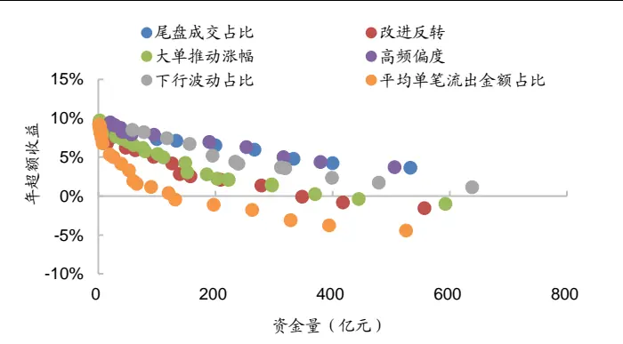
资料来源：Wind，海通证券研究所

图21 逐笔高频因子多头组合规模与年超额收益散点图（2013.01-2022.02，月频）
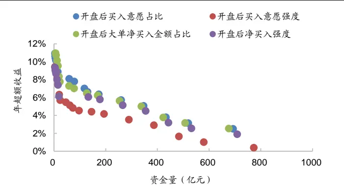
资料来源：Wind，海通证券研究所

图22 分钟高频因子多头组合规模与年超额收益散点图（2013.01-2022.02，周频）
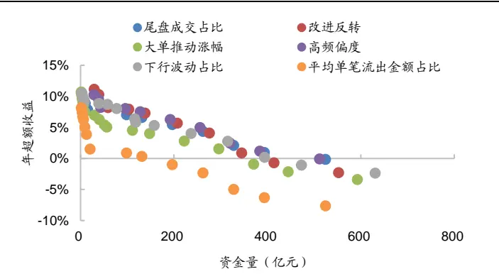
资料来源：Wind，海通证券研究所

图23 逐笔高频因子多头组合规模与年超额收益散点图（2013.01-2022.02，周频）
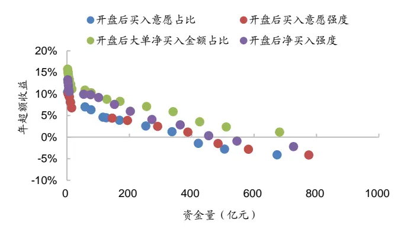
资料来源：Wind，海通证券研究所

图24 分钟高频因子多头组合规模与年超额收益散点图（2013.01-2022.02，日频）
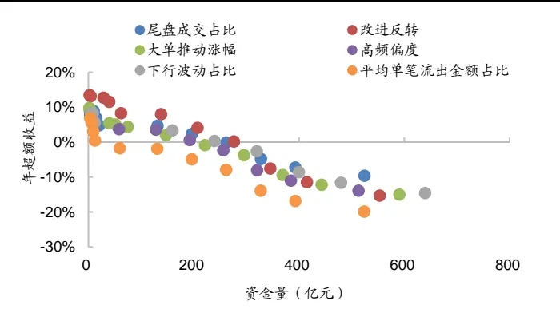
资料来源：Wind，海通证券研究所

图25 逐笔高频因子多头组合规模与年超额收益散点图（2013.01-2022.02，日频）
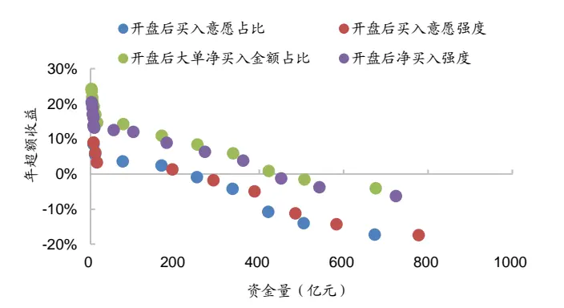
资料来源： ，海通证券研究所

将多个高频因子复合，可以提升多头组合的超额收益及规模上限。以 IC 加权为例（图26-28），组合规模为 50 亿元左右时，月频换仓的年超额收益大约为 18%，周频大约为21%，日频大约为 31%。

对比不同换仓频率的结果（图 29），规模较小（不高于 50 亿元）时，换仓频率越高，因子年超额收益越优。扣费后，日频的年超额收益最高，周频次之，月频再次。但随着组合规模的上升，换仓频率越高，收益的衰减速度越快。组合规模在 0-250 亿区间内，日频换仓是最优选择。当组合规模接近或超过 400 亿时，三种换仓频率下收益水平的关系与规模较小时完全相反，即，月频优于周频，周频优于日频。

图26 复 合 因 子 多 头 组 合 规 模 与 年 超 额 收 益 散 点 图（2013.01-2022.02，月频）
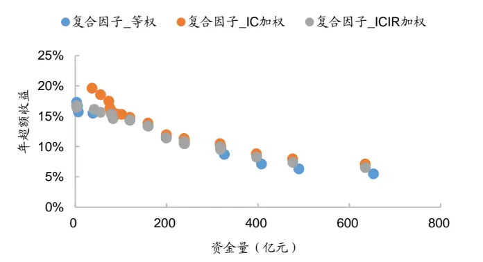
资料来源：Wind，海通证券研究所

图27 复 合 因 子 多 头 组 合 规 模 与 年 超 额 收 益 散 点 图（2013.01-2022.02，周频）
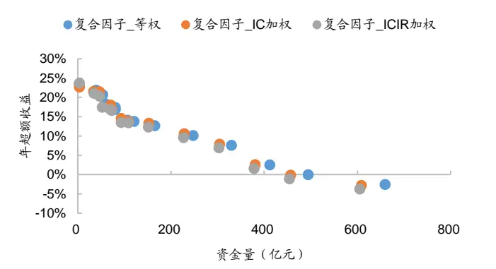
资料来源：Wind，海通证券研究所

图28 复 合 因 子 多 头 组 合 规 模 与 年 超 额 收 益 散 点 图（2013.01-2022.02，日频）
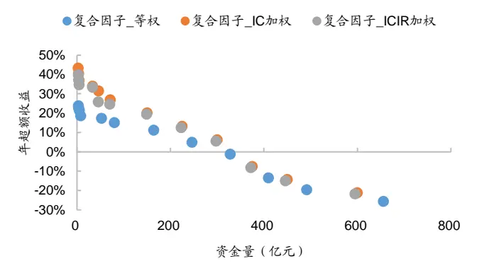
资料来源：Wind，海通证券研究所

图29 IC 加权复合因子多头组合规模与年超额收益散点图（2013.01-2022.02）
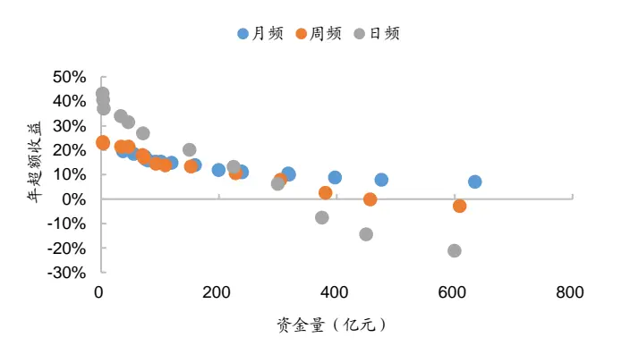
资料来源：Wind，海通证券研究所

上述测算结果和直观较为相符，不论是单因子还是复合因子，当组合规模较小时（单因子 10亿，复合因子 50 亿），换仓频率越高，收益越优。我们将不同换仓频率下，规模和年超额收益的对应关系列于下表，并着重展示收益为 0 时的规模上限。周频下，单因子策略的最大规模约为 400亿，多因子约为 450 亿。若换仓频率上升至日度，两者的最大规模将分别下降至 250 亿元和 330 亿左右。

表 7 高频因子的规模空间测算（亿元）

|  | 单因子（分钟） |  | 单因子（逐笔） |  | 复合因子（IC加权） |  |
| --- | --- | --- | --- | --- | --- | --- |
|  | 规模（亿元） | 年超额收益 | 规模（亿元） | 年超额收益 | 规模（亿元） | 年超额收益 |
| 月频 | 10 | 8% | 10 | 8.5% | 50 | 18% |
|  | 300 | 4% | 300 | 4% | 400 | 9% |
|  | 500 | 0% | 600 | 0% | 700 | 0% |
| 周频 | 10 | 9% | 10 | 9% | 50 | 21% |
|  | 200 | 4% | 200 | 4% | 230 | 10% |
|  | 400 | 0% | 400 | 0% | 450 | 0% |
| 日频 | 10 | 9% | 10 | 9.5% | 50 | 31% |
|  | 130 | 4% | 150 | 5% | 220 | 13% |
|  | 250 | 0% | 250 | 0% | 330 | 0% |

资料来源： ，海通证券研究所

常见的量化策略组合或是由复合因子驱动，或是单因子组合的复合，因此，我们推测，对于周度左右的换仓频率，较为合理的规模区间大约为 300-400 亿。在此之内，高频因子仍有望保持稳定的正向超额收益。

## 4. 总结和讨论

2021 年，量化私募飞速发展，规模节节攀升。尽管全年业绩斐然，但 9 月 15日至年底，私募指数增强产品大面积回撤，其中尤以规模百亿以上的头部私募为甚。一时之间，光环褪去，非议四起，矛头直指规模迅速扩张后，策略拥挤引发的失效。

然而，通过详细的数据分析和逻辑推演，我们认为，规模扩张确实是主要原因，但其影响机制却并非是策略拥挤。交易频率的降低和交易成本的上升，以及之后的连锁反应，才是头部私募业绩的不能承受之重。

首先，规模的迅速扩张使得头部私募不得不降低交易频率，导致在依旧十分有效的高频策略或因子上的应用强度明显减弱，损失了一部分收益。其次，规模的扩张提升了单只股票的交易成本，也对收益产生了相当程度的损耗。两者交织在一起，最终对头部私募的业绩形成了戴维斯“双杀”。

为了继续维持可观的收益，头部私募不得不更多地应用低频基本面策略，其结果就是提升了在基本面因子，尤其是成长和动量上的暴露。而这些因子在 2021 年下半年的大幅失效，使得头部私募在损失了高频策略的稳定收益和背负着更高的交易成本之后，又遭遇了第三次打击。

就当前的情况而言，对于高频赛道的后来者，尤其是公募基金的量化投资团队，我们认为，有条件的话，不应放弃在这个方向上的努力和尝试。但是，根据我们的研发经验和跟踪结果，数据层面，建议使用更细粒度的高频行情，如，委托队列、逐笔成交和逐笔委托；工具层面，建议使用包含非线性结构的深度学习模型。

但不管怎样，规模始终是高频策略或因子绕不开的终极话题。一个合适的规模，才能最大化高频策略或因子的价值。根据我们的测算，对于周度左右的换仓频率，较为合理的规模区间大约为 亿。在此之内，高频因子仍有望保持稳定的正向超额收益。

## 5. 风险提示

1）本文所有结果都基于公开数据计算，不作为对未来业绩的判断和投资建议；2）本文结论由公开数据分析所得，存在由于数据不完善导致结论不精确的可能性；3）市场环境变化、统计规律失效等，都有可能影响本文的结论。

## 信息披露

分析师声明

[Table冯佳睿yst金融工程研究团队s]

罗蕾金融工程研究团队

袁林青金融工程研究团队

余浩淼金融工程研究团队

本人具有中国证券业协会授予的证券投资咨询执业资格，以勤勉的职业态度，独立、客观地出具本报告。本报告所采用的数据和信息均来自市场公开信息，本人不保证该等信息的准确性或完整性。分析逻辑基于作者的职业理解，清晰准确地反映了作者的研究观点，结论不受任何第三方的授意或影响，特此声明。

## 法律声明

。本公司不会因接收人收到本报告而视其为客户。在任何情况下，

本报告中的信息或所表述的意见并不构成对任何人的投资建议。在任何情况下，本公司不对任何人因使用本报告中的任何内容所引致的任何损失负任何责任。

本报告所载的资料、意见及推测仅反映本公司于发布本报告当日的判断，本报告所指的证券或投资标的的价格、价值及投资收入可能会波动。在不同时期，本公司可发出与本报告所载资料、意见及推测不一致的报告。

市场有风险，投资需谨慎。本报告所载的信息、材料及结论只提供特定客户作参考，不构成投资建议，也没有考虑到个别客户特殊的投资目标、财务状况或需要。客户应考虑本报告中的任何意见或建议是否符合其特定状况。在法律许可的情况下，海通证券及其所属关联机构可能会持有报告中提到的公司所发行的证券并进行交易，还可能为这些公司提供投资银行服务或其他服务。

本报告仅向特定客户传送，未经海通证券研究所书面授权，本研究报告的任何部分均不得以任何方式制作任何形式的拷贝、复印件或复制品，或再次分发给任何其他人，或以任何侵犯本公司版权的其他方式使用。所有本报告中使用的商标、服务标记及标记均为本公司的商标、服务标记及标记。如欲引用或转载本文内容，务必联络海通证券研究所并获得许可，并需注明出处为海通证券研究所，且不得对本文进行有悖原意的引用和删改。

根据中国证监会核发的经营证券业务许可，海通证券股份有限公司的经营范围包括证券投资咨询业务。

## 海通证券股份有限公司研究所[Table_PeopleInfo]

路 颖所长

(021)23219403 luying@htsec.com

高道德 副所长(021)63411586 gaodd@htsec.com

邓 勇副所长

(021)23219404 dengyong@htsec.com

| 荀玉根 副所长 (021)23219658 xyg6052@htsec.com | 涂力磊 所长助理 | 余文心 所长助理 |
| --- | --- | --- |
|  | (021)23219747 tll5535@htsec.com | (0755)82780398 ywx9461@htsec.com |

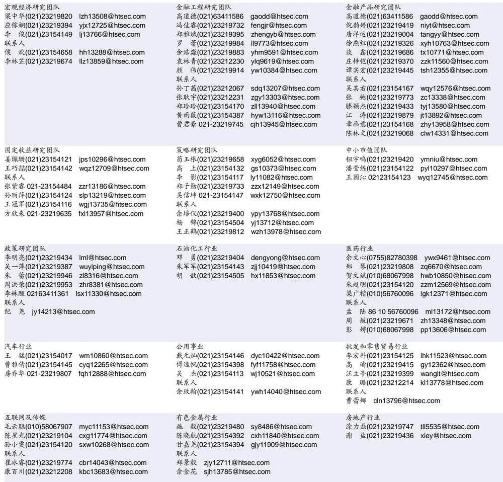

| 电子行业 | 煤炭行业 | 电力设备及新能源行业 |  |
| --- | --- | --- | --- |
| 李 轩(021)23154652 lx12671@htsec.com | 李 淼(010)58067998 Im10779@htsec.com | 张一弛(021)23219402 | zyc9637@htsec.com |
| 肖隽翀(021)23154139 xjc12802@htsec.com | 戴元灿(021)23154146 dyc10422@htsec.com | 房 青(021)23219692 | fangq@htsec.com |
| 华晋书 02123219748 hjs14155@htsec.com | 王 涛(021)23219760 wt12363@htsec.com | 徐柏乔(021)23219171 xbq6583@htsec.com |  |
| 联系人 | 吴 杰(021)23154113 wj10521@htsec.com | 张 磊(021)23212001 zl10996@htsec.com |  |
| 文 灿(021)23154401 wc13799@htsec.com |  | 联系人 |  |
| 薛逸民(021)23219963 xym13863@htsec.com |  | 姚望洲(021)23154184 | ywz13822@htsec.com |
| 李 潇(010)58067830 lx13920@htsec.com |  | 柳文韬(021)23219389 Iwt13065@htsec.com |  |

| 基础化工行业 | 计算机行业 | 通信行业 |
| --- | --- | --- |
| 刘 威(0755)82764281 Iw10053@htsec.com 刘海荣(021)23154130 Ihr10342@htsec.com | 郑宏达(021)23219392 zhd10834@htsec.com | 余伟民(010)50949926 ywm11574@htsec.com |
| 张翠翠(021)23214397 zcc11726@htsec.com | 杨 林(021)23154174 yl11036@htsec.com 于成龙(021)23154174 ycl12224@htsec.com | 杨彤昕 010-56760095 ytx12741@htsec.com 联系人 |
| 孙维容(021)23219431 swr12178@htsec.com | 洪 琳(021)23154137 hl11570@htsec.com | 夏 凡(021)23154128 xf13728@htsec.com |
| 李 智(021)23219392 Iz11785@htsec.com | 联系人 |  |
|  | 杨 蒙(0755)23617756 ym13254@htsec.com |  |

| 非银行金融行业 |  | 交通运输行业 |  | 纺织服装行业 |  |
| --- | --- | --- | --- | --- | --- |
|  | 孙 婷(010)50949926 st9998@htsec.com |  | 虞 楠(021)23219382 yun@htsec.com |  | 梁 希(021)23219407 Ix11040@htsec.com |
|  | 何 婷(021)23219634 ht10515@htsec.com |  | 罗月江（010）56760091 lyj12399@htsec.com |  | 盛 开(021)23154510 sk11787@htsec.com |
|  | 任广博(010)56760090 rgb12695@htsec.com 联系人 | 陈 宇(021)23219442 cy13115@htsec.com |  |  |  |

| 建筑建材行业 |  | 机械行业 |  | 钢铁行业 |
| --- | --- | --- | --- | --- |
| 冯晨阳(021)23212081 | fcy10886@htsec.com | 佘炜超(021)23219816 | swc11480@htsec.com | 刘彦奇(021)23219391 liuyq@htsec.com |
| 潘莹练(021)23154122 | pyl10297@htsec.com | 赵玥炜(021)23219814 | zyw13208@htsec.com | 周慧琳(021)23154399 zhi11756@htsec.com |
| 申 浩(021)23154114 sh12219@htsec.com |  | 赵靖博(021)23154119 zjb13572@htsec.com |  |  |
| 颜慧菁 yhj12866@htsec.com |  | 联系人 刘绮雯 021-23154659 Iqw14384@htsec.com |  |  |

| 建筑工程行业 | 农林牧渔行业 | 食品饮料行业 |  |
| --- | --- | --- | --- |
| 张欣劼 zxj12156@htsec.com | 陈 阳(021)23212041 cy10867@htsec.com | 颜慧菁 yhj12866@htsec.com |  |
| 联系人 |  |  | 张宇轩(021)23154172 zyx11631@htsec.com |
| 曹有成(021)63411398 cyc13555@htsec.com |  |  | 程碧升(021)23154171 cbs10969@htsec.com |

| 军工行业 | 银行行业 | 社会服务行业 |
| --- | --- | --- |
| 张恒晅 zhx10170@htsec.com 联系人 | 孙 婷(010)50949926 st9998@htsec.com 林加力(021)23154395 ljl12245@htsec.com | 汪立亭(021)23219399 wanglt@htsec.com 许樱之(755)82900465 xyz11630@htsec.com |
| 刘砚菲021-2321-4129 lyf13079@htsec.com | 联系人 | 联系人 |
|  | 董栋梁(021) 23219356 ddl13206@htsec.com | 毛弘毅(021)23219583 mhy13205@htsec.com 王祎婕(021)23219768 wyj13985@htsec.com |

| 家电行业 |  | 造纸轻工行业 |
| --- | --- | --- |
| 陈子仪(021)23219244 | chenzy@htsec.com | 汪立亭(021)23219399 wanglt@htsec.com |
| 李 阳(021)23154382 | ly11194@htsec.com | 郭庆龙 gql13820@htsec.com |
| 朱默辰(021)23154383 | zmc11316@htsec.com | 高翩然 gpr14257@htsec.com |
| 刘 璐(021)23214390 II11838@htsec.com |  | 联系人 |
|  |  | 王文杰 wwj14034@htsec.com |
|  |  | 吕科佳 Ikj14091@htsec.com |

## 研究所销售团队

深广地区销售团队
伏财勇(0755)23607963 fcy7498@htsec.com蔡铁清(0755)82775962 ctq5979@htsec.com辜丽娟(0755)83253022 gulj@htsec.com
刘晶晶(0755)83255933 liujj4900@htsec.com饶 伟(0755)82775282 rw10588@htsec.com欧阳梦楚(0755)23617160
oymc11039@htsec.com
巩柏含 gbh11537@htsec.com
滕雪竹 0755 23963569 txz13189@htsec.com张馨尹 0755-25597716 zxy14341@htsec.com
上海地区销售团队
胡雪梅(021)23219385 huxm@htsec.com
黄 诚(021)23219397 hc10482@htsec.com
季唯佳(021)23219384 jiwj@htsec.com
黄 毓(021)23219410 huangyu@htsec.com
李 寅 021-23219691 ly12488@htsec.com
胡宇欣(021)23154192 hyx10493@htsec.com
马晓男 mxn11376@htsec.com
邵亚杰 23214650 syj12493@htsec.com
杨祎昕(021)23212268 yyx10310@htsec.com
毛文英(021)23219373 mwy10474@htsec.com
谭德康 tdk13548@htsec.com
王祎宁(021)23219281 wyn14183@htsec.com
北京地区销售团队
朱 健(021)23219592 zhuj@htsec.com
殷怡琦(010)58067988 yyq9989@htsec.com
郭 楠 010-5806 7936 gn12384@htsec.com
杨羽莎(010)58067977 yys10962@htsec.com
张丽萱(010)58067931 zlx11191@htsec.com
郭金垚(010)58067851 gjy12727@htsec.com
张钧博 zjb13446@htsec.com
高 瑞 gr13547@htsec.com
上官灵芝 sglz14039@htsec.com
董晓梅 dxm10457@htsec.com

海通证券股份有限公司研究所

地址：上海市黄浦区广东路 689号海通证券大厦 9楼

电话：（021）23219000

传真：（021）23219392

网址：www.htsec.com