# 因子选股系列之一

# 基于分钟线的高频选股因子

e_ReportTime] 2022 年 4 月 28 日

[于明明Table rst金融工程与金融产品首席Author] 分析师

执业编号：S1500521070001

联系电话：+86 18616021459

邮 箱： yumingming@cindasc.com

# 证券研究报告

# 股票研究系列

# [Table_ReportType] 金工专题报告

Table_Author] 于明明 金融工程与金融产品

首席分析师

执业编号：S1500521070001

联系电话：+86 18616021459

## [Table_Title] 基于分钟线的高频选股因子

邮 箱： yumingming@cindasc.com

2022 年 4 月 28 日

- 本文是因子选股系列第一篇。量化选股的是从包括量价数据、基本面数据、文本数据或是另类数据等一系列中提炼出具有预测效果的信息，进而对股票未来收益率进行预测，并基于该预测构建股票组合的过程，其中因子选股模型是量化选股版图中的一个非常重要的组成部分。

- 本文试图从高频分钟线数据入手，挖掘在日内具有高信息增益的因子，在不同的频率(30分钟，日度)上检测因子的预测效果。从结果来看，改进后的高频因子有很强的收益预测效果，由于A股难以做空，通常会造成多头和空头力量的不匹配，从这个角度出发，我们可以对分钟收益进行一个划分，将分钟线收益分为大于 0和小于 0的情况分别测算，发现基于成交量改进后的因子在多头和空头两种情形下分别呈现了反转和动量两种情形。

在回测区间 2013/01/01 ~ 2022/02/28 内：

⚫ 加上成交量和收益筛选后的改进正收益反转因子中性化后在日度频率上 RankIC 均值可达 5.99%，ICIR 为 0.74。

- 加上成交量和收益筛选后的改进负收益动量因子中性化后在日度频率上 RankIC 均值可达 4.60%，ICIR 为 0.62。

加上成交量筛选后的改进波动率因子中性化后在日度频率上RankIC均值为 6.52%，ICIR 为 0.70。

⚫ 尾盘成交额占比因子中性化后在日度频率上RankIC均值为5.45%，ICIR 为 0.50。

## 因子组合及费率分析。

去除改进收益反转因子后的两因子（改进波动率和尾盘成交额占比因子）前 10%等权纯多头组合相对中证全指的累积超额收益在双边0.05%的手续费下可达 187.93%，年化 20.5%。

- 相关性加权的三因子前 10%等权纯多头组合相对中证全指的累积超额收益在双边 0.05%的手续费下可达 261.93%，年化 28.57%。

- 因子附录。在上述因子及其改进的基础上，本文还给出了一些常见指标的统计量，从 Rank IC以及 ICIR的角度去衡量其作为因子的效用。从表中可以看出，常见指标中也存在一些效用较为显著的因子。

- 风险因素： 以上结果通过历史数据统计、建模和测算完成，在市场波动不确定性下可能存在失效风险。

## 因子选股系列之一：基于分钟线的高频选股因子

量化选股的是从包括量价数据、基本面数据、文本数据或是另类数据等一系列数据中提炼出具有预测效果的信息，进而对股票未来收益率进行预测，并基于该预测构建股票组合的过程，其中因子选股模型是量化选股版图中的一个非常重要的组成部分。

本系列报告名为“因子选股系列”，作为因子选股模型的基石，挖掘具有高信息增益的因子是最基础也是最重要的一步。然而什么样的因子才算是一个有效的因子？如何才能挖掘出一个有效的因子？因子背后的逻辑支撑是否与因子有效性有关联？这些问题都是值得研究的方向。

本文作为因子选股系列之一，试图从高频分钟线数据入手，挖掘在日内具有高信息增益的因子，在不同的频率(30 分钟，日度)上检测因子的预测效果。从结果来看，高频因子有很强的收益预测效果：在回测区间 2013/01/01 ~ 2022/02/28 内，收益反转因子在 30 分钟的频率上 Rank IC 均值达到 9%，ICIR为 0.97，在日度频率上 Rank IC 均值为 3.19%，ICIR 为 0.3。加上成交量和收益筛选后的改进正收益反转因子中性化后在日度频率上 RankIC 可达 5.99%，ICIR 为 0.74，改进负收益动量因子中性化后在日度频率上 RankIC 可达 4.60%，ICIR 为 0.62。加上成交量筛选后的改进波动率因子中性化后在日度频率上 RankIC 均值为 6.52%，ICIR 为 0.70。尾盘成交额占比因子中性化后在日度频率上 RankIC 均值为 5.45%，ICIR 为 0.50。

本文最终采用两种方法对上述因子进行结合，其中去除改进收益反转因子后的两因子前 10%等权组合相对中证全指的累积超额收益在双边0.05%的手续费下可达 187.93%，年化 20.5%，双边0.08%的手续费下为 8.29%，年化 0.90%，相关性加权的三因子前 10%等权组合相对中证全指的累积超额收益在双边 0.05%的手续费下可达 261.93%，年化 28.57%，在 0.08%的手续费下为 43.98%，年化 4.80%，可以看出超额收益对于费率较为敏感，主要是由于每日较高的换手率削弱了超额收益导致收益覆盖不了更高的费率。最后，本文也给了一个因子附录，计算了一些常见因子的统计指标。

## 1. 因子有效性检验

作为多因子选股模型的基石，有效因子的挖掘是搭建因子选股模型的第一步也是最重要的一步。单因子的有效性通常需要多维度去评判，并且评价一个因子是否有效需要建立一套统一的评判标准。本节将从样本池的筛选、因子值的预处理以及因子统计指标等方面详细介绍单因子的构建流程以及评价标准。

## 1.1 样本池筛选

股票池：分别为中证全指、中证 800指数、中证500指数或沪深300指数成分股

为使因子选出的股票更符合逻辑，我们对股票池内股票进行进一步筛选：

1. 剔除截至回测日仍被标记为 ST以及ST*的股票

2. 剔除截至回测日上市不足 1年的股票

3. 剔除回测当日停牌的股票

4. 剔除回测当日涨停或跌停的股票

## 1.2 因子值预处理

由于数据来源等各方面原因，计算因子值时可能会导致因子极值的出现，为避免极端值对因子的回测结果产生影响，通常需要在标准化之前做极值处理：

## (1) 极值处理：

对于量价类因子，首先对每一期截面因子值计算因子截面均值 $\mu_{t}$ 以及因子截面标准差 $\sigma_{t}$ ，并将极值边界定义为 $\mu_{t}\pm3*\sigma_{t}$ ，对每一个截面超出边界的因子值作缩尾至边界的处理。

对于基本面类因子，首先对每一期截面因子值计算因子值的中位数 $med_{t}$ 以及绝对离差中位数$MAD_{t}\quad,\quad MAD_{t}=median(|X_{i,t}-med_{t}|)$ ，其中 $X_{i,t}$ 为股票i在t时刻的因子值；定义极值边界为$med_{t}\pm\frac{3}{0.67449}*MAD_{t}$ ，对超出边界的因子值作缩尾至边界的处理。

(2) 标准化处理：

标准化处理均采用 Z 值标准化，即标准化后因子值为 ${(X_{i,t}-\mu_{t})}_{\big/\sigma_{t}}$ ，其中 $X_{i,t}$ 为股票i在t时间因子值， $\mu_{t}$ 为因子截面均值， $\sigma_{t}$ 为因子截面标准差。

## 1.3 因子中性化处理

需要将因子对其它因子作中性化处理后得到纯净因子值才能体现该因子真正的选股能力。最常见的两个因子为市值及行业因子，市值以及行业因子通常被定义为风险因子，即他们描述了某种系统性风险(股票的同向偏移)但无法持续稳定地获得超额收益。

对于每一期截面因子值 $X_{i,t}$ ，对市值和行业虚拟变量作多元回归，即：

$$
X_{i,t}=\alpha_{t}+\beta_{MV,t}*MV_{i,t}+\sum_{j=1}^{N}\beta_{Ind,j,t}*Ind_{j,i,t}+\varepsilon_{i,t},
$$

$X_{i,t}$ 为股票i在t时刻的因子值， $MV_{i,t}$ 为股票i在t时刻的总市值， $Ind_{j,i,t}$ 为根据t时刻中信一级行业构建 的行业虚拟变量， $\varepsilon_{i,t}$ 为市值与行业中性化后的股票i在t时刻的因子值。

## 1.4 因子统计指标

在判定一个因子是否为 alpha 因子以及其收益预测能力时需要统计其各方面的指标，因此引入以下一系列统计指标来判定一个因子是否为一个优秀的 alpha 因子。

表 1：因子评价指标及计算方法

| 因子指标 | 指标缩写 | 计算方法 | 指标含义 |
| --- | --- | --- | --- |
| 个股因子值 | $\mathrm{X_{i,t}}$ |  | 个股i在 t时刻的因子值 |
| 秩相关系数 | RankICt | $\mathrm{rank}\_\mathrm{corr}(Return_{i,t+1},X_{i,t})$ | t+1 时刻收益与t时刻因子值的秩相关性 |
| 信息比率 | ICIR | mean(RankICt)/std(RankICt) | 波动调整后的因子秩相关 |
| t值 | t | mean(RankICt)/std(RankICt) * n | 因子对股票收益的解释性 |
| RankIC 胜率 | WinRate | $\mathrm{count}(\mathrm{RankIC}_{\mathrm{t}}>0)/\mathrm{count}(\mathrm{RankIC}_{\mathrm{t}})$ | 因子胜率 |
| 多头年化收益 | Long_Ret | 因子值前k%的多头组合累积收益 | 多头组合的累积收益 |
| 空头年化收益 | Short_Ret | 因子值后k%的空头组合累积收益 | 空头组合的累积收益 |
| 多空年化收益 | LS_Ret | Long_Ret - Short_Ret | 多空组合累积收益 |
| 多空波动率 | LS_Vol | std(LS_Rett) *√n | 多空组合年化波动率 |
| 年化多空夏普 | LS_SR | LS_Ret/LS_Vol * n | 多空组合年化夏普比率 |

注： $\mathrm{LS\_Ret_{t}}.$ 为每日多空收益序列, 其中，rank_corr 为秩相关函数，计算方法为 Spearman 秩相关系数法，mean 为均值函数，std 为标准差函数，sum 为求和函数，count 为计数函数，n 为因子年化时所乘的对应周期(例如日频因子为 252，月频因子为 12等)

资料来源：信达证券研发中心

图 1：因子构建流程
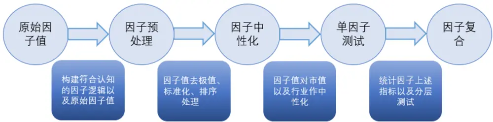
资料来源：信达证券研发中心

## 2. 基于分钟数据的高频因子

单因子回测的第一步便是构建符合市场直觉的因子逻辑，只有背后有强大的逻辑支撑，才能一定程度上降低样本内过拟合地风险。本文在计算因子值时均使用tick数据切片而成的分钟线数据。

分钟线切片逻辑：计算来自 L2-tick，对 tick 切片左闭右开，但最后一根要把 15:00 纳入计算。每个 tick 取最后一笔成交价格作为该 tick 的价格，来计算分钟数据的高开低收，分钟数据的成交量,是分钟内所有 tick的成交量的总和。

## t时刻的 K线计算方法：

[t-1, t)时间段内所有 tick 切片，每个 tick 最后一笔成交价格是 $price_{t,i}$ ,tick 切片成交量是 $Volume_{t,i}$ 成交额 $Value_{t,i}$ 其中i是该时间段 t的第i个切片， $\mathbf{i}\mathbf{=}1\mathbf{,}2\mathbf{....}\mathbf{n}$

分钟线的高开低收价格分别标记为： $High_{t},Open_{t},Low_{t},Close_{t}$ 则：

$$
High_{t}=max_{i}(price_{t,i})
$$

$$
Low_{t}=min_{i}\big(price_{t,i}\big)
$$

$$
Open_{t}=price_{t,1}
$$

$$
Close_{t}=price_{t,n}
$$

分钟线的成交量和成交额： $Volume_{t}{,}Value_{t}$

$$
Volume_{t}=\sum_{i<t}Volume_{i}-\sum_{i<t-1}Volume_{i}
$$

$$
Value_{t}=\sum_{i<t}Value_{i}-\sum_{i<t-1}Value_{i}
$$

除了 tick 级数据，level2 行情还涉及逐笔委托和逐笔成交数据。下表是对沪深逐笔成交数据以及深市逐笔委托数据的字段介绍。

表 2：沪深逐笔成交数据说明

| 序号 | 字段名 | 数据类型 | 说明 |
| --- | --- | --- | --- |
| 1 | SecuritylD | string（字符串） | 证券代码 |
| 2 | LastUpdateTime | string（字符串） | 行情时间戳 |
| 3 | Price | double (浮点数) | 成交价 |
| 4 | Volume | long（整数） | 成交量 |
| 5 | TradeNo | string (字符串） | 成交编号 |
| 6 | Amount | double(浮点数) | 成交金额 |
| 7 | BuyNo | string (字符串) | 委买编号 |
| 8 | SellNo | string（字符串） | 委卖编号 成交方向 |
| 9 | BSFlag | string (字符串) | T：成交 B：买入成交（仅 SHL2) S：卖出成交（仅 SHL2) C：撤单 |
| 10 | SecurityType | string（字符串） | 证券类型，取值如下： E:股票 O:期权 W:权证 B:债券I:指数 F:基金 |

注：买入成交、卖出成交仅上交所Ieve12数据标识
资料来源：信达证券研发中心

表 3：深市逐笔委托数据说明

| 序号 | 字段名 | 数据类型 | 说明 |
| --- | --- | --- | --- |
| 1 | SecuritylD | string(字符串） | 证券代码 |
| 2 | LastUpdateTime | string（字符串） | 行情时间戳 |
| 3 | Price | double (浮点数) | 委托价 |
| 4 | Volume | long（整数） | 委托量 |
| 5 | OrderNo | string (字符串） | 委托编号 委托方向 |
| 6 | BSFlag | String（字符串） | T： 不确定 B： 买入委托 S： 卖出委托 G: 借入 F: 借出 |
| 7 | OrderType | String (字符串) | 委托类型 深交所: 1：市价委托 2：现价委托 U：本方最优 |
| 8 | SecurityType | String（字符串） | 证券类型，取值如下： E:股票 O:期权 W:权证 B:债券 I:指数 F:基金 |

资料来源：信达证券研发中心

## 2.1 收益反转因子

相较于成熟的市场，A 股存在更多的散户投资者，散户投资者存在较多的非理性行为，因此在散户追涨杀跌的过程中往往会出现股价过于高估/低估的现象，并在之后回归至合理价位。

因此我们可以构建基于分钟线的收益反转因子，本文尝试使用当前 30分钟区间内的每分钟收益取

均值去预测下一个 30分钟的收益序列，例如 09：30分至 10：00的信号预测 10：00至 10：30分的收益率，因构建逻辑是一个负向指标，因此在均值前添加负号，具体因子构造如下：

$$
Reverse_{i,t}\left(高频\right)=-\frac{1}{30}\sum_{t=29}^{t}r_{i,t}
$$

其中 $r_{i,t}$ 为第 i 只股票第 t 分钟的收益率，本因子只考虑了日内每半个小时节点。考虑到隔夜信息对于开盘的冲击较大，在 30 分钟频率上的预测区间只考虑 10：00 之后的每半小时时段（因子构造从 9：30开始），该因子回测参数如下：

样本筛选：剔除当前 30 分钟内涨停或跌停的股票，剔除当日次新股（上市不足一年的股票）、停牌以及 ST或ST*股票

因子频率：每半小时

从下表中可以看出，收益反转因子在 30分钟的维度上是非常有效的，全去区间来看 30分钟 RankIC均值以及 ICIR为0.09和 0.97。t值也较为显著，且分年度来看 RankIC也表现的较为稳定。

表 4：高频收益反转因子（Reversei,t）统计

| 全市场 | 原始因子 |  | 行业市值中性化后 |  |  |
| --- | --- | --- | --- | --- | --- |
| 年度 | Rank IC ICIR | t值 | Rank IC | ICIR | t值 |
| 2013 | 8.46% 1.05 | 47.01 | 9.36% | 1.33 | 59.26 |
| 2014 | 8.85% 1.16 | 52.06 | 9.48% | 1.44 | 64.40 |
| 2015 | 7.55% 0.53 | 23.73 | 8.46% | 0.7 | 31.53 |
| 2016 | 8.72% 0.92 | 41.03 | 9.23% | 1.1 | 49.09 |
| 2017 | 8.38% 1.02 | 45.81 | 8.99% | 1.22 | 54.66 |
| 2018 | 9.57% 1.07 | 48.04 | 10.34% | 1.34 | 59.90 |
| 2019 | 11.05% 1.41 | 62.87 | 11.61% | 1.72 | 77.09 |
| 2020 | 10.21% 1.1 | 49.16 | 11.19% | 1.5 | 66.99 |
| 2021 | 8.44% 1.12 | 50.16 | 9.18% | 1.51 | 67.34 |
| 2022 | 8.91% 0.98 | 44.03 | 9.80% | 1.32 | 58.88 |
| 汇总 | 9.03% 0.97 | 43.49 | 9.76% | 1.23 | 54.96 |

资料来源：Wind，信达证券研发中心

下图为日内分时段的 RankIC均值，例如 10：00时的 Rank IC均值为 09：30分至 10：00的分钟收益所产生的信号对于 10：00 至 10：30 分收益（10：30 分的时点价对 10：00 的时点价）的RankIC 的每日均值。分时段来看，收益反转因子在 11:30 分的时段最为有效，这也代表着基于上请阅读最后一页免责声明及信息披露 http://www.cindasc.com 10午最后 30分钟收益均值对下午开盘前三十分钟有着较强的预测效果。

图 2：行业市值中性化后高频收益反转因子 $(Reverse_{i,t})$ Rank IC 分时段统计
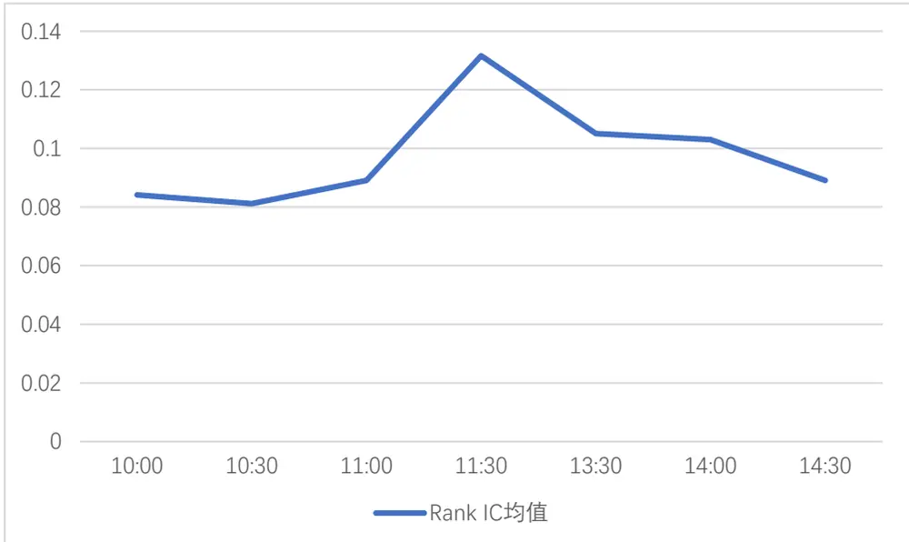
资料来源：Wind，信达证券研发中心

对于收益反转因子，也可以将其放到日度预测，在日度层面，为了保证因子的时效性，该因子预测目标为当日收盘价距下一个交易日收盘价对应的涨跌幅。为了保证因子的可行性，在计算当日收益求和时剔除 14：56~15：00时段的数据，即只对 09：30 ~ 14：55分的收益取均值。

$$
Reverse_{i,T}\ \left(日度\right)\ =-\frac{1}{235}\sum_{t=1}^{t=235}r_{i,t,T}
$$

其中 $r_{i,t,T}$ 为第 i只股票在 T日第 t分钟的收益率，因只统计至 14：55分的收益，t取值范围为 1至235，该因子回测参数如下：

样本筛选：剔除当日涨停或跌停的股票，剔除当日次新股（上市不足一年的股票）、停牌以及 ST或 ST*股票

从下表可以看出收益反转因子在日度上并不是很有效，总体日度 Rank IC只有 0.033，ICIR为0.26，且年度来看并不稳定。由于日度的分钟线 K线达 240根，剔除后尾盘 5分钟后为 235根，后面我们尝试对分钟收益进行进一步的筛选。

表 5：日频收益反转因子(Reversei,T)统计

| 全市场 | 原始因子 |  |  | 行业市值中性化后 |  |  |
| --- | --- | --- | --- | --- | --- | --- |
| 年度 | Rank IC | ICIR | t值 | Rank IC | ICIR | t值 |
| 2013 | 2.03% | 0.18 | 2.82 | 2.11% | 0.25 | 4.02 |
| 2014 | 3.04% | 0.28 | 4.45 | 3.44% | 0.43 | 6.76 |
| 2015 | 0.42% | 0.02 | 0.37 | 1.28% | 0.09 | 1.49 |
| 2016 | 3.74% | 0.27 | 4.31 | 4.11% | 0.37 | 5.87 |
| 2017 | 3.85% | 0.33 | 5.28 | 4.18% | 0.49 | 7.79 |
| 2018 | 3.41% | 0.30 | 4.71 | 3.76% | 0.42 | 6.68 |
| 2019 | 4.39% | 0.46 | 7.25 | 4.45% | 0.59 | 9.27 |
| 2020 | 2.25% | 0.17 | 2.69 | 1.90% | 0.19 | 2.99 |
| 2021 | 4.32% | 0.36 | 5.74 | 4.64% | 0.55 | 8.76 |
| 2022 | 6.14% | 0.42 | 6.69 | 4.17% | 0.42 | 6.61 |
| 汇总 | 3.10% | 0.24 | 3.86 | 3.33% | 0.35 | 5.48 |

资料来源：Wind，信达证券研发中心

上述计算收益反转因子时，只考虑了收益(价格变动)，并没有考虑成交量带来的影响。缩量时段，较小的成交量可以造成较大的价格波动，价格变动失真，信噪比较低，只有当前属于放量时段时，伴随这较大的成交量，价格变动的大小才能充分反映多空博弈的剧烈程度，因此可尝试对分钟数据进行基于成交量的筛选。

此外，由于 A 股难以做空，通常会造成多头和空头力量的不匹配，当某支股票持续上涨时，会吸引较多资金跟进，股价会出现虚高的情况，有较大概率在后续出现回落至合理价位的情况，出现反转效应。相反，当某支股票持续下跌时，因融券做空较难实现，难以吸引空头资金跟进，从这个角度出发，我们可以对分钟收益进行一个划分，将分钟线收益分为大于 0 和小于 0 的情况分别测算。

改进放量的正收益反转因子：

$$
\begin{aligned}Reverse\_Imp\_pos_{i,T}\left(日度\right)\\=\left\{\begin{aligned}&-\frac{\sum_{t=1}^{t=235}r_{i,t,T}*I_{r_{i,t,T}>0}*I_{vol_{i,t}>vol_{up_{i,T}}}}{\sum_{t=1}^{t=235}I_{r_{i,t,T}>0}*I_{vol_{i,t}>vol_{up_{i,T}}}}\quad\textit{if}\sum_{t=1}^{t=235}I_{r_{i,t,T}>0}*I_{vol_{i,t}>vol_{up_{i,T}}}\neq0\\&NAN\quad\textit{if}\sum_{t=1}^{t=235}I_{r_{i,t,T}>0}*I_{vol_{i,t}>vol_{up_{i,T}}}=0\end{aligned}\right.\end{aligned}
$$

其中：

$$
vol_{up,i,T}=vol_{mean,i,T}+vol_{std,i,T}
$$

$$
vol_{mean,i.T}=\frac{1}{235}\sum_{t=1}^{t=235}vol_{i,t,T},vol_{std,i}=\sqrt{\frac{1}{235}\sum_{t=1}^{t=235}(vol_{i,t,T}-vol_{mean,i,T})^2}
$$

其中 $r_{i,t,T}$ 为第 i只股票在 T日第 t分钟的收益率，因只统计至 14：55分的收益，t取值范围为 1至235，放量时段 $.vol_{up,i,T}$ 定义为 T日剔除14：56 ~ 15：00时段后的分钟成交量均值加分钟成交量标准差，只统计收益大于 0 且属于放量时段的收益均值，当全天没有放量且大于 0 的收益，则从当天的样本池中剔除该股票，该因子回测参数如下：

样本筛选：剔除当日涨停或跌停的股票，剔除当日次新股（上市不足一年的股票）、停牌以及 ST或 ST*股票

从表中可以看出，改进放量的正收益反转因子（ $Reverse\_Imp\_pos_{i,T}$ ）相较于原反转因子$(Reverse_{i,T})$ 在各个统计指标上均有很大改进，总体日均 Rank IC 为 0.0627，日度 ICIR 为 0.66，且分年度来看 Rank IC也没有较大起伏。中性化后的 Rank IC有所下降，但 ICIR进一步提升，因子表现得更加稳定。

表 6：日频改进放量的正收益反转因子(Reverse_Imp_posi,T)统计

| 全市场 | 原始因子 |  | 行业市值中性化后 |  |  |
| --- | --- | --- | --- | --- | --- |
| 年度 | Rank IC ICIR | t值 | Rank IC | ICIR | t值 |
| 2013 | 6.04% 0.90 | 14.16 | 5.73% | 0.94 | 14.93 |
| 2014 | 5.52% 0.72 | 11.33 | 5.35% | 0.81 | 12.84 |
| 2015 | 5.21% 0.39 | 6.14 | 5.05% | 0.45 | 7.07 |
| 2016 | 7.27% 0.73 | 11.51 | 6.98% | 0.83 | 13.05 |
| 2017 | 6.85% 0.84 | 13.35 | 6.58% | 0.95 | 15.01 |
| 2018 | 6.42% 0.83 | 13.17 | 6.30% | 0.92 | 14.57 |
| 2019 | 7.42% 0.80 | 12.62 | 7.03% | 0.88 | 13.87 |
| 2020 | 6.28% 0.65 | 10.24 | 5.69% | 0.64 | 10.05 |
| 2021 | 5.48% 0.52 | 8.15 | 5.26% | 0.61 | 9.71 |
| 2022 | 5.70% 0.68 | 10.75 | 5.46% | 0.77 | 12.14 |
| 汇总 | 6.27% 0.66 | 10.49 | 5.99% | 0.74 | 11.67 |

资料来源：Wind，信达证券研发中心

从图中可以看出，多空组合行业与市值中性化后因子的累计以及多空对冲净值（多空组合使用每日因子值对应的前 10%与后 10%的股票构建）走势较为平稳，各年度均没有较大起伏，代表了该因子在各个年度均有较好的选股能力。

图 3：改进放量的正收益反转因子(Reverse_Imp_posi,T)行业市值中性化后多空对冲净值
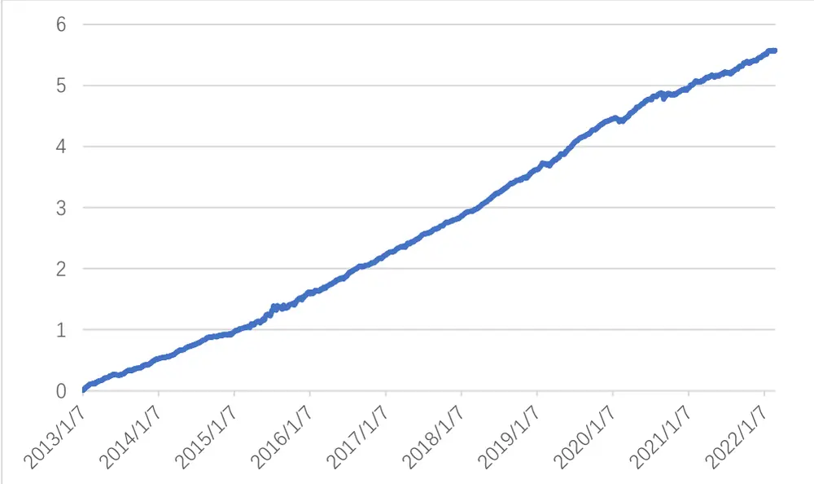
注：不考虑换仓时手续费的影响
资料来源：Wind，信达证券研发中心

表 7：改进放量的正收益反转因子(Reverse $\_Imp\_pos_{i,T})$ 行业市值中性化后多空统计

| 年度 | Rank IC 胜率 | 多头年化 收益 | 空头年化 收益 | 多空年化 收益 | 多空年化 波动率 | 多空年化 夏普 | 多头日均 换手率 | 多/空头 日均持仓 | 空头日均 换手率 | 中证全指 区间收益 |
| --- | --- | --- | --- | --- | --- | --- | --- | --- | --- | --- |
| 2013 | 83.97% | 42.94% | -15.23% | 68.60% | 6.97% | 9.85 | 82.69% | 212.58 | 86.04% | 5.21% |
| 2014 | 79.59% | 49.00% | -2.09% | 51.95% | 6.94% | 7.48 | 83.91% | 211.04 | 87.30% | 45.82% |
| 2015 | 75.00% | 107.05% | 3.70% | 92.64% | 18.21% | 5.09 | 110.48% | 180.15 | 112.47% | 32.56% |
| 2016 | 80.33% | 1.43% | -44.89% | 81.20% | 9.28% | 8.75 | 84.10% | 229.20 | 86.77% | -14.41% |
| 2017 | 80.74% | -6.84% | -50.23% | 85.76% | 7.99% | 10.74 | 80.27% | 252.50 | 82.76% | 2.34% |
| 2018 | 83.54% | -19.94% | -63.63% | 117.92% | 7.60% | 15.52 | 77.03% | 290.49 | 78.43% | -29.94% |
| 2019 | 82.79% | 45.26% | -37.49% | 128.36% | 9.41% | 13.64 | 74.15% | 326.30 | 74.39% | 31.11% |
| 2020 | 80.66% | 22.62% | -26.69% | 62.94% | 14.76% | 4.26 | 73.57% | 331.14 | 74.33% | 24.92% |
| 2021 | 75.72% | 33.49% | -23.35% | 71.22% | 11.91% | 5.98 | 71.65% | 357.57 | 73.05% | 6.19% |
| 2022 | 82.86% | -23.02% | -66.12% | 46.49% | 11.50% | 4.04 | 71.41% | 384.00 | 71.41% | -6.95% |
| 汇总 | 80.52% | 24.81% | -32.61% | 82.52% | 11.00% | 7.50 | 81.83% | 267.61 | 83.76% | 7.97% |

2022/02/28
资料来源：Wind，信达证券研发中心

## 改进放量的负收益动量因子：

$$
\begin{aligned}Reverse\_Imp\_neg_{i,T}\left(日度\right)\\=\left\{\begin{aligned}&\frac{\sum_{t=1}^{t=235}r_{i,t,T}*I_{r_{i,t,T}<0}*I_{vol_{i,t}>vol_{up_{i,T}}}}{\sum_{t=1}^{t=235}I_{r_{i,t,T}<0}*I_{vol_{i,t}>vol_{up_{i,T}}}}\quad\textit{if}\sum_{t=1}^{t=235}I_{r_{i,t,T}<0}*I_{vol_{i,t}>vol_{up_{i,T}}}\neq0\\&NAN\quad\textit{if}\sum_{t=1}^{t=235}I_{r_{i,t,T}<0}*I_{vol_{i,t}>vol_{up_{i,T}}}=0\end{aligned}\right.\end{aligned}
$$

其中：

$$
vol_{up,i,T}=vol_{mean,i,T}+vol_{std,i,T}
$$

$$
vol_{mean,i,T}=\frac{1}{235}\sum_{t=1}^{t=235}vol_{i,t,T},vol_{std,i}=\sqrt{\frac{1}{235}\sum_{t=1}^{t=235}(vol_{i,t,T}-vol_{mean,i,T})^2}
$$

其中 $r_{i,t,T}$ 为第 i只股票在 T日第 t分钟的收益率，因只统计至 14：55分的收益，t取值范围为 1至235，放量时段 $vol_{up,i,T}$ 定义为 T日剔除14：56 ~ 15：00时段后的分钟成交量均值加分钟成交量标准差，只统计收益大于 0 且属于放量时段的收益均值，当全天没有放量且大于 0 的收益，则从当天的样本池中剔除该股票，该因子回测参数如下：

样本筛选：剔除当日涨停或跌停的股票，剔除当日次新股（上市不足一年的股票）、停牌以及 ST或 ST*股票

从表中可以看出，改进放量的负收益动量因子（Reverse_Imp_negi,T），总体日均 Rank IC 为0.0459，日度 ICIR 为 0.59。中性化后的 Rank IC 与 ICIR 进一步提升，因子表现得更加稳定。相较于原反转因子 $(Reverse_{i,T})$ ）在各个统计指标上均有所改进，但整体效果不如正收益反转因子$(Reverse\_Imp\_pos_{i,T})$ ），正收益的强反转与负收益的弱动量也证明了上述多头与空头力量存在差异的结论。

表 8：日频改进放量的负收益动量因子(Reverse_Imp_negi,T)统计

| 全市场 | 原始因子 |  |  | 行业市值中性化后 |  |  |
| --- | --- | --- | --- | --- | --- | --- |
| 年度 | Rank IC | ICIR | t值 | Rank IC | ICIR | t值 |
| 2013 | 3.94% | 0.80 | 12.58 | 4.11% | 0.77 | 12.17 |
| 2014 | 3.09% | 0.58 | 9.10 | 3.37% | 0.61 | 9.67 |
| 2015 | 4.10% | 0.35 | 5.61 | 4.60% | 0.45 | 7.16 |
| 2016 | 4.91% | 0.62 | 9.73 | 5.00% | 0.67 | 10.62 |
| 2017 | 4.86% | 0.72 | 11.41 | 4.42% | 0.64 | 10.09 |
| 2018 | 4.71% | 0.71 | 11.16 | 4.81% | 0.81 | 12.78 |
| 2019 | 5.59% | 0.70 | 11.01 | 5.49% | 0.74 | 11.70 |
| 2020 | 5.36% | 0.69 | 10.88 | 5.01% | 0.61 | 9.72 |
| 2021 | 4.85% | 0.60 | 9.48 | 4.67% | 0.53 | 8.31 |
| 2022 | 3.47% | 0.45 | 7.13 | 4.21% | 0.58 | 9.24 |
| 汇总 | 4.59% | 0.59 | 9.40 | 4.60% | 0.62 | 9.74 |

资料来源：Wind，信达证券研发中心

从图中可以看出，多空组合行业与市值中性化后因子的累计以及多空对冲净值（多空组合使用每日因子值对应的前 10%与后 10%的股票构建）走势较为平稳，各年度均没有较大起伏，但净值增长速率平缓于正收益反转因子（Reverse_Imp_posi,T）。

图 4：改进放量的负收益动量因子(Reverse_Imp_negi,T)行业市值中性化后多空对冲净值
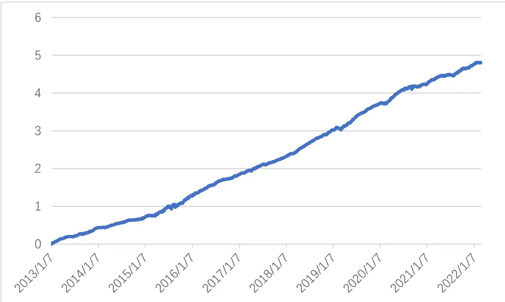
注：不考虑换仓时手续费的影响
资料来源：Wind，信达证券研发中心

表 9：改进放量的负收益动量因子(Reverse_Imp_negi,T)行业市值中性化后多空统计

| 年度 | Rank IC 胜率 | 多头年化 收益 | 空头年化 收益 | 多空年化 收益 | 多空年化 波动率 | 多空年化 夏普 | 多头日均 换手率 | 多/空头 日均持仓 | 空头日均 换手率 | 中证全指 区间收益 |
| --- | --- | --- | --- | --- | --- | --- | --- | --- | --- | --- |
| 2013 | 79.32% | 29.50% | -11.13% | 45.07% | 8.07% | 5.58 | 79.82% | 213.55 | 81.14% | 5.21% |
| 2014 | 71.02% | 28.86% | 13.93% | 12.28% | 9.00% | 1.37 | 82.76% | 211.76 | 81.77% | 45.82% |
| 2015 | 71.72% | 87.49% | 13.55% | 50.51% | 27.20% | 1.86 | 108.84% | 179.99 | 113.37% | 32.56% |
| 2016 | 76.64% | -5.36% | -39.98% | 52.77% | 12.36% | 4.27 | 82.97% | 229.39 | 84.04% | -14.41% |
| 2017 | 80.33% | -5.06% | -44.51% | 68.04% | 11.62% | 5.86 | 80.44% | 252.87 | 81.96% | 2.34% |
| 2018 | 77.37% | -22.43% | -61.75% | 98.99% | 9.67% | 10.23 | 77.66% | 291.19 | 77.53% | -29.94% |
| 2019 | 77.46% | 36.89% | -32.52% | 97.50% | 12.32% | 7.91 | 74.10% | 326.56 | 73.07% | 31.11% |
| 2020 | 76.13% | 24.49% | -26.37% | 63.19% | 17.02% | 3.71 | 74.49% | 331.26 | 72.74% | 24.92% |
| 2021 | 75.72% | 23.60% | -24.96% | 60.04% | 17.36% | 3.46 | 72.78% | 357.77 | 71.07% | 6.19% |
| 2022 | 71.43% | -34.62% | -55.68% | 20.04% | 15.79% | 1.27 | 71.08% | 383.94 | 69.97% | -6.95% |
| 汇总 | 75.71% | 17.33% | -27.95% | 58.14% | 14.98% | 3.88 | 81.39% | 267.98 | 81.68% | 7.97% |

2022/02/28
资料来源：Wind，信达证券研发中心

## 2.2 收益波动率因子

收益波动衡量了多空博弈的剧烈程度，如果没有额外的信息介入，波动率应介于一个较为稳定的状态，越大的波动代表了更多的信息和博弈，也提示了当前该股票较高的风险。传统的日间数据只有当日的收盘价，更无法计算日内波动率，因此在计算收益波动时使用 tick 数据切片而成的分钟线数据，当日的采样点可达 240个，具有更高的信息增量。

因此我们可以构建基于分钟线的收益反转因子，首先是对高频 30 分钟的预测，即使用当前 30 分钟区间内的分钟收益标准差去预测下一个 30分钟的收益序列，例如 09：30分至 10：00的信号预测 10：30 分的时点价相对 10：00 的时点价的收益。因构建逻辑是一个负向指标，因此在波动率前添加负号，具体因子构造如下：

$$
Return\_Std_{i,t}\big(高频\big)=-\sqrt{\frac{1}{30}\sum_{t=29}^{t}(r_{i,t}-r_{i,mean})^2}
$$

$$
r_{i,mean}=\frac{1}{30}\sum_{t=29}^{t}r_{i,t}.
$$

其中 $r_{i,t}$ 为第 i 只股票第 t 分钟的收益率， $r_{i,mean}$ 为前 30 分钟区间的收益均值，本因子只考虑了日内每半个小时节点。考虑到隔夜信息对于开盘的冲击较大，在 30 分钟频率上的预测只考虑 10：00之后的每半小时时段，该因子回测参数如下：

样本筛选：剔除当前 30 分钟内涨停或跌停的股票，剔除当日次新股（上市不足一年的股票）、停牌以及 ST或ST*股票

因子频率：每半小时

从下表中可以看出，该因子在 30分钟的频率上效果不如收益反转因子，汇总 Rank IC为 0.0334，ICIR为 0.33。整体较为平缓。

表 10：高频收益波动率因子(Return $\scriptstyle{\boldsymbol{Std}}_{i,t})$ 统计

| 全市场 | 原始因子 |  | 行业市值中性化后 |  |  |
| --- | --- | --- | --- | --- | --- |
| 年度 | Rank IC ICIR | t值 | Rank IC | ICIR | t值 |
| 2013 | 2.10% 0.29 | 12.92 | 1.97% | 0.30 | 13.27 |
| 2014 | 2.65% 0.37 | 16.46 | 2.48% | 0.39 | 17.44 |
| 2015 | 5.18% 0.28 | 12.43 | 4.74% | 0.30 | 13.30 |
| 2016 | 3.42% 0.30 | 13.50 | 3.17% | 0.31 | 14.00 |
| 2017 | 2.88% 0.35 | 15.47 | 2.66% | 0.36 | 16.11 |
| 2018 | 2.73% 0.36 | 16.11 | 2.57% | 0.39 | 17.62 |
| 2019 | 3.48% 0.43 | 19.33 | 3.17% | 0.44 | 19.75 |
| 2020 | 3.73% 0.40 | 17.75 | 3.35% | 0.41 | 18.26 |
| 2021 | 3.74% 0.46 | 20.53 | 3.49% | 0.50 | 22.56 |
| 2022 | 3.97% 0.58 | 26.04 | 3.58% | 0.61 | 27.20 |
| 汇总 | 3.34% 0.33 | 14.71 | 3.08% | 0.35 | 15.56 |

资料来源：Wind，信达证券研发中心

下图为日内分时段的 RankIC均值，例如 10：00时的 Rank IC均值为 09：30分至 10：00的分钟收益波动率所产生的信号对于 10：00 至 10：30 分收益（10：30 分的时点价对 10：00 的时点价）的 RankIC 的每日均值。分时段来看，该因子在开盘以及尾盘时段较为有效，在盘中 11：00 分的时候波动率因子 RankIC 较低，这也比较符合 A 股的交易行为，即开盘与尾盘成交比较活跃，相比于盘中更容易造成错误定价，使得波动率因子更为有效。

图 5：行业市值中性化后高频收益波动率因子(Return $\mathcal{S}td_{i,t})$ Rank IC 分时段统计
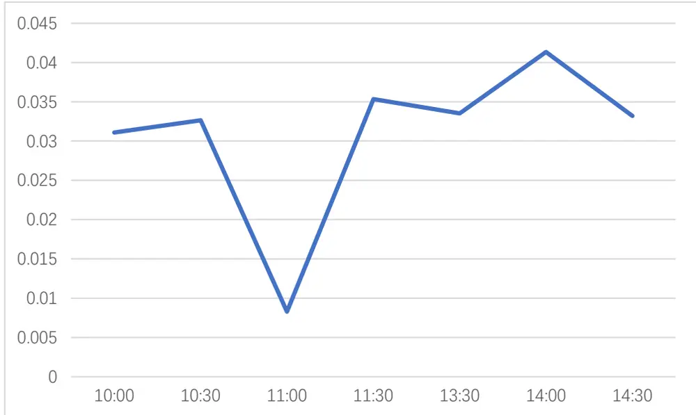
资料来源：Wind，信达证券研发中心

同样对于波动率因子，也可以将其放到日度预测，在日度层面，为了保证因子的时效性，该因子预测目标为当日收盘价距下一个交易日收盘价的收益。为了保证因子的可行性，在计算当日收益求和时剔除 14：56~15：00时段的数据，即只统计 09：30 ~ 14：55时段的收益波动率。

$$
Return\_Std_{i,T}\ (日度)=-\sqrt{\frac{1}{235}\sum_{t=1}^{t=235}(r_{i,t,T}-r_{i,mean,T})^2}
$$

$$
r_{i,mean}=\frac{1}{235}\sum_{t=1}^{t=235}r_{i,t,T}
$$

其中 $r_{i,t,T}$ 为第 i只股票在 T日第 t分钟的收益率，因只统计至 14：55分的收益，t取值范围为 1至235， $r_{i,mean}$ 为剔除T日剔除 14：56~ 15：00时段后的分钟收益均值，该因子回测参数如下：

样本筛选：剔除当日涨停或跌停的股票，剔除当日次新股（上市不足一年的股票）、停牌以及 ST或 ST*股票

表 11：日频收益波动率 $(Return\_Std_{i,T})$ 因子统计

| 全市场 | 原始因子 |  | 行业市值中性化后 |  |  |
| --- | --- | --- | --- | --- | --- |
| 年度 | Rank IC ICIR | t值 | Rank IC | ICIR | t值 |
| 2013 | 4.78% 0.49 | 7.68 | 5.13% | 0.63 | 10.03 |
| 2014 | 4.88% 0.57 | 8.95 | 5.46% | 0.78 | 12.25 |
| 2015 | 4.97% 0.24 | 3.81 | 5.84% | 0.37 | 5.83 |
| 2016 | 6.13% 0.43 | 6.86 | 6.84% | 0.66 | 10.37 |
| 2017 | 5.89% 0.58 | 9.12 | 5.68% | 0.71 | 11.23 |
| 2018 | 5.28% 0.56 | 8.80 | 5.55% | 0.79 | 12.54 |
| 2019 | 6.79% 0.65 | 10.26 | 6.68% | 0.86 | 13.57 |
| 2020 | 6.11% 0.49 | 7.82 | 5.66% | 0.54 | 8.57 |
| 2021 | 5.67% 0.45 | 7.18 | 5.31% | 0.51 | 7.99 |
| 2022 | 6.04% 0.68 | 10.74 | 6.31% | 0.71 | 11.25 |
| 汇总 | 5.62% 0.45 | 7.13 | 5.81% | 0.59 | 9.36 |

资料来源：Wind，信达证券研发中心

相较于 30 分钟频率，波动率因子在日度层面依然是有效的，整体 Rank IC 为 0.0562，日均 ICIR为0.45。基于波动率因子同样在成交量上可以进行筛选。

缩量时段，较小的成交量可以造成较大的价格波动，价格变动失真，信噪比较低，只有当前属于放量时段时，伴随这较大的成交量，波动率的大小才能充分反映多空博弈的剧烈程度，因此可尝试对分钟数据进行基于成交量的筛选。

改进波动率因子：

$$
Return\_Std\_Imp_{i,T}(日度)=-\sqrt{\sum_{r_{i,t,T}\in r_{i,vol_{up},T}}\frac{(r_{i,t,T}-r_{i,mean,T})^2}{\left\|r_{i,vol_{up},T}\right\|}}
$$

$$
r_{i,vol_{up},T}=\left\{r_{i,t,T}|vol_{i,t,T}\in vol_{up,i,T}\right\},\quad r_{i,mean,T}=\frac{\sum r_{i,vol_{up},T}}{\left\|r_{i,vol_{up},T}\right\|},
$$

$$
vol_{up,i,T}=\left\{vol_{i,t,T}|vol_{i,t,T}>vol_{mean,i,T}+vol_{std,i,T}\right\}
$$

$$
vol_{mean,i}=\frac{1}{235}\sum_{j=1}^{j=235}vol_{i,j},vol_{std,i}=\sqrt{\frac{1}{235}\sum_{j=1}^{j=235}(vol_{i,j}-vol_{mean,i})^2}
$$

其中 $r_{i,t,T}$ 为第 i只股票在 T日第 t分钟的收益率， $\left\|r_{i,vol_{up},T}\right\|$ 定义为集合 $\cdot r_{i,vol_{up},T}$ 的基数，因只统计至 14：55分的收益，t取值范围为 1至 235， $r_{i,mean}$ 为剔除 T日剔除 14：56 ~ 15：00时段后的分钟收益均值，放量时段 $lvol_{up,i,T}$ 定义为 T日剔除 14：56 ~ 15：00时段后的分钟成交量均值加分钟成交量标准差，当第 t分钟成交量大于分钟成交量均值加分钟成交量标准差时，将第 t分钟定义为放量时段，当全天没有放量且大于 0 的收益，则从当天的样本池中剔除该股票，该因子回测参数如下：

样本筛选：剔除当日涨停或跌停的股票，剔除当日次新股、停牌以及 ST 或 ST* 股票

从表中可以看出，同样地，改进后的波动率因子在各个统计指标上均有很大改进，总体日均 RankIC 为 0.0679，日度 ICIR 为 0.6，且分年度来看 Rank IC 也没有较大起伏。中性化后的 Rank IC 有所下降，但 ICIR进一步提升，因子表现得更加稳定。

表 12：日频改进收益波动率因子（Return_Std_Impi,T）统计

| 全市场 | 原始因子 |  | 行业市值中性化后 |  |  |
| --- | --- | --- | --- | --- | --- |
| 年度 | Rank IC ICIR | t值 | Rank IC | ICIR | t值 |
| 2013 | 6.21% 0.7 | 11.17 | 6.07% | 0.83 | 13.18 |
| 2014 | 6.34% 0.77 | 12.23 | 6.13% | 0.89 | 14.13 |
| 2015 | 5.65% 0.35 | 5.48 | 5.57% | 0.41 | 6.51 |
| 2016 | 7.62% 0.61 | 9.68 | 7.28% | 0.7 | 11.11 |
| 2017 | 7.13% 0.76 | 11.99 | 6.79% | 0.87 | 13.81 |
| 2018 | 6.99% 0.78 | 12.34 | 6.80% | 0.95 | 15.08 |
| 2019 | 7.91% 0.74 | 11.7 | 7.63% | 0.91 | 14.45 |
| 2020 | 6.67% 0.53 | 8.35 | 6.20% | 0.59 | 9.37 |
| 2021 | 6.58% 0.56 | 8.85 | 6.21% | 0.65 | 10.32 |
| 2022 | 6.85% 0.68 | 10.85 | 6.21% | 0.69 | 10.95 |
| 汇总 | 6.79% 0.6 | 9.53 | 6.52% | 0.7 | 11.11 |

资料来源：Wind，信达证券研发中心

从图中可以看出，中性化后因子的累计多空净值走势较为平稳（多空组合使用每日因子值对应的前10%与后10%的股票构建），仅在2015年有所起伏，该因子在各个年度均有较好的选股能力。

图 6：日频改进收益波动率因子（Return_Std_Imp ）行业市值中性化后多空对冲净值
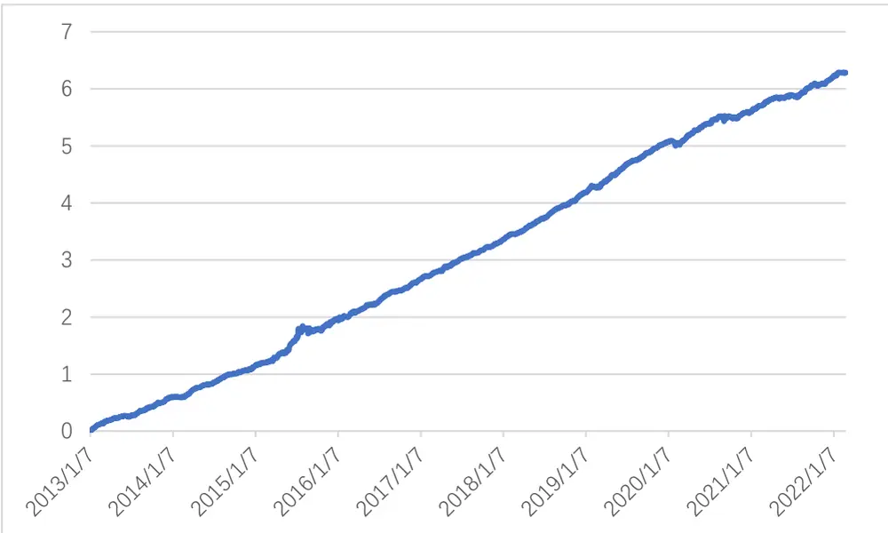
注：不考虑换仓时手续费的影响
资料来源：Wind，信达证券研发中心

表 13：改进收益波动率因子（Return_Std_Imp ）行业市值中性化后多空统计

| 年度 | Rank IC 胜率 | 多头年化 收益 | 空头年化 收益 | 多空年化 收益 | 多空年化 波动率 | 多空年化 夏普 | 多头日均 换手率 | 多/空头 日均持仓 | 空头日均 换手率 | 中证全指 区间收益 |
| --- | --- | --- | --- | --- | --- | --- | --- | --- | --- | --- |
| 2013 | 77.64% | 55.51% | -14.97% | 81.85% | 8.27% | 9.89 | 86.39% | 215.26 | 86.13% | 5.21% |
| 2014 | 79.18% | 57.19% | -7.53% | 68.86% | 7.82% | 8.80 | 87.48% | 213.17 | 88.44% | 45.82% |
| 2015 | 71.72% | 163.20% | 10.78% | 124.63% | 24.30% | 5.13 | 111.53% | 180.65 | 112.41% | 32.56% |
| 2016 | 76.64% | 8.34% | -46.39% | 97.10% | 10.96% | 8.86 | 85.07% | 229.75 | 87.23% | -14.41% |
| 2017 | 81.15% | -5.52% | -52.69% | 97.41% | 8.82% | 11.05 | 81.03% | 253.77 | 83.60% | 2.34% |
| 2018 | 81.48% | -22.00% | -66.66% | 130.46% | 8.32% | 15.68 | 77.79% | 293.10 | 79.18% | -29.94% |
| 2019 | 81.97% | 46.33% | -41.00% | 143.28% | 9.97% | 14.37 | 74.83% | 328.30 | 74.95% | 31.11% |
| 2020 | 74.07% | 25.04% | -27.49% | 66.90% | 16.23% | 4.12 | 74.70% | 332.29 | 74.91% | 24.92% |
| 2021 | 76.54% | 32.92% | -28.16% | 81.38% | 13.24% | 6.14 | 72.07% | 358.48 | 73.61% | 6.19% |
| 2022 | 71.43% | -25.80% | -70.44% | 48.30% | 12.97% | 3.72 | 71.21% | 384.37 | 72.55% | -6.95% |
| 汇总 | 77.18% | 31.09% | -34.75% | 96.65% | 13.03% | 7.42 | 83.24% | 269.12 | 84.31% | 7.97% |

2022/02/28
资料来源：Wind，信达证券研发中心

## 2.3 尾盘成交额占比因子

由于 A股的 $\mathrm{T}{+}1$ 机制，通常开盘和尾盘的成交量较大，相较于盘中蕴含额外的信息，因此，从尾盘的角度可以定义一个尾盘成交额因子。

尾盘成交额因子：

$$
TTV\_Ratio_{i,T}=-\frac{\sum_{t=210}^{t=235}ttv_{i,t,T}}{FloatMV_{T-1}}
$$

$ttv_{i,t,T}$ 为个股在 T日第 t分钟的成交额，该因子截取剔除尾盘 5分钟后半小时的成交额（14：55 ~15：00），因此 t 的取值为 210 至 235， $FloatMV_{T-1}$ 为 T-1日的流通市值。该因子回测参数如下：

样本筛选：剔除当日涨停或跌停的股票，剔除当日次新股、停牌以及 ST或 ST* 股票

从表中可以看出，中性化后的尾盘成交额因子 Rank IC 为 0.0564，ICIR 为 0.49，因子仅在 2015 年表现一般，其余年份较为稳定。

表 14：尾盘成交额占比 $(TTV\_Ratio_{i,T})$ 因子统计

| 全市场 | 原始因子 |  | 行业市值中性化后 |  |
| --- | --- | --- | --- | --- |
| 年度 | Rank IC ICIR | t值 | Rank IC ICIR | t值 |
| 2013 | 3.12% 0.18 | 2.89 | 4.68% 0.42 | 6.61 |
| 2014 | 3.94% 0.28 | 4.49 | 5.18% 0.61 | 9.70 |
| 2015 | 2.06% 0.11 | 1.70 | 4.37% 0.33 | 5.23 |
| 2016 | 6.10% 0.34 | 5.36 | 7.26% 0.63 | 10.00 |
| 2017 | 6.09% 0.46 | 7.25 | 5.19% 0.56 | 8.84 |
| 2018 | 5.46% 0.34 | 5.37 | 5.30% 0.47 | 7.46 |
| 2019 | 6.17% 0.38 | 6.05 | 6.52% 0.71 | 11.23 |
| 2020 | 5.53% 0.32 | 5.11 | 5.36% 0.45 | 7.15 |
| 2021 | 5.39% 0.37 | 5.84 | 5.20% 0.48 | 7.62 |
| 2022 | 5.42% 0.34 | 5.42 | 5.49% 0.64 | 10.09 |
| 汇总 | 4.89% 0.30 | 4.75 | 5.45% 0.50 | 7.97 |

资料来源：Wind，信达证券研发中心

从图中可以看出，中性化后因子的多空净值走势较为平稳（多空组合使用每日因子值对应的前 10%与后 10%的股票构建），在 2015年至 2016年间有所起伏，该因子在其余各个年度均有较好的选股能力。

图 7：尾盘成交额占比（TTV_Ratio ）因子行业市值中性化后多空对冲净值
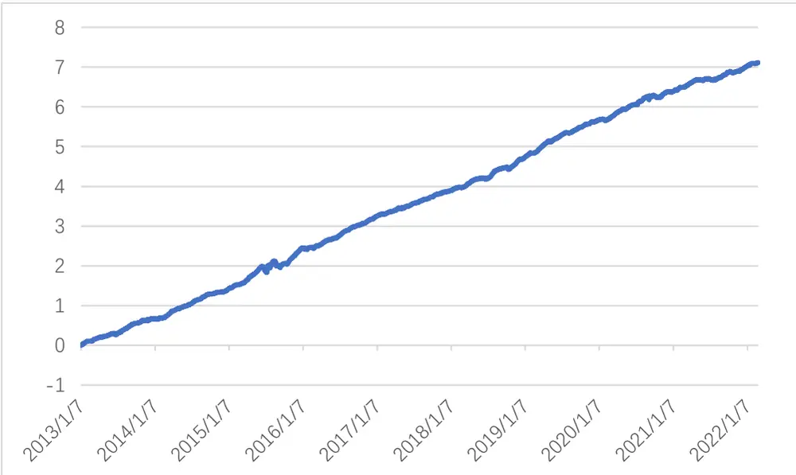
注：不考虑换仓时手续费的影响
资料来源：Wind，信达证券研发中心

表 15：尾盘成交额占比因子（TTV_Ratio ）行业市值中性化后多空统计

| 年度 | Rank IC 胜率 | 多头年化 收益 | 空头年化 收益 | 多空年化 收益 | 多空年化 波动率 | 多空年化 夏普 | 多头日均 换手率 | 多/空头 日均持仓 | 空头日均 换手率 | 中证全指 区间收益 |
| --- | --- | --- | --- | --- | --- | --- | --- | --- | --- | --- |
| 2013 | 70.89% | 69.67% | -15.14% | 96.12% | 11.74% | 8.19 | 68.57% | 215.73 | 75.55% | 5.21% |
| 2014 | 74.69% | 96.71% | -5.35% | 105.00% | 9.15% | 11.48 | 78.72% | 213.58 | 83.41% | 45.82% |
| 2015 | 70.08% | 237.10% | 16.20% | 175.67% | 25.99% | 6.76 | 107.96% | 181.12 | 109.46% | 32.56% |
| 2016 | 75.21% | 44.03% | -35.74% | 118.28% | 12.44% | 9.51 | 82.31% | 231.33 | 85.92% | -14.41% |
| 2017 | 72.95% | -3.70% | -50.29% | 90.39% | 10.08% | 8.97 | 77.04% | 254.17 | 81.98% | 2.34% |
| 2018 | 69.14% | -11.45% | -61.48% | 124.68% | 11.84% | 10.53 | 72.39% | 293.52 | 79.60% | -29.94% |
| 2019 | 77.05% | 78.86% | -32.44% | 159.58% | 10.22% | 15.61 | 71.80% | 328.52 | 76.83% | 31.11% |
| 2020 | 70.37% | 47.27% | -29.81% | 101.33% | 16.62% | 6.10 | 72.90% | 332.35 | 74.95% | 24.92% |
| 2021 | 70.37% | 44.08% | -24.41% | 86.49% | 12.57% | 6.88 | 71.88% | 358.48 | 73.37% | 6.19% |
| 2022 | 74.29% | -16.50% | -72.00% | 60.96% | 10.78% | 5.65 | 71.03% | 384.40 | 71.85% | -6.95% |
| 汇总 | 72.50% | 53.56% | -30.37% | 114.91% | 14.23% | 8.08 | 78.10% | 269.60 | 82.21% | 7.97% |

2022/02/28
资料来源：Wind，信达证券研发中心

## 3. 基于高频数据的日度调仓多因子策略

多因子选股模型中最基础的一步便是考察因子间的相关性。为了简便考虑，将改进的放量正收益反转因子简称为 $a_{rev\_pos}$ ，改进的放量负收益动量因子简称为 $a_{rev\_neg}$ ，改进收益波动率因子简称为 $a_{std}$ ，尾盘成交额占比因子简称为 $a_{ttv}$ ，并从日度的频率上考察因子间的相关性。从表中可以看出 $a_{rev\_pos}、a_{std}和a_{rev\_neg}$ 在全回测区间一直保持较高的相关性，但与 $a_{ttv}$ 相关性则较低。该结果也比较直观，因为 $a_{rev\_pos}、a_{rev\_neg}和a_{std}$ 均是从收益数据方面的改进， $a_{ttv}$ 与前三个因子使用了不同的数据源。

表 16：因子间截面上的相关性全区间均值

|  | $a_{rev\_pos}$ | $\|a_{rev\_neg}\|$ | $\|a_{std}\|$ | $\|a_{ttv}\|$ |
| --- | --- | --- | --- | --- |
| $a_{rev\_pos}$ | 1.00 | 0.60 | 0.86 | 0.31 |
| $a_{rev\_neg}$ | 0.60 | 1.00 | 0.77 | 0.28 |
| $a_{std}$ | 0.86 | 0.77 | 1.00 | 0.38 |
| $\|a_{ttv}\|$ | 0.31 | 0.28 | 0.38 | 1.00 |

注：因子回测区间为 2013/01/01~2022/02/28
资料来源：Wind，信达证券研发中心

## 3.1 剔除因子 $\boldsymbol{a}_{rev\_pos}$ 和 $\boldsymbol{a}_{rev\_neg}$ 后的等权结合

考虑到 $a_{rev\_pos}、a_{rev\_neg}和a_{std}$ 之间较高的相关性，为避免较高的相关性带来的同质性风险，将 $\cdot a_{std}$ 和 ${}^{t}a_{ttv}$ 进行等权结合。

$$
a_{equal\_weighted}=\frac{1}{2}*a_{std}+\frac{1}{2}*a_{ttv}
$$

具体做法为将中性化后的 $a_{std}和a_{ttv}$ 等权相加，若由于数据等原因造成 $a_{std}$ 和 ${}^{\prime}a_{ttv}$ 中任意一方的值缺失，结合后仍保持值缺失。结合后再对因子值作标准化、去极值、中性化等一系列操作。

从表中可以看出，等权结合后的因子相较于原始因子在各个统计指标上均有所改进，中性化后的等权组合因子全区间 Rank IC 可达 0.069，ICIR 为 0.59，在各个年度因子表现均较为稳定。

表 17：等权组合因子 $\langle a_{equal\_weighted}\rangle$ 因子统计

| 全市场 | 原始因子 |  | 行业市值中性化后 |  |
| --- | --- | --- | --- | --- |
| 年度 | Rank IC ICIR | t值 | Rank IC ICIR | t值 |
| 2013 | 5.90% 0.42 | 6.71 | 6.21% 0.57 | 9.05 |
| 2014 | 6.50% 0.56 | 8.91 | 6.39% 0.72 | 11.32 |
| 2015 | 4.81% 0.25 | 3.97 | 5.01% 0.32 | 5.09 |
| 2016 | 8.18% 0.50 | 7.91 | 8.00% 0.60 | 9.45 |
| 2017 | 7.84% 0.66 | 10.41 | 7.48% 0.77 | 12.22 |
| 2018 | 7.50% 0.57 | 8.95 | 7.33% 0.71 | 11.20 |
| 2019 | 8.41% 0.58 | 9.17 | 8.42% 0.79 | 12.44 |
| 2020 | 7.05% 0.44 | 6.97 | 6.80% 0.54 | 8.48 |
| 2021 | 6.95% 0.49 | 7.72 | 6.59% 0.59 | 9.30 |
| 2022 | 7.00% 0.50 | 7.98 | 6.12% 0.55 | 8.68 |
| 汇总 | 7.02% 0.48 | 7.55 | 6.90% 0.59 | 9.37 |

资料来源：Wind，信达证券研发中心

表 18：等权组合因子 $\langle a_{equal\_weighted}\rangle$ 行业市值中性化后多空统计

| 年度 | Rank IC 胜率 | 多头年化 收益 | 空头年化 收益 | 多空年化 收益 | 多空年化 波动率 | 多空年化 夏普 | 多头日均 换手率 | 多/空头 日均持仓 | 空头日均 换手率 | 中证全指 区间收益 |
| --- | --- | --- | --- | --- | --- | --- | --- | --- | --- | --- |
| 2013 | 72.57% | 59.34% | -23.15% | 104.10% | 11.21% | 9.28 | 81.96% | 215.26 | 81.39% | 5.21% |
| 2014 | 77.14% | 62.38% | -16.07% | 90.76% | 9.62% | 9.43 | 83.54% | 213.17 | 86.42% | 45.82% |
| 2015 | 69.26% | 138.66% | 0.61% | 118.90% | 30.31% | 3.92 | 109.91% | 180.65 | 111.06% | 32.56% |
| 2016 | 74.38% | 30.52% | -43.64% | 123.46% | 13.17% | 9.37 | 81.02% | 231.06 | 86.02% | -14.41% |
| 2017 | 79.51% | 0.43% | -56.42% | 125.97% | 10.64% | 11.84 | 78.15% | 253.77 | 82.93% | 2.34% |
| 2018 | 72.84% | -17.52% | -68.81% | 158.06% | 10.74% | 14.71 | 75.33% | 293.10 | 79.28% | -29.94% |
| 2019 | 78.28% | 54.47% | -44.79% | 172.60% | 11.65% | 14.81 | 72.21% | 328.30 | 75.22% | 31.11% |
| 2020 | 72.43% | 30.84% | -37.55% | 100.19% | 18.71% | 5.35 | 72.87% | 332.29 | 74.23% | 24.92% |
| 2021 | 75.72% | 37.18% | -31.26% | 94.33% | 14.67% | 6.43 | 70.43% | 358.48 | 72.84% | 6.19% |
| 2022 | 68.57% | -29.50% | -78.26% | 52.85% | 14.29% | 3.70 | 69.32% | 384.37 | 72.33% | -6.95% |
| 汇总 | 74.07% | 36.73% | -39.33% | 118.29% | 15.76% | 7.51 | 80.43% | 269.30 | 83.11% | 7.97% |

2022/02/28
资料来源：Wind，信达证券研发中心

将每日收益根据上一期因子值从大到小进行排序，排序后分 10组后每组取均值后在时序上取累积，仅从累积收益角度衡量组合因子的效用。从图中可以看出，组合后的因子第一组和空头端的分组较为明显，因此，可以尝试根据第一组的信号构建纯多头等权组合。

图 8：等权组合因子 $\langle a_{equal\_weighted}\rangle$ 行业市值中性化后分层后每组净值
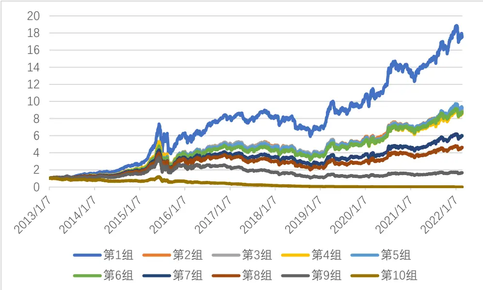
资料来源：Wind，信达证券研发中心

图 9：等权组合因子 $\langle a_{equal\_weighted}\rangle$ 行业市值中性化后分层后每组年化收益
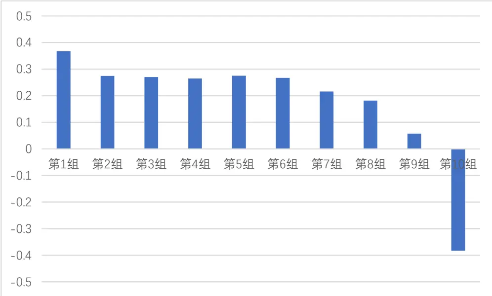
资料来源：Wind，信达证券研发中心

## 费率测试

为了进一步验证费率对收益率的影响，根据因子值排序，取前 p %，费率设置为双边 f%每日调仓，指数设置为中证全指(000985)，从多头组分析超额以及费率敏感性。从表中可以看出，等权因子组合对费率较为敏感，在费率设置为 0.08%时相对于中证全指仍有超额，由于较高的换手率导致收益覆盖不了更高的费率。

表 19：等权组合因子 $\langle a_{equal\_weighted}\rangle$ 多头组相对于中证全指累积净值

| p/f | 0.00% | 0.05% | 0.06% | 0.08% | 0.10% | 0.15% |
| --- | --- | --- | --- | --- | --- | --- |
| 5.00% | 1686.15% | 255.54% | 152.23% | 21.74% | -47.06% | -120.56% |
| 8.00% | 1307.30% | 208.83% | 123.39% | 12.17% | -49.06% | -116.22% |
| 10.00% | 1142.51% | 187.93% | 110.62% | 8.29% | -49.40% | -112.99% |
| 20.00% | 757.20% | 145.45% | 87.75% | 6.32% | -44.01% | -101.43% |
| 30.00% | 646.47% | 157.12% | 105.11% | 27.76% | -23.76% | -88.14% |
| 40.00% | 593.34% | 182.91% | 134.46% | 58.94% | 5.20% | -69.94% |

注：回测时段为 2013/01/01~2022/02/28
资料来源：Wind，信达证券研发中心

## 3.2相关性加权

考虑到 $a_{rev\_pos}、a_{rev\_neg}和a_{std}$ 之间较高的正相关性，为避免较高的相关性带来的同质性风险，采用相关性加权的方法，具体做法为：

计算每一期的因子暴露及其相关性，加权后的因子值为：

$$
\begin{aligned}a_{corr\_weighted}=&\frac{\left|corr_{std*ttv,t}\right|}{\left|corr_{rev\_pos*std,t}\right|+\left|corr_{rev\_pos*ttv,t}\right|+\left|corr_{std*ttv,t}\right|}*a_{rev\_pos,t}\\+&\frac{\left|corr_{rev\_pos*ttv,t}\right|}{\left|corr_{rev\_pos*std,t}\right|+\left|corr_{rev\_pos*ttv,t}\right|+\left|corr_{std*ttv,t}\right|}*a_{std,t}\\+&\frac{\left|corr_{rev\_pos*std,t}\right|}{\left|corr_{rev\_pos*std,t}\right|+\left|corr_{rev\_pos*ttv,t}\right|+\left|corr_{std*ttv,t}\right|}*a_{ttv,t}\end{aligned}
$$

$corr_{x\_y,t}$ 为 t日因子 x和因子 y之间的相关性， $a_{z,t}$ 是中性化后的因子 $\mathbf{Z}\circ$ 对加权后的因子再作去极值、标准化以及中性化等一系列操作。从表中可以看出，相较于等权因子组合，相关性加权因子组合在各个统计指标上均有所提升，行业市值中性化后全区间 Rank IC 可达 7.18%，ICIR 为 0.67。

表 20：相关性加权组合因子 $(a_{corr\_weighted})$ 统计

| 全市场 | 原始因子 |  | 行业市值中性化后 |  |
| --- | --- | --- | --- | --- |
| 年度 | Rank IC ICIR | t值 | Rank IC ICIR | t值 |
| 2013 | 7.13% 0.91 | 14.47 | 6.57% 0.63 | 9.95 |
| 2014 | 7.29% 1.11 | 17.56 | 6.80% 0.84 | 13.34 |
| 2015 | 5.76% 0.44 | 7.03 | 5.43% 0.38 | 6.02 |
| 2016 | 9.19% 0.87 | 13.71 | 8.70% 0.72 | 11.41 |
| 2017 | 7.47% 0.98 | 15.56 | 7.39% 0.81 | 12.88 |
| 2018 | 7.48% 0.90 | 14.20 | 7.57% 0.78 | 12.32 |
| 2019 | 8.96% 1.17 | 18.53 | 8.79% 0.91 | 14.42 |
| 2020 | 6.91% 0.75 | 11.82 | 6.87% 0.58 | 9.18 |
| 2021 | 6.67% 0.78 | 12.36 | 6.59% 0.61 | 9.66 |
| 2022 | 5.90% 0.86 | 13.62 | 6.68% 0.73 | 11.49 |
| 汇总 | 7.40% 0.82 | 13.00 | 7.18% 0.67 | 10.52 |

资料来源：Wind，信达证券研发中心

表 21：相关性加权组合因子 $(a_{corr\_weighted})$ 行业市值中性化后多空统计

| 年度 | Rank IC 胜率 | 多头年化 收益 | 空头年化 收益 | 多空年化 收益 | 多空年化 波动率 | 多空年化 夏普 | 多头日均 换手率 | 多/空头 日均持仓 | 空头日均 换手率 | 中证全指 区间收益 |
| --- | --- | --- | --- | --- | --- | --- | --- | --- | --- | --- |
| 2013 | 75.11% | 63.52% | -23.91% | 111.49% | 11.24% | 9.92 | 79.50% | 212.53 | 79.55% | 5.21% |
| 2014 | 79.18% | 72.35% | -15.84% | 102.32% | 8.93% | 11.46 | 83.48% | 210.98 | 85.92% | 45.82% |
| 2015 | 71.72% | 129.97% | 1.78% | 114.29% | 27.13% | 4.21 | 111.38% | 180.14 | 111.60% | 32.56% |
| 2016 | 79.75% | 31.44% | -45.33% | 133.33% | 12.29% | 10.85 | 83.16% | 230.61 | 85.57% | -14.41% |
| 2017 | 79.51% | -1.51% | -55.26% | 116.40% | 10.42% | 11.17 | 78.65% | 252.47 | 82.21% | 2.34% |
| 2018 | 78.60% | -13.42% | -68.65% | 170.07% | 10.76% | 15.81 | 74.43% | 290.42 | 79.34% | -29.94% |
| 2019 | 81.97% | 60.18% | -45.49% | 187.03% | 10.71% | 17.46 | 72.56% | 326.25 | 75.60% | 31.11% |
| 2020 | 74.90% | 30.24% | -38.19% | 102.13% | 17.36% | 5.88 | 72.74% | 331.10 | 74.12% | 24.92% |
| 2021 | 74.90% | 38.08% | -31.13% | 95.47% | 14.44% | 6.61 | 70.64% | 357.56 | 72.52% | 6.19% |
| 2022 | 71.43% | -15.33% | -77.55% | 68.77% | 12.67% | 5.43 | 70.74% | 384.00 | 71.78% | -6.95% |
| 汇总 | 76.71% | 38.95% | -39.43% | 123.34% | 14.66% | 8.41 | 80.58% | 267.76 | 82.78% | 7.97% |

资料来源：Wind，信达证券研发中心

将每日收益根据上一期因子值从大到小进行排序，排序后分 10组后每组取均值后在时序上取累积，仅从累积收益角度衡量组合因子的效用。从图中可以看出，组合后的因子分组较为明显，相比于等权结合的因子，相关性加权因子多头组有更高的净值，并且第 1组至第 10组的分层具有明显单调性。

图 10：相关性加权组合因子 $(a_{corr\_weighted})$ 行业市值中性化后分层净值
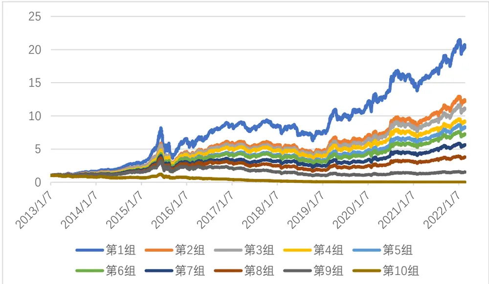
资料来源：Wind，信达证券研发中心

图 11：相关性加权组合因子 $\langle a_{corr\_weighted}\rangle$ 行业市值中性化后分层后每组年化收益
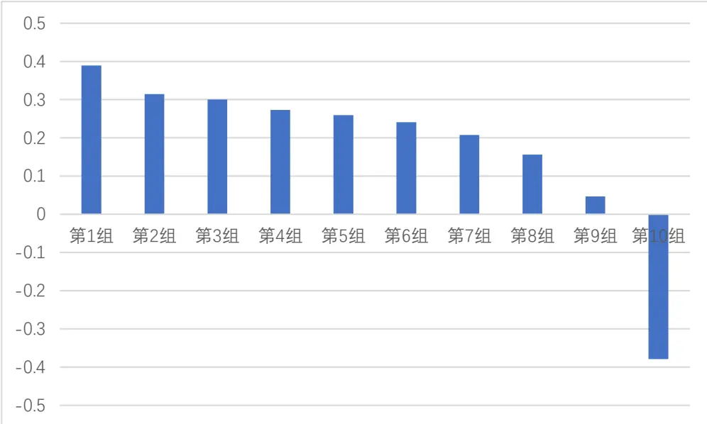
资料来源：Wind，信达证券研发中心

## 费率测试

为了进一步验证费率对收益率的影响，根据因子值排序，取前 p %，费率设置为双边 f%每日调仓，指数设置为中证全指(000985)，从多头组分析超额以及费率敏感性。从表中可以看出，相关性加权因子组合对费率仍较为敏感， 相较于等权组合因子超额有所改进，同样在手续费双边 0.08%时有超额但覆盖不了更高的费率。

表 22：相关性加权组合多头组 $\langle a_{corr\_weighted}\rangle$ 累积超额

| p/f | 0.00% | 0.05% | 0.06% | 0.08% | 0.10% | 0.15% |
| --- | --- | --- | --- | --- | --- | --- |
| 5.00% | 2024.63% | 337.81% | 214.54% | 57.77% | -25.94% | -102.64% |
| 8.00% | 1600.33% | 288.41% | 185.09% | 49.61% | -25.97% | -98.18% |
| 10.00% | 1402.36% | 261.93% | 168.49% | 43.98% | -27.11% | -97.11% |
| 20.00% | 1027.96% | 235.39% | 160.07% | 53.25% | -13.36% | -88.39% |
| 30.00% | 883.84% | 248.88% | 181.08% | 79.95% | 12.22% | -73.61% |
| 40.00% | 760.18% | 254.86% | 195.36% | 102.66% | 36.70% | -55.72% |

注：回测时段为 2013/01/01~2022/02/28
资料来源：Wind，信达证券研发中心

## 因子附录

在上述因子及其改进的基础上，本文还统计了一些常见的指标，从 Rank IC以及 ICIR的角度去衡量其作为因子的效用。从下表中可以看出，常见指标中存在一些效用较为显著的因子。

样本筛选：剔除当日涨停或跌停的股票，剔除当日次新股、停牌以及 ST或 ST*股票

注：下列因子计算时均剔除每日 14：56~ 15：00数据

| 因子大类 | 因子名称 | 因子算法 | Rank IC | ICIR |
| --- | --- | --- | --- | --- |
| 振幅因子 | Amp_Mean | Mean(High/Low) | -5.48% | -0.46 |
|  | Amp_Std | Std(High/Low) | -4.97% | -0.43 |
|  | Amp_Stability | Mean(High/Low)/ Std(High/Low) | 4.89% | 0.43 |
|  | Amp_Mean_Med_Ratio | Mean(High/Low) /Median(High/Low) | -3.37% | -0.41 |
|  | Amp_Skew | Skew(High/Low) | -3.83% | -0.53 |
| 价格偏离因子 | Vwap_Close_Mean | Mean(Vwap/Close) | 0.99% | 0.20 |
|  | Vwap_Close_Std | Std(Vwap/Close) | -5.07% | -0.45 |
|  | Vwap_Close_Stability | Mean(Vwap/Close) / Std(Vwap/Close) | 5.09% | 0.46 |
|  | Vwap_Close_Mean_Med_Ratio | Mean(Vwap/Close) / Median(Vwap/Close) | 0.33% | 0.07 |
|  | Vwap_Close_Skew | Skew(Vwap/Close) | 0.25% | 0.06 |
| 成交量加权收益因子 | Vol_Weighted_Ret | Mean(Ret/Vol) | 0.65% | 0.17 |
|  | Vol_Weighted_Std | Std(Ret/Vol) | 4.53% | 0.41 |
|  | Vol_Weighted_Stability | Mean(Ret/Vol) / Std(Ret/Vol) | -0.09% | -0.02 |
|  | Vol_Weighted_Mean_Med_Ratio | Mean(Ret/Vol) / Median(Ret/Vol) | 0.28% | 0.01 |
|  | Vol_Weighted_Skew | Skew(Ret/Vol) | 0.27% | 0.12 |
| 收益因子 | Ret_Mean | Mean(Ret) | -2.17% | -0.16 |
|  | Ret_Std | Std(Ret) | -5.75% | -0.46 |
|  | Ret_Stability | Mean(Ret) / Std(Ret) | -2.03% | -0.15 |
|  | Ret_Mean_Med_Ratio | Mean(Ret) / Median(Ret) | 3.16% | 0.09 |
|  | Ret_Skew | Skew(Ret) | -1.69% | -0.21 |
| 放量收益因子 | Ret(Vol_Up)_Mean | Mean(Ret(Vol_Up)) | -3.53% | -0.34 |
|  | Ret(Vol_Up)_Std | Std(Ret(Vol_Up)) | -6.80% | -0.61 |
|  | Ret(Vol_Up)_Stability | Mean(Ret(Vol_Up))/ Std(Ret(Vol_Up)) | -3.40% | -0.32 |
|  | Ret(Vol_Up)_Mean_Med_Ratio | Mean(Ret(Vol_Up)) / Median(Ret(Vol_Up)) | 0.14% | 0.03 |
|  | Ret(Vol_Up)_Skew | Skew(Ret(Vol_Up)) | -1.02% | -0.22 |
| 缩量收益因子 | Ret(Vol_Down)_Mean | Mean(Ret(Vol_Down)) | -0.72% | -0.10 |
|  | Ret(Vol_Down)_Std | Std(Ret(Vol_Down)) | -0.82% | -0.08 |
|  | Ret(Vol_Down)_Stability | Mean(Ret(Vol_Down))/ Std(Ret(Vol_Down)) | -0.64% | -0.084 |
|  | Ret(Vol_Down)_Mean_Med_Ratio | Mean(Ret(Vol_Down))/ Median(Ret(Vol_Down)) | 0.22% | 0.02 |
|  | Ret(Vol_Down)_Skew | Skew(Ret(Vol_Down)) | 0.27% | 0.04 |
| 收益离差因子 | Ret_Filtered_Diff | Sum(Ret(Vol_Up)) – Sum(Ret(Vol_Down)) | 3.48% | 0.33 |
|  | Ret_Filtered_Intensity | Sum(Ret(Vol_Up)) – Sum(Ret(Vol_Down)) | 0.66% | 0.05 |

注：High为分钟高价，Low为分钟低价，Open为分钟开价，Close为分钟收价，Vwap为分钟均价，Ret为分钟收益，Ret(Vol_Up)为筛选后的放量收益(放量筛选标准与文中相同)，Ret(Vol_Down)为筛选后的缩量收益(缩量筛选标准阈值成交量均值减一倍标准差，即筛选出小于此阈值时的分钟收益)，Mean为均值函数，Std为标准差函数，Median为中位数函数，Skew为偏度函数。

作为多因子选股模型的基石，有效因子的挖掘是搭建因子选股模型的第一步也是最重要的一步。本文试图从高频分钟线数据入手，挖掘在日内具有高信息增益的因子，在不同的频率(30 分钟，日度)上检测因子的预测效果。从结果来看，高频因子有很强的收益预测效果：在回测区间2013/01/01 ~ 2022/02/28 内，收益反转因子在 30 分钟的频率上 Rank IC 均值达到 9%，ICIR 为 0.97。加上成交量和收益筛选后的改进正收益反转因子中性化后在日度频率上 RankIC可达 5.99%，ICIR为 0.74。加上成交量筛选后的改进波动率因子中性化后在日度频率上 RankIC均值为 6.52%，ICIR为0.70。尾盘成交额占比因子中性化后在日度频率上 RankIC均值为 5.45%，ICIR为0.50。

本文也采用两种方法对上述因子进行结合，其中相关性加权的三因子前 10%等权组合相对中证全指的累积超额收益在双边 0.05%的手续费下可达 261.93%，年化 28.57%，在 0.08%的手续费下为43.98%，年化4.80%。最后，本文也给了一个因子附录，计算了一些常见因子的统计指标。

作为多因子选股的开篇之作，本文仅从高频分钟线数据构建了 30分钟以及日频因子，后续我们可尝试从 tick 以及逐笔数据中挖掘更具信息增益的因子。并且组合的策略也是基于日频调仓，鉴于较高的换手率以及调仓频率削弱了较高费率时的超额收益，未来我们将尝试不同的组合构建方法、纳入更多的有效因子以及降低调仓频率等等一些方法以增强超额收益。

文献测算结果由作者通过历史数据测算得出，不一定适用于当下国内市场环境，存在模型失效风险。

机构销售联系人

| 区域 | 姓名 | 手机 | 邮箱 |
| --- | --- | --- | --- |
| 全国销售总监 | 韩秋月 | 13911026534 | hanqiuyue@cindasc.com |
| 华北区销售总监 | 陈明真 | 15601850398 | chenmingzhen@cindasc.com |
| 华北区销售副总监 | 阙嘉程 | 18506960410 | quejiacheng@cindasc.com |
| 华北区销售 | 祁丽媛 | 13051504933 | qiliyuan@cindasc.com |
| 华北区销售 | 陆禹舟 | 17687659919 | luyuzhou@cindasc.com |
| 华北区销售 | 魏冲 | 18340820155 | weichong@cindasc.com |
| 华北区销售 | 樊荣 | 15501091225 | fanrong@cindasc.com |
| 华东区销售总监 | 杨兴 | 13718803208 | yangxing@cindasc.com |
| 华东区销售副总监 | 吴国 | 15800476582 | wuguo@cindasc.com |
| 华东区销售 | 国鹏程 | 15618358383 | guopengcheng@cindasc.com |
| 华东区销售 | 李若琳 | 13122616887 | liruolin@cindasc.com |
| 华东区销售 | 朱尧 | 18702173656 | zhuyao@cindasc.com |
| 华东区销售 | 戴剑箫 | 13524484975 | daijianxiao@cindasc.com |
| 华东区销售 | 方威 | 18721118359 | fangwei@cindasc.com |
| 华东区销售 | 俞晓 | 18717938223 | yuxiao@cindasc.com |
| 华东区销售 | 李贤哲 | 15026867872 | lixianzhe@cindasc.com |
| 华东区销售 | 孙僮 | 18610826885 | suntong@cindasc.com |
| 华东区销售 | 贾力 | 15957705777 | jiali@cindasc.com |
| 华南区销售总监 | 王留阳 | 13530830620 | wangliuyang@cindasc.com |
| 华南区销售副总监 | 陈晨 | 15986679987 | chenchen3@cindasc.com |
| 华南区销售副总监 | 王雨霏 | 17727821880 | wangyufei@cindasc.com |
| 华南区销售 | 刘韵 | 13620005606 | liuyun@cindasc.com |
| 华南区销售 | 许锦川 | 13699765009 | xujinchuan@cindasc.com |

## 分析师声明

负责本报告全部或部分内容的每一位分析师在此申明，本人具有证券投资咨询执业资格，并在中国证券业协会注册登记为证券分析师,以勤勉的职业态度,独立、客观地出具本报告；本报告所表述的所有观点准确反映了分析师本人的研究观点；本人薪酬的任何组成部分不曾与，不与，也将不会与本报告中的具体分析意见或观点直接或间接相关。

## 免责声明

信达证券股份有限公司(以下简称“信达证券”)具有中国证监会批复的证券投资咨询业务资格。本报告由信达证券制作并发布。

本报告是针对与信达证券签署服务协议的签约客户的专属研究产品，为该类客户进行投资决策时提供辅助和参考，双方对权利与义务均有严格约定。本报告仅提供给上述特定客户，并不面向公众发布。信达证券不会因接收人收到本报告而视其为本公司的当然客户。客户应当认识到有关本报告的电话、短信、邮件提示仅为研究观点的简要沟通，对本报告的参考使用须以本报告的完整版本为准。

本报告是基于信达证券认为可靠的已公开信息编制，但信达证券不保证所载信息的准确性和完整性。本报告所载的意见、评估及预测仅为本报告最初出具日的观点和判断，本报告所指的证券或投资标的的价格、价值及投资收入可能会出现不同程度的波动，涉及证券或投资标的的历史表现不应作为日后表现的保证。在不同时期，或因使用不同假设和标准，采用不同观点和分析方法，致使信达证券发出与本报告所载意见、评估及预测不一致的研究报告，对此信达证券可不发出特别通知。

在任何情况下，本报告中的信息或所表述的意见并不构成对任何人的投资建议，也没有考虑到客户特殊的投资目标、财务状况或需求。客户应考虑本报告中的任何意见或建议是否符合其特定状况，若有必要应寻求专家意见。本报告所载的资料、工具、意见及推测仅供参考，并非作为或被视为出售或购买证券或其他投资标的的邀请或向人做出邀请。

在法律允许的情况下，信达证券或其关联机构可能会持有报告中涉及的公司所发行的证券并进行交易，并可能会为这些公司正在提供或争取提供投资银行业务服务。

本报告版权仅为信达证券所有。未经信达证券书面同意，任何机构和个人不得以任何形式翻版、复制、发布、转发或引用本报告的任何部分。若信达证券以外的机构向其客户发放本报告，则由该机构独自为此发送行为负责，信达证券对此等行为不承担任何责任。本报告同时不构成信达证券向发送本报告的机构之客户提供的投资建议。

如未经信达证券授权，私自转载或者转发本报告，所引起的一切后果及法律责任由私自转载或转发者承担。信达证券将保留随时追究其法律责任的权利。

## 评级说明

| 投资建议的比较标准 | 股票投资评级 | 行业投资评级 |
| --- | --- | --- |
| 本报告采用的基准指数：沪深300指数（以下简称基准）；时间段：报告发布之日起6个月内。 | 买入：股价相对强于基准 20%以上； | 看好：行业指数超越基准； |
|  | 增持：股价相对强于基准5%～20%; | 中性：行业指数与基准基本持平； |
|  | 持有：股价相对基准波动在±5%之间； | 看淡：行业指数弱于基准。 |
|  | 卖出：股价相对弱于基准 5%以下。 |  |

## 风险提示

证券市场是一个风险无时不在的市场。投资者在进行证券交易时存在赢利的可能，也存在亏损的风险。建议投资者应当充分深入地了解证券市场蕴含的各项风险并谨慎行事。

本报告中所述证券不一定能在所有的国家和地区向所有类型的投资者销售，投资者应当对本报告中的信息和意见进行独立评估，并应同时考量各自的投资目的、财务状况和特定需求，必要时就法律、商业、财务、税收等方面咨询专业顾问的意见。在任何情况下，信达证券不对任何人因使用本报告中的任何内容所引致的任何损失负任何责任，投资者需自行承担风险。