# 股票多因子系列 1——机构主动资金流

# ——基于 Level2 数据

## 报告要点：

## A股行情数据

A股市场成立近30年来，全市场股票数量不断增加，日成交额此起彼伏。以中证全指(000985.SH)为例，在2015年大牛市时，日成交额一度出现历史高值2万亿以上，之后成交额急剧下降，直到2019年初开始震荡式回升。疫情后，市场资金宽松，再次出现连续多个交易日全市场日成交额达到1万亿规模以上的情况。

## 逐笔数据追踪机构主动资金

通过逐笔数据刻画机构主动资金，构建一个机构主动资金因子ABSR，构建一个常见的量价因子RETAMT。对不同视角的两个因子逐个进行了因子评测、单因子各参数数值组合、两因子的逻辑组合。两因子的long-short有明显正向的收益，横截面分组的收益也比较线性。

## 因子组合回测

对组合后的因子，分别在中证全指、沪深300、中证500和中证1000股票池里进行回测。在中证全指上的收益增强表现较好，总超额收益为206.26%，超额年化收益率为9.16%，信息比率为0.84，持股数量也随着中证全指成分股的增加而相应增加。从2020年以来，持股数量在1100-1400只之间，策略容量上限大。

## 组合因子Barra归因分析

在中证全指、沪深300、中证500和中证1000不同股票池里面，行业因子的整体贡献均较少。在风格因子上，机构主动资金偏好在市值因子上长期正向的暴露。

## 风险提示

本报告基于历史数据进行测试，历史回测结果不代表未来收益，未来市场风格可能发生切换。

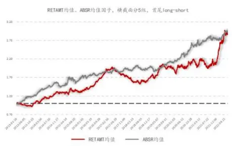

分析师：朱人木

执业证书编号：S0590522040002

电话：

邮箱：zhurm@glsc.com.cn

## 相关报告

1、《宏观维持平稳，景气度持续下行，北上资金持续流入高增长行业:null》2022.07.18

3、《关注受益于稳增长政策和中报超预期板 块:null》2022.07.17

## 1 国内股票行情数据简介

## 1.1 A股市场成交额和市值变化

## 成交额的变化

A 股市场成立近 30 年来，全市场股票数量不断增加，日成交额此起彼伏。如图表 1，以中证全指(000985.SH)为例，在 2015年大牛市，日成交额一度出现历史高值2 万亿以上，之后成交额急剧下降，直到 2019 年初开始震荡式回升。疫情后，市场资金宽松，再次出现连续多个交易日全市场日成交额达到1 万亿规模以上的情况。

图 1：中证全指(000985.SH)日成交额变化
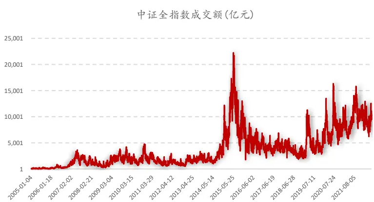
资料来源：通联数据，国联证券研究所整理

## 总市值、流通市值和换手率(基于流通市值)的变化

从图表 2 中可以看出，中证全指(000985.SH)的总市值和流通市值几乎同步平稳上升，而换手率从 2015年下降后，长期较为平稳。

图 2：中证全指(000985.SH)总市值、流通市值和换手率(基于流通市值)
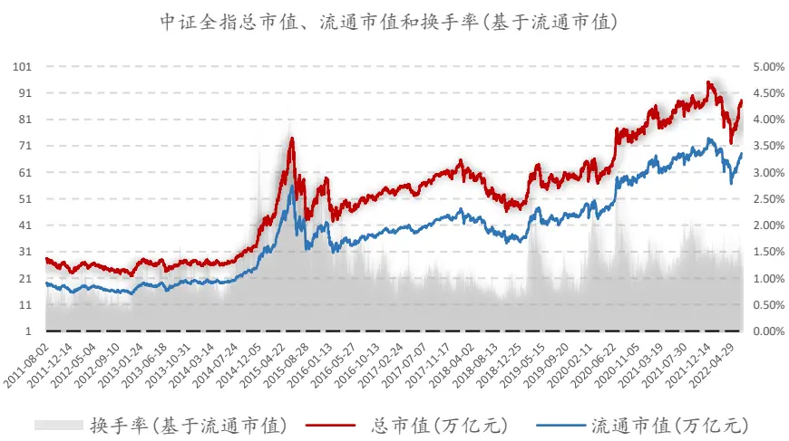
资料来源：通联数据，国联证券研究所整理

## 股票数量、个股平均总市值变化

从图表 3中可以看出，中证全指(000985.SH)的股票数量从 2011年的 1800 多只增加到 2022 年的 4200 多只，增加近 2400 多只。但个股平均总市值，长期处于 200亿的均值附近。由此可见，全市场总市值的增长，更多的是由股票发行所贡献的，而个股平均总市值的贡献比较小。

图 3：中证全指(000985.SH)股票数量、个股平均总市值
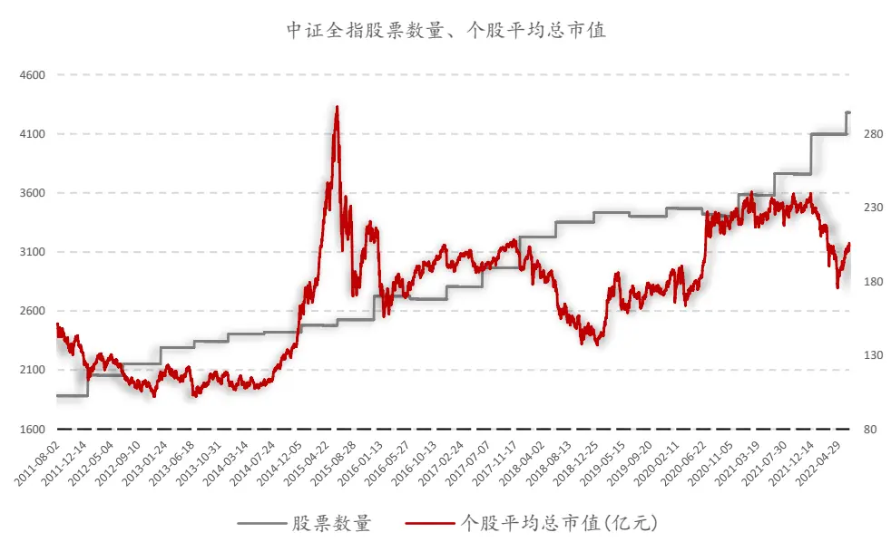
资料来源：通联数据，国联证券研究所整理

## 1.2 A股市场推送行情数据简介

截止到2022年6月10日，国内股票交易所推送的常用的盘中实时行情数据如图表 4 所示(表格中只列出部分数据)，数据主要分成两大类：截面数据、逐笔数据。国内股票市场截面数据最高频率为 3s；逐笔数据没有固定频率，属于事件驱动型数据推送，交易所处理的每一笔委托单和撮合单都会被推送。

图 4：国内上交所和深交所常用的盘中数据推送

| 数据类型 | 数据简称 | 数据频率 |
| --- | --- | --- |
| Level-1 | 盘口五档截面数据 | 3s |
| Level-2 | 盘口十档截面数据 | 3s |
|  | 逐笔成交 | 实时 |
|  | 逐笔委托 | 实时 |

资料来源：国联证券研究所整理

## 1.3 分笔 Level2 行情数据

如图表5所示，逐笔成交数据的主要字段。每个输入市场的买订单和卖订单都会被分配一个独立的编号，并且在当前交易日是互斥的。

图 5：逐笔成交数据主要字段

| datetime | ticker | price | volume | buy_id | sell_id |  |  |
| --- | --- | --- | --- | --- | --- | --- | --- |
| 2021-06-16 10:30:00.070000 6 | 00905.SH | 4.73 | 100 | 4556226 | 4464160 |  |  |
| 2021-06-16 10:30:00.100000 6 | 00905.SH | 4.73 | 14100 | 4556244 | 4464160 |  |  |
| 2021-06-16 10:30:00.100000 | 600905.SH | 4.72 | 200 | 4551489 | 4556253 |  |  |
| 2021-06-16 10:30:00.100000 | 600905.SH | 4.73 | 604 | 4556268 | 4464160 |  |  |
| 2021-06-16 10:30:00.100000 | 600905.SH | 4.73 | 1000 | 4556268 | 4464182 |  |  |
| 2021-06-16 10:30:00.100000 | 600905.SH | 4.73 | 396 | 4556268 | 4464225 |  |  |
| 2021-06-16 10:30:00.100000 | 600905.SH | 4.72 | 400 | 4551489 | 4556276 |  |  |
| 2021-06-16 10:30:00.100000 | 600905.SH | 4.72 | 2600 | 4551493 | 4556276 |  |  |
| 2021-06-16 10:30:00.100000 | 600905.SH | 4.72 | 900 | 4551493 | 4556279 | 同一 |  |
| 2021-06-16 10:30:00.100000 | 600905.SH | 4.72 | 300 | 4551590 | 4556279 |  |  |
| 2021-06-16 10:30:00.100000 | 600905.SH | 4.72 | 800 | 4551662 | 4556279 |  |  |
| 2021-06-16 10:30:00.130000 | 600905.SH | 4.72 | 2000 | 4551662 | 4556282 |  |  |
| 2021-06-16 10:30:00.130000 | 600905.SH | 4.73 | 200 | 4556284 | 4464225 |  |  |
| 2021-06-16 10:30:00.130000 | 600905.SH | 4.72 | 1000 | 4551662 | 4556289 | 同一 | 同一个买单 |
| 2021-06-16 10:30:00.160000 | 600905.SH | 4.72 | 1000 | 4551662 | 14556300 |  |  |
| 2021-06-16 10:30:00.160000 | 600905.SH | 4.72 | 100 | 4551662 | 4556303 |  |  |
| 2021-06-16 10:30:00.160000 | 600905.SH | 4.73 | 404 | 4556308 | 4464225 |  |  |
| 2021-06-16 10:30:00.160000 6 | 00905.SH | 4.73 | 200 | 4556308 | 4464374 |  |  |
| 2021-06-16 10:30:00.160000 | 600905.SH | 4.73 | 196 | 4556308 | 4464440 |  |  |

资料来源：Wind，国联证券研究所整理

## 2 基于 Level2数据追踪机构主动资金

## 2.1 机构主动资金定义

如图表 5 所示，每一笔撮合成交都对应一个买单编号和卖单编号。当 buy_id 的编号值大于 sell_id的编号值时，表示 buy_id对应的订单为主动方。

## 机构主动资金定义如图表6 所示：(与图表5 中的字段对应)

## 图 6：机构主动资金的定义

计算步骤：
每笔撮合的订单成交额：amt = price ∗ volume
逐日筛选所有的buy_id大于sell_id 的数据点作为主动买数据集act_buy
逐日筛选所有的sell_id大于buy_id 的数据点作为主动卖数据集act_sell
将act_buy中同一编号的 buy_id 对应的 amt 累加，设为：buyamt
将act_sell中同一编号的 sell_id 对应的 amt 累加，设为：sellamt
逐日筛选 buyamt大于100 万的累加，设为：buyex
逐日筛选 sellamt大于100 万的累加，设为：sellex
定义：
机构主动买单额：buyex
机构主动卖单额：sellex

## 2.2 因子构建

- 基于机构主动资金因子构建如图表7 所示：

## 图 7：机构主动资金因子构建

因子1： $ABSR=\left({\frac{buyex-sellex}{buyex+sellex}}\right)$ . mean(n)， 当分母为 0 时， $\left(\frac{buyex{-}sellex}{buyex{+}sellex}\right)=0$ 
mean(n) n
因子2：（补充一个常见的量价因子）
RETAMT = −[Ret(n) ∗ log(amt + 1)]. mean(n)
其中： $Ret(n)=\frac{close}{close(n)}-1$ log为取以自然常数e为底的对数
资料来源：国联证券研究所

## 2.3 因子评测

- 数据预处理：

- 移动窗口参数 n 遍历(63,126,252)，日频数据

- 逐日将中证全指成分股数据原始因子值进行横截面升序排序

(对RETAMT因子排序后的值多空分别进行镜面翻转处理，即：每个截面的排序值离排序中位值越近，输出的值越大。)

- 逐日将横截面升序值分成5 组

- 分 5组、近年收益：

图 8：RETAMT、ABSR 因子各参数横截面分档年化收益率表现

| RETAMT因子，横截面分5组 |  |  |  |  |  | ABSR，横截面分5组 |  |  |  |  |  |
| --- | --- | --- | --- | --- | --- | --- | --- | --- | --- | --- | --- |
| RETAMT_063d 近1年 近3年 近5年 近10年 |  |  |  |  |  | ABSR_063d 近1年 近3年 |  |  | 近5年 |  | 近10年 |
| Group_1 | 9.72% |  | -2.67% | -8.90% | 6.79% | Group_1 | 2.28% | 3.10% | -5.74 | 4% | 8.40% |
| Group_2 | 5.01% |  | 10.49% | -0.13% | 12.45% | Group_2 | 6.73% | 49% | -2.2 | 4% | 12.42% |
| Group_3 | 10.22% |  | 12.20% | 0.77% | 16.49% | Group_3 | 6.09% | 8.68% | -0.11 | 1% | 14.99% |
| Group_4 | 16.46% |  | 14.19% | 2.38% | 17.85% | Group_4 | 8.64% | 12.81% | 2.9 | 8% | 19.36% |
| Group_5 | 16.61% |  | 14.03% | 2.17% | 17.76% | Group_5 | 13.08% | 15.85% | 1.4 | 0% | 16.97% |
| RETAMT_126d | 近1年 |  | 近3年 | 近5年 近10年 |  | ABSR_126d | 近1年 | 近3年 | 近5年 |  | 近10年 |
| Group_1 |  | -4.65% | 1.83% | -5.14% | 8.52% | Group_1 | 4.03% | 1.01% | -7.0 | 7% | 6.14% |
| Group_2 |  | 2.84% | 10.32% | 0.66% | 13.56% | Group_2 | 4.75% | 6.75% | -2.7 | 5% | 10.98% |
| Group_3 |  | 9.41% | 11.09% | 0.13% | 15.26% | Group_3 | 7.91% | 10.03% | 0.1 | 5% | 16.52% |
| Group_4 |  | 15.55% | 12.78% | 0.40% | 16.68% | Group_4 | 8.74% | 13.33% | 3.4 | 7% | 19.70% |
| Group_5 |  | 14.80% | 11.86% | 0.06% | 17.11% | Group_5 | 11.47% | 17.20% | 2.7 | 5% | 19.44% |
| RETAMT_252d 近1年 |  |  | 近3年 | 近5年 近10年 |  | ABSR_252d | 近1年 | 近3年 | 近5年 |  | 近10年 |
| Group_1 |  | -5.92% | 1.01% | -3.91% | 8.96% | Group_1 | 3.80% | 2.20% | -5.5 | 8% | 6.36% |
| Group_2 |  | 2.46% | 8.83% | -0.31 | 12.54% | Group_2 | 3.75% | 5.87% | -3.1 | 8% | 9.90% |
| Group_3 |  | 9.47% | 11.28% | -0.40% | 15.16% | Group_3 | 7.19% | 10.58% | 0.0 | 2% | 15.75% |
| Group_4 |  | 13.47% | 12.45% | 0.49% | 17.21% | Group_4 | 10.56% | 14.42% | 3.1 | 8% | 20.67% |
| Group_5 |  | 18.91% | 14.52% | 0.14% | 17.28% | Group_5 | 11.70% | 15.14% | 2.0 | 3% | 20.30% |

资料来源：国联证券研究所

图 9：RETAMT_063d 横截面分组年化收益率
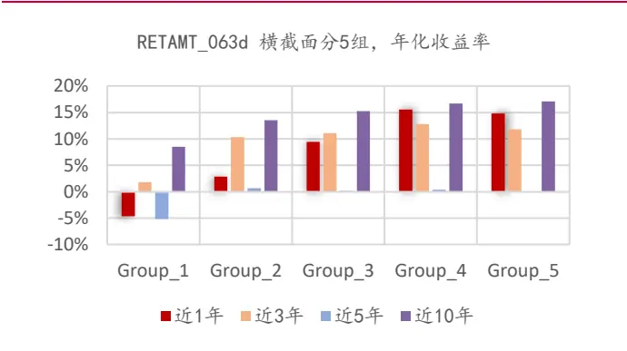
资料来源：国联证券研究所

图 10：RETAMT_126d 横截面分组年化收益率
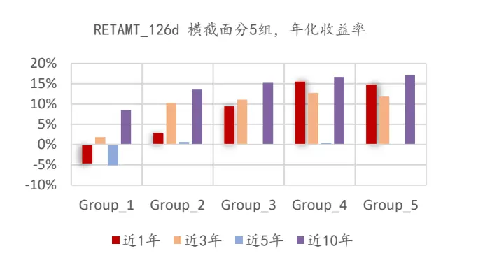
资料来源：国联证券研究所

图 11：RETAMT_252d 横截面分组年化收益率
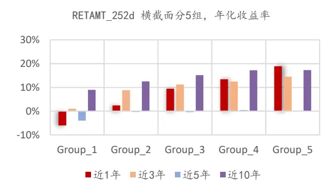
资料来源：国联证券研究所

图 12：ABSR_063d 横截面分组年化收益率
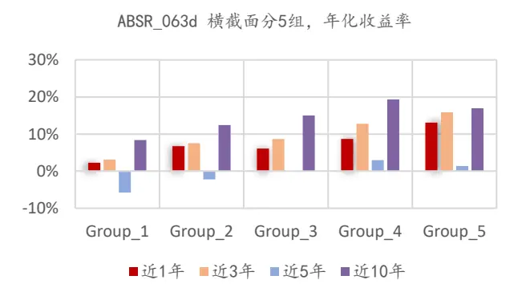
资料来源：国联证券研究所

图 13：ABSR_126d 横截面分组年化收益率
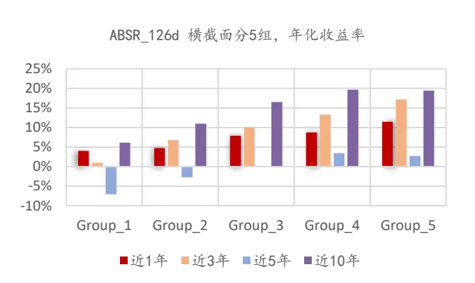
资料来源：国联证券研究所

图 14：ABSR_252d 横截面分组年化收益率
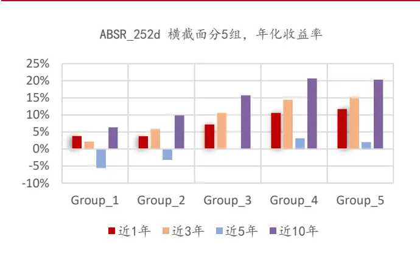
资料来源：国联证券研究所

- 分 5 组 long-short 的 PNL 和换手率

如图表 15，常见量价因子 RETAMT 的 long-short 的 PNL 时序平稳度一般。

图 15：RETAMT 各参数，横截面分 5 组，long-short 表现
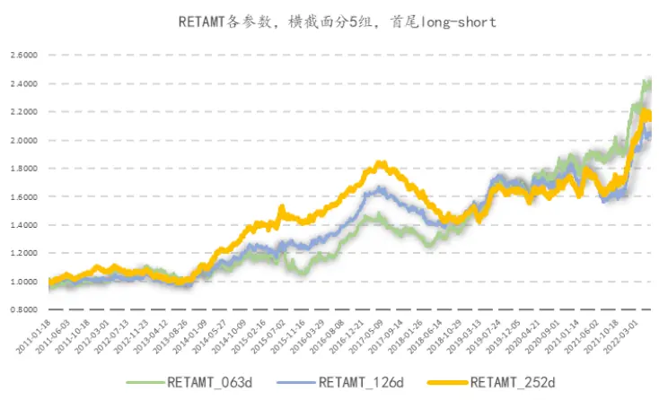
资料来源：国联证券研究所

图 16：RETAMT 各参数，long-short 每日单边换手率
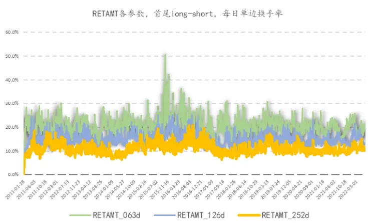
资料来源：国联证券研究所

如图表 17，机构主动资金因子 ABSR 的 long-short 的 PNL 时序平稳度明显好于常见的量价因子 RETAMT。

图 17：ABSR 各参数，横截面分 5 组，long-short 表现
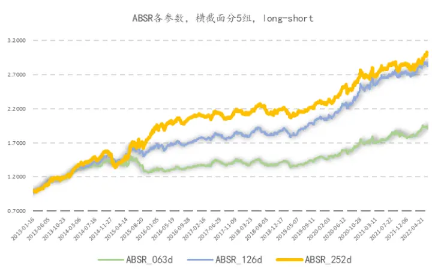
资料来源：国联证券研究所

图 18：ABSR 各参数，long-short 每日单边换手率
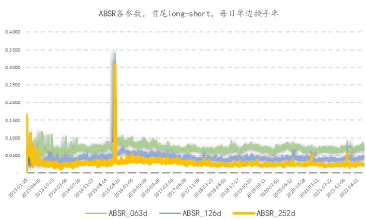
资料来源：国联证券研究所

## 因子相关性矩阵

如图表19，两类不同视角构建的因子，相关性比较低。

图 19：RETAMT、ABSR 因子各参数横截面排序值相关性矩阵
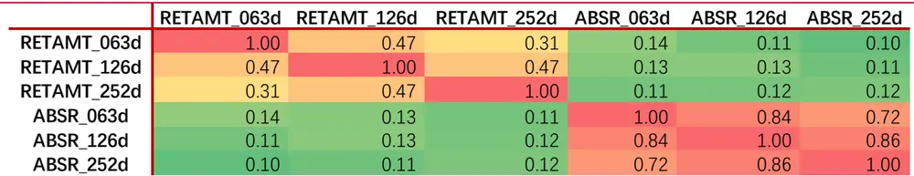
资料来源：国联证券研究所

## 因子各参数横截面升序值组合后评测

在进行因子参数遍历时，常用的方法是选取参数热力图中部的值，防止出现数据孤岛现象。但这种方式往往容易出现对每个因子进行参数选取时，出现过度优化情况，即每个因子都选参数热力图中部表现较好的点。这会导致最终的回测结果与实盘表现产生较大偏差。为了减少这种过度优化，本文参数选取采用面选取的方式而非点选取，即将一个面的参数对应的因子进行算术平均，这样可以减少优化程度。

## 单因子各参数组合方法

- 将每个参数的原始因子值进行横截面升序排序。

- 将各参数横截面升序值求横截面的算术平均，得到升序平均值。

（RETAMT、ABSR 各参数组合分别为 RETAMT 均值、ABSR 均值因子）

- 将升序平均值进行横截面分 5组统计分档收益。

- 单因子各参数组合因子横截面升序平均值的分档收益如图 20：

图 20：因子横截面升序平均值的分档收益

| RETAMT均值 近1年 近3年 近5年 |  |  |  |  |  | 近10年 |
| --- | --- | --- | --- | --- | --- | --- |
| Group_1 |  | 1.39% | -1.31% | -5.5 | 0% | 6.73% |
| Group_2 | 1.14% |  | 8.63% | -1.0 | 2% | 12.65% |
| Group_3 | 10.06% |  | 10.00% | -1.8 | 4% | 13.75% |
| Group_4 | 13.60% |  | 12.62% | 0.3 | 0% | 17.92% |
| Group_5 | 23.53% |  | 16.86% | 3.7 | 0% | 21.28% |
| ABSR均值 | 近1年 近3年 |  |  | 近5年 |  | 近10年 |
| Group_1 | 2.94% |  | 1.21% | -6.8 | 7% | 5.98% |
| Group_2 | 5.64% |  | 7.47% | -21 | 2% | 11.60% |
| Group_3 | 7.75% |  | 9.23% | -0.5 | 9% | 15.69% |
| Group_4 | 8.36% |  | 13.33% | 3.3 | 8% | 19.95% |
| Group_5 | 12.53% |  | 17.15% | 2.7 | 1% | 19.70% |

资料来源：国联证券研究所

RETAMT 均值、ABSR 均值因子，横截面分 5 组，long-short 的 PNL 如图表 21，机构主动资金ABSR均值因子平稳度明显好于常见的量价RETAMT均值因子。

图 21：RETAMT 均值、ABSR 均值因子，横截面分 5 组，long-short 表现
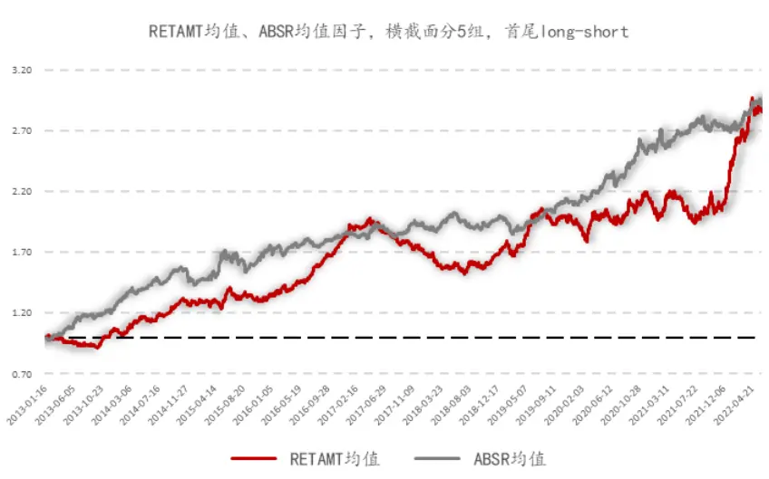
资料来源：国联证券研究所

图 22：RETAMT 均值、ABSR 均值因子，long-short 每日单边换手率
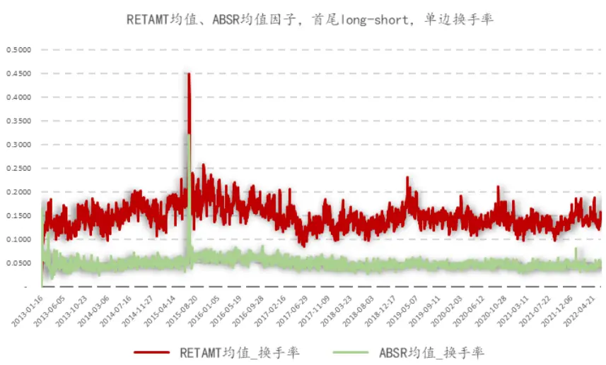
资料来源：国联证券研究所

图 23：RETAMT 均值、ABSR 均值因子横截面排序值相关性矩阵

|  | ABSR均值 RETAMT均值 |  |
| --- | --- | --- |
| ABSR均值 | 1.00 | 0.16 |
| RETAMT均值 | 0.16 | 1.00 |

资料来源：国联证券研究所

## 3 因子组合回测

通过不同宽基指数的成分股来限定股票池，进行因子组合回测，分别在中证全指数（000985.SH）、沪深 300（000300.SH）、中证 500（000905.SH）和中证 1000（000852.SH）上进行了回测。

因子的组合在不同的宽基指数上的表现有所不同，具体表现：宽基指数成分股涵盖越多，因子组合的信息比率越高，这展现出机构主动资金的快速轮动效应，以及在股票数量多的样本中区分度要好于股票数量少的样本中。例如限定股票在沪深 300指数成分股上，组合因子的信息比率很低，从行为上推断为：当机构主力资金进入沪深 300成分股后，不会形成较强的趋势效应，被机构主力资金大量买入的个股相对于沪深 300其他成分股而言，没有明显的 alpha收益。但如果将成分股扩展到中证全指上，机构主力资金流动带来的趋势效应比较明显，被机构主力资金大量买入的个股相对于中证全指其他成分股而言，有明显的 alpha收益。

将两个不同视角的单因子各参数组合后的均值因子，RETAMT均值因子和ABSR均值因子，进行逻辑组合，组合回测方式如下：

- 限定宽基指数的成分股范围。

- 将 RETAMT均值、ABSR均值因子分别再次进行横截面升序排序。

- 将 RETAMT均值升序值、ABSR 均值升序值逐日横截面分 5组。

- 买篮子：逐日取RETAMT均值升序值第 5 组和ABSR均值升序值第 5 组的交集对应的股票池。

- 卖篮子：买篮子股票的ABSR 均值升序值降为第3组以下时（含），进行卖出。

- 降频处理：得到每日的买、卖篮子后，进行周度采样降低频率。

- 手续费：双边共 2‰。

- 成交限定：次日收盘价作为成交价，去除一字涨停的买单和一字跌停的卖单。

## 3.1 中证全指股票池回测

如图表 24 所示，组合因子在中证全指上总超额收益为 206.26%，超额年化收益率为 9.16%，信息比率为0.84。整体来看，组合因子能获取超额收益，并且随着中证全指成分股数量的增加，持股数量也相应增加。从2020年以来，持股数量在1100-1400只之间，策略容量上限大。

图 24：中证全指，RETAMT 均值、ABSR 均值因子组合回测收益
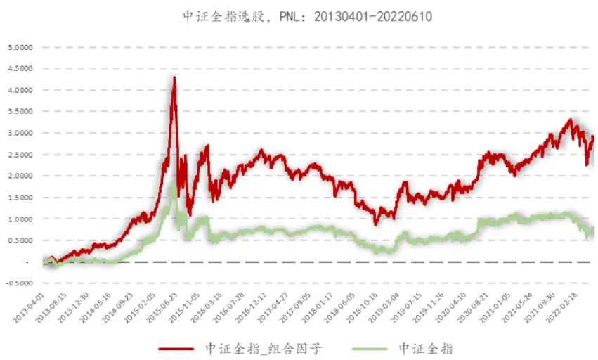

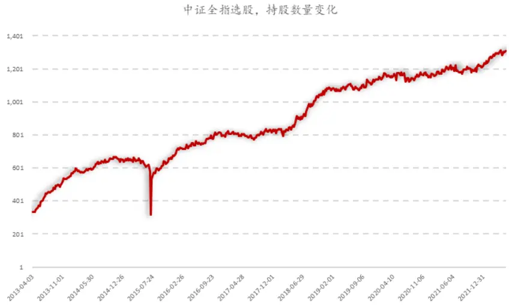

| 中证全指选股 | YTD | 近1月 | 近3月 | 近6月 | 近1年 | 近2年 | 近3年 | 近5年 | 近10年 | 总回报(9.2年) | 年化收益率 | 跟踪误差 | 信息比率 |
| --- | --- | --- | --- | --- | --- | --- | --- | --- | --- | --- | --- | --- | --- |
| 策略 | -8.64% | 8.34% | -4.66% | -4.51% | 9.47% | 34.99% | 55.36% | 25.01% | 287.18% | 287.18% | 15.79% |  |  |
| 基准 | -14.91% | 7.99% | -4.57% | -13.78% | -11.62% | 9.84% | 22.56% | 8.11% | 80.92% | 80.92% | 6.63% |  |  |
| 超额 | 6.27% | 0.35% | -0.08% | 9.26% | 21.08% | 25.15% | 32.81% | 16.90% | 206.26% | 206.26% | 9.16% | 11.49% | 0.84 |

资料来源：国联证券研究所

## 3.2 沪深 300股票池回测

如图表25所示，组合因子在沪深 300上总超额收益为29.87%，超额年化收益率为 1.87%，跟踪误差为5.27%，信息比率为 0.39。整体来看，组合因子在沪深300上获取的超额收益远少于中证全指。机构主动资金在沪深 300上的区分度远不如中证全指上，因为当机构主力资金流入到中小盘个股上时，沪深 300上的趋势效应就会明显弱化。在沪深 300上的持股数量中值约为 80只股票。

图 25：沪深 300，RETAMT 均值、ABSR 均值因子组合回测收益
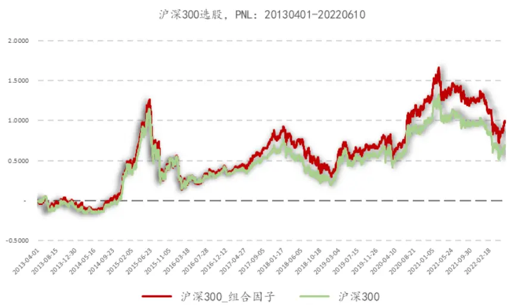

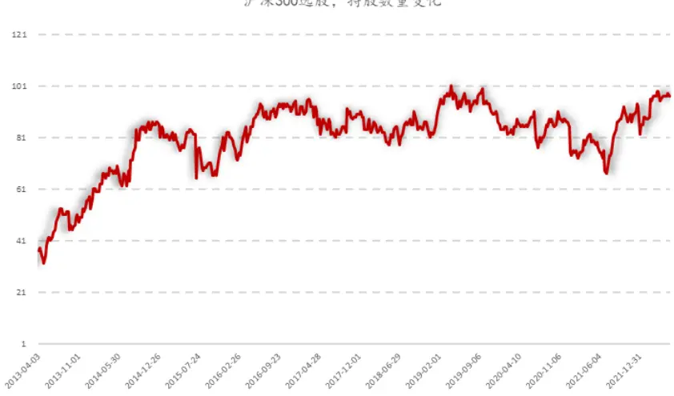

| 沪深300选股 | YTD | 近1月 | 近3月 | 近6月 | 近1年 | 近2年 | 近3年 | 近5年 | 近10年 | 总回报(9.2年) | 年化收益率 | 跟踪误差 | 信息比率 |
| --- | --- | --- | --- | --- | --- | --- | --- | --- | --- | --- | --- | --- | --- |
| 策略 | -14.15% | 8.06% | -0.65% | -10.67% | -17.91% | 13.58% | 27.80% | 32.58% | 99.77% | 99.77% | 7.78% |  |  |
| 基准 | -14.20% | 6.60% | -2.61% | -12.27% | -19.05% | 4.93% | 15.02% | 19.29% | 69.89% | 69.89% | 5.91% |  |  |
| 超额 | 0.05% | 1.46% | 1.97% | 1.60% | 1.13% | 8.65% | 12.78% | 13.29% | 29.87% | 29.87% | 1.87% | 5.27% | 0.39 |

资料来源：国联证券研究所

## 3.3 中证 500股票池回测

如图表26所示，组合因子在中证 500上总超额收益为52.03%，超额年化收益率为 2.96%，跟踪误差为4.95%，信息比率为 0.66。整体来看，组合因子在中证500上获取的超额收益远少于中证全指，但好于沪深 300。机构主动资金在中证 500上区分度的问题也和沪深 300一样，当机构主力资金大规模流出中证 500时，中证500的趋势效应就会明显弱化。在中证 500 上的持股数量中值约为130只股票。

图 26：中证 500，RETAMT 均值、ABSR 均值因子组合回测收益
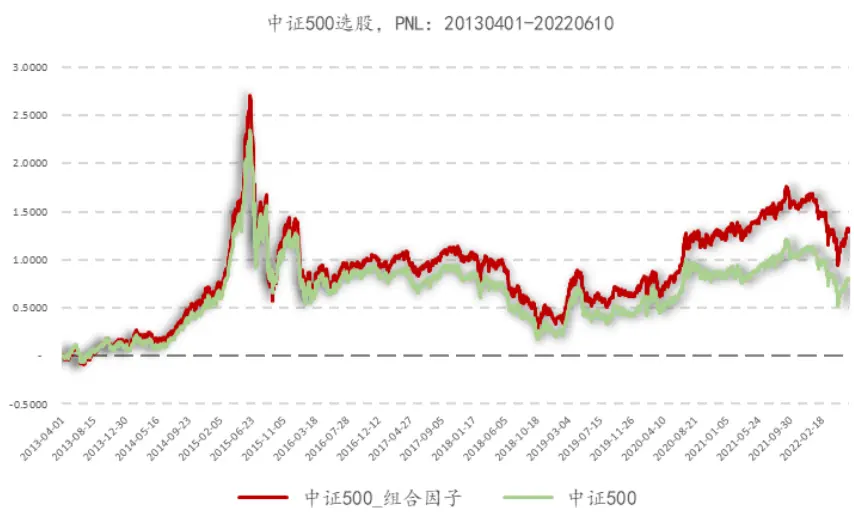

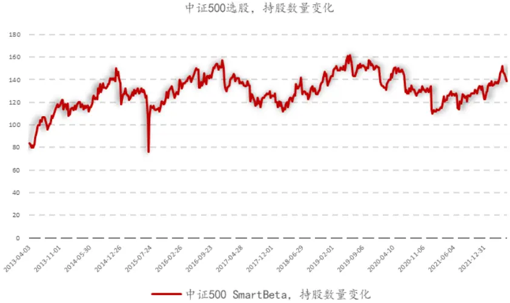

| 中证500选股 | YTD | 近1月 | 近3月 | 近6月 | 近1年 | 近2年 | 近3年 | 近5年 | 近10年 | 总回报(9.2年) | 年化收益率 | 跟踪误差 | 信息比率 |
| --- | --- | --- | --- | --- | --- | --- | --- | --- | --- | --- | --- | --- | --- |
| 策略 | -13.27% | 8.34% | -3.37% | -10.70% | -6.75% | 23.98% | 47.25% | 20.64% | 133.05% | 133.05% | 9.59% |  |  |
| 基准 | -15.21% | 8.75% | -6.30% | -13.96% | -6.77% | 11.13% | 27.93% | 3.02% | 81.02% | 81.02% | 6.64% |  |  |
| 超额 | 1.94% | -0.42% | 2.93% | 3.26% | 0.01% | 12.85% | 19.32% | 17.62% | 52.03% | 52.03% | 2.96% | 4.95% | 0.66 |

资料来源：国联证券研究所

## 3.4 中证 1000 股票池回测

如图表 27 所示，组合因子在中证 1000 上总超额收益为 80.79%，超额年化收益率为 4.39%，跟踪误差为5.71%，信息比率为 0.82。整体来看，组合因子在中证 1000上获取的超额收益依然远少于中证全指，但好于沪深 300和中证 500。机构主力资金在股票数量多的样本中区分度要好于股票数量少的样本中。在中证 1000 上的持股数量中值约为 260只股票。

图 27：中证 1000，RETAMT 均值、ABSR 均值因子组合回测收益
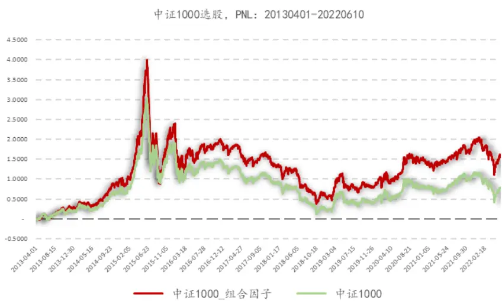

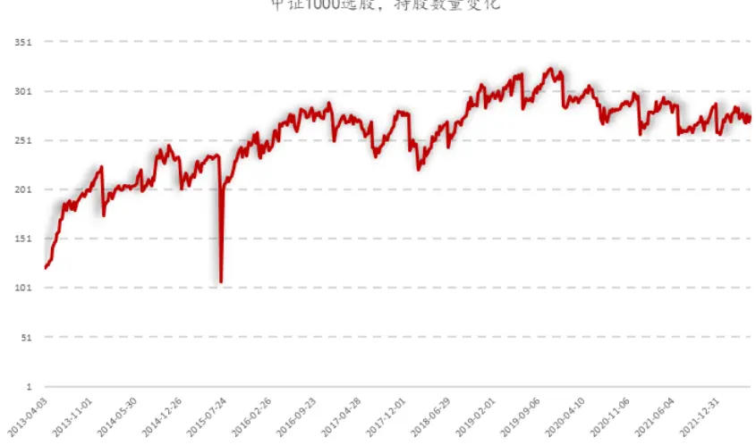

| 中证1000选股 | YTD | 近1月 | 近3月 | 近6月 | 近1年 | 近2年 | 近3年 | 近5年 | 近10年 | 总回报(9.2年) | 年化收益率 | 跟踪误差 | 信息比率 |
| --- | --- | --- | --- | --- | --- | --- | --- | --- | --- | --- | --- | --- | --- |
| 策略 | -14.74% | 8.64% | -4.79% | -12.87% | 1.50% | 21.62% | 44.53% | 3.76% | 159.32% | 159.32% | 10.87% |  |  |
| 基准 | -17.26% | 10.41% | -6.46% | -17.71% | -2.87% | 9.56% | 25.19% | -11.51% | 78.54% | 78.54% | 6.48% |  |  |
| 超额 | 2.52% | -1.76% | 1.67% | 4.85% | 4.37% | 12.06% | 19.34% | 15.27% | 80.79% | 80.79% | 4.39% | 5.71% | 0.82 |

资料来源：国联证券研究所

## 4 因子组合回测-扩大股票池指数增强

通过向更小市值的宽基指数扩充股票样本数量，来增加机构主力资金的区分度。在中证 800指数成分股中选股，做相对于沪深300指数的增强收益；在中证800指数+中证 1000 指数的成分股中选股，做相对于中证 500 指数的增强收益。如图表 25 与图表 28对比，基准为沪深300；图表26与图表 29对比，基准为中证 500。增加选股池的范围，能比较明显的增强相对于基准的收益。这表明了机构主动资金在大股票池里的选股区分度要大于小股票池。

## 4.1 沪深 300指数增强-限定中证 800 股票池

将股票池限定为中证800，组合因子相对于沪深 300总超额收益为 86.63%，超额年化收益率为 4.69%，跟踪误差为 10.97%，信息比率为 0.46。持股数量也明显提升到中值约为 230只股票。

图 28：沪深 300增强-中证 800 选股，因子组合回测收益
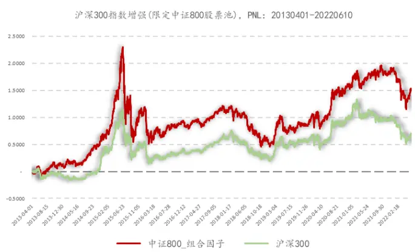

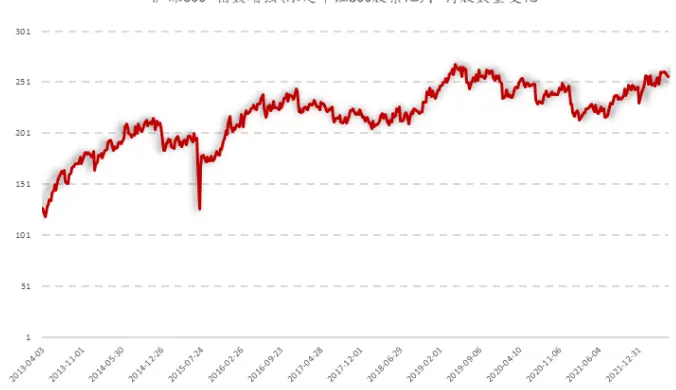

| 沪深300 指数增强 (限定中证800股票池) | YTD | 近1月 | 近3月 | 近6月 | 近1年 | 近2年 | 近3年 | 近5年 | 近10年 | 总回报(9.2年) | 年化收益率 | 跟踪误差 | 信息比率 |
| --- | --- | --- | --- | --- | --- | --- | --- | --- | --- | --- | --- | --- | --- |
| 策略 | -12.99% | 8.31% | -1.65% | -9.77% | -9.52% | 22.14% | 44.37% | 31.91% | 153.53% | 153.53% | 10.60% |  |  |
| 基准 | -14.20% | 6.60% | -2.61% | -12.27% | -19.05% | 4.93% | 15.02% | 19.29% | 69.89% | 69.89% | 5.91% |  |  |
| 超额 | 1.20% | 1.70% | 0.97% | 2.50% | 9.53% | 17.21% | 29.35% | 12.62% | 83.63% | 83.63% | 4.69% | 10.97% | 0.46 |

资料来源：国联证券研究所

## 4.2 中证 500 指数增强-限定中证 800+中证 1000 股票池

将股票池限定为中证 800+中证 1000，组合因子相对于中证 500 总超额收益为109.80%，超额年化收益率为 5.62%，跟踪误差为 5.86%，信息比率为 0.98。持股数量提升到中值约为 500只股票。

图 29：中证 500增强-中证 800+中证 1000 选股，因子组合回测收益
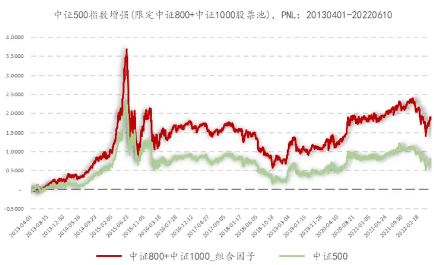

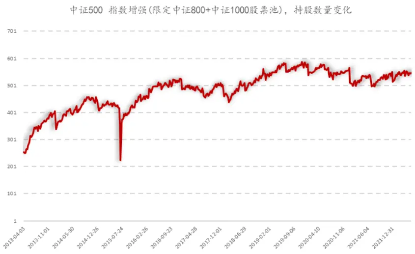
资料来源：国联证券研究所

| 中证500指数增强 (限定中证800+ 中证1000股票池） | YTD | 近1月 | 近3月 | 近6月 | 近1年 | 近2年 | 近3年 | 近5年 | 近10年 | 总回报(9.2年) | 年化收益率 | 跟踪误差 | 信息比率 |
| --- | --- | --- | --- | --- | --- | --- | --- | --- | --- | --- | --- | --- | --- |
| 策略 | -14.41% | 8.57% | -3.26% | -12.30% | -4.76% | 20.77% | 43.03% | 15.27% | 190.82% | 190.82% | 12.25% |  |  |
| 基准 | -15.21% | 8.75% | -6.30% | -13.96% | -6.77% | 11.13% | 27.93% | 3.02% | 81.02% | 81.02% | 6.64% |  |  |
| 超额 | 0.80% | -0.18% | 3.03% | 1.66% | 2.00% | 9.65% | 15.09% | 12.25% | 109.80% | 109.80% | 5.62% | 5.86% | 0.98 |

## 5 Barra 归因分析

## 5.1 中证全指股票池回测-收益归因

如图表30和图表31，中证全指股票池的相对收益分解来看。机构主动资金长期在行业因子没有明显暴露，其更青睐追逐风格带来的收益。风格因子分解可以看出，机构主动资金因子长期对市值因子有显著的正向暴露。

图 30：中证全指_组合因子，相对收益分解
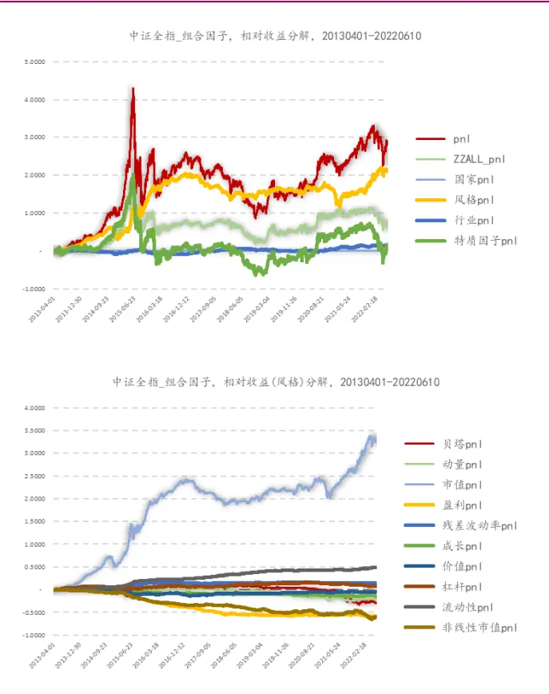
资料来源：国联证券研究所

图 31：中证全指_组合因子,相对收益(风格)分解
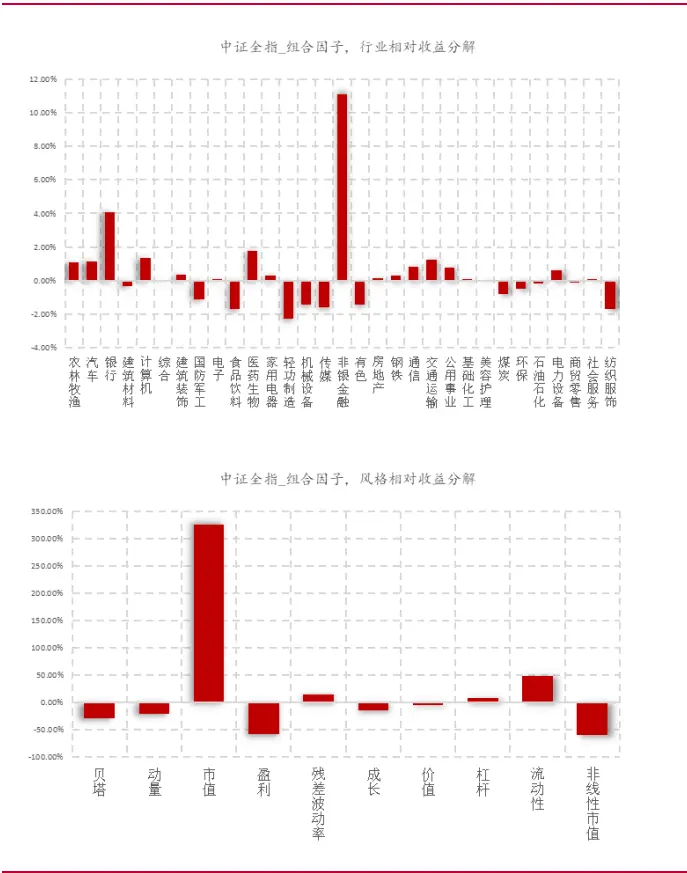
资料来源：国联证券研究所

图 32：中证全指_组合因子，股票池流通市值
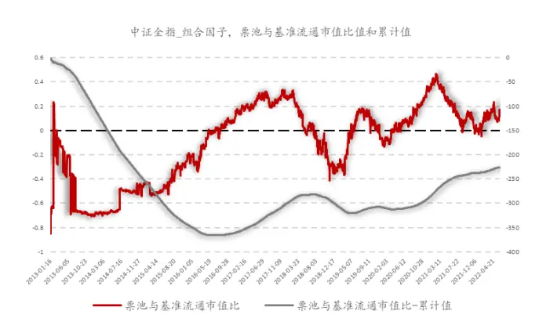
资料来源：国联证券研究所

图 33：中证全指_组合因子，股票池换手率
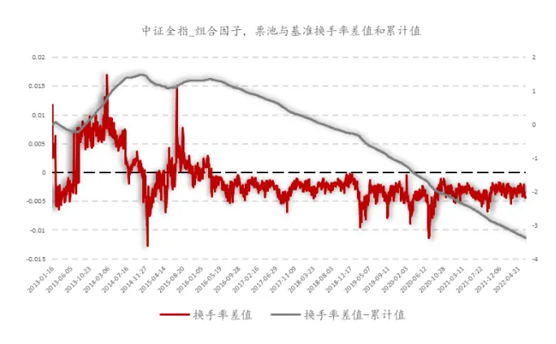
资料来源：国联证券研究所

## 5.2 沪深 300股票池选股-收益归因

如图表 34、图表 35，在沪深 300 股票池上，行业因子贡献几乎为零，机构主动资金在大市值股票池中，几乎没有 alpha 贡献。如图表 36、图表 37，因子选出来的股票池和沪深 300成分股相比，总市值平均更大、换手率平均更低。

图 34：沪深 300_组合因子，相对收益分解
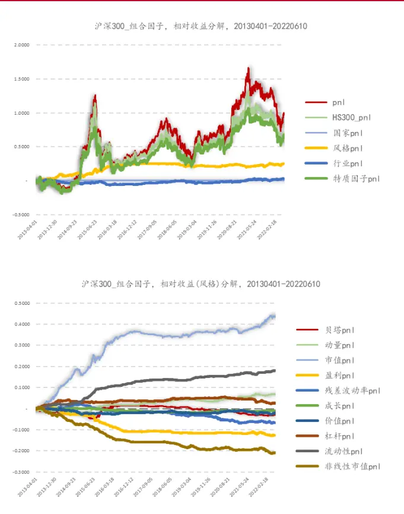
资料来源：国联证券研究所

图 35：沪深 300_组合因子,相对收益(风格)分解
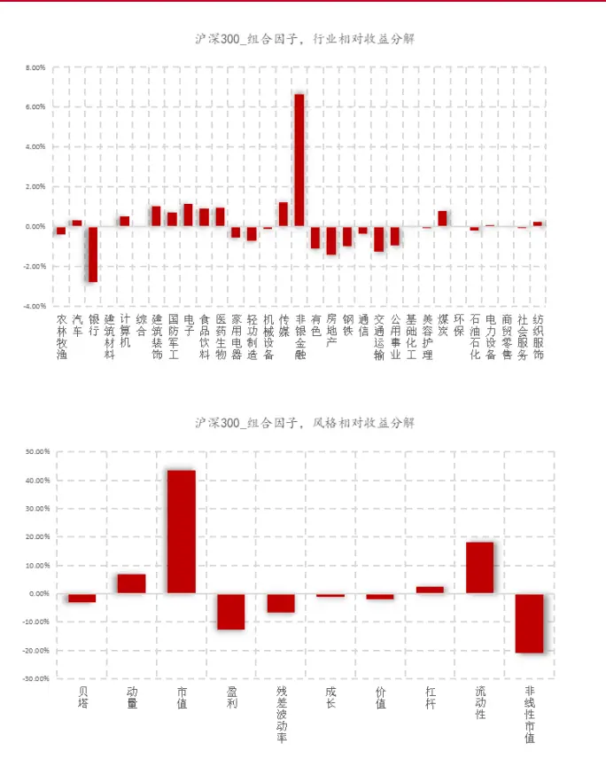
资料来源：国联证券研究所

图 36：沪深 300_组合因子，股票池流通市值
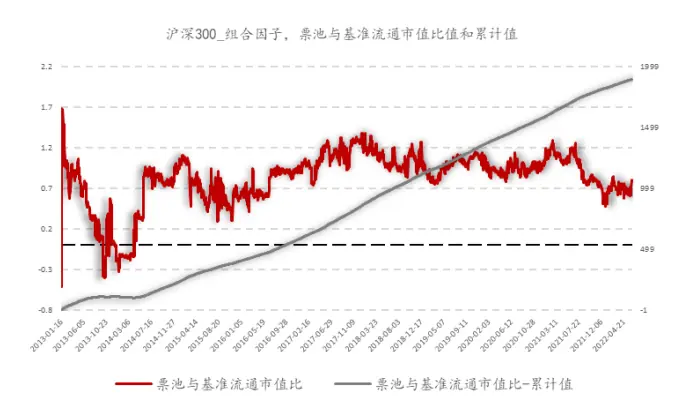
资料来源：国联证券研究所

图 37：沪深 300_组合因子，股票池换手率
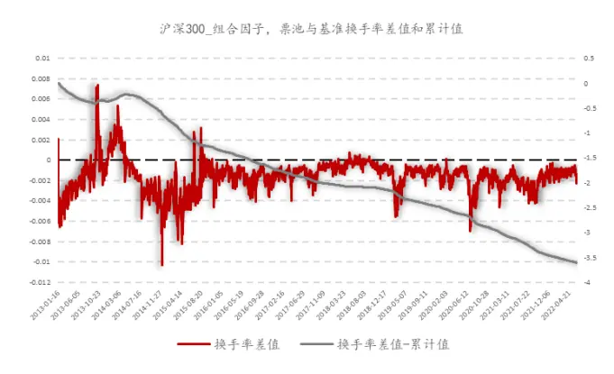
资料来源：国联证券研究所

## 5.3 中证 500股票池选股-收益归因

如图表 38、图表 39，在中证 500 股票池上，行业因子没有明显影响。在风格暴露上，机构主动资金是偏好市值因子，相对收益上流动性风格因子贡献了非常稳定的正向收益，但从图表 41 中看出，机构主动资金因子选出来的股票相对于中证 500 来说并没有明显的流动性差异。

图 38：中证 500_组合因子，相对收益分解
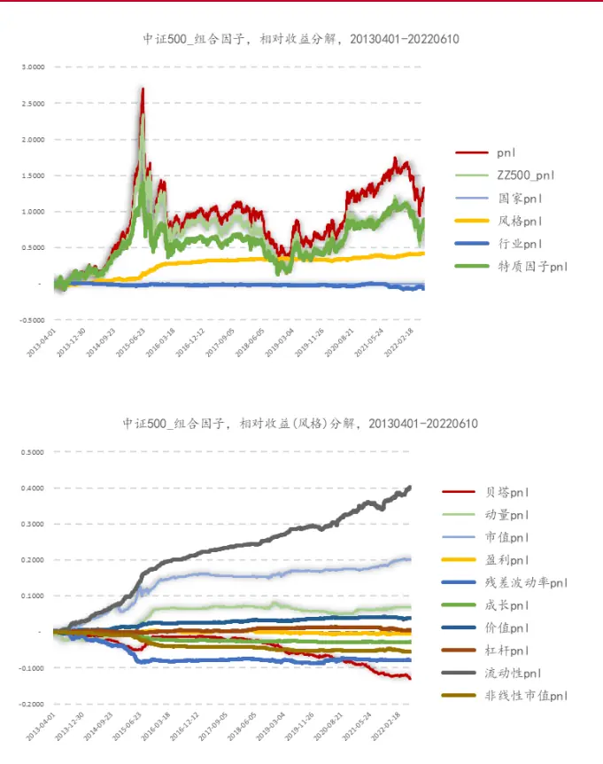
资料来源：国联证券研究所

图 39：中证 500_组合因子,相对收益(风格)分解
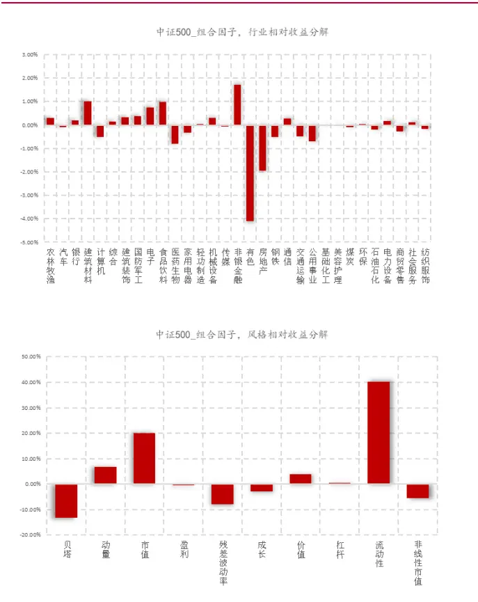
资料来源：国联证券研究所

图 40：中证 500_组合因子，股票池流通市值
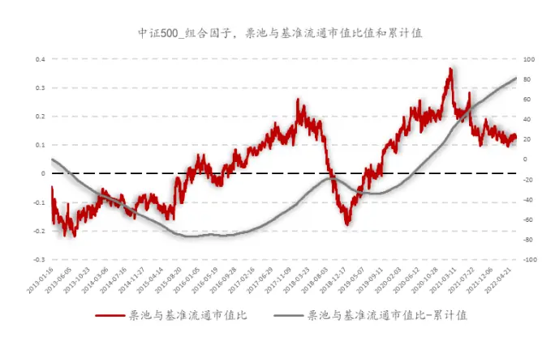
资料来源：国联证券研究所

图 41：中证 500_组合因子，股票池换手率
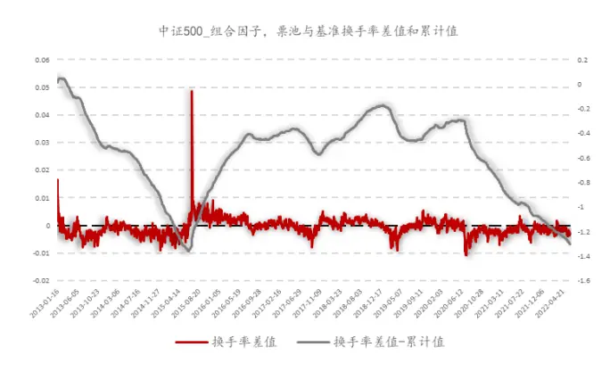
资料来源：国联证券研究所

## 5.4 中证 1000 股票池选股-收益归因

如图表 42、图表 43，在中证 1000 股票池上，机构主动资金的表现和中证 500股票池上类似。在风格暴露上，机构主动资金偏好市值因子，相对收益上流动性风格因子同样贡献了非常稳定的正向收益。

图 42：中证 1000_组合因子，相对收益分解
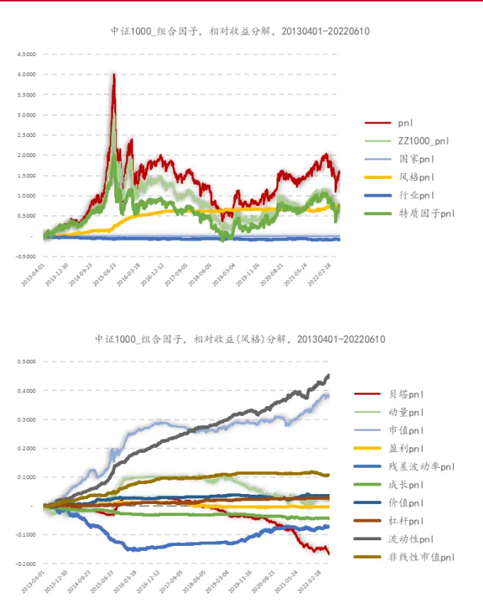
资料来源：国联证券研究所

图 43：中证 1000_组合因子,相对收益(风格)分解
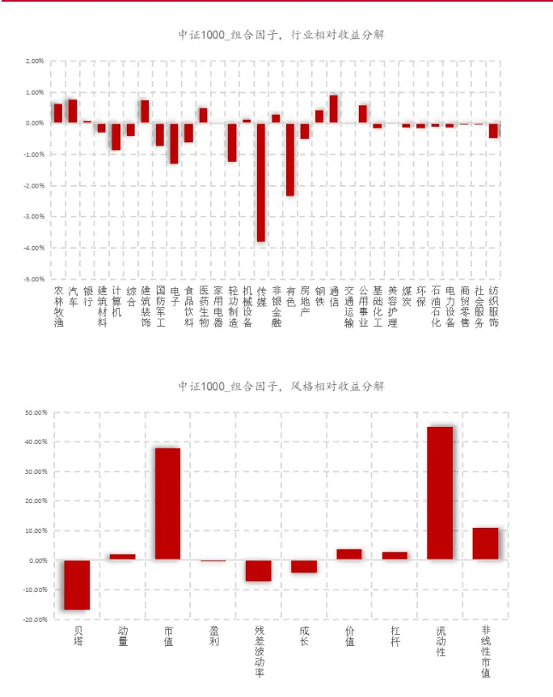
资料来源：国联证券研究所

图 44：中证 1000_组合因子，股票池流通市值
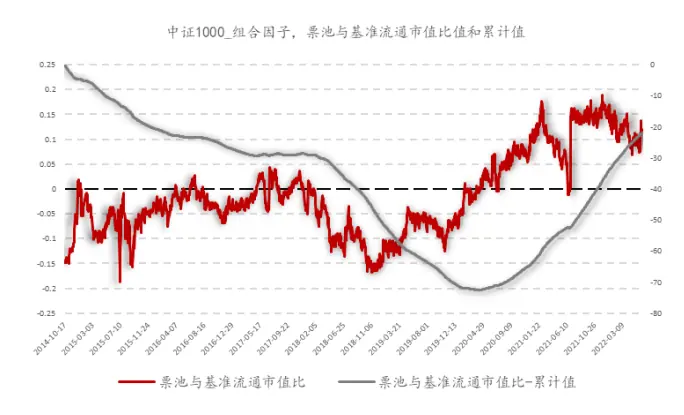
资料来源：国联证券研究所

图 45：中证 1000_组合因子，股票池换手率
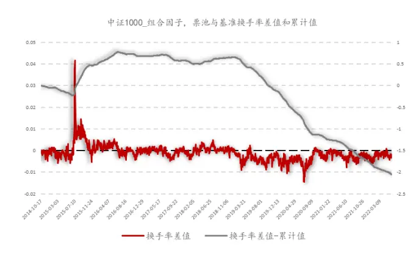
资料来源：国联证券研究所

## 5.5 沪深 300指数增强-收益归因

如图表 46、图表 47，在中证 800 股票池上相对于沪深 300 的基准，行业因子有较少的相对收益贡献。在风格上，绝对收益和相对收益都展现明显的正向暴露市值因子，负向暴露非线性市值因子。如图表 49，在中证 800 股票池上，机构主动资金因子选出来的股票相对于中证 800指数，流动性更好。

图 46：沪深 300增强_组合因子，相对收益分解
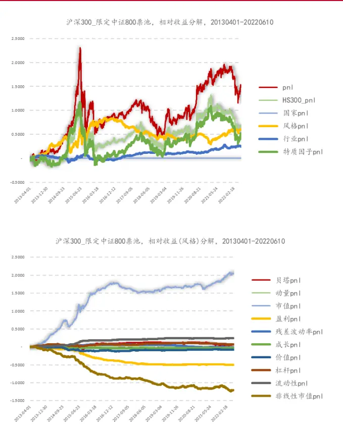
资料来源：国联证券研究所

图 47：沪深 300增强_组合因子，相对收益(风格)分解
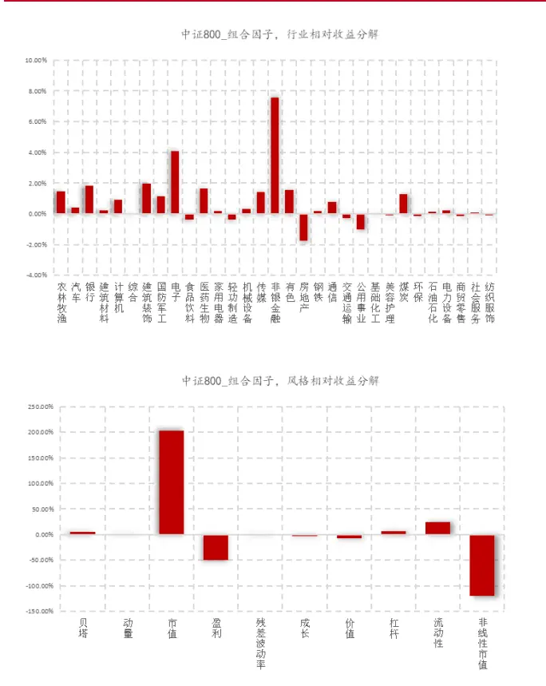
资料来源：国联证券研究所

图 48：中证 800_组合因子，股票池流通市值

资料来源：国联证券研究所

图 49：中证 800_组合因子，股票池换手率

资料来源：国联证券研究所

## 5.6 中证 500指数增强-收益归因

如图表 50、图表 51，在中证 800+中证 1000 股票池上相对于中证 500 的基准，行业因子贡献几乎为零。在风格上，相对收益展现明显的正向暴露市值因子，相对收益上非线性市值因子也是正向暴露的。如图表 53，在中证 800+中证 1000 股票池上，机构主动资金因子选出来的股票相对于 1800只股票，流动性更好。

图 50：中证 500增强_组合因子，相对收益分解

资料来源：国联证券研究所

图 51：中证 500增强_组合因子，相对收益(风格)分解

资料来源：国联证券研究所

图 52：中证 800+中证 1000_组合因子，股票池流通市值
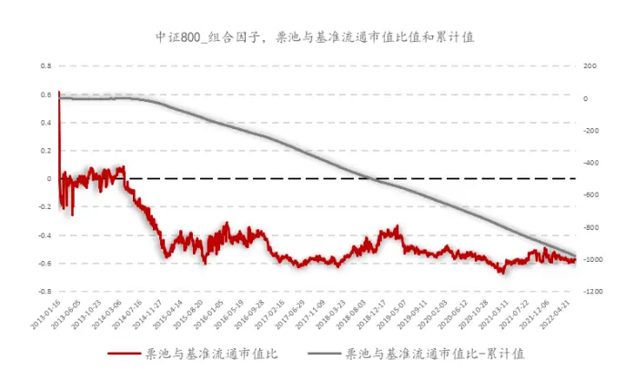
资料来源：国联证券研究所

图 53：中证 800+中证 1000_组合因子，股票池换手率
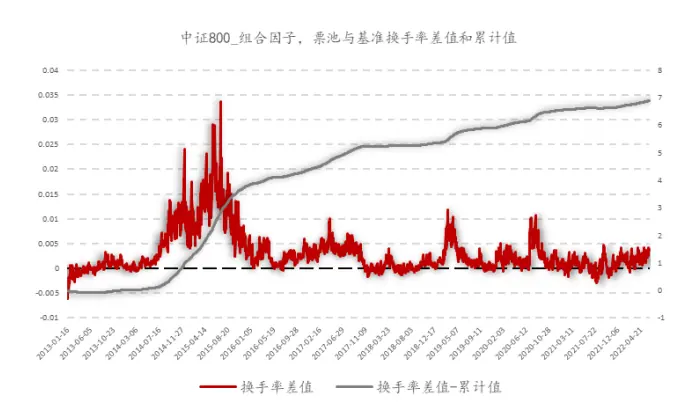
资料来源：国联证券研究所

## 6 总结

## 6.1 A股市场行情数据、交易情况

A 股市场自成立来股票数量不断增加，日成交额也同步增加。如中证全指(000985.SH)，在2015年大牛市时，日成交额一度出现历史最高值 2万亿以上，之后成交额急剧下降，直到 2019 年初开始震荡式的回升。疫情后市场资金宽松，再次出现连续多个交易日全市场日成交额达到1万亿规模以上的情况。

中证全指(000985.SH)的总市值和流通市值逐年同步平稳上升，而换手率从 2015年下降后，长期较为平稳。股票数量从 2011 年的 1800 多只增加到 2022 年的 4200多只，增加近 2400 多只。但个股平均总市值，长期处于 200 亿的均值附近。全市场总市值的增长，更多的是由股票增发所贡献的，而个股平均总市值的贡献比较小。

## 6.2 机构主动资金因子构建和回测

通过逐笔数据刻画机构主动资金，构建一个机构主动资金因子 ABSR，构建一个常见的量价因子 RETAMT。对不同视角的两个因子逐个进行了因子评测、单因子各参数数值组合、两因子的逻辑组合。

对组合后的因子，分别在中证全指、沪深 300、中证 500 和中证 1000 股票池里面进行回测。在中证全指上的收益增强表现较好，总超额收益为 206.26%，超额年化收益率为 9.16%，信息比率为0.84，持股数量也随着中证全指成分股的增加而相应增加。从 2020年以来，持股数量在 1100-1400只之间，策略容量上限大。

因子的组合在不同的宽基指数上的表现有所不同，具体表现：宽基指数成分股涵盖越多，因子组合的信息比率越高，这展现出机构主动资金的快速轮动效应，以及在股票数量多的样本中区分度要好于股票数量少的样本中。例如限定股票在沪深 300指数成分股上，组合因子的信息比率很低，从行为上推断为：当机构主力资金进入沪深 300成分股后，不会形成较强的趋势效应，被机构主力资金大量买入的个股相对于沪深 300其他成分股而言，没有明显的 alpha收益。但如果将成分股扩展到中证全指上，机构主力资金流动带来的趋势效应比较明显，被机构主力资金大量买入的个股相对于中证全指其他成分股而言，有明显的alpha收益。

## 6.3 组合因子 Barra 归因分析

在中证全指、沪深 300、中证 500 和中证 1000 不同股票池里面，行业因子的整体贡献很少。在风格因子上，机构主动资金偏好在市值因子上长期正向的暴露。在每个限定的股票池上，大盘股偏多的股票池里，组合因子选取来的股票池相对基准的换手率偏低。在中小盘股票多的股票池里，组合因子选出来的股票池相对于基准的换手率偏高。这表明在大盘股中，机构主动资金更多的是一个配置的需求，风格切换少。在中小盘股中，机构主动资金会追求风格的轮动和切换。

## 7 风险提示

本报告基于历史数据进行测试，历史回测结果不代表未来收益。未来市场风格可能发生切换。

实盘交易执行时产生的交易结果与回测的结果会有差异，请充分考虑实盘产生的交易滑点。

## 分析师声明

本报告署名分析师在此声明：我们具有中国证券业协会授予的证券投资咨询执业资格或相当的专业胜任能力，本报告所表述的所有观点均准确地反映了我们对标的证券和发行人的个人看法。我们所得报酬的任何部分不曾与，不与，也将不会与本报告中的具体投资建议或观点有直接或间接联系。

## 评级说明

| 投资建议的评级标准 |  | 评级 说明 |  |
| --- | --- | --- | --- |
| 报告中投资建议所涉及的评级分为股票评级和行业评 | 股票评级 | 买入 | 相对同期相关证券市场代表指数涨幅20%以上 |
| 级（另有说明的除外）。评级标准为报告发布日后6 到12个月内的相对市场表现，也即：以报告发布日后 |  | 增持 | 相对同期相关证券市场代表指数涨幅介于5%~20%之间 |
| 的6到12个月内的公司股价（或行业指数）相对同期 |  | 持有 | 相对同期相关证券市场代表指数涨幅介于-10%~5%之间 |
| 相关证券市场代表性指数的涨跌幅作为基准。其中：A 股市场以沪深300指数为基准，新三板市场以三板成 |  |  | 相对同期相关证券市场代表指数跌幅10%以上 |
| 指（针对协议转让标的）或三板做市指数（针对做市 | 行业评级 | 卖出 |  |
| 转让标的）为基准；香港市场以摩根士丹利中国指数 为基准；美国市场以纳斯达克综合指数或标普500指 |  | 强于大市 | 相对同期相关证券市场代表指数涨幅10%以上 |
| 数为基准；韩国市场以柯斯达克指数或韩国综合股价 |  | 中性 | 相对同期相关证券市场代表指数涨幅介于-10%~10%之间 |
| 指数为基准。 |  | 弱于大市 | 相对同期相关证券市场代表指数跌幅10%以上 |

## 一般声明

除非另有规定，本报告中的所有材料版权均属国联证券股份有限公司（已获中国证监会许可的证券投资咨询业务资格）及其附属机构（以下统称“国联证券”）。未经国联证券事先书面授权，不得以任何方式修改、发送或者复制本报告及其所包含的材料、内容。所有本报告中使用的商标、服务标识及标记均为国联证券的商标、服务标识及标记。

本报告是机密的，仅供我们的客户使用，国联证券不因收件人收到本报告而视其为国联证券的客户。本报告中的信息均来源于我们认为可靠的已公开资料，但国联证券对这些信息的准确性及完整性不作任何保证。本报告中的信息、意见等均仅供客户参考，不构成所述证券买卖的出价或征价邀请或要约。该等信息、意见并未考虑到获取本报告人员的具体投资目的、财务状况以及特定需求，在任何时候均不构成对任何人的个人推荐。客户应当对本报告中的信息和意见进行独立评估，并应同时考量各自的投资目的、财务状况和特定需求，必要时就法律、商业、财务、税收等方面咨询专家的意见。对依据或者使用本报告所造成的一切后果，国联证券及/或其关联人员均不承担任何法律责任。

本报告所载的意见、评估及预测仅为本报告出具日的观点和判断。该等意见、评估及预测无需通知即可随时更改。过往的表现亦不应作为日后表现的预示和担保。在不同时期，国联证券可能会发出与本报告所载意见、评估及预测不一致的研究报告。

国联证券的销售人员、交易人员以及其他专业人士可能会依据不同假设和标准、采用不同的分析方法而口头或书面发表与本报告意见及建议不一致的市场评论和/或交易观点。国联证券没有将此意见及建议向报告所有接收者进行更新的义务。国联证券的资产管理部门、自营部门以及其他投资业务部门可能独立做出与本报告中的意见或建议不一致的投资决策。

## 特别声明

在法律许可的情况下，国联证券可能会持有本报告中提及公司所发行的证券并进行交易，也可能为这些公司提供或争取提供投资银行、财务顾问和金融产品等各种金融服务。因此，投资者应当考虑到国联证券及/或其相关人员可能存在影响本报告观点客观性的潜在利益冲突，投资者请勿将本报告视为投资或其他决定的唯一参考依据。

## 版权声明

未经国联证券事先书面许可，任何机构或个人不得以任何形式翻版、复制、转载、刊登和引用。否则由此造成的一切不良后果及法律责任有私自翻版、复制、转载、刊登和引用者承担。

## 联系我们

无锡：江苏省无锡市太湖新城金融一街 8号国联金融大厦 9层

上海：上海市浦东新区世纪大道 1198号世纪汇广场 1座 37层

电话：0510-82833337

电话：021-38991500

传真：0510-82833217

传真：021-38571373

北京：北京市东城区安定门外大街 208号中粮置地广场 4层

深圳：广东省深圳市福田区益田路 6009号新世界中心 29层

电话：010-64285217

电话：0755-82775695

传真：010-64285805