nInfo] [Table_Title] 2022.07.28

# 高频量价策略不等于躺着赚钱

陈奥林(分析师)

刘昺轶(分析师)

8 021-38674835

021-38677309

chenaolin@gtjas.com

liubingyi@gtjas.com

证书编号 S0880516100001

S0880520050001

## 本报告导读：

本报告尝试解读三个问题。1. 量价模型是否存在同质化问题？2. 如何构建一个量价模型？3. 量价模型的收益来源及风险点。

le_Summary]我们挑选了 10 家量化私募，其指增产品超额收益自 2021 年起相关性中位数高达 0.6，远高于公募量化指增超额相关性中位数，后者仅为0.4，说明量化私募模型存在高度同质化的可能。

我们采用机器学习的方法，分别使用三组完全不同的机器挖掘特征组，预测不同尺度下的股票收益，并针对不同股票池构建多空组合。发现各组合在样本外的表现呈现高度相似性，扣费后的回撤期与量化指增产品的超额回撤期类似，这进一步增加了量价模型存在高度同质化的可能性。

最后我们对量价模型的样本外组合进行分析，发现其在中信一级行业是未获取显著超额收益，在风格上的暴露也大都呈现周期性。除此之外，我们发现有两点值得注意：1. 量价模型长期在流动性因子上保持负向敞口，且在 2021 年 8 月达到极值，随后呈现周期性走势，恰恰对应了量价模型扣费后的回撤期。2. 市值因子和动量因子的暴露情况十分接近，且均维持较大的正向暴露。

经过分析我们认为市值敞口与流动性敞口的差值若处于高位，此时量价模型倾向于持有流动性差的大市值股票，存在微观交易结构恶化的可能性，模型也将会迎来超额回撤阶段。

- 风险提示：本结论基于历史统计与量化模型，存在历史规律与量化模型失效的风险。

金融工程

## 金融工程团队：

陈奥林：（分析师）

电话：021-38674835

邮箱：chenaolin@gtjas.com

证书编号：S0880516100001

杨能：（分析师）

电话：021-38032685

邮箱：yangneng@gtjas.com

证书编号：S0880519080008

## 殷钦怡：（分析师）

电话：021-38675855

邮箱：yinqinyi@gtjas.com

证书编号：S0880519080013

## 徐忠亚：（分析师）

电话：021- 38032692

邮箱：xuzhongya@gtjas.com

证书编号：S0880519090002

## 刘昺轶：（分析师）

电话：021-38677309

邮箱：liubingyi@gtjas.com

证书编号：S0880520050001

## 赵展成：（研究助理）

电话：021-38676911邮箱：Zhaozhancheng@gtjas.com证书编号：S0880120110019

## 张烨垲：（研究助理）

电话：021-38038427

邮箱：zhangyekai@gtjas.com

证书编号：S0880121070118

## 徐浩天：（研究助理）

电话：021-38038430

邮箱：xuhaotian@gtjas.com

证书编号：S0880121070119

## [Table_Re相关报告

钢铁行业基本面量化及策略配置 2022.07.28 煤炭行业基本面量化及策略配置 2022.07.27 极致成长策略重回高地，“跟着基金抄作业” 收益回归 2022.07.23

基于三因子的中证 1000 指数增强 2022.07.21多重因素利好小盘成长风格，中证 1000指数配置正当时 2022.07.20

## 1. 引言

回顾近两年的市场，头部私募量化指增产品历经 2021 年 9 月开始的超额回撤，直至 2022 年 2 月底企稳反弹，平均回撤将近 10%。这不禁让我们联想到2021年初的蓝筹白马抱团瓦解，2022年初的新能源股崩溃，两者的原因均为赛道股过于拥挤导致筹码结构恶化，最终只能通过大幅回撤消化前期的过热行情。

众所周知，头部私募量化指增产品多为多因子模型，其中量价因子占主导比例，既然蓝筹白马、新能源股能成为一种市场风格，那么通过大量量价因子构建的交易曲线又何尝不能成为一种市场风格呢？

本文的主要工作分为三点：

1. 量价模型是否存在同质化问题？

2. 如何构建一个量价模型？

3. 量价模型的收益来源及风险点。

通过以上工作，不仅可能帮助我们增强收益，也能更好地理解市场风险，及量价模型的适用环境。

## 2. 量价模型是否存在同质化问题？

谈到风格，大部分投资者脑中的概念无非是成长或者价值，或者说某些赛道板块。更进一步，在量化选股领域里特指，有长期收益，但波动较大的因子，如动量、盈利、波动、流动性或市值等。但归根结底，我们认为风格实际上指投资者倾向于趋同交易所参考的特征。简单来说，如果投资者总喜欢按照某一个概念或指标对一篮子股票进行交易，那么这个概念或指标可被称为风格。

我们在 年 月对当时的蓝筹白马行情进行了风格分析，惊人的发现，当时的基金超额收益与所谓的价值，盈利，质量等因子收益并不呈现高相关性，而是与长期动量因子收益呈现极高的相关性。长期时序相关性为 0.42，2017 年至 2021 年相关性高达 0.7，事后证明这的确是由资金主导的趋同交易导致的市场现象。

图 1 普通股票型基金指数超额收益与动量因子收益相关性较高
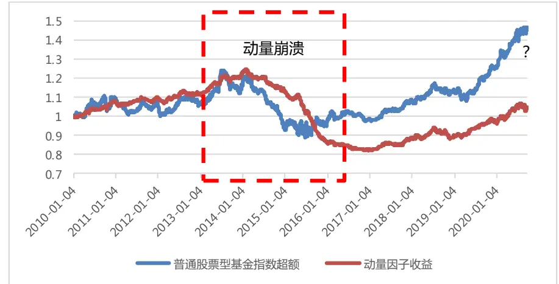
数据来源：WIND，国泰君安证券研究

同样的，如果量价因子主导的量化私募存在趋同交易，其必定在净值上存在较高的相关性。我们在下图中列举了 10 家量化私募的中证 500 指增产品相对于中证 500 指数的超额收益相关性矩阵图，统计时间范围为2021 年 1 月至 2022 年 7 月，其中相关性中位数为0.60。

图 2 私募量化指增超额相关性高企

|  | XO | X1 | X2 | X3 | X4 | X5 | X6 | X7 | X8 | X9 |
| --- | --- | --- | --- | --- | --- | --- | --- | --- | --- | --- |
| XO | 1 | 0.59 | 0.69 | 0.6 | 0.67 | 0.64 | 0.44 | 0.51 | 0.59 | 0.65 |
| X1 | 0.59 | 1 | 0.4 | 0.57 | 0.53 | 0.5 | 0.38 | 0.42 | 0.34 | 0.32 |
| X2 | 0.69 | 0.4 | 1 | 0.75 | 0.76 | 0.53 | 0.65 | 0.61 | 0.86 | 0.72 |
| X3 | 0.6 | 0.57 | 0.75 | 1 | 0.64 | 0.43 | 0.47 | 0.62 | 0.68 | 0.53 |
| X4 | 0.67 | 0.53 | 0.76 | 0.64 | 1 | 0.63 | 0.57 | 0.46 | 0.71 | 0.67 |
| X5 | 0.64 | 0.5 | 0.53 | 0.43 | 0.63 | 1 | 0.42 | 0.38 | 0.5 | 0.48 |
| X6 | 0.44 | 0.38 | 0.65 | 0.47 | 0.57 | 0.42 | 1 | 0.45 | 0.63 | 0.49 |
| X7 | 0.51 | 0.42 | 0.61 | 0.62 | 0.46 | 0.38 | 0.45 | 1 | 0.54 | 0.43 |
| X8 | 0.59 | 0.34 | 0.86 | 0.68 | 0.71 | 0.5 | 0.63 | 0.54 | 1 | 0.68 |
| X9 | 0.65 | 0.32 | 0.72 | 0.53 | 0.67 | 0.48 | 0.49 | 0.43 | 0.68 | 1 |

数据来源：朝阳永续，WIND，国泰君安证券研究

下图为其超额累计收益情况，可以发现走势的确高度趋同。

图 3 私募量化指增超额走势趋同
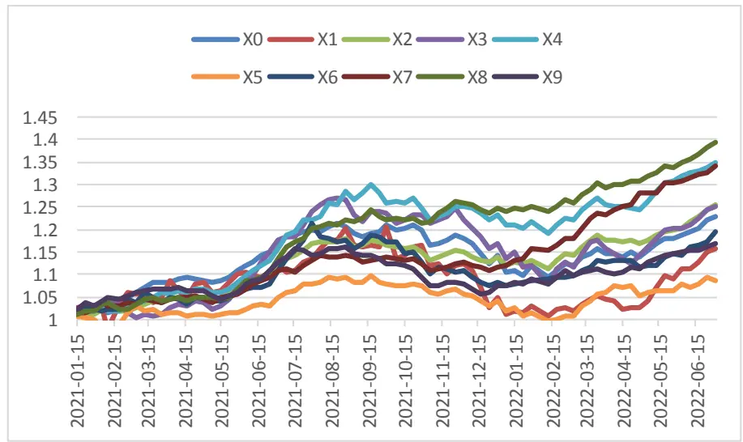
数据来源：朝阳永续，WIND，国泰君安证券研究

为了作对比，我们也统计了公募量化指增超额相关性的情况。我们选取了 10 家规模靠前的公募中证 500 指增产品进行统计，其超额收益时序相关性图如下图所示，其相关性中位数仅为 0.4。

图 4 公募量化指增超额相关性不高

|  | X0 | X1 | X2 | X3 | X4 | X5 | X6 | X7 | X8 | X9 |
| --- | --- | --- | --- | --- | --- | --- | --- | --- | --- | --- |
| XO | 1 | 0.47 | 0.33 | 0.52 | 0.7 | 0.4 | 0.61 | 0.76 | 0.45 | 0.35 |
| X1 | 0.47 | 1 | 0.46 | 0.26 | 0.31 | 0.26 | 0.44 | 0.51 | 0.4 | 0.27 |
| X2 | 0.33 | 0.46 | 1 | 0.24 | 0.15 | 0.23 | 0.51 | 0.44 | 0.58 | 0.21 |
| X3 | 0.52 | 0.26 | 0.24 | 1 | 0.52 | 0.16 | 0.35 | 0.57 | 0.35 | 0.31 |
| X4 | 0.7 | 0.31 | 0.15 | 0.52 | 1 | 0.4 | 0.38 | 0.71 | 0.3 | 0.25 |
| X5 | 0.4 | 0.26 | 0.23 | 0.16 | 0.4 | 1 | 0.32 | 0.32( | 0.23 | 0.2 |
| X6 | 0.61 | 0.44 | 0.51 | 0.35 | 0.38 | 0.32 | 1 | 0.62 | 0.64 | 0.34 |
| X7 | 0.76 | 0.51 | 0.44 | 0.57 | 0.71 | 0.32 | 0.62 | 1 | 0.59 | 0.38 |
| X8 | 0.45 | 0.4 | 0.58 | 0.35 | 0.3 | 0.23 | 0.64 | 0.59 | 1 | 0.19 |
| X9 | 0.35 | 0.27 | 0.21 | 0.31 | 0.25 | 0.2 | 0.34 | 0.38 | 0.19 | 1 |

数据来源：WIND，国泰君安证券研究

再逐一对照公募对私募指增超额的相关性，发现平均呈现 0.3 左右的情况，说明公募指增整体模型并不趋同且与私募相关性较低。

图 5 公募量化指增超额与私募指增超额相关性较低
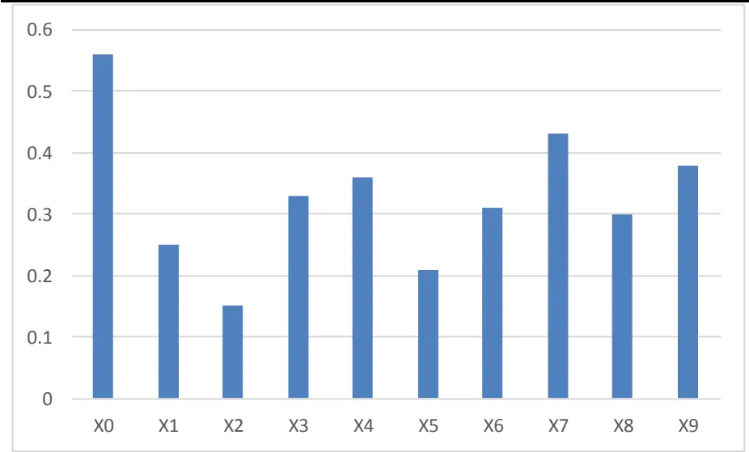
数据来源：朝阳永续，WIND，国泰君安证券研究

容易得知的是，公募量化由于交易及换手率的限制，必然不能大规模采用量价因子构建组合，而是倾向于采用更多的基本面因子，所以其超额相关性与私募量化较低。而私募整体相关性较高，说明其必然采用类似的选股架构，所以会导致一定程度上的趋同交易，在超额收益上体现为较大的波动性和周期性，历经半年的回撤期后，10 家私募中仅有 3 家的超额收益创出新高。

可以预见的是，随着私募量化指增的规模趋稳回升，大部分量价因子主导的选股模型必然呈现类风格的表现，而非稳定 alpha，即量价风格开始存在，且会长期存在，投资者应放低预期，将其当作风格指数进行配置。

## 3. 如何构建一个量价模型？

通过公开信息以及我们自身的研究经验，我们可以将现存量化选股模型总结如下。分别为使用线性加权的传统模型，使用非线性模型进行收益预测的机器学习模型，以及直接端到端的深度神经网络模型。这三个框架大体上都是遵循 Data Mining，Feature Selection，Prediction 的技术路线，区别还是在于使用的技术不同。

图 6 量化选股模型框架异同
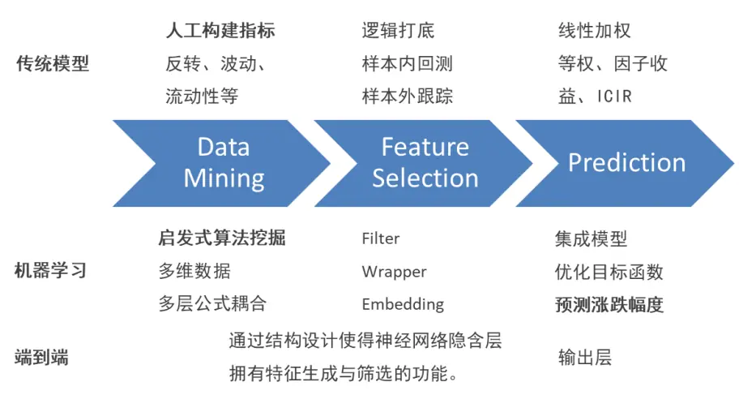
数据来源：国泰君安证券研究

限于硬件水平和技术实力，本文不适用端到端的预测模型。为了避免任何可能的未来数据导致的前视偏差，亦不使用任何人工因子，只使用样本内的数据进行机器挖掘生成量价类因子。

## 3.1. Data Mining

本节主要介绍使用遗传规划算法生成量价类因子，由于我们之前已经写过类似报告，故重复内容不再赘述，这里主要介绍部分细节及相关优化算法。

遗传规划算法的本质是更为高效的暴力符号搜索，所以一切算法的优化都需注重于提升挖掘速度，目的是在尽可能短的时间内找到合适数量的特征去充分表达样本空间。这里我们一共使用三个优化算法去加速特征挖掘的速度。

## 3.1.1. Beam Search

我们通过观察发现，高适应度因子的父代往往也是高适应度因子，初始种群质量对后续进化影响较大。因子挖掘场景下，我们找的往往是单个随机种子下的局部最优解，所以为了加快收敛，可以在轮盘赌的基础上采取BeamSearcℎ算法提升初代种群质量，进一步加速。

BeamSearcℎ算法本质是一种贪心算法，具体做法为：

计初始种群数量为n，首次产生n∗k个个体，再挑选适应度前n的个体作为初始种群

图 7 Beam Search 算法示意图
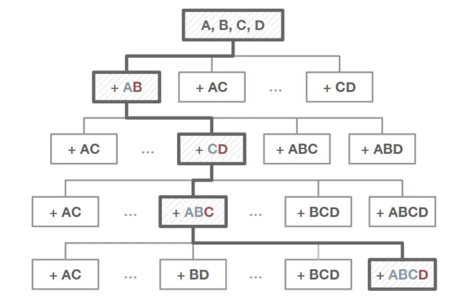
数据来源：KDD2019《AutoCross: Automatic Feature Crossing for Tabular Data inReal-World Applications》

## 3.1.2. PCA-Similarity

对于预测问题来说，产生多个低相关的因子不仅能提升预测能力，还能减少过拟合风险。对于遗传规划来说，即我们需要保持种群多样性，防止算法进入局部最优。在实际挖掘过程中，我们会挖掘到大量形式类似的高适应度因子，然而这不仅对提升整体预测能力作用有限，还浪费大量算力，所以有必要对这种现象进行限制。

常见的做法是更改适应度函数，加入相应惩罚项进行约束。然而这种方式对惩罚系数较为敏感，过小的惩罚系数导致约束力度不足，过大的惩罚系数会导致适应度函数偏离原有的初衷，挖掘不到有效因子，且复杂的适应度函数会大幅提升计算成本，拖累挖掘进度。

我们对于高于相关性阈值的因子，进行适应度最小化处理，防止出现过多同类因子。然而伴随即存因子数量的增加，相关性计算开销大幅提高。传统因子截面为n∗T的面板数据，其中n为标的数量，T为时间序列长度。若我们共有p个因子，则计算所有因子两两之间相关系数的计算复杂度为O(npT)。而PCA算法的计算复杂度仅为 $O(nT+n^{2})$ ，所以可以先对原因子进行PCA降维，再计算相关性，可将整体的计算复杂度降到O(pT)，提高挖掘速度。

图 8 PCA-Similarity 算法示意图
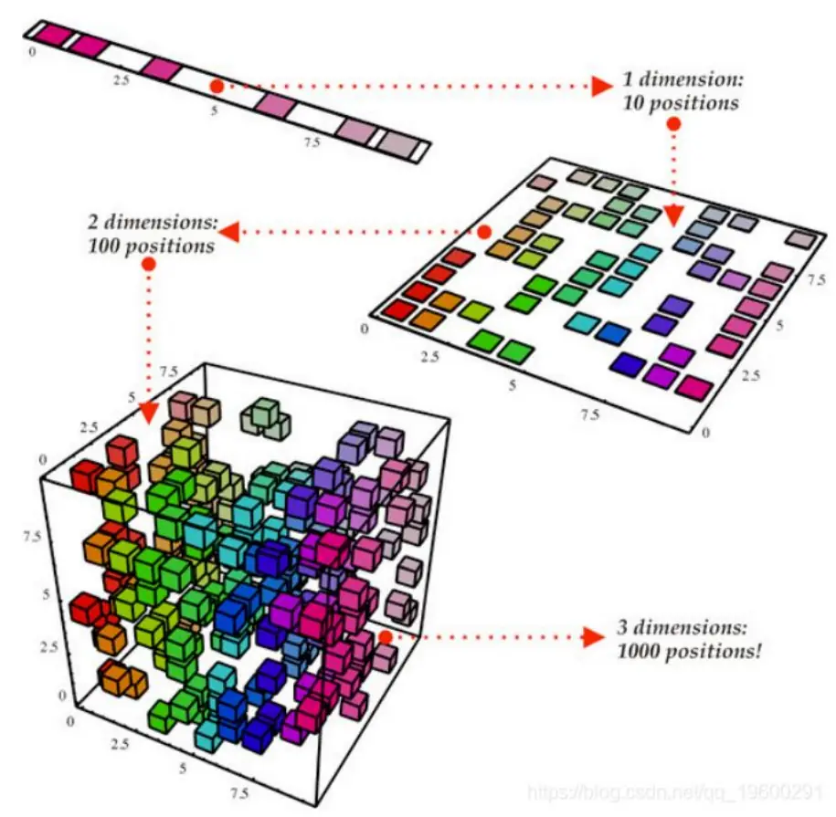
数据来源：tecdat.cn

PCA-Similarity 算法的核心思想还是对原始因子矩阵进行降维，通过牺牲一定的计算精度，提升整体挖掘速度。

## 3.1.3. Family Competition

在上一节中我们采用的方法为直接在挖掘过程中通过约束条件进行硬性限制，现在我们不光要求特征在统计上呈现低相关，且在形式上也呈现低相关，本节使用通过Family Competition算法维系种群基因多样性。

图 9 Family Competition 算法示意图
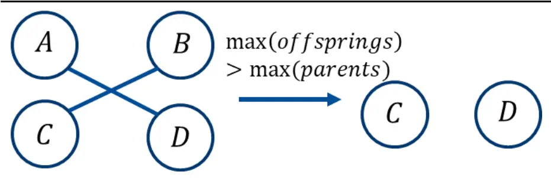
数据来源：国泰君安证券研究

在因子挖掘过程中，我们发现部分低相关因子的父代相同，长期计算后，可能导致某个根部基因占据整个种群。从而使得其余基因丧失繁衍机会。Family Competition 算法原理较为简单，即在种群竞争的基础上添加家庭内部竞争，每次交叉繁衍后，若两个子代的适应度最大值高于父代中适应度最大值，则将父代剔除，使得该根部基因的数量得到控制。

## 3.2. Feature Selection

在上一节中，我们使用 2019 年初至 2020 年底，共计两年的股票交易数据进行特征挖掘。为了避免路径依赖的随即种子的问题，共挖掘 3 组因子，数量分别为 125，125，128，分别对未来 1 天，3 天，5 天的平均收益进行预测。

我们在特征挖掘的过程中使用了 Filter 技术，除此之外，为了避免前视误差，不进行任何人工筛选，只使用集成模型进行自动筛选。

图 10 T1 特征相关性分布
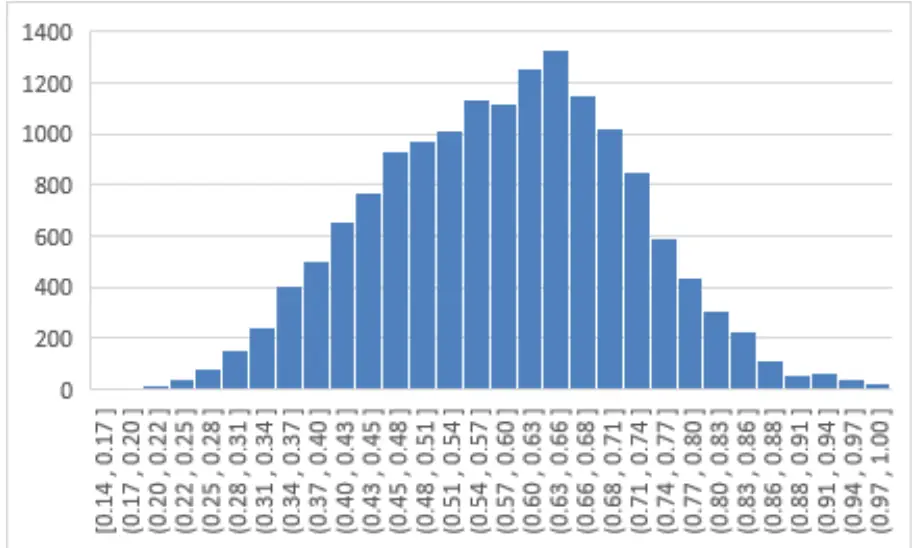
数据来源：WIND，国泰君安证券研究

图 11 T3 特征相关性分布
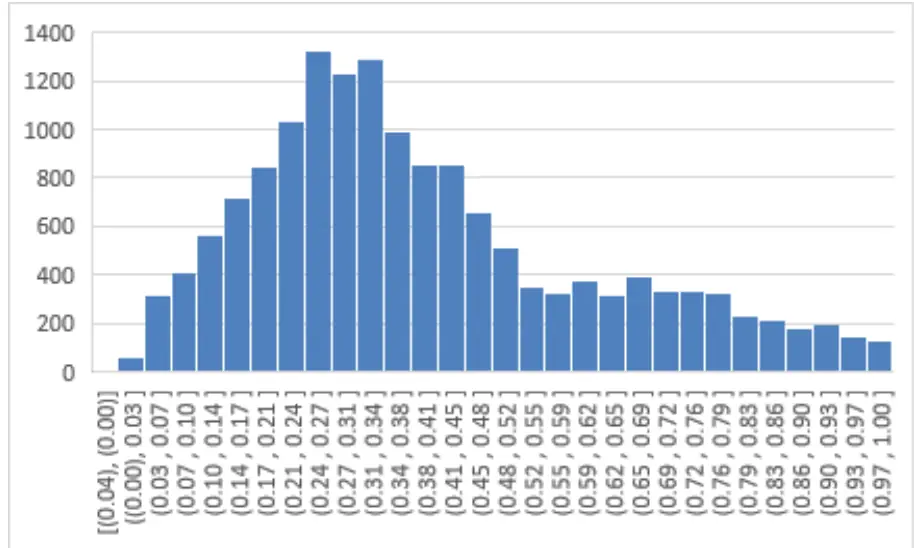
数据来源：WIND，国泰君安证券研究

图 12 T5 特征相关性分布
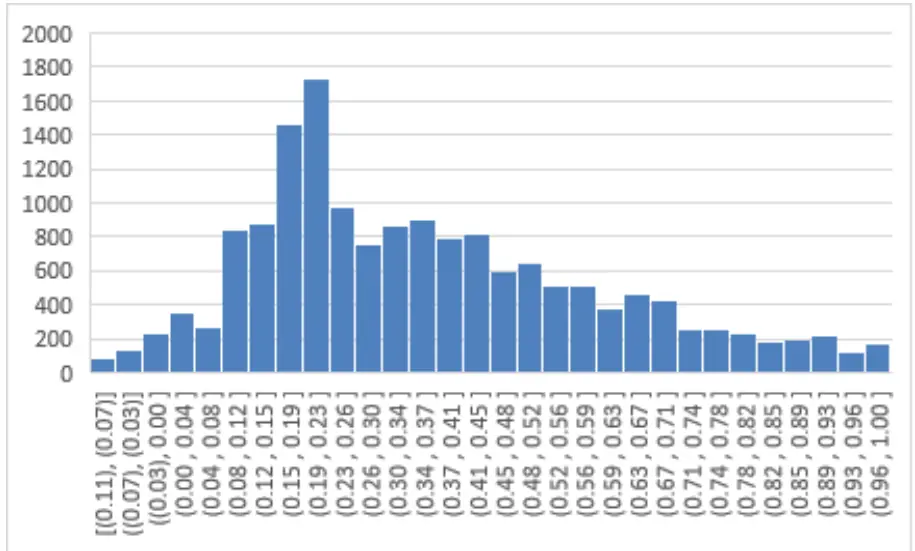
数据来源：WIND，国泰君安证券研究

上图分别为 3 个特征组各自的全时序相关性分布情况，由于挖掘时设置的相关性阈值较宽，因子数量较少，并未呈现稳定的分布状态，但这可为后续预测环节的鲁棒性提供对比验证。

## 3.3. Prediction

我们在上一节中通过2019年初至2020年底的股票交易数据挖掘得到三个特征组，本节将采用机器学习的方法对以上特征组进行合成并最终实现收益预测。

传统线性框架中对多因子的合成往往采用线性加权，如等权，因子收益加权，ICIR 加权等，优势为一定的可解释性，可以清晰的将股票收益进行分解。随着技术发展，不少对冲基金均采用机器学习的方法对因子进行合成，通过对历史数据的训练，希望能挖掘到更多的因子潜力。

图 13 机器学习下的因子合成框架
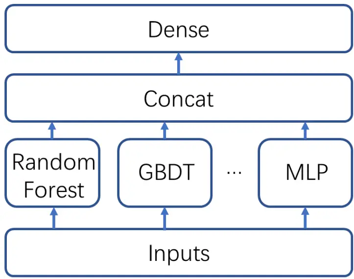
数据来源：国泰君安证券研究

本节采用 Kaggle 比赛常用的集成模型对三个特征组合分别进行合成，并预测不同周期下的股票收益，基模型为随机森林，GBDT 以及神经网络。具体合成结构如下图所示，采用多个基模型的好处是和而不同，减小样本外的过拟合风险，从而变相增强样本外的预测能力。

## 3.3.1. 样本外预测表现

下图展示的是不同预测尺度下，不同股票池及不同预测方法下的样本外多空收益，此处以全天 vwap 价格计价，暂未考虑手续费，仅考察预测能力。

1. 中证 800+中证 1000+集成模型

2. 沪深 300+集成模型

3. 中证 800+中证 1000+等权模型

图 14T+1 样本外预测能力（对数轴）
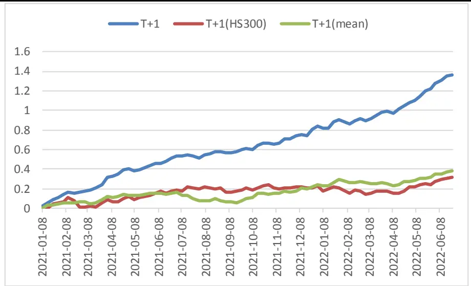
数据来源：WIND，国泰君安证券研究

图 15T+3 样本外预测能力（对数轴）
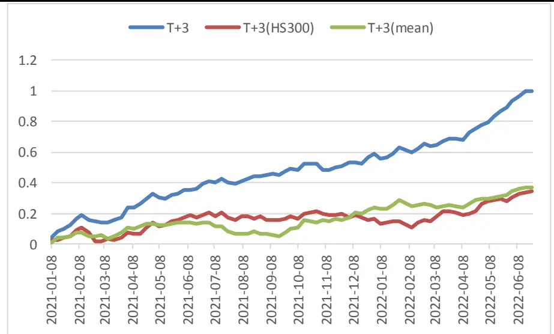
数据来源：WIND，国泰君安证券研究

图 16T+5 样本外费后结果（对数轴）
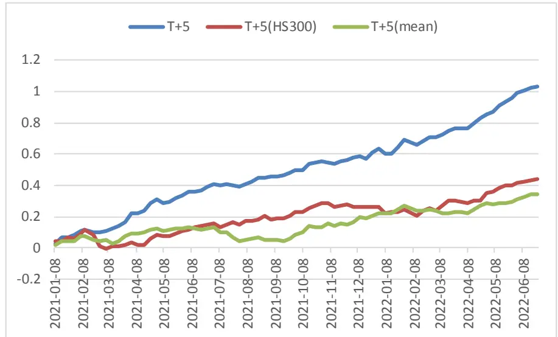
数据来源：WIND，国泰君安证券研究

可以发现，在不考虑交易费用的前提下，使用集成模型获得的预测结果远优于等权模型。且在不同特征集，不同预测尺度下均获得了稳定结果，在沪深 300 股票池中也有不错表现，说明这一技术路线是足够鲁棒的。

## 3.3.2. 样本外费后结果

众所周知，量价因子在拥有稳定 alpha 预测能力的同时也存在高换手率的弊病，本节结果展示了扣费后的多空收益。由于我们以全天 vwap 价格交易，所以暂时不考虑滑点，双边手续费以 1.2‰计。

图 17 ZZ800+ZZ1000 样本外预测能力（对数轴）
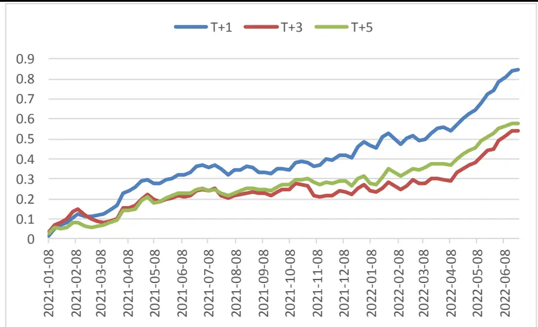
数据来源：WIND，国泰君安证券研究

可以发现在 ZZ800+ZZ1000 的股票池中，样本外预测在扣费后依然有不错的绩效，且 T+1 高频换手的绩效优于 T+3及 T+5，这符合我们对量价模型的认知。

然而沪深 300 的股票池中，样本外预测在扣费后甚至产生了明显的负向收益，与上一节中扣费前的表现截然相反，说明此模型在样本外的预测能力无法覆盖高度换手带来的手续费损耗。与此同时，我们也发现，在沪深 300 成分股中，更长周期的预测尺度是优于短周期尺度的，这一点无论在费前还是费后都是如此，说明沪深 300 股票池中有更强的动量效应，这一点和我们之前的研究成果也是契合的。

图 18 HS300 样本外费后结果（对数轴）
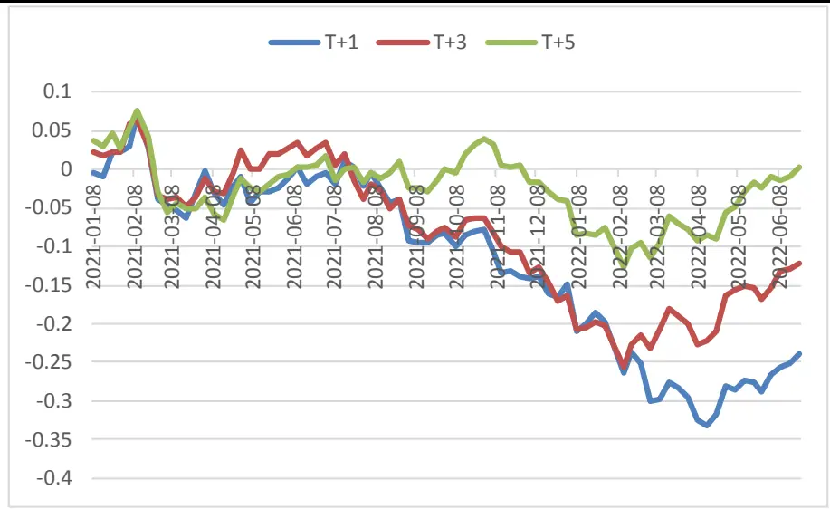
数据来源：WIND，国泰君安证券研究

## 3.3.3. 策略改进

考虑到手续费带来的损耗，本节尝试仅交易预测值超过截面 95%分为个股。可以发现，沪深 300 股票池中样本外表现得到明显改善，说明模型对两端个股有更强的预测能力。

图 19 HS300 样本外费后改进结果（对数轴）
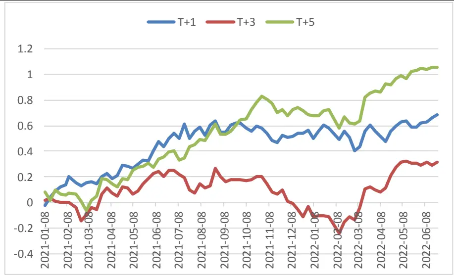
数据来源：WIND，国泰君安证券研究

## 4. 量价模型的收益来源及风险点

本节分别从行业及风格暴露上分析样本外量价模型的收益来源及相关风险点。

## 4.1. 行业收益

我们使用个股所属中信一级行业代替其本身重新计算样本外收益，可以发现，不同频度下，不同特征组的量价模型均无法获取持续、稳定且显著的行业收益，并呈现类似的周期性。

图 20 量价模型样本外行业收益（对数轴）
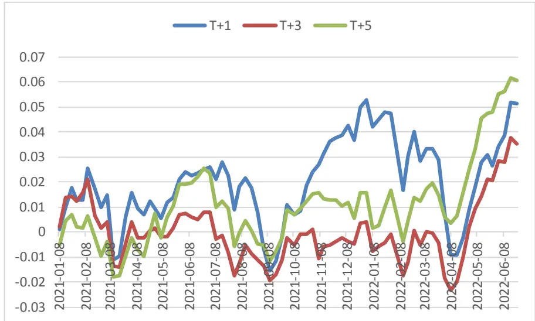
数据来源：WIND，国泰君安证券研究

## 4.2. 风格暴露

接下来观察样本外组合的风格暴露情况，我们发现，大部分风格呈现周期性暴露，整体风格暴露加总敞口接近于 0。

图 21 量价模型样本外风格暴露
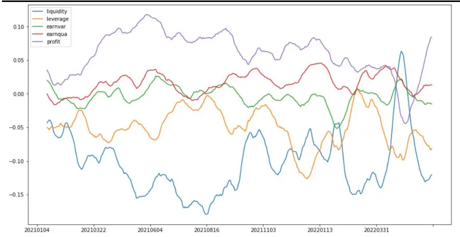
数据来源：WIND，国泰君安证券研究

图 22 量价模型样本外风格暴露
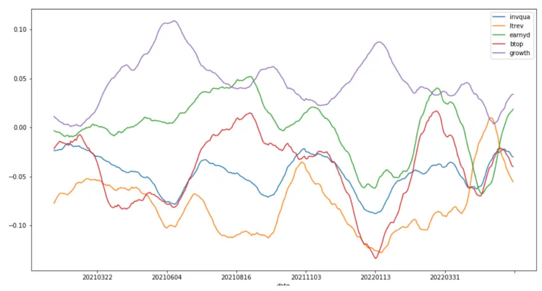
数据来源：WIND，国泰君安证券研究

图 23 量价模型样本外风格暴露
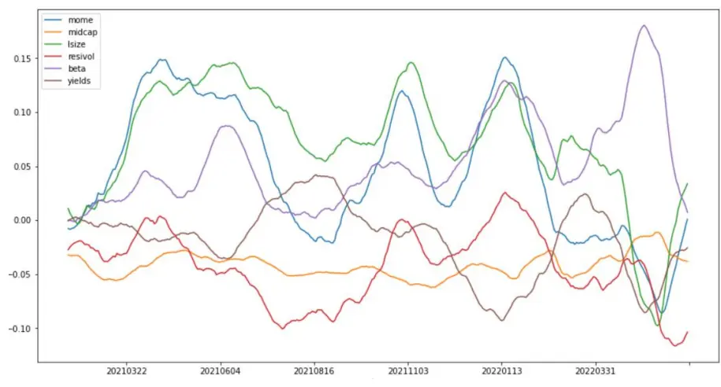
数据来源：WIND，国泰君安证券研究

基于风格暴露分析，我们发现有两点值得注意：

1. 量价模型长期在流动性因子上保持负向敞口，且在 2021年 8 月达到极值，随后呈现周期性走势，恰恰对应了量价模型扣费后的回撤期。

2. 市值因子和动量因子的暴露情况十分接近，且均维持较大的正向暴露。

由于我们的模型完全使用 2021 年初之前的数据进行训练，参考过去的行情，对应的恰好是机构化程度提升的阶段，市值和动量走强的阶段。量价模型在这两个因子上进行正向暴露时完全可以理解的。

其次如果我们将市值暴露和流动性暴露做差，可以发现另一个现象，其拐点恰恰对应本报告中量价模型收益表现得拐点。这一差值我们可以理解为持有低流动性的大市值股票。由微观交易理论可知，趋势行情的末端往往会呈现一个状态，即筹码集中在最乐观的人手中。若组合市值与流动性的差值较大，说明其持有个股已难以找到对手盘，且该股估值可能偏高，后续会有陷入流动性危机的危险。

图 24 量价模型市值-流动性敞口
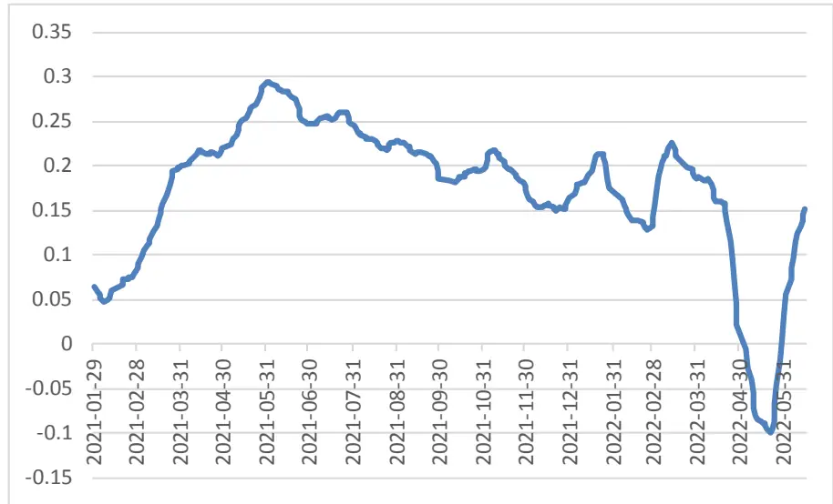
数据来源：WIND，国泰君安证券研究

## 5. 总结

本报告通过分析量化私募指增产品的超额收益走势，发现的确存在模型高度同质化的可能，这也意味着随着产品扩容，量价因子可能变为一种风格因子。

基于以上假设，我们采用机器学习的方法，分别使用三组完全不同的机器挖掘特征组，预测不同尺度下的股票收益，并针对不同股票池构建多空组合。发现各组合在样本外的表现呈现高度相似性，扣费后的回撤期与量化指增产品的超额回撤期类似，这进一步增加了量价模型存在高度同质化的可能性。

最后我们对量价模型的样本外组合进行分析，发现其在中信一级行业是未获取显著超额收益，在风格上的暴露也大都呈现周期性。

除此之外，我们发现有两点值得注意：

1. 量价模型长期在流动性因子上保持负向敞口，且在 2021 年 8 月达到极值，随后呈现周期性走势，恰恰对应了量价模型扣费后的回撤期。

2. 市值因子和动量因子的暴露情况十分接近，且均维持较大的正向暴露。经过分析我们认为市值敞口与流动性敞口的差值若处于高位，此时量价模型倾向于持有流动性差的大市值股票，存在微观交易结构恶化的可能性，模型也将会迎来超额回撤阶段。

## 6. 风险提示

本结论基于历史统计与量化模型，存在历史规律与量化模型失效的风险。

## 本公司具有中国证监会核准的证券投资咨询业务资格

## 分析师声明

作者具有中国证券业协会授予的证券投资咨询执业资格或相当的专业胜任能力，保证报告所采用的数据均来自合规渠道，分析逻辑基于作者的职业理解，本报告清晰准确地反映了作者的研究观点，力求独立、客观和公正，结论不受任何第三方的授意或影响，特此声明。

## 免责声明

本报告仅供国泰君安证券股份有限公司（以下简称“本公司”）的客户使用。本公司不会因接收人收到本报告而视其为本公司的当然客户。本报告仅在相关法律许可的情况下发放，并仅为提供信息而发放，概不构成任何广告。

本报告的信息来源于已公开的资料，本公司对该等信息的准确性、完整性或可靠性不作任何保证。本报告所载的资料、意见及推测仅反映本公司于发布本报告当日的判断，本报告所指的证券或投资标的的价格、价值及投资收入可升可跌。过往表现不应作为日后的表现依据。在不同时期，本公司可发出与本报告所载资料、意见及推测不一致的报告。本公司不保证本报告所含信息保持在最新状态。同时，本公司对本报告所含信息可在不发出通知的情形下做出修改，投资者应当自行关注相应的更新或修改。

本报告中所指的投资及服务可能不适合个别客户，不构成客户私人咨询建议。在任何情况下，本报告中的信息或所表述的意见均不构成对任何人的投资建议。在任何情况下，本公司、本公司员工或者关联机构不承诺投资者一定获利，不与投资者分享投资收益，也不对任何人因使用本报告中的任何内容所引致的任何损失负任何责任。投资者务必注意，其据此做出的任何投资决策与本公司、本公司员工或者关联机构无关。

本公司利用信息隔离墙控制内部一个或多个领域、部门或关联机构之间的信息流动。因此，投资者应注意，在法律许可的情况下，本公司及其所属关联机构可能会持有报告中提到的公司所发行的证券或期权并进行证券或期权交易，也可能为这些公司提供或者争取提供投资银行、财务顾问或者金融产品等相关服务。在法律许可的情况下，本公司的员工可能担任本报告所提到的公司的董事。

市场有风险，投资需谨慎。投资者不应将本报告作为作出投资决策的唯一参考因素，亦不应认为本报告可以取代自己的判断。
在决定投资前，如有需要，投资者务必向专业人士咨询并谨慎决策。

本报告版权仅为本公司所有，未经书面许可，任何机构和个人不得以任何形式翻版、复制、发表或引用。如征得本公司同意进行引用、刊发的，需在允许的范围内使用，并注明出处为“国泰君安证券研究”，且不得对本报告进行任何有悖原意的引用、删节和修改。

若本公司以外的其他机构（以下简称“该机构”）发送本报告，则由该机构独自为此发送行为负责。通过此途径获得本报告的投资者应自行联系该机构以要求获悉更详细信息或进而交易本报告中提及的证券。本报告不构成本公司向该机构之客户提供的投资建议，本公司、本公司员工或者关联机构亦不为该机构之客户因使用本报告或报告所载内容引起的任何损失承担任何责任。

## 评级说明

## 1.投资建议的比较标准

投资评级分为股票评级和行业评级。

以报告发布后的12个月内的市场表现为比较标准，报告发布日后的 12个月内的公司股价（或行业指数）的涨跌幅相对同期的沪深 300 指数涨跌幅为基准。

## 2.投资建议的评级标准

报告发布日后的 12 个月内的公司股价（或行业指数）的涨跌幅相对同期的沪深300 指数的涨跌幅。

|  | 评级 说明 |  |
| --- | --- | --- |
| 股票投资评级 | 增持 | 相对沪深 300 指数涨幅 15%以上 |
|  | 谨慎增持 | 相对沪深 300指数涨幅介于 5%～15%之间 |
|  | 中性 | 相对沪深 300指数涨幅介于-5%～5% |
|  | 减持 | 相对沪深 300指数下跌 5%以上 |
| 行业投资评级 | 增持 | 明显强于沪深 300 指数 |
|  | 中性 | 基本与沪深 300指数持平 |
|  | 减持 | 明显弱于沪深 300指数 |

## 国泰君安证券研究所

|  | 上海 | 深圳 | 北京 |
| --- | --- | --- | --- |
| 地址 | 上海市静安区新闸路669号博华广场 20层 | 深圳市福田区益田路 6009 号新世界 商务中心34层 | 北京市西城区金融大街甲 9号金融 街中心南楼18层 |
| 邮编 | 200041 | 518026 | 100032 |
| 电话 | (021)38676666 | (0755)23976888 | （010)83939888 |
|  | E-mail: gtjaresearch@gtjas.com |  |  |